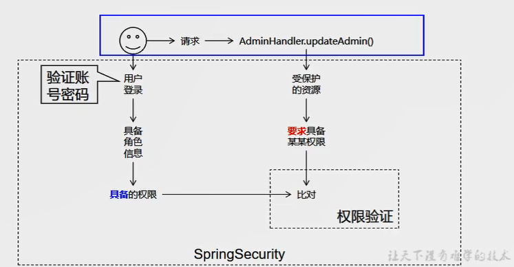

# SpringSecurity

# 概述

Spring Security是一个能够为基于Spring的企业应用系统提供声明式的安全访问控制解决方案的安全框架。它提供了一组可以在Spring应用上下文中配置的Bean，充分利用了Spring IoC，DI（控制反转Inversion of Control ,DI:Dependency Injection 依赖注入）和AOP（面向切面编程）功能，为应用系统提供声明式的安全访问控制功能，减少了为企业系统安全控制编写大量重复代码的工作。

用户登录系统时我们协助 SpringSecurity 把用户对应的角色、权限组装好，同时把各个受保护的资源所要求的权限信息设定好，剩下的“登录验证”、“权限验证”等等工作都交给 SpringSecurity。

# 原理

springsecurity底层实现为一条过滤器链，就是用户请求进来，判断有没有请求的权限，抛出异常，重定向跳转。

代码底层流程，重点看三个过滤器：

**1.FilterSecurityInterceptor**

是一个方法级的权限过滤器, 基本位于过滤链的最底部。

**2.ExceptionTranslationFilter**

是个异常过滤器，用来处理在认证授权过程中抛出的异常

**3.UsernamePasswordAuthenticationFilter** 

对/login 的 POST 请求做拦截，校验表单中用户 名，密码。

