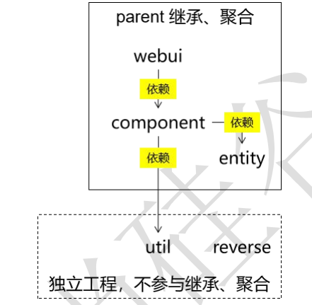
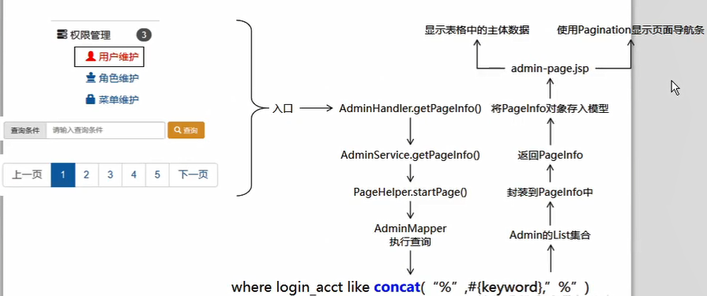

# 记一次项目完成过程

**学习目标：**

1. 从学习具体的技术到使用技术去解决业务功能需求的学习：分析需求，完成需求；
2. 体会从零到一的项目构造的完成流程；
3. 目标、代码、思路。（任务分解与分而治之，分析各个功能实现的完整流程、如何实现等）

# 11月13日：



## **1.构建项目骨架：**

项目架构如上，父工程为`atcrowdfundingweb`，再创建如上关系的三个子项目：

1. `atcrowdfunding01-admin-webui`：
2. `atcrowdfunding02-admin-component`：
3. `atcrowdfunding03-admin-entity`：

再创建以下两个独立的非继承、聚合关系的工程项目：

1. `atcrowdfunding04-common-util`：工具类项目（用来单独设置成一个独立的jar文件，方便复用）；
2. `atcrowdfunding05-common-reverse`：mybatis的逆向工程；
3. 创建好后按架构图的依赖关系为各子项目加入依赖。

复习关于Maven的继承和聚合：

- 聚合：把项目工程的各个子模块聚合在一起来进行项目构建，使用到的是pom.xml里的module标签（构建过程为：从聚合模块运行`mvn clean install`：Maven会先解析聚合模块的POM、分析要构建的模块，并计算出一个反应堆构建顺序(Reactor Build Order)，然后根据这个顺序依次构建各个模块）；
- 继承：为了简化各个项目的依赖配置，把项目共同的依赖或插件抽取出来放于一个单独的Maven项目，再通过parent标签实现引用。

## 2.建表：

**创建数据库、表：**（复习SQL语句建表、三大范式）

```mysql
create database if not exists `project_crowd` character set utf8 collate utf8_general_ci;
```

```mysql
# 管理员数据库表
create table if not exists `t_admin`(
id int not null auto_increment,
login_acct varchar(255) not null comment '登录账号',
user_pswd char(32) not null comment '登录密码',
user_name varchar(255) not null comment '昵称',
email varchar(255) not null comment '邮件地址',
create_time char(19) comment '创建时间', 
primary key(id)
)engine=innodb default charset=utf8;
```

## 3.mybatis的逆向工程：

配置好以下后在idea左侧的Maven框的该项目插件中**执行mybatis-generator**，就会得到javaben和mapper接口、mapper映射文件。

`atcrowdfunding05-common-reverse`子项目的依赖和插件：

```xml
<dependencies>
  <!-- https://mvnrepository.com/artifact/org.mybatis/mybatis -->
  <dependency>
    <groupId>org.mybatis</groupId>
    <artifactId>mybatis</artifactId>
    <version>3.5.6</version>
  </dependency>
	<!-- 插件 -->
  <!-- https://mvnrepository.com/artifact/org.mybatis.generator/mybatis-generator-maven-plugin -->
  <dependency>
    <groupId>org.mybatis.generator</groupId>
    <artifactId>mybatis-generator-maven-plugin</artifactId>
    <version>1.4.0</version>
  </dependency>
</dependencies>
<!-- 控制 Maven 在构建过程中相关配置 -->
<build>
  <finalName>atcrowdfunding05-common-reverse</finalName>
  <!-- 构建过程中用到的插件 -->
  <plugins>
  <!-- 具体插件，逆向工程的操作是以构建过程中插件形式出现的 -->
    <plugin>
        <groupId>org.mybatis.generator</groupId>
        <artifactId>mybatis-generator-maven-plugin</artifactId>
        <version>1.4.0</version>
        <!-- 插件的依赖 -->
        <dependencies>
        <!-- 逆向工程的核心依赖 -->
          <!-- https://mvnrepository.com/artifact/org.mybatis.generator/mybatis-generator-core -->
          <dependency>
            <groupId>org.mybatis.generator</groupId>
            <artifactId>mybatis-generator-core</artifactId>
            <version>1.4.0</version>
          </dependency>
          <!-- 数据库连接池 -->
          <!-- https://mvnrepository.com/artifact/com.mchange/c3p0 -->
          <dependency>
            <groupId>com.mchange</groupId>
            <artifactId>c3p0</artifactId>
            <version>0.9.5.5</version>
          </dependency>
          <!-- MySQL 驱动 -->
          <!-- https://mvnrepository.com/artifact/mysql/mysql-connector-java -->
          <dependency>
            <groupId>mysql</groupId>
            <artifactId>mysql-connector-java</artifactId>
            <version>8.0.25</version>
          </dependency>
        </dependencies>
    </plugin>
  </plugins>
</build>
```

`atcrowdfunding05-common-reverse`子项目resources路径下的的mybatis-generator-maven-plugin的配置 **generatorConfig.xml：**

```xml
<?xml version="1.0" encoding="UTF-8"?>
<!DOCTYPE generatorConfiguration
        PUBLIC "-//mybatis.org//DTD MyBatis Generator Configuration 1.0//EN"
        "http://mybatis.org/dtd/mybatis-generator-config_1_0.dtd">
<generatorConfiguration>
    <!-- mybatis-generator:generate -->
    <context id="lslTables" targetRuntime="MyBatis3">
        <commentGenerator>
            <!-- 是否去除自动生成的注释 true:是;false:否 -->
            <property name="suppressAllComments" value="true" />
        </commentGenerator>
        <!--数据库连接的信息：驱动类、连接地址、用户名、密码 -->
        <jdbcConnection
                driverClass="com.mysql.cj.jdbc.Driver" connectionURL="jdbc:mysql://localhost:3306/project_crowd" userId="root" password="123456">
        </jdbcConnection>
        <!-- 默认 false，把 JDBC DECIMAL 和 NUMERIC 类型解析为 Integer，为 true 时把
        JDBC DECIMAL
        和 NUMERIC 类型解析为 java.math.BigDecimal -->
        <javaTypeResolver>
            <property name="forceBigDecimals" value="false" />
        </javaTypeResolver>
        <!-- targetProject:生成 Entity 类的路径 -->
        <javaModelGenerator targetProject=".\src\main\java"
                            targetPackage="com.lsl.crowd.entity">
            <!-- enableSubPackages:是否让 schema 作为包的后缀 -->
            <property name="enableSubPackages" value="false" />
            <!-- 从数据库返回的值被清理前后的空格 -->
            <property name="trimStrings" value="true" />
        </javaModelGenerator>
        <!-- targetProject:XxxMapper.xml 映射文件生成的路径 -->
        <sqlMapGenerator targetProject=".\src\main\java"
                         targetPackage="com.lsl.crowd.mapper">
            <!-- enableSubPackages:是否让 schema 作为包的后缀 -->
            <property name="enableSubPackages" value="false" />
        </sqlMapGenerator>
        <!-- targetPackage：Mapper 接口生成的位置 -->
        <javaClientGenerator type="XMLMAPPER"
                             targetProject=".\src\main\java"
                             targetPackage="com.lsl.crowd.mapper">
            <!-- enableSubPackages:是否让 schema 作为包的后缀 -->
            <property name="enableSubPackages" value="false" />
        </javaClientGenerator>
        <!-- 数据库表名字和我们的 entity 类对应的映射指定 -->
        <table tableName="t_admin" domainObjectName="Admin" />
    </context>
</generatorConfiguration>
```

## 4.父工程依赖管理

目前全都尽量向最新版本靠齐，不保证有没有兼容性问题，后续出现问题再排查。

```xml
<properties>
    <lsl.spring.version>5.3.11</lsl.spring.version>
    <lsl.spring.security.version>5.5.3</lsl.spring.security.version>
    <maven.compiler.source>8</maven.compiler.source>
    <maven.compiler.target>8</maven.compiler.target>
</properties>
<dependencies>
    <!-- spring的相关依赖 -->
    <!-- https://mvnrepository.com/artifact/org.springframework/spring-orm -->
    <dependency>
        <groupId>org.springframework</groupId>
        <artifactId>spring-orm</artifactId>
        <version>${lsl.spring.version}</version>
    </dependency>
    <!-- https://mvnrepository.com/artifact/org.springframework/spring-webmvc -->
    <dependency>
        <groupId>org.springframework</groupId>
        <artifactId>spring-webmvc</artifactId>
        <version>${lsl.spring.version}</version>
    </dependency>
    <!-- https://mvnrepository.com/artifact/org.springframework/spring-test -->
    <dependency>
        <groupId>org.springframework</groupId>
        <artifactId>spring-test</artifactId>
        <version>${lsl.spring.version}</version>
        <scope>test</scope>
    </dependency>
    <!-- https://mvnrepository.com/artifact/org.aspectj/aspectjweaver -->
    <dependency>
        <groupId>org.aspectj</groupId>
        <artifactId>aspectjweaver</artifactId>
        <version>1.9.7</version>
        <scope>runtime</scope>
    </dependency>
    <!-- 自动生成动态代理的依赖包 -->
    <!-- https://mvnrepository.com/artifact/cglib/cglib -->
    <dependency>
        <groupId>cglib</groupId>
        <artifactId>cglib</artifactId>
        <version>3.3.0</version>
    </dependency>
    <!-- 数据库驱动 -->
    <!-- https://mvnrepository.com/artifact/mysql/mysql-connector-java -->
    <dependency>
        <groupId>mysql</groupId>
        <artifactId>mysql-connector-java</artifactId>
        <version>8.0.21</version>
    </dependency>
    <!-- 数据库连接池的依赖 -->
    <!-- https://mvnrepository.com/artifact/com.alibaba/druid -->
    <dependency>
        <groupId>com.alibaba</groupId>
        <artifactId>druid</artifactId>
        <version>1.2.8</version>
    </dependency>
    <!-- MyBatis的依赖 -->
    <!-- https://mvnrepository.com/artifact/org.mybatis/mybatis -->
    <dependency>
        <groupId>org.mybatis</groupId>
        <artifactId>mybatis</artifactId>
        <version>3.5.6</version>
    </dependency>
    <!-- spring与mybatis整合 -->
    <!-- https://mvnrepository.com/artifact/org.mybatis/mybatis-spring -->
    <dependency>
        <groupId>org.mybatis</groupId>
        <artifactId>mybatis-spring</artifactId>
        <version>2.0.6</version>
    </dependency>
    <!-- mybatis分页插件 -->
    <!-- https://mvnrepository.com/artifact/com.github.pagehelper/pagehelper -->
    <dependency>
        <groupId>com.github.pagehelper</groupId>
        <artifactId>pagehelper</artifactId>
        <version>5.3.0</version>
    </dependency>
    <!-- 日志：log4j -->
    <!-- https://mvnrepository.com/artifact/org.slf4j/slf4j-api -->
    <dependency>
        <groupId>org.slf4j</groupId>
        <artifactId>slf4j-api</artifactId>
        <version>1.7.32</version>
    </dependency>
    <!-- https://mvnrepository.com/artifact/ch.qos.logback/logback-classic -->
    <dependency>
        <groupId>ch.qos.logback</groupId>
        <artifactId>logback-classic</artifactId>
        <version>1.2.7</version>
        <scope>test</scope>
    </dependency>
    <!-- 其他日志框架的中间转换包 -->
    <!-- https://mvnrepository.com/artifact/org.slf4j/jcl-over-slf4j -->
    <dependency>
        <groupId>org.slf4j</groupId>
        <artifactId>jcl-over-slf4j</artifactId>
        <version>1.7.32</version>
    </dependency>
    <!-- https://mvnrepository.com/artifact/org.slf4j/jul-to-slf4j -->
    <dependency>
        <groupId>org.slf4j</groupId>
        <artifactId>jul-to-slf4j</artifactId>
        <version>1.7.32</version>
    </dependency>
    <!-- spring进行json数据转换的依赖 -->
    <!-- https://mvnrepository.com/artifact/com.fasterxml.jackson.core/jackson-core -->
    <dependency>
        <groupId>com.fasterxml.jackson.core</groupId>
        <artifactId>jackson-core</artifactId>
        <version>2.13.0</version>
    </dependency>
    <!-- https://mvnrepository.com/artifact/com.fasterxml.jackson.core/jackson-databind -->
    <dependency>
        <groupId>com.fasterxml.jackson.core</groupId>
        <artifactId>jackson-databind</artifactId>
        <version>2.13.0</version>
    </dependency>
    <!-- JSTL标签库 -->
    <!-- https://mvnrepository.com/artifact/javax.servlet.jsp.jstl/jstl -->
    <dependency>
        <groupId>jstl</groupId>
        <artifactId>jstl</artifactId>
        <version>1.2</version>
    </dependency>
    <!-- junit测试 -->
    <!-- https://mvnrepository.com/artifact/junit/junit -->
    <dependency>
        <groupId>junit</groupId>
        <artifactId>junit</artifactId>
        <version>4.13.2</version>
        <scope>test</scope>
    </dependency>
    <!-- servlet容器相关依赖 -->
    <!-- https://mvnrepository.com/artifact/javax.servlet/javax.servlet-api -->
    <dependency>
        <groupId>javax.servlet</groupId>
        <artifactId>javax.servlet-api</artifactId>
        <version>4.0.1</version>
        <scope>provided</scope>
    </dependency>
    <!-- jsp依赖 -->
    <!-- https://mvnrepository.com/artifact/javax.servlet.jsp/javax.servlet.jsp-api -->
    <dependency>
        <groupId>javax.servlet.jsp</groupId>
        <artifactId>javax.servlet.jsp-api</artifactId>
        <version>2.3.3</version>
        <scope>provided</scope>
    </dependency>
    <!-- https://mvnrepository.com/artifact/com.google.code.gson/gson -->
    <dependency>
        <groupId>com.google.code.gson</groupId>
        <artifactId>gson</artifactId>
        <version>2.8.9</version>
    </dependency>
	<!--  -->
    <!-- https://mvnrepository.com/artifact/org.springframework.security/spring-security-web -->
    <dependency>
        <groupId>org.springframework.security</groupId>
        <artifactId>spring-security-web</artifactId>
        <version>${lsl.spring.security.version}</version>
    </dependency>
    <!-- SpringSecurity 配置 -->
    <dependency>
    <groupId>org.springframework.security</groupId>
        <artifactId>spring-security-config</artifactId>
        <version>${lsl.spring.security.version}</version>
    </dependency>

    <!-- SpringSecurity 标签库 -->
    <dependency>
        <groupId>org.springframework.security</groupId>
        <artifactId>spring-security-taglibs</artifactId>
        <version>${lsl.spring.security.version}</version>
    </dependency>
</dependencies>
```

## 5.spring整合mybatis

目标：在使用mybatis的时候，直接通过工具类获取sqlSession明显会提高了耦合度，而且也不方便管理；所以通过mybatis与spring整合，把mybatis的所需要的数据源、sqlSession等都注册进IOC容器，等到要使用的时候就从IOC容器取出，从而使代码耦合度降低、维护起来更方便。（mybatis-spring 会帮助你将 MyBatis 代码无缝地整合到 Spring 中，整合spring时需要导入mybatis-spring的依赖包）

思路：理解配置项的含义，知道各个部分的作用后才能更好的进行整合和使用。

操作：

1. 依赖：因为父项目已经做好了依赖管理，所以需要在atcrowdfunding01-admin-webui只需引入相关的依赖（避免全部引入，版本号已经不用再设置），而atcrowdfunding01-admin-webui又依赖于atcrowdfunding02-admin-component，所以只需要将依赖设置放于atcrowdfunding02-admin-component就好，因为要进行单元测试，所以还需要在需要单独测试的地方引入junit、spring-test的依赖；

2. 引入通过mybatis逆向工程生成的Javabean、mapper文件和mapper接口；

3. mybatis-config.xml全局设置：配置要连接的数据库；

4. spring-persist-config.xml：使用spring，配置SqlSessionFactory、MapperScannerConfigurer；

   ```xml
   <!-- 配置SqlSessionFactory 整合mybatis -->
   <bean id="sqlSessionFactory" class="org.mybatis.spring.SqlSessionFactoryBean">
       <!-- 装配数据源 -->
       <property name="dataSource" ref="dataSource"/>
       <!-- 指定mybatis的全局配置文件 -->
       <property name="configLocation" value="classpath:mybatis-config.xml"/>
       <!-- 指定Mapper.xml配置文件的位置 -->
       <property name="mapperLocations" value="classpath:mybatis/mapper/*Mapper.xml"/>
   </bean>
   <!-- 配置MapperScannerConfigurer，扫描mapper接口所在包 -->
   <bean class="org.mybatis.spring.mapper.MapperScannerConfigurer">
       <property name="sqlSessionFactoryBeanName" value="sqlSessionFactory"/>
       <property name="basePackage" value="com.lsl.crowd.mapper"/>
   </bean>
   ```

5. 进行单元测试：

   ```java
   @RunWith(SpringJUnit4ClassRunner.class)
   @ContextConfiguration(locations = {"classpath:spring-persist-mybatis.xml"})
   public class CrowdTest {
   
       @Autowired
       private DataSource dataSource;
       @Autowired
       private AdminMapper adminMapper;
   
       @Test
       public void testInsert() {
           Admin admin = new Admin(null,"333","123456","lsl","1340952319@qq.co",null);
           int count = adminMapper.insert(admin);
           System.out.println("受到影响的参数：" + count);
       }
   
       @Test
       public void testConnection() throws SQLException {
           Connection connection = dataSource.getConnection();
           System.out.println(connection);
       }
   
   }
   ```

# 11月14日：

## 1.构建日志系统：

spring5版本，使用slf4j和logback不再需要排除spring默认的日志系统，直接导入包并在类路径设置好配置文件logback.xml即可。

```xml
<?xml version="1.0" encoding="UTF-8"?>
<configuration debug="true">
    <!-- 指定日志输出的位置 这里是输出到控制台 -->
    <appender name="STDOUT" class="ch.qos.logback.core.ConsoleAppender">
        <encoder>
            <!-- 日志输出的格式 -->
            <!-- 按照顺序分别是：时间、日志级别、线程名称、打印日志的类、日志主体
            内容、换行 -->
            <pattern>[%d{HH:mm:ss.SSS}] [%-5level] [%thread] [%logger]
                [%msg]%n</pattern>
        </encoder>
    </appender>
    <!-- 设置全局日志级别。日志级别按顺序分别是：DEBUG、INFO、WARN、ERROR -->
    <!-- 指定任何一个日志级别都只打印当前级别和后面级别的日志。 -->
    <root level="INFO">
        <!-- 指定打印日志的 appender，这里通过“STDOUT”引用了前面配置的 appender -->
        <appender-ref ref="STDOUT" />
    </root>
    <!-- 根据特殊需求指定局部日志级别 -->
    <logger name="com.lsl.crowd.mapper" level="DEBUG"/>
</configuration>
```

## 2.事务设置

目标：（从事务角度）一个事务方法中包含的多个数据库操作，要么一起提交、要么一起回滚。也就是说事务方法中的多个数据库操作，有任何一个失败，整个事务全部回滚。 从声明式角度：由 Spring 来全面接管数据库事务，用声明式代替编程式。

思路：使用spring的aop，前置通知（事务开启）、返回通知（事务提交）、异常通知（事务回滚）、后置通知（事务关闭）。

代码实现：spring-persist-tx.xml

```xml
<?xml version="1.0" encoding="UTF-8"?>
<beans xmlns="http://www.springframework.org/schema/beans"
       xmlns:xsi="http://www.w3.org/2001/XMLSchema-instance"
       xmlns:context="http://www.springframework.org/schema/context"
       xmlns:aop="http://www.springframework.org/schema/aop"
       xmlns:tx="http://www.springframework.org/schema/tx"
       xsi:schemaLocation="http://www.springframework.org/schema/beans
    http://www.springframework.org/schema/beans/spring-beans.xsd
    http://www.springframework.org/schema/context
    http://www.springframework.org/schema/context/spring-context.xsd
    http://www.springframework.org/schema/aop
    http://www.springframework.org/schema/aop/spring-aop.xsd
    http://www.springframework.org/schema/tx
    http://www.springframework.org/schema/tx/spring-tx.xsd">
    <!-- spring事务管理器的配置 -->
    <!-- 扫描软件包，使注解生效 -->
    <context:component-scan base-package="com.lsl.crowd.service"/>
    <!-- 配置事务管理器 -->
    <bean id="txManager" class="org.springframework.jdbc.datasource.DataSourceTransactionManager">
        <!-- 装配数据源，运行时就能从ioc容器拿到了 -->
        <property name="dataSource" ref="dataSource"/>
    </bean>
    <!-- 配置事务切面 -->
    <aop:config>
        <aop:pointcut id="txPointcut" expression="execution(* *..*ServiceImpl.*(..))"/>
        <!-- 将切点表达式和事务通知关联 -->
        <aop:advisor advice-ref="txAdvice" pointcut-ref="txPointcut"/>
    </aop:config>
    <!-- 配置事务通知 -->
    <tx:advice id="txAdvice" transaction-manager="txManager">
        <!-- 配置事务属性 -->
        <tx:attributes>
            <!-- 查询方法：配置只读属性，让数据库知道这是一个查询操作，能够进行一定优化 -->
            <tx:method name="get*" read-only="true"/>
            <tx:method name="find*" read-only="true"/>
            <tx:method name="query*" read-only="true"/>
            <tx:method name="count*" read-only="true"/>
            <!-- 增删改方法：配置事务传播行为、回滚异常 -->
            <!--propagation="REQUIRED" ：
            REQUIRED，默认值，表示当前方法必须工作在事务中，如果当前线程没有已经开启的事务则自己开启；如果有则使用已有的
            REQUIRES_NEW：建议使用的值，不管当前线程是否有事务，都要自己开事务并在自己的事务中执行，不会受到其他事务的影响
            -->
            <!--rollback-for：配置事务方法针对什么样的异常就回滚
            默认：运行时异常回滚
            建议：运行时异常、编译时异常都回滚
            -->
            <!-- tx:method是必须要配置的，如果某个方法没有配置对应的tx:method，则事务对这个方法不生效 -->
            <tx:method name="save*" propagation="REQUIRES_NEW" rollback-for="java.lang.Exception"/>
            <tx:method name="update*" propagation="REQUIRES_NEW" rollback-for="java.lang.Exception"/>
            <tx:method name="remove*" propagation="REQUIRES_NEW" rollback-for="java.lang.Exception"/>
            <tx:method name="batch*" propagation="REQUIRES_NEW" rollback-for="java.lang.Exception"/>
        </tx:attributes>
    </tx:advice>
</beans>
```

测试：

复习：spring事务、spring AOP


## 3.整合springmvc

Tomcat中加载spring容器、springmvc容器、监听器、过滤器、中央调度器；springmvc全局配置文件配置视图解析器、开启json驱动、解决驱动冲突问题。

复习内容：复习springmvc整合流程和各个整合操作的目的，复习springmvc的整个执行流程，复习springmvc各个组件的作用。

## 4.base标签：基准路径

前端页面请求路径：

```html
<base href="http://${pageContext.request.serverName}:${pageContext.request.serverPort}${pageContext.request.contextPath}/">
```

- 端口号前的冒号不能省略；
- `${pageContext.request.contextPath}`前不能加`/`，后面必须加`/`；
- 页面上所有参考base标签的标签都得放在base标签后面；
- 参考base标签的路径不能以`/开头`。

# 11月16日：

## 1.Ajax请求设置


复习Ajax、jQuery的使用。

## 2.异常处理

目标：使用异常映射机制将整个项目的异常和错误提示进行统一的管理。

思路：

代码：基于XML的实现：在springmvc的全局配置文件中配置

```xml
<!-- 基于XML的异常映射 -->
<bean id="simpleMappingExceptionResolver" class="org.springframework.web.servlet.handler.SimpleMappingExceptionResolver">
    <!-- 配置异常类型和具体视图之间的关系 -->
    <property name="exceptionMappings">
        <props>
            <!-- key属性指定异常全类名 -->
            <!-- 标签体写对应的视图（） -->
            <prop key="java.lang.Exception">system-error</prop>
        </props>
    </property>
</bean>
```

判断请求是否是Ajax请求的工具类：

```java
public class CrowdUtil {
    /**
     * 判断当前请求是否为Ajax请求
     * @param request 请求对象
     * @return
     *      true：是Ajax请求
     *      false：不是Ajax请求
     * */
    public static boolean judgeRequestType(HttpServletRequest request) {
        // 获取请求消息头
        String acceptHeader = request.getHeader("Accept");
        String xRequestHeader = request.getHeader("X-Request-With");
        // 判断
        return  ((acceptHeader !=null && acceptHeader.contains("application/json"))
                ||
                (xRequestHeader != null && xRequestHeader.equals("XMLHttpRequest")));
    }
}
```

基于注解来处理异常：

```java
@ControllerAdvice
public class CrowdExceptionResolver {

    @ExceptionHandler(value = ArithmeticException.class)
    public ModelAndView resolveMathException(ArithmeticException exception, HttpServletRequest request, HttpServletResponse response) throws IOException {
        String viewName = "system-error";
        return commonResolve(viewName,exception,request,response);
    }

    @ExceptionHandler(value = NullPointerException.class)
    // 实际捕获对象与当前请求对象
    public ModelAndView resolveNullPointerException(NullPointerException exception, HttpServletRequest request, HttpServletResponse response) throws IOException {
        /*// 1.判断
        boolean judgeRequest = CrowdUtil.judgeRequestType(request);
        // 2.如果是Ajax请求
        if (judgeRequest) {
            // 创建对象
            ResultEntity<Object> resultEntity = ResultEntity.failed(exception.getMessage());
            // 4.创建Gson
            Gson gson = new Gson();
            // 5.将resultEntity转换为json字符串
            String json = gson.toJson(resultEntity);
            response.getWriter().write(json);
            return null;
        }
        ModelAndView modelAndView = new ModelAndView();
        modelAndView.addObject("exception",exception);
        modelAndView.setViewName("system-error");
        return modelAndView;*/
        String viewName = "system-error";
        return commonResolve(viewName,exception,request,response);
    }
    private ModelAndView commonResolve(String viewName,Exception exception,HttpServletRequest request,HttpServletResponse response) throws IOException {
        // 1.判断
        boolean judgeRequest = CrowdUtil.judgeRequestType(request);
        // 2.如果是Ajax请求
        if (judgeRequest) {
            // 创建对象
            ResultEntity<Object> resultEntity = ResultEntity.failed(exception.getMessage());
            // 4.创建Gson
            Gson gson = new Gson();
            // 5.将resultEntity转换为json字符串
            String json = gson.toJson(resultEntity);
            response.getWriter().write(json);
            return null;
        }
        ModelAndView modelAndView = new ModelAndView();
        modelAndView.addObject(CrowdConstant.ATTR_NAME_EXCEPTION,exception);
        modelAndView.setViewName(viewName);
        return modelAndView;
    }
}
```

## 3.创建常量类、管理员登陆页面的跳转

页面跳转试在springmvc配置文件中配置：

```xml
<!-- 直接把请求地址和视图联系起来 不用写handler方法  -->
<mvc:view-controller path="/admin/do/login/page.html" view-name="admin-login"/>
```

## 4.引入layer，system-error页面修饰

# 11月20日：

## 1.重定向到主页面与退出功能

目标：后台页面与退出

思路：登录成功后重定向至后台主页面，为了防止刷新页面再次造成表单提交就使用重定向，而重定向是不会经过视图解析器解析地址的，所以要重定向至一个springmvc的处理器方法，再跳转到指定的页面；退出功能使session失效就好。

复习：重定向、转发、session

代码：

```java
return "redirect:/admin/do/main.html"; // 重定向
<mvc:view-controller path="/admin/do/main.html" view-name="admin-main"/> // 地址与视图绑定
```

```java
/* 登出页面 */
@RequestMapping(value = "/admin/do/logout.html")
public String logout(HttpSession session) {
    // 会话失效
    session.invalidate();
    return "admin-login";
}
```

## 2.页面重复代码抽取

jsp页面重复代码抽取，引入方式：

```jsp
<%@include file="/WEB-INF/include-head.jsp"%>
```

## 3.登录状态检测

目标：有些资源需要登录后台才能访问的，有一些不需要登录后台就能访问的（公共资源）；

思路：设置拦截器进行登录验证后资源放行，放行一些受保护的资源；

代码：1.创建拦截器类 2.注册拦截器类 

```java
public class LoginInterceptor implements HandlerInterceptor {
    /* controller前 */
    @Override
    public boolean preHandle(HttpServletRequest request, HttpServletResponse response, Object handler) throws Exception {
        // 拦截逻辑：什么情况下拦截（拦截哪些在拦截器注册时的配置决定），什么情况下放行
        // 获取当前session
        HttpSession session = request.getSession();
        // 从当前session域获取admin对象
        Admin loginUser = (Admin) session.getAttribute(CrowdConstant.ATTR_NAME_LOGIN_ADMIN);
        if (loginUser == null) {
            throw new AccessForbiddenException(CrowdConstant.MESSAGE_ACCESS_FORBIDDEN);
        }
        // 登录了就放行受保护的资源
        return true;
    }
}
```

```xml
<!-- 注册拦截器 -->
<mvc:interceptors>
    <mvc:interceptor>
        <!-- 要拦截的资源 /** 表示/aa/bb /aa aa//bb/bbb都会被拦截 /*表示/a /b之类的就会被拦截，对应一层路径 -->
        <mvc:mapping path="/**"/>
        <!-- 不拦截的资源 -->
        <mvc:exclude-mapping path="/admin/do/login/page.html"/>
        <mvc:exclude-mapping path="/admin/do/login.html"/>
        <mvc:exclude-mapping path="/admin/do/logout.html"/>
        <!-- 配置拦截器类 -->
        <bean class="com.lsl.crowd.mvc.interceptor.LoginInterceptor"/>
    </mvc:interceptor>
</mvc:interceptors>
```

## 4.分页显示数据

目标：将数据库中的用户数据在页面上以分页的形式展示，后端中将“带关键字”和“不带关键字”的分页合并为同一套代码

思路：



代码：

1.引入PageHelper（需要pagehelper的依赖）：

pagehelper使用文档：[Mybatis-PageHelper/HowToUse.md at master · pagehelper/Mybatis-PageHelper (github.com)](https://github.com/pagehelper/Mybatis-PageHelper/blob/master/wikis/zh/HowToUse.md)

在SqlSessionFactory中配置插件：

```xml
<!-- 配置SqlSessionFactory 整合mybatis -->
<bean id="sqlSessionFactory" class="org.mybatis.spring.SqlSessionFactoryBean">
    <!-- 装配数据源 -->
    <property name="dataSource" ref="dataSource"/>
    <!-- 指定mybatis的全局配置文件 -->
    <property name="configLocation" value="classpath:mybatis-config.xml"/>
    <!-- 指定Mapper.xml配置文件的位置 -->
    <property name="mapperLocations" value="classpath:mybatis/mapper/*Mapper.xml"/>

    <property name="plugins">
        <array>
            <bean class="com.github.pagehelper.PageInterceptor">
                <property name="properties">
                    <props>
                        <!-- 配置页码的合理化修正 在1~总页数之间修正页码 -->
                        <prop key="reasonable">true</prop>
                    </props>
                </property>
            </bean>
        </array>
    </property>
</bean>
```

2.分页实现

```xml
<!-- SQL语句编写 -->
<select id="selectAdminByKeyword" resultMap="BaseResultMap">
  select id,login_acct,user_pswd,user_name,email,create_time
  from t_admin
  where login_acct like concat('%',#{keyword},'%') or
        user_name like concat('%',#{keyword},'%') or
        email like concat('%',#{keyword},'%')
</select>
```

```java
// dao接口 SQL映射方法声明
List<Admin> selectAdminByKeyword(String keyword);
```

```java
// service接口 分页功能声明 
PageInfo<Admin> getPageInfo(String keyword, Integer pageNum, Integer pageSize);
```

```java
// service实现类 具体功能实现
public PageInfo<Admin> getPageInfo(String keyword, Integer pageNum, Integer pageSize) {
    /* 1.调用pagehelper的静态方法开启分页功能 */
    PageHelper.startPage(pageNum,pageSize);
    /* 2.执行查询 */
    List<Admin> adminList = adminMapper.selectAdminByKeyword(keyword);
    /* 3.封装到pageinfo对象 */

    return new PageInfo<>(adminList);
}
```

```java
/* 用户信息查询展示页面 分页 */
public String getPageInfo(@RequestParam(value = "keyword",defaultValue = "") String keyword,
                          @RequestParam(value = "pageNum",defaultValue = "1") Integer pageNum,
                          @RequestParam(value = "pageSize",defaultValue = "5") Integer pageSize,
                          ModelMap modelMap
                          ){
    // 调用service方法获取
    PageInfo<Admin> pageInfo = adminService.getPageInfo(keyword, pageNum, pageSize);
    modelMap.addAttribute(CrowdConstant.ATTR_NAME_PAGE_INFO,pageInfo);
    return "admin-page";
}
```

3.分页导航条

导入css和js文件：

```jsp
<link rel="stylesheet" href="css/pagination.css">
<script type="text/javascript" src="jquery/jquery.pagination.js"></script>
```

导航条位置：

```jsp
<div id="Pagination" class="pagination">

</div>
```

js生成导航条：

```jsp
<script type="text/javascript">
    $(function(){
    // 调用专门的函数初始化分页导航条
        initPagination();
    });
    // 声明一个函数用于初始化 Pagination
    function initPagination() {
        // 获取分页数据中的总记录数
        var totalRecord = ${requestScope.pageInfo.total};
        // 声明 Pagination 设置属性的 JSON 对象
        var properties = {
            num_edge_entries: 3, // 边缘页数
            num_display_entries: 5, // 主体页数
            callback: pageSelectCallback, // 用户点击“翻页”按钮之后执行翻页操作的回调函数
            current_page: ${requestScope.pageInfo.pageNum-1}, // 当前页，pageNum 从 1 开始，必须-1 后才可以赋值
            prev_text: "上一页",
            next_text: "下一页",
            items_per_page:${requestScope.pageInfo.pageSize} // 每页显示 1 项
        };
        // 调用分页导航条对应的 jQuery 对象的 pagination()方法生成导航条
        $("#Pagination").pagination(totalRecord, properties);
    }
    // 翻页过程中执行的回调函数
    // 点击“上一页”、“下一页”或“数字页码”都会触发翻页动作，从而导致当前函数被调用
    // pageIndex 是用户在页面上点击的页码数值
    function pageSelectCallback(pageIndex, jQuery) {
    // pageIndex 是当前页页码的索引，相对于 pageNum 来说，pageIndex 比 pageNum 小 1
        var pageNum = pageIndex + 1;
    // 执行页面跳转也就是实现“翻页” http://localhost:8083/atcrowd/admin/get/page.html
        window.location.href = "admin/get/page.html?pageNum="+pageNum+"&keyword=${param.keyword}";
    // 取消当前超链接的默认行为
        return false;
    }
</script>
```

修改jquery.pagination.js文件，文件末尾处：

```js
// 所有初始化完成，绘制链接
drawLinks();
      // 回调函数
      // opts.callback(current_page, this);
```

## 5.单条删除

目标：实现删除单条用户数据的功能，点击删除按钮后删除数据并显示剩余数据

思路：按钮使用超链接来指向一个controller方法来实现删除，删除时使用带参数的链接，传入的参数用来完成删除指令、重定向回当前页面

代码：

1.超链接

```jsp
<a class="btn btn-danger btn-xs" href="admin/remove/${admin.id}/${requestScope.pageInfo.pageNum}/${param.keyword}.html"><i class=" glyphicon glyphicon-remove"></i></a>
```

2.处理器方法

```java
/* 删除单条用户 admin/remove/${admin.id}/${requestScope.pageInfo.pageNum}/${param.keyword}.html*/
@RequestMapping(value = "/admin/remove/{adminId}/{pageNum}/{keyword}.html")
public String deleteAdmin(@PathVariable(name = "adminId") Integer adminId,
                          @PathVariable(name = "pageNum") Integer pageNum,
                          @PathVariable(name = "keyword") String keyword
                          ){
   adminService.deleteById(adminId); // 根据id删除数据

    return "redirect:/admin/get/page.html?pageNum="+pageNum+"&keyword="+keyword;
}
```

3.SQL语句的dao、service处理

# 11月21日：

## 1.新增管理员账户

1.给表添加唯一性约束：先添加唯一性索引（设login_acct为唯一性索引），再`ALTER TABLE project_crowd.t_admin ADD UNIQUE INDEX(`login_acct`);`；

2.页面链接处理

3.前端控制器映射路径

4.service实现

5.异常处理，DuplicateKeyException，主键约束引起的异常

## 2.更新管理员账户

目标：只更新用户的账户、昵称、邮箱地址

思路：点击修改按钮（超链接）通过处理器方法进入修改页面，修改页面的确认按钮再通过一个处理器方法进行值的更新，更新时注意账户的唯一性约束的异常

代码：

# 11月22日：

## 1.RBAC模型

权限控制：“权力”+“限制”，目标就是管理用户行为，保护系统功能。如何进行权力控制？创建资源、权限、角色、用户之间的关联来控制用户对资源的行为。

RBAC（Role-Based Access Control），即基于角色的权限控制。通过角色关联用户，角色关联权限的方式间接赋予用户权限。

RBAC模型可以分为：RBAC0、RBAC1、RBAC2、RBAC3 四种，RBAC0是最简单的，相当于底层逻辑，RBAC1、RBAC2、RBAC3都是以RBAC0为基础的升级。

- RBAC0模型又分为两种：
  1. 用户和角色是多对一关系，即：一个用户只充当一种角色，一种角色可以有多个用户担当。
  2. 用户和角色是多对多关系，即：一个用户可同时充当多种角色，一种角色可以有多个用户担当。
- RBAC1：相对于RBAC0模型，增加了子角色，引入了继承概念，即子角色可以继承父角色的所有权限。
- RBAC2：基于RBAC0模型，增加了对角色的一些限制：角色互斥、基数约束、先决条件角色等。
  1. **角色互斥：**同一用户不能分配到一组互斥角色集合中的多个角色，互斥角色是指权限互相制约的两个角色。案例：财务系统中一个用户不能同时被指派给会计角色和审计员角色。
  2. **基数约束：**一个角色被分配的用户数量受限，它指的是有多少用户能拥有这个角色。例如：一个角色专门为公司CEO创建的，那这个角色的数量是有限的。
  3. **先决条件角色：**指要想获得较高的权限，要首先拥有低一级的权限。例如：先有副总经理权限，才能有总经理权限。
  4. **运行时互斥：**例如，允许一个用户具有两个角色的成员资格，但在运行中不可同时激活这两个角色。
- RBAC3 ：称为统一模型，它包含了RBAC1和RBAC2，利用传递性，也把RBAC0包括在内，综合了RBAC0、RBAC1和RBAC2的所有特点。

# 11月24日：

## 1.角色维护页面功能


转去用thymeleaf了。


