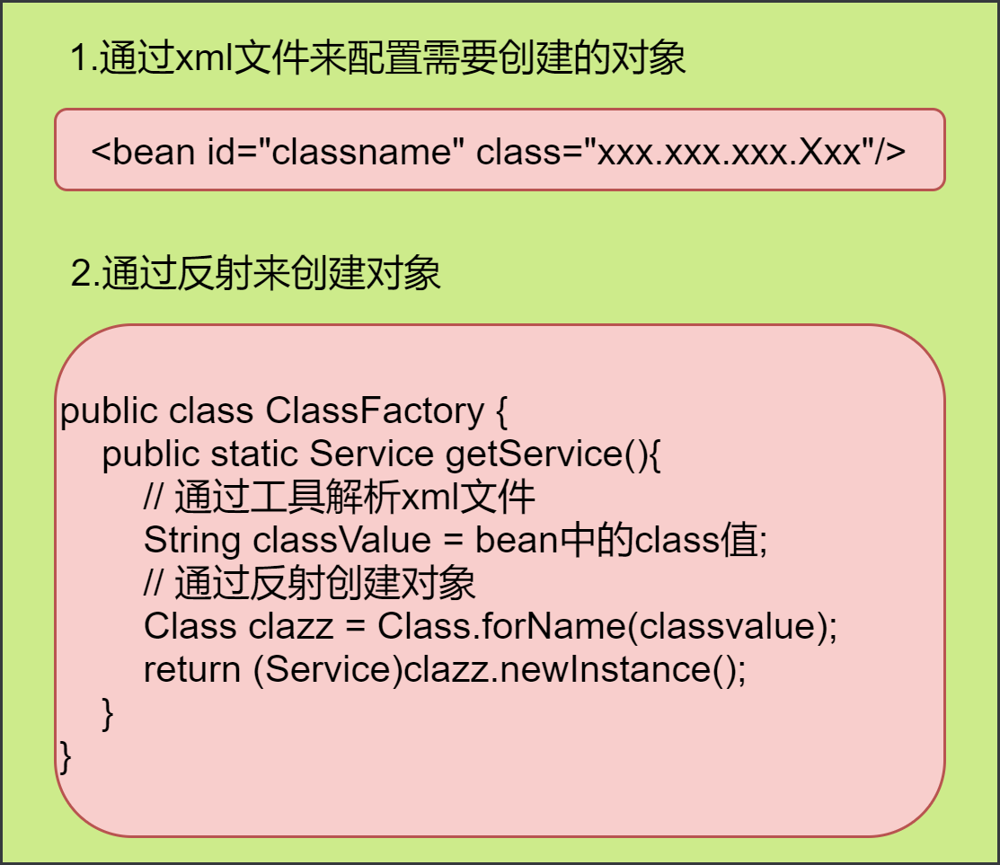
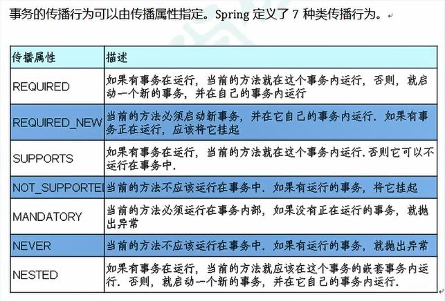
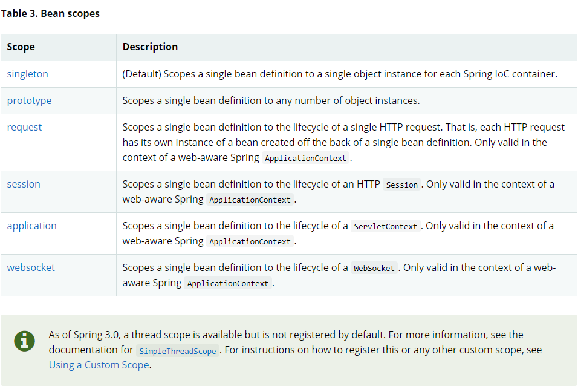

# spring的配置

使用spring需要导包，导入spring-webmvc的包，由于maven的特性会帮忙把spring-webmvc的所有依赖到的包都导入，其中就包括了spring-core，也就是spring的核心包：

```xml
<!-- https://mvnrepository.com/artifact/org.springframework/spring-webmvc -->
<dependency>
    <groupId>org.springframework</groupId>
    <artifactId>spring-webmvc</artifactId>
    <version>5.3.7</version>
</dependency>
<!-- 使用AOP时需要导入的包 -->
<!-- AspectJ 运行时包和织入包 -->
<dependency>
	<groupId>org.aspectj</groupId>
	<artifactId>aspectjrt</artifactId>
	<version>1.9.6</version>
</dependency>
<dependency>
	<groupId>org.aspectj</groupId>
	<artifactId>aspectjweaver</artifactId>
	<version>1.9.6</version>
</dependency>
<!-- Cglib包是用来动态代理用的,基于类的代理 -->
<dependency>
	<groupId>cglib</groupId>
	<artifactId>cglib</artifactId>
	<version>2.1</version>
</dependency>
```

maven仓库：[Maven Repository: spring (mvnrepository.com)](https://mvnrepository.com/tags/spring)。

resources文件夹需要beans.xml等文件，xml约束如下：

```xml
<!-- spring用于创建对象的配置文件，基本约束 -->
<?xml version="1.0" encoding="UTF-8"?>
<beans xmlns="http://www.springframework.org/schema/beans"
       xmlns:xsi="http://www.w3.org/2001/XMLSchema-instance"
       xsi:schemaLocation="http://www.springframework.org/schema/beans
        https://www.springframework.org/schema/beans/spring-beans.xsd">

</beans>
```

```xml
<!-- 使用p、c命名空间时 -->
<?xml version="1.0" encoding="UTF-8"?>
<beans xmlns="http://www.springframework.org/schema/beans"
       xmlns:xsi="http://www.w3.org/2001/XMLSchema-instance"
       xmlns:p="http://www.springframework.org/schema/p"
       xmlns:c="http://www.springframework.org/schema/c"
       xsi:schemaLocation="http://www.springframework.org/schema/beans
        https://www.springframework.org/schema/beans/spring-beans.xsd">
    
    <!--p命名空间注入：可直接注入属性；p：property-->
    <bean id="user" class="com.lsl.pojo.User" p:name="梁胜林" p:id="10010"/>
    <!--c命名空间注入：通过有参构造器注入；c：constructor-arg-->
    <bean id="user2" class="com.lsl.pojo.User" c:id="12" c:name="lsl" scope="prototype"/>
</beans>
```


其他情况下文件头需要添加的内容：

```xml
<!-- 使用注解时 -->
<?xml version="1.0" encoding="UTF-8"?>
<beans xmlns="http://www.springframework.org/schema/beans"
       xmlns:xsi="http://www.w3.org/2001/XMLSchema-instance"
       xmlns:context="http://www.springframework.org/schema/context"
       xsi:schemaLocation="http://www.springframework.org/schema/beans
        https://www.springframework.org/schema/beans/spring-beans.xsd
        http://www.springframework.org/schema/context
        https://www.springframework.org/schema/context/spring-context.xsd">

     <!-- 扫描包使注解生效，注解生效时默认bean的id为注册进Spring的类的类名小写(多个单词组合时是驼峰形式)，
	如果要标识bean的id为其他，可在@Component("")设置 -->
    <context:component-scan base-package="com.lsl.pojo"/>
    <!-- 开启注解支持 -->
    <context:annotation-config/> 

</beans>
```

```xml
<!-- 面向切面 -->
<?xml version="1.0" encoding="UTF-8"?>
<beans xmlns="http://www.springframework.org/schema/beans"
       xmlns:xsi="http://www.w3.org/2001/XMLSchema-instance"
       xmlns:aop="http://www.springframework.org/schema/aop"
       xsi:schemaLocation="http://www.springframework.org/schema/beans
        https://www.springframework.org/schema/beans/spring-beans.xsd
        http://www.springframework.org/schema/aop
        https://www.springframework.org/schema/aop/spring-aop.xsd">
</beans>
```

引入全部约束：

```xml
<?xml version="1.0" encoding="UTF-8"?>
<beans xmlns="http://www.springframework.org/schema/beans"
    xmlns:xsi="http://www.w3.org/2001/XMLSchema-instance"
    xmlns:context="http://www.springframework.org/schema/context"
    xmlns:aop="http://www.springframework.org/schema/aop"
    xmlns:tx="http://www.springframework.org/schema/tx"
    xsi:schemaLocation="http://www.springframework.org/schema/beans 
    http://www.springframework.org/schema/beans/spring-beans.xsd
    http://www.springframework.org/schema/context
    http://www.springframework.org/schema/context/spring-context.xsd
    http://www.springframework.org/schema/aop
    http://www.springframework.org/schema/aop/spring-aop.xsd
    http://www.springframework.org/schema/tx
    http://www.springframework.org/schema/tx/spring-tx.xsd">
</beans>

```

约束简要说明：

```xml
<?xml version="1.0" encoding="UTF-8"?>
<beans 
    //---基础IOC的约束，必备
    xmlns="http://www.springframework.org/schema/beans"
    xmlns:xsi="http://www.w3.org/2001/XMLSchema-instance" 
    //---开启注解管理Bean对象的约束
    xmlns:context="http://www.springframework.org/schema/context"
	//---aop的注解约束
    xmlns:aop="http://www.springframework.org/schema/aop"
    //---事务的约束
    xmlns:tx="http://www.springframework.org/schema/tx"
    //---基础IOC的约束，必备
    xsi:schemaLocation="http://www.springframework.org/schema/beans 
    http://www.springframework.org/schema/beans/spring-beans.xsd
    
    http://www.springframework.org/schema/context
    //---开启注解管理Bean对象的约束
    http://www.springframework.org/schema/context/spring-context.xsd
    //---aop的注解约束
    http://www.springframework.org/schema/aop
    http://www.springframework.org/schema/aop/spring-aop.xsd
    //---事务的约束
    http://www.springframework.org/schema/tx
    http://www.springframework.org/schema/tx/spring-tx.xsd">
    
</beans>

```


# Spring概述

IOC（Inversion of Control，即“控制反转”，不是什么技术，而是一种设计思想）、AOP(aspect-oriented programming，面向切面编程)、SpringMVC ===> 衍生项目。

为简化JavaEE应用程序的开发为目的而创建了Spring框架。

|                  |                                    |
| :--------------: | :--------------------------------: |
|  企业级JavaBean  |    Enterprise Java Bean （EJB）    |
|   Java数据对象   |      Java Data Object（JDO）       |
| 简单老式Java对象 |   Plain Old Java object（POJO）    |
|     依赖注入     |     Dependency Injection（DI）     |
|   面向切面编程   | Aspect-Oriented Programming（AOP） |
|     控制反转     |        Inversion of Control        |

Spring是什么？

2002年，Spring雏形interface21发布，在interface21的基础上经过重新设计，并不断丰富内涵，于2004年3月24号Spring发布1.0版本，其创始人是Rod  Johnson。Spring是一个为了全方位地简化Java开发而创建的开源框架，是一个轻量级的控制反转和面向切面编程的框架；其为了简化Java开发采取了以下四种策略：

- 基于POJO的轻量级和最小侵入式编程；
- 通过依赖注入和面向接口实现松耦合；
- 基于切面和惯例进行声明式编程；
- 通过切面和模板减少样板代码。

Spring优缺点？

Spring优点：开源免费的框架(容器)、轻量级非入侵式的框架、控制反转IOC、面向切面编程aop，支持事务的处理和对框架的整合的支持;缺点：发展太久之后违背了原来的理念，其整合了许多框架，就像一个大杂烩一样；配置十分繁琐，人称“配置地狱”。

Spring相关

官方文档：[Core Technologies (spring.io)](https://docs.spring.io/spring-framework/docs/current/reference/html/core.html)；

GitHub：[Releases · spring-projects/spring-framework (github.com)](https://github.com/spring-projects/spring-framework/releases)。

SSH框架：Struct2 + Spring + Hibernate(全自动)；SSM框架：SpringMVC + Spring + Mybatic(半自动)。

 Spring框架的组成：


关于Spring的拓展：

- Spring Boot：一个快速开发的脚手架，基于Spring Boot可以快速的开发单个微服务，原则是约定大于配置。
- Spring Cloud：基于Spring Boot实现的。

【大多数公司使用SpringBoot进行快速开发，学习SpringBoot前要完全掌握Spring及SpringMVC！】

# ~~理解IOC理论~~

## IOC理论推导

【dao层(Data Access Object)，专门用来封装我们对于实体类的数据库的访问，就是增删改查，不加业务逻辑】

## 理解IoC：

dao层：

```java
public interface UserDao {
    void getUser();
}
```

```java
public class UserDaoImpl implements UserDao{
    public void getUser() {
        System.out.println("获取用户信息！");
    }
}
```

```java
public class UserDaoMysql implements UserDao{
    public void getUser() {
        System.out.println("MySql获取用户数据！");
    }
}
```

```java
public class UserDaoOracleImpl implements UserDao{
    public void getUser() {
        System.out.println("Oracle获取用户数据！");
    }
}
```

service层：

```java
public interface UserService {
    void getUser();
}
```

```java
public class UserServiceImpl implements UserService{
    private UserDao userDao;
    public void setUserDao(UserDao userDao){
        this.userDao = userDao;
    }
    public void getUser() {
        userDao.getUser();
    }

//    private UserDao userDao= new UserDaoImpl();
//    public void getUser(){
//        userDao.getUser();
//    }
}
调用dao层的数据，调用的方法就是创建所要调用的实现类的对象，通过对象调用实现类的方法来达到目的
```

简单的控制反转模型：

如上，按原始的方式是在service的实现类（UserServiceImpl）里创建dao层实现类的对象，再通过调用该对象的方法来实现对数据的访问，此时如果想要再次调用其他的实现类该怎么办呢？那就得在UserServiceImpl里修改代码来创建dao层中其他实现类的对象来实现调用（这时就体现了一个问题，想要调用dao层，就必须要我们程序员去修改代码）；

如果在UserServiceImpl中设置了set的方法来通过外部注入一个dao层接口的实现类的对象，此时访问dao层中的其他的实现类，不需要我们修改service层中的代码，我们也可以实现访问目的了。

在test层中测试：

- 原始的方式中：在UserServiceImpl中创建dao层实现类的对象并调用方法，如果要访问其他的则需要回到service层修改实现类内容；
- set方法方式中：通过调用set方法注入dao层中实现类的对象，再调用get方法，如果要访问dao层中其他的实现类则只需要修改注入的对象即可（此时不需要修改service层中的实现类内容）；

从上面可以看出：

- 原始方式中，交由程序主动创建对象(即service层中主动创建的dao层实现类的对象)，控制权在程序员手上。
- 使用set注入之后，service层程序中不用主动创建dao层中实现类的对象，而是被动接收对象，该程序变成了被动的接收对象。

由此可以看出，使用set注入之后，我们就能自行地控制对象的创建，主动权到了调用者的手上，service层程序呢不用管对象是怎么创建的，它只负责提供一个接口。

上述就是一个IOC的原型；控制反转的思想，从本质上解决了问题，我们程序员不用再去管理对象的创建(程序中不需要实现类的对象创建)，系统的耦合性也大大降低了，可以更加的专注在业务的实现上！

IoC本质：一种设计思想，DI是实现IoC的一种方式。没有IoC的程序，我们使用面向对象编程，对象的创建与对象的依赖关系完全硬编码在程序中，对象的创建由程序自己控制，控制反转后将对象的创建转移给第三方。（依赖对象的获取由程序创建的方式反转到了由第三方（IoC容器）创建的方式）。

## Spring与IoC：

IoC是Spring框架的核心内容，Spring使用了多种方式完美的实现了IoC，可以使用XML配置，也可以使用注解，新版本的Spring也可以零配置实现IoC。

实现过程：Sprin容器（也称为IoC容器）在初始化时先读取配置文件，根据配置文件或元数据创建组织对象存入容器中，程序使用时再从IoC容器中取出需要的对象。

零配置原理：采用XML方式配置Bean的时候，Bean的定义信息是和实现分离的，而采用注解的方式可以把两者合为一体，Bean的定义信息直接以注解的形式定义在实现类中，从而达到了零配置的目的。

IoC定义：控制反转是一种通过描述（XML或注解）、并通过第三方去生产或获取特定对象的方式。在Spring中实现控制反转的是IoC容器，其实现策略是依赖注入(Depengency Injection,DI)

## HelloSpring

再通过一个简单老式的Java程序理解spring中的控制反转，使用spring需要先配置好相关的配置。

```java
public class HelloSpring {
    private String str;
    public String getStr() {
        return str;
    }
    public void setStr(String str) {
        this.str = str;
    }
    @Override
    public String toString() {
        return "Hello{" + "str='" + str + '\'' + '}';
    }
}
```

该过程中IoC的体现：

- 对象由Spring创建，对象的属性也由Spring设置；
- 控制：谁来控制对象的创建：POJO中是程序本身控制创建，使用Spring后对象由Spring创建；
- 反转：程序本身不创建对象，而变成被动的接收对象；
- 依赖注入：通过set方法建注入。

IoC是一种编程思想，将主动的程序变成被动的接收。（通过`new ClassPathXmlApplicationContext`阅读源码）。

要实现不同的操作，就不用再到程序去修改，而是通过修改xml配置文件；简而言之，就是对象由Spring来创建、管理、装配。

spring提供的容器也称为ioc容器。

# IoC的实现

## 概述

1. 依赖注入（DI）：是实现IoC的一种方式，依赖注入的本质就是装配，装配是依赖注入的具体行为；依赖注入有两种形式（构造器注入或setter注入）。
2. 装配：创建**应用对象之间协作关系的行为**称为装配，即向bean中注入依赖的过程，而自动注入依赖的过程就是自动装配。

装配机制：（建议显示配置越少越好，尽可能地使用自动配置，当必须要显式配置时尽可能使用JavaConfig）

**装配的几种方式：**

1. 基于XML配置文件。
2. 基于注解（JavaConfig）。
3. bean发现机制与自动装配。

## 第一个spring程序

1. 依赖：

   ```xml
   <!-- https://mvnrepository.com/artifact/org.springframework/spring-webmvc -->
   <dependency>
       <groupId>org.springframework</groupId>
       <artifactId>spring-webmvc</artifactId>
       <version>5.3.13</version>
   </dependency>
   ```

2. 创建类：

   ```java
   public class HelloSpring {
       private String user;
       public void hello(){
           System.out.println(user + ":" + "HelloSpring!");
       }
   
       public String getUser() {
           return user;
       }
   
       public void setUser(String user) {
           this.user = user;
       }
   }
   ```

3. beans.xml（resources目录下）：

   ```xml
   <?xml version="1.0" encoding="UTF-8"?>
   <beans xmlns="http://www.springframework.org/schema/beans"
          xmlns:xsi="http://www.w3.org/2001/XMLSchema-instance"
          xsi:schemaLocation="http://www.springframework.org/schema/beans
           https://www.springframework.org/schema/beans/spring-beans.xsd">
   
       <bean id="hello" class="com.lsl.test.HelloSpring">
           <property name="user" value="lsl"/>
       </bean>
   </beans>
   ```

4. 通过应用上下文（IoC容器）获取对象：

   ```java
   public static void main(String[] args) {
       ApplicationContext a = new ClassPathXmlApplicationContext("beans.xml");
       HelloSpring hello = a.getBean("hello", HelloSpring.class);
       hello.hello();
   }
   ```


## 应用上下文简单说明

对象都存在于spring容器里，构成的应用的组件被spring容器使用DI管理，spring容器归为两种类型：bean工厂、应用上下文；较常使用的是应用上下文。对象是由spring容器创建的，我们可以使用xml配置文件、JavaConfig、注解来使spring容器创建特定的对象（bean）。

对象生存于spring容器中，创建好了bean之后就可以通过应用上下文获取bean，相当于获取创建好的对象，一般的获取方式如下：

```java
public static void main(String[] args){
    // 容器的获取：使用beans.xml配置文件初始化IoC容器context1
    ApplicationContext context1 = new ClassPathXmlApplicationContext("beans.xml"); 
    
    // 获取对象的方式一：通过get方法和bean的id从容器中获取bean
    User userTest = (User)context1.getBean("user1"); 
    System.out.println(userTest.show());
    // 获取方式二：这样不用再进行强转
    ApplicationContext context2 = new ClassPathXmlApplicationContext("applicationContext.xml");
    User user = context2.getBean("user2",User.class);
}
```

关于五种常用的应用上下文（IoC容器）：

> org.springframework.context.ApplicationContext;  应用上下文由该接口定义

| ApplicationContext接口实现类          | 作用                                                         |
| ------------------------------------- | ------------------------------------------------------------ |
| AnnotationConfigApplicationContext    | 从一个或多个Java配置类中加载spring应用上下文                 |
| AnnotationConfigWebApplicationContext | 从一个或多个Java配置类中加载spring web应用上下文             |
| ClassPathXmlConfigApplicationContext  | 从类路径下一个或多个xml配置文件加载上下文定义，把应用上下文定义文件作为类资源 |
| XmlWebApplicationContext              | 从web应用下的一个或多个xml配置文件加载上下文定义             |
| FileSystemXmlApplicationContext       | 从文件系统下的一个或多个xml配置文件加载上下文定义            |


## beans.xml简单说明

**关于beans.xml文件：**

beans.xml配置文件是应用上下文的一个配置文件，应用上下文可以根据这个配置文件来初始化IoC容器。

beans.xml文件，一般放于resources目录下，头文件在一定条件下需要追加其他的约束：

```xml
<?xml version="1.0" encoding="UTF-8"?>
<beans xmlns="http://www.springframework.org/schema/beans"
       xmlns:xsi="http://www.w3.org/2001/XMLSchema-instance"
       xsi:schemaLocation="http://www.springframework.org/schema/beans
                           https://www.springframework.org/schema/beans/spring-beans.xsd">
    <import resource="beans1.xml"/>
    <bean id = "" class = "" name = "" scope="">
    </bean>  
    <alias name = "user" alias = "xxx"/>   <!-- alias就是别名的意思，为指定的bean对象取一个别名 -->
    <!--
 		id: 定义对象名
 		class: 创建对象的类型所在的全限路径（包名+类名）
 		name: 别名，可以命名多个，逗号隔开
 		scope：作用域，默认为单例模式
	--> 
</beans>
```

**关于import：**用来导入其他的xml文件并进行整合，多用于团队合作

- `applicationContext.xm`l，总的bean配置文件的常用名。

- ```xml
  <import resource = "xxx1.xml"/>
  <import resource = "xxx2.xml"/>
  ......<!-- 用于导入其他的bean.xml文件，整合进一个xml文件中 -->
  ```


## 三种装配方式

### 基于XML的显式装配

基于XML的装配，Spring提供了两种装配方式：设值注入（Setter Injection）和构造注入（Constructor Injection）

#### 通过有参构造器注入

为实例对象注入属性，可以通过有参构造器来进行属性注入；在配置文件加载的时候，ioc容器管理的对象就已经开始创建并初始化。

通过有参构造器的参数名（name）、参数类型（type）、参数下标（index）三种方式，**注意必须得为构造器的全部形参都赋上值**。

通过构造器参数名字来进行注入：

```xml
<bean id = "user1" class="com.lsl.pojo.User">
    <!-- 为形参赋值 -->
    <constructor-arg name="name" value="梁"/>
    <constructor-arg name="xxx" value="xxx"/> 
    ......
</bean>
```

通过下标赋值，构造器参数下标从0开始：

```xml
<bean id = "user2" class="com.lsl.pojo.User">
    <!-- 为形参赋值 -->
    <constructor-arg index="0" value="胜"/>
    <constructor-arg index="x" value="xxx"/>
    ......
</bean>
```

通过参数类型注入属性，不建议使用！如果参数中有多个同一类型会出错：

```xml
<bean id = "user3" class="com.lsl.pojo.User">
     <!-- 为形参赋值，使用引用类型的得用全限定类名来指定type -->
    <constructor-arg type="java.lang.String" value="林"/>
    <constructor-arg type="xxx" value="xxx"/>
    ......
</bean>
```

#### **通过setter方式注入**

setter方式注入就是利用set方法来进行注入的，注意通过set方法进行注入的都需要先利用类中的无参构造器来构建好对象，然后才通过set方法注入。（无参构造器必须存在）

1.基本数据类型和String类型的普通值的引入：

```xml
<bean id = "xxx" class = "xxx.xxx.Xxx">
    <property name="name" value="梁"/>
    ......
</bean>
<!--
	property: 用来设置属性值（此时是通过无参构造器构建对象？，通过有参构造器的是constructor-arg）
    property的name是对象的属性名（全局变量名）
-->
```

2.自定义类的注入，自定义类都使用bean来创建对象至容器里，该类注入也叫bean注入

```xml
<bean id="address" class="com.lsl.pojo.Address"/>
<bean id = "xxx" class = "xxx.xxx.Xxx">
    <!--ref指定bean，name指定的是属性-->
    <property name="address" ref="address"/> 
    ......
</bean>
```

3.数组的注入

```xml
<bean id = "xxx" class = "xxx.xxx.Xxx">
    <property name="books">
        <array>
            <value>《红楼梦》</value>
            <value>《水浒传》</value>
            <value>《三国演义》</value>
            <value>《西游记》</value>
            <null/>
            <value>""</value>
        </array>
    </property>
</bean>
```

5.声明为List集合的注入（实现类如何注入？）

```xml
<property name="hobby">
    <list>
        <value>"打游戏"</value>
        <value>"熬夜"</value>
        <value>"零食"</value>
        <value>跑步</value>
        <value>游泳</value>
        <value>喝水</value>
    </list>
</property>
```

```xml
<property name="objList">
     <list>
         <!-- 注入student对象 -->
         <ref bean="student1"></ref>
         <ref bean="student2"></ref>
     </list>
</property>
```

6.声明为Map集合的注入

```xml
<property name="idcard">
    <map>
        <entry key="name" value="陆拾陆"/>
        <entry key="id" value="450821"/>
    </map>
</property>
```

7.声明为Set集合的注入

```xml
<property name="qq">
    <set>
        <value>"1340952319"</value>
        <value>461826368</value>
    </set>
</property>
```

8.注入null值或空字符串

```xml
<!-- 注入null -->
<property name="xx">
    <null/>
</property>
<!-- 注入空字符串 -->
<property name="xx" value=""></property> 
```

9.Properties配置类类型

```xml
<property name="properties">
    <props>
        <prop key="driver">com.mysql.jdbc.Driver</prop>
        <prop key="url">jdbc:mysql://localhost:3306/db</prop>
        <prop key="user">root</prop>
        <prop key="passwd">123456</prop>
    </props>
</property>
```


#### 拓展方式注入

命名空间：

- p命名空间：`xmlns:p="http://www.springframework.org/schema/p"`
- c命名空间：`xmlns:c="http://www.springframework.org/schema/c"`

```xml
<?xml version="1.0" encoding="UTF-8"?>
<beans xmlns="http://www.springframework.org/schema/beans"
       xmlns:xsi="http://www.w3.org/2001/XMLSchema-instance"
       xmlns:p="http://www.springframework.org/schema/p"
       xmlns:c="http://www.springframework.org/schema/c"
       xsi:schemaLocation="http://www.springframework.org/schema/beans
        https://www.springframework.org/schema/beans/spring-beans.xsd">
    
    <!-- p命名空间注入：可直接注入属性；p：property -->
    <bean id="user" class="com.lsl.pojo.User" p:name="梁胜林" p:id="10010"/>
    <!-- c命名空间注入：通过有参构造器注入；c：constructor-arg -->
    <bean id="user2" class="com.lsl.pojo.User" c:id="12" c:name="lsl" scope="prototype"/>
</beans>
```

### JavaConfig

JavaConfig就是**使用注解来描述Bean配置**的组件；JavaConfig是Spring的一个子项目，Spring4之后成为一个核心功能，在SpringBoot中常见。可将JavaConfig（Java配置类）看做是和bean.xml一样的配置文件，用来配置bean、装配等。配置类基本使用流程如下：

1. 创建配置类：

   ```java
   // 代表配置类，相当于beans.xml
   @Configuration 
   // 扫描包，可选项，如果不指定扫描包路径，会默认扫描与配置类相同的包及子包
   @ComponentScan("com.lsl.pojo")  
   @Import(LslConfig2.class)       // 合并配置类，可选项
   public class LSLConfig {......}
   ```

2. 声明bean：默认情况下，bean的ID与带有@Bean的方法的方法名一致，但可以通过name属性指定：

   ```java
   public class LSLConfig {
       @Bean(name="xxx")
       public xxx setXxx() {......}
       @Bean(name="mycat")  // 创建的bean的id为mycat
       public Cat setCat() {
           return new Cat();
       }
   }
   // @Bean注解将会告诉spring-该方法会返回一个对象，该对象要注册为spring应用上下文的bean
   // 默认的bean的id为方法名，例如上面的setCat就是bean的默认id（如果没有指定name的话）
   // name属性可以设置新的beanID，设置了name后默认的不再生效，bean的生产是单例的
   ```

3. 配置好后使用其中的bean：

   ```java
   //完全使用了配置类，就只能通过ApplicationContext上下文来获取容器，通过配置类的class对象加载
   ApplicationContext context1 = new AnnotationConfigApplicationContext(LslConfigTest.class);
   User user1 = (User) context1.getBean("getUser");  // 相当于content1.getbean("xxx",Xxx.class);
   ```


### 基于注解的装配（自动）

spring从两个角度实现自动化装配：

- 组件扫描（component scanning）：spring自动发现应用上下文中所创建的bean，注解扫描可通过配置类或是xml配置文件开启。
- 自动装配（autowiring）：spring会自动满足bean之间的依赖。

基于注解的装配的实现流程：（其实就是自动装配）

1. 开启注解支持。
2. 组件声明。（即使用@Componet等标记类）
3. 依赖注入。（即使用@Autowired、@Value等标记属性）

#### 开启注解扫描

**使用注解时需要开启注解支持，开启注解支持有两种方式：**

1. 在xml文件中开启注解支持。

   ```xml
   <?xml version="1.0" encoding="UTF-8"?>
   <beans xmlns="http://www.springframework.org/schema/beans"
          xmlns:xsi="http://www.w3.org/2001/XMLSchema-instance"
          xmlns:context="http://www.springframework.org/schema/context"
          xsi:schemaLocation="http://www.springframework.org/schema/beans
           https://www.springframework.org/schema/beans/spring-beans.xsd
           http://www.springframework.org/schema/context
           https://www.springframework.org/schema/context/spring-context.xsd">
   
       <!-- 扫描包使注解生效，注解生效时默认bean的id为注册进Spring的类的类名小写(多个单词组合时是驼峰形式)，
      如果要标识bean的id为其他，可在@Component(value="")的value中设置 -->
       <context:component-scan base-package="com.lsl.useanno,com.lsl.test"/>
   
   </beans>
   ```

2. 在Java配置类中开启注解支持。

   ```java
   @Configuration
   @ComponentScan(value = {"com.lsl.useanno","com.lsl.test"}) // 注解扫描，是注解生效
   public class MyConfig {
   
   }
   ```

关于组件扫描的细节问题：

```xml
<!-- 
	use-default-filters：表示不使用默认的filter来对类进行扫描过滤
	context:include-filter：设置要对带哪个注解的类进行扫描
    context:exclude-filter：设置要对带哪个注解的类不进行扫描
-->
<!-- 如下：扫描com.lsl.test包下带@Controller注解的类，不扫描带@Component的类 -->
<context:component-scan base-package="com.lsl.test" use-default-filters="false">
    <context:include-filter type="annotation" expression="org.springframework.stereotype.Controller"/>
    <context:exclude-filter type="annotation" expression="org.springframework.stereotype.Component"/>
</context:component-scan>
```

```xml
<!-- 像@Resource 、@PostConstruct、@Antowired，spring给我们提供<context:annotation-config/>这个简化配置方式，自动帮你完成声明，来提供这几个注解的支持，但不能提供@Componet等注解的支持 -->
<context:annotation-config/> 

<!-- component-scan，除了具有annotation-config的功能之外，还具有自动将带有@component,@service,@Repository等注解的对象注册到spring容器中的功能 -->
<context:component-scan base-package="com.lsl.useanno"/>
```

#### 组件声明

**使用注解标记要在IoC容器中创建对象的类：**

Spring中将某个类注册进IoC容器的注解：

1. @Componet：常用于普通的类，说明这个类被spring管理了。
2. @Service：常用于service层。
3. @Controller：常用于web层，前端控制器。
4. @Repository：常用于业务层。
5. **这几个注解的功能是一样的——表明这个类被spring管理了。**

```java
// 将该类对象注册进IoC容器，value可省略，省略时默认值是首字母小写的类名称-annoTest
@Component(value = "obj")
public class AnnoTest {
    public void add(){
        System.out.println("我是一个组件，我是一个被IoC管理的类的对象");
    }
}
// 该类注册进IoC容器的对象的名为 ATest（为什么会这样呢......）
@Component
public class ATest {
    public void say(){
        System.out.println("hello");
    }
}
```

#### 属性注入

**基于注解方式实现属性注入：**

```java
@Component
public class Cat {
    @Value("我的猫") // 注入普通类型属性
    private String name;
    @Value("12")
    private int age;

    public String getName() {
        return name;
    }
}
```

1. @Autowired：默认根据属性的类型进行自动装配，如果根据类型找不到则再通过名称匹配注入。

   ```java
   @Component
   public class MyAnnoTest {
       @Autowired
       private Cat cat;
       public void say(){
           System.out.println(cat.getName());
       }
   }
   ```

2. @Qualifier：根据IoC中对象名称来匹配注入，需要和@Autowired搭配使用才能起作用。

   ```java
   @Component
   public class MyAnnoTest {
       @Autowired
       @Qualifier(value = "tac") // 去IoC容器找到名称为tac的bean来注入
       private Cat cat;
       public void say(){
           System.out.println(cat.getName());
       }
   }
   ```

3. @Resource：可以根据类型注入，也可以根据名称匹配注入。

   ```java
   @Component
   public class MyAnnoTest {
       @Resource(name = "tac") // 如果指定name，先根据name匹配注册
       private Cat cat;
       public void say(){
           System.out.println(cat.getName());
       }
   }
   ```

1. @Autowired：

   - 使用@Autowired(required = false)，则当在容器中找不到符合的对象时，仍然可以编译通过；如果为true，则要求容器中必须有符合的对象来供注入。
   - 在属性上或set方法上都能使用，前提是自动装配的属性在spring容器中存在，且符合xml中byName时的名字要求。
   - **注意**：通过注解注入到IOC容器的id值默认是其类名（首字母小写）。

2. @Nullable：

   - 标记了这个注解的字段可以为null，任何类型的属性都可以加上；

3. @Autowired和@Qualifier配合

   - ```java
     	@Autowired
     	@Qualifier(value = "cat2")
     	private Cat cat;
     //使用@Qualifier(value = "cat2")从多个对象中指定一个对象配合@Autowired来注入
     ```

4. @Resource：java的注解，如果有指定name值则先通过name匹配，然后再是默认通过byName方式查找，如果找不到则通过byType查找(这时查找对象必须唯一，如果有同一类的多个对象则也会报错)，即两种方式都找不到时，才会报错；@Resource(name = "")可通过指定beanID匹配相应对象。

@Autowired和@Resource的区别：

1. 都是用来自动装配，都可以放在属性字段上或写在setter方法上。
2. @Autowired默认通过byType的方式实现，如果找不到再通过byName，如果两个都找不到则会报错。
3. @Resource默认通过byName方式实现，找不到则通过byType；如果两个都找不到则会报错。
4. 执行顺序不同：@Autowired先通过byType的方式实现，@Resource先过byName方式实现。

### xml中配置自动装配

自动装配：（三个过程：1.spring容器中有相应的bean，2.找到要注入的bean，3.spring自动寻找并为指定bean注入bean）

1. 使用bean的自动装配属性：autowire，用来指定spring寻找bean的方式；
2. `autowire：byName;`：在容器上下文中寻找和**setXxx方法**后面的值(xxx)对应的beanID（为声明了autowire的bean装配）；
3. `autowire：byType;`：在容器上下文中寻找和自己对象**属性类型**相同的bean（为声明了autowire的bean装配）。

```xml
<bean id="person" class="com.lsl.pojo.People" autowire="byType">-->
	<property name="name" ref=""/>
	......
</bean>
```

总结：

1. 使用byName时，要保证beanID唯一，并且这个bean需要和自动注入的属性的set方法的方法名一致。
2. 使用byType时，要保证所有声明了的bean的class唯一，并且这个bean需要和被注入的bean的属性的类型一致。
3. 注入的是对象。

## xml与注解整合总结

sppring4.0之后，必须导入spring的aop的包；加入如下约束：

```xml
<?xml version="1.0" encoding="UTF-8"?>
<beans xmlns="http://www.springframework.org/schema/beans"
       xmlns:xsi="http://www.w3.org/2001/XMLSchema-instance"
       xmlns:context="http://www.springframework.org/schema/context"
       xmlns:aop="http://www.springframework.org/schema/aop"
       xsi:schemaLocation="http://www.springframework.org/schema/beans
        https://www.springframework.org/schema/beans/spring-beans.xsd
        http://www.springframework.org/schema/context
        https://www.springframework.org/schema/context/spring-context.xsd
        http://www.springframework.org/schema/aop
        https://www.springframework.org/schema/aop/spring-aop.xsd
    ">
    <!-- 扫描包使注解生效，注解生效时默认bean的id为注册进Spring的类的类名小写(多个单词组合时是驼峰形式)，
	如果要标识bean的id为其他，可在@Component("")设置 -->
    <context:component-scan base-packae="com.lsl.pojo"/>
</beans>
```

1. @Component：组件，放于类上，说明这个类被spring管理了；相当于 `<bean id = "类名小写。。。" class = "com.lsl.pojo.类">`。
2. @Value("")：相当于`<property name = "" value = ""/>`，放在属性字段上或写在setter方法上。
3. @Component有几个衍生注解，我们在Web开发中会按照mvc三层架构。

   - dao：@Repository；service：@Service；controller：@Controller。
   - @Component及其衍生的注解功能一样，都代表某个类注册到Spring中，装配Bean。
4. 自动装配属性，自动依赖注入：

   - @Autowired：先通过类型匹配，匹配不成就使用名称来匹配，两种方式匹配不成功就会报错；使用@Autowired(required = false)，表示可以忽略当前要注入的bean，如果有就直接注入，没有就跳过，不会报错（如果有且按类型会名称都匹配不成功，无法注入，那就还是会报错）。
   - @Nullable 注解可以使用在方法、属性、参数上，分别表示方法返回值可以为空、属性值可以为空、参数值可以为空。
   - @Autowired和@Qualifier配合，使用@Qualifier(value="")来指定要注入的bean的名称。
5. 作用域：@Scope("")，指定单例或其他。

小结，xml与注解：

- xml：应用场景更加广泛，维护更加简单方便。
- 注解：与源代码绑定，改动时要修改源代码。

最佳实践：

- xml用于管理bean：只负责对象的创建。

- 注解用于注入：只负责属性的注入。

- 【注意】需要开启注解扫描（可通过xml或JavaConfig这两种方式开启）

  ```xml
  <context:component-scan base-package="com.lsl.pojo"/><!--扫描当前包，使当下包的注解生效-->
  ```

# IoC底层原理

IoC基于xml解析、工厂模式、反射实现。IoC思想由IoC容器实现，IoC容器底层就是对象工厂。

IoC容器实现的两种方式：

- BeanFactory：bean工厂，是IoC容器基本的实现方式，是spring内部的使用接口，不提供开发人员使用；**加载完配置文件时对象还没有被创建，在获取对象的时候才会去创建对象**。
- ApplicationContext：是BeanFactory的子接口，比其父接口功能更加强大，一般由开发人员进行使用；**加载完配置文件后就会把配置好的bean（对象）都创建**。（ApplicationContext有多个实现类）

IOC实现演变流程：（场景模拟：User类需要依赖另一个Service类）

```java
/* 解决方案一：在User类内 new一个Service对象 ===> 存在问题：耦合度高 */
public class User{
    public void test(){
        Service s = new Service();
    }
}
```

```java
// 为了降低User类与Service的耦合度
/* 解决方案二：创建一个ClassFactory，转移耦合度（User类不用再负责依赖对象的创建与生命周期），如下： */
public class ClassFactory {
    public static Service getService(){
        return new Service();
    }
}
public class User{
    public void test(){
        Service s = ClassFactory.getService();
    }
}
```

```java
/* 解决方案三：
/* 为了进一步降低耦合度：利用xml文件解析与反射——实际IoC的流程，如下*/
// 1.通过xml文件配置对象
// 2.工厂类，service类和dao类
public class ClassFactory {
    public static Service getService(){
        // 通过工具解析xml文件
        String classValue = class属性值;
        // 通过反射创建对象
        Class clazz = Class.forName(classvalue); 
        return (Service)clazz.newInstance();
    }
}
// 对象的创建、调用过程都交给配置文件控制了---也就是实现了控制反转
// 而使用控制反转，再次降低了耦合度（对象是否创建的控制权和属性的控制权在配置文件中（bean管理），ClassFactory只有对象的实现权，实现了解耦）
```



耦合度不可能完全没有，只能尽量地降低耦合度。

# 理解代理模式

学习目的：知道什么是动态代理以及动态代理能做些什么即可，是理解层面是的掌握，不需要掌握其实现。

代理模式，AOP的底层，面试中常见【SpringAOP和SpringMVC】；代理模式：将复杂事务转移到一处专门处理这类复杂事务的功能模块。分为静态代理和动态代理。（代理——代替管理）

代理的作用：

1. 功能增强：在原有的功能上增加新的功能。
2. 控制访问：代理类不让你访问目标。（例如商家不让用户访问厂家）

## 静态代理

静态代理：代理类是你自己手动创建的，并且你所要代理的目标类也是明确的。

**示例：**角色分析：

1. 抽象角色：一般使用接口或抽象类来解决。（租房操作）
   - 真实角色：被代理的角色，要实现接口的。（房东或房子）
   - 代理角色：代理者，代理者一般会有一些附属操作，持有真实角色的引用，要实现接口。（中介）
2. 客户：访问代理者的人。（要租房子的人）

```java
// 接口
public interface Rent {
    void rent();
}
```

```java
// 接口实现类：
public class Host implements Rent{
    public void rent() {
        System.out.println("出租！");
    }
}
```

```java
// 租客
public class Client {
    public static void main(String[] args) {
        // 客户自己找符合自己需求的房源，然后租
        Host host = new Host(); 
        host.rent(); 
        // 代理模式：客户把自己的需求提交给代理商，代理商负责匹配已有房源并帮助租客租借父子
        Proxy proxy = new Proxy(new Host());
        proxy.rent();
    }
}
```

```java
// 代理商
public class Proxy implements Rent{
    private Host host;

    public Proxy() {
    }
	// 代理房子
    public Proxy(Host host) {
        this.host = host;
    }
    // 代理商业务实现流程：带去看房 ===> 叫中介费 ===> 签订合同
    public void rent(){
        lookHost();
        contract();
        fare();
    }
    public void lookHost(){
        System.out.println("中介带你看房");
    }
    public void fare(){
        System.out.println("交中介费用");
    }
    public void contract(){
        System.out.println("签订合同");
    }

    public Host getHost() {
        return host;
    }
	// 新增需要代理的房子
    public void setHost(Host host) {
        this.host = host;
    }
}
```

缺点：

1. 有多少个被代理角色就会有多少个代理类，这样代码量会翻倍，也就导致开发效率降低。
2. 接口功能增加或修改会响应众多的实现类，代理类、被代理类都受接口影响。


## 动态代理

**概述**

动态代理解决了静态代理会有多个代理类对象的问题，其实可以理解为动态代理把这些多个代理类都归为一个抽象的对象了（这里的抽象不是指抽象类，而是动态创建的一个代理类，不需要像静态代理那样显式地把所有对象的代理类都写出来）。通过反射机制来创建代理类对象，并动态地指定需要被代理的对象。

动态代理实现方式有两种：

1. 基于接口的：JDK动态代理——使用Java反射包中的类和接口实现动态代理功能。
2. 没有接口时，基于类的：CGLIB动态代理（了解）——CGLIB是一个功能强大，高性能的代码生成包。它为没有实现接口的类提供代理，是JDK的动态代理的一个很好的补充。通常可以使用Java的动态代理创建代理，但当要代理的类没有实现接口或者为了更好的性能，CGLIB是一个好的选择。CGLIB通过继承，创建目标类的子类，在子类中重写方法来实现功能的修改，效率较JDK动态代理高。
3. （java字节码实现：javasist。）

**反射包下类的说明**

JDK动态代理，使用到java.lang.reflext包下的几个类：

1. InvocationHandler：你要干什么；只有一个invoke()方法，代理类要完成的功能就编写在这个方法内。

   ```java
   // Object proxy：由jdk创建的代理对象，不需要我们注入值
   // Method method：目标类中的方法，也是由jdk提供
   // Object[] args：目标类中的方法的参数，也是由jdk提供
   public Object invoke(Object proxy, Method method, Object[] args) throws Throwable;
   // 使用：1.实现InvocationHandler接口 2.把原来静态代理要实现的功能写在invoke()方法内
   ```

2. Method：方法，通过Method可以执行某个类的某个方法。

   ```java
   method.invoke(目标对象,方法参数); // 执行目标对象的某个方法
   ```

3. Proxy：原来创建代理对象（之前都是自己通过new来创建）。

   ```java
   // ClassLoader：类加载器，负责向内存中加载对象
   // 接口
   // InvocationHandler：需要我们自己实现的，代理类实现的功能就在写这
   public static Object newProxyInstance(ClassLoader loader,
                                         Class<?>[] interfaces,
                                         InvocationHandler h)
       throws IllegalArgumentException {
   	......
   }
   ```

**JDK动态代理实现：**（理解动态代理是啥实现了啥即可）

1. 创建接口，定义目标类要完成的功能。

   ```java
   public interface UsbShell {
       float shell(int amount);
   }
   ```

2. 创建目标类并实现接口。（需要代理的目标对象）

   ```java
   public class UsbSanDiskFactory implements UsbShell {
       @Override
       public float shell(int amount) {
           System.out.println("目标类的目标方法：卖出n个的价钱为85 * amount");
           return 85 * amount;
       }
   }
   ```

3. 创建InvocationHandler接口的实现类，并在invoke()方法中完成代理类的功能。（调用目标方法、增强功能）（功能封装）

   ```java
   public class MyShellHandler implements InvocationHandler {
   
       private Object target = null;
       // 传入哪个对象就给哪个目标对象创建代理
       public MyShellHandler(Object target){
           this.target = target;
       }
       @Override
       public Object invoke(Object proxy, Method method, Object[] args) throws Throwable {
           Object res = null;
           // 调用目标方法，目标对象没有写死，是动态性的
           res = method.invoke(target, args);
           // 功能增强
           // 代理商加价
           if(res != null){
               Float price = (Float) res;
               price += 25;
               res = price;
           }
           // 送优惠卷
           System.out.println("送你一个优惠卷，多多消费吧！");
           return res;
       }
   }
   ```

4. 代理功能实现：

   ```java
   public class MainShop {
       public static void main(String[] args) {
           // 1.创建需要代理的目标对象
           UsbShell factory = new UsbSanDiskFactory();
           // 2.创建InvocationHandler对象——功能的封装
           InvocationHandler handler = new MyShellHandler(factory);
           // 3.创建代理对象——代理商
           UsbShell proxy = (UsbShell) Proxy.newProxyInstance(factory.getClass().getClassLoader(),
                   factory.getClass().getInterfaces(),
                   handler);
           // 4.通过动态代理对象执行方法
           float shell = proxy.shell(1);
           System.out.println("购买一个付款："+shell);
           System.out.println("代理对象的类型："+proxy.getClass().getName()); // com.sun.proxy.$Proxy0
       }
   }
   ```

什么是动态代理？使用JDK的反射机制动态创建代理类的对象。

动态代理能做什么？不改变原来目标方法功能的前提下，增强功能。

**动态代理的优劣：**

1. 优点：
   - **代码重用性强**。同样的，如果我们代理类的增强功能都一样，使用动态代理可以大大减少代码的编写量。
   - **代理类与被代理类完全解耦**。可以观察到代理类的代码中没有任何与被代理类相关的片段，这就实现了两者的解耦，使得代理类只需要去实现的逻辑，其他的并不关心。
2. 缺点：
   - **不易理解**。确实不好理解，因为代理类被抽象了。
   - **不够灵活**。这怎么说起呢？因为在所有的代理类在访问目标函数的时候，会转化为对invoke()函数的调用，也就是说在invoke函数里面新增的功能都会被执行，可是有些时候我们并不想去执行这些功能，这就不得不再去实现一个代理类了。
3. 实际应用意义：在不改变原有代码功能逻辑的基础上实现功能代码的增强。（JDK动态代理需要接口，没有接口的就使用CGLIB）


## 代理模式和装饰者模式的区别

如果你去研究一下这两个模式，可能你会发现这两个模式的代码可能是完全一样的，同样是持有被代理对象/被装饰者的一个引用，对这个对象进行进一步的操作；

在Java自带类中，关于装饰者模式非IO流的各种类莫属了（一层层装饰，使得功能多样化）。但是为什么它们使用装饰者模式而不是代理模式呢？

这两个模式的最基本的区别在于，**代理模式对其被代理对象有控制权，而装饰者模式对其装饰者没有控制权**。

对于代理模式对其被代理对象有控制权的意思是，在代理类中，可以完全不使用被代理对象的方法，而是用自己的方法，也就是尽管持有一个被代理类对象的引用，这个引用也可以不使用。

对于装饰者模式没有对其装饰者的控制权的意思是，装饰者永远是对其被装饰者的功能进行提升的，就是被装饰着原有的东西在装饰者中不可以舍弃。例如你有一个刚刚买了的房子，在装修之后，人把厨房的门砌死了，装修完后少了个厨房，那就亏了，装饰者模式就是这个意思，它只是对被装饰者进行一层修饰，原有的东西不会改变。

# AOP的实现

## 概述与术语

### AOP概述

参考资料：

1. [什么是面向切面编程AOP？ - 欲眼熊猫的回答 - 知乎 https://www.zhihu.com/question/24863332/answer/48376158](https://www.jianshu.com/p/f1770b9dce27)
2. [JavaWeb过滤器.监听器.拦截器-原理&区别-个人总结 - Curiosity - ITeye博客](https://www.iteye.com/blog/hejiajunsh-1776569)

3. [Comparing Spring AOP and AspectJ | Baeldung](https://www.baeldung.com/spring-aop-vs-aspectj)

**什么是面向切面编程AOP？** - 柳树的回答 - 知乎 https://www.zhihu.com/question/24863332/answer/350410712

AOP全称Aspect Oriented Programming，意为面向切面编程，也叫做面向方法编程，是通过预编译方式和运行期动态代理的方式实现在不修改源代码的情况下给程序动态统一地添加功能的技术。**这种在运行时，动态地将代码切入到类的指定方法、指定位置上的编程思想就是面向切面的编程。**

```nginx
	面向切面编程（AOP是Aspect Oriented Program的首字母缩写） ，我们知道，面向对象的特点是继承、多态和封装。而封装就要求将功能分散到不同的对象中去，这在软件设计中往往称为职责分配。实际上也就是说，让不同的类设计不同的方法。这样代码就分散到一个个的类中去了。这样做的好处是降低了代码的复杂程度，使类可重用。
	但是人们也发现，在分散代码的同时，也增加了代码的重复性。什么意思呢？比如说，我们在两个类中，可能都需要在每个方法中做日志。按面向对象的设计方法，我们就必须在两个类的方法中都加入日志的内容。也许他们是完全相同的，但就是因为面向对象的设计让类与类之间无法联系，而不能将这些重复的代码统一起来。
	也许有人会说，那好办啊，我们可以将这段代码写在一个独立的类独立的方法里，然后再在这两个类中调用。但是，这样一来，这两个类跟我们上面提到的独立的类就有耦合了，它的改变会影响这两个类。那么，有没有什么办法，能让我们在需要的时候，随意地加入代码呢？/**这种在运行时，动态地将代码切入到类的指定方法、指定位置上的编程思想就是面向切面的编程。**/
	一般而言，我们管切入到指定类指定方法的代码片段称为切面，而切入到哪些类、哪些方法则叫切入点。有了AOP，我们就可以把几个类共有的代码，抽取到一个切片中，等到需要时再切入对象中去，从而改变其原有的行为。
这样看来，AOP其实只是OOP的补充而已。OOP从横向上区分出一个个的类来，而AOP则从纵向上向对象中加入特定的代码。有了AOP，OOP变得立体了。如果加上时间维度，AOP使OOP由原来的二维变为三维了，由平面变成立体了。从技术上来说，AOP基本上是通过代理机制实现的。 
	AOP在编程历史上可以说是里程碑式的，对OOP编程是一种十分有益的补充。
```

切面可以理解为——“切入点 + 功能逻辑”。在什么地方切入什么功能，并且可以随意切入，这就是面向切面编程所要实现的。

**AOP支持：**Spring提供了四种类型的AOP支持，而且在很多方面都借鉴了AspectJ项目：

- 基于代理的经典SpringAOP。
- 纯POJO切面（需要XML配置）。
- @AspectJ注解驱动的切面（依然是基于代理的AOP，借鉴了AspectJ，提供注解驱动的AOP，编程模型和AspectJ几乎完全一致）。
- 注入式AspectJ切面（适用于spring各版本，AspectJ不是Spring组成部分，是独立的AOP框架，经常和Spring结合使用）。

（前三种都是Spring AOP的变体，Spring AOP构建在动态代理基础上，spring对AOP的支持局限于方法拦截，如果是构造器或属性拦截，则需要使用独立的AOP框架——AspectJ来实现切面）。

切面的实现——由包裹了目标对象的代理类实现，当调用目标对象的方法（被通知方法）时，代理类就会拦截被通知方法，然后执行切面逻辑；将通知类转换为切面也是通过代理来转换。spring框架一般都基于aspectj来实现AOP操作。

使用AOP织入，先要导入一个依赖包：

```xml
<dependency>
    <groupId>org.aspectj</groupId>
    <artifactId>aspectjweaver</artifactId>
    <version>1.9.6</version>
</dependency>
```

### 相关术语

1. 连接点（joinPoint）：已经存在的业务方法（类里面哪些方法可以被增强，这些可以被增强的方法就是连接点）。
2. 切入点（pointCut）：为要添加`advice`的方法划定范围（指定哪些方法需要被切入通知，这些方法就是切入点）。
3. 通知（advice）：在已存在的业务方法的前、后、异常、最终处加入的方法。
4. 切面（aspect）：通知方法所在的类，一个 `aspect` 类中可以有多个通知方法。（是动作，是将通知应用到切入点的过程）。
4. 目标对象（target）：切入点所在的对象，（使用JDK动态代理的AOP，目标对象是接口的实现类的对象）。
4. 织入（weave）：将通知方法放入到切入点的前、后、异常、最终处。


## 基于注解实现

### 注解说明

注解的使用：

| 注解            | 通知                                                         |
| :-------------- | :----------------------------------------------------------- |
| @Aspect         | 标注类为切面                                                 |
| @Pointcut       | 定义命名的切点，有此标记的方法可代替<br>以下五个注解的切点表达式 |
| @Before         | 前置通知：在目标方法调用之前执行                             |
| @AfterReturning | 返回通知：在目标方法返回后调用，比@After早                   |
| @After          | 最终通知：在目标方法返回或抛出异常时调用                     |
| @AfterThrowing  | 异常通知：在目标方法抛出异常后就会调用<br>如果方法内处理了异常那就是不会抛出，此时不会调用 |
| @Around         | 环绕通知：会将目标方法封装起来                               |

after切面在invoke()中用try finally 包裹业务代码。业务代码执行完了之后必定执行@After切面的方法。

关于切点表达式的简单使用：

```java
// 切点表达式格式：`execution(返回类型 方法所属的类.方法(参数))`
// * 表示任意的意思 .. 表示任意参数  返回类型后面的就是用来声明切点的
@Before("execution(* com.lsl.pojo.Performance.perform(..))")

// 表示该包下所有的类的所有的方法在执行前都会调用该注解标明的通知方法
// 对perform()方法进行增强
@Before("execution(* com.lsl.pojo.Performance.perform(..))") 
```

### 实现步骤

使用注解实现AOP，要先定义好类（作为切面的类）及其成员方法（通知方法），使用@Aspect将该类定义为一个切面，使用其他五个注解来声明通知方法，五个注解对应的调用时间不同（相对目标方法调用时间）。

1. 明确目标接口和其实现类：

   ```java
   public interface Performance {  
       public void perform();
   }
   // 接口实现类
   public class PerformanceImpl implements Performance{
       @Override
       public void perform() {
           System.out.println("演出啦！！！演出完毕啦！！！");
       }
   }
   ```

2. 使用注解来声明切面、切点和通知方法：

   ```java
   /* 使用除@Around外的注解 */
   @Aspect // 定义切面
   public class Audience {
       /* 直接在目标方法上声明切点
       这样就不用为通知方法都指定这么长的切点表达式了 "execution(* com.lsl.pojo.Performance.perform(..))"*/
       @Pointcut("execution(* com.lsl.pojo.Performance.perform(..))")
       public void performance() {}
       // 目标方法执行前
       @Before("performance()")
       public void beforePro() {
           System.out.println("演出前：手机静音");
       }
       @Before("performance()")
       public void takeSeats() {
           System.out.println("演出前：找座位坐下");
       }
       // 目标方法执行后的通知
       @AfterReturning("performance()")
       public void applause() {
           System.out.println("观看演出：鼓掌，鼓掌");
       }
       @AfterThrowing("execution(* com.lsl.pojo.Performance.perform(..))")
       public void demandRefund() {
           System.out.println("演出不符预期：要求退款");
       }
   }
   /* 使用@Around 环绕通知 */
   @Aspect // 定义切面
   public class Audience {
       @Pointcut("execution(* com.lsl.pojo.Performance.perform(..))")
       public void performance() {}
       @Around("performance()")
       // ProceedingJoinPoint joinPoint 必须要，因为要在通知中通过它来调用被通知的方法
       public void watchPro(ProceedingJoinPoint joinPoint) {
           try{
               System.out.println("演出前：手机静音");
               System.out.println("演出前：找座位坐下");
               // 将控制权交给被通知的方法，如果不调用，就是阻塞被通知方法的访问
               //Signature signature = joinPoint.getSignature();//只是用来获取签名
               //System.out.println("signature:" + signature);
               joinPoint.proceed();
               System.out.println("观看演出：鼓掌，鼓掌");
           }catch (Throwable e) {
               System.out.println("演出不符预期：要求退款");
           }
       }
   }
   ```

3. 使用JavaConfig或XML来使切面生效（否则切面类就是一个简单的类、bean）：

   1. **使用JavaConfig方式：** 

     ```java
     @Configuration 
     // 下面的注解启用AspectJ自动代理，注解生效后将会创建将Audience转换为切面的代理, 代理把Audience转换为切面
     @EnableAspectJAutoProxy 
     public class JavaConfig {
         @Bean
         public Audience audience(){
             return new Audience();
         }
         @Bean
         public Performance performance(){
             return new PerformanceImpl();
         }
     }
     // 测试
     public class Test {
         public static void main(String[] args) {
             ApplicationContext app = new AnnotationConfigApplicationContext(JavaConfig.class);
             Performance p = (Performance) app.getBean("performance");
             p.perform();
         }
     }
     ```

   2. **使用XML方式使切面生效：要在约束处声明好spring的aop命名空间** 

     ```xml
     <!-- 启用AspectJ自动代理，会为使用@Aspect注解的类的bean创建一个代理 -->
     <!-- 这个代理会围绕所有该切面的`切点所匹配的bean` -->
     <aop:aspectj-autoproxy /> 
     <bean class="com.lsl.annotation.Audience"/> 
     <!-- 要创建接口实现类的对象，用于调用方法来观测结果 -->
     <bean id="p" class="com.lsl.pojo.PerformanceImpl"/>
     ```

     ```java
     /* 测试 */
     public class Test {
         public static void main(String[] args) {
             ApplicationContext apps = new ClassPathXmlApplicationContext("beans.xml");
             Performance p1 = (Performance) apps.getBean("p");
             p1.perform(); // 目标方法，切面的通知方法在该方法执行前后执行
         }
     }
     /* 结果 */ 
     演出前：手机静音
     演出前：找座位坐下
     演出啦！！！演出结束啦！！！
     观看演出：鼓掌，鼓掌
     ```

## 获取目标方法形参

如果切面所要通知的目标方法是有形参的方法，如何将传入的形参值传递给通知方法呢？可利用切面表达式来传参：

```java
// 以@AfterReturning例，（其它的通知方法都可使用该方法）
// .. 表示0到n个参数(也可以指定形参类型：performance(String,int,...))
// args用来接收参数，接收的数量根据performance()的形参量而定，里面的变量名自定义
@AfterReturning("execution(* com.lsl.pojo.PerformanceImpl.performance(..)) && args(num,age)")
// 该方法的形参名必须和args里面的一致，而且类型也要匹配得上
public void afterReturning(String num,int age){
    System.out.println("afterReturning" + num + age);
}
```


## 基于XML配置实现

### 命名空间

XML的aop命名空间：

| aop配置元素                                     | 用途                                                         |
| :---------------------------------------------- | :----------------------------------------------------------- |
| `<aop:config>`                                  | 顶层配置元素，大多数的`<aop:*>`必须包括在`<aop:config>`内    |
| `<aop:aspect ref=""> </aop:aspect>`             | 定义一个切面，该标签内用于定义切点和通知，大多用于日志缓存   |
| `<aop:aspectj-autoproxy />`                     | 启用@AspectJ注解驱动的切面，使用注解时使用                   |
| `<aop:pointcut id="" expression="切点表达式"/>` | 定义一个切点                                                 |
| `<aop:advisor advice-ref="" pointcut-ref="" />` | 定义AOP通知器，作用和aop:aspect差不多<br>大多用于事务管理<br>使用见下面~基于Spring的API接口和XML |
| `<aop:before method="" pointcut=""/>`           | 定义AOP前置通知，pointcut也可使用pointcut-ref来引用切点      |
| `<aop:after-returning method="" pointcut=""/>`  | 定义AOP返回通知，pointcut也可使用pointcut-ref来引用切点      |
| `<aop:after method="" pointcut=""/>`            | 定义AOP最终通知，pointcut也可使用pointcut-ref来引用切点      |
| `<aop:after-throwing method="" pointcut=""/>`   | 定义AOP异常通知，pointcut也可使用pointcut-ref来引用切点      |
| `<aop:around method="" pointcut=""/>`           | 定义AOP环绕通知，pointcut也可使用pointcut-ref来引用切点      |
| `<aop:declare-parents>`                         | 以透明的方式为被通知的对象引入额外的接口                     |


### 实现步骤

以上面使用注解实现的代码为例，去掉Audience类的注解，然后在XML文件里根据以下操作进行配置（二选一）：

1. 使用除Around外的通知：

   ```xml
   <!-- 需要把用到的类注册到IoC容器中 -->
   <bean id="p" class="com.lsl.pojo.PerformanceImpl"/>
   <bean id="as" class="com.lsl.annotation.Audience"/>
   <!-- 方式一：将没有注解的Audience对象转为切面，并配置通知方法 -->
   <aop:config>
       <aop:aspect ref="as">
           <!-- method为切面as内的方法  pointcut为切点 -->
           <aop:before method="beforePro" pointcut="execution(* com.lsl.pojo.Performance.perform(..))"/>
           <aop:before method="takeSeats" pointcut="execution(* com.lsl.pojo.Performance.perform(..))"/>
           <aop:after method="applause" pointcut="execution(* com.lsl.pojo.Performance.perform(..))"/>
           <aop:after-throwing method="demandRefund" pointcut="execution(* com.lsl.pojo.Performance.perform(..))"/>
       </aop:aspect>
   </aop:config>
   
   <!-- 方式二：简化上述配置，使用切点引用，不用在每处都指定pointcut -->
   <bean id="p" class="com.lsl.pojo.PerformanceImpl"/>
   <bean id="as" class="com.lsl.annotation.Audience"/>
   <aop:config>
       <aop:aspect ref="as">
           <aop:pointcut id="performance" expression="execution(* com.lsl.pojo.Performance.perform(..))"/>
           <aop:before method="beforePro" pointcut-ref="performance"/>
   
       </aop:aspect>
   </aop:config>
   ```

2. 使用环绕通知：

   ```xml
   <bean id="p" class="com.lsl.pojo.PerformanceImpl"/>
   <bean id="as" class="com.lsl.annotation.Audience"/>
   <aop:config>
       <aop:aspect ref="as">
           <aop:pointcut id="performance" expression="execution(* com.lsl.pojo.Performance.perform(..))"/>
           <!-- 环绕通知的方法声明不变 -->		
           <aop:around method="watchPro" pointcut-ref="performance"/>
       </aop:aspect>
   </aop:config>
   ```

3. 测试：

   ```java
   ApplicationContext app = new ClassPathXmlApplicationContext("beans.xml");
   Performance p = app.getBean("p", Performance.class);
   p.performance();
   ```

   

## 基于Spring的API接口和XML

1. 定义切面类实现spring的MethodBeforeAdvice或AfterReturningAdvice接口，并重写方法；

  ```java
  public class BeforeLog implements MethodBeforeAdvice {
      @Override
      public void before(Method method, Object[] objects, Object o) throws Throwable {
          System.out.println(o.getClass().getName()+ "的" + method.getName() + "方法被执行了");
      }
  }
  // before()方法参数说明：method-被通知方法  objects-被通知方法的传入形参  o-被通知方法的对象
  public class AfterLog implements AfterReturningAdvice {
      @Override
      public void afterReturning(Object o, Method method, Object[] objects, Object o1) throws Throwable {
          System.out.println("执行了" + method.getName() + "方法，返回结果为" + o);
      }
  }
  // afterReturning()方法参数说明：第一个Object类型的是被通知方法的返回值，其他的和before()的一致
  ```

2. XML配置

  ```xml
  <bean id="afterLog" class="com.lsl.pojo.AfterLog"/>
  <bean id="beforeLog" class="com.lsl.pojo.BeforeLog"/>
  <aop:config>
      <aop:pointcut id="pcut" expression="execution(* com.lsl.pojo.Performance.perform(..))"/>
      <aop:advisor advice-ref="beforeLog" pointcut-ref="pcut"/>
      <aop:advisor advice-ref="afterLog" pointcut-ref="pcut"/>
  </aop:config>
  ```

## 总结

1. AOP的实现无非两个过程：一是创建好能被代理的切面和通知方法、二是使切面生效。
   - 切面和通知方法：通过注解声明或通过xml文件配置。
   - 使切面生效：通过Java配置类或通过xml文件。


# AOP底层原理

AOP底层，就是使用动态代理实现。（动态代理可以做到不改变原来的代码，就能往主干功能前后添加新的功能）

动态代理，见上面的代理模式。

# JdbcTemplate

JdbcTemplate，spring对JDBC的封装，属于spring-jdbc，定义了一些用来操作数据库的方法。

1. 使用JdbcTemplate，需要做以下配置：

   ```xml
   <context:component-scan base-package="com.lsl"/>
   <!-- 使用druid连接池，连接数据库 -->
   <bean id="dataSource" class="com.alibaba.druid.pool.DruidDataSource" destroy-method="isClosed">
       <property name="driverClassName" value="com.mysql.cj.jdbc.Driver"/>
       <property name="url" value="jdbc:mysql://localhost:3306/mysqltest?useUnicode=true&amp;characterEncoding=utf8&amp;serverTimezone=Asia/Shanghai"/>
       <property name="username" value="root"/>
       <property name="password" value="123456"/>
   </bean>
   <!-- 创建JdbcTemplate对象的配置 -->
   <bean id="jdbcTemplate" class="org.springframework.jdbc.core.JdbcTemplate">
       <property name="dataSource" ref="dataSource"/>
   </bean>
   ```

2. JdbcTemplate的常用方法：

   - execute()：可以用于执行任何SQL语句，一般用于执行DDL语句。

   - update()：用于执行新增、修改、删除等语句。

   - batchUpdate()：用于执行批处理相关语句。

   - query()：用于执行查询相关语句。

   - queryForXXX()：用于执行查询相关语句。

     ```java
     查询基本数据类型包装类对象：
     <T> T queryForObject(String sql, Class<T> requiredType) throws DataAccessException：根据SQL语句返回某列的值，其中requiredType用于指定该列的数据类型
     <T> T queryForObject(String sql, Class<T> requiredType, Object… args) throws DataAccessException：同上，该方法可以规避SQL注入
     ```

     


# spring事务处理

事务：数据库操作基本单元，逻辑上的一组操作，对数据库数据的操作，要么都成功、要么都失败。事务操作有四个原则，ACID原则。

spring中的事务管理操作有两种操作方式：编程式（代码中编写事务代码）和声明式（常用）。

声明式事务管理的两种方式：基于注解（常用）和基于XML配置文件；使用AOP实现。

关于spring事务管理的API：PlatformTransactionManager，代表事务管理器，针对不同的框架提供了不同的实现类

- jdbc：org.springframework.jdbc.datasource.DataSourceTransactionManager。

## 基于注解

1. spring配置中配置事务管理器、并开启注解。

   ```xml
   <!-- 配置事务管理器 -->
   <bean id="transactionManager" class="org.springframework.jdbc.datasource.DataSourceTransactionManager">
       <!-- 注入数据源 -->
       <property name="dataSource" ref="dataSource"/>
   </bean>
   <!-- 开启事务注解 -->
   <tx:annotation-driven transaction-manager="transactionManager"/>
   ```

2. 使用@Transactional注解，该注解用于类上时表示为所有方法都添加上事务，也可只在方法上使用，其与事务相关的属性有：

   - propagation：事务传播行为（一个事务方法中调用另一个事务方法（会改变数据库数据的操作），如何管理这个过程中的事务）

     

   - iosltion：事务隔离级别（解决问题：事务都有隔离性，如果不考虑隔离性，在读的时候就会存在脏读、不可重复读、虚（幻）读等问题）

     - |               属性值                |    含义    | 脏读 | 不可重复读 | 幻读 |
       | :---------------------------------: | :--------: | :--: | :--------: | :--: |
       |     Isolation.READ_UNCOMMITTED      | 读未提交的 |  有  |     有     |  有  |
       |      Isolation.READ_COMMITTED       | 读以提交的 |  无  |     有     |  有  |
       | Isolation.REPEATABLE_READ（默认的） | 可重复读的 |  无  |     无     |  有  |
       |       Isolation.SERIALIZABLE        |  串行化的  |  无  |     无     |  无  |

   - timeout：用来设置超时时间，事务在达到超时时间后还没有提交就会回滚，默认值为-1，（单位是秒）。

   - readonly：是否只读，设置事务中的操作，如果为true，就只能读取数据而不能进行修改数据的操作。

   - rollbackFor：设置出现哪些异常时进行事务的回滚；（例如rollbackFor = NullPointerException.class，出现空指针异常时回滚）。

   - noRollbackFor：设置出现哪些异常时不进行事务的回滚；（noRollbackFor = NullPointerException.class）。


##  基于XML

1. spring配置中配置事务管理器；
2. 配置通知；
3. 配置切入点和切面。
4. （需要依赖：spring-tx、以及aop的）

```xml
<!-- 1.配置事务管理器 -->
<bean id="transactionManager" class="org.springframework.jdbc.datasource.DataSourceTransactionManager">
    <!-- 注入数据源 -->
    <property name="dataSource" ref="dataSource"/>
</bean>
<!-- 2.配置通知 -->
<tx:advice id="txadvice">
    <!-- 配置事务参数 -->
    <tx:attributes>
        <!-- 指定在哪种规则的方法上添加事务 -->
        <tx:method name="account*" propagation="REQUIRED"/>
    </tx:attributes>
</tx:advice>
<!--3 配置切入点和切面 -->
<aop:config>
    <!-- 配置切入点 -->
    <aop:pointcut id="pt" expression="execution(* com.lsl.service.ClientService.account())"/>
    <!-- 配置切面 -->
    <aop:advisor advice-ref="txadvice" pointcut-ref="pt"/>
</aop:config>
```

## 基于配置类（全注解）

按配置类的使用方式来创建对应的dataSource、事务管理器。

- `@EnableTransactionManagement`：开启事务；
- @Transactional：为方法加上事务；
- `ComponentScan(basePackages="")`：注解扫描。

# Bean Scopes作用域



1. 单例模式singleton：（Spring默认机制）。
2. 原型模式prototype：（每次从容器中get都会产生一个新对象）。
3. 其余的只能在web开发中使用。

# bean的生命周期


[面试官：请你说一下 Bean 的生命周期 - 知乎 (zhihu.com)](https://zhuanlan.zhihu.com/p/344140024)

# spring5新特性

函数式编程


