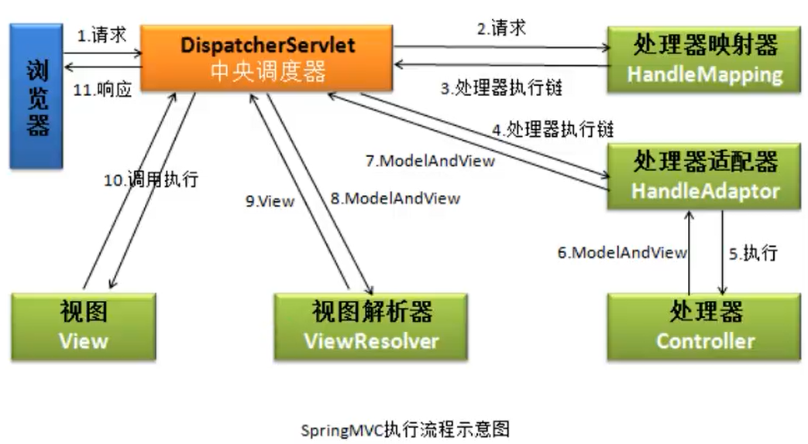
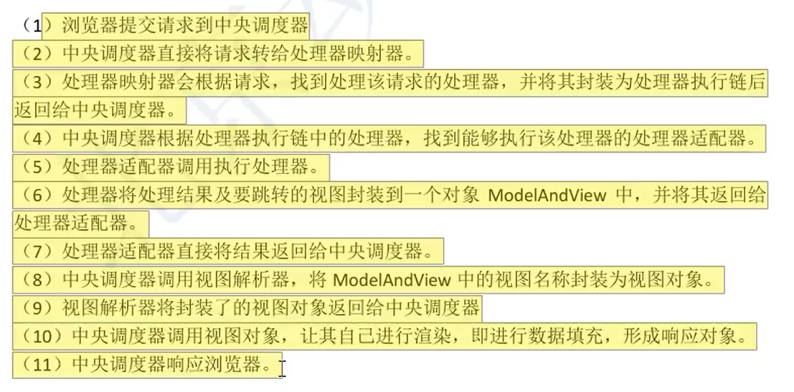

# SpringMVC配置

spring web mvc是spring框架的一部分，导入springmvc的依赖也就导入了spring的核心依赖：

```xml
<!-- https://mvnrepository.com/artifact/org.springframework/spring-webmvc -->
<dependency>
    <groupId>org.springframework</groupId>
    <artifactId>spring-webmvc</artifactId>
    <version>5.3.8</version>
</dependency>
```

web.xml里配置中央调度器（也就是相当配置了一个servlet）：

```xml
<?xml version="1.0" encoding="UTF-8"?>
<web-app  xmlns = "http://xmlns.jcp.org/xml/ns/javaee"
          xmlns:xsi="http://www.w3.org/2001/XMLSchema-instance"
          xsi:schemaLocation="http://xmlns.jcp.org/xml/ns/javaee http://xmlns.jsp.org/xml/ns/javaee/web-app_4_0.xsd"
          version="4.0"
          metadata-complete="true"
>
  <display-name>Archetype Created Web Application</display-name>
  
    <servlet>
        <servlet-name>myspringmvc</servlet-name>
        <servlet-class>org.springframework.web.servlet.DispatcherServlet</servlet-class>
        <init-param>
            <param-name>contextConfigLocation</param-name>
            <param-value>classpath:springmvc.xml</param-value> 
        </init-param>
        <load-on-startup>1</load-on-startup>
    </servlet>
    <servlet-mapping>
        <servlet-name>myspringmvc</servlet-name>
        <url-pattern>*.do</url-pattern>
    </servlet-mapping>
    
</web-app> 
```

resources目录里的springmvc.xml配置，用来配置视图解析器和注解扫描：

```xml
<?xml version="1.0" encoding="UTF-8"?>
<beans xmlns="http://www.springframework.org/schema/beans"
       xmlns:xsi="http://www.w3.org/2001/XMLSchema-instance"
       xmlns:context="http://www.springframework.org/schema/context"
       xsi:schemaLocation="http://www.springframework.org/schema/beans
        https://www.springframework.org/schema/beans/spring-beans.xsd http://www.springframework.org/schema/context https://www.springframework.org/schema/context/spring-context.xsd">
    <!-- 组件扫描器，使注解生效 -->
    <context:component-scan base-package="com.lsl.controller"/>
    <!-- 视图器的配置，为了简化控制器的视图路径 -->
    <bean class="org.springframework.web.servlet.view.InternalResourceViewResolver">
        <!-- 前缀：视图文件路径，也是相对于自己webapp根目录-->
        <property name="prefix" value="/WEB-INF/view/"/>
        <!--后缀：视图文件的拓展名-->
        <property name="suffix" value=".jsp"/>
    </bean>
</beans>
```

# SpringMVC

## 概述

SpringMVC，也叫Spring web MVC，是spring框架的一部分，是轻量级的框架。基于模型-视图-控制器（model、view、controller）模式实现，用于构建灵活、松耦合的web应用程序。学习使用SpringMVC主要在于学习Controller的制作部分，另外还要理解SpringMVC的整个运行逻辑。简单来说，**模型包括了你的数据模型(pojo或bean之类的东西)和业务模型（比如登陆，注册操作等）），用来从后台封装数据到页面的；Controller则是将model层可以在view层显示出来。**

对于springMVC的学习，需要掌握中央调度器、前端控制器、视图解析器，理解各自的作用，知道它们的一个工作流程，要熟练使用前端控制器的处理方法（请求处理和请求参数的接收，以及返回值），而方法的使用的关键就是各种注解了。

springMVC在servlet的基础上，改进了哪些操作？

springmvc的使用步骤：

1. 创建web项目，配置好所需要的依赖。
2. 创建好中央调度器（其实就是一个servlet）。
3. 创建控制器（新建Java类使用注解完成控制器的注册，并写好相应的程序逻辑）。
4. 如果需要的话，可以配置视图解析器，可以简化控制器里的资源路径，也可以引入thymeleaf，使用模板引擎。

## 中央调度器

中央调度器DispatcherServlet，负责接收用户的对资源的请求，接收到请求后会调用控制器对象的处理器方法并返回请求处理结果（返回的是视图或其它）给前端来进行展示。DispatcherServlet是一个Servlet，其父类继承了HttpServlet，DispatcherServlet也叫做前端控制器（front controller）。通过中央调度器可以访问webapp下所有可访问的资源，访问WEB-INF目录下的资源则必须经中央调度器。

**配置中央调度器如下：**

```xml
<?xml version="1.0" encoding="UTF-8"?>
<web-app  xmlns = "http://xmlns.jcp.org/xml/ns/javaee"
         xmlns:xsi="http://www.w3.org/2001/XMLSchema-instance"
         xsi:schemaLocation="http://xmlns.jcp.org/xml/ns/javaee http://xmlns.jsp.org/xml/ns/javaee/web-app_4_0.xsd"
         version="4.0"
         metadata-complete="true"
>
    <servlet>
        <servlet-name>myspringmvc</servlet-name>
        <servlet-class>org.springframework.web.servlet.DispatcherServlet</servlet-class>
        <!-- 上下文的配置（resource里的资源在导出后会加载进classpath），用于初始化SpringMVC容器 -->
        <init-param>
            <param-name>contextConfigLocation</param-name>
            <param-value>classpath:springmvc.xml</param-value> 
        </init-param>
        <!-- 服务器启动便创建好调度器，越小创建（执行）越早 -->
        <load-on-startup>1</load-on-startup> 
    </servlet>
    <servlet-mapping>
        <servlet-name>myspringmvc</servlet-name>
        <url-pattern>*.do</url-pattern>
    </servlet-mapping>
</web-app>
```

**关于中央调度器的url-pattern：**

1. 在没有特殊要求的情况下，常使用后缀匹配的方式，如设置为`*.do`用于匹配请求路径尾部带.do后缀的请求。
2. 如果写成`/*`，所有的`.jsp`资源将失效，报404。
3. 如果写成`/`（RESTful风格下会这样做），那么HTML、css、js、图片等静态资源将会失效，无法直接访问到并且也不能通过前端控制器访问到，此时必须要对静态资源进行处理才能访问（见目录：静态资源处理）。

**关于init-param：**

在tomcat服务器启动后创建DispatcherServlet对象实例，为什么要这样？创建该实例的过程中会同时创建springmvc容器对象，并读取springmvc的配置文件，把这个配置文件中对象都创建好，当用户发起请求就可直接使用controller对象。DispatcherServlet对象就是一个servlet，当其创建时会执行init()方法，也就能进行初始化了：

```java
init(){
	WebApplicationContext ctx = new  ClassPathApplicationContext("springmvc.xml");
	getServletContext().setAttribute(key, ctx);
}
```

## 视图解析器

视图解析器负责将逻辑视图名解析为具体的视图对象。

**spring-mvc.xml里配置视图解析器：**（为返回的视图路径添加前缀与后缀）

```xml
<bean class="org.springframework.web.servlet.view.InternalResourceViewResolver">
    <!--前缀：视图文件路径 相对于webapp-->
    <property name="prefix" value="/WEB-INF/view/"/>
    <!--后缀：视图文件的拓展名-->
    <property name="suffix" value=".html"/>
</bean>
```

配置好上述的视图解析器后，`mv.setViewName("show")`  ===>  return mv后相当于转发到 `/WEB-INF/view/show.jsp`页面，返回的都将被加上视图解析器配置好的前后缀。

也可以使用thymeleaf的视图解析器（需要导入themeleaf的依赖），使用thymeleaf的模板引擎来渲染页面，配置如下：

```xml
<?xml version="1.0" encoding="UTF-8"?>
<beans xmlns="http://www.springframework.org/schema/beans"
       xmlns:xsi="http://www.w3.org/2001/XMLSchema-instance"
       xmlns:context="http://www.springframework.org/schema/context"
       xsi:schemaLocation="http://www.springframework.org/schema/beans
        https://www.springframework.org/schema/beans/spring-beans.xsd http://www.springframework.org/schema/context https://www.springframework.org/schema/context/spring-context.xsd">
    <context:component-scan base-package="com.lsl.crowd.controller"/>
    <!-- 视图器的配置，为了简化控制器的视图路径 -->
    <!-- thymeleaf的视图解析器会与ContentNegotiatingViewResolver冲突 -->
    <bean id="viewResolver" class="org.thymeleaf.spring5.view.ThymeleafViewResolver">
        <property name="characterEncoding" value="UTF-8"/>
        <property name="templateEngine" ref="templateEngine"/>
    </bean>
    <!-- 模板引擎 -->
    <bean id="templateEngine" class="org.thymeleaf.spring5.SpringTemplateEngine">
        <property name="templateResolver" ref="templateResolver"/>
    </bean>
    <!-- 模板解析器 -->
    <bean id="templateResolver" class="org.thymeleaf.templateresolver.ServletContextTemplateResolver">
        <constructor-arg ref="servletContext"/>
        <property name="prefix" value="/WEB-INF/view/"/>
        <property name="suffix" value=".html"/>
        <property name="templateMode" value="HTML5"/>
        <property name="cacheable" value="false"/>
        <property name="characterEncoding" value="UTF-8"/>
    </bean>

</beans>
```


## 前端控制器

前端控制器Controller，里面的方法可以对应多个请求路径。（路径都是相对于webapp的根路径，`/WEB-INF/`路径下的资源不能直接访问，需要经过中央调度器访问）

```java
// 不使用视图解析器时
@Controller
public class FirstController {
    @RequestMapping(value = "/some.do")
    public ModelAndView doSome() {
		ModelAndView mv = new ModelAndView();
        //  将视图放进WEB-INF/view里，杜绝用户直接访问
        mv.setViewName("/WEB-INF/view/show.html");
        // return相当于：request.getRequestDispather("/show.jsp").forward(...)操作
        return mv;
    }
    @RequestMapping(value = {"/se.do", "/otherdo"})
    public ModelAndView doSomes() {
        ModelAndView mv = new ModelAndView();
        mv.addObject("msg","欢迎使用springMVC来开发");
        mv.addObject("fun","执行的是doSomes方法");
        mv.setViewName("/se.jsp");   
        return mv;
    }
}
```

```java
// 使用视图解析器时
@Controller
public class FirstController {
    @RequestMapping(value = "/some.do")
    public ModelAndView doSome() {
		ModelAndView mv = new ModelAndView();
        mv.setViewName("show");
        return mv;
    }
    @RequestMapping(value = {"/se.do", "/otherdo"})
    public ModelAndView doSomes() {
        ModelAndView mv = new ModelAndView();
        mv.addObject("msg","欢迎使用springMVC来开发");
        mv.addObject("fun","执行的是doSomes方法");
        mv.setViewName("se");   
        return mv;
    }
}
```

请求-响应过程：

1. 发送请求给tomcat服务器，tomcat服务器截取路径并去到web.xml的匹配`/show.html`。
2. 没有对应servlet，然后会将请求转到中央调度器DispatcherServlet去匹配虚拟路径。
3. DispatcherServlet根据springmvc.xml文件匹配请求路径所对应的方法。
4. 框架执行匹配到的方法，把得到的ModelAndView进行处理，转发到show.html。

中央调度器DispatcherServlet负责创建springmvc容器对象，读取xml配置文件后利用spring注解创建好对应目录里的Controller对象，还负责接收用户请求，匹配到相应的处理方法。

# 处理器内-注解使用

## 用于组件注册

Spring中用于组件注册的有四个功能一致的注解：

1. @Componet、@Controller、@Service、@Repository。
2. @Controller常用于controller层，用于注册前端控制器。

```java
@Controller
public class MyController{
    
}
```

## 用于指定请求映射

`@RequestMapping(value = "/some.do")`修饰的方法称为处理器方法或控制器方法，将映射路径与请求处理方法绑定，以达到处理对应请求并响应的目的。

1. `@RequestMapping(value = "/some.do")`：把请求资源地址与处理方法绑定，请求时会匹配到该地址然后执行相应的处理器方法。

   - value值要是唯一的，推荐以`/`开始，声明的路径是相对于webapp目录的一个虚拟路径（相对路径）。

2. @RequestMapping用于类上时：设置的路径是所有请求地址的公共部分，叫做模块名称。

   ```java
   @Controller
   // 该类下所有处理器方法上声明的映射路径都将带 `/test`为前置路径
   @RequestMapping("/test") 
   public class MyController{
       // localhost:8081/webapp名/test/some.do
       @RequestMapping(value = {"/some.do", "/first.do"}, method = RequestMethod.GET)
       public String login(){
           
       } 
   }
   ```

@RequestMapping的属性：

1. value：指定映射路径，可设置多个映射路径。

2. method：指定该请求的请求方法必须是GET或POST。

3. params：指定请求必须要包括请求参数。

   - `params={"param1","param2"}`：请求映射所匹配的请求必须带指定参数。
   - `params={"!param1","!param2"}`：请求映射所匹配的请求必须不带指定参数。
   - `params={"param1=val1","param2=val2"}`：请求映射所匹配的请求必须带指定参数并且指定参数值得是val1、val2。
   - `params={"param1!=val1","param2!=val2"}`：请求映射所匹配的请求必须带指定参数并且指定参数值不能是val1、val2。

   ```java
   @Controller
   // 该类下所有处理器方法上声明的映射路径都将带 `/test`为前置路径
   @RequestMapping("/test") 
   public class MyController{
       // 指定params后，发起的请求得是localhost:8081/webapp名/test/some.do?username=xxx才行
       // 发起的请求后没有username这个请求参数则会匹配不成功（请求参数得和params的匹配）
       @RequestMapping(value = {"/some.do", "/first.do"}, method = RequestMethod.GET,params={"username"})
       public String login(){
           
       } 
   }
   ```

4. headers：请求头必须包括符合某些条件。

   - `headers={"headse"}`：必须携带该请求头的信息。
   - `headers={"!headse"}`：不能携带该请求头的信息。
   - `headers={"headse=value"}`：必须携带该请求头并且该请求头信息得是value。
   - `headers={"headse！=value"}`：必须携带该请求头并且该请求头信息不能是value。

@RequestMapping的派生注解：@GetMapping、@PostMapping、@PutMapping、@DeleteMapping。


## 接收GetPost的参数

### @PathVariable

@PathVariable用于接收路径变量，常是restful风格的请求地址，例如：

```java
// 接收放于请求路径中的参数：http://ip:port/blog/message/1
@GetMapping("/message/{id}")
public String test(@PathVariable("id") Long id) {
    return null;
}
```

@PathVariable只支持一个属性value，类型是为String，代表绑定的路径变量。可不指定value，但此时接收形参的名称必须和接收的路径变量的变量名一致。 

### @RequestParam

`@RequestParam`：用于接收get方法、post方法的请求携带的参数。

```java
// http://ip:port/blog/message?id=1&page=2
@GetMapping("/message")
public String test(@RequestParam(value="id") Long id,@RequestParam(value="page") Long pageNum) {
    return null;
}
```

常用来处理**逐个接收数据时**请求参数名（name）和处理器方法中形参参数名不一致的情况。

```java
@RequestMapping(value = "/re.do", method = RequestMethod.POST)
public ModelAndView doRe(@RequestParam(value = "rname", required = false) String name, @RequestParam("rage") String age) {
    ModelAndView mv = new ModelAndView();
    mv.addObject("msg",name);
    mv.addObject("fun",age);
    mv.setViewName("other");
    return mv;
}
```

如果方法参数名和请求参数名（name）不一致，则会报空指针异常。处理这种不一致的情况使用`@RequestParam`注解。

`@RequestParam`注解的属性：

1. value：指定为形参赋值的请求参数的参数名（name），指定后请求提交的参数的name与value指定的一致，并且值不能空，如果没有传这个数据并且没有设置defaultValue，则报错。
2. required：是否必须取到值，设置为false时表示请求中可不携带此请求参数。
3. defaultValue：不管required属性值为true或false，当没有value所指定的请求参数或传输的值为`""`时，使用其设置值为形参赋值。

### @Validated

@Validated注解可以用一个模型来接收地址栏中的参数（将请求参数封装进pojo类）。

```java
// http://ip:port/blog/message?id=1&page=2
@GetMapping(value = "/test")
public String test(@Validated User user) {
    return null;
}
```

```java
// 用户
public class User(){
    priate Long id;
    priate Long page;
    ......
}
```


## 用于接收请求体参数

### @RequestBody

@RequestBody注解用来接收request的body中的参数，@RequestBody可以将多个参数放入到一个实体类或者Map中。（不能通过GET方法发送请求体，post请求提交的参数就放在请求体中）

```java
// 将拿到的数据放入实体类
@PostMapping(value = "/test")
public String test(@RequestBody ParameterModel parameterModel) {
    return null;
}
// 将拿到的数据放入Map集合（也可以放入实体类）
@PostMapping(value = "/test")
public String test(@RequestBody Map<String, Object> paramMap) {
    return null;
}
```

## @ResponseBody

@ResponseBody用于标识一个控制器方法，可以**将该方法的返回值直接作为响应报文的响应体**响应到浏览器。（通常都是使用json工具解析成json格式的数据后再响应到浏览器，出于最小依赖的考虑，Json解析第一选择可能就是Jackson）

```java
@RequestMapping("/test")
@ResponseBody
public String testResponseBody(){
    return "success";
}
// 浏览器页面显示：success
```

使用@ResponseBody返回json数据的步骤：

1. 导入jackson的依赖。

   ```xml
   <dependency>
       <groupId>com.fasterxml.jackson.core</groupId>
       <artifactId>jackson-databind</artifactId>
       <version>2.12.1</version>
   </dependency>
   ```

2. 在SpringMVC的核心配置文件中开启mvc的注解驱动，此时在HandlerAdaptor中会自动装配一个消息转换器：`MappingJackson2HttpMessageConverter`，其可以将响应到浏览器的Java对象转换为Json格式的字符串。

   ```xml
   <mvc:annotation-driven />
   ```

3. 在处理器方法上使用@ResponseBody注解进行标识。

4. 将Java对象直接作为控制器方法的返回值返回，就会自动转换为Json格式的字符串。

   ```java
   @RequestMapping("/test")
   @ResponseBody
   public User testResponseUser(){
       return new User(1001,"admin","123456",23,"男");
   }
   // 浏览器的页面中展示的结果：
   // {"id":1001,"username":"admin","password":"123456","age":23,"sex":"男"}
   ```

## @RestController

@RestController注解是springMVC提供的一个复合注解，标识在控制器的类上时就相当于为类添加了@Controller注解，并且为其中的每个方法添加了@ResponseBody注解。

```java
@RestController
public class MyController {

    @RequestMapping("/index/in.do")
    public User index(){
        User user = new User("lsl",22);
        return user;
    }
}
```


## 用于接收请求头参数

### @RequestHeader

@RequestHeader 注解，可以把请求头部分的值绑定到方法的参数上。

```nginx
/** Request Header **/
Host                    localhost:8080
Accept                  text/html,application/xhtml+xml,application/xml;q=0.9
Accept-Language         fr,en-gb;q=0.7,en;q=0.3
Accept-Encoding         gzip,deflate
Accept-Charset          ISO-8859-1,utf-8;q=0.7,*;q=0.7
Keep-Alive              300
```

```java
@GetMapping("/test")
// 获取到请求头中Accept-Encoding的数据 `gzip,deflate`
public String test(@RequestHeader("Accept-Encoding") String encoding)  {
    return null;
}
```

@RequestHeader注解一共有三个属性：value、required、defaultValue，用法同@RequestParam。

1. value：指定为形参赋值的请求参数的参数名（name），指定后当前请求必须传key为value的数据，如果没有传这个数据并且没有设置defaultValue，则报错。
2. required：是否必须传输此参数。
3. defaultValue：不管required属性值为true或false，当value所指定的请求参数没有传输或传输的值为`""`空字符时，则使用默认值为形参赋值。

### @CookieValue

@CookieValue 可以把Request header中关于cookie的值绑定到方法的参数上。

```nginx
/** cookie **/
JSESSIONID=415A4AC178C59DACE0B2C9CA727CDD84
```

```java
@GetMapping("/test")
public String test(@CookieValue("JSESSIONID") String cookie)  {
    return null;
}
```

属性：value、required、defaultValue，用法同@RequestParam。

1. value：指定为形参赋值的请求参数的参数名（name），指定后当前请求必须传key为value的数据，如果没有传这个数据并且没有设置defaultValue，则报错。
2. required：是否必须传输此参数。
3. defaultValue：不管required属性值为true或false，当value所指定的请求参数没有传输或传输的值为""时，则使用默认值为形参赋值。

# 处理器内-请求参数自动接收

处理器方法的参数用来对**用户表单请求提交的数据**进行接收，参数类型可以是`HttpServletRequest request`、`HttpServletResponse response`、`HttpSession session`这几个类型，也可以是string、int类型的，等等。

## 自动全局接收

（HttpServletRequest request、HttpServletResponse response、HttpSession session，详细使用见Servlet）这三个由框架自动完成赋值，如下声明后就可以直接调用它们的方法来获取数据了（request可以获取请求域中的数据、cookie、session等请求数据，response是响应的数据，session是一个会话中的数据（比如当前页面转发到另一个页面，这是可实现跨页面传送数据））。

```java
@RequestMapping(value = "/first.do", method = RequestMethod.POST)
public ModelAndView doFirst(HttpServletRequest request, HttpServletResponse response, HttpSession session) {
    ModelAndView mv = new ModelAndView();
    ......
    mv.setViewName("first");
    return mv;
}
```

## 自动逐个接收

通过形参逐个接收：框架调用处理器方法时，会按名称（表单提交的数据的name，与顺序无关）把接收到的参数赋给形参，框架还提供把String类型的参数转为int、long、Integer等类型的参数，如`doSecond(String name, int age)`，age也能接收string数据，只要名称对应（前提是字符是纯数字，否则会出现400错误）。

```java
@RequestMapping(value = "/second.do", method = RequestMethod.POST)
public ModelAndView doSecond(String name, String age) {
    ModelAndView mv = new ModelAndView();
    // 将接收到的放入请求域
    mv.addObject("msg",name);
    mv.addObject("fun",age);
    mv.setViewName("other");
    return mv;
}
```

【注意】表单提交请求参数时使用get方式时，后台接收到的参数不会出现乱码，但当使用post方式提交时接收到的参数就会乱码，使用过滤器可解决这个问题（过滤器可以自定义，也可以使用框架的）。使用框架的过滤器：

```xml
<!--web.xml中-->
<filter>
    <filter-name>characterEncodingFilter</filter-name>
    <filter-class>org.springframework.web.filter.CharacterEncodingFilter</filter-class>
    <!--设置项目中使用的字符编码-->
    <init-param>
        <param-name>encoding</param-name>
        <param-value>utf-8</param-value>
    </init-param>
    <!--强制请求对象（HttpServletRequest）使用-->
    <init-param>
        <param-name>forceRequestEncoding</param-name>
        <param-value>true</param-value>
    </init-param>
    <!--强制应答对象(HttpServletResponse)使用-->
    <init-param>
        <param-name>forceResponseEncoding</param-name>
        <param-value>true</param-value>
    </init-param>
</filter>
<filter-mapping>
    <filter-name>characterEncodingFilter</filter-name>
    <!--强制所以请求先经过过滤器-->
    <url-pattern>/*</url-pattern>
</filter-mapping>
```

## 通过自定义类接收

可以通过自定义类对象来接收表单提交的数据，前提是方法的形参对象所对应的类的属性名和表单的请求中的参数名（name）必须一致，这样框架就会自动创建对应形参的java对象（调用空参构造方法），然后通过调用对象的set方法进行赋值，例如：

```java
@RequestMapping(value = "/ob.do", method = RequestMethod.POST)
// 表单提交的学生的信息数据会自动注入到形参对象中
public ModelAndView doOb(Student student) {
    ModelAndView mv = new ModelAndView();
    mv.addObject("msg",student.getName());
    mv.addObject("fun",student.getAge());
    mv.setViewName("other");
    return mv;
}
```

# 处理器内-返回值类型

## ModelAndView

ModelAndView对象，包含数据和视图，可对视图执行forward（转发）；处理器方法处理请求后，需要跳转到其他页面资源并在往跳转资源传递数据，此时可以使用该返回值类型。

1. `addObject()`：往请求域放数据，相当于`request的setAttribute("msg", "xxx");`。

2. `setViewName()`：指定需要转发的视图路径。

3. `return mv`：将用`setViewName()`指定的资源返回，也就相当于转发了，显示的是指定路径下的资源，可结合视图解析器简化路径。

   ```java
   @Controller
   public class FirstController {
       @RequestMapping(value = "/some.do")
       public ModelAndView doSome() {
           ModelAndView mv = new ModelAndView();
           // 相当于request的setAttribute("msg", "xxx");
           mv.addObject("msg","欢迎使用springMVC来开发");
           mv.addObject("fun","执行的是doSome方法");
           // 指定视图路径
           mv.setViewName("/show.jsp");
           // 相当于request.getRequestDispather("/show.jsp").forward(...)
           return mv;
       }
   }
   ```


## String

String，只表示视图，可以是逻辑名称（例如show.html），也可以是完整的视图路径（例如`/WEB-INF/view/index.html`）。

```java
@RequestMapping(value = "/returnString-view.do", method = RequestMethod.POST)
public String returnStringView(HttpServletRequest request, String name, String age) {

    request.setAttribute("msg",name);
    request.setAttribute("fun",age);
    // 由框架进行转发，配置了视图解析器时，就可以直接返回视图的逻辑名称
    return "show";
    /* 如果返回完整的路径，这时不能使用视图解析器，因为视图解析器会在返回的值加前缀、后缀 */
}
```

## void

不能表示数据，也不能表示视图，在处理ajax请求时，可以使用其作为返回值，并通过HttpServletResponse输出数据，来响应ajax请求，ajax只是用于请求服务器返回数据，和视图无关。

```xml
<!-- jackson依赖包 -->
<!-- https://mvnrepository.com/artifact/com.fasterxml.jackson.core/jackson-core -->
<dependency>
    <groupId>com.fasterxml.jackson.core</groupId>
    <artifactId>jackson-core</artifactId>
    <version>2.12.1</version>
</dependency>
<!-- https://mvnrepository.com/artifact/com.fasterxml.jackson.core/jackson-databind -->
<dependency>
    <groupId>com.fasterxml.jackson.core</groupId>
    <artifactId>jackson-databind</artifactId>
    <version>2.12.1</version>
</dependency>
```


## Object

返回Object对象时，该对象可以是String、Integer、自定义对象、Map、List等，返回的结果仅表示数据，和视图无关。

应用：**可以使用对象来表示数据，响应ajax请求**。由于返回的对象基本都是以json格式返回的，所以需要jackson工具协助转换。

```xml
<!-- jackson依赖包 -->
<!-- https://mvnrepository.com/artifact/com.fasterxml.jackson.core/jackson-core -->
<dependency>
    <groupId>com.fasterxml.jackson.core</groupId>
    <artifactId>jackson-core</artifactId>
    <version>2.12.1</version>
</dependency>
<!-- https://mvnrepository.com/artifact/com.fasterxml.jackson.core/jackson-databind -->
<dependency>
    <groupId>com.fasterxml.jackson.core</groupId>
    <artifactId>jackson-databind</artifactId>
    <version>2.12.1</version>
</dependency>
```

使用json格式的数据来响应ajax请求，实现步骤：

1. 加入处理json的工具库的依赖，springmvc默认使用的是jackson。
2. 在springmvc配置文件中加入`<mvc:annotation-driven >`注解驱动。
3. **在处理器方法上加@ResponseBody注解**（加上注解后，框架会自动把Object对象转换为json数据格式）。

实现原理说明：

1. `<mvc:annotation-driven >`注解驱动：

   - 作用：完成java对象到json、xml、text、二进制等数据的转换；

   - 原理：依靠HttpMessageConveter接口：消息转换器；定义了六个关于数据转换的方法，可以使用其实现类完成数据的转换；

     ```java
     /*HttpMessageConverter接口的方法 */
     // 判断能否转：检查处理器方法的返回值是否可以转换为var2表示的数据格式；MediaType 表示数据格式，例如json、xml
     // 已经定义好了许多数据格式，检测能转为某种数据则停止检查并返回真
     boolean canWrite(Class<?> var1, @Nullable MediaType var2);
     
     void write(T var1, @Nullable MediaType var2, HttpOutputMessage var3) throws IOException, HttpMessageNotWritableException;
     //实现转换：把处理器方法的返回值对象，调用jackson中的ObjectMapper来实现数据转换为json；如下
     ObjectMapper mapper = new ObjectMapper();
     User user = new User("1s", 3, "男");
     String str = mapper.writeValueAsString(user);
     ```

   - 驱动加入到配置文件后，会自动创建HttpMessageConveter接口的7个实现类（包括MappingJackson2HttpMessageConverter（使用jackson工具库中的ObjectMapper完成数据格式转换））。

2. |  HttpMessageConveter接口主要实现类  |                             作用                             |
   | :---------------------------------: | :----------------------------------------------------------: |
   |       StringMessageConverter        |                负责读取和写出字符串格式的数据                |
   | MappingJackson2HttpMessageConverter | 负责读取和写入json格式的数据（利用jackson工具库中的ObjectMapper读写json数据，操作Object类型数据） |

返回Object对象时框架的处理流程：

1. 检查是否能转换：调用框架中`ArrayList<HttpMessageConverter>`中的每个canWrite()方法来检查哪个接口实现类可以完成返回值转换为json（MappingJackson2HttpMessageConverter）；
2. 检查完成再调用实现类的write()方法，完成转换；（调用jackson中的ObjectMapper来实现数据转换为json，返回的content-Type：application/json;charset=utf-8;）
3. 框架通过@ResponseBody注解把转换后结果输出到浏览器，ajax请求处理完成。

返回Object对象是List集合时得到的是json array。

处理器方法返回值是String，那么有@ResponseBody注解时，表示的是文本数据，content-Type：text/plain;charset=ISO-8859-1，解决这个乱码问题在@RequestMapping加入produces属性，值为"text/plain;charset=utf-8"；处理流程和上面类型，使用StringHttpMessageConverter，默认字符编码ISO-8859-1。

# RESTFul风格

## RESTFul是什么

以下都摘录自：[理解RESTful架构 - 阮一峰的网络日志 (ruanyifeng.com)](https://www.ruanyifeng.com/blog/2011/09/restful.html)

REST：Representational State Transfer，表现层资源状态转移。Fielding将他对互联网软件的**架构原则**，定名为REST，即Representational State Transfer的缩写。如果一个架构符合REST原则，就称它为RESTful架构。RESTful架构，就是目前最流行的一种互联网软件架构。它结构清晰、符合标准、易于理解、扩展方便，所以正得到越来越多网站的采用。

1. **资源（Resources）**：网络上的具体信息，可通过URI来进行标识和访问，URI代表了一个资源的实体；
2. **表现层（Representation）**："资源"（Resources）的"表现层"，**我们把"资源"具体呈现出来的形式，叫做它的"表现层"（Representation）**，比如文本的各种格式、图片使用的的各种格式的表现等；
3. **状态转化（State Transfer）**：访问一个网站，就代表了客户端和服务器的一个互动过程。在这个过程中，势必涉及到数据和状态的变化。

互联网通信协议HTTP协议，是一个无状态协议。这意味着，所有的状态都保存在服务器端。因此，**如果客户端想要操作服务器，必须通过某种手段，让服务器端发生"状态转化"（State Transfer）。而这种转化是建立在表现层之上的，所以就是"表现层状态转化"。**

客户端用到的手段，只能是HTTP协议。具体来说，就是HTTP协议里面，四个表示操作方式的动词：GET、POST、PUT、DELETE。它们分别对应四种基本操作：**GET用来获取资源，POST用来新建资源（也可以用于更新资源），PUT用来更新资源，DELETE用来删除资源。**

RESTful架构：

　　（1）每一个URI代表一种资源。

　　（2）客户端和服务器之间，传递这种资源的某种表现层。

　　（3）客户端通过四个HTTP动词，对服务器端资源进行操作，实现"表现层状态转化"。

## RESTful风格的使用

**SpringMVC中对RESTful架构的实现：**

RESTful风格的URI：从前到后使用斜杠分开，不使用问号键值对方式携带请求参数，而是将发送给服务器的数据作为URI的一部分。

```kotlin
<!-- 标准格式 -->
http(s)://server.com/app-name/{version}/{domain}/{rest-convention}
```

1. `{version}`：api接口版本号。
2. `{domain}`：定义任何技术的区域或者业务上的原因（例如：同样的功能在同一个前缀之下）。
3. `{rest-convention}`：代表这个域(domain)下，约定的rest接口集合。

一些其他规范：

1. 规则1：URI结尾不应包含（/）
2. 规则2：正斜杠分隔符（/）必须用来指示层级关系
3. 规则3：应使用连字符（ - ）来提高URI的可读性
4. 规则4：不得在URI中使用下划线（_）
5. 规则5：URI路径中全都使用小写字母

四个表示操作方式的动词的使用：

1. put请求和delete请求只有部分浏览器支持，为了使用这两个动词，springmvc提过了一个过滤器：HiddenHttpMethodFilter。

  ```xml
  <!-- 该过滤器会获取请求参数，所以要在编码设置的过滤器后再加载该过滤器-->
  <filter>
      <filter-name>HiddenHttpMethodFilter</filter-name>
      <filter-class>org.springframework.web.filter.HiddenHttpMethodFilter</filter-class>
  </filter>
  <filter-mapping>
      <filter-name>HiddenHttpMethodFilter</filter-name>
      <url-pattern>/*</url-pattern>
  </filter-mapping>
  ```

  需要借助表单：

  ```html
  <!-- put和delete的使用，必须是post请求，使用和下面类似  -->
  <form action="/user" method="post">
      <input type="hidden" name="_method" value="PUT"/>
  </form>
  ```

2. controller举例：

  ```java
  @RequestMapping(value = "/test/{id}", method = RequestMethod.DELETE)
  public String testDelete(@PathVariable(value = "id") Integer id){
      adminService.deleteById(id);
      return "hello";
  }
  ```

3. 如果需要链接和表单绑定，那就使用ajax来发送各种方法请求的请求。

# 静态资源处理

Tomcat有一个默认的servlet（conf的web.xml中）会在服务器启动时被创建，是用于处理HTML、css、js、图片等静态资源的，也可以处理未映射到其他servlet的请求。该默认的servlet的映射路径使用的是斜杠 `/`，如果在我们在配置servlet时也使用了这个斜杠，那么所有的请求将被中央调度器来处理，而此时中央调度器就没有了servlet对象来处理静态资源，这时会导致HTML、css、js、图片等静态资源无法加载，如果使用的是路径`/xxx`则静态资源可以访问到（当控制器对象只能处理请求，但是静态资源仍然无法访问，这时就需要配置静态资源处理。）

**处理静态资源的方法一：**在springmvc.xml中加入`<mvc:default-servlet-handler/>`

1. 加入这个标签，会由框架创建控制器对象`DefaultHttpServletRequestHangler`，通过这个对象可实现把接收的请求转发给Tomcat中默认的servlet，从而实现对静态资源的访问。
2. `<mvc:default-servlet-handler/>`和@RequestMapping注解会存在冲突，需要加上`<mvc:annotation-driven/>`来解决冲突。

**处理静态资源的方法二：**springmvc.xml中加入`<mvc:resources mapping="" location=""/>`： 

1. mapping：访问静态资源的URI地址，使用通配符`**`， `mapping="images/**"`。

2. location：静态资源在你的项目中的位置，`location="/images/"`。

3. 加入此配置后框架会自动创建一个处理器对象（`ResourceHttpServletRequestHangler`），这个处理器对象用来处理静态资源的访问，这样就不用再依赖tomcat服务器的默认的servlet。该方法的`<mvc:resources mapping="" location=""/>`和@RequestMapping注解存在冲突，也需要加上`<mvc:annotation-driven/>`来开启mvc注解驱动、解决冲突。

   ```xml
   <mvc:resources mapping="/html/**" location="/html/"/>
   <mvc:resources mapping="/css/**" location="/css/"/>
   <mvc:resources mapping="/js/**" location="/js/"/>
   ......
   ```

   ```xml
   <!-- 统一指定访问资源，创建static目录，把静态资源都放里面 -->
   <mvc:resources mapping="/static/**" location="/static/"/>
   ```

# 解决POST请求乱码

SpringMVC中处理编码的过滤器一定要配置到其他过滤器之前，否则无效。（浏览器端与服务端编码不一致导致获取到的数据出现乱码）

```xml
<!-- 过滤器 -->
<filter>
    <filter-name>characterEncodingFilter</filter-name>
    <filter-class>org.springframework.web.filter.CharacterEncodingFilter</filter-class>
    <init-param>
        <param-name>encoding</param-name>
        <param-value>utf-8</param-value>
    </init-param>
    <init-param>
        <param-name>forceRequestEncoding</param-name>
        <param-value>true</param-value>
    </init-param>
    <init-param>
        <param-name>forceResponseEncoding</param-name>
        <param-value>true</param-value>
    </init-param>
</filter>
<filter-mapping>
    <filter-name>characterEncodingFilter</filter-name>
    <url-pattern>/*</url-pattern>
</filter-mapping>
```

# 处理器内-域对象共享数据

## 向Request域共享数据

**HttpServletRequest：使用ServletAPI向request域对象共享数据。**

```java
@RequestMapping("/testServletAPI")
public String testServletAPI(HttpServletRequest request){
    request.setAttribute("key", "hello,servletAPI");
    return "success";
}
```

**ModelAndView：使用ModelAndView向request域对象共享数据**

```java
@RequestMapping("/testModelAndView")
public ModelAndView testModelAndView(){
    /**
     * ModelAndView有Model和View的功能
     * Model主要用于向请求域共享数据
     * View主要用于设置视图，实现页面跳转
     */
    ModelAndView mav = new ModelAndView();
    // 向请求域共享数据
    mav.addObject("key", "hello,ModelAndView");
    // 设置视图，实现页面跳转
    mav.setViewName("success");
    return mav; // 转发
}
```

**Model：使用Model向request域对象共享数据**

```java
@RequestMapping("/testModel")
public String testModel(Model model){
    model.addAttribute("key", "hello,Model");
    return "success";
}
```

**Map：使用Map向request域对象共享数据**

```java
@RequestMapping("/testMap")
public String testMap(Map<String, Object> map){
    map.put("key", "hello,Map");
    return "success";
}
```

**ModelMap：使用ModelMap向request域对象共享数据**

```java
@RequestMapping("/testModelMap")
public String testModelMap(ModelMap modelMap){
    modelMap.addAttribute("key", "hello,ModelMap");
    return "success";
}
```

 **Model、ModelMap、Map的关系**

Model、ModelMap、Map类型的参数其实本质上都是 BindingAwareModelMap 类型的。

```java
public interface Model{}
public class ModelMap extends LinkedHashMap<String, Object> {}
public class ExtendedModelMap extends ModelMap implements Model {}
public class BindingAwareModelMap extends ExtendedModelMap {}
```

## 向session域共享数据

```java
@RequestMapping("/testSession")
public String testSession(HttpSession session){
    session.setAttribute("key", "hello,session");
    return "success";
}
```

## 向application域共享数据

通过HttpSession获取到servlet上下文，再把数据送入。

```java
@RequestMapping("/testApplication")
public String testApplication(HttpSession session){
    ServletContext application = session.getServletContext();
    application.setAttribute("key", "hello,application");
    return "success";
}
```

# SpringMVC核心技术

## HttpMessageConverter

HttpMessageConverter，报文信息转换器，将请求报文转换为Java对象，或将Java对象转换为响应报文。

HttpMessageConverter提供了两个注解和两个类：@RequestBody，@ResponseBody，RequestEntity，ResponseEntity。

| 两个注解      | 作用                                                         |
| ------------- | ------------------------------------------------------------ |
| @RequestBody  | 用来标识形参，**获取请求体信息**                             |
| @ResponseBody | 用于控制器方法，将控制器方法的返回值直接作为响应报文<br/>的响应体响应到浏览器（处理json数据需要导入相关依赖） |

- 派生注解`@RestController`：相对于为该类添加了@Controller注解并为其中的每个方法都添加了@ResponseBody注解。

| 两个类型       | 作用                                                         |
| -------------- | ------------------------------------------------------------ |
| RequestEntity  | 用来**封装请求报文**的类，在控制器方法中设置该形参就会自动完成请求报文的封装，<br/>然后通过`getHeaders()`方法获取请求头信息、通过`getBody()`方法获取请求体信息 |
| ResponseEntity | 响应实体类，用于作为控制器方法的返回值，当作响应到浏览器的响应报文 |

RequestEntity封装请求报文的一种类型，需要在控制器方法的形参中设置该类型的形参，当前请求的请求报文就会赋值给该形参，可以通过getHeaders()获取请求头信息，通过getBody()获取请求体信息。

```java
@RequestMapping("/testRequestEntity")
public String testRequestEntity(RequestEntity<String> requestEntity){
    System.out.println("requestHeader:"+requestEntity.getHeaders());
    System.out.println("requestBody:"+requestEntity.getBody());
    return "success";
}
/* 
输出结果： requestHeader:[host:“localhost:8080”, connection:“keep-alive”, content-length:“27”, cache-control:“max-age=0”, sec-ch-ua:"" Not A;Brand";v=“99”, “Chromium”;v=“90”, “Google Chrome”;v=“90"”, sec-ch-ua-mobile:"?0", upgrade-insecure-requests:“1”, origin:“http://localhost:8080”, user-agent:“Mozilla/5.0 (Windows NT 10.0; Win64; x64) AppleWebKit/537.36 (KHTML, like Gecko) Chrome/90.0.4430.93 Safari/537.36”] requestBody:username=admin&password=123 
*/
```


## 文件上传和下载

### 文件下载

使用ResponseEntity实现下载文件的功能：

```java
@RequestMapping("/testDownload")
public ResponseEntity<byte[]> testResponseEntity(HttpSession session) throws IOException {
    // 获取ServletContext对象
    ServletContext servletContext = session.getServletContext();
    // 获取服务器中文件的真实路径
    String realPath = servletContext.getRealPath("/static/img/1.jpg");
    // 创建输入流
    InputStream is = new FileInputStream(realPath);
    // 创建字节数组
    byte[] bytes = new byte[is.available()];
    // 将流读到字节数组中
    is.read(bytes);
    // 创建HttpHeaders对象设置响应头信息
    MultiValueMap<String, String> headers = new HttpHeaders();
    // 设置要下载方式以及下载文件的名字
    headers.add("Content-Disposition", "attachment;filename=1.jpg");
    // 设置响应状态码
    HttpStatus statusCode = HttpStatus.OK;
    // 创建ResponseEntity对象
    ResponseEntity<byte[]> responseEntity = new ResponseEntity<>(bytes, headers, statusCode);
    // 关闭输入流
    is.close();
    return responseEntity;
}
```

### 文件上传

文件上传要求form表单的请求方式必须为post，并且添加属性`enctype="multipart/form-data"`，SpringMVC中将上传的文件封装到MultipartFile对象中，通过此对象可以获取文件相关信息。

具体实现步骤：

1. 添加依赖。

   ```xml
   <!-- https://mvnrepository.com/artifact/commons-fileupload/commons-fileupload -->
   <dependency>
       <groupId>commons-fileupload</groupId>
       <artifactId>commons-fileupload</artifactId>
       <version>1.3.1</version>
   </dependency>
   ```

2. 在SpringMVC的配置文件中添加配置：

   ```xml
   <!--必须通过该文件解析器的解析才能将文件转换为MultipartFile对象-->
   <bean id="multipartResolver" class="org.springframework.web.multipart.commons.CommonsMultipartResolver"></bean>
   ```

3. 控制器方法：

   ```java
   @RequestMapping("/testUpload")
   public String testUp(MultipartFile photo, HttpSession session) throws IOException {
       // 获取上传的文件的文件名
       String fileName = photo.getOriginalFilename();
       // 处理文件重名问题
       String hzName = fileName.substring(fileName.lastIndexOf("."));
       fileName = UUID.randomUUID().toString() + hzName;
       // 获取服务器中photo目录的路径
       ServletContext servletContext = session.getServletContext();
       String photoPath = servletContext.getRealPath("photo");
       File file = new File(photoPath);
       if(!file.exists()){
           file.mkdir();
       }
       String finalPath = photoPath + File.separator + fileName;
       // 实现上传功能
       photo.transferTo(new File(finalPath));
       return "success";
   }
   ```


## 转发和重定向

SpringMVC简化了servlet中的转发和重定向。实现转发操作需要在视图路径前加上forward，重定向则加上redirect。

显式转发：**不经过视图解析器**，要写上相对于webapp这个目录的转发到的页面的完整相对路径；可以实现访问webapp下的资源。

```java
@RequestMapping(value="/forward.do")
public ModelAndView forwardTest(String name, String rage){
    ModelAndView mv = new ModelAndView();
    mv.addObject("name", name);
    mv.addObject("age", rage);
    mv.setViewName("forward:/WEB-INF/show.jsp");
    //mv.setViewName("show");   隐式的转发，会经过视图解析器
    return mv;
}
```

重定向：**不经过视图解析器**；第一次请求携带的参数会被转为String，并作为第二次请求的get参数使用；（重定向是两次请求，且重定向不能定向到WEB-INF目录下的资源）

```java
@RequestMapping(value="/redirect.do")
public ModelAndView redirectTest(String name, String age){
    ModelAndView mv = new ModelAndView();
    //放入到request作用域的数据
    mv.addObject("myname", name);
    mv.addObject("myage", age);
    mv.setViewName("redirect:/hello.jsp");
    // http://localhost:8081/springmvc_06_reviewtest_war/hello.jsp?name=%E4%B8%89%E4%B8%89%E4%B8%B6%E4%B8%B6%E7%A7%8B%E6%9A%AE&age=21
    return mv;
}
```

如上，在`mv.setViewName("redirect:/hello.jsp");`时重定向，放入到request作用域的数据将作为第二次get请求的参数。

此时如果要在重定向到的页面拿到get的请求参数，可以使用如下两种形式（jsp页面）：

```jsp
<h3>myname：${param.myname}</h3>
<h3>myage数据：${param.myage}</h3>
<h3>取参：<%=request.getParameter("myname")%></h3>
```


## 异常处理

### 基于XML

SpringMVC提供了一个用来处理控制器方法执行过程中出现的异常的接口：HandlerExceptionResolver。HandlerExceptionResolver接口的实现类有：DefaultHandlerExceptionResolver、SimpleMappingExceptionResolver。SpringMVC提供了一个自定义的异常处理器SimpleMappingExceptionResolver，配置好即可使用：

```xml
<!-- 基于XML的异常映射 -->
<bean id="simpleMappingExceptionResolver" class="org.springframework.web.servlet.handler.SimpleMappingExceptionResolver">
    <!-- 配置异常类型和具体视图之间的关系 -->
    <property name="exceptionMappings">
        <props>
            <!-- key属性指定异常全类名 -->
            <!-- 标签体写对应的视图（该视图会经视图解析器） -->
            <prop key="java.lang.Exception">system-error</prop>
        </props>
    </property>
</bean>
```

```xml
<!-- id可以不用设置 -->
<bean class="org.springframework.web.servlet.handler.SimpleMappingExceptionResolver">
    <property name="exceptionMappings">
        <props>
            <!--
                properties的键表示处理器方法执行过程中出现的异常
                properties的值表示若出现指定异常时，设置一个新的视图名称，跳转到指定页面
            -->
            <prop key="java.lang.ArithmeticException">error</prop>
        </props>
    </property>
    <!--
        exceptionAttribute属性：将出现的异常信息在请求域中进行共享
    -->
    <property name="exceptionAttribute" value="ex"></property>
</bean>
```


### 基于注解

springmvc采用全局统一的异常处理，通过面向切面编程思想把异常集中到一个地方，实现逻辑代码和业务代码的分离，完成解耦合。

异常处理的两个注解：

1. `@ControllerAdvice`：控制器增强，给控制器类加上了异常处理功能（异常处理功能由该注解下的类决定），使用该注解要声明注解扫描；

2. `@ExceptionHandler`：声明异常处理功能（就是异常处理方法），基本使用如下，声明于方法上：

  ```java
  @ExceptionHandler(value = NameException.class)
  ```


```java
// @ControllerAdvice：将当前类标识为异常处理的组件
@ControllerAdvice
public class ExceptionController {

    // @ExceptionHandler：用于设置该方法所要处理的异常
    @ExceptionHandler(ArithmeticException.class)
    // ex：当前请求处理中出现的异常对象
    public String handleArithmeticException(Exception ex, Model model){
        model.addAttribute("ex", ex);
        return "error";
    }
}
```


如何实现统一的异常处理：

1. 根据实际情况创建好自定义的异常类，在合适的地方抛出异常。

2. 创建全局异常处理类，用来处理全部的异常（需要在类上加上`@ControllerAdvice`注解）。

3. 编写自定义抛出异常的异常处理方法：

   - （返回值类型可以是处理器方法的任何返回值类型，参数可以是Exception）

   - 使用`@ExceptionHandler(value = XxxException.class)`注解将该异常处理方法与异常绑定；
   - 处理异常的逻辑-编写方法内容：
     1. 记录异常到数据库或日志文件（记录异常发生的时间、那个方法产生的、异常的内容是什么）。
     2. 发送通知，把异常的信息通过邮件、短信或微信发送给相关人员。
     3. 给用户友好的提示。

4. 用来处理不知道什么类型的异常的方法：匹配不到方法的异常都由其处理：

   ```java
   @ExceptionHandler
   public ModelAndView doOtherException(Exception exception){
       ModelAndView mv = new ModelAndView();
       mv.addObject("ms", "（）！");
       mv.addObject("ex", exception);
       mv.setViewName("defaultError");
       return mv;
   }
   ```

5. error视图创建。

6. springmvc配置：

   ```xml
   <context:component-scan base-package="com.lsl.handler"/>
   <mvc:annotation-driven />
   ```

实例：


## 拦截器

**概述：**

1. 拦截器是实现HandlerInterceptor接口的实现类；拦截器也体现aop思想。
2. 过滤器用来过滤请求参数、设置编码字符集等工作，**拦截器则用来拦截请求、对请求做判断处理的**。

3. 拦截器是全局的，可以对多个Controller做拦截，可以有多个拦截器。
4. 常用于：用户登录处理、权限检查、记录日志。
5. 拦截器执行时间（三个时间点都会执行，对应有着三个方法）：
  - 在controller方法执行前执行拦截 ===> preHandle()。
  - 在controller方法执行后执行拦截 ===> postHandle()。
  - 请求处理完成后执行拦截 ===> afterCompletion()。

**拦截器的使用：**

1. 创建实现HandlerInterceptor接口的拦截器类，然后在springmvc中声明拦截器，先声明的先执行，实际上在框架中保存多个拦截器是用ArrayList集合来保存的。

   ```xml
   <mvc:interceptors>
       <!-- 可以声明多个 -->
       <mvc:interceptor>
           <!-- mvc:mapping：配置被拦截的URI地址，`/`表示根，通配符`**`表示任意字符 -->
           <mvc:mapping path="/**"/>
           <!-- 配置放行的资源，即不会拦截的资源 -->
           <mvc:exclude-mapping path="/"/>
           <!-- 实现HandlerInterceptor接口的类 -->
           <bean class="com.lsl.handler.MyInterceptor"/>
       </mvc:interceptor>
       ......
   </mvc:interceptors>
   ```

2. 关于HandlerInterceptor接口的三个方法：

   ```java
   @Override
   public boolean preHandle(HttpServletRequest request, HttpServletResponse response, Object handler) throws Exception {
       return HandlerInterceptor.super.preHandle(request, response, handler);
   }
   
   @Override
   public void postHandle(HttpServletRequest request, HttpServletResponse response, Object handler, ModelAndView modelAndView) throws Exception {
       HandlerInterceptor.super.postHandle(request, response, handler, modelAndView);
   }
   
   @Override
   public void afterCompletion(HttpServletRequest request, HttpServletResponse response, Object handler, Exception ex) throws Exception {
       HandlerInterceptor.super.afterCompletion(request, response, handler, ex);
   }
   ```

   1. 第一个：预处理方法，在controller方法执行前（发起请求后）执行，项目的入口、门户，返回false将截止； Object handler是被拦截的controller对象该方法常用来获取用户请求信息、验证请求是否符合要求、验证用户是否登录、验证用户是否有权限访问某个链接地址等；如果验证失败就截断请求，请求不能被处理。
   2. 第二个：后处理方法，在controller方法执行后执行，ModelAndView是controller方法返回值，修改ModelAndView中的视图和参数能影响到最后的执行结果；该方法主要用来对原来的结果进行二次修改。
   3. 第三个：最后执行的方法，请求处理完成后执行（框架规定，视图处理完成后并对视图执行了forward（转发）后，就认为请求处理完成），Exception是程序中出现的异常；该方法一般做资源回收工作，程序请求过程中创建的对象在这里可以删除，回收占用内存。

3. SpringMVC中的拦截器三个抽象方法总结：

   - preHandle()：控制器方法执行之前执行，其boolean类型的返回值表示是否拦截或放行，返回true就表示放行，即可以执行匹配到的控制器方法了；返回false表示拦截，即不能调用该控制器方法。
   - postHandle()：控制器方法执行之后执行。
   - afterComplation()：处理完视图和模型数据，渲染视图完毕之后执行。


**拦截器的执行顺序：**

1. 若每个拦截器的preHandle()都返回true：
   - 此时多个拦截器的执行顺序和拦截器在SpringMVC的配置文件的配置顺序有关：preHandle()会按照配置的拦截器的顺序执行，而postHandle()和afterComplation()会按照配置的拦截器的倒序依次执行。
2. 若某个拦截器的preHandle()返回了false：
   - preHandle()返回false和它之前的拦截器的preHandle()都会执行，postHandle()都不执行，返回false的拦截器之前的拦截器的afterComplation()会执行

```java
// 一个拦截器的执行顺序，preHandle()返回true时
1.拦截器的preHandle方法
2.===controller的一个方法===
3.拦截器的postHandle方法
4.拦截器的afterCompletion方法
```

```java
// 有多个（2个为例）拦截时的执行顺序，拦截器1、2的preHandle()都返回true时
1.拦截器1的preHandle方法
2.拦截器2的preHandle方法
3.===controller的一个方法===
4.拦截器2的postHandle方法
5.拦截器1的postHandle方法
6.拦截器2的afterCompletion方法
7.拦截器1的afterCompletion方法
```

```java
// 有多个（2个为例）拦截：拦截器1的preHandle()返回true，拦截器2的返回false时的执行顺序
111拦截器的preHandle方法
222拦截器的preHandle方法
111拦截器的afterCompletion方法
```

```java
// 多个拦截时的执行顺序，第一个拦截器1的preHandle()返回false，后续都不会再执行
111拦截器的preHandle方法
```

**结论：多个拦截器就像一个链条串在一起，只要有一个的preHandle()返回false，controller方法就不能执行。**

**拦截器、过滤器的区别：**

1. 过滤器是Servlet中实现Filter接口的对象，拦截器是框架中实现HandlerInterceptor接口的对象。
2. 过滤器是由Tomcat服务器创建的对象，拦截器是在SpringMVC容器中创建的对象。
3. 过滤器侧重对数据进行过滤，用来设置request和response的参数、属性的；拦截器则是用来验证请求、截断请求的。
4. 过滤器是在拦截器之前执行的。
5. 过滤器只有一个执行时间点，拦截器有三个执行时间点。
6. 过滤器可以处理jsp、js、html等资源，拦截器侧重对Controller对象的方法的请求进行拦截，如果请求不被中央调度器接收，那么这个请求也就不会被拦截并执行拦截器逻辑。
7. 拦截器拦截普通方法请求，过滤器过滤servlet请求响应。

# 通过注解配置SpringMVC

使用配置类和注解代替web.xml和SpringMVC配置文件的功能。

在Servlet3.0环境中，容器会在类路径中查找实现javax.servlet.ServletContainerInitializer接口的类，如果找到的话就用它来配置Servlet容器。 Spring提供了这个接口的实现，名为SpringServletContainerInitializer，这个类反过来又会查找实现WebApplicationInitializer的类并将配置的任务交给它们来完成。Spring3.2引入了一个便利的WebApplicationInitializer基础实现，名为AbstractAnnotationConfigDispatcherServletInitializer，当我们的类扩展了AbstractAnnotationConfigDispatcherServletInitializer并将其部署到Servlet3.0容器的时候，容器会自动发现它，并用它来配置Servlet上下文。

1. 创建初始化类，用来代替web.xml：

   ```java
   public class WebInit extends AbstractAnnotationConfigDispatcherServletInitializer {
   
       /**
        * 指定spring的配置类
        * @return
        */
       @Override
       protected Class<?>[] getRootConfigClasses() {
           return new Class[]{SpringConfig.class};
       }
   
       /**
        * 指定SpringMVC的配置类
        * @return
        */
       @Override
       protected Class<?>[] getServletConfigClasses() {
           return new Class[]{WebConfig.class};
       }
   
       /**
        * 指定DispatcherServlet的映射规则，即url-pattern
        * @return
        */
       @Override
       protected String[] getServletMappings() {
           return new String[]{"/"};
       }
   
       /**
        * 添加过滤器
        * @return
        */
       @Override
       protected Filter[] getServletFilters() {
           CharacterEncodingFilter encodingFilter = new CharacterEncodingFilter();
           encodingFilter.setEncoding("UTF-8");
           encodingFilter.setForceRequestEncoding(true);
           HiddenHttpMethodFilter hiddenHttpMethodFilter = new HiddenHttpMethodFilter();
           return new Filter[]{encodingFilter, hiddenHttpMethodFilter};
       }
   }
   ```

2. 创建SpringConfig配置类，用来代替Spring的配置文件：

   ```java
   @Configuration
   public class SpringConfig {
       //ssm整合之后，spring的配置信息写在此类中
   }
   ```

3. 创建WebConfig配置类，用来代替SpringMVC的配置文件：

   ```java
   @Configuration
   //扫描组件
   @ComponentScan("com.atguigu.mvc.controller")
   //开启MVC注解驱动
   @EnableWebMvc
   public class WebConfig implements WebMvcConfigurer {
   
       //使用默认的servlet处理静态资源
       @Override
       public void configureDefaultServletHandling(DefaultServletHandlerConfigurer configurer) {
           configurer.enable();
       }
   
       //配置文件上传解析器
       @Bean
       public CommonsMultipartResolver multipartResolver(){
           return new CommonsMultipartResolver();
       }
   
       //配置拦截器
       @Override
       public void addInterceptors(InterceptorRegistry registry) {
           FirstInterceptor firstInterceptor = new FirstInterceptor();
           registry.addInterceptor(firstInterceptor).addPathPatterns("/**");
       }
       
       //配置视图控制
       
       /*@Override
       public void addViewControllers(ViewControllerRegistry registry) {
           registry.addViewController("/").setViewName("index");
       }*/
       
       //配置异常映射
       /*@Override
       public void configureHandlerExceptionResolvers(List<HandlerExceptionResolver> resolvers) {
           SimpleMappingExceptionResolver exceptionResolver = new SimpleMappingExceptionResolver();
           Properties prop = new Properties();
           prop.setProperty("java.lang.ArithmeticException", "error");
           //设置异常映射
           exceptionResolver.setExceptionMappings(prop);
           //设置共享异常信息的键
           exceptionResolver.setExceptionAttribute("ex");
           resolvers.add(exceptionResolver);
       }*/
   
       //配置生成模板解析器
       @Bean
       public ITemplateResolver templateResolver() {
           WebApplicationContext webApplicationContext = ContextLoader.getCurrentWebApplicationContext();
           // ServletContextTemplateResolver需要一个ServletContext作为构造参数，
           // 可通过WebApplicationContext 的方法获得
           ServletContextTemplateResolver templateResolver = new ServletContextTemplateResolver(
                   webApplicationContext.getServletContext());
           templateResolver.setPrefix("/WEB-INF/templates/");
           templateResolver.setSuffix(".html");
           templateResolver.setCharacterEncoding("UTF-8");
           templateResolver.setTemplateMode(TemplateMode.HTML);
           return templateResolver;
       }
   
       //生成模板引擎并为模板引擎注入模板解析器
       @Bean
       public SpringTemplateEngine templateEngine(ITemplateResolver templateResolver) {
           SpringTemplateEngine templateEngine = new SpringTemplateEngine();
           templateEngine.setTemplateResolver(templateResolver);
           return templateEngine;
       }
   
       //生成视图解析器并未解析器注入模板引擎
       @Bean
       public ViewResolver viewResolver(SpringTemplateEngine templateEngine) {
           ThymeleafViewResolver viewResolver = new ThymeleafViewResolver();
           viewResolver.setCharacterEncoding("UTF-8");
           viewResolver.setTemplateEngine(templateEngine);
           return viewResolver;
       }
   }
   ```

4. 测试功能：

   ```java
   @RequestMapping("/")
   public String index(){
       return "index";
   }
   ```


# ~~SpringMVC执行流程~~



内部执行流程：（处理器对象=controller对象）

1. 用户发起请求，由tomcat将请求发送给中央调度器；

2. 中央调度器接收请求后，请求转交给处理器-映射器（框架把实现了HandleMapping接口的类都称为映射器，其作用是根据请求从springmvc中获取处理器对象（MyController controller = ctx.getBean("xxx.do");））；

3. 框架把处理器-映射器找到的处理器对象放到一个叫处理器执行链的类（HandlerExecutionChain）保存后返回给中央调度器（这个类中保存着处理器对象、项目中所有的拦截器（用List集合存放））；

4. 中央调度器再把处理器对象交给处理器-适配器对象（多个）；（处理器-适配器：springmvc框架中的对象，需要实现HandlerAdapter接口，其作用是执行处理器方法）；

5. 处理器-适配器执行完处理器方法后把视图等数据返回给中央调度器；

6. 中央调度器再把ModelAndView交给视图解析器对象；（视图解析器是springmvc中实现ViewResolver接口的对象，其作用是组成视图完整路径（使用前缀、后缀），并创建View对象（View是一个接口，表示视图，在框架中jsp、html不是string表示，而是使用View和它的实现类表示视图））；

   InternalResourceView：视图类，表示jsp文件，由视图解析器创建。

7. 中央调度器再获取返回的view对象，调用view类自己的方法，把Model数据放入request作用域；

8. 最后执行对象视图的forward，请求结束。



# SpringMVC执行流程~

## SpringMVC常用组件

1. DispatcherServlet：
   - 前端控制器，不需要工程师开发，由框架提供。
   - 作用：统一处理请求和响应，整个流程控制的中心，由它调用其它组件处理用户的请求。
2. HandlerMapping：
   - 处理器映射器，不需要工程师开发，由框架提供。
   - 作用：根据请求的url、method等信息查找Handler，即控制器方法。
3. Handler：
   - 处理器，需要工程师开发。
   - 作用：在DispatcherServlet的控制下Handler对具体的用户请求进行处理。
4. HandlerAdapter：
   - 处理器适配器，不需要工程师开发，由框架提供。
   - 作用：通过HandlerAdapter对处理器（控制器方法）进行执行。
5. ViewResolver：
   - 视图解析器，不需要工程师开发，由框架提供。
   - 作用：进行视图解析，得到相应的视图，例如：ThymeleafView、InternalResourceView、RedirectView。
6. View：
   - 视图。
   - 作用：将模型数据通过页面展示给用户。

## DispatcherServlet初始化过程

DispatcherServlet 本质上是一个 Servlet，所以天然的遵循 Servlet 的生命周期。所以宏观上是 Servlet 生命周期来进行调度。


1. 初始化WebApplicationContext：（所在类：org.springframework.web.servlet.FrameworkServlet）

   ```java
   protected WebApplicationContext initWebApplicationContext() {
       WebApplicationContext rootContext =
           WebApplicationContextUtils.getWebApplicationContext(getServletContext());
       WebApplicationContext wac = null;
   
       if (this.webApplicationContext != null) {
           // A context instance was injected at construction time -> use it
           wac = this.webApplicationContext;
           if (wac instanceof ConfigurableWebApplicationContext) {
               ConfigurableWebApplicationContext cwac = (ConfigurableWebApplicationContext) wac;
               if (!cwac.isActive()) {
                   // The context has not yet been refreshed -> provide services such as
                   // setting the parent context, setting the application context id, etc
                   if (cwac.getParent() == null) {
                       // The context instance was injected without an explicit parent -> set
                       // the root application context (if any; may be null) as the parent
                       cwac.setParent(rootContext);
                   }
                   configureAndRefreshWebApplicationContext(cwac);
               }
           }
       }
       if (wac == null) {
           // No context instance was injected at construction time -> see if one
           // has been registered in the servlet context. If one exists, it is assumed
           // that the parent context (if any) has already been set and that the
           // user has performed any initialization such as setting the context id
           wac = findWebApplicationContext();
       }
       if (wac == null) {
           // No context instance is defined for this servlet -> create a local one
           // 创建WebApplicationContext
           wac = createWebApplicationContext(rootContext);
       }
   
       if (!this.refreshEventReceived) {
           // Either the context is not a ConfigurableApplicationContext with refresh
           // support or the context injected at construction time had already been
           // refreshed -> trigger initial onRefresh manually here.
           synchronized (this.onRefreshMonitor) {
               // 刷新WebApplicationContext
               onRefresh(wac);
           }
       }
   
       if (this.publishContext) {
           // Publish the context as a servlet context attribute.
           // 将IOC容器在应用域共享
           String attrName = getServletContextAttributeName();
           getServletContext().setAttribute(attrName, wac);
       }
   
       return wac;
   }
   ```

2. 创建WebApplicationContext：（所在类：org.springframework.web.servlet.FrameworkServlet）

   ```java
   protected WebApplicationContext createWebApplicationContext(@Nullable ApplicationContext parent) {
       Class<?> contextClass = getContextClass();
       if (!ConfigurableWebApplicationContext.class.isAssignableFrom(contextClass)) {
           throw new ApplicationContextException(
               "Fatal initialization error in servlet with name '" + getServletName() +
               "': custom WebApplicationContext class [" + contextClass.getName() +
               "] is not of type ConfigurableWebApplicationContext");
       }
       // 通过反射创建 IOC 容器对象
       ConfigurableWebApplicationContext wac =
           (ConfigurableWebApplicationContext) BeanUtils.instantiateClass(contextClass);
   
       wac.setEnvironment(getEnvironment());
       // 设置父容器
       wac.setParent(parent);
       String configLocation = getContextConfigLocation();
       if (configLocation != null) {
           wac.setConfigLocation(configLocation);
       }
       configureAndRefreshWebApplicationContext(wac);
   
       return wac;
   }
   ```

3. DispatcherServlet初始化策略：（所在类：org.springframework.web.servlet.DispatcherServlet）

   - FrameworkServlet创建WebApplicationContext后，刷新容器，调用onRefresh(wac)，此方法在DispatcherServlet中进行了重写，调用了initStrategies(context)方法，初始化策略，即初始化DispatcherServlet的各个组件。

   - ```java
     protected void initStrategies(ApplicationContext context) {
        initMultipartResolver(context);
        initLocaleResolver(context);
        initThemeResolver(context);
        initHandlerMappings(context);
        initHandlerAdapters(context);
        initHandlerExceptionResolvers(context);
        initRequestToViewNameTranslator(context);
        initViewResolvers(context);
        initFlashMapManager(context);
     }
     ```


## DispatcherServlet调用组件处理请求

1. processRequest()：（所在类：org.springframework.web.servlet.FrameworkServlet）

   - FrameworkServlet重写HttpServlet中的service()和doXxx()，这些方法中调用了processRequest(request, response)。

   - ```java
     protected final void processRequest(HttpServletRequest request, HttpServletResponse response)
         throws ServletException, IOException {
     
         long startTime = System.currentTimeMillis();
         Throwable failureCause = null;
     
         LocaleContext previousLocaleContext = LocaleContextHolder.getLocaleContext();
         LocaleContext localeContext = buildLocaleContext(request);
     
         RequestAttributes previousAttributes = RequestContextHolder.getRequestAttributes();
         ServletRequestAttributes requestAttributes = buildRequestAttributes(request, response, previousAttributes);
     
         WebAsyncManager asyncManager = WebAsyncUtils.getAsyncManager(request);
         asyncManager.registerCallableInterceptor(FrameworkServlet.class.getName(), new RequestBindingInterceptor());
     
         initContextHolders(request, localeContext, requestAttributes);
     
         try {
             // 执行服务，doService()是一个抽象方法，在DispatcherServlet中进行了重写
             doService(request, response);
         }
         catch (ServletException | IOException ex) {
             failureCause = ex;
             throw ex;
         }
         catch (Throwable ex) {
             failureCause = ex;
             throw new NestedServletException("Request processing failed", ex);
         }
     
         finally {
             resetContextHolders(request, previousLocaleContext, previousAttributes);
             if (requestAttributes != null) {
                 requestAttributes.requestCompleted();
             }
             logResult(request, response, failureCause, asyncManager);
             publishRequestHandledEvent(request, response, startTime, failureCause);
         }
     }
     ```

2. doService()：（所在类：org.springframework.web.servlet.DispatcherServlet）

   - ```java
     @Override
     protected void doService(HttpServletRequest request, HttpServletResponse response) throws Exception {
         logRequest(request);
     
         // Keep a snapshot of the request attributes in case of an include,
         // to be able to restore the original attributes after the include.
         Map<String, Object> attributesSnapshot = null;
         if (WebUtils.isIncludeRequest(request)) {
             attributesSnapshot = new HashMap<>();
             Enumeration<?> attrNames = request.getAttributeNames();
             while (attrNames.hasMoreElements()) {
                 String attrName = (String) attrNames.nextElement();
                 if (this.cleanupAfterInclude || attrName.startsWith(DEFAULT_STRATEGIES_PREFIX)) {
                     attributesSnapshot.put(attrName, request.getAttribute(attrName));
                 }
             }
         }
     
         // Make framework objects available to handlers and view objects.
         request.setAttribute(WEB_APPLICATION_CONTEXT_ATTRIBUTE, getWebApplicationContext());
         request.setAttribute(LOCALE_RESOLVER_ATTRIBUTE, this.localeResolver);
         request.setAttribute(THEME_RESOLVER_ATTRIBUTE, this.themeResolver);
         request.setAttribute(THEME_SOURCE_ATTRIBUTE, getThemeSource());
     
         if (this.flashMapManager != null) {
             FlashMap inputFlashMap = this.flashMapManager.retrieveAndUpdate(request, response);
             if (inputFlashMap != null) {
                 request.setAttribute(INPUT_FLASH_MAP_ATTRIBUTE, Collections.unmodifiableMap(inputFlashMap));
             }
             request.setAttribute(OUTPUT_FLASH_MAP_ATTRIBUTE, new FlashMap());
             request.setAttribute(FLASH_MAP_MANAGER_ATTRIBUTE, this.flashMapManager);
         }
     
         RequestPath requestPath = null;
         if (this.parseRequestPath && !ServletRequestPathUtils.hasParsedRequestPath(request)) {
             requestPath = ServletRequestPathUtils.parseAndCache(request);
         }
     
         try {
             // 处理请求和响应
             doDispatch(request, response);
         }
         finally {
             if (!WebAsyncUtils.getAsyncManager(request).isConcurrentHandlingStarted()) {
                 // Restore the original attribute snapshot, in case of an include.
                 if (attributesSnapshot != null) {
                     restoreAttributesAfterInclude(request, attributesSnapshot);
                 }
             }
             if (requestPath != null) {
                 ServletRequestPathUtils.clearParsedRequestPath(request);
             }
         }
     }
     ```

3. doDispatch()：（所在类：org.springframework.web.servlet.DispatcherServlet）

   - ```java
     protected void doDispatch(HttpServletRequest request, HttpServletResponse response) throws Exception {
         HttpServletRequest processedRequest = request;
         HandlerExecutionChain mappedHandler = null;
         boolean multipartRequestParsed = false;
     
         WebAsyncManager asyncManager = WebAsyncUtils.getAsyncManager(request);
     
         try {
             ModelAndView mv = null;
             Exception dispatchException = null;
     
             try {
                 processedRequest = checkMultipart(request);
                 multipartRequestParsed = (processedRequest != request);
     
                 // Determine handler for the current request.
                 /*
                     mappedHandler：调用链
                     包含handler、interceptorList、interceptorIndex
                     handler：浏览器发送的请求所匹配的控制器方法
                     interceptorList：处理控制器方法的所有拦截器集合
                     interceptorIndex：拦截器索引，控制拦截器afterCompletion()的执行
                 */
                 mappedHandler = getHandler(processedRequest);
                 if (mappedHandler == null) {
                     noHandlerFound(processedRequest, response);
                     return;
                 }
     
                 // Determine handler adapter for the current request.
                    // 通过控制器方法创建相应的处理器适配器，调用所对应的控制器方法
                 HandlerAdapter ha = getHandlerAdapter(mappedHandler.getHandler());
     
                 // Process last-modified header, if supported by the handler.
                 String method = request.getMethod();
                 boolean isGet = "GET".equals(method);
                 if (isGet || "HEAD".equals(method)) {
                     long lastModified = ha.getLastModified(request, mappedHandler.getHandler());
                     if (new ServletWebRequest(request, response).checkNotModified(lastModified) && isGet) {
                         return;
                     }
                 }
                 
                 // 调用拦截器的preHandle()
                 if (!mappedHandler.applyPreHandle(processedRequest, response)) {
                     return;
                 }
     
                 // Actually invoke the handler.
                 // 由处理器适配器调用具体的控制器方法，最终获得ModelAndView对象
                 mv = ha.handle(processedRequest, response, mappedHandler.getHandler());
     
                 if (asyncManager.isConcurrentHandlingStarted()) {
                     return;
                 }
     
                 applyDefaultViewName(processedRequest, mv);
                 // 调用拦截器的postHandle()
                 mappedHandler.applyPostHandle(processedRequest, response, mv);
             }
             catch (Exception ex) {
                 dispatchException = ex;
             }
             catch (Throwable err) {
                 // As of 4.3, we're processing Errors thrown from handler methods as well,
                 // making them available for @ExceptionHandler methods and other scenarios.
                 dispatchException = new NestedServletException("Handler dispatch failed", err);
             }
             // 后续处理：处理模型数据和渲染视图
             processDispatchResult(processedRequest, response, mappedHandler, mv, dispatchException);
         }
         catch (Exception ex) {
             triggerAfterCompletion(processedRequest, response, mappedHandler, ex);
         }
         catch (Throwable err) {
             triggerAfterCompletion(processedRequest, response, mappedHandler,
                                    new NestedServletException("Handler processing failed", err));
         }
         finally {
             if (asyncManager.isConcurrentHandlingStarted()) {
                 // Instead of postHandle and afterCompletion
                 if (mappedHandler != null) {
                     mappedHandler.applyAfterConcurrentHandlingStarted(processedRequest, response);
                 }
             }
             else {
                 // Clean up any resources used by a multipart request.
                 if (multipartRequestParsed) {
                     cleanupMultipart(processedRequest);
                 }
             }
         }
     }
     ```

4. processDispatchResult()：

   - ```java
     private void processDispatchResult(HttpServletRequest request, HttpServletResponse response,
                                        @Nullable HandlerExecutionChain mappedHandler, @Nullable ModelAndView mv,
                                        @Nullable Exception exception) throws Exception {
     
         boolean errorView = false;
     
         if (exception != null) {
             if (exception instanceof ModelAndViewDefiningException) {
                 logger.debug("ModelAndViewDefiningException encountered", exception);
                 mv = ((ModelAndViewDefiningException) exception).getModelAndView();
             }
             else {
                 Object handler = (mappedHandler != null ? mappedHandler.getHandler() : null);
                 mv = processHandlerException(request, response, handler, exception);
                 errorView = (mv != null);
             }
         }
     
         // Did the handler return a view to render?
         if (mv != null && !mv.wasCleared()) {
             // 处理模型数据和渲染视图
             render(mv, request, response);
             if (errorView) {
                 WebUtils.clearErrorRequestAttributes(request);
             }
         }
         else {
             if (logger.isTraceEnabled()) {
                 logger.trace("No view rendering, null ModelAndView returned.");
             }
         }
     
         if (WebAsyncUtils.getAsyncManager(request).isConcurrentHandlingStarted()) {
             // Concurrent handling started during a forward
             return;
         }
     
         if (mappedHandler != null) {
             // Exception (if any) is already handled..
             // 调用拦截器的afterCompletion()
             mappedHandler.triggerAfterCompletion(request, response, null);
         }
     }
     ```

## SpringMVC的执行流程

1. 用户向服务器发送请求，请求被SpringMVC 前端控制器 DispatcherServlet捕获。
2. DispatcherServlet对请求URL进行解析，得到请求资源标识符（URI），判断请求URI对应的映射：
   1. 映射不存在：
      - 再判断是否配置了`mvc:default-servlet-handler`，如果没配置，则控制台报映射查找不到，客户端展示404错误。
      - 如果有配置，则访问目标资源（一般为静态资源，如：JS,CSS,HTML），找不到客户端也会展示404错误。
   2. 映射存在， 存在则执行下面的流程：
      1. 根据该URI，调用HandlerMapping获得该Handler配置的所有相关的对象（包括Handler对象以及Handler对象对应的拦截器），最后以HandlerExecutionChain执行链对象的形式返回。
      2. DispatcherServlet 根据获得的Handler，选择一个合适的HandlerAdapter。
      3. 如果成功获得HandlerAdapter，此时将开始执行拦截器的preHandler(…)方法【正向】。
      4. 提取Request中的模型数据，填充Handler入参，开始执行Handler（Controller)方法，处理请求。在填充Handler的入参过程中，根据你的配置，Spring将帮你做一些额外的工作：
         1. HttpMessageConveter： 将请求消息（如Json、xml等数据）转换成一个对象，将对象转换为指定的响应信息。
         2. 数据转换：对请求消息进行数据转换。如String转换成Integer、Double等。
         3. 数据格式化：对请求消息进行数据格式化。 如将字符串转换成格式化数字或格式化日期等。
         4. 数据验证： 验证数据的有效性（长度、格式等），验证结果存储到BindingResult或Error中。
      5. Handler执行完成后，向DispatcherServlet 返回一个ModelAndView对象。
      6. 此时将开始执行拦截器的postHandle(…)方法【逆向】。
      7. 根据返回的ModelAndView（此时会判断是否存在异常：如果存在异常，则执行HandlerExceptionResolver进行异常处理）选择一个适合的ViewResolver进行视图解析，根据Model和View，来渲染视图。
      8. 渲染视图完毕执行拦截器的afterCompletion(…)方法【逆向】。
      9. 将渲染结果返回给客户端。
