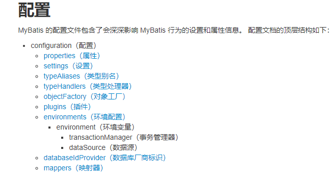

# MyBatis

```java
// jdbc 六步骤
Connection conn = null;
PreparedStatement ps =null;
Result rs = null;
try{
    Class.forName("com.mysql.jdbc.Driver");
    String url = "jdbc:mysql://localhost:3306/jdbctest?"; 
    String name = "root";
    String password = "123456";
    conn = DriverManager.getConnection(url, name, password);
    String sql = "";
    ps = conn.preparedStatement(sql);
    rs = ps.executeQuery();
    while(rs.next()){
        String id = rs.getString("id");
        String name = rs.getString("name");
        String age = rs.getString("age");
        
        Student s = new Student();
        s.setId(id);
        s.setName(name);
        s.setAge(age);
    }
    
}catch (Exception){
    
}finally{
    if(rs != null){
        try{
            rs.close();
        }catch (SQLException e){
            e.printStackTrace();
        }
    }
    if(ps != null){
        try{
            ps.close();
        }catch (SQLException e){
            e.printStackTrace();
        }
    }
    if(conn != null){
        try{
            conn.close();
        }catch (SQLException e){
            e.printStackTrace();
        }
    }
}
```

## 依赖

依赖：

```xml
<!-- https://mvnrepository.com/artifact/org.mybatis/mybatis -->
<dependency>
    <groupId>org.mybatis</groupId>
    <artifactId>mybatis</artifactId>
    <version>3.5.6</version>
</dependency>
<!-- mybatis 整合 spring -->
<dependency>
    <groupId>org.mybatis</groupId>
    <artifactId>mybatis-spring</artifactId>
    <version>2.0.6</version>
</dependency>
```

resources目录下的配置：mybatis-config.xml（全局配置）、jdbc.properties（配置信息）、BlogMapper.xml（SQL映射文件）

```xml
<?xml version="1.0" encoding="UTF-8" ?>
<!DOCTYPE configuration
        PUBLIC "-//mybatis.org//DTD Config 3.0//EN"
        "http://mybatis.org/dtd/mybatis-3-config.dtd">
<configuration>
    <properties resource="jdbc.properties"/>
    <environments default="development">
        <environment id="development">
            <transactionManager type="JDBC"/>
            <dataSource type="POOLED">
                <property name="driver" value="${jdbc.driver}"/>
                <property name="url" value="${jdbc.url}"/>
                <property name="username" value="${jdbc.username}"/>
                <property name="password" value="${jdbc.password}"/>
            </dataSource>
        </environment>
    </environments>
    <mappers>
        <mapper resource="BlogMapper.xml"/> <!-- 指定SQL语句文件 -->
    </mappers>
</configuration>
```

```properties
# jdbc.properties
jdbc.driver=com.mysql.cj.jdbc.Driver
jdbc.url=jdbc:mysql://localhost:3306/jdbctest?characterEncoding=utf8
jdbc.username=root
jdbc.password=123456
```

```xml
<!-- BlogMapper.xml 定义SQL语句 -->
<?xml version="1.0" encoding="UTF-8" ?>
<!DOCTYPE mapper
        PUBLIC "-//mybatis.org//DTD Mapper 3.0//EN"
        "http://mybatis.org/dtd/mybatis-3-mapper.dtd">
<mapper namespace="BlogMapper">
    <!--mybatis会自动创建对象并把查询结果放到对象对应的属性上，需要告知resultType（结果的数据类型）-->
    <!--查询结果集的列名一定要和对象的属性名对应，不对应的时候使用as起别名-->
    <!--select语句的id用于标识，通过id可以使用该SQL语句-->
    <select id="getAll" resultType="com.lsl.domain.Student">
        select id as sid,name as sname,birth as sbirth from t_student
    </select>
</mapper>
```

## 概述

MyBatis是什么？MyBatis用来干什么？

MyBatis和Hibernate是一个持久层框架，专门封装JDBC，用于简化JDBC编程；

框架：框架在表现形式上就是别人写好编译好的一堆字节码文件，通常打成jar包，使用框架把框架的jar包导入classpath当中就可以了；使用框架的目的：提高开发的效率，很多繁琐重复的程序已经被提前封装好，直接使用就行了；所有的java框架都是基于反射机制+XML配置一起完成的。

JDBC缺点：

- 重复代码多，会降低开发效率（rs.getXxx()取数据库数据并setXxx(xx)封装数据的时候，开发繁琐）；

  ```java
   while(rs.next()){
          String id = rs.getString("id");
          String name = rs.getString("name");
          String age = rs.getString("age");
          
          Student s = new Student();
          s.setId(id);
          s.setName(name);
          s.setAge(age);
      }
  //而mybatis框架中：封装了JDBC代码，使用反射机制帮我们自动创建对象并给属性赋值
  ```

- sql语句编写在java程序中，sql语句不支持配置，所以就会导致后面要修改语句的时候得重新修改源代码，而重新修改后又得重新编译/重新部署等，并且修改java源代码违反了开闭原则OCP。（互联网分布式架构方面的项目，并发量很大，系统需要不断的优化，各方面的优化，其中有一条非常重要的优化是SQL优化）。------SQL语句可以写到配置文件中，此条确定并不那么主要。

# MyBatic使用步骤

## 一：依赖导入

需要导入mybatis的依赖和数据库驱动的依赖：

```xml
<!-- https://mvnrepository.com/artifact/org.mybatis/mybatis -->
<dependency>
    <groupId>org.mybatis</groupId>
    <artifactId>mybatis</artifactId>
    <version>3.5.6</version>
</dependency>
<!-- 数据库驱动 -->
<!-- https://mvnrepository.com/artifact/mysql/mysql-connector-java -->
<dependency>
    <groupId>mysql</groupId>
    <artifactId>mysql-connector-java</artifactId>
    <version>8.0.21</version>
</dependency>
<!-- mybatis 整合 spring的时候需要 -->
<dependency>
    <groupId>org.mybatis</groupId>
    <artifactId>mybatis-spring</artifactId>
    <version>2.0.6</version>
</dependency>
```


## 二：mybatis全局配置文件

MyBatis可以单独使用，当单独使用的时候需要mybatis-config.xml配置文件，该文件为MyBatis的全局配置文件，主要配置MyBatis的数据源（DataSource）、事务管理（TransactionManager）、以及打印SQL语句、开启二级缓存、设置实体类别名等功能。XxxMapper.xml文件：MyBatis是"半自动"的ORM框架，即SQL语句需要开发者自定义，MyBatis的关注点在POJO与SQL之间的映射关系。那么SQL语句在哪里配置自定义呢？就在Mapper.xml中配置。



映射器是 MyBatis 中最重要的文件，文件中包含一组 SQL 语句（例如查询、添加、删除、修改），这些语句称为映射语句或映射 SQL 语句。映射器由 Java 接口和 XML 文件（或注解）共同组成。

映射器有以下两种实现方式。

- 通过 XML 文件方式实现，比如我们在 mybatis-config.xml 文件中描述的 XML 文件，用来生成 mapper。
- 通过注解的方式实现，使用 Configuration 对象注册 Mapper 接口。

### **mybatis-config.xml**

```xml
<?xml version="1.0" encoding="UTF-8" ?>
<!DOCTYPE configuration
        PUBLIC "-//mybatis.org//DTD Config 3.0//EN"
        "http://mybatis.org/dtd/mybatis-3-config.dtd">
<!-- 配置文件头信息-dtd约束（规定xml文件标签语法规则） -->
<configuration>
    <!-- 引入外部properties配置文件 resource（类路径下） url（网络路径或磁盘路径） -->
    <properties resource="jdbc.properties"/> 
    <settings>
        <!-- 是否开启驼峰命名自动映射，即从经典数据库列名 A_COLUMN 映射到经典 Java 属性名 aColumn -->
    	<setting name="mapUnderscoreToCamelCase" value="true"/>
    </settings>
    <!-- 环境设置 可设置多个数据库环境 default用来选择使用的数据库环境 -->
    <environments default="test">
        <environment id="development">
            <transactionManager type="JDBC" />
            <dataSource type="POOLED">
                <property name="driver" value="${jdbc.driver}"/>
                <property name="url" value="${jdbc.url}"/>
                <property name="username" value="${jdbc.username}"/>
                <property name="password" value="${jdbc.password}"/>
            </dataSource>
        </environment>
        <environment id="test">
            <transactionManager type="JDBC" />
            <dataSource type="POOLED">
                <property name="driver" value="com.mysql.cj.jdbc.Driver"/>
                <property name="url" value="jdbc:mysql://localhost/mysqltest?characterUnicoding=utf8"/>
                <property name="username" value="root"/>
                <property name="password" value="123456"/>
            </dataSource>
        </environment>
    </environments>
    <!-- 用来数据库厂商别名 -->
     <databaseIdProvider type="DB_VENDOR">
  		<property name="SQL Server" value="sqlserver"/>
  		<property name="DB2" value="db2"/>
  		<property name="Oracle" value="oracle" />
	</databaseIdProvider>
    <!-- 映射器配置 -->
    <mappers>
        <mapper resource="BlogMapper.xml"/>
    </mappers>
</configuration>
```

jdbc.properties：

```properties
driver=com.mysql.cj.jdbc.Driver
url=jdbc:mysql://localhost:3306/jdbctest?characterEncoding=utf8
username=root
password=123456
```


### 其他配置项说明

在Mybatis全局配置文件中可以为某个Java类起别名：(注意配置文件内各标签的顺序有要求)

```xml
<!-- 默认类名小写 -->
<typeAliases>
        <typeAlias type="com.lsl.domain.Student" alias="Student"/>
</typeAliases>
<!--自动为某个包下所有的类起别名，别名默认为类名小写-->
<typeAliases>
        <package name="com.lsl.domain"/>
</typeAliases>
<!-- @Alias注解也可以为类起别名 -->
```

告诉mybatis到哪去寻找SQL映射语句的文件（mapper.xml）：

```xml
<!-- resource：相对于类路径 -->
<!-- url：网络路径或磁盘路径，绝对定位 -->
<!-- class：用来引用接口，接口和配置文件要在同一包并且名字相同，没有配置文件时可以使用注解写SQL语句 -->
<mappers>
	<mapper resource="BlogMapper.xml"/>
</mappers>
<!-- 映射到该包下所有的xml文件，使用该方式时该包下的mapper文件名要和接口名一致、文件的namespace是接口全限定名 -->
<mappers>
	<package resource="com.lsl.blog.dao"/>
</mappers>
```

```xml
<mapper namespace="com.lsl.dao.GetService"> <!-- 要指定接口，而且该文件名要和接口名完全一致，SQL语句id要和方法名对应 -->
    <select id="getAll" resultType="com.lsl.pojo.Student">
        select `name`,`age` from mysqltest.t_student
    </select>
</mapper>
```


## 三：配置Mapper.xml

### 基本使用

自定义SQL语句的配置文件。基本格式如下：

```xml
<!-- 定义SQL语句 -->
<?xml version="1.0" encoding="UTF-8" ?>
<!DOCTYPE mapper
        PUBLIC "-//mybatis.org//DTD Mapper 3.0//EN"
        "http://mybatis.org/dtd/mybatis-3-mapper.dtd">
<mapper namespace="com.lsl.dao.BlogMapper">
    <!--mybatis会自动创建对象并把查询结果放到对象对应的属性上，需要告知resultType-->
    <!--查询结果集的列名一定要和对象的属性名对应，不对应的时候使用as起别名-->
    <!--select语句的id用于标识，通过id可以使用该SQL语句-->
    <select id="getAll" resultType="com.lsl.domain.Student">
        select id as sid,name as sname,birth as sbirth from t_student
    </select>
</mapper>
```


### 元素与细节

#### namespace

将映射文件与接口绑定，要求接口中声明的方法和映射文件中定义的SQL方法的id一致，使用namespace就可以面向接口编程了。


#### parameterType

parameterType属性：专门用来给SQL语句的占位符传值，翻译为参数类型，占位符必须使用`#{属性名}`；只有当parameterType是简单类型时可以省略不写。简单类型有17个：
byte short int long double float char boolean
Byte Short Integer Long Double Float Character Boolean
String

```xml
<select id="getById" parameterType="java.lang.String" resultType="com.lsl.domain.Student">
    select id as sid,name as sname,birth as sbirth
    from t_student where id=#{fafasfa};
    <!--当一个SQL语句的占位符只有一个 这时{}内可以随意 -->
</select>
```

parameterType专门用来给SQL语句传值的，可以使用javabean（Java含有get、set方法的类）、简单类型、Map等。

```xml
<!--
    parameterType="java.util.Map"
    parameterType="java.util.HasMap"
    parameterType="Map"
    parameterType="map"
-->
<insert id="putmap" parameterType="map">
    insert into t_student(id,name,birth) values(#{xh},#{mz},#{sr})
</insert>
```

```java
Map<String, String> map = new HashMap<>();
map.put("mz","龙舌兰");
map.put("xh","1001");
map.put("sr","1999.09.09");
sqlSession1.insert("putmap", map);
```


#### SQL增删改查

查询语句：

```xml
<!--mybatis自动创建对象并把查询结果放到对象对应的属性上-->
<!--查询结果集的列名要和对象的属性名对应，不对应的时候使用as起别名-->
<select id="getAll" resultType="com.lsl.domain.Student">
    select id as sid,name as sname,birth as sbirth from t_student
</select>
```

插入语句：

```xml
<insert id="save" parameterType="com.lsl.domain.Student">
    insert into t_student
        (id, name, birth) values (#{sid}, #{sname}, #{sbirth})
</insert>
<!-- 如果要获取自增主键的值： 
useGeneratedKeys="true" ：使用自增主键获取主键值策略
keyProperty="id" ：将主键值封装给Javabean的某个属性
-->
<insert id="save" parameterType="com.lsl.domain.Student" useGeneratedKeys="true" keyProperty="id" databaseID="mysql">
    insert into t_student
        (id, name, birth) values (#{sid}, #{sname}, #{sbirth})
</insert>
<!-- Oracle是使用序列生成主键值的 先略过-->

```

修改语句：

```xml
<update id="update" parameterType="com.lsl.domain.Student">
    update t_student set
        name=#{sname}, birth=#{sbirth}
    where id=#{sid}
</update>
```

删除语句：

```xml
<delete id="delete">
    delete from t_student where id=#{dasf}
</delete>
```


#### 传入参数处理与取值

**当传入单个参数：**mybatis不会对其进行任何处理，此时使用`#{参数名}`来获取参数（对参数名没有什么强制要求）；

**传入多个参数：**如果该SQL语句**对应方法**处传入的形参是多个，那么mybatis就会对参数进行处理，将多个参数封装进Map集合里，然后取值时参数名就得是默认的key：`param1、param2、param3、...`，但可以在方法参数类型前使用`@Param("id")`注解指定key，就不用通过默认的key来取值了。

**传入pojo：**如果需要传入的多个参数是业务逻辑的数据模型，可以传入pojo，再通过`#{属性名}`直接取属值。

**传入Map：**如果多个参数不是业务模型中的数据，没有对应的pojo，并且不经常使用的情况下，那么可以使用map传值。

**什么情况下使用Map传值？**

当javabean不够用的时候；什么时候javabean不够用？一般一张表对应一个javabean，当传值的时候，一些值时A表的，一些值时B表的，而使用select等语句只能传入对象或单个值，这时如果要传入A、B表的值就只能再建一个class，也就是原有的javabean不够用，得再建一个javabean。但单独为一条语句建一个javabean是不明智的，这时就可以使用Map集合传入多个值给语句了。（但如果这数据是经常要用于各种SQL语句之中、经常使用的，可以考虑建pojo）。

**传入Collection(List、Set)、数组时：**也会把这些数据封装进Map，此时的key为collection（Collection）、list或collection（List）、array（数组）；如果取值就是例如：`#{list[0]}`。

**#{}的丰富用法：** （规定参数规则，jdbcType等）

```java
// 全局配置中：jdbcTypeForNull=OTHER，而Oracle不支持；两种解决方法：
#{email,jdbcType=OTHER}

<settings>
	<setting name="jdbcTypeForNull" value="NULL"/>    
</settings>
```


** `#{}和${}`的区别 **：（都可以取pojo和map的值）

- #{}：以预编译的显式将参数设置到SQL语句中；PreparedStatement。
- ${}：取出值直接封装进SQL语句中；Statement。（原生jdbc不支持使用占位符的地方就可以使用这个，分表、排序等场景）

参数封装为Map的源码分析（了解）：


#### Select语句返回值封装

**resultType：**

查询结果封装类型：resultType专门用来指定**查询结果集**封装的数据类型，可以使用javabean（Java含有get、set方法的class）、简单类型、Map等，不能省略，只有select语句有。javabean不够用的情况下使用Map集合封装（跨表的情况下）。

返回值类型是`List<Xxx>`：resultType要写集合中元素的类型。

返回一条记录的Map：数据字段名就是key，resultType就是map。

返回多条记录的Map<Integer, Employee>：key为主键，resultType为记录封装后的JavaBean（要在接口的SQL映射方法上加上`@MapKey("xx")`注解告诉mybatis封装这个Map时使用哪个属性当主键）。

**resultMap：**（和resultType只能二选一）

用来自定义结果集的封装规则，不指定字段和字段对应属性会自动根据type进行封装，设置时都基本会设置所有的属性与查询结果字段的对应规则；自定义结果集的类型一般都是自定义的JavaBean，基本都用于联表查询后的数据封装。

```xml
 <resultMap id="MyStudent" type="com.lsl.pojo.Student">
<!--        <id column="id" property="id"/>-->
<!--        <result column="name" property="name"/>-->
<!--        <result column="age" property="age"/>-->
    </resultMap>
    <select id="get" resultMap="MyStudent">
        select * from info where id = #{xsxas}
    </select>
```

应用场景一：联表查询后定义JavaBean中的对象的数据封装

```xml
<!-- 联表查询：通过级联属性或assocation来封装数据 -->
<resultMap id="StudentInfo" type="com.lsl.pojo.Student">
    <id column="id" property="id"/>
    <result column="name" property="name"/>
    <result column="nowadays" property="nowadays"/>
    <result column="pid" property="schools.pid"/>
    <result column="schoolid" property="schools.schoolid"/>
    <result column="schoolname" property="schools.schoolname"/>
    <!--
    <association property="schools" javaType="com.lsl.pojo.School">
        <id column="pid" property="pid"/>
        <result column="schoolid" property="schoolid"/>
        <result column="schoolname" property="schoolname"/>
    </association>
	-->
</resultMap>
<select id="getInfo" resultMap="StudentInfo">
    select i.id id, i.name `name`,i.age age,i.nowadays nowadays,i.pid pid,s.schoolname schoolname,s.schoolid schoolid
    from info i,school s
    where i.pid=s.pid and i.id=#{id};
</select>
```

分步查询（使用association实现）和懒加载：（懒加载：需要使用到查询的信息时才加载）

```xml
<!-- 通过association实现分步查询 -->
<resultMap id="StudentInfoStep" type="com.lsl.pojo.Student">
    <id column="pid" property="pid"/>
    <!--  -->
    <association property="schools" select="step" column="pid">
    </association>
</resultMap>
<select id="getInfoStep" resultMap="StudentInfoStep">
    select pid from info where id=#{id}
</select>
<select id="step" resultType="com.lsl.pojo.School">
    select * from school where pid=#{pid}
</select>
<!-- 配置懒加载，在schools对象的信息没被使用时分步查询step不会进行操作 -->
<setting name="lazyLoadingEnabled" value="true"/>
<setting name="aggressiveLazyLoading" value="false"/>
```

 应用场景二：联表查询之封装集合：查询多条数据封装进JavaBean中的集合

```xml
<resultMap id="AllInfo" type="com.lsl.pojo.School">
    <id column="pid" property="pid"/>
    <result column="schoolname" property="schoolname"/>
    <!--  -->
    <collection property="students" ofType="com.lsl.pojo.Student">
        <result column="name" property="name"/>
        <result column="age" property="age"/>
        <result column="nowadays" property="nowadays"/>
    </collection>
</resultMap>
<!-- 联表查询：查出特定值的pid在另一张表对应的所有数据 -->
<select id="getAllInfo" resultMap="AllInfo">
    select i.name name,i.age age,i.nowadays nowadays,s.schoolname schoolname,s.pid pid
    from info i left join school s
    on i.pid=s.pid where i.pid=#{pid}
</select>
```

分步加载与懒加载：

```xml
    <!-- 根据pid查询学校 -->
<select id="getSchool" resultMap="getByStep" >
    select pid, schoolname from school where pid=#{id}
</select>
    <!-- 根据pid查对应学生 -->
<select id="getStudent" resultType="com.lsl.pojo.Student">
    select name,age,nowadays from info where pid=#{pid}
</select>
<resultMap id="getByStep" type="com.lsl.pojo.School">
    <id column="pid" property="pid"/>
    <result column="schoolname" property="schoolname"/>
    <collection property="students" select="getStudent" column="pid">
    </collection>
</resultMap>
```

拓展：

- 分步查询可以传递多个值，将多列的值通过Map传递：` column="{key1=column1,key2=column2,...}"`；
- 开启了懒加载，但还可以在分步查询设置处进行是否需要懒加载的设置：`fethType="lazy"`（lazy：延迟，eager：立即）。

resultMap中的鉴别器：鉴别字段值来决定是否改变查询结果的封装行为

```xml
<!--
	column：指定判断的字段
	javaType：指定z
-->
<discriminator javaType="string" column="pid">
    <case value="1" resultType="com.lsl.pojo.School">
        <collection property="students" select="getStudent" column="pid">
        </collection>
    </case>
    <case value="2" resultType="com.lsl.pojo.School">
        <result column="schoolname" property="schoolid"/>
    </case>
</discriminator>
```


#### 动态SQL语句

传入多个参数用于SQL语句的查询，最后完整的SQL语句由传入参数和自己设定的表达式规则来确定，SQL语句不是一成不变的。

**if判断与OGNL表达式：**

```xml
<!-- select * from info where pid=#{pid} and name like '__' and nowadays like '2021%'  -->
<!-- 特殊字符（例如'、>、<、&等）使用转义字符的实体字符，例如"是&quot; -->
<select id="dynamicIf" resultType="com.lsl.pojo.Student" parameterType="com.lsl.pojo.Student">
    select * from info where
    <!-- 当满足if的条件时会拼接 -->
    <if test="pid!=null">
        pid=#{pid}
    </if>
    <if test="name!=null and name != &quot;&quot;">
        and name like '__'
    </if>
    <if test="nowadays != null">
        and nowadays like '2021%'
    </if>
</select>

```

**where标签：**（set标签和where标签类似，只不过set标签会去掉最后面的多余的字符）

```xml
<!-- 当上述条件1不满足时而其他条件分支成立时，会导致where后面多出一个and -->
<!-- 解决办法一： -->
在where后面加上 `1=1` 之类的条件，if分支里面都使用and
<!-- 解决办法二 -->
把where关键字替换成<where></where>，然后把if分支放进去（该标签只能解决前面多出的 and或or）
<where>
    <if test="pid!=null">
        and pid=#{pid}
    </if>
    <if test="name!=null and name != &quot;&quot;">
        and name like '__'
    </if>
    <if test="nowadays != null">
        and nowadays like '2021%'
    </if>
 </where>
```

**trim标签：**

```xml
<select id="dynamicIf" resultType="com.lsl.pojo.Student" parameterType="com.lsl.pojo.Student">
    select * from info
    <!-- 可以设定前缀prefix、后缀suffix，以及去掉整个字符串前面的、后面的多余的字符串 标签属性但是可选 -->
    <trim prefix="where" prefixOverrides="and" suffix=""  suffixOverrides="and">
        <if test="pid!=null">
             and pid=#{pid}
        </if>
        <if test="name!=null and name != &quot;&quot;">
             and name like '__'
        </if>
        <if test="nowadays != null">
             and nowadays like '2021%' and
        </if>
    </trim>
</select>
```

**choose标签：**（switch-case）

```xml
<select id="dynamicChoose" resultType="com.lsl.pojo.Student" parameterType="com.lsl.pojo.Student">
    select * from info where
    <!-- 按顺序进行判断，几个都成立也只是一个when生效，当都不符合时拼接otherwise内的字符 -->
    <choose>
        <when test="pid!=null">
            pid=#{pid}
        </when>
        <when test="name!=null and name != &quot;&quot;">
            name like '__'
        </when>
        <otherwise>
            1=1
        </otherwise>
    </choose>
</select>
```

**foreach遍历值：**（传入的参数是数组或集合，也可以循环执行多条语句，只不过要在驱动的url后面设置：`allowMultiQueries=true`）

- collection：参数名称，根据Mapper接口的参数名确定，也可以使用@Param注解指定参数名；（指定要遍历的集合或数组）
- item：参数调用名称，通过此属性来表示获取到的集合单项的值；（取值）
- open：相当于prefix，即在循环前添加前缀；（最终拼接好的字符的前缀）
- close：相当于suffix，即在循环后添加后缀；（最终拼接好的字符的后缀）
- separator：遍历中每一次的分隔符；
- index：索引（List）、下标（数组）、key（Map）。（取索引（下标、key）值）


```xml
<delete id="deleteByIds">
	delete from t-student where id in 
    	<!-- 在in后实现（值1，值2，值3，...） 值由传入的参数决定-->
    	<foreach collection="array" open="(" close=")" separator="," item="stuId" index="i">
    		#{stuId}
    	</foreach>
</delete>

<delete id="deleteByIds">
	delete from t-student where id in（ 
    	<!--stuId：循环array中的值-->
    	<foreach collection="array" separator="," item="stuId">
    		#{stuId}
    	</foreach>
    ）
</delete>
```

**内置参数`_parameter`和`_database ` ：**

- `_parameter`：代表当前语句中传入的参数，传入的是一个值时就是代表传入的值，如果是多个值传入则代表封装参数的map；
- `_databaseId `：数据库厂商的名字，如果配置了databaseIdProvider，则代表数据库厂商的别名。

**bind标签：**

```xml
<select id="dynamicIf" resultType="com.lsl.pojo.Student" parameterType="com.lsl.pojo.Student">
    select * from info where
    <!-- 创建一个变量名为_nowadays的变量来绑定一个值，该变量值可以使用传入的参数变量 -->
    <bind name="_nowadays" value="'%'+nowadays+'%'" />
    <if test="nowadays != null">
         nowadays like #{_nowadays}
    </if>
</select>
```

**sql标签抽取可重用SQL语句片段：**

```xml
<sql id="insertTest">
    <if test="_databaseId == mysql">
        <!-- 不能以#{}取include中的值 -->
        pid,`name`,nowadays,${age}
    </if>
    <if test="_databaseId == oracle">
        `name`,nowadays
    </if>
</sql>
<insert id="insertStudent" parameterType="com.lsl.pojo.Student">
    insert into info(
        <include refid="insertTest">
            <!-- 可以自定义属性供抽取处来的sql调用 -->
            <property name="age" value="age"/>
        </include>
    ) values (pid,name,nowadays)
</insert>
```


#### else：分页和查询

where和if：什么是分页查询？为什么要有分页查询？

当数据量过大时，可能会导致各种各样的问题发生，例如：服务器资源被耗尽，因数据传输量过大而使处理超时，等等。最终都会导致查询无法完成。
解决这个问题的一个策略就是“分页查询”，也就是说不要一次性查询所有的数据，每次只查询一“页“的数据。这样分批次地进行处理，可以呈现出很好的用户体验，对服务器资源的消耗也不大。数据库管理系统将数据分区成固定大小的区块，称为“页”。

分页查询的SQL语句：

分页查询时浏览器会向服务器提交：pageNo（页码）、pageSize（每页显示的数据）、查询条件。

```mysql
select s.* from table_name s where ... order by table.xx asc/desc  limit (pageNo-1)*pageSize,pageSize;
```

分页查询Java代码：

浏览器提交的数据？查询条件（可能没有也可能有多个）、pageNo（页码）、pageSize（每页的记录条数）。

服务器响应的数据？

符合查询的“当前页”的数据、符合查询条件的“总记录”条数。

JSON：

```java
{
    "total" : 50,
    "dataList" :[{"id":"","name":"","birth":"",...}, {"id":"", "name":"", "birth":"", ...}, ...]
}
```

以上JSON对应的java对象，是一个Map集合：

```java
Map<String, Object>集合
    key			value
    total		50    (需要SQL语句，SQL1)
    dataList 	datalist  （需要SQL语句，SQL2）
```

SQL语句要编写多少？如何编写？

需要两条SQL语句。

```mysql
SQL1：
select count(*) from table s where ...动态条件
SQL2：
select s.* from table_name s  where ...动态条件 order by `字段` desc limit (pageNo-1)*pageSize,pageSize;
```

实现分页查询的服务端程序（这里只开发服务，不实现前端展示）：

- 企业中开发的时候，很多程序员只负责开发服务器端，开发完成之后，对外提供“接口开发文档/API接口”，不是interface，文档中应该描述这些信息：第一：接口地址；第二：接口参数（pageNo、pageSize、name、birth...）；第三：接口返回值（有的接口返回是xml，安全级别较高的系统返回的都是XML字符串，XML更加严谨；JSON：解析方便，体积小，轻便；XML体积大，解析困难，代码难度大）。
- 如何调用接口：这里的接口是一个URL，使用HttpClient组件。HttpClient组件基于Java语言实现，免费开源，作用是发送get或post请求。使用这种方式可以达到异构系统整合，不同语言系统可以通信，交换数据。

浏览器请求 ---> 服务器controller ---> 获取浏览器提交的数据（查询条件数据） --- > 数据用Map封装后以方法参数形式传入service ---> service结合传入的参数调用dao层方法进行数据操作得到返回的数据 ---> 得到返回数据后经过封装再以方法返回值返回 ---> controller中得到查询后的数据，通过插件进行JSON转换，响应给浏览器。

【注意】：mybatis中的SQL语句不支持数学运算。

```xml
<select id="getTotalByCondition" parameterType="Map" resultMap="Long">
	select count(*) from t_student s 
    <where>
        <if test="name1 != null and name1 !=''">
            and s.name like '%' #{name1}'%'
        </if>
        <if test="name1 != null and name1 !=''">
            and s.birth = #{birth1}
        </if>
    </where>
</select>

<select id="getDataListByCondition" parameterType="Map" resultMap="Student">
	select s.* from t_student s 
    <where>
        <if test="name1 != null and name1 !=''">
            and s.name like '%' #{name1}'%'
        </if>
        <if test="name1 != null and name1 !=''">
            and s.birth = #{birth1}
        </if>
    </where>
    order by birth desc
    limit #{startIndex} , #{pageSize1}
</select>
<!-- mybatis 中的占位符#{} 两边必须要有空格，不然mybatis无法识别这里有一个占位符 -->
```

jackson插件依赖：

```xml
<!-- https://mvnrepository.com/artifact/com.fasterxml.jackson.core/jackson-databind -->
<dependency>
    <groupId>com.fasterxml.jackson.core</groupId>
    <artifactId>jackson-databind</artifactId>
    <version>2.12.3</version>
</dependency>
<!-- https://mvnrepository.com/artifact/com.fasterxml.jackson.core/jackson-core -->
<dependency>
    <groupId>com.fasterxml.jackson.core</groupId>
    <artifactId>jackson-core</artifactId>
    <version>2.12.3</version>
</dependency>
<!-- https://mvnrepository.com/artifact/com.fasterxml.jackson.core/jackson-annotations -->
<dependency>
    <groupId>com.fasterxml.jackson.core</groupId>
    <artifactId>jackson-annotations</artifactId>
    <version>2.12.3</version>
</dependency>
```

java对象 <----> json字符串可以互相转换。

```java
// 通过ObjectMapper将对象转为json字符串
ObjectMapper om = new ObjectMapper();
String json = om.writeValueAsStream(java对象); 
```

## 四：mybatis-操作数据库的具体实现

### 基本操作

**一：SqlSessionFactory：**每个基于 MyBatis 的应用都是以一个 SqlSessionFactory 的实例为核心的。构建 SqlSessionFactory时可以使用Java代码初始化的方式或使用xml配置初始化方式，这里用xml配置初始化的方式来构建 SqlSessionFactory，如下：

```java
String resource = "mybatis-config.xml";
//加载配置文件
InputStream inputStream = Resources.getResourceAsStream(resource);
//通过SqlSessionFactoryBuilder()获得SqlSessionFactory 的实例
SqlSessionFactory sqlSessionFactory = new SqlSessionFactoryBuilder().build(inputStream); 
```

**二：SqlSession：**事务开启与业务代码：通过SqlSessionFactory对象的openSession()方法开启会话、事务，该方法会返回一个SqlSession对象（SqlSession等同于Connection），一个专门用来执行SQL语句的一个会话对象。

```java
public class MainTest {
    public static void main(String[] args) {
        SqlSession sqlSession = null;
        try {
            String resource = "mybatis-config.xml";
            InputStream inputStream = Resources.getResourceAsStream(resource);
            SqlSessionFactory sqlSessionFactory = new SqlSessionFactoryBuilder().build(inputStream);
            //事务提交机制关闭，等同于：conn.setAutoCommit(false)
            //SqlSession等同于Connection，专门用来执行SQL语句的一个会话对象
            //开启事务
            sqlSession = sqlSessionFactory.openSession();
            //执行核心业务代码，调用BlogMapper.xml里的SQL语句
            List<Student> student = sqlSession.selectList("getAll");
            for(Student s : student){
                System.out.println(s.getSid() + s.getSname() + s.getSbirth() );
            }
            //没有异常则事务结束，提交
            sqlSession.commit();
        } catch (IOException e) {
            if (sqlSession != null){
                //回滚
                sqlSession.rollback();
            }
            e.printStackTrace();
        } finally {
            if (sqlSession != null){
                sqlSession.close();
            }
        }
    }
}
```

 关于sqlSession对象的一些方法说明：

- ```java
  // 增，返回造成影响的记录条数
  sqlSession.insert("save", stu);  // 传参
  sqlSession.insert("save"); // 不传入参数，直接执行指定SQL语句
  ```

- ```java
  // 修改，返回造成影响的记录条数
  sqlSession.update("update", stu2); 
  ```

- ```java
  // 查询
  sqlSession.selectOne("getById", "1"); // 查，返回某条数据，后面是传参
  sqlSession.selectList("getAll"); // 查，返回List集合
  ```
  
- ```java
  // 删除
  sqlSession.delete("delete","2"); // 删除，返回造成影响的记录条数
  ```
  
- ```java
  // 当Mapper.xml使用命名空间时（命名空间指定要绑定的接口），接口和Mapper.xml文件会绑定，接口的方法对应mapper文件中的sql语句
  // 此时就可以使用这个得到接口对象，从而调用接口的方法来实现对数据库的操作
  sqlSession.getMapper(TestMapper.class); 
  ```

  


### 使用数据库连接池操作

可以通过第三方的依赖来获取数据库连接，进而操作数据库。具体操作见文件：JDBC.md。

### 使用总结

1. 熟悉配置：（依赖的话导入mybatis的依赖，因为要连接数据库，所以还要mysql-connector-java驱动依赖）

   - mybatis-config.xml：相当于配置数据库驱动、数据库连接，还要映射SQL语句文件；
   - mapper.xml：SQL语句文件，用来声明SQL语句；
   - jdbc.properties：为避免mybatis-config.xml失效，将mybatis-config.xml里面的用来配置驱动、连接数据库的值放到这个文件然后再加载到mybatis-config.xml里使用；

2. Java中使用SQL语句：

   1. 通过配置文件mybatis-config.xml来创建SqlSessionFactory（得先加载文件到内存）：

      ```java
      String resource = "mybatis_config.xml";
      // 字节输入流 加载文件
      InputStream ras = Resources.getResourceAsStream(resource); 
      SqlSessionFactory ssf = new SqlSessionFactoryBuilder().build(ras);
      ```

   2. 获取SqlSession（等同于Connection），通过这个进行事务处理、执行语句等操作。

# maven-配置导出问题

由于maven的约定大于配置，maven项目的**java目录下的配置文件默认是不会导出并生效的**，解决方案就是在pom/xml文件中加入以下配置，maven项目中都可以加上以下配置防止资源导出失败的问题：

```xml
<build>
    <resources>
        <resource>
            <directory>src/main/resources</directory>
            <includes>
                <include>**/*.properties</include>
                <include>**/*.xml</include>
            </includes>
            <filtering>true</filtering>
        </resource>
        <resource>
            <directory>src/main/java</directory>
            <includes>
                <include>**/*.properties</include>
                <include>**/*.xml</include>
            </includes>
        </resource>
    </resources>
</build>
```

# 整合spring

mybatis框架的SqlSessionFactory也好，还是池化技术的数据库连接池也好，程序中的具体实现都体现为各个类的对象的行为，因此可以通过spring的IOC容器来进行统一的管理，需要使用到的时候就通过依赖注入获取相应的对象，进而执行相关操作。

中文文档：[mybatis-spring](http://mybatis.org/spring/zh/getting-started.html)

MyBatis-Spring 会帮助你将 MyBatis 代码无缝地整合到 Spring 中。它将允许 MyBatis 参与到 Spring 的事务管理之中，允许创建映射器 mapper 和 `SqlSession` 并注入到 bean 中，以及将 Mybatis 的异常转换为 Spring 的 `DataAccessException`。

**spring与mybatis的整合：**

1. 添加依赖；
2. spring容器配置：数据源、SqlSessionFactory、MapperScannerConfigurer、开启注解扫描、事务配置等；
3. mybatis的全局配置文件，数据源已经交由spring管理故不需要再配置；
4. dao、mapper.xml、service的实现。之后**初始化spring容器后**就可以通过service实现类的对象的行为来实现功能了。

**一：导入整合需要的依赖**

使用spring来整合mybatis需要引入mybatis-spring、spring、springjdbc的依赖：

```xml
<!-- https://mvnrepository.com/artifact/org.mybatis/mybatis-spring -->
<dependency>
  <groupId>org.mybatis</groupId>
  <artifactId>mybatis-spring</artifactId>
  <version>2.0.6</version>
</dependency>
<!-- https://mvnrepository.com/artifact/org.springframework/spring-webmvc -->
<dependency>
    <groupId>org.springframework</groupId>
    <artifactId>spring-webmvc</artifactId>
    <version>5.3.8</version>
</dependency>
<dependency>
    <groupId>com.alibaba</groupId>
    <artifactId>druid</artifactId>
    <version>1.1.8</version>
</dependency>
<!-- https://mvnrepository.com/artifact/org.springframework/spring-jdbc -->
<dependency>
    <groupId>org.springframework</groupId>
    <artifactId>spring-jdbc</artifactId>
    <version>5.3.8</version>
</dependency>
```

**二：spring容器配置**

```xml
<?xml version="1.0" encoding="UTF-8"?>
<beans xmlns="http://www.springframework.org/schema/beans"
       xmlns:xsi="http://www.w3.org/2001/XMLSchema-instance"
       xmlns:context="http://www.springframework.org/schema/context"
       xsi:schemaLocation="http://www.springframework.org/schema/beans
        https://www.springframework.org/schema/beans/spring-beans.xsd
        http://www.springframework.org/schema/context
        https://www.springframework.org/schema/context/spring-context.xsd">

    <context:property-placeholder location="classpath:jdbc.properties"/>

    <bean id="dataSource" class="com.alibaba.druid.pool.DruidDataSource" init-method="init" destroy-method="close">
        <property name="driverClassName" value="${jdbc.driver}"/>
        <property name="url" value="${jdbc.url}"/>
        <property name="username" value="${jdbc.name}"/>
        <property name="password" value="${jdbc.password}"/>
    </bean>

    <bean id="sqlSessionFactory" class="org.mybatis.spring.SqlSessionFactoryBean">
        <property name="dataSource" ref="dataSource"/>
        <property name="configLocation" value="classpath:mybatis-config.xml"/>
        <property name="mapperLocations" value="classpath:mapper.xml"/>

    </bean>
    <!-- 为了解决MapperFactoryBean繁琐而生的，有了MapperScannerConfigurer就不需要
	我们去为每个映射接口去声明一个bean了。大大缩减了开发的效率 -->
    <!-- 自动扫描 将Mapper接口生成代理注入到Spring -->
    <bean class="org.mybatis.spring.mapper.MapperScannerConfigurer">
        <property name="sqlSessionFactoryBeanName" value="sqlSessionFactory"/>
        <property name="basePackage" value="com.lsl.dao"/>
    </bean>
    <context:component-scan base-package="com.lsl.service"/>

</beans>
```

**三：映射文件、接口、service层**

- 映射文件通过namespace与接口绑定，继而实现接口方法与SQL语句的绑定（接口方法和SQL语句id要一致，方法传入参数的类型、返回值类型要和SQL一致）；
- service层，面向功能的实现，注入mapper映射的接口的实现类并调用实现类方法来完成需要的功能;
- 注意：整合后需要根据配置来初始化IOC容器后，才能使用注册进去的组件。


# 缓存机制

MyBatis提供了两级缓存：

一级缓存（本地缓存）：与数据库同一次会话期间查询到的数据会放在本地缓存中，后续再要获取相同的数据会直接走缓存，不需要去查询数据库；

- SqlSession级别的缓存，一级缓存默认开启；
- 如何验证同一次会话期间再次查询相同数据走的是缓存？再次执行完全一致的SQL语句，最后判断两个语句的值是否相等；
- 一级缓存失效的四种情况：
  1. SqlSession不同；
  2. SqlSession相同，但查询的条件不同；
  3. SqlSession相同，但当前会话中存在增、删、改的操作；（增删改操作可能会改变所要查询的值）
  4. SqlSession相同，但会话中执行了`sqlSession.clearCache()`来清除缓存。

二级缓存（全局缓存）：基于namespace的缓存，一行namespace对应一个二级缓存

- 工作机制：一个会话内的查询的数据会放到一级缓存，当此会话关闭后查询到的数据就会放到二级缓存，新的会话的查询就可以参考二级缓存；

- 二级缓存的使用：

  1. 开启二级缓存：`<setting name="cacheEnabled" value="true"/>`；

  2. 在mapper.xml中配置二级缓存：

     ```xml
     <mapper namespace="Hello">
     	<cache eviction="FIFO" flushInterval="600" readOnly="false" size="1024" type=""></cache>
     </mapper>
     <!--    eviction：缓存回收策略
     	    LRU：最近最少使用的，移除最长时间不被使用的对象（默认）
     	    FIFO：先进先出，按对象进入缓存的顺序来移除
     	    SOFT：软引用，移除基于垃圾回收器状态和软引用规则的对象
     	    WEAK：弱引用，移除基于垃圾收集器状态和弱引用规则的对象-->
     <!--    flushInterval：缓存刷新间隔，设置一个毫秒值-->
     <!--    readOnly：是否只读-->
     <!--    size：缓存存放多少元素-->
     <!--    type：指定自定义缓存的全类名，Cache接口的实现-->
     ```

  3. 使用到的pojo需要实现序列化接口。

缓存有关的设置或属性：

- `<setting name="cacheEnabled" value="true"/>`：设置为false只会关闭二级缓存；
- select语句的useCache属性：属性值为false只会关闭二级缓存；
- 增删改标签的flushCache属性：设置为true，增删改执行完后就会清楚一级和二级缓存；
- sqlSession.clearCache()：只会清楚一级缓存；
- localCacheScope：本地缓存作用域。

整合第三方缓存，以ehcache为例：看文档

# MyBatis逆向工程

MyBatis Generator，简称MBG，专门为MyBatis使用者定制的**代码生成器**，可以快速地根据表生成对应的映射文件、接口以及bean类；支持基本的增删改查以及QBC风格的条件查询，但是表连接、存储过程等这些复杂sql的定义需要我们手工编写。

官方文档：[MyBatis Generator Core – Introduction to MyBatis Generator](http://mybatis.org/generator/)

```xml
<dependency>
    <groupId>org.mybatis.generator</groupId>
    <artifactId>mybatis-generator</artifactId>
    <version>1.4.0</version>
</dependency>
<dependency>
    <groupId>org.mybatis.generator</groupId>
    <artifactId>mybatis-generator-maven-plugin</artifactId>
    <version>1.4.0</version>
</dependency>
```

配置文件：

```xml
<?xml version="1.0" encoding="UTF-8"?>
<!DOCTYPE generatorConfiguration
  PUBLIC "-//mybatis.org//DTD MyBatis Generator Configuration 1.0//EN"
  "http://mybatis.org/dtd/mybatis-generator-config_1_0.dtd">

<generatorConfiguration>
  <classPathEntry location="/Program Files/IBM/SQLLIB/java/db2java.zip" />

  <context id="DB2Tables" targetRuntime="MyBatis3">
      <!-- 连接数据库 -->
    <jdbcConnection driverClass="com.mysql.cj.jdbc.Driver"
        connectionURL="jdbc:db2:TEST"
        userId="db2admin"
        password="db2admin">
    </jdbcConnection>
	<!-- 类型解析器 -->
    <javaTypeResolver >
      <property name="forceBigDecimals" value="false" />
    </javaTypeResolver>
	<!-- javabean生成策略
 	targetPackage：目标包 targetProject：目标工程
	-->
    <javaModelGenerator targetPackage="test.model" targetProject=".\src">
      <property name="enableSubPackages" value="true" />
      <property name="trimStrings" value="true" />
    </javaModelGenerator>
	<!-- sql映射生成策略 -->
    <sqlMapGenerator targetPackage="test.xml"  targetProject=".\config">
      <property name="enableSubPackages" value="true" />
    </sqlMapGenerator>
	<!-- 指定mapper接口所在位置 -->
    <javaClientGenerator type="XMLMAPPER" targetPackage="test.dao"  targetProject="\MBGTestProject\src">
      <property name="enableSubPackages" value="true" />
    </javaClientGenerator>
	<!-- 指定要逆向分析 -->
    <table schema="DB2ADMIN" tableName="ALLTYPES" domainObjectName="Customer" >
      <property name="useActualColumnNames" value="true"/>
      <generatedKey column="ID" sqlStatement="DB2" identity="true" />
      <columnOverride column="DATE_FIELD" property="startDate" />
      <ignoreColumn column="FRED" />
      <columnOverride column="LONG_VARCHAR_FIELD" jdbcType="VARCHAR" />
    </table>

  </context>
</generatorConfiguration>
```

# mybatis原理

**mybatis运行流程：**


# 拓展


# Log4j

mybatis执行SQL语句后打印SQL语句，可以借助第三方的开源的免费的组件：log4j，该组件专门用来负责记录日志，很多的框架都使用了或集成了该组件，例如spring、springMVC、MyBatis、Hibernate等。

Log4j1：

```xml
<!-- https://mvnrepository.com/artifact/log4j/log4j -->
<dependency>
    <groupId>log4j</groupId>
    <artifactId>log4j</artifactId>
    <version>1.2.17</version>
</dependency>
```

Log4j2：

```xml
<!-- https://mvnrepository.com/artifact/org.apache.logging.log4j/log4j-core -->
        <dependency>
            <groupId>org.apache.logging.log4j</groupId>
            <artifactId>log4j-core</artifactId>
            <version>2.14.0</version>
        </dependency>

        <!-- https://mvnrepository.com/artifact/org.apache.logging.log4j/log4j-api -->
        <dependency>
            <groupId>org.apache.logging.log4j</groupId>
            <artifactId>log4j-api</artifactId>
            <version>2.14.0</version>
        </dependency>
```

Log4j1的使用：

- 导入依赖，在类的根路径加入xxx.properties配置文件；

```properties
log4j.rootLogger=DEBUG,Console
log4j.appender.Console=org.apache.log4j.ConsoleAppender
log4j.appender.Console.layout=org.apache.log4j.PatternLayout
log4j.appender.Console.layout.ConversionPattern=%d [%t] %-5p [%c] - %m%m
log4j.appender.org.apache=INFO
```

# ~~在旧时web项目中使用~~

## mybatis

servlet3.1版本可以使用注解代替web.xml文件。

mybatis工具类：SqlSessionUtil，编写其要先了解mybatis核心对象的生命周期：SqlSessionFactory、SqlSessionFactoryBuilder、SqlSession。

SqlSessionFactory：

这个类可以被实例化、使用和丢弃，一旦创建了 SqlSessionFactory，就不再需要它了。 因此 SqlSessionFactoryBuilder 实例的最佳作用域是方法作用域（也就是局部方法变量）。 你可以重用 SqlSessionFactoryBuilder 来创建多个 SqlSessionFactory 实例，但最好还是不要一直保留着它，以保证所有的 XML 解析资源可以被释放给更重要的事情。

SqlSessionFactoryBuilder：

SqlSessionFactory 一旦被创建就应该在应用的运行期间一直存在，没有任何理由丢弃它或重新创建另一个实例。 使用 SqlSessionFactory 的最佳实践是在应用运行期间不要重复创建多次，多次重建 SqlSessionFactory 被视为一种代码“坏习惯”。因此 SqlSessionFactory 的最佳作用域是应用作用域。 有很多方法可以做到，最简单的就是使用单例模式或者静态单例模式。

SqlSession：

每个线程都应该有它自己的 SqlSession 实例。SqlSession 的实例不是线程安全的，因此是不能被共享的，所以它的最佳的作用域是请求或方法作用域。 怎么保证一个线程一个Connection、一个线程一个SqlSession？那就是将Connection和SqlSession放到ThreadLocal中。

```java
public class SqlSessionUtil {
    private SqlSessionUtil(){}
    private static SqlSessionFactory factory;
    private static ThreadLocal<SqlSession> local = new ThreadLocal<>();
    //随着类的加载而执行一次
    static{
        try {
            factory = new SqlSessionFactoryBuilder().build(Resources.getResourceAsStream("mybatis-config.xml"));
        } catch (IOException e) {
            e.printStackTrace();
        }
    }
    //获取当前线程中的sqlSession
    public static SqlSession getCurrentSqlSession(){
        SqlSession sqlSession = local.get();
        if (sqlSession == null){
            sqlSession = factory.openSession();
            //将sqlSession与线程绑定
            local.set(sqlSession);
        }
        return sqlSession;
    }
    public static void close(SqlSession sqlSession) {
        if (sqlSession != null){
            sqlSession.close();
            //TOMCAT服务器自带线程池，用过的线程t1，下一次可能还会使用线程t1
            //因此需要remove，解绑sqlSession
            local.remove();
        }
    }
    public static void rollback(SqlSession sqlSession){
        if (sqlSession != null){
            sqlSession.rollback();
        }
    }
}
```

使用动态代理来处理事务：

```java
public class TransactionInvocationHandler implements InvocationHandler {

    private Object target;
    private  Object returnValue = null;
    public TransactionInvocationHandler(Object target){
        this.target = target;
    }
    //获取代理对象实例
    public Object getProxy(){
        return Proxy.newProxyInstance(target.getClass().getClassLoader(), target.getClass().getInterfaces(),this);
    }

    @Override
    public Object invoke(Object proxy, Method method, Object[] args) throws Throwable {
        SqlSession sqlSession = null;
        try {
            sqlSession = SqlSessionUtil.getCurrentSqlSession();
            //调用目标service当中的方法
            returnValue = method.invoke(target, args);
            sqlSession.commit();
        }catch (Exception e){
            e.printStackTrace();
            SqlSessionUtil.rollback(sqlSession);
        }finally {
            SqlSessionUtil.close(sqlSession);
        }
        return returnValue;
    }
}
```

......

总结：

使用mybatis时，Java代码部分最终是通过获得SqlSession对象来去执行mapper配置文件中映射的SQL语句来对数据库操作的，由mybatis文档中知道三个核心对象的生命周期，为了提高代码的复用效率，在对生命周期的了解上，封装了获取SqlSession的工具类，通过该工具类的静态方法直接去获取SqlSession对象。

SqlMapper配置文件在开发中的存放规范与命名规范：

在实际开发中，编写SQL语句的配置文件一般和dao接口放在一起。并且SQL映射文件的文件名要和dao接口的名字一致。


## 关于省略dao实现类

使用mybatis框架，dao实现类可以不用写，框架会自动利用JDK的动态代理机制动态地在内存中生成daoimpl.class字节码文件，但是，利用这种方式需要这样做：

1. 获取dao实例对象变为：

   ```java
   // 执行该代码，必然会在底层JVM中生成dao实现类的字节码，并调用构造器构造实现类对象
   StudentDao studentDao = SqlSessionUtil.getCurrentSqlSession().getMapper(StudentDao.class);
   ```

2. BlogMapper.xml的namespace就必须是接口的全限定接口名（xxx.xxx.xx.XxDao）；

3. DAO接口的方法名必须和mapper配置文件中SQL语句的id一致（拿dao接口的方法名作为SQL语句的id）

此时的情况下，可以为SQL语句传多个值，但这些值必须是17种简单类型，传多个值时建议是大于1个小于3个的时候就使用#{arg0} #{arg1} #{arg2}的方式，参数过多则不建议使用。mybatis3.4版本之前不能使用  #{arg0} #{arg1} #{arg2}，3.4版本以下及3.4版本使用的是#{0} #{1} #{2}这种方式。

```java
int save2(String id, String name, String birth);
```
