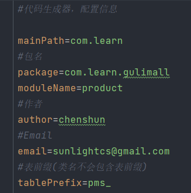

# 谷粒商城项目

自顶向下，从项目中去学习所用到的技术。

# 一.分布式基础-全栈开发篇

基础篇，前端页面制作、前后端分离的后台管理系统的增删改查。

## 0.环境配置

### 虚拟机

**虚拟机安装：**

1. 安装VirtualBox、Vagrant（安装完成重启后，任意目录的cmd窗口执行`vagrant` 检测是否安装成功）。
2. 创建VB_Linuxs文件夹，并在该目录下打开cmd窗口。
3. 镜像准备与安装：（可VB_Linuxs目录的cmd窗口中执行`Vagrant init centos/7`，然后执行`vagrant up`启动环境、安装，这样太慢，不建议。）
   1. 进[Vagrant box centos/7 - Vagrant Cloud (vagrantup.com)](https://app.vagrantup.com/centos/boxes/7)点击找到`virtualbox`字样右侧下载按钮下载box文件（可获取下载链接然后通过IDM下载，这样快一些），下载完成后把该文件放进VB_Linuxs文件夹。
   2. 进入VB_Linuxs目录的cmd窗口，执行以下命令：
      1. 添加安装镜像：`vagrant box add MyVBcentos7  ./CentOS-7-x86_64-Vagrant-2004_01.VirtualBox.box`。（`vagrant box add box配置名称 .box文件`）
      2. 执行初始化命令：`vagrant init MyVBcentos7`，然后就会得到一个Vagrantfile核心配置文件，网络等配置都在里面。
      3. 启动虚拟机：`vagrant up`。
4. 安装完成后在cmd执行`vagrant ssh`进入虚拟机，默认的用户名是vagrant，root用户的密码是`vagrant`；`sudo -i`切换到root用户。

**设置虚拟机固定IP：**

1. 先在cmd窗口执行`ipconfig`，查看IP：如图是`192.168.56.1`，因此设置私有IP时也要以前三个开始。

   

2. 打开Vagrantfile文件找到`config.vm.network "private_network", ip: "192.168.33.10"`，然后将后面的ip设置为`192.168.56.10`。

**远程登录设置：**每次都要进入VB_Linuxs目录来使用`vagrant up`启动虚拟机（关机也是进入这个目录然后执行`vagrant  halt`），如果需要使用账号密码连接xshell，则要先开启支持账号密码登录（若只使用vs Box连接则可以忽略）：

1. 打开Vagrantfile文件，修改：

   - 将`config.vm.network "public_network"`此处注释放开。

   - config.vm.provider处修改为以下：

     ```file
         config.vm.provider "virtualbox" do |vb|
             vb.memory = "1024"
             vb.name= "MyVBcentos7"
             vb.cpus= 2
         end
     ```

   - 保存。

2. `vagrant up`、`vagrant ssh`、`sudo -i`，然后查看IP：`ip a`，第3个eth1下的即是，然后可在其他cmd窗口ping一下用于测试是否可连通。

3. `vi /etc/ssh/sshd_config`，将`PasswordAuthentication  no`的no改为yes，输入passwd可修改root用户密码。

4. `systemctl restart sshd`，重启即可。

### Docker安装及MySQL等

Docker安装见Docked.md。

**Docker中安装MySQL：**

1、`docker pull mysql:5.7`

2、`docker run -p 3306:3306 --name mysql -v /mydata/mysql/log:/var/log/mysql -v /mydata/mysql/data:/var/lib/mysql -v /mydata/mysql/conf:/etc/mysql -e MYSQL_ROOT_PASSWORD=root -d mysql:5.7`

3、MySQL配置——my.cnf：（放于宿主主机的mydata/mysql/conf目录下）

```
[client]
default-character-set=utf8
[mysql]
default-character-set=utf8
[mysqld]
init_connect='SET collation_connection = utf8_unicode_ci' 
init_connect='SET NAMES utf8' 
character-set-server=utf8
collation-server=utf8_unicode_ci
skip-character-set-client-handshake
skip-name-resolve
```

4、重启MySQL容器。

5、`docker exec -it mysql /bin/bash`，进入容器文件系统登陆MySQL。

6、`grant all privileges on *.* to 'root'@'%' identified by 'root' with grant option; flush privileges;`：设置远程登陆。

**Docker中安装Redis：**

1、`docker pull redis`。

2、`mkdir -p /mydata/redis/conf`，将redis的配置文件redis.conf放入里面，修改配置文件。

3、`docker run -p 6379:6379 --name redis -v /mydata/redis/data:/data -v /mydata/redis/conf/redis.conf:/etc/redis/redis.conf -d redis redis-server /etc/redis/redis.conf`。

4、`docker exec -it redis redis-cli`。

### 开发工具及环境

JDK：1.8版本及以上。

Maven：3.6.1。

IDEA插件：MyBatisX、Lombok。

VScode插件：Auto CloseTag、Auto Rename Tag、ESLint、HTMLCSS Support、HTML Snippets、JavaScript(ES6)、LiverServer、OpenInBrowser、Vetur。

HTML Snippets

1. Vetur —— 语法高亮、智能感知、Emmet 等 包含格式化功能， Alt+Shift+F （格式化全文），Ctrl+K Ctrl+F（格式化选中代码，两个 Ctrl 需要同时按着）
2. EsLint —— 语法纠错 
3. Auto Close Tag —— 自动闭合 HTML/XML 标签 
4. Auto Rename Tag —— 自动完成另一侧标签的同步修改 
5. JavaScript(ES6) code snippets — — ES6 语 法 智 能 提 示 以 及 快 速 输 入 ， 除 js 外 还 支 持.ts，.jsx，.tsx，.html，.vue，省去了配置其支持各种包含 js 代码文件的时间 
6. HTML CSS Support —— 让 html 标签上写 class 智能提示当前项目所支持的样式 
7. HTML Snippets —— html 快速自动补全 
8. Open in browser —— 浏览器快速打开
9. Live Server —— 以内嵌服务器方式打开 
10. Chinese (Simplified) Language Pack for Visual Studio Code —— 中文语言包

Git仓库：gulimall。

## 1.微服务搭建

1、在gulimall主目录里创建这些Maven模块——包为com.learn.gulimall.xxx (ware、orderd、...)，模块名为——（gulimall-product（商品服务）、gulimall-order（订单服务）、gulimall-ware（仓储服务）、gulimall-coupon（优惠卷服务）、gulimall-member（会员服务）），然后通过SpringBoot的向导来创建，然后修改各项目的pom.xml文件：（需要修改artifactId、name、description）

```xml
<?xml version="1.0" encoding="UTF-8"?>
<project xmlns="http://maven.apache.org/POM/4.0.0" xmlns:xsi="http://www.w3.org/2001/XMLSchema-instance"
         xsi:schemaLocation="http://maven.apache.org/POM/4.0.0 https://maven.apache.org/xsd/maven-4.0.0.xsd">
    <modelVersion>4.0.0</modelVersion>
    <parent>
        <groupId>org.springframework.boot</groupId>
        <artifactId>spring-boot-starter-parent</artifactId>
        <version>2.2.13.RELEASE</version>
        <relativePath/> <!-- lookup parent from repository -->
    </parent>
    <groupId>com.learn.gulimall</groupId>
    <artifactId>gulimall-product</artifactId>
    <version>0.0.1-SNAPSHOT</version>
    <name>gulimall-product</name>
    <description>谷粒商城-商品服务</description>
    <properties>
        <java.version>1.8</java.version>
        <spring-cloud.version>Greenwich.SR3</spring-cloud.version>
    </properties>
    <dependencies>
        <dependency>
            <groupId>org.springframework.boot</groupId>
            <artifactId>spring-boot-starter-web</artifactId>
        </dependency>
        <!-- https://mvnrepository.com/artifact/org.springframework.cloud/spring-cloud-starter-openfeign -->
        <dependency>
            <groupId>org.springframework.cloud</groupId>
            <artifactId>spring-cloud-starter-openfeign</artifactId>
            <version>2.2.10.RELEASE</version>
        </dependency>

        <dependency>
            <groupId>org.springframework.boot</groupId>
            <artifactId>spring-boot-starter-test</artifactId>
            <scope>test</scope>
        </dependency>

    </dependencies>
    <dependencyManagement>
        <dependencies>
            <dependency>
                <groupId>org.springframework.cloud</groupId>
                <artifactId>spring-cloud-dependencies</artifactId>
                <version>${spring-cloud.version}</version>
                <type>pom</type>
                <scope>import</scope>
            </dependency>
        </dependencies>
    </dependencyManagement>

    <build>
        <plugins>
            <plugin>
                <groupId>org.springframework.boot</groupId>
                <artifactId>spring-boot-maven-plugin</artifactId>
                <version>2.2.13.RELEASE</version>
            </plugin>
        </plugins>
    </build>

</project>
```

2、将gulimall设置为总项目——添加一个pom.xml，如下：

```xml
<?xml version="1.0" encoding="UTF-8"?>
<project xmlns="http://maven.apache.org/POM/4.0.0" xmlns:xsi="http://www.w3.org/2001/XMLSchema-instance"
         xsi:schemaLocation="http://maven.apache.org/POM/4.0.0 https://maven.apache.org/xsd/maven-4.0.0.xsd">
    <modelVersion>4.0.0</modelVersion>
    <groupId>com.learn.gulimall</groupId>
    <artifactId>gulimall</artifactId>
    <version>0.0.1-SNAPSHOT</version>
    <name>gulimall</name>
    <description>聚合</description>
    <packaging>pom</packaging>
    <modules>
        <module>gulimall-product</module>
        <module>gulimall-coupon</module>
        <module>gulimall-member</module>
        <module>gulimall-order</module>
        <module>gulimall-ware</module>
    </modules>

    <properties>
        <java.version>1.8</java.version>
        <spring-cloud.version>Greenwich.SR3</spring-cloud.version>
    </properties>


</project>
```

3、配置总项目目录gulimall的.gitignore，加上以下：

```
**/mvnw
**/mvnw.cmd
**/.mvn
**/target/
.idea
**/.gitignore
```

4、提交并push。

## 2.数据2库初始化

数据库：数据库使用utf8mb4


数据库表文件，依次执行进相应数据库：


## 3.人人开源后台管理系统搭建

### renren-fast

[renren-fast: renren-fast是一个轻量级的Spring Boot2.1快速开发平台，其设计目标是开发迅速、学习简单、轻量级、易扩展；使用Spring Boot、Shiro、MyBatis、Redis、Bootstrap、Vue2.x等框架，包含：管理员列表、角色管理、菜单管理、定时任务、参数管理、代码生成器、日志管理、云存储、API模块(APP接口开发利器)、前后端分离等。 (gitee.com)](https://gitee.com/renrenio/renren-fast)

拉取后删除.git文件后放入gulimall总项目里，并在gulimall的pom.xml文件的module标签里加入。

如果pom.xml文件报红，基本都是插件那块报错，那么就去Maven仓库把那些插件的依赖找到并加入即可。经测试，加上以下两个即可：

```xml
<dependency>
   <groupId>org.codehaus.mojo</groupId>
   <artifactId>wagon-maven-plugin</artifactId>
   <version>1.0</version>
</dependency>
<dependency>
   <groupId>com.spotify</groupId>
   <artifactId>docker-maven-plugin</artifactId>
   <version>0.4.14</version>
</dependency>
```

然后再去application-dev.xml文件里配置好MySQL数据库即可。

启动并访问`localhost:8080/renren-fast/`测试，返回json字符串即可。

### renren-vue

1、拉取项目到本地

[renren-fast-vue: renren-fast-vue基于vue、element-ui构建开发，实现renren-fast后台管理前端功能，提供一套更优的前端解决方案。 (gitee.com)](https://gitee.com/renrenio/renren-fast-vue)


2、要先下载Node.js 10.16.3版本。再在cmd窗口执行：`node config set  registry https://registry.npm.taobao.org/`。在Node.js的安装目录里找到Node.js的npmrc文件并修改为如下：

```
prefix=${APPDATA}\npm
registry = https://registry.npm.taobao.org/
```

3、VScode以管理员模式启动并打开拉取到的项目，然后VScode里打开终端，并执行`npm install`。

4、如果报错node-sass4.9.0相关的，那就再运行`npm install node-sass@npm:sass --ignore-scripts`，运行完成之后直接`npm run dev`，成功！如果报其它错误，仔细看报错信息，然后去网上查找原因与解决方案。

6、运行成功之后跳转到页面，然后可与renren-fast连调：

登录账户：admin；密码：admin。

## 4.使用renren-generator代码生成器

### 以生成gulimall-product模块的基本CRUD代码为例

1、克隆：[renren-generator: 人人开源项目的代码生成器，可在线生成entity、xml、dao、service、vue、sql代码，减少70%以上的开发任务 (gitee.com)](https://gitee.com/renrenio/renren-generator)，然后删除里面的.git文件。

2、将renren-generator项目聚合到gulimall项目里。

3、application.xml——配置好数据库；generator.properties——配置好生成的代码所在的包、表前缀等信息。



4、运行RenrenApplication，默认在80端口，直接访问`http://localhost/`，打开后生成代码并下载：


然后把生成的代码放进gulimall-product里，controller、service、dao、entity以及mapper，如下：


5、创建gulimall-common项目模块，用于存放每一个微服务公共依赖、bean、工具类等，这个项目模块是每个微服务的一个依赖，其pom.xml文件如下：

```xml
<?xml version="1.0" encoding="UTF-8"?>
<project xmlns="http://maven.apache.org/POM/4.0.0"
         xmlns:xsi="http://www.w3.org/2001/XMLSchema-instance"
         xsi:schemaLocation="http://maven.apache.org/POM/4.0.0 http://maven.apache.org/xsd/maven-4.0.0.xsd">
    <parent>
        <artifactId>gulimall</artifactId>
        <groupId>com.learn.gulimall</groupId>
        <version>0.0.1-SNAPSHOT</version>
    </parent>
    <modelVersion>4.0.0</modelVersion>

    <artifactId>gulimall-common</artifactId>
    <description>微服务公共依赖、bean、工具类等</description>
    <properties>
        <maven.compiler.source>8</maven.compiler.source>
        <maven.compiler.target>8</maven.compiler.target>
    </properties>
    <dependencies>
        <dependency>
            <groupId>com.baomidou</groupId>
            <artifactId>mybatis-plus-boot-starter</artifactId>
            <version>3.2.0</version>
        </dependency>
        <dependency>
            <groupId>org.projectlombok</groupId>
            <artifactId>lombok</artifactId>
            <version>1.18.8</version>
        </dependency>
        <dependency>
            <groupId>org.apache.httpcomponents</groupId>
            <artifactId>httpcore</artifactId>
            <version>4.4.12</version>
        </dependency>
        <dependency>
            <groupId>commons-lang</groupId>
            <artifactId>commons-lang</artifactId>
            <version>2.6</version>
        </dependency>
        <dependency>
            <groupId>mysql</groupId>
            <artifactId>mysql-connector-java</artifactId>
            <version>8.0.17</version>
        </dependency>
    </dependencies>
</project>
```

6、将renren-fast模块里的common目录里的**xss目录**复制到gulimall-common项目模块的common目录下、将renren-fast模块里的common目录里的utils目录下的几个类复制到gulimall-common项目模块的common目录下的utils目录里：


7、在renren-generator项目模块的src/main/resources/template目录里找到Controller.java.vm，并注释掉里面的所有的RequiresPermissions，如下：

```
##import org.apache.shiro.authz.annotation.RequiresPermissions;
##@RequiresPermissions("${moduleName}:${pathName}:info")
```

8、启动renren-generator重新生成代码，并将生成代码里面的controller目录替换掉原来放进gulimall-product的controller目录。

9、在gulimall-common模块的xss目录里删除Xss开头的两个类，然后在renren-fast模块的src/main/java/io/renren/common/exception目录里将RRException.java复制到gulimall-common模块的utils目录里，再在gulimall-common加多两个依赖：

```xml
<dependency>
    <groupId>mysql</groupId>
    <artifactId>mysql-connector-java</artifactId>
    <version>8.0.17</version>
</dependency>
<dependency>
    <groupId>javax.servlet</groupId>
    <artifactId>servlet-api</artifactId>
    <version>2.5</version>
    <scope>provided</scope>
</dependency>
```

10、解决Constant的报红：将renren-fast模块的group目录复制到gulimall-common模块的common目录下，再添加以下依赖：

```xml
<dependency>
    <groupId>jakarta.validation</groupId>
    <artifactId>jakarta.validation-api</artifactId>
    <version>2.0.2</version>
</dependency>
```

11、基本完成。

### 5.配置与测试CRUD

以生成gulimall-product模块的基本CRUD代码为例。

1、gulimall-product里加上gulimall-common的依赖：

```xml
<dependency>
    <groupId>com.learn.gulimall</groupId>
    <artifactId>gulimall-common</artifactId>
    <version>0.0.1-SNAPSHOT</version>
</dependency>
```

2、创建application.yml文件，为gulimall-product配置数据源和mybatis-plus：

```yml
spring:
  datasource:
    username: root
    password: 
    url: jdbc:mysql://175.178.181.190:3306/gulimall_pms?useUnicode=true&characterEncoding=UTF-8&useSSL=false&serverTimezone=Asia/Shanghai
    driver-class-name: com.mysql.cj.jdbc.Driver
mybatis-plus:
  mapper-locations: classpath*:/mapper/**/*.xml
  global-config:
    db-config:
      id-type: auto
```

3、测试：

```java
@SpringBootTest
class GulimallProductApplicationTests {
    @Autowired
    BrandService brandService;
    @Test
    void contextLoads() {
        BrandEntity entity = new BrandEntity();
        entity.setName("华为");
        brandService.save(entity);
        System.out.println("保存成功");
    }
}
```

```java
@SpringBootTest
class GulimallProductApplicationTests {


    @Autowired
    BrandService brandService;

    @Test
    void contextLoads() {
        BrandEntity entity = new BrandEntity();
        // 添加
        /*entity.setName("华为");
        brandService.save(entity);
        System.out.println("保存成功");*/
        // 更改
        /*entity.setBrandId(1L);
        entity.setDescript("华为");
        brandService.updateById(entity);
        System.out.println("更新成功");*/
        // 查询
        List<BrandEntity> list = brandService.list(new QueryWrapper<BrandEntity>().eq("brand_id", 1L));
        for (BrandEntity b:list) {
            System.out.println(b);
        }
    }
}
```

## 5.快速配置-代码生成

1、renren-generator：修改application.yml，修改generator.properties的moduleName和tablePrefix；然后启动项目，访问`http:localhost:80/`并生成代码。

3、为各个微服务导入gulimall-common的依赖，并将下载好的代码放到对应的各个微服务模块里。

4、修改各个微服务的application.yml，各个微服务端口设置：coupon：7000；member：8000；order：9000；product：10000；ware：11000。配置模板如下：

```yml
server:
  port: 7000
spring:
  datasource:
    username: root
    password: 
    url: jdbc:mysql://175.178.181.190:3306/gulimall_sms?useUnicode=true&characterEncoding=UTF-8&useSSL=false&serverTimezone=Asia/Shanghai
    driver-class-name: com.mysql.cj.jdbc.Driver
mybatis-plus:
  mapper-locations: classpath*:/mapper/**/*.xml
  global-config:
    db-config:
      id-type: auto
```

5、启动项目访问：

1. coupon：`http://localhost:7000/coupon/coupon/list`。
2. member：`http://localhost:8000/member/member/list`。
3. order：`http://localhost:9000/order/order/list`。
4. product：`http://localhost:10000/product/attr/list`。
5. ware：`http://localhost:11000/ware/purchase/list`。


