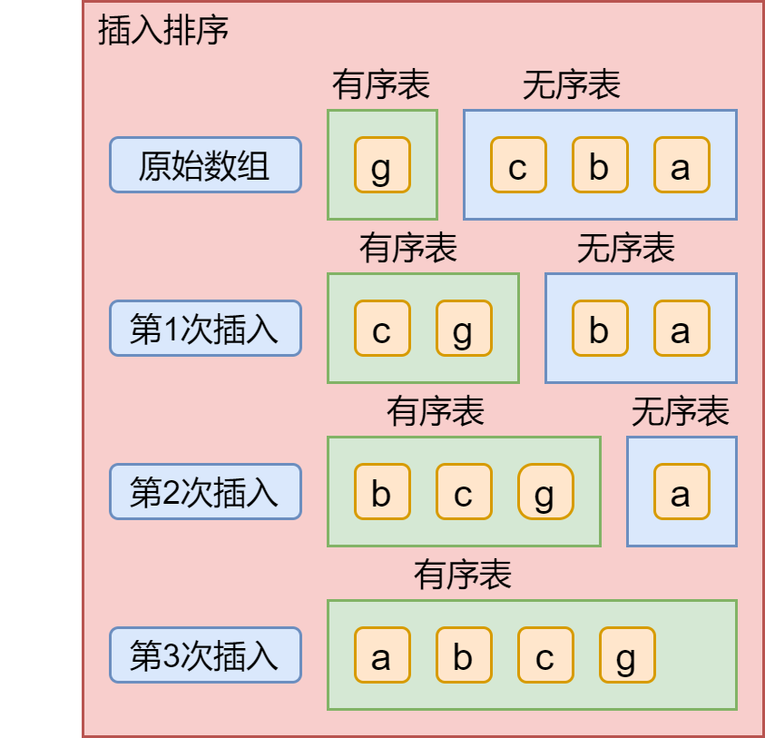

# 算法4

# 排序算法

## 初级排序

### 选择排序

升序：找到数组中最小的那个元素，再将其和数组的第一个元素交换，然后从第二个开始再继续找到第二个最小的数，再和第二个元素交换，依此类推。

```java
public static void selectionSort(Comparable[] a){
    int n = a.length,min = 0;
    // 第一层循环：用于选择数组的索引值
    for (int i = 0; i < n; i++) {
        // 第二层循环：用于比较，找出最小的那个数的索引值
        min = i;
        for (int j = i+1; j < n; j++) {
            if (a[j].compareTo(a[min]) < 0){
                min = j;
            }
        }
        Comparable t = a[i];
        a[i] = a[min];
        a[min] = t;
    }
}
```

时间复杂度：O(n) = (n-1) + (n-2) + (n-3) + 2 + 1 = n(n-1)/2 = n^2/2 -n/2 = n^2/2

空间复杂度：S(n) = O(1)

### 插入排序

插入排序的思想是：把n个待排序的元素看成一个有序表和一个无序表，将无序表中的元素与有序表的元素进行比较来确定该元素应该插入到有序表中的哪个位置。如下图，对数组中元素进行升序排序，将第一个元素看成有序表，其余为无序表。



- 第一次插入实现过程：无序表的c和有序表的g比较，g>c，所以c应该在g之后，c和g交换位置；
- 第二次插入实现过程：无序表中的b和有序表中的元素进行比较，从g开始比较，g>b，所以b、g互换位置，然后b和c比较，b<c，b、c又互换位置，得到b c g；
- 依此类推。

```java
public static void insertSort(Comparable[] a){
    int n = a.length;
    // 第一场循环：选中无序表元素
    for (int i = 1; i < n; i++) {
        // 第二层循环：无序表元素和有序表元素进行比较、交换
        for (int j = i; j > 0; j--) {
            // 比较
            if (a[j].compareTo(a[j-1]) < 0){
                // 交换
                Comparable t = a[j];
        		a[j] = a[j-1];
        		a[j-1] = t;
            }
        }
    }
}
```

### 希尔排序

基于插入排序。希尔排序思想：将数组中任意间隔为h的元素当成有序表。

```java
public static void shellSort(Comparable[] a){
    int n = a.length;
    int h = 1;
    while (h < n/3){
        h = 3 * h + 1;
    }
    while (h >= 1){
        for (int i = h; i < n; i++) {
            for (int j = i; j >= h;j -= h){
                if (a[j].compareTo(a[j-1]) < 0) {
                    Comparable temp = a[j];
                    a[j] = a[j-1];
                    a[j-1] = temp;
                }
            }
        }
        h = h / 3;
    }
}
```


## 归并排序


## 快速排序


## 优先队列


## 排序算法的应用


