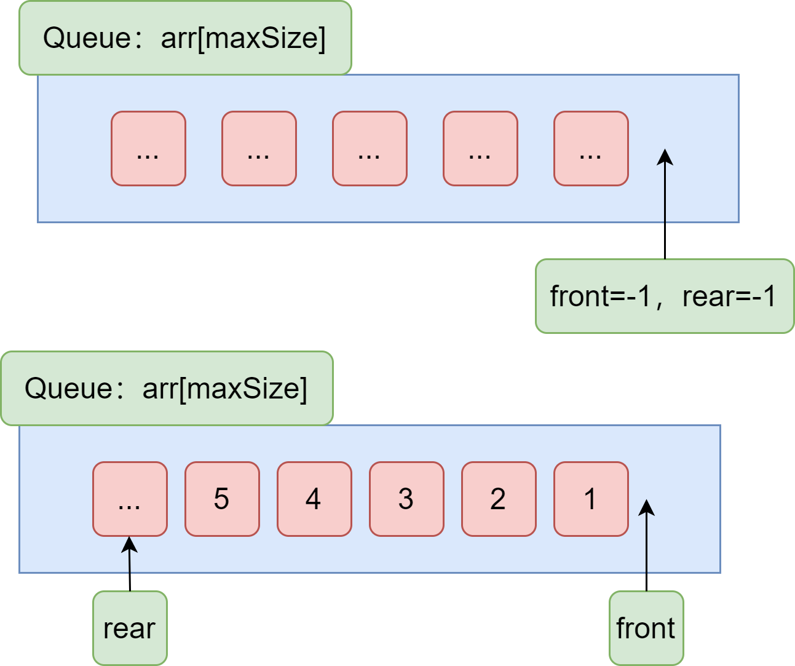
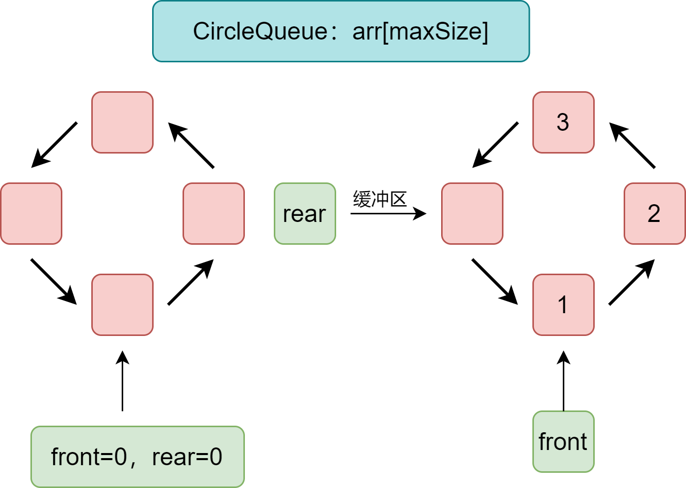

# 概念

数据项：数据的不可分的最小单位，一个数据元素可由若干个数据项组成。

数据元素：组成数据的、有一定意义的基本单位。

数据：描述客观事物的符号（对于计算机来说是可输入、可识别、可操作的）。

数据对象：性质相同的数据元素的集合。

数据结构：相互之间存在一种或多种特定关系的数据元素的集合。（分为逻辑结构和物理结构（存储结构））

**逻辑结构：数据对象中数据元素之间的相互关系**

- 集合结构：数据元素同属一个集合，此外没有其他的相互关系。
- 线性结构：数据元素一对一的关系所组成的线性关系。
- 树形结构：数据元素一对多的关系所形成的的层次关系。
- 图形结构：数据元素多对多的关系。

**物理结构（存储结构）：数据逻辑结构在计算机中的存储形式**（将数据及其逻辑关系存储到计算机中的结构方法）

- 顺序存储结构：数据元素存放在地址连续的存储单元。
- 链式存储结构：数据元素存放在任意的存储单元，存储单元可连续也可不连续（依靠存放地址的指针来定位数据元素）。

数据类型：一组性质相同的值的集合及定义在此集合上的一些操作的总称。（值的不同，所需要的内存大小不同，根据值来设定好一个内存大小）

抽象数据类型：对已有的数据类型的抽象，是操作，一个数学模型及定义在该模型上的操作。（抽象数据类型体现了程序设计中问题分解、抽象和信息隐藏的特性。抽象数据类型把实际生活中的问题分解为多个规模小且易处理的问题，然后建立一个计算机能处理的数据模型，并把每个功能模块的实现细节作为一个独立的单元，从而使具体实现过程隐藏起来）

**算法：解决特定问题求解的步骤的描述（计算机中表现为指令的有限序列）**

算法特性：输入、输出、有穷性（在可接受时间内完成）、确定性（每一步骤都有确定含义且不会出现二义性）、可行性（每一步都能通过有限次数完成）。

好的算法：正确性、可读性、健壮性、高效率、低存储量。

算法效率度量方法：

- 事后统计方法：完成算法后测试不同情况下的运行时间。
- 事前分析估算方法：算法程序编制前使用统计方法对算法进行估算（时间复杂度、空间复杂度）。

**时间复杂度：用来度量算法的运行时间**

程序运行时的消耗时间取决于：

1. 算法采用的策略和方法；（算法好坏的根本）
2. 编译产生的代码质量；（软件因素）
3. 问题的输入规模；
4. 机器执行指令的速度。（硬件因素）

参考时间复杂度的方法由来：[（数据结构）十分钟搞定时间复杂度（算法的时间复杂度） - 简书 (jianshu.com)](https://www.jianshu.com/p/f4cca5ce055a)

使用大O阶方法：（函数的阶数对函数的增长速率影响最大）

- 记法：记总执行次数`T(n) = O(f(n))`，n为问题规模，**随着输入大小 n 的增大，算法执行需要的时间的增长速度可以用 f(n) 来描述**。
- 大O阶方法推导时间复杂度：（通过计算程序执行次数再使用下式推导）
  1. 用常数1取代运行时间中的所有加法常数；
  2. 修改后的运行次数函数中只保留最高阶；
  3. 如果最高阶项存在且不是1，则去除和这个项相乘的常数。

```java
public void runTime() {
   int i = 0;               // 需要执行1次
   System.out.println(i);   // 需要执行1次
}
// 运算次数：T(n)=2 ===> 复杂度O(1)   用1取代加法次数
```

```java
public void runTime() {
     for(int i = 0; i<n; i++) {      // 需要执行 (n + 1) 次
        System.out.println(i);       // 需要执行 n 次
    }
   System.out.println("Hi");            // 需要执行 1 次
} 
// 运算次数：T(n)=(n+1)+n+1=2n+2 ===> 复杂度O(n)   有阶数去除常数项
```

```java
public void runTime() {
     for(int i = 0; i< n; i++) {       // 需要执行 (n + 1) 次
         for(int i = 0; j < n; j++){   // 需要执行 (n + 1) 次
         	System.out.println(i);     // 需要执行（n * n）次
         }
    }
   System.out.println("Hi");            // 需要执行 1 次
} 
// 运算次数：T(n)= n^2 + 2n+1 ===> 复杂度O(n^2)   有阶数取最高阶
```

常见时间复杂度所耗费的时间：

```xml
O(1) < O(logn) < O(n) < O(nlogn) < O(n^2) < O(n^3) < O(2^n) < O(n!) < O(n^n) 
```

**空间复杂度：计算算法所需的存储空间实现**

- S(n)=O(f(n))，n为问题规模，f(n)为关于n所占存储空间的函数。

# 数据结构


一般来说，按照数据的逻辑结构对其进行简单的分类，包括线性结构和非线性结构两类。

线性表是零个或多个的数据元素的有限序列，元素之间有顺序，除了第一个和最后一个，其余的都有一个直接前驱元素和一个直接后驱元素。在线性表的顺序存储结构中，元素在存储空间中是紧密相连的、一个挨着一个的，如果需要删除某个元素则又需要把空出来的内存补上，如果需要插入则又需要移动元素来挪出一块地方来供插入。所以线性表的顺序存储的最大的缺点就是对插入和删除不友好，无论插入或删除都会有几率要移动元素。

线性结构：具体的常见的线性结构有：数组、链表、栈、队列和串等。

非线性结构：具体的结构形式为二维数组、多维数组、广义表、树结构和图结构等。

常用的数据结构：数组（array）、栈（stack）、队列（queue）、链表（linked list）、树（tree）、图（graph）、堆（heap）、散列表（hash）。


# 稀疏数组

- 使用场景：当一个数组中大部分元素是同一个值时；
- 稀疏数组处理方法：把一个数组中不同值的信息（行、列和对应值）以及数组的信息（row、column、有多少个不同的值）都记录进另一个小规模的数组（稀疏数组）。

# 队列Queue

队列是一个有序列表，遵循先入先出原则，可用数组和链表实现。

## **单队列：**



front：用于定位数组的头部，取值-1，头部索引=(front+1)，每取出一次数据front要加1；

rear：用于定位队列的最后一个数据，队列中每加入一个数据rear就加1，实现定位；

maxSize：用于充当队列的最大容量；

队列需要的功能：

1. 创建队列：初始化队列的容量（arr[maxSize]）、初始化“指针”（front、rear）；
2. 往队列中添加数据：如果队列满载则不能添加；
3. 从队列中取出数据：要符合先进先出，队列中没有数据时无法取出；
4. 队列是否满载的判断；
5. 队列数据是否为空的判断；
6. 展示队列全部数据、展示队列头部数据。

```java
public class ArrayQueue {
    private int rear;
    private int front;
    private int maxSize;
    private int[] arr;
    public ArrayQueue(int arrayMaxSize){
        maxSize = arrayMaxSize;
        arr = new int[maxSize];
        // 头部前
        front = -1;
        // 指向队列最后一个数据
        rear = -1;
    }
    // 判断队列是否已经满
    public boolean isFull(){
        return rear == maxSize - 1;
    }
    // 判断队列是否为空
    public boolean isEmpty(){
        return front == rear;
    }
    // 添加数据进队列
    public void addQueue(int n){
        if (isFull()){
            throw new RuntimeException("队列已满！");
        }
        rear++;
        arr[rear] = n;
    }
    // 取出队列中数据
    public int getQueue(){
        if (isEmpty()){
            throw new RuntimeException("队列为空！");
        }
        front++;
        return arr[front];
    }
    // 显示队列中所有数据
    public void showQueue(){
        if (isEmpty()){
            throw new RuntimeException("队列为空！");
        }
        for (int i = 0; i < arr.length;i++){
            System.out.printf("arr[%d]=%d\n",i,arr[i]);
        }
    }
    // 获取队列的头数据
    public int showHead(){
        if (isEmpty()){
            throw new RuntimeException("队列为空！");
        }
        return arr[front+1];
    }
}
```

## **循环队列：**

**使用环形数组实现：**



使用数据简单实现队列中存在一个问题：就是一个队列满载后，即使取出一些数据把位置“空出来”，但空出来的位置已经是不能复用的了，那怎么才能实现一个当满载后再取出数据后还能往队列添加数据的队列呢？答案就是：在数组中把一个位置当为缓冲区，满载时，当取出一个数据，就把这个缓冲区转化为队列的有效位置，而取出数据后空出来的位置就再次充当缓冲区，这样就能把头尾“相连”起来了，就实现了一个环形的数组充当的队列。（如果不满载，缓冲区就逐渐后移就好）

具体实现思路：

1. 先要初始化队列（包含数组、front（队列头数据索引）、rear（缓冲区索引）），注意环形数组需要一个容量充当缓冲区，所以实现的队列的有效容量为最大容量减去1；
2. 考虑maxSize、front、rear的联系（这里利用了它们之间的一些算法）。

```java
public class CircleQueue {
    // 队列最大容量 注意此时有效容量是(maxSize - 1) 多出来的一个用于实现环形
    private int maxSize;
    // front指向队列头
    private int front;
    // rear 队列尾部
    private int rear;
    // 存放数据的地方
    private int[] arr;

    public CircleQueue(int maxSize) {
        this.maxSize = maxSize;
        front = 0;
        rear = 0;
        arr = new int[this.maxSize];
    }
    // 队列是否满了
    public boolean isFull(){
       return  ((rear + 1) % maxSize) == front;
    }
    // 判断队列是否为空
    public boolean isEmpty(){
        return rear == front;
    }
    // 添加数据 进队列
    public void addQueue(int n) {
        if (isFull()) {
            System.out.println("队列已满，不能添加！");
            return;
        }
        arr[rear] = n;
        // 一个数除以另一个数，如果被除数比除数小，那么余数就是被除数本身
        rear = (rear + 1) % maxSize;
    }
    // 出队列
    public void getQueue(){
        if (isEmpty()){
            System.out.println("队列为空，不能取数据！");
            return;
        }
        int value = arr[front];
        front = (front + 1) % maxSize;
    }
    // 显示队列数据
    public void showQueue(){
        if (isEmpty()){
            System.out.println("队列为空，没有数据！");
            return;
        }
        for (int i = front; i < front + size(); i++) {
            System.out.printf("arr[%d]=%d\n",i % maxSize,arr[i % maxSize]);
        }
    }
    // 队列有效个数
    public int size(){
        return (rear + maxSize - front) % maxSize;
    }
    // 显示头部数据
    public int showHead(){
        if (isEmpty()){
            System.out.println("队列为空，没有数据！");
            return 0;
        }
        return arr[front];
    }
}
```


# 链表LinkedList

链式存储实现的线性表。链表使用节点来存储数据，所谓节点，只不过是一个包含这些信息的类的对象：包含要存储的信息和其他存储着相同类型信息的节点对象的地址。

```java
// 一个简单的节点类
class Node{
    private String info; // 存储的信息
    private Node next; // 节点对象
    其他方法...
}
```

## 单向链表

单向链表的节点只能单向指向下一个节点，也可以通过节点存储的信息确定存储的顺序。

**1.确定节点要存储的信息：**

```java
class HeroNode {
    // 节点要存储的信息
    public int no;
    public String name;
    public String nickname;
    // 指向下一个节点
    public HeroNode next;
    // 已经忽略节点的构造方法和toString方法
}
```

**2.链表功能的实现：**

```java
// 这是一个单向链表
class SingleLinkedList {
    // 链表头部不存储数据，只用于定位首个节点有无
    private HeroNode head = new HeroNode(0,"","");
    // 显示链表所有数据
    public void show(){
        if (head.next == null) {
            System.out.println("链表为空");
            return;
        }
        HeroNode temp = head.next;
        while (true){
            System.out.println(temp.toString());
            if (temp.next == null){
                break;
            }
            temp = temp.next;
        }
    }
}
```

a.链表操作：简单的节点添加操作

```java
// 添加节点：遍历到列表的最后一个数据，加上引用完成节点添加
public void add(HeroNode heroNode){
    HeroNode temp = head;
    // 如果遍历到最后一个节点，退出循环
    while (true){
        if (temp.next == null) {
            break;
        }
        temp = temp.next;
    }
    // 添加节点
    temp.next = heroNode;
}
```

b.链表操作：节点存储信息带序号，要求链表中节点按序号排序并且序号不重复

```java
// 有编号的节点，按编号顺序添加
public void addByOrder(HeroNode heroNode){
    HeroNode temp = head;
    // 判断是否有已经有相同编号的标志位
    boolean falg = false;
    // 遍历查询
    while (true) {
        // 如果遍历到末尾，说明可以直接在末尾添加节点
        if (temp.next == null){
            break;
        }
        // 判断是否存在重复的编号
        if (temp.next.no > heroNode.no){
            break;
        }else if (temp.next.no == heroNode.no){
            falg = true;
            break;
        }
        // 指针后移，实现遍历
        temp = temp.next;
    }
    // 添加操作，flag为true表示存在相同编号的节点，不能再进行添加操作
    if (falg) {
        System.out.println("存在相同编号的数据，不能再添加！");
    }else {
        heroNode.next = temp.next;
        temp.next = heroNode;
    }
}
```

c.链表操作：根据传入的节点来修改节点的信息

```java
// 修改节点信息
public void update(HeroNode newNode){
    HeroNode temp = head.next;
    if (temp == null){
        System.out.println("没有节点！");
        return;
    }
    // 标志位，存在相同编号的节点即视为能进行修改操作
    boolean flag = false;
    while (true) {
        if (temp == null) {
            System.out.println("已经遍历完全部节点。");
            break;
        }
        if (temp.no == newNode.no){
            flag = true;
            break;
        }
        temp = temp.next;
    }
    if (flag) {
        temp.name = newNode.name;
        temp.nickname = newNode.nickname;
    }else {
        System.out.println("该节点不存在，无法更改！");
    }
}
```

d.链表操作：根据编号删除节点，失去引用的节点会被垃圾回收

```java
// 删除节点
public void delete(int no) {
    HeroNode temp = head;
    boolean flag =false;
    if (temp.next == null){
        System.out.println("链表为空！");
        return;
    }
    while (true){
        if (temp.next == null){
            break;
        }
        if (temp.next.no == no){
            flag = true;
            break;
        }
        temp = temp.next;
    }
    if (flag){
        temp.next = temp.next.next;
    }else {
        System.out.println("要删除的节点不存在！");
    }
}
```


## 双向链表

双向链表即在单链表的每个节点，再设置一个指向其前驱节点的指针域。

**1.确定节点要存储的信息**

```java
class Node {
    // 节点要存储的信息
    public int no;
    public String name;
    public String nickname;
    // 指向下一个节点
    public Node next;
    // 指向前一个节点
    public Node pre;
}
```

**2.链表功能的实现**

```java
public class DoubleLinkedList {
    // 链表头
    private Node head = new Node(0,"","");
    // 返回头节点
    public Node returnHeadNode(){
        return head;
    }
```

功能1：显示全部节点信息

```java
public void show(){
    if (head.next == null){
        System.out.println("链表为空！");
        return ;
    }
    Node temp = head.next;
    while (true){
        if (temp == null){
            break;
        }
        System.out.println(temp);
        temp = temp.next;
    }
}
```

功能2：添加节点进链表

```java
public void add(Node node){
    Node temp = head;
    while (true){
        if (temp.next == null){
            break;
        }
        temp = temp.next;
    }
    temp.next = node;
    node.pre = temp;
}
```

功能3：修改指定节点

```java
public void update(Node node){
    if (head.next == null){
        System.out.println("链表为空！");
        return;
    }
    Node temp = head.next;
    boolean flag = false;
    // 遍历寻找要修改的节点
    while (true){
        if (temp == null){
            System.out.println("已经遍历完全部链表！");
            break;
        }
        if (temp.no == node.no){
            flag = true;
            break;
        }
        temp = temp.next;
    }
    if (flag){
        temp.name = node.name;
        temp.nickname = node.nickname;
    }else {
        System.out.println("不存在");
    }
}
```

功能4：删除指定节点

```java
public void delete(int no) {
    Node temp = head.next;
    boolean flag =false;
    if (temp.next == null){
        System.out.println("链表为空！");
        return;
    }
    // 遍历：找到要删除的节点 temp.next
    while (true){
        if (temp == null){
            System.out.println("已经遍历全部节点！");
            break;
        }
        if (temp.no == no){
            flag = true;
            break;
        }
        temp = temp.next;
    }
    if (flag){
        temp.pre.next = temp.next;
        if (temp.next != null){
            temp.next.pre = temp.pre;
        }
    }else {
        System.out.println("要删除的节点不存在！");
    }
}
```

## 环形链表

### 形成单向环形链表：

```java
public class CircleLinkedList {
    private Girl headFirst = new Girl(-1);
    public void addGirl(int nums){
        if (nums < 1){
            System.out.println("nums的值错误！");
            return;
        }
        Girl curGirl = null;
        for (int i = 1; i <= nums; i++) {
            Girl girl = new Girl(i);
            if (i == 1){
                headFirst = girl;
                headFirst.setNext(girl);
                curGirl = headFirst;
            }else {
                curGirl.setNext(girl);
                girl.setNext(headFirst);
                curGirl = girl;
            }
        }
    }
    // 遍历
    public void showGirl(){
        if (headFirst == null){
            System.out.println("链表为空！");
            return;
        }
        Girl curGirl = headFirst;
        while (true){
            System.out.printf("小孩 %d \n", curGirl.getNo());
            if (curGirl.getNext() == headFirst){
                break;
            }
            curGirl =curGirl.getNext();
        }
    }

}

class Girl {
    private int no;
    private Girl next;
    public Girl(int no) {
        this.no = no;
    }
	...
}
```

### 解决约瑟夫问题：

```txt
设编号为1、2、3、...、n的n个人围成一圈，约定编号为k(1<=k<=n)，的人从1开始报数，数到m的那个人出列，他的下一位又从1开始报数，数到m的那个人又出列，直到所有人出列为止（由此产生一个出队编号的序列）。
```

```java
// 根据用户输入形成出圈的序列: 从哪开始数 每次数多少下 最初圈中有多少个
public void countGirl(int startNo, int countNum, int nums){
    if (headFirst == null || startNo < 1 || startNo > nums){
        System.out.println("参数有误！");
        return;
    }
    Girl helper = headFirst;
    while (true) {
        if (helper.getNext() == headFirst){
            break;
        }
        helper = helper.getNext();
    }
    // 确定到起始位置
    for (int i = 0; i < startNo - 1; i++) {
        headFirst = headFirst.getNext();
        helper = helper.getNext();
    }
    // 从起始位置开始报数出圈，直到只有一个节点
    while (true){
        if (helper == headFirst) {
            break;
        }
        // 按countNum移动，到达位置就出圈
        for (int i = 0; i < countNum - 1; i++) {
            headFirst = headFirst.getNext();
            helper = helper.getNext();
        }
        System.out.printf("小孩%d出圈\n",headFirst.getNo());
        headFirst = headFirst.getNext();
        helper.setNext(headFirst);
    }
    System.out.printf("最后留在圈中的是：%d\n",headFirst.getNo());
}
```

# 栈

## 概述

1. 栈（stack，又名堆栈）是一个先入后出（FILO-First In Last Out）的有序列表。 
2. 栈(stack)是一种特殊线性表，其元素的插入和删除只能在线性表的同一端进行。允许插入和删除的一端，也就是能变化的一端，称为栈顶(Top)，另一端为固定的一端，称为栈底(Bottom)。 
3. 根据栈的定义可知，最先放入栈中元素在栈底，最后放入的元素在栈顶，而删除元素刚好相反，最后放入的元素最先删除，最先放入的元素最后删除。

## 应用场景

1. 子程序的调用：在跳往子程序前，会先将下个指令的地址存到堆栈中，直到子程序执行完后再将地址取出，以回到原来的程序中。
2. 处理递归调用：和子程序的调用类似，只是除了储存下一个指令的地址外，也将参数、区域变量等数据存入堆栈中。
3. 表达式的转换[中缀表达式转后缀表达式]与求值(实际解决)。 
4. 二叉树的遍历。 
5.  图形的深度优先(depth 一 first)搜索法。

# 哈希表(散列)

散列表（Hash table，也叫哈希表），是根据关键码值(Key value)而直接进行访问的数据结构。也就是说，它通过把关键码值映射到表中一个位置来访问记录，以加快查找的速度。这个映射函数叫做散列函数，存放记录的数组叫做散列表。

给定表M，存在函数f(key)，对任意给定的关键字值key，代入函数后若能得到一个包含该关键字的记录在M表中的地址，则称表M为哈希(Hash）表，函数f(key)为哈希(Hash) 函数。


# 堆


# 图graph


# 树Tree


# 算法


