# 计算机网络基础

## 计算机网络和Internet

计算机网络 = 通信技术 + 计算机技术。

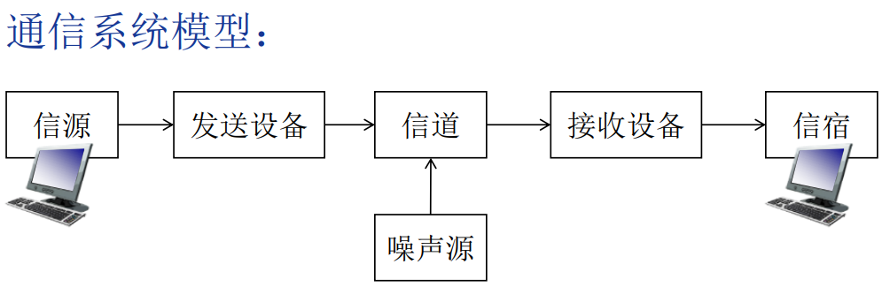

计算机网络？

- 计算机网络是互连的、自治的计算机集合。（自治：无主从关系，互连：互联互通）
- 计算机网络通过交换网络互连主机。

如何解释Internet？

1. 从组成细节上来讲，Internet就是全球最大的互连网络，是ISP（Internet Service Provider，因特网服务提供商）网络互连起来的“网络之网络”，其由以下组成几部分：
   - 数以百万计的互连的计算机设备集合。（也就是主机（hosts，也称为端系统，end system），能运行各种网络应用程序）。
   - 链路。（分无线链路和有线链路，例如光纤、铜缆、无线电、卫星......）
   - 交换网络。（作用是转发分组数据包，由路由器（routes）和交换机（switches）提供物理支持）
2. 从服务角度上来讲，其是为网络应用提供通信服务 的通信基础设施，是为网络应用提供应用编程接口（API）。
   - Web, VoIP, email, 网络游戏, 电子商务, 社交网络, …...
   - 支持应用程序“连接” Internet，发送/接收数据 ；提供类似于邮政系统的数据 传输服务。

可是仅仅有硬件的连接并不能实现Internet的顺畅运行和数据的有效交付，还需要网络协议。

## 协议

网络协议，简称协议，是为进行网络中的数据交换而建立的规则、标准或约定。协议规范了网络中所有信息发送和接收过程，是通信或信息交换过程应该遵守的规则。不同的协议所对应的功能实现也不一样。

协议规定了通信实体之间所交换的信息格式、意义、顺序以及针对收到信息或发 生的事件所采取的“动作”（actions）。

协议三要素：

1. 语法syntax：（类比于写信格式）
   - 就是数据与控制信息的结构或格式（发送的数据的内容格式）。
   - 底层信息对象：信号电平。
2. 语义semantics：（类比于信封上的信息）
   - 规定信息交换过程中需要发出的控制信息、接收到信息时要完成何种动作以及做出何种响应。
   - 差错控制。
3. 时序timing：规定双方交换信息的事件顺序和速度匹配。

Internet标准协议：RFC（Request for Comments）。IETF负责。

## 网络结构

### 计算机网络结构

计算机网络结构有三部分组成：

1. 网络边缘：主机、网络应用。
   - 网络应用模型有客户/服务器(client/server)应用模型、对等(peer-peer, P2P)应用模型。
   - C/S：客户发送请求，接收服务器响应，如：Web应用，文件传输FTP应用。
   - P2P：无（或不仅依赖）专用服务器，通信在对等实体之间直接进行，如：Gnutella, BT, Skype, QQ。
2. 接入网络：有线或无线通信链路。
3. 网络核心（核心网络）: 互联的路由器（或分组转发设备）网络。
   - 网络核心的关键功能：路由 + 转发。
   - 路由(routing):  确定分组从源到目的传输路径，路由器遵循一定的协议来执行路由算法来确定路由上哪个路由器或服务器。
   - 转发(forwarding):  将分组从路由器的输入端口交换至正确的输出端口。
   - 如何实现数据从源主机通过网络核心送达目的主机？就是通过**数据交换**。

典型的网络传输速率：10 Mbps, 100Mbps, 1Gbps, 10Gbps。100Mbps = 100/8 Mb/s = 12.5Mb/s。

### Internet结构

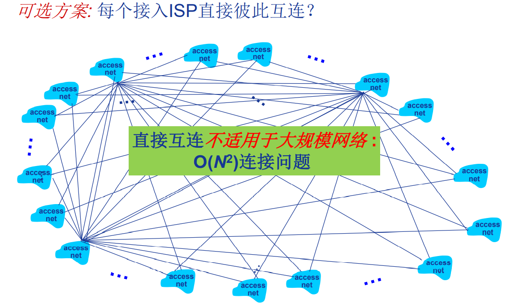

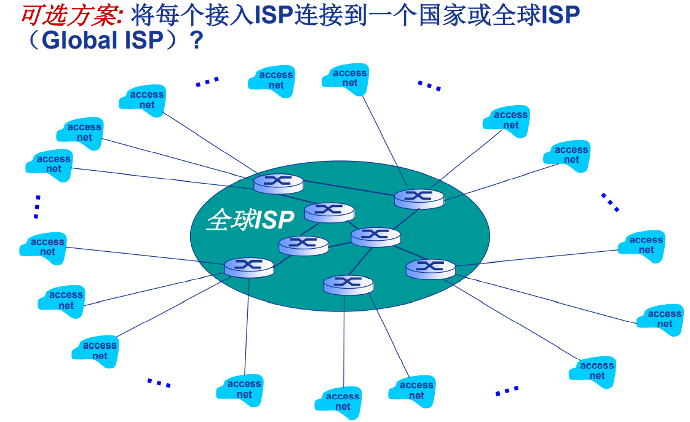

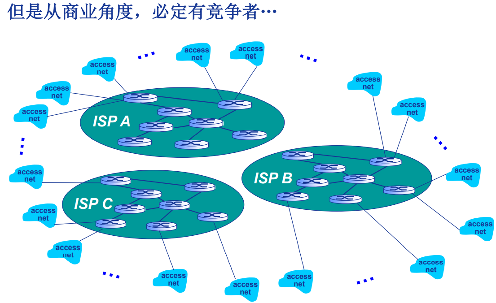

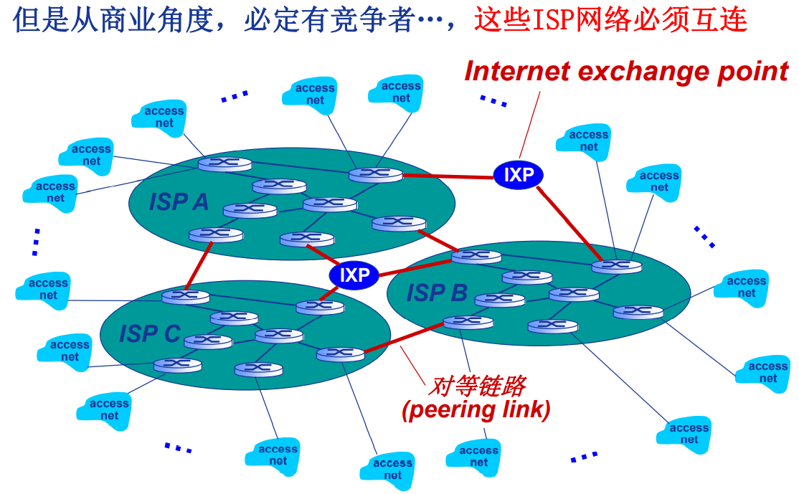

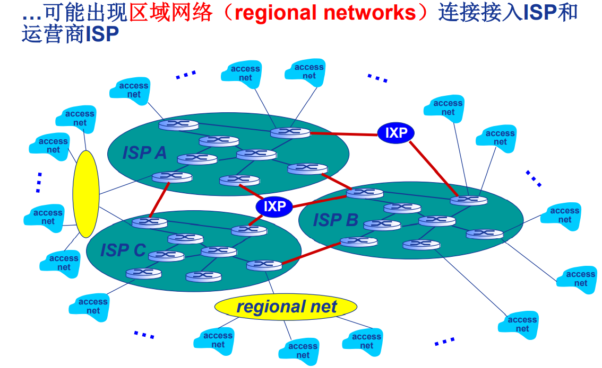

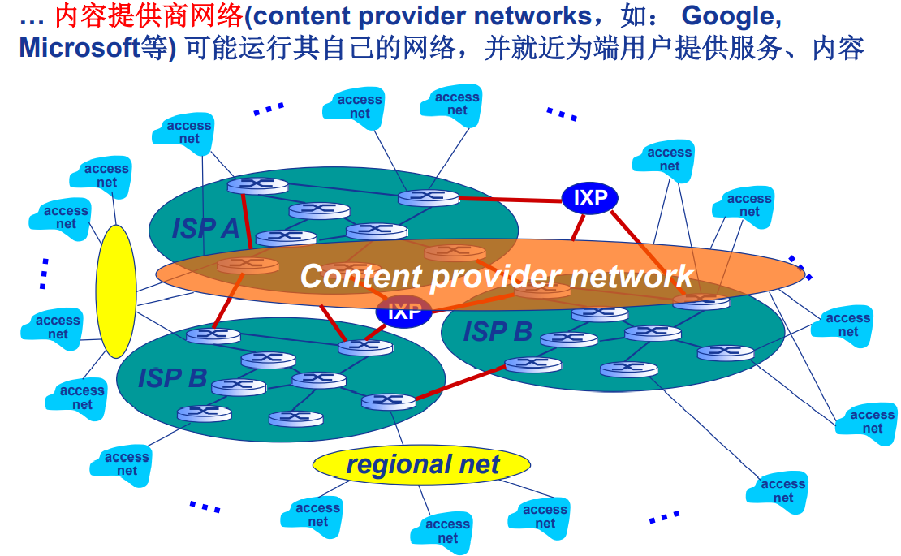

所以在网络中心出现以下情况:

-  少数互连的大型网络，“一级”(tier-1)商业ISPs (如：网通、电信、Sprint、 AT&T)，提供国家或国际范围的覆盖 。
-  内容提供商网络（content provider network，如：Google)：私有网络， 连接其数据中心与Internet，通常绕过一级ISP和区域ISPs。

网络拓扑结构：

是指用传输媒体互连各种设备的物理布局，就是用什么方式把网络中的计算机等设备连接起来。 拓扑图给出网络服务器、工作站的网络配置和相互间的连接，它的结构主要有星型结构、环型结构、总线结构、分布式结构、树型结构、网状结构、蜂窝状结构等。 实现网络拓扑发现可以针对不同的需求选择最佳网络结构，提高网络通信效率，增强通信稳定性。

## 数据交换

如何实现数据从源主机通过网络核心送达目的主机？就是通过**数据交换**，数据交换依赖于交换设备。

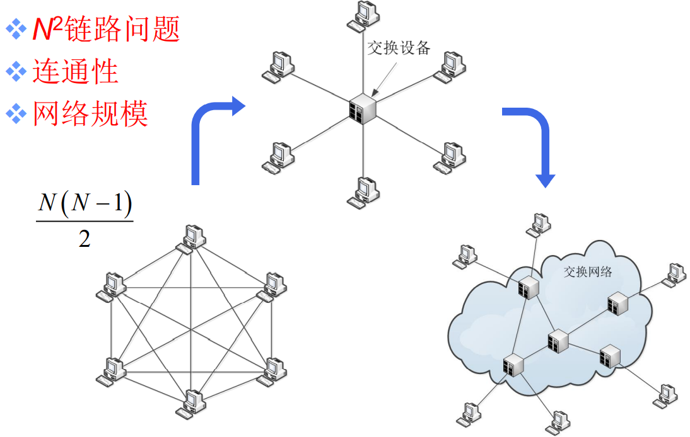

如果主机之间以直连的方式，当连接的主机过多，那么每台主机所要维护的接口就过多，同时也会存在N^2链路问题；为了解决这些问题，就用一台设备（交换设备）专门处理主机与主机之间的连接问题，但随之而来的问题是，如果主机数量太多，那么交换设备也要维护大量的接口，所以又发展出了交换网络来应对这种问题。

交换就是：动态转接端口、动态分配传输资源。其分为：电路交换 、报文交换、分组交换。

### 电路交换

最典型电路交换网络：电话网络。

电路交换的三个阶段： 建立连接（呼叫/电路建立）、通信 、释放连接（拆除电路）。

特点：一旦建立电路，通信双方占有的通信资源不能被第三方共享。

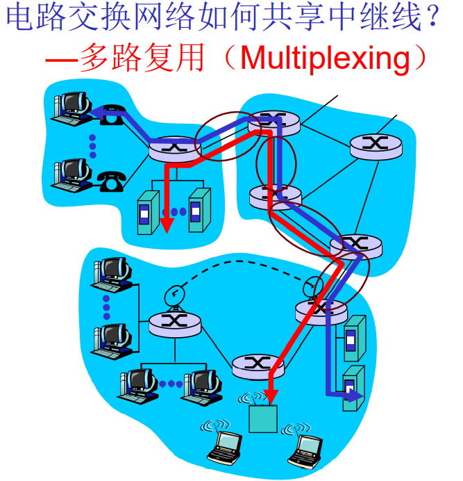

### 报文交换和分组交换

**报文交换：**

- 报文交换就是把整个报文作为一个整体一次性来进行交换到下一个节点路由器直到目的主机上。
- 报文：就是要发送的信息整体（比如文件、照片等，就是你要发送的具体信息内容，封装成了报文来发送）。

**分组交换：**

- 分组交换就是在源主机将报文拆成一些小的分组（拆分时会加入一些信息来封装），然后源主机一个分组一个分组来进行转发，直至所有分组转发到目的主机，然后目的主机就会按顺序将分组组装成完整的报文。
- 分组交换需要报文的拆分和重组。
- 分组：分组即数据包，是报文拆分出来的一系列相对较小的数据包。

报文交换、分组交换都采用“存储-转发”的方式。

**分组交换和报文交换的所用时间的比较：**

分组传输会有一个分组延时：

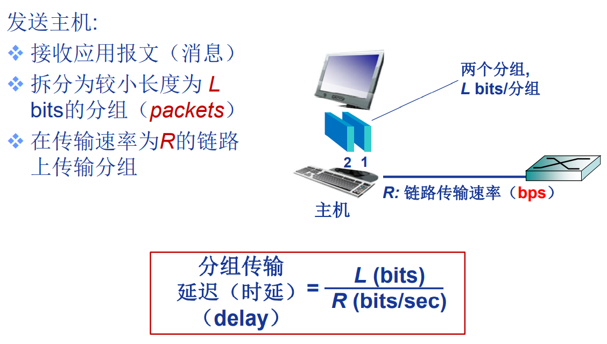

我们计算一下分组交换、报文交换的时间：

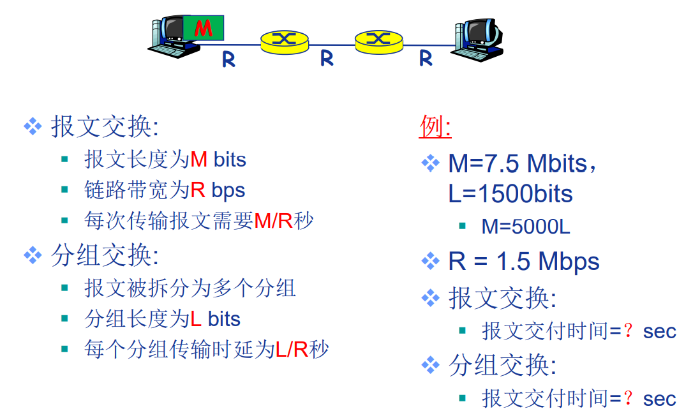

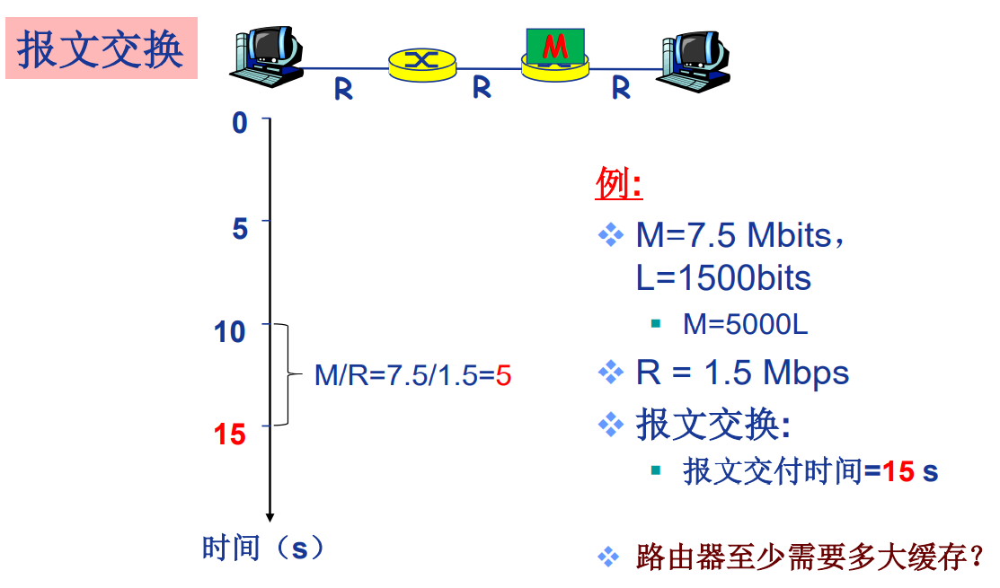

此时，以上述为例，如果通过报文交换的方式，中间的路由器至少需要7.5Mbit的缓存。

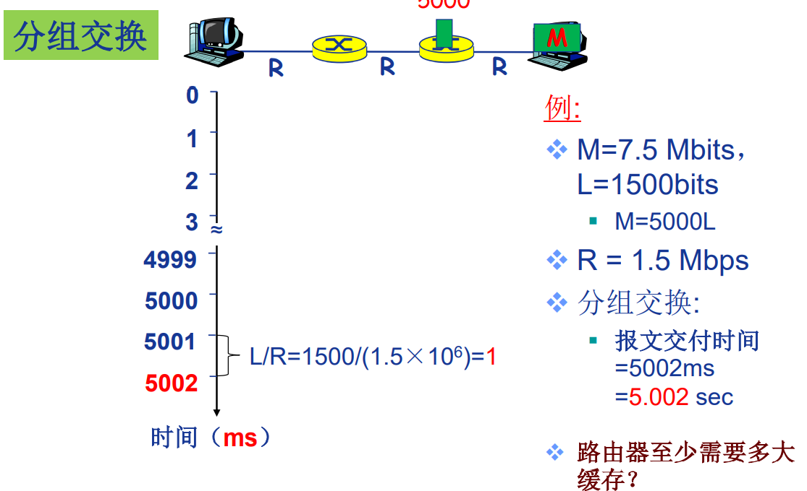

此时，以上述为例，如果通过报文交换的方式，中间的路由器至少需要1500bit的缓存。

通过上述报文交换和分组交换的报文交付时间的比较，可以看出分组交换更节约时间，也因此，目前的大都采用的是分组交换的方式。

分组交换的交付时间计算公式：

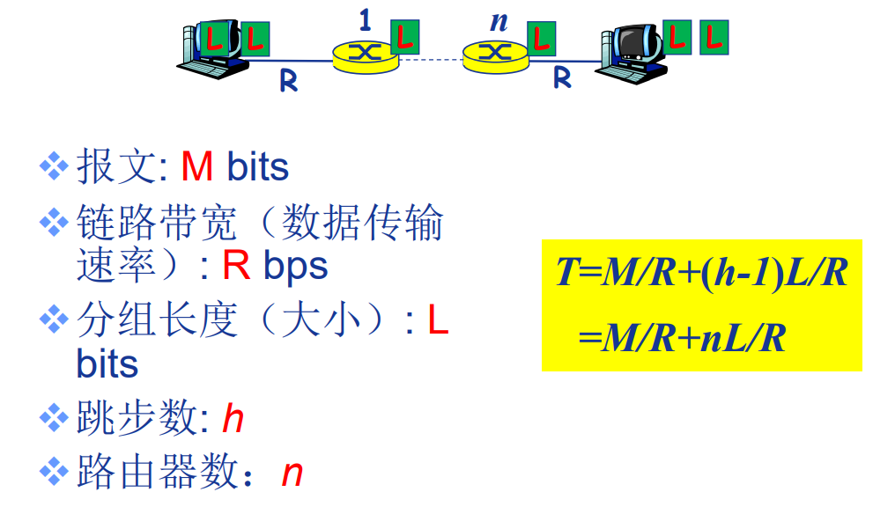

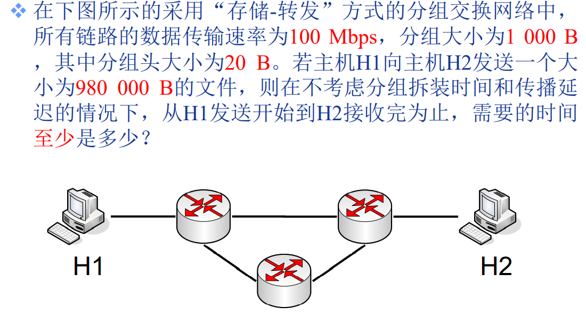

分组数量：980000 / 980 = 1000组；路由器数：n = 2；分组大小：L = 1000B = 8000 bit；

分组后总报文长度：M = (980000 + 1000 * 20) B = (980000 + 1000 * 20) * 8 bit；

交付至少需要的时间为：

T = (M / R) + n*L / R = (980000 + 1000 * 20) * 8 / 100,000,000 + 2*8000 / 100,000,000 = 0.08 s+ 0.00016 s = 80.16ms.

分组交换 vs 电路交换？

分组交换：

1. 适用于突发数据传输网络 。
   - 资源充分共享 。
   - 简单、无需呼叫建立 。
2. 可能产生拥塞（congestion）: 分组延迟和丢失。
   - 需要协议处理可靠数据传输和拥塞控制。

电路交换：更实用于实时数据流传输。

## 计算机网络性能

### 速率和带宽

速率即数据率(data rate)或称数据传输速 率或比特率(bit rate)：

- 表示单位时间（秒）传输信息（比特）量 ，是计算机网络中最重要的一个性能指标 。
- 单位：b/s（或bps）、kb/s、Mb/s、Gb/s 。
- k=10^3 、M=10^6 、G=10^9。（速率往往是指额定速率或标称速率）

“带宽”(bandwidth)原本指信号具有的频带宽度，即最高频率与最低频率之差，单位是赫兹（Hz），网络的“带宽”通常是数字信道所能传送的“最高数据率”，单位：b/s (bps，位每秒)。

常用单位：kb/s （10^3 b/s）、Mb/s（10^6 b/s）、Gb/s（10^9 b/s）、Tb/s（10^12 b/s）。

### 丢包和时延

分组交换为什么会发生丢包和时延?因为分组在路由器缓存中排队（分组到达速率超出输出链路容量时，分组就得排队，等待输出链路可用）；丢包是因为如果路由器的缓存已满，就会导致分组被丢弃。

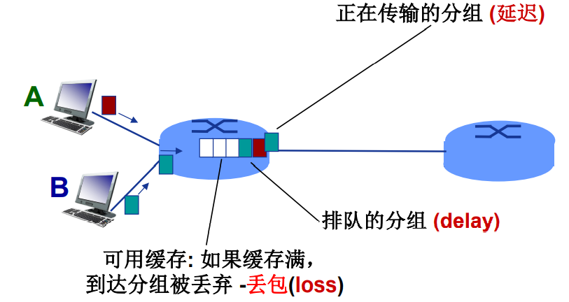

四种分组延时：

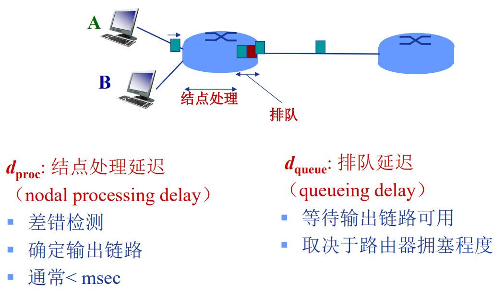

传输延时与传播延时：

- 传输延时：经节点处理和排队后，路由器推出分组数据到链路上所需要的时间，所以传播延时就是分组长度除以带宽。
  - 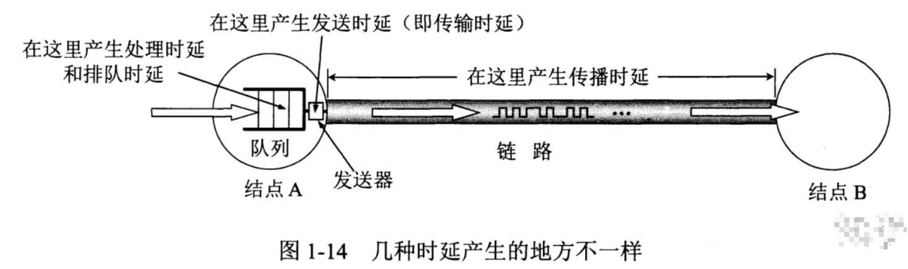
- 而传播延时则是信号从一台路由器到另一台路由器之间传播所需要的时间。

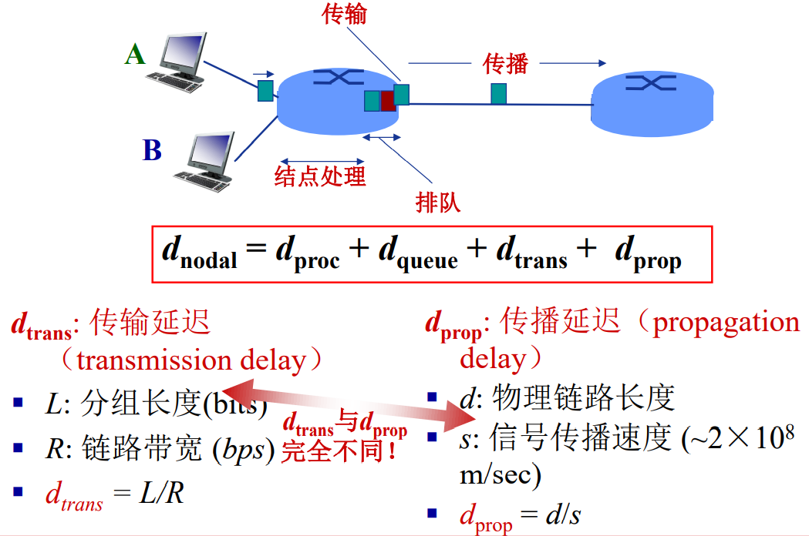

关于排队延时的衡量：

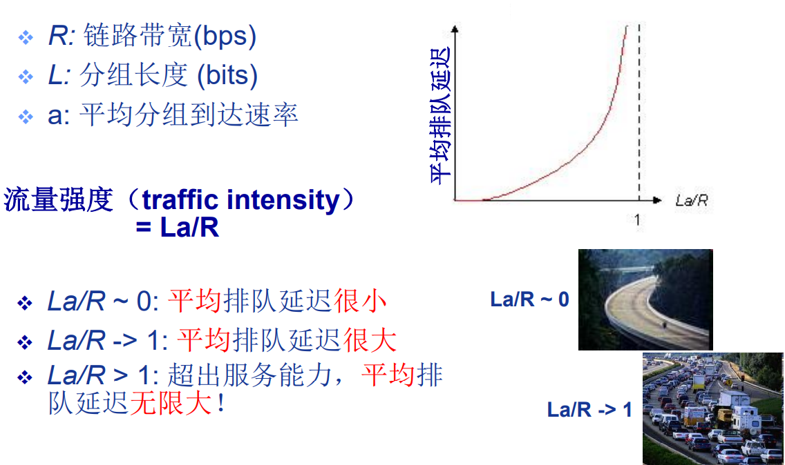

### 时延带宽积

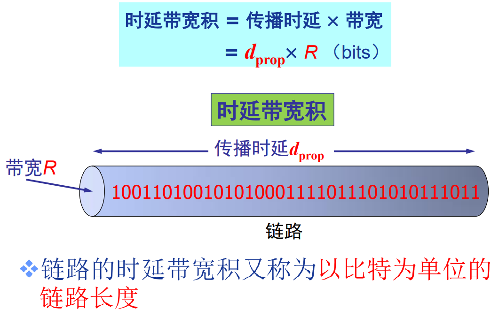

也就是指该带宽的链路，每秒传播都是bit的信息。

### 吞吐量

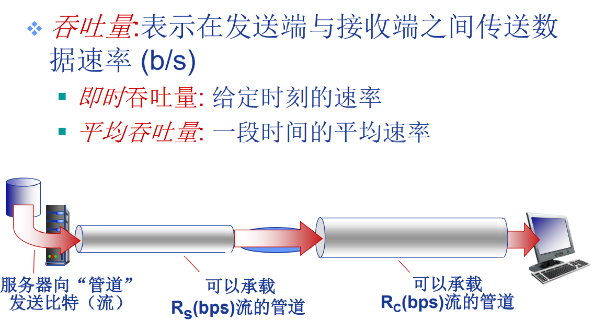

吃进来、吐出去的能力。

## 计算机网络体系结构

### 概述

- 网络体系结构是**从功能上描述**的计算机网络结构。
- 每层遵循某个或某些网络协议完成本层功能。
- 计算机网络体系结构是计算机网络的各层及其协议的集合。
- 体系结构是一个计算机网络的功能层次及其关系的定义。
- 体系结构是抽象的。

分层结构好处：

- 结构清晰，有利于识别复杂系统的部件及 其关系。
- 模块化的分层易于系统更新、维护。
- 有利于标准化。

### OSI参考模型

关于OSI参考模型：开放系统互连 (OSI)参考模型 是由国际标准化组织 (ISO) 于 1984年提出的分层网络体系结构模型，目的是支持异构网络系统的互联互通，是异构网络系统互连的国际标准，也是理解网络通信的最佳学习工具 （理论模型），理论上成功，不过在市场上是失败的。

包含7层（功能），每层完成特定的网络功能：

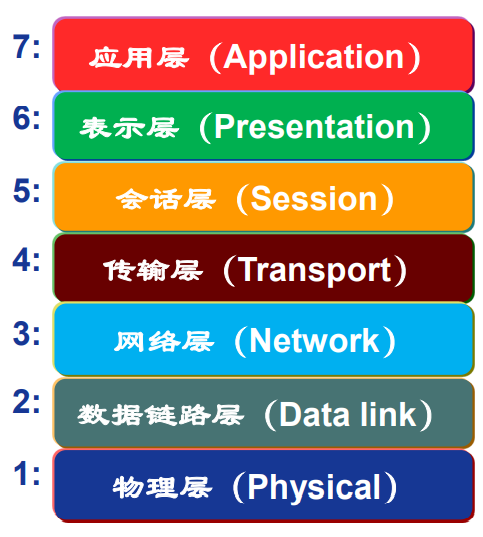

OSI参考模型解释的通信过程：

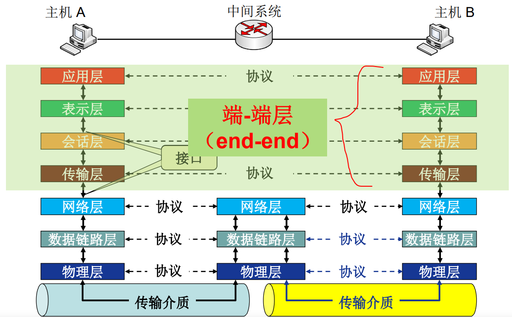

OSI参考模型数据封装与通信过程：

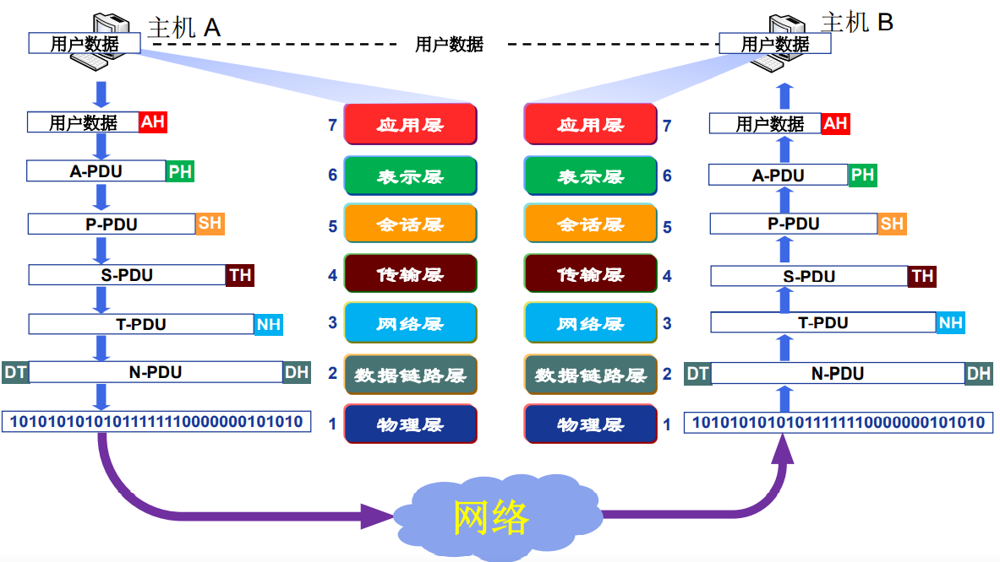

为什么需要数据封装？**是为了增加控制信息，用于构造协议数据单元 (PDU)。**

控制信息主要包括：

- 地址（Address）: 标识发送端或接收端。
- 差错检测编码（Error-detecting code）: 用于差错检测或纠正。
- 协议控制（Protocol control）: 实现协议功能的附加信 息，如: 优先级（priority）、服务质量（QoS）、 和安全控制等。

传输层：负责源到目的之间的完整报文传输（端到端、进程之间）

1. 报文分段和重组。
2. SAP寻址：确保将完整报文提交给正确进程，如端口号。
3. 连接控制。
4. 流量控制。
5. 差错控制。

会话层：

1. 对话控制（dialog controlling）（建立、维护）
2. 同步(synchronization) 在数据流中插入“同步点”

表示层：处理两个系统间交换信息的语法与语义（syntax and semantics ）问题

1. 数据表示转化：转换为主机独立的编码
2. 加密/解密
3. 压缩/解压缩

应用层：

1. 支持用户通过用户代理（如浏览器）或网络接口 使用网络（服务）
2. 典型应用层服务：
   - 文件传输（FTP）、电子邮件（SMTP）、 Web（HTTP）

TCP/IP参考模型：

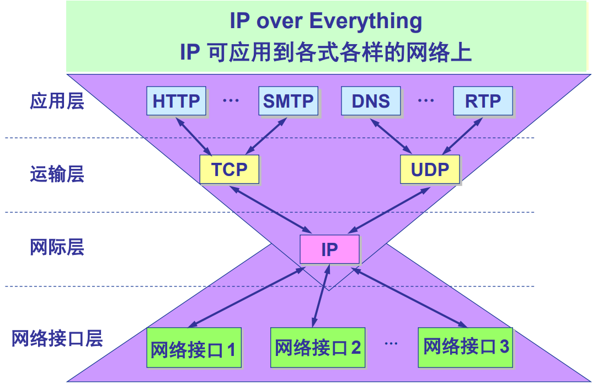

### 五层参考模型

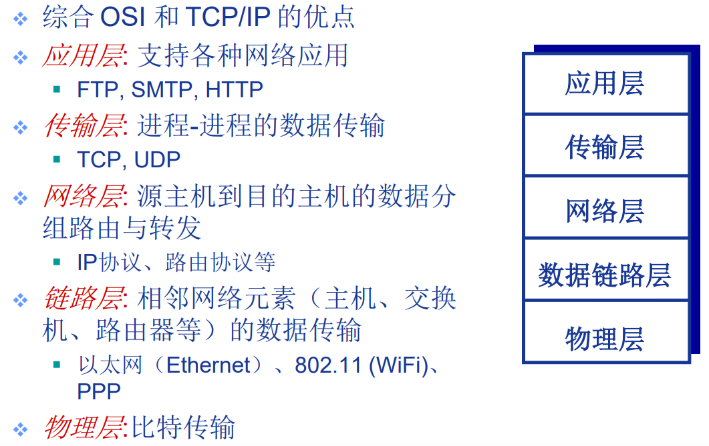

数据封装：

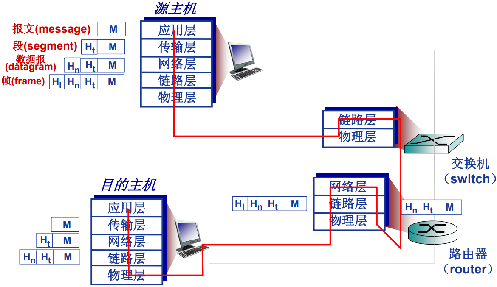

## 发展历史

1961-1972，早期分组交换原理的提出与应用：

1. 1961: Kleinrock – 排队论 证实分组交换的有效性

2. 1964: Baran – 分组交换 应用于军事网络

3. 1967: ARPA（Advanced  Research Projects  Agency）提出ARPAnet 构想

4. 1969: 第一个ARPAnet 结 点运行

5. 1972: 

   - ARPAnet公开演示 

   - 第一个主机-主机协议NCP  (Network Control Protocol)  

   - 第一个e-mail程序 

   - ARPAnet拥有15个结点

     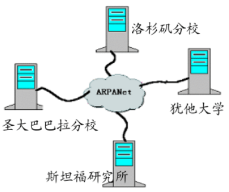

1972-1980，网络互连，大量新型、私有网络的涌现：

1. 1970：在夏威夷构建了 ALOHAnet卫星网络

2. 1974：Cerf 与 Kahn – 提出 网络互连体系结构

3. 1976：Xerox设计了以太网

4. 70’s后期：

   - 私有网络体系结构: DECnet,  SNA, XNA  

   - 固定长度分组交换 (ATM 先驱)

5. 1975：ARPAnet移交给美国 国防部通信局管理

6. 1979：ARPAnet拥有200结点

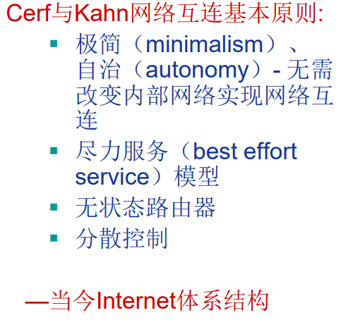

1980-1990，新型网络协议与网络的激增：

1. 1983: 部署TCP/IP 
2. 1982: 定义了smtp电子邮件协议 
3. 1983: 定义了DNS 
4. 1985: 定义了FTP协议 
5. 1988: TCP拥塞控制 
6. 新型国家级网络:  CSnet，BITnet，NSFnet，Minitel（法国） 
7. 1986：NSFnet初步形成了一个由骨干网、区 域网和校园网组成的三 级网络 
8. 100,000台主机连接公共网络

1990, 2000’s，商业化、Web、新应用：

1. 1990’s早期: ARPAnet退役
2. 1991: NSF解除NSFnet的商 业应用限制(1995年退役)， 由私营企业经营 
3. 1992:因特网协会ISOC成立 
4. 1990s后期: Web应用 
   - 超文本（hypertext） [Bush  1945, Nelson 1960’s] 
   - HTML, HTTP: Berners-Lee 
   - 1994: Mosaic、Netscape浏览 器 
   - 1990’s后期:Web开始商业应用 
5. 1990’s后期 – 2000’s: 
   - 更多极受欢迎的网络应用:  即时消息系统（如QQ）， P2P文件共享 
   - 网络安全引起重视
   -  网络主机约达50000，网络用户达1亿以上 
   - 网络主干链路带宽达到 Gbps

2005-至今：

1. ~7.5亿主机 
2. 智能手机和平板电脑 
3. 宽带接入的快速部署 
4. 无处不在的高速无线接入快速增长 
5. 出现在线社交网络:  Facebook: 很快拥有10亿用户 
6. 服务提供商 (如Google, Microsoft)创建其自己的专用网络 ：绕开Internet，提供“即时”接入搜索、email等服务 
7. 电子商务、大学、企业等开始在“云”中运行自己的服务 (如， Amazon EC2)

# 应用层

## 网络应用原理

**网络应用体系结构：**

1. C/S结构：客户端与服务端，客户主机与服务主机。
   - 服务器Server：服务器提供服务，需要一直运行；要有永久性访问的地址/域名；可以利用大量的服务器实现可拓展性。
   - 客户机Client：与服务器通信，使用服务器提供的服务；间歇性接入网络，可能使用动态IP地址；不会与其他客户机直接通信。
2. P2P（Peer to Peer）结构：客户主机到客户主机。（P2P还有point to point 点对点下载的意思）
   - 任意端系统/节点之间可以直接通讯，间歇性接入网络，节点可能改变IP地址。
3. 混合结构：结合以上两种，文件传输使用P2P，文件搜索使用C/S结构。

**网络应用进程通信：**

1. 进程：主机上运行的程序。
2. 进程通信：
   - 同一主机上运行的进程通过由操作系统决定的进程间通信机制来决定。
   - 不同主机的进程通过信息交换来进行通信。
   - 进程通信利用socket发送/接收消息来实现。
   - 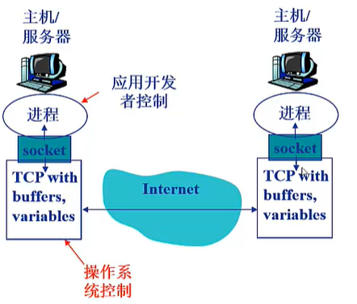
3. 每个进程有标识符，方便区分哪个哪个进程，以便信息的传递
   - 寻址进程：通过IP地址来寻址主机，再通过端口号来寻址到进程。
   - 进程的标识符：IP地址加上端口号。
4. 消息交换的规矩——协议：
   - 公开协议：HTTP、SMTP等；由RFC制定。RFC文档。
   - 私有协议：多数P2P文件共享应用。

**网络应用需求和传输层服务：**

需求：

1. 数据丢失（data loss）/  可靠性（reliability）的要求：
   - 是否允许数据丢失？网络电话就可以允许一定量的数据丢失，文件传输就不允许数据丢失。
2. 时间（timing） /  延时要求：
   - 延时足够低时才有效的应用，如网络游戏。
3. 带宽（bandwidth）要求：
   - 带宽达到最低要求才有效的应用，如网络视频。
   - 要能适合任何带宽的应用，如电子邮件。

传输层服务：

1. TCP服务。
2. UDP服务。

## WEB应用

World Wide Web：Tim Berners-Lee。

### HTTP连接类型

RTT（Round Trip Time）：从客户端发送一个很小的数据包到服务器并返回所经历的时间。

1. 非持久性连接：每个TCP连接最多允许传输一个对象。（HTTP1.0）
   - 请求目标主机的资源时，要为所有请求的资源对象建立一个TCP连接。
   - 响应时间：
     1. 发起、建立TCP连接：1个RTT
     2. 发送HTTP请求消息到HTTP响应消息的前几个字节到达：1个RTT
     3. 响应消息中所含文件/对象的传输时间
     4. total = 2RTT + 文件发送时间
   -  每个对象都需要2RTT，操作系统要为每个TCP连接开销资源，这给服务器组成压力。
2. 持久性连接：每个TCP连接允许传输多个对象。
   - 无流水的持久性连接：客户端只有收到前一个响应后才发送新的请求，每个被引用对象耗时1RTT。
   - 带流水机制的持久性连接：只要遇到一个引用对象就尽快发出请求，理想中收到所有的引用对象耗时1RTT。（HTTP1.1默认）

### HTTP信息格式

HTTP协议有请求消息和响应消息，使用ASCII码。

请求消息：

响应消息：

请求方法

状态码

### Cookie技术

HTTP是无状态的协议，而很多web服务需要服务器掌握客户端的状态（如保持登录状态、网上购物车状态保留）。

RFC6265，Cookie技术，是为了辨别用户身份、进行session跟踪而存储在客户端上的数据（通常会将数据加密）。

Cookie能被利用来收集隐私。

### WEB缓存技术

## FTP-文件传输协议

## Email应用

Email应用构成：

- 邮件客户端
- 邮件服务器
- SMTP（Simple Mail Transfer Protocol）协议。（简单邮件传输协议）

特点：

使用协议：

## DNS应用

DNS（Domain Name System），域名解析系统，解决互联网上主机、路由器的识别问题。

全球有13个根域名服务器，如果本地域名解析服务器无法解析域名时，就访问根域名服务器。

顶级域名服务器（TLD）：负责com、org、net、edu等顶级域名或国家顶级域名（cn、uk、fr）。

权威域名服务器。

本地域名解析服务器。

DNS记录：资源记录（resource records，RR）

