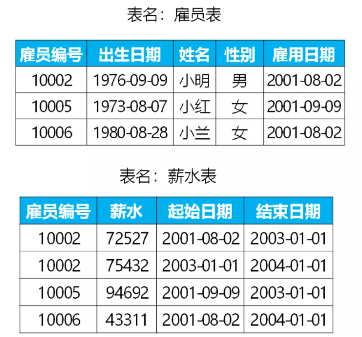
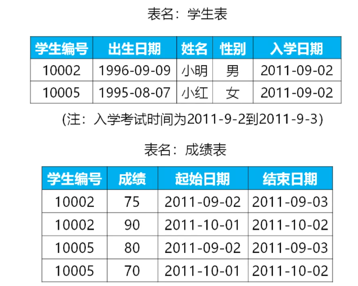
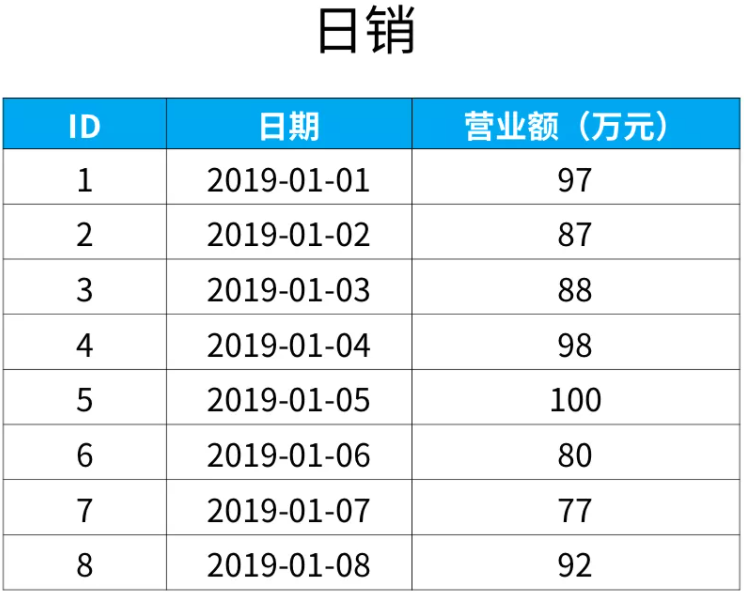
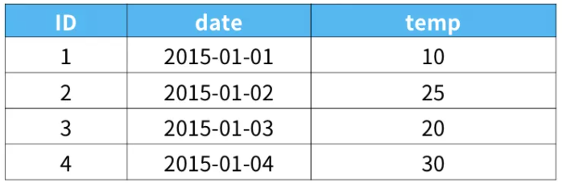
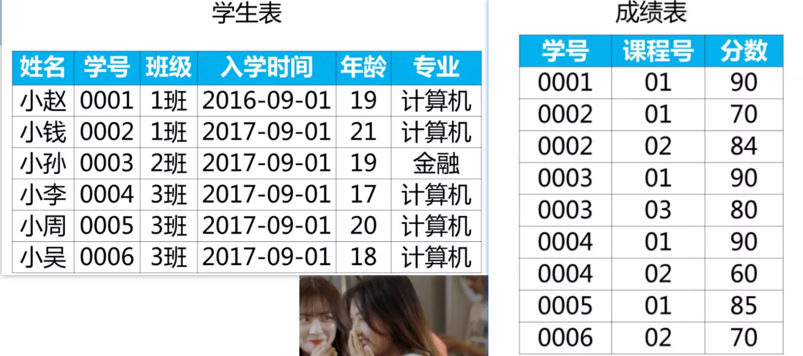

# 单表

## 重复数据查找

**问题：**编写一个SQL查询，查找学生表中所有重复的学生名。

```mysql
create table student(
	id int(4) zerofill not null auto_increment primary key,
	name varchar(10) default null
)engine=innodb default charset=utf8;
insert into mysqltest.student(name) values('林夏'),('梁石湫'),('梁宜'),('鲁迅'),('梁石湫'),('梁宜'),('鲁迅');
```

**解：**

分析：DQL语句无非distinct、where、order by、having、limit、union、group by、like、order by、from子句、where子句、select子句。

思路1：可先按名字分组，然后使用聚合函数统计出数量，数量大于1的就是重复的了。

```mysql
select name,count(name) from student group by name;
-- 方法1：使用from子句（将from子句的结果当成一张表）
select name from (select name,count(name) as c from student group by name) as t where t.c>1;
```

```mysql
-- 方法2：分组后过滤
select name from student group by name having count(name) > 1;
```

## 查找第n高的数据

**问题：**现在有“课程表”，记录了学生选修课程的名称以及成绩。现在需要找出语文成绩第二高的分数是多少。如果不存在第二高的分数，那么查询应返回 null。

```mysql
create table grades(
	id int(4) zerofill not null auto_increment,
    course varchar(255) default null,
    scores int(4) default 0,
    primary key(id)
)engine=innodb default charset=utf8;
insert into mysqltest.grades(course,scores) values('语文',90),('数学',65),('语文',90),('英语',80),('语文',88),('数学',75),('英语',83);
```

**解：**

分析：DQL语句无非distinct、where、order by、having、limit、union、group by、like、order by、from子句、where子句、select子句。

思路1：将成绩排序后，再取第二个数据，因为第一的成绩可以会有多个，所以要对成绩去重。

```mysql
-- 1.对成绩去重
select distinct scores from grades where course='语文';
-- 2.对去重的成绩进行分页，然后取第二个就好
select scores from (select distinct scores from grades where course='语文') as t limit 1,1;
```

因为当第二成绩不存在时，要返回null，所以使用`ifnull(a,b)函数`（如果a是空则返回b，不是则返回a）。

```mysql
-- 最终SQL
select ifnull(
    (select scores from (select distinct scores from grades where course='语文') as t limit 1,1)
    ,null) as '语文成绩第二的分数';
```


思路2：找到最大的分数，其他的比最大的分数小的最大的分数就是第二大了。

```mysql
select max(scores) from grades where course='语文'; -- 找到最大的数
-- 使用where子句
select max(scores) from grades where course='语文' and scores<(select max(scores) from grades where course='语文');
-- 最终判null后的SQL
select ifnull(
    (select max(scores) from grades where course='语文' and scores<(select max(scores) from grades where course='语文'))
    ,null) as '语文成绩第二的分数';
```

# 多表

## 联表查询基本操作

**问题：**现在有两个表，“学生表”记录了学生的基本信息，有“学号”、“姓名”。“成绩表”记录了学生选修的课程，以及对应课程的成绩。这两个表通过“学号”进行关联。现在要查**找出所有学生的学号、姓名、课程和成绩**。

```mysql
create table mysqltest.student(
	id int(3) zerofill not null auto_increment primary key comment '学号',
    name varchar(5)
)engine=innodb default charset=utf8;
create table mysqltest.grades(
	id int(4) default 0  comment '学号',
    course varchar(6),
    scores int(6)
)engine=innodb default charset=utf8;
insert into student(name) values('张叁'),('李思'),('王武'),('赵柳');
insert into grades values(1,'语文',90),(1,'数学',66),(2,'语文',78),(2,'数学',73),(3,'数学',80);
```

**解：**

多表查询，无非内连接查询、外连接查询（左外、右外、全外）。

```mysql
select s.id,s.name,g.course,g.scores from student as s left join grades as g on s.id=g.id;
```

## 查找两表中不存在映射关系的数据

**问题1：**“学生表”有学号和姓名；“近视学生表”为近视学生的名单，只包含序号和学号。请问不是近视眼的学生都有谁？（“学生表”表中的学号与“近视学生”表中的学生学号一一对应）

```mysql
create table mysqltest.student(
	id int(3) zerofill not null auto_increment primary key comment '学号',
    name varchar(255) default null
)engine=innodb default charset=utf8;
create table mysqltest.myopia(
	id int(3) not null auto_increment primary key comment '序号',
    sid int(3) zerofill default 0
)engine=innodb default charset=utf8;
insert into student(name) values('周周'),('陆陆'),('梁梁'),('李李'),('吼吼');
insert into myopia(sid) values(0001),(0002),(0004);
```

**解：**

```mysql
-- 使用内连接
select s.id,s.name from student s join myopia m on s.id!=m.sid; 
-- 发现并不行，联表查询会匹配m*n次，只要匹配到的符合条件就会进入结果集
```

```mysql
-- 使用外连接 (要知道指令执行的顺序，不要被select迷惑)
select s.id,s.name from student s left join myopia m on s.id=m.sid where m.id is null; 
```

**问题2：**查找“不在表里的数据”应用案例：某网站包含两个表，顾客姓名表（表名Customers）和 购买记录表（表名Orders）。找出所有从不订购任何东西的客户。（“顾客姓名表”中的ID与“购买记录”表中的学生学号CustomerId一一对应）

```mysql
create table mysqltest.customers(
    id int(10) not null auto_increment primary key,
    name varchar(255)
)engine=innodb default charset=utf8;
create table mysqltest.orders(
    id int(10) not null auto_increment primary key,
    customerid int(10)
)engine=innodb default charset=utf8;
insert into mysqltest.customers(name) values("Joe"),("Henry"),("Sam"),("Bob");
insert into mysqltest.orders(customerid) values(1),(3);
```

**解：**

从两表中进行查询，可以利用union，也可以使用外连接，以顾客表为主表。

```mysql
select c.name from customers c left join orders o on c.id=o.customerid where o.customerid is null;
```

## 从两表取数据并进行一定分析

**问题1：**“雇员表“中记录了员工的信息，“薪水表“中记录了对应员工发放的薪水。两表通过“雇员编号”关联。

查找当前所有雇员入职以来的薪水涨幅，给出雇员编号、以及其对应的薪水涨幅，并按照薪水涨幅进行升序。（注：薪水表中结束日期为2004-01-01的才是当前员工，否则是已离职员工）



```mysql
-- 雇员表
create table mysqltest.employee(
	employeeid varchar(255), 
    birthday date,
    `name` varchar(255),
    sex varchar(255),
    hiredate date
)engine=innodb default charset=utf8;
-- 薪水表
create table mysqltest.salary(
	id varchar(255), 
    salary int,
    startdate date,
    enddate date
)engine=innodb default charset=utf8;
insert into mysqltest.employee values
('1002','1976-09-09','小明','男','2001-08-02'),
('1005','1973-08-07','小红','女','2001-09-09'),
('1006','1980-08-28','小蓝','女','2001-08-02');
insert into mysqltest.salary values
('1002',72527,'2001-08-02','2003-01-01'),
('1002',75432,'2003-01-01','2004-01-01'),
('1005',94692,'2001-09-09','2003-01-01'),
('1006',43311,'2001-08-02','2004-01-01');
```

**解：**

分析：

1. 薪水涨幅：当前薪水减去入职薪水，当前薪水是截止时间'2004-01-01'的，入职薪水是雇用日期等于起始日期的。
2. 目标对象：入职了并且还在职的员工。
3. 查询结果：目标对象的编号和薪水涨幅。

操作思路如下：

1.找出当前员工的当前薪水和编号：

```mysql
select id,salary from salary where enddate="2004-01-01";
```

2.找出当前员工的初始薪水：

```mysql
select s.id,s.salary from employee e join salary as s on e.employeeid = s.id 
where e.hiredate = s.startdate 
and s.id in(select id from salary where enddate="2004-01-01");
```

3.相减：（1当一个表，取出当前薪水，2当一个表，取出入职薪水）

```mysql
select a.id,a.salary-b.salary as 薪水涨幅 from 
(select id,salary from salary where enddate="2004-01-01") as a
join 
(select s.id,s.salary from employee e join salary as s on e.employeeid = s.id where e.hiredate = s.startdate and s.id in(select id from salary where enddate="2004-01-01")) as b on a.id=b.id 
order by `薪水涨幅` asc;
```

```mysql
+------+----------+
| id   | 薪水涨幅 |
+------+----------+
| 1006 |        0 |
| 1002 |     2905 |
+------+----------+
```


**问题2：**查找所有学生开学以来的成绩涨幅，给出学生编号以及其对应的成绩涨幅，并按照成绩涨幅进行降序排序。



```mysql
create table mysqltest.student(
	id varchar(10),
    birthday date,
    name varchar(10),
    sex varchar(3),
    sdate date
)engine=innodb default charset=utf8;
create table mysqltest.grades(
	sid varchar(10),
    grades int,
    startdate date,
    enddate date
)engine=innodb default charset=utf8;
insert into student values
('10002','1996-09-09','小明','男','2011-09-02'),
('10005','1995-08-07','小红','女','2011-09-02');
insert into grades values
('10002',75,'2011-09-02','2011-09-03'),
('10002',90,'2011-10-01','2011-10-02'),
('10005',80,'2011-09-02','2011-09-03'),
('10005',70,'2011-10-01','2011-10-02');
```

**解：**

分析：

1. 初始成绩：入学日期与成绩表起始日期对应的成绩；
2. 当前成绩：2011-10-02的成绩；

操作思路：

1.找出当前成绩：

```mysql
select sid,grades from grades where enddate="2011-10-02";
```

2.找出初始成绩：

```mysql
select g.sid,g.grades from student s join grades g on s.id=g.sid where s.sdate=g.startdate;
```

3.联合相减：

```mysql
select st.sid,st.grades-en.grades as `成绩涨幅` from 
(select sid,grades from grades where enddate="2011-10-02") as st
join
(select g.sid,g.grades from student s join grades g on s.id=g.sid where s.sdate=g.startdate) as en
on st.sid=en.sid
order by 成绩涨幅 desc;
```

```mysql
+-------+----------+
| sid   | 成绩涨幅 |
+-------+----------+
| 10002 |       15 |
| 10005 |      -10 |
+-------+----------+
```

## 如何比较日期

**题目1：**下面是某公司每天的营业额，表名为“日销”。“日期”这一列的数据类型是日期类型（date）。请找出所有比前一天（昨天）营业额更高的数据。（前一天的意思，如果“当天”是1月，“昨天”（前一天）就是1号）



```mysql
create table mysqltest.sales(
	id int not null auto_increment primary key,
    d date,
    turnover int comment '万元'
)engine=innodb default charset=utf8;
insert into sales(d,turnover) values
('2019-01-01',97),('2019-01-02',87),('2019-01-03',88),('2019-01-04',98),
('2019-01-05',100),('2019-01-06',80),('2019-01-07',77),('2019-01-08',92);
```

**解：**

1.交叉连结这个表，找出每个日期与其后一天的数据

```mysql
select * from sales as s1 cross join sales as s2 on datediff(s2.d,s1.d)=1;
+----+------------+----------+----+------------+----------+
| id | d          | turnover | id | d          | turnover |
+----+------------+----------+----+------------+----------+
|  1 | 2019-01-01 |       97 |  2 | 2019-01-02 |       87 |
|  2 | 2019-01-02 |       87 |  3 | 2019-01-03 |       88 |
|  3 | 2019-01-03 |       88 |  4 | 2019-01-04 |       98 |
|  4 | 2019-01-04 |       98 |  5 | 2019-01-05 |      100 |
|  5 | 2019-01-05 |      100 |  6 | 2019-01-06 |       80 |
|  6 | 2019-01-06 |       80 |  7 | 2019-01-07 |       77 |
|  7 | 2019-01-07 |       77 |  8 | 2019-01-08 |       92 |
+----+------------+----------+----+------------+----------+
```

2.在1的基础上，找出后一天销售额比前一天销售额大的

```mysql
select * from sales as s1 cross join sales as s2 on datediff(s2.d,s1.d)=1 
where s2.turnover > s1.turnover;
+----+------------+----------+----+------------+----------+
| id | d          | turnover | id | d          | turnover |
+----+------------+----------+----+------------+----------+
|  2 | 2019-01-02 |       87 |  3 | 2019-01-03 |       88 |
|  3 | 2019-01-03 |       88 |  4 | 2019-01-04 |       98 |
|  4 | 2019-01-04 |       98 |  5 | 2019-01-05 |      100 |
|  7 | 2019-01-07 |       77 |  8 | 2019-01-08 |       92 |
+----+------------+----------+----+------------+----------+
```

3.只需要所有比前一天（昨天）营业额更高的数据

```mysql
select s2.id,s2.d,s2.turnover from sales as s1 cross join sales as s2 on datediff(s2.d,s1.d)=1 
where s2.turnover > s1.turnover;
+----+------------+----------+
| id | d          | turnover |
+----+------------+----------+
|  3 | 2019-01-03 |       88 |
|  4 | 2019-01-04 |       98 |
|  5 | 2019-01-05 |      100 |
|  8 | 2019-01-08 |       92 |
+----+------------+----------+
```

**问题2：**下面是气温表（weather表），date列的数据格式为date，请找出比前一天温度更高的ID和日期。



```mysql
create table weather(
	id int not null auto_increment primary key,
    `date` date,
    temp int
)engine=innodb default charset=utf8;
insert into weather(`date`,temp) values
('2015-01-01',10),
('2015-01-02',25),
('2015-01-03',20),
('2015-01-04',30);
```

**解：**

```mysql
select w2.id,w2.`date` from weather w1 cross join weather w2 on datediff(w2.`date`,w1.`date`)=1 
where w2.temp > w1.temp;
+----+------------+
| id | date       |
+----+------------+
|  2 | 2015-01-02 |
|  4 | 2015-01-04 |
+----+------------+
```

```mysql
-- 使用函数timestampdiff
select w2.id,w2.`date` from weather w1 cross join weather w2 on timestampdiff(day,w1.`date`,w2.`date`)=1 
where w2.temp > w1.temp;
```

## 如何交换数据

**题目1:**小明是一所学校的老师，她有一张 ‘学生表’，平时用来存放座位号和学生的信息。其中，座位号是连续递增的。总的座位数是偶数。

现在，小明想改变相邻俩学生的座位。你能不能帮她写一个sql查来输出想要的结果呢？

```mysql
create table mysqltest.student(
	id int not null auto_increment primary key,
    sid int(5) zerofill,
    name varchar(6),
    birthday date,
    sex varchar(2)
)engine=innodb default charset=utf8;
insert into student(sid,name,birthday,sex) values(10,'唐同学','2022-01-29','男');
insert into student(sid,name,birthday,sex) values(11,'宋同学','2022-01-29','女');
insert into student(sid,name,birthday,sex) values(12,'元同学','2022-01-29','男');
insert into student(sid,name,birthday,sex) values(13,'明同学','2022-01-29','女');
+----+-------+--------+------------+------+
| id | sid   | name   | birthday   | sex  |
+----+-------+--------+------------+------+
|  1 | 00010 | 唐同学 | 2022-01-29 | 男   |
|  2 | 00011 | 宋同学 | 2022-01-29 | 女   |
|  3 | 00012 | 元同学 | 2022-01-29 | 男   |
|  4 | 00013 | 明同学 | 2022-01-29 | 女   |
+----+-------+--------+------------+------+
```

```mysql
-- 交换座位后
+----+-------+--------+------------+------+
| id | sid   | name   | birthday   | sex  |
+----+-------+--------+------------+------+
|  1 | 00011 | 宋同学 | 2022-01-29 | 女   |
|  2 | 00010 | 唐同学 | 2022-01-29 | 男   |
|  3 | 00013 | 明同学 | 2022-01-29 | 女   |
|  4 | 00012 | 元同学 | 2022-01-29 | 男   |
+----+-------+--------+------------+------+
```

**解：**

分析：

1. 相邻同学交换座位，相当于奇数位加1，偶数位减一。

```mysql
select
      (case
             when mod(id, 2) != 0  then id + 1
             when mod(id, 2)  = 0  then id - 1
      end)  as  `交换后座位号`,
      name,sid as `学号`
from student order by `交换后座位号` asc;
```

**题目2：**更换相邻位置学生的座次，如果最后一位同学的座位是奇数位，因为其后面没有与其交换的，所以其位置不变。

```mysql
create table mysqltest.student(
    id int not null auto_increment primary key comment '座位号',
    name varchar(6)
)engine=innodb default charset=utf8;
insert into student(name) values('A同学');
insert into student(name) values('B同学');
insert into student(name) values('C同学');
+----+-------+
| id | name  |
+----+-------+
|  1 | A同学 |
|  2 | B同学 |
|  3 | C同学 |
+----+-------+
```

```mysql
-- 交换座位后
+----+-------+
| id | name  |
+----+-------+
|  1 | B同学 |
|  2 | A同学 |
|  3 | C同学 |
+----+-------+
```

**解：**

分析：

1. 当座位是奇数并且不是最后一个时，就可以进行位置交换。
2. 位置交换：奇数加1，偶数减1。

取得总的数据的记录数：

```mysql
select count(*) as counts from student;
```

使用`case ... end`：

```mysql
select (case 
        when mod(id,2) != 0 and counts != id then id+1
        when mod(id,2) !=0 and counts = id then id
        else id - 1
        end) as `id2`,name 
from student as a,(select count(*) as counts from student) as b order by id2 asc;
```

## 找出最小的n个数

**题目1：**“学生表”里记录了学生的学号、入学时间等信息。“成绩表”里是学生选课成绩的信息。两个表中的学号一一对应。（滴滴2020年面试题）

现在需要：

1.  筛选出2017年入学的“计算机”专业年龄最小的3位同学名单（姓名、年龄）
2.  统计每个班同学各科成绩平均分大于80分的人数和人数占比



```mysql
create table student(
	name varchar(6),
    sid int(4) zerofill not null auto_increment primary key,
    grade varchar(6),
    opentime date,
    age int,
    specialized varchar(255)
)engine=innodb default charset=utf8;
insert into student(name,grade,opentime,age,specialized) values
('小赵','1班','2016-09-01',19,'计算机'),
('小浅','1班','2017-09-01',21,'计算机'),
('小孙','2班','2017-09-01',19,'金融'),
('小李','3班','2017-09-01',17,'计算机'),
('小周','3班','2017-09-01',20,'计算机'),
('小吴','3班','2017-09-01',18,'计算机');
create table grades(
	id int(4) zerofill,
    cid int(2) zerofill,
    scores int
)engine=innodb default charset=utf8;
insert into grades values
(1,1,90),(2,1,70),(2,2,84),(3,1,90),(3,3,80),(4,1,90),(4,2,60),(5,1,85),(6,2,70);
-- 为成绩表添加外键
alter table grades add foreign key (id) references student(sid); 
```

**解：**

1.筛选出2017年入学的“计算机”专业年龄最小的3位同学名单（姓名、年龄）

```mysql
select name,age from student where specialized='计算机' and opentime="2017-09-01" 
order by age asc limit 0,3;
```

2.统计每个班同学各科成绩平均分大于80分的人数和人数占比

- 每位同学的平均成绩
- 平均成绩大于80的人数
- 平均成绩大于80的人数占比
- 输出结果是`班级 平均成绩大于80的人数 平均分大于80的人数占班级人数的多少`


