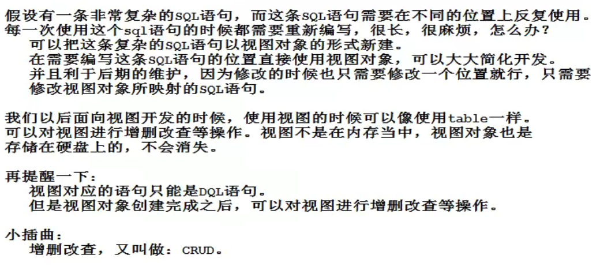

# MySql概述

JavaEE是为了企业级Java开发准备的，WEB分为：前端（页面渲染，数据显示）、后台（连接数据库JDBC，链接前端（控制，控制视图跳转，给前端传递数据））、数据库（存储数据）。

数据库：DataBase，简称DB，就是按照一定格式存储数据的一些文件的组合，实际上就是一堆文件。

数据库管理系统：DataBaseManagementSystem，简称DBMS，用来管理数据库中的数据的，可对数据库中数据进行增删改查。常见的有：MySQL、Oracle、MS SqlServer、DB2、Sybase等。

SQL：（Structure Query Language）结构化查询语言，是一套标准（可在各个DBMS中使用），DBMS负责执行SQL语句来完成对数据库中数据的增删改查。

端口号port：任何一个软件或应用都有的，是应用的唯一代表，用来定位计算机上某个应用或服务的，通常和计算机IP地址结合。

《MySQL必知必会》《高性能MySQL》《MySQL技术内幕Innodb存储引擎》

## 数据库分类

关系型数据库：(SQL)

- MySql，Oracle，Sql Sver，DB2，SQLlite；
- 通过表和表之间、行和列之间进行数据的存储。

非关系型数据库：（No  SQL）not only

- Redis，MongDB；
- 对象存储，通过对象自身的属性来决定  。

DBMS：数据库管理系统

- 数据库的管理软件，科学有效管理数据，维护和获取数据；
- MySQL、Oracle等。

## MySQL

MySQL是一个**关系型数据库管理系统**。

前世：由瑞典MySQL AB 公司开发。

今生：属于 [Oracle](https://baike.baidu.com/item/Oracle) 旗下产品。

MySQL 是最流行的关系型数据库管理系统之一，在 WEB 应用方面，MySQL是最好的 RDBMS(Relational Database Management System，关系数据库管理系统) 应用软件之一。MySQL是一种关系型数据库管理系统，关系型数据库将数据保存在不同的表中，而不是将所有数据放在一个大仓库内，这样就增加了速度并提高了灵活性。MySQL所使用的 SQL 语言是用于访问数据库的最常用标准化语言。MySQL 软件采用了双授权政策，分为社区版和商业版，由于其体积小、速度快、总体拥有成本低，尤其是开放源码这一特点，一般中小型网站、大型网站的开发都选择 MySQL 作为网站数据库。其可以集群。

# 下载安装

官网：[MySQL](https://www.mysql.com/)（建议：安装软件尽量都用压缩包来安装，也就是所谓的绿色版本）

## 安装MySQL5：

下载地址：[MySQL :: Download MySQL Community Server](https://dev.mysql.com/downloads/mysql/)

1. 解压后配置Path环境变量：将bin目录加进去；

2. 在D:\Environment\mysql-5.7.34目录下新建`my.ini`文件(内容如下)：

   - ```ini
     [mysqld]
     #目录换成自己的
     basedir=D:\Environment\mysql-5.7.34\
     datadir=D:\Environment\mysql-5.7.34\data\
     #data文件夹自动生成，存放数据信息
     port=3306
     skip-grant-tables
     ```

3. 安装：启动管理员模式下的cmd，进入bin目录：`cd /d D:\Environment\mysql-5.7.34\bin`，执行`mysqld -install`安装服务；

4. 初始化：然后执行：`mysqld --initialize-insecure --user=mysql`，初始化数据文件，不报错则完成；

5. 启动：启动MySQL：`net start mysql  `；

6. 登陆：使用`mysql -u root -p`（-p后不要有空格）进入管理界面（密码可为空，直接回车）；

7. 密码修改：进入界面后修改root密码：`update mysql.user set authentication_string=password('123456') where user='root' and Host='localhost';`（注意后面有一个分号），然后刷新权限：`flush privileges;`（退出界面可以用`exit`）；

8. 删除：删除`my.ini`文件里的ship-grant-tables（可以用#号注释掉）；

9. 重启：重启MySQL即可正常使用（停止：`net stop mysql`，启动：`net start mysql`）；

10. 进入：执行`mysql -u root -p`然后输入密码，或者执行`mysql -u root -p123456`（在p后面输入密码）。

可能出现问题：

- 缺少组件.dll
- 如果安装失败，可以使用`sc delete mysql`清空服务来重装

## 安装MySQL8:

安装了MySQL5的情况下安装MySQL8，先停止启动了的MySQL服务。

 my.ini 文件内容：

```ini
# 设置3306端口
port=3306
# 设置mysql的安装目录D:\Environment\mysql-8.0.26-winx64
basedir=D:\Environment\mysql-8.0.26-winx64
# 设置mysql数据库的数据的存放目录
datadir=D:\Environment\mysql-8.0.26-winx64\data
# 允许最大连接数
max_connections=200
# 允许连接失败的次数。
max_connect_errors=10
# 服务端使用的字符集默认为UTF8
character-set-server=utf8mb4
# 创建新表时将使用的默认存储引擎
default-storage-engine=INNODB
# 默认使用“mysql_native_password”插件认证
#mysql_native_password
default_authentication_plugin=mysql_native_password
sql_mode= STRICT_TRANS_TABLES,NO_ZERO_IN_DATE,NO_ZERO_DATE,ERROR_FOR_DIVISION_BY_ZERO,NO_ENGINE_SUBSTITUTION
[mysql]
# 设置mysql客户端默认字符集
#  utf8 最多只能存 3 字节长度的字符，不能存放 4 字节的生僻字或者表情符号，因此打算迁移到 utf8mb4。
default-character-set=utf8mb4
[client]
# 设置mysql客户端连接服务端时默认使用的端口,3307会怎样？是不是要修改防火墙策略？
port=3306
default-character-set=utf8mb4
```

1. 数据库管理系统主目录创建my.ini文件，用来配置data目录；
2. 管理员模式运行命令行，并进入MySQL的bin目录，执行`mysqld --initialize --console`；
   - 作用：该命令会根据my.ini文件进行数据库的初始化，构建data目录以及配置好其他设置。
   - 保存密码：用鼠标选中命令行界面中出现的`root@localhost:`后的（全部字符）密码，按ctrl+c复制（例`LJ>Fusj7QHKs`）。 
   - **这里注意，如果后续my.ini文件有修改，而重启mysql后没有生效，那就需要删除data目录，删除mysql服务（命令`sc delete 服务名`），然后重新执行`mysqld --initialize --console`**；
3. 安装：`mysqld --install` mysql8；（执行安装并把MySQL服务的名字定义为`mysql8`，Windows系统下大小写是不区分的）
4. 打开注册表，找到HKEY_LOCAL_MACHINE\SYSTEM\CurrentControlSet\Services\mysql8，修改ImagePath参数，更正`mysql8`服务相关路径（修改imagePath为`D:\Environment\mysql-8.0.26-winx64\bin\mysqld MySQL8`）。
5. 启动服务：`net start mysql8`；
6. 登陆：`mysql -u root -p`（密码为第2步时复制的字符），如果出现错误：`ERROR 1045 (28000): Access denied for user ‘root’@‘localhost’ (using password: YES)`，则先执行`net stop mysql8`关掉服务，然后执行下面操作：
   - 在my.ini所在目录新建一个`.txt`为后缀的文件，文件内容为`ALTER USER 'root'@'localhost' IDENTIFIED BY '123456';`；
   - 然后执行`mysqld --init-file=D:\Environment\mysql-8.0.26-winx64\mysqlc.txt --console`；
   - 执行完毕后关掉DOS窗口，再管理员模式运行一个新的DOS窗口，执行`net start mysql8`打开服务；
   - 再执行登陆，登陆密码为123456。
7. 安装完成去修改密码，执行：`alter user root@localhost identified by 'root'; `执行后就把密码改为了`root`，这里sql语句后面的分号不要丢；
8. 服务设置：因为已经有了`mysql5`的服务，设置常用的一个服务的属性为自动，不常用的就设为手动，需要用哪个版本数据库就打开哪个服务，记得要关闭一个再开启另一个。


## 安装SQLyog

可视化软件，下载：[SQLyog - Download (softonic.com)](https://sqlyog.en.softonic.com/)

默认安装后使用：

1. 新建一个连接后Connect就进入了数据库的可视化界面

   

2. 然后就可以执行数据库操作

3. 创建一个数据库

   

4. 尝试建一个表：tables下右键create table

   

5. 打开新建的表，添加数据，类似Excel的添加，添加完就刷新一下会提示是否保存


## 数据库基本命令

```sql
mysql -u root -p123456;#连接数据库
update mysql.user set authentication_string=password('123456') where user='root' and Host='localhost'; #修改密码
flush privileges; #刷新权限
describe xxx; #显示数据库中所有表的信息
exit; #退出数据库管理系统
-- #单行注释（mysql的本来的注释）
/**/ #多行注释

```

# 表

什么是表？为什么要使用表来存储数据？

表就是数据库中用来存储数据的一种形式，表的row（横行）被称为数据（或记录），column（纵行，列）被称为字段，字段有字段类型、字段属性、字段值。

## 字段类型

关于`数据类型(M)`：

- 对于char型，M指定该字段的字符数（指定值不能超过char允许的范围），存储的时候必然按M个字符进行存储，不够的时候用空格补。在检索的时候（我理解是查询的时候），取出的值尾部空格被删除，存储的时候尾部的空格可以认为没有做处理；
- 对于varchar型，M指定了字段值最大字符数为M（不能超过varchar允许的字符数），存储的时候以实际长度进行存储，但这个长度不能超过M。然后与char的区别在于，不会在写入和读出的时候，对字符串的尾部空格进行删除；
- 对于char和varchar，前者注重效率，但是对于变动字符数的字符串，存在空间浪费的情况；后者varchar注重存储空间的占用，是可变字符，但是效率比char低。

- 对于int型来说，不填写这个M值，那么默认的长度是11；
  - 即便设置为int(1)、int(1)或int(64)，也不影响这个字段在MySQL中存储的数值范围-2147483648 ~ 2147483647（即-2³¹-1~2³¹-1）
    M为0的结果是，设置不生效，即最后变成默认的11。
- 关于zerofill：主要是数值位数不满M时，自动在最高位前面补0凑够M个数位，不影响值的存取。然后加入数值的数位大于M，则只会显示M+2个数位。相当于当数值的数位大于M的时候，这个zerofill不生效了。
  - zerofill的用法：指定zerofill后，会变成 int(M) unsigned zerofill，即变成了无符号类型。

### 数值：

|   类型   |              描述              |
| :------: | :----------------------------: |
| tinyint  |         十分小，1byte          |
| smallint |          较小，2byte           |
| mediuint |         中等小，3byte          |
| **int**  | **标准整数，4byte（常用的）**  |
|  bigint  |       较大的数据，8byte        |
|  float   |          4byte浮点数           |
|  double  |          8byte浮点数           |
| decimal  | 字符串形式的浮点数（金融计算） |

### 字符串：

|    类型     |             描述              |
| :---------: | :---------------------------: |
|    char     | 固定大小的字符串，0-255个字符 |
| **varchar** |    **可变字符串，0-65535**    |
|  tinytext   |     微型文本，2^8 - 1=255     |
|  **text**   |  **文本串，2^16 - 1**=65535   |
| mediumtext  |             约16M             |
|  longtext   |             约4G              |

### 时间日期：

|     类型      |                    展现格式                    |
| :-----------: | :--------------------------------------------: |
|     date      |                日期，YYYY-MM-DD                |
|     time      |                 时间，HH-mm-ss                 |
| **datetime**  |   **最常用的时间格式，YYYY-MM-DD  HH-mm-ss**   |
| **timestamp** | **时间戳，1970.1.1到现在的毫秒数（较为常用）** |
|     year      |                      年份                      |

date和datetime的区别：

- date是短日期，只包含年月日，datetime是长日期，包含年月日时分秒；
- MySQL短日期默认格式：%Y-%m-%d；
- MySQL长日期默认格式：%Y-%m-%d %h-%i-%s；

MySQL当前时间：`now（）`获取系统当前时间，并且带有时分秒信息。

### null：

- 表示没有或未知，不要用其进行运算，计算结果也是null。

## 字段属性

字段属性是字段除数据类型外的属性，一般有以下属性：

PK：主键；Not Null：非空，不能为空；Unsigned：无符号；Auto Incr：理解为自增，自动在上一条记录的基础上+1（默认）（通常用来设置唯一的主键，必须是整数，可设置步长和起始值）；

Zero fill：0填充，比如3位整数，多余的位数用0填充；

Default：设置默认值。

使用主键应注意以下几点：

- 每个表只能定义一个主键。
- 主键值必须唯一标识表中的每一行，且不能为 NULL，即表中不可能存在有相同主键值的两行数据。这是唯一性原则。
- 一个字段名只能在联合主键字段表中出现一次。（所谓的联合主键，就是这个主键是由一张表中多个字段组成的。）
- 联合主键不能包含不必要的多余字段。当把联合主键的某一字段删除后，如果剩下的字段构成的主键仍然满足唯一性原则，那么这个联合主键是不正确的。这是最小化原则。

阿里巴巴规范：每个表都要存在以下字段

- id：主键
- version：乐观锁
- is_delete：伪删除
- gmt_create：创建时间
- gmt_update：修改时间

# 约束

## 概述

什么是约束（constraint）？

在创建表时，我们可以给表中的字段加上一些约束，来保证这个表中的数据的完整性、有效性，约束的作用就是为了保证表中数据的有效性。（约束，为保证数据完整性而对数据添加的一些限制）

约束种类：

- 非空约束：not null，指示某列不能存储 NULL 值。
- 唯一性约束：unique， 保证某列的每行的值唯一、不重复，但是都可以为null。
- 主键约束：primary key（简称PK），NOT NULL 和 UNIQUE 的结合。确保某列（或两个或多个列的结合）有唯一标识，有助于更容易更快速地找到表中的一个特定的记录。
- 外键约束：foreign key（FK），保证一个表中的数据匹配另一个表中的值的参照完整性（一个表中的某个字段受到外表的某个字段值的限制，其字段值得完全参考外表的字段值来存储值）。
- 检查约束：check（MySQL8版本开始支持，Oracle也支持）， 保证列中的值符合指定的条件。
- default。

## 添加唯一性约束

约束单个字段：

```mysql
-- 创建表时添加
create table test(
id int not null auto_increment primary key,
acct varchar(255) unique  -- 列级约束
pswd varchar(255) not null
)engine = innodb default charset=utf8;
-- 创建表后添加，通过modify或change修改字段结构
alter table `test` modify acct varchar(255) unique;
```

两个字段联合唯一：（即不能出现两个字段值都相同的情况）

```mysql
create table test(
id int,
acct varchar(255),
pswd varchar(255),
unique(id,acct) -- 约束没有添加在列的后面，称为表级约束
)engine=innodb default charset=utf8;
```

在需要给多个字段联合起来添加一个约束的时候，需要使用表级约束。


## 添加主键约束

主键字段是添加了主键约束的字段，主键字段的每一个值叫作主键值。主键值是每一行记录的唯一标识，主键值是每一行记录的身份证。

表中的数据中有些字段信息可能是重复的，为了区分这种重复，就引入了约束，协助身份标识；任何一张表都应该有主键约束，主键约束一张表只能有一个。

作为主键的字段必须是：not null + unique（非空、唯一：主键值不能是null，也不能重复）；添加主键约束的操作如下：

```mysql
create table `table_name`(
	id int(10) primary key auto_increment, # 行级(列级)约束，一个字段作主键：单一主键
    ...
);
create table `table_name`(
	id int(10) not null,
    ...,
    primary key(字段1，字段2，...)  # 表级约束，主要是给表添加包含多个字段的约束，组成复合主键
);
# 开发中不建议使用复合主键，建议使用单一主键
```

主键值建议类型：int、bigint、char等类型，不建议使用varchar来作主键；主键值一般都是数字，一般都是定长的。

自然主键和业务主键：

- 自然主键：主键值是一个自然数，和业务没关系；（开发中使用更多）
- 业务主键：主键值和业务紧密关联；（例如拿银行账号作主键值）

## 添加外键约束

MySQL的外键约束用来在两个表数据之间建立链接，其中一张表的一个字段被另一张表中对应的字段约束。也就是说，设置外键约束至少要有两种表，被约束的表叫做从表（子表），另一张叫做主表（父表），属于主从关系；其中主表中的关联字段叫做主键，从表中的关联字段叫做外键。外键约束主要作用就是能够让表与表之间的数据建立关联，使数据更加完整，关联性更强

业务背景：设计数据库表，描述班级和学生的信息

- 方案一：数据都存放于一张表；（每个学生的班级信息和班级代号信息可能会重复，造成数据冗余）
- 方案二：班级表、学生表分表存储不同数据，学生表引用班级表；（添加外键约束，减少数据冗余）

**外键的创建方式一：在创建表的同时添加外键约束**

```mysql
create table 表名(
字段定义...
主键定义...
constraint `外键名称` foreign key (`字段`) references `主表名`(主键字段) 属性
)engine=innodb default charset=utf8；
-- constraint ：用于设置外键约束名称，可以省略
-- foreign key：外键设置，用于指定从表的外键字段
-- references：主表及主键设置，用于指定主表和主键
-- 属性可选，属性说明：
	-- CASCADE：主表删除或修改记录时，从表也会对关联记录的外键字段进行修改。
	-- RESTRICT：删除或修改主表记录，子表中若有关联记录，则不允许主表删除或修改。
	-- SET NULL：主表删除或修改主表记录时，从表会将关联记录的外键字段设为null。
	-- ON UPDATE CASCADE：主表修改记录时，从表关联记录的外键字段也会修改。（将CASCADE改为RESTRICT，意思相反）
	-- ON DELETE CASCADE：主表删除记录时，从表关联记录的外键字段也会删除。（将CASCADE改为RESTRICT，意思相反）
```

实例演示：	

```mysql
-- 主表 
CREATE TABLE `t_class1` (
  `id` INT(10) NOT NULL AUTO_INCREMENT COMMENT '学生id',
  `s_id` INT(10) NOT NULL DEFAULT '1001' COMMENT '学号',
  `specialty` CHAR(255) DEFAULT NULL,
  `grade` CHAR(255) DEFAULT NULL,
  PRIMARY KEY (`id`)
) ENGINE=INNODB DEFAULT CHARSET=utf8;
-- 从表，被约束的表-创建外键的表，也可以看做为某个字段外扩了一些关联数据
CREATE TABLE `t_student1`(
  `id` INT(10) NOT NULL AUTO_INCREMENT COMMENT '学生id',
  `s_id` INT(10) NOT NULL DEFAULT '1001' COMMENT '学号',
  `name` CHAR(10) DEFAULT NULL COMMENT '学生姓名',
  `sex` CHAR(2) DEFAULT NULL COMMENT '性别',
  `n_place` CHAR(255) DEFAULT NULL COMMENT '籍贯',
  `age` INT(3) NOT NULL DEFAULT '18' COMMENT '年龄',
  `g_level` CHAR(10) NOT NULL DEFAULT '无' COMMENT '级别',
  `phone` CHAR(255) DEFAULT NULL COMMENT '联系电话',
  PRIMARY KEY (`id`),
  CONSTRAINT `FK_id` FOREIGN KEY (`s_id`) REFERENCES `t_class1`(`id`)
)ENGINE=INNODB DEFAULT CHARSET=utf8;
```


**外键的创建方式二：在创建表完成之后再添加外键约束**

```MYSQL
-- 添加一个叫FK_gradeid的外键约束，外键约束字段为`gradeid`，指向的表为`grade`，和该表的`gradeid`形成关联
-- 从表的`gradeid`的值的选项被主表`grade`的`gradeid`的值限定住
ALTER TABLE XXX ADD CONSTRAINT `FK_gradeid` FOREIGN KEY (`gradeid`) REFERENCES `grade`(`gradeid`);
```

**其他注意的点：**

- 删除有外键关系的表：先再删除被引用的表，然后删除有引用其他表的表；
- 外键值可以为null；
- 外键引用主表中的某个字段，被引用的字段不一定是主键，但至少具有唯一性。

以上操作都是物理外键，数据库级别的外键，不建议使用！

最佳实践：

- 数据库就是单纯的表，只用来存数据，只有行和列。
- 使用多张表就创建外键。

# 了解引擎

存储引擎：用于实现数据的存储、索引的建立、数据更新查询的实现。


数据库在物理空间存在的位置：所有的数据库文件都存在 data 目录下，一个文件夹就对应一个数据库。（数据库本质还是文件存储！）

MySQL引擎在物理文件上的区别：

- InnoDB： 在数据库表中只有一个xxx.frm文件，以及上级目录下的 ibdata1文件；
- MyISAM ：xxx.frm - 表示结构的定义文件，xxx.MYD -数据文件(data)，xxx.MYI-放索引的(index)。

# ---------------SQL---------------

数据库xx语言：（CURD(create update retrieve delete)	CV	API）

- DDL（Definition，数据定义语言）：修改数据表、数据库的结构的语言，如create、drop、alter的都是。

- DML（Manipulation，数据操作语言）：对表内数据进行增删改操作的，如insert、update、delete。

- DQL（Query，数据查询语言）：用来查询索引数据，有select关键字的语句都是。

- DCL（Control ，数据控制语言）：DCL用来授予或回收访问数据库的某种特权，并控制数据库操纵事务发生的时间及效果，对数据库实行监视等，例如授权grant、撤销权限revoke...。

- TCL（Transaction Control，事务控制语言）：事务提交commit、事务回滚rollback。


数据库--->数据库中的表--->表中的信息。

# DDL

数据定义语言，DDL语句不用commit。MySQL的关键字不区分大小写，下面用中括号包起来的表示可选。

## 数据库

1. 创建数据库（使用命令创建不设置字符集时是默认的字符集(不支持中文)）

   ```mysql
   create database [if not exists] database_name CHARACTER SET utf8 COLLATE utf8_general_ci;
   ```

2. 删除数据库

   ```mysql
   drop database [if exists] xxx;
   ```

3. 使用数据库

   ```sql
   use `xxx` -- 表名或字段名是特殊字符，就带 ``
   ```

4. 查看数据库

   ```mysql
   show databases -- 查看所有的数据库
   ```

## 创建、删除表

创建表：

```SQL
CREATE TABLE IF NOT EXISTS `students`(
`id` INT(4) NOT NULL AUTO_INCREMENT COMMENT '学号',
`name` VARCHAR(30) NOT NULL DEFAULT '匿名' COMMENT '姓名',
`pwd` VARCHAR(20) NOT NULL DEFAULT '123456' COMMENT '密码',
`sex` VARCHAR(2) NOT NULL DEFAULT '女' COMMENT '性别',
`birthday` DATETIME DEFAULT NULL COMMENT '生日',
`address` VARCHAR(100) DEFAULT NULL COMMENT '地址',
`email` VARCHAR(20) DEFAULT NULL COMMENT '邮箱',
PRIMARY KEY(`id`) 
)ENGINE=INNODB DEFAULT CHARSET=utf8; 
```

```SQL
CREATE TABLE [IF NOT NULL] 表名(
    `字段名` 列数据类型(长度) [属性] [索引] [说明],
    `字段名` 列数据类型(长度) [属性] [索引] [说明],
    `字段名` 列数据类型(长度) [属性] [索引] [说明],
    ......
    `字段名` 列数据类型(长度) [属性] [索引] [说明],
    PRIMARY KEY(`字段名`)
)[引擎] [表类型] [字符集设置] [说明];
```

将查询结果创建为一个表——复制表：

```mysql
-- 将查询结果当做一张表新建
create table `table_name` as select ... from ......
```

删除表：

```sql
DROP TABLE IF EXISTS `table-name`;       -- 删除表
```

## 常用查看命令

```sql
SHOW CREATE DATABASE `database_name`; -- 显示创建数据库的语句
SHOW CREATE TABLE `table_name`; -- 显示创建表的语句
DESC `table_name`; -- 显示表的结构 （describe table_）

show status; -- 显示广泛的服务器状态信息
show grants; -- 显示授予用户的安全权限
show errors; -- 显示错误信息
show warnings; -- 显示警告信息
show variables like 'character%'; -- 查看字符集设置
```

```mysql
-- 查看表的注释等信息
USE information_schema;
SELECT * FROM TABLES WHERE TABLE_SCHEMA='数据库名' AND TABLE_NAME='表名'
```


设置数据库表的字符集编码：`CHARSET=utf8`，不设置的话，会是mysql默认的字符集编码~（不支持中文！）。

**MySQL的默认编码是Latin1，不支持中文，但可以修改：**

- 第一种就是创表的时候就修改，charset=utf8。


- 第二种：在my.ini中配置默认的编码：`character-set-server=utf8`。（但不建议使用此种方法，因为第一种是sql上的修改，换台电脑也能运行，但第二种是物理上的修改，如果另一个的数据库ini配置里没有这句话，那就运行不了了）。

## 修改表结构

对表的结构层的修改：

```mysql
ALTER TABLE `table-name` RENAME AS `new-tablename`;       -- 修改表名
ALTER TABLE `table-name` ADD 字段名 类型与属性;      -- 添加新字段
-- alter table `info` add name char(20) NOT NULL default '你是？';
ALTER TABLE `table-name` MODIFY 字段名 字段属性;   -- 修改字段类型、属性和约束
-- alter table `info` modify age int(3) not null default 18;
ALTER TABLE `table-name` CHANGE 字段名 新字段名 字段属性; -- 相当于modify加多了一个修改字段名的功能
ALTER TABLE `table-name` DROP 字段名;    -- 删除字段
```

```mysql
alter table 表名 comment '修改后的表的注释'; -- 修改表的注释
alter table 表名 modify column 字段名 字段类型 comment '修改后的字段注释'; -- 修改字段的注释
```

【注意点】：字段名用可``来包裹起来；SQL大小写不敏感，建议使用小写；所有符号都用英文下的。

# DML

数据操作语言，insert、update、delete；对表的字段的内容进行操作，需要commit。

## 添加

插入单条数据：

```mysql
insert into `表`(`字段`,...) value(数据,...); -- 数据都需要与字段类型对应
-- insert into t_student(birth) values(now());
-- 数据和字段要一一对应，字段可省略（省略字段时默认全部字段）
insert into `表` value(数据,...);
```

插入多条数据：

```mysql
-- 插入一条或多条数据
INSERT INTO `表`(`字段`) VALUES (数据1),(数据2),(数据3),(数据4),...;
INSERT INTO `表`(`字段`,`字段`,`字段`,...) VALUES (数据1,数据2,数据3),(数据1,数据2,数据3),...; 
```

将查询结果插入到一张表中：

```mysql
-- 查询到的结果要符合目标表的结构
insert into `表` select ... from ...;  -- 很少用
```


为表插入date类型的数据：函数`str_to_date('字符串日期', '日期格式')`：

- date类型的数据不能直接通过字符串的形式添加，要插入date类型的数据就要使用函数`str_to_date('字符串日期', '日期格式')`把varchar类型转换为date类型，字符串日期要和日期格式对应`str_to_date('2013-9-1','%Y-%m-%d')`；

- mysql的日期格式：%Y（年）、%m（月）、%d（日）、%h（时）、%i（分）、%s（秒）；
- 如果字符串日期格式是`%Y-%m-%d`，那就不用写函数，会自动帮转换。

date_format函数：将日期转换成特定格式的字符串

- `date_format(时间日期类型数据, '日期格式')`：通常用于查询日期时，设置展示的日期格式；
- 例如：`select id,name,date_format(birth,%m/%d/%Y) as birth from t_user;` 
- 该函数会将日期转换成特定格式的字符串。

## 修改

```mysql
-- 语法格式：update 表名 set `字段1`=值1,`字段2`=值2,... where 条件;
update `table-name` set `字段`=新值 -- 如果不指定条件，该表下所有的该字段的值都会被修改
update `table-name` set `字段`=新值 where `字段`=值;
update `table-name` set `字段1`=新值1,`字段2`=新值2,... where `字段3`=新值3;
```

|     条件操作符      |     含义     |  范围  |    结果     |
| :-----------------: | :----------: | :----: | :---------: |
|   =、>、<、>=、<=   |              |        | false、true |
|       !=、<>        |    不等于    |        | false、true |
| between ... and ... | 在某个闭区间 | [x，y] | false、true |
|         and         |   相当于&&   |        | false、true |
|         or          |  相当于\|\|  |        | false、true |

## 删除

```mysql
-- delete属于DML语句   只删除数据，但数据在硬盘上的存储空间不会被释放
-- 缺点：删除效率低   优点：支持回滚，数据可以恢复
delete from `table-name` [where 条件] -- 从指定表删除符合条件的数据，没有条件时会删除整张表

-- truncate 清空数据库表中的数据，但表的结构和索引约束不会变
-- 删除效率高，不支持回滚，数据不可恢复，属于DDL操作
truncate `table-name`  
```

`delete`和`truncate`区别：

- 相同点：都能删除数据，但不会影响表的结构。
- 不同点：
  - truncate会重新设置自增列的计数器为0。
  - truncate不会影响事务。

【了解】delete删除的问题：重启数据库会出现以下现象

- InnoDB：自增列会从1开始（自增量存在于内存，重启内存会丢失，自增列重新开始计数）。
- MyISAM：继续从上一个自增量开始（自增量存在于文件，文件存在就不会丢失自增量）。

# DQL

数据查询语言，DQL基本结构是由SELECT子句，FROM子句，WHERE子句组成的查询块：
`SELECT <字段名表> FROM <表或视图名> WHERE <查询条件>`。

select完整语法：

```SQL
SELECT [ALL | DISTINCT | DISTINCTROW | TOP]
{* | talbe.* | [table.]field1[AS alias1][,[table.]field2[AS alias2][,…]]}
FROM table_name [as table_alias]
	[left | right | inner join table_name2] -- 联合查询
	[WHERE…] -- 指定结果需要满足的条件
	[GROUP BY…] -- 按照哪些字段来分组
	[HAVING…] -- 过滤分组的记录必须要满足的次要条件
	[ORDER BY…] -- 排序
	[limit {[offset,]row_count | row_countOFFSET offset}] -- 指定查询的记录从哪
	[WITH OWNERACCESS OPTION] 	
```

## 单表查询

### 简单查询

```SQL
 -- 查询指定表内所有数据
select * from `table-name`;
-- 查询多个字段的数据
select `字段1`,`字段2`,... from `table-name`;
-- 查询并起别名，别名是查询结果的列名，原有表结构不会被改变
select `字段1` [as 别名],`字段2` [as 别名],... from `table-name` [as 别名]; 
```

去重distinct：

```SQL
-- 去掉某字段的重复数据再显示该字段数据，（distinct关键字？）只能出现在所有字段最前方
select distinct `字段` from `table-name`;
-- 联合多个字段来去重，数据中指定字段都相同时才会去重
select distinct `字段1`,`字段2`,... from `table-name`;
-- 可以出现在函数内
select count(distinct `字段`) from `table-name`; -- 去掉该字段重复的数据后剩下的记录条数
```

其他操作：

```SQL
SELECT VERSION(); -- 查询版本
SELECT 1000*4-34 AS '结果'; -- 计算值
SELECT @@auto_increment_increment; -- 查询自增的步长
SELECT `age`+1 AS 长大一岁 FROM result; -- 指定字段加一后显示，不会改变表内数据
```

语法：` select 表达式 from table-name;`；数据库中的表达式：文本值、字段、null、函数、计算表达式、系统变量......。

字段也可以使用数学表达式：`select name,age*12 from table_name`；（把字段看成是变量一样进行运算）

### 条件查询

条件操作符：

|      条件操作符      |     含义     |                           描述                            |
| :------------------: | :----------: | :-------------------------------------------------------: |
|   =、>、<、>=、<=    |              |                                                           |
|        !=、<>        |    不等于    |                                                           |
| between ... and ...  | 在某个闭区间 |                          [x，y]                           |
|         and          |   相当于&&   |                          全1为1                           |
|          or          |  相当于\|\|  |                          有1为1                           |
|         not          |   相当于！   |                            非                             |
|       is null        |  是否为null  |                   null 不能用 = 来比较                    |
|     is not null      |   不是null   |                                                           |
|         like         |  含有某个值  |                  模糊查询，结合%或_使用                   |
|   in(xx,xx,xx,...)   |   里面的值   | 某字段的值能对应in里面的某一个数据<br />返回true或者false |
| not in(xx,xx,xx,...) | 不在里面的值 |      某字段的值不在这几个值中<br />返回true或者false      |

select语句：

> 语法格式：select `字段1`,`字段2`,... from `table-name` where 条件语句;

```mysql
select ... where `字段` = xx; -- 查询字段值为某个值的数据
select ... where 逻辑判断语句; -- 查询符合该逻辑的数据，可用括号()来决定语句优先级
select ... where `字段` in (110,120); -- 该字段值是否该集合，如果存在就查询相应数据
```

### 模糊查询

like，模糊查询，支持使用通配符`%`或`_`匹配：

（%不能匹配值为null的数据，如果有其他可以替代通配符的就不用通配符，通配符搜索的处理需要时间较长。）

```sql
 -- 查询字段中有某个字的数据，%：表示0到任意个字符，_：表示一个字符
 where `字段` like '梁%';  -- 字段值以某个字符开头的
 where `字段` like '%梁';  -- 字段值以某个字符结尾的
 where `字段` like '梁__'; -- 字段值以某个字符开头的，并且是三个字符的
 where `字段` like '%梁%'; -- 字段值存在某个字符的
 where `字段` like '%\_%'; -- 字段值存在`_`的，要使用转义字符`\`
```

### 分组查询

实际的应用中，可能有这样的需求，需要先分组再对每一组的数据进行操作，这是需要使用分组查询。

分组查询就是根据一个或多个字段分为一组组数据再进行查询操作（判断一个或多个字段值是否相同，如果是相同的则为一组数据，不同的为另一组数据），分组查询一般和分组函数结合来查询特定的数据。

**聚合函数（也叫分组函数、多行处理函数）：**

- 多个输入对应一个输出，（例如`select sum(sal) from table_name`只输出总和）。
- **分组函数必须是分组后才能使用，如果不用group by对数据进行分组则默认整张表为一组**。


- ```sql
  select 分组函数 from `table-name`；-- 分组函数如下
  count(`字段`); -- 行数计数，会忽略所有的null
  count(*); --  不会忽略null
  count(1); -- 1 相当于true
  sum(`字段`); avg(`字段`); max(`字段`); min(`字段`); -- 求总和 求平均值 求最大值 求最小值
  ```
  
- 分组函数使用注意事项：


    - 分组函数会自动忽略Null。
    - **分组函数不能直接使用在where条件子句**，但可以使用在having的条件句中。
    - 所有分组函数可以组合起来一起用。

**分组查询的使用：**（判断一个或多个字段值是否相同，如果是相同的则为一组数据，不同的为另一组数据）

```mysql
-- 分组查询，一定要按照下面的格式；要使用where或having时优先使用having
-- 分组字段和group by 后的分组字段应该对应
select `分组字段`,分组函数 from table_name group by `分组字段`;
select `分组字段1`,`分组字段2`,...,分组函数 from table_name group by `分组字段1`，`分组字段2`, ...;
select `分组字段`,分组函数 from table_name group by `分组字段` having 条件; -- 先分组再筛选
```

```mysql
-- 关于执行顺序：1.from;2.where;3.group by;4.select;5.order by.
select xxx from xxx where xxx group by xxx order by xxx;
```


分组查询实例：

```mysql
-- 创建订单表
create table t_order(
  id int not null AUTO_INCREMENT COMMENT '订单id',
  user_id bigint not null comment '下单人id',
  user_name varchar(16) not null default '' comment '用户名',
  price decimal(10,2) not null default 0 comment '订单金额',
  the_year SMALLINT not null comment '订单创建年份',
  PRIMARY KEY (id)
)engine=innodb default charset=utf8 comment '订单表';

-- 插入数据
insert into t_order(user_id,user_name,price,the_year) values
  (1001,'甲',11.11,'2017'),
  (1001,'甲',22.22,'2018'),
  (1001,'甲',88.88,'2018'),
  (1002,'乙',33.33,'2018'),
  (1002,'乙',12.22,'2018'),
  (1002,'乙',16.66,'2018'),
  (1002,'乙',44.44,'2019'),
  (1003,'丙',55.55,'2018'),
  (1003,'丙',66.66,'2019');
```

查询每个用户每年的订单量：

```mysql
-- 用户和年份分组，然后计算每组的订单量
select user_id,the_year,count(id) as '订单数量' from t_order group by user_id,the_year;
-- 分组查询完成后再进行过滤，不用where是因为where在group by之前执行
select user_id,the_year,count(price) as '订单数量' from t_order group by user_id,the_year having the_year=2018;
```

## 指令执行顺序

查询语句：

```mysql
select ... from ... [可选]; -- [可选] 的随意选择，不过要按照一定顺序书写
-- 可选要遵循的顺序
where ... group by ... having ... order by ... limit page,pageSize;
```

查询语句执行顺序：

```mysql
select ... from ... where ... group by ... having ... order by ... limit page,pageSize;
-- 执行顺序：from --> where --> group by --> select --> having --> order by
-- 从哪张表拿数据 -> 拿出哪些数据 -> 将拿出的数据分组 -> 选中数据 -> 对数据进行过滤 -> 对数据进行排序 -> 数据分页
```

## 联表查询（连接查询）

### 概述

**笛卡儿积现象：**

当两张表进行连接查询，没有任何条件限制，**最终查询结果条数**，是两张表条数的乘积，这种现象被称为笛卡尔积现象，由笛卡尔发现的一种数学现象。  ——由该现象可知数据库底层查询是先从表中拿出数据，也就是from先行，这时匹配的次数是每张表的数据条数的乘积；因此，表的连接次数越多，匹配的次数就越多，查询的效率就越低了。

联表查询中，**加条件是为了避免笛卡尔积现象，查询出有效的组合记录（使查询结果条数不是m*n）**，但是匹配的次数是一次都没有少的，联表查询加条件和效率并没有关系，因此联表查询中尽量降低表的连接才能提高效率。

**连接查询：**

连接查询语法根据年代分为SQL92、SQL99，按照表连接的方式分为三类：

- 内连接：等值连接、非等值连接、自连接；内连接就是连接的两张表没有主次关系。
- 外连接：有主次关系（区分主表、从表）。
- 全连接（几乎不用）。

**内连接：**on后条件用=的就是等值连接，条件不是等值关系就是非等值连接

```mysql
-- SQL92语法的等值内连接 结构不清晰，表的连接和筛选都放在了where后面
select s.name,stu.name from school s, student stu where s.no = c.no and 条件;
```

```mysql
-- SQL99语法的等值内连接 表连接独立，连接后可再进行筛选  表起别名，很重要，效率问题
-- 语法： select ... from a join b on a和b的连接条件 where 筛选条件; inner是可以省略的
select s.name,stu.name from school s inner join student stu on s.no = c.no;
```

**内连接-自连接(了解)：**把一张表当做两张表来进行查询。例子如下：

```mysql
-- 这里的`school`是指数据库，SQL语句中可以"数据库.数据库表"来指定哪个数据库下的表
CREATE TABLE `school`.`category`( 
`categoryid` INT(3) NOT NULL COMMENT 'id', 
`pid` INT(3) NOT NULL COMMENT '父id 没有父则为1', 
`categoryname` VARCHAR(10) NOT NULL COMMENT '种类名字', 
PRIMARY KEY (`categoryid`)
) ENGINE=INNODB CHARSET=utf8 COLLATE=utf8_general_ci; 
-- 插入数据
INSERT INTO `school`.`category` (`categoryid`, `pid`, `categoryname`) VALUES (2, 1, '信息技术');
INSERT INTO `school`.`CATEGOrY` (`categoryid`, `pid`, `categoryname`) VALUES (3, 1, '软件开发');
INSERT INTO `school`.`category` (`categoryid`, `PId`, `categoryname`) VALUES (5, 1, '美术设计');
INSERT INTO `School`.`category` (`categoryid`, `pid`, `categorynamE`) VALUES (4, 3, '数据库'); 
INSERT INTO `school`.`category` (`CATEgoryid`, `pid`, `categoryname`) VALUES (8, 2, '办公信息');
INSERT INTO `school`.`category` (`categoryid`, `pid`, `CAtegoryname`) VALUES (6, 3, 'web开发'); 
INSERT INTO `SCHool`.`category` (`categoryid`, `pid`, `categoryname`) VALUES (7, 5, 'ps技术');
# 把一张表当两张表用——通过起两个别名
# 下面的SQL语句的功能为：选取两表中categoryname都相等的数据的pid、categoryname
 SELECT a.pid,a.categoryname 
 FROM category AS a, category AS b
 WHERE a.categoryname = b.categoryname;
```

### 连接查询

SQLJoins：可以理解为选择出来有某种集合关系的数据集；可以在查询出来的数据表的基础上再进行联表查询（类似于嵌套）。

**内连接：**（两表特定字段在特定条件存在交集的数据集（我的理解））

```mysql
inner join -- inner join的就是内连接
-- inner、as可以省略
select s.id,s.name,g.course,g.scores from student s join grades g on s.id=g.id;
select s.id,s.name,g.course,g.scores from student as s inner join grades as g on s.id=g.id;
```

**外连接：**(left、right的就是外连接)

```mysql
 -- 左外连接，left join的左边为主表，两表特定字段存在交集的数据集 + 主表的其它数据 -> 集合而成的数据集
left join 
-- 右外连接，right join的右边为主表，两表特定字段存在交集的数据集 + 主表的其它数据 -> 集合而成的数据集
right join 
-- 全外连接，两表独立的数据及交集的数据的集合，类似并集 （MySQL不支持，可以使用union实现）
full outer join 
```

**连接查询语法：**（`xxx join` 确定连接查询方式，见下图-SQL JOINS）

```sql
-- on 为连接条件，可理解为交集区域
select ... from `表1` xxx join `表2` on ...; （四种）
select ... from `表1` xxx join `表2` on ... where ...;  （三种）
--  where是为了选数据，选取连接查询后得到的数据
```

inner join ... on一种，left join 、right join 、full outer join 和on 、 where搭配分出六种：


使用连接查询的要义：

1. 明确要查询的数据来源的表；
2. 确定连接查询方式；
3. 确定交叉数据。

```sql
-- 测试用表
CREATE TABLE t_student(
id INT(10) NOT NULL AUTO_INCREMENT COMMENT '学生id',
s_id INT(10) NOT NULL DEFAULT 1001 COMMENT '学号',
`name` CHAR(10) DEFAULT NULL COMMENT '学生姓名',
sex CHAR(2) DEFAULT NULL COMMENT '性别',
n_place CHAR(255) DEFAULT NULL COMMENT '籍贯',
age INT(3) NOT NULL DEFAULT 18 COMMENT '年龄',
g_level CHAR(10) NOT NULL DEFAULT '无' COMMENT '级别',
phone CHAR(255) DEFAULT NULL COMMENT '联系电话',
PRIMARY KEY(id)
)ENGINE=INNODB DEFAULT CHARSET=utf8;
CREATE TABLE `t_class`(
id INT(10) NOT NULL AUTO_INCREMENT COMMENT '学生id',
s_id INT(10) NOT NULL DEFAULT 1001 COMMENT '学号',
specialty CHAR(255) DEFAULT NULL,
grade CHAR(255) DEFAULT NULL,
PRIMARY KEY(id)
)ENGINE=INNODB DEFAULT CHARSET=utf8;

INSERT INTO t_student(s_id,NAME,sex,n_place,age,g_level,phone) VALUES
(1001,'何慕','男','山东',18,'A级','123456'),
(1002,'刘华','男','河北',18,'B级','123456'),
(1003,'FF','女','山东',18,'A级','123456'),
(1004,'HH','男','河南',19,'C级','123456'),
(1005,'II','男','河南',17,'B级','123456'),
(1006,'JJ','女','湖南',19,'A级','123456'),
(1007,'KK','女','湖南',17,'B级','123456'),
(1008,'LL','男','山东',18,'B级','123456'),
(1009,'MM','女','河南',19,'A级','123456');
INSERT INTO t_class(s_id,specialty,grade) VALUES 
(1001,'计算机','计算机191'),
(1002,'英语','计算机191'),
(1003,'计算机','计算机191'),
(1004,'会计','会计191'),
(1005,'计算机','计算机192'),
(1006,'英语','计算机191'),
(1007,'会计','计算机191'),
(2221,'土木工程','土木201'),
(2222,'软件工程','软件221');
-- 测试各种连接.
```


### 更多张表的连接

```mysql
-- 可以使用inner、right等的join，以内连接为例
select ... from 
a join b on a和b连接的条件 
join c on a和c连接的条件 
join d on a和d连接的条件
... 
```

## 排序order

按照某个字段升序或降序排序：

```mysql
select 字段 from table_name order by `字段` asc;
-- asc：从上往下，升序 desc：从上往下，降序
```

按照多个字段排序：

```mysql
select 字段1,字段2 from table_name order by `字段1` asc,`字段2` asc; 
-- 先按照字段1进行排序处理，字段2是备用排序
-- 也就是说当字段1的值在某处有多个相等的情况下，这几个相等的就会按照字段2再进行排序处理 
```

根据字段的位置进行排序，不建议使用（因为列的顺序很容易发生改变）

```SQL
select 字段1,字段2 from table_name order by 2; -- 对第2个字段进行排序处理，字段位置从1开始而不是从0  
```

## 子查询

where子句中出现的子查询，在where子语句中嵌套一个查询语句：

```SQL
select `字段1`,`字段2`,... from `table-name` where `字段`=(
	select `字段`... from `table-name` where 条件语句;
))
......; -- 运行由里及外
```

```sql
select `字段1`,`字段2`,... from `table-name` where `字段` in(
	select `字段1`,`字段2`,... from `table-name` where `字段`>xxx and `字段`=(
    	select `字段1`,`字段2`,... from `table-name` where 语句
    )
)
```

在from中的子查询：**（from后面的子查询，可以将子查询的查询结果当做一张临时表。）（技巧）**

```mysql
select ... from (select ... from ... ...) 别名 ......
```

在select后的子查询语句：(简单了解，会看)

```mysql
select 字段1, 字段2, (select ... from ... ...) from ... ...
```

## union

联合，用于将查询结果联合在一起，结果集重复的数据（整条记录的字段名、字段类型、字段值一致）才会合并成一条：

```mysql
 select name,age from info where age = 20 union select name,age from info where age = 18;
 +----------+-----+
| name     | age |
+----------+-----+
| 王小楚   |  20 |
| 王楚     |  20 |
| 齐永华   |  20 |
| 诗涵沁   |  18 |
| 王芳     |  18 |
| 欧阳晓宇 |  18 |
+----------+-----+
select name,age from info where age = 20 union select name,age from info where age = 20;
+--------+-----+
| name   | age |
+--------+-----+
| 王小楚 |  20 |
| 王楚   |  20 |
| 齐永华 |  20 |
+--------+-----+
```

- 使用union在进行结果集合并的时候要求两个结果集的列数相同，列的类型可以不同（Oracle下则要求列数、列数据类型都一致）。
- 一定的场景下，相比联表查询会效率高一些，因为联表查询匹配次数满足笛卡尔积。


## 分页limit

可用于缓解数据压力，加强体验；一般图片的才使用瀑布流。

```SQL
-- limit 起始下标,长度n; 从起始下标开始的n条数据  注意数据条数是从0开始的
limit 0,5 -- [0,5] 每页6条记录
-- (n-1)*PageSize：将数据分为n页，每页PageSize条数据
limit (n-1)*PageSize,PageSize
```

## 过滤

```SQL
select ... from xxx having 条件子句; -- 过滤出符合条件的数据，条件子句中可以使用别名
```

# DCL

数据控制语言DCL用来授予或回收访问数据库的某种特权，并控制数据库操纵事务发生的时间及效果，对数据库实行监视等。如：

1、授权（grant）：grant create session to scott；

2、回滚（rollback）；

3、提交（commit）；

4、新建用户（create user）。

## 管理用户

查询用户：

```mysql
use mysql;
select user,host from user;
```

创建用户：

```mysql
create user `用户名`@`主机名` identified by 密码;
```

删除用户：

```mysql
drop user `用户名`@`主机名`;
```

修改用户密码：

```mysql
alter user `用户名`@`主机名` identified with mysql_native_password by 新密码;
```

## 权限控制

查询权限：

```mysql
show grants for `用户名`@`主机名`;
```

权限列表：

| 权限                | 说明                 |
| ------------------- | -------------------- |
| all，all privileges | 所有权限             |
| select              | 查询数据             |
| insert              | 插入数据             |
| update              | 修改数据             |
| delete              | 删除数据             |
| alter               | 修改表               |
| drop                | 删除数据库、表、视图 |
| create              | 创建数据库、表       |

授予权限：

```mysql
grant 权限列表 on 数据库名.表名 to `用户名`@`主机名`;
grant all on databasetest.* to `lsl`@`localhost`; -- 为该用户授予该数据库的所有权限
```

撤销权限：

```mysql
revoke 权限列表 on 数据库名.表名 from `用户名`@`主机名`;
```


# ---------------SQL---------------

# 数据库常用函数

[MySQL :: MySQL 5.7 Reference Manual :: 12.1 Built-In Function and Operator Reference](https://dev.mysql.com/doc/refman/5.7/en/built-in-function-reference.html)

## 单行处理函数

数据处理函数（单行处理函数）：一个输入对应一个输出（多少个输入对应多少个输出）。

|                 单行处理函数                 |                             描述                             |
| :------------------------------------------: | :----------------------------------------------------------: |
|             lower(字符串或字段)              |                 将字符串或字段的值转换成小写                 |
|             upper(字符串或字段)              |                 将字符串或字段的值转换成大写                 |
| substr(被截取的字符串，起始下标，截取的长度) |                  取子串（起始下标从1开始）                   |
|                length(字符串)                |                            取长度                            |
|                 trim(字符串)                 |                            去空格                            |
|      str_to_date('字符串'，'日期格式')       |                      将字符串转换成日期                      |
|     date_format(date型数据，'日期格式')      |                          格式化日期                          |
|                   format()                   |                          设置千分位                          |
|              round(1234.567,0)               |                  四舍五入，0表示保留0位小数                  |
|                    rand()                    |                      生成0-1内的随机数                       |
|      ifnull(数据，如果为null时转换的值)      |                   数据为Null时转换为某个值                   |
|          （Null参与的运算都为Null）          |                                                              |
|   case..when..then..when..then..else..end    | 当..的时候怎么怎么做，只对查询显示的数据进行操作，不会更改数据库 |

## 其他

时间和日期（记住）：

- current_date()：获取当前日期
- curdate()：获取当前日期
- now()：获取当前时间
- localtime()：获取本地时间
- sysdate()：返回系统的时间
- year(now())
- month(now())
- day(now())
- hour(now())
- minute(now())
- second(now())
- system_user()：系统（ 会返回`root@localhost `）
- user()：系统（会返回 `root@localhost` ）
- version()：返回版本号

数学运算：

- abs(xxx)：绝对值
- ceiling(xxx)：向上取整
- floor(xxx)：向下取整
- rand()：返回一个随机数
- sign(xxx)：返回参数的符号（零：返回0，负数：返回-1，正数：返回1）

字符串函数：（**注意：函数中被操作字符的下标是从1开始的，而select查询出来的结果是从0开始的**）

- char_length( )：返回字符串长度
- concat(a，b，...)：用来拼接字符串，相当于几个字符变量相加`a + b + c + ...`
- insert(s1,x,len,s2)：将s1字符串的 [x,x+len] 区域的字符串替换为s2字符串
- lower(xxx)：转小写
- upper(xxx)：转大写
- instr(目标字符串,要搜索的子串)：返回第一次出现的子串的索引
- replace(s,s1,s2)：替换出现的指定的字符串，将字符串 s2 替代字符串 s 中的子串 s1
- substr(被截取的字符串，起始下标，截取的长度)：从指定字符串截取子串，起始下标从1开始
- reverse(s)：反转字符串，将字符串s的顺序反过来

## 聚合函数(最常用)

聚合函数（分组函数、多行处理函数）：多个输入对应一个输出，（例如`select sum(sal) from table_name`只输出总和）。分组函数在使用时必须先分组，然后才能使用，如果不对数据进行分组则默认整张表为一组。

```sql
select 函数 from `table-name`
count(指定列); -- 行数计数，会忽略所有的null
count(*); --  不会忽略null
count(1)
sum(xx); avg(xx); max(xx); min(xx);
```

分组函数使用注意事项：

- 分组函数会自动忽略Null。
- 分组函数不能直接使用在where字句。
- 所有分组函数可以组合起来一起用。

# MD5加密

**MD5信息摘要算法**（MD5 Message-Digest Algorithm），一种被广泛使用的**密码散列函数**，主要增强算法复杂度和不可逆性。

```sql
CREATE TABLE `md5test`(
`id` INT(10) NOT NULL,
`name` VARCHAR(20) NOT NULL,
 `pwd` VARCHAR(50) NOT NULL,
 PRIMARY KEY (`id`)
)ENGINE=INNODB DEFAULT CHARSET=utf8;

INSERT INTO `md5test` VALUES (1,'王将','1233456')
INSERT INTO `md5test` VALUES (2,'李四','1233456'),(3,'王五','1233456'),(4,'朝六','1233456')

UPDATE md5test SET pwd=MD5(pwd) WHERE id=1
INSERT INTO `md5test` VALUES (5,'小明',MD5('1233456'))  -- 使用md5函数

-- 校验
SELECT * FROM md5test WHERE `name`='小明' AND pwd=MD5('1233456')
```

# 事务（要求精通）

## 事务概述

什么是事务？

事务就是一个完整的业务逻辑，不可再分的、最小的工作单元，事务指是程序中一系列严密的逻辑操作，而且所有操作必须全部成功完成，否则在每个操作中所作的所有更改都会被撤消（本质上，事务是批量的DML语句执行同时成功或同时执行失败）。（只有DML语句才有事务一说，也就是insert、update、delete这三个才有事务，涉及到数据的增、删、改就一定要考虑数据的安全问题。）


为什么需要存在事务机制？

以转账业务来说，完整的转账流程需要从一个账号中减去转账金额，再在转入的目标账号中增加金额，这时这个业务逻辑的完成就需要两条DML语句了，而事务机制就是保证这两个DML语句高度关联，要么同时成功、要么同时失败，保证整个业务不会出错。也就是说，事务机制就是为了保证一些需要多个DML语句才能完成业务实现的业务的准确完成和数据安全。如果所有的业务都可以通过一条DML语句搞定的话，事务也就没有存在的价值。

事务特性ACID：

ACID，是指数据库管理系统（DBMS）在写入或更新资料的过程中，为保证事务（transaction）是正确可靠的，所必须具备的四个特性：原子性（atomicity，或称不可分割性）、一致性（consistency）、隔离性（isolation，又称独立性）、持久性（durability）。

1. 原子性：说明事务是不可再分的、最小的工作单元。

2. 一致性：同一个事务中，所有操作要么都执行成功，要么都执行失败，以保证数据的一致性。

3. 隔离性：不同事务，按照提交的先后顺序执行，事务之间是相互隔离的。

4. 持久性：提交后将数据持久化到数据库（事务提交就相当于将没有保存到硬盘的数据保存到硬盘）。

## 事务隔离

**隔离所导致的问题：**

-  脏读：一个事务读到了另一个未提交事务修改过的数据。
- 不可重复读：也就是在当事务A读取数据了但还没结束事务时，另一个事务修改了数据并提交，此时事务A再读取数据，读取到的数据是最新的，导致此时与先前的读取到的数据不一致，这就是不可重复读。
- 虚读(幻读)：一个事务先根据某些条件查询出一些记录，之后另一个事务又向表中插入了符合这些条件的记录，原先的事务再次按照该条件查询时，能把另一个事务插入的记录也读出来。（幻读在读未提交、读已提交、可重复读隔离级别都可能会出现）

**事务隔离级别：**

1. 读未提交（read uncommitted）：（没有提交就读到了）

   - 最低的隔离级别，事务A未提交就可以读到事务B未提交的数据。
   - 脏读就是此时出现。这种隔离级别一般是理论上的，大多数的数据库的隔离级别都是二档起步。

2. 读已提交（read committed）：（提交之后才能读）

   - 事务A只能读取到事务B提交之后的数据。

   - 解决了脏读现象，但存在不可重复读的问题，也会存在幻读的问题。
   - Oracle数据库的默认隔离级别，这种隔离级别下每一次读取到的数据都是真实的、持久化到硬盘中的数据。

3. 可重复读（repeatable read）：（提交之后也读不到，读取到的都是刚刚开启事务时的数据）

   - 事务A开启后，无论多久，在事务A中读取到的数据都是一致的，即使事务B将数据修改并提交，事务A读到的数据还是没有发生变化。
   - MySQL默认的隔离级别。

4. 序列化/可串行化（serializable）：

   - 最高的隔离级别，效率最低，解决了所有的问题；这种隔离级别表示事务排队，不能并发。
   - 类似synchronized线程同步（事务同步）。

## 事务隔离级别演示

查看MySQL的事务隔离级别：

```mysql
select @@tx_isolation; -- 查看当前会话的隔离级别
select @@session.tx_isolation; -- 会话的
SELECT @@global.tx_isolation; -- 查看全局的隔离级别
-- 在MySQL 8.0.3 中，tx_isolation 变量被 transaction_isolation 变量替换了
```

修改隔离级别：

```mysql
set session transaction isolation level read uncommitted; -- 修改会话的
set global transaction isolation level read uncommitted; -- 修改全局的
-- {read uncommitted | read committed | repeatable read | serializable}
```

- SESSION：表示修改的事务隔离级别将应用于当前 session（当前 cmd 窗口）内的所有事务。
- GLOBAL：表示修改的事务隔离级别将应用于所有 session（全局）中的所有事务，且当前已经存在的 session 不受影响。
- 如果省略 SESSION 和 GLOBAL，表示修改的事务隔离级别将应用于当前 session 内的下一个还未开始的事务。

```mysql
create table t_user(name varchar(255))engine=innodb default charset=utf8;  -- 测试用表
```

1、验证 read uncommited：（打开两个会话）

```mysql
set session transaction isolation level read uncommitted; -- 分别设置两个会话的隔离级别
select @@session.tx_isolation; -- 查看会话的隔离级别
```


设置会话级别后，按0-0-1-2-3的顺序执行SQL语句，观察查询结果。

2、验证 read committed：(删除数据，重新打开两个会话)

```mysql
set session transaction isolation level read committed; -- 分别设置两个会话的隔离级别
```


设置会话级别后，按上述0-5的顺序执行SQL语句，观察查询结果。

3.验证repeatable read：（打开新的两个会话，不用再设置隔离级别）

```mysql
insert into t_user values('零三零');
```


开启事务后，无论另一个事务怎么修改数据、提交或不提交，都不会影响到其查询的结果，如上图。

4.测试serializable：（新开两个会话）

```mysql
set session transaction isolation level serializable;
```


如上，左边的事务不结束，右边的事务就不能执行。


## 事务操作

MySQL默认情况下支持提交事务，且是自动提交，每执行一次DML就自动提交，可设置关闭：

```sql
set autocommit=0; -- 关闭(0)或开启(1)事务自动提交，mysql默认开启事务自动提交
```

手动处理事务流程：

```mysql
start transaction; -- 标记事务开始，此时会自动关闭事务的自动提交
-- insert\update\delete操作
...
commit; / rollback; -- 执行提交或执行回滚，事务结束，执行完会自动开启事务的自动提交

-- 了解
savepoint; -- 设置事务保存点
rollback savepoint; -- 回滚到事务保存节点
release savepoint; -- 撤销事务的保存节点
```

模拟：

```SQL
CREATE DATABASE `shop` CHARACTER SET utf8 COLLATE utf8_general_ci;
USE `shop`;
CREATE TABLE `account`(
`id` INT(3) NOT NULL AUTO_INCREMENT,
`name` VARCHAR(30) NOT NULL,
`money` DECIMAL(9,2) NOT NULL,
PRIMARY KEY(`id`)
)ENGINE=INNODB DEFAULT CHARSET=utf8;

INSERT INTO `account`(`name`,`money`) 
VALUES ('A',2000),('B',10000);

SET autocommit = 0; -- 关闭事务自动提交
START TRANSACTION; -- 开始事务
UPDATE `account` SET money=money-500 WHERE `name`='A';
UPDATE `account` SET money=money+500 WHERE `name`='B';
COMMIT; -- 提交：成功提交时持久化成功
ROLLBACK; -- 提交失败：回滚到原状态
SET autocommit = 1; -- 开启，事务结束
```

# 索引

## 概述

参考博文：[CodingLabs - MySQL索引背后的数据结构及算法原理](http://blog.codinglabs.org/articles/theory-of-mysql-index.html)

MySQL官方对索引的定义为：**索引（Index）是帮助MySQL高效获取数据的数据结构。**

索引是在字段上添加的，是为了提高查询效率而存在的。（类似目录的作用，就是为了缩小扫描范围）

```mysql
select * from `user` where name='陆拾陆'; 
```

如上的select语句，因为没有为name加索引，所以会在name字段进行全字段查询，也就是全表扫描，这是MySQL查询的一种方式，另一种就是根据索引来查询。

根据索引进行查询，其实是缩小范围区间后的查询，当排序后才有范围区间一说，也就是mysql数据库中的索引也需要进行排序，并且这个索引的排序和TreeSet数据结构相同（TreeSet底层是一个自平衡的二叉树）。在MySQL中索引是一个B-Tree数据结构。索引的特征是：其遵循左小右大的原则存放，采用中序遍历方式遍历来取数据。

**索引原理：**

【注意1：】任何数据库中，主键都会自动添加索引对象；MySQL中，有唯一性约束的字段也会字段创建索引对象。

【注意2：】任何数据库中，任何一张表的**任何一条记录**在硬盘存储上都有一个硬盘的物理存储编号。

【注意3：】在MySQL中，索引是一个单独的对象，不同的存储引擎以不同的形式存在。MyISAM存储引擎中——索引存储在.MYI文件中；Innodb存储引擎中，索引存储在一个逻辑名称叫做tablespace的表中；在MEMORY存储引擎中，索引被存储在内存中。不管索引存储在哪里，索引在MySQL中都是以一个树的形式存在。


什么情况下考虑给自动添加索引：


## 索引创建和删除

作为Java开发工程师，可以不对索引特别清楚，会创建和删除就好，不过更懂原理可以在面试中多说点......

**索引分类：**（MySQL中，主键、唯一性约束的自动带索引）

- 主键索引（PRIMARY KEY）：唯一的标识，主键不能重复，只能有一个列作为主键。
- 唯一索引（UNIQUE KEY）：可以重复，多个列都可以标识唯一索引，是为了避免重复的列出现。
- 常规索引（key/index）：默认的，使用key关键字来设置。
- 全文索引（full text）：特定的引擎下才有(myisam)。
- 

**创建索引：**

```mysql
create index `表1`_`字段` index on `表1`(`字段`); -- 给表1的字段添加索引
show index from `table_name`; -- 显示所有索引信息
alter table table_name add fulltext index `表`(`字段`); -- 添加全文索引
```

**删除索引：**

```mysql
drop index `表1`_`字段` index on `表1`; -- 删除 表1的索引
```

explain参考文章：[【MySQL优化】——看懂explain_漫漫长途，终有回转；余味苦涩，终有回甘-CSDN博客_explain](https://blog.csdn.net/jiadajing267/article/details/81269067)

```mysql
explain select * from `table_name`; -- 分析SQL执行情况，type是ALL的时候就不是使用索引来查询
explain select * from `table_name` where match() against(``); -- 分析SQL执行情况
```

索引失效：


索引失效的第三种情况：

- 使用复合索引（两个或多个字段联合起来添加索引）的时候，在查找时查找条件没有以复合索引的自动为条件时。

索引失效的第四种情况：

- 在where当中索引列参加了运算时。
- 例如sal索引，`select * from emp where sal+1 = 800;`，此时索引失效，因为sal进行了运算。

索引失效的第五种情况：

- 在where当中索引列使用了函数。
- 例如ename索引，`explain select * from emp where lower(ename)='jack'`。

索引失效的第6种情况、第7种情况.............

## 测试

模拟大数据量，索引在大数据量时用处大：

```sql
 CREATE TABLE `app_user` (
`id` BIGINT(20) UNSIGNED NOT NULL AUTO_INCREMENT,
`name` VARCHAR(50) DEFAULT '' COMMENT '用户昵称',
`email` VARCHAR(50) NOT NULL COMMENT '用户邮箱',
`phone` VARCHAR(20) DEFAULT '' COMMENT '手机号',
`gender` TINYINT(4) UNSIGNED DEFAULT '0' COMMENT '性别（0：男;1:女）',
`password` VARCHAR(100) NOT NULL COMMENT '密码',
`age` TINYINT(4) DEFAULT '0' COMMENT '年龄',
`create_time` DATETIME DEFAULT CURRENT_TIMESTAMP,
`update_time` TIMESTAMP NULL DEFAULT CURRENT_TIMESTAMP ON UPDATE CURRENT_TIMESTAMP,
PRIMARY KEY (`id`)
) ENGINE=INNODB DEFAULT CHARSET=utf8mb4 COMMENT = 'app用户表';

SET GLOBAL log_bin_trust_function_creators=1; -- 开启创建函数功能
/*
  第一个语句 delimiter 将 mysql 解释器命令行的结束符由”;” 改成了”$$”，
  让存储过程内的命令遇到”;” 不执行
*/
DELIMITER $$ -- 写函数必写
CREATE FUNCTION mockdata()
RETURNS INT
BEGIN
DECLARE num INT DEFAULT 1000000;
DECLARE i INT DEFAULT 0;
WHILE i<num DO
	INSERT INTO `app_user`(`name`,`email`,`phone`,`gender`,`password`,`age`) 
	VALUES(CONCAT('用户',i),'1340952319@qq.com',
	CONCAT('18',FLOOR(RAND()*(999999999-100000000)+1000000000)),FLOOR(RAND()*2),UUID(),FLOOR(RAND()*100));
	SET i=i+1;
END WHILE;
RETURN i;
END;

SELECT * FROM app_user WHERE `name`='用户999999';-- 0.676 sec
EXPLAIN SELECT * FROM app_user WHERE `name`='用户999999';

SELECT mockdata(); -- 执行此函数 生成一百万条数据
-- id_表名_字段名
-- create index 索引名 on 表名(`字段`)
CREATE INDEX id_app_user_name ON app_user(`name`);
EXPLAIN SELECT * FROM app_user WHERE `name`='用户999999';
```

## 索引原则

- 索引不是越多越好。
- 不要对常变动的数据加索引。
- 小数据量的表不需要加索引。
- 索引一般加在常用来查询的字段上。

关于索引的数据结构：

Hash类型的索引、Btree（innodb默认的）。

# 视图



视图，就是站在不同角度去看代同一数据。可以利用视图对象对数据进行CRUD。可以说，视图就是复制表中某些数据而成的另一个表，只不过两个表的数据存在联系，无论哪一个发生改变，都会改变到另一个表的相关内容。

创建视图对象：（只有DQL语句才能创建视图对象，as后必须是DQL语句）

```mysql
create table t_view as select * from `table_name`; -- 将查询结果创建为视图
```

删除视图对象：

```mysql
drop view t_view; 
```

视图的特点是：通过对视图进行操作，会影响到原表数据；因此可以通过视图对原表的数据进行CRUD。可以多张表关联后的查询数据当作视图，也可以进行CRUD操作。

对视图的CRUD操作，和对表的CRUD操作一致，视图名就当是表名。

# 权限管理和备份

**DBA-权限管理：** 基本不会用到，基本都是DBA来操作。

SQLyog可视化用户管理：


用户管理：

```SQL
-- 创建用户 CREATE USER 用户名 IDENTIFIED BY '密码';
CREATE USER lsl IDENTIFIED BY '123456';
-- 修改当前用户密码
SET PASSWORD=PASSWORD('密码');
-- 修改指定用户密码
SET PASSWORD FOR 用户名=PASSWORD('密码');
-- 给用户重命名
RENAME USER 原用户名 TO 新用户名;
-- 给用户的库、表授全部权限，但该用户不能给别的用户授权
GRANT ALL PRIVILEGES ON *.* TO 用户;
-- 查看权限
SHOW GRANTS FOR 用户; -- 查看指定用户权限
SHOW GRANTS FOR root@localhost;-- 查看管理员账户权限

-- 撤销权限：REVOKE 哪些权限 哪些库、表 哪个用户;
REVOKE ALL PRIVILEGES ON *.* FROM 用户;

-- 删除用户
DROP USER 用户;
```

**备份：**

为了保证重要的数据的安全和方便数据转移。

备份方式：物理拷贝、可视化工具导出、


使用命令行导出数据库数据：

```sql
-- 备份：mysqldump -h 主机 -u 用户 -p密码 数据库 [表1] [表2] [表3] > 物理磁盘位置/文件名 -- []表示可选
mysqldump -u root -p密码 -B 数据库1 数据库2 数据库3 ... > 备份数据所在地址/bak.sql
mysqldump -h localhost -u root -p123456 school student > 存储的地址
```

数据导入：

```mysql
-- `source 数据库备份文件`：恢复数据库，要注意访问权限，保证能访问到备份文件，要加转义字符`\`；例如`source D:\\lsl\\dak.sql`。
source 指定.sql文件;
```

数据导入注意事项：

1. 需要先登陆到数据库服务器上。
2. 然后需要创建好数据库，并使用创建的数据库（备份的数据库文件名就是）。
3. 最后初始化数据库`source xxx`。

# 规范数据库设计

## 概述

当数据库比较复杂的时候就需要设计数据库：

- 糟糕的设计：数据冗余，浪费空间数据库插入、删除都麻烦、会有异常【屏蔽使用物理外键】、程序性能差。

- 良好的：节省内存空间、保证数据库完整性、方便开发系统。


设计数据库：

- 分析需求：分析业务和需要处理的数据库的需求
- 概要设计：设计关系图E-R图

以个人博客为例：

- 收集信息，分析需求
  - 用户表（用户登录注销，用户个人信息，写博客，创建分类）
  - 分类表（文章分类，谁创建的）
  - 文章表（文章信息）
  - 友链表（友联信息）
  - [自定义表]（系统信息，某个关键字或一些主字段）key：value
- 标识实体（需求落地到每个字段）
- 标识实体之间的关系
  - 写博客：user->blog
  - 创建分类：user->category
  - 关注：user->user

## 三大范式

数据库设计范式，就是教你怎么进行数据库表的设计。

参考博文：[关系型数据库设计：三大范式的通俗理解 - 景寓6号 - 博客园 (cnblogs.com)](https://www.cnblogs.com/wsg25/p/9615100.html)。

为什么需要数据规范化？信息重复、更新异常、插入异常（无法显示正常信息）、删除异常（丢失有效信息）。

目前关系型数据库有六种范式：第一范式（1NF）、第二范式（2NF）、第三范式（3NF）、巴斯-科德范式（BCNF）、第四范式(4NF）和第五范式（5NF，又称完美范式）。

而通常我们用的最多的就是第一范式（1NF）、第二范式（2NF）、第三范式（3NF），也就是“三大范式”。

**三大范式：**

**第一范式（1NF）：**

原子性：要求数据库表的每一列都不可再分；每张表必须有主键。

**第二范式（2NF）：**

在第一范式基础上，所有非主键字段必须完全依赖主键，不要产生部分依赖（满足第一范式前提下，每张表只描述一件事情）。

**第三范式（3NF）：**

在第二范式的基础上，要求所有的非主键字段必须直接依赖主键，不要产生传递性依赖（满足第一第二范式前提下，确保数据表中的每一列数据都和主键直接相关，而不能间接相关）。

数据库设计三范式是理论上的，实践和理论有时会有偏差，但最终的目的都是为了满足客户的需求，有时候会拿冗余换执行速度，**有时可能会存在数据冗余，但是为了减少表的连接次数，这样做也是合理的，并且对于开发人员来说，SQL语句的编写难度也会降低**（这句话面试时带上）。

规范性和性能的问题：关联查询的表不能超过3张表

- 考虑商业化的需求和目标，（成本和用户体验）数据库的性能更加重要；
- 规范性能的问题的时候，需要适当考虑一下规范性；
- 故意给某些表增加一下冗余的字段（从多表查询中变为单表查询）；
- 故意增加一些计算列（从大数据量降低为小数据量的查询：索引）。

## 表的设计

表与表的关系有一对一（员工表）、一对多（例如部门和员工的关系）、多对多（例如老师和学生关系）。

老杜滴经验：

- 多对多怎么设计：多对多，三张表，关系表两个外键。（背这个口诀）。
- 一对多怎么设计：一对多，两张表，多的表加外键。
- 一对一怎么设计：一对一，外键唯一。（可能表字段太多，就拆分）

# 练习


