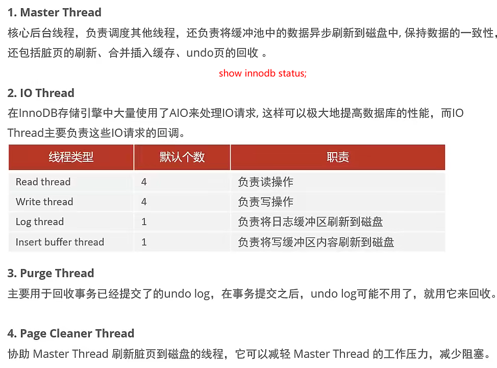
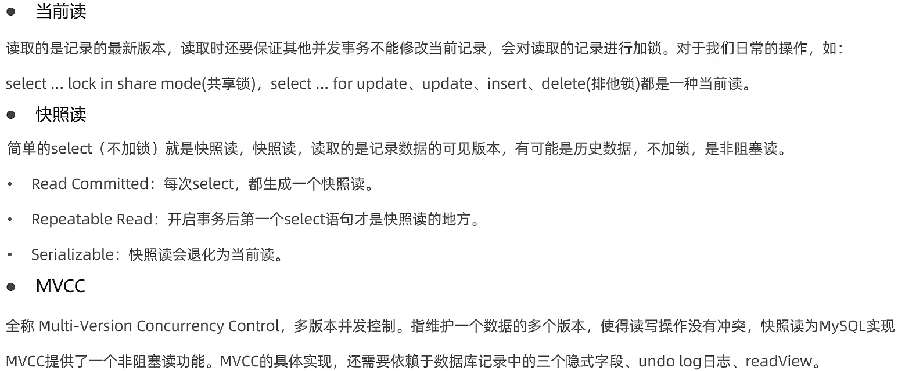
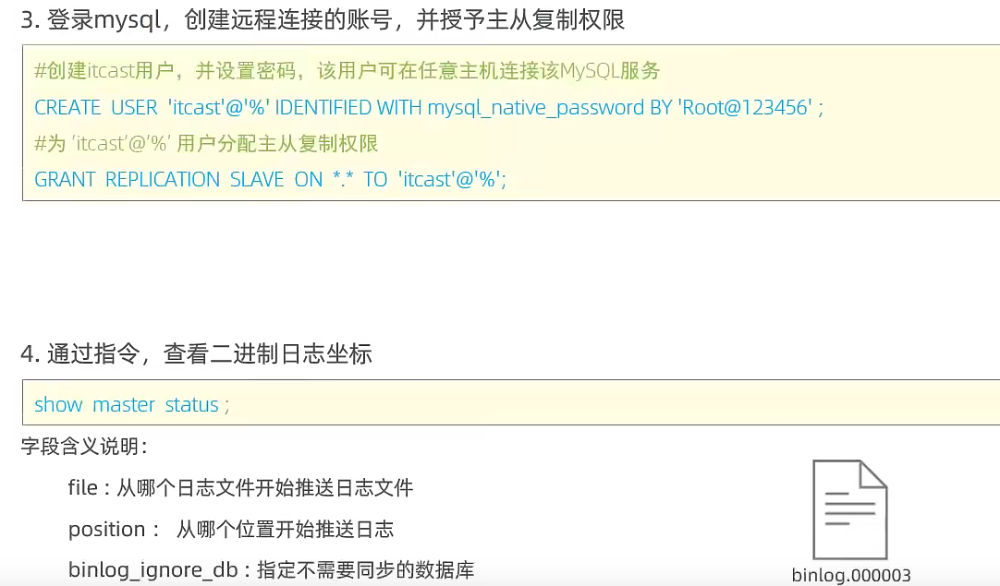

# MySql

## MySql概述

JavaEE是为了企业级Java开发准备的，WEB分为：前端（页面渲染，数据显示）、后台（连接数据库JDBC，链接前端（控制，控制视图跳转，给前端传递数据））、数据库（存储数据）。

**数据库：**DataBase，简称DB，就是按照一定格式存储数据的一些文件的组合，实际上就是一堆文件。

**数据库管理系统：**DataBaseManagementSystem，简称DBMS，用来管理数据库中的数据的，可对数据库中数据进行增删改查。常见的有：MySQL、Oracle、MS SqlServer、DB2、Sybase等。

**SQL：**（Structure Query Language）结构化查询语言，是一套标准（可在各个DBMS中使用），DBMS负责执行SQL语句来完成对数据库中数据的增删改查。

**端口号port：**任何一个软件或应用都有的，是应用的唯一代表，用来定位计算机上某个应用或服务的，通常和计算机IP地址结合。

推荐书籍：《MySQL必知必会》《高性能MySQL》《MySQL技术内幕——Innodb存储引擎》

### 数据库分类

关系型数据库：(SQL)

- MySql，Oracle，Sql Sver，DB2，SQLlite。
- 通过表和表之间、行和列之间进行数据的存储。

非关系型数据库：（No  SQL）not only

- Redis，MongDB。
- 对象存储，通过对象自身的属性来决定  。

DBMS：数据库管理系统

- 数据库的管理软件，科学有效管理数据，维护和获取数据；
- MySQL、Oracle等。

### MySQL

MySQL是一个**关系型数据库管理系统**。

前世：由瑞典MySQL AB 公司开发。

今生：属于 [Oracle](https://baike.baidu.com/item/Oracle) 旗下产品。

MySQL 是最流行的关系型数据库管理系统之一，在 WEB 应用方面，MySQL是最好的 RDBMS(Relational Database Management System，关系数据库管理系统) 应用软件之一。MySQL是一种关系型数据库管理系统，关系型数据库将数据保存在不同的表中，而不是将所有数据放在一个大仓库内，这样就增加了速度并提高了灵活性。MySQL所使用的 SQL 语言是用于访问数据库的最常用标准化语言。MySQL 软件采用了双授权政策，分为社区版和商业版，由于其体积小、速度快、总体拥有成本低，尤其是开放源码这一特点，一般中小型网站、大型网站的开发都选择 MySQL 作为网站数据库。其可以集群。

## 下载安装

官网：[MySQL](https://www.mysql.com/)（建议：安装软件尽量都用压缩包来安装，也就是所谓的绿色版本）

### 安装MySQL5

下载地址：[MySQL :: Download MySQL Community Server](https://dev.mysql.com/downloads/mysql/)

1. 解压后配置Path环境变量：将bin目录加进去；

2. 在D:\Environment\mysql-5.7.34目录下新建`my.ini`文件(内容如下)：

   - ```ini
     [mysqld]
     #目录换成自己的
     basedir=D:\Environment\mysql-5.7.34\
     datadir=D:\Environment\mysql-5.7.34\data\
     #data文件夹自动生成，存放数据信息
     port=3306
     skip-grant-tables
     ```

3. 安装：启动管理员模式下的cmd，进入bin目录：`cd /d D:\Environment\mysql-5.7.34\bin`，执行`mysqld -install`安装服务；

4. 初始化：然后执行：`mysqld --initialize-insecure --user=mysql`，初始化数据文件，不报错则完成；

5. 启动：启动MySQL：`net start mysql  `；

6. 登陆：使用`mysql -u root -p`（-p后不要有空格）进入管理界面（密码可为空，直接回车）；

7. 密码修改：进入界面后修改root密码：`update mysql.user set authentication_string=password('123456') where user='root' and Host='localhost';`（注意后面有一个分号），然后刷新权限：`flush privileges;`（退出界面可以用`exit`）；

8. 删除：删除`my.ini`文件里的ship-grant-tables（可以用#号注释掉）；

9. 重启：重启MySQL即可正常使用（停止：`net stop mysql`，启动：`net start mysql`）；

10. 进入：执行`mysql -u root -p`然后输入密码，或者执行`mysql -u root -p123456`（在p后面输入密码）。

可能出现问题：

- 缺少组件.dll
- 如果安装失败，可以使用`sc delete mysql`清空服务来重装

### 安装MySQL8

安装了MySQL5的情况下安装MySQL8，先停止启动了的MySQL服务。

 my.ini 文件内容：

```ini
# 设置3306端口
port=3306
# 设置mysql的安装目录D:\Environment\mysql-8.0.26-winx64
basedir=D:\Environment\mysql-8.0.26-winx64
# 设置mysql数据库的数据的存放目录
datadir=D:\Environment\mysql-8.0.26-winx64\data
# 允许最大连接数
max_connections=200
# 允许连接失败的次数。
max_connect_errors=10
# 服务端使用的字符集默认为UTF8
character-set-server=utf8mb4
# 创建新表时将使用的默认存储引擎
default-storage-engine=INNODB
# 默认使用“mysql_native_password”插件认证
#mysql_native_password
default_authentication_plugin=mysql_native_password
sql_mode= STRICT_TRANS_TABLES,NO_ZERO_IN_DATE,NO_ZERO_DATE,ERROR_FOR_DIVISION_BY_ZERO,NO_ENGINE_SUBSTITUTION
[mysql]
# 设置mysql客户端默认字符集
#  utf8 最多只能存 3 字节长度的字符，不能存放 4 字节的生僻字或者表情符号，因此打算迁移到 utf8mb4。
default-character-set=utf8mb4
[client]
# 设置mysql客户端连接服务端时默认使用的端口,3307会怎样？是不是要修改防火墙策略？
port=3306
default-character-set=utf8mb4
```

1. 数据库管理系统主目录创建my.ini文件，用来配置data目录；
2. 管理员模式运行命令行，并进入MySQL的bin目录，执行`mysqld --initialize --console`；
   - 作用：该命令会根据my.ini文件进行数据库的初始化，构建data目录以及配置好其他设置。
   - 保存密码：用鼠标选中命令行界面中出现的`root@localhost:`后的（全部字符）密码，按ctrl+c复制（例`LJ>Fusj7QHKs`）。 
   - **这里注意，如果后续my.ini文件有修改，而重启mysql后没有生效，那就需要删除data目录，删除mysql服务（命令`sc delete 服务名`），然后重新执行`mysqld --initialize --console`**；
3. 安装：`mysqld --install` mysql8；（执行安装并把MySQL服务的名字定义为`mysql8`，Windows系统下大小写是不区分的）
4. 打开注册表，找到HKEY_LOCAL_MACHINE\SYSTEM\CurrentControlSet\Services\mysql8，修改ImagePath参数，更正`mysql8`服务相关路径（修改imagePath为`D:\Environment\mysql-8.0.26-winx64\bin\mysqld MySQL8`）。
5. 启动服务：`net start mysql8`；
6. 登陆：`mysql -u root -p`（密码为第2步时复制的字符），如果出现错误：`ERROR 1045 (28000): Access denied for user ‘root’@‘localhost’ (using password: YES)`，则先执行`net stop mysql8`关掉服务，然后执行下面操作：
   - 在my.ini所在目录新建一个`.txt`为后缀的文件，文件内容为`ALTER USER 'root'@'localhost' IDENTIFIED BY '123456';`；
   - 然后执行`mysqld --init-file=D:\Environment\mysql-8.0.26-winx64\mysqlc.txt --console`；
   - 执行完毕后关掉DOS窗口，再管理员模式运行一个新的DOS窗口，执行`net start mysql8`打开服务；
   - 再执行登陆，登陆密码为123456。
7. 安装完成去修改密码，执行：`alter user root@localhost identified by 'root'; `执行后就把密码改为了`root`，这里sql语句后面的分号不要丢；
8. 服务设置：因为已经有了`mysql5`的服务，设置常用的一个服务的属性为自动，不常用的就设为手动，需要用哪个版本数据库就打开哪个服务，记得要关闭一个再开启另一个。


### 安装SQLyog

可视化软件，下载：[SQLyog - Download (softonic.com)](https://sqlyog.en.softonic.com/)

默认安装后使用：

1. 新建一个连接后Connect就进入了数据库的可视化界面

   

2. 然后就可以执行数据库操作

3. 创建一个数据库

   

4. 尝试建一个表：tables下右键create table

   

5. 打开新建的表，添加数据，类似Excel的添加，添加完就刷新一下会提示是否保存。

### Linux下安装MySQL8

**MySQL卸载：**

1. 关闭MySQL服务：`systemctl stop mysqld.service`。
2. 检查是否安装了MySQL：
   - `rpm -qa | grep -i mysql`：如果查不到就没有安装。
   - `systemctl status mysqld.service`：检查是否有MySQL服务。
3. 卸载查询出的已安装查询：`yum remove xxx xxx xxx ...`。
4. 删除mysql相关的文件：
   - `find / -name mysql`：查找相关文件。
   - `rm -rf xxx`：删除查找到的相关文件。
   - `rm -rf /etc/my.cnf`：删除.cnf。

**MySQL四大版本：**

1. MySQL Enterprise Edition：企业付费版。
2. MySQL Community Server：社区版，开源免费。
3. MySQL Cluster：集群版，开源免费。
4. MySQL Cluster CGE：高级集群版，付费。

**MySQL包名称说明：**（mysql-8.0.27-1.el7.x86_64.rpm-bundle.tar）

- 软件名称-版本号-发布次数.适合系统.系统架构.rpm-bundle.tar。（el7则是适合CentOS7版本）

**MySQL安装：**（[MySQL :: Download MySQL Community Server (Archived Versions)](https://downloads.mysql.com/archives/community/)）

1. 检测/tmp临时目录：（MySQL安装中会通过mysql用户在/tmp目录下新建tmp_db文件，所以需要给该文件较大的权限）
   - `chmod -R 777 /tmp`。
2. 检查依赖：
   - `rpm -qa | grep libaio`：如果没查到libaio-0.3.109-13.el7.x86_64，就去https://centos.pkgs.org/7/centos-x86_64/libaio-0.3.109-13.el7.x86_64.rpm.html下载。
   - `rpm -qa | grep net-tools`。
3. 安装MySQL8：
   1. （需要卸载系统默认安装的mariadb数据库，（`rpm -qa | grep mariadb`：查看；`rpm -e mariadb-libs-5.5.56-2.el7.x86_64 --nodeps`：卸载））
   2. `rpm -ivh mysql-community-common-8.0.27-1.el7.x86_64.rpm`。
   3. `rpm -ivh mysql-community-client-plugins-8.0.27-1.el7.x86_64.rpm`。
   4. `rpm -ivh mysql-community-libs-8.0.27-1.el7.x86_64.rpm`。
   5. `rpm -ivh mysql-community-client-8.0.27-1.el7.x86_64.rpm`。
   6. `rpm -ivh mysql-community-server-8.0.27-1.el7.x86_64.rpm`。
      1. 安装以上后，可使用`mysqladmin --version`、`rpm -qa | grep -i mysql`查看是否安装完成。
4. root用户运行mysql服务，需要执行初始化命令：
   1. `mysqld --initialize --user=mysql`：--initialize是默认以“安全模式”进行初始化，会为root用户生成一个密码并将密码标记为过期，登录后需要设置一个新密码，生成的临时密码在日志中有记录。
   2. `chown mysql:mysql /var/lib/mysql -R`、`sudo chown -R mysql:mysql /var/log`。
   3. （查看临时密码：`cat /var/log/mysqld.log`（root@localhost:后就是）；如果没有生成则会显示empty password）
5. 启动mysql服务并设置：
   1. 查看mysql服务：`systemctl status mysqld`。
   2. 启动mysql服务：`systemctl start mysqld.service`。
      - 如果出现“Job for mysqld.service failed because the control process exited with error code. See "systemctl status mysqld.service" and "journalctl -xe" for details.”错误，可通过journalctl -xe查看错误报告，有可能是/var/lib/mysql目录权限不够，依次执行`setenforce 0`、`chown mysql:mysql /var/lib/mysql -R`、`chmod -R 777 /var/lib/mysql`。
   3. 设置开机自启动：`systemctl enable mysqld.service`。
6. 进入数据库：`mysql -uroot -p `（因为我执行时没有生成密码，所以无需输入密码直接回车）。
7. 进入后修改数据库密码：
   1. 修改密码：`ALTER USER 'root'@'localhost' IDENTIFIED WITH mysql_native_password BY 'root';`。
   2. 设置密码永不过期：`alter user 'root'@'localhost' identified by 'root' password expire never;`。
8. 授予远程访问：`create user 'root'@'%' identified with mysql_native_password by 'root';grant all privileges on *.* to 'root'@'%' with grant option;`；刷新权限`flush privileges;`。（默认情况下不能通过root来进行远程登录）
   - 如何查看用户是否能远程登录？进入mysql后，`use mysql`，然后`select host,user from user`，就可查出，host是指可使用该用户来登录的主机，如果是host是`%`就表明任何主机都可使用该账户登录。
9. 因为部分可视化工具，不支持最新版本 mysql 8.0 加密规则，导致无法链接：
   - 可以修改加密规则：`ALTER USER 'root'@'%' IDENTIFIED BY 'root' PASSWORD EXPIRE NEVER;`。
   - 或者这样：`ALTER USER 'root'@'%' IDENTIFIED with mysql_native_password by 'root';`。
10. 关闭防火墙：`systemctl stop firewalld`、`systemctl disable firewalld.service`。
11. SQL连接。


## 数据库基本命令

Windows下cmd窗口中进入MySQL数据库管理系统：

```mysql
mysql -u root -p123456
```

进入数据库管理系统后的基本命令：

```sql
# 修改数据库密码
update mysql.user set authentication_string=password('123456') where user='root' and Host='localhost'; 
# 刷新权限
flush privileges; 
# 显示数据库中所有表的信息
describe xxx; 
# 退出数据库管理系统
exit;
--   # 单行注释（mysql的本来的注释）
/**/ # 多行注释
```

# 表

什么是表？为什么要使用表来存储数据？

表就是数据库中用来存储数据的一种形式，表的row（横行）被称为数据（或记录），column（纵行，列）被称为字段，字段包括字段类型、字段属性、字段值。

## 字段的数据类型

关于`数据类型(M)`：

1. 对于char型：char(M)——M指定该字段的字符数（指定值不能超过char允许的范围），存储的时候必然按M个字符进行存储，不够的时候用空格补。在检索的时候（我理解是查询的时候），取出的值尾部空格被删除，存储的时候尾部的空格可以认为没有做处理。
2. 对于varchar型：M指定了字段值最大字符数为M（不能超过varchar允许的字符数），存储的时候以实际长度进行存储，但这个长度不能超过M。然后与char的区别在于，不会在写入和读出的时候，对字符串的尾部空格进行删除。
3. 对于char和varchar：前者注重效率，但是对于变动字符数的字符串，存在空间浪费的情况；后者varchar注重存储空间的占用，是可变字符，但是效率比char低。

4. 对于int型来说，不填写这个M值，那么默认的长度是11。
  - 即便设置为int(1)、int(1)或int(64)，也不影响这个字段在MySQL中存储的数值范围-2147483648 ~ 2147483647（即-2³¹-1~2³¹-1）
    M为0的结果是，设置不生效，即最后变成默认的11。
5. 关于zerofill：主要是数值位数不满M时，自动在最高位前面补0凑够M个数位，不影响值的存取。然后加入数值的数位大于M，则只会显示M+2个数位。相当于当数值的数位大于M的时候，这个zerofill不生效了。
  - zerofill的用法：指定zerofill后，会变成 int(M) unsigned zerofill，即变成了无符号类型。

### 数值：

| 类型（整数和浮点数） | 描述                           |
| :------------------- | :----------------------------- |
| tinyint              | 十分小，1byte                  |
| smallint             | 较小，2byte                    |
| mediuint             | 中等小，3byte                  |
| **int**              | **标准整数，4byte（常用的）**  |
| bigint               | 较大的数据，8byte              |
| float                | 4byte浮点数                    |
| double               | 8byte浮点数                    |
| decimal              | 字符串形式的浮点数（金融计算） |

### 字符串：

| 类型        | 描述                                   |
| :---------- | :------------------------------------- |
| char        | 固定大小的字符串，0-255个字符（1byte） |
| **varchar** | **可变字符串，0-65535**（2byte）       |
| tinytext    | 微型文本，2^8 - 1=255 （1byte）        |
| **text**    | **文本串，2^16 - 1**=65535（2byte）    |
| mediumtext  | 约16M                                  |
| longtext    | 约4G                                   |

### 时间日期：

| 类型          | 展现格式                                       |
| :------------ | :--------------------------------------------- |
| date          | 日期，YYYY-MM-DD                               |
| time          | 时间，HH-mm-ss                                 |
| **datetime**  | **最常用的时间格式，YYYY-MM-DD  HH-mm-ss**     |
| **timestamp** | **时间戳，1970.1.1到现在的毫秒数（较为常用）** |
| year          | 年份                                           |

date和datetime的区别：

- date是短日期，只包含年月日，datetime是长日期，包含年月日时分秒。
- MySQL短日期默认格式：`%Y-%m-%d`。
- MySQL长日期默认格式：`%Y-%m-%d %h-%i-%s`。

MySQL当前时间：`now()`获取系统当前时间（`YYYY-MM-DD  HH-mm-ss`）。

### 空与bit

1. null：表示没有或未知，不要用其进行运算，计算结果也将是null。
2. bit：二进制类型中的一种。

## 字段数据的属性

字段属性是字段除数据类型外的属性，一般有以下属性：

1. PK（`primary key`）：主键；
2. Not Null（`not null`）：非空，不能为空；
3. Unsigned（`unsigned`）：无符号；
4. Auto Incr（`auto_increment`）：理解为自增，自动在上一条记录的基础上+1（默认）（通常用来设置唯一的主键，必须是整数，可设置步长和起始值）；
5. Zero fill（`zero fill`）：0填充，比如3位整数，多余的位数用0填充；

6. Default（`default`）：设置默认值。


使用主键应注意以下几点：

- 每个表只能定义一个主键。
- 主键值必须唯一标识表中的每一行，且不能为 NULL，即表中不可能存在有相同主键值的两行数据。这是唯一性原则。
- 一个字段名只能在联合主键字段表中出现一次。（所谓的联合主键，就是这个主键是由一张表中多个字段组成的。）
- 联合主键不能包含不必要的多余字段。当把联合主键的某一字段删除后，如果剩下的字段构成的主键仍然满足唯一性原则，那么这个联合主键是不正确的。这是最小化原则。

阿里巴巴规范：每个表都要存在以下字段

- id：主键
- version：乐观锁
- is_delete：伪删除
- gmt_create：创建时间
- gmt_update：修改时间

# 约束

## 概述

什么是约束（constraint）？

约束，为保证数据完整性而对数据添加的一些限制，在创建表或修改表时可以添加。（作用就是为了保证表中数据的有效性、完整性）

约束种类：

1. **唯一性**约束：unique， 保证某列的每行的值唯一、不重复，**但是都可以为null**。
2. **非空**约束：not null，指示某列不能存储 NULL 值。
3. **主键**约束：primary key（简称PK），NOT NULL 和 UNIQUE 的结合。确保某列（或两个或多个列的结合）有唯一标识，有助于更容易更快速地找到表中的一个特定的记录。
4. **外键**约束：foreign key（FK），用来让两张表的数据之间建立连接，保证数据的一致性和完整性（一个表中的某个字段受到外表的某个字段值的限制，其字段值得完全参考外表的字段值来存储值）。
5. **检查**约束：check（MySQL8.0.16版本后开始支持，Oracle也支持）， 保证约束的字段的值满足某一个指定的条件。
6. **默认**约束：default，保存数据时如果没有指定该字段的值则采用默认值，如果没有设置默认值则为null。

## 添加唯一性约束

约束单个字段：

```mysql
-- 创建表时添加
create table test(
id int not null auto_increment primary key,
acct varchar(255) unique,  -- 列级约束
pswd varchar(255) not null
)engine = innodb default charset=utf8;
-- 创建表后添加，通过modify或change修改字段结构来添加唯一性约束
alter table `test` modify acct varchar(255) unique;
```

两个字段联合唯一：（即不能出现两个字段值都相同的情况）

```mysql
create table test(
id int,
acct varchar(255),
pswd varchar(255),
unique(id,acct) -- 表级约束
)engine=innodb default charset=utf8;
```

在需要给多个字段联合起来添加一个约束的时候，需要使用表级约束。

1. 列级约束：在列定义时声明，列级约束只能用来约束某一列。（六种约束都可定义为列级约束）
2. 表级约束：在列的定义最后再声明，常用于对多个列来进行约束，必须要指定约束字段。（主键、外键、唯一、检查，这四种可定义表级约束）


## 添加主键约束

主键字段是添加了主键约束的字段，主键字段的每一个值叫作主键值。主键值是每一行记录的唯一标识，主键值是每一行记录的身份证。

表中的数据中有些字段信息可能是重复的，为了区分这种重复，就引入了约束，协助身份标识；任何一张表都应该有主键约束，主键约束一张表只能有一个。

**作为主键的字段必须是：not null + unique（非空、唯一：主键值不能是null，也不能重复）**。添加主键约束的操作如下：

```mysql
create table `table_name`(
	id int(10) primary key auto_increment, # 行级(列级)约束，一个字段作主键：单一主键
    ...
);
# 开发中不建议使用复合主键，建议使用单一主键
create table `table_name`(
	id int(10) not null,
    ...,
    primary key(`字段1`，`字段2`，...)  # 表级约束，主要是给表添加包含多个字段的约束，组成复合主键
);
```

主键值建议是这些数据类型：int、bigint、char等类型，不建议使用varchar来作主键；主键值一般都是数字，一般都是定长的。

自然主键和业务主键：

- 自然主键：主键值是一个自然数，和业务没关系。（开发中使用更多）
- 业务主键：主键值和业务紧密关联。（例如拿银行账号作主键值）

## 添加外键约束

MySQL的外键约束用来在两个表数据之间建立连接，其中一张表的一个字段被另一张表中对应的字段约束着。也就是说，设置外键约束至少要有两种表，被约束的表叫做从表（子表），另一张用来约束的表叫做主表（父表），属于主从关系；其中主表中的关联字段叫做主键，从表中的关联字段叫做外键。外键约束主要作用就是能够让表与表之间的数据建立关联，使数据更加完整，关联性更强。

业务背景：设计数据库表，描述班级和学生的信息

- 方案一：数据都存放于一张表。（每个学生的班级信息和班级代号信息可能会重复，造成数据冗余）
- 方案二：班级表、学生表分表存储不同数据，学生表引用班级表。（添加外键约束，减少数据冗余）

含外键的表叫从表，外键指向的表叫主表，主表约束从表。

**外键的创建方式一：在创建表的同时为其某个字段添加外键约束**

```mysql
create table 表名(
	字段定义...
	[constraint] `外键名称` foreign key (`外键字段名`) references `主表`(主表字段) [属性]
)engine=innodb default charset=utf8；
-- constraint ：用于设置外键约束名称，可以省略，默认的外键约束名称为`从表名_ibfk_1`
-- foreign key：外键设置，用于指定从表的外键字段
-- references：主表及主键设置，用于指定主表和主键
-- 属性可选，属性说明：
	-- CASCADE：主表删除或修改记录时，从表也会对关联记录的外键字段进行修改。
	-- RESTRICT：删除或修改主表记录，子表中若有关联记录，则不允许主表删除或修改。
	-- SET NULL：主表删除或修改主表记录时，从表会将关联记录的外键字段设为null。（innodb不支持）
	-- ON UPDATE CASCADE：主表修改记录时，从表关联记录的外键字段也会修改。（将CASCADE改为RESTRICT，意思相反）
	-- ON DELETE CASCADE：主表删除记录时，从表关联记录的外键字段也会删除。（将CASCADE改为RESTRICT，意思相反）
```

实例演示：	

```mysql
-- 主表 
CREATE TABLE `t_class1` (
    `id` INT(10) NOT NULL AUTO_INCREMENT COMMENT '学生id',
    `s_id` INT(10) NOT NULL DEFAULT '1001' COMMENT '学号',
    `specialty` CHAR(255) DEFAULT NULL,
    `grade` CHAR(255) DEFAULT NULL,
    PRIMARY KEY (`id`)
) ENGINE=INNODB DEFAULT CHARSET=utf8;
-- 从表，被约束的表-创建外键的表，也可以看做为某个字段外扩了一些关联数据
CREATE TABLE `t_student1`(
    `id` INT(10) NOT NULL AUTO_INCREMENT COMMENT '学生id',
    `s_id` INT(10) NOT NULL DEFAULT '1001' COMMENT '学号',
    `name` CHAR(10) DEFAULT NULL COMMENT '学生姓名',
    `sex` CHAR(2) DEFAULT NULL COMMENT '性别',
    `n_place` CHAR(255) DEFAULT NULL COMMENT '籍贯',
    `age` INT(3) NOT NULL DEFAULT '18' COMMENT '年龄',
    `g_level` CHAR(10) NOT NULL DEFAULT '无' COMMENT '级别',
    `phone` CHAR(255) DEFAULT NULL COMMENT '联系电话',
    PRIMARY KEY (`id`),
    CONSTRAINT `FK_id` FOREIGN KEY (`s_id`) REFERENCES `t_class1`(`id`)
)ENGINE=INNODB DEFAULT CHARSET=utf8;
```

**外键的创建方式二：在创建表完成之后再添加外键约束**

```MYSQL
alter table 表名 add [constraint `外键名称`] foreign key (`外键字段名`) references `主表`(`主表列名`) [属性];
-- 可以不自定义外键名称
alter table 表名 add foreign key (`外键字段名`) references `主表`(`主表列名`);
```

**外键的删除：**

```mysql
alter table 表名 drop foreign key 外键名;
```

**查看外键：**

```mysql
-- 查看数据库中某张表的外键
select * from INFORMATION_SCHEMA.KEY_COLUMN_USAGE where constraint_schema='数据库' and table_name='从表名';
-- 使结果每个列分行显示
select * from INFORMATION_SCHEMA.KEY_COLUMN_USAGE where constraint_schema='数据库' and table_name='从表名'\G;
-- 通过查看建表语句来查看外键
show create table `表名`;
```


**注意的点：**

1. 删除有外键关系的表时，**需要先删除主表，然后再删除从表**。
2. 外键值可以为null。
3. 外键引用主表中的某个字段，**主表中被引用的字段不一定是主键，但至少具有唯一性（要有唯一性约束）**。

以上操作都是物理外键，数据库级别的外键，不建议使用！

最佳实践：数据库就是单纯的表，只用来存数据，只有行和列。使用多张表就创建外键。

# -------SQL start-------

（Data）数据xx语言（Language）：（CURD(create update retrieve delete)	CV	API）

1. DDL（Definition，数据定义语言）：修改数据表、数据库的结构的语言，如create、drop、alter的都是。

2. DML（Manipulation，数据操作语言）：对表内数据进行增删改操作的，如insert、update、delete。

3. DQL（Query，数据查询语言）：用来查询索引数据，有select关键字的语句都是。

4. DCL（Control ，数据控制语言）：DCL用来授予或回收访问数据库的某种特权，并控制数据库操纵事务发生的时间及效果，对数据库实行监视等，例如授权grant、撤销权限revoke...。

5. TCL（Transaction Control，事务控制语言）：事务提交commit、事务回滚rollback。


数据库 ===> 数据库中的表 ===> 表中的信息。

# DDL

数据定义语言，DDL语句不用commit。MySQL的关键字不区分大小写，下面用中括号包起来的表示可选。

## 数据库

1. 创建数据库（使用命令创建数据库时，如果不设置字符集则是默认的字符集(不支持中文)，值得注意的是MySQL中，utf8mb4才是真正的utf8）

   ```mysql
   create database [if not exists] database_name character set utf8 collate utf8_general_ci;
   ```

2. 删除数据库

   ```mysql
   drop database [if exists] 数据库名;
   ```

3. 使用数据库

   ```sql
   use `数据库名`; -- 数据库名、表名或字段名是特殊字符，就带 ``
   ```

4. 查看数据库

   ```mysql
   show databases; -- 查看管理系统中所有的数据库
   ```

## 创建、删除表

创建表：

```mysql
-- 语法
CREATE TABLE [IF NOT NULL] 表名(
    `字段名` 列数据类型(长度) [属性] [索引] [说明],
    `字段名` 列数据类型(长度) [属性] [索引] [说明],
    `字段名` 列数据类型(长度) [属性] [索引] [说明],
    ......
    `字段名` 列数据类型(长度) [属性] [索引] [说明],
    PRIMARY KEY(`字段名`)
)[引擎] [表类型] [字符集设置] [说明];
```

```SQL
-- 示例
CREATE TABLE IF NOT EXISTS `students`(
`id` INT(4) NOT NULL AUTO_INCREMENT COMMENT '学号',
`name` VARCHAR(30) NOT NULL DEFAULT '匿名' COMMENT '姓名',
`pwd` VARCHAR(20) NOT NULL DEFAULT '123456' COMMENT '密码',
`sex` VARCHAR(2) NOT NULL DEFAULT '女' COMMENT '性别',
`birthday` DATETIME DEFAULT NULL COMMENT '生日',
`address` VARCHAR(100) DEFAULT NULL COMMENT '地址',
`email` VARCHAR(20) DEFAULT NULL COMMENT '邮箱',
PRIMARY KEY(`id`) 
)ENGINE=INNODB DEFAULT CHARSET=utf8; 
```

将查询结果创建为一个表——复制表：

```mysql
-- 将查询结果当做一张表新建
create table `table_name` as select ... from ......;
```

删除表：

```sql
DROP TABLE IF EXISTS `table-name`;       -- 删除表
```

## 常用查看命令

```sql
show create database `database_name`; -- 查看创建数据库的语句
show create table `table_name`; -- 查看创建表的语句
describe `table_name`; -- 查看表的结构 （describe table_name）
desc `table_name`; -- 查看表的结构

show status; -- 查看广泛的服务器状态信息
show grants; -- 查看授予用户的安全权限
show errors; -- 查看错误信息
show warnings; -- 查看警告信息
show variables like 'character%'; -- 查看数据库、系统、服务等使用的字符集
```

```mysql
-- 查看表的注释等信息
use information_schema;
select * from tables where TABLE_SCHEMA='数据库名' and TABLE_NAME='表名';
```

设置数据库表的字符集编码：`charset=utf8`，不设置的话，会是mysql默认的字符集编码Latin1（不支持中文！）；MySQL中，utf8mb4才是真正的utf8。

**MySQL的默认编码是Latin1，不支持中文，但可以修改：**

1. 第一种就是创表的时候就修改，charset=utf8。
2. 第二种：在my.ini中配置默认的编码：`character-set-server=utf8`。（但不建议使用此种方法，因为第一种是sql上的修改，换台电脑也能运行，但第二种是物理上的修改，如果另一个的数据库my.ini配置里没有这句，那就运行不了了）。

## 修改表结构

对表的结构层的修改：

```mysql
 -- 修改表名
alter table `table-name` rename as `new-tablename`;      
-- 添加新字段
alter table `table-name` add 字段名 类型与属性;      
 -- 修改字段类型、属性和约束
alter table `table-name` modify 字段名 字段属性;  
-- 相当于modify加多了一个修改字段名的功能
alter table `table-name` change 字段名 新字段名 字段属性; 
 -- 删除字段
alter table `table-name` drop 字段名;   
```

```mysql
-- 示例1：修改info表的age字段的结构
alter table `info` modify age int(3) not null default 18;
-- 示例2：修改info表的name字段的结构
alter table `info` add name char(20) NOT NULL default '你是?';
```

```mysql
alter table 表名 comment '修改后的表的注释'; -- 修改表的注释
alter table 表名 modify column 字段名 字段类型 comment '修改后的字段注释'; -- 修改字段的注释
```

【注意点】：字段名用可``来包裹起来；SQL大小写不敏感，建议使用小写；所有符号都用英文下的。

# DML

数据操作语言，insert、update、delete；对表的字段的内容进行操作，需要commit。

## 添加

插入单条数据：

```mysql
insert into `表`(`字段`,...) value(数据,...); -- 数据的类型都需要与字段的类型对应
-- 例子： 
insert into t_student(birth) values(now());
-- 数据和字段要一一对应，字段可省略（省略字段时默认是全部字段）
insert into `表` value(数据,...);
```

插入多条数据：

```mysql
-- 插入一条或多条数据
INSERT INTO `表`(`字段`) VALUES (数据1),(数据2),(数据3),(数据4),...;
INSERT INTO `表`(`字段1`,`字段2`,`字段3`,...) VALUES (数据1,数据2,数据3),(数据11,数据22,数据33),...; 
```

将查询结果插入到一张表中：（查询到的结果要符合所要插入的表的结构）

```mysql
insert into `表` select ... from ...;  -- 很少用
```


为表插入date类型的数据：（函数`str_to_date('字符串日期', '日期格式')`）

1. date类型的数据不能直接通过字符串的形式添加，要插入date类型的数据就要使用函数`str_to_date('字符串日期', '日期格式')`把varchar类型转换为date类型，字符串日期要和日期格式对应`str_to_date('2013-9-1','%Y-%m-%d')`。（详细用法可去教程网站去了解）
2. mysql的日期时间格式有：%Y（年）、%m（月）、%d（日）、%h（时）、%i（分）、%s（秒）。
3. 如果字符串日期格式是`%Y-%m-%d`，那就不用写函数，会自动帮转换。

`date_format(Date, format)`函数：将日期转换成特定格式的字符串

```mysql
select date_format('2022-03-14','%Y:%m:%d');
```

```mysql
-- `date_format(时间日期类型数据, '日期格式')`：通常用于查询日期时，设置展示的日期格式。
select id,name,date_format(birth,%m/%d/%Y) as birth from t_user;
```

## 修改

```mysql
-- 语法格式：update 表名 set `字段1`=值1,`字段2`=值2,... where 条件;
update `table-name` set `字段`=新值 -- 如果不指定条件，该表下所有的该字段的值都会被修改
update `table-name` set `字段`=新值 where `字段`=值;
update `table-name` set `字段1`=新值1,`字段2`=新值2,... where `字段3`=新值3;
```

|     条件操作符      |     含义     |  范围  |    结果     |
| :-----------------: | :----------: | :----: | :---------: |
|   =、>、<、>=、<=   |              |        | false、true |
|       !=、<>        |    不等于    |        | false、true |
| between ... and ... | 在某个闭区间 | [x，y] | false、true |
|         and         |   相当于&&   |        | false、true |
|         or          |  相当于\|\|  |        | false、true |

## 删除

```mysql
-- delete属于DML语句   只删除数据，但数据在硬盘上的存储空间不会被释放
-- 缺点：删除效率低   优点：支持回滚，数据可以恢复
delete from `table-name` [where 条件]; -- 从指定表删除符合条件的数据，没有条件时会删除整张表

-- truncate 清空数据库表中的数据，但表的结构和索引约束不会变
-- 删除效率高，不支持回滚，数据不可恢复，属于DDL操作
truncate `table-name`;
```

`delete`和`truncate`区别：

1. 相同点：都能删除数据，但不会影响表的结构。
2. 不同点：
  - truncate会重新设置自增列的计数器为0。
  - truncate不会影响事务。

【了解】delete删除的问题：重启数据库会出现以下现象

1. InnoDB：自增列会从1开始（自增量存在于内存，重启内存会丢失，自增列重新开始计数）。
2. MyISAM：继续从上一个自增量开始（自增量存在于文件，文件存在就不会丢失自增量）。

# DQL

数据查询语言，DQL基本结构是由SELECT子句，FROM子句，WHERE子句组成的查询块：
`SELECT <字段名表> FROM <表或视图名> WHERE <查询条件>`。

select完整语法：

```SQL
SELECT [ALL | DISTINCT | DISTINCTROW | TOP]
{* | talbe.* | [table.]field1[AS alias1][,[table.]field2[AS alias2][,…]]}
FROM table_name [as table_alias]
	[left | right | inner join table_name2] -- 联合查询
	[WHERE…] -- 指定结果需要满足的条件
	[GROUP BY…] -- 按照哪些字段来分组
	[HAVING…] -- 过滤分组的记录必须要满足的次要条件
	[ORDER BY…] -- 排序
	[limit {[offset,]row_count | row_countOFFSET offset}] -- 指定查询的记录从哪
	[WITH OWNERACCESS OPTION] 	
```

## 单表查询

### 简单查询

```SQL
 -- 查询指定表内所有数据
select * from `table-name`;
-- 查询多个字段的数据
select `字段1`,`字段2`,... from `table-name`;
-- 查询并起别名，别名是查询结果的列名，原有表结构是不会被改变滴
select `字段1` [as 别名],`字段2` [as 别名],... from `table-name` [as 别名]; 
-- \G的使用：查看字段较多的表时，使用该参数可以更直观观察数据
select * from `table-name` \G; 
```

去重distinct：

```SQL
-- 去掉某字段的重复数据再显示该字段数据，distinct只能出现在所有字段最前方
select distinct `字段` from `table-name`;
-- 联合多个字段来去重，distinct后指定的字段都相同时才会去重
select distinct `字段1`,`字段2`,... from `table-name`;
-- 可以出现在函数内
select 字段x,count(distinct `字段1`,...) from `table-name`; -- 去掉该字段重复的数据后剩下的记录条数
```

其他操作：

```SQL
SELECT VERSION(); -- 查询版本
SELECT 1000*4-34 AS '结果'; -- 计算值
SELECT @@auto_increment_increment; -- 查询自增的步长
SELECT `age`+1 AS 长大一岁 FROM result; -- 指定字段加一后显示，不会改变表内数据
```

语法：` select 表达式 from table-name;`；数据库中的表达式：文本值、字段、null、函数、计算表达式、系统变量等。

字段也可以使用数学表达式：`select name,age*12 from table_name`；（把字段看成是变量一样进行运算）

### 条件查询

select语句：

> 语法格式：select `字段1`,`字段2`,... from `table-name` where 条件语句;

```mysql
select ... where `字段` = xx; -- 查询字段值为某个值的数据
select ... where 逻辑判断语句; -- 查询符合该逻辑的数据，可用括号()来决定语句优先级
select ... where `字段` in (110,120); -- 该字段值是否有在该集合里的，如果有就查询相应数据
```

条件操作符：

| 条件操作符          | 含义         | 描述                   |
| :------------------ | :----------- | :--------------------- |
| =、>、<、>=、<=     |              |                        |
| !=、<>              | 不等于       |                        |
| between ... and ... | 在某个闭区间 | [x，y]                 |
| and                 | 相当于&&     | 全1为1                 |
| or                  | 相当于\|\|   | 有1为1                 |
| not                 | 相当于！     | 非                     |
| is null             | 是null       | null 不能用 = 来比较   |
| is not null         | 不是null     |                        |
| like                | 含有某个值   | 模糊查询，结合%或_使用 |

| 常用于子查询         | 含义           | 描述                                                      |
| :------------------- | :------------- | :-------------------------------------------------------- |
| in(xx,xx,xx,...)     | 符合里面的值   | 某字段的值能对应in里面的某一个数据<br />返回true或者false |
| not in(xx,xx,xx,...) | 不符合里面的值 | 某字段的值不在这几个值中<br />返回true或者false           |
| exists()             | 存在里面的值   |                                                           |
| not exists()         | 不存在里面的值 |                                                           |


### 模糊查询

like，模糊查询，支持使用通配符`%`或`_`匹配：

（%不能匹配值为null的数据，如果有其他可以替代通配符的就不用通配符，通配符搜索的处理需要时间较长。）

```sql
 -- 查询字段中有某个字的数据，%：表示0到任意个字符，_：表示一个字符
 where `字段` like '梁%';  -- 字段值以某个字符开头的
 where `字段` like '%梁';  -- 字段值以某个字符结尾的
 where `字段` like '梁__'; -- 字段值以某个字符开头的，并且是三个字符的
 where `字段` like '%梁%'; -- 字段值存在某个字符的
 where `字段` like '%\_%'; -- 字段值存在`_`的，要使用转义字符`\`
```


### 分组查询

实际的应用中，可能有这样的需求，需要先分组再对每一组的数据进行操作，这时需要使用分组查询。分组查询就是根据一个或多个字段分为一组组数据再进行查询操作（判断一个或多个字段值是否相同，如果是相同的则为一组数据并去重，不同的为另一组数据并去重），分组查询一般和分组函数结合来查询特定的数据。

**聚合函数（也叫分组函数、多行处理函数）：**

1. 多个输入对应一个输出，（例如`select sum(sal) from table_name`只输出总和）。

2. **分组函数必须是分组后才能使用，如果不用group by对数据进行分组则默认整张表为一组**。

   ```sql
   select 分组函数 from `table-name`; -- 分组函数如下
   count(`字段`); -- 行数计数，会忽略所有的null
   count(*); -- 不会忽略null
   count(1); -- 1 相当于将分组对应字段赋予1再进行求和
   sum(`字段`); avg(`字段`); max(`字段`); min(`字段`); -- 求总和 求平均值 求最大值 求最小值
   ```

分组函数使用注意事项：

1. 分组函数会自动忽略Null。
2. **分组函数不能直接使用在where条件子句中**，但可以使用在having的条件句中。（因为指令执行有顺序）
3. 所有分组函数可以组合起来一起用。

**分组查询的使用：**（以一个或多个字段为一组，字段值如果是相同的则为一组数据，不同的为另一组数据）

1. SQL92里 select、having、order by 后的**非聚合字段**必须和group by后的字段保持完全一致。
2. SQL 99定义了新的标准，如果group by后面的字段是主键字段，select、having、order by 后的**非聚合字段**可以不和group by后的字段保持完全一致。

```mysql
-- 要使用where或having时优先使用having
select `分组字段`,分组函数 from table_name group by `分组字段`;
select `分组字段1`,`分组字段2`,...,分组函数 from table_name group by `分组字段1`，`分组字段2`, ...;
select `分组字段`,分组函数 from table_name group by `分组字段` having 条件; -- 先分组再筛选
```

默认的 MySQL 配置中 的`sql_mode `是`only_full_group_by`：

- only_full_group_by ：使用这个就是使用和oracle一样的 group 规则，select后的字段都要在group中，或者select后的字段本身是聚合列(SUM、AVG、MAX、MIN) 才行（因为聚合列会根据分组的字段来将数据聚合成一列）。
- group by支持select时声明的别名，因为mysql对此做了拓展引起的，这个取决于mysql中的一个参数 ONLY_FULL_GROUP_BY 。
- SQL92与SQL99对`only_full_group_by`的标准不一致。

分组查询实例：

```mysql
-- 创建订单表
create table t_order(
  id int not null AUTO_INCREMENT COMMENT '订单id',
  user_id bigint not null comment '下单人id',
  user_name varchar(16) not null default '' comment '用户名',
  price decimal(10,2) not null default 0 comment '订单金额',
  the_year SMALLINT not null comment '订单创建年份',
  PRIMARY KEY (id)
)engine=innodb default charset=utf8 comment '订单表';

-- 插入数据
insert into t_order(user_id,user_name,price,the_year) values
  (1001,'甲',11.11,'2017'),
  (1001,'甲',22.22,'2018'),
  (1001,'甲',88.88,'2018'),
  (1002,'乙',33.33,'2018'),
  (1002,'乙',12.22,'2018'),
  (1002,'乙',16.66,'2018'),
  (1002,'乙',44.44,'2019'),
  (1003,'丙',55.55,'2018'),
  (1003,'丙',66.66,'2019');
```

查询每个用户每年的订单量：

```mysql
-- 用户和年份分组，然后计算每组的订单量
select user_id,the_year,count(id) as '订单数量' from t_order group by user_id,the_year;
-- 分组查询完成后再进行过滤，不用where是因为where在group by之前执行
select user_id,the_year,count(price) as '订单数量' from t_order group by user_id,the_year having the_year=2018;
-- SQL99标准，用主键字段进行分组，select、having、group by后可以不是分组字段
select user_name from t_order group by id;
```


## 连接查询

多表的关系有：一对一、一对多（多对一）、多对多。

### 概述

**笛卡儿积现象：**

当两张表进行连接查询，没有任何条件限制，**最终查询结果条数**，是两张表条数的乘积，这种现象被称为笛卡尔积现象，由笛卡尔发现的一种数学现象。  ——由该现象可知数据库底层查询是先从表中拿出数据，也就是from先行，这时匹配的次数是每张表的数据条数的乘积；因此，表的连接次数越多，匹配的次数就越多，查询的效率就越低了。


联表查询中，**加条件是为了避免笛卡尔积现象，查询出有效的组合记录（使查询结果条数不是m*n）**，无论是否加上条件，匹配的次数都是满足笛卡尔积的，联表查询加条件和效率并没有什么关系（from先行），所以说联表查询中尽量降低表的连接才是提高效率的方法。

### 语法

**连接查询：**

连接查询语法根据年代分为SQL92、SQL99，按照表连接的方式可分为三类：

1. 内连接：等值连接、非等值连接、自连接；内连接就是连接的两张表没有主次关系。
2. 外连接：有主次关系（区分主表、从表）。
3. 全连接（几乎不用）。

SQL92、SQL99的区别可参考：[SQL92 与 SQL99 - 知乎 (zhihu.com)](https://zhuanlan.zhihu.com/p/295071589)

1. SQL92：条件与连接混合，例如：

   ```mysql
   SELECT * FROM student s, course c ,teacher t ,sc
   WHERE
   #表链接条件
   s.sid = sc.`sid` 
   AND c.cid = sc.`cid`
   AND c.tid =t.tid
   #筛选条件
   AND t.tname = '张三';
   ```

2. SQL99：条件与连接分开，支持左、右连接等高级操作。**SQL99连接查询语法：**（`xxx join` 确定连接查询方式，见下面的-SQL JOINS图）:

   ```sql
   -- on 为连接条件，可理解为交集区域
   select ... from `表1` xxx join `表2` on ...; （四种）
   select ... from `表1` xxx join `表2` on ... where ...;  （三种）
   --  where是为了选数据，选取连接查询后得到的数据
   ```


连接查询的SQL语句分类：SQLJoins，可以理解为选择出来有某种集合关系的数据集；可以在查询出来的数据表的基础上再进行联表查询（类似于嵌套）。on（表连接条件）、where：


使用连接查询的要义：

1. 明确要查询的数据来源的表。
2. 确定连接查询方式。
3. 确定交叉数据。

### 内连接

**内连接：**（两表特定字段在特定条件的交集数据集（我的理解））

```mysql
inner join
-- inner、as是可以省略的
select * from student s join grades g;
select s.id,s.name,g.course,g.scores from student s join grades g on s.id=g.id;
select s.id,s.name,g.course,g.scores from student as s inner join grades as g on s.id=g.id;
```


**等值连接：**on后条件用`=`的就是等值连接，条件不是等值关系就是非等值连接

```mysql
-- SQL92语法的等值内连接 结构不清晰，表的连接和筛选都放在了where后面
select s.name,stu.name from school s, student stu where s.no = c.no and 条件;
```

```mysql
-- SQL99语法的等值内连接 表连接独立，连接后可再进行筛选  表起别名，很重要，效率问题
-- 语法： select ... from a join b on a和b的连接条件 where 筛选条件; inner是可以省略的
select s.name,stu.name from school s inner join student stu on s.no = c.no;
```

**自连接(了解)：**把一张表当做两张表来进行查询。例子如下：

```mysql
-- 这里的`school`是指数据库，SQL语句中可以"数据库.数据库表"来指定哪个数据库下的表
CREATE TABLE `school`.`category`( 
`categoryid` INT(3) NOT NULL COMMENT 'id', 
`pid` INT(3) NOT NULL COMMENT '父id 没有父则为1', 
`categoryname` VARCHAR(10) NOT NULL COMMENT '种类名字', 
PRIMARY KEY (`categoryid`)
) ENGINE=INNODB CHARSET=utf8 COLLATE=utf8_general_ci; 
-- 插入数据
INSERT INTO `school`.`category` (`categoryid`, `pid`, `categoryname`) VALUES (2, 1, '信息技术');
INSERT INTO `school`.`CATEGOrY` (`categoryid`, `pid`, `categoryname`) VALUES (3, 1, '软件开发');
INSERT INTO `school`.`category` (`categoryid`, `PId`, `categoryname`) VALUES (5, 1, '美术设计');
INSERT INTO `School`.`category` (`categoryid`, `pid`, `categorynamE`) VALUES (4, 3, '数据库'); 
INSERT INTO `school`.`category` (`CATEgoryid`, `pid`, `categoryname`) VALUES (8, 2, '办公信息');
INSERT INTO `school`.`category` (`categoryid`, `pid`, `CAtegoryname`) VALUES (6, 3, 'web开发'); 
INSERT INTO `SCHool`.`category` (`categoryid`, `pid`, `categoryname`) VALUES (7, 5, 'ps技术');
# 把一张表当两张表用——通过起两个别名
# 下面的SQL92语法语句的功能为：选取两（a、b）表中categoryname都相等的数据的pid、categoryname
 SELECT a.pid,a.categoryname 
 FROM category AS a, category AS b
 WHERE a.categoryname = b.categoryname;
```

### 外连接

左外连接：使用左外连接来查询数据时，主表的每一条数据会根据匹配条件依次与从表的每一条数据进行匹配，匹配成功时，主表的数据和从表的数据会组合成查询结果集的一条查询结果（如果主表中的一条数据与从表的n条数据匹配成功，那最终select结果集就有这n条数据）。左外连接的最终结果是匹配成功的加上主表的额外的数据。示例：


```mysql
-- 左外连接，left join的左边为主表，两表根据一定条件匹配成功的数据集 + 主表的其它数据 -> 集合而成的数据集
left join 
-- 右外连接，right join的右边为主表，两表根据一定条件匹配成功的数据集 + 主表的其它数据 -> 集合而成的数据集
right join 
-- 全外连接，两表根据一定条件匹配成功的数据集 + 两表独立的数据，类似并集 （MySQL不支持，可以使用union实现）
full outer join 
```


```sql
-- 测试用表
CREATE TABLE t_student(
id INT(10) NOT NULL AUTO_INCREMENT COMMENT '学生id',
s_id INT(10) NOT NULL DEFAULT 1001 COMMENT '学号',
`name` CHAR(10) DEFAULT NULL COMMENT '学生姓名',
sex CHAR(2) DEFAULT NULL COMMENT '性别',
n_place CHAR(255) DEFAULT NULL COMMENT '籍贯',
age INT(3) NOT NULL DEFAULT 18 COMMENT '年龄',
g_level CHAR(10) NOT NULL DEFAULT '无' COMMENT '级别',
phone CHAR(255) DEFAULT NULL COMMENT '联系电话',
PRIMARY KEY(id)
)ENGINE=INNODB DEFAULT CHARSET=utf8;
CREATE TABLE `t_class`(
id INT(10) NOT NULL AUTO_INCREMENT COMMENT '学生id',
s_id INT(10) NOT NULL DEFAULT 1001 COMMENT '学号',
specialty CHAR(255) DEFAULT NULL,
grade CHAR(255) DEFAULT NULL,
PRIMARY KEY(id)
)ENGINE=INNODB DEFAULT CHARSET=utf8;

INSERT INTO t_student(s_id,NAME,sex,n_place,age,g_level,phone) VALUES
(1001,'何慕','男','山东',18,'A级','123456'),
(1002,'刘华','男','河北',18,'B级','123456'),
(1003,'FF','女','山东',18,'A级','123456'),
(1004,'HH','男','河南',19,'C级','123456'),
(1005,'II','男','河南',17,'B级','123456'),
(1006,'JJ','女','湖南',19,'A级','123456'),
(1007,'KK','女','湖南',17,'B级','123456'),
(1008,'LL','男','山东',18,'B级','123456'),
(1009,'MM','女','河南',19,'A级','123456');
INSERT INTO t_class(s_id,specialty,grade) VALUES 
(1001,'计算机','计算机191'),
(1002,'英语','计算机191'),
(1003,'计算机','计算机191'),
(1004,'会计','会计191'),
(1005,'计算机','计算机192'),
(1006,'英语','计算机191'),
(1007,'会计','计算机191'),
(2221,'土木工程','土木201'),
(2222,'软件工程','软件221');
-- 测试各种连接：
```

### 多表连接

```mysql
-- 可以使用inner、right等的join，以内连接为例
select ... from 
a join b on a和b连接的条件 
join c on a和c连接的条件 
join d on a和d连接的条件
... 
```

### 交叉连接

交叉连接 (笛卡尔积)：返回被连接的两个表所有数据行的笛卡尔积。（每条记录都是 1 对 n条映射，最终返回m*n条记录）

```mysql
select * from sales as a cross join sales as b;
-- 与`select * from stu inner join user;`一样，cross join不支持on
```

直接使用交叉联结的业务需求比较少见，往往需要结合具体条件。


## 子查询


**where子句中出现的子查询：**

```SQL
select `字段1`,`字段2`,... from `table-name` where `字段`=(
	select `字段`... from `table-name` where 条件语句;
))
......; -- 运行由里及外
```

```sql
select `字段1`,`字段2`,... from `table-name` where `字段` in(
	select `字段1`,`字段2`,... from `table-name` where `字段`>xxx and `字段`=(
    	select `字段1`	,`字段2`,... from `table-name` where 语句
    )
)
```

**在from中的子查询：** **（from后面的子查询，可以将子查询的查询结果当做一张临时表。）（技巧）**

```mysql
select ... from (select ... from ... ...) 别名 ......
```

**在select后的子查询语句：(简单了解，会看)**

```mysql
-- 子查询结果作为字段
select 字段1, 字段2, (select ... from ... ...) from ... ...
```

```sql
-- 为每一条记录的id进行操作
select (case when mod(id, 2) != 0  then id + 1 when mod(id, 2)  = 0  then id - 1 end)  
as  `交换后座位号`,name,sid as `学号`
from student order by `交换后座位号` asc;
```


## 数据操作

### 排序order

按照某个字段升序或降序排序：

```mysql
select 字段 from table_name order by `字段` asc;
-- asc：从上往下，升序 desc：从上往下，降序
```

按照多个字段排序：

```mysql
select 字段1,字段2 from table_name order by `字段1` asc,`字段2` asc; 
-- 先按照字段1进行排序处理，字段2是备用排序
-- 也就是说当字段1的值在某处有多个相等的情况下，这几个相等的就会按照字段2再进行排序处理 
```

根据字段的位置进行排序，不建议使用（因为列的顺序很容易发生改变）

```SQL
select 字段1,字段2 from table_name order by 2; -- 对第2个字段进行排序处理，字段位置从1开始而不是从0  
```


### 联合union

1. 使用union在进行结果集合并的时候要求**两个结果集的列数一致**，列的类型可以不同（Oracle下则要求列数、列数据类型都一致）。
2. 如果两结果集的列数一致，但每个列所对应的字段名、字段类型、字段值中有一个是不一致的，那么重复的记录是不会合并成功的。
3. 一定场景下，使用union相对于联表查询的效率会高出一些，因为联表查询匹配次数满足笛卡尔积。

联合，用于将查询结果联合在一起，两结果集重复的数据（需要整条记录的字段名、字段类型、字段值一致）才会合并成一条：

```mysql
-- 不会合并
select name,age from info where age = 20 union select school,nowadays from info where age = 20;
+--------------+------------+
| name         | age        |
+--------------+------------+
| 王小楚        | 20         |
| 王楚          | 20         |
| 齐永华        | 20         |
| 上海理工大学   | 2022-01-05 |
| 电子科技大学   | 2022-01-05 |
+--------------+------------+
-- 合并
select name,age from info where age = 20 union select name,age from stu where age = 20;
+--------+-----+
| name   | age |
+--------+-----+
| 王小楚  |  20 |
| 王楚    |  20 |
| 齐永华  |  20 |
+--------+-----+
```


### 分页limit

可用于缓解数据压力，加强体验；一般图片的才使用瀑布流。

```SQL
-- limit 起始下标,长度n; 从起始下标开始的n条数据  注意数据条数是从0开始的
limit 0,5 -- [0,5] 每页6条记录
-- (n-1)*PageSize：将数据分为n页，每页PageSize条数据
limit (n-1)*PageSize,PageSize
```


### 过滤having

```SQL
select ... from xxx having 条件子句; -- 过滤出符合条件的数据，条件子句中可以使用别名
```


## 指令执行顺序

查询语句：

```mysql
select ... from ... [可选]; -- [可选] 的是可以随意选择的，不过要按照一定顺序书写
-- 可选要遵循的指令顺序
where ... group by ... having ... order by ... limit page,pageSize;
```

查询语句执行顺序：

```mysql
select ... from ... where ... group by ... having ... order by ... limit page,pageSize;
-- 执行顺序：from --> where --> group by --> select --> having --> order by --> limit
-- 从哪张表拿数据 -> 拿出哪些数据 -> 将拿出的数据分组 -> 选中数据 -> 对数据进行过滤 -> 对数据进行排序 -> 数据分页
```

# DCL

数据控制语言DCL用来授予或回收访问数据库的某种特权，并控制数据库操纵事务发生的时间及效果，对数据库实行监视等。如：

1、授权（grant）：grant create session to scott；

2、回滚（rollback）；

3、提交（commit）；

4、新建用户（create user）。

## 管理用户

查询用户：

```mysql
use mysql;
select user,host from user;
```

创建用户：

```mysql
create user `用户名`@`主机名` identified by '密码';
```

删除用户：

```mysql
drop user `用户名`@`主机名`;
```

修改用户密码：

```mysql
alter user `用户名`@`主机名` identified with mysql_native_password by 新密码;
```

## 权限控制

查询权限：

```mysql
show grants for `用户名`@`主机名`;
```

权限列表：

| 权限                | 说明                 |
| ------------------- | -------------------- |
| all，all privileges | 所有权限             |
| select              | 查询数据             |
| insert              | 插入数据             |
| update              | 修改数据             |
| delete              | 删除数据             |
| alter               | 修改表               |
| drop                | 删除数据库、表、视图 |
| create              | 创建数据库、表       |

授予权限：

```mysql
grant 权限列表 on 数据库名.表名 to `用户名`@`主机名`;
grant all on databasetest.* to `lsl`@`localhost`; -- 为该用户授予该数据库的所有权限
```

撤销权限：

```mysql
revoke 权限列表 on 数据库名.表名 from `用户名`@`主机名`;
```

# 练习题

## 练习用表

```mysql
-- 部门表
create table if not exists dept(
	deptno int(2) not null primary key,
	dname varchar(14),
	loc varchar(13)
)engine=innodb default charset=utf8;
insert into dept(deptno,dname,loc) values
(10, 'ACCOUNTING', 'NEW YORK'),
(20, 'RESEARCH', 'DALLAS'),
(30, 'SALES', 'CHICAGO'),
(40, 'OPERATIONS', 'BOSTON');
```

```mysql
-- 员工表
create table if not exists emp(
    empno int(4) not null primary key,
    ename varchar(10),
    job varchar(9),
    mgr int(4),
    hiredate date default NULL,
    sal double(7, 2),
    comm double(7, 2),
    deptno int(2)
)engine=innodb default charset=utf8;
insert into emp values
(7369, 'SMITH', 'CLERK', 7902, '1980-12-17', 800, NULL, 20),
(7499, 'ALLEN', 'SALESMAN', 7698, '1981-02-20', 1600, 300, 30),
(7521, 'WARD', 'SALESMAN', 7698, '1981-02-22', 1250, 500, 30),
(7566, 'JONES', 'MANAGER', 7839, '1981-04-02', 2975, NULL, 20),
(7654, 'MARTIN', 'SALESMAN', 7698, '1981-09-28', 1250, 1400, 30),
(7698, 'BLAKE', 'MANAGER', 7839, '1981-05-01', 2850, NULL, 30),
(7782, 'CLARK', 'MANAGER', 7839, '1981-06-09', 2450, NULL, 10),
(7788, 'SCOTT', 'ANALYST', 7566, '1987-04-19', 3000, NULL, 20),
(7839, 'KING', 'PRESIDENT', NULL, '1981-11-17', 5000, NULL, 10),
(7844, 'TURNER', 'SALESMAN', 7698, '1981-09-08', 1500, 0, 30),
(7876, 'ADAMS', 'CLERK', 7788, '1987-05-23', 1100, NULL, 20),
(7900, 'JAMES', 'CLERK', 7698, '1981-12-03', 950, NULL, 30),
(7902, 'FORD', 'ANALYST', 7566, '1981-12-03', 3000, NULL, 20),
(7934, 'MILLER', 'CLERK', 7782, '1982-01-23', 1300, NULL, 10);
```

```mysql
-- 薪资等级表
create table if not exists salgrade (
	grade int,
	losal int,
	hisal int
)engine=innodb default charset=utf8;
insert into salgrade values
(1, 700, 1200),
(2, 1201, 1400),
(3, 1401, 2000),
(4, 2001, 3000),
(5, 3001, 9999);
```

## 练习题

写SQL的技巧：顺着SQL语句的执行顺序来一步步写下去。

```mysql
select ... from ... where ... group by ... having ... order by ... limit page,pageSize;
-- 执行顺序：from --> where --> group by --> select --> having --> order by --> limit
-- 从哪张表拿数据 -> 拿出哪些数据 -> 将拿出的数据分组 -> 选中数据 -> 对数据进行过滤 -> 对数据进行排序 -> 数据分页
```


### 1.每个部门最高薪水的人员名称

①先分组取得每个部门的最高薪水的人员的部门编号和最高薪水：

```mysql
select deptno,max(sal) from emp group by deptno;
```

②然后将取得的结果联合员工表，找出每个部门薪水最高的：

```mysql
select e.ename,e.sal 
from (select deptno,max(sal) maxsal from emp group by deptno) as t join emp as e 
on t.deptno = e.deptno and t.maxsal=e.sal;
```

### 2.在部门平均薪水之上的人员名单

①求出每个部门的平均薪水

```mysql
select deptno,avg(sal) from emp group by deptno;
```

②筛选

```mysql
select e.ename,e.sal from (select deptno,avg(sal) avgsal from emp group by deptno) as t join emp as e
on t.deptno=e.deptno and e.sal>t.avgsal;
```

### 3.取得各个部门中员工的平均薪水等级

①全部员工的薪水等级

```mysql
select e.*,s.grade from emp e join salgrade s on e.sal between losal and hisal;
```

②根据部门编号且平均

```mysql
select a.deptno,avg(a.grade) from 
(select e.*,s.grade from emp e join salgrade s on e.sal between losal and hisal) a 
group by a.deptno;
```

### 4.全部员工中的最高薪水

方法①：排序后分页

```mysql
select ename,sal from emp order by sal desc limit 0,1;
```

方法②：自连接查询

```mysql
-- 找出有比自身大的数据，并去重
select distinct e1.sal from emp e1 inner join emp e2 on e1.sal<e2.sal;
-- 找到最大值
select emp.sal from emp where emp.sal not in(select distinct e1.sal from emp e1 inner join emp e2 on e1.sal<e2.sal);
```

### 5.平均薪水最高的部门的编号

方法①：

```mysql
select deptno from emp group by deptno order by avg(sal) desc limit 0,1;
```

### 6.平均薪水最高的部门的名称

①平均薪水最高的部门的编号

```mysql
select deptno from emp group by deptno order by avg(sal) desc limit 0,1;
```

②联表

```mysql
select dept.dname from 
(select deptno from emp group by deptno order by avg(sal) desc limit 0,1) a 
join dept on a.deptno=dept.deptno;
```

### 7.平均薪水等级最低的部门的名称

①员工的薪水等级

```mysql
select e.empno,s.grade from emp e join salgrade s on e.sal between s.losal and s.hisal; 
```

②平均薪水等级

```mysql
select avg(a.grade) from
(select e.deptno,s.grade from emp e join salgrade s on e.sal between s.losal and s.hisal) a 
group by a.deptno;
```

③过滤出最低的平均薪水等级的部门编号

```mysql
select a.deptno,avg(a.grade) ming from
(select e.deptno,s.grade from emp e join salgrade s on e.sal between s.losal and s.hisal) a 
group by a.deptno order by ming asc limit 0,1;
```

④联表找部门名称

```mysql
select a.deptno,dept.dname,a.ming from 
(select a.deptno,avg(a.grade) ming from
(select e.deptno,s.grade from emp e join salgrade s on e.sal between s.losal and s.hisal) a 
group by a.deptno order by ming asc limit 0,1) a join dept
on a.deptno=dept.deptno;
```

### 8.找出比普通员工中最高薪水还要高的经理人

（员工代码在mgr字段上出现的就是经理人，其他的都是普通员工）

①找出全部经理人的编号

```mysql
select distinct mgr from emp where mgr is not null;
```

②找出普通员工的最高薪

```mysql
select max(sal) from emp where empno not in(select distinct mgr from emp where mgr is not null);
```

③找出比普通员工的工资高的mgr

```mysql
select e.ename from emp e join 
(select max(sal) maxsal from emp where empno not in(select distinct mgr from emp where mgr is not null)) a
on e.sal > a.maxsal;
```

### 9.薪水最高的前5名员工

```mysql
select ename from emp order by sal desc limit 0,5;
```

### 10.薪水最高的6-10名

```mysql
select ename from emp order by sal desc limit 5,5;
```

### 11.入职最迟的五位员工

```mysql
select ename from emp order by hiredate desc limit 0,5;
```

### 12.每个薪水等级的员工人数

①查出员工的薪水等级

```mysql
select s.grade from emp e join salgrade s on e.sal between s.losal and hisal;
```

②根据薪水等级分组求和

```mysql
select t.grade,count(1) from 
(select s.grade from emp e join salgrade s on e.sal between s.losal and hisal) t 
group by t.grade;
```

### 13.所有员工及领导的名字

```mysql
select a.ename,b.ename leadername from emp a left join emp b on a.mgr = b.empno;
```


思：`select a.ename,b.ename leadername from emp a left join emp b on b.mgr = a.empno;`的结果如何，为什么？

答：表`emp a`的每一条数据与表`emp b`的每一条数据进行匹配，在条件`b.mgr = a.empno`成立时即匹配成功，因为是左外连接，所以匹配不成功的主表的数据也会显示出来（null值和任何数据都匹配得上）。


### 14.列出受雇日期早于其直接上级的所有员工编号、姓名、部门名称

①找出员工与其对应的领导

```mysql
select * from emp a left join emp b on a.mgr = b.empno;
```

②根据受雇日期进行筛选

```mysql
select a.empno,a.ename,a.deptno 
from  emp a left join emp b on a.mgr = b.empno where a.hiredate>b.hiredate;
```

③联表取出部门名称

```mysql
select t.empno,t.ename,d.dname from 
(select a.empno,a.ename,a.deptno 
 from  emp a left join emp b on a.mgr = b.empno where a.hiredate>b.hiredate) as t left join dept d
 on t.deptno=d.deptno; 
```

### 15.列出员工信息及员工的部门名称，同时列出那些没有员工的部门

```mysql
select d.deptno,d.dname,e.* from emp e right join dept d on e.deptno=d.deptno order by d.deptno asc;
```

### 16.找出至少有5个员工的所有部门

①找出每个部门都有多少个员工

```mysql
select deptno,count(1) from emp group by deptno;
```

②连接部门

```mysql
select d.dname from (select deptno,count(1) as num from emp group by deptno) t join dept d 
on t.deptno=d.deptno where t.num >= 5;
```

### 17.列出薪水比“SMITH”多的所有员工信息

①找出Smith

```mysql
select * from emp where ename='SMITH';
```

②比较

```mysql
select e.* from emp e join (select sal from emp where ename='SMITH') t on e.sal>t.sal;
```

### 19.列出最低薪水大于1500的各种工作及从事此工作的雇员人数

```mysql
select job,count(1) as 雇员人数 from emp where sal > 1500 group by job;
```

### 20.列出在部门“SALES”<销售部>工作的员工的姓名，假定不知道销售部门的部门编号

①找出编号

```mysql
select deptno from dept where dname = 'SALES';
```

②根据编号找出员工名字

```mysql
select ename from emp where deptno = (select deptno from dept where dname = 'SALES');
```

### 21.列出薪水高于公司平均薪金的所有员工的名称及所在部门、上级领导、工资等级

①找出员工薪水等级，并把结果集当作员工信息表

```mysql
select e0.*,s.grade from emp e0 join salgrade s on e0.sal between s.losal and hisal;
```

②求出公司平均薪水

```mysql
select avg(sal) from emp;
```

③找出高于平均公司的所有员工及其所在部门

```mysql
select e.ename,d.dname,e.mgr,e.grade from (select e0.*,s.grade from emp e0 join salgrade s on e0.sal between s.losal and hisal) e join dept d on e.deptno=d.deptno 
where sal > (select avg(sal) from emp);
```

④找出员工的上级领导

```mysql
select b.ename,b.dname,a.ename leader,b.grade from  
(select e.ename,d.dname,e.mgr,e.grade from (select e0.*,s.grade from emp e0 join salgrade s on e0.sal between s.losal and hisal) e join dept d on e.deptno=d.deptno 
where sal > (select avg(sal) from emp)
) b ljoin emp a on b.mgr = a.empno; 
```

###  22.列出与“SCOTT”从事相同工作的所有员工及部门名称

①找出其工作

```mysql
select job from emp where ename='SCOTT';
```

②找出他们的名字和所在部门的编号

```mysql
select ename,deptno from emp where job=(select job from emp where ename='SCOTT');
```

③连接部门表，查询出部门

```mysql
select a.ename,d.dname from 
(select ename,deptno from emp where job=(select job from emp where ename='SCOTT')) a
join dept d on a.deptno=d.deptno;
```

### 23.查出和30部门的员工的薪水相等的其他员工的姓名和薪水

```mysql
select ename,sal from emp where sal in(select sal from emp where deptno=30) and deptno != 30;
```

### 24.查出比30部门中最高薪水都高的其他员工的姓名、薪水和所在部门名称

①30部门最高薪水

```mysql
select max(sal) msal from emp where deptno=30;
```

②比最高薪水高的其他部门的员工

```mysql
select ename,sal,deptno from emp 
where sal > (select max(sal) msal from emp where deptno=30) and deptno != 30;
```

③连接部门表，找出他们所在部门

```mysql
select a.ename,a.sal,d.dname from 
(select ename,sal,deptno from emp 
where sal > (select max(sal) msal from emp where deptno=30) and deptno != 30) a 
join dept d on a.deptno=d.deptno;
```

25.列出在每个部门工作的员工数量、平均工资和平均服务期限

平均服务期限？？


### 26.列出所有员工的姓名、部门名称和工资

```mysql
select e.ename,e.sal,d.dname from emp e join dept d on e.deptno=d.deptno;
```

### 27.列出所有部门的详细信息和人数

```mysql
select d.*,count(d.deptno) num from dept d join emp e on d.deptno=e.deptno group by d.deptno;
```

### 28.查出各种工作的最低工资及这些最低工资对应的员工、岗位

```mysql
select ename,job,sal from emp where sal in (select min(sal) minsal from emp group by job);
```

### 29.列出各个部门MANAGER的最低薪金

```mysql
select deptno,min(sal) minSal from emp where job = 'MANAGER' group by deptno;
```

### 30.列出所有员工的年工资，按年薪从低到高排序

```mysql
select ename,sal * 12 yearsal from emp order by yearsal asc;
```

### 31.求出员工领导的薪水超过3000的员工名称和领导名称

```mysql
select e1.ename 员工,e2.ename 领导  from emp e1 join emp e2 on e1.mgr=e2.empno where e2.sal>3000;
```

### 32.查出带“S”字符的部门的员工工资合计情况以及部门人数

```mysql
select d.dname,ifnull(sum(e.sal),0) sumSal,count(e.ename) peoNumber 
from emp e right join dept d
on e.deptno = d.deptno where d.dname like '%S%' group by d.deptno;
```

### 33.给任职日期超过30年的员工加薪10%

```mysql
update emp set sal = sal * 1.1 where datediff(now(),hiredate)/365 > 30;
```


# --------SQL end--------

# 数据库常用函数

[MySQL :: MySQL 5.7 Reference Manual :: 12.1 Built-In Function and Operator Reference](https://dev.mysql.com/doc/refman/5.7/en/built-in-function-reference.html)

数据处理函数（单行处理函数）：一个输入对应一个输出（多少个输入对应多少个输出）。

## 字符串函数

字符串函数：（**注意：函数中被操作字符的下标是从1开始的，而select查询出来的结果是从0开始的**）

| 函数                                 | 功能                                                         |
| ------------------------------------ | ------------------------------------------------------------ |
| lower(字符串或字段)                  | 将字符串或字段的值转换成小写                                 |
| upper(字符串或字段)                  | 将字符串或字段的值转换成大写                                 |
| substr(字符串，起始下标，截取的长度) | 取字符串的子串（注意起始下标从1开始）                        |
| trim(字符串)                         | 去掉字符串头部和尾部的空格                                   |
| concat(S1,S2,...Sn)                  | 将S1、S2、S3...Sn拼接为一个字符串                            |
| lpad(str,n,pad)                      | 用字符串pad对str左边填充，使str达到n个字符长度<br>（`select lpad('123',5,'456');` 输出45123） |
| rpad(str,n,pad)                      | `select rpad('123',5,'456');` 输出12345                      |
| char_length(str)                     | 返回字符串str的长度                                          |
| insert(s1,x,len,s2)                  | 将s1字符串的 [x,x+len] 区域的字符串替换为s2字符串            |
| instr(目标字符串,要搜索的子串)       | 返回第一次出现的子串的索引                                   |
| replace(s,s1,s2)                     | 替换出现的指定的字符串，将字符串 s2 替代字符串 s 中的子串 s1 |
| reverse(str)                         | 反转字符串，将字符串str的顺序反过来                          |
| length(字符串)                       | 取长度                                                       |
| str_to_date('字符串'，'日期格式')    | 将字符串转换成date类型的日期，字符格式要和容器格式一致       |

关于`str_to_date('字符串','日期格式')`的日期格式：

1. 年份：
   - %Y：代表4位的年份，2022。%y：代表2为的年份，如2022年的22。
2. 月份：
   - %m：代表月, 格式为(01、01…12) 。%c：代表月, 格式为(1、2…12)。
3. 日份：
   - %d：代表月份中的天数,格式为(00……31) 。%e：代表月份中的天数, 格式为(0、1…31)
4. 时：
   - %H： 格式为：  (00……23) 
     %k：  格式为： (0……23) 
     %h： 格式为：  (01……12) 
     %l：   格式为：  (01……12) （这是L的小写）
     %I ：  格式为：  (1……12) （这是i的大写）
5. 分：
   - %i： 代表分钟, 格式为(00……59) 【只有这一个代表分钟，大写的I 不代表分钟代表小时】
6. 秒：（两个格式一样）
   - %S：格式为(00……59) 。%s：格式为(00……59)
7. 完整时间：
   - %r：代表12 小时的时间，格式为`hh:mm:ss AM`。（例如：`11:41:17 AM`）
   - %T：代表24小时的时间，格式为`hh:mm:ss`。（例如：11:42:41）

例如：

```mysql
select str_to_date('09/01/2022','%m/%d/%Y'); --  2022-09-01
select str_to_date('20220901154706','%Y%m%d%H%i%s'); -- 2022-09-01 15:47:06
select str_to_date('2022-09-01 15:47:06','%Y-%m-%d %H:%i:%s'); -- 2022-09-01 15:47:06
```


## 时间日期函数

**全部都要记住。**

| 函数                                      | 功能                                    |
| ----------------------------------------- | --------------------------------------- |
| current_date()                            | 获取当前日期  2022-03-30                |
| curdate()                                 | 获取当前日期 2022-03-30                 |
| now()                                     | 获取当前日期和时间  2022-03-30 11:30:27 |
| localtime()                               | 获取本地时间 2022-03-30 11:30:57        |
| sysdate()                                 | 返回系统的时间  2022-03-30 11:31:13     |
| year(now())、month(now())、day(now())     | 取当前的年、月、日                      |
| hour(now())、minute(now())、second(now()) | 取当前的时、分、秒                      |
| date_format(date型数据，'日期格式')       | 格式化日期                              |

**对时间的操作函数：**

1. `datediff(日期1, 日期2)`：
   - 返回结果是前面的日期1减去日期2得到的差值。
   - 例如：`select datediff('2022-01-27','2022-01-29') as compare;` ===> -2。
   - 例如：`select datediff('2023-01-9','2022-01-29') as compare;` ===> 365。
2. `timestampdiff(时间类型, 日期1, 日期2)`：
   - 这个函数结果得到的都是日期2减去日期1得到的值。
   - “时间类型”用于指定year、month、day、hour、minute、second等，来规定进行哪种计算（年差、月差、日差等）。
   - 例如：`select timestampdiff(day,'2023-01-29','2022-01-29') as compare; ===> -365`，其他同理。
3. `date_add(date值,interval 数值expr 时间类型)`：
   - 返回一个时间或日期的值加上expr后得到的值。
   - 时间类型可以是year、month、day、hour、minute、second这几个，用于指定在哪个位置上加。
   - 例如：` select date_add('2012-03-03',interval 20 year);` ===> 2032-03-03。
   - 例如：`select date_add('2012-03-03',interval 20 second);` ===>  2012-03-03 00:00:20。


**格式指定时的字符含义：**

1. 年份：
   - %Y：代表4位的年份，2022。%y：代表2为的年份，如2022年的22。
2. 月份：
   - %m：代表月, 格式为(01、01…12) 。%c：代表月, 格式为(1、2…12)。
3. 日份：
   - %d：代表月份中的天数,格式为(00……31) 。%e：代表月份中的天数, 格式为(0、1…31)
4. 时：
   - %H： 格式为：  (00……23) 
     %k：  格式为： (0……23) 
     %h： 格式为：  (01……12) 
     %l：   格式为：  (01……12) （这是L的小写）
     %I ：  格式为：  (1……12) （这是i的大写）
5. 分：
   - %i： 代表分钟, 格式为(00……59) 【只有这一个代表分钟，大写的I 不代表分钟代表小时】
6. 秒：（两个格式一样）
   - %S：格式为(00……59) 。%s：格式为(00……59)
7. 完整时间：
   - %r：代表12 小时的时间，格式为`hh:mm:ss AM`。（例如：`11:41:17 AM`）
   - %T：代表24小时的时间，格式为`hh:mm:ss`。（例如：11:42:41）


## 数值函数

| 函数                        | 功能                                                   |
| --------------------------- | ------------------------------------------------------ |
| abs(value)                  | 取绝对值                                               |
| ceiling(value)、ceil(value) | 向上取整                                               |
| floor(value)                | 向下取整                                               |
| rand()                      | 返回0-1内的随机数                                      |
| sign(xxx)                   | 返回参数的符号（零：返回0，负数：返回-1，正数：返回1） |
| mod(n,m)                    | 返回n除以m的余数。                                     |
| format()                    | 设置千分位                                             |
| round(x,y)                  | 求参数x四舍五入的值，保留y为小数                       |
|                             |                                                        |


## 聚合函数(最常用)

聚合函数（也叫分组函数、多行处理函数）：多个输入对应一个输出，（例如`select sum(sal) from table_name`只输出总和）。分组函数在使用时必须先分组，然后才能使用，如果不对数据进行分组则默认整张表为一组；分组函数都是作用于分组数据中的某一列。

```sql
select 函数 from `table-name`
-- count()主要用于统计表行数
count(字段); -- 统计该字段行数，是null的不会被统计
count(*); -- 统计行数总数，不会忽略分组字段值为null的
count(0); -- 返回表格中所有存在的行的总数包括分组字段的值为null的行
count(1); -- 和count(0)一样
sum(xx); avg(xx); max(xx); min(xx);
```

分组函数使用注意事项：

1. 分组函数会自动忽略Null。
2. 分组函数不能直接使用在where子句。
3. 所有分组函数可以组合起来一起用。


## 条件判断函数

| 单行处理函数                                      | 描述                                              |
| :------------------------------------------------ | :------------------------------------------------ |
| if(value,t,f)                                     | 如果value为true，则返回t，否则返回f               |
| ifnull(value1，value2)                            | 如果value1为null则返回value，不是null就返回value1 |
| case when val1 then res1 .. else default end      | 当val1为true时返回res1 ....，否则返回default      |
| case expr when val1 then res1 .. else default end | 当expr等于val1时返回val1，否则返回default         |

1、case expr when ：

```mysql
-- 当某个字段为xxx是就设置
CASE 字段 
WHEN xxx THEN xxx
WHEN xxx THEN xxx
WHEN xxx THEN xxx
WHEN xxx THEN xxx
ELSE xxx END
```

```mysql
-- 示例：当自动name的值是张三时就在其名字后拼接一个1，否则追加0
select name,(case `name` when '张三' then concat(`name`,1) else concat(`name`,0) end) from info;

select name,(case `name` when '张三' then concat(`name`,1) when '李四' then concat(name,2) else concat(`name`,0) end) from info;
```

2、case when：

```mysql
CASE 
WHEN age >= 18 THEN '成年'
WHEN age < 18 THEN '未成年'
ELSE '保密' END) AS '是否成年'
```

```mysql
-- 示例：当age满足18-22就是青年，age不满足其它就是小孩
select name,(case when age between 18 and 22 then '青年' else '小孩' end) s from info;
```

```mysql
-- 示例：先用age匹配，age匹配不上再用name来辅助匹配，都不满足则为null
select name,(case when age between 18 and 22 then '活力充沛' when name='李四' then '张三' end) h from info;
+------+----------+
| name | h        |
+------+----------+
| 张三  | NULL     |
| 李四  | 活力充沛  |
| 王五  | 活力充沛  |
+------+----------+
select name,(case when age between 18 and 22 then '活力充沛' when name='张三' then 'zs' end) h from info;
+------+----------+
| name | h        |
+------+----------+
| 张三  | zs       |
| 李四  | 活力充沛  |
| 王五  | 活力充沛  |
+------+----------+
```


## 系统函数

|               |                                  |
| ------------- | -------------------------------- |
| system_user() | 系统（ 会返回`root@localhost `） |
| version()     | 返回版本号                       |
| user()        | 系统（会返回 `root@localhost` ） |

## MD5加密函数

**MD5信息摘要算法**（MD5 Message-Digest Algorithm），一种被广泛使用的**密码散列函数**，主要增强算法复杂度和不可逆性。

```sql
CREATE TABLE `md5test`(
    `id` INT(10) NOT NULL,
    `name` VARCHAR(20) NOT NULL,
    `pwd` VARCHAR(50) NOT NULL,
    PRIMARY KEY (`id`)
)ENGINE=INNODB DEFAULT CHARSET=utf8;

INSERT INTO `md5test` VALUES (1,'王将','1233456');
INSERT INTO `md5test` VALUES (2,'李四','1233456'),(3,'王五','1233456'),(4,'朝六','1233456');

UPDATE md5test SET pwd=MD5(pwd) WHERE id=1;
INSERT INTO `md5test` VALUES (5,'小明',md5('1233456'));  -- 使用md5函数进行加密

-- 校验
SELECT * FROM md5test WHERE `name`='小明' AND pwd=md5('1233456');
```

# 事务（要求精通）

## 事务概述

**什么是事务？**

事务就是一个完整的业务逻辑，不可再分的、最小的工作单元，事务指是程序中一系列严密的逻辑操作，而且所有操作必须全部成功完成，否则在每个操作中所作的所有更改都会被撤消（本质上，事务是批量的DML语句执行同时成功或同时执行失败）。（只有DML语句才有事务一说，也就是insert、update、delete这三个才有事务，涉及到数据的增、删、改就一定要考虑数据的安全问题。）


**为什么需要存在事务机制？**

以转账业务来说，完整的转账流程需要从一个账号中减去转账金额，再在转入的目标账号中增加金额，这时这个业务逻辑的完成就需要两条DML语句了，而事务机制就是保证这两个DML语句高度关联，要么同时成功、要么同时失败，保证整个业务不会出错。也就是说，事务机制就是为了保证一些需要多个DML语句才能完成业务实现的业务的准确完成和数据安全。如果所有的业务都可以通过一条DML语句搞定的话，事务也就没有存在的价值。

[深入学习MySQL事务：ACID特性的实现原理 - 编程迷思 - 博客园 (cnblogs.com)](https://www.cnblogs.com/kismetv/p/10331633.html)

**事务特性ACID：**

ACID，是指数据库管理系统（DBMS）在写入或更新资料的过程中，为保证事务（transaction）是正确可靠的所必须具备的四个特性：原子性（atomicity，或称不可分割性）、一致性（consistency）、隔离性（isolation，又称独立性）、持久性（durability）。

1. 原子性：不可分割性，同一个事务中，所有操作要么都执行成功，要么都执行失败，以保证数据的一致性。
   - MySQL事务中不支持原子性，如果事务中某一条SQL出错，仍然会继续向下执行其他SQL。

2. 一致性：事务执行结束后，数据库的完整性约束没有被破坏，事务执行的前后都是合法的数据状态。
   - 数据库的完整性约束包括但不限于：实体完整性（如行的主键存在且唯一）、列完整性（如字段的类型、大小、长度要符合要求）、外键约束、用户自定义完整性（如转账前后，两个账户余额的和应该不变）等。

   - 事务的目的就是为了保证操作前后数据的一致性。
3. 隔离性：多个事务并发执行时，一个事务的执行不影响其他事务的执行。
   - 通常使用锁机制保持事务的隔离性。

4. 持久性：事务处理完成提交后，对数据的修改就是永久的，即便系统故障也不会丢失。（事务提交就相当于将没有保存到硬盘的数据保存到硬盘）。

在许多地方的实际应用中，这四个特性并没有被完全实现，比如MySQL、Redis的事务就不支持原子性，所以后来这四个特性渐渐地变成了衡量事务的四个维度而不是事务必须满足的条件。

## 事务隔离

**隔离所导致的问题：**（并发事务一致性问题——读取的一致性问题）

1. 脏读：一个事务读到了另一个未提交的事务修改过的数据。
2. 不可重复读：也就是在当事务A读取数据了但还没结束事务时，另一个事务修改了数据并提交，此时事务A再读取数据，读取到的数据是最新的，导致此时与先前的读取到的数据不一致，这就是不可重复读。
3. 虚读(幻读)：一个事务先根据某些条件查询出一些记录，之后另一个事务提交——向表中插入了符合这些条件的记录，原先的事务再次按照该条件查询时，能把另一个事务插入的记录也读出来。（幻读在读未提交、读已提交、可重复读隔离级别都可能会出现）

**事务隔离级别：**

1. 读未提交（read uncommitted）：

   - 最低的隔离级别，事务A未提交就可以读到事务B未提交的数据。
   - 脏读就是此时出现。这种隔离级别一般是理论上的，大多数的数据库的隔离级别都是二档起步。

2. 读已提交（read committed）：

   - 事务A只能读取到事务B提交之后的数据。

   - 解决了脏读现象，但存在不可重复读的问题，也会存在幻读的问题。
   - Oracle数据库的默认隔离级别，这种隔离级别下每一次读取到的数据都是真实的、持久化到硬盘中的数据。

3. 可重复读（repeatable read）：

   - 事务A开启后，无论多久，在事务A中读取到的数据都是一致的，即使事务B将数据修改并提交，事务A读到的数据还是没有发生变化的（事务B提交前）的数据。
   - MySQL默认的隔离级别，解决了不可重复读，但还可能存在幻读的问题。

4. 序列化/可串行化（serializable）：

   - 最高的隔离级别，效率最低，解决了所有的并发事务问题；这种隔离级别表示事务排队，不能并发。（既然你是因为并发出现的问题，那我就不让你并发，从根源解决问题( ~_~)！）
   - 类似synchronized线程同步（事务同步）。

## 事务隔离级别演示

查看MySQL的事务隔离级别：

```mysql
select @@tx_isolation; -- 查看当前会话的隔离级别
select @@session.tx_isolation; -- 查看会话的隔离级别
SELECT @@global.tx_isolation; -- 查看全局的隔离级别
-- 在MySQL 8.0.3 中，tx_isolation 变量被 transaction_isolation 变量替换了
-- 显式事务开启的两种等价的方式
begin;
start transaction;
-- 显式事务提交的两种等价的方式
commit;
commit work;
-- 显式事务回滚的两种等价的方式
rollback;
rollback work;
```

修改隔离级别：

```mysql
set session transaction isolation level read uncommitted; -- 修改会话的
set global transaction isolation level read uncommitted; -- 修改全局的
-- {read uncommitted | read committed | repeatable read | serializable}
```

- SESSION：表示修改的事务隔离级别将应用于当前 session（当前 cmd 窗口）内的所有事务。
- GLOBAL：表示修改的事务隔离级别将应用于所有 session（全局）中的所有事务，且当前已经存在的 session 不受影响。
- 如果省略 SESSION 和 GLOBAL，表示修改的事务隔离级别将应用于当前 session 内的下一个还未开始的事务。

```mysql
create table t_user(name varchar(255))engine=innodb default charset=utf8;  -- 测试用表
```

1、验证 read uncommited：（打开两个会话）

```mysql
set session transaction isolation level read uncommitted; -- 分别设置两个会话的隔离级别
select @@session.tx_isolation; -- 查看会话的隔离级别
```


设置会话级别后，按0-0-1-2-3的顺序执行SQL语句，观察查询结果，存在脏读。

2、验证 read committed：(删除数据，重新打开两个会话)

```mysql
set session transaction isolation level read committed; -- 分别设置两个会话的隔离级别
```


设置会话级别后，按上述0-5的顺序执行SQL语句，观察查询结果——事务中只能读取到持久化到数据库中的数据，事务中出现了读取不一致的情况，出现了不可重复读的问题。

3、验证repeatable read：（打开新的两个会话，不用再设置隔离级别）

```mysql
insert into t_user values('零三零');
```


开启事务后，无论另一个事务怎么修改数据、提交或不提交，都不会影响到其查询的结果，如上图。

4.测试serializable：（新开两个会话）

```mysql
set session transaction isolation level serializable;
```


如上，左边的事务不结束，右边的事务就不能执行。


## 事务操作

MySQL默认情况下支持提交事务，且是自动提交，每执行一次DML就自动提交，可关闭自动提交：

```sql
set autocommit=0; -- 关闭(0)或开启(1)事务自动提交，mysql默认开启事务自动提交
```

手动处理事务流程：

```mysql
start transaction; -- 标记事务开始，此时会自动关闭事务的自动提交
-- insert\update\delete操作
...
commit; / rollback; -- 执行提交或执行回滚后事务结束，执行完之后会自动开启事务的自动提交

-- 了解
savepoint; -- 设置事务保存点
rollback savepoint; -- 回滚到事务保存节点
release savepoint; -- 撤销事务的保存节点
```

事务操作示例：

```SQL
CREATE DATABASE `shop` CHARACTER SET utf8 COLLATE utf8_general_ci;
USE `shop`;
CREATE TABLE `account`(
`id` INT(3) NOT NULL AUTO_INCREMENT,
`name` VARCHAR(30) NOT NULL,
`money` DECIMAL(9,2) NOT NULL,
PRIMARY KEY(`id`)
)ENGINE=INNODB DEFAULT CHARSET=utf8;

INSERT INTO `account`(`name`,`money`) 
VALUES ('A',2000),('B',10000);

SET autocommit = 0; -- 关闭事务自动提交
START TRANSACTION; -- 开始事务
UPDATE `account` SET money=money-500 WHERE `name`='A';
UPDATE `account` SET money=money+500 WHERE `name`='B';
COMMIT; -- 提交：成功提交时持久化成功
ROLLBACK; -- 提交失败：回滚到原状态
SET autocommit = 1; -- 开启事务自动提交，事务结束
```

# 索引

## 概述

**什么是索引？**

参考博文：[CodingLabs - MySQL索引背后的数据结构及算法原理](http://blog.codinglabs.org/articles/theory-of-mysql-index.html)

MySQL官方对索引的定义为：**索引（Index）是帮助MySQL高效获取数据的数据结构。**索引是有序的，索引是在字段上添加的，是为了提高查询效率而存在的。（类似目录的作用——就是为了缩小扫描范围，避免全表扫描）

```mysql
select * from `user` where name='陆拾陆'; 
```

1. 如上的select语句，因为没有为name加索引，所以会在name字段进行全字段查询，也就是全表扫描，这是MySQL查询的一种方式，另一种就是根据索引来查询。

2. 根据索引进行查询：实际是缩小范围区间后的查询，当排序后才有范围区间一说，也就是mysql数据库中的索引是需要进行排序的，并且这个索引的排序和TreeSet数据结构相同（TreeSet底层是一个自平衡的二叉树）。在MySQL中索引是一个B-Tree数据结构。索引的特征是：其遵循左小右大的原则存放，采用中序遍历的方式来取数据。


**索引的优缺点：**

1. 优点：
   - 大大加快了数据检索的速度。
   - 将随机I/O变成顺序I/O（因为B+树叶子节点是连接在一起的）。
   - 加速表与表的连接。
2. 缺点：
   - 空间角度看：建立索引需要占用物理空间。
   - 时间角度看：创建索引和维护索引需要花费时间（例如对数据进行增删改的时候就要维护索引）。

**什么情况下考虑给字段添加索引：**（MySQL中，主键、唯一字段会自动加索引）

1. 数据量庞大的时候。
2. 经常出现在where之后的字段，以条件的形式存在，也就是这个字段信息经常被扫描，那就考虑加索引。
3. 添加索引时考虑很少有DML操作的字段，因为DML操作之后索引需要重新排序。
4. （建议不要随意添加索引，因为索引是需要维护的，过多的索引会降低系统性能）

## 索引的语法

### 语法

**创建索引：**

```mysql
-- 创建索引的语法，不加unique、fulltext则是创建常规索引
create [unique | fulltext] index 索引名称 on 表名(字段1,字段2,...);
-- 给某个表的字段添加常规索引
create index `表`_`字段` index on `表`(`字段`); 
-- 添加全文索引
alter table table_name add fulltext index `表`(`字段`); 
```

```mysql
-- 示例：为user表中的name字段添加常规索引，索引名称为idx_user_name
-- 索引命名规范为：idx_表名_字段名
create index idx_user_name on user(name);
```

**删除索引：**

```mysql
-- 删除表的某个索引
drop index 索引名 on `表`; 
```

**查看索引：**

```mysql
-- 查看表的索引信息
show index from `table_name`; 
-- 单独显示索引信息
show index from `table_name`\G; 
```

### 案例用表

```mysql
CREATE TABLE tb_user(
    id INT PRIMARY KEY AUTO_INCREMENT COMMENT '主键',
    NAME VARCHAR(50) NOT NULL COMMENT '用户名',
    phone VARCHAR(11) NOT NULL COMMENT '手机号',
    email VARCHAR(100) COMMENT '邮箱',
    profession VARCHAR(11) COMMENT '专业',
    age TINYINT UNSIGNED COMMENT '年龄',
    gender CHAR(1) COMMENT '性别 , 1: 男, 2: 女',
    STATUS CHAR(1) COMMENT '状态',
    createtime DATETIME COMMENT '创建时间'
)ENGINE=INNODB DEFAULT CHARSET=utf8mb4 COMMENT '系统用户表';
```

```mysql
insert into tb_user (`name`, phone, email, profession, age, gender, `status`,createtime) values
('吕布', '17799990000', 'lvbu666@163.com', '软件工程', 23, '1','6', '2001-02-02 00:00:00'),
('曹操', '17799990001', 'caocao666@qq.com', '通讯工程', 33,'1', '0', '2001-03-05 00:00:00'),
('赵云', '17799990002', '17799990@139.com', '英语', 34, '1','2', '2002-03-02 00:00:00'),
('孙悟空', '17799990003', '17799990@sina.com', '工程造价', 54,'1', '0', '2001-07-02 00:00:00'),
('花木兰', '17799990004', '19980729@sina.com', '软件工程', 23,'2', '1', '2001-04-22 00:00:00'),
('大乔', '17799990005', 'daqiao666@sina.com', '舞蹈', 22, '2','0', '2001-02-07 00:00:00'),
('露娜', '17799990006', 'luna_love@sina.com', '应用数学', 24,'2', '0', '2001-02-08 00:00:00'),
('程咬金', '17799990007', 'chengyaojin@163.com', '化工', 38,'1', '5', '2001-05-23 00:00:00'),
('项羽', '17799990008', 'xiaoyu666@qq.com', '金属材料', 43,'1', '0', '2001-09-18 00:00:00'),
('白起', '17799990009', 'baiqi666@sina.com', '机械工程及其自动化', 27, '1', '2', '2001-08-16 00:00:00'),
('韩信', '17799990010', 'hanxin520@163.com', '无机非金属材料工程', 27, '1', '0', '2001-06-12 00:00:00'),
('荆轲', '17799990011', 'jingke123@163.com', '会计', 29, '1','0', '2001-05-11 00:00:00'),
('兰陵王', '17799990012', 'lanlinwang666@126.com', '工程造价',44, '1', '1', '2001-04-09 00:00:00'),
('狂铁', '17799990013', 'kuangtie@sina.com', '应用数学', 43,'1', '2', '2001-04-10 00:00:00'),
('貂蝉', '17799990014', '84958948374@qq.com', '软件工程', 40,'2', '3', '2001-02-12 00:00:00'),
('妲己', '17799990015', '2783238293@qq.com', '软件工程', 31,'2', '0', '2001-01-30 00:00:00'),
('芈月', '17799990016', 'xiaomin2001@sina.com', '工业经济', 35,'2', '0', '2000-05-03 00:00:00'),
('嬴政', '17799990017', '8839434342@qq.com', '化工', 38, '1','1', '2001-08-08 00:00:00'),
('狄仁杰', '17799990018', 'jujiamlm8166@163.com', '国际贸易',30, '1', '0', '2007-03-12 00:00:00'),
('安琪拉', '17799990019', 'jdodm1h@126.com', '城市规划', 51,'2', '0', '2001-08-15 00:00:00'),
('典韦', '17799990020', 'ycaunanjian@163.com', '城市规划', 52,'1', '2', '2000-04-12 00:00:00'),
('廉颇', '17799990021', 'lianpo321@126.com', '土木工程', 19,'1', '3', '2002-07-18 00:00:00'),
('后羿', '17799990022', 'altycj2000@139.com', '城市园林', 20,'1', '0', '2002-03-10 00:00:00'),
('姜子牙', '17799990023', '37483844@qq.com', '工程造价', 29,'1', '4', '2003-05-26 00:00:00');
```


## 索引失效与使用原则

### 验证索引的查询效率：

1. 在某字段未建立索引之前，使用该字段来执行查询，看看耗时多少，例如：

   ```mysql
   select * from `table_name` where xx=xxx; 
   ```

2. 针对该字段创建索引。（`create index idx_tablename_xxx on tablename(xxx)`）

3. 然后再次执行相同的select语句，查看耗时。

### 索引失效的n中情况：

索引失效的第一种情况：

- 模糊查询时，使用了%为开头会导致索引失效。

索引失效的第二种情况：

- 使用or来分割条件时，要求or两边的条件字段都要有索引，才会走索引。

索引失效的第三种情况——最左前缀法则：（联合索引失效情况）

1. 最左前缀法则：如果使用联合索引，查询时索引的最左列必须存在，并且不跳过索引中的列；如果最左列不存在，那么查询时索引全部失效；如果跳过某一列，索引将会部分失效（后面的索引字段失效）。（使用联合索引，但查询时不符合最左前缀法则，那么索引失效会部分失效，就不会走失效的索引去进行查询数据了）
2. 使用联合索引时，如果出现这两个范围查询（>、<）时，范围查询右侧的索引会失效。

索引失效的第四种情况：

- 在索引列上进行运算操作时，索引会失效。
- 例如sal索引，`select * from emp where sal+1 = 800;`，此时索引失效，因为sal进行了运算。

索引失效的第五种情况：

- 在where当中索引列使用了函数。
- 例如ename索引，`explain select * from emp where lower(ename)='jack'`。

索引失效的第六种情况：

- 字符串类型字段，不加单引号，索引会失效。（不加引号会导致类型转换，从而导致索引失效）

数据分布影响：如果MySQL评估使用索引比全表扫描更慢，那么就不会使用索引。（某索引字段绝大部分数据满足某个筛选条件时，就不会走索引（联合索引有意外......））

### SQL提示：

SQL提示：在SQL语句中加入一些提示来达到优化操作的目的。

1. `use index`：使用哪个索引。
2. `ignore index`：不用哪个索引。
3. `force index`：必须用哪个索引。

```mysql
-- SQL提示使用格式
select xxx from table_name use index(索引名称) xxx;
select xxx from table_name ignore index(索引名称) xxx;
select xxx from table_name force index(索引名称) xxx;
```

### 覆盖索引：

- 查询使用了索引，并且需要返回的列在该索引中已经全部能够找到，就叫覆盖索引。

explain的Extra的信息解释：

1. `using index condition`：查找使用到了索引但是需要回表查询。
2. `using where;using index;`：需要的数据在索引列中能找到，不需要回表查询。
3. 回表查询：先从二级索引找到key，然后再在聚集索引找到字段所有数据。

### 前缀索引：

当字段类型为字符串（varchar、text等）时，有时候需要索引很长的字符串，这就导致索引变得很大，当查询时就会浪费磁盘IO，影响查询效率。此时可以只将字符串的一部分前缀来建立索引，就能节约索引空间，从而提高效率。

```mysql
-- 前缀索引的建立：column为字符串类型字段名称
create index idx_xxx on `table_name`(column(n));
```

1. 前缀长度可以根据选择性来决定。

2. 索引的选择性：不重复的索引值和数据表的记录总数的比值。（索引的选择性越高则查询效率越高，唯一性索引的选择性是1，这是最好的索引选择性）

   ```mysql
   -- 求取选择性
   select count(distinct 字段)/count(*) from `table_name`;
   -- 求取某字符类型字段的n长度前缀的选择性
   select count(distinct substring(字段,1,5))/count(*) from `table_name`;
   ```

### 单列索引与联合索引：

单列索引：一个索引只包含单个列。

联合索引：一个索引包含多个列。

在业务场景中，如果存在多个查询条件，考虑针对查询字段建立索引时，建议建立联合索引，而不是单列索引。

多条件联合查询时，MySQL优化器会评估哪个字段的索引效率更高，就会选择该索引完成本次查询，并不是所有索引都用到。


## 索引设计原则


**什么时候用索引？**

1. 索引不是越多越好。
2. 不要对常变动的数据加索引。
3. 小数据量的表不需要加索引。
4. 索引一般加在常用来查询的字段上。


## 性能分析工具

### 查看SQL执行频率

通过该指令查看数据库的insert、delete、update、select的访问频次。

```mysql
-- 查看服务器状态信息（全局）
show global status like 'Com_______';
+---------------+-------+
| Variable_name | Value |
+---------------+-------+
| Com_binlog    | 0     |
| Com_commit    | 0     |
| Com_delete    | 0     |
| Com_insert    | 0     |
| Com_repair    | 0     |
| Com_revoke    | 0     |
| Com_select    | 5     |
| Com_signal    | 0     |
| Com_update    | 0     |
| Com_xa_end    | 0     |
+---------------+-------+
-- 查看服务器状态信息（当前会话）
show session status like 'Com_______';
```

### 慢查询日志

知道权重较高的SQL语句类型后，要对哪些语句进行优化呢？借助慢查询日志定位运行效率低的SQL语句。

```mysql
-- 查询慢查询日志功能是否开启（默认下是没有开启的）
show variables like 'slow_query_log';
+----------------+-------+
| Variable_name  | Value |
+----------------+-------+
| slow_query_log | OFF   |
+----------------+-------+
```

开启慢查询日志，需要在MySQL的配置文件`/etc/my.cnf`（Linux系统下）中配置如下信息：

```mysql
# 开启慢查询日志
slow_query_log=1
# 设置慢查询日志的时间为2秒，SQL语句执行时间超2秒就会被视为慢查询，并记录
long_query_time=2
```

配置后重启mysqld服务，然后再查看是否开启：

```mysql
show variables like 'slow_query_log';
+----------------+-------+
| Variable_name  | Value |
+----------------+-------+
| slow_query_log | ON    |
+----------------+-------+
```

配置完成之后，查看慢日志文件`/var/lib/mysql/localhost-slow.log`（会记录执行超过某个时间的SQL语句）。

```linux
cat /var/lib/mysql/localhost-slow.log
tail -f /var/lib/mysql/localhost-slow.log 
```

### profile详情

show profile可以帮助我们了解时间都耗费到哪里去了。

```mysql
-- 查看是否支持profile操作
select @@have_profiling;
+------------------+
| @@have_profiling |
+------------------+
| YES              |
+------------------+
-- 查看是否开启
select @@profiling;
+-------------+
| @@profiling |
+-------------+
|           0 |
+-------------+
-- 开启profile
set profiling=1;
```

profile详情的使用：

```mysql
-- 查看每一条SQL语句的执行耗时
show profiles;
+----------+------------+--------------------+
| Query_ID | Duration   | Query              |
+----------+------------+--------------------+
|        1 | 0.00022275 | select @@profiling |
+----------+------------+--------------------+
-- 查看指定Query_ID的SQL语句各个阶段的耗时情况
show profile for query Query_ID;
-- 查看指定Query_ID的SQL语句CPU的使用情况
show profile cpu for query Query_ID;
```

### explain执行计划

explain参考文章：[【MySQL优化】——看懂explain_漫漫长途，终有回转；余味苦涩，终有回甘-CSDN博客_explain](https://blog.csdn.net/jiadajing267/article/details/81269067)

```mysql
explain select * from `table_name`; -- 分析SQL执行情况，type是ALL的时候就不是使用索引来查询
explain select * from `table_name` where match() against(``); -- 分析SQL执行情况
```


explain或desc命令用来获取MySQL如何执行select语句的信息，包括select语句在执行过程中表如何连接和连接的顺序。

```mysql
-- 语法：直接在select语句前加上关键字explain或desc
explain select xxx from xxx where xxx;
desc select xxx from xxx where xxx;
```

例如：

```mysql
explain select * from mysql.user;
+---+------------+------+-----------+-----+--------------+-----+--------+-----+-----+----------+--------
|id |select_type |table |partitions |type |possible_keys |key  |key_len |ref  |rows |filtered  |Extra  |
+---+------------+------+-----------+-----+--------------+-----+--------+-----+-----+----------+--------
| 1 | SIMPLE     | user  | NULL     | ALL | NULL         | NULL| NULL   | NULL|   4 |   100.00 | NULL  |
+---+------------+------+-----------+-----+--------------+-----+--------+-----+-----+----------+--------
```

查询结果解释：

1. `id`：select查询的序号值，表示查询中执行select子句或者是操作表的顺序（id相同，执行顺序从上往下；id不同，值越大越先执行）。
2. `select_type`：表示查询的类型（参考意义不大），常见的有：
   - SIMPLE：简单表，即不使用表连接或子查询。
   - PRIMARY：主查询，即外层的查询。
   - UNION：UNION中的第二个或者后面的查询语句。
   - SUBOUERY：select、where之后包含了子查询。
3. `type`：表示连接类型，性能由好到差的连接类型为：null、system、const、eq_ref、ref、range、index、all。（查询时不访问任何表时才可能会出现null，例如`explain select 'C';`）
   - 访问系统表时才会出现system；根据主键和唯一索引查询一般会出现const；使用非唯一性索引时一般会出现ref；使用了索引但会遍历整个索引树是会出现index；出现all代表的是全表扫描，性能会较差。
4. `possible_keys`：显示可能应用在这章表上的索引，一个或多个。
5. `key`：实际使用的索引，如果为null，则没有使用索引。
6. `key_len`：使用到的索引的字节数，该值为索引字段最大可能长度，并非实际使用长度，在不损失精度性的前提下，长度越短越好。
7. `rows`：MySQL认为必须要执行的行数，在Innodb引擎的表中，是一个估计值，可能并不总是准确的。
8. `filtered`：表示返回结果行数占需读取行数的百分比，filtered的值越大越好。
9. `Extra`：代表额外的信息。

## 索引结构和分类

### B+Tree索引


使用二叉树和红黑树都存在一个缺点：


使用B-Tree来避免二叉树和红黑树的缺点：


B+Tree是B-Tree的变种，相对于B树，B加树的所有数据都会出现在叶子节点，并且叶子节点会形成一个单向链表：


Innodb的B+Tree的高度：


### Hash索引

hash索引通过hash算法来将键值换算成一个hash值，然后映射到hash表中对应的位置来存放数据。

如果两个或多个键值都映射到hash表上同一位置，就会产生hash冲突（hash碰撞），可通过链表解决。

hash索引的特点：

1. 只能用于对等比较（=、in），不支持范围查询（between、<、>等）。
2. 无法利用索引完成排序操作。
3. 查询效率高，通常情况下只需一次检索，效率通常高于B+Tree索引。

支持Hash索引的引擎：

- Memory。
- Innodb中具有自适应hash功能，在Innodb中，hash索引是存储引擎根据B+Tree索引在指定条件下自动构建的。


### 索引分类

作为Java开发工程师，可以不对索引特别清楚，会创建和删除就好，不过更懂原理可以在面试中多说点......

**索引分类：**（MySQL中，主键约束、唯一性约束的字段默认带索引）

1. 主键索引（PRIMARY KEY）：是针对表的主键创建的索引，默认自动创建且每张表只能有一个。
2. 唯一索引（UNIQUE KEY）：可以存在多个唯一索引，多个列都可以标识为唯一索引，是为了避免重复的列出现。
3. 常规索引（key、index）：默认的索引，使用key关键字来设置，用来快速定位特定数据，可以有多个。
4. 全文索引（fulltext）：特定的引擎下才有(myisam)，全文索引查找的是文本中的关键字，而不是比较索引中的值，可以有多个。
5. （单一索引、复合索引）。

**Innodb中，根据索引的存储形式来分类，可分为：**

1. 聚集索引（聚簇索引）：将数据存储和索引放在一块，索引结构的叶子节点保存了行数据。（一张表中必须有且只有一个）
   - 如果存在主键，那么主键索引就是聚集索引。
   - 如果不存在主键，那么第一个唯一性索引就作为聚集索引。
   - 如果表没有主键，没有唯一性索引，那么Innodb会自动生成一个rowid作为隐藏的聚集索引。
2. 二级索引：将数据与索引分开存储，索引结构的叶子节点关联的是对应的主键。（一张表中可有，且可以存在多个）

回表查询：先去二级索引找到对应id，再去聚集索引找到字段的全部信息。


## 测试索引效率

模拟大数据量，索引在大数据量时用处大：

```sql
 CREATE TABLE `app_user` (
`id` BIGINT(20) UNSIGNED NOT NULL AUTO_INCREMENT,
`name` VARCHAR(50) DEFAULT '' COMMENT '用户昵称',
`email` VARCHAR(50) NOT NULL COMMENT '用户邮箱',
`phone` VARCHAR(20) DEFAULT '' COMMENT '手机号',
`gender` TINYINT(4) UNSIGNED DEFAULT '0' COMMENT '性别（0：男;1:女）',
`password` VARCHAR(100) NOT NULL COMMENT '密码',
`age` TINYINT(4) DEFAULT '0' COMMENT '年龄',
`create_time` DATETIME DEFAULT CURRENT_TIMESTAMP,
`update_time` TIMESTAMP NULL DEFAULT CURRENT_TIMESTAMP ON UPDATE CURRENT_TIMESTAMP,
PRIMARY KEY (`id`)
) ENGINE=INNODB DEFAULT CHARSET=utf8mb4 COMMENT = 'app用户表';

SET GLOBAL log_bin_trust_function_creators=1; -- 开启创建函数功能
/*
  第一个语句 delimiter 将 mysql 解释器命令行的结束符由”;” 改成了”$$”，
  让存储过程内的命令遇到”;” 不执行
*/
DELIMITER $$ -- 写函数必写
CREATE FUNCTION mockdata()
RETURNS INT
BEGIN
DECLARE num INT DEFAULT 1000000;
DECLARE i INT DEFAULT 0;
WHILE i<num DO
	INSERT INTO `app_user`(`name`,`email`,`phone`,`gender`,`password`,`age`) 
	VALUES(CONCAT('用户',i),'1340952319@qq.com',
	CONCAT('18',FLOOR(RAND()*(999999999-100000000)+1000000000)),FLOOR(RAND()*2),UUID(),FLOOR(RAND()*100));
	SET i=i+1;
END WHILE;
RETURN i;
END;

SELECT * FROM app_user WHERE `name`='用户999999';-- 0.676 sec
EXPLAIN SELECT * FROM app_user WHERE `name`='用户999999';

SELECT mockdata(); -- 执行此函数 生成一百万条数据
-- id_表名_字段名
-- create index 索引名 on 表名(`字段`)
CREATE INDEX id_app_user_name ON app_user(`name`);
EXPLAIN SELECT * FROM app_user WHERE `name`='用户999999';
```

# SQL优化

## 数据插入优化

insert优化：

批量插入，但插入应该尽量不超过500~1000条数据。

```mysql
insert into `table_name` values(),(),...
```

手动提交事务

```mysql
start transaction
insert into `table_name` values(),(),();
insert into `table_name` values(),(),();
insert into `table_name` values(),(),();
commit;
```

按主键顺序来插入。

一次性大批量插入使用insert时性能会较低，此时可以使用load指令；使用load指令的三步操作：

```cmd
-- 登录数据库时，加上参数--local-infile
mysql --local-infile -u root -p
```

```mysql
-- 设置全局参数，开启从本地加载文件导入数据的开关
-- select @@local_infile;
set global local_infile=1;
-- 执行load指令将准备好的数据加载到表结构中
-- 本地数据存储文件/root/sql1.log，属性使用道号分割，每一行都使用换行分割
-- 属性对应表中字段值，行对应表中每一行记录
load data local infile '/root/sql1.log' into table 表 fields terminated by ',' lines terminated by '\n'
```

## 主键优化

在Innodb引擎中，表数据根据主键顺序组织存放，这种存储方式的表也称为索引组织表。

Innodb的逻辑存储结构：


按主键顺序插入时，行数据在页中依次存储：


### 页分裂

如下，按主键乱序插入时，插入一个主键值为50的数据，此时因为第一页已经放不下了，所以会再开一页，并将第一页的一半之后的数据都移动到新开的那一页，然后再将50插入到那一页数据的后面，插入完成后再对链表指针重新设置；最后结果见下面第二张图，这种现象叫页分裂。


### 页合并


### 主键设计原则

1. 满足页面需求的情况下尽量降低主键的长度。
2. 插入数据时尽量按顺序插入，选择使用auto_increment自增主键。
3. 尽量不要使用UUID作主键或其它自然主键，如身份证号。
4. 业务操作时，避免对主键的修改。

## order by优化

order by的SQL语句中使用explain可能会在Extra显示如下两个值：（尽量优化为using index）


根据多个字段来排序，常建立联合索引。

几种情况：


## group by优化

- 分组操作时，可通过索引来提供效率。
- 分组操作时，索引的使用也是需要满足最左前缀法则的。


## limit 优化


## count优化


## update优化

更新数据时一定要根据索引字段进行更新，否则会将整张表锁住。（Innodb的行锁是针对索引加的锁，不针对记录加的锁，并且该索引不能失效，否则会从行锁升级为表锁）

# MySQL的存储对象

存储对象，可以存储起来以便下次继续使用的数据库对象。MySQL中存储对象有这几大类：视图、存储过程、存储函数、触发器

## 视图


视图，就是站在不同角度去看代同一数据，视图是一张虚拟存在的表。可以利用视图对象对数据进行CRUD。可以说，视图就是复制表中某些数据而成的另一个表，只不过两个表的数据存在联系，无论哪一个发生改变，都会改变到另一个表的相关内容。不过，视图只保存了查询的SQL逻辑，并不保存查询的结果，视图操作的字段数据来自定义视图时的对应的表，并且是在使用视图的时候**动态生成的**。

**创建视图对象：**（只有DQL语句才能创建视图对象，as后必须是DQL语句）

```mysql
-- 创建视图的SQL语法
create [or replace] view 视图名称[(列名列表)] as select 语句 [with [cascaded | local] check option]
-- 将查询结果创建为视图
create view t_view as select * from `table_name`; 
-- or replace的作用就是把原先该视图的内容替换掉
create or replace view view_user as select id,`user` from user;
```

**删除视图对象：**

```mysql
drop view [if exists] 视图名称1，视图名称2,...; 
```

**查询创建的视图：**

```mysql
-- 查看创建视图的语句
show create view 视图名称;
-- 查看视图数据
select * from 视图名称;
```

视图的特点是：通过对视图进行操作，会影响到原表数据；因此可以通过视图对原表的数据进行CRUD。可以将多张表关联后的查询数据当作视图，也可以对视图进行CRUD操作。

**修改视图：**

```mysql
-- 该语句即可创建视图也可修改视图，修改时 or replace必须要加上
create or replace view view_user as select id,`user` from user;
alter view 视图名称[(列名列表)] as select 语句
```

**视图的检查选项说明：**

`with [] check option`：使用了这个选项来创建的视图，MySQL会通过视图检查正在更改的每个行，例如插入、删除、更新，以使修改符合视图的定义。MySQL也允许基于另一个视图来建立视图，加了检查选项时还会检查依赖视图的规则以保持一致性。

```mysql
-- 默认值cascaded：
create [or replace] view 视图名称[(列名列表)] as select 语句 with check option;

create [or replace] view 视图名称[(列名列表)] as select 语句 with cascaded check option;
create [or replace] view 视图名称[(列名列表)] as select 语句 with local check option;
```

以下两个选项用来确定检查的范围

1. `with cascaded check option`：（cascaded：级联）

   ```mysql
   -- 没有加with check option，操作视图v1时不会检查插入、删除、更新的数据的id是否满足<=20
   create view v1 as select id,name from stu where id<=20;
   -- 加了检查选项，操作v2对应数据时，会检查操作是否都满足v2、v1的条件
   create view v2 as select id,name from v1 where id>=10 with cascaded check option;
   -- 可以不满足视图v3的条件，但v2加了受检，操作v3时需要满足v2、v1的条件
   create view v3 as select id,name from v2 where id<=50;
   ```

2. `with local check option`：（MySQL8.0的效果）

   ```mysql
   -- 没有加with check option，操作视图v1时不会检查插入、删除、更新的数据的id是否满足<=20
   create view v1 as select id,name from stu where id<=20;
   -- 加了检查选项local，操作v2对应数据时，会检查操作是否满足v2的条件，如果v1中没有加受检，则不用检查v1的
   create view v2 as select id,name from v1 where id>=10 with cascaded local option;
   -- v3没加则可以不满足视图v3的条件，但v2加了受检，操作v3时需要满足v2的条件，v1没加也不用检查
   create view v3 as select id,name from v2 where id<=50;
   ```


视图的作用：


## 存储过程

什么是存储过程？将过程（SQL语句）存储在MySQL中。


特点：封装、复用；可以接收参数也可以返回数据；可以减少网络交互，提升效率。

### 基本语法使用

**存储过程的创建和调用：**（routines：例行程序）

```mysql
-- 创建
delimiter $$　　# 将语句的结束符号从分号;临时改为两个$$(也可以是其它)
create procedure 存储过程的名称([参数列表])
begin
SQL语句;
end$$
delimiter ;　　 # 将语句的结束符号恢复为分号
-- 调用
call 名称([参数]);
create procedure p1()
begin
select * from cook;
end;
```

默认情况下，存储过程和默认数据库相关联，如果想指定存储过程创建在某个特定的数据库下，那么在过程名称前面加数据库名称做前缀。 在定义过程时，使用**` DELIMITER $$`**命令将语句的结束符号从分号**`; `**临时改为两个 **`$$`**，使得过程体中使用的分号被直接传递到服务器，而不会被客户端（如mysql）解释。

**查看：**

```mysql
-- 查询指定数据库中的存储过程及其状态信息
select * from information_schema.routines where routine_schema='数据库名称';
select * from information_schema.routines where routine_schema='数据库名称'\G;
-- 查询某个存储过程的定义
show create procedure 存储过程名称;
```

**删除：**

```mysql
drop procedure if exists 存储过程名称;
```


### 涉及的语法结构

#### 变量

系统变量：MySQL服务器提供的，分为两类：

1. 全局变量（global）：所有会话可用。
2. 会话变量（session）：当前会话可用。

**查询系统变量：**

```mysql
-- 没加级别默认是session
show [session | global] variables;
show [session | global] variables like 'xxx';
-- 查看指定变量的值，没指定级别默认是session
select @@[session. | global.]系统变量名;
select @@autocommit;
select @@global.version;
```

**设置系统变量：**

```mysql
-- 没指定级别默认是session
set [session | global] 系统变量名=值;
set @@[session. | global.]系统变量名=值;
```

【注意】：如果没有指定session或global，则默认是会话变量；mysql服务重新启动后，自定义设置的全局参数会失效，如果用想不是效，那么可以在`/etc/my.cnf`中配置。

**用户定义变量：**用户变量不用提前声明，直接使用`@变量名`即可使用；用户定义变量的作用域为当前连接。

```mysql
-- 定义并赋值(=与:=作用一致，推荐使用:=)，如果不赋值，则获取到的是null而已
set @变量1=值1,@变量2=值2 ...;
set @var_name:=expr,@var_name:=expr ...;
select @变量名:=值,...;
-- 将从表中查询到的数据赋给该变量
select 字段名 into @变量名 from 表名;
-- 使用，直接使用`@变量名`使用即可
select @变量名,......;
```

**局部变量：**（和Java中局部变量类似，在存储过程创建中的begin end直接声明与赋值）

```mysql
-- 声明，（int、bigint、char、varchar、date、time等）
declare 变量名 变量类型 [default 指定的默认值];
-- 赋值
set 变量名:=值;
select 字段名 into 变量名 from 表名 ...;
```

#### if判断

**if语句：**

```mysql
if 条件 then 
	....;
else 条件2 then
	....;
else
	....;
end if;
```

```mysql
DELIMITER $$
create procedure p()
begin
	declare score int default 58;
	declare result varchar(10);
    if score >= 85 then set result:='优秀';
    else if score >= 60 set result:='及格';
    else set result:='不及格';
    end if;
    select result
end$$
DELIMITER ;
```

#### 存储过程的参数


```mysql
DELIMITER $$
create procedure p(in score int,out result varchar(10))
begin
    if score >= 85 then set result:='优秀';
    else if score >= 60 set result:='及格';
    else set result:='不及格';
    end if;
end$$
DELIMITER ;
-- 调用，使用result接收
call p(68,@result);
select @result;
```

#### case判断

```mysql
-- 语法一：当表达式符合某个值就执行相关操作
-- 和Java中的switch类似
case 表达式或变量 when 值1 then 操作1 else when 值2 then 操作2 .... end case;
```

```mysql
-- case的语法二
DELIMITER $$
create procedure pcase(in month int)
begin
	declare result varchar(10);
	case
		when month >=1 and month <=3 then set result:='第一季度';
		when month >=5 and month <=6 then set result:='第二季度';
		when month >=7 and month <=9 then set result:='第三季度';
		when month >=10 and month <=12 then set result:='第四季度';
	end case;
	select concat('您输入的月份为：',month,'，所属的季度为：',result);
end$$
DELIMITER ;
call pcase(4);
```

#### 循环

**while循环：**

```mysql
-- 条件成立时就执行循环，直到循环条件不成立
while 条件 do SQL逻辑 end while;
-- 例子：1到n的累加
DELIMITER $$
create procedure pwhile(in n int)
begin
	declare total int default 0;
	while n>0 do 
		set total:=total+n;
		set n:=n-1;
	end while;
	select total;
end$$
DELIMITER ;
call pwhile(100);
```

**repeat循环：**

```mysql
-- 先执行一次循环再判断条件是否成立，类似do...while
repeat SQL逻辑 until 条件 end repeat;
-- 1到n的累加
DELIMITER $$
create procedure prepeat(in n int)
begin
	declare total int default 0;
	repeat 
		set total :=total+n;
		set n=n-1;
	until n<=0
    end repeat;
	select total;
end$$
DELIMITER ;
call prepeat(100);
```

**loop循环：**需要加退出逻辑，如果不加则会形成死循环。

- leave：退出循环。
- iterate：跳过当前循环，开始下一次循环。

```mysql
-- 1到n的累加
DELIMITER $$
create procedure ploop(in n int)
begin
	declare total int default 0;
	sum:loop
		if n < 0 then leave sum; end if;
		set total := total + n;
		set n:=n-1;
	end loop sum;
	select total;
end$$
DELIMITER ;
call ploop(100);
```

```mysql
-- 1到n之间所有的偶数的和
DELIMITER $$
create procedure ploop(in n int)
begin
	declare total int default 0;
	sum:loop
		if n < 0 then leave sum; end if;
		if n%2 = 1 then set n:=n-1; iterate sum; end if;
		set total := total + n;
		set n:=n-1;
	end loop sum;
	select total;
end$$
DELIMITER ;
call ploop(100);
```

### 数据类型-游标

游标（cursor）：用来查询结果集的数据类型，在存储过程和函数中可以对结果集进行循环的处理。语法如下：

```mysql
-- 声明游标：将查询结果封装到游标
declare 游标名称 cursor for 查询语句;
-- 打开游标
open 游标名称;
-- 获取游标记录
fetch 游标名称 into 变量,....;
-- 关闭游标
close cursor;
```

```mysql
-- 拿出user表中age大于某个值的name,profession封装进游标，再从游标中取出插入到新表中
DELIMITER $$
create procedure pcursor(in uage int)
begin
	-- 要先声明变量，再声明游标
	declare uname varchar(100);
	declare upro varchar(100);
	declare u_cursor for select name,profession from `user` where age<uage; 
	create table if not exists user_pro(
    	id int primary key auto_increment,
        name varchar(100),
        profession varchar(100)
    )engine=innodb default charset=utf8;
    open u_cursor;
    while true do 
    	fetch u_cursor into uname,upro;
    	insert into user_pro values(null,uname,upro);
    end while;
    close cursor;
end$$
DELIMITER ;
call pcursor(22);
```

【注意】：此时的while循环相当于死循环，当游标中值都遍历完，就会出现错误，如何解决这个问题呢？那就是使用条件处理程序。

### 条件处理程序


使用条件处理程序解决游标遍历的问题：

```mysql
DELIMITER $$
create procedure pcursor(in uage int)
begin
	-- 要先声明变量，再声明游标
	declare uname varchar(100);
	declare upro varchar(100);
	declare u_cursor for select name,profession from `user` where age<uage; 
	-- 条件处理程序，当满足sql状态码为0200时，触发关闭游标的动作，并终止执行当前程序
	declare exit handler for sqlstate '0200' close u_cursor;
	create table if not exists user_pro(
    	id int primary key auto_increment,
        name varchar(100),
        profession varchar(100)
    )engine=innodb default charset=utf8;
    open u_cursor;
    while true do 
    	fetch u_cursor into uname,upro;
    	insert into user_pro values(null,uname,upro);
    end while;
    close cursor;
end$$
DELIMITER ;
call pcursor(22);
```


## 存储函数

存储函数是具有返回值的存储过程，但存储函数的参数只能是int类型的。具体语法：


```mysql
-- 从1到n的累加
DELIMITER $$
create function fun1()
returns int deterministic
begin
	declare total int default 0;
	while n>0 do 
		set total:=total+n;
		set n = n-1;
	end while;
	return total;
end$$
DELIMITER ;
select fun1(100);
```

存储函数使用较少，因为存储过程都能实现。

## 触发器


**创建触发器：**

```mysql
-- 触发时期：before（之前）、 after（之后）；触发器类型：insert、update、delete
create trigger 触发器名称 before/after insert/update/delete
on 表名称 for each row
begin 
	处理逻辑
end;
```

**查看触发器：**

```mysql
show triggers;
```

**删除触发器：**

```mysql
-- 没有指定数据库名称，则默认为当前使用的数据库
drop trigger [数据库名称.]触发器名称;
```

**触发器案例：**（行级触发器，多少行受影响就触发几次）

```mysql
CREATE TABLE `user` (
    `id` bigint(20) NOT NULL COMMENT '主键ID',
    `name` varchar(255) DEFAULT NULL,
    `age` int(11) DEFAULT NULL COMMENT '年龄',
    `email` varchar(50) DEFAULT NULL COMMENT '邮箱',
    PRIMARY KEY (`id`),
    UNIQUE KEY `name` (`name`)
) ENGINE=InnoDB DEFAULT CHARSET=utf8
```

```mysql
-- 通过触发器记录user表的数据变更日志，将变更日志插入到日志表user_logs中，包含增、删、改
create table user_logs(
	id int(11) not null auto_increment,
    operation varchar(20) not null comment '操作类型，insert/update/delete',
    operate_time datetime not null comment '操作时间',
    operate_id int(11) not null comment '操作的ID',
    operate_params varchar(500) comment '操作参数',
    primary key(id)
)engine=innodb default charset=utf8;
-- 插入数据触发器
delimiter $$
create trigger user_insert_trigger after insert on `user` for each row
begin
	insert into user_logs values(NULL,'insert',now(),new.id,
    concat('插入的数据内容为：id=',new.id,'，	name=',new.name,'，age=',new.age,'，email=',new.email));
end$$
delimiter ;
-- 更新数据触发器
delimiter $$
create trigger user_update_trigger after update on `user` for each row
begin
	insert into user_logs values(NULL,'update',now(),new.id,
    concat('更新之前的数据内容为：id=',old.id,'，name=',old.name,'，age=',old.age,'，email=',old.email,
          ' | 更新之后的数据内容为：id=',new.id,'，name=',new.name,'，age=',new.age,'，email=',new.email));
end$$
delimiter ;
-- 删除数据触发器
delimiter $$
create trigger user_delete_trigger after delete on `user` for each row
begin
	insert into user_logs values(NULL,'delete',now(),old.id,
    concat('删除之前的数据内容为：id=',old.id,'，name=',old.name,'，age=',old.age,'，email=',old.email));
end$$
delimiter ;

```

```mysql
-- 测试插入数据触发器
INSERT INTO `user` VALUES(21,'lsllsl',23,'4618@qq.com');
-- 测试更新数据触发器
UPDATE `user` SET id=22,`name`='梁胜林',age=100,email='12309@qq.com' WHERE id = 21;
-- 测试删除数据触发器
DELETE FROM `user` WHERE id = 22;
```

# 锁


MySQL中的锁，按锁的粒度分为三类：

1. 全局锁：锁定数据库中所有的表。
2. 表级锁：每次操作锁住整张表。
3. 行级锁：每次操作锁住对应的行数据。

## 全局锁


加全局锁：

```mysql
flush tables with read lock;
```

数据备份指令：

```mysql
-- cmd窗口执行，不需要进入MySQL
mysqldump -h 主机地址 -uroot -p123456 数据库名 > 备份存放路径/数据库名.sql
```

释放全局锁：

```mysql
unlock tables;
```


## 表级锁

表级锁分为三类：表锁、元数据锁（meta data lock，MDL）、意向锁。

**表锁分为两类：**

1. 表共读锁（read lock）：只能读但不能写，会阻塞其它客户端的写操作但不会阻塞读操作。
2. 表共写锁（write lock）：只能当前客户端读和写，会阻塞其它客户端的读和写操作。

```mysql
-- 加锁
lock table 表名1,表名2,... read;
lock table 表名,.... write;
-- 释放锁
unlock tables; -- 客户端断开连接也可释放
```

**元数据锁：**

自动加锁。


```mysql
select object_type,object_schema,object_name,lock_type,lock_duration 
from performance_schema.metadata_locks;
```

**意向锁：**

当对数据进行update时，而且又是根据主键进行update的，此时MySQL会默认为当前操作数据加上行锁；当另一客户端对该表进行加表锁的时候，需要先去判断当前表内的行级锁和锁类型，而且是一行一行去判断的，那么就会导致效率降低。意向锁就是为了解决这个问题的（解决执行DML语句时加的行锁与加表锁时发生的冲突）。


执行DML语句时，会加上行锁，并且对当前表加上一个意向锁；此时另一客户端要为当前表加表锁，会先检查当前表的意向锁的情况，通过意向锁的情况来决定是否可以加锁，如果意向锁和加的锁是兼容的，那就可以加锁，如果不兼容，就会处于阻塞状态，直到行锁释放。

意向锁分为两种：

1. 意向共享锁（IS）：由语句`select ...lock in share mode`添加。
2. 意向排他锁（IX）：由`insert`、`update`、`delete`、`select ...for update`添加。


```mysql
-- 查看意向锁及行锁的情况（可能在MySQL8下才有data_locks这个表吧）
select object_schema,object_name,index_name,lock_type,lock_mode,lock_data 
from performance_schema.data_locks;
```


## 行级锁

行级锁：每次操作会锁住对应的行数据，锁粒度最小，发生锁冲突的概率最低，并发度最高。Innodb的数据是基于索引组织的，行锁是通过对索引上的索引项加锁来实现的，而不是对记录加锁。行级锁主要分为以下三类：

1. 行锁（Record Lock）：锁定单个行记录的锁，防止其他事务对此进行update和delete。（RC、RR隔离级别下都支持）
2. 间隙锁（Gap Lock）：
   - 锁定索引记录的间隙（不包含该记录），确保索引记录的间隙不变，防止其他事务在这个间隙进行insert，产生幻读。（在RR隔离级别下都支持）
   - 间隙：两索引之间的间隔。
3. 临键锁（Next-Key Lock）：行锁和间隙锁组合，同时锁住数据，并锁柱数据前面的间隙Gap。（在RR隔离级别下都支持）


什么时候会加行级锁？


锁优化：


# Innodb引擎

理解为主。

## 了解存储引擎

存储引擎：用于实现数据的存储、索引的建立、数据更新查询的实现。MySQL常用的存储引擎即区别如下：


1. InnoDB：现MySQL默认的存储引擎，支持事务、行锁、外键。
2. MyISAM：并发性能差、不支持事务、外键，默认锁的粒度为表级锁。

数据库在物理空间存在的位置：所有的数据库文件都存在 data 目录下，一个文件夹就对应一个数据库。（数据库本质还是文件存储！）

MySQL引擎在物理文件上的区别：

- InnoDB： 在数据库表中只有一个xxx.frm文件，以及上级目录下的 ibdata1文件，数据和索引集中存储。
- MyISAM ：xxx.frm - 表示结构的定义文件，xxx.MYD -数据文件(data)，xxx.MYI-放索引的(index)，数据、索引分开。


## **逻辑存储结构**


.ibd为表空间文件，.frm文件为表定义文件。

## 物理架构

Innodb引擎，擅长事务处理，具有崩溃恢复特性，日常开发中广泛使用。其内存、磁盘结构如下：


### 内存结构


### 磁盘结构


**后台线程：**将Innodb存储引擎缓冲池中的数据在合适时机刷新到磁盘中。

MySQL的四种后台线程：




## 事务原理


事务的原子性、一致性、持久性通过两个日志来实现。

**redo log：**重做日志，记录事务提交时数据页的物理修改，是用来实现事务的持久性的。其由重做日志缓冲（redo log buffer）、重做日志文件（redo log file）组成，前者在内存中，后者在磁盘中。事务提交后会把所有修改信息都存到 redo log 日志文件中，在刷新脏页到磁盘时，如果发生错误，那么此时进行数据恢复时就会使用到该日志文件。


**undo log：**解决事务原子性


## **MVCC**

MVCC——多版本并发控制。MVCC基本概念如下：

1、当前读：指读取的是记录的最新版本，读取时还要保证其他并发事务不能对当前的记录进行修改，所以此时在读取的时候会对对应的记录加锁。

- `select...lock in share mode`（共享锁）、`select... for update`、`update`、`insert`、`delete`（排他锁）都是一种当前读。

1. 快照读：
2. MVCC：




# MySQL管理

8.0版本自带数据库：


**常用工具：**


mysqladmin：一个执行管理操作的客户端查询，可以用它来检查服务器的配置和当前状态、创建、删除数据库等。

查看选项：`mysqladmin --help`。


# 权限管理和备份

**DBA-权限管理：** 基本不会用到，基本都是DBA来操作。

SQLyog可视化用户管理：


## 用户管理

```SQL
-- 创建用户 CREATE USER 用户名 IDENTIFIED BY '密码';
CREATE USER lsl IDENTIFIED BY '123456';
-- 修改当前用户密码
SET PASSWORD=PASSWORD('密码');
-- 修改指定用户密码
SET PASSWORD FOR 用户名=PASSWORD('密码');
-- 给用户重命名
RENAME USER 原用户名 TO 新用户名;
-- 给用户的库、表授全部权限，但该用户不能给别的用户授权
GRANT ALL PRIVILEGES ON *.* TO 用户;
-- 查看权限
SHOW GRANTS FOR 用户; -- 查看指定用户权限
SHOW GRANTS FOR root@localhost;-- 查看管理员账户权限

-- 撤销权限：REVOKE 哪些权限 哪些库、表 哪个用户;
REVOKE ALL PRIVILEGES ON *.* FROM 用户;

-- 删除用户
DROP USER 用户;
```

## 备份

为了保证重要的数据的安全和方便数据转移。备份方式：物理拷贝、可视化工具导出、


使用命令行导出数据库数据：

```sql
-- 备份：mysqldump -h 主机 -u 用户 -p密码 数据库 [表1] [表2] [表3] > 物理磁盘位置/文件名 -- []表示可选
mysqldump -u root -p密码 -B 数据库1 数据库2 数据库3 ... > 备份数据所在地址/bak.sql
mysqldump -h localhost -u root -p123456 school student > 存储的地址
```

数据导入：

```mysql
-- `source 数据库备份文件`：恢复数据库，要注意访问权限，保证能访问到备份文件，要加转义字符`\`；例如`source D:\\lsl\\dak.sql`。
source 指定.sql文件;
```

数据导入的注意事项：

1. 需要先登陆到数据库服务器上。
2. 然后需要创建好数据库，并使用创建的数据库（备份的数据库文件名就是）。
3. 最后执行初始化数据库指令：`source xxx`。

# 规范数据库设计

## 概述

当数据库比较复杂的时候就需要设计数据库：

- 糟糕的设计：数据冗余，浪费空间数据库插入、删除都麻烦、会有异常【屏蔽使用物理外键】、程序性能差。

- 良好的：节省内存空间、保证数据库完整性、方便开发系统。


设计数据库：

- 分析需求：分析业务和需要处理的数据库的需求
- 概要设计：设计关系图E-R图

以个人博客为例：

1. 收集信息，分析需求
  - 用户表（用户登录注销，用户个人信息，写博客，创建分类）
  - 分类表（文章分类，谁创建的）
  - 文章表（文章信息）
  - 友链表（友联信息）
  - [自定义表]（系统信息，某个关键字或一些主字段）key：value
2. 标识实体（需求落地到每个字段）
3. 标识实体之间的关系
  - 写博客：user->blog
  - 创建分类：user->category
  - 关注：user->user

## 三大范式

数据库设计范式，就是教你怎么进行数据库表的设计。

参考博文：[关系型数据库设计：三大范式的通俗理解 - 景寓6号 - 博客园 (cnblogs.com)](https://www.cnblogs.com/wsg25/p/9615100.html)。

为什么需要数据规范化？信息重复、更新异常、插入异常（无法显示正常信息）、删除异常（丢失有效信息）。

目前关系型数据库有六种范式：第一范式（1NF）、第二范式（2NF）、第三范式（3NF）、巴斯-科德范式（BCNF）、第四范式(4NF）和第五范式（5NF，又称完美范式）。

而通常我们用的最多的就是第一范式（1NF）、第二范式（2NF）、第三范式（3NF），也就是“三大范式”。

**三大范式：**

**第一范式（1NF）：**

原子性：要求数据库表的每一列都不可再分；每张表必须有主键。

**第二范式（2NF）：**

在第一范式基础上，所有非主键字段必须完全依赖主键，不要产生部分依赖（满足第一范式前提下，每张表只描述一件事情）。

**第三范式（3NF）：**

在第二范式的基础上，要求所有的非主键字段必须直接依赖主键，不要产生传递性依赖（满足第一第二范式前提下，确保数据表中的每一列数据都和主键直接相关，而不能间接相关）。

老杜嘱咐：数据库设计三范式是理论上的，实践和理论有时会有偏差，但最终的目的都是为了满足客户的需求，有时候会拿冗余换执行速度，**有时可能会存在数据冗余，但是为了减少表的连接次数，这样做也是合理的，并且对于开发人员来说，SQL语句的编写难度也会降低**（这句话面试时带上）。

规范性和性能的问题：关联查询的表不能超过3张表

1. 考虑商业化的需求和目标，（成本和用户体验）数据库的性能更加重要。
2. 规范性能的问题的时候，需要适当考虑一下规范性。
3. 故意给某些表增加一下冗余的字段（从多表查询中变为单表查询）。
4. 故意增加一些计算列（从大数据量降低为小数据量的查询：索引）。

## 表的设计

表与表的关系有一对一（员工表）、一对多（例如部门和员工的关系）、多对多（例如老师和学生关系）。

老杜滴经验：

- 多对多怎么设计：多对多，三张表，关系表两个外键。（背这个口诀）。
- 一对多怎么设计：一对多，两张表，多的表加外键。
- 一对一怎么设计：一对一，外键唯一。（可能表字段太多，就拆分）

# 运维

## 日志

### 错误日志

错误日志记录了mysqld服务启动和停止时，以及服务器在运行过程中发生任何严重错误时的相关信息。当数据库出现任何故障导致无法正常使用的时候，建议首先查看此日志。该日志默认开启，Linux下存放于`/var/log/`目录下且默认的日志文件名为mysqld.log。

```mysql
-- 查看
show variables like  '%log_error%';
```


### 二进制日志


```mysql
show variables like '%log_bin%';
```


```mysql
show variables like '%binlog_format%';
```


```mysql
show variables like '%binlog_expire_logs_seconds%';
```

### 查询日志

查询日志记录了客户端的所有操作语句，而二进制日志是不包含查询数据的SQL语句的。默认情况下查询日志未开启。

```mysql
-- 查看查询日志信息
show variables like '%general%';
```

开启查询日志，需要在`/etc/my.cnf`配置文件下添加如下内容：

```mysql
# 该选项用来开启查询日志 0：关闭 1：开启
general_log=1
# 设置日志文件名，如果不指定，默认为`主机名.log`
general_log_file=mysql_query.log
```

### 慢查询日志

需要在`/etc/my.cnf`配置文件配置。


## 主从复制

### 概述和原理

原理~重点记。


### 搭建主从复制

服务器环境准备：


主库配置：




从库配置：


## 分库分表

### 概念


拆分：


垂直分库：以表为依据，根据业务的将不同的表拆分到不同服务器的数据库中。其特点是：

1. 每个库的表的结构不一样。
2. 每个库的数据库也不一样。
3. 所有库的并集是全量数据。

垂直分表：以字段为依据，根据字段属性将不同字段拆分到不同服务器的数据库的表中。其特点为：

1. 每个表的结构都不一样。
2. 每个表的数据也不一样，一般通过一列（主键或外键）来关联。
3. 所有表的并集是全量数据。

水平分库：以字段为依据，按照一定的策略，将一个库的数据拆分到不同服务器的多个库中。其特点是：

1. 每个库的表结构都一样。
2. 每个库的数据都不一样。
3. 所有库的并集是全量数据。

水平分表：以字段为依据，按照一定的策略，将一个表的数据拆分到不同服务器的多个表中。其特点为：

1. 每个表的结构都一样。
2. 每个表的数据都不一样。
3. 所有表的并集是全量数据。

实现分库分表的技术：

1. shardingJDBC：基于AOP原理，在应用程序中对本地执行的SQL进行拦截，经解析、改写、路由处理。需要自行编码配置实现，只支持Java语言，性能较高。
2. MyCat：数据库分库分表中间件，不用调整代码即可实现分库分表，支持多种语言，只不过性能不及shardingJDBC。

### MyCat

MyCat是开源的、活跃的、基于Java语言编写的MySQL数据库中间件，其使用了伪装协议。

MyCat的文档：[入门篇-4-7 · 语雀 (yuque.com)](https://www.yuque.com/ccazhw/tuacvk/gmbnwu)


## 读写分离


