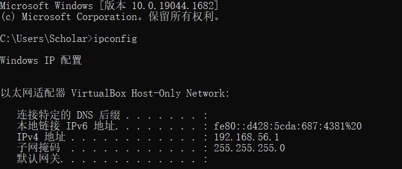

# Docker

是什么？一种虚拟化容器技术，为了解决运行环境‘配置问题。

能干嘛？一次构建，到处运行。

去哪下？怎么玩？

docker技术——镜像技术（一次镜像，到处运行——将环境、配置与应用程序一起打包）、docker引擎。

docker三件套：

1. 镜像（image）：只读的容器模板，用于创建一个或多个容器。
2. 容器（container）：镜像实例，看看作是一个简易版linux环境。
3. 仓库（repository）：集中存放镜像的地方，官方的仓库是Docker Hub。

# 安装虚拟机

**虚拟机安装：**

1. 安装VirtualBox、Vagrant（安装完成重启后，任意目录的cmd窗口执行`vagrant` 检测是否安装成功）。
2. 创建VB_Linuxs文件夹，并在该目录下打开cmd窗口。
3. 镜像准备与安装：（可VB_Linuxs目录的cmd窗口中执行`Vagrant init centos/7`，然后执行`vagrant up`启动环境、安装，这样太慢，不建议。）
   1. 进[Vagrant box centos/7 - Vagrant Cloud (vagrantup.com)](https://app.vagrantup.com/centos/boxes/7)点击找到`virtualbox`字样右侧下载按钮下载box文件（可获取下载链接然后通过IDM下载，这样快一些），下载完成后把该文件放进VB_Linuxs文件夹。
   2. 进入VB_Linuxs目录的cmd窗口，执行以下命令：
      1. 添加安装镜像：`vagrant box add MyVBcentos7  ./CentOS-7-x86_64-Vagrant-2004_01.VirtualBox.box`。（`vagrant box add box配置名称 .box文件`）
      2. 执行初始化命令：`vagrant init MyVBcentos7`，然后就会得到一个Vagrantfile核心配置文件，网络等配置都在里面。
      3. 启动虚拟机：`vagrant up`。
4. 安装完成后在cmd执行`vagrant ssh`进入虚拟机，默认的用户名是vagrant，root用户的密码是`vagrant`；`sudo -i`切换到root用户。

**设置虚拟机固定IP：**

1. 先在cmd窗口执行`ipconfig`，查看IP：如图是`192.168.56.1`，因此设置私有IP时也要以前三个开始。

   

2. 打开Vagrantfile文件找到`config.vm.network "private_network", ip: "192.168.33.10"`，然后将后面的ip设置为`192.168.56.10`。

**远程登录设置：**每次都要进入VB_Linuxs目录来使用`vagrant up`启动虚拟机（关机也是进入这个目录然后执行`vagrant  halt`），如果需要使用账号密码连接xshell，则要先开启支持账号密码登录（若只使用vs Box连接则可以忽略）：

1. 打开Vagrantfile文件，修改：

   - 将`config.vm.network "public_network"`此处注释放开。

   - config.vm.provider处修改为以下：

     ```file
         config.vm.provider "virtualbox" do |vb|
             vb.memory = "1024"
             vb.name= "MyVBcentos7"
             vb.cpus= 2
         end
     ```

   - 保存。

2. 依次执行`vagrant up`、`vagrant ssh`、`sudo -i`，然后查看IP：`ip a`，第3个eth1下的即是，然后可在其他cmd窗口ping一下用于测试是否可连通。

3. `vi /etc/ssh/sshd_config`，将`PasswordAuthentication  no`的no改为yes；passwd指令可用于修改root用户密码。

4. `systemctl restart sshd`，重启即可。

# 安装Docker

**安装前准备：**

1. 确认Linux版本是CentOS7及以上版本：`cat /etc/rehat-release`。

2. 卸载系统上的旧版本：

   ```
   sudo yum remove docker \
                     docker-client \
                     docker-client-latest \
                     docker-common \
                     docker-latest \
                     docker-latest-logrotate \
                     docker-logrotate \
                     docker-engine
   ```

3. 安装gcc、gcc++：`yum -y install gcc`、`yum -y install gcc-c++`。

**安装：**

1. 通过仓库[Docker’s repositories](https://docs.docker.com/engine/install/centos/#install-using-the-repository) 来下载，便于更新和升级，推荐的方法。步骤如下：

   1. 建立stable仓库：

      ```scss
      sudo yum install -y yum-utils
      
      # 设置为这个就好
      sudo yum-config-manager --add-repo http://mirrors.aliyun.com/docker-ce/linux/centos/docker-ce.repo
      # 设置了国外的仓库，下载镜像会很慢，建议不要执行该操作
      sudo yum-config-manager \
          --add-repo \
          https://download.docker.com/linux/centos/docker-ce.repo
      ```

   2. 更新yum软件包索引：`yum makecache fast`

   3. 安装最新版本的Docker Engine：`sudo yum install docker-ce docker-ce-cli containerd.io docker-compose-plugin`；以下为下载其他版本的方法：

      ```scss
      # 列出各版本，用于选择性地安装需要的版本
      yum list docker-ce --showduplicates | sort -r
      # 选择性安装版本
      sudo yum install docker-ce-<VERSION_STRING> docker-ce-cli-<VERSION_STRING> containerd.io docker-compose-plugin
      ```

   4. 开启Docker：`sudo systemctl start docker`。

   5. 运行一个程序，测试是否安装成功：`sudo docker run hello-world`。（或者`docker version`）

   6. Docker卸载：

      1. `systemctl stop docker`。
      2. `sudo yum remove docker-ce docker-ce-cli containerd.io docker-compose-plugin`。
      3. `sudo rm -rf /var/lib/docker`。
      4. `sudo rm -rf /var/lib/containerd`。

2. 通过RPM package 下载安装。

3. 测试或开发环境，一些用户通过自动化的脚步安装。

**阿里云镜像加速：**阿里云的容器镜像服务里有镜像加速器，按照里面的操作文档操作。

# Docker常用命令

## 帮助启动类命令


## 镜像命令

1. 列出本地主机上的镜像：**`docker images [-a\-q]`**，可选项-a表示列出本地所有镜像，包含历史，-q则是只显示ID。
   - REPOSITORY：表示镜像的仓库源      TAG：镜像的标签版本号   IMAGE ID：镜像ID     CREATED：镜像创建时间    SIZE：镜像大小
   - 同一仓库源可以有多个 TAG版本，代表这个仓库源的不同个版本，我们使用 `REPOSITORY:TAG` 来定义不同的镜像。如果你不指定一个镜像的版本标签，例如你只使用 ubuntu，docker 将默认使用 `ubuntu:latest`做镜像标签。
2. 远程查找有没有hello-word这个镜像：**`docker search [选项] hello-word`**。
   - **`docker search --limit 5 镜像名称`**——列出五个，`--limit`选项——只列出N个镜像，默认25个。
3. 下载镜像：**`docker pull 镜像名称[:TAG]`**，如果没有加后面的可选项，则默认下载最新的版本。
4. 查看镜像、容器、数据卷各自所占的空间：**`docker system df`**。
5. 删除镜像：
   1. **`docker rmi 某个XXX镜像名字或ID`**：删除一个镜像。
   2. **`docker rmi 镜像名称1:TAG1 镜像名称2:TAG2 ...`**：删除多个。
   3. **`docker rmi -f $(docker images -qa)`**：强置删除全部镜像。

面试题：docker虚悬镜像是什么？仓库名、标签都是`<none>`的镜像，俗称虚悬镜像——dangling image。


## 容器命令

**1.新建并启动容器：**`docker run [OPTIONS] 镜像名 [COMMAND] [ARG...]`

常用OPTION说明：

- `--name="容器新名字"`：为容器指定一个名称；`-d`：后台运行容器并返回容器ID，也即启动守护式容器(后台运行)。

- `-i`：以交互模式运行容器，通常与 -t 同时使用；`-t`：为容器重新分配一个伪输入终端；通常与 -i 同时使用，也就是启动交互式容器（前台有伪终端，等待交互）。`docker run -it centos /bin/bash`：使用镜像`centos:latest`以交互模式启动一个容器，在容器内执行`/bin/bash`命令。

- `-P`：随机端口映射；`-p`：指定端口映射。（设置宿主机端口与docker内容器暴露的端口以确定访问docker内哪个容器）

  

交互式容器：以Ubuntu为例：`docker pull ubuntu`，然后`docker run ubuntu`，此时不会有该容器——Ubuntu系统的操作终端；而`docker run -it ubuntu /bin/bash`，此时就会以交互模式启动该容器并在该容器内执行一个`/bin/bash`指令，从而可以进入到一个终端用来操作该微小Ubuntu系统，如下图：


`docker run -it --name=myUbuntu ubuntu bash`：使用`--name`指定该容器名字。

**2.罗列正在运行的容器：**`docker ps [选项]`

OPTIONS说明（常用）：

1. `-a`：列出当前所有正在运行的容器和历史上运行过的。
2. `-l `：显示最近创建的容器。
3. `-n N`：显示最近N个创建的容器。
4. `-q `：静默模式，只显示容器编号。

**3.退出容器的两种方式：**

1. `exit`：run容器后，执行exit退出时容器会停止，容器停止并不代表容器被删除。
2. `ctrl + p + q`：run容器后，快速执行这三个键退出容器时容器不会停止。

**4.启动已经停止的容器：**`docker start 容器ID或容器名称`。

**5.重启容器：**`docker restart 容器ID或容器名称`。

**6.停止容器：**`docker stop 容器ID或容器名称`。

**7.强制停止容器：**`docker kill 容器ID或容器名称`。

**8.删除已经停止的容器：**`docker rm 容器ID`（一次性删除多个：`docker rm -f $(docker ps -a -q)`或`docker ps -a -q | xargs docker rm`）。

**9.非常重要：**

1. 要注意的是Docker容器后台运行，必须要有一个前台进程，容器运行命令如果不是一直挂起的命令那就会自动退出，这是因为Docker的机制问题。因此启动守护式容器（后台运行容器）的最佳解决方案就是将要运行的程序以前台进程的形式运行（常见的是命令行模式）

   ```
   示例：
   docker run -it redis:6.0.8 -- 前台交互模式启动
   docker run -d redis:6.0.8 -- 后台运行容器并返回容器ID——后台守护模式
   -- 以下启动后会自动关闭，因为没有前台进程
   docker run -d ubuntu
   ```

2. 查看docker容器日志：`docker logs 容器ID或容器名称`。

3. 查看容器内运行程序：`docker top 容器ID或容器名称`。

4. 查看容器内部细节：`docker inspect 容器ID或容器名称`。

5. 重新进入正在运行的容器并以命令行交互：

   1. `docker exec -it 容器ID或容器名称 交互/bin/bash等`。
   2. `docker attach 容器ID或容器名称`。
   3. 两个命令的区别：attach直接进入容器启动命令的终端，不会启动新的线程，使用exit退出时会导致容器停止；exec是在容器中打开新的终端，并且可以启动新的线程，使用exit退出不会导致容器停止。

**10：将容器内文件拷贝到主机：**`docker cp 容器ID:容器内文件决对路径 目的主机绝对路径`。

**11：导入和导出容器：**

1. `docker export 容器ID > 文件名.tar或文件名.tar.gz `：导出容器为镜像，之后可根据该镜像文件恢复容器。
2. `cat 文件名.tar | docker import - 镜像用户/镜像名:镜像版本号`：根据镜像文件恢复容器。

# Docker镜像

**镜像：**是一种轻量级、可执行的独立软件包，它包含运行某个软件所需的所有内容，我们把应用程序和配置依赖打包好形成一个可交付的运行环境(包括代码、运行时需要的库、环境变量和配置文件等)，这个打包好的运行环境就是image镜像文件。只有通过这个镜像文件才能生成Docker容器实例(类似Java中new出来一个对象)。

## 镜像分层

 **镜像分层：**如下示例，镜像拉取时是一层层下载的。


**UnionFS（联合文件系统）：**Union文件系统（UnionFS）是一种分层、轻量级并且高性能的文件系统，它支持对文件系统的修改作为一次提交来一层层的叠加，同时可以将不同目录挂载到同一个虚拟文件系统下(unite several directories into a single virtual filesystem)。**Union 文件系统是 Docker 镜像的基础。镜像可以通过分层来进行继承，基于基础镜像（没有父镜像），可以制作各种具体的应用镜像。**

特性：一次同时加载多个文件系统，但从外面看起来，只能看到一个文件系统，联合加载会把各层文件系统叠加起来，这样最终的文件系统会包含所有底层的文件和目录。

**Docker镜像加载原理：**

docker的镜像实际上由一层一层的文件系统组成，这种层级的文件系统UnionFS。

bootfs(boot file system)主要包含bootloader和kernel， bootloader主要是引导加载kernel，Linux刚启动时会加载bootfs文件系统，在Docker镜像的最底层是引导文件系统bootfs。这一层与我们典型的Linux/Unix系统是一样的，包含boot加载器和内核。当boot加载完成之后整个内核就都在内存中了，此时内存的使用权已由bootfs转交给内核，此时系统也会卸载bootfs。

rootfs (root file system) ，在bootfs之上。包含的就是典型 Linux 系统中的 /dev、/proc、 /bin、 /etc 等标准目录和文件。rootfs就是各种不同的操作系统发行版，比如Ubuntu，Centos等等。 

平时我们安装进虚拟机的CentOS都是好几个G，为什么docker这里才200M？？

对于一个精简的OS，rootfs可以很小，只需要包括最基本的命令、工具和程序库就可以了，因为底层直接用Docker所在主机的kernel，自己只需要提供 rootfs 就行了。由此可见对于不同的linux发行版，bootfs基本是一致的，rootfs会有差别，因此不同的发行版可以公用bootfs。

**为什么Docker镜像要使用这种分层结构？**

镜像分层最大的一个好处就是共享资源，方便复制迁移，就是为了复用。

比如说有多个镜像都从相同的 base 镜像构建而来，那么 Docker Host 只需在磁盘上保存一份 base 镜像；同时内存中也只需加载一份 base 镜像，就可以为所有容器服务了。而且镜像的每一层都可以被共享。

**重点理解：**

当容器启动时，一个新的可写层被加载到镜像的顶部。这一层通常被称作“容器层”，“容器层”之下的都叫“镜像层”。分层复用。

所有对容器的改动 —— 无论添加、删除、还是修改文件都只会发生在容器层中。只有容器层是可写的，容器层下面的所有镜像层都是只读的。也就是说，容器层就相当于基于镜像的一个新的层。

## 镜像生成与发布

### **镜像生成：**

> `docker commit -m="提交的描述信息" -a="作者" 容器ID 定义新镜像名:[定义标签名]`——提交容器副本使之成为一个新的镜像

操作案例——为ubuntu 安装vim，步骤如下：

1. `docker run -it --name=MyUbuntu ubuntu bash`：运行ubuntu。
2. `apt-get update`：进入ubuntu容器更新包管理工具；然后`apt-get -y install vim`。
3. `docker commit -m="add vim cmd" -a="Jack" a69c6a7887fd jack/ubuntu:1.0`：提交成新镜像。
4. `docker images`：查看镜像。

### **镜像发布与仓库：**

发布到阿里云平台的镜像仓库：

1. 阿里云镜像服务中创建好个人实例，在创建命令空间之后再创建镜像仓库（选本地仓库）。

2. 创建好后有操作指南，根据操作指南发布镜像到镜像仓库。发布到自己创建的公有仓库操作：

   ```
   docker login --username=aliyun3455140537 registry.cn-hangzhou.aliyuncs.com
   docker tag [ImageId] registry.cn-hangzhou.aliyuncs.com/learncode/mytest:[镜像版本号]
   docker push registry.cn-hangzhou.aliyuncs.com/learncode/mytest:[镜像版本号]
   ```

3. 从镜像仓库拉取：

   ```
   docker pull registry.cn-hangzhou.aliyuncs.com/learncode/mytest:[镜像版本号]
   ```

在本地CentOS搭建私有仓库搭建：

1. `docker pull registry `：下载镜像Docker Registry。

2. `docker run -d -p 5000:5000 -v /zzyyuse/myregistry/:/tmp/registry --privileged=true registry`：运行私有库Registry，相当于本地有个私有Docker hub，默认情况，仓库被创建在容器的/var/lib/registry目录下，建议自行用容器卷映射（-v后设置容器卷），方便于宿主机联调。

3. `curl -XGET http://docker所在Linux主机IP:5000/v2/_catalog`：查看私服里的镜像（示例：`curl -XGET http://192.168.56.10:5000/v2/_catalog`）。

4. `docker tag 目标镜像:Tag Host:Port/Repository:Tag`：该命令用于将镜像修改为符合私服规范的镜像名称，执行该命令后会将目标镜像克隆一份。（`docker tag redis:6.0.8 192.168.56.10:5000/redis:6.0.8`）

5. `vim /etc/docker/daemon.json`：修改配置文件使之支持http。docker默认不允许http方式推送镜像，通过配置insecure-registries选项来取消这个限制。修改后的daemon.json如下，IP为自己主机IP：

   ```
   {
     "registry-mirrors": ["https://aa25jngu.mirror.aliyuncs.com"],
     "insecure-registries": ["192.168.56.10:5000"]
   }
   ```

   重启docker。

6. `docker push 镜像名称[:TAG]`：将镜像推送到私服，示例`docker push 192.168.56.10:5000/redis:6.0.8`。

7. `docker pull 镜像名称[:TAG]`：拉取镜像。

# 容器数据卷

容器数据卷——与主机目录映射，使容器内某目录的数据持久化到主机中，就是将docker容器内数据保存进宿主主机的磁盘。

> docker run -d -p 5000:5000 -v /mydata/myregistry/:/tmp/registry --privileged=true registry

如上命令的-v后就是添加容器卷：`-v /宿主主机绝对路径:/容器内目录 --privileged=true`：宿主主机目录与容器内目录映射。定义容器卷是一定要加上`--privileged=true`参数，用于解决可能出现权限问题。映射路径都是从根路径开始的绝对路径。

查看容器的数据卷挂载成功：`docker inspect 容器ID`，如下：


特点：

1. 数据卷可在容器之间共享或重用数据。
2. 卷中的更改可以直接实时生效。
3. 数据卷中的更改不会包含在镜像的更新中。
4. 数据卷的生命周期一直持续到没有容器使用它为止。

数据同步：

1. docker修改数据，主机同步获得 。主机修改数据，docker同步获得。
2. docker容器stop，主机修改数据，待docker容器重启看数据是否同步。

数据卷读写规则与映射添加说明：

1. 读写：` docker run -it --privileged=true -v /宿主机绝对路径目录:/容器内目录:rw 镜像名`，rw是默认的。
2. 只读：` docker run -it --privileged=true -v /宿主机绝对路径目录:/容器内目录:ro 镜像名`，容器实例内部被限制，只能读取不能写。

容器卷的基础和共享：

1. `docker run -it --privileged=true --volumes-from 父类容器名称 --name u2 ubuntu`：容器u2继承父类容器的容器卷，如果父类容器stop了也不会影响其他的，因为继承的是映射规则。

2. 示例：

   ```
   docker run -it --privileged=true -v /mydocker/u:/tmp --name u1 ubuntu
   docker run -it --privileged=true --volumes-from u1 --name u2 ubuntu
   ```


# 安装常用软件

1. 搜索镜像
2. 拉取镜像
3. 查看镜像
4. 启动镜像——配置服务端口映射
5. 停止容器
6. 移除容器

## 安装Tomcat

最新版：

1. `docker pull tomcat`。
2. `docker run -d -p 8080:8080 tomcat`。
3. 确保端口映射与防火墙关闭，然后把tomcat里的webapps.dist目录换成webapps：
   - `docker exec -it 容器ID /bin/bash`。
   - 把tomcat里的webapps.dist目录名称更改为webapps。

tomcat8-jdk8：

1. `docker pull billygoo/tomcat8-jdk8`。
2. `docker run -d -p 8080:8080 --name mytomcat8 billygoo/tomcat8-jdk8`。

## 安装MySQL

简单安装：

1. `docker pull mysql:5.7`。
2. `ps -ef|grep mysql`：确保3306端口不被占用。
3. `docker run -p 3306:3306 -e MYSQL_ROOT_PASSWORD=123456 -d mysql:5.7`。
4. `docker exec -it 容器ID /bin/bash`。
5. `mysql -u root -p`。

实战版安装：

1. `docker pull mysql:5.7`。

2. `docker run -d -p 3306:3306 --privileged=true -v /backupdatas/mysql/log:/var/log/mysql -v /backupdatas/mysql/data:/var/lib/mysql -v /backupdatas/mysql/conf:/etc/mysql/conf.d -e MYSQL_ROOT_PASSWORD=123456 --name mysql mysql:5.7`：启动并准备好日志备份、数据备份、mysql配置文件备份。

3. 新建my.cnf文件，通过容器卷同步到mysql容器。

   - `cd  /backupdata/mysql/conf`，`vi my.cnf`。 

     ```properties
     [client]
     default_character_set=utf8mb4
     [mysqld]
     character_set_server=utf8mb4
     ```
     
     ```properties
     # 其他配置文件示例-配置utf8mb4_unicode_ci
     [client]
     default-character-set=utf8mb4
     [mysql]
     default-character-set=utf8mb4
     [mysqld]
     collation-server=utf8mb4_unicode_ci
     init-connect='SET NAMES utf8mb4'
     character-set-server=utf8mb4
     ```

4. `docker exec -ti mysql bash`。

5. `mysql -u root -p123456`。

## 安装Redis

简单安装：

1. `docker pull redis:6.0.8`
2. `docker run -d -p 6379:6379 --name myredis redis:6.0.8`
3. `docker exec -it 容器ID /bin/bash`

高级安装：

1. 宿主机创建目录：`mkdir -p /app/redis`，在该目录修改redis.conf配置文件。
2. `docker run -p 6379:6379 --name myredis0 --privileged=true -v /app/redis/redis.conf:/etc/redis/redis.conf -v /app/redis/data:/data -d redis:6.0.8 redis-server /etc/redis/redis.conf`。
3. ` docker exec -it 运行着Rediis服务的容器ID redis-cli`。


