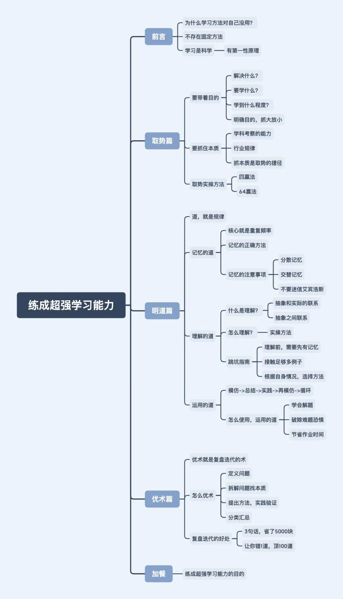

# 思

坑中沉思：

2021年11月4日，在知乎上看到一条评论，觉得很契合自己现在的处境，评论内容如下：

于是我把这条评论发上了一个交流群，期待群友的解惑。很幸运的是，夜猫和南黎慷慨直言，我也因此收获颇丰，遂有此文。

思前想后，学习的几个要素无非：学习计划、学习目标、学习过程、学习成果。学习计划是有体系的学习的保证，有了目标就去行动，就进入了学习过程，学习过程之后就是自己的学习成果，好的学习成果又正向激励着学习，于是我从这四个要素来剖析了一下我低效的学习以及学习不好计算机的原因：

第一：从学习计划分析：有完备的学习路线，但没有明确的学习规划、总的规划。对每天该学习些什么、该做些什么、该掌握哪些东西、回顾和复习没有一个明确的规划，就只是知道把视频看了、代码敲了、笔记做了，而对自己的脑子里到底吸收了多少毫不过问。也就是没有解决“往哪里走”、“怎么走”的问题。

第二：从学习目标分析：清楚学习哪些内容，也确实去学了，但不清楚自己为什么要学习这些内容以及不知晓这些内容应用的场景（引用一段话：“new了一个知识，但因没有引用而形成了一座孤岛，然后就被GC了”），所以导致了一个问题：学了后面的忘了前面的，复习起来也不知所措。

第三：从学习过程分析：除了陷入“学而不思则罔，思而不学则殆”，就是学习重心不明确，把看视频记笔记敲案例当成了学习重心，真正的重心应该是掌握知识并会实际应用。

第四：从学习成果分析：怀揣什么样的心态、目的去学，就导致了最后收获的是是什么果，得到了什么又会正向激励你去持续这么一个学习的过程。所以，就目前的果而言，是半生不熟、半死不活的。

今后要做的：求知终极法宝：好奇、实践、思考；学习计划，只需分好新技术的学习和旧知识的巩固、熟练应用就好了，然后每天简简单单地安排一些任务，以掌握、应用为目的去学习，在规定时间最大限度刻进脑子就行了。其实问题也没有那么复杂，把一些简简单单的认真做好了就行了，就不会不知道该怎么办了

**夜猫@Forward Steps ：**你缺的不是方法，是实践，自己实践，总结出来一套适合自己的方法，别人的方法可以听听，但不是听从。

**思-答：**不是缺乏实践，而是缺乏实践中的思考和好奇心。不知道如何衡量自己学到了哪些东西、掌握了多少，没有及时的反省每天的作为，没有思考技术本身，没有思考学习过程的不足之处，总的就是说进入了“学而不思则罔”的那个深坑而不自知。思又有哪些呢？在我看来，学习过程中无非就是三个思：对学习内容的思考、在实践中的思考、对自身所作所为的反思；说白了，最后还是回到了独立思考本身。大道至简，环环相扣，在某些最基本最应该去锻炼培养的往往会被我们忽视（就像计算机四大金刚的重要性一样），那些方法论也不过是实践与思考的结晶。“学而不思则罔，思而不学则殆”，“学”不就是对应了实践吗，“思”不就是对应了思考吗，实践与思考相互促进、相互成全、共同发展啊。实践确保不会出现空中楼阁（虽然行动不一定有结果），思考确保实践的更加完美。而那些学习能力强的人，不正是因为这两样东西已经融合进他们的骨子里了吗，所以他们学习成长起来如鱼得水。而好奇心呢，是不断促使我们去探索、去思考的源动力。满怀好奇心，做那个仰望星空的程序工程师。

举个学思结合的例子：比如我听说计算机很流行，我也有点兴趣（好奇心），我也想学习或了解一下（学习需求），可我不知道计算机是什么东西，我就在想计算机到底是什么玩意啊，我怎么去了解呢（思考）？局限于本身的知识储备而没有思考出个所以然来，于是我就去图书馆或互联网上查找资料——加强知识储备，亦或者向和这方面有过接触的或是就是这个行业里的人请教（思考得到的解决思路），然后就去找资料、请教老师同学（实践、行动），直到最后我搞清楚了这个问题：计算机是能够按照程序运行，自动、高速处理海量数据的电子设备（学习成果），然后还有很多不懂，什么是程序、如何实现那些功能的？（好奇心促使思考）就再去思考是什么、如何实现、有哪些途径可以解决我的疑惑、我要不要学、要学习哪些（好奇，继续思索），之后就再去寻找答案（实践、行动），思考-找答案-思考-找答案-...，由浅至深、一步步深入，最后也就水到渠成了。

实践和思考就是一把万能钥匙，运用得越熟练，面对各种各样的问题时就越懂得如何以最小的代价去解决。（好奇心启动你的思考，促使你去探索）

可现实中的大部分情况就是，好奇心缺乏、思考不足、行动不足，所以学习能力弱得可怜，现在的我就是一个典型的例子。

回到计算机，计算机是一门应用科学，而不是一门理论科学，所以学习计算机相关的技术不能以偏理论的方法去学习（而国内学校的教育，学科中多以一纸试卷来衡量学习程度，也就是说衡量出来的是偏理论上的知识，反馈也来自于试卷成绩，这样是不利于学习计算机并将技术应用起来的）。计算机的诞生，从网上得到的原因就是：“是美国为了计算导弹的运行数据而诞生的，也就是为了计算其弹道数据而诞生的”。这说明了什么？这说明了计算机就是为了某种需求而诞生的！计算机也是需求的产物！计算机不是凭空产生的，是从解决需求中创造出来的。所以后面在计算机技术基础上发展起来的语言或技术也是为了各种各样的需求服务的，比如java语言的诞生也是因为需求而诞生的（用于微机设备，得保证代码短小、紧凑且与平台无关）。

说了这么多，其实就是为了说明需求与创造的联系，以需求的角度去学习计算机技术的必要性。有了需求才去创造了某些东西，而不是凭空产生创造了某些东西。学习计算机技术过程中，不妨也以需求的角度入手，多想想自己的技术需求是什么、这些技术需求应用于哪些场景、这些技术的本质是什么、技术需求能不能为我的应用需求服务、我该如何应用于实际等等。而需求哪里来？现实中来，思考中来，实践中来，此处不再赘述。

学习不应该被复杂化，学习无非就是实践与思考，不清楚自身到底要干什么的时候，先扪心自问自己是否有思考有实践（思考过如何解决困境吗？师长、朋友、书籍、调研哪个方面你）

大道至简，许多学习上的问题的存在是因为懒惰与不作为。

总结：

1. 大行其道的各种各样的学习方法论只能是作为参考与补充，永远要记得怀揣着好奇心去思考、去实践，“学而不思则罔，思而不学则殆”，有问题、不足就要想用尽你所想到的所有方法、所有途径去解决，而不是看着别人的解决方案、看着别人的总结而没有自己的思考与实践，**毕竟，只有经过了自己的亲身实现，你才会知道你能不能做得到**。（不要光欣赏别人的，要想想自己做得到的）
2. 清楚学习技术（工具）的目标是什么，“All long,the language was a tool,not the end”（毕竟，语言只是实现目标的工具，而不是目标本身），如果不搞清楚学习技术的目标，仅仅为了学习技术而学习，到头来学习了技术也不会去应用，反而会丢失掉学习的乐趣。技术因需求而生、为解决问题而生，我们学习技术就是为了解决需求、解决问题，因此学习技术也应该以解决问题、解决需求为目的去学习。
3. 项目是一个或大或小的工程，项目的需求也往往不会很简单直白，解决需求运用到的技术也不可能很单一，因此分析需求和技术整合的能力也非常重要，许许多多的技术之间存在一定联系并且互相配合才能解决一个个工程问题。

记`南黎。`的一段话： 

技术，因为需求而生，这个技术是因为什么才被广泛使用的，始终揣着这个思路去学，去看它是怎么做的，是如何尽自己最大的能力解决了需求，才能更容易理解一个技术。比如mysql，你应该时刻抱着探索这样的心态。为什么需要数据库？这个数据库是通过什么样的技术做到了这件事？它通过什么方法解决了这样的性能问题？

为什么需要数据库？因为数据过于庞大复杂时难以管理，你靠人力难以对大量的数据进行整合并对其查找或分析，而又因为有数据查询的需求，所以你需要设计解决方案去查询，而数据查询又可以通过哈希算法对其进行快速处理并查询，但是哈希算法有极限，难免会存在哈希冲突，因此可以考虑使用数组来对其存储，这样可以避免哈希冲突，又因为数组占用空间大，同时查询遍历有n的复杂度，所以又考虑使用树状结构去存储；通过分层，降低查询平均复杂度，因此考虑采用搜索树，但是因为数据越来越庞大，树层数越来越高，同时因为数据极端情况下，树会退化成链表，回到n的复杂度，因此考虑采用自平衡的树来存储，这时候就出现了b树和b+树，而不同组织情况的树，对于不同查询条件的查询次数也是不同的，因此考虑建立不同的索引树，分别在不同索引树上查询，来降低期望时间复杂度，再后面，因为可能有些查询语句不能覆盖某索引树，但对另一棵树可覆盖，这时候就出现了mysql优化器的机制。
你要怀揣着一个去挖掘技术本质需求的态度去学习技术才行，最开始大家也只是有存储数据的需求罢了，为什么后来变得这么复杂，就是因为需求越来越高，靠硬背，早晚都会忘完了。怀揣本质、挖掘技术的最本质需求是什么，这种学习的思路在任何技术上都可以通用，所以有的培训班的视频我不爱看，就是因为他们会对一些技术背景一笔带过，反而着重讲各种技术，误导了我们很多朋友，他们甚至根本不知道，为什么需要这个技术。而看框架源码，你要揣着这个框架的本质去看，为什么需要spring，归根结底就是java自己的那一套原生web请求源码不好用（繁杂），因此封装一套成熟的框架给你用，降低开发成本；为什么springboot发展起来，就是因为spring也太繁重（配置繁重，简直配置地狱），用起来不够友好了，所以就开发出springboot来简化开发了（如何实现？）。

# 做

取势，就是在学习前要明白，学习的目的和本质；明道，就是懂得记忆、理解、运用的规律；优术，就是通过复盘迭代，不断优化学习的技术。

## 取势

学习首要要捉住两点：

1. 第一个是学习的目的，只有明确了目的（也就是你学这个东西，是为了解决什么问题？）你才有可能知道，我们要学什么？应该学到什么程度？并且要明确学习目的的重心，捉大放小，学习也要分清主次，先去解决最需要解决的问题，细致末梢就放一边。
2. 第二个是所学内容的本质规律（这个本质，其实就是某个学科，考察什么能力；对成年人来说，本质就是行业规律）。虽然说，自己思考，也能归纳出本质，但是这样太慢了。我给你一条捷径：就是在学习之前，你可以先把网上牛人总结的本质都看一遍先。

抓住这两个核心，针对性的投入精力，我们就能像风口上的猪一样，事半功倍。

实操：

1. 在学习前，你要先借鉴网络大神，大致搞懂本质。然后你要准备多一本课本的习题册，和现在老师在用的那本不一样就ok了。但是章节目录，最好和现在的一致。

   如果你是成年人，那要准备的是，行业解决方案。另外，你准备的也不是课本，而是行业经典理论书籍。

2. 切记，在学一个章节前，千万不要急着去看课本。因为你不带着目的看书，就会以为书上写的都是重点，所以看课本和看天书一样。看着看着，就走神了，看着看着，就想去问候山本的先人。

   所以看书之前，你要先快速去看，习题册中这个章节的习题。你甚至可以直接看答案。每道题就用1分钟。看不懂是正常的。这一步，主要是记录答案中，经常出现的，关键术语、关键解题步骤、关键知识点的推理过程。带着这3个关键，开始去看书。

3. 经过了前一步，你就知道，书中有什么是重点的，常考的；什么是没用的，边边角角的。着重看刚才记下来的重点部分，这样你看书就比别人快了不止1倍。

4. 看完书后，再去做章节的例题，以及老师给你的习题册。如果你想了5分钟还卡壳的话，果断去搜答案。并且，在自己的笔记本上，把自己卡壳的原因，还有对应的解题步骤，记录下来。这是积累自己的解题套路。

## 明道

学习总共分为三个层次：记忆、理解、运用。

**记忆：**（高频率适量重复）

- 想要形成纯记忆，你只需要不断重复，提高频率。无意识中，大脑就能帮你记住了。
- 我们记忆的时候，千万不要苛责自己，要求一次就背下来，一旦记不住，还贬低自己。正确的方法是，让自己放松一点，哪怕每一次背的时候不太认真，只要重复频率上来了，你的大脑，就能自动帮你记下来。
- 注意：**分散记忆，不要集中背大量的对象，才能省时省力**；**交替记忆，提高效率**。

**理解：**所谓理解，就是联系，理解的规律，就是建立联系。理解的本质，就是构建起抽象概念和实际例子之间的联系，以及概念相互之间的联系。

- 理解的第一步，就是给抽象概念，联系上实际例子。（例如勾股定理和直角三角形）
- 只有在不同抽象概念之间，也建立起联系，这才是真理解。

实操：

- i）你挑出同一章节，需要去理解的重点概念。多看几遍，先记下来。哪怕是死记硬背，也没关系。
- ii）找到一大堆，用了某个概念的简单题答案。这些题目，其实就是把抽象概念，运用到实际生活中的例子了。重点观察，这个疑惑的概念，在具体的场景中，是长什么样子的。
- iii）等你看得够多了，就会无缘无故有一种，“oh， so thus 咧”，的感觉。这其实是因为，你把抽象的概念，和实际运用例子，联系在一起了。你的大脑中，已经形成了，一个零碎的知识。
- iv）理解了好几个概念后，我们还要继续找，运用了好几个概念的中档题。这一次是观察，这几个概念之间，在答案中是怎么联系到一块的，建立起概念之间的联系。当这种联系变多了，大脑中的零碎知识，才会连成网，形成思维导图。

跳坑：

1. **理解前，需要先有记忆**。我们遇到很难理解的，没必要死磕，先硬背下来，等接触的题目够多了，一边建立联系，一边修正，大脑就自动帮你理解了。

2. **你需要接触到，足够多的实际例子，从多个角度观察过一个知识点，才能理解透彻**。理解不了一个知识，只是因为，你没有从多个角度，接触到足够多的例子而已。破除办法很简单，不要怀疑自己，找多点，同一知识点，不同类型的题目例子，看足够了，就理解了。

3. **检验自己是否理解，你需要根据自身情况，选择合适的方法**。对于基础较弱的同学，我会推荐用电子版的思维导图，去检验理解。

   如果你时间紧，任务重，你可以直接从网上，找到别人做的。自己对着图中的某个知识点，看看能不能说出来，这个点有什么实际例子，跟其他点有什么联系。这也能检验，你是否达到了理解。（费曼学习法，是有前提的。如果你大脑里面，连单个知识点都没理解好。这个时候，你其实是在地下室10层。大脑空空去就用费曼学习法，会非常卡壳。讲两句，就要停下来翻5页书，又废又慢。别人在大气层用费曼，那当然能升天啦。你在地下室搭火箭，那也是real升天了，只不过是，位列仙班的那一种。所以，费曼学习法，只适合用来查缺补漏，辅助理解，一周用个1次就差不多得了。）

**运用：**

在日常学习中，我们可以这么来使用运用的道。

1）比如，当你的记忆、理解没问题了，但是遇到题目就发懵。

这时候，你可以去找堆题目，对着答案看一遍，看看别人是如何解题的。并且把自己总结的运用方法，记录到笔记本上。

然后把答案合上，自己试一试，能不能解出来。这就是模仿了。

模仿后，还要继续找同类题目，尝试不看答案自己解。在解的过程中，修正自己的记录。如果还是不会做，就继续去模仿，不断循环。

2）对待难题，也是同样做法。

有些同学，一碰到难题就很害怕，也是因为模仿难题的答案，太少了。

如果你基础题和中档题，都没什么问题了。就找个时间，密集模仿难题答案。不用很长时间，你就不害怕难题了。

3）你甚至可以在每次做作业之前，都先花10分钟，去模仿。你会发现，这能省下非常多做作业的时间。而且作业难题的正确率，也会有很大的提升。

模仿得越多，节省的时间就越多，题目在你面前，就变得更加简单。你会越来越自信，不再害怕难题。这就是从普通学生，到学神的正向反馈。

对于成年人来说，也是同理的。只不过成年人就不需要刷题了，更加多是，要刷案例和系统解决方案。这里就不展开来说了。

## 优术

我们在学习过程中，无论是记的笔记，做题心得，或者是对学习方法的思路，都是十分宝贵的资源和精华。

但试问一下，你上次复盘整理这些精华，是在什么时候呢？

很多人喜欢听新课，刷新题，学新的学习方法，接触新的认知。恨不得让旧知识，别再联系自己了，怕被新知识误会。

这种喜新厌旧，通常被叫做渣男行为，这是没有好果子吃的哈。这类人，往往要等到考试扑街，才痛定思痛，想起复盘的好。

学神则不一样。他会每天复盘迭代，一边复盘过去的精华，一边迭代出新的方法。对新旧认知，“我全都要”，所以进步速度，就能秒杀普通学生。

如何优术？

复盘迭代，其实说人话就是，发现问题，找到本质，给出解决方法，分类汇总经验。实操步骤：

1. **a定义问题**

   你发现了一个问题后，要先问自己，这个问题重要不？不重要就别去解决了。如果真的重要，那解决它是为了什么？为了达到目标，有没有办法绕过去？

2. **b拆解问题找本质**

   碰到问题，要从多个角度去拆分。这么多角度里面，哪一个是解决问题的关键因素？这个因素的本质是什么？

3. **c提出方法，实践验证**

   围绕着目标，以及问题的关键因素。在实践中检验，自己的解决方法是不是奏效

4. **d分类汇总**

   我们实践之后，要总结经验。把我们解决问题的心得，分门别类的记录下来，用来指导下一次的实践。这就是所谓的迭代了。

不受他人的影响，不用忍受世俗的目光，心底能有淡然的幸福，对未来还怀有希望。这就是学习能力，要带给你的目的呀。

# 误区

作者：铁木君
链接：https://zhuanlan.zhihu.com/p/494299377
来源：知乎
著作权归作者所有。商业转载请联系作者获得授权，非商业转载请注明出处。

## 1、过于求急，追求立竿见影的效果

这类人深陷「学习差」的泥潭，长久忍受父母责骂、老师忽视或同学嘲笑后，暗自决定要逆袭。

恨不得成为不吃不睡只学习的机器人，创造「今天熬夜复习，明天考试第一」的奇迹。 

> 但是，一旦发现努力没有回报，成绩迟迟不见长进，就开始闷闷不乐，垂头丧气，甚至自暴自弃。

***破解：\***

**放平心态，别想一口吃成个胖子。学习就像细水长流，要稳扎稳打，才能有条不紊地进步。**

过于渴望提高成绩，可能反而会因为焦虑、暴躁、压力，而影响自身的学习。

不如，先定个小目标，每次考试比之前进步1名，一个学期下来你就会发现，成绩可能到了之前不敢想的高度。

## 2、思维固化导致否定自己，或者故步自封

这类人对自己缺乏信心，长久以来的「坏成绩」和负面反馈，导致他们思维固化：**我天生就蠢笨，怎么努力都学不好，我注定没出息**。

***破解：\***

**思维决定心态，心态决定成绩。**如果你认定自己是扶不上墙的学渣，那么别人再怎么帮你，你依旧变不成学霸。

学会打破固定思维，不要认定死理，学会灵活思维。平时可以玩玩活跃思维的益智小游戏，比如数字游戏、华容道等。

平时也可以多鼓励鼓励自己，建立自信积极的心态。**就像现在给自己点个赞！！！**

## 3、「看书5分钟，准备2小时」，过于重视准备工作

这类人总觉得「万事齐全」了才有资格学习。

查阅各种备考攻略、如何认真学习、如何做好笔记等等，**结果花4、5个小时，搜集了一堆资料和方法，真正学习的时间可能10分钟不到。**

***破解：\***

学习就像「抢红包」，讲究干脆利落，直奔目标。

**减少复杂而耗时的前提工作，过于花里胡哨，反而影响学习。**

## 4、不懂就问，一做就废，不知道主动思考

这类人看起来很勤勉爱学习，不论是办公室的任课老师身边，还是教室里的学霸周围，总有他们问「为什么」的身影。 

> 但他们的问题，往往又很简单且基础，一般只知道问答案是什么，不知道将问题和答案集合起来思考，也不知道什么叫举一反三。

***破解：\***

首先，问问题前，先自己思考三遍怎么解，实在想不到再问别人。

其次，要问答案的本质是「问思路」，知道答案只是懂这一道题，清楚思路才是懂这一类题。

最后，弄懂思路后趁热打铁，付出行动，多刷几个类似的题目加深理解。

其实，不知道主动思考的本质原因，还是书读得不多，缺少深度思考的能力。

我很喜欢杨绛先生的一句话：

> **“年轻的时候以为不读书不足以了解人生，直到后来才发现如果不了解人生，是读不懂书的。**
> **读书的意义大概就是用生活所感去读书，用读书所得去生活吧。”**

大量阅读、持续阅读，古今中外、文学小说，都可以多读。当你广泛阅读到一定程度的时候，你的谈吐和气质会自然而然让人感到舒服。

读书是最低成本的成长方式，那些年轻轻轻便有所成就的人，往往是那些别人在打游戏他独自去图书馆的人。

**如果你喜欢看书，但不太会找书，**可以关注我的公号「铁木君」，我把这几年积攒下来的**3000本优质私人书单**分享给你，这些书是我**近十年的积累，**每本都是我精挑细选出来的优质好书，**希望它们能对你有所帮助。**

## 5、从来没一个完整的学习过程，进度总卡在80%

老师讲题听了80%：这个我懂了。 

解题思路在80%：这题我会了。 

刷题刷了80%：考试没问题了。 

> 结果是，成绩也只停在80%。

他们的常态是：**明明差一点就可以做对，但每次考试都做不对。**

***破解：\***

不要凭眼睛做题，只有把题目从书本装进脑袋，再从脑子拿出来放在纸上，你才能知道自己的易错点在哪里，考试才能获得100%的正确。

## 6、不论是历史意义还是数学公式，都只知道死记硬背

> 这类人单纯靠记忆来冲击高分，不论是什么科目的知识，都先背上几百遍再说。他们没有思维模型，不知道怎么去思考题目，也不知道有哪些记忆方法。

***破解：\***

**打破「死记硬背」模式，先理解，再背诵，准成功。**遵循21天记忆曲线复习，有技巧、有规律地记知识点。

再说一件有意思的事，如果尽可能地将多种联系，结合在某一件事情上，那么你对这件事的记忆就会加深。

比如，给你看男女混合的二十张照片，你只会对长相特别美或丑的有印象，但如果告诉你其中某一对是夫妻，那么你记住夫妻的长相的概率会高于其他人。

所以，**在我们背书记忆的时候，也可以尽量建立多的联系，充分调动五官感觉，记忆效果会大大不同**。

不信你现在就可以试试，**每次看到「铁木君」的回答，就敲两下手机屏幕，听听关节撞击玻璃屏的声音，用心感受手机屏幕的震动感，这种感觉真的很独特！**相信我，不出三次，你就会对「铁木君」印象深刻。

## 7、只知道低头学习，为了进度而赶进度，不知道思考和复盘

上一章的概念还没弄懂，就跟风刷下一章的题目，学习就像一路走马观花，没有思考总结重点和难点，也不会复盘自己掌握的程度。 

到最后通常越学越吃力，渴望跟上进度，但一直追赶不上。

***破解：\***

**宁愿落后一点，也要抽出时间来总结和反省。**

地基稳了，才有建高楼大厦的可能，如果一味追速度，每层楼都偷工减料，那么即使建楼成功，也岌岌可危。

学习也是一样，如果基础不稳，为了赶进度每部分知识都「漏」一点，一旦积少成多，就会形成巨大的知识漏洞。更可怕的是，你还不知道漏洞的「组成部分」，想查漏补缺也无从下手。

## 8、不会抓重点，花大量时间做单调重复的事

> 这类人分不清刷题和抄错题哪个更重要，不放过老师说的每一句话，通常书本上全是密密麻麻的笔记，但依旧不清楚考试的重点是什么。

***破解：\***

**不要本末倒置。**记大片笔记、抄错题……都是耗费时间，但收获很小的机械化事情，不值得你把珍贵的时间耗在这上面。

建议采用思维导图的方式记笔记，省时又有重点，至于错题本，可以剪下试卷（注：老师已经讲过且不会再用）上的错题，直接贴在本子上。

**我从一个废柴大学生到两家公司的创始人**，走过很多坑，也悟出了许多宝贵的经验，**如果你想更好地成长，**可以关注我的公号「铁木君」，我把这些年积累的方法论都毫无保留地教你，**让你学会用1年的努力，超过别人10年的成长。**

## 9、不会输出自己的知识和学习心得

这类人只知道一味学习，背了大量知识点，只把学习当任务，不会自己总结重点和学习心得，一旦别人问起来，就支支吾吾不知道怎么表达。

***破解：\***

**把知识点理解透之后，转换成自己的语言，再复述一遍给别人听**。这有利于避免浅尝辄止，停留在知识表面。

感兴趣的同学，可以搜搜费曼学习法，依靠输出倒逼输入，效果绝对比单纯的看书好得多。

## 10、过分注重细节，不关注整体

这类人看书学习时，不愿意错过任何细节，必须全部弄懂再进行下一步，导致经常过分沉迷细节，无法把学习的知识联合成整体来看。

***破解：\***

**但其实，知识是触类旁通的一张大网，经常看见整体布局就能猜准细节。**我们不能单一地学习，要让已经装进脑海的知识点建立联系，这样更有利于记忆。

比如，学习历史朝代时，可以和该时期的必背诗词联系起来，一起背诵加深记忆等等。

## 11、不分区别地刷题，也不研究题目背后考察的知识点

赋予自己「无情的刷题机器」这个称号，以为刷的题目越多，碰见原题的几率就会越大。

> 于是，不论是模拟题、押题还是往年真题，只要是题目就开刷，却不知道分析题目背后的知识点，结果考试还是摔得很惨。

***破解：\***

刷题的重点在于「选择性」而不是「广泛性」，要只刷那些需要自己发力攻克的题目，不然天下的题是永远刷不完的。一眼就知道是考什么知识点的，可选择性忽视。

**重点是通过题目看清楚想考的知识点，并通过刷题熟练掌握该知识点，而不是一味地刷量计数。**

## 12、学习不专心，一边写作业一边放松（玩手机、看电视）

这类人通常喜欢惬意地学习，而不是「苦行僧」似的学习，或者认为自己天赋异禀，有一心二用还学得很好的能力，结果往往效率很低。 

> 比如，看了半天的书，还停留在前几页，又或是自以为都懂了，但一关上书就「马什么梅」。

***破解：\***

**这完全是学习态度的问题。**只有当你完全投入学习时，大脑记忆才会最深刻，这时候，你的学习效率，会狂甩「一心二用」时的效率好几倍。

## 13、不懂得主动找学习捷径和学习方法

这类人只知道闷头死读书，固执地遵循自己的那套学习方法，学习效率和成果日渐低下。 

结果，明明是同样的知识点，你花好几个小时背下来的，学霸只花了十分钟就理解透彻，这完全是青铜和王者的差距。

***破解：\***

**很多事情都是有捷径的，尤其是学习上，有些人走的比你快，不是因为他比你勤奋，而是你的交通工具是双腿，人家的是飞机。**

平时多观察和询问学霸是怎么看书和学习的，另外，也可以在知乎搜搜怎么高效学习、记笔记等。

## 14、不会让自己喘口气，停下来适当休息

挑灯熬夜刷题的是他，废寝忘食看书的是他，走路飞快绝不浪费一秒钟的是他，最后考试滑铁卢的也是他。

他经常会对天发问：明明我从没偷懒，恨不得一天有25个小时可以学习，为什么还是学渣？

***破解：\***

**人生和学习一样，是一场马拉松，并不是一下子拼尽全力就能赢的。**学习一定要劳逸结合，有合理必要的休息时间。

且不说熬夜看书刷题效率远不如白天，长期睡眠时间不够，那你的学习状态一定好不到哪里去。

午休是必不可少的，即使精力很好，也最好小睡一下。时间在10-30分钟就好，不然容易进入深度睡眠，效果更差。

另外，学累了也可以采取换科目的休息方式，比如，做数学题累了就看看语文文章，或者听听英语歌等，**不要玩手机刷抖音，会很难再次进入学习状态。**

## 15、学习目的不单纯，假装学习

经常被努力学习的自己感动到，熬夜学习、图书馆自习必定发朋友圈，然后享受清一色的「你好努力、学霸大神」等夸赞。

> 吸引他们学习的不是知识，而是想炫耀自己很努力很刻苦的虚荣心。这样一来，即使自己成绩不好，父母家长也没理由责骂自己，毕竟自己是「刻苦学习」的乖孩子。

***破解：\***

**明白学习是为了自己，而不是别人的眼光。**

其实，除了父母没人会关心你的成绩，你假装的努力，在别人眼里根本不算什么，到头来你也只能欺骗父母，感动自己，浪费大量时间和精力。

你可以一直假装演戏，但是结果不会陪你演。真想炫耀的话，等到成绩出来那天再炫会更爽。

## 16、不能把知识结构化和系统化

知识的记忆点总是很模糊，每个答案都似曾相识，但又不知道具体在哪章见过。感觉背了很多书，记住了很多东西，但是真到了要考察的时候，却大脑一片空白，说不出个所以然。

> 一句话总结，就是记住的知识很零散、单一、毫无规律，就像杂乱无章的线团，无法形成系统化的知识体系。

***破解：\***

**知识结构化和系统化很重要！知识结构化和系统化很重要！知识结构化和系统化很重要！**

这就像我们整理衣服，一边是衣服裤子胡乱堆成小山，一边是分门别类规规矩矩存放，当你想穿某件衣服出门时，很显然更容易在第二个里面找到。

知识也是一样，将每个知识点都整理分类，按照一定的联系或者规律，放在记忆盒子里，当你需要调动某个知识点时，它也会很快速且清晰地蹦出来。

## 17、中了以上任意一条，但是假装没看到，也不愿意改正。

## 18、面对别人的建议和问题指出，不管不顾先否定了再说。

他们不会思考自己是不是真的错了，而是想别人怎么总挑我的毛病。

但其实，如果别人是真的为了你好，你也有所收获的话，大可以敞开心扉，大方承认，并表示感谢，**一来可以彰显你的气度和素质，二来你也会建立联系，增加记忆，对收获的内容记忆更深刻，获得更多人的喜欢，比如现在为我点了赞的你。**

# 深度思考

作者：毛毛
链接：https://zhuanlan.zhihu.com/p/33587359
来源：知乎
著作权归作者所有。商业转载请联系作者获得授权，非商业转载请注明出处。

对于学习能力比较差的同学，如果其学习基础又比较差，那么，使用僵化的学习方法，就不大容易深入思考。对于学习能力很差、同时学习基础又很差的同学，使用僵化的学习方法，几乎没法进行深入思考，甚至连基本的思考都不可能。

要知道，连深入思考都不能进行，怎么可能学习进步呢？

为什么会这样？

因为学习能力差的同学，若他的学习能力中的重要因素之一的“学习起动力”差，那么，他思考某个问题的一开始，就会很慢，比如，别人思考几秒钟就清楚的题目，他可能需要思考几分钟、甚至几十分钟，才能“进入思考的状态”，因为他的“学习起动力”差啊，“起动不起来”啊。而僵化教育下，一般的，老师怎会给他这么长的思考时间？更可怕的是，由于经常的思考的慢，他就会认为自己很笨，有时就放弃学习了。

如果他很努力，仍坚持学习，那么，即使他勉强进入“思考状态”，若他的学习能力中的另外一个重要因素“凝聚能力”又差，那么，他思考时就会很容易分心，“凝聚不起来”啊。如果他的学习能力中的“执行力”差一些，“学习耐久性”又差一些，他就很快就会放弃了。如果他的“执行力”比较强，“学习耐久性”比较强，那么，如果他的“学习抗焦躁能力和学习耐久力”差一些，那么，思考简单的问题时，或许还行。但思考难的问题时，他又不行了，因为他“抵抗不住焦躁”啊，于是，他又放弃了。

因此，从“学习能力”的角度，一个学生要能深入思考，是多么的不容易啊！

# 病态

## 发现自己什么都不懂，什么都想学，又什么都学不精，是不是一种病态？

作者：孙文亮
链接：https://www.zhihu.com/question/19778858/answer/12943046
来源：知乎
著作权归作者所有。商业转载请联系作者获得授权，非商业转载请注明出处。

这种面对无穷选择的无力感，我觉得是因为欲望，因为想学会一切的欲望。社会中学习和学校中学习是完全不一样的。没有人帮你选课程，也没有人帮你打分。同样也不要妄想拿到100分。有舍才有得！

《海上钢琴师》有一段经典台词：

”一部钢琴，从琴键开始，结束。你知道钢琴只有88个键。它们不是无限的。你才是无限的，在琴键上制作出的音乐是无限的。我喜欢这样，我活的惯。 你把我推到舷梯上然后扔给我一架有百万琴键的钢琴，百万千万的没有尽头的琴键，那是事实，max，它们没有尽头。那键盘是无限延伸的。然而如果琴键是无限的，那么在那架琴上就没有你能弹奏的音乐，你坐错了地方，那是上帝的钢琴。“

大千世界，知识无止境。面对无尽的知识不知从何学起，这种状态，与1900面对陆地生活的恐惧，是何其相似。因为生于陆地，才觉得陆地生活是何其正常又轻松；因为长于陆地，才学会如何摒弃、选择、归纳、遗忘。1900对陆地生活的恐惧感，是因为他终身生活在同一艘船上。

**当你发现什么都不懂，什么都想学的时候，最先做的应该不是迷惘，而是庆幸。因为你的目光终于不再局限于船上，因为你发现了一片新大陆。**

学校的教育，就像一艘封闭的大船。再大也是有限的，用不了多久就能看清。这种桎梏可能会深深的影响一生。大船停航，学习也就终结了。**从船到陆地，从有限到无限，选择和遗忘是很珍贵的技能。有舍才有得！**

“所罗门•舍雷舍夫斯基出生于1886年，俄国记者，记得发生过的所有事情。” 在一个实验中，研究人员给[舍雷舍夫斯基](https://www.zhihu.com/search?q=舍雷舍夫斯基&search_source=Entity&hybrid_search_source=Entity&hybrid_search_extra={"sourceType"%3A"answer"%2C"sourceId"%3A12943046})出示了一张纸，上面写着一个拥有三十个字母和数字组成的复杂公式。然后他们把纸放在盒子里，将它封存十五年。当他们取出之后，舍雷舍夫斯基能够精确地回忆起来…舍雷舍夫斯基能够记起来，但他不能提取精髓。他记住了大量随机事实，但他不能将它们组织成重复性样式。最终他不能搞清隐喻、明喻、诗歌，甚至于复杂的句子。【1】

不能遗忘，是一件可怕的事。不会选择，是一件失败的事。因为1900不会选择，所以惧怕，所以止步。他已经习惯了88个钢琴键的有限世界，可以完全的掌握，然后在任意组合。然而面对陆地生活，他仍然沿用了有限世界的学习方法：全部掌握、任意组合。结果必然是不可能。

因此面对海量的知识，首先应当意识到学是学不完的，学了也会忘的。**不知道如何选择的时候，付诸行动比选择更重要。**不能一直犹豫，一直不迈出第一步，最终困死在船上。

总结一下：

1. 有取舍之心，不能什么都学会，也就没必要什么都想学。这是一种心态，可以让你面对无穷选择的时候不会有犹豫、迷惘、恐惧这些负面情绪。
2. 有时候付诸行动比选择更重要。学习尤为如此，作为新的开端，学习的状态比学什么更重要。很多知识要学一段时间才能发现兴趣，才知道是否有用。

什么都不懂，很正常，因为这是新的开始；什么都想学，是缺少取舍的心态，先开始学一个再说；什么都不精，学过几年才见分晓，一万小时才算精通。

有人会因为无法作出决定就推迟决定，然而实际上推迟决定是最差的决定 ，在推迟决定期间，时间悄悄流逝，你却没有任何一条路上的积累，白白浪费了时间。

**如果你有一些钱不知道花在 A 还是 B 上，你先不作决定，没问题，因为钱还是你的，但如果你有一些时间，不知道花在 A 上还是 B  上，不行，因为过了这段时间，这段时间就不是你的了。**【2】

最后推荐一文《学习的艺术》【3】，不要让学习停滞，坚持下去，这些焦虑将不复存在。

【1】 摘自《中国的创造力是如何被扼杀的》：[译言网 | 中国的创造力是如何被扼杀的？](https://link.zhihu.com/?target=http%3A//article.yeeyan.org/view/190382/205086)

【2】 摘自[刘未鹏](https://www.zhihu.com/search?q=刘未鹏&search_source=Entity&hybrid_search_source=Entity&hybrid_search_extra={"sourceType"%3A"answer"%2C"sourceId"%3A12943046})的博客《不是书评 ：「我是一只IT小小鸟」》：[不是书评 ：《我是一只IT小小鸟》](https://link.zhihu.com/?target=http%3A//mindhacks.cn/2009/10/05/im-a-tiny-bird-book-review/)

【3】 《学习的艺术》:[学习的艺术 - 左岸读书_blog](https://link.zhihu.com/?target=http%3A//www.zreading.cn/archives/2397.html)

## 中国的创造力是如何被扼杀的？

Nowadays people may admire China’s economy, but not Chinese creativity. Chinese architecture art, music and movies are derivative, and many a Chinese enterprise is merely a carbon copy of an American one. China’s best schools may produce the world’s best test-takers, but the United States’ best schools produce the world’s most creative talent.

当今人们可能会赞叹中国的经济发展，但却没有人欣赏中国人的创新能力。中国的建筑、艺术、音乐和电影大多缺乏创意，很多中国企业更是直接照搬美国。中国的顶级学府能培养出全球最优秀的应试人才，而美国的顶级学府却能缔造出世上最具创新能力的天才。

David Brooks outlines the four-step learning process that teaches students to be creative: knowledge acquisition (research), internalization (familiarity with material), self-questioning and examination (review and discussion), and the ordering and mastery of this knowledge (thesis formulation and essay writing).

David Brooks总结出启发学生创造力的“四段式”学习方法：获取知识（研究）、消化（熟悉材料）、反思和检查（复习和讨论）、整理和掌握知识（论文和笔记）。

However, this isn’t a linear process, Brooks points out, which means that the learner ‘(surfs) in and out of his unconscious, getting the conscious and unconscious processes to work together – first mastering core knowledge, then letting that knowledge marinate playfully in his mind, then wilfully trying to impose order on it, then allowing the mind to consolidate and merge the data, then returning and returning until some magical insight popped into his consciousness, and then riding that insight to a finished product.’

然而，布鲁克斯指出，这并不是一个线性过程，这意味着学习者需要在他的潜意识中来回穿梭，将意识与潜意识融为一体——首先掌握其精髓，再让这些精髓一直活跃在他的大脑中，进行各种排列组合、巩固加强、合并重组，如此循环反复直到灵光乍现，然后趁势付诸实践、创造出成果。

‘The process was not easy, but each ounce of effort and each moment of frustration and struggle pushed the internal construction project another little step,’ David Brooks continues. ‘By the end, (the learner) was seeing the world around him in a new way.’

布鲁克斯继续写道：“整个过程并非一蹴而就，每一分努力、每一次挫折和拼搏，都使内在理念更趋于完善。最后，学习者会以全新的视角看待他的周遭世界。”

But what permits our brains to turn a chaotic sea of random facts and knowledge into an island of calm understanding? Believe it or not, it’s our emotions that permit us ultimately to become creative thinkers. In his book The Accidental Mind, the neuroscientist David J. Linden explains how emotions organize our memories:

但是，究竟是什么，让我们的大脑将一团充满随机事件与知识碎片的混沌意识，变成冷静而理智的认识？信不信由你，事实上正是我们的情感最终让我们变成具有创造力的思考者。神经科学家David J. Linden在*The Accidental Mind*一书中解释了情感是怎么组织我们的记忆的。

‘In our lives, we have a lot of experiences and many of these we will remember until we die. We have many mechanisms for determining which experiences are stored (where were you on 9/11?) and which are discarded (what did you have for dinner exactly 1 month ago?). Some memories will fade with time and some will be distorted by generalization (can you distinctly remember your seventeenth haircut?). We need a signal to say, “This is an important memory. Write this down and underline it.” That signal is emotion. When you have feelings of fear or joy or love or anger or sadness, these mark your experiences as being particularly meaningful…These are the memories that confer your individuality. And that function, memory indexed by emotion, more than anything else, is what a brain is good for.’

“我们一生中会经历很多事情，其中许多我们致死都将铭记在心。我们脑中有许多机制，来决定记住哪些经历（9.11事件发生时你在哪里？（注，作者是美国人）），遗忘哪些经历（一个月之前你吃的晚餐是什么？）一些记忆随时间流逝而褪色，还有一些记忆会因过于平常而被混淆（你能清楚记起你17岁时的发型么？）。我们需要有一个信号给予提示：“这是一条重要的记忆。记下来并且加上重点标记。”那个信号就是情感。当你感觉到喜怒哀乐时，这些情感会给你的经历刻上“意义非凡”的标记。这些记忆赋予你独特性。大脑唯一能提供的就是用情感索引的记忆。”

What this means is that memories are ultimately emotional experiences, and that effectively learning must involve the learner emotionally. The very best US schools are seen as such because they inspire their students to be curious, interested, and excited; China’s very best schools gain their reputation by doing the opposite.

这就意味着记忆最终都是情感经历，并且有效的学习是需要学习者全“情”投入的。美国的顶级学府都是如此，因为他们赋予学生求知欲、兴趣和激情；而中国的顶级学府恰恰相反，因压抑学生而著称。

Thinking is the conscious effort of applying our memories to understand a new external stimulus, and creativity is asserting individual control over this process to create a synthesis between memory and stimuli. In other words, thinking is really about applying previous emotional experiences to understand a new emotional experience, whilst creativity is the mixing of old and new emotional experiences to a create an entirely new and original emotional experience. 

思考是运用我们已有的记忆来理解新的外界刺激的意识活动，而创造力则控制这个过程而创造出旧记忆与新刺激的复合物。换句话说，思考就是通过往昔的情感经历来理解一个新的情感经历，而创造力则是通过混合新旧情感经历，进而去创造一种全新的独创的情感经历。

The best US education institutions endow students with creativity by providing a relaxed and secure learning environment in which students share in the refined emotional experiences of humanity by reading books and developing the logic necessary to share in collective emotional experiences through debate and essay writing. A dynamic learning environment allows students at many US schools to feel joy and despair, frustration and triumph, and it’s these ups and downs that encode the creative learning process into our neural infrastructure and make it so transformative. 

美国最棒的教育机构，给学生提供轻松自在、无忧无虑的学习环境，在这里，他们通过阅读可以分享人类思想的精华，并通过辩论、撰写论文来提供共同的情感经历，以培养他们接受分享所必需的逻辑推理能力。许多美国学校通过丰富多彩的学习环境，让学生体验到兴奋与绝望、挫败与成功，正是这些跌宕起伏将有创造力的学习方法编入我们的神经网络，而且能活学活用。

A Chinese school is both a stressful and stale place, forcing students to remember facts in order to excel in tests. Neuroscientists know that stress hampers the ability of the brain to convert experience into memory, and psychologists know that rewarding students solely for test performance leads to stress, cheating, and disinterest in learning. But ultimately, the most harmful thing that a Chinese school does, from a creativity perspective, is the way in which it separates emotion from memory by making learning *an unemotional experience*.

中国的学校则是一个压抑、没有生气的地方，为了考试成绩，强迫学生死记硬背。神经科学家都知道压力会妨碍大脑将经历转化为记忆的能力，心理学家都知道仅仅用考试成绩来考查学生会导致压力、作弊、厌学。但是最终在创新能力方面，中国的学校做出的最有害的一件事是在教育过程中分割情感与记忆，使学习变成“无情感的经历”。

Whatever individual emotions Chinese students try to bring into the classroom, they are quickly stamped out. As I have[previously written](http://the-diplomat.com/china-power/2011/06/14/resistance-futile-in-chinese-class/#respond), from the first day of school, students who ask questions are silenced and those who try to exert any individuality are punished. What they learn is irrelevant and de-personalized, abstract and distant, further removing emotion from learning. If any emotion is involved, it's pain. But the pain is so constant and monotonous (scolding teachers, demanding parents, mindless memorization, long hours of sitting in a cramped classroom) that it eventually ceases to be an emotion.

无论中国学生尝试将什么个人情感带入教室，都无一例外地会被抹杀掉。正如同我之前写到的，自从开学的第一天起，爱提问的学生发现沉默是金，尝试展现个性的学生受到处罚。进一步让情感远离学习之后，他们所学的知识的显得无关紧要、单调乏味、抽象而晦涩。如果说还有什么情感的话，那也是痛苦。但是这种痛苦却是始终如一、单调乏味的（老师的斥责、家长的苛求、机械的记忆、长时间地坐在拥挤的教室里），这唯一的情感也将失去“感情色彩”。

To understand the consequences of Chinese pedagogy, consider the example of ‘Solomon Shereshevskii, a Russian journalist born in 1886, who could remember everything,’ whom David Brooks writes about in*The Social Animal*:

为了更好地理解中国教育的后果，让我们看看Solomon Shereshevskii的例子，“他是一个生于1886年的俄罗斯记者”，David Brooks在*The Social Animal*中写道：

‘In one experiment, researchers showed Shereshevskii a complex formula of thirty letters and numbers on a piece of paper. Then they put the paper in a box and sealed it for fifteen years. When they took the paper out, Shereshevskii could remember it exactly…Shereshevskii could remember, but he couldn’t distil. He lived in a random blizzard of facts, but could not organize them into repeating patterns. Eventually he couldn’t make sense of metaphors, similes, poems, or even complex sentences.’

“在一次实验中，研究人员给Shereshevskii出示了一张纸，上面写了一个由三十个字母和数字组成的很复杂的式子，然后他们把这张纸放进盒子里封存起来。十五年后，他们取出这张纸，Shereshevskii能够一字不差地背出来……Shereshevskii能记起来，但他不能提炼加工。他的脑海里充满了各种孤立的事实，但他不能归纳出一些共同的模式，将它们组织起来。最终他不能理解隐喻、明喻、诗歌，甚至于复杂一点的句子。”

Shereshevskii had a neural defect that prohibited his brain from prioritizing, synthesizing, and controlling his memories to permit him to formulate an understanding of self and the world. Like many a Chinese student today, he could experience, but he could not *feel*.

Shereshevskiis的神经有缺陷，他的大脑不能对记忆进行排序、合成等加工，也就无法形成对自我和世界的理解。他同许多今天的中国学生一样，只能经历，不能体验。

Chinese schools are producing a nation of Shereshevskiis, students with photographic memory and instant recall, but who can never be creative.

中国的学校正在制造Shereshevskiis之国，这些学生跟Shereshevskiis一样，只有快照记忆和短时记忆，绝不可能拥有创新能力。

## 不是书评 ：《我是一只IT小小鸟》

——摘自[刘未鹏的博客](https://www.zhihu.com/search?q=刘未鹏&search_source=Entity&hybrid_search_source=Entity&hybrid_search_extra={"sourceType"%3A"answer"%2C"sourceId"%3A12943046})

**设计你自己的进度条**

进度条的设计是一个很多人都知道的故事：同样的耗时，如果不给任何进度提示，只是在完成之后才弹出一个完成消息，中间没有任何动态变化，那么整个过程就会让人等得非常焦急，导致一些人干脆把程序关了了事。如果有进度不断更新，那么对整个过程耗时的心理感受就会远低于实际值，用户也不会郁闷到把程序关了。（你有多少次在银行处理手续的时候，看着工作人员把一堆材料不停地倒腾来去，心里多希望他们可以在柜台小窗口上投影一个进度条？）

这里的原因在于，没有进度提示的话，我们无法判断这个等待什么时候才是个尽头。如果有不断增长的进度条，那么我们对于什么时候会达到100%就会有一个粗略的估计，这个估计是一剂定心丸，让我们知道这事情总会并且会在不久的将来完成。

做事情也是同样的道理，善于规划的人，会将目标分割成一个个的里程碑，再将里程碑分割成TODO列表。前阵子流行的GTD方法学，核心的理念就在于，如果你把任务分割了，你就有了进度条，你就知道，事情在不断的进展，你总会完成任务或到达你的目标，你会有一个时间估计。反之如果没有这个分割，整个的任务或目标对你来说就只有两种状态——“完成”和“未完成”，如果不幸是一个比较漫长的目标，那么你会发现你的进度条总是“未完成”，一次又一次的等待未果会耗尽你的耐心，让你下意识的产生“这事什么时候才能完呢？”的疑惑，没有分而治之，你就不知道未来还需要付出多少努力才能达到目的，这就会让你心生怯意，不敢进一步投入时间，免得血本无归。在这样的心理下，不少人就会选择保守策略——退出，以免到头来花了时间还一事无成。

而所谓的规划其实就是针对这种心理弱点的做事方法。如果你对整个目标的几个重大步骤有清晰的界定，能够对每个步骤的耗时作出靠谱的上界估计，你就不会被不确定的未来，不确定的时间投入感到恐惧，就不会被这种不确定感压迫到过早退出。

**不要过早退出循环**

我们在尝试新的事物的时候，总是会遇到各种各样的困难，不同的人会在碰壁不同的次数之后退出。用程序员喜欢的话来说就是，我们都在for循环，区别在于你是什么情况下break;的。有的人退出阈值高，这是能坚持的一类人，有的人退出阈值低，这类人很可能遇到一些障碍就退出了。

过早退出的原因往往在于对于未来的不确定性，对于投资时间最终无法收到回报的恐惧，感受到的困难越大，这种恐惧越大，因为越大的困难往往暗示着这个任务需要投资的时间越大。所以其实我们都是直觉经济学家，当我们说“畏难”的时候，其实我们畏惧的不是困难本身，而是困难所暗示的时间经济学意义。

然而，我们的情绪大脑毕竟比较原始，仅根据碰壁的次数或硬度来判断事情的难易并不一定靠谱，如果你遇到困难，不妨用一用互联网，用一用群体的智慧，看看别人当时是怎么想怎么办的，绝大多数情况下你并不孤单，你遇到的问题早就有人遇到过，你踩过的坑里面尽是前人的脚印，不要仅仅因为一时摸不着头绪，找不着出路就退出，这不是informed decision，问一问自己作出退出的决策是否基于足够的信息，我是否进行了足够的调查，至少，是否去简单用了用搜索引擎。

模仿高德纳先生的名言：**过早退出是一切失败的根源**。

**兴趣遍地都是，专注和持之以恒才是真正稀缺的。**

很多人看了书中的故事之后得出这样的结论：兴趣最重要。然而，我觉得区别他们和其他人的，并不是他们拥有超过常人的兴趣，而是他们拥有超过常人的毅力。

其实人天生就对新事物怀有好奇心，难以找出谁没有对任何事物或领域产生过兴趣，然而不同的是，有些人的兴趣只能持续几天，当遇到第一个困难，第一道坎的时候，他们就熄灭了，然而另一些人的兴趣火花会变成火苗，火苗会变成火种，一直稳定的燃烧很多年。**区别他们的并不是兴趣的有无，而是他们的性格里面有没有维持兴趣的火种一直燃烧下去的燃料**。

一个人有专注和持之以恒的性格，即便在一个没有多大兴趣的领域也能成为专家（更何况，兴趣的很大一类来源就是“我擅长做这件事情”）；反之就算有兴趣也很快会被一些冷水泼灭。

**生活中的选择远比我们想象得要多，细微的选择差异造就了不同的人生**

唐雅薇同学的故事中，有这么一个细节吸引了我的注意：当时她正在找工作阶段，对女生在IT行业的发展很迷茫，恰逢微软的郭蓓菁女士到他们学校演讲，演讲完了之后她立即就奔上讲台拦住郭女士询问女生与IT的问题。

这是一个细节，但我相信不是所有人都有勇气上去拦住名人问普通问题的，我们会给自己找很多很多的理由和接口，我想最常见的应该是两个原因：1. 如果被批评了自尊心会受到打击。2.认为问了也问不出特别的信息。然而事实却是相反：1. 自尊心受到打击算不上实质性的损失。2. 你想不出能问出什么特别的信息并不代表就真的问不到重要的信息。**别把不知道当成没有**。

一个小小的思维差异，可能导致很多人在遇到困惑的时候原地打转，冲突不出，而另一些人则取经得到宝贵的经验，站在别人的肩膀上越过了障碍。唐雅薇从郭女士那儿得到了最宝贵的信息：女生在IT行业也能有很好的发展。信心，是这样一种奇怪的东西，就算你没有确切的证明未来会更好，你也会坚持下去，你不会过早退出循环；而来源于过来人的信息则是信心最靠谱的保障。

你是不是意识到，在平常的生活中，你所作出的选择比你想象的要多得多呢？有没有想过有一些看似细小的选择可能会产生巨大的影响？

想想看，试一下，是不是真的没什么损失，还有可能得到巨大的回报呢？

**靠专业技能的成功是最具可复制性的**

它需要的只是你在一个领域坚持不懈地专注下去，只需要选择一个不算太不靠谱的方向，然后专心致志的专下去，最后必然能成为高手或者绝顶高手。世上有很多成功带有偶然因素和运气成分或出身环境，但至少这一样，被无数人复制了无数遍，否则就不会存在学校和教育了。

**反思是让人得以改进自己的最重要的思维品质**

很多人在成年之后甚至未及成年，性格就难以再发生大的变化。性格是这样一种自我实现和强化的陷阱：如果你是不容易专注的人，你会发现生活中处处都是分散你注意力的东西，你的思维难以在一个事情上停留半小时，于是你的时间变得琐碎，你很难在一个领域有长久的积累和深入的思考，这样的现实可能会让你感到沮丧，后者让你更加无法专心，这样的现实可能会让你感到焦虑，为了避开焦虑你又会去寻求其他的刺激，结果是恶性循环。

反思是改变自己的第一步，我们常常容易发现别人的问题，别人的错误，却难以发现自己思维中的问题，因为我们很少会把自己的思维当成目标去思考。

作为程序员，相信没有人不知道能修改自身的程序，而能修改自身的程序的前提就是，首先这个程序必须有法子能够指向自身。

**饿死在干草堆之间的驴子**

有很多在迷茫期的同学，迷茫都是相似的：面前有两条路，到底选哪一条？“转行还是不转行？”“学C++还是学Java。？“做管理还是做程序员？”有些问题其实不是问题：比如“学C++还是学Java。”答案是都学而且还不仅学两个。有些问题不是一个泛泛的答案能够适合的，比如转行还是不转行，需要考虑很多自身因素。

但更重要的是，有人会因为无法作出决定就推迟决定，然而实际上推迟决定是最差的决定，在推迟决定期间，时间悄悄流逝，你却没有任何一条路上的积累，白白浪费了时间。

如果你有一些钱不知道花在A还是B上，你先不作决定，没问题，因为钱还是你的，但如果你有一些时间，不知道花在A上还是B上，不行，因为过了这段时间，这段时间就不是你的了。

所以，不管有多纠结，也不要从纠结中逃离，试图推延决定，既然终究是个痛苦的决定，就痛一回，好好思考和调查之后作出一个决定并坚持下去，只要不是太不靠谱的行业（相信也没谁会在纠结了之后却选了一个不靠谱的行业的），经过你的积累总会成为高手。

**一生的知识积累，自学的起码占****90%**

你会在这本书当中看到的一个重复出现的现象就是自学，大规模的自学，逃课自学，上网找书自学，程序员行业是最适合自学的行业，网络是程序员的天堂，需要的资源、工具，比课堂上的多出何止百倍，如果说还有一个学科，并不需要传统的教育就可以成才，估计非程序员莫属了。作为程序员如果没有查过wikipedia，没有看过几本原版电子书，没有在国内外主要邮件列表里面提过问题吵过架，没有用技术博客记录学习的独特体会，没有订阅技术牛人们的博客，怎么好意思说身在这个行业呢？

最后，看完了书还是说“说起来容易做起来难”的，**怪自己，不怪书**。

## 学习的艺术

**[LiuSerina](mailto:serina11@live.cn)**分享的文章。

有看过非诚勿扰不？我有看过一期是这样的：一个男嘉宾刚从后面的背景门后走出来，一个女嘉宾就以迅雷不及掩耳盗铃响叮当之势把灯按掉。主持人问她：姑娘，你怎么这么快就把灯按了呀。姑娘：“第一，我不喜欢个子矮的。第二，我不喜欢穿西装的。第三，我不喜欢个子矮还穿西装的。”搞笑了，是不是？也太武断了，是不是？我脑中马上想出一个画面：如果这位姑娘看到敬爱的小平同志的尊荣不知是何反应。嗯，应该很有趣吧。

八卦了半天，可以扯到正题了。

当我们初见一个人、初学一门技艺、初尝试一样新的菜式、或者初到一个陌生的地方、、、、、、，我们究竟是以一种什么态度来看待这些？我们可以以一种非常武断的方式早早下了结论：这个男生太糟了， 他个子低还穿西装。（上面的那个姑娘）为什么要学英语，我是中国人，为什么学鸟语，英语有什么好的？我们国家这么富强了，我不需要走出中国，因为世界已经走进中国了。我不要学英语，还是老外学汉语吧。（或者刚学游泳的人，为什么要学游泳，游泳池里的水一点都不好喝、我又不是鱼，离开水就不能活，而且，我是“伟大”的脊椎直立行走的动物——人，为什么要像只青蛙一样在水里扑腾？）这个菜怎么这么难吃？这里的人怎么就吃这个？他们怎么活过来的？还是我们家乡（我妈妈）的菜好吃。这个地方怎么这个样子？（如果是北方人到了南方，会说：这里的人怎么这么精明小气？这里的人怎么这么势利？这里的人怎么只懂得赚钱完全不搭理国家大事？如果是南方人到了北方，会说：这地方怎么这么破，这里的人怎么这么虚伪，这里的人怎么天天谈论国家大事自己的事却不干？）......

发现上面的人都有一个共同特点了吧。

他们（她们）都在以先入为主的方式粗鲁的把自己的观点加到新看到的人、新看到的地方上。他们采用各种办法拒绝学习、 拒绝看到新的东西新的方面，他们拒绝进步。所以，他们（她们）的结果是：他们可能一辈子独身。后来终于结了婚，但是矛盾重重。（因为，你懂的，找出别人的优点不容易，找人的毛病多容易啊：除了个子矮、穿西装难看外，还可以说：肩膀不够宽、声音不动听、不会哄人开心......，我可以写三天三夜也写不完）

他们可能一辈子都没学会英语、没学会游泳、......、没学会一切新的东西。或者即使学了也是不情不愿，怨天怨地，他们是——怨妇或怨夫，他们真是般配。他们可能一辈子只吃那几道菜。他们可能一辈子只呆在一个地方，或者即使去了其他地方，回来之后的评论是：还是我的家乡好。他们处于停滞状态，他们看不到别人、别处的好，他们拒绝进步，他们生活在陈式之中，他们虽生犹死。

这种人就是马斯洛所说的这种人：他们以一种大吵大嚷、横冲直撞、目的明确的利用方式来了解、塑造事物，迫切要求分类、陈规化、分级、归档、贴标签。他们永远生活在过去。马斯洛用了一个很直接的很不客气的比喻来形容这种思维方式：屠夫割肉。

他举了一个例子非常搞笑：一位拙劣的医生哪怕已经有100年的临床经验，也只会反复验证他在治疗之初学到的那套理论。正是从这个意义上说，一个医生可以在同一个错误上重犯40年，而且还大言不惭，把这称为“丰富的临床经验”。在积累错误的经验方面，他的却很有一套。随之，马斯洛问了一个非常尖锐的问题：我们看到的究竟是真实的、具体的世界还是我们自身投射的真实世界中的陈规系统？我们看到的是世界的本来面目吗？艾默生说：如果夜晚的繁星是一万年才会出现一次的奇观，我们会惊叹不已造物者的伟大，但在现实中我们却对眼前的奇迹视而不见。我们何其幸运，我们又何其不幸？我们究竟是目明还是眼瞎？

请问：当我们初见一个人、初学一门技艺、初到一个地方、......，我们能否采用一种轻柔的方式、耐心的了解他们（她们、它们）？我们能否像水渗入石缝一样，随地而安。不会急于以明确的形状将对方定形，贴上标签？我们能否允许对方展现本来的面目并且接受？我们能否欣然接受甚至欣赏对方的样子？我们能否主动卸下心防、以一种不抵抗的姿态应对这些新的东西？就像一艘小船在大海中乘着波浪、随风而动，而不是凭着一己之力逆流而动？我们能否主动的被动？

我们的回答是：我们可以。而且，通过这种以退为进的方式，我们不仅可以得到我们想要的，我们还会得到我们没有想到却更好的东西。

通过这种以退为进的方式，我们不仅可以获得和谐的两性关系，学会更多的更好的技能，尝到更多好吃的菜式，看到更多美丽的风景。我们还会：

收获人与人之间的真诚、善良和美丽。会体验到只可意会不可言传的学习的乐趣。对大自然、对人类生出一种深深的感恩之情：他们是如此慷慨、赋予我们如此丰硕的礼物。会真切的感受到与古今、天地之精神相往来的快乐。会真切地体验到天地有大美而无言，会明了为什么相视而笑、莫逆于心，为什么会心有灵犀一点通......

多么美好，这绝对是值得我们去追求的，这绝对是需要我们去努力的。这绝对不是一朝一夕可以到达的。马斯洛说，他还没有遇到45岁之前就达到自我实现的人。这需要时间、需要努力。但是确实可以到达的。

所以，我们要学习，要永远学习，向小孩学习。永远保有一颗赤子之心。我们可不可以像小孩子那样以明净的眼睛将一切看成好像初次见到一样，能够满怀惊奇的注视着一切事物，领会一切特征，因为对于他来说，所有的特征都同样重要、同等新奇。在他们的眼里，毛毛虫和蝴蝶一样令人着迷。泥土沙石充满魅力。天空中飘起的细雨让人遐想痴迷。

同时，我们要面对的挑战是：在经历挫折、伤痛等之后，是否仍然保持纯真的热情去接纳、去学习，而不会把以防御或躲避的姿态来保护自己？

我们能不能放下再前进？有时只是需要捅破一层薄如蝉翼的借口。

# 学习

真正的努力学习，都是高强度用脑。

**01/ 什么是假装努力**

为什么很多学生会出现假装努力的情况？**其实很大的原因都是畏难的心理在作祟。**

畏难的心理，说白了就是懒，自己很清楚怎么做是对的，但是就是不愿意去做，总喜欢做那些更简单的事情。

想一想下面几个场景：

1.你周末在家刷题，一下午能做三套卷子，会做的题认真做完，不会做的题也在最后借助搜题软件和参考答案用不同颜色的笔抄在旁边，方面以后复习。

认真吗？努力吗？

一直做自己会做的题，只不过是将自己一直会的知识更加熟练一点而已。

就像你每天都会刷牙洗脸，小时候刷牙可能得小心翼翼，还刷得很慢；而现在，一边看手机一边刷牙也不在话下。这个过程只是让你将刷牙这个动作更熟练了而已，想要成长就需要学习那些自己不会的技能。

不会做的题，思考了吗？到底哪一步没考虑到，为什么会在这个地方卡壳？这道题下次遇到能不能做出来？

这些问题才是做题的核心。

将不会做的题总结在错题本上，不断复习，才算是真正地掌握了这道题。

\2. 在讲课的时候永远在记笔记，生怕漏掉一点有用的知识。课堂笔记写得非常详细，甚至可以作为展览品展示！五颜六色的笔，花花绿绿，看起来写得非常认真，赏心悦目。

然而上课时间都用来写笔记了。桌上摊了一大堆笔，不停地切换，完全沉迷于自己的“艺术品”，并没有跟着老师的思路去思考。

努力吗？认真吗？

甚至有些同学还会准备两个笔记本，上课简单记录，回家之后再整理一遍。

上课的目的是为了跟着老师去理解每一个知识点，对比自己的想法和老师的想法有哪些不一样的地方，[查漏补缺](https://www.zhihu.com/search?q=查漏补缺&search_source=Entity&hybrid_search_source=Entity&hybrid_search_extra={"sourceType"%3A"answer"%2C"sourceId"%3A2254142883})，这才是上课最重要的事，并不是为了记笔记而听课。

3.很多学生都喜欢熬夜学习，好像只有熬夜了才能体现出自己的努力。但是，很多学生都是为了熬夜而熬夜，并不是说非得每天学到那么晚。

11点之前，效率极低，完成的作业一共都没几项。一过11点，开关启动，满血复活，一个小时完成的量远远大于之前几个小时的总和。这其实就是效率低下的表现。

简而言之，假装努力就是：**花大量的时间做着毫无意义的事+形式主义+找借口+自以为很努力。**

**02/ 如何摆脱假装式努力、提高学习效率**

**学习是需要有效的努力，廉价的努力还不如不努力**。出去打打球、逛逛街好歹也能锻炼一下身体，廉价的努力只能带来痛苦，得不到任何实质性的提高。

现在请静下心来想一想，你每天高效的学习时间到底有多少？付出了那么多时间是否有反馈？有没有什么好的办法改变一下现状呢？

其实，想要真正的努力也很简单，**就是去做那些你曾经逃避、不愿意做，却又值得去做的事。**

你知道，做自己会做的题很爽，遇到自己不会做的题挫败感很强，不愿面对。这个时候就要花时间去琢磨，去钻研，敢于面对就已经成功了一大步了。

这里我给几个简单的方法，可以帮助你摆脱无效努力。

**1.熬夜学习伤身体，提高效率才是最关键的**

每天熬夜学习都是在透支自己的身体，消耗自己的意志力。熬夜之后，第二天上课必定昏昏欲睡，什么都听不进去。

哪怕第二天你强打精神在听课，但是接受效率极低，很可能一节课会错过很多老师讲的解题方法、重点知识的总结。

**解决方法：**

这个阶段，你要从行动克制自己，学会管理精力，该学学，该玩玩。合理安排学习计划（学习计划是可完成的、分阶段的），做到劳逸结合，完成计划就休息一小会儿，给自己一个鼓励，建立正反馈，形成[良性循环](https://www.zhihu.com/search?q=良性循环&search_source=Entity&hybrid_search_source=Entity&hybrid_search_extra={"sourceType"%3A"answer"%2C"sourceId"%3A2254142883})。

睡觉的时候，才是知识在潜意识里消化的时候。

**2.教辅资料不用太多，适合自己才是最重要的**

有一些同学很有上进心，总觉得学校发的教辅不够用，自己会买几本教辅。但是真实的情况是，学校的教辅做不完，自己买的教辅大多数只是在刚开学写两页，期中考试写两页，期末考试写两页。

白白花钱不说，而且只会让自己增加心理负担，题目做不完总有负罪感，但是的确没时间做那么多题。

**解决办法：**

做题不再多，在精。买的题目真的没必要全做，也没有时间，在题海中快速找到那些自己不会的题目才是关键。哪怕你今天一直在一道题上困了一下午，最后通过长时间的学习，解决了。那么这次的学习就是有效的。而你一下午做了三套卷子，写的全是自己会做的题目，除了让大家觉得自己很努力，没有任何意义。

刷题的最终目的是为了总结，而总结的目的是为了能够解决同一类题目。我一直在强调做题要去纠错，纠错的过程就是一个很好的学习和总结的过程。

总结得多了，自然而然地就知道出题的套路，逐渐形成条件反射，成绩自然而然不会差。

**3.答案不是洪水猛兽，使用得当是学习利器**

很多学生，不能正确地使用答案。

在做题时，遇到不会的开始翻答案，看了一会儿，看懂了。放下答案，[三下五除二](https://www.zhihu.com/search?q=三下五除二&search_source=Entity&hybrid_search_source=Entity&hybrid_search_extra={"sourceType"%3A"answer"%2C"sourceId"%3A2254142883})地把这道题搞定了，就认为自己学会了这道题。他知道这道题只需要做一条[辅助线](https://www.zhihu.com/search?q=辅助线&search_source=Entity&hybrid_search_source=Entity&hybrid_search_extra={"sourceType"%3A"answer"%2C"sourceId"%3A2254142883})就能解决，但是这道题的核心恰恰就是考查这条辅助线。

题目稍微一变形，就又不会了。

**解决方法：**

在看答案时，一定要从这道题目考查的所有知识点去思考这道题，把自己看做一位老师，需要给“学生”去讲解这道题，仔细思考怎么样才能讲解清楚？表达清楚？看完答案以后还要想一想，看看有没有别的解法，最好做到举一反三。

另外，对于这些不会做、看过答案的题目，要总结到错题本上，过一段时间就得重新做一遍，再次做的时候，就会有不一样的体验。

**4.错题整理很实用，但是很多同学都不会**

首先我们需要明确一点，那就是错题本并不适合每个学生，对于那些基础比较薄弱的学生来说，错题本意义不大，要更多地回归课本。而错题本的适用者是那些成绩中上的学生。

我一直认为，错题是学习的一个好帮手，因为它能准确地显示出来哪些是你丢过分的，没有任何理由，错了就是错了，每一道错题都值得我们认真对待。

但是，在我交待给学生之后，发现他们不同程度地跑偏了。

有些同学把它当成一个任务，总是在投机取巧地整理，题目长的就放弃，题目短的就整理上去，搞得我哭笑不得。

有些学生把它当做一个艺术品，各种颜色的笔写在上面，字迹非常工整，画图必须尺子，但是往往写上十来页，就坚持不下去了。

**解决办法：**

我们需要明确一点，那就是错题本是干什么用的？

整理错题？

那就大错特错了，做错题本的实质，是为了知识的管理。

首先你需要对学过的知识有个框架，类似于一个[思维导图](https://www.zhihu.com/search?q=思维导图&search_source=Entity&hybrid_search_source=Entity&hybrid_search_extra={"sourceType"%3A"answer"%2C"sourceId"%3A2254142883})的形式，然后这些错题其实就是在这些思维导图里面去找那些薄弱的地方，通过一道道的错题，加强知识管理，让整个知识体系更加牢靠。

所以，在做错题本的时候，最好按章节分类，甚至可以分类到某个知识点。然后根据错题去思考是哪些知识点不太会，还是哪些数学思维和方法运用得不熟练。根据这些信息去整理错题，完善自己的知识体系。

**03/ 小结**

为什么很多学生都热衷于假装式努力呢？

其实，主要是「畏难」，人本能地会选择那些更容易的事去做，这是人性而已。

所以大家不必自责，人性如此。但是，如果我们想要成功，想要不断地超越自己，那就需要逆人性做事。

而学习，是一件反人性的事，只有克服自己的懒惰，才能有所提高。

