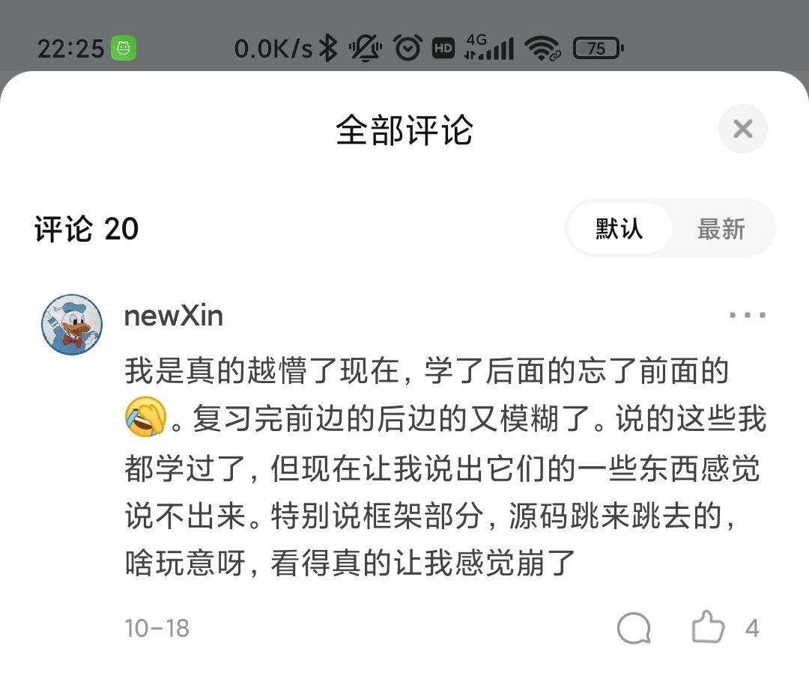
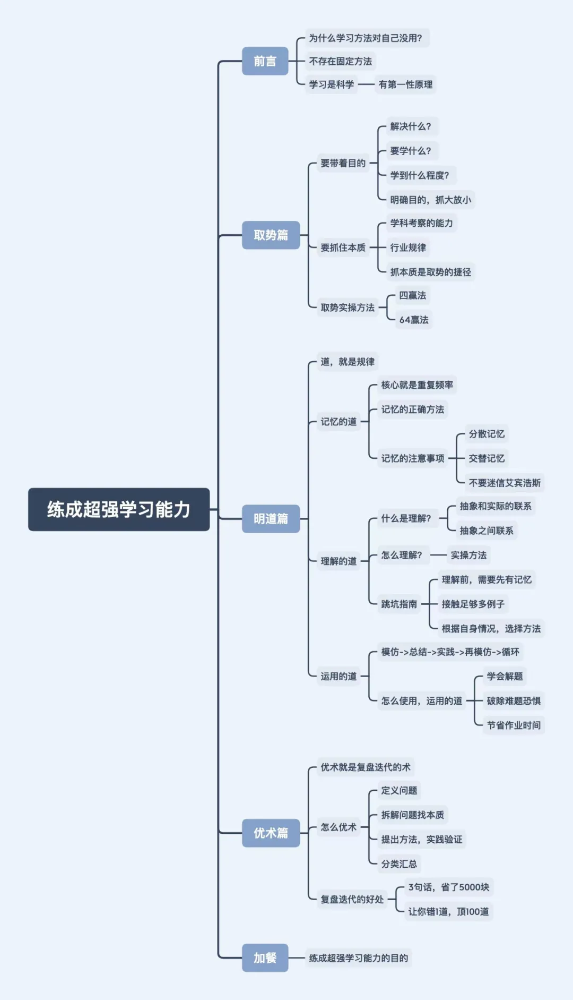
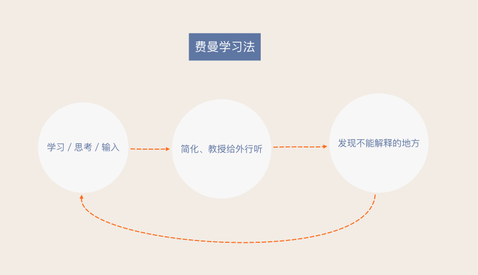
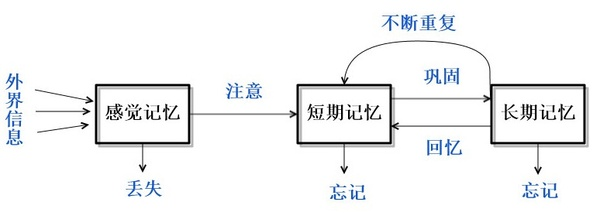
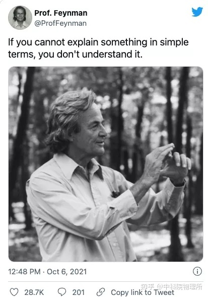

独立思考——做个清醒的学习者	自信坚强——做个积极向上的学习者	知行合一——做个现实的学习者

# 行

行动，去解决你遇到的一切问题。不想学习？不知道做什么？......那就立刻去行动，去解决这些问题，无论是以何种途径。

# 思

坑中沉思：

2021年11月4日，在知乎上看到一条评论，觉得很契合自己现在的处境，评论内容如下：

于是我把这条评论发上了一个交流群，期待群友的解惑。很幸运的是，夜猫和南黎慷慨直言，我也因此收获颇丰，遂有此文。

思前想后，学习的几个要素无非：学习计划、学习目标、学习过程、学习成果。学习计划是有体系的学习的保证，有了目标就去行动，就进入了学习过程，学习过程之后就是自己的学习成果，好的学习成果又正向激励着学习，于是我从这四个要素来剖析了一下我低效的学习以及学习不好计算机的原因：

第一：从学习计划分析：有完备的学习路线，但没有明确的学习规划、总的规划。对每天该学习些什么、该做些什么、该掌握哪些东西、回顾和复习没有一个明确的规划，就只是知道把视频看了、代码敲了、笔记做了，而对自己的脑子里到底吸收了多少毫不过问。也就是没有解决“往哪里走”、“怎么走”的问题。

第二：从学习目标分析：清楚学习哪些内容，也确实去学了，但不清楚自己为什么要学习这些内容以及不知晓这些内容应用的场景（引用一段话：“new了一个知识，但因没有引用而形成了一座孤岛，然后就被GC了”），所以导致了一个问题：学了后面的忘了前面的，复习起来也不知所措。

第三：从学习过程分析：除了陷入“学而不思则罔，思而不学则殆”，就是学习重心不明确，把看视频记笔记敲案例当成了学习重心，真正的重心应该是掌握知识并会实际应用。

第四：从学习成果分析：怀揣什么样的心态、目的去学，就导致了最后收获的是是什么果，得到了什么又会正向激励你去持续这么一个学习的过程。所以，就目前的果而言，是半生不熟、半死不活的。

今后要做的：求知终极法宝：好奇、实践、思考；学习计划，只需分好新技术的学习和旧知识的巩固、熟练应用就好了，然后每天简简单单地安排一些任务，以掌握、应用为目的去学习，在规定时间最大限度刻进脑子就行了。其实问题也没有那么复杂，把一些简简单单的认真做好了就行了，就不会不知道该怎么办了

**夜猫@Forward Steps ：**你缺的不是方法，是实践，自己实践，总结出来一套适合自己的方法，别人的方法可以听听，但不是听从。

**思-答：**不是缺乏实践，而是缺乏实践中的思考和好奇心。不知道如何衡量自己学到了哪些东西、掌握了多少，没有及时的反省每天的作为，没有思考技术本身，没有思考学习过程的不足之处，总的就是说进入了“学而不思则罔”的那个深坑而不自知。思又有哪些呢？在我看来，学习过程中无非就是三个思：对学习内容的思考、在实践中的思考、对自身所作所为的反思；说白了，最后还是回到了独立思考本身。大道至简，环环相扣，在某些最基本最应该去锻炼培养的往往会被我们忽视（就像计算机四大金刚的重要性一样），那些方法论也不过是实践与思考的结晶。“学而不思则罔，思而不学则殆”，“学”不就是对应了实践吗，“思”不就是对应了思考吗，实践与思考相互促进、相互成全、共同发展啊。实践确保不会出现空中楼阁（虽然行动不一定有结果），思考确保实践的更加完美。而那些学习能力强的人，不正是因为这两样东西已经融合进他们的骨子里了吗，所以他们学习成长起来如鱼得水。而好奇心呢，是不断促使我们去探索、去思考的源动力。满怀好奇心，做那个仰望星空的程序工程师。

举个学思结合的例子：比如我听说计算机很流行，我也有点兴趣（好奇心），我也想学习或了解一下（学习需求），可我不知道计算机是什么东西，我就在想计算机到底是什么玩意啊，我怎么去了解呢（思考）？局限于本身的知识储备而没有思考出个所以然来，于是我就去图书馆或互联网上查找资料——加强知识储备，亦或者向和这方面有过接触的或是就是这个行业里的人请教（思考得到的解决思路），然后就去找资料、请教老师同学（实践、行动），直到最后我搞清楚了这个问题：计算机是能够按照程序运行，自动、高速处理海量数据的电子设备（学习成果），然后还有很多不懂，什么是程序、如何实现那些功能的？（好奇心促使思考）就再去思考是什么、如何实现、有哪些途径可以解决我的疑惑、我要不要学、要学习哪些（好奇，继续思索），之后就再去寻找答案（实践、行动），思考-找答案-思考-找答案-...，由浅至深、一步步深入，最后也就水到渠成了。

实践和思考就是一把万能钥匙，运用得越熟练，面对各种各样的问题时就越懂得如何以最小的代价去解决。（好奇心启动你的思考，促使你去探索）

可现实中的大部分情况就是，好奇心缺乏、思考不足、行动不足，所以学习能力弱得可怜，现在的我就是一个典型的例子。

回到计算机，计算机是一门应用科学，而不是一门理论科学，所以学习计算机相关的技术不能以偏理论的方法去学习（而国内学校的教育，学科中多以一纸试卷来衡量学习程度，也就是说衡量出来的是偏理论上的知识，反馈也来自于试卷成绩，这样是不利于学习计算机并将技术应用起来的）。计算机的诞生，从网上得到的原因就是：“是美国为了计算导弹的运行数据而诞生的，也就是为了计算其弹道数据而诞生的”。这说明了什么？这说明了计算机就是为了某种需求而诞生的！计算机也是需求的产物！计算机不是凭空产生的，是从解决需求中创造出来的。所以后面在计算机技术基础上发展起来的语言或技术也是为了各种各样的需求服务的，比如java语言的诞生也是因为需求而诞生的（用于微机设备，得保证代码短小、紧凑且与平台无关）。

说了这么多，其实就是为了说明需求与创造的联系，以需求的角度去学习计算机技术的必要性。有了需求才去创造了某些东西，而不是凭空产生创造了某些东西。学习计算机技术过程中，不妨也以需求的角度入手，多想想自己的技术需求是什么、这些技术需求应用于哪些场景、这些技术的本质是什么、技术需求能不能为我的应用需求服务、我该如何应用于实际等等。而需求哪里来？现实中来，思考中来，实践中来，此处不再赘述。

学习不应该被复杂化，学习无非就是实践与思考，不清楚自身到底要干什么的时候，先扪心自问自己是否有思考有实践（思考过如何解决困境吗？师长、朋友、书籍、调研哪个方面你）

大道至简，许多学习上的问题的存在是因为懒惰与不作为。

总结：

1. 大行其道的各种各样的学习方法论只能是作为参考与补充，永远要记得怀揣着好奇心去思考、去实践，“学而不思则罔，思而不学则殆”，有问题、不足就要想用尽你所想到的所有方法、所有途径去解决，而不是看着别人的解决方案、看着别人的总结而没有自己的思考与实践，**毕竟，只有经过了自己的亲身实现，你才会知道你能不能做得到**。（不要光欣赏别人的，要想想自己做得到的）
2. 清楚学习技术（工具）的目标是什么，“All long,the language was a tool,not the end”（毕竟，语言只是实现目标的工具，而不是目标本身），如果不搞清楚学习技术的目标，仅仅为了学习技术而学习，到头来学习了技术也不会去应用，反而会丢失掉学习的乐趣。技术因需求而生、为解决问题而生，我们学习技术就是为了解决需求、解决问题，因此学习技术也应该以解决问题、解决需求为目的去学习。
3. 项目是一个或大或小的工程，项目的需求也往往不会很简单直白，解决需求运用到的技术也不可能很单一，因此分析需求和技术整合的能力也非常重要，许许多多的技术之间存在一定联系并且互相配合才能解决一个个工程问题。

记`南黎。`的一段话： 

技术，因为需求而生，这个技术是因为什么才被广泛使用的，始终揣着这个思路去学，去看它是怎么做的，是如何尽自己最大的能力解决了需求，才能更容易理解一个技术。比如mysql，你应该时刻抱着探索这样的心态。为什么需要数据库？这个数据库是通过什么样的技术做到了这件事？它通过什么方法解决了这样的性能问题？

为什么需要数据库？因为数据过于庞大复杂时难以管理，你靠人力难以对大量的数据进行整合并对其查找或分析，而又因为有数据查询的需求，所以你需要设计解决方案去查询，而数据查询又可以通过哈希算法对其进行快速处理并查询，但是哈希算法有极限，难免会存在哈希冲突，因此可以考虑使用数组来对其存储，这样可以避免哈希冲突，又因为数组占用空间大，同时查询遍历有n的复杂度，所以又考虑使用树状结构去存储；通过分层，降低查询平均复杂度，因此考虑采用搜索树，但是因为数据越来越庞大，树层数越来越高，同时因为数据极端情况下，树会退化成链表，回到n的复杂度，因此考虑采用自平衡的树来存储，这时候就出现了b树和b+树，而不同组织情况的树，对于不同查询条件的查询次数也是不同的，因此考虑建立不同的索引树，分别在不同索引树上查询，来降低期望时间复杂度，再后面，因为可能有些查询语句不能覆盖某索引树，但对另一棵树可覆盖，这时候就出现了mysql优化器的机制。
你要怀揣着一个去挖掘技术本质需求的态度去学习技术才行，最开始大家也只是有存储数据的需求罢了，为什么后来变得这么复杂，就是因为需求越来越高，靠硬背，早晚都会忘完了。怀揣本质、挖掘技术的最本质需求是什么，这种学习的思路在任何技术上都可以通用，所以有的培训班的视频我不爱看，就是因为他们会对一些技术背景一笔带过，反而着重讲各种技术，误导了我们很多朋友，他们甚至根本不知道，为什么需要这个技术。而看框架源码，你要揣着这个框架的本质去看，为什么需要spring，归根结底就是java自己的那一套原生web请求源码不好用（繁杂），因此封装一套成熟的框架给你用，降低开发成本；为什么springboot发展起来，就是因为spring也太繁重（配置繁重，简直配置地狱），用起来不够友好了，所以就开发出springboot来简化开发了（如何实现？）。

# 做

取势，就是在学习前要明白，学习的目的和本质；明道，就是懂得记忆、理解、运用的规律；优术，就是通过复盘迭代，不断优化学习的技术。

## 取势

学习首要要捉住两点：

1. 第一个是学习的目的，只有明确了目的（也就是你学这个东西，是为了解决什么问题？）你才有可能知道，我们要学什么？应该学到什么程度？并且要明确学习目的的重心，捉大放小，学习也要分清主次，先去解决最需要解决的问题，细致末梢就放一边。
2. 第二个是所学内容的本质规律（这个本质，其实就是某个学科，考察什么能力；对成年人来说，本质就是行业规律）。虽然说，自己思考，也能归纳出本质，但是这样太慢了。我给你一条捷径：就是在学习之前，你可以先把网上牛人总结的本质都看一遍先。

抓住这两个核心，针对性的投入精力，我们就能像风口上的猪一样，事半功倍。

实操：

1. 在学习前，你要先借鉴网络大神，大致搞懂本质。然后你要准备多一本课本的习题册，和现在老师在用的那本不一样就ok了。但是章节目录，最好和现在的一致。

   如果你是成年人，那要准备的是，行业解决方案。另外，你准备的也不是课本，而是行业经典理论书籍。

2. 切记，在学一个章节前，千万不要急着去看课本。因为你不带着目的看书，就会以为书上写的都是重点，所以看课本和看天书一样。看着看着，就走神了，看着看着，就想去问候山本的先人。

   所以看书之前，你要先快速去看，习题册中这个章节的习题。你甚至可以直接看答案。每道题就用1分钟。看不懂是正常的。这一步，主要是记录答案中，经常出现的，关键术语、关键解题步骤、关键知识点的推理过程。带着这3个关键，开始去看书。

3. 经过了前一步，你就知道，书中有什么是重点的，常考的；什么是没用的，边边角角的。着重看刚才记下来的重点部分，这样你看书就比别人快了不止1倍。

4. 看完书后，再去做章节的例题，以及老师给你的习题册。如果你想了5分钟还卡壳的话，果断去搜答案。并且，在自己的笔记本上，把自己卡壳的原因，还有对应的解题步骤，记录下来。这是积累自己的解题套路。

## 明道

学习总共分为三个层次：记忆、理解、运用。

**记忆：**（高频率适量重复）

- 想要形成纯记忆，你只需要不断重复，提高频率。无意识中，大脑就能帮你记住了。
- 我们记忆的时候，千万不要苛责自己，要求一次就背下来，一旦记不住，还贬低自己。正确的方法是，让自己放松一点，哪怕每一次背的时候不太认真，只要重复频率上来了，你的大脑，就能自动帮你记下来。
- 注意：**分散记忆，不要集中背大量的对象，才能省时省力**；**交替记忆，提高效率**。

**理解：**所谓理解，就是联系，理解的规律，就是建立联系。理解的本质，就是构建起抽象概念和实际例子之间的联系，以及概念相互之间的联系。

- 理解的第一步，就是给抽象概念，联系上实际例子。（例如勾股定理和直角三角形）
- 只有在不同抽象概念之间，也建立起联系，这才是真理解。

实操：

- i）你挑出同一章节，需要去理解的重点概念。多看几遍，先记下来。哪怕是死记硬背，也没关系。
- ii）找到一大堆，用了某个概念的简单题答案。这些题目，其实就是把抽象概念，运用到实际生活中的例子了。重点观察，这个疑惑的概念，在具体的场景中，是长什么样子的。
- iii）等你看得够多了，就会无缘无故有一种，“oh， so thus 咧”，的感觉。这其实是因为，你把抽象的概念，和实际运用例子，联系在一起了。你的大脑中，已经形成了，一个零碎的知识。
- iv）理解了好几个概念后，我们还要继续找，运用了好几个概念的中档题。这一次是观察，这几个概念之间，在答案中是怎么联系到一块的，建立起概念之间的联系。当这种联系变多了，大脑中的零碎知识，才会连成网，形成思维导图。

跳坑：

1. **理解前，需要先有记忆**。我们遇到很难理解的，没必要死磕，先硬背下来，等接触的题目够多了，一边建立联系，一边修正，大脑就自动帮你理解了。

2. **你需要接触到，足够多的实际例子，从多个角度观察过一个知识点，才能理解透彻**。理解不了一个知识，只是因为，你没有从多个角度，接触到足够多的例子而已。破除办法很简单，不要怀疑自己，找多点，同一知识点，不同类型的题目例子，看足够了，就理解了。

3. **检验自己是否理解，你需要根据自身情况，选择合适的方法**。对于基础较弱的同学，我会推荐用电子版的思维导图，去检验理解。

   如果你时间紧，任务重，你可以直接从网上，找到别人做的。自己对着图中的某个知识点，看看能不能说出来，这个点有什么实际例子，跟其他点有什么联系。这也能检验，你是否达到了理解。（费曼学习法，是有前提的。如果你大脑里面，连单个知识点都没理解好。这个时候，你其实是在地下室10层。大脑空空去就用费曼学习法，会非常卡壳。讲两句，就要停下来翻5页书，又废又慢。别人在大气层用费曼，那当然能升天啦。你在地下室搭火箭，那也是real升天了，只不过是，位列仙班的那一种。所以，费曼学习法，只适合用来查缺补漏，辅助理解，一周用个1次就差不多得了。）

**运用：**

在日常学习中，我们可以这么来使用运用的道。

1）比如，当你的记忆、理解没问题了，但是遇到题目就发懵。

这时候，你可以去找堆题目，对着答案看一遍，看看别人是如何解题的。并且把自己总结的运用方法，记录到笔记本上。

然后把答案合上，自己试一试，能不能解出来。这就是模仿了。

模仿后，还要继续找同类题目，尝试不看答案自己解。在解的过程中，修正自己的记录。如果还是不会做，就继续去模仿，不断循环。

2）对待难题，也是同样做法。

有些同学，一碰到难题就很害怕，也是因为模仿难题的答案，太少了。

如果你基础题和中档题，都没什么问题了。就找个时间，密集模仿难题答案。不用很长时间，你就不害怕难题了。

3）你甚至可以在每次做作业之前，都先花10分钟，去模仿。你会发现，这能省下非常多做作业的时间。而且作业难题的正确率，也会有很大的提升。

模仿得越多，节省的时间就越多，题目在你面前，就变得更加简单。你会越来越自信，不再害怕难题。这就是从普通学生，到学神的正向反馈。

对于成年人来说，也是同理的。只不过成年人就不需要刷题了，更加多是，要刷案例和系统解决方案。这里就不展开来说了。

## 优术

我们在学习过程中，无论是记的笔记，做题心得，或者是对学习方法的思路，都是十分宝贵的资源和精华。

但试问一下，你上次复盘整理这些精华，是在什么时候呢？

很多人喜欢听新课，刷新题，学新的学习方法，接触新的认知。恨不得让旧知识，别再联系自己了，怕被新知识误会。

这种喜新厌旧，通常被叫做渣男行为，这是没有好果子吃的哈。这类人，往往要等到考试扑街，才痛定思痛，想起复盘的好。

学神则不一样。他会每天复盘迭代，一边复盘过去的精华，一边迭代出新的方法。对新旧认知，“我全都要”，所以进步速度，就能秒杀普通学生。

如何优术？

复盘迭代，其实说人话就是，发现问题，找到本质，给出解决方法，分类汇总经验。实操步骤：

1. **a定义问题**

   你发现了一个问题后，要先问自己，这个问题重要不？不重要就别去解决了。如果真的重要，那解决它是为了什么？为了达到目标，有没有办法绕过去？

2. **b拆解问题找本质**

   碰到问题，要从多个角度去拆分。这么多角度里面，哪一个是解决问题的关键因素？这个因素的本质是什么？

3. **c提出方法，实践验证**

   围绕着目标，以及问题的关键因素。在实践中检验，自己的解决方法是不是奏效

4. **d分类汇总**

   我们实践之后，要总结经验。把我们解决问题的心得，分门别类的记录下来，用来指导下一次的实践。这就是所谓的迭代了。

不受他人的影响，不用忍受世俗的目光，心底能有淡然的幸福，对未来还怀有希望。这就是学习能力，要带给你的目的呀。

# 学习误区

作者：铁木君
链接：https://zhuanlan.zhihu.com/p/494299377
来源：知乎
著作权归作者所有。商业转载请联系作者获得授权，非商业转载请注明出处。

## 1、过于求急，追求立竿见影的效果

这类人深陷「学习差」的泥潭，长久忍受父母责骂、老师忽视或同学嘲笑后，暗自决定要逆袭。

恨不得成为不吃不睡只学习的机器人，创造「今天熬夜复习，明天考试第一」的奇迹。 

> 但是，一旦发现努力没有回报，成绩迟迟不见长进，就开始闷闷不乐，垂头丧气，甚至自暴自弃。

***破解：\***

**放平心态，别想一口吃成个胖子。学习就像细水长流，要稳扎稳打，才能有条不紊地进步。**

过于渴望提高成绩，可能反而会因为焦虑、暴躁、压力，而影响自身的学习。

不如，先定个小目标，每次考试比之前进步1名，一个学期下来你就会发现，成绩可能到了之前不敢想的高度。

## 2、思维固化导致否定自己，或者故步自封

这类人对自己缺乏信心，长久以来的「坏成绩」和负面反馈，导致他们思维固化：**我天生就蠢笨，怎么努力都学不好，我注定没出息**。

***破解：\***

**思维决定心态，心态决定成绩。**如果你认定自己是扶不上墙的学渣，那么别人再怎么帮你，你依旧变不成学霸。

学会打破固定思维，不要认定死理，学会灵活思维。平时可以玩玩活跃思维的益智小游戏，比如数字游戏、华容道等。

平时也可以多鼓励鼓励自己，建立自信积极的心态。**就像现在给自己点个赞！！！**

## 3、「看书5分钟，准备2小时」，过于重视准备工作

这类人总觉得「万事齐全」了才有资格学习。

查阅各种备考攻略、如何认真学习、如何做好笔记等等，**结果花4、5个小时，搜集了一堆资料和方法，真正学习的时间可能10分钟不到。**

***破解：\***

学习就像「抢红包」，讲究干脆利落，直奔目标。

**减少复杂而耗时的前提工作，过于花里胡哨，反而影响学习。**

## 4、不懂就问，一做就废，不知道主动思考

这类人看起来很勤勉爱学习，不论是办公室的任课老师身边，还是教室里的学霸周围，总有他们问「为什么」的身影。 

> 但他们的问题，往往又很简单且基础，一般只知道问答案是什么，不知道将问题和答案集合起来思考，也不知道什么叫举一反三。

***破解：\***

首先，问问题前，先自己思考三遍怎么解，实在想不到再问别人。

其次，要问答案的本质是「问思路」，知道答案只是懂这一道题，清楚思路才是懂这一类题。

最后，弄懂思路后趁热打铁，付出行动，多刷几个类似的题目加深理解。

其实，不知道主动思考的本质原因，还是书读得不多，缺少深度思考的能力。

我很喜欢杨绛先生的一句话：

> **“年轻的时候以为不读书不足以了解人生，直到后来才发现如果不了解人生，是读不懂书的。**
> **读书的意义大概就是用生活所感去读书，用读书所得去生活吧。”**

大量阅读、持续阅读，古今中外、文学小说，都可以多读。当你广泛阅读到一定程度的时候，你的谈吐和气质会自然而然让人感到舒服。

读书是最低成本的成长方式，那些年轻轻轻便有所成就的人，往往是那些别人在打游戏他独自去图书馆的人。

**如果你喜欢看书，但不太会找书，**可以关注我的公号「铁木君」，我把这几年积攒下来的**3000本优质私人书单**分享给你，这些书是我**近十年的积累，**每本都是我精挑细选出来的优质好书，**希望它们能对你有所帮助。**

## 5、从来没一个完整的学习过程，进度总卡在80%

老师讲题听了80%：这个我懂了。 

解题思路在80%：这题我会了。 

刷题刷了80%：考试没问题了。 

> 结果是，成绩也只停在80%。

他们的常态是：**明明差一点就可以做对，但每次考试都做不对。**

***破解：\***

不要凭眼睛做题，只有把题目从书本装进脑袋，再从脑子拿出来放在纸上，你才能知道自己的易错点在哪里，考试才能获得100%的正确。

## 6、不论是历史意义还是数学公式，都只知道死记硬背

> 这类人单纯靠记忆来冲击高分，不论是什么科目的知识，都先背上几百遍再说。他们没有思维模型，不知道怎么去思考题目，也不知道有哪些记忆方法。

***破解：\***

**打破「死记硬背」模式，先理解，再背诵，准成功。**遵循21天记忆曲线复习，有技巧、有规律地记知识点。

再说一件有意思的事，如果尽可能地将多种联系，结合在某一件事情上，那么你对这件事的记忆就会加深。

比如，给你看男女混合的二十张照片，你只会对长相特别美或丑的有印象，但如果告诉你其中某一对是夫妻，那么你记住夫妻的长相的概率会高于其他人。

所以，**在我们背书记忆的时候，也可以尽量建立多的联系，充分调动五官感觉，记忆效果会大大不同**。

不信你现在就可以试试，**每次看到「铁木君」的回答，就敲两下手机屏幕，听听关节撞击玻璃屏的声音，用心感受手机屏幕的震动感，这种感觉真的很独特！**相信我，不出三次，你就会对「铁木君」印象深刻。

## 7、只知道低头学习，为了进度而赶进度，不知道思考和复盘

上一章的概念还没弄懂，就跟风刷下一章的题目，学习就像一路走马观花，没有思考总结重点和难点，也不会复盘自己掌握的程度。 

到最后通常越学越吃力，渴望跟上进度，但一直追赶不上。

***破解：\***

**宁愿落后一点，也要抽出时间来总结和反省。**

地基稳了，才有建高楼大厦的可能，如果一味追速度，每层楼都偷工减料，那么即使建楼成功，也岌岌可危。

学习也是一样，如果基础不稳，为了赶进度每部分知识都「漏」一点，一旦积少成多，就会形成巨大的知识漏洞。更可怕的是，你还不知道漏洞的「组成部分」，想查漏补缺也无从下手。

## 8、不会抓重点，花大量时间做单调重复的事

> 这类人分不清刷题和抄错题哪个更重要，不放过老师说的每一句话，通常书本上全是密密麻麻的笔记，但依旧不清楚考试的重点是什么。

***破解：\***

**不要本末倒置。**记大片笔记、抄错题……都是耗费时间，但收获很小的机械化事情，不值得你把珍贵的时间耗在这上面。

建议采用思维导图的方式记笔记，省时又有重点，至于错题本，可以剪下试卷（注：老师已经讲过且不会再用）上的错题，直接贴在本子上。

**我从一个废柴大学生到两家公司的创始人**，走过很多坑，也悟出了许多宝贵的经验，**如果你想更好地成长，**可以关注我的公号「铁木君」，我把这些年积累的方法论都毫无保留地教你，**让你学会用1年的努力，超过别人10年的成长。**

## 9、不会输出自己的知识和学习心得

这类人只知道一味学习，背了大量知识点，只把学习当任务，不会自己总结重点和学习心得，一旦别人问起来，就支支吾吾不知道怎么表达。

***破解：\***

**把知识点理解透之后，转换成自己的语言，再复述一遍给别人听**。这有利于避免浅尝辄止，停留在知识表面。

感兴趣的同学，可以搜搜费曼学习法，依靠输出倒逼输入，效果绝对比单纯的看书好得多。

## 10、过分注重细节，不关注整体

这类人看书学习时，不愿意错过任何细节，必须全部弄懂再进行下一步，导致经常过分沉迷细节，无法把学习的知识联合成整体来看。

***破解：\***

**但其实，知识是触类旁通的一张大网，经常看见整体布局就能猜准细节。**我们不能单一地学习，要让已经装进脑海的知识点建立联系，这样更有利于记忆。

比如，学习历史朝代时，可以和该时期的必背诗词联系起来，一起背诵加深记忆等等。

## 11、不分区别地刷题，也不研究题目背后考察的知识点

赋予自己「无情的刷题机器」这个称号，以为刷的题目越多，碰见原题的几率就会越大。

> 于是，不论是模拟题、押题还是往年真题，只要是题目就开刷，却不知道分析题目背后的知识点，结果考试还是摔得很惨。

***破解：\***

刷题的重点在于「选择性」而不是「广泛性」，要只刷那些需要自己发力攻克的题目，不然天下的题是永远刷不完的。一眼就知道是考什么知识点的，可选择性忽视。

**重点是通过题目看清楚想考的知识点，并通过刷题熟练掌握该知识点，而不是一味地刷量计数。**

## 12、学习不专心，一边写作业一边放松（玩手机、看电视）

这类人通常喜欢惬意地学习，而不是「苦行僧」似的学习，或者认为自己天赋异禀，有一心二用还学得很好的能力，结果往往效率很低。 

> 比如，看了半天的书，还停留在前几页，又或是自以为都懂了，但一关上书就「马什么梅」。

***破解：\***

**这完全是学习态度的问题。**只有当你完全投入学习时，大脑记忆才会最深刻，这时候，你的学习效率，会狂甩「一心二用」时的效率好几倍。

## 13、不懂得主动找学习捷径和学习方法

这类人只知道闷头死读书，固执地遵循自己的那套学习方法，学习效率和成果日渐低下。 

结果，明明是同样的知识点，你花好几个小时背下来的，学霸只花了十分钟就理解透彻，这完全是青铜和王者的差距。

***破解：\***

**很多事情都是有捷径的，尤其是学习上，有些人走的比你快，不是因为他比你勤奋，而是你的交通工具是双腿，人家的是飞机。**

平时多观察和询问学霸是怎么看书和学习的，另外，也可以在知乎搜搜怎么高效学习、记笔记等。

## 14、不会让自己喘口气，停下来适当休息

挑灯熬夜刷题的是他，废寝忘食看书的是他，走路飞快绝不浪费一秒钟的是他，最后考试滑铁卢的也是他。

他经常会对天发问：明明我从没偷懒，恨不得一天有25个小时可以学习，为什么还是学渣？

***破解：\***

**人生和学习一样，是一场马拉松，并不是一下子拼尽全力就能赢的。**学习一定要劳逸结合，有合理必要的休息时间。

且不说熬夜看书刷题效率远不如白天，长期睡眠时间不够，那你的学习状态一定好不到哪里去。

午休是必不可少的，即使精力很好，也最好小睡一下。时间在10-30分钟就好，不然容易进入深度睡眠，效果更差。

另外，学累了也可以采取换科目的休息方式，比如，做数学题累了就看看语文文章，或者听听英语歌等，**不要玩手机刷抖音，会很难再次进入学习状态。**

## 15、学习目的不单纯，假装学习

经常被努力学习的自己感动到，熬夜学习、图书馆自习必定发朋友圈，然后享受清一色的「你好努力、学霸大神」等夸赞。

> 吸引他们学习的不是知识，而是想炫耀自己很努力很刻苦的虚荣心。这样一来，即使自己成绩不好，父母家长也没理由责骂自己，毕竟自己是「刻苦学习」的乖孩子。

***破解：\***

**明白学习是为了自己，而不是别人的眼光。**

其实，除了父母没人会关心你的成绩，你假装的努力，在别人眼里根本不算什么，到头来你也只能欺骗父母，感动自己，浪费大量时间和精力。

你可以一直假装演戏，但是结果不会陪你演。真想炫耀的话，等到成绩出来那天再炫会更爽。

## 16、不能把知识结构化和系统化

知识的记忆点总是很模糊，每个答案都似曾相识，但又不知道具体在哪章见过。感觉背了很多书，记住了很多东西，但是真到了要考察的时候，却大脑一片空白，说不出个所以然。

> 一句话总结，就是记住的知识很零散、单一、毫无规律，就像杂乱无章的线团，无法形成系统化的知识体系。

***破解：\***

**知识结构化和系统化很重要！知识结构化和系统化很重要！知识结构化和系统化很重要！**

这就像我们整理衣服，一边是衣服裤子胡乱堆成小山，一边是分门别类规规矩矩存放，当你想穿某件衣服出门时，很显然更容易在第二个里面找到。

知识也是一样，将每个知识点都整理分类，按照一定的联系或者规律，放在记忆盒子里，当你需要调动某个知识点时，它也会很快速且清晰地蹦出来。

## 17、中了以上任意一条，但是假装没看到，也不愿意改正。

## 18、面对别人的建议和问题指出，不管不顾先否定了再说。

他们不会思考自己是不是真的错了，而是想别人怎么总挑我的毛病。

但其实，如果别人是真的为了你好，你也有所收获的话，大可以敞开心扉，大方承认，并表示感谢，**一来可以彰显你的气度和素质，二来你也会建立联系，增加记忆，对收获的内容记忆更深刻，获得更多人的喜欢，比如现在为我点了赞的你。**

# 深度思考

作者：毛毛
链接：https://zhuanlan.zhihu.com/p/33587359
来源：知乎
著作权归作者所有。商业转载请联系作者获得授权，非商业转载请注明出处。

对于学习能力比较差的同学，如果其学习基础又比较差，那么，使用僵化的学习方法，就不大容易深入思考。对于学习能力很差、同时学习基础又很差的同学，使用僵化的学习方法，几乎没法进行深入思考，甚至连基本的思考都不可能。

要知道，连深入思考都不能进行，怎么可能学习进步呢？

为什么会这样？

因为学习能力差的同学，若他的学习能力中的重要因素之一的“学习起动力”差，那么，他思考某个问题的一开始，就会很慢，比如，别人思考几秒钟就清楚的题目，他可能需要思考几分钟、甚至几十分钟，才能“进入思考的状态”，因为他的“学习起动力”差啊，“起动不起来”啊。而僵化教育下，一般的，老师怎会给他这么长的思考时间？更可怕的是，由于经常的思考的慢，他就会认为自己很笨，有时就放弃学习了。

如果他很努力，仍坚持学习，那么，即使他勉强进入“思考状态”，若他的学习能力中的另外一个重要因素“凝聚能力”又差，那么，他思考时就会很容易分心，“凝聚不起来”啊。如果他的学习能力中的“执行力”差一些，“学习耐久性”又差一些，他就很快就会放弃了。如果他的“执行力”比较强，“学习耐久性”比较强，那么，如果他的“学习抗焦躁能力和学习耐久力”差一些，那么，思考简单的问题时，或许还行。但思考难的问题时，他又不行了，因为他“抵抗不住焦躁”啊，于是，他又放弃了。

因此，从“学习能力”的角度，一个学生要能深入思考，是多么的不容易啊！

# 病态学习

## 发现自己什么都不懂，什么都想学，又什么都学不精，是不是一种病态？

作者：孙文亮
链接：https://www.zhihu.com/question/19778858/answer/12943046
来源：知乎
著作权归作者所有。商业转载请联系作者获得授权，非商业转载请注明出处。

这种面对无穷选择的无力感，我觉得是因为欲望，因为想学会一切的欲望。社会中学习和学校中学习是完全不一样的。没有人帮你选课程，也没有人帮你打分。同样也不要妄想拿到100分。有舍才有得！

《海上钢琴师》有一段经典台词：

”一部钢琴，从琴键开始，结束。你知道钢琴只有88个键。它们不是无限的。你才是无限的，在琴键上制作出的音乐是无限的。我喜欢这样，我活的惯。 你把我推到舷梯上然后扔给我一架有百万琴键的钢琴，百万千万的没有尽头的琴键，那是事实，max，它们没有尽头。那键盘是无限延伸的。然而如果琴键是无限的，那么在那架琴上就没有你能弹奏的音乐，你坐错了地方，那是上帝的钢琴。“

大千世界，知识无止境。面对无尽的知识不知从何学起，这种状态，与1900面对陆地生活的恐惧，是何其相似。因为生于陆地，才觉得陆地生活是何其正常又轻松；因为长于陆地，才学会如何摒弃、选择、归纳、遗忘。1900对陆地生活的恐惧感，是因为他终身生活在同一艘船上。

**当你发现什么都不懂，什么都想学的时候，最先做的应该不是迷惘，而是庆幸。因为你的目光终于不再局限于船上，因为你发现了一片新大陆。**

学校的教育，就像一艘封闭的大船。再大也是有限的，用不了多久就能看清。这种桎梏可能会深深的影响一生。大船停航，学习也就终结了。**从船到陆地，从有限到无限，选择和遗忘是很珍贵的技能。有舍才有得！**

“所罗门•舍雷舍夫斯基出生于1886年，俄国记者，记得发生过的所有事情。” 在一个实验中，研究人员给[舍雷舍夫斯基](https://www.zhihu.com/search?q=舍雷舍夫斯基&search_source=Entity&hybrid_search_source=Entity&hybrid_search_extra={"sourceType"%3A"answer"%2C"sourceId"%3A12943046})出示了一张纸，上面写着一个拥有三十个字母和数字组成的复杂公式。然后他们把纸放在盒子里，将它封存十五年。当他们取出之后，舍雷舍夫斯基能够精确地回忆起来…舍雷舍夫斯基能够记起来，但他不能提取精髓。他记住了大量随机事实，但他不能将它们组织成重复性样式。最终他不能搞清隐喻、明喻、诗歌，甚至于复杂的句子。【1】

不能遗忘，是一件可怕的事。不会选择，是一件失败的事。因为1900不会选择，所以惧怕，所以止步。他已经习惯了88个钢琴键的有限世界，可以完全的掌握，然后在任意组合。然而面对陆地生活，他仍然沿用了有限世界的学习方法：全部掌握、任意组合。结果必然是不可能。

因此面对海量的知识，首先应当意识到学是学不完的，学了也会忘的。**不知道如何选择的时候，付诸行动比选择更重要。**不能一直犹豫，一直不迈出第一步，最终困死在船上。

总结一下：

1. 有取舍之心，不能什么都学会，也就没必要什么都想学。这是一种心态，可以让你面对无穷选择的时候不会有犹豫、迷惘、恐惧这些负面情绪。
2. 有时候付诸行动比选择更重要。学习尤为如此，作为新的开端，学习的状态比学什么更重要。很多知识要学一段时间才能发现兴趣，才知道是否有用。

什么都不懂，很正常，因为这是新的开始；什么都想学，是缺少取舍的心态，先开始学一个再说；什么都不精，学过几年才见分晓，一万小时才算精通。

有人会因为无法作出决定就推迟决定，然而实际上推迟决定是最差的决定 ，在推迟决定期间，时间悄悄流逝，你却没有任何一条路上的积累，白白浪费了时间。

**如果你有一些钱不知道花在 A 还是 B 上，你先不作决定，没问题，因为钱还是你的，但如果你有一些时间，不知道花在 A 上还是 B  上，不行，因为过了这段时间，这段时间就不是你的了。**【2】

最后推荐一文《学习的艺术》【3】，不要让学习停滞，坚持下去，这些焦虑将不复存在。

【1】 摘自《中国的创造力是如何被扼杀的》：[译言网 | 中国的创造力是如何被扼杀的？](https://link.zhihu.com/?target=http%3A//article.yeeyan.org/view/190382/205086)

【2】 摘自[刘未鹏](https://www.zhihu.com/search?q=刘未鹏&search_source=Entity&hybrid_search_source=Entity&hybrid_search_extra={"sourceType"%3A"answer"%2C"sourceId"%3A12943046})的博客《不是书评 ：「我是一只IT小小鸟」》：[不是书评 ：《我是一只IT小小鸟》](https://link.zhihu.com/?target=http%3A//mindhacks.cn/2009/10/05/im-a-tiny-bird-book-review/)

【3】 《学习的艺术》:[学习的艺术 - 左岸读书_blog](https://link.zhihu.com/?target=http%3A//www.zreading.cn/archives/2397.html)

## 中国的创造力是如何被扼杀的？

Nowadays people may admire China’s economy, but not Chinese creativity. Chinese architecture art, music and movies are derivative, and many a Chinese enterprise is merely a carbon copy of an American one. China’s best schools may produce the world’s best test-takers, but the United States’ best schools produce the world’s most creative talent.

当今人们可能会赞叹中国的经济发展，但却没有人欣赏中国人的创新能力。中国的建筑、艺术、音乐和电影大多缺乏创意，很多中国企业更是直接照搬美国。中国的顶级学府能培养出全球最优秀的应试人才，而美国的顶级学府却能缔造出世上最具创新能力的天才。

David Brooks outlines the four-step learning process that teaches students to be creative: knowledge acquisition (research), internalization (familiarity with material), self-questioning and examination (review and discussion), and the ordering and mastery of this knowledge (thesis formulation and essay writing).

David Brooks总结出启发学生创造力的“四段式”学习方法：获取知识（研究）、消化（熟悉材料）、反思和检查（复习和讨论）、整理和掌握知识（论文和笔记）。

However, this isn’t a linear process, Brooks points out, which means that the learner ‘(surfs) in and out of his unconscious, getting the conscious and unconscious processes to work together – first mastering core knowledge, then letting that knowledge marinate playfully in his mind, then wilfully trying to impose order on it, then allowing the mind to consolidate and merge the data, then returning and returning until some magical insight popped into his consciousness, and then riding that insight to a finished product.’

然而，布鲁克斯指出，这并不是一个线性过程，这意味着学习者需要在他的潜意识中来回穿梭，将意识与潜意识融为一体——首先掌握其精髓，再让这些精髓一直活跃在他的大脑中，进行各种排列组合、巩固加强、合并重组，如此循环反复直到灵光乍现，然后趁势付诸实践、创造出成果。

‘The process was not easy, but each ounce of effort and each moment of frustration and struggle pushed the internal construction project another little step,’ David Brooks continues. ‘By the end, (the learner) was seeing the world around him in a new way.’

布鲁克斯继续写道：“整个过程并非一蹴而就，每一分努力、每一次挫折和拼搏，都使内在理念更趋于完善。最后，学习者会以全新的视角看待他的周遭世界。”

But what permits our brains to turn a chaotic sea of random facts and knowledge into an island of calm understanding? Believe it or not, it’s our emotions that permit us ultimately to become creative thinkers. In his book The Accidental Mind, the neuroscientist David J. Linden explains how emotions organize our memories:

但是，究竟是什么，让我们的大脑将一团充满随机事件与知识碎片的混沌意识，变成冷静而理智的认识？信不信由你，事实上正是我们的情感最终让我们变成具有创造力的思考者。神经科学家David J. Linden在*The Accidental Mind*一书中解释了情感是怎么组织我们的记忆的。

‘In our lives, we have a lot of experiences and many of these we will remember until we die. We have many mechanisms for determining which experiences are stored (where were you on 9/11?) and which are discarded (what did you have for dinner exactly 1 month ago?). Some memories will fade with time and some will be distorted by generalization (can you distinctly remember your seventeenth haircut?). We need a signal to say, “This is an important memory. Write this down and underline it.” That signal is emotion. When you have feelings of fear or joy or love or anger or sadness, these mark your experiences as being particularly meaningful…These are the memories that confer your individuality. And that function, memory indexed by emotion, more than anything else, is what a brain is good for.’

“我们一生中会经历很多事情，其中许多我们致死都将铭记在心。我们脑中有许多机制，来决定记住哪些经历（9.11事件发生时你在哪里？（注，作者是美国人）），遗忘哪些经历（一个月之前你吃的晚餐是什么？）一些记忆随时间流逝而褪色，还有一些记忆会因过于平常而被混淆（你能清楚记起你17岁时的发型么？）。我们需要有一个信号给予提示：“这是一条重要的记忆。记下来并且加上重点标记。”那个信号就是情感。当你感觉到喜怒哀乐时，这些情感会给你的经历刻上“意义非凡”的标记。这些记忆赋予你独特性。大脑唯一能提供的就是用情感索引的记忆。”

What this means is that memories are ultimately emotional experiences, and that effectively learning must involve the learner emotionally. The very best US schools are seen as such because they inspire their students to be curious, interested, and excited; China’s very best schools gain their reputation by doing the opposite.

这就意味着记忆最终都是情感经历，并且有效的学习是需要学习者全“情”投入的。美国的顶级学府都是如此，因为他们赋予学生求知欲、兴趣和激情；而中国的顶级学府恰恰相反，因压抑学生而著称。

Thinking is the conscious effort of applying our memories to understand a new external stimulus, and creativity is asserting individual control over this process to create a synthesis between memory and stimuli. In other words, thinking is really about applying previous emotional experiences to understand a new emotional experience, whilst creativity is the mixing of old and new emotional experiences to a create an entirely new and original emotional experience. 

思考是运用我们已有的记忆来理解新的外界刺激的意识活动，而创造力则控制这个过程而创造出旧记忆与新刺激的复合物。换句话说，思考就是通过往昔的情感经历来理解一个新的情感经历，而创造力则是通过混合新旧情感经历，进而去创造一种全新的独创的情感经历。

The best US education institutions endow students with creativity by providing a relaxed and secure learning environment in which students share in the refined emotional experiences of humanity by reading books and developing the logic necessary to share in collective emotional experiences through debate and essay writing. A dynamic learning environment allows students at many US schools to feel joy and despair, frustration and triumph, and it’s these ups and downs that encode the creative learning process into our neural infrastructure and make it so transformative. 

美国最棒的教育机构，给学生提供轻松自在、无忧无虑的学习环境，在这里，他们通过阅读可以分享人类思想的精华，并通过辩论、撰写论文来提供共同的情感经历，以培养他们接受分享所必需的逻辑推理能力。许多美国学校通过丰富多彩的学习环境，让学生体验到兴奋与绝望、挫败与成功，正是这些跌宕起伏将有创造力的学习方法编入我们的神经网络，而且能活学活用。

A Chinese school is both a stressful and stale place, forcing students to remember facts in order to excel in tests. Neuroscientists know that stress hampers the ability of the brain to convert experience into memory, and psychologists know that rewarding students solely for test performance leads to stress, cheating, and disinterest in learning. But ultimately, the most harmful thing that a Chinese school does, from a creativity perspective, is the way in which it separates emotion from memory by making learning *an unemotional experience*.

中国的学校则是一个压抑、没有生气的地方，为了考试成绩，强迫学生死记硬背。神经科学家都知道压力会妨碍大脑将经历转化为记忆的能力，心理学家都知道仅仅用考试成绩来考查学生会导致压力、作弊、厌学。但是最终在创新能力方面，中国的学校做出的最有害的一件事是在教育过程中分割情感与记忆，使学习变成“无情感的经历”。

Whatever individual emotions Chinese students try to bring into the classroom, they are quickly stamped out. As I have[previously written](http://the-diplomat.com/china-power/2011/06/14/resistance-futile-in-chinese-class/#respond), from the first day of school, students who ask questions are silenced and those who try to exert any individuality are punished. What they learn is irrelevant and de-personalized, abstract and distant, further removing emotion from learning. If any emotion is involved, it's pain. But the pain is so constant and monotonous (scolding teachers, demanding parents, mindless memorization, long hours of sitting in a cramped classroom) that it eventually ceases to be an emotion.

无论中国学生尝试将什么个人情感带入教室，都无一例外地会被抹杀掉。正如同我之前写到的，自从开学的第一天起，爱提问的学生发现沉默是金，尝试展现个性的学生受到处罚。进一步让情感远离学习之后，他们所学的知识的显得无关紧要、单调乏味、抽象而晦涩。如果说还有什么情感的话，那也是痛苦。但是这种痛苦却是始终如一、单调乏味的（老师的斥责、家长的苛求、机械的记忆、长时间地坐在拥挤的教室里），这唯一的情感也将失去“感情色彩”。

To understand the consequences of Chinese pedagogy, consider the example of ‘Solomon Shereshevskii, a Russian journalist born in 1886, who could remember everything,’ whom David Brooks writes about in*The Social Animal*:

为了更好地理解中国教育的后果，让我们看看Solomon Shereshevskii的例子，“他是一个生于1886年的俄罗斯记者”，David Brooks在*The Social Animal*中写道：

‘In one experiment, researchers showed Shereshevskii a complex formula of thirty letters and numbers on a piece of paper. Then they put the paper in a box and sealed it for fifteen years. When they took the paper out, Shereshevskii could remember it exactly…Shereshevskii could remember, but he couldn’t distil. He lived in a random blizzard of facts, but could not organize them into repeating patterns. Eventually he couldn’t make sense of metaphors, similes, poems, or even complex sentences.’

“在一次实验中，研究人员给Shereshevskii出示了一张纸，上面写了一个由三十个字母和数字组成的很复杂的式子，然后他们把这张纸放进盒子里封存起来。十五年后，他们取出这张纸，Shereshevskii能够一字不差地背出来……Shereshevskii能记起来，但他不能提炼加工。他的脑海里充满了各种孤立的事实，但他不能归纳出一些共同的模式，将它们组织起来。最终他不能理解隐喻、明喻、诗歌，甚至于复杂一点的句子。”

Shereshevskii had a neural defect that prohibited his brain from prioritizing, synthesizing, and controlling his memories to permit him to formulate an understanding of self and the world. Like many a Chinese student today, he could experience, but he could not *feel*.

Shereshevskiis的神经有缺陷，他的大脑不能对记忆进行排序、合成等加工，也就无法形成对自我和世界的理解。他同许多今天的中国学生一样，只能经历，不能体验。

Chinese schools are producing a nation of Shereshevskiis, students with photographic memory and instant recall, but who can never be creative.

中国的学校正在制造Shereshevskiis之国，这些学生跟Shereshevskiis一样，只有快照记忆和短时记忆，绝不可能拥有创新能力。

## 不是书评 ：《我是一只IT小小鸟》

——摘自[刘未鹏的博客](https://www.zhihu.com/search?q=刘未鹏&search_source=Entity&hybrid_search_source=Entity&hybrid_search_extra={"sourceType"%3A"answer"%2C"sourceId"%3A12943046})

**设计你自己的进度条**

进度条的设计是一个很多人都知道的故事：同样的耗时，如果不给任何进度提示，只是在完成之后才弹出一个完成消息，中间没有任何动态变化，那么整个过程就会让人等得非常焦急，导致一些人干脆把程序关了了事。如果有进度不断更新，那么对整个过程耗时的心理感受就会远低于实际值，用户也不会郁闷到把程序关了。（你有多少次在银行处理手续的时候，看着工作人员把一堆材料不停地倒腾来去，心里多希望他们可以在柜台小窗口上投影一个进度条？）

这里的原因在于，没有进度提示的话，我们无法判断这个等待什么时候才是个尽头。如果有不断增长的进度条，那么我们对于什么时候会达到100%就会有一个粗略的估计，这个估计是一剂定心丸，让我们知道这事情总会并且会在不久的将来完成。

做事情也是同样的道理，善于规划的人，会将目标分割成一个个的里程碑，再将里程碑分割成TODO列表。前阵子流行的GTD方法学，核心的理念就在于，如果你把任务分割了，你就有了进度条，你就知道，事情在不断的进展，你总会完成任务或到达你的目标，你会有一个时间估计。反之如果没有这个分割，整个的任务或目标对你来说就只有两种状态——“完成”和“未完成”，如果不幸是一个比较漫长的目标，那么你会发现你的进度条总是“未完成”，一次又一次的等待未果会耗尽你的耐心，让你下意识的产生“这事什么时候才能完呢？”的疑惑，没有分而治之，你就不知道未来还需要付出多少努力才能达到目的，这就会让你心生怯意，不敢进一步投入时间，免得血本无归。在这样的心理下，不少人就会选择保守策略——退出，以免到头来花了时间还一事无成。

而所谓的规划其实就是针对这种心理弱点的做事方法。如果你对整个目标的几个重大步骤有清晰的界定，能够对每个步骤的耗时作出靠谱的上界估计，你就不会被不确定的未来，不确定的时间投入感到恐惧，就不会被这种不确定感压迫到过早退出。

**不要过早退出循环**

我们在尝试新的事物的时候，总是会遇到各种各样的困难，不同的人会在碰壁不同的次数之后退出。用程序员喜欢的话来说就是，我们都在for循环，区别在于你是什么情况下break;的。有的人退出阈值高，这是能坚持的一类人，有的人退出阈值低，这类人很可能遇到一些障碍就退出了。

过早退出的原因往往在于对于未来的不确定性，对于投资时间最终无法收到回报的恐惧，感受到的困难越大，这种恐惧越大，因为越大的困难往往暗示着这个任务需要投资的时间越大。所以其实我们都是直觉经济学家，当我们说“畏难”的时候，其实我们畏惧的不是困难本身，而是困难所暗示的时间经济学意义。

然而，我们的情绪大脑毕竟比较原始，仅根据碰壁的次数或硬度来判断事情的难易并不一定靠谱，如果你遇到困难，不妨用一用互联网，用一用群体的智慧，看看别人当时是怎么想怎么办的，绝大多数情况下你并不孤单，你遇到的问题早就有人遇到过，你踩过的坑里面尽是前人的脚印，不要仅仅因为一时摸不着头绪，找不着出路就退出，这不是informed decision，问一问自己作出退出的决策是否基于足够的信息，我是否进行了足够的调查，至少，是否去简单用了用搜索引擎。

模仿高德纳先生的名言：**过早退出是一切失败的根源**。

**兴趣遍地都是，专注和持之以恒才是真正稀缺的。**

很多人看了书中的故事之后得出这样的结论：兴趣最重要。然而，我觉得区别他们和其他人的，并不是他们拥有超过常人的兴趣，而是他们拥有超过常人的毅力。

其实人天生就对新事物怀有好奇心，难以找出谁没有对任何事物或领域产生过兴趣，然而不同的是，有些人的兴趣只能持续几天，当遇到第一个困难，第一道坎的时候，他们就熄灭了，然而另一些人的兴趣火花会变成火苗，火苗会变成火种，一直稳定的燃烧很多年。**区别他们的并不是兴趣的有无，而是他们的性格里面有没有维持兴趣的火种一直燃烧下去的燃料**。

一个人有专注和持之以恒的性格，即便在一个没有多大兴趣的领域也能成为专家（更何况，兴趣的很大一类来源就是“我擅长做这件事情”）；反之就算有兴趣也很快会被一些冷水泼灭。

**生活中的选择远比我们想象得要多，细微的选择差异造就了不同的人生**

唐雅薇同学的故事中，有这么一个细节吸引了我的注意：当时她正在找工作阶段，对女生在IT行业的发展很迷茫，恰逢微软的郭蓓菁女士到他们学校演讲，演讲完了之后她立即就奔上讲台拦住郭女士询问女生与IT的问题。

这是一个细节，但我相信不是所有人都有勇气上去拦住名人问普通问题的，我们会给自己找很多很多的理由和接口，我想最常见的应该是两个原因：1. 如果被批评了自尊心会受到打击。2.认为问了也问不出特别的信息。然而事实却是相反：1. 自尊心受到打击算不上实质性的损失。2. 你想不出能问出什么特别的信息并不代表就真的问不到重要的信息。**别把不知道当成没有**。

一个小小的思维差异，可能导致很多人在遇到困惑的时候原地打转，冲突不出，而另一些人则取经得到宝贵的经验，站在别人的肩膀上越过了障碍。唐雅薇从郭女士那儿得到了最宝贵的信息：女生在IT行业也能有很好的发展。信心，是这样一种奇怪的东西，就算你没有确切的证明未来会更好，你也会坚持下去，你不会过早退出循环；而来源于过来人的信息则是信心最靠谱的保障。

你是不是意识到，在平常的生活中，你所作出的选择比你想象的要多得多呢？有没有想过有一些看似细小的选择可能会产生巨大的影响？

想想看，试一下，是不是真的没什么损失，还有可能得到巨大的回报呢？

**靠专业技能的成功是最具可复制性的**

它需要的只是你在一个领域坚持不懈地专注下去，只需要选择一个不算太不靠谱的方向，然后专心致志的专下去，最后必然能成为高手或者绝顶高手。世上有很多成功带有偶然因素和运气成分或出身环境，但至少这一样，被无数人复制了无数遍，否则就不会存在学校和教育了。

**反思是让人得以改进自己的最重要的思维品质**

很多人在成年之后甚至未及成年，性格就难以再发生大的变化。性格是这样一种自我实现和强化的陷阱：如果你是不容易专注的人，你会发现生活中处处都是分散你注意力的东西，你的思维难以在一个事情上停留半小时，于是你的时间变得琐碎，你很难在一个领域有长久的积累和深入的思考，这样的现实可能会让你感到沮丧，后者让你更加无法专心，这样的现实可能会让你感到焦虑，为了避开焦虑你又会去寻求其他的刺激，结果是恶性循环。

反思是改变自己的第一步，我们常常容易发现别人的问题，别人的错误，却难以发现自己思维中的问题，因为我们很少会把自己的思维当成目标去思考。

作为程序员，相信没有人不知道能修改自身的程序，而能修改自身的程序的前提就是，首先这个程序必须有法子能够指向自身。

**饿死在干草堆之间的驴子**

有很多在迷茫期的同学，迷茫都是相似的：面前有两条路，到底选哪一条？“转行还是不转行？”“学C++还是学Java。？“做管理还是做程序员？”有些问题其实不是问题：比如“学C++还是学Java。”答案是都学而且还不仅学两个。有些问题不是一个泛泛的答案能够适合的，比如转行还是不转行，需要考虑很多自身因素。

但更重要的是，有人会因为无法作出决定就推迟决定，然而实际上推迟决定是最差的决定，在推迟决定期间，时间悄悄流逝，你却没有任何一条路上的积累，白白浪费了时间。

如果你有一些钱不知道花在A还是B上，你先不作决定，没问题，因为钱还是你的，但如果你有一些时间，不知道花在A上还是B上，不行，因为过了这段时间，这段时间就不是你的了。

所以，不管有多纠结，也不要从纠结中逃离，试图推延决定，既然终究是个痛苦的决定，就痛一回，好好思考和调查之后作出一个决定并坚持下去，只要不是太不靠谱的行业（相信也没谁会在纠结了之后却选了一个不靠谱的行业的），经过你的积累总会成为高手。

**一生的知识积累，自学的起码占****90%**

你会在这本书当中看到的一个重复出现的现象就是自学，大规模的自学，逃课自学，上网找书自学，程序员行业是最适合自学的行业，网络是程序员的天堂，需要的资源、工具，比课堂上的多出何止百倍，如果说还有一个学科，并不需要传统的教育就可以成才，估计非程序员莫属了。作为程序员如果没有查过wikipedia，没有看过几本原版电子书，没有在国内外主要邮件列表里面提过问题吵过架，没有用技术博客记录学习的独特体会，没有订阅技术牛人们的博客，怎么好意思说身在这个行业呢？

最后，看完了书还是说“说起来容易做起来难”的，**怪自己，不怪书**。

## 学习的艺术

**[LiuSerina](mailto:serina11@live.cn)**分享的文章。

有看过非诚勿扰不？我有看过一期是这样的：一个男嘉宾刚从后面的背景门后走出来，一个女嘉宾就以迅雷不及掩耳盗铃响叮当之势把灯按掉。主持人问她：姑娘，你怎么这么快就把灯按了呀。姑娘：“第一，我不喜欢个子矮的。第二，我不喜欢穿西装的。第三，我不喜欢个子矮还穿西装的。”搞笑了，是不是？也太武断了，是不是？我脑中马上想出一个画面：如果这位姑娘看到敬爱的小平同志的尊荣不知是何反应。嗯，应该很有趣吧。

八卦了半天，可以扯到正题了。

当我们初见一个人、初学一门技艺、初尝试一样新的菜式、或者初到一个陌生的地方、、、、、、，我们究竟是以一种什么态度来看待这些？我们可以以一种非常武断的方式早早下了结论：这个男生太糟了， 他个子低还穿西装。（上面的那个姑娘）为什么要学英语，我是中国人，为什么学鸟语，英语有什么好的？我们国家这么富强了，我不需要走出中国，因为世界已经走进中国了。我不要学英语，还是老外学汉语吧。（或者刚学游泳的人，为什么要学游泳，游泳池里的水一点都不好喝、我又不是鱼，离开水就不能活，而且，我是“伟大”的脊椎直立行走的动物——人，为什么要像只青蛙一样在水里扑腾？）这个菜怎么这么难吃？这里的人怎么就吃这个？他们怎么活过来的？还是我们家乡（我妈妈）的菜好吃。这个地方怎么这个样子？（如果是北方人到了南方，会说：这里的人怎么这么精明小气？这里的人怎么这么势利？这里的人怎么只懂得赚钱完全不搭理国家大事？如果是南方人到了北方，会说：这地方怎么这么破，这里的人怎么这么虚伪，这里的人怎么天天谈论国家大事自己的事却不干？）......

发现上面的人都有一个共同特点了吧。

他们（她们）都在以先入为主的方式粗鲁的把自己的观点加到新看到的人、新看到的地方上。他们采用各种办法拒绝学习、 拒绝看到新的东西新的方面，他们拒绝进步。所以，他们（她们）的结果是：他们可能一辈子独身。后来终于结了婚，但是矛盾重重。（因为，你懂的，找出别人的优点不容易，找人的毛病多容易啊：除了个子矮、穿西装难看外，还可以说：肩膀不够宽、声音不动听、不会哄人开心......，我可以写三天三夜也写不完）

他们可能一辈子都没学会英语、没学会游泳、......、没学会一切新的东西。或者即使学了也是不情不愿，怨天怨地，他们是——怨妇或怨夫，他们真是般配。他们可能一辈子只吃那几道菜。他们可能一辈子只呆在一个地方，或者即使去了其他地方，回来之后的评论是：还是我的家乡好。他们处于停滞状态，他们看不到别人、别处的好，他们拒绝进步，他们生活在陈式之中，他们虽生犹死。

这种人就是马斯洛所说的这种人：他们以一种大吵大嚷、横冲直撞、目的明确的利用方式来了解、塑造事物，迫切要求分类、陈规化、分级、归档、贴标签。他们永远生活在过去。马斯洛用了一个很直接的很不客气的比喻来形容这种思维方式：屠夫割肉。

他举了一个例子非常搞笑：一位拙劣的医生哪怕已经有100年的临床经验，也只会反复验证他在治疗之初学到的那套理论。正是从这个意义上说，一个医生可以在同一个错误上重犯40年，而且还大言不惭，把这称为“丰富的临床经验”。在积累错误的经验方面，他的却很有一套。随之，马斯洛问了一个非常尖锐的问题：我们看到的究竟是真实的、具体的世界还是我们自身投射的真实世界中的陈规系统？我们看到的是世界的本来面目吗？艾默生说：如果夜晚的繁星是一万年才会出现一次的奇观，我们会惊叹不已造物者的伟大，但在现实中我们却对眼前的奇迹视而不见。我们何其幸运，我们又何其不幸？我们究竟是目明还是眼瞎？

请问：当我们初见一个人、初学一门技艺、初到一个地方、......，我们能否采用一种轻柔的方式、耐心的了解他们（她们、它们）？我们能否像水渗入石缝一样，随地而安。不会急于以明确的形状将对方定形，贴上标签？我们能否允许对方展现本来的面目并且接受？我们能否欣然接受甚至欣赏对方的样子？我们能否主动卸下心防、以一种不抵抗的姿态应对这些新的东西？就像一艘小船在大海中乘着波浪、随风而动，而不是凭着一己之力逆流而动？我们能否主动的被动？

我们的回答是：我们可以。而且，通过这种以退为进的方式，我们不仅可以得到我们想要的，我们还会得到我们没有想到却更好的东西。

通过这种以退为进的方式，我们不仅可以获得和谐的两性关系，学会更多的更好的技能，尝到更多好吃的菜式，看到更多美丽的风景。我们还会：

收获人与人之间的真诚、善良和美丽。会体验到只可意会不可言传的学习的乐趣。对大自然、对人类生出一种深深的感恩之情：他们是如此慷慨、赋予我们如此丰硕的礼物。会真切的感受到与古今、天地之精神相往来的快乐。会真切地体验到天地有大美而无言，会明了为什么相视而笑、莫逆于心，为什么会心有灵犀一点通......

多么美好，这绝对是值得我们去追求的，这绝对是需要我们去努力的。这绝对不是一朝一夕可以到达的。马斯洛说，他还没有遇到45岁之前就达到自我实现的人。这需要时间、需要努力。但是确实可以到达的。

所以，我们要学习，要永远学习，向小孩学习。永远保有一颗赤子之心。我们可不可以像小孩子那样以明净的眼睛将一切看成好像初次见到一样，能够满怀惊奇的注视着一切事物，领会一切特征，因为对于他来说，所有的特征都同样重要、同等新奇。在他们的眼里，毛毛虫和蝴蝶一样令人着迷。泥土沙石充满魅力。天空中飘起的细雨让人遐想痴迷。

同时，我们要面对的挑战是：在经历挫折、伤痛等之后，是否仍然保持纯真的热情去接纳、去学习，而不会把以防御或躲避的姿态来保护自己？

我们能不能放下再前进？有时只是需要捅破一层薄如蝉翼的借口。

# 假装学习

**真正的努力学习，都是高强度用脑。**

**01/ 什么是假装努力**

为什么很多学生会出现假装努力的情况？**其实很大的原因都是畏难的心理在作祟。**

畏难的心理，说白了就是懒，自己很清楚怎么做是对的，但是就是不愿意去做，总喜欢做那些更简单的事情。

想一想下面几个场景：

1.你周末在家刷题，一下午能做三套卷子，会做的题认真做完，不会做的题也在最后借助搜题软件和参考答案用不同颜色的笔抄在旁边，方面以后复习。

认真吗？努力吗？

一直做自己会做的题，只不过是将自己一直会的知识更加熟练一点而已。

就像你每天都会刷牙洗脸，小时候刷牙可能得小心翼翼，还刷得很慢；而现在，一边看手机一边刷牙也不在话下。这个过程只是让你将刷牙这个动作更熟练了而已，想要成长就需要学习那些自己不会的技能。

不会做的题，思考了吗？到底哪一步没考虑到，为什么会在这个地方卡壳？这道题下次遇到能不能做出来？

这些问题才是做题的核心。

将不会做的题总结在错题本上，不断复习，才算是真正地掌握了这道题。

2.在讲课的时候永远在记笔记，生怕漏掉一点有用的知识。课堂笔记写得非常详细，甚至可以作为展览品展示！五颜六色的笔，花花绿绿，看起来写得非常认真，赏心悦目。

然而上课时间都用来写笔记了。桌上摊了一大堆笔，不停地切换，完全沉迷于自己的“艺术品”，并没有跟着老师的思路去思考。

努力吗？认真吗？

甚至有些同学还会准备两个笔记本，上课简单记录，回家之后再整理一遍。

上课的目的是为了跟着老师去理解每一个知识点，对比自己的想法和老师的想法有哪些不一样的地方，[查漏补缺](https://www.zhihu.com/search?q=查漏补缺&search_source=Entity&hybrid_search_source=Entity&hybrid_search_extra={"sourceType"%3A"answer"%2C"sourceId"%3A2254142883})，这才是上课最重要的事，并不是为了记笔记而听课。

3.很多学生都喜欢熬夜学习，好像只有熬夜了才能体现出自己的努力。但是，很多学生都是为了熬夜而熬夜，并不是说非得每天学到那么晚。

11点之前，效率极低，完成的作业一共都没几项。一过11点，开关启动，满血复活，一个小时完成的量远远大于之前几个小时的总和。这其实就是效率低下的表现。

简而言之，假装努力就是：**花大量的时间做着毫无意义的事+形式主义+找借口+自以为很努力。**

**02/ 如何摆脱假装式努力、提高学习效率**

**学习是需要有效的努力，廉价的努力还不如不努力**。出去打打球、逛逛街好歹也能锻炼一下身体，廉价的努力只能带来痛苦，得不到任何实质性的提高。

现在请静下心来想一想，你每天高效的学习时间到底有多少？付出了那么多时间是否有反馈？有没有什么好的办法改变一下现状呢？

其实，想要真正的努力也很简单，**就是去做那些你曾经逃避、不愿意做，却又值得去做的事。**

你知道，做自己会做的题很爽，遇到自己不会做的题挫败感很强，不愿面对。这个时候就要花时间去琢磨，去钻研，敢于面对就已经成功了一大步了。

这里我给几个简单的方法，可以帮助你摆脱无效努力。

**1.熬夜学习伤身体，提高效率才是最关键的**

每天熬夜学习都是在透支自己的身体，消耗自己的意志力。熬夜之后，第二天上课必定昏昏欲睡，什么都听不进去。

哪怕第二天你强打精神在听课，但是接受效率极低，很可能一节课会错过很多老师讲的解题方法、重点知识的总结。

**解决方法：**

这个阶段，你要从行动克制自己，学会管理精力，该学学，该玩玩。合理安排学习计划（学习计划是可完成的、分阶段的），做到劳逸结合，完成计划就休息一小会儿，给自己一个鼓励，建立正反馈，形成[良性循环](https://www.zhihu.com/search?q=良性循环&search_source=Entity&hybrid_search_source=Entity&hybrid_search_extra={"sourceType"%3A"answer"%2C"sourceId"%3A2254142883})。

睡觉的时候，才是知识在潜意识里消化的时候。

**2.教辅资料不用太多，适合自己才是最重要的**

有一些同学很有上进心，总觉得学校发的教辅不够用，自己会买几本教辅。但是真实的情况是，学校的教辅做不完，自己买的教辅大多数只是在刚开学写两页，期中考试写两页，期末考试写两页。

白白花钱不说，而且只会让自己增加心理负担，题目做不完总有负罪感，但是的确没时间做那么多题。

**解决办法：**

做题不再多，在精。买的题目真的没必要全做，也没有时间，在题海中快速找到那些自己不会的题目才是关键。哪怕你今天一直在一道题上困了一下午，最后通过长时间的学习，解决了。那么这次的学习就是有效的。而你一下午做了三套卷子，写的全是自己会做的题目，除了让大家觉得自己很努力，没有任何意义。

刷题的最终目的是为了总结，而总结的目的是为了能够解决同一类题目。我一直在强调做题要去纠错，纠错的过程就是一个很好的学习和总结的过程。

总结得多了，自然而然地就知道出题的套路，逐渐形成条件反射，成绩自然而然不会差。

**3.答案不是洪水猛兽，使用得当是学习利器**

很多学生，不能正确地使用答案。

在做题时，遇到不会的开始翻答案，看了一会儿，看懂了。放下答案，[三下五除二](https://www.zhihu.com/search?q=三下五除二&search_source=Entity&hybrid_search_source=Entity&hybrid_search_extra={"sourceType"%3A"answer"%2C"sourceId"%3A2254142883})地把这道题搞定了，就认为自己学会了这道题。他知道这道题只需要做一条[辅助线](https://www.zhihu.com/search?q=辅助线&search_source=Entity&hybrid_search_source=Entity&hybrid_search_extra={"sourceType"%3A"answer"%2C"sourceId"%3A2254142883})就能解决，但是这道题的核心恰恰就是考查这条辅助线。

题目稍微一变形，就又不会了。

**解决方法：**

在看答案时，一定要从这道题目考查的所有知识点去思考这道题，把自己看做一位老师，需要给“学生”去讲解这道题，仔细思考怎么样才能讲解清楚？表达清楚？看完答案以后还要想一想，看看有没有别的解法，最好做到举一反三。

另外，对于这些不会做、看过答案的题目，要总结到错题本上，过一段时间就得重新做一遍，再次做的时候，就会有不一样的体验。

**4.错题整理很实用，但是很多同学都不会**

首先我们需要明确一点，那就是错题本并不适合每个学生，对于那些基础比较薄弱的学生来说，错题本意义不大，要更多地回归课本。而错题本的适用者是那些成绩中上的学生。

我一直认为，错题是学习的一个好帮手，因为它能准确地显示出来哪些是你丢过分的，没有任何理由，错了就是错了，每一道错题都值得我们认真对待。

但是，在我交待给学生之后，发现他们不同程度地跑偏了。

有些同学把它当成一个任务，总是在投机取巧地整理，题目长的就放弃，题目短的就整理上去，搞得我哭笑不得。

有些学生把它当做一个艺术品，各种颜色的笔写在上面，字迹非常工整，画图必须尺子，但是往往写上十来页，就坚持不下去了。

**解决办法：**

我们需要明确一点，那就是错题本是干什么用的？

整理错题？

那就大错特错了，做错题本的实质，是为了知识的管理。

首先你需要对学过的知识有个框架，类似于一个[思维导图](https://www.zhihu.com/search?q=思维导图&search_source=Entity&hybrid_search_source=Entity&hybrid_search_extra={"sourceType"%3A"answer"%2C"sourceId"%3A2254142883})的形式，然后这些错题其实就是在这些思维导图里面去找那些薄弱的地方，通过一道道的错题，加强知识管理，让整个知识体系更加牢靠。

所以，在做错题本的时候，最好按章节分类，甚至可以分类到某个知识点。然后根据错题去思考是哪些知识点不太会，还是哪些数学思维和方法运用得不熟练。根据这些信息去整理错题，完善自己的知识体系。

**03/ 小结**

为什么很多学生都热衷于假装式努力呢？

其实，主要是「畏难」，人本能地会选择那些更容易的事去做，这是人性而已。

所以大家不必自责，人性如此。但是，如果我们想要成功，想要不断地超越自己，那就需要逆人性做事。

而学习，是一件反人性的事，只有克服自己的懒惰，才能有所提高。

# 懦弱的你

作者：潇洒江湖派
链接：https://www.zhihu.com/question/506085952/answer/2302662132
来源：知乎
著作权归作者所有。商业转载请联系作者获得授权，非商业转载请注明出处。

**一：**想改变懦弱但千万别装叼，旁人很容易看出来。会看你不爽。装模做样会很累，甚至失去自我。想要改变自己的懦弱，首先必须承认自己是个懦弱的人，然后再一步一步让自己不再懦弱。承认自己的懦弱，并承认自己怕，有些人明明是怕却一直在心里找理由说服自己哪里是怕，其结果只会导致自己更懦弱，这是自欺欺人。

**二：**别想着马上变强，懦弱的人并不能一下子让自己变强，想要变强是个缓慢的过程。你只能逐渐变强，如果老是想着如何马上变强，那根本就是自欺欺人。找清楚自己什么地方做得不好，仔细分析，提醒自己下次不要这样了。

**三：**想靠认识叼的人帮你解决事情，这也千万别干。正所谓物以类聚，人以群分，叼的人当然和叼的人相处得好，懦弱的人跟他们在一起，要么把你当小弟，而且是好欺负的小弟，天天跟在他们屁股后面，什么事都叫你做，偶尔作弄你，花你的钱，最重要的是，他们不会真正帮你解决事情。

**四：**不要沉溺于幻想，这样会让你变得更懦弱。如果你们当中有沉溺于幻想而觉得迟早有一天会无端实现幻想，那我现在就告诉你，做你的春秋大梦，你一辈子也不会实现你的“梦”想。

**五：**千万别对任何人产生依赖，因为所有的事情到了最后还是要靠自己，别人帮得了你一时却帮不了你一世。唯一可做的就是不断增强自己。

**六：**努力工作、大胆赚钱，不要有恨，心里不能想着怎么报复别人，只有懦夫才会这样做，真正的强者是要增强自己。

**七：**多和人打交道，要主动向别人打招呼，碰到厉害的人物不要不好意思，叫个什么哥什么姐的死不了人。可以用社交去多认识人，陌陌啊或者更直接点的悦技，多沟通多交流，尤其悦技很多直奔主题的，看对眼谈个恋爱解决一下自己的生理也可以，但也别见到厉害的人就叫哥叫姐，有些人不喜欢。如果连主动向人打招呼都不敢，我没话说。

**八：**别想你永远都不会受到伤害，人在江湖混，哪有不挨刀。我们要做的不是永远不会受到伤害，而是尽量防止受到伤害。

**九：**帮助人是好的，但只要尽量就好了，别帮不了别人反而若祸上身。除非是生死之交。

**十：**别老是一个人，尽量去找你的知己，人最怕的就是孤独，尤其是一个人承受苦难。

**十一：**人不犯我，我不犯人（最基本，但还是要说下）。

**十二：**有梦就去追，不管再怎么苦难也好，最重要的是不要放弃。人一但放弃梦想，是很痛苦的。在追梦的时候，要一切谨慎，防人之心不可无，千万不要不好意思防人，不然迟早有一天会吃大亏。

**十三：**如果你是命运极其不佳，很倒霉的那种（这种人万中无一），唯一可做的是与命运搏斗。要能人所不能，忍人所不能忍。（解释下，这两句话不能只理解表面意思，忍，除了要你忍着别人，还要你忍着一切困难来增强自己，这就是能人所不能。）暂时一切不要强求，要用脑。我相信有命运，但我更相信人定胜天。（要如何做到能人所不能要看你自己，切记，不可强求，要用脑）

**十四：**坚持锻炼身体，因为锻炼身体可以增强意志力，意志力强承受痛苦的能力也强（还没听说过壮的人短命），如果你一但想到锻炼就心烦，那你更应该锻炼，很快就会习惯了。

**十五：**如果你不是那种善于交际的人，刚进入一个群体时先不要讨好所有人，别人会看不起你，和他们相处久了再慢慢行事。

**十六：**这条很重要。人一但在痛苦的时候，会变得堕落，一副很没出息的样子。喜欢睡觉，什么事都不爱干，喜欢对家人发火，不讲卫生，也没心情打扫房间。更严重点终日借酒消愁，抽烟，不思进取。总之做的事都是[懒汉](https://www.zhihu.com/search?q=懒汉&search_source=Entity&hybrid_search_source=Entity&hybrid_search_extra={"sourceType"%3A"answer"%2C"sourceId"%3A2302662132})没出息的人做的事。这个时候，你更应该站起来，老天是不会放弃你的，只有你自己会放弃自己。

**十七：**别想着出去混，也许会风光一时，但到最后看你会不会后悔死。

**十八：**切记，不要模仿别人，不要去刻意学别人的性格，你就是你自己，你唯一可做的就是加强自己。

**十九：**不要让自己失败的过去拖累现在的你，有很多成功人士都有自己惨淡的过去，以前做的不好用现在弥补，如果你还是一直因为失败过去而自卑，一辈子不敢变强的话，看你80岁会不会后悔死，人生可只有一次啊。

**二十：**多看书，一个人的想法是有限的，而书集合了古今中外所有的智慧。励志方面的书使你聪明；历史方面的书使你智慧；文化方面的书使你有修养；知识方面的书使你更有知识；[辨证](https://www.zhihu.com/search?q=辨证&search_source=Entity&hybrid_search_source=Entity&hybrid_search_extra={"sourceType"%3A"answer"%2C"sourceId"%3A2302662132})方面的书使你说话更有道理；兴趣方面的书使你更充实；小说方面的书使你语言书写能力更好……总之除了********什么书都好。（********看多了会让人的心变得龌龊，萎靡，想入非非，不思进取，只会更懦弱）

**二十一：**思进取，别老玩，也别想等明天，你没有几个明天，你想想你已经等了几个明天了。

**二十二：**好的方法要有好的用法，什么意思呢？我这里强调“方法”和“用法”。“方法”就是你今天得到了一个为人处事的方法，可却乱用。比如一个人想到对人和做事要强硬一点，于是就做事到处乱强硬，即使自己是错的也强硬，结果处处碰壁。因为他没有好的“用法”。好的“方法”配合好的“用法”对你绝对有好处，不会让你得到一个方法就乱用。使用方法应当配合时宜配合事情地用，用错了对象会使你吃大亏。将来大家想到了什么为人处事的方法千万别乱用，遇到相应的事情再用。

# 积极的光

**以下11条，中了5条以上，你在别人心中可能就是一个眼里有光，心中有光的人：**

**1** **、将失败看做过程，而不是结果。**

对许多人而言，失败就是绝路。
 另一种人则不然，对他们而言，失败只是岔路。

前者会对着绝路谩骂，痛苦，跪倒在地。

后者偶有不适，但会向岔路另一边走去。

**他们将失败当做通往成功的一个过程，甚至以失败为乐。在成功之前，一切的失败，都只是试错，一切的试错，都只为成长。**

他们也曾心血白费，也会在在黑暗中抽噎。

但在第二天太阳升起前，一定早早收拾好了行囊，整装待发。

 

**2** **、有自己的理想和信念，矢志不渝。**

有人失去一臂单手玩游戏，有人失去四肢各国演讲。
 有人幼时就立志「为中华之崛起而读书」，有人代表中国初踏太空。

有很多人，抱着这样或者那样的理想，用一生去践行。

**他们做很多人不愿去做的事，冒别人不敢冒的风险。**

**你以为他傻，殊不知，他只是始终如一地坚持着初心。**

 

**3** **、耐得住寂寞，忍得了诱惑。**

在这个浮躁的时代中，很多人陶醉在能够能够快速获得回报的快感中：

玩游戏时时刻刻经验的提升和金币的增加，
 刷抖音每分美妙都能获得最新的资讯，
 看知乎十几分钟仿佛就能学到一些新知和方法。

但这些短暂的快感，却并不能带给我们多大的提升。

**游戏和短视频一时的快感，带来的是长久的空虚。**

**知乎上看似有用的方法，也只是在让你一时内心激荡，最后埋在收藏夹的某个角落。**

心中有光的人，大多有着延迟满足的能力：

斯坦福大学著名的延迟满足实验中，研究人员让孩子们在立刻兑现的一个小奖励（棉花糖、饼干或椒盐卷饼）和等十五分钟后的两个小奖励之间做出选择。在等待期间，测试人员离开房间，给孩子们留下诱人的奖励，这样的诱惑他们触手可及。一些孩子选择放弃了，立刻吃掉了奖励；而另一些孩子继续等待着，最终得到了两个奖励。
 后续研究表明，能够抵抗诱惑的孩子在生活中会更成功一些。

用在游戏和短视频视频上的时间只是消遣，用在写作和剪辑上的时间才是创造。

获取最优质知识的路径，是阅读。

眼里有火、心中有光的人，能与寂寞为伴，淡然面对种种诱惑。用最笨的办法，打下最坚实的基础。

 

**4** **、咬牙坚持，永不服输。**

放弃是件很容易的事情，任何人在刚开始到快结束间的任意时刻，都可以在一念间选择放弃。

与之相比，那些咬牙坚持的人显得弥足可贵。

明知事难为而为之，看似愚蠢，实则是一种勇气。

永不服输，只要自己还没倒下，就能一直向前。

 

**5** **、经常锻炼，坚持运动。**

不是吧阿sir。一身正气何惧体弱？这样的人还需要运动？

要，必须要。再坚定的毅力，再远大的理想，遇上多病的身体也是白搭。

熬夜看似带来了更多的成果，吃快餐看似节省了很多时间，但实则这些都给我们的身体带来了极大的负荷。

身体是革命的本钱，先把身体养好再说。

**如果不想成为心比天高，命比纸薄的悲剧，珍惜自己的身体，多锻炼，让自己健康一点儿。**

要冲刺的时候，强健的身体才是我们坚持战斗的后盾。

磨刀不误砍柴工，坚持锻炼的人才能走得更久。

 

**6** **、雷厉风行，用最多的精力做最重要的事。**

说话特别快，不喜欢别人说废话。
 步子迈得特别大，好像始终在赶时间。
 想起什么事儿就立刻去干，干什么事儿都干净利落。

看起来有点儿不近人情，实则一直在努力实现自己的目标。

在杂务上花费尽量少的时间，只是为了将省下的时间，全部用到最重要的事情上去。

 

**7** **、做事一心一意，特别专注。**

专注于当下，只做手头的事，将每一分每一秒用到极致。

将碎片化的时间用来打电话、回消息，给自己留出整块的时间，去做需要花费大量脑力的工作。

经常能进入心流状态，完全沉浸到事情中去。等回过神来，才发现，已经过去几个小时了。

 

**8** **、敢爱敢恨，棱角分明。**

喜欢一个人，能大声的说出来。
 对一个人不满，也会私下约在一起，说出自己的想法。

有自己的原则，没触及原则的，一切都可以通过协商解决，能够忍受。

但是如果过界了，践踏了这些原则，那就是触到了他的逆鳞。

 

**9** **、积极向上，全身都在发光。**

任何事情中都能看到好的一面，始终保持着成长的心态。

从未演讲，突然被点名，他不会惴惴不安，而是将这视作对自己的一次挑战，
 坚持写作，从未有人赏识，他也不会因此一蹶不振，而是借此找到自己的问题，做出改进。

**就算前方被迷雾笼罩，他也会尽全力去找到那一点光。**

 

**10** **、不说风凉话，喜欢寻求问题的解决之道。**

想成就一件事，必定遇见数不尽的问题。

很多人都会在旁说风凉话，将各种可能的问题摆在台面上，不断地讥讽说：「这不可能。」

摩拜单车创立之初，一群人在旁说这不行那不行，车辆会损毁，乱停乱放会被城管收走。

心中有光的人，会想办法去解决这些问题。

摩拜单车始终坚持不懈地寻找一个个问题的解决之道，最终在共享单车中一骑绝尘。

说风凉话，劝人放弃的确很简单，但没有任何作用。

**寻求解决问题的方法，解决那些别人解决不了的问题，才是勇士所为。**

 

**11** **、朋友很少，但对每一个朋友而言，与他为友都是一种幸运。**

不善交友，但所交每一个朋友都很对脾气。

因为共同的兴趣、爱好或者目标，彼此走在一起，向着同一个方向共同努力。

对每一个朋友来说，他都是一个宝贵的财富。

他像一盏明灯，在别人迷路时指明方向。
 他是满腔治愈，在别人颓废时给予鼓励。

有他为友，此生之幸。

 

**12 、不在意别人的评价，自己的路自己走。**

为了在别人心中留下好的印象，想尽办法去「取悦」别人，是常态。
 为了活得不那么累，给自己带上面具，跟着人群随大溜，也是明智之举。

可总有那么一部分人，无视别人的指指点点，低头走自己的路。

不需要任何人的认可，不需要任何人的称赞。

只要是自己选择的就好，只要是让自己舒服的就好。

他们清楚的知道：

别人能给你建议，却不能替你前进。
 别人能指指点点，却不会对你负责。

没人能告诉你的选择最后到底行不行得通。因为，这条路，别人都没有走过。

**自己的道路自己来走，自己的未来自己负责。**

**别人的叽叽歪歪、「苦口婆心」，只是路途中风儿的喧嚣。**

 

**13、敢于走出舒适区，不断优化自己。**

日复一日的重复熟悉的日常生活，会让人觉得轻松舒适。

白天三点一线，应付着指定的学习或者工作。
 晚上回到自己的小窝，拿起手机就玩起来，再放下时已是半夜三更。

但这些并不能带给我们成长，反而会让我们在虚假的充实感中不断怠惰。

心中有光的人，会努力走出自己的舒适区。

他们会在休息的时候看看书，写写感悟。

他们会尝试各种各样的方法，学习各种各样的思维，不断地优化自己。

**同样的一年，有人将一天重复了365遍，也有人将每一天活出不一样的色彩。**

 

**14、一切不是天注定，努力能够战胜一切。**

你知道吗？人有两种思维：固定型思维和成长型思维。

固定型思维的人，认为人的能力是一成不变的，做不好就是没天赋。
 成长型思维的人，认为自己的能力时可以通过努力来培养的，即使起点不同，也能通过努力来改变。

前者总是想尽一切办法证明自己，他们会找特别简单的事情去做，然后轻松完成来显示自己很有天赋。

一旦遇到挫折，他们就会颓废，觉得不管再怎么努力也没办法做好，

后者完全与之相反，他们主动迎接挑战，去找那些困难的事情来做，在艰难的前进过程中不断学习，不断成长。

遇到挫折，他们会冷静分析自己的原因，再接再厉。

心中有火的人都是成长型思维的人，始终在进步，在成长。

**现在我可能的确很弱，很菜，比别人差好大一截。但是，未来会是怎样，犹未可知。**

 

**15、改变能改变的，接纳不能改变的。**

很多东西，虽然很想去改变，但不得不承认，它真的很难改变。

你能让上一刻乌云密布的天空，下一刻就变得晴空万里吗？
 你能让你喜欢的人，在下一刻就喜欢上你吗？
 你能让事情，顺着你的心意，按照你想要的方向发展吗？

上面的种种，我们每个人都不能做到，也没有人能够做到。

心中有火、眼里有光的人会选择接受这些不能改变的，将精力放在他们能够改变的东西上。

不能让乌云密布变得晴空万里，那就在出门的时候带上雨伞。
 不能让喜欢的人喜欢上自己，那就让自己变得更优秀。
 不能决定事情的发展，那就做好一切准备，以良好的心态，迎接各种可能到来的情况。

**改变能改变的，不能改变的，就去努力接纳。**

# 酒后真言

美国最大的论坛 Reddit，最近有一个热帖：

一个程序员说自己喝醉了，软件工程师已经当了10年，心里有好多话想说，“我可能会后悔今天说了这些话”。

他洋洋洒洒写了一大堆，获得9700多个赞。内容很有意思，值得一读，下面是节选。

（1）职业发展的最好方法是换公司。

（2）技术栈不重要。技术领域有大约 10-20 条核心原则，重要的是这些原则，技术栈只是落实它们的方法。你如果不熟悉某个技术栈，不需要过度担心。

（3）工作和人际关系是两回事。有一些公司，我交到了好朋友，但是工作得并不开心；另一些公司，我没有与任何同事建立友谊，但是工作得很开心。

（4）我总是对经理实话实说。怕什么？他开除我？我会在两周内找到一份新工作。

（5）如果一家公司的工程师超过 100 人，它的期权可能在未来十年内变得很有价值。对于工程师人数很少的公司，期权一般都是毫无价值。

（6）好的代码是初级工程师可以理解的代码。伟大的代码可以被第一年的 CS 专业的新生理解。

（7）作为一名工程师，最被低估的技能是记录。说真的，如果有人可以教我怎么写文档，我会付钱，也许是 1000 美元。

（8）网上的口水战，几乎都无关紧要，别去参与。

（9）如果我发现自己是公司里面最厉害的工程师，那就该离开了。

（10）我们应该雇佣更多的实习生，他们很棒。那些精力充沛的小家伙用他们的想法乱搞。如果他们公开质疑或批评某事，那就更好了。我喜欢实习生。

（11）技术栈很重要。如果你使用 Python 或 C++ 语言，就会忍不住想做一些非常不同的事情。因为某些工具确实擅长某些工作。

（12）如果你不确定自己想做什么东西，请使用 Java。这是一种糟糕的编程语言，但几乎无所不能。

（13）对于初学者来说，最赚钱的编程语言是 SQL，干翻所有其他语言。你只了解 SQL 而不会做其他事情，照样赚钱。人力资源专家的年薪？也许5万美元。懂 SQL 的人力资源专家？9万美元。

（14）测试很重要，但 TDD （测试驱动的开发）几乎变成了一个邪教。

（15） 政府单位很轻松，但并不像人们说的那样好。对于职业生涯早期到中期的工程师，12 万美元的年薪 + 各种福利 + 养老金听起来不错，但是你将被禁锢在深奥的专用工具里面，离开政府单位以后，这些知识就没用了。我非常尊重政府工作人员，但说真的，这些地方的工程师，年龄中位数在 50 岁以上是有原因的。

（16）再倒一杯酒。

（17）大多数头衔都无关紧要，随便什么公司都可以有首席工程师。

（18）手腕和背部的健康问题可不是开玩笑的，好的设备值得花钱。

（19）当一个软件工程师，最好的事情是什么？你可以结识很多想法相同的人，大家互相交流，不一定有相同的兴趣，但是对方会用跟你相同的方式思考问题，这很酷。

（20）有些技术太流行，我不得不用它。我心里就会很讨厌这种技术，但会把它推荐给客户，比如我恨 Jenkins，但把它推荐给新客户，我不觉得做错了。

（21）成为一名优秀的工程师意味着了解最佳实践，成为高级工程师意味着知道何时打破最佳实践。

（22）发生事故时，如果周围的人试图将责任归咎于外部错误或底层服务中断，那么是时候离开这家公司，继续前进了。

（23）我遇到的最好的领导，同意我的一部分观点，同时耐心跟我解释，为什么不同意我的另一部分观点。我正在努力成为像他们一样的人。

（24）算法和数据结构确实重要，但不应该无限夸大，尤其是面试的时候。我没见过药剂师面试时，还要测试有机化学的细节。这个行业的面试过程有时候很糟糕。

（25）做自己喜欢的事情并不重要，不要让我做讨厌的事情更重要。

（26）越接近产品，就越接近推动收入增长。无论工作的技术性如何，只要它接近产品，我都感到越有价值。

（27）即使我平时用 Windows 工作，Linux 也很重要。为什么？因为服务器是 Linux 系统，你最终在 Linux 系统上工作。

（28）人死了以后，你想让代码成为你的遗产吗？如果是那样，就花很多时间在代码上面吧，因为那是你的遗产。但是，如果你像我一样，更看重与家人、朋友和生活中其他人相处的时光，而不是写的代码，那就别对它太在意。

（29）我挣的钱还不错，对此心存感激，但还是需要省钱。

（30）糟糕，我没酒了！

# 不惧怕，人生的“寒冬”里带着必然的希望-张桂梅**

孩子们：

　　你们好，我是张桂梅。能在2021年末以这样的方式和你们交流，是一件特别温暖的事。

　　虽然我们没有见过面，但读着你们的留言，我仿佛看到了提问背后一张张或困惑、或迷茫、或正在认真思考自我和未来的年轻的脸。

　　这一年里，或许你们各有各的不容易：既要面对自己升学、工作、情感等方面的压力，又要直面外部环境的变化带来的内心焦虑与挣扎。每个人都希望人生可以不断前进，但我们也不得不去面对人生中脚步慢下来甚至是停下来的那些时刻。你们当中的许多人都问了我一个问题：“我觉得我的人生可能就是这样了，我很辛苦，我是不是应该认命了？”

　　我相信，人生在必经的“寒冬”里，也带着必然的希望。没有人愿意经历严寒，但它经常不请自来，不经选择；也很少人敢确信未来一帆风顺，但如果你经历过和见过，你就会相信，并且愿意把它强烈地送给别人，让身边人都感受到。

　　我人生中的大部分时候，都过得不那么“舒服”，可以说是很“痛”的。在我很小的时候，就失去了母亲。在青年时期，父亲又离我而去。本以为来到大理后，有一份稳定的教书工作，遇到一位爱我的丈夫，就能过上平淡安稳的生活了，能从一个天真少女变成一个幸福女人。但突如其来的变故彻底打破了我的人生计划，我的丈夫被查出癌症，尽管全力筹钱治疗，但坚持了一年后，他还是离开了我。和他一同离去的，还有我人生中短暂拥有的快乐和美好。

　　那是我人生中最黑暗的一段时光。那时我的眼里，大理的山也不美了，水也不绿了……幸福感觉离你很远很远。后来，我要求调岗到了偏远的丽江华坪。说是“调岗”，其实就是想找一个没有人认识我，不会让我记起生命中任何美好的地方，把自己“流放”了。那时候你跟我说希望、说未来，我也不想听。

　　你们的人生也一定经历过这样的时刻：感觉全世界都在跟你作对，所有的厄运都降临到了你的头上。

　　走出痛苦的过程，有时候比痛苦本身还要难受。那时的我也只是一个普普通通的年轻人，在挫折面前也没那么坚强。我只是努力地让自己再多挣扎了一下，心里还是抱着一线希望。在走出痛苦的过程中，身边的人向我伸出了手，让我感受到了人世间的温暖。也就是那一点挣扎，那一点温暖，让我一次次坚持了下来。

　　不论何时，我们都需要彼此的爱。如果你觉得痛苦、迷茫，去看看其他人，你会发现自己的命运既有独特性，也有共同性。共同性会让你不因为孤单而害怕，在必要时伸出给彼此的手；而独特性则可以帮助你真正走上你乐于走上的路。

　　我现在仍然过得很“苦”，积了一身病。经常这个问题缓解了一点，那个问题又严重了。越来越糟的时候，我心里也很难受。但现在的“苦”，是一种我愿意付出的苦。因为我有一个清晰的目标，我要把孩子们带出大山，我要去实现它。有目标就有干劲儿，就不觉得那么苦了。

　　孩子们，你需要有一个人生大目标，去帮助你走过那些痛苦的、坚持不下去的时刻。但大目标就像一座高山，需要长久地攀登。你还需要找到一条上山的“路”，在每天的日常里完成一个个具体的小目标，一步步扎实地往上爬。爬着爬着，或许就走过了那一段黑暗的路，拨云见日。

　　给你们写下这封信，希望从我讲述的经历中让你们感受到一点点温暖，一点点力量。这是我今天正在完成的小目标。我今天还有好多个小目标要完成，比如等会儿我就要去看看孩子们测验的情况。督促她们上好每一节课，抓好每一分，也是我现在每天的小目标。

　　你也许和我一样，正在完成每天的小目标。也许，正在寻找你的那个“大目标”。但只要你开始思考、开始行动，你就已经走上了一条必然不易，但也充满希望的路途了。**放弃和认命是一条没有尽头的“下坡路”。**请记住，在任何一个你没有察觉的时刻，包括现在，通过行动去改变命运的机会，一直都存在。

# 碎片一隅

## CS学习

吐槽你说的一句话：“可以从早上敲到晚上”。

这句话可以分析不少东西。

首先你有这个经历，值得点赞，**但是你应该没有坚持这件事的计划和实施的经历**，轮子哥说自己大学平均每天编程十小时（不管你们信不信，反正我是信了的；当然我理解是学编程十小时；我大学里面平均6小时这个样子，不过寒暑假每天有十小时）。其次，仅仅是写代码 not enough，编程大牛的成长（考研党除外，我说的是本科毕业就想去bat的）：

1.  需要有好的引导：看大牛写的书、博客、代码，或者和大牛交流、向大牛学习写代码等。
2.  需要自己的坚持和努力：本科没有6000小时基本很难很厉害，除非天赋异禀。
3.  更需要自己的思考：解决难题，不断的挑战自己，突破自己的舒适区。

我当年也是零基础大学才开始学编程，你大学才大二，再花两年学4000小时编程，其实还来得及毕业前成为一个小牛。我上个月（其实去年就写在博客上了）在专栏写了一篇 《学编程的一些核心建议》，这里贴过来（ps: 收藏人数是点赞人数3倍多orz）。

我认为最重要的有三点：

1. 热爱；
2. 努力（多做项目，每天学习编程 5小时以上）；
3. 解决问题的能力。

这三点保证了其次最重要的就是：

- 选好方向（深度和广度都得保证，最好是80%时间专精保证深度，20%时间来涉猎各种知识保证广度）；
- 学会思考。

**1.** **热爱**

**编程这么有趣的事，竟然还有钱赚** （by c++ 之父）

这个几乎是最重要的，我见过的所有大牛都是都编程无比热爱。

我大一也迷茫过，“编程是我所喜爱的东西吗？”，我花了一年时间来确认并给了肯定的答案，现在我非常喜欢写优雅的代码，顺便喜欢技术带给我的 能力、自信、钱。

然后选择方向上，最好由你的兴趣决定，follow your heart。

**2.** **努力**

热爱和努力往往决定了你在编程的路上能走多远。

第一点做到了，这一点应该是顺理成章的。

**其中最重要的是，要 learn by doing。也就是做中学，多做项目**，非常重要。让你写的程序从100行到1000行，再到万行，就好比看着你创造的城市在一点点的扩大，当然要确保代码的优美，时刻思考，不然那不是城市，而是垃圾堆。**每碰到一个问题，解决它并思考它都可以让你受益匪浅。**

**还有就是看书**，仔细阅读一本经典的书（做笔记、写博客、思考、把理论付诸于实践），胜过看十本普通的书，一百本烂书。所以选书很重要。练习、思考更重要。

总结一下，努力就是我后面说的 基本功 和 熟练度 的积累过程，记住 **量变导致质变**。

**3.** **解决难题的能力**

这个复杂一点，是程序员的 核心竞争力，我觉得解决问题的过程无外乎三点：

1. **透彻理解问题是什么**
2. **弄清导致问题的根本原因**
3. **寻找最佳解决方案**

有一种说法是面对 谷歌编程，面对 stackoverflow 编程，其实当你把这三点弄透，你就知道为啥了。你搜索之前应该弄懂前两点，看前人的经验来完成第三点。所以根本不是谷歌帮你编程，而是你在使用谷歌这个工具，最关键的还是你自己，不同人用谷歌搜索的效果是天差地别的。英文搜索质量远高于中文搜索。

除了搜索的技巧，基本功、熟练度、胆量 也很重要。

**基本功**

- 当然基本功很重要，不然你不可能真的能理解问题，比如你不会数据结构，然后面对这方面问题，肯定是一脸懵逼的。
- 说白了，当你真的懂了一个问题，问题的答案就是呼之欲出的。而透彻的懂一个问题，需要你对这个问题的方方面面有一定的了解和思考。

**熟练度**

无他，为熟能尔 (by 卖油翁) 

量变导致质变，当你解决了数千个问题后，谷歌了上万次，你会发现你再用谷歌，就是一目十行，眼睛跟老鹰一样，瞬间就锁定到了答案。

**胆量**

对于新手，编程学习的路途中有个胆量问题，对于绝大多数人这个问题还很严重。

1. 谷歌不会，翻墙好难
2. 英文好多，英语好难
3. 自学好难，代码、编程书看不懂，编程好难
4. 这里出 bug 了，debug 好难
5. 做项目好难，我不敢写有趣的项目

我还是 qq 问一下别人吧。于是海量的伸手党就出现了。

其实说白了，就是，大家都没有解决这个问题的胆量，都不敢自己一个人去解决问题，总是在自己的安逸区里活着，虽然这是共性，但是一定要有意识的克服，不然你会一直没有进步。

记得有人说过这样一句话，在公司上班，假如技术上的大问题来了，而你没有胆量去解决，而是总是交给别人，ok，别人就会一直进步，最后成为你的主管，你的大主管，你的大大主管，而你原地踏步，说不定还会被新来的淘汰。

并且，没有胆量熟练度就无从谈起，做有趣的项目就无从谈起，你学的所有基本功就会持续荒废，学而不用就会怎么样？忘记！

所以胆量是编程入门的 基石。

**方向**

深度和广度都得保证，最好是80%时间专精保证深度，20%时间来涉猎各种知识保证广度

选择方向上，很大一部分是取决你的兴趣的，你对算法感兴趣 or 工程 or 数据 or 优美的代码，这个要慎重选择，我花了半年时间才选择的，多了解、多尝试，发现自己的兴趣点，再为之努力，潜下心来学习，挖深领域。

**具体怎么学**

谷歌搜。

具体怎么学编程 也是一个 待解决的问题，我的经验就是看书、做项目、多思考，但是对于不同方向 具体细节是不一样的，答案知乎、论坛里很多很多，学会如何高效学习是一件很重要的事情。

**最后: 总结一下非常重要的东西**

1. 热爱
2. 努力(学会自学)
3. 解决难题的能力

- 基本功

- - 编程能力：语言语法、debug      能力、写优雅的代码、数据结构、算法
  - 底层知识：操作系统、计算机网络、编译原理等
  - 各领域特定知识：根据你的方向来

- 工具（君子生非异也，善假于物也）

- - 英语 非常重要
  - 搜索：谷歌（学会用英文搜）
  - 社区：github、stackoverflow等
  - 各类英文文档：MDN、dash（osx 专属，全平台文档利器在这里 [http://devdocs.io/](https://link.zhihu.com/?target=http%3A//devdocs.io/) ）

- 成果

- 扎实的基本功

- 多写几个有一定规模（纯代码量 3k 行以上）的有趣的项目，最好都发布在 github 上

- 等（看完十本经典编程书？）

以后再有人私信邮件我怎么学习编程，我就把这篇文章的链接潇洒的发给他。。。。。。。。

**我以前的回答里面的一些重点，最重要的有：**

1. **热爱、自学**；
2. **每天学习编程 5小时以上；**
3. **解决问题的能力，**你以后的工资取决于你的不可取代性；
4. **只学学校教的，几乎找不到好工作**。

毕业前成为小牛的建议:

轮子哥说自己大学平均每天编程十小时(不管你们信不信，反正我是信了的；当然我理解是学编程十小时；我大学里面平均6小时这个样子，不过寒暑假每天有十小时)；其次，仅仅是写代码 not enough，编程大牛的成长至少需要以下内容：

1.  需要有好的引导: 看大牛写的书，博客，代码 or 和大牛交流 or 向大牛学习写代码等。
2.  需要自己的坚持和努力: 本科没有6000小时基本很难很厉害，除非天赋异禀。
3.  更需要自己的思考: 解决难题，不断的挑战自己，突破自己的舒适区。

**大学里很重要的目标：**（即便有的完不成，完成一大半也是很好的）

1.  英语六级550分以上。
2.  github 单个 repo 100 star（自己写的项目）。
3.  单个项目代码量上万。
4.  有坚持学习1万小时的兴趣和毅力(大学期间完成6k小时，工作两年完成剩下的)。

##  高效学习建议

**一、Speak 谈**

**效果**：换脑筋＋加强理解。

**适用情况**：信息量庞大、思维开始混乱时

**具体做法**：跟朋友、同学、假想对象，解释知识。

 

这是我读研的时候，跟在读神经科学博士的室友，琢磨出来的。

我俩每天晚上都要写论文。为了不把腰坐断，约好每 2 小时到厨房接头一次，讲述研究进展、互给意见。

由于室友完全不懂音乐学，所以我必须用很平实易懂的语言跟她解释；她也一样。

 

后来我们发现，这简直是**宝藏休息＋知识巩固方式嘛！**

我们互相解释过的部分，会记得特别清楚、理解得无比透彻；连导师们的灵魂拷问都难不倒我们。

后来知乎的各位大v答主告诉我，这个方法，就是著名的**费曼学习法**。

这么多大牛都吹爆过，那我就省点口舌吧，大家照着图用就好。

 

**二、Switch 换**

**效果**：极其爽，注意力容易回归

**适用情况**：开始无聊、效率变低时

**具体做法**：转换沉浸方式，如别的科目、爱好、等等。

人类的大脑，有一个从古至今没有变过的 bug【*#z皇之人类有bug系列*】：**渴求信息**。

(Our) drive to forage for information in much the same way that other animals are driven to forage for food.[[1\]](#ref_1)
 人拼命搜集信息，正像动物拼命搜寻食物一样。

这个渴求，正好被手机填满；轻松获得的大量信息，让我们无时无刻不想摸出手机看看。

读几个故事，有意思；
 抖一个机灵，哈哈哈；
 翻两个趣图，好嗨森。

白天到晚上，一天又一天，就这么过去。

**这种速效满足，是有代价的。**

 

在《如何与手机分手》一书中，作者不断强调：

手机上的通知、广告、碎片知识和多重功能，让我们**极度不专心**。

而专心，是一种用进废退的能力。

所以结果就是：**越不能专注、越不想专注的邪恶死循环**。

 

好了说回来。

哔哔了这么多，我就想说一条：**休息的时候，尽量不要玩手机。**

“换”字诀，就是要让学抽筋了的大脑做点别的，但同时不牺牲专注的能力。

你可以做一件手工活、读一本杂书、听一首新歌；
 画画、练字、烹饪；
 甚至叠衣服、做家务......

只要认认真真地做，就算数。

你会感受到100% 的充实感，0% 的罪恶感；**疲惫的大脑休息满血，专注的能力也维持满格。**

 

**三、Sports 动**

**效果**：提高专注力、增强记忆力、减肥增肌，没完没了的好处

**适用情况**：对学习产生抵触感、爆炸感时

**具体做法**：任何运动，只要具有一定的挑战性就行。

 

生命在于运动，学习也在于运动。

荷兰[[3\]](#ref_3)和美国[[4\]](#ref_4)的两个、跟踪了上百个学生的研究显示：**规律运动的学生，注意力更集中**。

学霸们早就吃透了这一点。

紧跟学霸、动如癫痫的我，这些年来被安利了五花八门的运动：划船、游泳、举铁、crossfit、瑜伽、攀岩、铁人三项，等等等等。

如果你不知道如何开始运动、选择什么运动，可以关注我一下，跟我聊聊。

现在家里的“隔离健身角”：

自己运动的时候，每天可以设一个不难达到的**小目标**。

例如：比前一天多做一个俯卧撑；瑜伽多学一个动作；等等。

**稍微逼自己一下，比前一天进步一点点。**亲测，成就感爆棚。

## 费曼

费曼技巧：费曼认为，如果一个人不能用简单的语言解释清楚某件事，他就不能说是理解它。

就是通过自己的语言，对知识作出简单、形象、准确的表达，最好把复杂的概念解释清楚得就连外行人都能听懂。（联想你所能联想的，解释你所能解释的。）
当我们用自己的语言去解释时，我们才会调动自己原有的知识，并将新知识链接到我们已有的知识中并行成知识网！比喻不应该局限于修辞，他更是我们的思维方式和认知工具！因为人类只能通过已知事物来解释未知事物！我们很依靠难凭空想象去理解一个未见到的东西（抽象难的原因，是因为没有已知事物做基石而直接去构造上层建筑）。而类比就是连接已知事物和未知事物最好的桥梁！

不要害怕书上写了、别人做了，但是我没有，我要学并且学会，才是我拥有，而不是画画圈圈、写点笔记就算学过。好喜欢这句：“我们每个人都可以在这个世界上刻划一道与众不同的轨迹”。

很多观点不要因为别人讲过了而自己就不去想了。不要只是停留在做个笔记画个线就搁置一边了的学习状态，因为你能想明白的是从你的知识体系里萌牙出来的！这才是真正有生命力的武器！是可以与你同呼吸共进退的且不会背叛你的贴身护卫！这样融合了不同招式组合而造就的你，会在这个世界刻画出一条与众不同的人生轨迹！

复杂的理论用简洁有效的方式表达出来，别人听懂了，自己也从中得到提升，然后新知识和原已固有的链接成网。就像赠人玫瑰，手有余香万物如此，感受Share 的魅力。
多把学到的了解到的表达出来，无论是口述或是写作，无关他人是否已经说过、写过，你流露出的将是你自身生命轨迹中的纹理。

---------

如果你想掌握某种知识，就把它教给别人。**教学**是学习的有力工具。

用自己的语言来解释这个概念，并尝试向孩子或者完全不熟悉这个主题的人解释清楚，甚至你可以向桌子上画的小人解释。这个想法的要素是尝试尽可能用简单明了的语言来分解复杂的事物。在这个过程中，要使用简单的术语和词汇，不要将自己局限于所学的内容。当然，你也可以列举一到两个例子使解释更加清楚，也可以自己创建一个跟主题相关的示例。这样做之后你会对这个主题内部的关联理解更深，进而更容易在更深的层次上理解事物。

“*所有的事物都是由原子组成的——周围的粒子在永恒地运动，粒子之间距离远时会相互吸引，近的时候会相互排斥。*”在这句话中，隐藏着真实世界的许多信息。

他的建议是：如果要用最少的词来阐述科学知识中最重要的信息，那就阐述原子假设。

作者：中科院物理所
链接：https://zhuanlan.zhihu.com/p/431360934
来源：知乎
著作权归作者所有。商业转载请联系作者获得授权，非商业转载请注明出处。

## 核心竞争

问：池老师，我是个不爱互动的人，但是您所有的文章我都看了，非常感谢您的引导，我入手了人生第一台 MBP。现在问题来了，但是找不到更合适的人解答，只能求助于您了，如果您有时间的话。问题是这样的：我有个32bit unix file（开启一个服务进程），在 Mac 上执行时错误提示是：exec format error，但是在 Linux 服务器却可以执行，为何？Mac 上有可以运行的方案吗？期待您的回复，不胜感激。

答：Linux 和 OS X 是不同的操作系统，可以尝试在 OS X 里重新编译这个文件。

问：非常感谢！如果没有文件源码是不是就只能认命了？

答：可以在 Mac 上装 Docker，然后对服务进行端口映射就可以了。

答：茅塞顿开。谢池老师。

以上是我和一位读者的对话，这位小伙子在拿到答案之后像一缕烟尘一样消失无踪，之后再也没有出现过。

在微信上加了很多 MacTalk 的读者之后，经常会收到一些奇奇怪怪的问题，关于职场、关于选择、关于朋友、关于 Mac、关于技术等等，不一而足。但是我能回答的却很少。问题不好没法回答，问题太复杂没法回答，问题领域超出我的认知也没法回答，耗时太长的问题我也没时间回答，实在是惭愧的紧。好在偶尔也能够帮助一些小伙伴解决一些实际问题，心理上略感安慰，比如上面这个问题。

把这段程序员之间的对话翻译一下，大致是这么个故事：

一位读者有一个32位的 Unix 可执行文件，可以在某种版本的 Linux 服务器上正常运行，运行这个文件作用就是起个进程，开端口，然后与其他程序进行交互。但是这个文件拿到 Mac 上完全没办法运行。就在他趴在 Mac 上愁肠百结万念俱灰的时候，突然想到了「池老师」。不就是这个老家伙把 Mac 夸的像一朵玫瑰一样，让每个程序员都去采摘么？现在扎手了，你不管谁管？于是他给我发来消息，意思就是管也得管，不管也得管，您看着办。

我拿到问题一看，不难。Linux 和 OS X 虽然师出同门，都是从老前辈 Unix 那儿毕业的，但是后来毕竟各练各的，在 Linux 编译好的程序不可能在 OS X 上用，但是在 OS X 上重新编译一下可能就没事了。我把这个想法告诉了这位程序员，得到的反馈是：对不起哥，没有源代码！

我被这个冷酷的回复震惊了，立刻意识到刚才的想法并不是最优解决方案，因为在重新编译的过程中，各种包的依赖关系和编译错误足以让你焦头烂额，我随即提供了 B 计划：在 OS X 上安装 Docker，轻量级的容器 Docker 可以运行各种版本的 Linux，把文件扔到 Docker 里，然后通过主机和 Docker 之间的端口映射即可轻松解决这一问题。

虽然这里面会涉及很多技术细节，但是方向是没有问题的，所以这位程序员立刻表示「茅塞顿开」，然后「biu 」的一声就在屏幕对面消失了，没有留给我说「不客气」的机会。

这个问题装个 Linux 虚拟机也可以解决，但是虚拟机过于耗费资源，而且不如 Docker 灵活，所以不是最佳解决方案。Docker 是。

做为一个程序员，我们除了要掌握多门程序语言和多种数据库，了解前端技术、后端技术，通晓网络七层架构，知道 TCP/IP三次握手和四次挥手，编写漂亮的代码，设计优美的架构……之外，我们还要解决研发、程序运行和产品上线过程中遇到的各种问题，而且被要求以最小的代价来解决问题……我们容易吗？

除了编程技巧和程序设计能力，解决问题的稳准狠是衡量一个程序员是否优秀的重要因素之一，也是资深技术人员真正的价值所在。在科技浪潮澎湃、技术信息扑面而来的今天，一位刚毕业的大学生如果足够勤奋，他可以在两三个月之内掌握一门编程语言，并编写出像模像样的软件，他们的学习速度甚至超过了我们这些老程序员，但是解决问题的能力是无法速成的，只能依靠时间、经验和惨痛的教训历练而成。有时候还需要灵感和运气。

很多军迷读了大量的军事著作和历史小说，常常羡慕那些名将的风采，并浩叹自己「生不逢时」。但是名将不是那么容易炼成的。历史上叱诧风云的名将凤毛麟角，他们亲自持刀上阵追击敌人，见识战场的惨烈，目睹敌人的尸体，看到战友被杀，知道被刀砍中会流血死去，他们冷酷无情，坚如磐石，在全军即将崩溃的时候发现敌人的弱点并进行攻击，在瞬息万变的战场进行决断，在多次失败后从无数士兵的尸体里站起来重新出发去挑战那个战胜你的对手，在所有人对你说「指导员，我们上吧」的时候，坚定的说出那三个字：再等等！

如果你做不到这些，那还是做个最终会被张飞枪挑的小兵吧。

优秀的程序员同样如此，菜鸟常常羡慕高手在谈笑之间让难题灰飞烟灭，而自己却苦苦思索而不得入门之法，殊不知这些高手同样经历了名将的那些腥风血雨。他们在清晨的微光里编写代码，在轰鸣的机房中调试程序，他们彻夜不眠就是为了解决一个 bug，他们要承受数据丢失或上线失败的痛苦，默默吞下眼泪，准备下一次的战斗。不停的学习、实践和思索，成千上万个小时之后，高手始成。

同样的问题，高手的解决思路和小球是截然不同的。一般来说，只要不是世界难题，给足时间、空间和人力，都能解决。如果你遇到问题告诉上级，这个问题交给我了，两年之内搞的妥妥哒，那就不要怪项目组组团把你打出翔来，因为大家要的是分分钟解决，不是两年。在这个唯快不破的年代，我们没有这么多的时间，所以要通过逆向思维、经验教训、辗转腾挪、借力打力等方式以最小的代价快速解决问题。这才是老程序员的价值。

再举个例子，一个运行良好的线上应用在你修改 bug 增加功能之后重新上线出现了一些莫名其妙的问题，比如占用资源增加或运行一段时间宕机等等，怎么解决？

常规的做法就是通过阅读日志、模拟线上环境和调试程序来定位错误。容易的 bug 用这些方式基本就能搞定了，但是更隐蔽的 bug 会耗费大量的时间和人力。更好的方式是什么？

首先，排查是程序问题还是环境问题，把线上程序恢复到运行正常时的老版本，如果出现了同样的问题，那就是生产环境发生了改变。如果运行正常，要么是你修改老 bug 时引入了新 bug，要么是新增加的代码出现了问题。

其次，阅读产品的 changelog，根据代码提交的时间线构建系统，通过二分法排查，定位是哪部分代码引起的问题。

第三，排除了所有的不可能，剩下的无论看起来如何不可能，就是它干的。

以上只是一个简单的例子，实际的情况可能比这个例子复杂一百倍，需要我们综合使用各种方式进行交叉比对和错误排查才能解决。这仅仅是遇到问题解决问题，更多的时候是需要你提出问题，并解决问题，那是更高的境界。

很多人学了那么多编程语言，写了十几年程序，最终依然无法做到以最小的代价解决问题，不禁让人扼腕叹息。

程序员真正的竞争力是什么？以最小的代价解决问题！知行合一，方可无敌于天下。

## 思

有些人是感慨工作之后就没时间学习了，有些人是感慨成家之后就没时间学习了，有些人是感慨有小孩之后就没时间学习了。

 

其实本质是一回事，只是每个人的忍耐度不同，基本盘不同，所以你认命的时间点不同，但是本质都是问题积累的扛不住了，认命了。这就是中年危机。

 

为什么没有青年危机以及幼年危机？因为这个时期你是“在家靠父母”阶段，你根本不承担任何压力，除非你父母出问题，否则危机落不到你头上，所以不是没有危机，是有人帮你扛了。

 

所以青年和幼年危机只会出现在少数不幸的孩子身上，这种是个例不是普遍现象，所以大家都不关心，也不讨论。

 

那为什么也没有老年危机？因为中年危机已经制服你了，你已经知道社会是怎么回事了，你已经认命了，习惯了活的像一棵草，那些你少年时根本不会遇到的烦恼也已经习以为常了，就像李宗盛歌里说的“让沧桑的男人把酒当水喝”，这时候你早就淡定了，哪里还有什么危机……

 

什么是淡定？淡定本质上是一种彻底认命。已经丝毫不愿意去想，也激不起任何反抗念头，甚至开始有点享受了。

 

说回中年危机的问题。很多人没有意识到，其实人生是一场游戏，父母是你的开局条件（或者可以理解为充值功能)，青少年是你的发育期，职场前十年是你的gank争霸期，中年就是大部分人的认命期以及少数人赢家通吃的封神期，老年则是垃圾时间的残局。

 

你只要打过游戏就知道，胜败其实都是从开局到某个关键战役这期间很长时间的优势/劣势积累而来的。

 

积累这两个字非常重要。为什么强调积累？因为大部分人没意识到积累的本质消耗是时间，时间是整个游戏里最重要的一个维护，你去看那些游戏流的小说里主角作弊都是在时间上作弊的。

 

但是现实生活这场游戏里没有重生，没有再来一局，没有三局两胜五局三胜，更没有作弊器，所以比的是什么？

 

就两点。第一，你的场外充值能力（你父母的积累）。第二，你自己的打野发育和gank能力（读书能力，工作能力，学习能力，做生意能力等一切和赚钱有关的）。

 

中年危机，其实就是你前期发育不好，中期又干不过别人，所以问题集中爆发，你的境况急转直下，几年之内就从风流潇洒的少年到焦头烂额的中年。这就好像游戏中前期积累了劣势，一场几十秒的团战就能让你明显处于颓势。遭遇危机。

 

所以再别问我做嵌入式有没有中年危机？这不是做什么的问题，是你自己的问题。危机是自己的劣势积累，是别人开始gank起你而你自己无力防备，如果再不奋起反抗，下一步就是认命（打出gg）了。

 

人生有很多重要节点，譬如中考，高考，第一份工作，工作前10年等。最聪明的人从第一个节点就开始抓了，而且后面每个阶段都抓的不错，到工作时你可能已经望不到别人的尾灯了。

 

如果你不够聪明，也没有场外充值能力，那就在你意识到自己的危机时，在你读到这篇文章时，赶紧惊醒，赶紧开始奋起直追吧。解决危机的唯一方案，就是积极主动备战，提前解决掉潜在危机。

 

以前看过一个问题很有意思，值得大家好好思考。问题是“为什么大家都不愿意吃学习的苦，却愿意吃生活的苦呢？”

答案是：学习的苦要主动去吃，而生活的苦你只要躺着他就来了。一句话道尽了人间真相……

## error——成长

**（一）你需要彻底了解你自己**

所有关于成长的书籍都告诉我们要扬长避短，做自己最擅长的事，但是了解自己长短这件事情并不容易。

你可能试过很多方法，比如心理学的各种人格与性格分类，甚至玄学中的星座、属相等等。你会从这些工具中得到各种各样结果，但不管你被归类为冷静理性的INTJ，还是敏感细腻的INFP；是潇洒随意的射手座，还是完美主义的处女座。这些结论除了为你的自恋找到依据，或者为自我厌恶的部分做心理按摩以外，就只能增加些谈资，并没有什么实用价值，你的生活和事业并没有因为你知道这些而变好。

所以你需要一个科学的工具，这个工具叫回馈分析法（**feedback analysis**）。

为什么回馈分析法可以帮助我们了解自己？

因为本质上，人类这种生物是没有多少自由意志的，所有的决策都被潜意识所影响。

卡尔·荣格曾说过，除非你意识到自己的潜意识，否则它会一直影响着你的生活，然后你说那是命运。

所以你必须扒开你的潜意识看看你的底色，而窥探潜意识最好的方式，就是用回馈分析法观察自己的决策。

你的潜意识如何影响你的人生，真实的你自己是什么样子，答案藏在你做的每一个决策里。

**具体操作是**：在你准备做一件事情之前，记录下你对结果/效果的期望，在事情完成之后，将实际的结果/效果与你的预期进行比较。

比如下面这样。

**决策**：我决定远离有毒的同事关系，跳槽到新公司重新开始。

**预期结果**：新公司的同事关系一定会很和睦，至少会和平相处。

**实际结果**：新公司的同事一样很坏，他们都针对我。

你记录的越多，你就对自己越了解，你会发现成功和失败的原因都极其类似，有些事情你很擅长，有些事情你就是死活也做不到。

你是怎么想的和怎么说的都不重要，重要的是怎么做的，你的决策和行为方式才是你最真实人格的体现，你所有的长项和缺陷都在其中一览无遗。

**当然，你也不必花费数年的时间来记录自己的决策和结果，回忆过去所做的对人生有重大影响的决策，也可以达到同样的效果。**

从这些记录中，你可以分析出你应该做什么，避免做什么，你最强的欲望和最深的恐惧都一目了然。

然后改变其中能改变的，接受并避免那些不能改变的，在以后的人生中充分发挥你的长项，而不是在缺陷里死循环，白白浪费时间。

**（二）等价交换**

你目前所拥有的一切都是来自你自身价值的交换，你的工作来自于你的技能；你的生意来自你掌握的资源；你的友情来自你所能提供的情绪价值；你的爱情来自物质和情绪价值的双重交换。

人在年轻的时候总是过于自我，觉得自己“逆光而来，配得上这时间所有美好”，所以一旦不被领导赏识，难免会觉得“**[怀才不遇](https://www.zhihu.com/search?q=怀才不遇&search_source=Entity&hybrid_search_source=Entity&hybrid_search_extra={"sourceType"%3A"answer"%2C"sourceId"%3A2295005139})**”。你爱的人不爱你，你会觉得对方“**瞎了眼**”，永远不会反思自己配不配，因为你觉得爱情不应该用物质来衡量，可是你试图用“有趣的灵魂”去交换别人的财富、地位、美貌这些硬通货，又高尚到哪里去了呢？

短期内你的价值可能会被高估或者被低估，但生活就像投资品一样，是存在均值回归的，溢价终究会被时间抹平，最终每个人都只能过上自身实力能够匹配的生活。

**所以你想要什么，必要要先掌握能够与之交换的筹码。**

那么你有什么呢？

如果你是一个普通人，那么你对世界的认知无非来自知乎、微博以及你平凡父母的言传身教；你的知识来自智商正常就能读的学校（毕业后大部分都还了回去）；你掌握的工作技能，任何一个应届生培训半个月就能胜任。

你想要怒放的生命，你想要不平凡的人生，又或者你没有别的愿望，只想和多个异性.....（[季羡林](https://www.zhihu.com/search?q=季羡林&search_source=Entity&hybrid_search_source=Entity&hybrid_search_extra={"sourceType"%3A"answer"%2C"sourceId"%3A2295005139})先生语，此处省略）

就凭这些能交换到你想要的生活吗？

所以你必须要增加你的筹码，如果你不名一文，那就应该用你的勤奋，去交换技能和知识，然后和这个世界做交易，在每一步交易中都获得自己想要的筹码，或者是钱，或者是人情，或者是信息。当你积攒的筹码足够多，最后你就可以给你的目标一个“无法拒绝的条件”，过上你想要的人生。

这是一条极为艰苦的道路，爽片里的主角一旦下定决心奋斗，几个转场镜头，主角就脱胎换骨，走向人生巅峰。可是真实的奋斗不是这样，真实世界的奋斗是血与火的拼杀，是未知带来的恐惧，是无数个不眠之夜，你需要忍受焦虑和未知的煎熬。在这个过程中你会不断杀死“自我”，从一个文艺小清新，变成一个“油腻的生意人”，但这是一条正确的路。

**（三）你要有一门安身立命的手艺**

你必须要精通一门手艺，通过这门手艺你可以连接更高阶层的人，用帮助他们的方式种下友谊的种子，积累跨越阶层的人脉，从他们那里获取有价值的信息。

这门手艺将是你人生的下限，保证你过上至少中等水平的生活。这非常重要，假如你生活在社会底层，为了生活不得不精打细算，那么你将会因为生存资源匮乏养成“稀缺头脑模式”，没有任何多余“带宽”来考虑如何学习提升，这叫贫穷的陷阱。陷入其中的人会因为缺乏改变现状的心力而长期贫困，甚至出现贫困的代际传递，他们的子女大概率也会继续贫困。

在学习手艺的过程中你还可以掌握把事情做成的方法论，不要小看这件事的价值，成功乃成功之母，这个社会大多数人都浑浑噩噩，没有体验过真正成功的滋味，多少都有点习得性无助，当你体验过为一件事专注到废寝忘食，最终把它做成，你将脱胎换骨。

得益于互联网的发展，我们学习一门手艺不需要像古时候一样磕头拜师（如果你看过白鹿原就知道那时候学手艺这事儿有多难），现今社会需要的大部分技术都可以从网络上学习，网上有丰富详细的各种教程，你可以学习任何你想学的东西，互联网时代不会埋没人才，也不会亏待勤奋的人，假如你是的话。

**（四）生理决定了你的精神状态**

你有没有想过，为什么有的人精力充沛，遇到紧急工作能连续熬夜，在巨大压力下，还能保持充足睡眠，该吃就吃，该喝就喝。而你整天精神萎靡，早上起不来，晚上睡不着，浑身散发负能量，遇难则退，“太难了”、“做不到”是你的口头禅，饿、困、穷是你的日常抱怨内容。

有人觉得这是性格问题，但其实本质是个生理问题，人体分泌的各种神经递质会影响我们的情绪，而情绪又会外化为我们的各种日常行为。

大体上我们的情绪主要被三种神经递质影响。

**多巴胺**

多巴胺应该是最为大众熟知的神经递质，多巴胺不生产快乐，它是一种“承诺你这么做就能够获得快乐”的物质，是人的心理动力源泉。没有了它就没有做任何事情的内在驱动力。

人们之所以会在周五工作效率特别高，是因为知道完成工作，就可以在周末愉快的玩耍。如果多巴胺分泌水平较低，就会缺乏这种奖赏机制下产生的动力，明明知道很多事情「很重要」「必须做」，但就是提不起精神，一再拖延。

**血清素**

血清素最核心的作用是保持情绪和心情的稳定性。比如，别人对你发脾气，你心态很好，不容易生气。或者遇到挫折时抗压能力强，有点类似成功学说的“[逆商](https://www.zhihu.com/search?q=逆商&search_source=Entity&hybrid_search_source=Entity&hybrid_search_extra={"sourceType"%3A"answer"%2C"sourceId"%3A2295005139})”。

另外，血清素还能抑制「厌烦」情绪的产生。有实验表明，当分泌血清素的神经元被激活，实验参与者会表现出更高的耐心和积极性。哪怕接连给他们制造困难，也不会失控和不耐烦。

同样的，当大脑缺乏血清素的时候，很容易导致情绪不稳定，感到抑郁、厌烦、悲观，觉得世界一片灰暗，动不动就发脾气烦躁，看什么都不顺眼。

**皮质醇**

皮质醇又叫“**压力荷尔蒙**”，听起来是一种不好的激素，实际上大有益处。人在运动锻炼和比赛之前身体会自然分泌皮质醇，可以短暂的改善记忆力和提高疼痛阈值。人体能进化并保留出皮质醇这种激素，是自然选择的结果。一个面对猛兽的原始人，不管他是选择战斗还是逃跑，适当的压力都会提升他的警惕性与战斗能力，生存概率也就会因此提高。也就是说，今天的人类都是那些能产生压力情绪的原始人的后代。

但是皮质醇过高则又变成了一件坏事，它会让我们过度悲观，导致什么也不想干，食欲大增，吃饱了还想吃。

最关键的，皮质醇高还会导致「延迟满足」能力变弱，所有让人进步的事情，都需要先苦后甜，你想英语流利，就必须忍受背单词的枯燥。但是皮质醇过高，会让人没办法集中精力做需要静下心才能做的事情，只想要当下的满足。

**如果你多巴胺和血清素分泌水平低，皮质醇分泌水平高，你就会变成一个负能量黑洞或者高敏感人格，日日陷在心理内耗中不能自拔，学习、工作、事业就不要想了。**

那么怎么改善这些神经递质的分泌水平呢？有三种经过科学检验的方法：饮食、冥想、运动。

先说饮食，有些食物对改善神经递质的分泌有一定作用，但是我不建议用饮食调理，因为如果不能想吃什么就吃什么，人的情绪会受很大影响，饮食的调理功效会被对冲掉，所以饮食的作用可能不会太明显。

其次是冥想，有研究表明，有规律的进行冥想可以直接影响大脑中关键神经递质的水平，能有效提高自控力、钝感力，促进睡眠。而且冥想的效果立竿见影，没有冥想经历的人，尝试一次冥想就能体验到久违的内心平静，对驱散焦躁情绪帮助极大。

最后是运动，这是我比较推荐的一种方法，运动对提高多巴胺和血清素，降低皮质醇的作用非常显著，这和我们的印象大体上是一致的，运动能力好，身体素质好的人，通常元气满满，更乐观开朗。而身体素质差或者干脆就是亚健康的人抗压能力弱，遇到问题会更多抱怨，没有耐心，甚至脾气也更差。

当然冥想和运动都需要长期坚持，这对本身就充满负能量的人来说非常难。但是人生若不做成几件抓心挠肝的难事，基本不可能有阶级跃迁的机会。何况还是这种只要坚持就有效果，因果关系极为清晰的事。

**（五）完美主义害死人**

让一个完美主义者不出手的理由有很多，天气和心情都可以是原因，他们害怕失败，希望一出手就是完美状态。但这几乎是做不到的，很多事情都是在与现实的碰撞中一步一步完善的，不可能事先在脑海中想清楚每一个细节。

[软件设计](https://www.zhihu.com/search?q=软件设计&search_source=Entity&hybrid_search_source=Entity&hybrid_search_extra={"sourceType"%3A"answer"%2C"sourceId"%3A2295005139})领域有一个著名的“MVP”原则，既最小可行产品，可以把它理解为一个软件的最简单版本，细节虽然不完善，甚至粗糙，但它是可以运行的，可以满足用户最核心的需求。把它快速推向市场，接受用户的检验，验证这个软件是否有市场，确定以后再快速迭代，加大投入。这样做可以用最小的成本，快速验证自己的创意，如果一开始就追求大而全，要么失了先机，让别人抢占市场，要么就是闭门造车，做的东西完全没人用，浪费时间和金钱。

很多人在学习上也是完美主义者，喜欢死抠细节，不搞明白绝不进入下一章节的学习。在学习上死磕精神是对的，但是对于初学者来说，过于抠细节往往会钻牛角尖，导致学习过程举步维艰。不是说细节不重要，而是初学阶段的细节问题，要么在以后的章节会讲到，要么就是初学者不了解基本概念，思考了一个不是问题的问题。

对于一个想要做点事儿的人来说，接纳一定程度的未知、混乱、瑕疵是常态，路是一步步走出来的。你需要在“战争中学习战争”，让自己的想法和技能接受别人的检验和反馈。很多功成名就的人在成功以后都自夸当初如何运筹帷幄、高瞻远瞩，但实际上哪个不是一路如履薄冰，小心翼翼才走到今天。

**（六）你需要做一个副业**

这几年很多人都在尝试副业，但是我让你做的副业不是利用一项技能接私活，而是独立运营一门小生意。它可以是在朋友圈卖水果；在二手平台卖旧货；做外贸soho；利用独立站做drop shipping；做自媒体博主（文字、音频、视频，你对哪个感兴趣就做哪一种类型）。

做这些小生意你有百分之一的可能赚到超过你工资的钱，百分之十的可能赚点零花钱，更可能是亏几顿KFC，但这些都不重要，重要的是培养商业能力和保持市场敏感度。你会学习如何引流获客，什么是投入产出比，什么是供应链。当你以一个商人的视角看待这个世界时，你会更加客观，你没有得到你想要的东西，只会是你错了，因为市场永远不可能出错，它只会给正确对待的它的人以回报。

读一百本商业书籍，在脑中设计一万个商业模式，不如自己亲自运营一个小生意，你只有身在其中才能保持对市场的敏感，在下一波浪潮到来时及时抓住机会，站上浪潮之巅。

做站长失败的伊光旭抓住了微博崛起的机会，运营出冷笑话精选等一批微博大号；在论坛博客时代就活跃的人，抓住了公X号的红利期，赚得盆满钵溢；在阿里巴巴把流量日益向大卖家倾斜时，一些活不下去的小卖家抓住了拼夕夕的机会；近几年火爆的跨境电商，从业者大多以前就在做传统外贸。

**没有人是横空出现的，你必须先进场（这句话需要背诵）**

**（七）得到贵人帮助**

如果你研究过一些大佬的生平，你就会发现在大佬崛起的关键节点，往往都有贵人相扶。大佬得到的也许并不是直接的帮助，可能就是一个建议或者信息，但大佬从此就一飞冲天。

那么什么样的人才能得到贵人相助呢？

首先你要有平均线以上的能力，这是别人给你机会的基础。一个团队中什么样的人会得到提拔呢？不一定是能力最好的人，但肯定不是能力最差的人。

其次，你要靠谱，这个品质非常重要，甚至比能力还重要。对一个领导来说，“可预期”这件事非常重要，能力最好的人未必是可预期的，他可能心高气傲，受不了委屈随时撂挑子不干。如果你能做到“凡事有交代，件件有着落，事事有回音”，成为领导心目中靠谱的人，那么领导就更有可能成为帮助你的贵人。

第三，你要真诚，懂得感恩（起码要表现的如此），因为没有人愿意帮助一个白眼狼。

除此以外，还有一种人必然会得到贵人相助，那就是真正的“人中龙凤”，如果你惊才绝艳，才华突破天际，里里外外都表现出“非池中物”的品质，别人知道你迟早要出头，打压你也无济于事，就会给你提供帮助，提前在你这里攒下人情。

比如拼夕夕的创始人黄峥。

在浙大期间黄峥就表现出了极客的品质，他热衷在网上发布技术文章，是学校的风云人物。网易的创始人丁磊有次遇到一个技术难题，在网上看到了黄峥的文章，于是联系到黄峥，在他的帮助下顺利解决了问题。丁磊非常希望黄峥能够加入网易，但是当时黄峥正要去美国留学，丁磊便介绍黄峥给退休在美国做投资的步步高创始人段永平认识，两人很快成为忘年之交。

段永平是黄峥重要的人生导师和贵人。黄峥在美国硕士毕业以后获得两个offer，一个来自科技巨头微软，一个来自创立不久但发展迅速的谷歌。段永平建议他去当时规模还不大的谷歌。后来谷歌上市，黄峥持有的期权立刻让他实现财务自由。在谷歌工作两年后，黄峥回国创业，段永平又成为了他的投资人。

像黄峥这样的人万中无一，对于普通人来说，把自己修炼到平均水平以上的能力，并展现自己的靠谱和真诚，是获得贵人帮助的最好方式。

