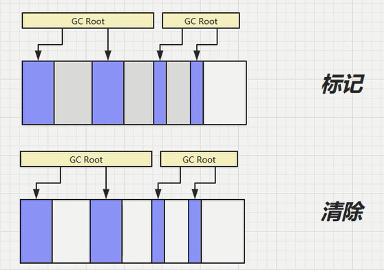
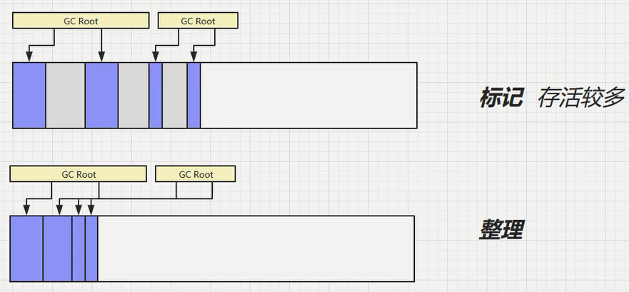
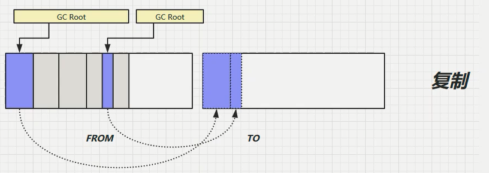
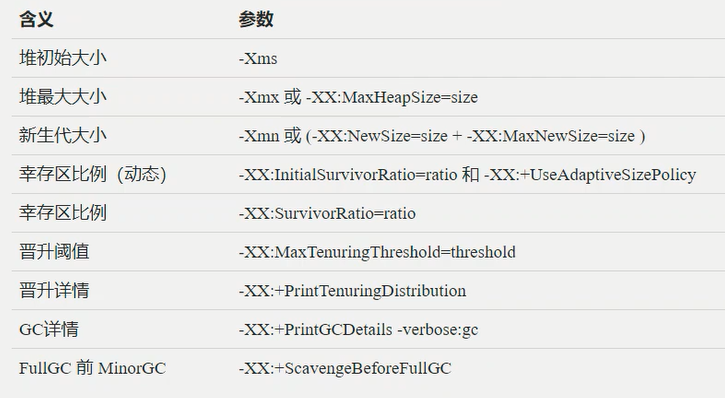
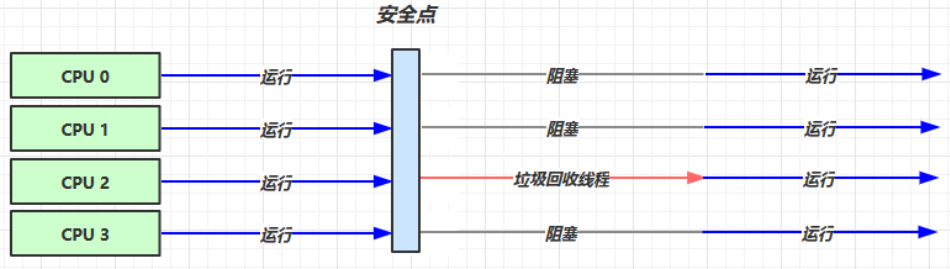
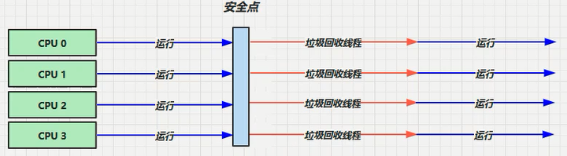
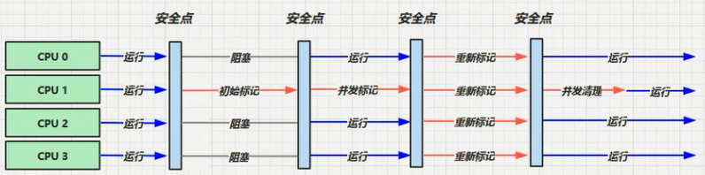
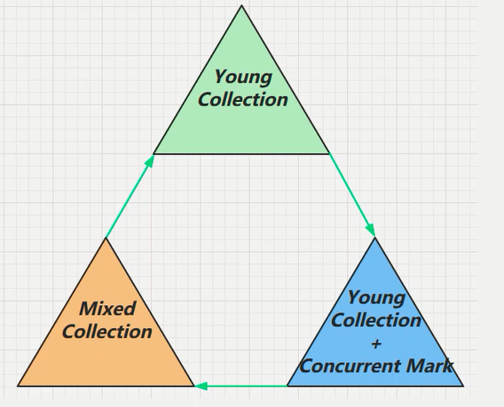
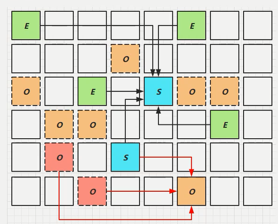
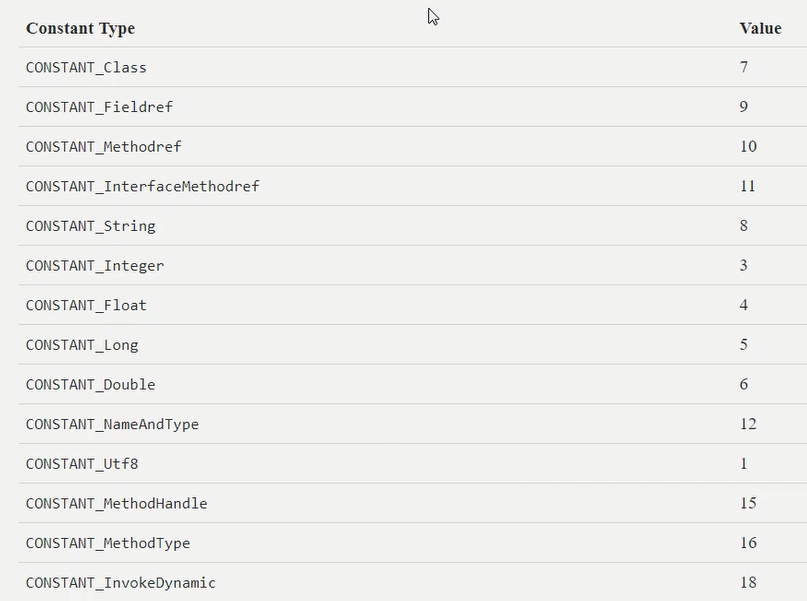

# JVM

Java Virtual Machine：Java虚拟机，Java程序的运行环境（Java二进制字节码的运行环境）。使用JVM的好处：

1. 一次编写，到处运行。
2. 自动内存管理、垃圾回收。
3. 数组下标越界检查。
4. 多态。

为什么学习JVM：面试、理解底层的实现原理、（是中高级必备知识）。（HotSpot）


# JVM内存结构

## 程序计时器

Program Counter Register 程序计数器（物理层面是通过寄存器实现）：用于记住下一条jvm指令的执行地址。（**是线程私有，唯一一个不会存在内存溢出的**）

源代码 ===> 编译为二进制字节码 ===> 解释器从程序计数器拿到执行地址并将指令翻译为机器码。（是边解释边执行还是解释完再执行？）


## 虚拟机栈

**Java Virtual Machine Stacks，Java 虚拟机栈：**

1. 每个线程在运行时需要的内存，称为虚拟机栈（栈）。
2. 每个栈由多个栈帧（Frame）组成，对应着每次**方法调用时所占用的内存**。
3. 每个线程只能有一个活动栈帧，对应着当前正在执行的那个方法。
4. 虚拟机栈的内存：
   - Linux、macOS、Oracle Solaris/x64 都是1024KB。
   - Windows系统下，根据其虚拟内存来决定虚拟机栈的内存。

**问题辨析：**

1. 垃圾回收是否涉及栈内存？
   - 不会涉及，因为栈帧内存涉及的是方法的调用，当方法执行完毕相应的栈帧就会释放。
2. 栈内存分配越大越好吗？
   - 并不是，栈内存越大，会导致线程数变少。
3. 方法内的局部变量是否线程安全？
   - 如果方法内的局部变量没有逃离方法的作用范围（不返回这个变量值），那么它是线程安全的。
   - 如果是局部变量（形参）引用了对象，且该对象是逃离方法的作用范围的，那么需要考虑线程安全。
   - （形参是局部变量）

**栈内存溢出：**

1. 栈帧过多导致栈内存溢出。
2. 栈帧过大导致栈内存溢出。

**线程运行诊断：**

CPU占用过多：

1. 用top定位哪个进程对cpu的占用过高。
2. `ps H -eo pid,tid,%cpu | grep 进程id`：用ps命令进一步定位是哪个线程引起的cpu占用过高。
3. `jstack 进程id`：可以根据线程id找到有问题的线程，然后通过jstack进一步定位到问题代码的源码行号。

执行后迟迟得不到结果：


## 本地方法栈

Native Method Stacks，本地方法栈：JVM调用本地方法时，给本地方法提供的内存空间。

本地方法：不是由Java代码编写的方法，用C或C++编写的与操作系统底层API打交道的方法。

## 堆

堆和方法区都是线程共享的区。

Heap，堆：通过 new 关键字，创建对象都会使用堆内存。

1. 堆是线程共享的，堆中对象都需要考虑线程安全的问题。
2. 堆有垃圾回收机制。

**堆内存溢出：**`java.lang.OutOfMemoryError: Java heap space`——堆内存溢出

```java
public static void main(String[] args) {
    List list = new ArrayList();
    int count = 0;
    String str = "hello";
    try {
        while (true){
            list.add(str);
            str = str + str;
            count++;
        }
    }catch (Exception e){
        e.getMessage();
    }finally {
        System.out.println(count);
    }
}
```

排查堆内存问题，可以将堆内存设置小一点，便于暴露。

**堆内存诊断：**（命令行）

1. jps工具：（直接执行`jps`）查看当前系统中有哪些 java 进程，会显示出进行id。
2. jmap工具：查看堆内存占用情况，指令：`jmap - heap 进程id`。
3. jconsole工具：图形界面的，多功能的监测工具，可以连续监测，直接执行`jconsole`。
4. jvisualvm：用可视化的方式展示虚拟机。

## 方法区

### 基本

**方法区的定义：**

最权威的定义：[Chapter 2. The Structure of the Java Virtual Machine (oracle.com)](https://docs.oracle.com/javase/specs/jvms/se8/html/jvms-2.html#jvms-2.5.4)。

1. 方法区是所有JVM线程共享。（逻辑上和堆类似，1.8之前是用JVM中堆内存实现，1.8后是用操作系统的本地内存实现）
2. 方法区在虚拟机启动的时候创建。
3. 方法区内存溢出时，也会抛出一个`OutOfMemberError`。
4. 存储着诸如运行时常量池、成员变量和方法数据等类结构，还存储着方法、构造函数的代码，包括类中使用的特殊方法和实例初始化和界面初始化。

**方法区组成：**

1.6版本，方法区用永久代实现；1.8，方法区用元空间实现。如下内存结构（常量池是指运行时常量池）：


**方法区内存溢出：**


### 运行时常量池

二进制字节码：包含了类基本信息、常量池、类方法定义（方法里包括了虚拟机指令）。

`javap -v xxx.class`：显示反编译后的详细信息。

1. 常量池，就是一张表，虚拟机指令根据这张常量表找到要执行的类名、方法名、参数类型、字面量等信息 。（.class中）
2. 运行时常量池，常量池是 *.class 文件中的，当该类被加载，它的常量池信息就会加载进运行时常量池，并把里面的符号地址变为真实地址。（JVM中）

**StringTable（运行时常量池的一个组成部分，也称为字符串池、串池，底层是哈希表）：**

```java
public static void main(String[] args){
    String s1 = "a";
    String s2 = "a";
    // 串池中创建 ab
    String s3 = "ab";
    // new StringBuilder().append("a").append("b").toString() ===> s4 在堆中
    String s4 = s1 + s2; 
    // 上面的s3已经在串池中创建ab，这是会直接从串池拿到 ab 给 s5 即不会创建新对象 
    // 这是javac在编译期间的优化，结果在编译器已经确定为ab了
    String s5 = "a" + "b"; 
}
// javap -v xxx.class 反编译可查看过程
```

字符串延迟加载：执行到哪就加载哪个字符串对象。

StringTable的特性：

1. 常量池中的字符串仅是符号，第一次用到时才变为对象。
2. 利用串池的机制，来避免重复创建字符串对象。
3. 字符串变量拼接的原理是 StringBuilder （1.8）。
4. 字符串常量拼接的原理是编译期优化。
5. 可以使用 intern 方法，主动将串池中还没有的字符串对象放入串池：
   1. 1.8版本 将这个字符串对象尝试放入串池，如果有则并不会放入，如果没有则放入串池， 会把串池中的对象返回
   2. 1.6版本 将这个字符串对象尝试放入串池，如果有则并不会放入，如果没有会把此对象复制一份，放入串池， 会把串池中的对象返回  

**StringTable的位置：**

1. 在1.6版本时，StringTable在运行时常量池中。
2. 在1.8版本时，StringTable在堆中。（优化，堆由垃圾回收机制，会回收串池中的垃圾）
3. 如果要证明的话，那就使得内存溢出即可验证。（1.6-永久代内存溢出；1.8-堆内存溢出）

**StringTable 垃圾回收：**

**StringTable 性能调优：**

1. `-XX:StringTableSize=20000`：如果系统里字符串常量很，可以适当地调大StringTableSize，使hash分布更好，减少哈希冲突。
2. 考虑是否将字符串入串池。（串池中不会存在重复字符）

## 直接内存

Direct Memory：

1. 常见于 NIO 操作时，用于数据缓冲区。
2. 分配回收成本较高，但读写性能高。
3. 不受 JVM 内存回收管理，是操作系统的内存。

.......

# 垃圾回收

## 判断对象存活

**1、判断对象是否能被回收的算法**

引用计数法：会在每一个对象上记录这个对象被引用的次数，只要有任何一个对象引用了1次对象，这个对象的计数器就 +1，取消对这个对象的引用时，计数器就 -1。任何一个时刻，如果该对象的计数器为0，那么这个对象就是可以回收的。（弊端：不能处理循环引用）

可达性分析算法：（Java 虚拟机中的垃圾回收器采用可达性分析来探索所有存活的对象）

- 通过一些被称为根节点（GC Roots）的对象作为起点，从这些节点开始向下搜索，搜索走过的路径被称为引用链（Reference Chain)，当一个对象没有任何引用链连接到GC Roots时（即从GC Roots节点到该节点不可达），则证明该对象是不可用的。
- 在JVM中，就是通过扫描堆中的对象，看是否能够沿着 GC Roots对象 为起点的引用链找到该对象，找不到即表示不可达，那么就可以回收。

什么是GC Roots？哪些可以是GC Roots？：（根对象的特点是时刻存活着的对象，GC Roots就是一组必须活跃的引用）

1. GC Roots本身不是对象，而是代替对象的引用，GC Roots是引用的集合。
2. 可以作为GC Roots引用点的可以是以下四个：
   1. 虚拟机栈（栈帧中的本地变量表）中引用的对象。
   2. 方法区中类静态属性引用的对象。
   3. 方法区中常量引用的对象。
   4. 本地方法栈中 JNI（即一般说的 Native 方法）引用的对象。
   5. （凡是被常量、静态变量、全局变量、运行时方法中的变量直接引用的对象，原则上不能被GC释放。）
3. 常见的GC Root：
   1. 通过System Class Loader或者Boot Class Loader加载的class对象(通过自定义类加载器加载的class不一定是GC Root)。
   2. 处于激活状态的线程。
   3. 栈中的对象。
   4. JNI栈中的对象、JNI中的全局对象。
   5. 正在被用于同步的各种锁对象。
   6. JVM自身持有的对象，比如系统类加载器等。

[JVM 中的 GC Roots 和可达链 - 知乎 (zhihu.com)](https://zhuanlan.zhihu.com/p/181694184#:~:text=Java 进行GC的时候会从GC root进行可达性判断，常见的GC Root有如下： 通过System,Class Loader或者Boot Class Loader加载的class对象 (通过自定义类加载器加载的class不一定是GC Root))

[ GC Roots 是什么？哪些对象可以作为 GC Root？看完秒懂！_一直Tom猫的博客-CSDN博客_gc roots撖寡情](https://blog.csdn.net/weixin_38007185/article/details/108093716)

[GC分析中提到的根对象是什么 - arg - 博客园 (cnblogs.com)](https://www.cnblogs.com/wusong/p/3282283.html)

Mmeory Analyzer（MAT）工具：是 **eclipse 的一个插件** (MAT 也可以单独 使用)，它分析大内存的 dump 文件时，可以非常直观的看到各个对象在堆空间中所占用的内存大小、类实例数量、对象引用关系、利用 OQL 对象查询，以及可以很方便的找出对象 GC Roots 的相关信息。

**2、Java中的引用**（请你说说关于Java中的四种引用？（前四种））

1. 强引用：平时开发中使用的大部分引用都属于强引用。强引用不会被垃圾回收器回收，只有当GC Root对其的引用都断开时才会被回收。
2. 软引用：一个对象只有软引用，内存空间充足是不会被回收，内存空间不够时就会被回收。只要垃圾回收器没有回收它，该对象就可以被程序使⽤。软引⽤可⽤来实现内存敏感的高速缓存。  （软引⽤可以和⼀个引⽤队列（ReferenceQueue）联合使⽤，如果软引⽤所引⽤的对象被垃圾回收， JAVA虚拟机就会把这个软引⽤加⼊到与之关联的引⽤队列中）
3. 弱引用：只具有弱引用的对象，不管当前内存空间足够与否，都会被回收。不过，由于垃圾回收器是⼀个优先级很低的线程， 因此不⼀定会很快发现那些只具有弱引⽤的对象。弱引⽤可以和⼀个引⽤队列（ReferenceQueue）联合使用，如果弱引用所引⽤的对象被垃圾回收， Java虚拟机就会把这个弱引用加⼊到与之关联的引用队列中。
4. 虚引用：必须配合引用队列使用。"虚引⽤"顾名思义，就是形同虚设，与其他⼏种引⽤都不同，虚引⽤并不会决定对象的⽣命周期。如果⼀个对象仅持有虚引⽤，那么它就和没有任何引⽤⼀样，在任何时候都可能被垃圾回收。
5. 终结器引用：必须配合引用队列使用。当某个对象没有被强引用时，虚拟机会为该对象创建一个终结器引用，当该对象被垃圾回收时就会终结其引用就被加入引用队列，此时对象还未被回收，直到一个finallizeHandler线程查看引用队列，然后就会通过终结器引用找到要垃圾回收的对象并执行它的finallize()方法，到下一次垃圾回收此对象就会被回收掉。（因此不推荐使用finallize()方法）

软引用引用：P54


软引用与引用队列：P55


弱引用示例：P56

## 垃圾回收算法

### 常见算法

常见的GC回收算法主要包括引用计数算法、标记清除算法、复制算法、标记压缩算法、分代算法以及分区算法。

**1、 Mark-Sweep（标记-清除）算法：**（速度快，会造成内存碎片）

先标记出所需回收的对象，在标记完成后统一回收掉所有被标记的对象，它的标记过程其实就是前面的可达性分析算法中判定垃圾对象的标记过程。



**2、Mark-Compact（标记-整理）算法：**（速度慢。但不会造成内存碎片）

该算法标记阶段和Mark-Sweep一样，但是在完成标记之后，它不是直接清理可回收对象，而是将存活对象都移动到内存的一端，然后再清理掉端边界以外的内存。



**3、Copying（复制）算法：**（不会造成内存碎片，但需要占用双倍内存空间，内存使用率降低）

将内存区划分为相等的两个区（from、to两个区），当一块用完的时候将活着的对象复制到另一块内存上，然后再把已使用的form内存空间一次清理掉，之后to区和from去交换一下位置（to变from，from变to）。缺点：内存使用率不高，只有原来的一半。



### JVM GC

**4、分代垃圾回收机制：**

分代算法中内存划分：

1. 新生代：细分为三个区：Eden Spae、Survivor 1、Survivor 1。（用完就丢弃的对象就放在新生代）
2. 老年代。（长时间使用的对象就放到老年代）
3. 这样就可以根据生命周期的不同特点来进行不同的垃圾回收策略，新生代的垃圾回收就发生得比较频繁，老年代的就比较久一次才发生。


1. **Minor GC**：是指发生在新生代的 GC，因为 Java 对象大多都是朝生夕死，所有 Minor GC 非常频繁，一般回收速度也非常快。
2. **Major GC/Full GC**：是指发生在老年代的 GC，出现了 Major GC 通常会伴随至少一次 Minor GC。Major GC 的速度通常会比 Minor GC 慢 10 倍以上。

分代回收机制：

1. 创建新的对象时，默认放到Eden Space。
2. 当创建新对象，发现Eden Space内存不足以存放时，触发Minor GC，此时就会将不能被回收的对象复制到幸存区To，并且幸存对象的年龄 +1，然后清空Eden Space，幸存区To和幸存区From位置互换。
   - minor gc 会引发 stop the world，暂停其它用户的线程，等垃圾回收结束，用户线程才恢复运行 。
3. 接下来如果Eden Space内存不足存放新创建对象时，再次触发Minor GC，此时将Eden Space和幸存区From的不能被回收的对象复制存入幸存区To（对象年龄都+1），然后清空Eden Space、幸存区From，幸存区To和幸存区From位置互换。
   - 当对象寿命超过阈值时，会晋升至老年代，最大年龄（寿命）是15（4bit—1111）。
   - 大对象直接晋升至老年代（新生代存不下大对象，如果老年代存放得下，会直接存放到老年代，不会触发GC；如果新生代和老年代都存放不下，先触发GC（Full GC间接触发）、再触发Full GC，如果自救不成功则堆内存溢出）。
4. 当老年代内存不足时会先触发Minor GC，如果之后空间仍然不足才会触发Full GC，对新生、老年都做一次GC。


### GC_相关VM参数



GC分析：P64-P67

## 几种垃圾回收器

1. 串行垃圾回收器：单线程，堆内存较少，适合个人电脑。
2. 吞吐量优先的垃圾回收器：多线程，堆内存较大，多核 cpu；让单位时间内STW （stop the world）的时间最短，垃圾回收时间占比最低，这样就称吞吐量高。
3. 响应时间优先的垃圾回收器：多线程，堆内存较大，多核 cpu；尽可能让单次 STW 的时间最短。

开启串行垃圾回收器：`-XX:+UseSerialGC = Serial + SerialOld  `，Serial 是新生代的（采用复制算法），SerialOld是老年代的（采用标记+整理算法）。



开启吞吐量优先的垃圾回收器：（jdk1.8默认开启的就是这个）

```xml
<!-- 开启其中一个另一个会自动开启，新生代是复制算法，老年代是标记整理算法 -->
-XX:+UseParallelGC ~ -XX:+UseParallelOldGC
<!-- 采用自适应的策略调整新生代的大小 开启后会动态地调整Eden Space 和幸存区的大小 -->
-XX:+UseAdaptiveSizePolicy
<!-- 根据设定的目标来调整堆的大小来达到原设定的目标 -->
<!-- GCTimeRatio用于调整垃圾回收时间占总运行时间的占比 1/1+ratio 
	 例如ratio=99 1/1+99=0.01 如果运行了100分钟，那么垃圾回收的时间得满足100 * 1%=1分钟
 	 如果不满足则调整堆大小
-->
-XX:GCTimeRatio=ratio
<!-- 垃圾回收最大暂停时间，和GCTimeRatio是冲突的 -->
-XX:MaxGCPauseMillis=ms
<!-- 并行GC线程数 -->
-XX:ParallelGCThreads=n
```



开启响应时间优先的垃圾回收器：

```xml
<!-- 并发的，基于标记清除算法——老年代，新生代——复制算法 -->
<!-- 如果老年代并发失败，那么会退化到单线程的SerialOld（标记整理的老年代垃圾回收器） -->
-XX:+UseConcMarkSweepGC ~ -XX:+UseParNewGC ~ SerialOld
<!-- ParallelGCThreads：并行垃圾回收线程数，和CPU核数一样  
	 ConcGCThreads：并发GC线程数，一般设置为并行线程数的1/4 -->
-XX:ParallelGCThreads=n ~ -XX:ConcGCThreads=threads
<!-- 控制何时进行ConcMarkSweepGC -->
-XX:CMSInitiatingOccupancyFraction=percent
<!--  -->
-XX:+CMSScavengeBeforeRemark
```



## G1-Garbage First垃圾回收器

Garbage First时间线：2004 论文发布、2009 JDK 6u14 体验、2012 JDK 7u4 官方支持、2017 成为JDK 9 默认的。

适用场景：同时注重吞吐量（Throughput）和低延迟（Low latency），默认的暂停目标是 200 ms；超大堆内存，会将堆划分为多个大小相等的 Region；整体上是 标记+整理 算法，两个区域之间是 复制 算法。

相关 JVM 参数：

```xml
-XX:+UseG1GC
-XX:G1HeapRegionSize=size
<!-- 垃圾回收最大暂停时间 -->
-XX:MaxGCPauseMillis=time  
```

### G1垃圾回收阶段



G1会将对堆内存划分为一个个大小相等的区域，每一个区域都可以独立作为Eden Space 、幸存区、老年代：


第一阶段——Young Collection（新生代垃圾收集）：Eden Space 总区域会设置为一定大小的，当Eden Space的区域被占满时就会触发新生代垃圾回收，新生代触发时都会触发一个stop the world，会以拷贝算法将幸存对象放进幸存区，当幸存区的对象较多或对象的年龄超过一定的时间，这时又会触发新生代的垃圾回收，将幸存区中符合的一部分晋升到老年代，不符合的幸存对象就会拷贝进另一个幸存区， 

第二阶段——Young Collection + CM  ：

在 Young GC 时会进行 GC Root 的初始标记；当老年代占用堆空间比例达到阈值时，就会进行并发标记（不会 STW），阈值由这个 JVM 参数决定：`-XX:InitiatingHeapOccupancyPercent=percent` （默认45%）。

第三阶段——Mixed Collection（混合收集）：会对Eden Space(E)、幸存区(S)、老年区(O)这三个区进行全面垃圾回收。

- 最终标记（Remark）会 STW。
- 拷贝存活（Evacuation）会 STW  。



 E区幸存对象复制到S区，符合晋升条件的就会晋升到老年区

### ELSE

1、FullGC

2、Young Collection 跨代引用

3、Remark

4、

# 类加载与字节码

## 类文件结构

```java
package cn.itcast.jvm.t5;
// HelloWorld 示例
public class HelloWorld {
    public static void main(String[] args) {
        System.out.println("hello world");
    }
}
```

执行 javac -parameters -d . HellowWorld.java编译为 HelloWorld.class 后是这个样子的：

```sh
root@localhost ~]# od -t xC HelloWorld.class
0000000 ca fe ba be 00 00 00 34 00 23 0a 00 06 00 15 09
0000020 00 16 00 17 08 00 18 0a 00 19 00 1a 07 00 1b 07
0000040 00 1c 01 00 06 3c 69 6e 69 74 3e 01 00 03 28 29
0000060 56 01 00 04 43 6f 64 65 01 00 0f 4c 69 6e 65 4e
0000100 75 6d 62 65 72 54 61 62 6c 65 01 00 12 4c 6f 63
0000120 61 6c 56 61 72 69 61 62 6c 65 54 61 62 6c 65 01
0000140 00 04 74 68 69 73 01 00 1d 4c 63 6e 2f 69 74 63
0000160 61 73 74 2f 6a 76 6d 2f 74 35 2f 48 65 6c 6c 6f
0000200 57 6f 72 6c 64 3b 01 00 04 6d 61 69 6e 01 00 16
0000220 28 5b 4c 6a 61 76 61 2f 6c 61 6e 67 2f 53 74 72
0000240 69 6e 67 3b 29 56 01 00 04 61 72 67 73 01 00 13
0000260 5b 4c 6a 61 76 61 2f 6c 61 6e 67 2f 53 74 72 69
0000300 6e 67 3b 01 00 10 4d 65 74 68 6f 64 50 61 72 61
0000320 6d 65 74 65 72 73 01 00 0a 53 6f 75 72 63 65 46
0000340 69 6c 65 01 00 0f 48 65 6c 6c 6f 57 6f 72 6c 64
0000360 2e 6a 61 76 61 0c 00 07 00 08 07 00 1d 0c 00 1e
0000400 00 1f 01 00 0b 68 65 6c 6c 6f 20 77 6f 72 6c 64
0000420 07 00 20 0c 00 21 00 22 01 00 1b 63 6e 2f 69 74
0000440 63 61 73 74 2f 6a 76 6d 2f 74 35 2f 48 65 6c 6c
0000460 6f 57 6f 72 6c 64 01 00 10 6a 61 76 61 2f 6c 61
0000500 6e 67 2f 4f 62 6a 65 63 74 01 00 10 6a 61 76 61
0000520 2f 6c 61 6e 67 2f 53 79 73 74 65 6d 01 00 03 6f
0000540 75 74 01 00 15 4c 6a 61 76 61 2f 69 6f 2f 50 72
0000560 69 6e 74 53 74 72 65 61 6d 3b 01 00 13 6a 61 76
0000600 61 2f 69 6f 2f 50 72 69 6e 74 53 74 72 65 61 6d
0000620 01 00 07 70 72 69 6e 74 6c 6e 01 00 15 28 4c 6a
0000640 61 76 61 2f 6c 61 6e 67 2f 53 74 72 69 6e 67 3b
0000660 29 56 00 21 00 05 00 06 00 00 00 00 00 02 00 01
0000700 00 07 00 08 00 01 00 09 00 00 00 2f 00 01 00 01
0000720 00 00 00 05 2a b7 00 01 b1 00 00 00 02 00 0a 00
0000740 00 00 06 00 01 00 00 00 04 00 0b 00 00 00 0c 00
0000760 01 00 00 00 05 00 0c 00 0d 00 00 00 09 00 0e 00
0001000 0f 00 02 00 09 00 00 00 37 00 02 00 01 00 00 00
0001020 09 b2 00 02 12 03 b6 00 04 b1 00 00 00 02 00 0a
0001040 00 00 00 0a 00 02 00 00 00 06 00 08 00 07 00 0b
0001060 00 00 00 0c 00 01 00 00 00 09 00 10 00 11 00 00
0001100 00 12 00 00 00 05 01 00 10 00 00 00 01 00 13 00
0001120 00 00 02 00 14
```

JVM规范下的类文件结构：

```java
// u4 表示前四个字节 u2表示前两个字节
ClassFile {
    u4	 			magic; // 模数
    u2	 			minor_version; // 小版本号
    u2	 			major_version; // 主版本号
    u2	 			constant_pool_count; // 常量池信息
    cp_info	 		constant_pool[constant_pool_count-1]; // 常量池信息
    u2	 			access_flags; // 访问修饰符
    u2 				this_class; // 类自己的包名
    u2 				super_class; // 父类信息
    u2 				interfaces_count; // 接口信息
    u2 				interfaces[interfaces_count];
    u2 				fields_count; // 类成员、静态变量的信息
    field_info 		fields[fields_count];
    u2 				methods_count; // 类成员方法、静态方法信息
    method_info 	methods[methods_count];
    u2 				attributes_count; // 附加属性信息
    attribute_info 	attributes[attributes_count];
}
```

### 1、魔数

魔数：0~3字节，表示是否是class类型的文件（每一个Java Class文件都是以0x CAFEBABE开头的。Java这么做的原因就是为了快速判断一个文件是不是有可能为class文件，以及这个class文件有没有受损（文件受损，文件开头受损的可能性最大））

```sh
# cafabebe
0000000 ca fe ba be 00 00 00 34 00 23 0a 00 06 00 15 09
```

### 2、版本

4~7字节表示类的版本 （00 34（52） 表示是 JDK8，53就是JDK9）。

```sh
# 00 00 00 34 = 3*16+4=52
0000000 ca fe ba be 00 00 00 34 00 23 0a 00 06 00 15 09
```

### 3、常量池



如下，8~9 字节表示常量池长度，00 23 （35） 表示常量池有 #1~#34项，注意 #0 项不计入，也没有值

```sh
# 00 23 = 2*16+3=35，表示常量池有#1~#34项，#0不计入也没有值
0000000 ca fe ba be 00 00 00 34 00 23 0a 00 06 00 15 09
```

如下第 #1项是：0a（十进制为10），表示一个 Method 信息，接下来的四个字节就表示方法的具体信息（00 06 和 00 15（21） 表示它引用了常量池中 #6 和 #21 项来获得这个方法的【所属类】和【方法名】）。

```sh
0000000 ca fe ba be 00 00 00 34 00 23 0a 00 06 00 15 09
```

如下，第 #2项 09 表示一个 Field 信息，00 16（22）和 00 17（23） 表示它引用了常量池中 #22 和 # 23 项来获得这个成员变量的【所属类】和【成员变量名】

```sh
# 第 #2 项：09 
0000000 ca fe ba be 00 00 00 34 00 23 0a 00 06 00 15 09
0000020 00 16 00 17 08 00 18 0a 00 19 00 1a 07 00 1b 07
```


# ~~编译JDK~~

[jdk/jdk12: 06222165c35f / (java.net)](https://hg.openjdk.java.net/jdk/jdk12/file/06222165c35f)，点击browse后就跳转到源码目录，然后选择下载何种压缩包（zip、gz、bz2）。

在CentOS7上编译。

**1.gcc/g++的升级**

由于该系统自带的gcc/g++版本过低（4.8.5），因此需要升级gcc/g++，这里给出一个便捷的方法：

```bash
yum install centos-release-scl
yum install devtoolset-9-gcc* # 注：这里9是gcc的大版本号，可以换成其他版本
scl enable devtoolset-9 bash
mv /usr/bin/gcc /usr/bin/gcc-4.8.5
ln -s /opt/rh/devtoolset-9/usr/bin/gcc /usr/bin/gcc # 创建软连接，替换原来的gcc
mv /usr/bin/g++ /usr/bin/g++-4.8.5
ln -s /opt/rh/devtoolset-9/usr/bin/g++ /usr/bin/g++ # 替换原来的g++
gcc --version
g++ --version
# 注意/opt/rh/devtoolset-9/usr/bin/gcc 和 /opt/rh/devtoolset-9/usr/bin/g++ 
# 可用locate g++ locate gcc 找到gcc和g++所在地址
```

记录一下：g++的安装命令：

```bash
yum install gcc-c++ libstdc++-devel
```

**2.JDK的升级**

首先卸载自带的JDK：

```bash
rpm -qa | grep java # 查看已有jdk版本
yum -y remove java-1.7.0-openjdk* # 删除1.7
yum -y remove java-1.8.0-openjdk* # 删除1.8
java -version # 检查是否删除干净
```

然后，去Oracle官网下载一个JDK11，压缩包版，放入`/opt`目录。

然后安装这个JDK，安装在`/usr/local/java`下放置这个JDK：

```bash
tar -zxvf jdk-11.0.13_linux-x64_bin.tar.gz # 解压
mv /opt/jdk-11.0.13 /usr/local/java # 移动
vim /etc/profile # 修改配置文件，加入的内容如下图，9版本后不要再配CLASSPATH
source /etc/profile
```


（这里我持怀疑态度，后面再查查看）这里有一个坑，就是网上的教程一般会把环境变量写在/etc/profile这个文件下，但是这并不是永久有效的，想要让它永久有效，就得写在.bashrc文件中：()

```bash
locate .bashrc # 查看该文件在哪 root目录下有一个 home里面的用户目录下也有一个
vim .bashrc # 插入和上面一样的内容即可
source .bashrc
```

**3.检测配置**

解压放在`/opt`目录的jdk12：

```bash
tar -zxvf jdk12-06222165c35f.tar.gz
```

进入解压目录下，切换为root用户，就可以开始编译了。为保证所需环境配置符合，先检查一下环境是否配置好：

```bash
bash configure
```

执行后出现错误：


g++的原因，找了许久后，发现是我在gcc/g++那一步出错：ln -s /opt/rh/devtoolset-9/usr/bin/g++ /usr/bin/g++ 弄成了 `ln -s /opt/rh/devtoolset-9/root/bin/g++ /usr/bin/g++`，通过`locate g++` 发现不是root，而是usr。修改后再次执行 `bash configure`，终于不再报error，如下：


**4.编译**

执行：

```bash
make clean
make images
```

然后出现错误：


出现这种错误的原因是gcc版本太高，gcc对这些行为进行了警告（（这种特性从gcc8开始，如果你是更早的符合要求的gcc，可能不会出现这样的问题）），为了继续编译，需要重新指定configure选项，忽略这些警告；依次执行以下操作：

```bash
make clean
make dist-clean
bash configure --disable-warnings-as-errors
make images
```

n分钟后，编译成功：


编译的产物在build文件夹下的`linux-x86_64-server-release`文件夹，在这个文件夹中，有名为jdk的文件夹，cd进去，就是我们熟悉的JDK目录了。运行`./bin/java -version`可查看当前JDK版本号。
