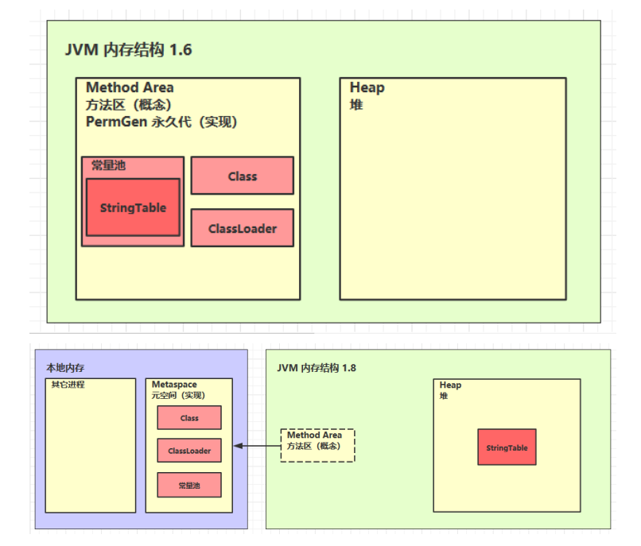

# JVM

Java Virtual Machine：Java虚拟机，Java程序的运行环境（Java二进制字节码的运行环境）。使用JVM的好处：

1. 一次编写，到处运行。
2. 自动内存管理、垃圾回收。
3. 数组下标越界检查。
4. 多态。

为什么学习JVM：面试、理解底层的实现原理、（是中高级必备知识）。（HotSpot）


# JVM内存结构

## 程序计时器

Program Counter Register 程序计数器（物理层面是通过寄存器实现）：用于记住下一条jvm指令的执行地址。（**是线程私有，唯一一个不会存在内存溢出的**）

源代码 ===> 编译为二进制字节码 ===> 解释器从程序计数器拿到执行地址并将指令翻译为机器码。（是边解释边执行还是解释完再执行？）


## 虚拟机栈

**Java Virtual Machine Stacks，Java 虚拟机栈：**

1. 每个线程在运行时需要的内存，称为虚拟机栈（栈）。
2. 每个栈由多个栈帧（Frame）组成，对应着每次**方法调用时所占用的内存**。
3. 每个线程只能有一个活动栈帧，对应着当前正在执行的那个方法。
4. 虚拟机栈的内存：
   - Linux、macOS、Oracle Solaris/x64 都是1024KB。
   - Windows系统下，根据其虚拟内存来决定虚拟机栈的内存。

**问题辨析：**

1. 垃圾回收是否涉及栈内存？
   - 不会涉及，因为栈帧内存涉及的是方法的调用，当方法执行完毕相应的栈帧就会释放。
2. 栈内存分配越大越好吗？
   - 并不是，栈内存越大，会导致线程数变少。
3. 方法内的局部变量是否线程安全？
   - 如果方法内的局部变量没有逃离方法的作用范围（不返回这个变量值），那么它是线程安全的。
   - 如果是局部变量（形参）引用了对象，且该对象是逃离方法的作用范围的，那么需要考虑线程安全。
   - （形参是局部变量）

**栈内存溢出：**

1. 栈帧过多导致栈内存溢出。
2. 栈帧过大导致栈内存溢出。

**线程运行诊断：**

CPU占用过多：

1. 用top定位哪个进程对cpu的占用过高。
2. `ps H -eo pid,tid,%cpu | grep 进程id`：用ps命令进一步定位是哪个线程引起的cpu占用过高。
3. `jstack 进程id`：可以根据线程id找到有问题的线程，然后通过jstack进一步定位到问题代码的源码行号。

执行后迟迟得不到结果：

## 本地方法栈

Native Method Stacks，本地方法栈：JVM调用本地方法时，给本地方法提供的内存空间。

本地方法：不是由Java代码编写的方法，用C或C++编写的与操作系统底层API打交道的方法。

## 堆

堆和方法区都是线程共享的区。

Heap，堆：通过 new 关键字，创建对象都会使用堆内存。

1. 堆是线程共享的，堆中对象都需要考虑线程安全的问题。
2. 堆有垃圾回收机制。

**堆内存溢出：**`java.lang.OutOfMemoryError: Java heap space`——堆内存溢出

```java
public static void main(String[] args) {
    List list = new ArrayList();
    int count = 0;
    String str = "hello";
    try {
        while (true){
            list.add(str);
            str = str + str;
            count++;
        }
    }catch (Exception e){
        e.getMessage();
    }finally {
        System.out.println(count);
    }
}
```

排查堆内存问题，可以将堆内存设置小一点，便于暴露。

**堆内存诊断：**（命令行）

1. jps工具：（直接执行`jps`）查看当前系统中有哪些 java 进程，会显示出进行id。
2. jmap工具：查看堆内存占用情况，指令：`jmap - heap 进程id`。
3. jconsole工具：图形界面的，多功能的监测工具，可以连续监测，直接执行`jconsole`。
4. jvisualvm：用可视化的方式展示虚拟机。

## 方法区

### 基本

**方法区的定义：**

最权威的定义：[Chapter 2. The Structure of the Java Virtual Machine (oracle.com)](https://docs.oracle.com/javase/specs/jvms/se8/html/jvms-2.html#jvms-2.5.4)。

1. 方法区是所有JVM线程共享。（逻辑上和堆类似，1.8之前是用JVM中堆内存实现，1.8后是用操作系统的本地内存实现）
2. 方法区在虚拟机启动的时候创建。
3. 方法区内存溢出时，也会抛出一个`OutOfMemberError`。
4. 存储着诸如运行时常量池、成员变量和方法数据等类结构，还存储着方法、构造函数的代码，包括类中使用的特殊方法和实例初始化和界面初始化。

**方法区组成：**

1.6版本，方法区用永久代实现；1.8，方法区用元空间实现。如下内存结构（常量池是指运行时常量池）：



**方法区内存溢出：**


### 运行时常量池

二进制字节码：包含了类基本信息、常量池、类方法定义（方法里包括了虚拟机指令）。

`javap -v xxx.class`：显示反编译后的详细信息。

1. 常量池，就是一张表，虚拟机指令根据这张常量表找到要执行的类名、方法名、参数类型、字面量等信息 。（.class中）
2. 运行时常量池，常量池是 *.class 文件中的，当该类被加载，它的常量池信息就会加载进运行时常量池，并把里面的符号地址变为真实地址。（JVM中）

**StringTable（运行时常量池的一个组成部分，也称为字符串池、串池，底层是哈希表）：**

```java
public static void main(String[] args){
    String s1 = "a";
    String s2 = "a";
    // 串池中创建 ab
    String s3 = "ab";
    // new StringBuilder().append("a").append("b").toString() ===> s4 在堆中
    String s4 = s1 + s2; 
    // 上面的s3已经在串池中创建ab，这是会直接从串池拿到 ab 给 s5 即不会创建新对象 
    // 这是javac在编译期间的优化，结果在编译器已经确定为ab了
    String s5 = "a" + "b"; 
}
// javap -v xxx.class 反编译可查看过程
```

字符串延迟加载：执行到哪就加载哪个字符串对象。

StringTable的特性：

1. 常量池中的字符串仅是符号，第一次用到时才变为对象。
2. 利用串池的机制，来避免重复创建字符串对象。
3. 字符串变量拼接的原理是 StringBuilder （1.8）。
4. 字符串常量拼接的原理是编译期优化。
5. 可以使用 intern 方法，主动将串池中还没有的字符串对象放入串池：
   1. 1.8版本 将这个字符串对象尝试放入串池，如果有则并不会放入，如果没有则放入串池， 会把串池中的对象返回
   2. 1.6版本 将这个字符串对象尝试放入串池，如果有则并不会放入，如果没有会把此对象复制一份，放入串池， 会把串池中的对象返回  

**StringTable的位置：**

1. 在1.6版本时，StringTable在运行时常量池中。
2. 在1.8版本时，StringTable在堆中。（优化，堆由垃圾回收机制，会回收串池中的垃圾）
3. 如果要证明的话，那就使得内存溢出即可验证。（1.6-永久代内存溢出；1.8-堆内存溢出）

**StringTable 垃圾回收：**

**StringTable 性能调优：**

1. `-XX:StringTableSize=20000`：如果系统里字符串常量很，可以适当地调大StringTableSize，使hash分布更好，减少哈希冲突。
2. 考虑是否将字符串入串池。（串池中不会存在重复字符）

## 直接内存

Direct Memory：

1. 常见于 NIO 操作时，用于数据缓冲区。
2. 分配回收成本较高，但读写性能高。
3. 不受 JVM 内存回收管理，是操作系统的内存。

.......

# 垃圾回收

常见的GC回收算法主要包括引用计数算法、标记清除算法、复制算法、标记压缩算法、分代算法以及分区算法。

**1、判断对象是否能被回收**

引用计数法：会在每一个对象上记录这个对象被引用的次数，只要有任何一个对象引用了1次对象，这个对象的计数器就 +1，取消对这个对象的引用时，计数器就 -1。任何一个时刻，如果该对象的计数器为0，那么这个对象就是可以回收的。

可达性分析算法：

1. Java 虚拟机中的垃圾回收器采用可达性分析来探索所有存活的对象。
2. 扫描堆中的对象，看是否能够沿着 GC Root对象（肯定不能被当作垃圾来回收的对象）为起点的引用链找到该对象，找不到，表示可以回收。

**2、Java中的引用**


# ~~编译JDK~~

[jdk/jdk12: 06222165c35f / (java.net)](https://hg.openjdk.java.net/jdk/jdk12/file/06222165c35f)，点击browse后就跳转到源码目录，然后选择下载何种压缩包（zip、gz、bz2）。

在CentOS7上编译。

**1.gcc/g++的升级**

由于该系统自带的gcc/g++版本过低（4.8.5），因此需要升级gcc/g++，这里给出一个便捷的方法：

```bash
yum install centos-release-scl
yum install devtoolset-9-gcc* # 注：这里9是gcc的大版本号，可以换成其他版本
scl enable devtoolset-9 bash
mv /usr/bin/gcc /usr/bin/gcc-4.8.5
ln -s /opt/rh/devtoolset-9/usr/bin/gcc /usr/bin/gcc # 创建软连接，替换原来的gcc
mv /usr/bin/g++ /usr/bin/g++-4.8.5
ln -s /opt/rh/devtoolset-9/usr/bin/g++ /usr/bin/g++ # 替换原来的g++
gcc --version
g++ --version
# 注意/opt/rh/devtoolset-9/usr/bin/gcc 和 /opt/rh/devtoolset-9/usr/bin/g++ 
# 可用locate g++ locate gcc 找到gcc和g++所在地址
```

记录一下：g++的安装命令：

```bash
yum install gcc-c++ libstdc++-devel
```

**2.JDK的升级**

首先卸载自带的JDK：

```bash
rpm -qa | grep java # 查看已有jdk版本
yum -y remove java-1.7.0-openjdk* # 删除1.7
yum -y remove java-1.8.0-openjdk* # 删除1.8
java -version # 检查是否删除干净
```

然后，去Oracle官网下载一个JDK11，压缩包版，放入`/opt`目录。

然后安装这个JDK，安装在`/usr/local/java`下放置这个JDK：

```bash
tar -zxvf jdk-11.0.13_linux-x64_bin.tar.gz # 解压
mv /opt/jdk-11.0.13 /usr/local/java # 移动
vim /etc/profile # 修改配置文件，加入的内容如下图，9版本后不要再配CLASSPATH
source /etc/profile
```


（这里我持怀疑态度，后面再查查看）这里有一个坑，就是网上的教程一般会把环境变量写在/etc/profile这个文件下，但是这并不是永久有效的，想要让它永久有效，就得写在.bashrc文件中：()

```bash
locate .bashrc # 查看该文件在哪 root目录下有一个 home里面的用户目录下也有一个
vim .bashrc # 插入和上面一样的内容即可
source .bashrc
```

**3.检测配置**

解压放在`/opt`目录的jdk12：

```bash
tar -zxvf jdk12-06222165c35f.tar.gz
```

进入解压目录下，切换为root用户，就可以开始编译了。为保证所需环境配置符合，先检查一下环境是否配置好：

```bash
bash configure
```

执行后出现错误：


g++的原因，找了许久后，发现是我在gcc/g++那一步出错：ln -s /opt/rh/devtoolset-9/usr/bin/g++ /usr/bin/g++ 弄成了 `ln -s /opt/rh/devtoolset-9/root/bin/g++ /usr/bin/g++`，通过`locate g++` 发现不是root，而是usr。修改后再次执行 `bash configure`，终于不再报error，如下：


**4.编译**

执行：

```bash
make clean
make images
```

然后出现错误：


出现这种错误的原因是gcc版本太高，gcc对这些行为进行了警告（（这种特性从gcc8开始，如果你是更早的符合要求的gcc，可能不会出现这样的问题）），为了继续编译，需要重新指定configure选项，忽略这些警告；依次执行以下操作：

```bash
make clean
make dist-clean
bash configure --disable-warnings-as-errors
make images
```

n分钟后，编译成功：


编译的产物在build文件夹下的`linux-x86_64-server-release`文件夹，在这个文件夹中，有名为jdk的文件夹，cd进去，就是我们熟悉的JDK目录了。运行`./bin/java -version`可查看当前JDK版本号。
