# JavaSE_base

前置

书本的思路、他人的思路、自己的思路。

概念理解、用法和应用、联系、功能的原理验证。

人的逻辑指导了人的行为，人们对现实世界的需求逻辑的抽象结合工具实现就有了程序逻辑，而程序逻辑定义了计算机的行为，计算机行为的实现又会影响人们对需求逻辑的抽象。

（建立编程思想）、（提升编程能力）、（提升分析需求、代码实现的能力）。

# Java环境搭建

学习Java语言或开发Java程序，就要搭建好Java程序的运行环境，使用Windows操作系统的搭建过程分为：JDK的安装与环境变量的配置。

**对（Java Development Kit）JDK的说明：**

- JDK是Java开发工具包，包含了JRE和Java开发工具集（java.exe（运行）、javac.exe（编译）、javadoc.exe等）。
- JRE（Java Runtime Enviroment，Java运行时环境）由JVM（Java Virtual Machine，Java虚拟机）和JavaSE标准类库组成，其作用是加载、验证并执行字节码文件。
- JVM，虚拟的计算机，将字节码文件翻译为平台能执行的机器码，其具有指令集并且使用不同的存储区域。

**JDK的安装：**

- http://www.oracle.com =>Products=>Java=> Download Java => 选择合适版本的JDK下载；
- 下载完成后安装在熟悉的文件目录里（如安装在"D:\Java\jdk1.8.0_131"下，建议目录下文件夹命名由jdk和版本号组成，如"jdk1.8.0_131"）。

**Windows10下的环境变量配置：**

- 实际操作是“建2添1”，【注意】Windows系统的坏境变量不区分大小写：
  - 在控制面板--->系统和安全--->系统--->高级程序设置--->环境变量（直接在系统环境变量里设置就好）；
  - 新建两个环境变量并设置值：
    - CLASSPATH   =    `.;%JAVA_HOME%\lib\dt.jar;%JAVA_HOME%\lib\tools.jar`	；
    - JAVA_HOME  =   `变量值为jdk文件夹的路径`          （如我的就是  JAVA_HOME = D:\Java\jdk1.8.0_131）‘。
  - 为变量Path添加一个变量值：
    - Path  =  %JAVA_HOME%\bin;（或者你也可以直接用绝对路径）。
  - 设置好后在命令行里运行`java -version`或`javac`来确认是否设置成功。


**环境变量配置目的：**

为了能正常的在我们的机器上使用Java编程，使javac.exe在任何目录下都可以执行（当执行javac.exe时，系统会先搜寻当前目录，如果不存在则会去path路径下搜寻，把javac.exe所在目录加入path，则可实现在任意目录下该命令的执行（一般不这样配值置，而是通过系统变量的方式类配置））。

**关于环境变量的说明：**

- CLASSPATH：javac编译器的一个环境变量，与import、package关键字有关；
- path： Windows系统执行命令时要搜寻的路径；
- JAVA_HOME：为了方便后面搭建..服务器，要用到JAVA_HOME来寻找jdk。
- 如下CLASSPATH、JAVA_HOME：

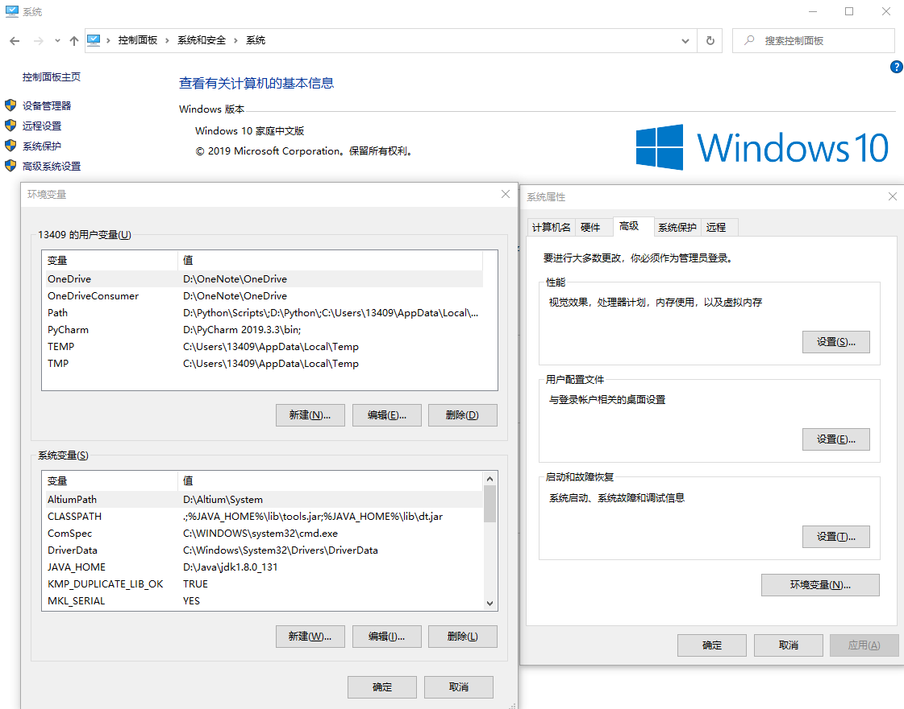

**关于Java解释器：**

java解释器会首先找到环境变量CLASSPATH，CLASSPATH 包含了一个或多个目录，它们作为一种特殊的“根”使用，从这里展开对.class 文件的搜索。从那个根开始，解释器会寻找包名，并将每个点号（句点）替换成一个斜杠，从而生成从CLASSPATH 根开始的一个路径名（所以package foo.bar.baz 会变成foo\bar\baz 或者foo/bar/baz；具体是正斜杠还是反斜杠由操作系统决定）。随后将它们连接到一起，成为CLASSPATH 内的各个条目（入口）。以后搜索.class 文件时，就可从这些地方开始查找与准备创建的类名对应的名字。此外，它也会搜索一些标准目录——这些目录与Java 解释器驻留的地方有关。

（...... ...... ...... ...... ...... ......）

# Java基础知识

## 基本概念

**介绍Java：**：java是一门跨平台的面向对象的计算机语言。（关键词：跨平台、面向对象三大特性（以及特性的优缺点））

**JavaSE：**Java标准版本，是sun公司为程序员提供的一套基础的Java类库；JavaSE的源码（src.zip）、字节码（rt.jar）、帮助文档在哪；由Oracle维护，类库包括了基本的语法、面向对象、异常、集合、反射、线程等；

**JavaEE：**Java企业版，sun公司为Java程序员准备的一套完成企业级Java开发的庞大的类库；JavaEE5规范包含13个子规范，子规范下还包含其他的规范。

**API：**应用程序编程接口，包括源码、字节码、帮助文档；

**类：**加载程序逻辑的容器；程序逻辑-定义应用程序行为。

**权限修饰符：**权限修饰符用于控制程序对这段代码的访问级别。

**块**：{ }-block。


基本数据类型：8；1、2、4、8；-2^(n-1) ~ 2^(n-1)  -  1，n是位数；char与Unicode，建议不在程序代码中使用，utf-16；float有效位为6~7位，double有效位为16位，当数值计算中不允许如何舍入误差时使用BigDecimal类；正数的原码、补码、反码一致，负数的反码为除符号位其余的取反、补码为反码末位加1，Java中所有数据以反码存储。

运算符：关于浮点溢出；关于运算符`/`：运算的两个数都是整型时才表示整数除法（整除，丢弃小数位），否则就是浮点除法（结果有小数位）；关于自加和自减：前置时自身先加1，后置时自身先去**用一次**再进行加一。

### 关键字和保留字

- 关键字：被Java语言赋予了特殊含义、用于专门用途的字符串 ，小写；

- 保留字：现有Java版本未使用，但以后版本会用作关键字的字符串或单词。

**现有关键字和保留字：**

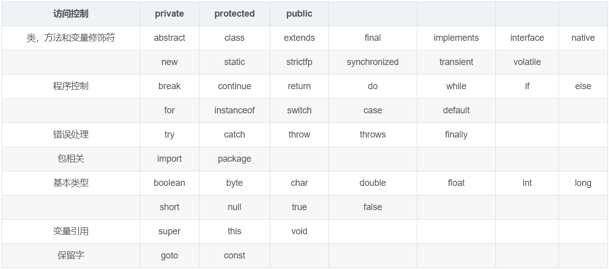

### 转义字符

包含特定意义的字符，会被转化为特定意思；注意注释中的`\U`，这是Unicode转义字符的开头，会转义。

- `\t`：一个制表符，相当于tab；
- `\n`：换行符；
- `\\`：一个`\`；
- `\"`：一个`"`；`\'`：一个`'`；
- `\r`：一个回车。

### 注释comment

用于说明、解释程序的文字就是注释，注释是一个程序员必须具备的良好的编程习惯，将自己的思想通过注释先整理出来，再去用代码实现。

- 单行注释：`//`；
- 多行注释：`/*    */`；
- 文档注释：`/**  */`，可被javadoc所解析，生成一套以网页文件形式体现的该程序的说明文档，一般写在类：
  - `javadoc -d 存放文件夹路径 -xx -yy Xxx.java`：生成说明文档放于某个文件夹中；
  - xx、yy为javadoc规定的一些标签，例如version、author等；
  - 例子：`javadoc -d D:\LSLJava\sublimtext -author -version Hello.java`。

### 标识符

**标识符：**对各种变量、方法、类、包、接口等命名时使用的字符序列。

**标识符命名规则：**应以字母、下划线、美元符号开头，后接字母、美元符、下划线、数字，长度无限制（编译器或者解释器都会有一个词法分析器。词法分析器在判断一个单词是否以数字开头，如果是以数字开头则把他当作数字常量处理，否则当作普通单词处理。这样子可以提高词法分析器的效率）。

### **规范**

- 1.包名：多单词组成时都小写xxxyyyzzz；
- 2.类名、接口名：多单词组成时都首字母大写XxxYxxZzz；
- 3.变量名、方法名：多单词组成时第一个单词小写，其他都首字母大写xxxYyyZzz；
- 4.常量名：所有字母都大写，多单词时每个单词用_连接XXX_YYY_ZZZ；
- 命名时尽量“见名知意”。

代码：正确性、可读性、健壮性、高效率低存储（时间复杂度、空间复杂度（衡量算法好坏））。

 **Java代码规范：**

1. 类、方法的注释以javadoc的方式来写；
2. 非javadoc的注释往往是给代码的维护者看的，着重告诉读者为什么这样写、如何修改、注意什么问题等；
3. 选中代码行，使用`tab`向右移动代码或使用`shift + tab`向左移动；
4. 运算符和=两边都加空格；
5. 源文件使用utf-8编码；
6. 行宽度不超80字符；
7. 行尾风格、次行风格，推荐行尾风格。

阅读：[阿里巴巴Java开发手册在线版](http://kangroo.gitee.io/ajcg/#/)

### DOS命令

DOS：Disk Operating System 磁盘操作系统。常用DOS命令：

- `md xxx ...`：创建xxx文件夹，可同时创建多个；
- `rd xxx ...`：删除xxx文件夹，可同时删除多个；
- `dir`：显示当前目录的内容；`dir xxx`：查看指定目录的内容；
- `c:`或`cd /d c:`、`d:`或`cd /d d:`：切换到c盘或d盘；
- `cd xxx目录`：切换到当前盘下其他的目录；
- `cd ..`：切换到上一级；`cd \`：切换到根目录；
- `tree xxx目录`：查看指定目录的子级目录；
- `cls`：清屏（clear scream）；
- `exit`：退出DOS窗口；
- copy（拷贝文件）、del（删除文件）、echo（输入内容到文件）、type、move（剪切）。

### **变量**

- 内存中的一个存储区域，该区域数据可以在同一类型范围内不断变化；
- 变量是程序中最基本的存储单元，包括变量类型、变量名和存储的值（变量的三个基本要素）。

### 进制转换

- 二进制：0b或0B开头；
- 八进制：0开头表示八进制；
- 十六进制：0x或0X开头表示十六进制数。

有符号数的原码、补码、反码：（**使用二进制表示数时都表示的是数的补码**）

- 计算机使用的是二进制，二进制最高位是符号位，0表示正，1表示负；
- 正数：原码、补码、反码都一样；
- 负数：（反码：原码符号位不变，其余位取反（或者负数的补码 - 1）；补码：负数的反码 + 1）；
- 0的反码、补码都是0；
- Java中的数都是有符号数；
- 计算机运算的时候是以补码的方式来运算的；
- 当我们看运算结果的时候要看它的原码。

## 数据类型

Java中有两种数据类型：基本数据类型、引用数据类型（类、接口和数组）。8种基本数据类型如下：

- 数值取值范围：（-2^(n-1) ) ~ (2^(n - 1)-1)  （n表示位数，最大值是因为最高位充当了符号位，以byte型的-128~127为例，-128可以说是计算机大神们为了解决减法运算的准确性而诞生来的：1 加 -1 按原码的方式加会出错，所以后续就有了反码，使用反码进行减法运算后多出来了一个 -0（使用反码计算1+-1就得到反码1111,1111，反码1111,1111的原码结果就是-0），为了解决这个-0就又发明了补码，规定负数的补码在原来反码的基础上加个1，这样就使得-1 + 1后的原码就是0000,0000，但使用补码之后，-127 ~ 0 ~ 127 的反码都有了相应的原码，那多出来的原码1000,0000表示什么呢？表示-128，并且不会影响运算，至于为什么这么表示，不探讨那么多。）
- 整型变量：byte1、short2、int4、long8(long在赋予的值的后面要用l或L进行声明)；
- 浮点型变量：float4(变量值要以F或f结尾) 、double8(d)；
- 字符型变量: char2（1个字符=2个字节）声明'一个字符'，' 必须放一个'，unicode字符；
- 布尔型变量：boolean（只能取true或false）；
- **（运算时，整型常量默认为int型，浮点型常量默认为double型）**。

浮点型常量表示方式：（注意浮动溢出现象）
- 十进制数：1.13、1.0f、是零点几的时候，零可以省略（如0.133=.133）。
- 科学记数法：1.11e2（1.11 * 10^2）1.11E-2（1.11 * 10^-2）。

浮点数精确位：
1. double：只能保证小数点后15位的精度，第16位的部分精度。（`double num = 1.66666666666666666666;`）
   - 浮点运算时：小数点后最多会出现17位数字，最少保留一位；总的出现位数可能会出现16或17位，例如：
   - `double num = 111.0 / 11;`（总16）、`double num = 232.0 / 3;`（总16）、`double num = 1.0 / 6;`（总17）

2. float：精度（有效数字）是7到八位。
   - 浮点计算是：小数点后最多会出现8位数字，最少一位；小数点后出现位数会随着个位十位等位数增加而减少。
   - `float num = 111.0f / 11;`（总8）

3. 对运算结果是小数的运算要小心。（double result = 1.0 - 0.9 = 0.09999999999999998;`出现精度丢失问题）

**除布尔类型的七种数据类型之间的运算：**

1. 自动类型提升：当容量小的数据类型的变量与容量大的数据类型的变量做运算时，结果自动提升为容量大的数据类型，如下：

   - byte、char、short→int→long→float→double。

   - byte、char、short三种类型间做运算时结果为int型。

2. 强制类型转换：（自动类型提升的逆运算）

     - 强制转换符()，例：int b = (int)a;  (可能导致精度损失)。


## 运算符

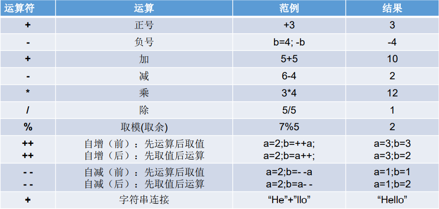

```java
【注意】：运算后的结果类型和数据类型有关（自动类型提升的原因）。
	    %取模运算结果的符号和被模数符号相同（被模数%模数）。
    	关于运算符`/`：运算的两个数都是整型时才表示整数除法（整除，丢弃小数位），否则就是浮点除法（结果有小数位）。
    	关于自加和自减：前置时自身先加1，后置时自身先去被使用一次再进行加一；自增、自减不会改变自身数据类型。
    	
  byte num = 127； num++； 输出结果为-128；byte占一个字节内存，八位，字节第一位为符号位，自加一后进位，符号位也成了1
  1 byte = 8 bit
  1 KB   = 1024 B
  1 MB   = 1024 KB
  1 GM   = 1024 MB
```

**三元运算符：（可嵌套使用）**

- **（条件表达式）？表达式1：表达式2**
  - 条件表达式结果为boolean型，条件表达式为true，则执行表达式1，条件表达式为false，则执行表达式2；
  - 【注意】：在运行时表达式1和表达式2会统一为相同一个数据类型（如果用变量接收，表达式1、2的值得能自动转换成变量的数据类型。
  - System.out.printf()内可以直接使用三元表达式，并且运行一个字符型一个数值型。（`System.out.println((1>2)?3:"你好");`）

如果程序既可以用三元运算符又可以用if-else结构，那么优先选择三元运算符，因为简洁执行效率高。

**赋值运算符：** `+=`、`-=`、`*=`、`/=`、`%=`。（例子： `a += 5; `就是` a = a + 5;`）

**比较运算符：  boolean型结果**

- ==      （对于引用数据类型来说，比较的是两个引用数据类型的地址值）；

- !=、<=、\>=、>、<。

- instanceof : 检查是否是某个类的对象或其子类对象，格式： `xx instanceof String`

**逻辑运算符：** 

- &&    短路与：运算符左边是true就运行右边，是false就不会执行运算符右边的运算
- ||       短路或：从左到右做运算，一真全真，全假为假，先遇真才会提前结束逻辑运算
- !      （非）

```java
// 交换位置的三种方法
int temp;
temp = num1;
num1 = num2;
num2 = temp;

num1 = num1 + num2;
num2 = num1 - num2;
num1 = num1 - num2; // 有局限性

num1 = num1 ^ num2;
num2 = num1 ^ num2;
num1 = num2 ^ num1;
```

**位运算符：（操作的都是整型数据，顾名思义是在位上的运算，注意运算的时候是以补码的形式，最后结果还要转换为原码）**

- <<        向左移，移出去的丢失，空出来的都补0。
- \>>        向右移，移出去的丢失，空出来的原数据最高位是啥就拿啥补。
- \>>>      无符号右移：移动时空出来的位都用0补，符号位不变。
- ~          取反运算：0->1，1->0。
- &        （与运算：全1为1；也是逻辑运算符：全真为真）。
- |         （或运算：有1为1；也是逻辑运算符：有真为真）。
- ^          异或运算：**同为假，异为真**（m^n^n = m）；也是逻辑运算符。

## 流程控制和循环

**顺序结构：**程序从上往下逐行地执行，中间没有任何判断和跳跃。

**分支结构：**根据条件选择性执行，有 if...else 和 switch-case 两种。

```java
//表达式只能是byte、short、char、int、Character、Short、Byte、Integer、枚举类型(JDK5.0新增)、String类型(JDK7.0新增)这十种
switch(表达式) {   
    case 常量1:
        执行语句1;
        break;    // 没有break时：会从表达式对应的case一直往下执行到底
    ......
        default:  //可选项，表示默认值，都不满足时执行（满足但前面都没有break，这个也会执行）
        	执行语句n;
}
```

**循环结构：**（初始化条件、循环条件(布尔类型)、循环体、迭代条件）

- 根据循环条件，重复性执行程序逻辑；
- 有while、do...while、for三种循环操作；
- JDK1.5提供了foreach循环，方便遍历集合和数组元素。

for循环：

```java
for(1; 2; 4) {   //1初始化条件、2循环条件(布尔类型)、3循环体、4迭代条件
    3;
}				//运行顺序1→2→3→4，直到循环结束

int num = 1;
for(System.out.print('a'); num <= 3; System.out.print('c'),num++){
    System.out.print('b');
}
```

while循环：（当条件满足时执行循环内容）（for和while可以相互转换）

```java
1                   //初始化条件
while(2){           //循环条件
    3;              //循环体
    4;              //迭代条件,少了可能导致死循环
}
```

do...while循环:（先执行一次，直到条件不满足时退出循环）

```java
1             //初始化条件
do{
	3;        //循环体
    4;        //迭代条件
}while(2);    //循环条件
//1→3→4→2→3→4→2→...→直到2为false时推出循环，循环至少执行一次
```

关于死循环：

```java
while(true){
    
}
for(;;){
    
}
/*
结束循环方式：
    方式一：return; 这个会直接结束方法 （while的死循环可以在循环体中控制条件为false来结束循环）
    方式二：循环体中执行break
    */
```

关于循环嵌套：

```java
//例题：100以内质数（素数：只能被1和自身整除）
class PrimeNum{
    public static void main(String[] args){
        boolean isFlag = true;
        //int count = 0;
        for(int i = 2; i <= 100; i++){
			isFlag = true;
            for(int j = 2; j < i; j++){     //优化二：把这里的i换为Math.sqrt(i),大于改为大于等于号;对是质数的自然数有效
                if(i % j == 0){
                    isFlag = false;
                    //break;                  优化一：当进入判断时就结束当前循环，减少后续循环判断)；对非质数的自然数有效
                }
            }
            if(isFlag == true){
                System.out.println(i);
                //count++;
            }
        }
    }
} 
long start = System.currentTimeMillis();//获取当前时间距离1970年0时0分0秒的ms数
long end = System.currentTimeMillis();
System.out.println("程序运行花费的时间为：" + (end - start) + "ms");
```

```java
//质数实现方式2
class PrimeNum2{
    public static void main(String[] args){
        int count = 0;
        label:for(int i = 2; i <= 100; i++){  //要遍历的自然数
            //质数判断
            for(int j = 2; j <= Math.aqrt(i); j++){  
                if(i % j == 0){
                    continue label;
                }
            }
            //质数数量统计
            count++;
        }
    }
} 
long start = System.currentTimeMillis();//获取当前时间距离1970年0时0分0秒的ms数
long end = System.currentTimeMillis();
System.out.println("程序运行花费的时间为：" + (end - start) + "ms");
```

**特殊关键字的使用，实现循环中跳转：**

- **break**：结束**当前整个循环**，break后面不能声明执行语句；用于switch或循环。

- **continue**： 结束**当次循环**，continue后面不能声明执行语句；常用于嵌套循环中。

- 用指定标签跳出指定的循环：

  - ```java
    label:for(inti = 1; i <= 4; i++){  // 循环一
        for(int j = 1; j <= 10; j++){  // 循环二
            if(j % 4 == 0){
                //break;    跳出最近的一层循环：这里当j满足条件时，就结束最近的一次for循环-循环二
                //continue; 终止最近的一次循环：j=4时就结束当次循环，开始第5次循环
                //break label;    结束指定标识的一层循环结构：当j=4时，循环一终止
                //continue label; 结束指定标识的一次循环结构的当次循环：j=4时，循环一的一次循环终止
            }
            System.out.print(j);
        }
        System.out.println("");
    }
    ```

- return是用来结束方法的，在方法中使用时`return;`就表示退出方法（如果是主方法就是退出程序）。

## 数组

数组：引用数据类型

- 创建一维数组时会在堆栈（stack）开辟一整块连续的空间，数组名引用的是这块空间的首地址。
- 数组长度确定后不能再修改。
- 数组与数组之间是引用传递，是将地址值赋予引用。

### 一维数组

- ```java
  // 声明：[]可以放在类型名或变量名后
  int[] array;
  // 初始化
  array = new int[]{1, 2, 3, 4, 5, ......};
  array = new int[9];
  
  //还有
  int[] arr = {1, 2, 3, 4, 5, 6, ......}; //必须要在声明处这样初始化，否则不行
  ```
  
- 给数组赋值：**数组名【下标】=  要赋予的值；**

- 数组长度：**数组名.length**；

- 数组元素默认初始化值：数组未赋值时系统给予的默认值

  - 数组元素是整型：**0**
  - 数组元素浮点型：**0.0**
  - 数组元素是char型：**0** 或 `\u0000`（我测试得\u0000）
  - 数组元素是boolean型：**false**
  - 数组元素是引用数据类型：**null**

- 数组遍历和内存分配。

### 二维数组

- 数组初始化：
  
  ```java
  // 数据类型[][] 数组名 = new 数据类型[n][m]; 可理解为n是行数，m是列数，列数个数不一定，可自行设置
  // 静态初始化：直接把里面的值给定了
  	int[][] array = new int[][]{{1, 2, 3},{4, 5}, {6, 7, 8}, {}, ......};
  // 动态初始化：
  	String[][] arr1 =  new String[3][2];
  	String[][] arr2 = new String[3][];
  
  // []可以放在类型名或变量名后 例如：
  	int[] arr[] = new int[3][];
  	int arr[][] = new int[3][];
  	int[][] arr = {{}, {}, {}, ......};
  ```
  
- 长度：数组名.length    //是第一个的数量     arr[0].length  //这个里面有多少个元素

- 数组遍历：
  
  ```java
  for(int i = 0; i < arr.length; i++){
      for(int j = 0; j < arr[i].length; j++){
          
      }
  }
  ```
  
- 初始化时可不设置后一个框内的值，然后通过如下的方式实现每行列数的不同：

  ```Java
  int[][] arr = new int[5][];
  for(int i = 0; i < arr.length; i++) {
  	arr[i] = new int[i + 1];
  	for(int j = 0; j < i + 1; j++) {
  		arr[i][j] = 0;
  	}
  }
  ```

- 默认初始化值：

  - 外层：地址值，如果内层没有初始化则是null，这样内层不能调用，否则报错；
  - 内层：和一维情况一样。

二维数组的内存结构：

- 前面的方框是代表栈里面的内容，是引用地址，指向堆里的一维数组；
- 后面的方框是代表一维数组；
- 二维数组从底层来说就是一个一维数组里的值还是一维数组。

数组涉及的基本算法：

- 数组元素的赋值（杨辉三角、回型数等）；

- 数值型数组中元素的最大值、最小值、平均数、总和；

- 数组的复制、反转、查找（线性查找、二分查找）；

- 数组元素排序算法。


十大内部排序算法：

1. 选择排序：

2. 直接选择排序、堆排序

3. 交换排序: （掌握）

4. 冒泡排序：从前往后比较相邻元素大小，发现逆序则交换（每一次排序都把最大的排好）

5. 快速排序

6. 插入排序：

7. 直接插入排序、折半插入排序、Shell排序

8. 归并排序：

9. 桶式排序：

10. 基数排序：


# 面向对象编程

对编程思想面向对象与面向过程的理解、优缺点？

面向对象是一种 **对现实世界理解和抽象的方法**，是计算机编程技术发展到一定阶段后的产物。（任务事物都可以转化为数据上的描述）

**面向过程** (Procedure Oriented) 是一种 **以过程为中心** 的编程思想。这些都是以什么正在发生为主要目标进行编程，不同于面向对象的是谁在受影响。。

面向过程：强调功能行为，以函数为单位，考虑怎么做。

面向对象：强调具备了功能的对象，以类/对象为最小单位，考虑谁来做。

基础部分涉及：

1、Java类及类的成员：属性、方法、构造器；代码块、内部类；

2、面向对象三大特征：封装性、继承性、多态性、（抽象性）；

3、其他关键字：this、super、static、final、abstrect、interface、package、import等。

# 类

## 权限修饰符

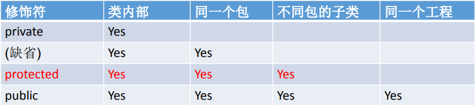

权限修饰符是为了控制其他代码对这段代码的访问级别（决定哪里的代码才可以访问这段代码）。类的访问控制符（权限修饰符）只能是空或者 public，方法和属性的访问控制符有 4 个，分别是 public、 private、protected 和 friendly，其中 friendly 是一种没有定义专门的访问控制符的默认情况。

类的访问控制符只能是缺省或者 public，缺省的在同一包下可以引用，public的可以在同一工程下引用（通过import机制）。

加了以下权限修饰符修饰的方法和属性：

- private：只能被该类自身的方法访问和修改，而不能被任何其他类（包括该类的子类）访问和引用；
- 缺省（friendly）：只能是被同一个包里面的代码访问使用，跨包子类也不行（包访问性（package private）），类内的成员如果没有访问控制符，也说明它们具有包访问性，或称为友元（friend）；
- protected：该类自身、与它在同一个包中的其他类以及在其他包中的该类的子类可以访问使用；（相当于在friendly的基础上多了跨包子类的）；
- public：同一个工程内的代码可以访问使用，通过import机制。

用于控制可见性的4个访问修饰符：（摘自Java核心技术卷10）

- 仅对本类可见——private。
- 对所有类可见——public。
- 对本包和所有子类可见——protected。
- 对本包可见——默认（很遗憾），不需要修饰符。

## 关于属性

属性=成员变量=field(字段)，`权限修饰符 [关键字] 属性类型 属性名`。

- 属性如果不赋值，会有默认值，和各类型的数组的默认值一致；
- 属性类型可为任意类型；
- final修饰的属性为常量；static修饰的随着类的加载而加载，属于类；
- static final 修饰的为全局常量。

## 关于方法

方法声明：**权限修饰符 [关键字修饰]  返回值类型  方法名(形参列表){  方法体  }**

1. 关键字修饰：
   - static修饰：表示随着类加载而加载，不用通过对象来进行调用；
   - final修饰：表示该方法不能被重写；
   - abstract修饰：抽象方法，抽象方法必须在抽象类内。
2. 点号"."用于调用方法。

方法重载：（只要同名方法不同参即可构成重载）

1. 同一个类中允许一个以上的同名方法，只要他们的**参数个数或者参数类型、参数顺序**不同就能构造重载，方法返回值和访问修饰符可以不同，可以有static关键字。
2. 可变形参个数方法，例如： `public void show(数据类型  ...  变量名){ }`
  - 该方法传入参数个数是1个到n个，实际上参数也就相当一个数组，可以使用`变量名.length`访问传入形参的个数和用`变量名[n]`来访问传入的某个形参。
  - 此方法和 `public void show(数据类型[]  变量名){ }`相同，因此不能同时出现在一个类中。
  - 可变形参最多只能有一个并且只能声明在末尾，例如`public void show(int i,  String ... strs) { }`。

方法中形参的值传递机制：

- 引用类型的形参传递的是地址值，形参改变会影响到地址值内的数据。
- 基本数据类型的形参传递的是传入的变量的值。

## 关于构造器：

构造器（构造方法）：

- 用来构造对象或初始化对象，当没有显式定义构造器时系统默认提供一个空参的构造器，如果显式定义了，则不会再提供默认的空参构造器；
- 构造器格式：`权限修饰符  类名(参数列表) {......}`。
- 可以构成重载。

## 关于代码块

代码块也是类中的基本结构之一，用{ }来表示，如果要修饰只能加static来修饰；作为类成员时，通过是否加static修饰可分为静态代码块和非静态代码块。

1. 不加static，非静态代码块：
   - 随着对象的创建而执行，在创建一个对象的时候才执行一次；
   - 作用：可以在对象创建的时候，对属性进行初始化。
2. 加static，静态代码块：
   - 随着代码块所在的类的加载而执行，只执行一次； 
   - 静态代码块中只能调用所在类的静态结构。

代码块执行顺序：

1. 静态的先于非静态的，同类的按上下顺序执行；
2. 子父类都有时：执行完父类的静态代码块再到子类的静态代码块，然后再执行父类的非静态，最后才是子类非静态（由父及子，静态先行）。

## 关于内部类

Java中允许一个类定义在某个类的内部，这个定义在类内部的类称为内部类（inner class），相对的外面的则称为外部类。

### 成员内部类：

- 作为一个类：可以定义属性、方法、构造器；可以用final修饰（表示此类不能被继承），可以被abstract修饰-表示此类不能被实例化。

- 作为类成员：可以调用外部类的结构，可以被static修饰，可以被四种访问控制符修饰。

- ```java
  public class Person {
      private String name;
      // 成员内部类
      public class Hand {
          String name = "Person.this.name";
          public void sayHi(){
              System.out.println(Person.this.name);
          }
      }
  }
  ```

实例化成员内部类：

1. 静态内部类：
   - （例如： `Person.Hand hand = new  Person.Hand();`，Hand是静态内部类）。
2. 非静态内部类：得先去创建外部类的对象，再创建内部类的对象
  - （例如：`Person p = new  Person(); Person.Hand hand = p.new Hand();`）。

在成员内部类中区分调用的是内部类还是外部类的结构：

- 与外部类属性重名时：`this.属性名`（表示内部类的属性）、`外部类名.this.属性名`（表示外部类的属性）。
- 访问外部类同名属性，如果是静态，可以不用加this，遵循就近原则。

### 局部内部类：

- 定义在方法或代码块中，作用域也是在方法域或代码块中。

- 局部内部类是一个类，但不能使用权限修饰符；可以使用final，可以调用外部类的结构。

- 相当于一个局部变量；重名属性区分和成员内部类的区分一样，使用就近原则。

- ```java
  public class InnerClass {
      public void method(){
          // 局部内部类，开发中很少用到
          class A{
  
          }
      }   
      public Comparable getComparable(){
          // 利用局部内部类，返回实现了Comparable接口的对象
          class MyComparable implements Comparable{
              @Override
              public int compareTo(Object o) {
                  return 0;
              }
          }
          return new MyComparable();
      }
  }
  ```

### 匿名内部类：

- 框架中、开发中经常使用；anonymous class。

```java
public class InnerClass {
    public static void main(String[] args) {
        InnerClass i = new InnerClass();
        String name = i.getC().getClass().getName();
        System.out.println(name); // 输出：com.lsl.algorithmsort.InnerClass$1
    }
    // 匿名内部类对象，是类亦是对象，该匿名内部类名字为InnerClass$1，与new的对象无关
    // new 的对象可以是接口或类
    Comparable c = new Comparable() {
        @Override
        public int compareTo(Object o) {
            return 0;
        }
    };
    public Comparable getC() {
        return c;
    }
}
```

- 匿名内部类的名字是外部类名字加上$再加一个数字，例如`InnerClass$1`；
- jdk底层创建好“匿名类”后会立刻实例化，在底层是有名字滴；
- 对于只使用一次某个类的对象或某接口的实现对象，使用匿名内部类就简化了开发。

## 类的关系

依赖：`use-a`，一个类的方法操控另一个类的对象，就是某个类依赖于另一个类。

继承：`is-a`，使用extends的父子类继承关系。

聚合（也被称为关联）：`has-a`，意味着聚合类的对象中包含类A的对象。

（核心卷中说聚合所表示的内容被其他的方法学家用关联来代表）。

## 使用文档注释解释类

[Java文档注释全攻略 - 知乎 (zhihu.com)](https://zhuanlan.zhihu.com/p/369072725)

**关于文档注释：**

文档注释主要是用来生成java开发文档 —— javadoc的，生成的开发文档和Java本身的API帮助文档是一样的，也就是对你所写的类进行解释说明，所以它还需要搭配一些文档标记，进行解释说明，而且在文档注释中可以使用HTML语言，jdk源码中有大量的文档注释，所以弄懂文档注释可以帮助你更好的看懂源码。

文档注释通常还会配合HTML标签进行使用，比较常用的标签有`<p> <pre>`等标签，p标签用于表示段落，pre标签可用于显示计算机源码。

【注意】：pre标签中如果有小于号、大于号、例如泛型 在生产javadoc时会报错。

**文档标记：**

1. 通用型，在类、方法、变量和常量上都经常使用的：

   - @link： 用于快速链接到相关代码，使用格式：{@link 包名.类名#方法名(参数类型)}

     ```java
     // 完全限定的类名*
     {@link java.util.Collections}
     
     // 省略包名，只写类名*
     {@link String}
     
     // 省略类名，表示指向当前的某一个方法*
     {@link #toString()}
     
     // 完全限定方法名，包名.类名.方法名(参数类型)*
     {@link java.lang.String#charAt(int)}
     ```

   - @code： 将文本标记为代码样式文本，一般在Javadoc中只要涉及到类名或者方法名，都需要使用@code进行标记，使用格式：{@code text}，其会被解析为` text`

     ```java
     //标记类名
     {@code ArrayList}
     
     //标记方法名
     {@code isEmpty}
     
     //标记某个代码关键字
     {@code null}
     ```

2. 类上常用的：

   - @param：如果一个类支持泛型时，可以通过@param来解释泛型的类型

     ```java
     /**
     *@param <E> the type of elements in this list
     **/
     ```

   - @author：用来标记作者，如果一段程序是由多个作者来维护，则可以标记多个@author，@author 后面可以跟作者姓名(也可以附带作者邮箱地址)、组织名称(也可以附带组织官网地址)

     ```java
     // 纯文本作者
     @author Rod Johnson
     
     // 纯文本作者，邮件
     @author Igor Hersht, igorh@ca.ibm.com
     
     // 超链接邮件 纯文本作者
     @author <a href="mailto:ovidiu@cup.hp.com">Ovidiu Predescu</a>
     
     // 纯文本邮件
     @author shane_curcuru@us.ibm.com
     
     // 纯文本 组织
     @author Apache Software Foundation
     
     // 超链接组织地址 纯文本组织
     @author <a href="https://jakarta.apache.org/turbine"> Apache Jakarta Turbine</a>
     ```

   - @see ：另请参阅的意思，一般用于标记与本类相关联的类，该标注可以用在类或方法上

     ```java
     /**
     * @see IntStream
     * @see LongStream
     * @see DoubleStream
     * @see <a href="package-summary.html">java.util.stream</a>
     * /
     ```

   - @since：表示从以下版本开始有这个类，标记文件创建时项目当时对应的版本，后面可以跟版本号或是时间

     ```java
     //跟版本号，以下是ArrayList类里的标记，说明从jdk1.2开始就有该类了
     /*
     * @since 1.2
     **/
     //跟时间
     /**
     * @since 20 April 2021
     */
     ```

   - @version：用于标记当前类版本，默认为1.0

     ```java
     /**
     * @version 1.0
     */
     ```

     以上是类上常用的文档标注，类上的文档格式如下：

     1. 概要描述：通常用一段话简要的描述该类的基本内容。
     2. 详细描述：通常用几大段话详细描述该类的功能与相关情况。
     3. 文档标注：用于标注该类的作者、时间、版本、参略等信息。

3. 方法上常用的的标记：

   - @param：该文档标记后面写方法的参数名，再写参数描述。

     ```java
     */***
     ** @param str*
     ** the {@code CharSequence} to check (may be {@code null})*
     **/*
     public static boolean containsWhitespace(@Nullable CharSequence str) {}
     ```

   - @return：该文档标记后面写返回值得描述。

     ```java
     */***
     ** @return {@code true} if the {@code String} is not {@code null}, its*
     **/*
     public static boolean hasText(@Nullable String str){}
     ```

   - @throws：该文档标记后面写异常的类型和异常的描述，用于描述该方法可能抛出的异常。

     ```java
     */***
     ** @throws IllegalArgumentException when the given source contains invalid encoded sequences*
     **/*
     public static String uriDecode(String source, Charset charset){}
     ```

   - @exception：该标注用于描述方法签名throws对应的异常。

     ```java
     */***
     ** @exception IllegalArgumentException if <code>key</code> is null.*
     **/*
     public static Object get(String key) throws IllegalArgumentException {}
     ```

   - @see：可用在类与方法上，表示参考的类或方法。

     ```java
     */***
     ** @see java.net.URLDecoder#decode(String, String)*
     **/*
     public static String uriDecode(String source, Charset charset){}
     ```

     以上是方法上常用的文档标注，方法上的文档格式如下：

     1. 概要描述：通常用一段话简要的描述该方法的基本内容。
     2. 详细描述：通常用几大段话详细描述该方法的功能与相关情况。
     3. 文档标注：用于标注该方法的参数、返回值、异常、参略等信息。

4. 变量和常量上的文档规范：变量和常量上用的比较多的文档标记是`@link`和`@code`，主要注释该常量或变量的基本用法和相关内容。

   ```java
   /**
   * The value is used for character storage.
   *
   * @implNote This field is trusted by the VM, and is a subject to
   * constant folding if String instance is constant. Overwriting this
   * field after construction will cause problems.
   *
   * Additionally, it is marked with {@link Stable} to trust the contents
   * of the array. No other facility in JDK provides this functionality (yet).
   * {@link Stable} is safe here, because value is never null.
   */
       private final byte[] value;
   ```


**javadoc文档生成：**

1. Windows下cmd命令方式：

   - `javadoc -encoding UTF-8 -charset UTF-8 *.java`：进入要编译的.java文件目录下执行。

2. 使用idea生成javadoc文档：

   1. 打开 idea，点击 Tools-> Generate JavaDoc，这样会打开生成 javadoc 文档的配置页面。

   2. 配置javadoc文档输出详情：

   3. 1. 选择要输出文档的范围，选择是整个项目还是模块还是单个文件。
      2. 文档要输出路径。
      3. 选择哪些类型的方法或参数可以生成文档。
      4. Locale 选择地区，这个决定了文档的语言，中文就是zh_CN。
      5. 传入JavaDoc的参数，一般写 `-encoding UTF-8 -charset UTF-8`，表示编码格式。
      6. 点击确定，运行无误后，打开你所选择的文档输出路径后，选择index.html，就是所输出的javadoc文档。

   4. 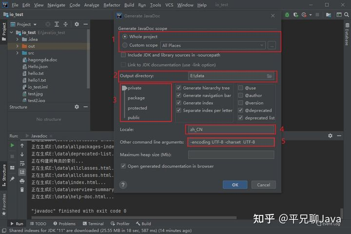

# 递归recursion

方法自身调用自己，但每次调用时传入的变量不同。

```java
class Test {
    public void test(int n){
        if(n > 2) {
            test(n - 1);
        }
        System.out.println("n=" + n);
    }
}
```

```java
public static void main(String[] args) {
    Test test = new Test();
    test.test(4);
}
```

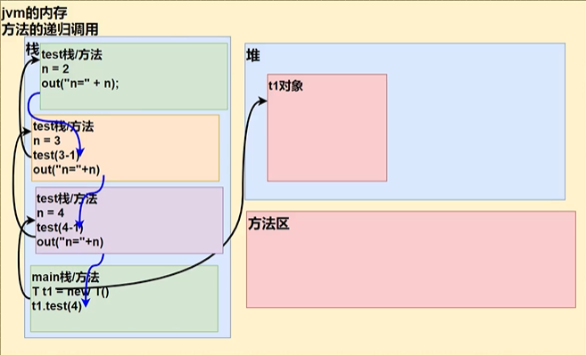

方法的调用会开一个栈区域，递归中每次调用自身方法时都会开一份栈区域，直到不再调用方法才停止方法栈的开辟，在不满足条件n>2时，依次出栈，依次执行完方法栈内的剩下的代码，最后回退到main方法，一个递归方法就执行完毕了。

```java
// factorial 阶乘
public int factorial(int n) {
    if (n == 1) {
        return 1;
    }else {
        return factorial(n - 1) * n;
    }
}
```

阶乘的内存解析，以n=5为例子：

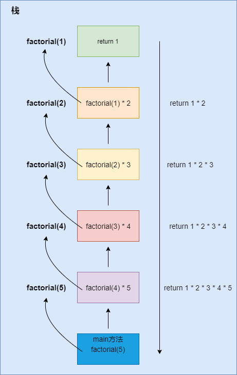


递归的规则：

- 执行一个方法时，就创建一个受保护的独立空间（栈）；
- 如果方法使用的是引用类型的形参变量，就会被共享；
- 递归必须要向退出递归的条件逼近，否则就会出现StackOverFlowError；
- 方法执行完毕或return，就会返回，遵守谁调用就将结果返回给谁。

使用递归求斐波那契数（1，1，2，3，5，8，13......从第三个数开始，后一个数是前面两个数的和），给你一个整数n，求出第n个斐波那契数是多少？

```java
// 斐波那契数
public int fibonacci(int n) {
    if (n > 0 && n < 3) {
        return 1;
    }else {
        return fibonacci(n - 1) +  fibonacci(n - 2);
    }
}
```

猴子吃桃：有一堆桃子，猴子每天都吃完一半后再多吃1个，到第十天（还没吃）只剩下了一个桃子，问原来有多少桃子？

```java
public int monkeyEat(int n) {
    if (n == 1){
        return 1;
    }else {
        return (eat(n - 1) + 1) * 2;
    }
}
```

汉诺塔问题：

```java
// 汉诺塔 num：移动的数量 a：A塔 b：B塔 c：C塔
public void moveHanoiTower(int num, char a, char b, char c){
    // 如果只有一个，直接移动到C塔
    if (num == 1) {
        System.out.println(a + "--》" + c);
    }else {
        // 多个塔，先要移动到B；按照两个盘移动设置想想
        moveHanoiTower(num-1, a, c, b);
        // 再将a最下面的移动到C，借助C移动到B
        System.out.println(a + "--》" + c);
        // 然后再将B下最大的移动到C，借助A
        moveHanoiTower(num-1, b, a, c);
    }
}
```

```java
test.moveHanoiTower(5, 'A', 'B','C');
```

# 作用域

1. 主要的变量：属性和局部变量（一般是指成员方法中定义的变量）。
2. 作用域分为全局变量和局部变量：
   - 全局变量：也就是属性，作用域为整个类；
   - 局部变量：除属性之外的其他变量，作用域为定义它的代码块中。
3. 全局变量有默认值，局部变量没有默认值，因此局部变量必须赋值后才能使用。
4. 属性和局部变量可以重名，访问时就近原则。

# 面向对象三大特征

## 封装

封装就是把抽象出的数据和对数据操作的方法封装在一起，数据被保护在内部，程序的其他部分只有通过被授权的操作，才能对数据进行操作。（关键字：封装、信息隐藏）

关于封装（encapsulation）：

- 高内聚：类的内部数据操作细节自己完成，不允许外部干涉。

- 低耦合：仅对外暴露少量的方法用于使用。
- 封装设计思想：把该隐藏的隐藏起来，隐藏对象内部的复杂性，只对外公开少量接口供使用。（相当于把代码给模块化了）。

封装体现：（需要权限修饰符配合）

- 私有化属性，只提供公有方法来访问或修改属性。
- 设置不对外暴露的私有的方法。
- 单例模式。

封装实现：

- 私有化属性，提供公共的set、get方法。

## 继承

### 概述

继承：一个类可以作为子类来继承父类，使得子类有父类的数据或行为方法。继承可以方便功能拓展、提高代码的复用性，也为多态的使用提供了前提，继承是对代码的复用。（子类继承父类后就获得了父类的所有结构（属性和方法））。

继承特性：一个类可以被多个子类继承，一个子类只能有一个父类；可以实现多层继承。

Manager  -----  子类、派生类、supclass              Employee  -----  父类、超类、基类、superclass

### 使用

```java
public class Employee {
    private String name;
    double salary;
    private LocalDate hireDay;

    public Employee(String name, double salary,int year, int month, int day) {
        this.name = name;
        this.salary = salary;
        this.hireDay = LocalDate.of(year,month, day);
    }
    public void raiseSalary(double byPercent){
        double raise = salary * byPercent / 100;
        salary += raise;
    }
    // get、set方法省略
}
```

```java
public class Manager extends Employee{
    private double bonus;
    public Manager(String name, double salary, int year, int month, int day) {
        super(name, salary, year, month, day);
        bonus = 0;
    }
    @Override
    public double getSalary() {
        return super.getSalary() + bonus;
    }
    // get、set方法省略
}
```

1. 子类通过关键字extends来声明继承父类的数据和行为方法。
2. 子类构造的对象包含了父类和子类的**所有的属性和方法**，但子类并不能直接引用父类的私有域。
3. 子类构造器默认调用父类的无参的构造器，如果父类不提供无参构造器且子类构造器没有调用父类的有参构造器，就会报错。
4. 创建子类对象时直接或间接调用了父类的构造器（每个不存在this的构造器，都显式或隐式地存在super()），进而调用了父类的父类的构造器，直到调用了java.lang.Object类中空参的构造器为止，所以存储子类对象的内存中会有父类的结构。
5. 如果子类中存在同名属性或重写了父类的方法，可通过super关键字来调用父类的属性或方法。
6. 尽管内存中有父类的结构，但自始至终只创建了new的子类的对象。

**验证：**子类调用了父类的构造器，那创建子类对象时有没有创建父类的对象？

new指令开辟空间，用于存放对象的各个属/性引用等，反编译字节码发现只有一个new指令，所以开辟的是一块空间，一块空间就放一个对象。然后，子类调用父类的属性，方法啥的，那并不是一个实例化的对象。在字节码中子类会有个u2类型的父类索引，属于CONSTANT_Class_info类型，通过CONSTANT_Class_info的描述可以找到CONSTANT_Utf8_info,然后可以找到指定的父类啊啥的。方法、属性名称都是在这个上面解析出来的，然后实际变量内容存储在new出来的空间那里。super这个关键字只不过是访问了这个空间特定部分的数据（也就是专门存储父类数据的内存部分）

### 关于重写

1. 定义：在子类中对继承自父类的方法进行改造，也称为方法的重置、覆盖，子类的将覆盖父类的方法。
2. 要求：（重写与被重写的要求）

     - 权限：重写的访问权限不能小于父类的（特殊情况：子类不能重写父类中声明为private权限的方法）。
     - 返回值：返回值类型不能大于父类被重写的返回值类型
       - 被重写的返回值是基本数据类型或void，则重写方法的也必须和被重写的一样。
       - 被重写的返回值是A类，重写的可以是A类或A类的子类。
     - 方法与形参：方法名称、参数列表要相同。
     - 异常：子类重写方法抛出的异常不能大于父类被重写方法的异常。
     - 【注意】子类、父类同名参数的方法必须同时声明为非static的(即为重写)，或者同时声明为static的(不是重写)。因为static方法是属于类的，子类无法覆盖父类的方法。
3. 最佳实践：开发中常复制粘贴来重写，或者使用集成开发环境的功能来重写。

关于静态方法：在子类和父类中同名同参的方法要么都声明为static（不是重写），要么都不声明为static（考虑重写的时候）。

## 多态

有两种形式可以实现多态：继承和接口。多态的存在、多态在程序中的体现、向下转型、instanceof。

**多态-就是向上转型（父子类或间接向上转型）**

```java
Person person = new Man(); // man 是 Person 的子类
```

多态可以理解为一种事物的多种形态，Java中表现为子类向父类转型。对象又为什么会有多种形态呢？对象的创建要经过编译和运行两个过程，而Java中的引用变量有两个类型，编译时类型和运行时类型，而编译时类型由声明的引用类型决定，运行时的类型由实际赋予给该变量的对象决定，如果编译和运行时的类型不一致，就出现了对象的多态性（polymorphism）。总的来说，对象的多态性就是父类的引用指向子类的对象（子类的对象赋给父类的引用）。

多态的方法调用：（虚拟方法调用：Virtual Method Invocation）

多态的使用前提是类的继承和方法重写；在编译期间，对象调用的是父类中的方法（虚拟方法），也就是此时调用的只能是父类中的方法，如果不是则会报错，编译出错；但在运行的时候，实际运行的则是子类的重写了的父类的方法。多态只适用于方法，不适用于属性（也就是说属性还是声明类型的类里面的属性，不是子类中的）。（体系Java的动态绑定机制：当调用方法的时候，方法会和对象的的内存地址/运行类型绑定，调用对象属性时则没有动态绑定机制，使用的是声明类型的属性）

多态的用处：

- 减少方法的重载，例如equals(Object obj)方法对多态的使用。

【面试】证明多态是运行时行为还是编译时行为：（运行时行为，运行后才会知道行为走向；编译时行为，不用运行就能判断出行为的结果）

```java
public class Person {
    private String name;
    private int age;
    public void eat() {
        System.out.print("人会吃饭！");
    }
}
class Man extends Person {
    public void eat() {
        System.out.print("男人吃饭，饭量大！");
    }
}
class Student extends Person {
    public void eat() {
        System.out.print("学生吃饭，饭量大！");
    }
}
class Woman extends Person {
    public void eat() {
        System.out.print("女人吃饭，饭量大！");
    }
}
class Test {

    public static Person poly(int key){
        switch(key){
            case 0: return new Man();
            case 1: return new Woman();
            default:
                return new Student();
        }
    }

    public static void main(String[] args) {
        int key = (int)(Math.random()*3);
        System.out.println(key);
        Person person = poly(key);
        person.eat();
    }
}
```

**向下转型：**（使用强制类型转换符）

- 多态情况下，尽管内存中加载了子类特有的方法，但是因为变量声明是父类类型，所以**编译时只能调用父类中声明的类型和属性**，不能调用子类特有的方法和属性;

- 如果这时要调用子类特有的方法和属性，此时需要使用强制转换`()`，这就是向下转型，但要注意强制转换可能会出现错误；

- 【注意】转换的是对象的类型，**实际对象还是new的对象**，转换的类型可以是对象的类类型或者是编译类型的直接或间接子类（但不小于对象类类型，并且不能是并行关系）；非多态行为的父类对象不能转换为子类类型，例如`Man man =(Man) new Person()`编译时不出错但在运行时就会出现ClassCastException异常。

- ```java
  Object obj = new Woman(); // 向上转型-多态
  Person p = (Person) obj; // 向下转型-还是多态
  Person person = new Man(); // 多态行为的Person类型对象，运行时实际是Man类型对象
  Man man = (Man)person; // 向下转型，可以调用new Man()的类Man中的特有的方法
  ```


`instanceof`运算符：

- `a instanceof A `：判断对象a是否是A类或其子类对象，是就返回true（new的类是什么就是什么类型的实例）。
- 使用情境：避免向下转型出现ClassCastException异常（在向下转型前先进行instanceof的判断，一旦返回true就进行向下转型）。

多态的应用：多态数组、多态参数。

## 理解方法调用

对象上应用方法的调用可分为以下几个过程：（见Java核心第十卷 P155）

1. 编译器查看对象的声明类型和方法名，与对象或对象的父类进行匹配，获取所有的可能被调用的候选方法。
2. 编译器查看调用方法时提供的参数类型，与第一步获取到的候选方法进行匹配，如果候选方法中提供的参数类型完全匹配，就选择这个方法。——该过程称为重载解析，获得需要调用的方法名字和参数类型。
   - （如果编译器没有匹配到或者发现类型转换后有多个方法能匹配上，会报错）。
   - 如果是private方法、static方法、final方法或者构造器方法，编译器可以准确知道应该调用哪个方法——该种调用方式为静态绑定。与此对应的是调用方法依赖隐式参数（多态中的方法调用者）的实际类型，并且在运行时实现动态绑定。（在运行时能自动选择调用哪个方法的现象称为动态绑定（dynamic binding）。）
3. 程序运行，如果采用动态绑定来调用方法时，先在当前方法调用的对象所对应类类型中寻找最合适的方法，否则将在父类中。

# 抽象和接口

## 抽象

[Java 抽象类 | 菜鸟教程 (runoob.com)](https://www.runoob.com/java/java-abstraction.html)：在面向对象的概念中，所有的对象都是通过类来描绘的，但是反过来，并不是所有的类都是用来描绘对象的，如果一个类中没有包含足够的信息来描绘一个具体的对象，这样的类就是抽象类。

- 抽象类除了不能实例化对象之外，类的其它功能依然存在，成员变量、成员方法和构造方法的访问方式和普通类一样。
- 由于抽象类不能实例化对象，所以抽象类必须被继承，才能被使用。也是因为这个原因，通常在设计阶段决定要不要设计抽象类。
- 父类包含了子类集合的常见的方法，但是由于父类本身是抽象的，所以不能使用这些方法。
- 在 Java 中抽象类表示的是一种继承关系，一个类只能继承一个抽象类，而一个类却可以实现多个接口。

**抽象类的使用：**

“为了保证程序的清晰度，含抽象方法的类本身必须被声明为抽象类”，也就是说**抽象方法必须存在于抽象类中**，抽象类使用关键字`abstract`声明。

1. 抽象类及其成员：（抽象类是不是相当于普通类附加一个抽象属性）
   - 作为抽象类：其成员可以含有抽象方法或不含抽象方法（抽象类具体实现是在子类滴）。
   - 抽象方法结构：`权限修饰符 abstract 返回值类型 方法名();`；**抽象方法不需要实现；抽象方法不能被private、static、final修饰，关键字abstract只能用来修饰方法和类**。
   - 作为类：可以包含具体数据和具体方法、不能实例化但有构造器(用于子类实例化调用)；可以继承类、实现接口等等。
2. 抽象类的子类：
   - 继承了抽象类后必须 **重写其全部抽象方法** 才能实例化，否则继承了抽象方法其本身也必须是声明为抽象类（重写的方法要不含abstract，因为抽象方法必须存在于抽象类中）。
3. 抽象类的对象：
   - **可以定义抽象类类型的对象，但该对象只能引用其非抽象子类的对象**，即`Person p = new Student();`(以抽象类Person为例，Student为其非抽象子类（继承抽象类并重写了所有抽象方法）)。抽象类不能实例化，所以不可能会有引用抽象类对象（都不能构造对象那还引用什么）。

```java
// 抽象类
public abstract class AbstractClass {
    private String name;
	// 可有可无的抽象方法
    abstract void introduce();
    // 构造方法
    public AbstractClass(String name) {
        this.name = name;
    }
    public String getName() {
        return name;
    }
    public void setName(String name) {
        this.name = name;
    }
}
```

**抽象类的应用：**

- 用来模型化那些父类无法确定全部实现，而是由子类提供具体实现的对象的类；
- 抽象类最佳实现：模板设计模式；

匿名子类匿名对象：简单地说就是是否创建了有名字标识的子类、是否创建了有名字标识的对象。（没有名字标识的子类就是直接使用抽象类名来去代替）。

```java
new AbstractClass("陆拾陆"){
    @Override
    void introduce() {
        System.out.println("我是一个匿名的抽象子类的匿名对象");
    }
};
```

## 接口

### 概述

接口技术：用来描述类具有什么功能，但并不给出每个功能的具体实现（**接口是抽象方法的集合**）；接口不是类，而是对类的一组需求描述，这些类要遵从接口描述的统一格式进行定义（也就是接口实现类必须重写接口定义的抽象方法）。  

既然有了抽象类那为什么还要引入接口？抽象类的功能实现需要依赖继承，而Java不支持多继承，也就是说每个类都只能拓展一个类（只能继承一个类而不能继承另一个类），所以就有了接口来提供多重继承的好处，同时也避免了多重继承的复杂性和低效性。——Java核心卷。

### 用法

接口使用interface来定义，与类并列，可以用instance来判断是否是该接口的实现类。

```java
public interface Function {
   void say();
}
```

接口的实现类：使用implements来声明对该接口实现，接口实现类要重写接口的所有的抽象方法，如果不重写所有的抽象方法，则该类是抽象类而不是实现类。

```java
public class FunctionImpl implements Function{
    public void say(){
        System.out.println("none");
    }
}
```

**接口的内容和特性：**

- **内容**
  - 接口不是类，也就没有构造器。
  - JDK7之前：只能定义全局常量和抽象方法。
  - JDK8：可以定义静态方法、默认方法（使用default修饰），且静态方法、默认方法有方法体，不是抽象的。
  - JDK8同时还推出了函数式接口（使用`@FunctionInterface`注解描述）设计。
- **特性**
  - 不能构造接口对象但**能声明接口的变量**，且该变量必须引用实现了该接口的类对象——多态。
  - 接口中的方法自动设为`public abstract`，常量自动设为`public static final`  。

**接口实现类与实现类的对象：**

匿名实现类就是直接使用接口充当构造，没有显式的新建实现类；

匿名对象就是对象没有名字标识。

接口实现类与对象：（接口不能创建对象，因此需要通过实现来使用）

```java
//接口：
interface USB { 
	void start();
	void stop();
}
```

- 运用关键字implements时：对USB的实现使用了一个命名了的类来实现接口，这个类叫非匿名实现类，创建该类的对象时先命名并创建或直接创建该类对象就是所谓的非匿名实现类的非匿名对象和非匿名实现类的匿名对象。
- 当不用关键字而用本身接口名充当数据类型来创建对象时：`new 接口名() {重写方法}; `  ===> 这就完成了一个匿名实现类的匿名对象（可用作参数传入）；如果要非匿名对象，那么在前面加上 `接口名  对象名 = `就是一个匿名实现类的非匿名对象。
- 总而言之就是接口实现类的实现方式和对象的实现方式组合成了这四种匿名非匿名的情况。

# 异常

## 概述

什么是异常？有哪些异常？如何处理异常？

异常，异于寻常的情况，程序运行在理想状态之外的可能发生的情况，例如用户输入格式不对、程序内部存在bug、选择打开的文件不存在、请求的页面资源不存在等等。

## Java规定的异常

Java内置的异常处理机制，异常类继承关系如下：（Throwable继承于Object，实现Serializable接口）

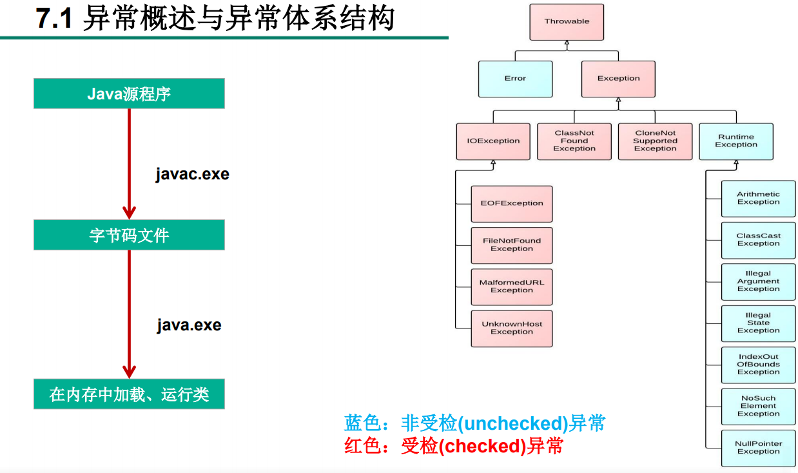

异常分为运行时异常和编译时异常。

关于编译时异常：程序在运行时由于外界因素造成的一 般性异常（语法错误等）。

关于运行时异常（由程序错误所导致的异常）：

如上图的RuntimeException，下面代表的的异常分别是出现异常的运算条件的异常（例如除以0）、类类型转换错误的异常、方法形参传递错误的异常、Java 环境或 Java 应用程序没有处于请求操作所要求的适当状态下的异常、数组等排序索引超出范围的异常、找不到元素的异常、空指针异常。

关于错误：Error表示严重的错误，程序对此无能为力，例如：

- `OutOfMemoryError`：内存耗尽；
- `NoClassDefFoundError`：无法加载某个Class；
- `StackOverflowError`：栈溢出。

## 常见异常

运行时异常：五大运行时异常

- NullPointerException：空指针异常，值为Null时抛出的异常；（1）在需要非null的对象中出现了null，例如`String str = null； str.length()`就会报异常，空对象不能做任何行为；
- ArrayIndexOutOfBuendsException：数组索引越界的异常；（2）
- ArithmetException：运算方面的异常，例如除以0；（3）
- ClassCastException：没有关系的类进行类型强制转换而导致的异常；（4）
- NumberFormatException：数字格式不正常的异常，字符内容的类型与转换成的数据类型不一致导致的异常，例如'abc'通过Integer进行字符转换成数字；（5）

- InputMismatchException：输入不匹配的异常，见Scanner的输入；
- XxxIndexOutOfBuendsException（什么索引越界的异常）。

编译时异常：

- IOException：IO流的异常；
- FileNotFoundException：找不到文件时的异常；
- ClassNotFoundException：找不到类时的异常。

要对编译时异常进行处理，运行时异常根据实际情况决定是否需要进行处理。

## 异常处理机制

编译时异常是必须要处理的，否则程序运行不起来，而运行时异常则根据具体情况来决定是否需要进行处理。

异常处理——捉抛模型：

- 过程一：“抛”：程序执行过程中出现异常，就在异常处生成对应异常类的对象，并抛出此对象，抛出异常后后面的代码不再执行。
- 过程二：“抓”：可以理解为异常的处理方式；处理异常的方式有：try-catch-finally、throws 。

**“抛”，产生异常对象：**

- 系统可以自动生成异常对象并抛出。
- 手动生成：手动生成异常对象，并抛出（使用throw关键字）

```java
// throw是抛过程中生成异常对象的一种方式(手动生成)；throws是异常处理方式，用于处理出现的异常的
throw new XxxException("手动抛出一个异常");
```

**“抓”，异常的处理方式，有两种：**（try-catch-finally、throws）

try-catch-finally：

```java
//try-catch-finally的使用
try{
    //可能出现异常的代码
}catch(异常类型1 变量名1) {
    // 处理异常对象
    e1.printStackTrace();
}catch(异常类型2 变量名2) {
    // 处理异常对象
    e2.getMessage(); // 会返回异常的详细信息
}catch(异常类型3 变量名3) {
    // 处理异常对象
}
......
finally {
    //finally可写可不写
	//finally内的是一定会执行的代码（尽管catch中也存在异常或try、catch里有返回值也会被执行）
}
1.可能出现异常的代码用try给包装起来，当出现异常的时候，会生成一个对应异常的对象，然后根据此对象类型在catch里面进行类型匹配
2.在catch里匹配完成后执行catch里面的代码然后退出try-catch结构（无finally的情况下）
3.【注意】catch里面的类型都没有父子关系的时候，顺序无所谓；如果catch中有异常类型满足子父类关系的时候，子类的要写在父类之前
4.常用的异常对象的处理方法：①返回 String 类型的 getMessage()；②打印出异常具体情况的 printStackTrace()；
5.try结构中声明的变量出了try结构不可以用
6.处理编译时异常，只是将异常推迟到运行时才出现
7.try-catch-finally 结构可以嵌套
    
8. finally 的使用：
像数据库、输入输出流、网络编程Socket等资源，JVM是不能自动回收的，需要手动的进行资源释放；
此时的资源释放就声明在 finally 里
```

throws：

```java
method throws 异常类型 {
    // 可能会出现异常的代码
}
```

1. `throws`写在方法声明处，指明此方法执行时可能会抛出的异常类型，其作用是当方法体执行中出现异常时生成的一个对应异常类的对象时，当此异常对象满足`throws`后指定的异常类型时，就会被抛出，异常抛出后后续代码就不再执行！
2. 【注意】：throws 只是将异常抛给方法的调用者，并没处理掉异常，try 结构才是真正处理掉了异常。

## 自定义异常

自定义异常类：

- 继承于现有异常类：RuntimeException、Exception。
- 提供全局常量：serialVersionUID，标识类。
- （一般地我们将自定义的异常做成运行时异常，好处是可以使用默认的运行时异常处理机制：抛、捉）

```java
public class ResourceNotFoundException extends Exception {
    static final long serialVersionUID = -34322131241L；
    public ResourceNotFoundException(){}
    public ResourceNotFoundException(String msg){
        super(msg);
    }
}
```

```java
public class TestException extends RuntimeException {
    static final long serialVersionUID = -70348971906939L;
    public TestException(String message) {
        super(message);
    }
}
```

# keyword

## this

1. 可用于调用当前类的属性、方法、构造器，意为“当前对象的XXX”。

2. 使用

  - 在类的方法中使用：表示调用当前对象属性或方法；
  - 在类的构造器中使用：表示调用当前正在创建的对象的属性或方法；
  - 特殊情况中：如果方法的形参和类的属性同名或构造器形参和类属性同名，必须用this修饰来表明这是属性；

  - 调用本类中的构造器：
    - `this(形参列表);`：调用本类中含指定形参的构造器；
    - 构造器中不能通过this调用自己，否则构成死循环；
    - 规定：调用构造器是`this(形参列表);`必须声明在当前构造器首行；
    - 构造器内部最多只能声明一个`this(形参列表);`。

```java
public class TestThis {
    private String name;
    private int age;

    public TestThis(String name) {
        this.name = name;
    }
    public TestThis(String name, int age){
        // 调用本类中的构造方法，这个和super不能同时出现，因为调用的构造方法中显式或隐式存在super
        this(name); 
        this.age = age;
    }
    public void method(){
        System.out.println("姓名：" + this.name + "，年龄：" + this.age);
    }
}
```

## super

1. super关键字是一个指示编译器调用超类方法的特殊关键字，意为**当前对象的父类**（super用来区分子类和父类，和this关键字有些相像之处）。
2. super可以用来区分重写与被重写的方法，区分父类、子类都显式声明了的属性：
  - `super.方法 `         表示的是父类中声明的方法
  - `super.属性`         表示的是父类中声明的属性
3. 用来调用父类构造器：
  - 子类构造器中首行声明`super(形参列表);`来调用父类构造器。
  - 构造器中调用其他构造器时，`super(形参列表);`和`this(形参列表);`不能同时出现。
  - 子类在构造器的首行没有显式声明`super(形参列表)`或`this(形参列表)`，则默认调用父类中的空参构造器（`super()`），如果父类中没有提供空参构造器，那子类的构造器必须写`super(形参列表)`或`this(形参列表)`。
  - 在类的多个构造器中，至少有一个使用了super来调用父类的构造器。
4. this 是用来访问本类实例属性和方法的，它会先从本类中找，如果本类中找不到则在父类中找。

## static

1. 因为在编写类时并没有产生实质上的对象，当通过new关键字时才产生了对象并进行了内存空间分配；为了实现特定的属性或方法只存在一份内存里，就发展出了static关键字。

2. static（静态的）：

  - 修饰类成员：修饰属性、方法、代码块、内部类。

  - 类中常量也常常声明为static。

3. 注意

  - 静态变量随着类的加载而加载，静态方法只能调用静态的方法和属性，非静态方法可以调用静态的和非静态的。

  - 静态方法内不能使用this、super关键字，因为这两个关键字都是对象层次上的。

开发中，如何确定是否要声明static：

- 属性可以被多个对象共享且都相同。
- 操作静态属性的方法。
- 工具类中的方法习惯声明为static，比如：Math、Arrays、Collections。

## final

1. 表示最终的、不变的，用来修饰类、方法、变量、对象。
2. 使用：

     - 修饰类：修饰后的类不能被继承，例如String类、System类、StringBuffer类都不能被继承。
     - 修饰方法：修饰后的方法不能被重写，比如Object类的`getClass()`。
     - 修饰变量：修饰的“变量”就成为一个常量，表示这个变量只能被赋值一次（引用数据类型的就是指引用地址是不变的）。
     - 修饰属性：显式属性赋值，代码块、构造器中属性初始化（不能在方法中赋值是因为通过构造器后对象就建立起来了，已经成为了一个常量）。
     - 修饰局部变量：修饰形参时在方法内只能使用这个形参，不能修改这个形参值（如果是引用数据类型则不能修改引用地址）。
3. static final：修饰属性（全局常量（类常量））、修饰方法（很少）。

## package

1. 为了更好的管理项目中的类，提出了包的概念，而package用来声明类或接口所属的包，声明在类的首行；
2. 包的命名都是小写xxxyyyzzz，尽量“见名知义”；
3. 每"."一次，就代表一层文件目录；
4. 同一个包下，不能命名同名的接口、类，但不同的包下可以；
5. JDK中主要的包：

     - java.lang             java语言核心类，如String、Math、Integer、System、Thread，提供常用功能

     - java.net               与网络相关的操作的类和接口

     - java.io                  包含能提供多种输入/输出功能的类

     - java.util                实用工具类，如定义系统特性、接口的集合框架类、使用与日期日历相关的函数

     - java.text               java格式化相关的类

     - java.sql                 JDBC数据库编程的相关类/接口

     - java.awt                抽象窗口工具集的多个类，用来构建和管理应用程序的图形用户界面

## import

使用细节：

1. 用于导入指定包下的类、接口；
2. 在包和类之间声明，如需导入多个，并列导入即可；
3. 使用`import xxx.*`表示导入xxx包下的所有的类结构；
4. 使用的类或接口是java.lang包或本包下定义的，可以省略import结构；
5. 如果在源文件中使用了不同包下的同名的类则必须至少有一个类需要以全类名的方式进行显示`包的完整路径.类名`；
6. 包的子包需要再次导入；
7. `import static xxx.xx.x`导入指定类或接口中的静态结构（静态属性或静态方法 ）。

# Object类

- Object类是所有Java类的超类。
- 类的声明中没有使用extends来指明父类，则默认父类就是java.lang.Object。
- Object类（只声明了一个空参构造器）的属性、方法就具有通用性。

Object类中的equals()：

```java
public boolean equals(Object obj) {
    return (this == obj);
}
```

Object类中toString()：

```java
public String toString() {
    return getClass().getName() + "@" + Integer.toHexString(hashCode());
}
```

- 输出：全类名@内存地址值。
- 输出对象的引用时就会调用这个方法。
- String、Date、File、包装类等都重写了Object类的toString()方法，返回的是实体内容信息。
- 可通过集成开发环境自动去重写。


## ==和equals()

1. ==  ，比较运算符
  - 基本数据类型比较：比较的是两个变量保存的数据是否相等（不一定要相同数据类型）。
  - 引用数据类型比较：比较的是地址值是否相同，即两个引用是否指向同一个实体。
2. equals()
  - 一个只适用于引用数据类型的方法，用来检测对象之间的相等关系。
  - 使用方法：对象1.equals(对象2)。
  - Object类中的equals()和==的作用相同（判断引用类型时）。
  - String、Date、File、包装类等都重写了Object类的equals()方法，它们的equals()比较的是两个对象的实体内容是否相等。

对equals()的简单重写，使其比较的是内容而不是地址：

```java
public class Person {
    private String name;
    int age;
    public boolean equals(Object obj){
        if (obj == this){
            return true;
        }       
        if (obj instanceof Person){ 
            Person p = (Person) obj;
            // 如果是重写的equals方法的类的对象，也可以调用其equals()
            // return this.name.equals(p.name) && this.age == p.age;
            return this.name == p.name && this.age == p.age; 
        }
        return false;
    }
}
```

自动生成的equals重写：（思考：为什么要重写hashCode()方法？？？可去参考核心卷10 P171、JDK hashCode() ）

```java
@Override
public boolean equals(Object o) {
    if (this == o) return true;
    if (o == null || getClass() != o.getClass()) return false;
    Person person = (Person) o;
    return age == person.age && Objects.equals(name, person.name);
}

@Override
public int hashCode() {
    return Objects.hash(name, age);
}
```

**Java语言规范要求equals方法需具有以下的特性：**

1. 自反性：对于任何非空引用x，x.equasl(x)应该返回true。
2. 对称性：对于任何引用x和y，当且仅当y.equals(x)返回true，x.equals(y)也应当返回true。
3. 传递性：对于任何引用x、y、z，如果x.equals(y)返回true，y.equals(z)返回true，x.equals(z)也应当返回true。
4. 一致性：如果x、y引用的对象没有发生变化，那么反复调用x.equals(y)也应该返回true。
5. 对于任意非空引用x，x.equals(null)应该返回false。

写出完美的equals方法的建议：

1. 显式参数命名为otherObject，后面将转换为另一个叫other的变量。

2. 检测this与otherObject是否是同一个引用。

   ```java
   if(this == otherObject) return true;
   ```

3. 检测otherObject是否为null，如果是则返回false。

4. 比较this与otherObject是否是属于同一个类。

   - ```java
     // 如果equals的语义在每个子类中有所改变就用getClass检测 （语义即数据的含义）
     if(getClass() != otherObject.getClass()) return false;
     ```

   - ```java
     // 如果所有子类都拥有统一的语义（要比较的数据都统一），就使用instanceof检测
     if(!(otherObject instanceof ClassName)) return false;
     ```

5. 将otherObject转换为相应类类型的变量。

6. 对所有需要比较的域进行比较，使用==比较基本数据类型，equals比较对象域。如果所有域都相等就返回true。

7. 如果在子类中重新定义equals，就要在其中包含super.equals(other)。

## hashCode()

散列码(hash code)是由对象导出的一个整型值，是没有规律的，不同对象调用hashCode()得到的散列码基本上不会相同。hashCode()定义在Object类中，其值为对象的存储地址（见Java核心卷10 P171）。

String类型的hashCode()，依据内容导出：

```java
public int hashCode() {
    int h = hash;
    if (h == 0 && value.length > 0) {
        char val[] = value;

        for (int i = 0; i < value.length; i++) {
            h = 31 * h + val[i];
        }
        hash = h;
    }
    return h;
}
```

这也就意味着，相同内容的String类型字符的散列值一致，如下测试：

```java
public static void main(String[] args) {
    String str1 = "OK";
    String str2 = new String("OK");
    System.out.println(str1.hashCode()); // 2524
    System.out.println(str2.hashCode()); // 2524
}
```

而StringBuilder类没有定义hashCode方法、equals方法，因此其散列码是由Object类默认的hashCode方法导出的**对象存储地址**：

```java
public static void main(String[] args) {
    StringBuilder str1 = new StringBuilder("OK");
    StringBuilder str2 = new StringBuilder("OK");
    System.out.println(str1.hashCode()); // 460141958
    System.out.println(str2.hashCode()); // 1163157884
}
```

如果重新定义equals方法，就必须要重新定义hashCode方法，以便可以将对象插入到散列表中。

equals方法与hashCode定义必须一致：如果x.equals(y)返回true，那么x.hashCode()就必须和y.hashCode()具有相同的值。

关于HashCode重写 ：（参考[两个对象用equals方法比较为true，它们的Hashcode值相同吗？ - 不会就问咯 - 博客园 (cnblogs.com)](https://www.cnblogs.com/KingIceMou/p/6984424.html?utm_source=itdadao&utm_medium=referral)）

下面的话来自JDK：

  ```txt
      hashCode 
      public int hashCode()返回该对象的哈希码值。支持此方法是为了提高哈希表（例如 Java.util.Hashtable 提供的哈希表）的性能。
      hashCode 的常规协定是： 
      在 Java 应用程序执行期间，在对同一对象多次调用 hashCode 方法时，必须一致地返回相同的整数，前提是将对象进行 equals 比较时所用的信息没有被修改。从某一应用程序的一次执行到同一应用程序的另一次执行，该整数无需保持一致。 
      如果根据 equals(Object) 方法，两个对象是相等的，那么对这两个对象中的每个对象调用 hashCode 方法都必须生成相同的整数结果。 
      如果根据 equals(java.lang.Object) 方法，两个对象不相等，那么对这两个对象中的任一对象上调用 hashCode 方法不 要求一定生成不同的整数结果。但是，程序员应该意识到，为不相等的对象生成不同整数结果可以提高哈希表的性能。 
      实际上，由 Object 类定义的 hashCode 方法确实会针对不同的对象返回不同的整数。（这一般是通过将该对象的内部地址转换成一个整数来实现的，但是 JavaTM 编程语言不需要这种实现技巧。）
  ```

**也就是说：当equals方法被重写时，通常有必要重写 hashCode 方法，以维护 hashCode 方法的常规协定，该协定声明相等对象必须具有相等的哈希码。** 

## toString()

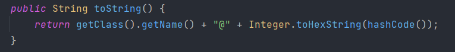

- Object类的方法，默认返回全类名+@+哈希值的十六进制；
- 子类重写方法以实现显示属性值。

## finalize()

当垃圾回收器确定不存在该对象的更多引用时，由对象垃圾回收器调用该方法。子类可重写该方法，做一些释放资源的操作。

垃圾回收的GC算法决定什么时候回收垃圾，可通过System.gc()主动触发垃圾回收。

# 包装类

包装类（Wrapper）：针对八种基本数据类型定义的相应的引用类型，Byte、Short、Integer、Long、Float、Double、Character、Boolean。

包装类、基本数据类型、String三者之间的转换（以整型数据为例）：

- 基本数据类型 ---> 包装类：调用包装类的构造器，注意Boolean的构造器有些优化；

  ```java
  int i = 9;
  Integer num = new Integer(i);
  ```

- 包装类--->基本数据类型：调用包装类Xxx的xxxValue()；

  ```java
  Integer num = new Integer(9);
  int i = num.intValue();
  ```

- JDK5.0新特性：

  - 自动装箱：基本数据类型可以直接赋给相应的包装类对象，基本数据类型 ---> 包装类；
  - 自动拆箱：包装类对象可以直接 赋给相应基本数据类型变量，包装类 ---> 基本数据类型。

- 基本数据类型、包装类 <===> String：

  - String ===> 基本数据类型、包装类：调用相应包装类的 parseXxx()  

    ```java
    String str = "2134";
    int i = Integer.parseInt(str);
    ```

  - 基本数据类型、包装类 ===> String：调用String类的 valueOf() 

    ```java
    int number = 1234；
    String s = String.valueOf(number);
    ```

【**面试**】

```java
public void test() {
    Integer i = new Integer(1);
    Integer j = new Integer(1);
    System.out.println(i == j); // 新建对象，当然false
    
    // Integer内部定义的IntegerCache结构中定义了Integer[]，保存了从-128~127范围内的整数
    // 如果我们用自动装箱的方式给Integer赋值的范围时可以直接使用数组中的元素，不用再去new了
    // 目的：提高效率
    
    Integer m = 1;
    Integer n = 1;
    System.out.println(m == n);//true
    
    Integer x = 128; // 会被new
    Integer y = 128;
    System.out.println(x == y);//false
}
```

# 日志和包

## 日志

我们在平常的代码中，都常用`System.out.print()`来放在程序中某个位置方便测试、检测程序运行情况，但使用这种方式后面还得一步步删去这些代码，所以为了开发的方便，就提供了日志的功能来方便检测程序的运行状况，而且还能随意的确定是否开启日志。（日志就是为了解决使用`System.out.print()`来测试后得全部删除这些语句的问题而设计的）。

3种处理系统错误的机制：抛出异常、日志、使用断言。

**Logger类**

> java.util.logging.Logger

```java
Logger.getGlobal().setLevel(Level.OFF); //用来取消从该命令起的所有的日志
Logger.getGlobal().info("File->Open menu item selected");
//生成的日志信息如下
七月 30, 2021 7:09:02 上午 com.lsl.log.LoggerTest main
信息: 日志测试
```

**日志记录器**

高级日志：自定义日志记录器，使用getLogger方法来创建或获取记录器

```java
//自定义了一个名为com.lsl.mylogger的日志记录器，可以通过该记录器记录日志
//命名决定了父子关系，com.lsl为父记录器，子记录器将会继承父类的日志级别
private static final Logger logger = Logger.getLogger("com.lsl");
private static final Logger myLogger = Logger.getLogger("com.lsl.mylogger");
//用静态变量存储日志记录器的一个应用，防止记录器因未被任何变量引用而被垃圾回收
```

**日志级别**

7个日志级别，默认记录前三个：

- SEVERE
- WARNING
- INFO
- CONFIG
- FINE
- FINER
- FINEST

```java
logger.setLevel(Level.ALL); // 不知道设置这个有啥用
```

## 包

用来组织类。package关键字表示打包。

导包机制-类的导入：只能使用`*`导入一个包：

```java
import java.util.*; // 导入util包下所有的类，但导入不了util包下的包
import java.util.logging.Logger; // 导入Logger类
```

导包机制-静态方法、静态域的导入：

```java
import static java.lang.System.*; // 导入静态方法、静态域
// 静态域也叫静态变量、类域，它属于类而不属于任何独立的对象。
```

# 断言

[断言(assert)的用法 | 菜鸟教程 (runoob.com)](https://www.runoob.com/w3cnote/c-assert.html)

# 断点调试(debug)

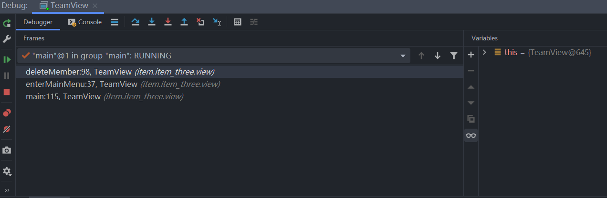

1. `step over`：逐行执行；
2. `step into`：进入到方法体内；
3. `Force step into`：强制进入方法体内；（用于强制进入JDK源码）
4. `step out`：跳出方法；
5. `Drop Frame`：
6. `Run to Cursor`：

左侧边栏：

1. `Return xxx`：重新debug；
2. `Modify Run Configuration`：
3. `Resume Program`：跳到下一个断点；
4. `Stop xxx`：停止debug；
5. `View Breakpoints`：
6. `Mute Breakpoints`：
7. `Get Thread Dump`：
8. `Settings`：

debug进入JDK源码的方式：

1. 使用force step into。
2. 使用step into进入，需要配置：settings ---》Build ---》Debugger ---》Stepping，把Do not setp into the classes里面的`java.*`和j`avax.*`的勾取消掉。 

# javap反编译

 javap是 Java class文件分解器，可以反编译，也可以查看java编译器生成的字节码，从而对代码内部的执行逻辑进行分析。cmd命令。

```cmd
javap [选项] class文件 # javap -c xxx.class 
```

选项：

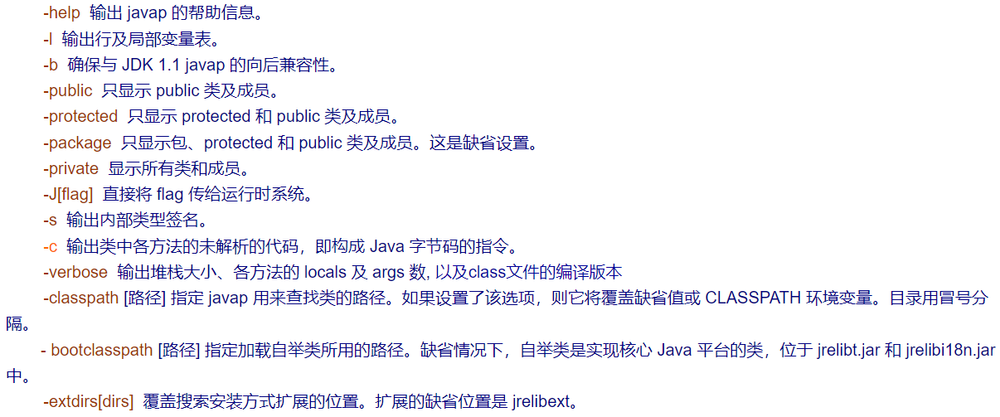

对其中的语法不清楚啊？可以参照一下这两篇博客：

javap -c 命令详解 http://blog.csdn.net/junsure2012/article/details/7099222

JVM字节码之整型入栈指令(iconst、bipush、sipush、ldc) http://www.cnblogs.com/luyanliang/p/5498584.html

如果还不清楚，放大招了：
ORACLE 官方文档  Chapter 4. The class File Format  http://docs.oracle.com/javase/specs/jvms/se7/html/jvms-4.html

# 拓展

## JavaBean

JavaBean：（Java语言编写的可重用组件，是符合以下标准的Java类）

- 类是公共的；
- 有一个无参的公共的构造器。

## UML

UML类图：用来表示类、接口或枚举类等的成员结构。

## MVC

MVC设计模式：

- 常用设计模式之一，将程序分为三个层：view视图模型层、controller控制器层、model数据模型层。

Model、View、Controller概述：

- 模型层（Model）：指从现实世界中抽象出来的对象模型，是应用逻辑的反应；它封装了数据和对数据的操作，是实际进行数据处理的地方（模型层与数据库才有交互）。
- 视图层（View）：是应用和用户之间的接口，它负责将应用显示给用户 和 显示模型的状态。
- 控制器（Controller）:控制器负责视图和模型之间的交互，控制对用户输入的响应、响应方式和流程；它主要负责两方面的动作，一是把用户的请求分发到相应的模型，二是吧模型的改变及时地反映到视图上。
