# JavaSE_heigh

# 	多线程基础

## 概念

**程序：**编写的代码都是为了实现特定的功能，实现这些功能所需要的代码就是一条条逻辑指令，一条条逻辑指令组合成了一个程序，也就是说，程序就是为了完成特定的任务，用编程语言写出来的一条条逻辑指令的集合体。

**进程：**正在运行中的程序，是资源分配的单位（系统在运行时会为每个进程分配不同的内存区域）

既然程序就是用来实现功能的，但它只是一堆指令的集合体，就像军令在军队内才起作用，那么程序的这些指令也得有特定的环境才能发挥作用。当有了适合的环境程序才能被执行起来，我们称这些**在特定环境里已经执行的程序为进程，也就是运行中的程序。**

**生命周期：**进程自身产生、存在、消亡的过程，称为进程的生命周期。

**线程与多线程：**线程是调度和执行的单位（每个线程拥有独立的运行栈和程序计数器PC）

一个复杂的多功能的程序内部存在这样的分层情况，内部会分为不同的程序模块来执行不同的命令，以便完成各个功能。当我们需要用程序实现某个任务时，我们先运行程序，然后使用程序某个命令(功能)，这个命令对应一条程序的执行路径，而当使用多个命令时，就有多条执行路径在运行。线程就是这里的程序内部的执行路径，或者说是程序执行区域，而当这个进程同一时间**可以并行执行多个线程**时，这个程序就是支持多线程的。

并行：多个CPU同时执行多个任务；并发：一个CPU（采用时间片方式）同时执行多个任务 。	 	

多线程优缺点，什么时候要使用多线程？


## 线程类的创建

### 通过继承Thread类：

继承Thrad类并重写run()方法。(可以通过创建匿名子类的对象来创建线程（`new Thread() {重写run方法}.start();`）。)

```java
public class MyThread extends Thread{
    public MyThread() {
        super("MyThreadName: 1");
    }
    @Override
    public void run() {
        // 声明线程要执行的操作
    }
}
```

```java
@Test
public void makeForThread() {
    MyThread myThread = new MyThread(); // 创建线程
    myThread.start();
}
// start()方法:
//（API文档：该方法启动当前线程并调用当前线程的run()方法，启动后不能再次使用当前对象启动另一个线程，只能重新创建对象来启动线程）；
```

### 通过实现Runnable接口：

Runnable封装异步运行的任务。

```java
public class MyRunnable implements Runnable{
    @Override
    public void run() {
        
    }
}
```

```java
@Test
public void makeForRunnable() {
    MyRunnable myRunnable = new MyRunnable();
    Thread thread = new Thread(myRunnable);
    thread.start();
}
```

开发中优先选择通过Runable接口创建线程：

- 继承局限：通过接口来实现没有继承的单继承局限。
- 共享数据：实现接口的方式更适合来处理有共享数据的情况，属性就可以成为共享数据（通过一个Runnable实例来创建多个线程，Runnable的属性就被多个线程共享了）。
- 从内存开销分析：实现接口的方式只用创建一个Runnable实现类对象。


**JDK5.0新增线程创建方式：Callable接口和线程池**

### 通过实现Callable接口:

 与使用Runnable相比， Callable功能更强大些 ：

- 相比run()方法，call()方法可以有返回值、可以抛出异常 ，支持泛型的返回值 ，需要借助FutureTask类，比如获取返回结果。

```java
public class MyCallable implements Callable {
    public Object call() throw Exception{ // 执行完线程后有返回值
       // 声明线程要执行的操作
    }
}
```

```java
@Test
public void makeForCallable() throws ExecutionException, InterruptedException {
    MyCallable myCallable = new MyCallable();
    FutureTask<Integer> ft = new FutureTask<>(myCallable);
    Thread thread = new Thread(ft);
    thread.start();
    System.out.println(ft.get());
}
// 可使用FutureTask类的对象调用get()方法得到call()方法里的返回值
```

关于 Future接口 ：

-  可以对具体的Runnable、Callable任务的执行结果进行取消、查询是否完成、获取结果等。
-  FutrueTask是Futrue接口的唯一的实现类 。
-  FutureTask 同时实现了Runnable，Future接口。它既可以作为 Runnable被线程执行，又可以作为Future得到Callable的返回值。

### 通过线程池：

```java
java.util.concurrent.Executors // Executors，工具类，用于创建线程池
```

通过工具类方法创建的四种线程池：

1.  `newFixedThreadPool()`：固定大小的线程池，满足了资源管理的需求，可以限制当前线程数量。适用于负载较重的服务器环境。

2. `newSingleThreadExecutor()`：相当于大小为1的FixedThreadPool。

3. `newCachedThreadPool()`：一个任务创建一个线程，适用于执行很多短期异步任务的小程序，适用于负载较轻的服务器。

4. `newScheduledThreadPool()`：延迟连接池，可以在给定的延迟时间后执行命令，或者定期执行命令，它比Timer更强大更灵活。

   ScheduledThreadPoolExecutor具有固定线程个数，适用于需要多个后台线程执行周期任务，并且为了满足资源管理需求而限制后台线程数量的场景。

   它适用于单个后台线程执行周期任务，并且保证顺序一致执行的场景。

使用线程池：

```java
// 创建池子
ExecutorService service = Executors.newFixedThreadPool(10);
// 设置线程池属性
ThreadPoolExecutor service1 = (ThreadPoolExecutor)service;
service1.setCorePoolSize(15);

// 执行指定线程
service.execute(new Runnable线程); // 适合用于Runnable
service.submit(new Callable线程);  // 适合用于Callable

```

## 线程的方法

Thread类的常用静态方法，操作的线程是"**正在执行静态方法所在的代码块的线程**"：

```java
// Thread.currentThread()：返回执行当前代码的线程信息 
// Thread.sleep(ms数)：休眠当前线程
// Thread.yield() 释放当前线程的CPU执行权
public static void main(String[] args) throws InterruptedException {
    Thread.sleep(1000); // 当前线程休眠1000ms
    System.out.println(Thread.currentThread()); // Thread[main,5,main]
}
```

线程对象方法：

```java
getName()        // 获取当前线程名称
setName()        // 设置当前线程名称（设置线程名称还可以通过在创建Thread的子类时，通过super("线程名")）
yield()          // 释放当前CPU执行权(释放后CPU又开始重新分配)
join()           // 在当前线程里调用其他线程的join()方法，执行到这个方法时，当前线程停滞，从而执行调用join()方法的线程
stop()    	     // (stop方法已过时，其作用是强制结束进程)
sleep()          // 让当前线程“睡眠“指定的时间(ms),停滞完时长后再执行下去
isAlive()        // 判断当前线程是否存活，true or false
    
// wait()、notify()、notifyAll() 见最后线程通信
```


## 线程分类和优先级

**线程分类：**

1. 守护线程(daemon)：在后台提供服务的线程，不是必须的，程序终止时所有的守护线程也消亡；
2. 用户线程。

```java
// thread.setDaemon(true)可以把一个用户线程变为守护线程。
Thread thread = new Thread(new MRunnable());
thread.setDaemon(true);
```

**多线程优先级：（并不是指哪个高哪个就会先运行完）**

程序中可以存在多个线程，能不能决定这些线程执行顺序呢？为了实现对线程的执行顺序的控制，提供了线程调度的一些方法，但只是在概率层面上来说。

线程调度策略有两种，一种是时间片，一种是抢占式。调度的方法有以下：

- 同优先级线程组成先进先出队列（先到先执行）（时间片）；
- 高优先级，使用优先调度的抢占式策略。

那么如何实现对线程优先级的控制呢？线程的优先级有：1(MIN_PRIORITY)、5(NORM_PRIORITY，此为默认的优先级)、10(MAX_PRIORITY)；

获取当前线程的优先级使用getPriority()方法，设置就用setPriority(int p)方法。高优先级的线程要抢占低优先级的执行权，不过高优先级的先被执行的概率会比低的先被执行的概率大，**并不是高的被执行完低的才执行**。

```java
thread.setPriority(10);
```

## 线程生命周期

Java中通过Thread类或其子类的对象来创建线程。线程通常要经历的五种状态：

- 新建：Thread类或其子类的对象被声明并创建时，新生的线程处于新建状态；
- 就绪：处于新建状态的线程被start()后，将进入线程队列等待CPU时间片，此时它已具备了运行的条件，只是没分配到CPU资源；
- 运行：当就绪的线程被调度并获得CPU资源时,便进入运行状态， run()方法定义了线程的操作和功能；
- 阻滞：在某种特殊情况下，被人为挂起或执行输入输出操作时，让出CPU资源并临时中止自己的执行，进入阻塞状态；
- 死亡：线程完成了它的全部工作或线程被提前强制性地中止或出现异常导致结束。

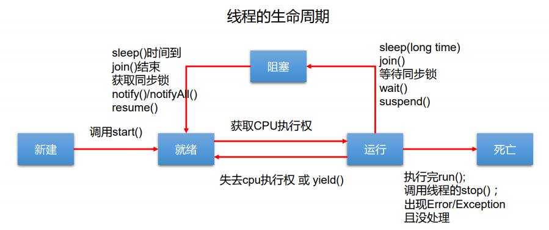


线程安全：为什么线程会有安全问题？

- 线程之间存在共享数据就可能存在线程安全问题。
- 多个线程执行的不确定性引起执行结果的不稳定（线程执行不确定性）。
- 多个线程对信息的共享，会造成操作的不完整性，就会破坏数据（就是多个线程都进入了run里面执行了操作，而使得在同一数据上的操作被多个线程操作过）。

## 线程安全

### 同步机制解决线程安全：

使用**同步代码块**解决线程安全问题：

1. 共享数据——指可能会被多个线程共同操作的变量，操作共享数据的代码就是需要被同步的代码 ===> synchronized括起来的代码不能多也不能少。
2. 关于锁 —— **任何一个类的对象都可以充当锁（但是多个线程必须共用同一把锁）**，要注意的是：
   - 通过继承Thread创建的线程，锁可以考虑用当前线程继承类来代替（Xxx.class），因为类只会加载一次，此时慎用this充当锁。
   - 补充：通过实现Runnable接口来创建的线程，锁就可以使用this来代替，当然使用Xxx.class也可以。
3. 当操作synchronized修饰的代码块（同步代码块）时只能是获得锁的线程参与，一个参与完后并释放锁后（执行完锁会自动释放），下一个线程才能获得锁之后进入并执行，**这个过程相当于单线程，效率低**。

- ```java
  synchronized(同步监视器,俗称锁){
      // 需要被同步的代码
  }
  ```

使用**同步方法**解决线程安全问题：将需要被同步的代码存放于synchronized声明的方法中（此时this（当前对象）就是监视器）

- ```java
  // 1.非静态方法
  public synchronized void test(){
      // 需要同步的代码（此时this就是监视器（当前对象））
  }
  // 2.静态方法
  public static synchronized void test(){
      // 需要同步的代码（此时方法所在类就是监视器(类名.class就是监视器)）
  }
  ```

### 解决懒汉式的线程安全：

```java
public class Test {
    public Test(){
        
    } 
    private static Test instance = null;
    public static Test getInstance() {    //使用同步方法，在返回值前加synchronized，此时锁是Test.class
       synchronized(this){                //使用同步代码块，此时效率不是很好
        if(instance == null) {
            instance = new Test();
            }
        return instance;
        }
    }
}
//同步代码块方式优化：
if(instance == null){             
synchronized(this){                
        if(instance == null) {
            instance = new Test();
        }
    }
    return instance;
}
```

写个程序证明懒汉式存在线程安全问题：

​	

### 死锁：

**不同的线程分别占用对方需要的同步资源不放弃**，都在等待对方放弃自己需要的同步资源，就形成了线程的死锁（双方访问同步资源时所需要的锁都被各自拿到了并使用着，无法释放，于是双方线程就都停滞并等待锁的释放，就形成了死锁） ；

- 出现死锁后，不会出现异常，不会出现提示，只是所有的线程都处于阻塞状态，无法继续。

```java
	// 锁s1被线程1占用，线程s2因等待锁s1释放而停滞；s1休眠结束后要用锁s2，但锁被进程2占用，s1进入停滞
	// 同步资源（锁）被占用，无法释放的锁也就是死锁
	StringBuffer s1 = new StringBuffer();
	StringBuffer s2 = new StringBuffer();
	// 线程1
	new Thread() {
		public void run() {
            // 占用锁 s1
			synchronized (s1) {
				s1.append("1");
				s1.append("2");
				try {
					Thread.sleep(100);
				} catch (InterruptedException e) {
					// TODO Auto-generated catch block
					e.printStackTrace();
				}
				System.out.println(s1);
                // 等待锁 s2 （线程2一执行就占用了锁s2）
				synchronized (s2) {
					s2.append("3");
					s2.append("4");
					System.out.println(s2);
				}
			}
		}
	}.start();
	// 线程2
	new Thread(new Runnable() {
		@Override
		public void run() {
            // 占用锁 s2
			synchronized (s2) {
				s1.append("11");
				s1.append("22");
				System.out.println(s1);
                // 等待锁 s1 （线程1一执行就占用了锁s1）
				synchronized (s1) {
					s2.append("33");
					s2.append("44");
					System.out.println(s2);
				}
			}
		}
	}).start();
```

解决方法：

- 使用专门的算法、遵循一些原则。 
- 尽量减少同步资源的定义 。
- 尽量避免嵌套同步。

```java
final StringBuffer s1 = new StringBuffer();
final StringBuffer s2 = new StringBuffer();
new Thread() {
    public void run() {
        synchronized (s1) {
            s2.append("A");

            try {
                //当前线程停滞，s1被占用，停滞时主线程仍在执行，下面的线程也进入停滞状态
                Thread.sleep(100);               
            } catch (InterruptedException e) {   
                //S2被占用，当停滞完，两个线程访问锁s1、s2，但由于此时两个锁都被占用
                e.printStackTrace();  //进入等待锁释放的时候，两个线程一直等待，形成死锁
            }

            synchronized (s2) {
                s2.append("B");
                System.out.print(s1);
                System.out.print(s2);
            }
        }
    }
}.start();
new Thread() {
    public void run() {
        synchronized (s2) {
            s2.append("C");

            try {
                Thread.sleep(100);
            } catch (InterruptedException e) {
                e.printStackTrace();
            }

            synchronized (s1) {
                s1.append("D");
                System.out.print(s2);
                System.out.print(s1);
            }
        }
    }
}.start();  
```

### Lock锁解决线程安全：

从JDK 5.0开始，Java提供了更强大的线程同步机制——通过**显式定义同步锁对象**来实现同步，同步锁对象使用Lock对象充当。java.util.concurrent.locks.Lock接口是控制多个线程对共享资源进行访问的工具。锁提供了对共享资源的独占访问，每次只能有一个线程对Lock对象加锁，线程开始访问共享资源之前应先获得Lock对象。

- ReentrantLock 类实现了 Lock ，它拥有与 synchronized 相同的并发性和内存语义，在实现线程安全的控制中，比较常用的是ReentrantLock，可以显式加锁、释放锁。

- ```java
  ReentrantLock lock = new ReentrantLock(); // 可以传入参数true，表示公平分配
  public void test(){
      try{
  		lock.lock();   // 为ReentrantLock对象加锁
          // 需要锁住的代码
      }finally{
          lock.unlock(); // 释放锁
      }
  }
  
  ```

建议优先使用顺序： Lock > 同步代码块（已经进入了方法体，分配了相应资源）>同步方法 （在方法体之外）

```java
private ReentrantLock lock = new ReentrantLock(); // 可以传入参数true，表示公平分配
public void run() {
    while (ticket > 0){
        try{
            lock.lock();
     		System.out.println(Thread.currentThread() + ":买得票号" + ticket);
            ticket--;
            Thread.yield();       
        }finally{
            lock.unlock(); 
        }
    }
}
```


【面试】synchronized和Lock的异同：

- Lock是显式锁（手动开启和关闭锁，别忘记关闭锁），**synchronized是隐式锁，出了作用域自动释放** 。
- Lock只有代码块锁，synchronized有代码块锁和方法锁 。
- 使用Lock锁，JVM将花费较少的时间来调度线程，性能更好。并且具有 更好的扩展性（提供更多的子类） 。

【面试】解决线程安全的方式。

## 线程通信

以下方法只能在同步代码块或同步方法中调用：（这三个都是定义在Object下的方法）

- `notify()`方法：只能唤醒一个被wait()的线程，如果有多个则会唤醒优先级最高的；
- `notifyAll()`方法：唤醒所有被wait()的线程；
- `wait()`方法：将当前线程进入阻滞状态并释放同步监视器；
- 【注意】这三个方法的调用者必须是同步代码块或同步方法中的同步监视器（锁是this则可以省略），否则会出现IllegalMonitorStateException异常。

【面试】`sleep()`与`wait()`方法的异同：

- 同：执行到这两个方法都会使当前线程进入阻滞状态；
- 异：
  - 两个方法声明的位置不同：sleep()在Thread类中声明，wait()在Object中声明；
  - 调用的要求不同：sleep()可以在任何场景下使用，wait()只能在同步代码块或同步方法中；
  - wait()执行时会释放同步监视器，sleep()不会。

关于多线程经典问题：生产者/消费者问题

```java
public class ProductTest {
	public static void main(String[] args) {
		Click c = new Click();
		Producter p = new Producter(c);
		p.setName("生产者：");
		
		Customer cust = new Customer(c);
		cust.setName("消费者：");
		p.start();
		cust.start();
		
	}
}
class Click {
	private int produceCount = 0;
	public synchronized void product() {
		if(produceCount < 20) {
			produceCount++;
			System.out.println(Thread.currentThread().getName() + "生产第" + produceCount + "个产品");
			notify();
		}else {
			try {
				wait();
			} catch (InterruptedException e) {
				// TODO Auto-generated catch block
				e.printStackTrace();
			}
		}
	}
	public synchronized void consume() {
		if(produceCount > 0) {
			System.out.println(Thread.currentThread().getName() + "消费第" + produceCount + "个产品");
			produceCount--;
			notify();
		}else {
			try {
				wait();
			} catch (InterruptedException e) {
				// TODO Auto-generated catch block
				e.printStackTrace();
			}
		}
	}
}
class Producter extends Thread {
	private Click click;

	public Producter(Click click) {
		this.click = click;
	}

	@Override
	public void run() {
		while(true) {
			try {
				Thread.sleep(100);
			} catch (InterruptedException e) {
				// TODO Auto-generated catch block
				e.printStackTrace();
			}
			click.product();
		}
	}
	
}
class Customer extends Thread {
	private Click click;

	public Customer(Click click) {
		this.click = click;
	}

	@Override
	public void run() {
		while(true) {
			try {
				Thread.sleep(100);
			} catch (InterruptedException e) {
				// TODO Auto-generated catch block
				e.printStackTrace();
			}
			click.consume();
		}
	}
}
```

# Java常用类

学习目的：知道类是干什么的、以及方法的作用，会使用。

## String类

### 特性

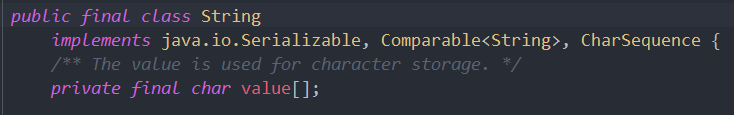

**JDK8中的源码显示：**

- String类被final修饰——不可被继承的；底层是声明为final的char数组，地址不变；（final的value[]可利用数组改变里面的某些值）
- 实现了Serializable和Comparable接口，表示支持序列化（可在网络传输）、可使用compareTo()比较大小；
- 内部定义`final char value[]`用于存储字符串数据。

**String的不可变与使用：**

1. 不可变的字符序列（不可变性）：

  - 原有地址不可变：当对字符串型变量重新赋值，不会在原地址上更改内容，而是得重新指定新的地址赋值，拼接一个字符串也是得新指定区域后再赋值；
  - 当调用String的replace()方法时也是如此，也是重新指定内存区域来进行赋值的。

2. 字面量赋值：

  ```java
  String s1 = "abc";  
  String s2 = "abc";
  System.out.println(s1 == s2);   // true
  // 使用字面量来赋值，字符串会声明在字符串常量池(String Pool)中，注意字符串常量池不会存储相同内容的字符串。
  ```

3. 构造器赋值：

  ```java
  String str2 = new String("123");	
  // 堆空间中开辟存储内存实例化String，指向字符串常量池（堆中实例引用常量池中的字符串）
  // 如果String Pool中不存在"123"，则创建了两个对象
  // 一个是堆中的new结构，另一个是char[]对应的字符串常量池中的数据
  ```

**字符串拼接：**

1. 字面量的拼接在常量池中（常量与常量拼接结果在常量池中，且常量池中不会存在相同内容，只创建了一个字符串对象）。

   ```java
   String s1 = "12" + "12";
   String s2 = "1212";
   System.out.println(s1 == s2); // true
   ```

2. 变量与字面量的拼接或变量与变量的拼接都在堆空间中（拼接式中，只要有一个是变量名，结果就在堆中，**注意**声明为final的变量已经是一个常量（使用new的方式创建的字符串，final后的变量与字面量或常量池常量拼接，最后仍然是在堆空间引用））。

   ```java
   String s1 = "12"; // 常量池中
   final String s2 = "12"; // 常量池中
   String s3 = "12" + s1; // 堆中
   String s4 = "12" + s2; // 常量池中
   String s5 = "1212"; // 常量池中
   final String s6 = new String("12"); // 堆中，final后地址不可变
   System.out.println(s3 == s5); // false
   System.out.println(s4 == s5); // true
   System.out.println(s2 == s6); // false
   ```

3. 如果拼接的结果调用intern()方法，该方法返回值就在常量池中。

   ```java
   String s1 = "12";
   String s2 = new String("12").intern();
   System.out.println(s1 == s2); // true
   ```

### 常用方法

1. **int length()**：返回字符串的长度： return value.length 
2. **char charAt(int index)**： 返回某索引处的字符：return value[index] 
3. **boolean isEmpty()**：判断是否是空字符串：return value.length == 0 
4. **String toLowerCase()**：使用默认语言环境，将 String 中的所有英文字符转换为小写 
5. **String toUpperCase()**：使用默认语言环境，将 String 中的所有英文字符转换为大写 
6. **String trim()**：忽略前导空白和尾部空白后返回字符串的副本
7. **boolean equals(Object obj)**：比较字符串的内容是否相同 
8. **boolean equalsIgnoreCase(String anotherString)**：与equals方法类似，忽略大小写 
9. **String concat(String str)**：将指定字符串连接到此字符串的结尾（连接后结果从堆指向常量池）
10. **int compareTo(String anotherString)**：比较两个字符串的大小 
11. **String substring(int beginIndex)**：返回一个新的从 beginIndex 开始截取到最后一个的子字符串
12. **String substring(int beginIndex, int endIndex)** ：返回一个从beginIndex开始截取到endIndex(不包含)的一个子字符串
13. **boolean endsWith(String suffix)**：测试此字符串是否以指定的后缀结束 
14. **boolean startsWith(String prefix)**：测试此字符串是否以指定的前缀开始 
15. **boolean startsWith(String prefix, int toffset)**：测试此字符串从指定索引开始的子字符串是否以指定前缀开始
16. **boolean contains(CharSequence s)**：当且仅当此字符串包含指定的 char 值序列 时，返回 true （判断某字符是否含某个子串）
17. **int indexOf(String str)**：返回指定子字符串在此字符串中第一次出现处的索引 
18. **int indexOf(String str, int fromIndex)**：返回指定子字符串在此字符串中第一次出 现处的索引，从指定的索引开始 
19. **int lastIndexOf(String str)**：返回指定子字符串在此字符串中最右边出现处的索引 
20. **int lastIndexOf(String str, int fromIndex)**：返回指定子字符串在此字符串中最后 一次出现处的索引，从指定的索引开始反向搜索
21. 【注】：indexOf()和lastIndexOf()方法如果未找到都是返回-1
22. **String replace(char oldChar, char newChar)**：把某个字符串中的单个字符oldChar替换为newChar，返回的是新的字符串，它是通过用newChar替换此字符串中出现的所有oldChar 得到的。 
23. **String replace(CharSequence target, CharSequence replacement)**：（字符序列的替换，只能是字面量）使用指定的字面值替换序列替换此字符串所有匹配字面值目标序列的子字符串。 
24. **String replaceAll(String regex, String replacement)** ： 使用给定的replacement替换此字符串所有匹配给定的正则表达式的子字符串。 
25. **String replaceFirst(String regex, String replacement)** ： 使用给定的replacement替换此字符串匹配给定的正则表达式的第一个子字符串。
26. **boolean matches(String regex)**：告知此字符串是否匹配给定的正则表达式
27. **String[] split(String regex)**：根据给定正则表达式的匹配拆分此字符串
28. **String[] split(String regex, int limit)**：根据匹配给定的正则表达式来拆分此字符串，最多不超过limit个，如果超过了，剩下的全部都放到最后一个元素中


### String与char、byte[]

**String与char[]的互转：**

- String ===> char[ ]：调用String的toCharArray()；
- char[ ] ===> String：调用String的构造器。

```java
String str = "tochararray";
char[] c = str.toCharArray();
System.out.println(c[0]);
```

String与byte[]的互转：（IO流时字节流会使用）

- 编码：String ===> byte[ ]：调用String的getBytes()方法；
- 解码：byte[ ] ===> String：调用String的构造器；
- 编码、解码时所用字符集要一致。

```java
String str = "byte";
byte[] b = str.getBytes(StandardCharsets.UTF_8);
String byteToStr = new String(b);
System.out.println(b[0]); // b -> 98
System.out.println(byteToStr);
```

### 关于String的常见算法

算法：功在平时，不断积累。

1. 模拟一个trim()方法，去除字符两端空白。
2. 将字符串指定部分进行反转。
3. 获取某字符串在另一个字符串中出现的次数。
4. 获取两个字符串中最大相同子串。
5. 对字符串中字符进行自然顺序排序，（提示：字符数组，排序算法，数组转字符串）。

## StringBuffer

【面试】String、StringBuffer、StringBuilder三者的异同？

String：不可变的字符序列；底层用char[]数组存储；

StringBuffer：可变的字符序列；线程安全的，效率低；底层用char[]数组存储；（什么时候用：多线程的，要考虑的线程安全的）；

StringBuilder：可变的字符序列；JDK5.0新增，线程不安全的，效率高；底层用char[]数组存储；（什么时候用：不是多线程，不需要考虑线程安全的）。

### 源码分析

```java
// String
String str = new String(); // char[] value = new char[0],空字符，相当于str = "";
String str1 = new String("abc"); // char [] value = new char[]{'a','b','c'};

StringBuffer sb1 = new StringBuffer(); // char [] value = new char[16];底层创建了一个长度是16的数组
System.out.println(sb1.length);//0
sb1.append('a'); // value[0] = 'a';
sb1.append('b'); // value[1] = 'b';

StringBuffer sb2 = new StringBuffer("abc"); // char[] value = new char["abc".length + 16];

// System.out.println(sb2.length); // 3
// 扩容问题：如果要添加的数据底层数组盛不下，那就需要扩容底层数组；默认情况下，扩容为原来容量的 2倍 + 2，同时将原有数组中的元素复制到新数组中（指导意义：开发中建议大家使用：StringBuffer(int capacity)或StringBuilder(int capacity),指定好容量）
```

### StringBuffer常用方法

- **`append(xxx)`**：提供了很多的append()方法，用于进行字符串拼接 ；

- **`delete(int start,int end)`**：删除指定位置的内容 ；

- **`replace(int start, int end, String str)`**：把[start,end)位置替换为str ；

- **`insert(int offset, xxx)`**：在指定位置插入xxx字符串，插入位置的字符串不会被替换掉 ；

- **`reverse()`**：把当前字符序列逆转；

- 当append和insert时，如果原来value数组长度不够，会扩容。 

- 如上这些方法支持方法链操作。 方法链的原理：

  ```java
  @Override
  public StringBuilder append(String str) {
      super.append(str);
      return this;
  }
  // 方法链操作
  @Test
  public void test() {
      StringBuffer sb = new StringBuffer();
      sb.append("abc").append("123").insert(5,"def").insert(8,"456");
      System.out.println(sb);
  }
  ```

其他方法：

- `public int indexOf(String str) `：str字符串在StringBuffer字符串第一次出现的起始下标，如果没有子串会返回-1；
- `public String substring(int start,int end)` ：返回`[start , end)`之间的子串；
- `public int length()`：字符串长度；
- `public char charAt(int n )` ：返回指定下标的字符；
- `public void setCharAt(int n ,char ch)`：修改指定下标的字符。

总结：

- 增：append()；

- 删：delete(int start,int end)；

- 改：setCharAt(int n ,char ch) / replace(int start, int end, String str)；

- 查：charAt(int n)；

- 插入：insert(int offset, xxx)；

- 长度：length()；

- 遍历：for() + char()  / toString()。


**【注意】StringBuilder 和 StringBuffer 非常类似，均代表可变的字符序列，而且提供相关功能的方法也一样**。

### 线程不安全

StringBuilder线程不安全。

```java
public static void main(String[] args) throws InterruptedException {
    StringBuilder sb = new StringBuilder();
    for (int i = 0; i < 10;i++) {
        Thread t = new Thread(new Runnable() {
            @Override
            public void run() {
                for (int j = 0; j < 1000; j++) {
                    sb.append("a");
                }
            }
        });
        t.start();
    }
    Thread.sleep(100); // 主线程等一会，等各线程都执行完毕再向下执行
    System.out.println(sb.length());
}
```


## Java比较器

Java中的对象，正常情况下只能使用比较运算符来比较（==或!=），不能使用>和<来进行比较，但是在实际的开发场景下，往往需要对多个对象进行比较后再排序，因此就需要java.lang.Comparable 接口和java.util.Comparator接口。

### Comparable接口

> 接口java.lang.Comparable ，是用于自然排序的比较器接口

java.lang.Comparable 接口的`compareTo()`方法是用于对对象进行大小比较的，具体实现在接口实现类中，重写其`compareTo(obj)`方法的规则如下：

- 如果当前对象this大于形参对象obj，则返回正整数；
- 如果当前对象this小于形参对象obj，则返回负整数；
- 如果当前对象this等于形参对象obj，则返回零。

排序中需要对对象进行大小的比较，那就可以调用该方法来进行大小的比较，从而再执行其他操作来完成排序。

Comparable接口的应用——用于排序中的比较：

- String类、包装类等实现了Comparable接口，重写了compareTo()方法，定义了特定的方式来比较两个对象的大小。  
- Arrays工具类的`Arrays.sort(Obj[] obj)`方法可以对数组中的内容进行从小到大的排序，该方法内部实现使用到了compareTo()方法来进行大小的比较。重写了compareTo()方法的类的数组对象，可以调用其进行排序。
-  集合中`Collections.sort(List<T> list)`方法的排序实现也使用到了`Arrays.sort(Obj[] obj)`方法。

使用工具类对自定义类排序的步骤：

1. 自定义类要实现Comparable接口，并重写compareTo(obj)方法（要遵循重写规则），在方法内实现比较的逻辑。
2. 使用Arrays工具类的`Arrays.sort(Obj[] obj)`方法对数组进行排序。

### Comparator接口

> 接口java.util.Comparator，是用于定制排序的比较器接口

当元素的类型没有实现java.lang.Comparable接口而又不方便修改代码时， 或者实现了java.lang.Comparable接口但排序规则不适合当前的需求时，那么可以考虑使用 Comparator 的对象来强行对多个对象进行整体排序的比较。

重写`compare(Object o1,Object o2)`方法，比较对象o1和o2的大小，返回值规则如下：

- 如果方法返回正整数，则表示o1大于o2。
- 如果返回0，表示相等。
- 返回负整数，表示 o1小于o2。

```java
// 使用Comparator 的对象来对多个对象进行整体排序的比较
public static void main(String[] args) {
    String[] arr = new String[]{"A","I","H","G","H","D","B"};
    Arrays.sort(arr, new Comparator<String>() {
        @Override
        public int compare(String o1, String o2) {
            return o1.compareTo(o2);
        }
    });
    System.out.println(Arrays.toString(arr));
}
```

Comparable、Comparator使用对比：

- Comparable的接口方式一旦确定，就保证了Comparable接口实现类的对象在任何位置都可以比较大小。

- Comparator接口属于临时性的比较。


### 比较器总结

无论是使用Comparable或者是Comparator，都使用Arrays.sort()方法或其重写的方法来实现排序。

**关于Comparable接口：**

- String和包装类已经重写了该接口相关方法，可直接调用`Arrays.sort()`实现从小到大的排序。
- 如果对自定义类的数组进行排序，自定义类应实现该接口并重写`compareTo()`方法，再调用`Arrays.sort()`方法实现排序。

**关于Comparator接口：**

- 通过Comparator的对象来重写`compare(Object o1, Object o2)`方法，使用`Arrays.sort(obj，Comparator的对象)`来实现排序。

- 理解`Arrays.sort(obj)`、`compareTo()`、`compare(Object o1, Object o2)`方法，比较器就是对这些方法进行重操作以达到自己所需的排序或比较目的。

## System类

1. System类代表系统，系统级的很多属性和控制方法都放置在该类的内部。 该类位于java.lang包。
2. 由于该类的构造器是private的，所以无法创建该类的对象，也就是无法实例化该类。其内部的成员变量和成员方法都是static的，所以也可以很方便地通过类进行调用。 
3. 成员变量 ：
     - System类内部包含in、out和err三个成员变量，分别代表标准输入流 (键盘输入)，标准输出流(显示器)和标准错误输出流(显示器)。
4. 成员方法 ：

     - `native long currentTimeMillis()`： 该方法的作用是返回当前的计算机时间，时间的表达格式为当前计算机时 间和GMT时间(格林威治时间)1970年1月1号0时0分0秒所差的毫秒数。 


     - `void exit(int status)`： 该方法的作用是退出程序。其中status的值为0代表正常退出，非零代表 异常退出。使用该方法可以在图形界面编程中实现程序的退出功能等。（ 见PPT9.5 ——System类）


     - `void gc()`： 该方法的作用是请求系统进行垃圾回收。至于系统是否立刻回收，则 取决于系统中垃圾回收算法的实现以及系统执行时的情况。


     - `String getProperty(String key)`： 该方法的作用是获得系统中属性名为key的属性对应的值。系统中常见的属性名以及属性的作用如下表所示： 

       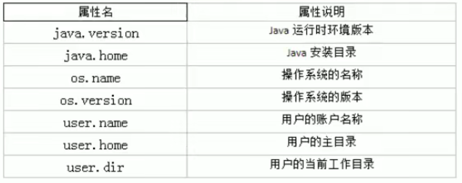


## Math类

java.lang.Math提供了一系列静态方法用于科学计算。其方法的参数和返回 值类型一般为double型。

-  abs() 绝对值 

- acos(),asin(),atan(),cos(),sin(),tan() 三角函数 

- sqrt() 平方根 

- pow(double a,doble b) a的b次幂 

- log 自然对数 

- exp e为底指数 

- max(double a,double b) min(double a,double b) 

- random() 返回0.0到1.0的随机数 

- long round(double a) double型数据a转换为long型（四舍五入） 

- toDegrees(double angrad) 弧度—>角度 toRadians(double angdeg) 角度 —> 弧度


## Arrays类

包含一些对数据进行处理的静态方法。

1. `toString()`：返回数组的字符串形式；
2. sort()：自然排序和定制排序；
3. binarySearch()：二分法查找，但要先排好序；

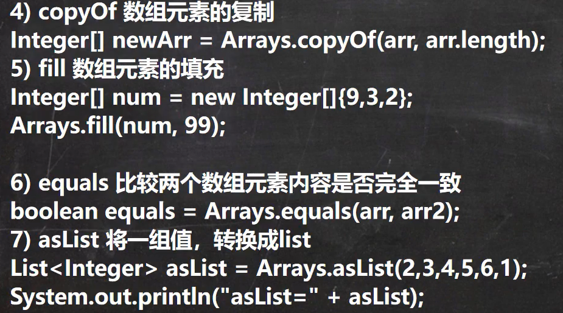

## BigInteger类

Integer类作为int的包装类，能存储的最大整型值为2^31-1，Long类也是有限的， 最大为2^63-1。如果要表示再大的整数，不管是基本数据类型还是他们的包装类都无能为力，更不用说进行运算了。

java.math包的BigInteger可以表示不可变的任意精度的整数。BigInteger提供所有Java 的基本整数操作符的对应物，并提供 java.lang.Math的所有相关方法。 另外，BigInteger还提供以下运算：模算术、GCD 计算、质数测试、素数生成、位操作以及一些其他操作。

- 构造器 `BigInteger(String val)`：根据字符串构建BigInteger对象。
- 常用方法
  - public BigInteger abs()：返回此 BigInteger 的绝对值的 BigInteger；
  - BigInteger add(BigInteger val) ：返回其值为 (this + val) 的 BigInteger ；
  - BigInteger subtract(BigInteger val) ：返回其值为 (this - val) 的 BigInteger ；
  - BigInteger multiply(BigInteger val) ：返回其值为 (this * val) 的 BigInteger ；
  - BigInteger divide(BigInteger val) ：返回其值为 (this / val) 的 BigInteger。整数 相除只保留整数部分；
  - BigInteger remainder(BigInteger val) ：返回其值为 (this % val) 的 BigInteger；
  - BigInteger[] divideAndRemainder(BigInteger val)：返回包含 (this / val) 后跟 (this % val) 的两个 BigInteger 的数组；
  - BigInteger pow(int exponent) ：返回其值为 (thisexponent) 的 BigInteger。

## BigDecimal类

一般的Float类和Double类可以用来做科学计算或工程计算，但在商业计算中， 要求数字精度比较高，故用到java.math.BigDecimal类。 

BigDecimal类支持不可变的、任意精度的有符号十进制定点数。 

- 构造器 
  - `public BigDecimal(double val) `；
  - `public BigDecimal(String val) `。
- 常用方法 
  - `public BigDecimal add(BigDecimal augend)` ；
  - `public BigDecimal subtract(BigDecimal subtrahend) `；
  - `public BigDecimal multiply(BigDecimal multiplicand) `；
  - `public BigDecimal divide(BigDecimal divisor, int scale, int roundingMode)`。

# 日期类

## JDK8之前的时间日期API

### currentTimeMillis():

currentTimeMillis()：返回当前时间与1970年1月1日0时0分0秒之间的时间差，以毫米为单位；也称为时间戳。（System类的方法）。

```java
long l = System.currentTimeMillis();
```


### Date类:

java.util.Date类：表示特定的瞬间，精确到毫秒。

```java
Date date = new Date();  // 当前时间对象，打印输出为当前时间，打印输出时间格式为 Fri Oct 01 09:54:27 CST 2021
Date dates = new Date(123); // 传入毫秒数，为指定毫秒数的时间对象，打印输出时间格式为  Thu Jan 01 08:00:00 CST 1970
```

- 两个方法的使用
  - getTime()：返回自 1970 年 1 月 1 日 00:00:00 GMT 以来到此 Date 对象创建的毫秒数时间。 
  - toString()：把此 Date 对象转换为以下形式的 String： dow mon dd hh:mm:ss zzz yyyy ，其中： dow 是一周中的某一天 (Sun, Mon, Tue,  Wed, Thu, Fri, Sat)，zzz是时间标准，yyyy是年份；例如 Fri Oct 01 09:54:27 CST 2021。
  - 其它很多方法都过时了。

java.sql.Date类：对应数据库中的date字段类型，数据库中的数据封装到Java中，date->java.sql.date，专门匹配数据库的date

- 实例化：java.sql.Date date = new java.sql.Date(毫秒数)，时间格式为yyyy-mm-dd；
- java.util.Date--->java.sql.Date：转换为数据库中的时间，使用构造器，把毫秒数扔进构造器。

### SimpleDateFormat类:

> java.text.SimpleDateFormat  可以将日期对象格式化为一定的格式，或将字符格式化为Date对象

使用默认格式： `21-10-1 上午10:50`

```java
SimpleDateFormat sf = new SimpleDateFormat();
Date date = new Date();
Date d = sf.format(date)；
System.out.println(d); // 输出的格式为 21-10-1 上午10:50
// 字符串转换为Date对象
String str = "21-10-1 上午10:50"; // 字符格式严格，必须是这样
Date da = sf.parse(str)；
```

自定义时间日期格式：

```java
Date date = new Date();
// 自定义时间格式
SimpleDateFormat test = new SimpleDateFormat("yyyy:MM:dd hh:mm:ss");
// 对date进行格式化：调用SimpleDateFormat类的format()方法；
String showTime = test.format(date);
try {
    Date showTime2 = test.parse("2021:05:01 10:20:30");
    System.out.println(showTime2);
} catch (ParseException e) {
    e.printStackTrace();
}
```

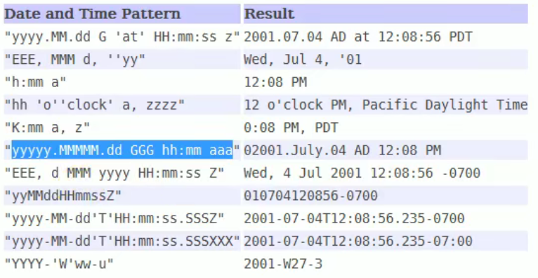

总结：

- 格式化：日期--->字符串：调用SimpleDateFormat类的format()方法；
- 解析：字符串--->日期：调用SimpleDateFormat类的parse()方法；
- 注意解析时字符串的格式要和所用的SimpleDateFormat对象的时间格式相同。

### Calendar类:

Calendar类（日历类，抽象类）

```java
// 通过其子类创建对象
GregorianCalendar gc = new GregorianCalendar();
// 通过其静态方法getInstance()
Calendar examole = Calendar.getInstance();
```

日历类的常用方法的使用：

```java
Date date = new Date();
GregorianCalendar gc = new GregorianCalendar();
int i = gc.get(Calendar.DAY_OF_MONTH); // 第几号
System.out.println(i);
gc.set(Calendar.DAY_OF_MONTH,3); // 设置为第几号
gc.add(Calendar.DAY_OF_MONTH,3); // 设置为第(n+3)号
Date date2 = gc.getTime(); // 日历类转为Date类
gc.setTime(Date); // 设置日历类的Date属性值，一个Date变为了日历类的数据，日历类的年月日等也跟着
```

获取月份时，一月是0，十二月是11；获取星期时，周日是1，周六是7。

## JDK8中新的时间日期API

### LocalDateTime

- java.time – 包含值对象的基础包 
- java.time.chrono – 提供对不同的日历系统的访问 
- java.time.format – 格式化和解析时间和日期 
- java.time.temporal – 包括底层框架和扩展特性 
- java.time.zone – 包含时区支持的类 

【说明】大多数开发者只会用到基础包和format包，可能会用到temporal包。因此，尽管有68个新的公开类型，大多数开发者大概将只会用到其中的三分之一。

- LocalDate、LocalTime、LocalDateTime 类，它们的实例是不可变的对象，分别表示使用 ISO-8601日历系统的日期、时间、日期和时间。
-  它们提供了简单的本地日期或时间，并不包含当前的时间信息，也不包含与时区相关的信息；
- LocalDate：年月日，代表IOS格式（yyyy-MM-dd）的日期，可以存储 生日、纪念日等日期。 
- LocalTime：时分秒，表示一个时间（时、分、秒），而不是日期。
-  LocalDateTime：年月日时分秒，是用来表示日期和时间的，这是一个最常用的类之一。 
- 注：ISO-8601日历系统是国际标准化组织制定的现代公民的日期和时间的表示法，也就是公历。

LocalDate、LocalTime、LocalDateTime             看API吧，方法太多了

LocalDateTime常用方法：

- now()：静态方法，可通过类直接调用；
- 还有其他的实现类的方法，用于获取年、月、日、时、分、秒，或者添加年份、月份、天数等方法。
- 查看API手册，开发中尽量使用jdk8中新的。

###  Instant时间戳

 Instant，时间戳，类似Date类。

```java
Date date = new Date();
// 获取当前时间
Instant ins = Instant.now();
// date转换为时间戳
Instant instant = date.toInstant();
// 时间戳转换为date
Date from = Date.from(instant);
System.out.println(Instant.now());
```

### DateTimeFormatter

java.time.format.DateTimeFormatter 类，用于格式化时间日期。

```java
// 获取当前时间
LocalDateTime localDateTime = LocalDateTime.now();
// 设置格式化时间样式
DateTimeFormatter dt = DateTimeFormatter.ofPattern("yyyy年MM月dd日 HH小时mm分ss秒");
// 对获取的时间进行格式化
String format = dt.format(localDateTime);
System.out.println(format);
```

# 枚举类

枚举类：一个类只有有限的、确定的对象，我们称此类为枚举类；当需要定义一组常量时，强烈建议使用枚举类。如果枚举类中只有一个对象，则可以作为单例模式的实现方式。

 如何自定义枚举类：

-  JDK5.0之前，自定义枚举类

```java
class Season{
    private final String seasonName;
    private final String seasonDesc;
    
    private Season(String seasonName, String seasonDesc) {
        this.seasonName = seasonName;
        this.seasonDesc = seasonDesc;
    }
    
    public static final Season SPRING = new Season("春天", "春意盎然");
    public static final Season SUMMER = new Season("夏天", "夏日炎炎");
    public static final Season AUTUMN = new Season("秋天", "秋高气爽");
    public static final Season WINTER = new Season("冬天", "冬温夏清");
    
}
```

- JDK5.0，可以使用enum关键字，该类默认继承了java.lang.Enum，所以不能再继承其它的类

```java
enum Season{

    SPRING("春天", "春意盎然"), // 常量名(实参列表)，使用无参构造器创建枚举对象，则可以省略`(实参列表)`；对象必须在行首
    SUMMER("夏天", "夏日炎炎"),
    AUTUMN("秋天", "秋高气爽"),
    WINTER("冬天", "冬温夏清");
    private final String seasonName;
    private final String seasonDesc;

    private Season(String seasonName, String seasonDesc) {
        this.seasonName = seasonName;
        this.seasonDesc = seasonDesc;
    }
}
```

Enum类的主要成员方法： 

- values()方法：返回枚举类型的对象数组。该方法可以很方便地遍历所有的枚举值

  - ```java
    Season[] arr = Seasom.values（）；
    ```

- valueOf(String str)：返回枚举类中对象名是指定字符的对象。如不是，会有运行时异常IllegalArgumentException；

  - ```java
    Season[] arr = Seasom.valuesOf（"xxx"）； // 字符串必须为已有的常量名 
    ```

- toString()：返回当前枚举类对象常量的名称；

- name()：返回常量名；compareTo()：比较两个枚举常量的位置号。

- 枚举类在编译阶段会被编译器插入一些静态方法
- 枚举类本身有个只有编译器能够调用的构造方法，编译器会使用该方法将枚举值实例化为枚举类型的对象
- 枚举值被实例化后，继承了众多java.lang.Enum中的方法

实现接口的枚举类：

```java
interface Info{
    show();
}
// 情况一： 和平常一样实现并重写方法
// 情况二： 用对象来重写方法，实现不同对象的诉求
enum Season implements Info{

    SPRING("春天", "春意盎然"){
        //重写接口的方法
    },
    SUMMER("夏天", "夏日炎炎"){
        
    },
    AUTUMN("秋天", "秋高气爽"){
        
    },
    WINTER("冬天", "冬温夏清"){
        
    };
    private final String seasonName;
    private final String seasonDesc;

    private Season(String seasonName, String seasonDesc) {
        this.seasonName = seasonName;
        this.seasonDesc = seasonDesc;
    }
}
```

# 注解(Annotation)

## 了解注解

1. **注解的出现：**从JDK 5.0 开始，Java 增加了对元数据(MetaData) 的支持, 也就是 Annotation(注解) 。
2. **注解的作用：**Annotation 其实就是代码里的特殊标记, 这些标记可以在编译、类加载、运行时被读取, 并执行相应的处理。通过使Annotation，程序员可以在不改变原有逻辑的情况下，在源文件中嵌入一些补充信息。代码分析工具、开发工具和部署工具可以通过这些补充信息进行验证或者进行部署。
3. **注解使用范围：**Annotation 可以像修饰符一样被使用，可用于修饰包、类、构造器、方法、成员变量、参数、局部变量的声明，这些信息被保存在 Annotation 的 “name=value” 对中。
4. **注解的重要性：**
   - 在JavaSE中，注解的使用目的比较简单，例如标记过时的功能，忽略警告等。在JavaEE/Android中注解占据了更重要的角色，例如用来配置应用程序的任何切面，代替JavaEE旧版中所遗留的繁冗代码和XML配置等。
   - 未来的开发模式都是基于注解的，JPA是基于注解的，Spring2.5以上都是基于注解的，Hibernate3.x以后也是基于注解的，现在的 Struts2有一部分也是基于注解的了，注解是一种趋势，一定程度上可以说：**框架 = 注解 + 反射 + 设计模式。**

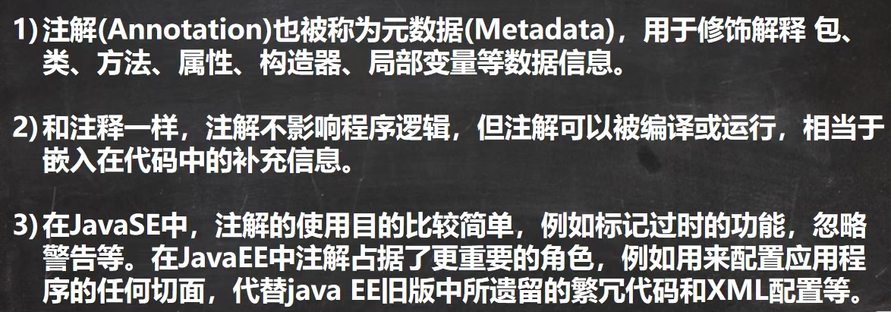

## 了解常见注解示例

使用 Annotation 时要在其前面增加 `@ `符号，可以把 Annotation 当成一个修饰符使用，用于修饰它支持的程序元素 。

**示例一：与使用文档注释来生成说明文档的相关的注解** （在文档注释类使用的注解）

1. @author：标明开发该类模块的作者，多个作者之间使用`,`（道号）分割。
2. @version：标明该类模块的版本 。
3. @see：参考转向，也就是相关主题。
4. @since：从哪个版本开始增加的。
5. @param：对方法中某参数的说明，如果没有参数就不能写。
6. @return：对方法返回值的说明，如果方法的返回值类型是void就不能写。
7. @exception：对方法可能抛出的异常进行说明 ，如果方法没有用throws显式抛出的异常就不能写其中。
8. 【注意】@param、@return 和 @exception： 这三个标记都是只用于方法上的文档注释的。
  - @param的格式要求：`@param 形参名 形参类型 形参说明` ；
  - @return 的格式要求：`@return 返回值类型 返回值说明 `；
  - @exception的格式要求：`@exception 异常类型 异常说明 `；
  - @param和@exception可以并列多个。

**示例二：在编译时进行格式检查(以下是JDK内置的三个基本注解)**

- @Override：限定重写方法，该注解只能用于方法，修饰后会对方法进行校验，要求方法是重写方法。
- @Deprecated： 用于表示所修饰的元素（类， 方法等），已过时。通常是因为所修饰的结构危险或存在更好的选择 。
- @SuppressWarnings：用于抑制编译器的警告。

**示例三：跟踪代码依赖性，实现替代配置文件功能**

- Servlet3.0提供了注解(annotation)，使得不再需要在web.xml文件中进行Servlet的部署；

- ```java
  @WebServlet("/login")
  public class LoginServlet extends HttpServlet {
  private static final long serialVersionUID = 1L;
  protected void doGet(HttpServletRequest request, HttpServletResponse response) throws
  ServletException, IOException { }
  protected void doPost(HttpServletRequest request, HttpServletResponse response) throws
  ServletException, IOException {
  doGet(r
  ```

- spring框架中关于“事务”的管理。


**示例四：**

```java
public Cl {
    @Override          // 如果加上这个，会进行重写的一些语法校验，如果不是重写方法则编译错误
    public void test() {
        
    }
}
```

## 自定义注解

**自定义Annotation ：**（参考`@SuppressWarnings`注解）

- 声明方式：`public @interface 注解名称 {}  `   (自动继承了Annotation接口)。
- 注解成员变量：（也称为配置参数）
  - 以无参数方法的形式来声明，例如：`int value();`（只有一个参数成员时，建议使用参数名为value）。
  - 成员类型：八种基本数据类型、String类型、Class类型、enum类型、Annotation类型、 以上所有类型的数组。
  - 指定成员变量的初始值可使用 default 关键字，例如：`int value() default 3`。
  

```java
public @interface MyAnnotation {
    //String value(); 
    String value() default "value";
}
```

**自定义的注解的使用：**

- 如果定义的注解含有配置参数，那么使用时必须指定参数值，除非它有默认值。格式是“参数名 = 参数值” ，如果只有一个参数成员，且名称为value， 则可以省略“value=” ；
- 没有定义成员的注解称为标记；包含成员变量的Annotation称为元数据注解。
- 注意：自定义注解必须配上**注解的信息处理流程(即使用反射)**才有意义。

```java
@MyAnnotation("hello") 
public void test(){

}
```

## 元注解

**JDK中的元注解 ：**

- 元注解：对现有的注解进行解释说明的注解，修饰注解的注解。
- JDK5.0提供了4个标准的meta-annotation类型，分别是： 
  - `@Retention `、`@Target `。
  - `@Documented` 、`@Inherited`用得较少。

### **@Retention：**

`@Rentention `用于指定注解的生命周期（作用范围，默认是class），Retention 保留了  Policy策略。其包含一个名为 `RetentionPolicy`的枚举类型的成员变量，使用 `@Rentention` 时必须为其` value `成员变量指定值：

- `RetentionPolicy.SOURCE`：在源文件中有效（即源文件保留），编译器使用后会直接丢弃这种策略的注解 。
- `RetentionPolicy.CLASS`：在class文件中有效（即class保留） ， 当运行 Java 程序时，JVM  不会保留注解（这是默认值） 。
- `RetentionPolicy.RUNTIME`：在运行时有效（即运行时保留），当运行 Java 程序时，JVM 会保留注解。程序可以通过反射获取该注解。

```java
@Documented
@Retention(RetentionPolicy.RUNTIME)
@Target(ElementType.ANNOTATION_TYPE)
public @interface Retention {
    /**
     * Returns the retention policy.
     * @return the retention policy
     */
    RetentionPolicy value();
}
```

````java
@Retention(value = RetentionPolicy.SOURCE)
public @interface MyAnnotation {
    String value() default "value";
}
````

### **@Target ：**

`@Target`用于指定注解类可以在哪些地方使用（类（ElementType.TYPE）、接口、枚举类、属性、方法、局部变量、包等）。

源码：

```java
@Documented
@Retention(RetentionPolicy.RUNTIME)
@Target(ElementType.ANNOTATION_TYPE)
public @interface Target {
    /**
     * Returns an array of the kinds of elements an annotation type
     * can be applied to.
     * @return an array of the kinds of elements an annotation type
     * can be applied to
     */
    ElementType[] value();
}
```

使用：

```java
@Target({ElementType.TYPE,ElementType.FIELD,ElementType.METHOD,ElementType.PACKAGE,ElementType.CONSTRUCTOR,ElementType.LOCAL_VARIABLE})
public @interface MyAnnotation {
    String value() default "value";
}
```

### **@Documented ：**

被该元注解修饰的 Annotation（注解）类将被 javadoc 工具提取成文档。默认情况下，javadoc生成的文档是不包括注解的。

被`@Documented`修饰的注解必须设置`@Retention`的值为RUNTIME。

```java
@Retention(value = RetentionPolicy.RUNTIME)
@Documented
public @interface MyAnnotation {
    String value() default "value";
}
```

### **@Inherited：**

被它修饰的注解将具有继承性。如果某个类使用了被 `@Inherited` 修饰的注解，那么这个类的子类将自动具有该注解。

比如：如果把标有@Inherited注解的自定义的注解标注在类级别上，子类则可以继承父类级别的注解 （际应用中，使用较少）。

```java
// 自定义注解
@Retention(value = RetentionPolicy.RUNTIME)
@Inherited
public @interface MyAnnotation {
    String value() default "extends";
}
// 使用该注解的类
@MyAnnotation
public class AnnotationTest {
}
// 该类继承AnnotationTest，会继承到注解
public class ExtendsAnnotation extends AnnotationTest{
    public static void main(String[] args) {
        Class clazz = ExtendsAnnotation.class;
        Annotation[] annotations = clazz.getAnnotations();
        System.out.println(annotations[0]); // 输出：@com.lsl.test.MyAnnotation(value=extends)
    }
}
```

## JDK8中注解新特性

**可重复注解：**可重复使用多个注解来修饰，使用`@Repeatable(名字.class)`。

可重复注解的实现：

1. 声明两个注解 MyAnnotation 和 MyAnnotations。
2. 在MyAnnotation上声明 `@Repeatable(MyAnnotations.class)`。
3. MyAnnotation的@Target、@Retention、@Inherited等元注解与MyAnnotations要相同。

```java
@Retention(RetentionPolicy.RUNTIME)
@Inherited
public @interface MyAnnotations {
    MyAnnotation[] value();
}
@Retention(value = RetentionPolicy.RUNTIME)
@Repeatable(MyAnnotations.class)
@Inherited
public @interface MyAnnotation {
    String value() default "extends";
}
@MyAnnotation("v1")
@MyAnnotation("v2")
public class AnnotationTest {
}
```

```java
// jdk8之前使用此种方式实现重复注解
@Retention(value = RetentionPolicy.RUNTIME)
@Inherited
public @interface MyAnnotation {
    String value() default "extends";
}
@MyAnnotations({@MyAnnotation("v1"),@MyAnnotation("v2")})
public class AnnotationTest {
}
@MyAnnotations({@MyAnnotation("v1"),@MyAnnotation("v2")})
public class AnnotationTest {
}
```

**类型注解：**JDK1.8之后，关于元注解@Target的参数类型ElementType枚举值多了两个： TYPE_PARAMETER、TYPE_USE。在Java 8之前，注解只能是在声明的地方所使用，Java8开始，注解可以应用在任何地方。

`ElementType.TYPE_PARAMETER`，表示该注解能写在类型变量的声明语句中（如：泛型声明）：

```java
public class TestTypeDefine<@TypeDefine() U> {
    private U u;
    public <@TypeDefine() T> void test(T t){

    }
}
// 注解
@Target(ElementType.TYPE_PARAMETER)
public @interface TypeDefine {
}
```

`ElementType.TYPE_USE`，表示该注解能写在使用类型的任何语句中：

```java
@Target({ElementType.TYPE_PARAMETER,ElementType.TYPE_USE})
public @interface TypeDefine {
}
public class TestTypeDefine<@TypeDefine() U> {
    private U u;
    public <@TypeDefine() T> void test(T t){
        ArrayList<@TypeDefine String> list = new ArrayList<>(); // 没加TYPE_USE时此处报错
        int num = (@TypeDefine int) 10L; // 没加TYPE_USE时此处报错
    }
}
```

# 反射

## 概述

反射（reflect）就是能够分析类能力的程序。反射机制允许程序在执行期借助于Reflection API取得任何类的内部信息，并能直接操作任意对象的内部属性及方法。

反射的原理？

加载完类之后，**在堆内存的方法区中就产生了一个Class类型的对象（一个类只有一个Class对象，该对象称为运行时类）**，这个对象就包含了完整的类的结构信息。我们可以通过这个对象看到类的结构。（按Java核心技术上来说就是：程序在运行期间，Java的运行时系统总是为所有的对象创建了一个被称为运行时的类型标识，此类型标识的信息跟踪着每个对象所属的类，而保存这些信息的类就是java.lang.Class类。因此可以根据该类的方法来对运行时的类的信息进行操作。）

```
面试题：
通过new对象来创建对象还是通过反射来创建对象？
根据反射的特征-动态性来回答。

反射机制与封装性是否矛盾？如何看代这两个？
封装是建议不能调，反射是能不能调。
```

反射相关的类：

- java.lang.Class：代表字节码文件（代表整个类）；
- java.lang.reflect.Method：代表字节码中的方法字节码（代表类中的方法）；
- java.lang.reflect.Field：代表字节码的属性字节码（代表类中的成员变量（静态、实例变量））；
- java.lang.reflect.Constructor：代表类的构造器。

## 动态语言与静态语言

1、动态语言
是一类在运行时可以改变其结构的语言：例如新的函数、对象、甚至代码可以被引进，已有的函数可以被删除或是其他结构上的变化。通俗点说就是在运行时代码可以根据某些条件改变自身结构。主要动态语言：Object-C、C#、JavaScript、PHP、Python、Erlang。
2、静态语言
与动态语言相对应的，运行时结构不可变的语言就是静态语言。如Java、C、C++。
补充：动态语言 vs 静态语言
Java不是动态语言，但Java可以称之为“准动态语言”。即Java有一定的动态性，我们可以利用反射机制、字节码操作获得类似动态语言的特性。Java的动态性让编程的时候更加灵活！

## 反射的动态性

动态地获取运行时类来动态地产生对象，在没有运行时是不知道会产生哪个对象的。

## Class-运行时类

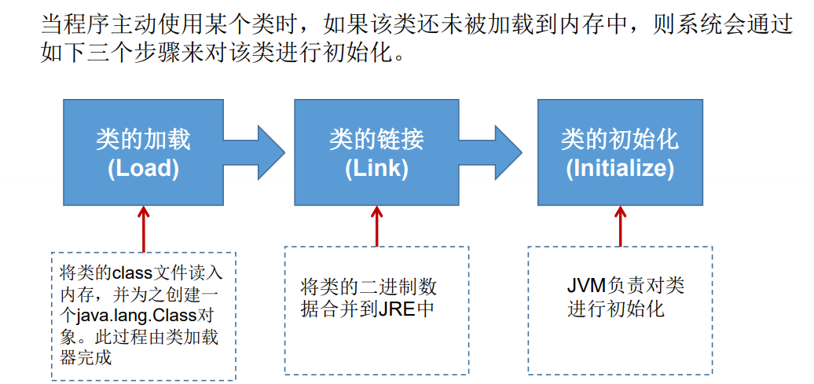

程序经过javac.exe编译生成字节码文件；字节码文件经过java.exe解释运行到内存中，程序运行时Java运行时系统会为所有对象维护一个被称为运行时的类型标识，可以通过特点方法获取运行时所属类的实例。

以下类型都会有运行时类对象：

- 类（外部类、成员（内部类、静态内部类）、局部内部类、匿名内部类）；
- 接口：interfaces；
- 数组；
- 枚举类：enum；
- 注解：annotation，@interface；
- 基本数据类型：primitive type；
- void。

## 反射的使用

1. 在程序运行时对类信息进行操作，包括：
   - 判断任意一个对象所属的类；
   - 构造任意一个类的对象；
   - 判断任意一个类所具有的成员变量和方法；
   - 获取泛型信息；
   - 调用任意一个对象的成员变量和方法；
   - 处理注解。
2. 生成动态代理。

### 一：获取运行时类

（程序生命周期内获取的对象都是相同的，就是说运行时类会缓存一段时间，获取方式不同但运行时类是相同的）。

获取运行时类的四种方法 ：

1. 通过创建好的对象调用Object类的getClass()方法：`xx.getClass()`：

   ```java
   Person p = new Person();
   Class clazz1 = p.getClass();
   ```

2. 通过调用静态方法Class.forName("classname")获取；（classname是类名或接口名）；

3. 通过T.class；（如果T表示任意的Java类型（或void关键字），T.class将代表匹配的运行时类对象）；

4. 通过类的加载器ClassLoader:

   - 先获取加载器`ClassLoader cl = 当前类.class.getClassLoader();`；
   - 再获取运行时类对象`Class cla = cl.loadClass("com.lsl.reflect.Person");`，注意类的路径。

   

   ```Java
   public class ReflectTest {
   	public static void main(String[] args) throws Exception {
           //Class.forName("classname")；
           Class clazz2 = Class.forName("com.lsl.reflect.Person");
           //T.class
   		Class clazz = Person.class;
   		//ClassLoader
   		ClassLoader cl = ReflectTest.class.getClassLoader();
   		Class cla = cl.loadClass("com.lsl.reflect.Person");
   		System.out.println(cla);
   	}
   }
   ```

   

### 二：通过反射创建对象

获取运行时类后就可以通过调用运行时类的方法去获取目标类的属性、方法、构造器（包括私有的构造器、方法、属性），实现调用与构造。

1. 通过调用运行时类的newInstance()方法创建对象（很少会通过获取有参构造器方法getConstructor()来创建对象）

   - ```java
     newInstance() 
     //调用的是空参的构造器，构造器的权限得足够，通常为public
     //所以建议都有空参构造器，方便通过反射创建对象和当子类使用super()时能调用父类的空参构造器
     ```

   - 如果没有空参构造器，可通过构造器的newInstance()创建对象：

     ```java
     Constructor constructor = clazz.getDeclaredConstructor(String.class, int.class);
     constructor.setAccessible(true);
     Person lsl = (Person) constructor.newInstance("LSL", "22");
     ```


### 三：获取运行时类的结构

1. 属性：获取属性的结构

   ```java
   Class class1 = Person.class;
   // 获取所有的public权限的属性，包括父类的
   //获取到的每个值举例：public int com.LSL_sanqiumu.reflectdemo.pojo.Person.id
   Field[] field1 = class1.getFields(); 
   // 获取所有的属性但不包含父类的，获取的值和上面类似
   Field[] field3 = class1.getDeclaredFields(); 
   for (Field f : field3) {
   	// 获取属性权限
       //权限都有对应的一个int类型的值
   	int modifier = f.getModifiers();
   	System.out.print(Modifier.toString(modifier) + "\t");
   	// 获取属性的数据类型
   	Class type = f.getType();
   	// 获取属性的变量名
   	String fieldName = f.getName();
   }
   ```

2. 方法：获取方法的结构

   ```java
   Class clazz = Person.class;
   //获取所有的方法，包括父类的
   Method[] methods = clazz.getMethods();
   // 获取所有声明了的方法，不包括父类的
   Method[] declaredMethods = clazz.getDeclaredMethods();
   for (Method m : declaredMethods) {
       System.out.println(m);
   }
   // public void com.LSL_sanqiumu.reflectdemo.pojo.Person.info()
   // public java.lang.String com.LSL_sanqiumu.reflectdemo.pojo.Person.show(java.lang.String)
   ```

   ```java
   getAnnotations()  // 获取注解
   getModifiers()    // 获取权限修饰符
   getReturnType()   // 获取返回值类型
   getName()		  // 获取方法名
   getParameterTypes()  // 获取参数类型的数组（使用getName能得到形参类型具体值）
   getExceptionTypes()  // 获取抛出的异常
   ```

   

3. 构造器：获取构造器结构

   ```java
   Class clazz = Person.class;
   // 获取当前类中的public的构造器
   Constructor[] constructors = clazz.getConstructors();
   // 获取当前类中的所有的声明了的构造器
   Constructor[] declaredConstructors = clazz.getDeclaredConstructors();
   ```

4. 父类：

   ```java
   // 获取运行时类的父类
   clazz.getSuperclass();
   // 获取运行时类带泛型的父类
   Type type = clazz.getGenericSuperclass
   // 获取泛型类型
   ParameterizedType pt = (ParameterizedType) type;
   Type[] actualTypeArguments = pt.getActualTypeArguments();
   ```

5. 接口、包、注解：

   ```java
   Class[] interfaces1 = clazz.getInterfaces();
   Class[] interfaces2 = clazz.getSuperclass().getInterfaces();
   for (Class c : interfaces2) {
       System.out.println(c);
   }
   Package aPackage = clazz.getPackage();
   Annotation[] annotations = clazz.getAnnotations();
   ```

   

### 四：调用指定内容

通过反射还可以对指定的对象设置值或取值、调用其方法和构造器。

```java
Person p = new Person();
Field name = clazz.getDeclaredField("name");
name.setAccessible(true); // 设置私有属性可访问
name.set(p,"lsl");
System.out.println(name.get(p));
```

```java
private String show(String nation,String age){
	System.out.println("我的国籍是：" + nation + age);
	return nation;
}
// 获取该类的show方法，后面指定形参类型
Method show = clazz.getDeclaredMethod("show", String.class,String.class);
// 设置该私有方法可访问
show.setAccessible(true);
// 调用p对象的show方法，并传入形参；返回值
Object returnValue = show.invoke(p,"zg","12");
// 如果调用静态方法：xxxmethods.invoke(Xxx.class);
```

```java
Constructor constructor = clazz.getDeclaredConstructor(String.class, int.class);
constructor.setAccessible(true);
Person lsl = (Person) constructor.newInstance("LSL", "22");
```

# Properties配置文件

```java
public class PropertiesTest {
	public static void main(String[] args) throws Exception {
		Properties properties = new Properties();
        //路径在idea中默认是当前module下寻找，当前项目目录下
		FileInputStream fileInputStream = 
            new FileInputStream("src\\com\\lsl\\reflect\\jdbc.properties");
		properties.load(fileInputStream);

		String user = properties.getProperty("user");

		System.out.println(user);
	}
}
```

```java
public class PropertiesTest {
	public static void main(String[] args) throws Exception {
		Properties properties = new Properties();
        //路径在idea中默认是当前module的src路径下寻找，当前项目的src目录下
		ClassLoader cl = PropertiesTest.class.getClassLoader();
        InputStream is = cl.getResourceAsStream("com\\lsl\\reflect\\jdbc.properties");
		properties.load(is);
		String user = properties.getProperty("user");

		System.out.println(user);
	}
}
```

# 集合

数组存储数据的特点和缺点：

- 特点：
  - 初始化后数组长度确定；
  - 数组声明的类型，就决定了进行元素初始化时的类型---->存储数据的特点单一；
- 缺点：
  - 数组初始化以后，长度就不可变了，不便于扩展 ；
  - 数组中提供的属性和方法少，不便于进行添加、删除、插入等操作，且效率不高。 同时无法直接获取存储元素的个数 ；
  - 数组存储的数据是有序的、可以重复的。对于无序的、不重复的需求不能满足。

集合：

- 可以动态保存任意多个对象；有较为方便的方法操作对象；

## 集合框架体系

背：

```
|---Collection接口：单列集合，用来存储一个一个的对象（父接口是Iterable）
	|List接口：存储有序的、可重复的数据
		|---ArrayList、LinkedList、Vector
	|Set接口：存储无序的、不可重复的数据
		|---HashSet、LinkedHashSet、TreeSet
|---Map接口：双列集合，存储一对一对的数据，key-value
	|---HashMap、LinkedHashMap、TreeMap、Hashtable、Properties
```

## Collection

### 常用方法

1、添加 ：add(Object obj)（添加单个元素对象） 、addAll(Collection coll)（添加多个元素）；

2、获取有效元素的个数 ：int size() 

3、清空集合 ：void clear()

4、是否是空集合 ：boolean isEmpty()

5、是否包含某个元素 、集合元素：

- boolean contains(Object obj)：判断当前集合中是否含有obj，判断的是内容
- boolean containsAll(Collection c)：也是调用元素的equals方法来比较的。拿两个集合的元素挨个比较。

6、删除 ：

- boolean remove(Object obj) ：通过元素的equals方法判断是否是要删除的那个元素。只会删除找到的第一个元素
- boolean removeAll(Collection coll)：取当前集合的差集

7、取两个集合的交集 ：boolean retainAll(Collection c)：把交集的结果存在当前集合中，不影响c

8、集合是否相等 ：boolean equals(Object obj) 

9、转成对象数组 ：Object[] toArray() 

10、获取集合对象的哈希值 ：hashCode() 

11、iterator()：返回迭代器对象，用于集合遍历：

- next()：指针下移，将下移以后的集合位置上的元素返回

- hasNext()：判断是否还有下一个元素

- remove()：迭代器指定到集合元素时才能移除元素，移除后不能再移除，要等到下一个元素才能再次移除

- ```java
  Iterator iterator = 集合.iterator(); // 获取到collection接口下集合的迭代器
  if（iterator.hasNext()）{ // 指针下是否还有元素
      iterator.next()；// 指针下移，返回元素
  }
  ```

  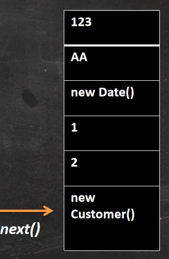

### 集合数组互转：

- 数组--->集合：toArray()，使用数组的toArray()方法
- 集合--->数组：Arrays.asList()，使用Arrarys的方法

### foreach循环

JDK5.0新增，用来遍历集合或数组

- for(集合元素类型 局部变量 : 集合对象)

```java
for (Object obj : arr) {
            System.out.println(obj);
}
//循环-{取arr的元素给obj--->再执行代码块}，当
```


## 子接口-List接口

存储有序的可重复的数据（存入的数据按顺序存入），就像是动态数组。

实现类：

- ArrayList：JDK1.2，主要使用该实现类，线程不安全，效率高；底层用Object[]存储；
- LinkedList：JDK1.2，频繁的插入、删除操作，使用该实现类比ArrayList效率高；底层用双向链表存储；
- Vector：JDK1.0，线程安全，效率低，底层用Object[]存储；

【面试】比较ArrayList、LinkedList、Vector异同

- 相同：实现了List接口，存储有序的可重复的数据；
- 不同：

### List接口方法

List 集合里添加了一些根据索引来操作集合元素的方法，常用方法如下：

- void add(int index, Object ele)：把ele元素插入到index位置
- boolean addAll(int index, Collection eles)：集合eles作为一个元素插入到index位置，只相当往这插入了一个元素
- Object get(int index)：获取指定index位置的元素 
- int indexOf(Object obj)：返回obj在集合中首次出现的位置 
- int lastIndexOf(Object obj)：返回obj在当前集合中末次出现的位置 
- Object remove(int index)：移除指定index位置的元素，并返回此元素 
- Object set(int index, Object ele)：设置（更改）指定index位置的元素为ele 
- List subList(int fromIndex, int toIndex)：返回从fromIndex到toIndex 位置的子集合（返回范围为[fromIndex， int toIndex)）

常用方法总结：

1. 增加：add(Object obj)
2. 删除：remove(int index) / remove(Object obj)
3. 修改：set(int index, Object ele)
4. 查询：get(int index)
5. 插入：add(int index, Object obj)
6. 长度：size()
7. 遍历：迭代器Iterator           foreach循环     普通的循环

list集合选择：

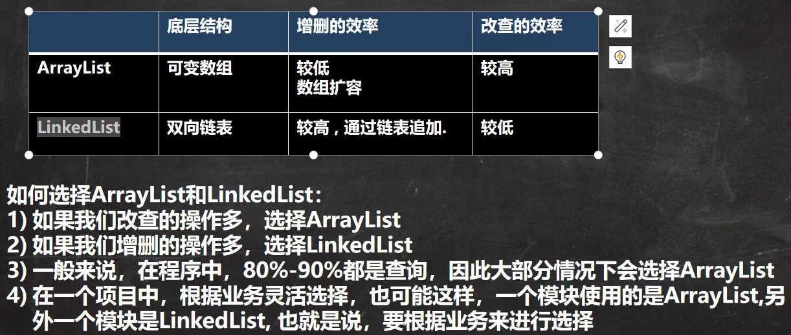

### ArrayList源码分析


- debug时建议把enable那个勾去掉，不然idea在debug时显示的数据是简化的。

结论：

1. 底层维护了一个Object[] elementData数组；
2. 使用无参构造器创建ArrayList对象，则初始化elementData容量为0，第一次添加后为10；超出容量会自动扩容为原来的1.5倍；
3. 使用指定大小的构造器，则初始容量为构造器形参值，扩容时也是扩容为初始容量的1.5倍；
4. 

```java
//JDK7
List list = new ArrayList();//底层会创建一个10容量的数组,Object[] elementData
list.add(123);//elementData[0] = new Integer(123);
...
list.add(11);//超出容量，扩容为原来的1.5倍，原数组复制到新数组
//结论：建议开发中使用带参的构造器：ArrayList list = new ArrayList(int capacity);
```

```java
//JDK8
List list = new ArrayList();//底层并没有创建长度为10数组 Object[] elementData = {}
list.add(123);//elementData[0] = new Integer(123)，在第一次调用add后才创建了数组
...
list.add(11);//超出容量，扩容为原来的1.5倍，原数组复制到新数组，（与JDK7无异）
//小结：JDK7中类似于单例的饿汉式，JDK8中延迟了数组的创建，节省了内存
```

### LinkedList源码分析

- 实现了双向列表和双端队列等特点；
- 可以添加任意元素(可重复)，包括null；
- 线程不安全，没有实现同步；

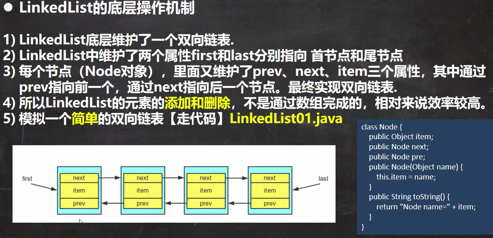

```java
List list = new LinkedList(); //内部声明了Node的first、last属性，默认值为null
list.add(123); //将123封装到Node中，创建了Node对象

//Node的定义：（体现双向链表）
    private static class Node<E> {
        E item;
        Node<E> next;
        Node<E> prev;

        Node(Node<E> prev, E element, Node<E> next) {
            this.item = element;
            this.next = next;
            this.prev = prev;
        }
    }
```

### Vector源码分析

1. 底层也是Object[] elementData数组；
2. 无参的默认容量10，扩容按2倍；有参数的直接按两倍扩容机制；
3. Vector的操作方法带有锁，是线程安全的（效率不高）；
4. 考虑线程同步安全的，优先考虑Vector；

```java
//new Vector();   创建了长度为10的数组，扩容为2倍	
```

总结

关于源码分析：所调用的行为结构的内部逻辑。


## 子接口-Set接口

Set接口：存放无序、不可重复的数据--->数学中的集合（无序、互异）；

Set接口主要实现类：

- HashSet：主要实现类，线程不安全，可以存null；

- LinkedHashSet：HashSet的子类，遍历其内部数据时，可以按照添加的顺序遍历；
- TreeSet：可以按照添加的对象的指定属性来进行排序。

### Set概述

Set的无序性和不可重复性：（以HashSet为例）

- 无序性：数据的添加不是按照数组索引的顺序添加，而是根据数据的哈希值来添加（不等于随机性）；
- 不可重复性：保证添加的元素按照equals()判断返回false；
- Set的底层是Map的实现类。

### 使用

1. Set接口没有定义新的方法，使用的都是Collection接口里的；
2. 虽然无序，但取出的顺序是固定的（也就是hash值经计算完毕再得出的索引值不会每运行一次就改变一次）；
3. 要求：
   1. 向Set中添加数据，其所在类一定要重写hashCode()方法和equals()方法；
   2. 重写的hashCode()方法和equals()方法尽可能保持一致性：相等的对象必须具有相等的散列码（哈希值）；
   3. 重写是为了根据自己的需求定制相等对象的标准。
4. 重写方法技巧：对象中用作 equals() 方法比较的 Field(属性)，都应该用来计算 hashCode 值（equals里用到的属性在hashCode里也用一下）；

LinkedHashSet：添加数据的同时，每个数据还维护了两个引用，记录此数据的前一个数据和后一个数据（优点：对于频繁的遍历操作，LinkedHashSet效率更高）。

```java
class HashSetTest {
    public static void main(String[] args) {
        HashSet hs = new HashSet();
        hs.add(new Scholar("李牧", 30));
        hs.add(new Scholar("李白", 58));
        hs.add(new Scholar("李商隐", 46));
        System.out.println(hs.add(new Scholar("李牧", 30))); // false
    }
}
class Scholar {
    private String name;
    private int age;

    public Scholar(String name, int age) {
        this.name = name;
        this.age = age;
    }

    @Override
    public int hashCode() {
        return Objects.hash(name,age);
    }

    @Override
    public boolean equals(Object obj) {
        if (this == obj) return true;
        if (obj == null || getClass() != obj.getClass())
            return false;
        Scholar scholar = (Scholar) obj;
        return age == scholar.age && Objects.equals(name, scholar.name);
    }
}
```

### HashSet

底层实际是HaspMap（数组+链表+红黑树），只能存放一个null键。

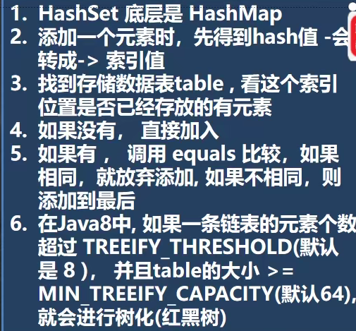

### LinkedHashSet

- HashSet的子类，底层是LiskedMap，底层维护了一个数组加双向列表；
- 根据hashcode决定元素存储位置，同时使用链表维护元素次序，使得看起来是按添加顺序存储的；
- 不允许添加重复的元素；

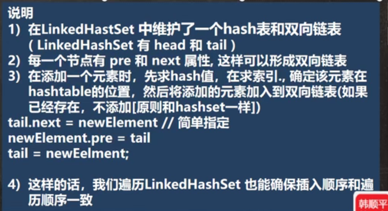

### TreeSet

往TreeSet中添加数据要求是相同类的对象。

自然排序中，比较两个对象是否相同的标准为：compareTo返回0，不再是equals()

定制排序中，比较两个对象是否相同的标准为：compare()返回0，不再是equals()

P540

## Map

### 概述

Map：双列数据，存储key-value对的数据--->类似函数y = f(x)。

主要实现类：

- HashMap：主要实现类；线程不安全，效率较高；（底层：数组+链表(JDK7之前；数组+链表+红黑树(JDK8))）；
  - LinkedHashMap：保证在遍历的时候按添加元素的顺序实现遍历（在HashMap底层结构基础上，添加了一对指针，指向前一个和后一个元素），对于频率的遍历操作，此类执行效率比HashMap高。
- TreeMap：保证按照添加的key-value来进行排序(按key来排)，实现排序遍历；考虑key的自然排序和定制排序；（底层使用红黑树）；
- Hashtable：JDK1.0，古老的实现类；线程安全的，效率较低，不能存储null的key-value（出现null会抛异常），使用基本和hashmap一样；
  - Properties：常用来处理配置文件，key和value都是String型。

Map的特点：

- 存储键值对key-value，key可以为null但只能是一个，映射关系：一对一、多对一；
- 当添加相同的key的值时，相当于是替换；
- key-value是存在一个HashMap的Node中的（因为Node实现了Entry，因此也可以说一对键值对就是一个Entry）

key-value源码分析：

1. `alt + 7`：查看类结构；

2. `tab[i] = newNode(hash, key, value, null);`，newNode返回`return new Node<>(hash, key, value, next);`，而`Node<K,V> implements Map.Entry<K,V>`，存放键值对的Node实现了Entry接口；

3. HashMap中有一个内部类EntrySet，一个成员变量`transient Set<Map.Entry<K,V>> entrySet`；为了遍历方便，会创建一个EntrySet集合，该集合存放元素的类型是Entry，有key、value（transient Set<Map.Entry<K,V>> entrySet`，该对象只是指向一个Node），证明如下：

   - ```java
     Map map = new HashMap();
     map.put("lsl","9909");
     Set set = map.entrySet(); // 获取EntrySet集合
     System.out.println(set.getClass()); // class java.util.HashMap$EntrySet
     for ( obj : set) {
         System.out.println(obj.getClass()); // class java.util.HashMap$Node
     }
     // EntrySet集合存放的是Entry对象，运用多态，Entry->HashMap$Node，所以实际key-value使用HashMap$Node存储
     ```

   - HashMap$Node存放到entrySet是为了方便对其进行遍历；Map.Entry接口提供了getKey、getValue方法。

### 常用方法

 添加、删除操作： 

- Object put(Object key,Object value)：将指定key-value添加到(或修改)当前map对象中 
- void putAll(Map m):将m中的所有key-value对存放到当前map中 
- Object remove(Object key)：移除指定key的key-value对，并返回value 
- void clear()：清空当前map中的所有数据 

元素查询的操作： 

- Object get(Object key)：获取指定key对应的value 
- boolean containsKey(Object key)：是否包含指定的key 
- boolean containsValue(Object value)：是否包含指定的value 
- int size()：返回map中key-value对的个数 
- boolean isEmpty()：判断当前map是否为空 
- boolean equals(Object obj)：判断当前map和参数对象obj是否相等 

元视图操作的方法： 

- Set keySet()：返回所有key构成的Set集合 
- Collection values()：返回所有value构成的Collection集合 
- Set entrySet()：返回所有key-value对构成的Set集合

总结-常用的方法：

- 增加：Object put(Object key,Object value)
- 删除：Object remove(Object key)
- 修改：put
- 查询：Object get(Object key)
- 长度：int size()
- 遍历：Set keySet()    \   Collection values()   \   Set entrySet()

### 六种遍历

```java
        Map map = new HashMap();
        map.put("1","一清");
        map.put("2","二白");
        map.put("3","三笑");
        map.put("4","四舞");
        System.out.println("-----------------");
//        获取所有的key再取值
        Set keySet = map.keySet();
        for ( Object obj: keySet) {
            System.out.println(obj +"=" + map.get(obj));
        }
        Iterator iterator = keySet.iterator();
        while (iterator.hasNext()) {
            Object key = iterator.next();
            System.out.println(key + "+" + map.get(key));
        }
        System.out.println("-----------------");
//        直接取值：通过Collection,然后foreach循环、迭代器遍历
        Collection values = map.values();
        System.out.println("-----------------");
//        通过EntrySet获取Entry对象  for foreach 迭代器interator
        Set entrySet = map.entrySet();
        for (Object entry : entrySet) {
            Map.Entry m = (Map.Entry) entry;
            System.out.println(m.getKey() + "=" + m.getValue());
        }
        System.out.println("-----------------");
        Iterator iterator1 = entrySet.iterator();
        while (iterator1.hasNext()) {
            Object entry = (Object) iterator1.next();
            // entrySet里面的实际上是HashMap$Node 而其实现了Map.Entry<K,V>
            // 因此可以向下转型
            Map.Entry m = (Map.Entry) entry; // 向下转型 Entry
            System.out.println(m.getKey() + "=" + m.getValue());
        }
```


### HashMap源码:

```java
//JDK7中
HashMap map = new HashMap()； //实例化，底层创建长度为16的一维数组Entry[] table
	......     
    map.put(key1,value);//调用key1所在类的hashCode()计算哈希值，此哈希值经某种算法得到在数组table里的存放位置
//首先：如果此位置上为空，则key1-value添加成功
//如果不为空，也就是此位置存在一个或多个数据(以链表存在)，就会比较key1和此位置上所有数据的哈希值，分以下两种情况：
//***情况一：key1的哈希值与已经存在的此位置上的所有数据的哈希值都不一样，则添加成功
//***情况二：与此位置上某个数据的哈希值相同，调用key1所在类的equals(key2)再进行比较：
//*********如果equals()返回false，则添加成功
//*********如果equals()返回true，使用value替换value2
/*
	补充：如果某一位置上存在多个的key-value，则是以链表形式存储(后添加的和原来的组成链表形式)
	     关于扩容：不断添加中，当超出临界值(且要存放的位置非空)，就会扩容；默认扩容为原来容量的两倍，并将所有数据复制过来
*/

//JDK8与JDK7的不同：JDK8中
/*	一：new HashMap()时底层并没有创建长度为16的一维数组
    二：JDK8底层的数组是Node[]，而不是Entry
    三：首次调用put()方法时，创建长度为16的数组
    四：JDK7底层：数组+链表；JDK8底层：数组+链表+红黑树
    什么时候使用红黑树存储数据：满足一下三个条件的数据
    ①当数组某一位置上的数据以链表形式
    ②此链表形式存在的数据 > 8
    ③此数组长度 > 64               ------满足此三个条件，此时此索引上的所有数据改用红黑树存储
*/
```

（表达出来，看底层代码验证，先会用再关注底层）

### LinkedHashMap源码

子类LinkedHashMap底层实现：（了解）


### TreeMap源码

自然排序、定制排序。TreeSet底层是TreeMap。


### Properties使用

Hashtable的子类，更多用于读取配置文件.properties。


## 集合的选择

- HashMap---HashSet（要重写equals()和hashCode()）；
- LinkedHashMap---LinkedHashSet（考虑自然排序、定制排序）；


## Collections工具类

Collections工具类——操作Collection、Map的工具类。

排序操作：（均为static方法）

- reverse(List)：反转 List 中元素的顺序 ；
- shuffle(List)：对 List 集合元素进行随机排序 ；
- sort(List)：根据元素的自然顺序对指定 List 集合元素按升序排序 ；
- sort(List，Comparator)：根据指定的 Comparator 产生的顺序对 List 集合元素进行排序 ；
- swap(List，int i，int j)：将指定 List 集合中的 i 处元素和 j 处元素进行交换

查找、替换 ：

- Object max(Collection)：根据元素的自然顺序，返回给定集合中的最大元素 ；

- Object max(Collection，Comparator)：根据 Comparator 指定的顺序，返回 给定集合中的最大元素 ；

- Object min(Collection) Object min(Collection，Comparator) ；

- int frequency(Collection，Object)：返回指定集合中指定元素的出现次数 ；

- void copy(List dest,List src)：将src中的内容复制到dest中 ；

  - ```java
    //如果dest的size小于src的size会报异常，可以如下来操作
    List dest = Arrays.asList(new Object[src.size()]);
    ```

- boolean replaceAll(List list，Object oldVal，Object newVal)：使用新值替换 List 对象的所有旧值；

同步控制：

Collections 类中提供了多个 synchronizedXxx() 方法，该方法可使将指定集合包装成线程同步的集合，从而可以解决多线程并发访问集合时的线程安全问题。

## 面试

【面试】HashMap的底层实现原理？

【面试】HashMap和Hashtable的异同？

【面试】CurrentHashMap与Hashtable的异同？

【面试】Collection、Collections的区别？

# 泛型

## 泛型语法

泛型（参数化类型），泛型类就是具有一个或多个类型变量的类，JDK5中出现，为了解决数据类型安全问题。

```java
ArrayList<String> list = new ArrayList<String>(); 
ArrayList<String> list = new ArrayList<>(); // 泛型对象的创建，<>指定泛型类型
```

1. 泛型指定时只能是引用类型，就是说`ArrayList<String>`的String不能是int等基本数据类型。
2. 如果在构造器形参中使用了泛型，传入的值可以是创建对象时泛型指定的类型或该类型的子类。
3. 泛型类型可以不指定，不指定时默认是Object类型。
4. 类型参数能被用来声明返回值类型，并且能作为泛型方法得到的实际参数类型的占位符。

## 自定义泛型

### 自定义泛型类

泛型是一个或多个类型变量的类，泛型类的定义如下：

```java
public Pair<T, S, U> { // <>内指定泛型变量，可指定多个
	
}
// 集合中：E（collection）、K（key）、V（value）来定义泛型变量
// 自定义泛型变量使用：T或邻近的，如R、U、S等
```

细节：

1. 泛型变量使用于属性、方法、构造方法形参等；
2. 使用泛型的数组，不能初始化（因为还没确定数据类型，无法确定要开辟的空间）；
3. 静态方法中不能使用泛型变量（因为泛型变量是在创建对象的时候确定的）；
4. 创建对象时没有指定则泛型变量仍然为Object；
5. 异常类不能是泛型类；
6. 泛型类中不能使用`new E[]`，但是可以：`E[] elements = (E[])new Object[capacity]`；参考：ArrayList源码中声明：Object[] elementData，而非泛型参数类型数组。 

### 自定义泛型方法

泛型方法的定义和方法所在类是否是泛型类无关，泛型方法可以是静态的。

```java
修饰符 <T, R, ...> 返回类型 方法名(){} 
public static <E> List<E> copyList(E[] arr){
    ArrayList<E> list = new ArrayList<>();
    for(E obj : arr){
        list.add();
    }
    return list;
}
```

- 泛型变量在被调用时被确定，在同一泛型类时泛型方法可使用泛型类的泛型变量。


### 自定义泛型接口

```java
interface <T, ...> {} 
```

- 继承接口或实现接口时确定。 

## 泛型继承和通配符

继承性：泛型不会被继承。

通配符：`?`，如果只是`<?>`，则表示泛型变量的值是任意引用类型。

作为所有泛型类相关对象的父类，使用通配符后的的对象就不能向内部添加数据了，但可以add(null)，可以添加null；但是可以读取，读取的数据类型是Object

有限制条件的通配符：

- `? extends A`：值可以是小于或等于A的所有子类型（继承与接口）；
- `? super A`：值可以是大于等于A的所有的父类。

**java 中泛型标记符：**

- **E** - Element (在集合中使用，因为集合中存放的是元素)
- **T** - Type（Java 类）
- **K** - Key（键）
- **V** - Value（值）
- **N** - Number（数值类型）
- **？** - 表示不确定的 java 类型

# IO流

## File类

Java是面向对象的语言，对文件和文件目录抽象成了File类；File类就是文件和文件目录路径的抽象表示形式，与平台无关。

-  File 能通过其方法在硬盘**新建、删除、重命名文件和目录**，但 File 不能访问文件内容本身；执行这些方法的前提是能找到相应的实际存在的目录，才能创建或删除文件和目录，创建文件和创建目录是两个过程，对应两种方法。
- 如果需要访问文件内容本身，则需要使用输入/输出流（I/O流）。
- 想要在Java程序中表示一个真实存在的文件或目录，那么必须有一个File对 象，但是Java程序中的一个File对象，可能没有一个真实存在的文件或目录。
- **File对象可以作为参数传递给流的构造器**。
- 可以看作File对象就是指定某个目录或某个文件，用来确定目录位置的或文件位置的Java对象，但具备增、删、该、查、判断的方法。

### 创建File对象

都可以使用相对路径或绝对路径：（`/lsl/test/text.txt`的相对于lsl目录的路径就是`test/text.txt`）。

```java
// 构造器1：指定某目录下的文件或指定某目录，在main方法中使用是相对于当前工程目录的
// 在module中使用时，要使用单元测试，才是相对于当前module
File file1 = new File("beans.xml");
// 构造器1：指定绝对路径 或 绝对路径下的某目录内的文件
File file2 = new File("D:\\LSLJava\\IdeaProjects\\IdeaProjectsTest\\absolute.txt");
// 构造器2：指定父目录路径，再指定子目录 或 子文件
File file3 = new File("D:\\LSLJava\\IdeaProjects","JavaSenior");
// 构造器2：指定某目录(file3)下的子目录或子文件
File file4 = new File(file3, "test.txt");
```

相对路径与绝对路径：File类的相对路径是相对于当前Java项目目录

```java
// main方法中
File file1 = new File("beans.xml");
System.out.println(file1.getAbsolutePath());
// D:\LSLJava\IdeaLearningJava\ReviewJavaSE\beans.xml ，创建时直接创建在ReviewJavaSE目录下
```

```java
// module中使用单元测试
@Test
public void test() throws IOException {
    File file = new File("test.html");
    file.createNewFile();  // 会直接创建在当前module下            
    System.out.println(file.getPath());
}
```


路径分隔符：

- windows、DOS系统：\；
- Linux、UNIX下：/。

### File对象方法

获取：

1. **public String getAbsolutePath()**：获取绝对路径 。
2. public String getPath() ：获取相对路径，相对于项目主目录 。
3. public String getName() ：获取文件全名 。
4. **public String getParent()**：获取上层文件目录路径（根据File在声明时写的路径确定），若无，返回null。
5. public long length() ：获取文件长度（即：字节数）；不能获取目录的长度。
6. public long lastModified() ：获取最后一次的修改时间，毫秒值 。
7. public String[] list() ：获取指定目录下的所有文件或者文件目录的名称数组 。
8. public File[] listFiles() ：获取指定目录下的所有文件或者文件目录的File数组。

重命名：

1. public boolean renameTo(File dest)：把文件重命名为指定的文件路径；
  - `file1.renameTo(file2);`要保证返回true，那么file1中文件要存在，file2中文件不能在硬盘存在；文件目录都要存在。

判断：

1. **public boolean isDirectory()**：判断是否是文件目录 ；（也是根据File声明时，如果含路径信息则就是目录）
2. **public boolean isFile()** ：判断是否是文件 ；（也是根据File声明时，如果含路径信息则就不是文件）
3. **public boolean exists() **：判断是否在硬盘中存在 ；
4. public boolean canRead() ：判断是否可读 ；
5. public boolean canWrite() ：判断是否可写 ；
6. public boolean isHidden() ：判断是否隐藏。

创建：

1. **public boolean createNewFile()** ：创建文件，若文件存在，则不创建，返回false ；
2. public boolean mkdir() ：创建文件目录，如果此文件目录存在，就不创建了， 如果此文件目录的上层目录不存在，也不创建。；
3. **public boolean mkdirs()** ：创建文件目录，如果上层文件目录不存在，一并创建。【注意事项】：如果你创建文件或者文件目录没有写盘符路径，那么，默认在项目路径下。

删除：

1. public boolean delete()：删除文件或者文件夹 【删除注意事项】： Java中的删除不走回收站。**要删除一个文件目录，请注意该文件目录内不能包含文件或者文件目录。**

 

## IO流概述

### 流(stream)的分类

- 按传输的流向分：输入流、输出流；（硬件——内存）

- 按传输的数据单位是什么？===> 字符流、字节流；

- 按作用对象是什么？作用于文件 ===> 节点流(有时也称文件流)，作用于已有的流 ===> 处理流。

### IO流体系

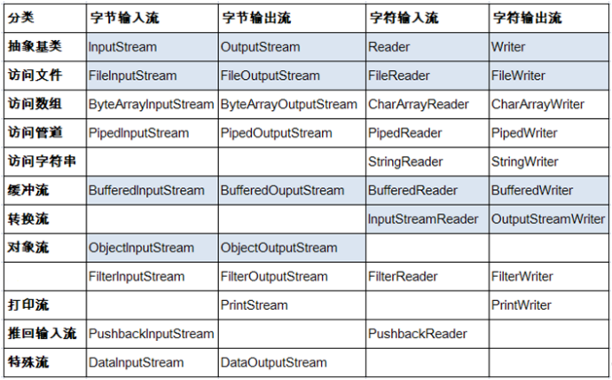

RandomAccessFile（任意）。

由末尾的Stream、Reader、Writer就可以确定是哪个流。

### 流的使用的基本套路

1. File实例化。

2. 流的实例化。

3. 执行读取或写入操作。

4. 关闭流资源。

```text
对于文本文件使用字符流（.txt、.java、.c、.cpp）
对于非文本文件使用字节流（.jpg .mp3 .mp4 .avi .doc .ppt ），但只对文本文件复制也可以用字节流
使用字节流来处理文本文件可能会出现乱码
```

不是重点但要了解的三个流：标准输入输出流、打印流、数据流。任意存取文件流。

## 字符流

### FileReader读取字符

```java
public void testFileReader1() {
    FileReader fr = null;
    try {
        File file = new File("reader.txt");
        fr = new FileReader(file);

        int data = fr.read(); // 每次读取到另一个字符，直到读取到末尾返回-1
        while (data != -1) {
            System.out.print((char) data);
            data = fr.read();
        }
    }catch (IOException e) {
        e.printStackTrace();
    }finally {
        try {
            if (fr != null){
            fr.close();
            }
        } catch (IOException e) {
            e.printStackTrace();
        }
    }
}
```

使用`read()`的重载方法`read(char[] cbuf)`：

```java
// read(char[] cbuf)：每次都会返回读入到cbuf[]中字符的个数，读完后数组为空时返回-1
char[] cbuf = new char[5];
int len;
while ((len = fr.read(cbuf)) != -1) {
    for (int i = 0; i < len; i++) {
        //方式一：循环读取
        System.out.print(cbuf[i]);
        // 方式二：
        // String str = new String(cbuf,0,len);
		// System.out.print(str);
    }
}
```

### FileWriter写出字符

```java
/**
 * 输出操作：
 * 1.要操作的文件可以不存在，不会报异常
 * 2.如果文件不存在，则在输出过程中自动创建
 * 3.如果文件存在，而且实例化流时使用的构造器是：
 *       FileWriter(file,false)/FileWriter(file)时，会对原文件进行覆盖
 *       FileWriter(file,true)时，不会对原文件进行覆盖，只是在原文件追加内容
 */
```

```java
@Test
public void test1(){
    FileWriter fw = null;
    try {
        File file = new File("writer.txt");
        fw = new FileWriter(file);
        fw.write("I have a dream");
        fw.write("You must have a dream");
    }catch (IOException e){
        e.printStackTrace();
    }finally{
        if(fw != null){
            try {
                fw.close();
            } catch (IOException e) {
                e.printStackTrace();
            }
        }
    }
}
```

### 文本文件复制

```java
@Test
public void test2() {
    FileReader fr = null;
    FileWriter fw = null;
    try {
        File f1 = new File("file1.md");
        File f2 = new File("file2.md");
        fr = new FileReader(f1);
        fw = new FileWriter(f2);
        char[] cbuf = new char[5];
        int len;
        while ((len = fr.read(cbuf)) != -1){
            // 每次写出len个字符
            fw.write(cbuf,0,len);
        }
    }catch (IOException e){
        e.printStackTrace();
    }finally {
        try {
            if (fr != null){
                fr.close();
            }
        }catch (IOException e){
            e.printStackTrace();
        }
        try {
            if (fw != null){
                fw.close();
            }
        }catch (IOException e){
            e.printStackTrace();
        }
    }
}
```

## 字节流

### 复制图片

```java
@Test
public void test2(){
    FileInputStream fis = null;
    FileOutputStream fos = null;
    try{
        File file1 = new File("唐千云.jpg");
        File file2 = new File("唐千云2.jpg");
        fis = new FileInputStream(file1);
        fos = new FileOutputStream(file2);
        byte[] buffer = new byte[1024];
        int len;
        while((len = fis.read(buffer)) != -1){
            fos.write(buffer,0,len); // 文件若不存在会自动创建
        }
    }catch(IOException e){
        e.printStackTrace();
    }finally{
        try {
            fis.close();
        } catch (IOException e) {
            e.printStackTrace();
        }
        try {
            fos.close();
        } catch (IOException e) {
            e.printStackTrace();
        }
    }
}
```

### 复制方法封装

```java
// srcPath：源文件路径  tarPath：复制存放路径
public static void copyFile(String srcPath,String tarPath){
    FileInputStream fis = null;
    FileOutputStream fos = null;
    try{
        File file1 = new File(srcPath);
        File file2 = new File(tarPath);
        fis = new FileInputStream(file1);
        fos = new FileOutputStream(file2);
        byte[] buffer = new byte[1024];
        int len;
        while((len = fis.read(buffer)) != -1){
            fos.write(buffer,0,len);
        }
    }catch(IOException e){
        e.printStackTrace();
    }finally{
        try {
            fis.close();
        } catch (IOException e) {
            e.printStackTrace();
        }

        try {
            fos.close();
        } catch (IOException e) {
            e.printStackTrace();
        }
    }
}
```

## 缓冲流

缓冲流，是处理流的一种，用于提升流的写入、读取速度。（处理流：“套接”在已有的流上的流）

### 字节型缓冲流

```java
public void copyBufferedFile(String srcPath, String destPath) {
    // 缓冲流
    BufferedInputStream bis = null;
    BufferedOutputStream bos = null;
    try {
        File srcFile = new File(srcPath);
        File destFile = new File(destPath);
        // 字节流
        FileInputStream fis = new FileInputStream(srcFile);
        FileOutputStream fos = new FileOutputStream(destFile);
        bis = new BufferedInputStream(fis);
        bos = new BufferedOutputStream(fos);
        byte[] buffer = new byte[1024];
        int len;
        while ((len = bis.read(buffer)) != -1) {
            bos.write(buffer, 0, len);
            // bos.flush(); 刷新缓冲区，内部会自动刷新，不需要我们调用
        }
    } catch (IOException e) {
        e.printStackTrace();
    } finally {
        if (bos != null) {
            try {
                bos.close();
            } catch (IOException e) {
                e.printStackTrace();
            }
        }
        if (bis != null) {
            try {
                bis.close();
            } catch (IOException e) {
                e.printStackTrace();
            }
        }
    }
}
```

- 关闭外层流的同时内层流会自动关闭。
- 先关闭外层流，再关闭内层流 bos.close() ===> bis.close() ===> fos.close ===> fis.close。
- 因此不需要再声明关闭内层流 fos.close、fis.close。

可比较一下字节流复制与通过缓冲流复制文件所需的时间。缓冲流提高读写速度的原因是：

- 其内部提供了一个缓冲区。

### 字符型缓冲流

```java
@Test
public void test2(){
    BufferedReader br = null;
    BufferedWriter bw = null;
    try {
        File srcFile = new File("dbcp.txt");
        File destFile = new File("dbcp1.txt");
        FileReader read = new FileReader(srcFile);
        FileWriter write = new FileWriter(destFile);
        br = new BufferedReader(read);
        bw = new BufferedWriter(write);
        // 读取方式一：
        /*
        char[] data = new char[1024];
        int len;
        while ((len = br.read(data)) != -1) {
            bw.write(data, 0, len);
        }
        */
        // 读取方式二：readLine() 一行一行地读取
        String data;
        while ((data = br.readLine()) != null) {
            bw.write(data); // 不会换行写
            bw.newLine(); // 换行
            //bw.write(data + "\n"); 这样也可以换行
        }
    }catch(IOException e) {
        e.printStackTrace();
    }finally {
        if (bw != null){
            try {
                bw.close();
            } catch (IOException e) {
                e.printStackTrace();
            }
        }
        if (br != null){
            try {
                br.close();
            } catch (IOException e) {
                e.printStackTrace();
            }
        }
    }
}
```

## 转换流

转换流也是一种处理流，可以通过转换流实现字符流和字节流的相互转换。

- InputStreamReader：将字节的输入流转换为字符的输入流（字节 ===> 字符，解码）。
- OutputStreamWriter：将字符的输出流转为字节的输出流（字符 ===> 字节，编码）。

```java
@Test
public void test2() throws IOException {
    FileInputStream fis = new FileInputStream("dbcp.txt");
    //InputStreamReader isr = new InputStreamReader(fis)：未指定就是以系统默认字符集来；
    // 指定参数2时，为保证解码就要以保存该文件时使用的字符集来指定
    InputStreamReader isr = new InputStreamReader(fis, StandardCharsets.UTF_8);
    char[] data = new char[20];
    int len;
    while((len = isr.read(data)) != -1){
        String str = new String(data,0,len);
        System.out.println(str);
    }
    isr.close();
}
```

综合使用：

```java
@Test
public void test3(){
    InputStreamReader isr = null;
    OutputStreamWriter osr = null;
    try {
        File file1 = new File("dbcp.txt");
        File file2 = new File("dbcp_gbk.txt");
        FileInputStream fis = new FileInputStream(file1);
        FileOutputStream fos = new FileOutputStream(file2);
        // 转换：字节输入流 ===> 字符输入流 读入，解码的过程
        isr = new InputStreamReader(fis, "UTF-8");
        // 转换：字符输出流 ===> 字节输出流 写出，编码的过程
        osr = new OutputStreamWriter(fos,"gbk");
        char[] data = new char[20];
        int len;
        while((len = isr.read(data)) != -1){
            osr.write(data, 0, len);
        }
    }catch (IOException e){
        e.printStackTrace();
    }finally {
        if (isr != null){
            try {
                isr.close();
            } catch (IOException e) {
                e.printStackTrace();
            }
        }
        if (osr != null){
            try {
                osr.close();
            } catch (IOException e) {
                e.printStackTrace();
            }
        }
    }
}
```

## 字符集

编码表的由来：计算机只能识别二进制数据，早期由来是电信号，为了方便应用计算机，让它可以识别各个国家的文字，就将各个国家的文字用数字来表示，并一一对应，形成一张表——这就是编码表。 

常见的编码表 

- ASCII：美国标准信息交换码。（用一个字节的7位可以表示）。

- ISO8859-1：拉丁码表，欧洲码表。（用一个字节的8位表示）。

- GB2312：中国的中文编码表。（最多两个字节编码所有字符） 。

- GBK：中国的中文编码表升级，融合了更多的中文文字符号。（最多两个字节编码） 。

- Unicode：国际标准码，融合了目前人类使用的所有字符。为每个字符分配唯一的字符码。（所有的文字都用两个字节来表示)

- UTF-8：变长的编码方式（可用1-4个字节来表示一个字符）。

## 标准输入输出流（了解）

1. `System.out`、`System.in`分别代表了系统标准的输入、输出设备。
2. `System.in`：标准的输入流，默认从键盘输入。
3. `System.out`：标准的输出流，默认从控制台输出。
4. 重定向：通过System类的setIn()、setOut()对默认设备进行改变。
   - `public static void setIn(InputStream in) `。
   - `public static void setOut(PrintStream out)`。

```java
public class TestSystem {
    public static void main(String[] args) {
        BufferedReader br = null;
        try {
            InputStreamReader isr = new InputStreamReader(System.in);
            br = new BufferedReader(isr);
            while (true){
                System.out.println("请输入需要转换的字符：");
                String data = br.readLine();
                if ("e".equalsIgnoreCase(data) || "exit".equalsIgnoreCase(data)){
                    System.out.println("程序已退出....");
                    return;
                }
                System.out.println(data.toUpperCase());
            }
        }catch (IOException e) {
            e.printStackTrace();
        }finally {
            try {
                if (br != null){
                    br.close();
                }
            }catch (IOException e){
                e.printStackTrace();
            }
        }
    }
}
```

## 打印流（了解）

打印流：PrintStream、PrintWriter。

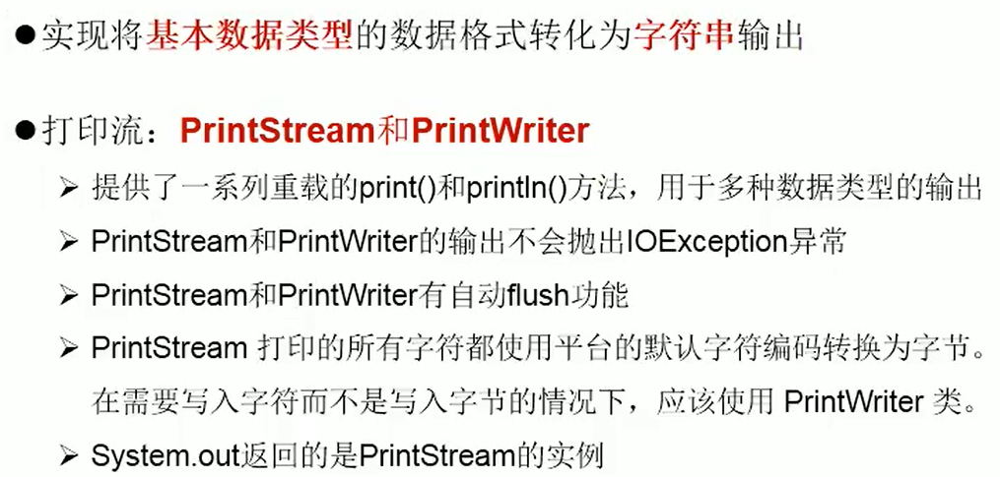

```java
@Test
public void test1(){
    PrintStream ps = null;
    try {
        FileOutputStream fos = new FileOutputStream(new File("D:\\LSLJava\\IdeaProjects\\IdeaProjectsTest\\text_other.txt"));
        // 创建打印输出流,设置为自动刷新模式(写入换行符或字节 '\n' 时都会刷新输出缓冲区)
        ps = new PrintStream(fos, true);
        if (ps != null) { // 把标准输出流(控制台输出)改成文件
            System.setOut(ps);
        }
        for (int i = 0; i <= 255; i++) { // 输出ASCII字符
            System.out.print((char) i);
            if (i % 50 == 0) { // 每50个数据一行
                System.out.println(); // 换行
            }
        }
    } catch (FileNotFoundException e) {
        e.printStackTrace();
    } finally {
        if (ps != null) {
            ps.close();
        }
    }
}
```

## 数据流

数据流：DataInputStream、DataOutputStream，为了方便地操作Java语言的基本数据类型和String的数据，可以使用数据流

- 数据流有两个类：(用于读取和写出基本数据类型、String类的数据）DataInputStream 和 DataOutputStream，分别“套接”在 InputStream 和 OutputStream 子类的流上。

DataInputStream中的方法：（DataOutputStream中的方法，将下面的方法的read改为相应的write即可）

- boolean readBoolean() byte readByte()。
- char readChar() float readFloat()。
- double readDouble() short readShort()。
- long readLong() int readInt()。
- String readUTF() void readFully(byte[] b)。

写入基本数据类型的字符串或变量：

```java
@Test
public void test2(){
    DataOutputStream dos = null;
    try { // 创建连接到指定文件的数据输出流对象
        dos = new DataOutputStream(new FileOutputStream("destData.dat"));
        dos.writeUTF("我爱北京天安门"); // 写入UTF字符串
        dos.writeBoolean(false); // 写入布尔值
        dos.writeLong(1234567890L); // 写入长整数
        System.out.println("写文件成功!");
    } catch (IOException e) {
        e.printStackTrace();
    } finally { // 关闭流对象
        try {
            if (dos != null) {
                // 关闭过滤流时,会自动关闭它包装的底层节点流
                dos.close();
            }
        } catch (IOException e) {
            e.printStackTrace();
        }
    }
}
```

读取基本数据类型的字符串或变量：

```java
@Test
public void test3(){
    DataInputStream dis = null;
    try {
        dis = new DataInputStream(new FileInputStream("destData.dat"));
        String info = dis.readUTF(); // 读取
        boolean flag = dis.readBoolean();
        long time = dis.readLong();
        System.out.println(info);
        System.out.println(flag);
        System.out.println(time);
    } catch (Exception e) {
        e.printStackTrace();
    } finally {
        if (dis != null) {
            try {
                dis.close();
            } catch (IOException e) {
                e.printStackTrace();
            }
        }
    }
}
```

## 对象流与对象序列化机制

> ObjectInputStream    ObjectOutputSteam

用于存储和读取基本数据类型数据或对象的处理流。它的强大之处就是可以把Java中的对象写入到数据源中，也能把对象从数据源中还原回来。

- 序列化：用ObjectInputStream类保存基本数据类型或对象的机制。
- 反序列化：用ObjectOutputSteam类读取基本数据类型或对象的机制。
- ObjectInputStream和ObjectOutputSteam不能序列化static、transient修饰的成员变量。

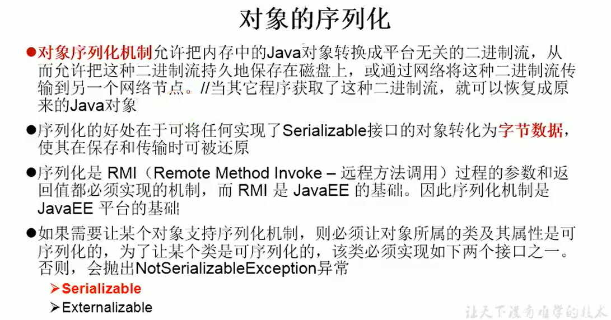

序列化反序列化示例：

```java
public class Person implements Serializable {
    private String name;
    private int age;
    private static final long serialVersionUID = -634270754667710L;

    public Person(String name, int age) {
        this.name = name;
        this.age = age;
    }
	... get、set、toString
}
```

```java
public void test1(){
    try {
        oos = new ObjectOutputStream(new FileOutputStream("hello.dat"));
        oos.writeObject("nihaoa你好，北京！");
        oos.flush(); // 刷新操作
        // 将内存中的对象持久化到文件
        oos.writeObject(new Person("Lee",99));
        oos.flush();
    }catch (IOException e){
        e.printStackTrace();
    }finally {
        if (oos != null){
            try {
                oos.close();
            } catch (IOException e) {
                e.printStackTrace();
            }
        }
    }
}
@Test  // 反序列化过程：把文件中的对象还原为内存中的一个对象
public void test2(){
    ObjectInputStream ois = null;
    try {
        ois = new ObjectInputStream(new FileInputStream("hello.dat"));
        Object o1 = ois.readObject();
        String str = (String)o1;
        Object o2 = ois.readObject();
        Person p = (Person) o2;
        System.out.println(str);
        System.out.println(p);
    }catch (IOException | ClassNotFoundException e){
        e.printStackTrace();
    }finally {
        if (ois != null){
            try {
                ois.close();
            } catch (IOException e) {
                e.printStackTrace();
            }
        }
    }
}
```

对象序列化的要求：

1. 实现Serializable接口。
2. 提供一个`private static final long serialVersionUID = -634270754667710L;`，值无要求。
3. 如果不提供`private static final long serialVersionUID `，序列化后对象的类发生了改动，此时反序列化就会出现InvalidClassException异常。
4. 其内部所有属性可序列化（默认情况下，基本数据类型可序列化；String已实现Serializable接口）。
5. static或transient修饰的成员变量不能序列化，会为null。

## 随机存取文件流

> java.io.RandomAccessFile

1. RandomAccessFile直接继承于Object类，实现了DataInput、DataOutput接口。
2. RandomAccessFile即可以作为输入流，也可以作为输出流，RandomAccessFile支持“随机访问”的方式，程序可以跳到文件任意位置来读、写文件，可以访问文件的部分内容，也可以在文件后追加内容。
3. RandomAccessFile的mode参数：
   - `r`：以只读方式打开。
   - `rw`：打开以便读取和写入。（每次write，数据不会立刻写入硬盘）
   - `rwd`：打开以便读取和写入，同步文件内容的更新。（每次write，数据会立刻写入硬盘）
   - `rws`：打开以便读取和写入，同步文件内容和元数据的更新。
   - 【注】：如果写入数据的过程发生异常，`rwd`模式下已经被write的数据会被保存到硬盘，而`rw`模式下write的则会全部丢失。
4. RandomAccessFile对象包含一个记录指针，用来标示当前读写处的位置，记录指针可自由移动：
   - `public native long getFilePointer()`：默认情况下是0。
   - `public void seek(long pos)`：将文件记录指针定位到pos位置（如果是0，就是第1个字符，依此类推）。

使用RandomAccessFile来复制文件示例：

```java
public static void main(String[] args){
    RandomAccessFile raf1 = null;
    RandomAccessFile raf2 = null;
    try {
        // mode参数为r则是只读，目标文件必须存在，如果不存在会出现异常
        raf1 = new RandomAccessFile("唐千云.jpg", "r");
        raf2 = new RandomAccessFile("唐千云5.jpg", "rw");
        byte[] buffer = new byte[1024];
        int len;
        while ((len = raf1.read(buffer)) != -1) {
            raf2.write(buffer, 0, len);
        }
    }catch (IOException e){
        e.printStackTrace();
    }finally{
        if (raf1 != null){
            try {
                raf1.close();
            } catch (IOException e) {
                e.printStackTrace();
            }
        }
        if (raf2 != null){
            try {
                raf2.close();
            } catch (IOException e) {
                e.printStackTrace();
            }
        }
    }
}
```

输出流的RandomAccessFile：

```java
@Test
public void test1() throws IOException {
    //如果作为输出流，写出到的文件不存在会自动创建，如果已经存在则会对原有文件内容从头开始覆盖
    RandomAccessFile raf = new RandomAccessFile("hello.txt", "rw");
    raf.seek(3); // 指定开始覆盖的位置，覆盖范围 [3,3+n)，n由write的字符串决定，位置从0开始
    raf.write("xyz".getBytes()); // 只会对原文件进行覆盖
    raf.close();
}
```

使用RandomAccessFile实现插入：

```java
@Test
public void test2() throws IOException {
    RandomAccessFile raf = new RandomAccessFile("hello.txt", "rw");
    raf.seek(3);
    StringBuilder sb = new StringBuilder((int)(new File("hello.txt").length()));
    byte[] buffer = new byte[20];
    int len;
    while ((len = raf.read(buffer)) != -1) {
        sb.append(new String(buffer,0,len));
    }
    raf.seek(3);
    raf.write("xyz".getBytes());
    raf.write(sb.toString().getBytes());
    /**
     * 思考
     * 将StringBuilder替换为ByteArrayOutputStream
     */
}
```

插入时除了使用StringBuilder来缓存，还可以：

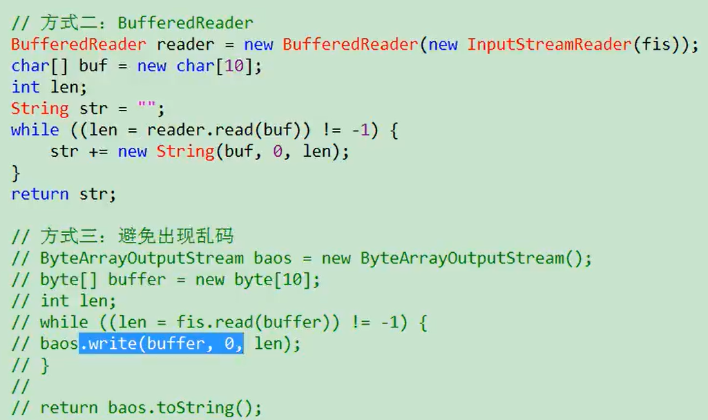

**多线程断点下载的功能：**

可以使用RandomAccessFile来实现多线程断点下载的功能，当每次暂停时，都记录文件指针的位置，当继续下载时，继承从上一个位置开始下载。

## NIO.2

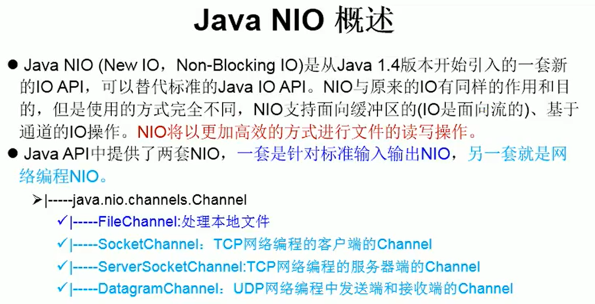

NIO.2：JDK7中对NIO进行了拓展，增强了对文件处理和文件系统特性的支持，以至于我们称它为NIO.2。

NIO.2中Path、Paths、Files类。Path可以看做是对File的升级。

# 网络编程简单了解

```
InetAddress
```

IP

端口号：标识正在计算机上运行的进程（程序），是一个16位（2byte）的整数，范围`0~65535`，

协议

TCP/UDP

端口号和IP地址的组合得出一个网络套接字：Socket；套接字Socket=（IP地址：端口号），套接字的表示方法是点分十进制的lP地址后面写上端口号，中间用冒号或逗号隔开；每一个传输层连接唯一地被通信两端的两个端点（即两个套接字）所确定。例如：如果IP地址是210.37.145.1，而端口号是23，那么得到套接字就是`210.37.145.1:23`。

# Java8新特性

## Lambda表达式

Lambda表达式是一个匿名函数，可以把Lambda表达式理解为一段可以传递的代码（将代码像数据一样进行传递）。在Java中，lambda表达式是作为接口的实例。

使用Lambda表达式：

- 使用格式：`(形参1,形参2,...) -> lambda体`。
- `->`：箭头操作符，lambda操作符。
- lambda操作符左边：是lambda形参列表（实际上就是接口中抽象方法的形参列表）。
- lambda操作符右边：lambda体，重写的抽象方法的方法体。

语法格式一，无参无返回值：

```java
public static void main(String[] args) {
    Runnable r1 = new Runnable() {
        @Override
        public void run() {
            System.out.println("hello");
        }
    };
    // 箭头操作符左边是抽象方法形参列表，右边是重写的方法的方法体
    Runnable r2 = () -> System.out.println("lambda函数表达式"); 
    r1.run();
    r2.run();
}
```

语法格式二，有一个参数但没有返回值：

```java
public static void main(String[] args) {
    Consumer<String> con = new Consumer<String>() {
        @Override
        public void accept(String s) {
            System.out.println(s);
        }
    };
    Consumer<String> con2 = (s) -> System.out.println(s);
    con2.accept("hello");
}
```

语法格式三，数据类型可以省略（因为可以由编译器来推断出，称为“类型维护”）：

```java
public static void main(String[] args) {
    Consumer<String> con1 = (String s) -> {System.out.println(s);};
    // 类型推断
    Consumer<String> con2 = (s) -> {System.out.println(s);};
    con1.accept("hello1");
    con2.accept("hello2");
    ArrayList<String> arrayList = new ArrayList<>(); // 泛型的类型推断
    int[] arr = {1,2,3}; // 类型推断
}
```

语法格式四，若只需要一个参数，那么参数的小括号可以省略：

```java
public static void main(String[] args){
 	Consumer<String> con2 = s -> {System.out.println(s);};   
}
```

语法格式五，有多个参数、有返回值、多条执行语句：

```java
public static void main(String[] args) {
    Comparator<Integer> c1 = new Comparator<Integer>() {
        @Override
        public int compare(Integer o1, Integer o2) {
            System.out.println(o1);
            System.out.println(o2);
            return Integer.compare(o1,o2);
        }
    };
    Comparator<Integer> c2 = (o1,o2) -> {
        System.out.println(o1);
        System.out.println(o2);
        return Integer.compare(o1,o2);
    };
    int v1 = c1.compare(21, 20);
    int v2 = c2.compare(21, 20);
    System.out.println(v1 + "\n" + v2);
}
```

语法格式六，当lambda体只有一条语句，return与大括号可省略：

```java
public static void main(String[] args) {
    Comparator<Integer> c1 = (o1,o2) -> {return Integer.compare(o1,o2);};
    Comparator<Integer> c2 = (o1,o2) -> Integer.compare(o1,o2);
    // 也可以使用方法引用：Comparator<Integer> c2 = Integer::compare;
    int v2 = c2.compare(21, 20);
    System.out.println(v2);
}
```

总结：

1. 形参列表的参数的类型可以省略不写，如果形参列表的参数只有一个那么那个括号也可以不写。
2. lambda体使用`{}`包裹，如果lambda体只有一条执行语句（可能是return语句），那么`{}`可以不写（如果是return语句，则{}、return都可以不用写）。


## 函数式接口

函数式接口：只包含一个抽象方法的接口。

Lambda表达式依赖于函数式接口。

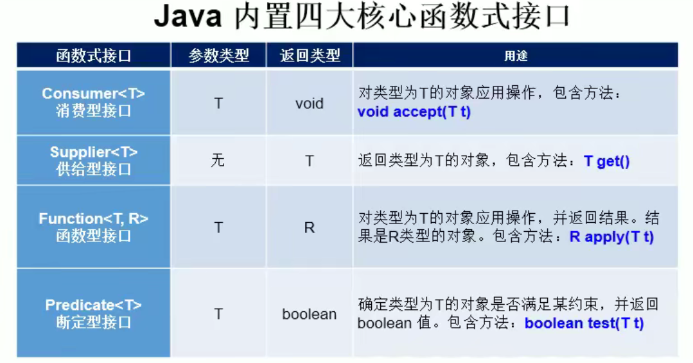

## 方法引用

方法引用是实际上是函数式接口的实例。

1. 使用格式：`对象或类 :: 方法名`。
2. 当传递给lambda体的操作有具体实现，可以使用方法的引用。
3. 要求：函数式接口的抽象方法的形参列表和返回值类型 = 方法引用的方法的形参列表和返回值类型。

使用方式一，通过对象引用：`对象 :: 实例的方法`

```java
public class Employee {
    private String name;
}
// @Test
Employee e = new Employee("tom");
Supplier s = e :: getName;
System.out.println(s.get()); // 函数式接口的get()方法的返回值和形参列表和getName方法和的一致
```

使用方式二，通过类引用：`类 :: 静态方法`

```java
// @Test
// 函数式接口实例的compare方法的方法体是Interger的静态方法compare
Comparator<Integer> c1 = Integer::compare;
int compare = c1.compare(12, 32);
System.out.println(compare);
```

```JAVA
// 这三个等价
Function<Double,Long> function = new Function<Double, Long>() {
    @Override
    public Long apply(Double aDouble) {
        return Math.round(aDouble);
    }
};
Function<Double,Long> func1 = aDouble -> Math.round(aDouble);
Function<Double,Long> func2 = Math::round;
```

使用方式二，通过类引用：`类 :: 非静态方法`

```java
public class Employee {
    private String name;
}
public static void main(String[] args) {
    Employee e = new Employee("tom");
    Function<Employee,String> fun = Employee :: getName;
    // 函数式接口实例-fun对象的apply方法的方法体是Employee类型的e对象的getName方法
    System.out.println(fun.apply(e));
}
```

## 构造器引用

```java
public static void main(String[] args) {
    Supplier<Employee> s = () -> new Employee();
    Supplier<Employee> sr = Employee::new;
}
```

```java
public class Employee {
    private String name;
    private Integer age;
    public Employee(Integer age,String name) {
        this.name = name;
        this.age = age;
    }
}
// 以下等价
BiFunction<Integer,String,Employee> fun1 = (age,name) -> new Employee(age,name);
fun1.apply(22,"lsl");
BiFunction<Integer,String,Employee> fun2 = Employee ::new;
fun2.apply(22,"lsl");
```

## 数组引用

```java
// 以下创建数组方式等价
public static void main(String[] args) {
    Function<Integer,String[]> fun1 = length -> new String[length];
    String[] arr1 = fun1.apply(6);
    Function<Integer,String[]> fun2 = String[] :: new;
    String[] arr2 = fun2.apply(6);
}
```

## Stream API

### 概述与Stream创建

Stream API真正地把函数式编程风格引入Java。

Stream 是数据渠道，用于操作数据源（集合、数组等）所生成的元素序列，其关注的是对数据的运算而不是对数据的存储。

注意点：

1. Stream 不会自己存储元素。
2. Stream 不会改变源数据对象，但会返回一个持有结果的新Stream 。
3. Stream 操作是延时执行的，这意味着Stream 会等到需要结果的时候才执行。

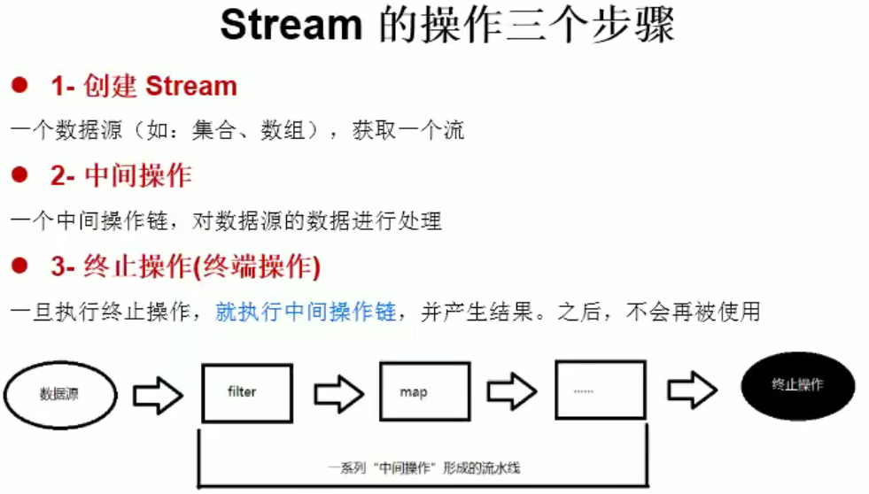

**stream的四种创建方式：**

```java
public static void main(String[] args) {
    // 创建方式1
    List list1 = new ArrayList();
    Stream stream1 = list1.stream();
    Stream stream2 = list1.parallelStream();
    // 创建方式二
    int[] arr = new int[]{1,2,4};
    IntStream stream3 = Arrays.stream(arr);
    // 创建方式三
    Stream<Integer> integerStream = Stream.of(12, 23, 54, 56);
    // 创建方式4 创建无限流
    // 无限流 迭代
    Stream.iterate(0,t -> t+2).limit(10).forEach(System.out::println);
    // 无限流 生成
    Stream.generate(Math :: random).limit(10).forEach(System.out::println);
}
```

### **Stream的中间操作：**

Stream的多个中间操作可以连接成为一条流水线，除非流水线上触发终止操作，否则中间操作就不会被执行，当在触发终止操作时，中间操作一次性全部触发执行，这别称为“惰性处理”。

1.刷选和切片：

| 方法                | 描述                                                         |
| :------------------ | :----------------------------------------------------------- |
| filter(Predicate p) | 接收lambda，从流中排除某些元素                               |
| distinct()          | 筛选，通过流所生成元素的hashCode()和equals()去除重复元素，<br/>元素的这两个方法需要重写 |
| limit(long maxSize) | 截断，使流处理的元素不超过给定数量                           |
| skip(long n)        | 跳过前n个元素，并返回n；若流中元素不足n个，则返回一个空流    |

```java
public static void main(String[] args) {
    List<Employee> list = EmployeeData.getEmployees();
    Stream<Employee> stream = list.stream();
    stream.filter(e -> e.getSalary() > 4000).forEach(System.out::println);
    list.stream().limit(3).forEach(System.out::println);
    list.stream().skip(3).forEach(System.out::println);
    list.add(new Employee(1009,"东",40,8888));
    list.add(new Employee(1009,"东",40,8888));
    list.add(new Employee(1009,"东",40,8888));
    list.add(new Employee(1009,"东",40,8888));
    list.stream().distinct().forEach(System.out::println);
}
```

测试需要的类：

```java
public class Employee {
    private int id;
    private String name;
    private int age;
    private double salary;
    // tostring、equals、构造器、getset
    ......
}
```

```java
public class EmployeeData {
    public static List<Employee> getEmployees(){
        List<Employee> list = new ArrayList<>();
        list.add(new Employee(1001,"马化腾",34,6000.38));
        list.add(new Employee(1002,"马云",12,9000.38));
        list.add(new Employee(1003,"刘强东",33,1200.38));
        list.add(new Employee(1004,"雷军",36,1600.38));
        list.add(new Employee(1005,"李彦宏",45,3600.38));
        list.add(new Employee(1006,"比尔盖茨",66,4600.38));
        list.add(new Employee(1007,"扎克伯格",44,6600.38));
        list.add(new Employee(1008,"任正非",35,9600.38));
        return list;
    }
}
```

2.映射

| 方法                            | 描述                                                         |
| ------------------------------- | ------------------------------------------------------------ |
| map(Function f)                 | 接收一个函数，接收的函数会被映射到每个元素上，并将元素映射成一个新元素<br/>传入的函数对每个元素进行处理并形成映射 |
| mapToDouble(ToDoubleFunction f) | 接收一个函数，接收的函数会被映射到每个元素上，产生一个新的DoubleStrem |
| mapToInt(ToIntFunction f)       | 接收一个函数，接收的函数会被映射到每个元素上，产生一个新的IntStrem |
| mapToLong(ToLongFunction f)     | 接收一个函数，接收的函数会被映射到每个元素上，产生一个新的LongStrem |
| flatMap(Function f)             | 接收的函数将流中的每个值都转换为另一个流，然后再把所有流都合并成一个流 |

```java
@Test // map()
public void test1(){
    List<String> list = Arrays.asList("aa","bb","cc","dd");
    list.stream().map(str -> str.toUpperCase()).forEach(System.out::println);
}
```

```java
public class StreamTestAPI {
    @Test // flatMap()
    public void test2(){
        List<String> list = Arrays.asList("aa","bb","cc","dd");
        // stream的元素是stream
        Stream<Stream<Character>> streamStream = list.stream().map(StreamTestAPI ::fromStringToStream);
        streamStream.forEach(s -> {s.forEach(System.out::print);});
        System.out.println();
        Stream<Character> characterStream = list.stream().flatMap(StreamTestAPI::fromStringToStream);
        characterStream.forEach(System.out::print);
    }
    // 将字符转换为stream
    public static Stream<Character> fromStringToStream(String s){
        ArrayList<Character> list = new ArrayList<>();
        for (Character c : s.toCharArray()) {
            list.add(c);
        }
        return list.stream();
    }
}
```

3.排序

| 方法                   | 描述                                 |
| ---------------------- | ------------------------------------ |
| sorted()               | 产生一个新的流，将元素自然排序       |
| sorted(Comparator com) | 产生一个新的流，将元素按比较器来排序 |

```java
@Test
public void test3(){
    List<Integer> list1 = Arrays.asList(43, 56, 12, 35, 32, 54);
    list1.stream().sorted().forEach(System.out::println);
    List<Employee> list2 = EmployeeData.getEmployees();
    list2.stream().sorted((e1,e2) -> {
        return Integer.compare(e1.getAge(),e2.getAge());
    }).forEach(System.out::println);
}
```

### **Stream的终止操作：**

1.匹配与查找

| 方法                   | 描述                                               |
| ---------------------- | -------------------------------------------------- |
| allMatch(Predicate p)  | 是否匹配全部元素（按传入的函数来确定匹配细节）     |
| anyMatch(Predicate p)  | 是否至少匹配一个元素（按传入的函数来确定匹配细节） |
| noneMatch(Predicate p) | 是否没有匹配全部元素（按传入的函数来确定匹配细节） |
| findFirst()            | 返回第一个元素                                     |
| findAny()              | 返回当前流中任意元素                               |
| count()                | 返回流中元素总数                                   |
| max(Comparator c)      | 返回流中最大值                                     |
| min(Comparator c)      | 返回流中最小值                                     |
| forEach(Consumer c)    | 内部迭代                                           |

```java
// 使用示例
public static void main(String[] args) {
    List<Employee> list = EmployeeData.getEmployees();
    boolean b = list.stream().allMatch(employee -> employee.getAge() > 18);
    System.out.println(b);
}
```

```java
// 使用示例
public static void main(String[] args) {
    Stream<Double> stream1 = list.stream().map(employee -> employee.getSalary());
    Optional<Double> max = stream1.max(Double::compare);
    System.out.println(max);
}
```

2.归约

| 方法                             | 描述                                                         |
| -------------------------------- | ------------------------------------------------------------ |
| reduce(T iden, BinaryOperator b) | 将流中元素反复结合起来，得到一个值（iden是初始值）并返回。返回T |
| reduce(BinaryOperator b)         | 将流中元素反复结合起来，得到一个值并返回 。返回`Optional<T>` |

备注：map与reduce的连接通常称为map-deduce模式，因google用它来进行网络搜索而出名。

```java
@Test // 归约
public void test4(){
    // 计算1-10的和
    List<Integer> list1 = Arrays.asList(1,2,3,4,5,6,7,8,9,10);
    //Integer reduce = list1.stream().reduce(10, Integer::sum); // 65
    Integer reduce = list1.stream().reduce(0, Integer::sum);
    System.out.println(reduce); // 55
    // 计算工资总和
    List<Employee> list2 = EmployeeData.getEmployees();
    Stream<Double> salaryStream = list2.stream().map(Employee::getSalary);
    //Optional<Double> all = salaryStream.reduce(Double::sum); // Optional[42203.04]
    Optional<Double> all = salaryStream.reduce((d1,d2) -> d1+d2); // Optional[42203.04]
    System.out.println(all);
}
```

3.收集

```java
colect(Collector c) // 将流转换为其它形式，接收一个Collector接口的实现，用于给Stream中元素做汇总的方法
```

Collector接口方法的实现决定了如何对流执行收集的操作（如收集到List、Set、Map）。另外，Collectors实用类提供了很多静态方法，可以方便地创建常见收集器实例：

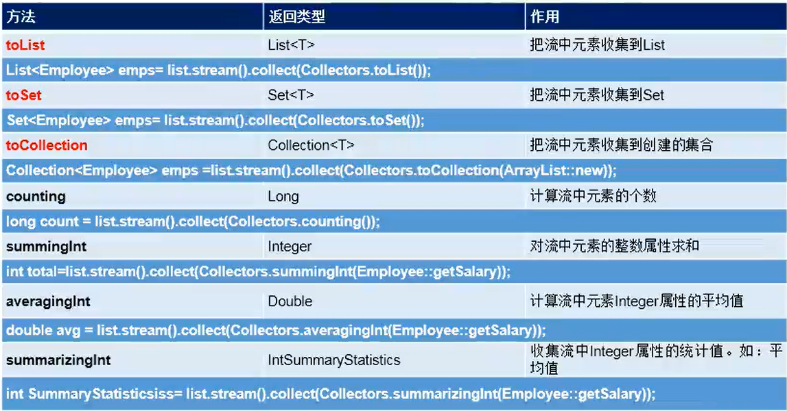

```java
@Test // 收集
public void test5(){
    List<Employee> employees = EmployeeData.getEmployees();
    Stream<Employee> salaryStream = employees.stream().filter(employee -> employee.getSalary() > 6000);
    salaryStream.forEach(System.out :: println);
    System.out.println();
    Set<Employee> set = employees.stream().filter(employee -> employee.getSalary() > 6000).collect(Collectors.toSet());
    set.forEach(System.out :: println);
}
```

Collectors其他的API：

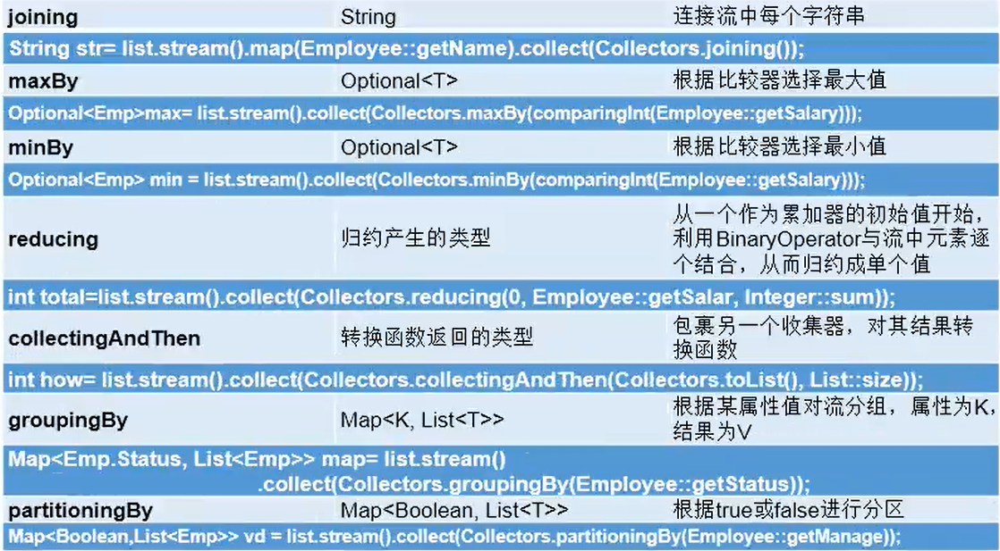

## Optional类

（受到Google的Guava项目的启发，在JDK8中引入）。

`Optional<T>`（java.util.Optional）是一个容器类，它可以保存T类型的值，代表这个值存在；或者仅仅保存null，代表这个值不存在。原来用null表示一个值不存在，现在Optional可以更好地表达这个概念，并且可以避免空指针异常。

Optional类：一个可以为null的容器对象，如果值存在则isPresent()方法返回true，调用get()方法会返回该对象。

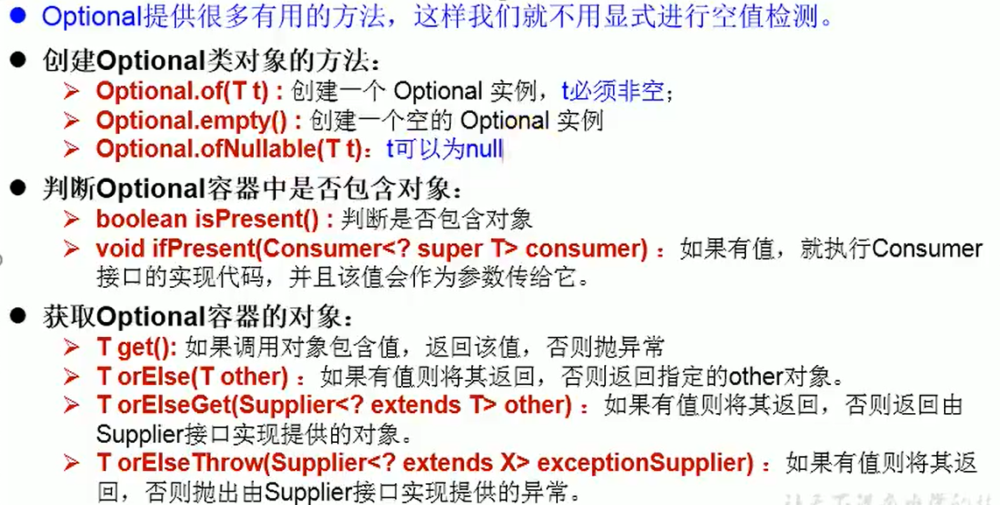


​	

