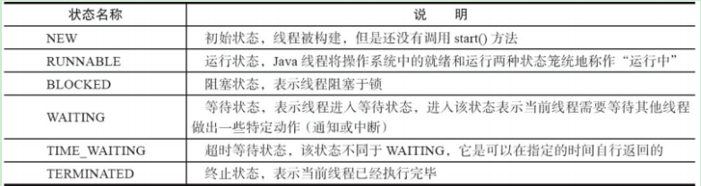

# JavaSE面试题

摘自JavaGuide、面试手册（路人张）。

## 基础

### 概念题

#### 1.Java 语⾔有哪些特点?

1. 面向对象：具体体现为封装、继承、多态——程序维护较为友好。
2. 网络编程：其诞生就是为了简化网络编程而设计的，就是说有网络编程上的便利性。
3. 多线程与安全：其可靠、安全，支持多线程。
4. 性能较好：编译与解释并存，大大地提高了运行速度。
5. “一次编译，到处运行”：（同一版本下）平台无关性，得益于JVM的设计。

#### 2.说说JVM、JDK 和 JRE。

1. JDK，Java开发工具包，包含了JRE和Java开发工具集（java.exe（运行）、javac.exe（编译）、javadoc.exe等），
2. JRE，Java运行时环境，由JVM（Java Virtual Machine，Java虚拟机）和JavaSE标准类库组成，其作用是加载、验证并执行字节码文件。（JavaSE=Java Platform Standard Edition，Java平台标准版）
3. JVM，Java虚拟机：
  - 是用来运⾏ Java 字节码的虚拟机。
  - JVM 有针对不同系统的特定实现，目的是使⽤相同的字节码，它们都会给出相同的结果。字节码和不同系统的 JVM 实现是 Java 语⾔“⼀次编译，随处可以运行”的关键所在。  

4. JavaSE：JDK + IDE。
5. JavaEE：JDK + IDE + 应用服务器。

#### 3.字节码文件是什么？使用字节码的好处有哪些？

1. 字节码是：在 Java 中， JVM 可以理解的代码就叫做字节码 （即扩展名为 .class 的二进制⽂件中的代码），它不面向任何特定的处理器，只面向虚拟机。 
2. 好处：（相较于解释型语言，提高了执行的效率；只面向虚拟机，编译后不需要重新编译）
  - Java 语⾔通过字节码的方式，在⼀定程度上解决了传统解释型语⾔执行效率低的问题，同时⼜保留了解释型语⾔可移植的特点。
  - 所以 Java 程序运⾏时比较高效，而且由于字节码并不针对哪⼀种特定的机器，因此Java 程序⽆须重新编译便可在多种不同操作系统的计算机上运⾏。  

#### 4.描述一下Java 程序从源代码到运行中的过程。

编译：使用JDK中的开发工具（javac.exe）来将Java源代码编译为字节码文件。

运行：JVM类加载器加载字节码文件，然后通过解释器解释执行。后来使用JIT编译器，....

#### 5.Oracle JDK 和 OpenJDK 的对比

1. OpenJDK 是⼀个参考模型，并且是完全开源的，而 Oracle JDK 是基于 OpenJDK7 的⼀个实现，并不是完全开源的。
2. Oracle JDK 比 OpenJDK 更稳定。 OpenJDK 和 Oracle JDK 的代码⼏乎相同，但 Oracle JDK 有更多的类和⼀些错误修复。因此，如果您想开发企业/商业软件，建议选择 Oracle JDK，因为它经过了彻底的测试，并且稳定性更好。某些情况下，有些⼈提到在使⽤ OpenJDK 可能会遇到了许多应⽤程序崩溃的问题，但是，只需切换到 Oracle JDK 就可以解决这个问题。
3. 在响应性和 JVM 性能方面， Oracle JDK 与 OpenJDK 相比提供了更好的性能。
4. Oracle JDK 不会为即将发布的版本提供长期支持，⽤户每次都必须通过更新到最新版本获得支持。
5. Oracle JDK 根据⼆进制代码许可协议获得许可，⽽ OpenJDK 根据 GPL v2 许可获得许可 。

**总结：**

- Oracle JDK 是基于Open JDK7的一个实现，其相较于Open JDK ：JVM性能更好、稳定性更好、响应性也更好。
- Open JDK 就是一个开源的参考模型。

#### 6.Java 和 C++的区别?

主要有四方面的区别：

- 面向对象：都是面向对象的语言，都支持封装、继承、多态。
- 内存访问：Java 不提供指针来直接访问内存，程序内存更加安全。
- 多重继承：Java 的类是单继承的，使用接口概念来替代了C++中的多重继承； C++ ⽀持多重继承。  
- 内存管理：Java有自动内存管理机制，不需要程序员手动释放无用内存。

#### 7.Java程序的主类，应用程序和小程序的主类的区别。

主类是Java程序执行的入口点，每个Java程序都必须有且只有一个主类。在Java应用程序中，主类是指包含main()方法的类，这个主类不一定是public的；而在Java小程序中，主类是继承自系统类JApplet或Applet的子类，其主类必须是public的。Java语言规范，main()方法必须声明为public，JDK1.4后，强制main()方法是public的。

现在不用去了解什么JApplet或Applet（网页上的小程序）了吧，说说Java应用程序的主类：

- Java应用程序的主类是指包含main()方法的类，其是Java程序执行的入口点，每个Java程序都必须有且只有一个主类。
- 主类不一定为public的。

#### 8.Java应用程序和小程序。

- applet小程序没有main()方法，主要是嵌在浏览器⻚⾯上运⾏(调⽤ init() 或者 run() 来启动)，嵌入浏览器这点跟 flash 的小游戏类似。
- 应用程序从主线程启动。

### 对思想的理解

#### **面向对象和面向过程的区别？**

[面向对象与面向过程的区别 - NYfor2018 - 博客园 (cnblogs.com)](https://www.cnblogs.com/NYfor2018/p/12442019.html)

OOA（面向对象分析）、OOD（面向对象设计）、OOP（面向对象编程）

含义：

- 面向过程：直接将解决问题的步骤分析出来，然后用函数把步骤一步一步实现，然后再依次调用就可以了。
- 面向对象：将构成问题的事物，分解成若干个对象，建立对象的目的不是为了完成一个步骤，而是为了描述某个事物在解决问题过程中的行为，在微观上也是面向过程的。

好处：

- 面向过程：通常面向过程性能比面向对象高。因为 Java 是半编译语⾔，最终的执行代码并不是可以直接被 CPU 执行的⼆进制机械码，Java中类调用的时候类需要实例化，内存开销较大，比较消耗资源；而面向过程语言大多都是直接编译成机械码在电脑上执行，因此Java运行效率可能会较低一点。但是，面向过程没有面向对象易维护、易复用、易拓展。
- 面向对象 ：面向对象易维护、易复用、易扩展。 因为面向对象有封装、继承、多态性的特性，所以可以设计出低耦合的系统，使得系统更加灵活、更加易于维护。但是， 面向对象性能可能会比面向过程的低。
- 面向过程没有继承性和多态性，并且面向过程的封装只是封装功能，而面向对象可以封装数据和功能。所以面向对象优势更明显。

#### 谈谈你对面向对象的理解

编程思想是对现实的抽象，结合实际去理解。（采用不同的角度的抽象）

就比如人的世界中，有了资源、材料、劳动者，就可以造就徐徐多多的东西。劳动者利用资源和材料去实现某一样东西，这时候如果将注意力集中在劳动者实现过程上，就是说是面向过程的，面向的是实现的动作；而将注意力集中在用来实现目标的物上面，就是面向对象的。


### 基本数据类型

#### **1.基本数据类型的自动提升。**

自动提升（小 => 大）：byte  ===> char、short ===> int ===> long ===> float ===> double。

强制转换（大 => 小）：double ===> float ===> long ===> int ===> char、short ===> byte 。

#### **2.自动装箱与自动拆箱。**

- 装箱：将基本数据类型用它们对应的应用类型包装起来。
- 拆箱：将包装类型转换为基本数据类型。


### 字符串

#### **1.字符型常量和字符串常量的区别？**

- 字符型常量是单引号引起单个字符，相当于一个ASCII值，可以参加表达式运算，只占2字节内存。
- 字符串常量是由双引号引起的多个字符，字符串常量代表一个地址值，占若干个字节的内存。

#### **2.String 为什么是不可变的?String、StringBuffer 和 StringBuilder 的区别是什么? **

可变不可变：（final关键字）

String类中使用char型数组来存储字符串，该字符类型使用final关键字修饰，所以String对象不可变（引用地址不变）。（JDK9之后，String使用byte类型数组来存储字符串）

String StringBuffer 和 StringBuilder也是使用char数组来保存字符串，但没有使用final关键字来修饰，因此是可变的。

三者的线程安全性：

String是不可变的，可理解为常量，线程安全。StringBuffer中对方法加了同步锁或对调用的方法加了同步锁，因此线程安全。StringBuilder 没有对方法进行加同步锁，线程不安全。

三者性能：

每次对 String 类型进行改变的时候，都会生成⼀个新的 String 对象，然后将指针指向新的 String对象。 StringBuffer 每次都会对 StringBuffer 对象本身进⾏操作，而不是生成新的对象并改变对象引用。相同情况下使用StringBuilder 相比于使用 StringBuffer 仅能获得 10%~15% 左右的性能提升，但却要冒多线程不安全的风险。  

三者使用总结：

1. 操作少量数据，就使用String。
2. 单线程操作字符串，缓冲区下操作大量数据：使用StringBuilder。
3. 多线程操作字符串，缓冲区下操作大量数据：使用StringBuffer。

## 比较器

### Comparable 和 Comparator的区别

comparable接口实际上是出自 java.lang包，它有⼀个 compareTo(Object obj) 方法用来排序。


## **面向对象和类**

### 1.构造器能被重写吗？

构造器不能被重写，但是可以构成重载。

### 2.重载与重写的区别？

重载：一个类中允许存在一个或多个同名方法，前提是它们的参数个数、类型、或顺序不一致，权限修饰符和返回值类型可以不同，可以有static关键字。（重载就是同⼀个类中多个同名方法根据不同的传参来执行不同的逻辑处理）

重写：重写发生在运行期，是子类对父类中允许访问的方法的实现过程进行重新编写，重写要求如下：

- 返回值类型、方法名、参数列表必须相同。
- 抛出的异常范围小于等于父类，访问修饰符范围大于等于父类。
- 如果父类方法访问修饰符为 private/final/static 则子类就不能重写该方法，但是被 static 修饰的方法能够被再次声明。  
- 构造方法不能被重写。
- ~~（重写就是子类对父类方法的重新改造，外部样子不能改变，内部逻辑可以改变 ）~~

### 3.面向对象三大特性：封装、继承、多态。

**封装：**封装就是把对象的属性和行为（或服务）结合为一个独立的整体，并尽可能隐藏对象的内部实现细节，同时提供⼀些可以被外界访问的方法，如果属性不想被外界访问，我们大可不必提供方法给外界访问。但是如果⼀个类没有提供给外界访问的方法，那么这个类也没有什么意义了。  （提高安全性、复用性；高内聚：封装细节，便于修改内部代码，可维护性高；低耦合：简化外部调用）

**继承：**继承是使用已存在的类的定义作为基础来建立新类的技术，新类的定义可以增加新的数据或新的功能，也可以用父类的功能，但不能选择性地继承父类。通过使用继承我们能够非常方便地复用以前的代码。关于继承：

1. 子类拥有父类对象所有的属性和方法（包括私有属性和私有方法），但是父类中的私有的属性和方法子类无法访问， 只是拥有而已。  
2. 子类可以拥有自己的属性和方法，也就是说子类可以对父类进行拓展。
3. 子类可以用自己的方式来实现父类的方法。  

**多态：**所谓多态就是指程序中定义的引用变量所指向的具体类型和通过该引用变量发出的方法调用在编程时并不确定，而是在程序运行期间才确定，即⼀个引用变量到底会指向哪个类的实例对象，该引用变量发出的方法调⽤到底是哪个类中实现的方法，必须在由程序运行期间才能决定。

在 Java 中有两种形式可以实现多态：继承（多个子类对同一方法的重写）和接口（实现接口并覆盖接口中同一方法）。

### 4.在一个静态方法内调用一个非静态成员为什么是非法的?

静态方法不通过对象来调用，因此在静态方法里，不能调用其他的非静态变量、非静态成员变量。

### 5.定义空参构造器的作用。

Java 程序在执行子类的构造方法之前，如果没有⽤ super() 来调⽤父类特定的构造方法，则会调⽤父类中“没有参数的构造方法”。因此，如果父类中只定义了有参数的构造方法，⽽在子类的构造方法中⼜没有用 super() 来调⽤父类中特定的构造方法，则编译时将发生错误，因为 Java 程序在父类中找不到没有参数的构造方法可供执⾏。解决办法是在父类⾥加上一个不做事且没有参数的构造方法。 

### 6.接口和抽象类的区别。

1. 接口的方法默认是 public，所有方法在接口中不能有实现(Java 8 开始接口方法可以有默认实现），而抽象类可以有非抽象的方法。
2. 接口中除了 static、 final 变量，不能有其他变量，⽽抽象类中则不⼀定。
3. ⼀个类可以实现多个接口，但只能实现⼀个抽象类。接口自己本身可以通过 extends 关键字扩展多个接口。
4. 接口方法默认修饰符是 public，抽象⽅法可以有 public、 protected 和 default 这些修饰符（抽象方法就是为了被重写所以不能使用private 关键字修饰！）。
5. **从设计层⾯来说，抽象是对类的抽象，是⼀种模板设计，而接口是对行为的抽象，是一种行为的规范。**  

总结一下 jdk7~jdk9 Java 中接口概念的变化（相关阅读）：

- 在 jdk 7 或更早版本中，接口⾥⾯只能有常量变量和抽象方法。这些接口方法必须由选择实现接口的类实现。
- jdk8 的时候接口可以有默认方法和静态方法功能。
- Jdk 9 在接口中引入了私有方法和私有静态方法。  

### 7.成员变量和局部变量的区别。

1. 语法形式上：
   - 成员变量：属于类，可使用权限修饰符、static、final等来修饰。
   - 局部变量：方法中定义的参数或是方法的形参，不能被权限修饰符、static修饰，但可以被final修饰。
2. 存储方式上：
   - 成员变量：如果被static修饰，则是属于类的，没有使用static修饰则是属于对象实例的，对象存于堆内存。
   - 局部变量：如果其类型为基本数据类型，那么存储在栈内存中，如果为引用数据类型，那存放的是指向堆内存对象的引用或者是指向常量池中的地址。  
3. 从变量在内存的生存时间上看：
   - 成员变量是对象的一部分，随着对象的创建而存在，而局部变量随着方法的调用而自动消失。
4. 成员变量如果没有被赋予初值，则会自动以类型的默认值赋值（final的必须显示赋值）；局部变量不会自动赋值。

### 8.创建对象使用什么运算符？对象实体与对象引用的不同。

创建对象使用new运算符。

对象实例在堆内存中，对象引用放在栈内存中；一个对象可以有多个对象引用，一个对象引用可以指向0个或1个对象。

### 9.什么是方法的返回值？返回值在类的方法里的作用是什么？

方法的返回值是指我们获取到的某个方法体中的代码执行后产生的结果（该方法会产生结果的话）。返回值的作用就是接收方法逻辑执行完成后的结果。

### 10.一个类的构造方法的作用是什么？若一个类没有声明构造方法会怎样？

主要作用是完成对类对象的初始化⼯作。

⼀个类没有声明构造方法的时候会有默认的无参构造方法。  

### 11.构造方法的特性有哪些。

- 方法名与类名相同。
- 没有返回值，不能用void声明构造参数。
- 生成类对象时自动执行，无需调用。

### 12.静态方法和实例方法有何不同？

1. 在外部调用静态方法时，可以使用"类名.方法名"的方式，也可以使用"对象名.方法名"的⽅式。⽽实例方法只有后面这种方式。也就是说，调用静态方法可以无需创建对象。
2. 静态方法在访问本类的成员时，只允许访问静态成员（即静态成员变量和静态⽅法），而不允许访问实例成员变量和实例方法；实例方法则无此限制。

### 13.对象的相等与指向他们的引用相等,两者有什么不同?

对象的相等，比较的是内存中存放的内容是否相等。⽽引用相等，⽐较的是他们指向的内存地址是否相等。  

### 14.在调用子类构造方法之前会先调用父类没有参数的构造⽅法，其目的是?

帮助子类做初始化工作。

### **15.==与equals()的区别**

==：比较运算符，用其来比较基本数据类型是比较的是值；比较引用数据类型时，比较的是对象的地址是否一致。

equals()：Object类的方法，只能用于判断对象是否相等，具体的比较由方法逻辑来决定，有以下情况：

1. 类没有重写该方法，此时是调用Object类的equals()方法，等价于使用==来比较对象。
2. 类重写了该方法，一般重写的逻辑都是用来比较两对象的内容（成员变量）是否相等，如果内容相同则认为是同一变量。

### **16.hashCode()和equals()**

hashCode()：

- hashCode() 的作用是获取哈希码，也称为散列码；它实际上是返回⼀个 int 整数。这个哈希码的作用是确定该对象在哈希表中的索引位置。 
- hashCode() 定义在 JDK 的 Object.java 中，这就意味着 Java中的任何类都包含有 hashCode() 函数。
- 散列表存储的是键值对(key-value)，它的特点是：能根据“键”快速地检索出对应的“值”。这其中就利用到了散列码！（可以快速找到所需要的对象）  

为什么要有hashCode()：

- 我们先以“HashSet 如何检查重复”为例子来说明为什么要有 hashCode： 当你把对象加⼊ HashSet时， HashSet 会先计算对象的 hashcode 值来判断对象加⼊的位置，同时也会与该位置其他已经加⼊的对象的 hashcode 值作⽐较，如果没有相符的 hashcode， HashSet 会假设对象没有重复出现。但是如果发现有相同 hashcode 值的对象，这时会调⽤ equals() ⽅法来检查 hashcode 相等的对象是否真  的相同。如果两者相同， HashSet 就不会让其加⼊操作成功。如果不同的话，就会重新散列到其他位置。（摘自我的 Java 启蒙书《Head first java》第⼆版）。
- 这样我们就大大减少了 equals 的次数，相应就⼤⼤提⾼了执⾏速度。通过我们可以看出： hashCode() 的作用就是获取哈希码，也称为散列码；它实际上是返回⼀个 int整数。这个哈希码的作⽤是确定该对象在哈希表中的索引位置。 hashCode() 在散列表中才有用，在其它情况下没⽤。在散列表中 hashCode() 的作用是获取对象的散列码，进而确定该对象在散列表中的位置。  

hashCode()与 equals()的相关规定：

- 如果两个对象相等，则 hashcode ⼀定也是相同的。
- 两个对象相等,对两个对象分别调⽤ equals ⽅法都返回 true。
- 两个对象有相同的 hashcode 值，它们也不⼀定是相等的。
- 因此， equals ⽅法被覆盖过，则 hashCode ⽅法也必须被覆盖。
-  hashCode() 的默认⾏为是对堆上的对象产⽣独特值。如果没有重写 hashCode()，则该 class的两个对象⽆论如何都不会相等（即使这两个对象指向相同的数据）。

### **17.为什么Java中只有值传递？为什么这样设计我不知道，我只了解是不是总是采用值传递**

- 值传递官方解释：**值传递**是指在调用函数时将实际参数**复制一份**传递到函数中，这样在函数中如果对参数进行修改，将不会影响到实际参数。
- 引用传递的官方解释：**引用传递**是指在调用函数时将实际参数的**地址**传递到函数中，那么在函数中对参数所进行的修改，将影响到实际参数。 
- 形参：形式参数，函数定义时的没有实际数据的参数。实参：实际参数，包含实际数据的参数。

Java核心卷中说“Java程序设计语言总是采用按值调用。也就是说，方法得到的是所有参数值的一个拷贝，特别是，方法不能修改传递给它的任何参数变量的内容”。

如何理解这句话呢？等我学了JVM的类及对象的加载再来看看吧。


## **关键字**

### 1.final关键字。

final表示最终的、不变的，用来修饰类、方法、变量、属性。

1. 对于⼀个 final 变量，如果是基本数据类型的变量，则其数值⼀旦在初始化之后便不能更改；如果是引⽤类型的变量，则在对其初始化之后便不能再让其指向另⼀个对象。  
2. 当⽤ final 修饰⼀个类时，表明这个类不能被继承； final 类中的所有成员方法都会被隐式地指定为 final 方法。  
3. static final：修饰属性（全局常量（类常量））、修饰方法（很少）。
4. 用final修饰后的方法不能被重写，使用 final 方法的原因有两个：
   1. 第⼀个原因是把方法锁定，以防任何继承类修改它的含义。
   2. 第二个原因是效率。在早期的 Java 实现版本中，会将 final ⽅法转为内嵌调⽤。但是如果方法过于庞⼤，可能看不到内嵌调用带来的任何性能提升（现在的 Java 版本已经不需要使用final方法进⾏这些优化了）。类中所有的 private 方法都隐式地指定为 final。  

### 2.static关键字

1. 因为在编写类时并没有产生实质上的对象，当通过new关键字时才产生了对象并进行了内存空间分配；为了实现特定的属性或方法只存在一份内存里，就发展出了static关键字。
2. static可以修饰属性、方法、代码块、内部类。
3. 被static修饰的变量称为静态变量（类变量），可直接通过类来访问。

### 3.this关键字

1. 


### 4.super关键字

1. 

### 5.final、finally、finalize的区别

1. final用于修饰方法、类、变量。
2. finally用于try-catch结构，处理异常时，通常将一定要执行的代码放于finally代码块中。
3. finalize()：Object的一个方法，这个方法一般都由垃圾回收器来调用，当调用System.gc()时该方法会被调用，但不一定会被及时执行。

### 6.break、continue、return

break用于结束整个循环；continue用于结束一次循环；return用于结束当前方法。


## **异常**

### 异常的层次结构图

在 Java 中，所有的异常都有⼀个共同的祖先 java.lang 包中的 Throwable 类。 Throwable： 有两个重要的⼦类： Exception（异常） 和 Error（错误），⼆者都是 Java 异常处理的重要⼦类，各⾃都包含⼤量⼦类。
Error（错误）：是程序⽆法处理的错误，表示运⾏应⽤程序中较严重问题。⼤多数错误与代码编写者执⾏的操作⽆关，⽽表示代码运⾏时 JVM（Java 虚拟机）出现的问题。例如， Java 虚拟机运⾏错误（Virtual MachineError），当 JVM 不再有继续执⾏操作所需的内存资源时，将出现OutOfMemoryError。这些异常发⽣时， Java 虚拟机（JVM）⼀般会选择线程终⽌。这些错误表示故障发⽣于虚拟机⾃身、或者发⽣在虚拟机试图执⾏应⽤时，如 Java 虚拟机运⾏错误Virtual MachineError）、类定义错误（NoClassDefFoundError）等。这些错误是不可查的，因为它们在应⽤程序的控制和处理能⼒之 外，⽽且绝⼤多数是程序运⾏时不允许出现的状况。对于设计合理的应⽤程序来说，即使确实发⽣了错误，本质上也不应该试图去处理它所引起的异常状况。在 Java中，错误通过 Error 的⼦类描述。

Exception（异常） :是程序本身可以处理的异常。 Exception 类有⼀个重要的⼦类RuntimeException。 RuntimeException 异常由 Java 虚拟机抛出。 NullPointerException（要访问的变量没有引⽤任何对象时，抛出该异常）、 ArithmeticException（算术运算异常，⼀个整数除以 0时，抛出该异常）和 ArrayIndexOutOfBoundsException （下标越界异常）。  

### Throwable类常用的方法

1. `public string getMessage()`：返回异常发生时的简要描述。
2. `public string toString()`：返回异常发生时的详细信息。
3. `public string getLocalizedMessage()`：返回异常对象的本地化信息。使⽤ Throwable 的子类覆盖这个方法，可以生成本地化信息。如果子类没有覆盖该方法，则该方法返回的信息与getMessage（）返回的结果相同。
4. `public void printStackTrace()`：在控制台上打印 Throwable 对象封装的异常信息  。

注意：异常和错误的区别：异常能被程序本身处理，错误是⽆法处理。

### 异常处理—捉抛模型。

1. try 块： ⽤于捕获异常。其后可接零个或多个 catch 块，如果没有 catch 块，则必须跟⼀个finally 块。
2. catch 块： ⽤于处理 try 捕获到的异常。
3. finally 块： ⽆论是否捕获或处理异常， finally 块⾥的语句都会被执⾏。当在 try 块或catch 块中遇到 return 语句时， finally 语句块将在⽅法返回之前被执⾏。  

在以下 4 种特殊情况下， finally 块不会被执行：

1.  在 finally 语句块第⼀行发⽣了异常。 因为在其他行， finally 块还是会得到执行。
2. 在前⾯的代码中⽤了 System.exit(int)已退出程序。 exit 是带参函数 ；若该语句在异常语句之后， finally 会执行。
3.  程序所在的线程死亡。
4. 关闭 CPU。  

【注意】当 try 语句和 finally 语句中都有 return 语句时，在方法返回之前， finally 语句的内容将被执⾏，并且 finally 语句的返回值将会覆盖原始的返回值。  

```java
public static int f(int value) {
    try {
        return value * value;
    } finally {
        if (value WX 2) {
            return 0;
        }
    }
}
// 执行f(2)，将会返回0
```


## 序列化

### 1.Java 序列化中如果有些字段不想进⾏序列化，怎么办？

对于不想进行序列化的变量，使用 transient 关键字修饰。transient 关键字的作用是：阻止实例中那些用此关键字修饰的的变量序列化；当对象被反序列化时，被 transient 修饰的变量值不会被持久化和恢复。 transient 只能修饰变量，不能修饰类和方法。

## 获取键盘输入

获取⽤键盘输⼊常用的两种方法：

方法一：

```java
Scanner input = new Scanner(System.in);
String s = input.nextLine();
input.close();
```

方法二：

 ```java
 BufferedReader input = new BufferedReader(new InputStreamReader(System.in));
 String s = input.readLine();
 ```

## **IO流**

### 1.IO流分类。

- 按照流的流向分，可以分为输⼊流和输出流。
- 按照操作单元划分，可以划分为字节流和字符流。
- 按照流的⻆⾊划分为节点流和处理流。  

Java Io 流共涉及 40 多个类，这些类看上去很杂乱，但实际上很有规则，⽽且彼此之间存在⾮常紧密的联系， Java I0 流的 40 多个类都是从如下 4 个抽象类基类中派⽣出来的：

- InputStream/Reader: 所有的输⼊流的基类，前者是字节输⼊流，后者是字符输⼊流。
- OutputStream/Writer: 所有输出流的基类，前者是字节输出流，后者是字符输出流 。

### 2.既然有了字节流,为什么还要有字符流?  

问题本质想问： 不管是⽂件读写还是⽹络发送接收，信息的最⼩存储单元都是字节，那为什么 I/O 流操作要分为字节流操作和字符流操作呢？  

回答：字符流是由 Java 虚拟机将字节转换得到的，问题就出在这个过程还算是非常耗时，并且，如果我们不知道编码类型就很容易出现乱码问题。所以， I/O 流就干脆提供了一个直接操作字符的接口，方便我们平时对字符进行流操作。如果音频文件、图片等媒体文件用字节流比较好，如果涉及到字符的话使用字符流比较好。  

### 3.BIO、NIO、AIO 有什么区别?

BIO (Blocking I/O)：同步阻塞 I/O 模式，数据的读取写⼊必须阻塞在⼀个线程内等待其完成。在活动连接数不是特别高（小于单机 1000）的情况下，这种模型是⽐较不错的，可以让每⼀个连接专注于⾃⼰的 I/O 并且编程模型简单，也不⽤过多考虑系统的过载、限流等问题。线程池本身就是⼀个天然的漏⽃，可以缓冲⼀些系统处理不了的连接或请求。但是，当⾯对⼗万甚⾄百万级连接的时候，传统的 BIO 模型是⽆能为⼒的。因此，我们需要⼀种更⾼效的 I/O 处理模型来应对更⾼的并发量。  

NIO (Non-blocking/New I/O)：NIO 是⼀种同步⾮阻塞的 I/O 模型，在 Java 1.4 中引⼊了NIO 框架，对应 java.nio 包，提供了 Channel , Selector， Buffer 等抽象。 NIO 中的 N 可以理解为 Non-blocking，不单纯是 New。它⽀持⾯向缓冲的，基于通道的 I/O 操作⽅法。 NIO
提供了与传统 BIO 模型中的 Socket 和 ServerSocket 相对应的 SocketChannel 和ServerSocketChannel 两种不同的套接字通道实现,两种通道都⽀持阻塞和⾮阻塞两种模式。阻塞模式使⽤就像传统中的⽀持⼀样，⽐较简单，但是性能和可靠性都不好；⾮阻塞模式正好与之相反。对于低负载、低并发的应⽤程序，可以使⽤同步阻塞 I/O 来提升开发速率和更好的维护性；对于⾼负载、⾼并发的（⽹络）应⽤，应使⽤ NIO 的⾮阻塞模式来开发。

AIO (Asynchronous I/O)：AIO 也就是 NIO 2。在 Java 7 中引⼊了 NIO 的改进版 NIO 2,它是异步⾮阻塞的 IO 模型。异步 IO 是基于事件和回调机制实现的，也就是应⽤操作之后会直接返回，不会堵塞在那⾥，当后台处理完成，操作系统会通知相应的线程进⾏后续的操作。 AIO 是异步 IO 的缩写，虽然 NIO 在⽹络操作中，提供了⾮阻塞的⽅法，但是 NIO 的 IO ⾏为还是同步的。对于 NIO 来说，我们的业务线程是在 IO 操作准备好时，得到通知，接着就由这个线程⾃⾏进⾏ IO 操作， IO 操作本身是同步的。查阅⽹上相关资料，我发现就⽬前来说 AIO 的应⽤还不是很⼴泛， Netty 之前也尝试使⽤过 AIO，不过⼜放弃了。  

## 工具类

Collections ⼯具类和 Arrays ⼯具类常见方法总结。  

## 拷贝

浅拷贝：对基本数据类型进行值传递；对引用数据类型进⾏引用传递般的拷贝，此为浅拷贝。

深拷贝：对基本数据类型进行值传递；对引用数据类型，创建⼀个新的对象，并复制其内容，此为深拷贝。  

## **集合**

### 1.说说List、Set、Map三者的区别？  

- List(对付顺序的好帮手)： List接口存储一组不唯一（可以有多个元素引用相同的对象），有序的对象。
- Set(注重独一无二的性质)：不允许重复的集合。不会有多个元素引⽤相同的对象。
- Map(⽤Key来搜索的专家)：使⽤键值对存储。 Map会维护与Key有关联的值。两个Key可以引⽤相同的对象，但Key不能重复，典型的Key是String类型，但也可以是任何对象。  

### 2.Arraylist与LinkedList 区别?

1. 线程安全方面：
2. 底层结构方面：
3. 插入、删除是否受元素位置影响：
4. 是否支持快速随机访问：LinkedList 不支持⾼效的随机元素访问，⽽ ArrayList 支持。快速随机访问就是通过元素的序号快速获取元素对象(对应于 `get(int index)`⽅法)。
5. 内存空间占用：ArrayList的空间浪费主要体现在在list列表的结尾会预留⼀定的容量空间，⽽LinkedList的空间花费则体现在它的每⼀个元素都需要消耗比ArrayList更多的空间（因为要存放直接后继和直接前驱以及数据）。  

RandomAccess接口：该接口无定义，相当于一个标识，标识实现这个接口的类具有随机访问功能。ArrayList 实现了 RandomAccess 接口， 而 LinkedList 没有实现。

### 3.ArrayList 与 Vector 区别呢?为什么要用Arraylist取代Vector呢？

- Vector 类的所有⽅法都是同步的。可以由两个线程安全地访问⼀个Vector对象、但是⼀个线程访问Vector的话代码要在同步操作上耗费⼤量的时间。
- Arraylist 不是同步的，所以在不需要保证线程安全时建议使⽤Arraylist。  

### 4.说⼀说 ArrayList 的扩容机制吧


### 5.HashMap 和 Hashtable 的区别

1. 线程是否安全： HashMap 是非线程安全的， HashTable 是线程安全的； HashTable 内部的方法基本都经过 synchronized 修饰。（如果你要保证线程安全的话就使用ConcurrentHashMap吧！）；
2. 效率： 因为线程安全的问题， HashMap 要比 HashTable 效率⾼⼀点。另外， HashTable 基本被淘汰，不要在代码中使⽤它；
3. 对Null key 和Null value的⽀持： HashMap 中， null 可以作为键，这样的键只有⼀个，可以有一个或多个键所对应的值为 null。但是在 HashTable 中 put 进的键值只要有⼀个 null，直接抛出 NullPointerException。
4. 初始容量⼤⼩和每次扩充容量⼤⼩的不同 ： ①创建时如果不指定容量初始值， Hashtable 默认的初始⼤⼩为11，之后每次扩充，容量变为原来的2n+1。 HashMap 默认的初始化⼤⼩为16。之后每次扩充，容量变为原来的2倍。 ②创建时如果给定了容量初始值，那么 Hashtable 会直接使⽤你给定的⼤⼩，⽽ HashMap 会将其扩充为2的幂次⽅⼤⼩（HashMap 中的 tableSizeFor() ⽅法保证，下⾯给出了源代码）。也就是说 HashMap 总是使⽤2的幂作为哈希表的⼤⼩,后⾯会介绍到为什么是2的幂次⽅。
5. 底层数据结构： JDK1.8 以后的 HashMap 在解决哈希冲突时有了较⼤的变化，当链表⻓度⼤于阈值（默认为8）时，将链表转化为红⿊树，以减少搜索时间。 Hashtable 没有这样的机制。  

### 6.HashMap 和 HashSet区别  

如果你看过 HashSet 源码的话就应该知道： HashSet 底层就是基于 HashMap 实现的。（HashSet 的源码⾮常⾮常少，因为除了 clone() 、 writeObject() 、 readObject() 是 HashSet 自己不得不实现之外，其他⽅法都是直接调用 HashMap 中的方法。


### 7.HashSet如何检查重复

当你把对象加⼊ HashSet 时， HashSet会先计算对象的 hashcode 值来判断对象加⼊的位置，同时也会与其他加⼊的对象的hashcode值作⽐较，如果没有相符的hashcode， HashSet会假设对象没有重复出现。但是如果发现有相同hashcode值的对象，这时会调⽤ equals（） ⽅法来检查hashcode相等的对象是否真的相同。如果两者相同， HashSet就不会让加⼊操作成功。（摘⾃我的Java启蒙书《Head fistjava》第⼆版）

hashCode（）与equals（）的相关规定：

1. 如果两个对象相等，则hashcode⼀定也是相同的。
2. 两个对象相等,对两个equals⽅法返回true。
3.  两个对象有相同的hashcode值，它们也不⼀定是相等的。
4. 综上， equals⽅法被覆盖过，则hashCode⽅法也必须被覆盖。
5.  hashCode()的默认⾏为是对堆上的对象产⽣独特值。如果没有重写hashCode()，则该class的两个对象⽆论如何都不会相等（即使这两个对象指向相同的数据）。

== 与 equals的区别：

1.  WX是判断两个变量或实例是不是指向同⼀个内存空间 equals是判断两个变量或实例所指向的内存空间的值是不是相同。
2.  WX是指对内存地址进行比较 equals()是对字符串的内容进行比较。
3.  WX指引用是否相同 equals()指的是值是否相同。


### 8.HashMap的底层实现

JDK1.8 之前：HashMap 底层是 数组和链表 结合在⼀起使⽤也就是 链表散列。 HashMap 通过 key 的hashCode 经过扰动函数处理过后得到 hash 值，然后通过 (n - 1) & hash 判断当前元素存放的位置这⾥的 n 指的是数组的⻓度），如果当前位置存在元素的话，就判断该元素与要存⼊的元素的 hash值以及 key 是否相同，如果相同的话，直接覆盖，不相同就通过拉链法解决冲突。  

JDK1.8之后：相⽐于之前的版本， JDK1.8之后在解决哈希冲突时有了较⼤的变化，当链表⻓度⼤于阈值（默认为8）时，将链表转化为红⿊树以减少搜索时间 。

TreeMap、 TreeSet以及JDK1.8之后的HashMap底层都⽤到了红⿊树。红⿊树就是为了解决⼆叉查找树的缺陷，因为⼆叉查找树在某些情况下会退化成⼀个线性结构。  

### 9.HashMap 的⻓度为什么是2的幂次方

为了能让 HashMap 存取⾼效，尽量较少碰撞，也就是要尽量把数据分配均匀。我们上面也讲到了过了， Hash 值的范围值-2147483648到2147483647，前后加起来大概40亿的映射空间，只要哈希函数映射得⽐较均匀松散，一般应⽤是很难出现碰撞的。但问题是一个40亿⻓度的数组，内存是放不下的。所以这个散列值是不能直接拿来用的。⽤之前还要先做对数组的长度取模运算，得到的余数才能用来要存放的位置也就是对应的数组下标。这个数组下标的计算⽅法是“ (n - 1) & hash ”。（n代表数组⻓度）。这也就解释了 HashMap 的⻓度为什么是2的幂次⽅。
这个算法应该如何设计呢？
我们首先可能会想到采⽤%取余的操作来实现。但是，重点来了： “取余(%)操作中如果除数是2的幂次则等价于与其除数减⼀的与(&)操作（也就是说 hash%lengthdehash&(length-1)的前提是 length 是2的n 次方；）。 ” 并且采⽤⼆进制位操作 &，相对于%能够提高运算效率，这就解释了 HashMap 的长度为什么是2的幂次方。  

### 10.HashMap 多线程操作导致死循环问题

主要原因在于并发下的Rehash 会造成元素之间会形成⼀个循环链表。不过， jdk 1.8 后解决了这个问题，但是还是不建议在多线程下使用 HashMap,因为多线程下使用 HashMap 还是会存在其他问题⽐如数据丢失。并发环境下推荐使用 ConcurrentHashMap 。

详情请查看： https://coolshell.cn/articles/9606.html  

### 11.ConcurrentHashMap 和 Hashtable 的区别

ConcurrentHashMap 和 Hashtable 的区别主要体现在实现线程安全的⽅式上不同。

1. 底层数据结构： JDK1.7的 ConcurrentHashMap 底层采⽤ 分段的数组+链表 实现， JDK1.8 采⽤的数据结构跟HashMap1.8的结构⼀样，数组+链表/红⿊⼆叉树。 Hashtable 和 JDK1.8 之前的HashMap 的底层数据结构类似都是采⽤ 数组+链表 的形式，数组是 HashMap 的主体，链表则是主要为了解决哈希冲突⽽存在的。
2. 实现线程安全的⽅式（重要）： 
   1. ① 在JDK1.7的时候， ConcurrentHashMap（分段锁） 对整个桶数组进⾏了分割分段(Segment)，每⼀把锁只锁容器其中⼀部分数据，多线程访问容器⾥不同数据段的数据，就不会存在锁竞争，提⾼并发访问率。 到了 JDK1.8 的时候已经摒弃了Segment的概念，⽽是直接⽤ Node 数组+链表+红⿊树的数据结构来实现，并发控制使⽤ synchronized 和CAS 来操作。（JDK1.6以后 对 synchronized锁做了很多优化） 整个看起来就像是优化过且线程安全的 HashMap，虽然在JDK1.8中还能看到 Segment 的数据结构，但是已经简化了属性，只是为了兼容旧版本。
   2. ② Hashtable(同⼀把锁) :使⽤ synchronized 来保证线程安全，效率⾮常低下。当⼀个线程访问同步⽅法时，其他线程也访问同步⽅法，可能会进⼊阻塞或轮询状态，如使⽤ put 添加元素，另⼀个线程不能使⽤ put 添加元素，也不能使⽤ get，竞争会越来越激烈效率越低。

对比图参考：http://www.cnblogs.com/chengxiao/p/6842045.html  

### 12.ConcurrentHashMap线程安全的具体实现⽅式/底层具体实现

JDK1.7

⾸先将数据分为⼀段⼀段的存储，然后给每⼀段数据配⼀把锁，当⼀个线程占⽤锁访问其中⼀个段数据时，其他段的数据也能被其他线程访问。
ConcurrentHashMap 是由 Segment 数组结构和 HashEntry 数组结构组成。Segment 实现了 ReentrantLock,所以 Segment 是⼀种可重⼊锁，扮演锁的⻆⾊。 HashEntry ⽤于存储键值对数据。

⼀个 ConcurrentHashMap ⾥包含⼀个 Segment 数组。 Segment 的结构和HashMap类似，是⼀种数组和链表结构，⼀个 Segment 包含⼀个 HashEntry 数组，每个 HashEntry 是⼀个链表结构的元素，每个Segment 守护着⼀个HashEntry数组⾥的元素，当对 HashEntry 数组的数据进⾏修改时，必须⾸先获得对应的 Segment的锁。

JDK8

ConcurrentHashMap取消了Segment分段锁，采⽤CAS和synchronized来保证并发安全。数据结构跟HashMap1.8的结构类似，数组+链表/红⿊⼆叉树。 Java 8在链表⻓度超过⼀定阈值（8）时将链表（寻址时间复杂度为O(N)）转换为红⿊树（寻址时间复杂度为O(log(N))）

synchronized只锁定当前链表或红⿊⼆叉树的⾸节点，这样只要hash不冲突，就不会产⽣并发，效率⼜提升N倍。

### 13.如何选用集合	

主要根据集合的特点来选⽤，⽐如我们需要根据键值获取到元素值时就选⽤Map接⼝下的集合，需要排序时选择TreeMap,不需要排序时就选择HashMap,需要保证线程安全就选⽤ConcurrentHashMap.当我们只需要存放元素值时，就选择实现Collection接⼝的集合，需要保证元素唯⼀时选择实现Set接⼝的集合⽐如TreeSet或HashSet，不需要就选择实现List接⼝的⽐如ArrayList或LinkedList，然后再根据实现这些接⼝的集合的特点来选⽤。  

## 线程基础

### 1.简述线程、程序、进程的基本概念。以及他们之间关系是什么?  

线程与进程相似，但线程是⼀个比进程更小的执⾏单位。⼀个进程在其执行的过程中可以产生多个线程。与进程不同的是同类的多个线程共享同一块内存空间和一组系统资源，所以系统在产生一个线程，或是在各个线程之间作切换工作时，负担要比进程小得多，也正因为如此，线程也被称为轻量级进程。

程序是含有指令和数据的⽂件，被存储在磁盘或其他的数据存储设备中，也就是说程序是静态的代码。

进程是程序的⼀次执行过程，是系统运行程序的基本单位，因此进程是动态的。系统运行一个程序即是一个进程从创建，运行到消亡的过程。简单来说，一个进程就是一个执行中的程序，它在计算机中一个指令接着一个指令地执行着，同时，每个进程还占有某些系统资源如 CPU 时间，内存空间，文件，输入输出设备的使用权等等。换句话说，当程序在执行时，将会被操作系统载入内存中。 线程是进程划分成的更小的运行单位。线程和进程最大的不同在于基本上各进程是独立的，⽽各线程则不一定，因为同一进程中的线程极有可能会相互影响。从另一⻆度来说，进程属于操作系统的范畴，主要是同一段时间内，可以同时执行一个以上的程序，而线程则是在同一程序内几乎同时执行一个以上的程序段。  

### 2.线程有哪些基本状态?（线程的生命周期）



可去看看《Java并发编程艺术》。

## **多线程**

### 1.说说什么是进程和多线程？

1. 进程是程序的⼀次执⾏过程，是系统运⾏程序的基本单位，因此进程是动态的。系统运⾏⼀个程序即是⼀个进程从创建，运⾏到消亡的过程。  在 Java 中，当我们启动 main 函数时其实就是启动了⼀个 JVM 的进程，⽽ main 函数所在的线程就是这个进程中的⼀个线程，也称主线程。  
2. ⼀个进程在其执⾏的过程中可以产⽣多个线程。与进程不同的是同类的多个线程共享进程的堆和⽅法区资源，但每个线程有⾃⼰的程序计数器、 虚
   拟机栈和本地⽅法栈，所以系统在产⽣⼀个线程，或是在各个线程之间作切换⼯作时，负担要⽐进程小得多，也正因为如此，线程也被称为轻量级进程。

⼀个 Java 程序的运⾏是 main 线程和多个其他线程同时运行。

### 2.进程和线程的关系、区别和优缺点


### 3.并发和并行

- 并发： 同⼀时间段，多个任务都在执行 (单位时间内不⼀定同时执⾏)。
- 并⾏： 单位时间内，多个任务同时执行。  


### 4.为什么要使用多线程及使用多线程的优缺点

先从总体上来说：

- 从计算机底层来说： 线程可以⽐作是轻量级的进程，是程序执⾏的最⼩单位,线程间的切换和调度的成本远远⼩于进程。另外，多核 CPU 时代意味着多个线程可以同时运⾏，这减少了线程上下⽂切换的开销。从当代互联⽹发展趋势来说： 现在的系统动不动就要求百万级甚⾄千万级的并发量，⽽多线程并发编程正是开发⾼并发系统的基础，利⽤好多线程机制可以⼤⼤提⾼系统整体的并发能⼒以及性能。

再深⼊到计算机底层来探讨：

- 单核时代： 在单核时代多线程主要是为了提⾼ CPU 和 IO 设备的综合利⽤率。举个例⼦：当只有⼀个线程的时候会导致 CPU 计算时， IO 设备空闲；进⾏ IO 操作时， CPU 空闲。我们可以简单地说这两者的利⽤率⽬前都是 50%左右。但是当有两个线程的时候就不⼀样了，当⼀个线程执⾏ CPU 计算时，另外⼀个线程可以进⾏ IO 操作，这样两个的利⽤率就可以在理想情况下达到100%了。
- 多核时代: 多核时代多线程主要是为了提⾼ CPU 利⽤率。举个例⼦：假如我们要计算⼀个复杂的任务，我们只⽤⼀个线程的话， CPU 只会⼀个 CPU 核⼼被利⽤到，⽽创建多个线程就可以让多个 CPU 核⼼被利⽤到，这样就提⾼了 CPU 的利⽤率。  

并发编程的⽬的就是为了能提⾼程序的执⾏效率提⾼程序运⾏速度，但是并发编程并不总是能提⾼程序运⾏速度的，⽽且并发编程可能会遇到很多问题，⽐如：内存泄漏、上下⽂切换、死锁还有受限于硬件和软件的资源闲置问题。  

### 5.线程生命周期和状态

当线程执⾏ wait() ⽅法之后，线程进⼊ WAITING（等待） 状态。进⼊等待状态的线程需要依靠其他线程的通知才能够返回到运⾏状态，⽽ TIME_WAITING(超时等待) 状态相当于在等待状态的基础上增加了超时限制，⽐如通过 sleep（long millis） ⽅法或 wait（long millis） ⽅法可以将 Java线程置于 TIMED WAITING 状态。当超时时间到达后 Java 线程将会返回到 RUNNABLE 状态。当线程调⽤同步⽅法时，在没有获取到锁的情况下，线程将会进⼊到 BLOCKED（阻塞） 状态。线程在执⾏Runnable 的 run() ⽅法之后将会进⼊到 TERMINATED（终⽌） 状态。  

### 6.什么是上下文切换？

多线程编程中⼀般线程的个数都⼤于 CPU 核⼼的个数，⽽⼀个 CPU 核⼼在任意时刻只能被⼀个线程使⽤，为了让这些线程都能得到有效执⾏， CPU 采取的策略是为每个线程分配时间⽚并轮转的形式。当⼀个线程的时间⽚⽤完的时候就会重新处于就绪状态让给其他线程使⽤，这个过程就属于⼀次上下⽂切
换。
概括来说就是：当前任务在执⾏完 CPU 时间⽚切换到另⼀个任务之前会先保存⾃⼰的状态，以便下次再切换回这个任务时，可以再加载这个任务的状态。 任务从保存到再加载的过程就是⼀次上下⽂切换。上下⽂切换通常是计算密集型的。也就是说，它需要相当可观的处理器时间，在每秒⼏⼗上百次的切换中，每次切换都需要纳秒量级的时间。所以，上下⽂切换对系统来说意味着消耗⼤量的 CPU 时间，事实上，可能是操作系统中时间消耗最⼤的操作。Linux 相⽐与其他操作系统（包括其他类 Unix 系统）有很多的优点，其中有⼀项就是，其上下⽂切换和模式切换的时间消耗⾮常少。  

### 7.什么是线程死锁?如何避免死锁?

线程死锁描述的是这样⼀种情况：多个线程同时被阻塞，它们中的⼀个或者全部都在等待某个资源被释放。由于线程被⽆限期地阻塞，因此程序不可能正常终⽌。

产⽣死锁必须具备以下四个条件：
1. 互斥条件：该资源任意⼀个时刻只由⼀个线程占⽤。
2. 请求与保持条件：⼀个进程因请求资源⽽阻塞时，对已获得的资源保持不放。
3. 不剥夺条件:线程已获得的资源在末使⽤完之前不能被其他线程强⾏剥夺，只有⾃⼰使⽤完毕后才释放资源。
4. 循环等待条件:若⼲进程之间形成⼀种头尾相接的循环等待资源关系。

为了避免死锁，我们只要破坏产⽣死锁的四个条件中的其中⼀个就可以了：

1. 破坏互斥条件 ：这个条件我们没有办法破坏，因为我们⽤锁本来就是想让他们互斥的（临界资
   源需要互斥访问）。
2. 破坏请求与保持条件 ：⼀次性申请所有的资源。
3. 破坏不剥夺条件 ：占⽤部分资源的线程进⼀步申请其他资源时，如果申请不到，可以主动释放
   它占有的资源。
4. 破坏循环等待条件 ：靠按序申请资源来预防。按某⼀顺序申请资源，释放资源则反序释放。破
   坏循环等待条件。  

8.说说 sleep() ⽅法和 wait() ⽅法区别和共同点?  

两者最主要的区别在于： 

- sleep ⽅法没有释放锁，⽽ wait ⽅法释放了锁 。
- 两者都可以暂停线程的执⾏。
- Wait 通常被⽤于线程间交互/通信， sleep 通常被⽤于暂停执⾏。
- wait() ⽅法被调⽤后，线程不会⾃动苏醒，需要别的线程调⽤同⼀个对象上的 notify() 或者notifyAll() ⽅法。 sleep() ⽅法执⾏完成后，线程会⾃动苏醒。或者可以使⽤ wait(longtimeout)超时后线程会⾃动苏醒。  

9.为什么我们调⽤ start() ⽅法时会执⾏ run() ⽅法，为什么我们不能直接调⽤run() ⽅法？  

new ⼀个 Thread，线程进⼊了新建状态;调⽤ start() ⽅法，会启动⼀个线程并使线程进⼊了就绪状态，当分配到时间⽚后就可以开始运⾏了。 start() 会执⾏线程的相应准备⼯作，然后⾃动执⾏run() ⽅法的内容，这是真正的多线程⼯作。 ⽽直接执⾏ run() ⽅法，会把 run ⽅法当成⼀个 main线程下的普通⽅法去执⾏，并不会在某个线程中执⾏它，所以这并不是多线程⼯作。

总结： 调⽤ start ⽅法⽅可启动线程并使线程进⼊就绪状态，⽽ run ⽅法只是 thread 的⼀个普通⽅法调⽤，还是在主线程⾥执⾏。  

8.synchronized 关键字  

说⼀说⾃⼰对于 synchronized 关键字的了解  ：

- synchronized关键字解决的是多个线程之间访问资源的同步性， synchronized关键字可以保证被它修饰
  的⽅法或者代码块在任意时刻只能有⼀个线程执⾏。  
- 另外，在 Java 早期版本中， synchronized属于重量级锁，效率低下，因为监视器锁（monitor）是依赖于底层的操作系统的 Mutex Lock 来实现的， Java 的线程是映射到操作系统的原⽣线程之上的。如果要挂起或者唤醒⼀个线程，都需要操作系统帮忙完成，⽽操作系统实现线程之间的切换时需要从⽤户态转换到内核态，这个状态之间的转换需要相对⽐较⻓的时间，时间成本相对较⾼，这也是为什么早期的 synchronized 效率低的原因。庆幸的是在 Java 6 之后 Java 官⽅对从 JVM 层⾯对synchronized较⼤优化，所以现在的 synchronized 锁效率也优化得很不错了。 JDK1.6对锁的实现引⼊了⼤量的优化，如⾃旋锁、适应性⾃旋锁、锁消除、锁粗化、偏向锁、轻量级锁等技术来减少锁操作的开销。  

说说自己是怎么使⽤ synchronized 关键字，在项⽬中⽤到了吗 ?

synchronized关键字最主要的三种使⽤方式是什么？ ：

1. 修饰实例⽅法: 作⽤于当前对象实例加锁，进⼊同步代码前要获得当前对象实例的锁
2. 修饰静态⽅法: 也就是给当前类加锁，会作⽤于类的所有对象实例，因为静态成员不属于任何⼀个实例对象，是类成员（ static 表明这是该类的⼀个静态资源，不管new了多少个对象，只有⼀份）。所以如果⼀个线程A调⽤⼀个实例对象的⾮静态 synchronized ⽅法，⽽线程B需要调⽤这个实例对象所属类的静态 synchronized ⽅法，是允许的，不会发⽣互斥现象， 因为访问静态synchronized ⽅法占⽤的锁是当前类的锁，⽽访问⾮静态 synchronized ⽅法占⽤的锁是当前
   实例对象锁。
3. 修饰代码块: 指定加锁对象，对给定对象加锁，进⼊同步代码库前要获得给定对象的锁。  

总结： synchronized 关键字加到 static 静态⽅法和 synchronized(class)代码块上都是是给 Class类上锁。 synchronized 关键字加到实例⽅法上是给对象实例上锁。尽量不要使⽤synchronized(String a) 因为JVM中，字符串常量池具有缓存功能！  

⾯试中⾯试官经常会说： “单例模式了解吗？来给我⼿写⼀下！给我解释⼀下双重检验锁⽅式实现单例模式的原理呗！ ”  

JavaGuide P72

讲⼀下 synchronized 关键字的底层原理。

1. synchronized 关键字底层原理属于 JVM 层⾯。  
2. Java Guide P73

说说 JDK1.6 之后的synchronized 关键字底层做了哪些优化，可以详细介绍⼀下这些优化吗？  

谈谈 synchronized和ReentrantLock 的区别？


### 8.volatile关键字  


## **JVM**

### 1.Java内存区域（运行时数据区）


### 2.Java对象创建过程


### 3.对象访问定位的方式


### 4.堆内存中对象分配的基本策略


### 5.Minor Gc和Full GC 有什么不同呢？  


### 6.如何判断对象是否死亡


### 7.简单的介绍⼀下强引⽤,软引⽤,弱引⽤,虚引⽤  


### 8.如何判断⼀个常量是废弃常量?  


### 9.如何判断⼀个类是⽆⽤的类?  


### 10.垃圾收集有哪些算法，各⾃的特点？  


### 11.HotSpot为什么要分为新生代和老年代？  

主要是为了提升GC效率。上⾯提到的分代收集算法已经很好的解释了这个问题  

### 12.常⻅的垃圾回收器有那些?  


### 13.类⽂件结构  


### 14.类加载过程  


