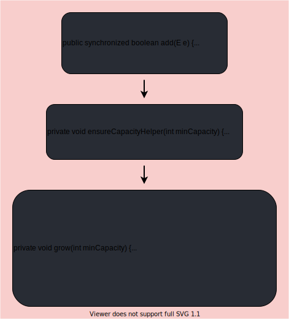

# List

## ArrayList源码分析

### 构造器源码

无参构造器：


调用ArrayList的无参构造器，会创建一个空的Object类型的数组。


调用ArrayList的有参构造器，会根据传入的整型参数创建一个长度为该参数值的Object数组。

### add()流程探究

使用到的测试代码：


方法执行流程：（无参构造、首次添加数据）


不引起扩容的情况下，使用无参构造器并add()的流程如下：

1. 调用ArrayList的空参构造器，ArrayList底层会创建一个空数组用于存放数据。

2. （调用ArrayList的add()方法时，添加的是基本数据类型会自动装箱成包装类）。

3. add()方法里调用ensureCapacityInternal()方法：

   1. 先调用calculateCapacity()方法来计算出需要的最小容量：

      - 如果elementData是默认的空数组`DEFAULTCAPACITY_EMPTY_ELEMENTDATA`，那么就进入if语句里，取出`DEFAULT_CAPACITY`（这个的值为10，也就是默认的初始容量）。
      - 如果elementData不是空数组，那么就返回传入的形参值`size+1`（size初始值为0）。

   2. 再调用ensureExplicitCapacity()方法，判断是否需要扩容，如果elementData数组的长度比minCapacity小，那就调用grow()方法来进行扩容。

      - 第一次往集合add()数据时，minCapacity为10，而elementData为0，所以会进入if语句来调用grow()方法进行扩容。
      - 第二次往集合add()数据时，此时minCapacity=size+1=2，而elementData.length=10，因此不需要扩容。

   3. grow()方法：（如果elementData数组的长度比minCapacity小，那就调用grow()方法来进行扩容）

      - ```java
        private void grow(int minCapacity) { //  minCapacity=10
            int oldCapacity = elementData.length; // oldCapacity=0
            // 扩容1.5倍
            int newCapacity = oldCapacity + (oldCapacity >> 1);
            // 如果newCapacity比minCapacity小，那就扩容
            if (newCapacity - minCapacity < 0)
                newCapacity = minCapacity;
            /* 如果扩容后长度比MAX_ARRAY_SIZE = Integer.MAX_VALUE - 8大
           	   那就执行hugeCapacity来返回Integer.MAX_VALUE或 MAX_ARRAY_SIZE*/
            if (newCapacity - MAX_ARRAY_SIZE > 0)
                newCapacity = hugeCapacity(minCapacity);
            // 保留原有数据，完成扩容
            elementData = Arrays.copyOf(elementData, newCapacity);
        }
        ```

4. 总结以上：

   1. ArrayList的空参构造器，不会初始化底层数组对象的容量。
   2. 由空参构造器创建的集合，第一次往集合添加元素时才将底层数组对象设置容量，默认为10。
   3. 需要扩容的时候，默认扩容为当前集合容量的1.5倍。
   4. 集合容量有限，最大容量为Integer.MAX_VALUE。

执行到第二个for循环时，会进行扩容：

1. size表示底层数组的下标，当第十一次添加数据时，size=10，此时minCapacity=size+1=11。
2. 接下来的流程和上面一样，最后会进入grow()方法来进行扩容。
3. 进入grow方法的扩容过程：
   1. oldCapacity = elementData.length = 10；
   2. newCapacity = oldCapacity + (oldCapacity >> 1) = 10 + 10 / 2 = 15；
   2. newCapacity - minCapacity < 0 不成立；
   2. newCapacity - MAX_ARRAY_SIZE > 0 不成立；
   2. elementData = Arrays.copyOf(elementData, newCapacity) ===> 创建新数组并复制旧数据，扩容完成。

如果使用有参构造器，仅是构造器的差别，add()的方法的执行逻辑是没有什么变化的。

```java
ArrayList arrList = new ArrayList(5);
```

```java
public ArrayList(int initialCapacity) {
    if (initialCapacity > 0) {
        this.elementData = new Object[initialCapacity];
    } else if (initialCapacity == 0) {
        this.elementData = EMPTY_ELEMENTDATA;
    } else {
        throw new IllegalArgumentException("Illegal Capacity: "+
                                           initialCapacity);
    }
}
```

ArrayList的有参构造器：

1. 传入的参数即为底层elementData数组的初始容量。
2. 扩容是在add()方法执行中来完成的，扩容时扩容为原来容量的1.5倍。

看源码可以这么做：先去看实现了什么效果，然后带着问题去追源码（是怎么实现这个效果的？）。

## Vector源码分析

### 构造器源码

使用无参构造器，底层elementData数组初始化容量为10：


使用有参构造器，传入参数即为底层elementData数组初始化容量：


### add()流程探究

测试代码：


方法流程：



add()的流程如下：

1. 因为使用无参构造器，底层elementData数组默认初始化容量为10。

2. 使用add()为Vector对象添加基本数据类型的数据，会先进行装箱。

3. add()方法里调用了ensureCapacityHelper()方法，该方法用来确定容量是否需要扩容：

   - 当容量不足时，需要扩容，就会调用grow()方法，该方法源码如下：

     ```java
     private void grow(int minCapacity) {
         // 10
         int oldCapacity = elementData.length;
         // capacityIncrement=0，所以只要需要扩容就都是扩容2倍
         int newCapacity = oldCapacity + ((capacityIncrement > 0) ?
                                          capacityIncrement : oldCapacity);
         if (newCapacity - minCapacity < 0)
             newCapacity = minCapacity;
         if (newCapacity - MAX_ARRAY_SIZE > 0)
             newCapacity = hugeCapacity(minCapacity);
         elementData = Arrays.copyOf(elementData, newCapacity);
     }
     ```

结论：

1. add()方法被synchronized修饰，加了同步锁，是线程安全的。
2. Vector每一次扩容都扩为原来的两倍。

使用有参构造器，初始化的容量是传入的参数值，扩容机制在add()的过程中实现，仍然是按两倍扩容的方式扩容。

## LinkedList源码分析

### 构造器

无参构造器源码：

```java
public LinkedList() {
}
```

有参构造器源码：c的元素都转化为LinkedList的元素

```java
public LinkedList(Collection<? extends E> c) {
    this();
    addAll(c);
}
```

### add()


1. 实现了双向列表和双端队列等特点。
2. 可以添加任意元素(可重复)，包括null。
3. 线程不安全，没有实现同步。

# Set

## HashSet

1. HashSet底层时HashMap（数组+链表+红黑树）。
2. 添加元素：计算元素的hash值并将hash值转为数组的索引值，然后去数组中判断该位置是否已添加元素：
   - 未添加：直接存入。（数组table中数据——节点）
   - 已添加：调用equals()方法比较，如果相同就放弃添加，如果不一致，则添加到最后。
3. Java8中，如果一条链表的元素个数超过默认值8，并且数组table的大小大于等于64，就会将数据树化。

### 构造器源码

无参构造器：

```java
public HashSet() {
    map = new HashMap<>();
}
```

HashSet底层是HashMap。

有参构造器：

```java
public HashSet(Collection<? extends E> c) {
    map = new HashMap<>(Math.max((int) (c.size()/.75f) + 1, 16));
    addAll(c);
}
```

### add()

add()方法执行：

.svg)

```java
final V putVal(int hash, K key, V value, boolean onlyIfAbsent,
               boolean evict) {
    Node<K,V>[] tab; Node<K,V> p; int n, i; // 辅助变量
    // table是HashMap中的一个成员变量Node[],判断是否进行初始化——第一次扩容
    if ((tab = table) == null || (n = tab.length) == 0)
        n = (tab = resize()).length;
    // 利用得到的hash值来计算出该key应该存放到table表的哪个位置
    if ((p = tab[i = (n - 1) & hash]) == null)
        // 这个位置没有添加元素，则直接创建Node直接添加进去
        tab[i] = newNode(hash, key, value, null);
    // 如果当前位置存在元素，再进行以下操作
    else {
        Node<K,V> e; K k; // 在需要的地方再创建变量
        // 当前索引位置对应的第一个元素的hash与准备添加的key的hash一致
        // 并且两者是同一对象或者不是同一对象但内容相同（满足这其中之一就认为是相同的对象）
        // 是同一对象就不加入
        if (p.hash == hash &&
                ((k = p.key) == key || (key != null && key.equals(k))))
            e = p;
        // 再判断 p 是不是一棵红黑树
        else if (p instanceof TreeNode)
            // 如果时，就调用这个方法添加（很复杂的一个方法）
            e = ((TreeNode<K,V>)p).putTreeVal(this, tab, hash, key, value);
        // 如果当前table对应的索引已经是一个链表，使用for循环，依次和链表中元素比较
        // （先比较hash，不同再用equals()比较）
        // (1)如果都不相同，添加进链表。
        // （如果链表数据达到8个就会对当前链表进行树化，不过表长度小于64，则还不会进行树化，只是进行table的扩容）
        // (2)与某个相同，结束，不添加，break
        else {
            for (int binCount = 0; ; ++binCount) {
                if ((e = p.next) == null) {
                    p.next = newNode(hash, key, value, null);
                    if (binCount >= TREEIFY_THRESHOLD - 1) // -1 for 1st
                        treeifyBin(tab, hash);
                    break;
                }
                if (e.hash == hash &&
                        ((k = e.key) == key || (key != null && key.equals(k))))
                    break;
                p = e;
            }
        }
        if (e != null) { // existing mapping for key
            V oldValue = e.value;
            if (!onlyIfAbsent || oldValue == null)
                e.value = value;
            afterNodeAccess(e);
            // 不返回空，则添加失败
            return oldValue;
        }
    }
    ++modCount;
    // threshold=12，size代表添加进table的数据（添加进数组中或数组中的node节点中）
    // 如果size大于12，则扩容
    if (++size > threshold)
        resize();
    // 为HashMap的子类而设置的一个方法，对于HaspMap来说是一个空的方法
    afterNodeInsertion(evict);
    // 代表添加成功
    return null;
}
```

### 总结

1. 从构造器可以看出，HashSet底层就是HashMap。
2. table数组扩容机制：集合初始容量为16，负载因子（加载因子）0.75；如果添加进HashSet的元素达到16 * 0.75=12，那就会对table数组进行扩容，扩容两倍。
3. 值的存储：HashSet的值存储在HashMap的key上，HashMap的value统一为`PRESENT`（现在、当下、目前）。
4. 值添加过程：
   1. 添加对象时，先计算对象的hash值，然后根据hash值得到一个索引值。
   2. table数组中，如果该索引位置没有存放值，那就直接存放；如果已经存放有值了，那就调用equals()方法比较，如果是同一对象，则放弃添加，如果是不同的对象，则添加到最后，形成链表。（注意，使用的是对象类中的equals()方法，尽量重写该方法，自己觉得对象相等的规则）
   3. 在Java8中，链表的元素个数达到了8，并且table的大小 >= 64，才会对单链表进行树化，否则仍然会采用数组的扩容机制来扩容table数组，直到满足树化条件。


## LinkedHashSet

```java
public class LinkedHashSet<E>
    extends HashSet<E>
    implements Set<E>, Cloneable, java.io.Serializable { ... }
```

LinkedHashSet是HashSet的子类。

### 构造器

无参构造器：

```java
public LinkedHashSet() {
    super(16, .75f, true);
}
// super()指向的构造器
HashSet(int initialCapacity, float loadFactor, boolean dummy) {
    map = new LinkedHashMap<>(initialCapacity, loadFactor);
}
```

有参构造器：

```java
public LinkedHashSet(int initialCapacity) {
    super(initialCapacity, .75f, true);
}
// super()指向的构造器
HashSet(int initialCapacity, float loadFactor, boolean dummy) {
    map = new LinkedHashMap<>(initialCapacity, loadFactor);
}
```

结论：初始化默认容量为16，底层是LinkedHashMap（HashMap的子类），加载因子0.75。


### add()


和HashSet基本一致。

### 结论

1. LinkedHashSet维护了一个哈希表和双向链表。
2. 添加过程中的逻辑和HashSet基本一致。


## TreeSet

TreeSet的底层是TreeMap，使用TreeMap的key来存储集合元素，所有的key的value都是PRESENT。

### 构造器


无参构造器，初始化TreeMap后comparator为null，没有比较规则，此时的TreeMap内的元素不会进行排序。

```java
public static void main(String[] args) {
    TreeSet t = new TreeSet(new Comparator() {
        @Override
        public int compare(Object o1, Object o2) {
            return ((String)o1).compareTo((String) o2);
        }
    });
    t.add("a");
    t.add("d");
    t.add("b");
    t.add("c");
    System.out.println(t);
}
```

有参构造器，传入一个Comparator比较器，添加进去的元素会按照这个比较器的比较规则来进行大小的比较，从而实现排序。

### add()


```java
public V put(K key, V value) {
    Entry<K,V> t = root;
    if (t == null) {
        compare(key, key); // type (and possibly null) check

        root = new Entry<>(key, value, null);
        size = 1;
        modCount++;
        return null;
    }
    int cmp;
    Entry<K,V> parent;
    // split comparator and comparable paths
    Comparator<? super K> cpr = comparator;
    if (cpr != null) {
        do {
            parent = t;
            cmp = cpr.compare(key, t.key);
            if (cmp < 0)
                t = t.left;
            else if (cmp > 0)
                t = t.right;
            else
                return t.setValue(value);
        } while (t != null);
    }
    else {
        if (key == null)
            throw new NullPointerException();
        @SuppressWarnings("unchecked")
            Comparable<? super K> k = (Comparable<? super K>) key;
        do {
            parent = t;
            cmp = k.compareTo(t.key);
            if (cmp < 0)
                t = t.left;
            else if (cmp > 0)
                t = t.right;
            else
                return t.setValue(value);
        } while (t != null);
    }
    Entry<K,V> e = new Entry<>(key, value, parent);
    if (cmp < 0)
        parent.left = e;
    else
        parent.right = e;
    fixAfterInsertion(e);
    size++;
    modCount++;
    return null;
}
```

使用比较器来对元素进行比较，如果比较相等则不添加。

# Map

## HashMap

### 构造器

```java
public HashMap() {
    this.loadFactor = DEFAULT_LOAD_FACTOR; // all other fields defaulted
}
```

初始化加载因子：DEFAULT_LOAD_FACTOR = 0.75、`HashMap$Node[] table = null`。

### put()

HashSet底层就是HashMap，HashMap的put()如下：


```java
final V putVal(int hash, K key, V value, boolean onlyIfAbsent,
               boolean evict) {
    Node<K,V>[] tab; Node<K,V> p; int n, i; // 辅助变量
    // table是HashMap中的一个成员变量Node[],判断是否进行初始化——第一次扩容
    if ((tab = table) == null || (n = tab.length) == 0)
        n = (tab = resize()).length;
    // 利用得到的hash值来计算出该key应该存放到table表的哪个位置
    if ((p = tab[i = (n - 1) & hash]) == null)
        // 这个位置没有添加元素，则直接创建Node直接添加进去
        tab[i] = newNode(hash, key, value, null);
    // 如果当前位置存在元素，再进行以下操作
    else {
        Node<K,V> e; K k; // 在需要的地方再创建变量
        // 当前索引位置对应的第一个元素的hash与准备添加的key的hash一致
        // 并且两者是同一对象或者不是同一对象但内容相同（满足这其中之一就认为是相同的对象）
        // 是同一对象就不加入
        if (p.hash == hash &&
                ((k = p.key) == key || (key != null && key.equals(k))))
            e = p;
        // 再判断 p 是不是一棵红黑树
        else if (p instanceof TreeNode)
            // 如果时，就调用这个方法添加（很复杂的一个方法）
            e = ((TreeNode<K,V>)p).putTreeVal(this, tab, hash, key, value);
        // 如果当前table对应的索引已经是一个链表，使用for循环，依次和链表中元素比较
        // （先比较hash，不同再用equals()比较）
        // (1)如果都不相同，添加进链表。
        // （如果链表数据达到8个就会对当前链表进行树化，不过表长度小于64，则还不会进行树化，只是进行table的扩容）
        // (2)与某个相同，结束，不添加，break
        else {
            for (int binCount = 0; ; ++binCount) {
                if ((e = p.next) == null) {
                    p.next = newNode(hash, key, value, null);
                    if (binCount >= TREEIFY_THRESHOLD - 1) // -1 for 1st
                        treeifyBin(tab, hash);
                    break;
                }
                if (e.hash == hash &&
                        ((k = e.key) == key || (key != null && key.equals(k))))
                    break;
                p = e;
            }
        }
        if (e != null) { // existing mapping for key
            V oldValue = e.value;
            if (!onlyIfAbsent || oldValue == null)
                e.value = value;
            afterNodeAccess(e);
            // 不返回空，则添加失败
            return oldValue;
        }
    }
    ++modCount;
    // threshold=12，size代表添加进table的数据（添加进数组中或数组中的node节点中）
    // 如果size大于12，则扩容
    if (++size > threshold)
        resize();
    // 为HashMap的子类而设置的一个方法，对于HaspMap来说是一个空的方法
    afterNodeInsertion(evict);
    // 代表添加成功
    return null;
}
```

### 结论

1. table数组扩容机制：集合初始容量为16，负载因子（加载因子）0.75；如果添加进HashSet的元素达到16 * 0.75=12，那就会对table数组进行扩容，扩容两倍。
2. 值添加过程：
   1. 添加对象时，先计算对象的hash值，然后根据hash值得到一个索引值。
   2. table数组中，如果该索引位置没有存放值，那就直接存放；如果已经存放有值了，那就调用equals()方法比较，如果是同一对象，则放弃添加，如果是不同的对象，则添加到最后，形成链表。（注意，使用的是对象类中的equals()方法，尽量重写该方法，自己觉得对象相等的规则）
   3. 在Java8中，链表的元素个数达到了8，并且table的大小 >= 64，才会对单链表进行树化，否则仍然会采用数组的扩容机制来扩容table数组，直到满足树化条件。


## LinkedHashMap TreeMap

LinkedHashSet的底层就是LinkedHashMap，LinkedHashMap和HashMap差不多，只不过LinkedHashMap维护的是一个双向链表，其他差不多。

TreeMap和TreeSet也差不多，TreeSet底层就是TreeMap。

# else

## ArrayList源码分析


- debug时建议把enable那个勾去掉，不然idea在debug时显示的数据是简化的。

源码分析结论：

1. 底层维护了一个`Object[] elementData`数组，用于存放数据。
2. 当使用无参构造器创建ArrayList对象时，elementData初始化容量为0，第一次添加后为10；超出容量会自动扩容为原来的1.5倍。
3. 使用能指定大小的构造器，则初始容量为构造器形参值，扩容时也是扩容为初始容量的1.5倍。
4. 

```java
//JDK7
List list = new ArrayList();//底层会创建一个10容量的数组,Object[] elementData
list.add(123);//elementData[0] = new Integer(123);
...
list.add(11);//超出容量，扩容为原来的1.5倍，原数组复制到新数组
//结论：建议开发中使用带参的构造器：ArrayList list = new ArrayList(int capacity);
```

```java
//JDK8
List list = new ArrayList();//底层并没有创建长度为10数组 Object[] elementData = {}
list.add(123);//elementData[0] = new Integer(123)，在第一次调用add后才创建了数组
...
list.add(11);//超出容量，扩容为原来的1.5倍，原数组复制到新数组，（与JDK7无异）
//小结：JDK7中类似于单例的饿汉式，JDK8中延迟了数组的创建，节省了内存
```

## LinkedList源码分析

- 实现了双向列表和双端队列等特点。
- 可以添加任意元素(可重复)，包括null。
- 线程不安全，没有实现同步。


```java
List list = new LinkedList(); //内部声明了Node的first、last属性，默认值为null
list.add(123); //将123封装到Node中，创建了Node对象

//Node的定义：（体现双向链表）
private static class Node<E> {
    E item;
    Node<E> next;
    Node<E> prev;

    Node(Node<E> prev, E element, Node<E> next) {
        this.item = element;
        this.next = next;
        this.prev = prev;
    }
}
```

## Vector源码分析

1. 底层也是`Object[] elementData`数组。
2. 无参的默认容量10，扩容则扩容为原来的2倍；有参数的直接按两倍扩容机制。
3. Vector的操作方法带有锁，是线程安全的（效率不高）。
4. 考虑线程同步安全的，优先考虑Vector。

```java
//new Vector();   创建了长度为10的数组，扩容为2倍	
```

关于源码分析：分析所调用的行为结构的内部逻辑。 


## HashSet源码分析

底层实际是HaspMap（数组+链表+红黑树），只能存放一个null键。


## LinkedHashSet源码分析

- HashSet的子类，底层是LiskedMap，底层维护了一个数组加双向列表；
- 根据hashcode决定元素存储位置，同时使用链表维护元素次序，使得看起来是按添加顺序存储的；
- 不允许添加重复的元素；


## TreeSet源码分析

往TreeSet中添加数据要求是相同类的对象。

自然排序中，比较两个对象是否相同的标准为：compareTo返回0，不再是equals()

定制排序中，比较两个对象是否相同的标准为：compare()返回0，不再是equals()

P540


## HashMap源码:

```java
//JDK7中
HashMap map = new HashMap()； //实例化，底层创建长度为16的一维数组Entry[] table
	......     
    map.put(key1,value);//调用key1所在类的hashCode()计算哈希值，此哈希值经某种算法得到在数组table里的存放位置
//首先：如果此位置上为空，则key1-value添加成功
//如果不为空，也就是此位置存在一个或多个数据(以链表存在)，就会比较key1和此位置上所有数据的哈希值，分以下两种情况：
//***情况一：key1的哈希值与已经存在的此位置上的所有数据的哈希值都不一样，则添加成功
//***情况二：与此位置上某个数据的哈希值相同，调用key1所在类的equals(key2)再进行比较：
//*********如果equals()返回false，则添加成功
//*********如果equals()返回true，使用value替换value2
/*
	补充：如果某一位置上存在多个的key-value，则是以链表形式存储(后添加的和原来的组成链表形式)
	     关于扩容：不断添加中，当超出临界值(且要存放的位置非空)，就会扩容；默认扩容为原来容量的两倍，并将所有数据复制过来
*/

//JDK8与JDK7的不同：JDK8中
/*	一：new HashMap()时底层并没有创建长度为16的一维数组
    二：JDK8底层的数组是Node[]，而不是Entry
    三：首次调用put()方法时，创建长度为16的数组
    四：JDK7底层：数组+链表；JDK8底层：数组+链表+红黑树
    什么时候使用红黑树存储数据：满足一下三个条件的数据
    ①当数组某一位置上的数据以链表形式
    ②此链表形式存在的数据 > 8
    ③此数组长度 > 64               ------满足此三个条件，此时此索引上的所有数据改用红黑树存储
*/
```

（表达出来，看底层代码验证，先会用再关注底层）

## LinkedHashMap源码

子类LinkedHashMap底层实现：（了解）


## TreeMap源码

自然排序、定制排序。TreeSet底层是TreeMap。
