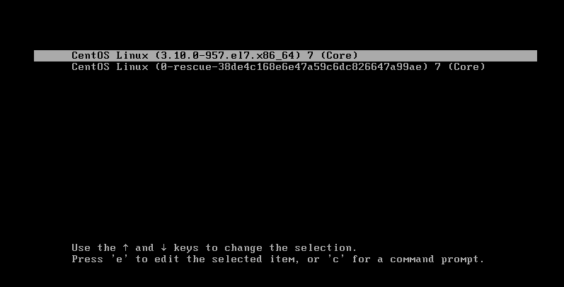

# Linux

## Windows下Linux子系统

1. 打开子系统支持
   - 设置-应用-应用和功能界面里，打开相关设置的“程序和功能”；
   - 然后选择启用或关闭Windows功能，找到并勾上“适用于Linux的Windows子系统”；
   - 重启电脑。
2. 在微软商店下载Ubuntu并安装，安装完成后重启；
3. 打开Ubuntu，安装完根据提示输入用户名和密码，我的密码`333...`。

```
Installing, this may take a few minutes...
Please create a default UNIX user account. The username does not need to match your Windows username.
For more information visit: https://aka.ms/wslusers
Enter new UNIX username: scholarkk
New password:
Retype new password:
passwd: password updated successfully
Installation successful!
To run a command as administrator (user "root"), use "sudo <command>".
See "man sudo_root" for details.

Welcome to Ubuntu 20.04.2 LTS (GNU/Linux 4.4.0-19041-Microsoft x86_64)

 * Documentation:  https://help.ubuntu.com
 * Management:     https://landscape.canonical.com
 * Support:        https://ubuntu.com/advantage

  System information as of Wed Aug 25 17:56:14 CST 2021

  System load:    0.52      Processes:              7
  Usage of /home: unknown   Users logged in:        0
  Memory usage:   45%       IPv4 address for wifi0: 192.168.0.101
  Swap usage:     0%

1 update can be applied immediately.
To see these additional updates run: apt list --upgradable


The list of available updates is more than a week old.
To check for new updates run: sudo apt update


This message is shown once a day. To disable it please create the
/home/scholarkk/.hushlogin file.
```

安装后可能在以下目录：`C:\Users\Scholar\AppData\Local\Packages\CanonicalGroupLimited.Ubuntu20.04onWindows_79rhkp1fndgsc`。

如果要安装到D盘，卸载后通过以下命令创建软链接：（ D:\Ubuntu要有完全控制权限）

`mklink /j C:\Users\Scholar\AppData\Local\Packages\CanonicalGroupLimited.Ubuntu20.04onWindows_79rhkp1fndgsc  D:\Ubuntu`。

使用：

- 打开cmd或ps后，输入bash然后回车就可。
- 在某一个文件夹目录打开子系统：在该文件夹空白处，按住`shift + 鼠标右键`，然后选择“在此处打开Linux shell”即可。

## Linux安装

Linux主要发行版：Ubuntu（乌班图）、RedHat（红帽）、CentOS 

### 安装

安装虚拟机软件：VMware Workstation 16.1.0 Pro，激活码如下；

```
ZF3R0-FHED2-M80TY-8QYGC-NPKYF
YF390-0HF8P-M81RQ-2DXQE-M2UT6
ZF71R-DMX85-08DQY-8YMNC-PPHV8
```

下载Linux系统iso文件：

CentOS7.6安装（目前主流环境）：[Index of /7.6.1810/isos/x86_64 (centos.org)](https://vault.centos.org/7.6.1810/isos/x86_64/)

CentOS8.1（未来主流？？21年过就停止维护了）：[CentOS Mirrors List](http://isoredirect.centos.org/centos/8/isos/x86_64/)

CentOS8.4：[Index of /centos/8/isos/x86_64/ (aliyun.com)](https://mirrors.aliyun.com/centos/8/isos/x86_64/)

打开虚拟机软件创建虚拟机：

1. 新建虚拟机：
  1. 新建虚拟机，选择典型；
  2. 下一步，选择稍后安装操作系统；
  3. 下一步，选Linux，选择红帽的7的版本；
  4. 下一步，为虚拟机取名字，选择虚拟机存放位置（尽量放在内存较大的盘里）；
  5. 下一步，20GB，磁盘拆分成多个文件；
  6. 下一步，自定义硬件：（内存2GB、处理器2个、每个处理器内核选2个、网络连接选NAT、其它默认）；
  7. 完成。
2. 引入ISO文件：选中虚拟机右键选择设置，然后选中CD/DVD中的使用ISO映像文件，找到下载的ISO文件；
3. 启动此虚拟机，然后双击出现的黑屏，选择安装install，进入安装界面再按提示按回车；
4. 然后出现选择语言的，找到中文，选择中文，继续；
12. 进入安全信息摘要界面，要等待不要点鼠标，否则容易卡死；

      - （上海时区、汉语、简体中文、本地介质）默认的不用动；
      - 软件选择要动（最小安装是不带界面的，不利于我们学习，实际生产环境（工作中）建议选这个），选择GNOME桌面，然后再在右栏把兼容性程序库、传统的X Windows系统的兼容性、开发工具（gcc、jdk、mysql会默认帮安装）这三个选中；
6. 点击完成，然后再继续等待检查软件依赖关系（等待几分钟左右不要动鼠标，否则卡死哦）；
7. 然后再选择安装位置：进入后选择我要配置分区，点击完成后，就进入了手动分区界面，然后开始按如下要求配置分区

     - 一般分为三个区：boot（引导分区，1G）、swap（交换分区，2G）、root（根分区，17G）；
     - 点击+按钮，添加`/boot`挂载点、1G，然后是标准分区、文件系统是ext4；
     - 添加`swap`挂载点、2G，标准分区、文件系统是swap；
     - 添加`/`挂载点、17G，标准分区、文件系统ext4；
     - 点击完成，接受修改。
8. KDUMP在实际工作中开启，学习时可不开启；
9. 然后是网络和主机，打开以太网，可以改一下主机名（不能有空格）；
10. 最后一个是安全策略，一般可以关闭；
11. 安装，root用户和设置密码（实际工作中密码设置建议复杂一点），再建一个普通用户；
12. 等待安装完成，会出现重启，点击重启，然后进入系统，中间要接受一个协议，然后完成配置，进入系统；
13. 用户名和密码登录，安装成功。
14. 进入后配置：语言选汉语、输入选拼音、隐私关闭、跳过、开始使用。
15. 右上角关机。
16. 释放鼠标（Ctrl + Alt）。

关于三种网络连接模式的理解：（暂时不去学习）

虚拟机克隆：克隆后是另一个和原虚拟机一样的虚拟机

- 方式一：直接拷贝一份安装好的虚拟机文件，拷贝后用vmware打开.vmx文件；
- 方式二：利用vmware的克隆操作（管理---克隆）（克隆时先关闭Linux系统）。

虚拟机快照：系统状态回退，回退到拍下快照的那一刻

- 虚拟机上点击右键，弹出菜单有快照。快照管理里回退。

虚拟机迁移和删除：直接移动文件夹或删除文件夹。

### vmtools

安装vmtools：（在Windows下更好的管理vm虚拟机，可以设置Windows和CentOS的共享文件夹）

1. 进入centOS；
2. 点击vm菜单的`install vmware tools`；
   - 如果出现“客户机操作系统已将 CD-ROM 门锁定,并且可能正在使用 CD-ROM,这可能会导致客户机...”问题，建议先关机查看CD/DVD有没有选中ISO文件，如果选中了，那就进入系统再安装tools，出现这个问题点击是即可；
3. centos会出现一个vm的安装包 xx.tar.gz，会在界面弹出提示，如果没看见，可点击取消安装，然后再次重装；
4. 拷贝后进入主文件夹，点击其他位置，找到`/opt`目录并粘贴进去；
5. 桌面右键打开终端，然后`cd /opt/`进入`/opt`目录，使用`tar -zxvf xx.tar.gz`解压得到tools的安装文件；
   - 输入`tar -zxvf VM`然后按一下Tab键整个文件名就会出来了，然后回车，解压完毕；
   - `ls`命令可以显示目录下的压缩包、文件夹等；
6. 进入该vm解压的目录`vmware-tools-distrib`（在`/opt`目录下；）
7. 然后执行`./vmware-install.pl`命令安装，一直回车默认，安装完成；
8. 注意：安装vmtools需要有gcc（终端执行`gcc -v`就可验证）。

共享文件夹的创建：

- 先创建好文件夹；
- 虚拟机的设置里找到选项下的共享文件夹，选择总是启用，然后添加；
- 添加完成后在`/mnt/hgfs/`目录下可看到共享文件夹。（实际开发中，Linux系统并不是与自己用于开发的电脑在一起的，这时是通过远程方式上传或下载文件，远程方式登录-在后面）。

## Linux目录结构

Linux的文件系统：采用层级式的树状目录结构，最上层是根目录`/`，然后在此目录下再创建其它的目录；

Linux世界里，一切皆文件！（Linux把硬件都当作文件来处理）。

具体的目录结构（不用背，知道即可，要记住呗。。）：

1. `/bin`：（/usr/bin、/usr/local/bin）
   - **常用**，是Binary的缩写，存放经常使用的命令。
2. `/sbin`：(/usr/sbin、/usr/local/sbin)
   - s就是Super User的意思，存放的是系统管理员使用的系统管理程序。
3. `/home`：
   - **常用**，存放普通用户的主目录，在Linux中每个用户都有一个自己的目录，一般该目录名是以账户的账号名命名。
4. `/root`：
   - **常用**，该目录为系统管理员，也称为超级权限者的用户主目录。
5. `/lib`：
   - 系统开机所需要的最基本的动态连接共享库，作用类似于Windows里的DLL文件，几乎所有的应用程序都需要用到这些共享库。
6. `/lost+foubd`：
   - 该目录一般是空的，被隐藏起来的，只有系统非法关机后，这里就存放了一些文件。
7. `/etc`：
   - **常用**，所有的系统管理所需要的配置文件和子目录my.conf。
8. `/usr`：
   - **常用**，这是一个非常重要的目录，用户的很多应用程序和文件都放在这个目录下，类似与windows下的program files目录。
9. `/boot`：
   - **常用**，存放的是启动Linux时使用的一些核心文件，包括一些连接文件以及镜像文件。
10. `/proc`：
    - **不能动**，动的话可能会造成系统崩溃，这个目录是一个虚拟的目录，它是系统内存的映射，访问这个目录来获取系统信息。
11. `/srv`：
    - **不能动**，service的缩写，该目录存放一些服务启动之后需要提取的数据。
12. `/sys`：
    - **不能动**，这是linux2.6内核的一个很大的变化。该目录下安装了2.6内核中新出现的一个文件系统sysfs。
13. `/tmp`：
    - 这个目录是用来存放一些临时文件的。
14. `/dev`：
    - 类似windows的设备管理器，把所有的硬件用文件的形式存储。
15. `/media`：
    - **常用**，linux系统会自动识别一些设备，例如U盘光驱等等，当识别后，linux会把识别的设备挂载到这个目录下。
16. `/mnt`：
    - **常用**，系统提供该目录是为了让用户临时挂载别的文件系统的，我们可以将外部的存储挂载在/mnt/上，然后进入该目录就可以查看里面的内容了。
17. `/opt`：
    - 这是给主机额外安装软件所存放的目录，如安装ORACLE数据库就可放到该目录下。默认为空；
    - 约定俗成，要安装的软件下载好先拷贝到该目录。
18. `/usr/local`：
    - **常用**，这是一个给主机额外安装软件的目录，用于安装额外的软件，一般是通过编译源码的方式安装的程序。
19. `/var`：
    - **常用**，这个目录中存放着在不断扩充着的东西，习惯将经常被修改的目录放在这个目录下，包括各种日志文件。
20. `/selinux`：security-ehhanced Linux
    - SELinux是一种安全子系统，它能控制程序只能访问特定文件，有三种工作模式，可以自行设置，不启用则看不到该目录。

总结：

1. Linux的目录中有且只有一个根目录。
2. Linux的各个目录存放的内容是规划好，不用乱放文件。
3. Linux是以文件的形式管理我们的设备，因此linux系统，一切皆为文件。
4. 对Linux的各个文件目录下存放什么内容，必须有一个认识。

|         常用目录         |                             描述                             |
| :----------------------: | :----------------------------------------------------------: |
| /usr/bin、/usr/local/bin |            bin是Binary的缩写，存放经常使用的命令             |
|          /home           | 存放普通用户的主目录，在Linux中每个用户都有一个自己的目录，<br/>一般该目录名是以账户的账号名命名 |
|          /root           |       该目录为系统管理员，也称为超级权限者的用户主目录       |
|           /etc           | 所有的系统管理所需要的配置文件和子目录，比如安装mysql数据库的my.conf配置文件 |
|           /usr           | 这是一个非常重要的目录，用户的很多应用程序和文件都放在这个目录下，<br/>类似与windows下的program files目录 |
|          /boot           | 存放的是启动Linux时使用的一些核心文件，包括一些连接文件以及镜像文件 |
|          /media          | linux系统会自动识别一些设备，例如U盘光驱等等，当识别后，linux会把识别的设备挂载到这个目录下 |
|           /mnt           | 系统提供该目录是为了让用户临时挂载别的文件系统的，我们可以将外部的存储挂载在/mnt/上，<br/>然后进入该目录就可以查看里面的内容了，例如用虚拟机创建的共享文件D:/myshare |
|        /usr/local        | 这是另一个给主机额外安装软件所安装的目录，一般是通过编译源码的方式安装的程序 |
|           /var           | 这个目录中存放着会不断扩充着的东西，习惯将经常被修改的目录放在这个目录下，包括各种日志文件 |
|           /opt           | - 这是给主机额外安装软件所存放的目录，如安装ORACLE数据库就可放到该目录下。默认为空；<br/>- 约定俗成，要安装的软件下载好先拷贝到该目录。 |

## 远程登录到Linux

工作时开发的上线项目是运行在服务器上的，需要远程登录到系统进行项目管理和开发；远程登录工具有Xshell6、Xftp6等。

Xshell：目前最好的远程登录到Linux系统的软件，流畅的速度并且完美解决了中文乱码问题，是一个强大的安全终端模拟软件，支持SS1、SS2，以及Windows平台的TELLNET协议；可在Windows界面下用来访问远程不同系统的服务器。

登录要知道远程Linux系统的公网IP：Linux系统里执行`ifconfig`就可看到（我的是192.168.137.128）；还要测试网络是否通畅，Windows下的ping命令：测试两台机器（IP）是不是网络通畅的，`ping 另一台机器的IP`，如果出现回复则是通畅的。

安装好后使用Xshell：

1. 新建会话：名称可随意，主机是要登录的远程系统的IP，协议SSH，端口22；然后点击确定。
2. 双击会话，学习中可选择一次性接收，工作中建议选择接受并保存，然后输入用户名、密码。

Xftp：Windows平台的功能强大的SFTP、FTP文件传输软件，使Windows用户可以在UNIX/Linux和Windows之间安全地传输文件。

安装完成好使用Xftp：

1. 新建会话：称可随意，主机是要登录的远程系统的IP（192.168.137.128），协议SFTP，端口22；然后点击确定。
2. 双击会话，学习中可选择一次性接收，工作中建议选择接受并保存，然后输入用户名、密码。

# CentOS7

## vim

Linux会内置vi文本编辑器；Vim具有程序编辑的能力，可以看为vi的增强版，其可以主动地以字体的颜色辨别语法的正确性，方便程序设计，其代码补全、编译、及错误跳转等方面编程的功能特别丰富，被程序员广泛使用。

### 模式

vi和vim常用的三种模式：

- **正常模式：**打开文件的默认模式，可以使用上下控制光标，可以进行删除字符、删除整行、复制、粘贴等操作来处理档案内容、文件数据；可以使用快捷键。
- **插入模式/编辑模式：**按下i（或者I、o、O、a、A、r）就可以进入，然后就可以进行内容的输入。
- **命令行模式：**输入`:`进入命令行模式，在这个模式中，可以执行相关指令来完成读取、存盘、替换、离开vim、显示行号等操作。

快速入门：`vim xxx.java`表示用vim编写或开发xxx.java的程序，vi同理。使用Xshell远程登录，登录后执行`vim xxx.java`开发一个java程序，进入了正常模式后按i进入编辑模式，然后底下会显示插入，开始编写java程序；编写完要保存得从编辑模式切换到命令行模式，输入esc再输入`:`进入命令行模式，输入`:wq`则是保存并退出。退出后执行`ls`则会显示当前目录下的文件。

vi或vim模式切换：（`:wq`（保存并退出）、`:q`（退出）、`:!q`（强制退出，不保存））


### 命令

快捷键使用练习：

1. yy：拷贝当前行，5yy：拷贝当前行向下的5行（从当前行开始复制）。（一般模式）
2. p：粘贴。（一般模式）
3. dd：删除当前行，5dd：删除当前行向下的5行（从当前行开始删除）。（一般模式）
4. u：撤销操作。（一般模式）
5. gg：跳到首行；`5 + gg`跳到第五行；G：光标调到末行。（一般模式）
6. `shift + h`：跳到首行；`shift + g`：跳到尾行。
   - 一般模式下，输入要到达的行数然后再执行`shift+g` ，就会调到指定行；可以先显示行号：`:set nu`，然后退回到一般模式，输入行号这个数，再输入`shift+g`即可定位到指定行数。

7. 设置文件行号：`set nu`；取消文件行号：`set nonu`。（命令行模式）
8. `/查找内容`：查找内容， 然后按n可以继续下一个。（命令行模式）


## 用户管理

1. `useradd 用户名`：该命令用来添加用户，添加后自动创建用户家目录：/home/用户名。
2. `useradd -d /home/test usertest`：可自定义用户家目录名。
3. `userdel 用户名`：删除用户但不删除用户的家目录。
4. `userdel -r 用户名`：删除用户并且删除用户的家目录。
5. `id 用户名`：查询有无此用户。
6. `su - 用户名`：用于切换用户，从权限高的用户切换到权限低的用户不需要密码，返回原来的用户使用exit或logout命令。
7. `whoami`：查询当前登陆到的用户，切换到哪个就是哪个。
8. `who am i`：最开始是用哪个登陆的就显示哪个，切换用户后再执行该命令也是查询到最开始时的。
9. `passwd [用户名]`：可以为指定用户（只有root用户才能指定用户名）更改密码，如果不加用户名则是为当前登陆的用户更改密码。

用户和相关文件：


可用`vim xxx`查看这三个文件。（`vim /etc/passwd`）

## else

### 重启与关机、登录

1. `shutdown -h now`、`halt`：立刻关机。
2. `shutdown -h 1`：1分钟后关机
3. `shutdown -r now`、`reboot`：立刻重启。
4. `sync`：将内存中的数据同步到磁盘。
   - 建议，无论重启或关闭系统，都要先执行`sync`命令，即使shutdown/reboot/halt等命令均会在关机前进行了sync操作。

### 运行级别

运行级别：常用的是3和5	

- 0：关机。
- 1：单用户（找回丢失密码）。
- 2：多用户状态没有网络服务。
- 3：多用户状态有网络服务。（multi-user.target）
- 4：系统未使用保留给用户。
- 5：图形界面。（graphical.target）
- 6：系统重启。

运行级别的操作：

1. `init 运行级别`：切换到指定运行级别，0-6。
2. CentOS7后运行级别：

  - `systemctl get-default`：显示当前是什么运行级别。
  - `systemctl set-default TARGET.target`：切换运行级别（`systemctl set-default multi-user.target`，切换到3级别）。
  - `graphical.target`是图形界面级别，`multi-user.target`是运行级别3。

3. 如果重启，会是切换后的运行级别。

### root密码

找回root用户密码，CentOS7.6：



1.重启进入该页面，按上下光标停止倒计时，再按e键进入到下面的页面并通过下向下的箭头键移动光标，找到linux16开头的：


2.在linux16开头的后面，即UTF-8后面，先输入一个空格再输入`init=/bin/sh`。

3.然后按`Ctrl + X`，进入单用户模式。

进入单用户模式后，在光标闪烁位置输入`mount -o remount,rw / `（逗号两边不要有空格，rw后加空格后再加`/`）；如下：


4.然后按回车，再在新一行输入`passwd`，输入后再按回车，输入密码后回车，再次输入确认密码后，按回车，密码设置完成；


5.再输入`touch /.autorelabel`，回车。

6.再在新的一行输入`exec /sbin/init`，按回车后等待系统自动修改密码（可能时间有点长，耐心等待），完成后系统重启，新密码就会生效。

### 帮助指令

1. man：`man xx命令`，查询该命令的使用信息。
2. help：`help <command>`，在控制台打印出指定的命令的帮助信息。
2. info：与 man 命令相似，能够显示出命令的相关资料和信息。

## 文件目录类指令

### 显示：

1. `pwd`：显示当前工作目录的绝对路径。
2. `ls [选项] [目录或文文件]`：
   - 选项是`-a`（all的缩写），则显示当前目录的所有文件和目录（包括隐藏的）。
   - 选项是`-l`（list的缩写）则以列表的形式显示非隐藏文件。
3. `ls -lh`：以更人性化的方式显示当前目录下的内容。
3. `ll`，相当于`ls -l`。

### 切换：

- `cd [参数]`：切换到指定目录，`cd ~`回到家目录，`cd ..`回到上一层目录。

### 创建：

1. `mkdir [选项] 要创建的目录名`：不加选项则只能创建单个目录，加上选项`-p`则是用来创建单个或多级目录。
2. `touch 文件名称`：该命令只用来创建空文件（Linux系统下是没有后缀的定义的，后缀可看成是一个可有可无的标记）。

### 拷贝：

1. 文件的复制：
   - `cp 文件 目录/`：拷贝文件到指定目录下（`cp hello.txt text/`）（会提示是否要覆盖同名文件）。
   - `\cp 文件 目标目录`：复制到目标目录并强制覆盖。
2. 目录的复制：
   - `cp -r 目录 目标目录`：递归复制整个文件夹，把指定目录拷贝到目标目录（`cp -r /home/text/ /opt/`）（会提示是否覆盖同名文件）。
   - `\cp -r 目录 目标目录`：递归复制并强制覆盖目标目录里同名的文件。

### 删除：

1. 删除文件：
   - `rm [选项] 文件`：例如`rm test/hello.txt`，删除test目录下的hello.txt文件（选项为-r、-f、-rf）。
   
2. 删除目录：
   - `rm 选项 要删除目录`：选项用`-r`则是递归删除整个文件夹，用`-f`则是强制删除且不再提示，`rm -rf 要删除的目录`。
   - `rmdir [选项] 要删除的空目录`：只能删除空目录，删除非空目录要使用该命令：`rm -rf 要删除的目录`。
   
3. 使rm命令失效的一个思路：利用mv来替代掉rm（把文件移到到回收站中，然后再执行清除回收站的命令，完成删除）。

   1. `vim ~/.bashrc`，在该文件下加入以下代码，然后保存并退出：

      ```bash
      mkdir -p ~/.trash   #在家目录下创建一个.trash文件夹
      alias rm=del        #使用别名del代替rm   
      del()               #函数del，作用：将rm命令修改为mv命令
      {  
      mv $@ ~/.trash/  
      }  
      cleardel()          #函数cleardel，作用：清空回收站.trash文件夹，y或Y表示确认，n表示取消
      {  
      read -p "clear sure?[Input 'y' or 'Y' to confirm. && Input 'n' to cancel.]" confirm   
      [ $confirm == 'y' ] || [ $confirm == 'Y' ]  && /bin/rm -rf ~/.trash/*   
      }  
      ```

   2. 最后实现的删除文件命令：`del 文件`、`rm 文件`、`del *`、`rm *`；然后清除回收站`cleardel`。（注意自己系统下的回收站是哪个文件夹）


### 重命名、移动：

- `mv xx xx`：重命名文件或目录（`mv 旧文件/目录 新文件/新目录`）；移动文件、目录（`mv 文件或目录地址 目标目录`）（相当于剪切并粘贴）。
- 如果某目录下有同名目录且非空，则会移动失败。

### 重定向和追加：


追加和重定向的区别：追加是在原文件内容下另开一行开始添加内容，而重定向是将文件原内容去除完再添加进去。

### 输出内容到控制台：

1. `echo xx`：`echo $PATH,$HOSTNAME`（输出环境变量），`echo hello`（输出hello）。
2. `echo 'hello' > hello.txt`：将在控制台输出的文本`hello`重定向到该文件，会将该文件原来的内容覆盖。
4. `cal >> xxx`：追加日期到xxx文件。

### 查看文件：

1. `cat [选项] 要查看的文件`：选项为`-n`则是显示行号，该命令只能查看文件，一般使用`cat -n 文件 | more`来查看文件。
   - `|`：管道命令。

2. `more 文件`：查看文件。
3. `less 文件`：查看文件。
4. `head 文件`：默认查看文件内容的头十行；`head -n 5 文件`用于指定显示头几行。
5. `tail 文件`：默认查看文件最后十行的内容；`tail -n 5 文件`（指定显示最后5行）。
   - `tail -f 文件`：实时追踪文件的所有更新，会占有屏幕、实时显示内容。


### 软链接（符号链接）：

1. `ln -s [原文件或目录] 软链接名`：在当前目录下创建文件或目录的软链接，使用rm相关指令即可删除。
2. 软连接类似Windows里的快捷方式，是文件或目录的代表，可通过软连接来访问其代表的文件或目录。

### 查看历史命令：

1. 查看你曾执行过的命令：
   - `history`：查看已经执行过的命令（该history也会包含在内）。
   - `history 数字`：查看距离现在最近已执行的n条指令（该history也会包含在内）。
   - 查询出来的指令前都带有一个序号，该序号可配合`!`来执行序号所代表的指令。

2. `!指令前的数字`：使用history查看到历史指令后使用该指令可以执行指定的历史指令。

## 时间日期指令


1. 双引号内的可以在 + 后自由发挥，例如`"+%Y-%m-%d"`（该双引号必须带）。
2. `s`是时间戳，毫秒数。
3. `cal`是显示日历的指令，显示的是当月的日历；如果是`cal 2020`则是显示2020年的整个日历。

## 搜索查找指令


1. find指令：文件查找

   - `find /home -name hello.txt`：在/home目录下按文件名查找（注意Linux里面没有后缀概念）；其他的选项都是类似的查找方式。
   - 如果查找到的文件过多，可以在最后使用`| more`进行分页查看。
   - 按文件大小进行查找，+、-、=分别表示大于、小于、等于，`find /home -size -100M`（查找小于100M的），单位有k、M、G。

2. locate指令：文件定位

   - `locate 要搜索的文件`：该指令可快速定位文件路径。（第一次使用该命令前需先执行`updatedb`）

3. which指令：

   - `which 指令`：查看指令在哪个目录下。

4. grep指令和管道符：

   - `|`：管道符，表示将前一个命令的处理结果传递给后面的命令处理。

   - `grep [选项] 查找内容 文件`：过滤查找，查找文件里指定的内容；选项有`-n`（显示查找到的内容的所在行及行号）和`-i`（忽略字母大小写）。

   - 示例（最终结果都一样）：`cat /home/hello.txt | grep -n "yes"`、`grep -n "yes" /home/hello.txt`。

   - `grep -ni "yes" /home/hello.txt`：忽略大小写并显示行号的过滤查询。


## 压缩与解压指令

zip，可以压缩文件或目录：

1. `zip [选项] xxx.zip 要压缩的内容`：压缩文件或目录，常用的选项是`-r`，即递归压缩（压缩目录）。
2. `unzip [选项] xxx.zip`：解压缩文件，常用的选项是`-d`，即指定解压后文件的存放目录。
   - `unzip -d /home xxx.zip`：解压到/home目录。


gzip（只能用来压缩文件，不能压缩目录）：

1. `gzip 文件`：只能压缩文件，不会保留原始文件，执行后获得以`.gz`结尾的压缩文件（`文件名.gz`）。
2. `gunzip 文件.gz`：解压缩以`.gz`结尾的压缩包文件，不会保留原始的压缩包文件。

**tar指令：**


1. 打包压缩文件或目录：（格式：`tar -zcvf 打包压缩后的文件名 被压缩文件1 被压缩文件2 ...`）

     - `tar -zcvf xxx.tar.gz xxx文件 xxx文件`：可打包压缩多个文件并产生`.tar.gz`打包压缩文件。
     - `tar -zcvf xxx.tar.gz xxx目录`：打包并压缩目录。
     - `tar -cvf xxx.tar xxx文件或目录`：仅打包但不压缩。


2. 解压：（解压结包后原压缩包不会被丢失）

     - `tar -zxvf xxx.tar.gz`：解包解压到当前目录。
     - `tar -zxvf xxx.tar.gz -C 目标目录`：将某目录下的压缩打包文件解包解压缩到目标目录。
     - `tar -xvf xxx.tar.gz`：解包。


# 组管理和权限管理

每个用户都属于某一个组；对于文件（或目录）：所有者（该文件的所有者是哪个用户），所在组（文件所有者属于的组），其它组（文件所有者所属的组外的组）。

## 用户组管理

用户组：对有共性或权限的多个用户进行统一的管理。

组的设置：

1. 新增组：`groupadd 组名`。
2. 删除组：`groupdel 组名`。
3. 查看组信息：`cat /etc/group`、`cat /etc/group | grep 组名`。（一般来说，新创建的组在显示结果的最后）

更该用户所在组或文件所在组：

1. 修改用户所属组：`usermod -g 用户组 用户名`。（新建用户是可指定到用户组：`useradd -g 用户组 用户名`。）
3. 修改文件所在组：`chgrp 组名 文件名或目录`。（chgrp后加`-R`可以递归修改目录及目录下文件所属的组）

查看：

1. `ls -ahl`：可查看到文件或用户的所有者、所在组。
2. `usermod -d 目录名 用户名 指定用户登录的初始目录`：改变用户所在组并指定用户登录后所在的工作目录（前提要有访问此目录的权限）。


## 权限介绍

**权限：**


- `-`：在第0位的时的`-`，表示这是个普通文件。
- 第2、3、4点表示的位置需要用`rwx`和`-`表示，如果某位置用`-`则表示没有该权限；关于rwx权限的解释如下：
- 

**权限与权限数：**


## 权限管理

变更权限的方式：（chmod：change mode，改变状态）


- `=`表示赋予权限（可同时赋予多个），`+`表示给某个对象添加某个权限（单个赋予），`-`表示收回、去除某个权限。

还可以通过数字变更权限：

- `r`是4、`w`是2、`x`是1，组合成1-7表示7个权限搭配，rwx = 4 + 2 + 1 = 7。
- `chmod 751 文件或目录`：给u（所有者）7、给g（所有组）5、给o（其它组）1的权限，相当于`chmod u=rwx,g=rx,o=x`。
- `chmod 75 文件或目录`：当只指定一个或两个数字时，默认前面的为0（没有权限）来补满三个数。

修改文件所有者：（change owner）

- `chown 新的所有者(用户) 文件/目录`：改变所有者。
- `chown -r 新的所有者(用户) 目录`：递归修改目录及目录下的文件的所有者。
- `chown 新的所有者(用户):新的组 文件/目录`：改变文件或目录的所有者和所在组，也可以使用`-R`来更改目录下所有文件或目录的所有者、所在组。

# 任务调度

Linux后台运行着一个用于管理任务调度的程序，可以利用其执行特定时间段的命令（任务调度就是指某个时间执行的特定命令或程序）。

## crontab（计时器）

- `crontab [选项]`：常用选项`-e`（编辑crontab 定时任务）、`-l`（查询crontab 任务）、`-r`（删除当前用户所有的crontab任务）。
- 执行的任务是命令或.sh脚本。


**任务调度的用处：**

- 用来定时执行某些指令：执行`crontab -e`后进入任务调度设置界面，`i`切换到插入模式，然后就可以写任务调度指令（例如 `*/10 * * * * date >> /home/mydate.txt`），然后`:wq`保存并退出。
- 用来定时执行脚本：
    1. 编写脚本，例如`vim /home/my.sh`进入脚本编写可执行指令（例如`date >> /home/mycal.txt`和 `cal >> /home/mycal.txt`）；
    2. 给脚本增加执行权限（主要是给root用户），`chomd u+x /home/my.sh`；
    3. 执行`crontab -e`进入任务调度设置界面，增加`*/1 * * * * /home/my.sh`即可。
3. 用来定时数据库备份：`mysqldump -u root -p密码 数据库 >> /home/db.bak`；

## at


- 执行完作业后作业会被移出。
- `at [选项] [时间]`，执行此命令后进入任务编辑，按Ctrl + D退出作业编辑（连按两次d（Ctrl + DD））。
- `atq`：查询要执行的工作任务。


实例：

- 先执行`at 5pm + 2 days`用来添加该规则下的一次性定时任务，然后就添加任务，例如`/bin/ls /home`；
- `at now + 2 minutes`，`date >> /home/mydate.txt`；

# 磁盘分区

## 概述

Linux的每个分区都是组成整个文件系统的一部分，Linux的整个文件系统中包含了一整套的文件和目录；

Linux采用“载入”的处理方法，Linux将一个分区和一个目录联系起来，分区与某个目录对应。


## 查看挂载状况

- `lsblk`、`lsblk -f`：查看所有设备的挂载状况；

## 新磁盘分区

为新硬盘分区并挂载：

1. 对新硬盘分区：
   - `fdisk /dev/硬盘名`：硬盘名就像上面的sda，新硬盘一般是sdb，执行该命令后进入分区操作；
   - 进入后输入命令（`m`：显示命令列表；`p`：显示磁盘分区；`n`：新增分区；`d`：删除分区；`w`：写入并退出；`q`：不保存退出；）；
   - （开始分区后输入n，然后选择p，两次回车默认剩余全部空间，最后w写入并退出）。
2. 格式化磁盘：`mkfs -t ext4 /dev/分区名`；
3. 挂载，将磁盘和分区联系起来
   - `mount 设备名称 挂载目录`，例如`mount /dev/sdb1 /newdisk`；（【注意】用命令行挂载，重启后会失效）
   - 如果要实现永久挂载，就得通过修改`/etc/fstab`实现（`vim /etc/fstab`，添加，如下图，保存后退出执行`mount -a`立即生效，重启也会生效）；
   - 取消挂载（要切换到外面）：`umount 设备名称(或挂载目录)`，例如`umount /dev/sdb1`、`umount /newdisk`。


## 查看磁盘情况

`df -h`：查看磁盘使用情况，如果使用达80%以上就得考虑清理空间或扩容；


- 例如`du -h --max-depth=1 /opt`、`du -ha --max-depth=1 /opt`；

## 实用指令

- `ls -l /opt | grep "^-" |wc -l`：统计/opt文件夹下文件的个数（不包括子文件夹的）；
- `ls -l /opt | grep "^d" |wc -l`：统计/opt文件夹下目录的个数；
- `ls -lR /opt | grep "^-" |wc -l`：统计/opt文件夹下全部文件的总数（递归统计）；
- `ls -lR /opt | grep "^d" |wc -l`：统计/opt文件夹下全部目录的总数（递归统计）；
- `tree 目录名`：以树状显示目录结构（如果没有tree，使用`yum install tree`安装）。

# 记一次扩容根目录

在VMware界面右键点击你创建的计算机进入设置，将硬盘新增到25GB，要先挂机再操作：


再启动虚拟机，使用`lsblk`查看磁盘环境：


看到硬盘sda有25GB内存了，然后创建一个分区sd3，操作如下：

1. 执行`fdisk /dev/sda`，进入分区操作界面；

2. 进入界面后执行`n`，开始分区；

3. 然后选择`p`，回车后再回车两次，最后执行`w`写入并退出；

4. 使用`lsblk`查看磁盘环境：（如果没出现sd3就重启一下）

   

**开始扩容：**

创建物理卷，如下图操作：


查看物理卷和卷组，如下操作：

- 查看物理卷：（查看到创建的物理卷名为 /dev/sda3）


查看卷组：（查看到卷组名为 centos）


将物理卷加入到卷组：


最后将卷组剩余空间添加到逻辑卷 /dev/centos/root ：


同步到文件系统：（之前只是对逻辑卷扩容，还要同步到文件系统，实现对根目录的扩容）

- `resize2fs /dev/mapper/centos-root`。
- `xfs_growfs /dev/centos/root`、`xfs_growfs /`。

（注意：**resize2fs 命令。针对的是ext2、ext3、ext4文件系统；xfs_growfs 命令，针对的是xfs文件系统**）

查看文件系统命令`df -hT`，如下图：


# 网络配置

## NAT网络原理


1. Linux虚拟机的IP地址为192.168.2.131。
2. Windows的以太网适配器 VMware Network Adapter VMnet8的IPv4 地址是192.168.2.1。
3. Linux虚拟机和VMnet8的IP相似，在linux虚拟机`ping 192.168.2.1`可以通，在Windows上ping Linux的也会通。
4. Windows的无线局域网适配器 WLAN的IPv4 地址是192.168.101.8，以太网适配器通过无线局域网适配器，然后再走网关、路由器等，就可以访问外网了。

## Linux网络配置指令

### 查看ip配置

- Windows下：`ipconfig`。
- Linux下：`ifconfig`。


网卡名称ens33，指自动被援模式，ens33下`inet 192.168.137.131`即为主机地址，远程连接就是通过该IP地址，不联网是不会显示该地址的。

- en：标识ethernet。
- o：主板板载网卡，集成是的设备索引号。
- p：独立网卡，PCI网卡。
- s：热插拔网卡，USB之类的扩展槽索引号。
- nnn（数字）：MAC地址+主板信息计算得出唯一序列。

ping用于测试主机之间的网络连通性：`ping 目的主机`，例如`ping www.baidu.com`。

### 静态ip配置

1. 自动配置，会自动获取到IP地址，避免IP冲突（IP可能会变化，系统界面的网络连接设置可设置为自动）

2. 手动配置：`vim /etc/sysconfig/network-scripts/ifcfg-ens33`（程序员使用）

   

`vim /etc/sysconfig/network-scripts/ifcfg-ens33`，进入该文件后进行设置：

1. 需要设置的是BOOTPROTO以及最后的IP地址、网关、域名解析器，如下：

   ```bash
   TYPE=Ethernet
   PROXY_METHOD=none
   BROWSER_ONLY=no
   BOOTPROTO=static
   DEFROUTE=yes
   IPV4_FAILURE_FATAL=no
   IPV6INIT=yes
   IPV6_AUTOCONF=yes
   IPV6_DEFROUTE=yes
   IPV6_FAILURE_FATAL=no
   IPV6_ADDR_GEN_MODE=stable-privacy
   NAME=ens33
   UUID=f05d1f02-2a4c-4dd5-b886-0b594f5c7c79
   DEVICE=ens33
   ONBOOT=yes
   #IP地址
   IPADDR=192.168.137.130
   #网关
   GATEWAY=192.168.137.2
   #域名解析器
   DNS1=192.168.137.2
   ```

2. 设置好后，还需要在虚拟网络编辑器里设置：子网IP的前三个和上面设置的IP地址的前三个一样，网关和上面的GATEWAY一样。

   

3. 要使设置生效：重启网络服务（`service network restart`）或重启系统（`reboot`）。

4. `ifconfig`再查看IP。

### 主机名和映射

为了记忆方便，或根据需要设置主机名：

- 查看主机名：`hostname`。
- 修改主机名：`vim etc/hostname`，进入该文件进行修改；修改后需要重启。

设置host映射，这样就可以通过主机名来ping某个系统：

- Windows下设置的方法：在`C:\Windows\System32\drivers\ect\hosts`文件中指定，指定格式`192.168.200.130 lsl`。
- Linux下设置分方法：在`/etc/hosts`文件中指定，例如`192.168.137.130 lsl`。

主机名解析：

- hosts文件：是用来存放IP与主机名的映射关系的文件。
- DNS（Domain Name System），域名系统，互联网上域名与IP地址相互映射的一个分布式数据库。

浏览器输入请求地址后的域名解析：

1. 浏览器先查缓存中有没有该域名解析后的IP地址，有就调用；如果没有就检测DNS缓存器，如果有就返回。（本地解析器缓存）
2. 一般情况下，电脑成功访问某个网页，在一定时间内浏览器或操作系统会缓存DNS解析记录（IP地址），
   - cmd：`ipconfig /displaydns`——查看DNS域名解析缓存；`ipconfig /flushdns`——手动清除dns缓存。
3. 没有在缓存中找到，就检查系统中的hosts文件，有就返回，没有就去访问域名服务器进行解析。

# 进程服务防火墙

## 进程

在Linux中，每个执行的程序都是一个进程，每一个进程都有一个ID号（pid，进程号）；进程分为前台进程和后台进程。一般系统服务都以后台进程存在，并常驻。

### ps指令查看进程

ps指令，用来参考系统中进程的执行状况、是否在执行等，可不加任何参数：

- `ps [选项]`：`-a`，显示所有进程；`-u`：以用户的格式显示进程；`-x`：显示后台进程运行参数。
- `ps -aux | grep xxx`：查看进程（服务）。


### 查看父子进程

- `ps -ef | grep redis`：以全格式查看redis进程（-e：显示所有；-f：全格式），查看进程的父进程。


### 终止进程

1. `kill [选项] 进程号`：通过进程号杀死进程；常用选项是`-9`，表示立刻杀死进程。
2. `killall 进程名称`：通过进程名称杀死进程，也支持通配符，在系统负载过大而变得很慢的时候有用。

案例：

1. 踢掉某个非法登录的用户：先查出用户通过ssh登录的进程号，然后执行`kill 进程号`。
   - `root 29024  0.0  0.0 112728   988 pts/0    R+   11:46   0:00 grep --color=auto ssh`。
   - `kill 29024`。

2. 终止远程登录服务，并在适当时候再次重启sshd服务：
   - 通过进程号kill掉sshd的服务。
   - 启动服务：`/bin/ststemctl start sshd.service`。
3. 终止多个gedit：`killall grdit`。
4. 强制杀掉终端：查看到进程的终端号，然后`kill -9 进程号`。

### 查看进程树

`pstree [选项]`：查看进程树；选项`-p`：显示进程的PID；`-u`：显示进程的所属用户。

- 树状形式显示进程的PID：`pstree -p`。
- 树状形式显示进程的用户名：`pstree -u`。


## 服务管理指令

service——服务是运行在后台的进程，通常都会监听端口来等待其它程序的请求，例如mysqld、sshd、防火墙等，因此又称为守护进程。

**systemctl指令：**CentOS7后很多指令都使用这个管理

1. 状态管理：`systemctl [start | stop | restart | status] 服务名`，对服务进行管理(立即生效但只是暂时的)，用于开启服务、停止服务、重启服务、查看服务状态等。
2. 服务查看：其管理的服务在`/usr/lib/systemd/system`目录中查看。
3. 自启动服务的查看与设置：
     1. `systemctl list-unit-files [| grep 服务名]`，查看服务开机自启动状态，可使用grep进行过滤。
        - `systemctl list-unit-files | grep enabled`：查看所有开机自启动的服务。
        - `systemctl list-unit-files | grep 服务名`：查看服务是不是开机自启动（enabled）。
     2. `systemctl enable 服务名`：设置服务开机自启动（永久生效）。
     3. `systemctl disable 服务名`：停止服务开机自启动（永久生效）。
4. **关闭防火墙服务**：（firewalld.service）
     - `systemctl disable firewalld.service`：从开启自启动中移除。（服务名可不加.service）

     - `systemctl stop firewalld.service`：关闭防火墙服务。

**firewall——用于设置防火墙服务：**（防火墙未关闭时才能设置防火墙）

1. 打开端口：`firewall-cmd --permanent --add-port=端口号/协议`。（一般都是tcp协议）
2. 关闭端口：`firewall-cmd --permanent --remove-port=端口号/协议`。
3. 防火墙重新载入（使打开或关闭端口生效）：`firewall-cmd --reload`。
4. 查询端口开发状态：`firewall-cmd --query-port=端口/协议`。


Windows的telnet需要在Windows功能里开启 Telnet Client。

~~**查看服务状况：**~~

1. `setup`可以查看所有的服务（使用tab键切换），带`*`的是会开启重启的。（Centos7下可以使用`ls -l /etc/init.d`：查看service指令管理的服务）
2. `service 服务名 [start | stop | restart | reload | status]`：对服务进行管理，开启、停止、重启、查看状态。

~~**查看服务在运行级别的自启动情况：**（chkconfig指令：与服务在哪个运行级别的自启动/关闭有关）~~

1. ~~`chkconfig --list`：查看服务在几个运行级别之中的自启动情况。~~
2. ~~`chkconfig 服务名 --list`：查看单个服务在几个运行级别的自启动情况。~~
3. ~~`chkconfig --level 运行级别(数字) 服务名 on(或者off)`：设置服务在某运行级别下的自启动。（重启后生效）~~


## 动态监控进程

`top [选项]`：

- 用来显示正在执行的线程，执行一段时间可以更新正在运行的进程（与ps命令的区别），执行后按q可以退出。
- 选项：`-d 秒数`：指定top命令每隔几秒更新，默认是3秒；`-i`：不显示任何闲置或僵死进程；`-p`：通过指定监控进程ID来监控某个进程。

进入top后的交互：

1. 输入P：以CPU使用率排序（默认的）。
2. 输入M：以内存的使用率排序。
3. 输入N：以PID排序。
4. 输入q：退出top。
5. 输入u后回车再输入用户名：监视特定用户。
6. 输入k回车再输入要结束的进程的ID号：终止指定的进程。

## 监控网络状态

1. `netstat [选项]`：用来查看网络情况；（`-an`：按一定顺序排列输出；`-p`：显示哪个进程在调用）。
2. `ping 对方的ip地址`：检测远程主机是否正常，检测两部主机间的网线或网卡故障。

# rpm与yum

## rpm

RPM  是Red-Hat Package Manager（红帽软件包管理器）的缩写，用于互联网下载包的打包及安装，rpm生成具有.rpm拓展名的文件；（这一文件格式名称虽然打上了RedHat的标志，但是其原始设计理念是开放式的，包括OpenLinux、S.u.S.E.以及Turbo Linux等Linux的分发版本都有采用，可以算是公认的行业标准了）。


rpm包查询：

1. `rpm -qa [| grep/more xx]`：查询已安装的rmp包。
2. `rpm -qi 软件包名`：查询已经安装了的软件包的信息，例如`rpm -qi firefox`。
3. `rpm -ql 软件包名`：显示软件包中的全部文件。
5. `rpm -qf 文件全路径名`：查询某目录下文件所属的软件包。

rpm包卸载：

1. `rpm -e RMP包的名称(名称可以不写全)`：卸载rpm包，如果该包被依赖则删除会失败。
2. `rpm -e --nodsps RMP包的名称`：忽略依赖强制删除rpm包（不推荐）。

安装rpm包：

1. `rpm -ivh RPM包的全路径名称`：i是install，v是verbose（提示），h是hash（进度条）。
2. 例如：`rpm -ivh /opt/firefox-60.2.2-1.el7.centos.x86_64.rpm `，安装火狐（输入rpm包所在目录后输入头部的一些信息再按tab键可快速补全）。

## yum

yum：一个shell前端软件包管理器，基于rpm包管理，能够从指定的服务器自动下载rpm包并安装，可以自动处理依赖性关系，并且一次安装所有依赖的软件包。

1. `yum list | grep xxx软件(或软件列表)`：用于查询yum服务器是否有该软件的软件包，如果已经安装了会在显示信息后面标有“installed”（已安装）。（`yum list | grep mysql`）

2. `yum install xxx`：用于从服务器下载并安装指定的软件。

# 搭建JavaEE环境

## 安装JDK

在Linux下，只需解压并配置好环境变量即可。


1. vim /etc/profile
2. export JAVA_HOME=/usr/local/java/jdk1.8.0_xxx
3. export CLASSPATH=.:$JAVA_HOME/lib/dt.jar:$JAVA_HOME/lib/tools.jar
4. exoprt PATH=$JAVA_HOME/bin:$PATH
5. source /etc/profile

## Linux下安装Tomcat

1. 安装好JDK并配置好环境变量。
2. 解压压缩包，移动：`mv xx /usr/local/tomcat`。
3. 进入Tomcat的bin目录，`vim setclasspath.sh`配置JAVA_HOME。
4. 进入Tomcat的bin目录，执行`sudo ./startup.sh`。
4. 确保端口开放。
4. 设置开机重启。


## 安装IDEA

1. 下载地址：[其他版本 - IntelliJ IDEA (jetbrains.com)](https://www.jetbrains.com/zh-cn/idea/download/other.html)；
2. 解压到/opt/idea目录下；
3. 启动idea的bin目录下的`./idea.sh`，配置jdk；
4. 测试。

## 安装配置MySQL

1. 下载地址：[MySQL :: Download MySQL Community Server (Archived Versions)](https://downloads.mysql.com/archives/community/)；
2. 解压到/opt/mysql目录下；
3. 卸载centos7.6自带的类MySQL数据库mariadb：
   - `rpm -qa | grep mari`：查询相关安装包；
   - `rpm -e --nodeps mariadb-libs`：卸载相关安装包；
4. 安装MySQL5.7：
5. 

# Shell编程

## 概述


1. shell脚本一般以.sh结尾（Linux没有后缀的概念）。

2. shell脚本文件的格式：固定开头`#!/bin/bash`

  ```shell
  #!/bin/bash 
  脚本命令
  ```

3. shell脚本的注释：单行注释`#`，多行注释`:<<!  !`，多行注释开头和结束符要单独一行。

4. 要赋予脚本权限，`chmod u+o hello.sh`。

5. 脚本执行方式：

  - 给予了脚本可执行权限：直接在终端输入相对路径或绝对路径，回车即可。
  - `sh 脚本`：这种情况可以不加权限就可以执行。

## shell变量

系统变量和用户自定义变量：

1. 系统变量：$HOME、$PATH、$SHELL、$USER等，可使用`echo 系统变量`输出变量值；`set`命令可查看shell中所有的变量。

2. 自定义变量：

  - ```bash
    #!/bin/bash 
    A=100   # 定义变量A
    unset A # 撤销变量A
    readonly B=2 # 定义静态变量B，静态变量不能被撤销
    ```

  - 定义变量规则：名称可由数字、字母、下划线组成，但不能以数字开头；变量名一般大写；等号两侧不能有空格。

  - 命令返回值返回给变量：`A=$(date)`或用反单引号``包住命令。

环境变量设置（环境变量可简单理解为全局变量）：

1. `export 变量名=变量值`：将shell变量设置为环境变量或全局变量。
2. `source 配置文件`：让修改后的配置文件立即生效。
3. `echo $变量`：查看变量的值。

位置参数变量：

1. 执行脚本时可以从命令行传入参数给脚本：例如`./myshell.sh 100 200 300 ...`，可传入多个变量值。
2. 脚本内接收传入变量：
  - `$n`：拿到某个传入参数，n为自然数，$0是命令本身，$1-$9代表参数1-9，如果10个以上，则使用大括号：`${10}`等。
  - `$*`：拿到所有传入的参数，把传入的参数看作是一个整体。
  - `$@`：拿到所有传入的参数，把传入的参数区分对待。
  - `$#`：拿到传入参数个数。

预定义变量：shell设计者预先定义好的变量

1. `$$`：代表当前进程进程号，可获得当前进程号（PID）。
2. `$!`：最后一个后台运行的进程号PID。
3. `$?`：最后一次命令返回的值，是0代表上一个命令执行正确，如果上一个命令执行不正确，具体的返回值由命令来绝定。

## shell运算符

1. 运算操作表达式：`$((运算式))`或`$[运算式]`、或`expr m + n`（expression：表达式，使用expr要注意运算符之间要有空格）。
2. expr相对于一个指令，要返回指令的结果使用反引号``包住指令。
3. 运算符：乘法：`\*`（使用expr才需要转义）；除：/；取余：%。
4. 推荐使用`$[运算式]`。
5. 判断符：


## shell语句

if判断语句：

- `if [ condition ] then 判断后要执行的 fi`：condition前后要有空格（`[]也会出错，[ ]不会），非空返回true，0返回true，大于1返回false，fi表示语句结束；

- ```bash
  if [ "ok" = "ok" ] # 单分支
  then 
  	echo "OK"
  fi
  # 多分支
  if [ 条件判断语句 ] 
  then 
  	echo "OK"
  elif [ 条件判断语句 ] # 相对于elseif的简写
  	执行语句
  fi
  ```

case语句：

```bash
case $变量名 in # 变量值对于以下某个值就执行)下的语句，;;为一条case语句结束；*表示如果没有对应的值就执行该条语句
"1")
echo "周一"
;;
"2")
echo "周二"
;;
"3")
echo "周三"
;;
*)
echo "other..."
;;
esac # case结束
```

for循环语法1：

```bash
for 变量 in 值1 值2 值3 ...
do
程序
done # 结束
# 例子 可体会$@ $*的区别
for i in "$*"
do
echo "num is $i"
done
for i in "$@"
do
echo "num is $i"
done
```

for循环语法2：

```bash
for (( 初始值; 循环控制条件; 变量变化 )) # 支持 ++ --
do
程序
done
```

while循环：

```bash
while [ 条件判断式 ]
do
程序
done
```

read语句读取控制台的输入：

- `read [选项] [参数]`：选项有`-p`：读取值是的提示符；`-t`：读取时等待的时间；

- ```bash
  read -p "请输入一个数NUM=" num
  read -t 10 -p "请输入一个数NUMS=" nums
  echo "num="$num
  echo "nums="$nums
  ```


## shell函数

系统函数：`basename [pathname] [suffix]`  `dirname 文件绝对路径`

```bash
basename /home/mytext.txt # 会返回mytext.txt 获取路径下最后的/后面的字符
basename /home/mytext.txt .txt # 会返回mytext 获取路径下最后的/后面的字符并删除指定字符
```

```bash
dirname /home/mytext.txt # 返回最后一个/前的字符，相当于获取指定文件所在目录
```

自定义函数：

```bash
# 语法
[ function ] funname[()]
{
	action;
	[return int;] # 可以有返回值
}
# 例子
function getSum() {
	SUM=$[$n1+$n2]
	echo "和为$SUM"
}
read -p "请输入第一个数"n1
read -p "请输入第二个数"n2
# 调用
getSUM $n1 $n2
```

## shell编程案例

1. 凌晨2：:3备份数据库到`/data/backup/db`；
2. 备份开始被备份结束要有提示信息
3. 备份后文件要求以备份时间为文件名，并打包成.tar.gz的形式
4. 备份的同时检查是否有十天前备份的数据库文件，如果有就删除

```bash
#!/bin/bash
BACKUP=/data/backup/db
DATETIME=$(date +%Y-%m-%d_%H%M%S)
HOST=localhost
DB_USER=root
DB_PW=123456
DATABASE=mysqltest
# 创建备份目录
[ ! -d "${BACKUP}/${DATETIME}" ] && mkdir -p "${BACKUP}/$DATETIME"
# 备份数据库
mysqldump -u${DB_USER} -p${DB_PW} --host=${HOST} -q -R --databases ${DATABASE} | gzip > ${BACKUP}/$DATETIME.sql.gz
cd ${BACKUP}
tar -zxvf $DATETIME.tar.gz ${DATABASE}
# 删除备份目录
rm -rf ${BACKUP}/$DATETIME

find ${BACKUP} -atime +10 -name ".tar.gz"
echo "备份数据库${DATABASE}成功"
```

# 日志管理


日志管理服务：


rsyslogd服务：

- `ps aux | grep "rsyslogd" | grep -v "grep" `：查询服务是否启动。
- `systemctl list-unit-files | grep rsyslog`：查询服务自启动状态。

自定义日志服务：

1. /var/log目录下新建日志文件。
2. 配置rsyslogd。

日志轮替：


自定义日志轮替：


日志轮替机制：

依赖系统定时任务，/rtc/cron.daily/目录下有一个可执行的logrotate文件，日志轮替通过这个可执行文件定时执行任务。

内存日志：


# 定制Linux

p126-138


