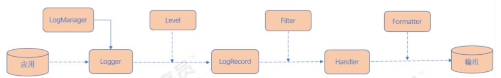
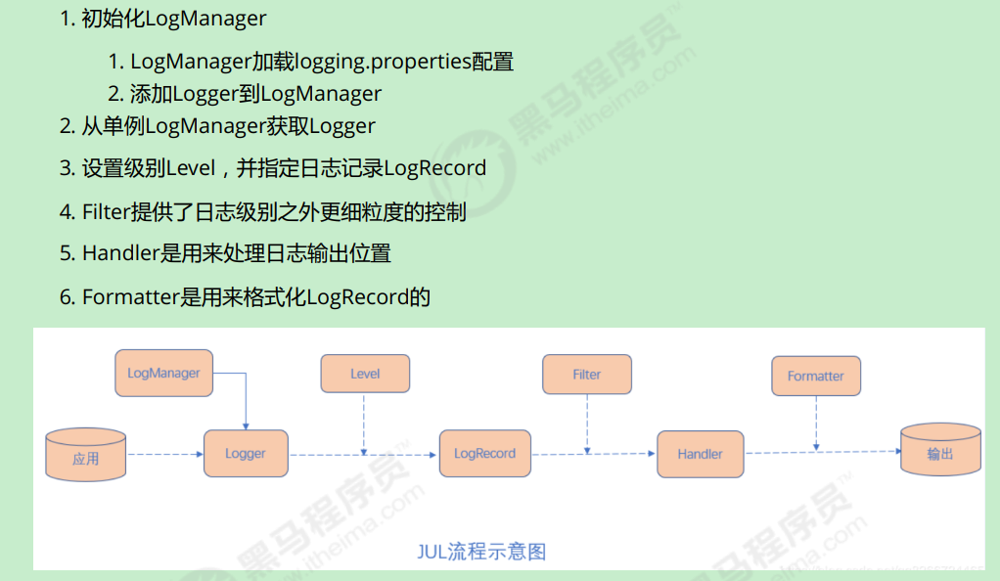

# 日志系统

# 概述

**日志文件：**

日志文件是用于记录系统操作事件的文件集合，可分为事件日志和消息日志。具有处理历史数据、诊断问题的追踪以及理解系统的活动等重要作用。
在计算机中，日志文件是记录在操作系统或其他软件运行中发生的事件或在通信软件的不同用户之间的消息的文件。记录是保持日志的行为。在最简单的情况下，消息被写入单个日志文件。许多操作系统，软件框架和程序包括日志系统。广泛使用的日志记录标准是在因特网工程任务组（IETF）RFC5424中定义的syslog。 syslog标准使专用的标准化子系统能够生成，过滤，记录和分析日志消息。

**调试日志：**

软件开发中，我们经常需要去调试程序，做一些信息、状态的输出便于我们查询程序的运行状况。为了让我们能够更加灵活和方便的控制这些调试的信息，所以我们需要专业的日志技术。java中寻找解决bug时会需要重现bug，而调试（也就是debug）可以在程序运行中暂停程序运行，查看程序在运行中的情况。日志主要作用就是为了更方便的去重现问题（bug）。

**系统日志：**

系统日志是记录系统中硬件、软件和系统问题的信息，同时还可以监视系统中发生的事件。用户可以通过系统日志来检查错误发生的原因，或者寻找受到攻击时攻击者留下的痕迹。系统日志包括系统日志、应用程序日志和安全日志。

系统日志的价值：系统日志策略可以在故障刚刚发生时就向你发送警告信息，系统日志帮助你在最短的时间内发现问题。 系统日志是一种非常关键的组件，因为系统日志可以让你充分了解自己的环境。这种系统日志信息对于 决定故障的根本原因或者缩小系统攻击范围来说是非常关键的，因为系统日志可以让你了解故障或者袭 击发生之前的所有事件。为虚拟化环境制定一套良好的系统日志策略也是至关重要的，因为系统日志需 要和许多不同的外部组件进行关联。良好的系统日志可以防止你从错误的角度分析问题，避免浪费宝贵的排错时间。另外一种原因是借助于系统日志，管理员很有可能会发现一些之前从未意识到的问题，在 几乎所有刚刚部署系统日志的环境当中。

# Java日志框架

**搭建日志需要考虑的问题：** 

1. 控制日志输出的内容和格式 
2. 控制日志输出的位置 
3. 日志优化：异步日志，日志文件的归档和压缩 
4. 日志系统的维护 
5. 面向接口开发 —— 日志的门面 —— 一套代码操作具体日志实现

**现有日志框架：**

1. 日志门面：JCL（Jakarta Commons Logging）、slf4j（ Simple Logging Facade for Java）
2. 日志实现：JUL（java util logging）、logback、log4j、log4j2 

# JUL

JUL（Java util Logging）是Java原生的日志框架，使用时不需要另外引用第三方类库，相对其他日志框架使用方便、学习简单，能够在小型应用中灵活使用。  

## 架构



1. Loggers：被称为记录器，应用程序通过获取Logger对象并调用其API来发布日志信息。Logger通常时应用程序访问日志系统的入口程序。
2. Appenders：也被称为Handlers，每个Logger都会关联一组Handlers，Logger会将日志交给关联Handlers处理，由Handlers负责将日志做记录。Handlers在此是一个抽象，其具体的实现决定了日志记录的位置可以是控制台、文件、网络上的其他日志服务或操作系统日志等。
3. Layouts：也被称为Formatters，它负责对日志事件中的数据进行转换和格式化。Layouts决定了数据在一条日志记录中的最终形式。
4. Level：每条日志消息都有一个关联的日志级别。该级别粗略指导了日志消息的重要性和紧迫，我可以将Level和Loggers，Appenders做关联以便于我们过滤消息。
5. Filters：过滤器，根据需要定制哪些信息会被记录，哪些信息会被放过  

总体流程：

1. 初始化LogManager，加载logging.properties配置文件，添加Logger到LogManager中。
2. 从单例Bean LogManager获取Logger。
3. 设置日志级别Level。
4. Handler处理日志输出。
5. Formatter处理日志格式。

## 使用JUL

**案例：**

```java
public class JULTest {
    @Test
    public void test(){
        // 获取日志记录器，通常以当前类全限定路径来获取
        Logger logger = Logger.getLogger("com.lsl.JULTest");
        // 日志记录输出
        logger.info("日志信息 INFO");
        // 通用方法
        logger.log(Level.INFO,"日志信息 INFO");
        // 通过占位符来输出变量值
        String str = "日志信息 INFO";
        Integer num = 333;
        logger.log(Level.INFO,"日志信息：{0},{1}",new Object[]{str,num});
    }
}
```

## 日志级别

java.util.logging.Level中定义了日志的级别：

1. SEVERE（最高值）：程序出现严重问题并造成终止。
2. WARNING：程序出现一些问题但不会种子程序。
3. INFO （默认级别）：消息记录，记录数据库的连接信息、IO传递信息、网络通信信息等。
4. CONFIG：配置信息，比如加载了配置文件、读取了配置问题。
5. FINE：debug日志记录信息，记录一些程序运行的状态、执行流程、参数传递信息。颗粒度低一点。
6. FINER：debug日志记录信息，记录一些程序运行的状态、执行流程、参数传递信息。
7. FINEST（最低值）：debug日志记录信息，记录一些程序运行的状态、执行流程、参数传递信息。颗粒度高一点。

两个特殊的级别：

1. OFF，可用来关闭日志记录。
2. ALL，启用所有消息的日志记录。  

测试了7个日志级别，但是默认只实现info以上的级别，如下：

```java
public class JULTest {
    @Test
    public void test(){
        // 获取日志记录器，通常以当前类全限定路径来获取
        Logger logger = Logger.getLogger("com.lsl.JULTest");
        // 只能输出前三个信息，默认情况下其他的都被过滤了
        logger.severe("server");
        logger.warning("warning");
        logger.info("info");
        logger.config("config");
        logger.fine("fine");
        logger.finer("finer");
        logger.finest("finest");
    }
}
```

**自定义日志级别配置：**

```java
public class JULTest {
    @Test
    public void test() throws IOException {
        // 获取日志记录器，通常以当前类全限定路径来获取
        Logger logger = Logger.getLogger("com.lsl.JULTest");
        // 关闭系统默认配置
        logger.setUseParentHandlers(false);
        /* 自定义日志级别 start */
        // 一、 b.创建handler对象，输出日志到控制台
        ConsoleHandler consoleHandler = new ConsoleHandler();
        // c.创建formatter对象
        SimpleFormatter simpleFormatter = new SimpleFormatter();
        // d.进行关联
        consoleHandler.setFormatter(simpleFormatter);
        logger.addHandler(consoleHandler);
        // e.设置日志级别
        logger.setLevel(Level.ALL);
        consoleHandler.setLevel(Level.ALL);
        // 二、输出到日志文件，日志文件需要先创建好
        FileHandler fileHandler = new FileHandler("d:/logs/jul.log");
        fileHandler.setFormatter(simpleFormatter);
        logger.addHandler(fileHandler);
        /* 自定义日志级别 end */

        logger.severe("server");
        logger.warning("warning");
        logger.info("info");
        logger.config("config");
        logger.fine("fine");
        logger.finer("finer");
        logger.finest("finest");
    }
}
```

## Logger父子关系

JUL中Logger之间存在父子关系，这种父子关系通过树状结构存储，JUL在初始化时会创建一个顶层RootLogger作为所有Logger的父Logger，存储上作为树状结构的根节点。父子关系通过路径来关联。  RootLogger有默认的格式器和转换器。

```java
@Test
public void testLogParent() throws Exception {
    // 日志记录器对象父子关系 com.lsl的父为com
    Logger logger1 = Logger.getLogger("com.lsl");
    Logger logger2 = Logger.getLogger("com");
    System.out.println(logger1.getParent() == logger2);
    // 所有日志记录器对象的顶级父元素 class为：java.util.logging.LogManager$RootLogger@61e717c2，name：
    System.out.println("logger2 parent:" + logger2.getParent() + "，name：" +
            logger2.getParent().getName());
    // 一、自定义日志级别
    // a.关闭系统默认配置
    logger2.setUseParentHandlers(false);
    // b.创建handler对象
    ConsoleHandler consoleHandler = new ConsoleHandler();
    // c.创建formatter对象
    SimpleFormatter simpleFormatter = new SimpleFormatter();
    // d.进行关联
    consoleHandler.setFormatter(simpleFormatter);
    logger2.addHandler(consoleHandler);
    // e.设置日志级别
    logger2.setLevel(Level.ALL);
    consoleHandler.setLevel(Level.ALL);
    // 测试日志记录器对象父子关系
    logger1.severe("severe");
    logger1.warning("warning");
    logger1.info("info");
    logger1.config("config");
    logger1.fine("fine");
    logger1.finer("finer");
    logger1.finest("finest");
}
```

## JUL配置文件

默认的配置文件路径`$JAVAHOME\jre\lib\logging.properties`。

使用配置文件来配置：

```properties
## RootLogger处理器（获取时设置），默认为ConsoleHandler
handlers= java.util.logging.ConsoleHandler,java.util.logging.FileHandler
# 设置RootLogger日志等级
.level= INFO

## TestLog日志处理器
TestLog.handlers= java.util.logging.FileHandler
# TestLog日志等级
TestLog.level= INFO
# 忽略父日志处理
TestLog.useParentHandlers=false


## 控制台处理器
# 输出日志级别
java.util.logging.ConsoleHandler.level = INFO
# 输出日志格式
java.util.logging.ConsoleHandler.formatter = java.util.logging.SimpleFormatter
java.util.logging.ConsoleHandler.encoding = UTF-8

java.util.logging.SimpleFormatter.format = %4$s: %5$s [%1$tc]%n

## 文件处理器
# 输出日志级别
java.util.logging.FileHandler.level=INFO
# 输出日志格式
java.util.logging.FileHandler.formatter = java.util.logging.SimpleFormatter
# 输出日志文件路径
java.util.logging.FileHandler.pattern = D:\\logs\\TestLog.log
# 输出日志文件限制大小（50000字节）
java.util.logging.FileHandler.limit = 50000
# 输出日志文件限制个数
java.util.logging.FileHandler.count = 10
# 输出日志文件 是否是追加
java.util.logging.FileHandler.append=true
```

```java
@Test
public void testProperties() throws Exception {
    // 读取自定义配置文件
    InputStream in = JULTest.class.getClassLoader().getResourceAsStream("logging.properties");
    // 获取日志管理器对象
    LogManager logManager = LogManager.getLogManager();
    // 通过日志管理器加载配置文件
    logManager.readConfiguration(in);
    Logger logger = Logger.getLogger("com.lsl.JULTest");
    logger.severe("severe");
    logger.warning("warning");
    logger.info("info");
    logger.config("config");
    logger.fine("fine");
    logger.finer("finer");
    logger.finest("finest");
}
```



# Log4j

Log4j是Apache下的一款开源的日志框架，通过在项目中使用 Log4J，我们可以将日志信息输出到控制台、文件、甚至是数据库中。我们可以控制每一条日志的输出格式，通过定义日志的输出级别可以更灵活地控制日志的输出过程，方便项目的调试。

官方网站： http://logging.apache.org/log4j/1.2/  。

```xml
<dependency>
    <groupId>log4j</groupId>
    <artifactId>log4j</artifactId>
    <version>1.2.17</version>
</dependency>
```

入门案例：

```java
public class Log4jTest {
    @Test
    public void test(){
        // 没有自定义配置文件，需要初始化配置信息
        BasicConfigurator.configure();
        Logger logger = Logger.getLogger(Log4jTest.class);
        logger.info("hello log4j");

        // 6个日志级别
        logger.fatal("fatal");  // 严重错误，一般会造成系统崩溃和终止运行
        logger.error("error");  // 错误信息，但不会影响系统运行
        logger.warn("warn");    // 警告信息，可能会发生问题
        logger.info("info");    // 程序运行信息，数据库的连接、网络、IO操作等
        logger.debug("debug");  // 调试信息，一般在开发阶段使用，记录程序的变量、参数等
        logger.trace("trace");  // 追踪信息，记录程序的所有流程信息
    }
}
```

每个Logger都被了一个日志级别（log level），用来控制日志信息的输出。日志级别从高到低分为：

1. fatal 指出每个严重的错误事件将会导致应用程序的退出。
2. error 指出虽然发生错误事件，但仍然不影响系统的继续运行。
3. warn  表明会出现潜在的错误情形。
4. info   一般和在粗粒度级别上，强调应用程序的运行全程。
5. debug 一般用于细粒度级别上，对调试应用程序非常有帮助。
6. trace 是程序追踪，可以用于输出程序运行中的变量，显示执行的流程。

还有两个特殊的级别：

1. OFF，可用来关闭日志记录。
2. ALL，启用所有消息的日志记录。

## Log4J 组件

Log4J 主要由 Loggers (日志记录器)、Appenders（输出端）和 Layout（日志格式化器）组成。其中 Loggers 控制日志的输出级别与日志是否输出；Appenders 指定日志的输出方式（输出到控制台、文件、数据库等）；Layout 控制日志信息的输出格式。

**Loggers ：**

日志记录器：负责收集处理日志记录，实例的命名就是类“XX”的full quailied name（类的全限定名）， Logger的名字大小写敏感，其命名有继承机制，例如：name为org.apache.commons的logger会继承 name为org.apache的logger。

RootLogger：Log4J中有一个特殊的logger叫做“root”，他是所有logger的根，也就意味着其他所有的logger都会直接 或者间接地继承自root。root logger可以用Logger.getRootLogger()方法获取。

 **Appenders：**

Appender 用来指定日志输出到哪个地方，可以同时指定日志的输出目的地。Log4j 常用的输出目的地有以下几种：

1. ConsoleAppender：将日志输出到控制台。
2. FileAppender：将日志输出到文件中。
3. DailyRollingFileAppender：将日志输出到一个日志文件，并且每天输出到一个新的文件。
4. RollingFileAppender：将日志信息输出到一个日志文件，并且指定文件的尺寸，当文件大 小达到指定尺寸时，会自动把文件改名，同时产生一个新的文件。
5. JDBCAppender：把日志信息保存到数据库中。

**Layouts：**

布局器 Layouts用于控制日志输出内容的格式，让我们可以使用各种需要的格式输出日志。Log4j常用 的Layouts：

1. org.apache.log4j.HTMLLayout：格式化日志输出为HTML表格形式 。
2. org.apache.log4j.SimpleLayout：简单的日志输出格式化，打印的日志格式为（info - message）。
3.  org.apache.log4j.PatternLayout：最强大的格式化器，可以根据自定义格式输出日志，如果没有指定转换格式那 就是用默认的转换格式。

在 log4j.properties 配置文件中，我们定义了日志输出级别与输出端，在输出端中分别配置日志的输出格式。

```markdown
** log4j 采用类似 C 语言的 printf 函数的打印格式格式化日志信息，具体的占位符及其含义如下：**
    %m 输出代码中指定的日志信息
    %p 输出优先级，及 DEBUG、INFO 等
    %n 换行符（Windows平台的换行符为 "\n"，Unix 平台为 "\n"）
    %r 输出自应用启动到输出该 log 信息耗费的毫秒数
    %c 输出打印语句所属的类的全名
    %t 输出产生该日志的线程全名
    %d 输出服务器当前时间，默认为 ISO8601，也可以指定格式，如：%d{yyyy年MM月dd日 HH:mm:ss}
    %l 输出日志时间发生的位置，包括类名、线程、及在代码中的行数。如：Test.main(Test.java:10)
    %F 输出日志消息产生时所在的文件名称
    %L 输出代码中的行号
    %% 输出一个 "%" 字符
** 可以在 % 与字符之间加上修饰符来控制最小宽度、最大宽度和文本的对其方式。如：**
    %5c 输出category名称，最小宽度是5，category<5，默认的情况下右对齐
    %-5c 输出category名称，最小宽度是5，category<5，"-"号指定左对齐,会有空格
    %.5c 输出category名称，最大宽度是5，category>5，就会将左边多出的字符截掉，<5不会有空格
    %20.30c category名称<20补空格，并且右对齐，>30字符，就从左边交远销出的字符截掉
```

```properties
log4j.appender.Console.layout.ConversionPattern=%d [%t] %-5p [%c] - %m%n
```

**开启lof4j的内部日志：**

```java
LogLog.setInternalDebugging(true);
```


## 配置Log4J

log4j.properties：（文件名确定的，放于类路径下即可）

```properties
# 指定顶级父元素默认配置信息，指定日志级别与Appender
# console、file、logDB的配置见：输出到控制台、输出到文件、输出到数据库这三部分
log4j.rootLogger=info,console,file,logDB
```

### 输出到控制台

```properties
# 配置：输出到控制台
#指定控制台日志输出的Appender
log4j.appender.console=org.apache.log4j.ConsoleAppender
#指定输出消息格式 org.apache.log4j.PatternLayout的默认规则是：%m%n
log4j.appender.console.layout=org.apache.log4j.PatternLayout
#指定输出消息格式的内容
log4j.appender.console.layout.ConversionPattern=%d [%t] %-5p [%c] - %m%n
```

### 输出到文件

将输出的日志保存到一个日志文件：（目录和文件会自动创建，相对于磁盘根目录）

```properties
#配置：输出到文件
#指定日志输出的Appender
log4j.appender.file=org.apache.log4j.FileAppender
#指定输出消息格式 layout
log4j.appender.file.layout=org.apache.log4j.PatternLayout
#指定输出消息格式的内容
log4j.appender.file.layout.ConversionPattern=%-d{yyyy-MM-dd HH:mm:ss}  [ %t:%r ] - [ %p ]  %m%n
#指定日志保存路径 默认以追加方式存进文件
log4j.appender.file.file=D:\\logs\\log4j.log
#log4j.appender.FILE.append=true
#设置字符集
log4j.appender.file.encoding=UTF-8
```

保存日志到文件并将日志文件按照一定规则拆分：（文件会自动创建）

```properties
#按照文件大小拆分的 Appender对象
#指定日志输出的Appender
log4j.appender.rollingFile=org.apache.log4j.RollingFileAppender
#指定输出消息格式 layout
log4j.appender.rollingFile.layout=org.apache.log4j.PatternLayout
#指定输出消息格式的内容
log4j.appender.rollingFile.layout.ConversionPattern=%-d{yyyy-MM-dd HH:mm:ss}  [ %t:%r ] - [ %p ]  %m%n
#指定日志保存路径 默认以追加方式存进文件
log4j.appender.rollingFile.file=/log/log4j.log
#log4j.appender.FILE.append=true
#设置字符集
log4j.appender.rollingFile.encoding=UTF-8
#指定日志文件内容的大小，如果日志文件超过1MB就会拆分，拆分数量最大为10个
#超过10个会按照时间进行覆盖
log4j.appender.rollingFile.maxFileSize=1MB
#指定日志文件的数量 默认1个
log4j.appender.rollingFile.maxBackupIndex=10
```

保存日志到文件并将日志文件按照时间规则来创建：

```properties
#按照时间规则拆分的 Appender对象
#指定日志输出的Appender
log4j.appender.dailyFile=org.apache.log4j.DailyRollingFileAppender
#指定输出消息格式 layout
log4j.appender.dailyFile.layout=org.apache.log4j.PatternLayout
#指定输出消息格式的内容
log4j.appender.dailyFile.layout.ConversionPattern=%-d{yyyy-MM-dd HH:mm:ss}  [ %t:%r ] - [ %p ]  %m%n
#指定日志保存路径 默认以追加方式存进文件
log4j.appender.dailyFile.file=/log/log4j.log
#log4j.appender.FILE.append=true
#设置字符集
log4j.appender.dailyFile.encoding=UTF-8
#按照日期拆分的规则
log4j.appender.dailyFile.datePattern='.'yyyy-MM-dd-HH-mm
# 例如：log4j.log.2022-03-29-17-49；经常的做法是以天为拆分单位
```

有三种方式：file、rollingFile、dailyFile，选用哪种就在rootLogger指定日志级别与Appender：

```properties
log4j.rootLogger=info,console,dailyFile
```

### 输出到数据库

创建好数据库和数据库表：

```mysql
create database log4j character set utf8 collate utf8_general_ci;
create table log4j.`log` (
    `log_id` int(11) NOT NULL AUTO_INCREMENT,
    `project_name` varchar(255) DEFAULT NULL COMMENT '目项名',
    `create_date` varchar(255) DEFAULT NULL COMMENT '创建时间',
    `level` varchar(255) DEFAULT NULL COMMENT '优先级',
    `category` varchar(255) DEFAULT NULL COMMENT '所在类的全名',
    `file_name` varchar(255) DEFAULT NULL COMMENT '输出日志消息产生时所在的文件名称 ',
    `thread_name` varchar(255) DEFAULT NULL COMMENT '日志事件的线程名',
    `line` varchar(255) DEFAULT NULL COMMENT '号行',
    `all_category` varchar(255) DEFAULT NULL COMMENT '日志事件的发生位置',
    `message` varchar(4000) DEFAULT NULL COMMENT '输出代码中指定的消息',
    PRIMARY KEY (`log_id`)
)engine=innodb default charset=utf8;
```

将日志输出到MySQL中数据库的配置如下：

```properties
#输出到mysql
log4j.appender.logDB=org.apache.log4j.jdbc.JDBCAppender
log4j.appender.logDB.layout=org.apache.log4j.PatternLayout
log4j.appender.logDB.Driver=com.mysql.jdbc.Driver
log4j.appender.logDB.URL=jdbc:mysql://localhost:3306/log4j?characterEncoding=utf8&useUnicode=true&useSSL=false
log4j.appender.logDB.User=root
log4j.appender.logDB.Password=123456
log4j.appender.logDB.Sql=INSERT INTO log(project_name,create_date,level,category,file_name,thread_name,line,all_category,message) values('logSystem','%d{yyyy-MM-ddHH:mm:ss}','%p','%c','%F','%t','%L','%l','%m')
```

需要在rootLogger指定指定logDB。

需要导入MySQL的驱动的依赖：

```xml
<dependency>
    <groupId>mysql</groupId>
    <artifactId>mysql-connector-java</artifactId>
    <version>5.1.47</version>
</dependency>
```

### 总结—总配置文件

log4j.properties：（文件名得是这个，放于类路径下）

```properties
# 指定顶级父元素默认配置信息，指定日志级别与Appender；日志的输出级别与输出端 console file mysql，
log4j.rootLogger=info,console,dailyFile,logDB

# 配置：输出到控制台
#指定控制台日志输出的Appender
log4j.appender.console=org.apache.log4j.ConsoleAppender
#指定输出消息格式 org.apache.log4j.PatternLayout的默认规则是：%m%n
log4j.appender.console.layout=org.apache.log4j.PatternLayout
#指定输出消息格式的内容
log4j.appender.console.layout.ConversionPattern=%d [%t] %-5p [%c] - %m%n

#配置：输出到文件
#指定日志输出的Appender
log4j.appender.file=org.apache.log4j.FileAppender
#指定输出消息格式 layout
log4j.appender.file.layout=org.apache.log4j.PatternLayout
#指定输出消息格式的内容
log4j.appender.file.layout.ConversionPattern=%-d{yyyy-MM-dd HH:mm:ss}  [ %t:%r ] - [ %p ]  %m%n
#指定日志保存路径 默认以追加方式存进文件
log4j.appender.file.file=D:\\logs\\log4j.log
#log4j.appender.FILE.append=true
#设置字符集
log4j.appender.file.encoding=UTF-8

#按照文件大小拆分的 Appender对象
#指定日志输出的Appender
log4j.appender.rollingFile=org.apache.log4j.RollingFileAppender
#指定输出消息格式 layout
log4j.appender.rollingFile.layout=org.apache.log4j.PatternLayout
#指定输出消息格式的内容
log4j.appender.rollingFile.layout.ConversionPattern=%-d{yyyy-MM-dd HH:mm:ss}  [ %t:%r ] - [ %p ]  %m%n
#指定日志保存路径 默认以追加方式存进文件
log4j.appender.rollingFile.file=/log/log4j.log
#log4j.appender.FILE.append=true
#设置字符集
log4j.appender.rollingFile.encoding=UTF-8
#指定日志文件内容的大小，如果日志文件超过1MB就会拆分，拆分数量最大为10个
#超过10个会按照时间进行覆盖
log4j.appender.rollingFile.maxFileSize=1MB
#指定日志文件的数量 默认1个
log4j.appender.rollingFile.maxBackupIndex=10

#按照时间规则拆分的 Appender对象
#指定日志输出的Appender
log4j.appender.dailyFile=org.apache.log4j.DailyRollingFileAppender
#指定输出消息格式 layout
log4j.appender.dailyFile.layout=org.apache.log4j.PatternLayout
#指定输出消息格式的内容
log4j.appender.dailyFile.layout.ConversionPattern=%-d{yyyy-MM-dd HH:mm:ss}  [ %t:%r ] - [ %p ]  %m%n
#指定日志保存路径 默认以追加方式存进文件
log4j.appender.dailyFile.file=/log/log4j.log
#log4j.appender.FILE.append=true
#设置字符集
log4j.appender.dailyFile.encoding=UTF-8
#按照日期拆分的规则
log4j.appender.dailyFile.datePattern='.'yyyy-MM-dd-HH-mm

#输出到mysql
log4j.appender.logDB=org.apache.log4j.jdbc.JDBCAppender
log4j.appender.logDB.layout=org.apache.log4j.PatternLayout
log4j.appender.logDB.Driver=com.mysql.jdbc.Driver
log4j.appender.logDB.URL=jdbc:mysql://localhost:3306/log4j?characterEncoding=utf8&useUnicode=true&useSSL=false
log4j.appender.logDB.User=root
log4j.appender.logDB.Password=123456
log4j.appender.logDB.Sql=INSERT INTO log(project_name,create_date,level,category,file_name,thread_name,line,all_category,message) values('logSystem','%d{yyyy-MM-ddHH:mm:ss}','%p','%c','%F','%t','%L','%l','%m')
```

## 自定义的Logger

自定义的Logger，为了变量不同业务场景的日志的分类记录。在log4j.properties里配置：

```properties
# RootLogger配置
log4j.rootLogger = trace,console
# 自定义Logger的配置的格式：log4j.logger.logger所在包=日志输出级别和输出位置
# 比如我在com.lsl下某个类使用了一个Logger，将其打印的日志保存到文件，那么设置如下：
log4j.logger.com.lsl = info,file
log4j.logger.org.apache = error
```

```java
public class Log4jTest {
    @Test
    public void testCustomLogger() throws Exception {
        // 自定义 com.lsl
        Logger logger1 = Logger.getLogger(Log4jTest.class);
        logger1.fatal("fatal"); // 严重错误，一般会造成系统崩溃和终止运行
        logger1.error("error"); // 错误信息，但不会影响系统运行
        logger1.warn("warn"); // 警告信息，可能会发生问题
        logger1.info("info"); // 程序运行信息，数据库的连接、网络、IO操作等
        logger1.debug("debug"); // 调试信息，一般在开发阶段使用，记录程序的变量、参数等
        logger1.trace("trace"); // 追踪信息，记录程序的所有流程信息
        // 自定义 org.apache
        Logger logger2 = Logger.getLogger(Logger.class);
        logger2.fatal("fatal logger2"); // 严重错误，一般会造成系统崩溃和终止运行
        logger2.error("error logger2"); // 错误信息，但不会影响系统运行
        logger2.warn("warn logger2"); // 警告信息，可能会发生问题
        logger2.info("info logger2"); // 程序运行信息，数据库的连接、网络、IO操作等
        logger2.debug("debug logger2"); // 调试信息，一般在开发阶段使用，记录程序的变量、参数等
        logger2.trace("trace logger2"); // 追踪信息，记录程序的所有流程信息
    }
}
```


