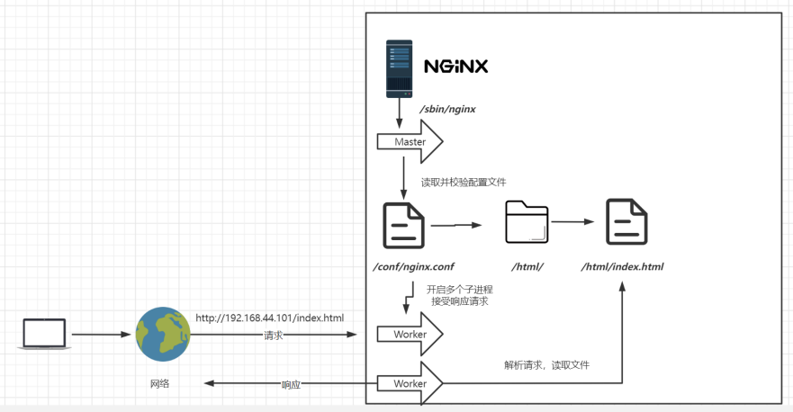
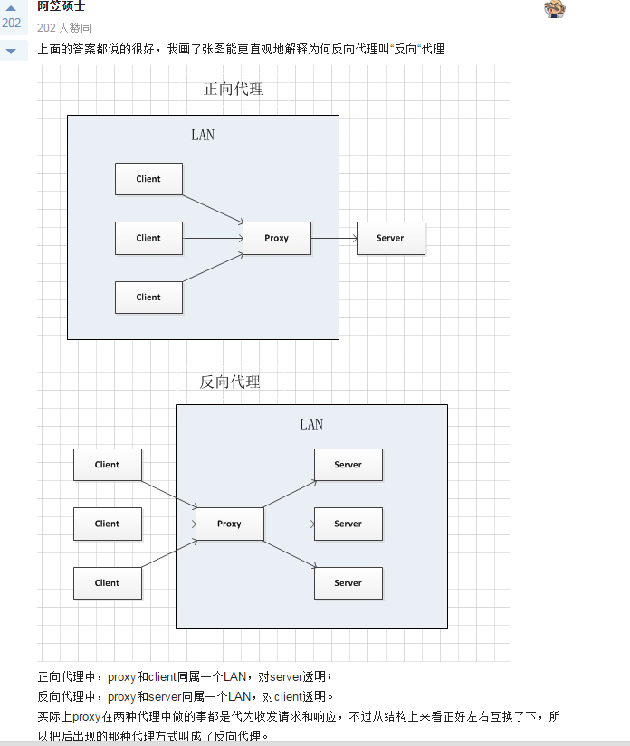
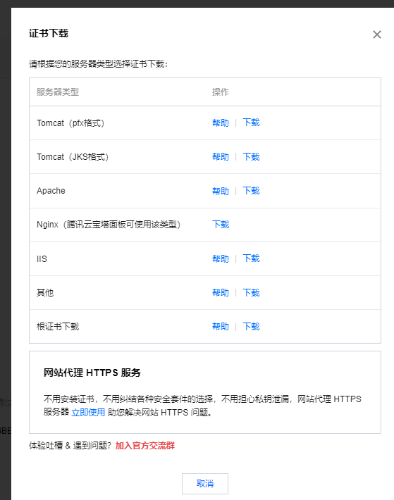

# Nginx

Nginx发行版本：（除商业版其他都开源）

1.  Nginx开源版 http://nginx.org/ 
2. Nginx plus 商业版 https://www.nginx.com 
3. openresty http://openresty.org/cn/ 
4. Tengine http://tengine.taobao.org/

# 安装Nginx

1. 下载：[nginx: download](https://nginx.org/en/download.html)。

2. 解压：`tar -zxvf nginx-1.22.0.tar.gz`。

3. 安装依赖包：`yum -y install make zlib-devel gcc-c++ libtool openssl openssl-devel`。

4. 编译与安装：

   1. 进入解压的目录，执行以下指令：

      ```
      ./configure \
      --prefix=/usr/local/nginx \
      --pid-path=/var/run/nginx/nginx.pid \
      --lock-path=/var/lock/nginx.lock \
      --error-log-path=/var/log/nginx/error.log \
      --http-log-path=/var/log/nginx/access.log \
      --with-http_gzip_static_module \
      --http-client-body-temp-path=/var/temp/nginx/client \
      --http-proxy-temp-path=/var/temp/nginx/proxy \
      --http-fastcgi-temp-path=/var/temp/nginx/fastcgi \
      --http-uwsgi-temp-path=/var/temp/nginx/uwsgi \
      --http-scgi-temp-path=/var/temp/nginx/scgi \
      --with-http_stub_status_module \
      --with-http_ssl_module \
      --with-file-aio \
      --with-http_realip_module
      ```

   2. 再执行`make && make install`编译安装。

5. 上面将临时目录设为`/var/temp/nginx`，需要创建`mkdir -p /var/temp/nginx`，然后才能启动Nginx：

   进入安装好的目录 `cd /usr/local/nginx/sbin`  

   ```properties
   # 启动
   ./nginx
   # 快速停止
   ./nginx -s stop
   # 优雅关闭，在退出前完成已经接受的连接请求
   ./nginx -s quit 
   # 检查配置文件是否有语法错误   /usr/local/nginx/sbin/nginx -t
   ./sbin/nginx -t
   # 重新加载配置
   ./nginx -s reload 
   # 查看是否启动
   ps -aux | grep nginx
   ```

6. 防火墙的配置与放行80端口。

7. 将Nginx安装成系统服务：

   1. 创建服务脚本：`vi /usr/lib/systemd/system/nginx.service`（注意相关文件路径与执行`./configure`时配置的要一致）

      ```shell
      [Unit]
      Description=nginx - web server
      After=network.target remote-fs.target nss-lookup.target
      [Service]
      Type=forking
      PIDFile=/var/run/nginx/nginx.pid
      ExecStartPre=/usr/local/nginx/sbin/nginx -t -c /usr/local/nginx/conf/nginx.conf
      ExecStart=/usr/local/nginx/sbin/nginx -c /usr/local/nginx/conf/nginx.conf
      ExecReload=/usr/local/nginx/sbin/nginx -s reload
      ExecStop=/usr/local/nginx/sbin/nginx -s stop
      ExecQuit=/usr/local/nginx/sbin/nginx -s quit
      PrivateTmp=true
      [Install]
      WantedBy=multi-user.target
      ```

   2. 重新加载系统服务：`systemctl daemon-reload`。

   3. 启动服务：`systemctl start nginx.service`。（因为上面第五步启动了nginx，所以报错`nginx: [emerg] bind() to 0.0.0.0:80 failed (98: Address already in use)`，那是80端口被占用，使用`sudo fuser -k 80/tcp`关闭80端口即可）

   4. 开机启动：`systemctl enable nginx.service`。

8. 启动Nginx成功查看状态有报错`Failed to parse PID from file /usr/local/nginx/logs/nginx.pid: Invalid argument`，依次执行以下命令即可：

   -  `mkdir -p /etc/systemd/system/nginx.service.d`
   - ` printf "[Service]\nExecStartPost=/bin/sleep 0.1\n" >/etc/systemd/system/nginx.service.d/override.conf`
   - `systemctl daemon-reload`
   - `systemctl restart nginx.service`

9. 卸载Nginx：关闭Nginx的开机启动，关闭Nginx，`find / -name nginx` 找出nginx相关文件，然后删除文件。

# Nginx基本使用

## 目录结构与运行原理

**目录结构：**

1. client_body_temp、fastcgi_temp、proxy_temp、scgi_temp、uwsgi_temp：这几个文件目录默认会生成在nginx根目录，在刚安装后是没有的，主要用来存放运行过程中的临时文件。（在执行`./configure`时已经将这些路径以及日志路径都设置为其他路径了，因此不会在根目录下出现）
2. conf：用来存放配置文件相关。
3. html：用来存放静态文件的默认目录 html、css等。
4. logs：日志。
5. sbin：nginx的主程序。

运行原理：Nginx接收到请求，主进程master读取并校验文件后开启多个子进程来去处理请求并响应，主进程负责协调子进程，完成了任务的Worker会被kill掉。




## 配置与应用场景

conf：用来存放配置文件相关。

nginx.conf中的最小配置项（默认配置项）：

1. `worker_processes 1`：默认为1，表示开启一个业务进程。（主进程Master，业务进程Worker）

2. `worker_connections 1024`： 单个业务进程可接受连接数。

3. `include mime.types`： 引入http mime类型。（include表示纳入mime.types文件的配置，
   如果nginx.conf有重复的指令，可以抽取出来，利用include来帮我们简化配置，避免修改一个相同的配置，要改动好几个地方。）

4. `default_type application/octet-stream`： 如果mime类型没匹配上，默认使用二进制流的方式传输。

5. `sendfile on`： 使用linux的 sendfile(socket、file、len) 高效网络传输，也就是数据0拷贝，直接传输数据。 

6. 虚拟主机的：

   ```properties
   server {
   		listen 80;                      监听端口号
   		server_name localhost;          域名，主机名
   		location / {                    匹配路径
   			root html;                      文件根目录，此时是相对路径，相对于当前文件夹-conf
   			index index.html index.htm;     默认页，只访问根目录时就从conf/html目录下找到并返回此页面
   		}
   		error_page 500 502 503 504 /50x.html;     报错编码对应页面
   		location = /50x.html {                    
   			root html;
   		}
   }
   ```

## location

`location`是Nginx中的块级指令(block directive)，location指令的功能是用来匹配不同的url请求，进而对请求做不同的处理和响应，这其中较难理解的是多个location的匹配顺序。我们输入的网址叫做`请求URI`，nginx用请求URI与`location中配置的URI`做匹配。

**两种匹配规则：**

1. 匹配URL类型，有四种参数可选，当然也可以不带参数。

   ```properties
   # 中括号内的参数为可选参数
   location [ = | ~ | ~* | ^~ ] uri {
   	
   }
   ```

   1. `=`：精确匹配，请求内容和后面的URI一致才能匹配成功。

   2. `~`：执行正则匹配，区分大小写。

   3. `~*`：忽略大小写的正则匹配。

   4. `^~`：如果普通字符已经能匹配上了，就不会进行正则匹配。

   5. 不使用参数则是相当于加了“~”与“^~”的匹配方式。

   6. `“@”`，nginx内部跳转：

      ```properties
      location /index/ {
        error_page 404 @index_error;
      }
      location @index_error {
        .....
      }
      # 以 /index/ 开头的请求，如果链接的状态为 404。则会匹配到 @index_error 这条规则上。
      ```

2. 命名location，用@标识，类似于定于goto语句块。（`location @name { … }`）

   ```properties
   location /index/ {
     error_page 404 @index_error;
   }
   location @index_error {
     .....
   }
   # 以 /index/ 开头的请求，如果链接的状态为 404。则会匹配到 @index_error 这条规则上。
   ```

**location匹配顺序：**

```
`=` > `^~` > `~` | `~*` > `最长前缀匹配` > `/`
```

**location URI结尾带不带：**

1. 如果 URI 结构是 https://domain.com/ 的形式，尾部有没有 / 都不会造成重定向。因为浏览器在发起请求的时候，默认加上了 / 。虽然很多浏览器在地址栏里也不会显示 / 。这一点，可以访问百度验证一下。
2. 如果 URI 的结构是 https://domain.com/some-dir/。尾部如果缺少 / 将导致重定向。因为根据**约定，URL 尾部的 / 表示目录，没有 / 表示文件**。所以访问 /some-dir/ 时，服务器会自动去该目录下找对应的默认文件。如果访问 /some-dir 的话，服务器会先去找 some-dir 文件，找不到的话会将 some-dir 当成目录，重定向到 /some-dir/ ，去该目录下找默认文件。

**location内设置文件的寻找路径：**

1. ```properties
   # 访问http://xxx.xxx.xxx/img/xxx.xxx文件时，就会去/var/www/image/目录寻找
   location /img/ {
   	alias /var/www/image/;
   }
   ```

2. ```properties
   # 访问http://xxx.xxx.xxx/img/xxx.xxx文件时，nginx会去/var/www/image/img/目录下找文件
   location /img/ {
   	root /var/www/image;
   }
   ```

3. **alias 指定的目录是准确的，给location指定一个目录，root 指定目录的上级目录，并且该上级目录要含有locatoin指定名称的同名目录**。

4. ```
   1.使用alias时，目录名后面一定要加“/”。
   2.使用alias标签的目录块中不能使用rewrite的break。
   3.alias在使用正则匹配时，必须捕捉要匹配的内容并在指定的内容处使用。
   4.alias只能位于location块中
   ```


## 虚拟主机与域名解析

**虚拟主机：**原本一台服务器只能对应一个站点，通过虚拟主机技术可以虚拟化成多个站点同时对外提供服务。（多个域名对应一个IP地址，由Nginx来完成域名与站点的关联，实现单主机多服务站点）

**域名解析与泛域名解析配置：**

1、Windows下，`C:\Windows\System32\drivers\etc\host`文件中配置本地域名（只能本地使用）：

```properties
127.0.0.1       activate.navicat.com
127.0.0.1 transact.netsarang.com
127.0.0.1 update.netsarang.com
```

2、公网域名解析：服务器服务商有说明

**虚拟主机配置：**（nginx.conf中配置）

```properties
server {
		listen 80;                      监听端口号
		server_name localhost;          填域名，主机名
		location / {                   
			root html;                      
			index index.html index.htm;    
		}
		error_page 500 502 503 504 /50x.html;     报错编码对应页面
		location = /50x.html {                   
			root html;									
		}
}
```

servername匹配分先后顺序，写在前面的匹配上就不会继续往下匹配了。如果有多个域名解析到了当前服务器上，那么可以通过在同一server_name中配置多个域名，匹配方式有以下几种：

1. 完整匹配：`server_name www.xxx.com www.xxx.com;`。
2. 通配符匹配：`server_name *.xxx.com`。
3. 通配符结束匹配：`server_name vod.*;`——vod.开头的都匹配到。
4. 正则匹配：`server_name ~^[0-9]+\.mmban\.com$;`。

企业需求：

1. 二级域名。
2. 短网址。（短网址进数据库匹配到真实地址，后台重定向）

## 反向代理配置

配置反射代理：（一个词`proxy_pass`）

```properties
server {
		listen 88;                      
		server_name localhost;          
		location / {
			# 配置反射代理，注意要有分号结尾，请求都会转给此主机
			proxy_pass http://xxx.com/;
			#root html;                      
			#index index.html index.htm;    
		}
		error_page 500 502 503 504 /50x.html;    
			location = /50x.html {                    
			root html;									
		}
}	
```


1. 正向代理：一个位于客户端和原始服务器 (origin server)之间的服务器，为了从原始服务器取得内容，客户端向代理发送一个请求并指定目标 (原始服务器)，然后代理向原始服务器转交请求并将获得的内容返回给客户端。（客户端  <===>  正向代理服务器  <===>  目标资源所在服务器）
2. 反向代理：如果一个代理服务器可以代理外部网络主机访问内部网络，这类代理服务模式称之为反向代理服务。




## 负载均衡配置

负载均衡（Load Balance），意思是将负载（工作任务，访问请求）进行平衡、分摊到多个操作单元（服务器，组件）上进行执行。负载均衡配置要和反射代理结合使用。在nginx.conf配置负责均衡如下：

```properties
http {
	upstream httpd {
	server 127.0.0.1:8050 weight=10 down;
	server 127.0.0.1:8060 weight=1;
	server 127.0.0.1:8060 weight=1 backup;
	}	
}
```

负载均衡策略：

1. down：表示当前的server暂时不参与负载 。
2. weight：默认为1，weight越大，负载的权重就越大。 
3. backup： 其它所有的非backup机器down或者忙的时候，请求backup机器。

其他的一些策略：ip_hash——根据客户端的ip地址转发同一台服务器，可以保持回话；least_conn——最少连接访问；url_hash——根据用户访问的url定向转发请求；fair——根据后端服务器响应时间转发请求。


## 动静分离

静态资源放进Nginx，例如部署到Tomcat上的webApp，将css、js、images等静态资源都存放到Nginx上的html目录或其它目录。（动静分离可能会应用在中小型网站，大型网站不会这样做）

1、设置反向代理。

2、Nginx配置location：

```properties
server {
		listen 80;                      
		server_name localhost;        
		# 反向代理
		location / {
			proxy_pass http://xxx.com/;
		}
		# 到Nginx的html目录下寻找请求的文件
		location /css {
			root html;
		}
		location /js {
			root html;
		}
		location /images {
			root html;
		}
		error_page 500 502 503 504 /50x.html;     
		location = /50x.html {                    
			root html;								
		}
}	
```

```properties
# 到/usr/local/nginx/static/css目录下寻找请求的文件
location /css {
	root /usr/local/nginx/static;
	index index.html index.htm;
}
# 到/usr/local/nginx/static/images目录下寻找请求的文件
location /images {
	root /usr/local/nginx/static;
	index index.html index.htm;
}
# 到/usr/local/nginx/static/js目录下寻找请求的文件
location /js {
	root /usr/local/nginx/static;
	index index.html index.htm;
}
```

location使用正则表达式：

```properties
# 访问js、css、img内文件都会匹配到/usr/local/nginx/static目录下来去匹配文件
location ~*/(js|css|img) {
	root /usr/local/nginx/static;
	index index.html index.htm;
}
# 关于location前缀
# ~* 正则匹配，不区分大小写
# ~  正则匹配，区分大小写
# =  精准匹配，不是以指定模式开头
# ^~ 非正则匹配，匹配以指定模式开头的location
# /  通用匹配，任何请求都会匹配到。
```

location匹配顺序 

1. 多个正则location直接按书写顺序匹配，成功后就不会继续往后面匹配 
2. 普通（非正则）location会一直往下，直到找到匹配度最高的（最大前缀匹配） 
3. 当普通location与正则location同时存在，如果正则匹配成功,则不会再执行普通匹配 
4. 所有类型location存在时，“=”匹配 > “^~”匹配 > 正则匹配 > 普通（最大前缀匹配）

alias与root：

```properties
location /css {
	alias /usr/local/nginx/static/css;
	index index.html index.htm;
}
```

root用来设置根目录，而alias在接受请求的时候在路径上不会加上location。

1. alias指定的目录是准确的，即location匹配访问的path目录下的文件直接是在alias目录下查找的；
2. root指定 的目录是location匹配访问的path目录的上一级目录,这个path目录一定要是真实存在root指定目录下的； 
3. 使用 alias标签的目录块中不能使用rewrite的break（具体原因不明）；另外，alias指定的目录后面必须要加上"/"符 号！！ 
4. alias虚拟目录配置中，location匹配的path目录如果后面不带"/"，那么访问的url地址中这个path目录后 面加不加"/"不影响访问，访问时它会自动加上"/"； 但是如果location匹配的path目录后面加上"/"，那么访问的url地 址中这个path目录必须要加上"/"，访问时它不会自动加上"/"。如果不加上"/"，访问就会失败！
5.  root目录配置 中，location匹配的path目录后面带不带"/"，都不会影响访问。

UrlRewrite：

```properties
location /css {
	# 例如访问 /233.html 实际转发的是 /index.html?pageNum=233，就实现了一个隐藏效果
	rewrite ^/([0-9]+).html$   /index.html?pageNum=$1 break;
	proxt_pass http://xxx.xxx.xxx:8080;
}
```

```properties
rewrite是实现URL重写的关键指令，根据regex (正则表达式)部分内容，重定向到replacement，结尾是flag标记。
rewrite <regex> <replacement> [flag];
关键字   正则     替代内容        flag标记

关键字：其中关键字error_log不能改变
正则：perl兼容正则表达式语句进行规则匹配
替代内容：将正则匹配的内容替换成replacement
flag标记：rewrite支持的flag标记

rewrite参数的标签段位置：server,location,if
flag标记说明：
	last #本条规则匹配完成后，继续向下匹配新的location URI规则
	break #本条规则匹配完成即终止，不再匹配后面的任何规则
	redirect #返回302临时重定向，浏览器地址会显示跳转后的URL地址
	permanent #返回301永久重定向，浏览器地址栏会显示跳转后的URL地址
```

## 生产环境—urlRewrite+负载均衡

防火墙相关指令：

1. `systemctl start firewalld`：开启防火墙。
2. `systemctl restart firewalld`：重启防火墙。
3. `firewall-cmd --reload`：重载规则。
4. `firewall-cmd --list-all`：查看已配置规则。
5. `firewall-cmd --permanent --add-rich-rule="rule family="ipv4" source address="192.168.44.101" port protocol="tcp" port="8080" accept"`：指定端口和ip访问。
6. `firewall-cmd --permanent --remove-rich-rule="rule family="ipv4" source address="192.168.44.101" port port="8080" protocol="tcp" accept"`：移除规则。

负载均衡：

```properties
http {
	upstream httpd {

	server 192.168.44.101:8080 weight=1 backup;
	}	
}
```

添加urlRewrite规则：

```properties
location /css {
	# 例如访问 /233.html 实际转发的是 /index.html?pageNum=233，就实现了一个隐藏效果
	rewrite ^/([0-9]+).html$   /index.html?pageNum=$1 break;
	proxt_pass http://xxx.xxx.xxx:8080;
}
```

## 防盗链

盗链：指在自己的页面上展示一些并不在自己服务器上的一些内容，获取别人的资源地址、绕过别人的资源展示页面，直接在自己的页面上向最终用户提供此内容。 一般被盗链的都是图片、 音乐、视频、软件等资源。通过盗链的手段可以减轻自己服务器的负担。

**防盗链的工作原理：**服务器获取发起请求的网站的地址，然后将该地址和真正的服务端的地址相比较，如果一致则表明是站内请求，或者为自己信任的站点的请求，否则视为盗链并进行阻止或者返回指定的页面。（在请求头中有**Host**(请求的主机)和**Referer**(来源)两个参数，`Referer`字段实际上告诉了服务器，用户在访问当前资源之前的位置，这往往可以用来用户跟踪（referrer，访问来源）。）

Nginx配置防盗链：

```properties
# 在需要防盗链的location中配置，只允许当前来源（192.168.44.101）访问
valid_referers 192.168.44.101;
if ($invalid_referer) {
	return 403;
}
```

`valid_referers none | blocked | server_names | strings ....; `的说明：

1. none， 检测 Referer 头域不存在的情况，没有referer就给你访问。 
2. blocked，检测 Referer 头域的值被防火墙或者代理服务器删除或伪装的情况。这种情况该头域的值不以 “http://” 或 “https://” 开头。 
3. server_names ，设置一个或多个 URL（IP或域名） ，检测 Referer 头域的值是否是这些 URL 中的某一个，是就允许访问。

curl工具：curl 是Linux常用的命令行工具，用来请求 Web 服务器，它的名字就是客户端（client）的 URL 工具的意思。

防盗链——企业实战：

```properties
# 如果配置防盗链时返回 401 那么可以这样配置返回一个HTML页面
error_page 401 /401.html;     
location = /401.html {                   
	root html;
}
```

```properties
# 返回图片的操作
valid_referers none 192.168.44.101;
if ($invalid_referer) {
	rewrite ^/  /img/x.png   break;
}
```

## Keepalived—Nginx高可以解决方案

Keepalived是Linux下一个轻量级别的高可用解决方案。Keepalived起初是为LVS设计的，专门用来监控集群系统中各个服务节点的状态，它根据TCP/IP参考模型的第三、第四层、第五层交换机制检测每个服务节点的状态，如果某个服务器节点出现异常，或者工作出现故障，Keepalived将检测到，并将出现的故障的服务器节点从集群系统中剔除，这些工作全部是自动完成的，不需要人工干涉，需要人工完成的只是修复出现故障的服务节点。

virtual ip（虚拟ip），简称vip，通过虚拟ip的切换达到实现当主Nginx出现故障时使用备用Nginx来提供反射代理。

Keepalived的安装：

1. 方式一——使用yum安装：`yum install keepalived`，安装后配置文件在 `/etc/keepalived/keepalived.conf`。
2. 方式二——编译安装：
   1. 下载地址：[Keepalived for Linux](https://www.keepalived.org/download.html#)
   2. 使用`./configure`编译安装。

Keepalived的配置：（两台机器都得安装Keepalived）

第一台机器：（配置文件在 `/etc/keepalived/keepalived.conf`）

```properties
! Configuration File for keepalived
global_defs {
	# 路由id，自己设置
	router_id lb111 
}
vrrp_instance atguigu {
	# MASTER——主机
	state MASTER
	interface ens33
	virtual_router_id 51
	# 优先级应该比备用机高
	priority 100
	advert_int 1
	# 这个各个机器必须保持一致，以便可以加入到同一组
	authentication {
		auth_type PASS
		auth_pass 1111
  	}
  	# 虚拟id地址，设置一个就行
	virtual_ipaddress {
		192.168.44.200
	}
}
```

第二台机器：（配置文件在 `/etc/keepalived/keepalived.conf`）

```properties
! Configuration File for keepalived
global_defs {
	# 路由id
	router_id lb110
}
vrrp_instance atguigu {
	# BACKUP——备用机
	state BACKUP
	interface ens33
	virtual_router_id 51
	# 优先级应该比主机低
	priority 50
	advert_int 1
	authentication {
		auth_type PASS
		auth_pass 1111
	}
	# 虚拟id地址，设置一个就行
	virtual_ipaddress {
		192.168.44.200
	}
}
```

启动服务：`systemctl start keepalived`。

## HTTPS证书

1、为自己的域名申请好证书后，在服务器提供商的页面下载Nginx的对应的证书。



2、下载证书的压缩包后将解压的全部文件传到Nginx的`conf`目录下。

3、编辑 Nginx 根目录下的 `conf/nginx.conf` 文件。修改内容如下：

```properties
server {
        #SSL 访问端口号为 443
        listen 443 ssl; 
        #填写绑定证书的域名
        server_name cloud.tencent.com; 
        #证书文件名称
        ssl_certificate cloud.tencent.com_bundle.crt; 
        #私钥文件名称
        ssl_certificate_key cloud.tencent.com.key; 
        ssl_session_timeout 5m;
        #请按照以下协议配置
        ssl_protocols TLSv1.2 TLSv1.3; 
        #请按照以下套件配置，配置加密套件，写法遵循 openssl 标准。
        ssl_ciphers ECDHE-RSA-AES128-GCM-SHA256:HIGH:!aNULL:!MD5:!RC4:!DHE; 
        ssl_prefer_server_ciphers on;
        location / {
           #网站主页路径。此路径仅供参考，具体请您按照实际目录操作。
           #例如，您的网站运行目录在/etc/www下，则填写/etc/www。
            root html; 
            index  index.html index.htm;
        }
    }
```

4、在 Nginx 根目录下，通过执行该命令验证配置文件问题`./sbin/nginx -t`。

5、重启 Nginx，即可使用 `https://cloud.tencent.com` 进行访问。

6、如果不起作用，那可能是Nginx的http_ssl_module模块没有配置。


