# 基本概念

**MQ（message queue）：**

MQ本质是个遵循FIFO原则的队列(First Input First Output，先入先出)，只不过队列中的内容是消息（message），MQ还是一种跨进程的通信机制，用于上下游传递消息。

MQ(Message Quene) :  翻译为消息队列，通过典型的生产者和消费者模型，生产者不断向消息队列中生产消息，消费者不断的从队列中获取消息。因为消息的生产和消费都是异步的，而且由于只关心消息的发送和接收，没有业务逻辑的侵入，轻松地实现了系统间解耦。别名为消息中间件。通过利用高效可靠的消息传递机制进行平台无关的数据交流，并基于数据通信来进行分布式系统的集成。

**流量消峰：**

对特殊时期时的大量请求进行分时间段处理，接收请求但把处理的时间往后延时。

**应用解耦:**

一个应用可能由不同的系统模块相互配合来完成需求的实现，应用解耦就是将模块中的各系统的依赖降低，使得某一系统出现故障而不影响另一系统的功能，实际就是将应用中模块要处理的信息缓存进消息队列，使得模块之间的依赖降低，提升系统可用性。

**异步处理：**

同步和异步？

# MQ分类

## ActiveMQ

优点：单机吞吐量万级，时效性 ms 级，可用性高，基于主从架构实现高可用性，消息可靠性较低的概率丢失数据。

缺点:官方社区现在对 ActiveMQ 5.x 维护越来越少，高吞吐量场景较少使用。

使用场景：


## Kafka

为大数据而生的消息中间件，以其百万级 TPS 的吞吐量名声大噪，迅速成为大数据领域的宠儿，在数据采集、传输、存储的过程中发挥
着举足轻重的作用。

优点: 性能卓越，单机写入 TPS 约在百万条/秒，最大的优点，就是吞吐量高。时效性 ms 级可用性非常高，kafka 是分布式的，一个数据多个副本，少数机器宕机，不会丢失数据，不会导致不可用,消费者采用 Pull 方式获取消息, 消息有序, 通过控制能够保证所有消息被消费且仅被消费一次;有优秀的第三方KafkaWeb 管理界面 Kafka-Manager；在日志领域比较成熟，被多家公司和多个开源项目使用；功能支持： 功能较为简单，主要支持简单的 MQ 功能，在大数据领域的实时计算以及日志采集被大规模使用。

缺点：Kafka 单机超过 64 个队列/分区，Load 会发生明显的飙高现象，队列越多，load 越高，发送消息响应时间变长，使用短轮询方式，实时性取决于轮询间隔时间，消费失败不支持重试；支持消息顺序，但是一台代理宕机后，就会产生消息乱序，社区更新较慢。

适用场景：一开始的目的就是用于日志收集和传输，适合产生大量数据的互联网服务的数据收集业务。

## RocketMQ

 RocketMQ 出自阿里巴巴的开源产品，用 Java 语言实现，在设计时参考了 Kafka，并做出了自己的一些改进。被阿里巴巴广泛应用在订单，交易，充值，流计算，消息推送，日志流式处理，binglog 分发等场景。

优点:单机吞吐量十万级,可用性非常高，分布式架构,消息可以做到 0 丢失,MQ 功能较为完善，还是分布式的，扩展性好,支持 10 亿级别的消息堆积，不会因为堆积导致性能下降,源码是 java 我们可以自己阅读源码，定制自己公司的 MQ。

 缺点：支持的客户端语言不多，目前是 java 及 c++，其中 c++不成熟；社区活跃度一般,没有在MQ核心中去实现 JMS 等接口,有些系统要迁移需要修改大量代码。

适用场景：为金融互联网领域、可靠性要求很高的场景，电商。

## RabbitMQ

2007 年发布，是一个在AMQP(高级消息队列协议)基础上完成的，可复用的企业消息系统，是当前最主流的消息中间件之一。

优点：由于 erlang 语言的高并发特性，性能较好；吞吐量到万级，MQ 功能比较完备,健壮、稳定、易用、跨平台、支持多种语言 如：Python、Ruby、.NET、Java、JMS、C、PHP、ActionScript、XMPP、STOMP等，支持 AJAX 文档齐全；开源提供的管理界面非常棒，用起来很好用,社区活跃度高；更新频率相当高。

缺点：商业版需要收费,学习成本较高。

适用场景：数据量不大，中小型公司。

# RabbitMQ

## 概念

RabbitMQ，一个消息中间件，负责消息数据的接收、存储和转发，不浮躁处理数据。

官方：[Messaging that just works — RabbitMQ](https://www.rabbitmq.com/)。

四大核心概念：

- 生产者：产生数据发送消息的程序是生产者。
- 交换机：负责接收消息并把消息推送进队列。
- 队列：本质是大的消息缓冲区。
- 消费者：等待接收信息的程序。

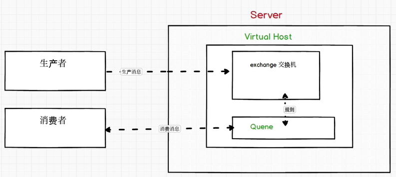

## Linux下安装

### **Erlang环境安装：**

在`https://www.rabbitmq.com/which-erlang.html`可查看erlang、rabbitmq的对应版本。erlang下载：（rabbitMQ是3.9.11，对应的erlang就得23.2版本）。(`https://packagecloud.io/rabbitmq/erlang/packages/el/8/erlang-24.1-1.el8.x86_64.rpm`)；（在`http://erlang.org/download/otp_src_23.2.tar.gz`可下载绿色安装压缩包）。

可以先下载到Windows，再使用Xftp传输到Linux上，也可使用`wget http://erlang.org/download/otp_src_23.2.tar.gz `命令来下载（下载有点慢(~.~) ）。约定俗成，要安装的软件先下载到`/opt`目录，`/usr/local`目录通常是通过源码方式安装的软件的安装目录。

1. `yum -y install make gcc gcc-c++ kernel-devel m4 ncurses-devel openssl-devel`：安装gcc等模块；

2. `yum -y install ncurses-devel`：安装ncurses；

3. 把安装包通过Xftp传入到opt目录。

4. `tar -zxvf otp_src_18.2.1.tar.gz `：在opt目录下解压，得到`otp_src_24.1`；

5. 进入otp_src_23.2，并在otp_src_23.2下执行`./configure --prefix=/usr/local/erlang`；或者执行`./configure --prefix=/usr/local/erlang --with-ssl --enable-threads --enable-smp-support --enable-kernel-poll --enable-hipe --without-javac`（执行该命令用来设定安装规则，也可进入configure编辑）；

6. `make && make install`：然后直接执行该安装命令；

7. 设置环境变量：`vim /etc/profile`，在末尾加上：

   ```txt
   # erlang
   export ERLANG_HOME=/usr/local/erlang
   export PATH=$ERLANG_HOME/bin:$PATH
   ```

   - 再执行`source /etc/profile`使环境生效。

8. `erl`：检查是否安装成功。（执行` erl -eval 'erlang:display(erlang:system_info(otp_release)), halt().'  -noshell`可查出版本号(`erl -version`也行)）。

9. 如果需要卸载重装，那就先执行`whereis erlang`找到erlang安装在的目录，然后删除那个文件夹即可`rm -rf erlang`。

### **rabbitMQ安装：**

rabbitMQ下载，下载()包，更多版本可在`https://github.com/rabbitmq/rabbitmq-server/releases/tag/v3.9.11`查看。

1. `wget https://github.com/rabbitmq/rabbitmq-server/releases/download/v3.9.11/rabbitmq-server-3.9.11-1.el7.noarch.rpm`：在opt目录执行下载rpm包命令，（Windows下使用IDM直接下载更快）。

2. `rpm -ivh --nodeps rabbitmq-server-3.9.11-1.el7.noarch.rpm`：安装rabbitMQ的rmp包，要加上`--nodeps`（表示安装时不检查依赖）。

   - ~~此时默认安装后配置文件的模板在`/usr/share/doc/rabbitmq-server-3.9.11/rabbitmq.config.example`。~~
   - ~~复制配置文件到安装目录：`cp /usr/share/doc/rabbitmq-server-3.9.11/rabbitmq.config.example /etc/rabbitmq.config `。~~

3. `vim /etc/hosts`里添加一条ip地址与自己主机名（我的是scholarhost）的映射记录，内容为`192.168.137.129 scholarhost`。

   - `hostname`可以查看主机名。

4. 使用`systemctl start rabbitmq-server.service`来启动，报错：

   ```txt
   Job for rabbitmq-server.service failed because the control process exited with error code. 
   ```

   - 按网上的方法，

   - 执行`systemctl start rabbitmq-server`启动，仍然报错。使用`journalctl -xe`查看，报错信息：

     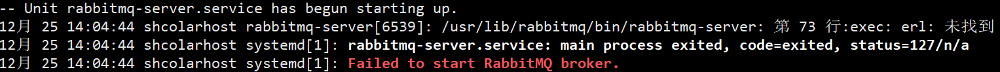

   - 解决：（`vim /usr/lib/rabbitmq/bin/rabbitmq-server`，在86行加上下面内容）

     ```txt
     # erlang
     export ERLANG_HOME=/usr/local/erlang
     export PATH=$ERLPATH/bin:$PATH
     ```

5. 执行`systemctl start rabbitmq-server`启动，就不会再显示信息，然后执行`systemctl status rabbitmq-server`，查看服务状态，看到一抹绿就OK了。

6. 关于卸载rabbitmq：`yum list | grep rabbitmq `（查看到名字-rabbitmq-server.noarch）、`yum -y remove rabbitmq-server.noarch`（卸载）。

7. 设置rabbitmq-server.service开机自动启动：

   - `systemctl enable 服务名(rabbitmq-server.service)`，永久生效。

端口被占用情况：`rabbitmq-server –detached`，执行该命令，发现25672端口被占用，处理：

- `netstat -lnp | grep 25672`：找到该端口占用进程的信息。

- `kill -9 44431`：杀死该进程。

  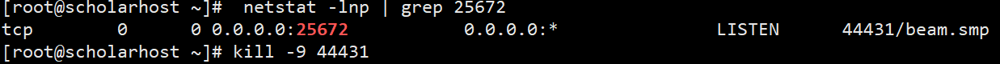

### RabbitMQ启用及设置

`rabbitmqctl help`命令可查看命令语法和更多命令。

`rabbitmq-plugins`可查看插件相关命令。

**启动：**

- `systemctl list-unit-files | grep rabbitmq-server`：查看rabbitmq-server服务是否是开机自启动；
- `/sbin/service rabbitmq-server start`：启动rabbitmq-server服务；（启动过程要一点时间）
  - `systemctl start rabbitmq-server.service`。
- `systemctl status rabbitmq-server.service`：查看rabbitmq-server服务状态；
- `systemctl stop rabbitmq-server.service`：停止rabbitmq-server服务。

**开启 web 管理插件：**

- 启动：`rabbitmq-plugins enable rabbitmq_management`；（执行成功会显示一行字符串，启用一次就行了）
- 访问：[RabbitMQ Management地址](http://192.168.137.129:15672/)；（15672端口），默认用户名密码都是`guest`，登陆不上是因为这个用户没有设置权限。
- 开放15672端口：（客户端想要实现通信还必须开放client通信端口(5672)）（集群端口25672）
  - `firewall-cmd --permanent --add-port=15672/tcp`：开放端口。
  - `firewall-cmd --reload`：重新载入，开放端口生效。
  - `firewall-cmd --query-port=15672/tcp`：查看端口是否开放。

**新建用户与权限设置：**

- `rabbitmqctl add_user admin 123456`：创建用户admin并设置密码为123456；
- `rabbitmqctl set_user_tags admin administrator`：设置用户角色；
- `rabbitmqctl set_permissions -p "/" admin ".*" ".*" ".*"`：设置admin用户权限（拥有`/`根目录下所有文件的读、写、配置权）；
  - 权限命令格式：`set_permissions [-p <vhostpath>] <user> <conf> <write> <read>`）。
- `rabbitmqctl list_users`：查询用户。

else：

- `rabbitmqctl stop_app`：关闭；
- `rabbitmqctl reset`：清除；
- `rabbitmqctl status`：查看服务状态；
- `rabbitmqctl start_app`：重启。

如果执行命令出现error：

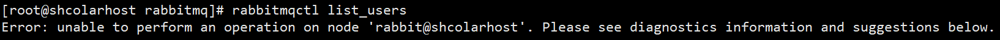

这是因为没有添加一条ip地址与自己主机名的映射记录，解决：

1. `sudo hostnamectl set-hostname scholarhost`可以修改主机名，启动后生效；`hostname`、`hostnamectl`查看主机名；
2. `vim /etc/hosts`：查看ip与`192.168.137.129`是否正确。


# 1.简单队列

```xml
<!-- https://mvnrepository.com/artifact/com.rabbitmq/amqp-client -->
<!-- rabbitmq 依赖客户端 -->
<dependency>
    <groupId>com.rabbitmq</groupId>
    <artifactId>amqp-client</artifactId>
    <version>5.13.1</version>
</dependency>
<!-- https://mvnrepository.com/artifact/commons-io/commons-io -->
<!-- 操作文件流 -->
<dependency>
    <groupId>commons-io</groupId>
    <artifactId>commons-io</artifactId>
    <version>2.11.0</version>
</dependency>
```

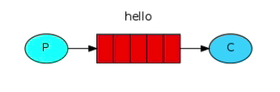

## 消息生产者：

```java
public class Producer {
    // 发消息
    public static void main(String[] args) throws IOException, TimeoutException {
        // 连接工厂
        ConnectionFactory factory = new ConnectionFactory();
        factory.setHost("192.168.137.129"); // rabbitmq所在主机
        factory.setPort(5672); // 访问端口
        //factory.setVirtualHost("/"); // 连接哪个虚拟主机
        factory.setUsername("admin"); // 访问虚拟主机的用户的用户名
        factory.setPassword("123456"); // 密码
        // 获取连接
        Connection connection = factory.newConnection();
        // 获取连接中的通道
        Channel channel = connection.createChannel();
        channel.queueDeclare("hello",false,false,false,null);
        String message = "Hello RabbitMQ";
        channel.basicPublish("","hello",null,message.getBytes(StandardCharsets.UTF_8));
        System.out.println("消息发送完毕...");
    }
}
```

`channel.queueDeclare("hello",false,false,false,null);`参数说明：

1. 参数1：通过绑定队列的名称，如果队列不存在会自动创建。
2. 参数2：队列是否持久化（但队列中的消息不会持久化），如果要消息也持久化，在消息发送时设置。
3. 参数3：是否独占队列，独占后其他通道不能绑定该队列，否则抛错。
4. 参数4：消费完队列中消息后是否自动删除队列。
5. 参数5：额外附加参数

`channel.basicPublish("","hello",null,message.getBytes(StandardCharsets.UTF_8));`参数说明：

1. 参数1：交换机名称，指定消息要发送到的交换机。
2. 参数2：往哪个队列发送消息，和queueDeclare()中的队列可以不一致。
3. 参数3：传递消息的额外设置，设置为`MessageProperties.PERSISTENT_TEXT_PLAIN`就可以把发送后的消息进行持久化。
4. 参数4：要传递的消息的具体内容，字节型。

## 消息消费者：

```java
public class Consumer {
    // 接收消息
    public static void main(String[] args) throws IOException, TimeoutException {
        ConnectionFactory factory = new ConnectionFactory();
        factory.setHost("192.168.137.129");
        factory.setUsername("admin");
        factory.setPassword("123456");
        Connection connection = factory.newConnection();
        Channel channel = connection.createChannel();
        // 这里消费者的要和生产者的参数对应上
        channel.queueDeclare("hello",false,false,false,null);
        // 声明 接收消息失败的回调
        DeliverCallback deliverCallback = (consumerTag, message) -> {
            System.out.println(new String(message.getBody()));
        };
        // 声明 取消消息接收的回调
        CancelCallback cancelCallback = consumerTag -> {
            System.out.println("消费消息被中断时触发");
        };
        // 消费队列
        // 参数说明：1.消费哪个队列 
        // 2.消费成功后是否自动应答，消费者自动向rabbitmq确认消息消费
        // 3.消费失败的回调方法
        // 4.消费者消费中断时的回调方法
        channel.basicConsume("hello",true, deliverCallback, cancelCallback);
    }
}
```

# 封装工具类

```java
public class RabbitmqConnectionUtil {
    private static ConnectionFactory connectionFactory;
    static {
        connectionFactory = new ConnectionFactory();
        connectionFactory.setHost("192.168.137.129"); // rabbitmq所在主机
        connectionFactory.setPort(5672); // 访问端口
        //connectionFactory.setVirtualHost("/"); // 连接哪个虚拟主机
        connectionFactory.setUsername("admin"); // 访问虚拟主机的用户的用户名
        connectionFactory.setPassword("123456"); // 密码
    }
    public static Connection getConnection(){
        try {

            return connectionFactory.newConnection();
        }catch (Exception e){
            e.printStackTrace();
        }
        return null;
    }
    public static void closeConnectionAndChanel(Channel channel, Connection connection){
        try {
            if (channel != null){
                channel.close();
            }
            if (channel != null){
                connection.close();
            }
        }catch (Exception e){
            e.printStackTrace();
        }
    }
}
```

# 2.工作队列

Work queues，也被称为Task queues、任务模型。用于解决“当消息处理比较耗时的时候，可能生产消息的速度会远远大于消息的消费速度，长此以往，消息就会堆积越来越多，无法及时处理消息”的问题。使用任务模型，可以让多个消费者绑定到一个队列，共同消费队列中的消息，并且队列中的消息一旦被消费，就会消失，因此任务不会被重复执行。[RabbitMQ tutorial - Work Queues — RabbitMQ](https://www.rabbitmq.com/tutorials/tutorial-two-java.html)

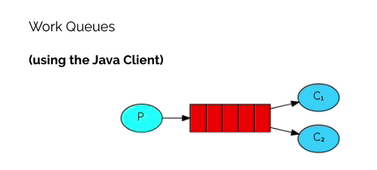

## 循环分发

生产者：

```java
public class Provider {
    public static void main(String[] args) throws IOException {
        Connection connection = RabbitmqConnectionUtil.getConnection();
        Channel channel = connection.createChannel();
        channel.queueDeclare("work",true,false,false,null);
        for (int i = 0; i <= 20; i++) {
            channel.basicPublish("","work",null,(i + ":hello work queues").getBytes(StandardCharsets.UTF_8));
        }
        RabbitmqConnectionUtil.closeConnectionAndChanel(channel,connection);
    }
}
```

消费者：

```java
public class Customer1 {
    public static void main(String[] args) throws IOException {
        Connection connection = RabbitmqConnectionUtil.getConnection();
        Channel channel = connection.createChannel();
        channel.queueDeclare("word",true,false,false,null);
        channel.basicConsume("work",true,new DefaultConsumer(channel){
            @Override
            public void handleDelivery(String consumerTag, Envelope envelope, AMQP.BasicProperties properties, byte[] body) throws IOException {
                System.out.println("消费者-1：" + new String(body));
            }
        });
    }
}
public class Customer2 {
    public static void main(String[] args) throws IOException {
        Connection connection = RabbitmqConnectionUtil.getConnection();
        Channel channel = connection.createChannel();
        channel.queueDeclare("word",true,false,false,null);
        channel.basicConsume("work",true,new DefaultConsumer(channel){
            @Override
            public void handleDelivery(String consumerTag, Envelope envelope, AMQP.BasicProperties properties, byte[] body) throws IOException {
                System.out.println("消费者-2：" + new String(body));
            }
        });
    }
}
```

如上测试代码，当有多个消费者消费同一队列的消息时，默认情况下，RabbitMQ是按顺序将每个消息发送给下一个使用者。平均而言，每个消费者都会收到相同数量的消息。这种分发消息的方式称为循环。

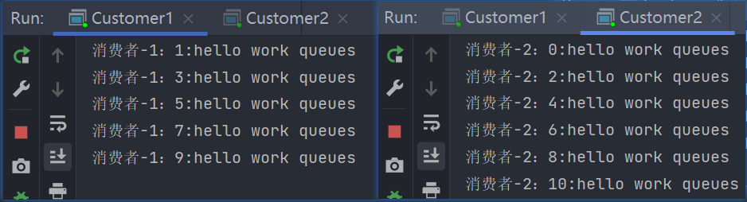

## 消息确认机制

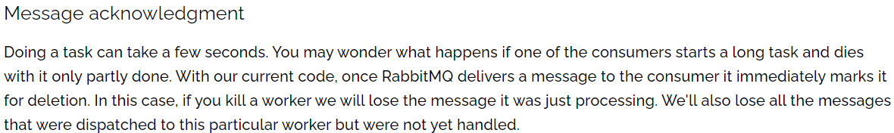

完成一项任务可能需要几秒钟。你可能想知道，如果其中一个消费者开始了一项长期任务，但只完成了一部分就死了，会发生什么情况。在我们当前的代码中，**一旦RabbitMQ将消息传递给使用者，它就会立即将其标记为删除**。在这种情况下，如果你杀死一个消息处理者，我们将丢失它刚刚处理的消息。我们还将丢失发送给该特定工作进程但尚未处理的所有消息。但我们不想失去任何任务。如果一个worker死了，我们希望把任务交给另一个worker。

当设置`channel.basicConsume("hello",false, deliverCallback, cancelCallback);`的第二个参数为false，就是关闭消息的自动确认，开启手动确认消息。然后再调用该方法，设置通道一次只能消费一个消息：`channel.basicQos(1);`，就能解决上面的问题。

```java
// 消费者1
public class Customer1 {
    public static void main(String[] args) throws IOException {
        Connection connection = RabbitmqConnectionUtil.getConnection();
        Channel channel = connection.createChannel();
        channel.basicQos(1);
        channel.queueDeclare("word",true,false,false,null);
        channel.basicConsume("work",false,new DefaultConsumer(channel){
            @Override
            public void handleDelivery(String consumerTag, Envelope envelope, AMQP.BasicProperties properties, byte[] body) throws IOException {
                try {
                    Thread.sleep(2000);
                } catch (InterruptedException e) {
                    e.printStackTrace();
                }
                System.out.println("消费者-1：" + new String(body));
                //手动确认消息 参数1：确认队列中的那个具体的消息 参数2：是否开启多个消息同时确认
                channel.basicAck(envelope.getDeliveryTag(),false);
            }
        });
    }
}
```

```java
消费者2
public class Customer2 {
    public static void main(String[] args) throws IOException {
        Connection connection = RabbitmqConnectionUtil.getConnection();
        Channel channel = connection.createChannel();
        channel.basicQos(1);
        channel.queueDeclare("word",true,false,false,null);
        channel.basicConsume("work",false,new DefaultConsumer(channel){
            @Override
            public void handleDelivery(String consumerTag, Envelope envelope, AMQP.BasicProperties properties, byte[] body) throws IOException {
                System.out.println("消费者-2：" + new String(body));
                channel.basicAck(envelope.getDeliveryTag(),false);
            }
        });
    }
}
```

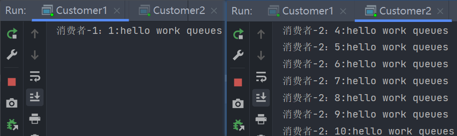

总结：

- 使用自动确认时，RabbitMQ默认为消费者平均分配消息，此时若某一个消费者消费消息的能力慢，但因为RabbitMQ已经为其分发了一定量的消息，分发的消息会从队列中标记为删除，此时该消费者宕机（而有一些消息还没有处理），此时就会导致消息的缺失；那有没有办法使其他能力强的消费者来处理消息，并且还能保留该消费者？
- 方法就是，使用手动应答，并且限制通道的消费能力。设置通道每次应答前只能传送一个消息，当消费者处理完消息后手动应答，告诉RabbitMQ我消费完这条消息了，可以处理下一个消息了，然后再送入下一个消息给消费者进行处理。这样就能保证，速度越快的消费者处理的消息越多，也就是所谓的“能者多劳”。

# 3.fanout

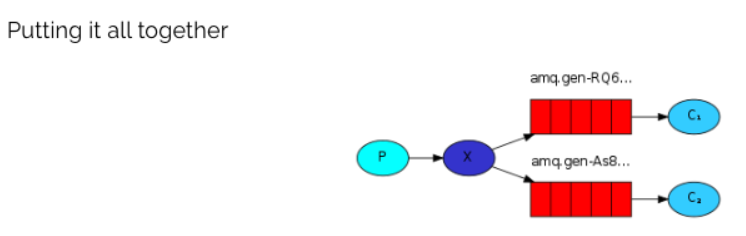

广播（扇出）模型 ：（绑定了fanout类型交换机的队列，都能接收到该交换机里的消息）

- 生产者发送的消息，只能发送到交换机，每个队列都要绑定到Exchange（交换机）。
- 可以有多个消费者，每个消费者有自己的queue（队列）。
- 交换机来决定要发给哪个队列，生产者无法决定。
- 交换机把消息发送给绑定过的所有队列。
- 队列的消费者都能拿到消息。实现一条消息被多个消费者消费。

## 实现

1.生产者

```java
public class Provider {
    public static void main(String[] args) throws IOException {
        Connection connection = RabbitmqConnectionUtil.getConnection();
        Channel channel = connection.createChannel();
        // 声明交换机 参数1：交换机名称 参数2：交换机类型 fanout-广播类型
        channel.exchangeDeclare("logs","fanout");
        // 发送消息
        channel.basicPublish("logs","",null,"fanout type message".getBytes(StandardCharsets.UTF_8));
        RabbitmqConnectionUtil.closeConnectionAndChanel(channel,connection);
    }
}
```

2.多个消费者

```java
public class Customer1 {
    public static void main(String[] args) throws IOException {
        Connection connection = RabbitmqConnectionUtil.getConnection();
        Channel channel = connection.createChannel();
        // 通道绑定交换机
        channel.exchangeDeclare("logs","fanout");
        // 临时队列
        String queueName = channel.queueDeclare().getQueue();
        // 通道绑定交换机和队列
        channel.queueBind(queueName, "logs", "");
        // 消费消息
        channel.basicConsume(queueName,true,new DefaultConsumer(channel){
            @Override
            public void handleDelivery(String consumerTag, Envelope envelope, AMQP.BasicProperties properties, byte[] body) throws IOException {
                System.out.println("消费者1："+ new String(body));
            }
        });
    }
}
```


广播模式的交换机，绑定该交换机后的消费者都能获取交换机的消息。

# 4.路由模型Routing

## 4.1Routing之订阅模型-Direct

在fanout模式中，一条消息，会被所有订阅的队列都消费。但是，在某些场景下，我们希望不同的消息被不同的队列消费。这时就要用到direct类型的Exchange。

在Direct模式下：

- 队列与交换机的绑定，不能是任意绑定了，而是要指定一个RoutingKey（路由key）。
- 消息的发送方在向 Exchange 发送消息时，也必须指定消息的 RoutingKey。
- Exchange不再把消息交给每一个绑定的队列，而是根据消息的Routing Key进行判断，只有队列的Routingkey与消息的 Routing key完全一致，才会接收到消息。

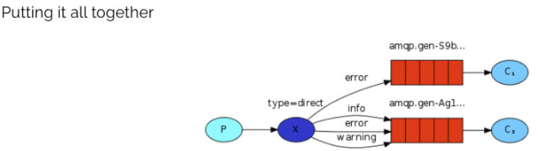

上述流程图说明：

- P：生产者，向 Exchange（type = direct）发送消息，发送消息时，会指定一个routing key。
- X：Exchange（交换机），接收生产者的消息，然后把消息递交给与routing key完全匹配的队列。
- C1：消费者，其所在队列指定了需要routing key 为 error 的消息。
- C2：消费者，其所在队列指定了需要routing key 为 info、error、warning 的消息。

**代码操作：**

生产者：

```java
public class Provider {
    public static void main(String[] args) throws IOException {
        Connection connection = RabbitmqConnectionUtil.getConnection();
        Channel channel = connection.createChannel();
        // 声明交换机
        channel.exchangeDeclare("logs_direct","direct");
        // 发送消息
        //String routingKey = "info";
        String routingKey = "error";
        String message = "这是direct模式发布的基于routing key：[";
        channel.basicPublish("logs_direct", routingKey, null, (message + routingKey + "]发送的消息。").getBytes(StandardCharsets.UTF_8));
        RabbitmqConnectionUtil.closeConnectionAndChanel(channel, connection);
    }
}
```

消费者：

```java
public class Customer1 {
    public static void main(String[] args) throws IOException {
        Connection connection = RabbitmqConnectionUtil.getConnection();
        Channel channel = connection.createChannel();
        // 声明交换机
        channel.exchangeDeclare("logs_direct","direct");
        // 创建临时队列并获取名
        String queue = channel.queueDeclare().getQueue();
        // 基于route key绑定队列和交换机
        channel.queueBind(queue,"logs_direct","error");
        // 消费消息
        channel.basicConsume(queue,true,new DefaultConsumer(channel){
            @Override
            public void handleDelivery(String consumerTag, Envelope envelope, AMQP.BasicProperties properties, byte[] body) throws IOException {
                System.out.println("消费者1：" + new String(body));
            }
        });
    }
}
```

```java
public class Customer2 {
    public static void main(String[] args) throws IOException {
        Connection connection = RabbitmqConnectionUtil.getConnection();
        Channel channel = connection.createChannel();
        channel.exchangeDeclare("logs_direct","direct");
        // 创建临时队列
        String queue = channel.queueDeclare().getQueue();
        // 临时队列与交换机绑定
        channel.queueBind(queue,"logs_direct","info");
        channel.queueBind(queue,"logs_direct","error");
        channel.queueBind(queue,"logs_direct","warning");
        // 消费消息
        channel.basicConsume(queue,true,new DefaultConsumer(channel){
            @Override
            public void handleDelivery(String consumerTag, Envelope envelope, AMQP.BasicProperties properties, byte[] body) throws IOException {
                System.out.println("消费者2：" + new String(body));
            }
        });
    }
}
```

消费者的临时队列与路由绑定了，才能接收到该路由发送的消息。

## 4.2Routing之订阅模型-Topic

Topic类型的Exchange与Direct相比，都是可以根据RoutingKey把消息路由到不同的队列。只不过Topic类型Exchange可以让队列在绑定Routing key的时候使用通配符！这种模型Routingkey 一般都是由一个或多个单词组成，多个单词之间以`.`分割，例如：` item.insert`。 

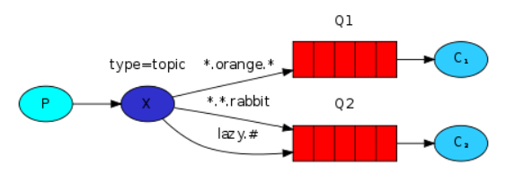

通配符：

```txt
* (star) can substitute for exactly one word.    -- 匹配不多不少恰好1个词
# (hash) can substitute for zero or more words.  -- 匹配零个、一个或多个词
```
```txt
audit.#    -- 匹配audit、audit.irs 、或者audit.irs.corporate等
audit.*    -- 只能匹配 audit.irs
```

生产者：

```java
public class Provider {
    public static void main(String[] args) throws IOException {
        Connection connection = RabbitmqConnectionUtil.getConnection();
        Channel channel = connection.createChannel();
        // 声明交换机
        channel.exchangeDeclare("logs_topic","topic");
        // 发送消息
        // String routeKey = "user.save";
        String routeKey = "user";
        String message = "这是topic动态路由模型发布,route key：[";
        channel.basicPublish("logs_topic", routeKey, null, (message + routeKey + "]发送的消息。").getBytes(StandardCharsets.UTF_8));
        RabbitmqConnectionUtil.closeConnectionAndChanel(channel, connection);
    }
}
```

消费者：

```java
public class Customer1 {
    public static void main(String[] args) throws IOException {
        Connection connection = RabbitmqConnectionUtil.getConnection();
        Channel channel = connection.createChannel();
        // 声明交换机
        channel.exchangeDeclare("logs_topic","topic");
        // 创建临时队列并获取名
        String queue = channel.queueDeclare().getQueue();
        // 基于route key绑定队列和交换机
        channel.queueBind(queue,"logs_topic","user.*");
        // 消费消息
        channel.basicConsume(queue,true,new DefaultConsumer(channel){
            @Override
            public void handleDelivery(String consumerTag, Envelope envelope, AMQP.BasicProperties properties, byte[] body) throws IOException {
                System.out.println("消费者1：" + new String(body));
            }
        });
    }
}
```

```java
public class Customer2 {
    public static void main(String[] args) throws IOException {
        Connection connection = RabbitmqConnectionUtil.getConnection();
        Channel channel = connection.createChannel();
        // 声明交换机
        channel.exchangeDeclare("logs_topic","topic");
        // 创建临时队列并获取名
        String queue = channel.queueDeclare().getQueue();
        // 基于route key绑定队列和交换机
        channel.queueBind(queue,"logs_topic","user.#");
        // 消费消息
        channel.basicConsume(queue,true,new DefaultConsumer(channel){
            @Override
            public void handleDelivery(String consumerTag, Envelope envelope, AMQP.BasicProperties properties, byte[] body) throws IOException {
                System.out.println("消费者1：" + new String(body));
            }
        });
    }
}
```

# SpringBoot整合

## 整合

场景启动器：

```xml
<dependency>
	<groupId>org.springframework.boot</groupId>
	<artifactId>spring-boot-starter-amqp</artifactId>
</dependency>
```

自动配置：

- 会自动配置好RabbitTemplate，用来操作RabbitMQ的。

yaml配置：

```yaml
spring:
  application:
    name: springboot_rabbitmq
  rabbitmq:
    host: 192.168.137.129
    port: 5672
    username: admin
    password: 123456
    virtual-host: 
```

测试：

生产者：

```java
@Autowired
RabbitTemplate rabbitTemplate;
@Test
void test(){
    rabbitTemplate.convertAndSend("hello","hello springboot--rabbitmq");
}
```

消费者：

```java
@Component
@RabbitListener(queuesToDeclare = @Queue(value = "hello", durable = "false",autoDelete = "true"))
public class Customer {
    @RabbitHandler
    public void resp(String message){
        System.out.println(message);
    }
}
```

## 操作

通过自动配置好的`RabbitTemplate rabbitTemplate`进行操作。

### **简单队列：**

```java
@Test 
void test1(){ // 生产者
    rabbitTemplate.convertAndSend("hello","hello springboot--rabbitmq");
}
```

```java
@Component // 消费者
@RabbitListener(queuesToDeclare = @Queue(value = "hello", durable = "false",autoDelete = "true"))
public class HelloCustomer {
    @RabbitHandler
    public void resp(String message){
            System.out.println(message);
        }
}
```

### **工作队列：**

```java
@Test
void testWork(){
    for (int i = 0; i < 10; i++) {
        rabbitTemplate.convertAndSend("work","work 模型");
    }
}
```

```java
@Component
public class WorkCustomer {

    @RabbitListener(queuesToDeclare = @Queue("work"))
    public void customer1(String message){
        System.out.println("message1：" + message);
    }
    @RabbitListener(queuesToDeclare = @Queue("work"))
    public void customer2(String message){
        System.out.println("message2：" + message);
    }
}
```

如果需要实现能者多劳的效果，需要额外的配置。

### Fanout：

```java
@Component
public class FanoutCustomer {
    @RabbitListener(bindings = {@QueueBinding(value = @Queue,exchange = @Exchange(value = "sb_fanout",type = "fanout"))})
    public void receive1(String message){
        System.out.println("receive1：" + message);
    }
    @RabbitListener(bindings = {@QueueBinding(value = @Queue,exchange = @Exchange(value = "sb_fanout",type = "fanout"))})
    public void receive2(String message){
        System.out.println("receive2：" + message);
    }
}
```

```java
@Test
void testFanout(){ // 生产者
    rabbitTemplate.convertAndSend("sb_fanout","","fanout的模型 message");
}
```

### Routing：

**routing-direct：**

```java
@Test
void testRoutingDirect(){ // 生产者
    rabbitTemplate.convertAndSend("routing-direct","info","routing-direct message");
    rabbitTemplate.convertAndSend("routing-direct","error","routing-direct message");
}
```

```java
@Component
public class RouteCustomer {

    @RabbitListener(bindings =
            {@QueueBinding(
                    value = @Queue,
                    exchange = @Exchange(value = "routing-direct",type = "direct"),key = {"info","warn","error"}),
            })
    public void receive1(String message){
        System.out.println("消费者1:路由到info warn error 的消息" + message);
    }
    @RabbitListener(bindings =
            {@QueueBinding(
                    value = @Queue,
                    exchange = @Exchange(value = "routing-direct",type = "direct"),key = {"error"}),
            })
    public void receive2(String message){
        System.out.println("消费者2:路由到 error 的消息" + message);
    }
}
```

**routing-topic：**

```java
// topic 动态路由 订阅模式
@Test
void testRoutingTopic(){ // 生产者
    rabbitTemplate.convertAndSend("routing-topic","user.save","routing-optic message: user.save");
    rabbitTemplate.convertAndSend("routing-topic","order","routing-optic message: order");
}
```

```java
@Component
public class TopicCustomer {
    @RabbitListener(bindings =
            {@QueueBinding(
                    value = @Queue,
                    exchange = @Exchange(value = "routing-topic",type = "topic"),key = {"user.save","user.*"}),
            })
    public void receive1(String message){
        System.out.println("消费者1:路由到 user.* user.save 的消息" + message);
    }
    @RabbitListener(bindings =
            {@QueueBinding(
                    value = @Queue,
                    exchange = @Exchange(value = "routing-topic",type = "topic"),key = {"order.#","produce.#","user.*"}),
            })
    public void receive2(String message){
        System.out.println("消费者2:路由到 order.# produce.# user.* 的消息" + message);
    }
}
```

# 应用场景

## 异步处理

场景说明：用户注册后，需要发注册邮件和注册短信,传统的做法有两种 1.串行的方式 2.并行的方式。

串行方式: 将注册信息写入数据库后，发送注册邮件,再发送注册短信，以上三个任务全部完成后才返回给客户端。 这有一个问题是：邮件、短信并不是必须的，它只是一个通知，而这种做法会让客户端等待没有必要等待的东西。

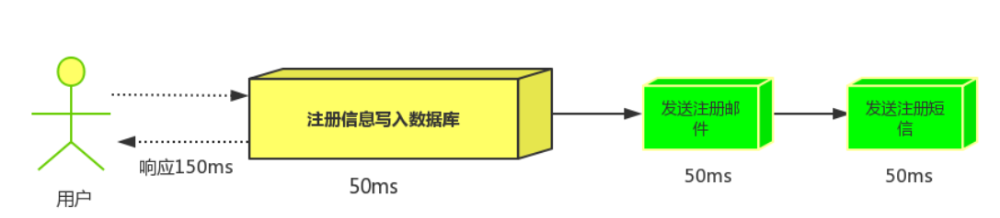

并行方式: 将注册信息写入数据库后，在发送邮件的同时发送短信，这三个任务完成后响应信息给客户端，并行的方式能提高处理的时间。

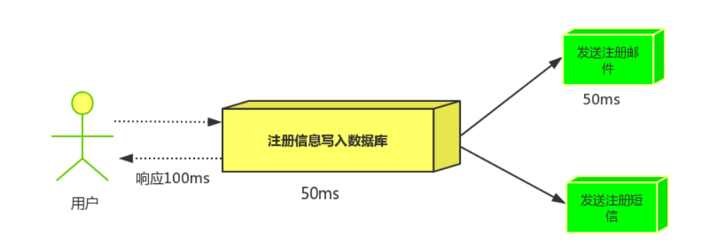

消息队列：假设三个业务节点分别使用50ms，串行方式使用时间150ms，并行使用时间100ms。虽然并行已经提高的处理时间，但是邮件和短信对我正常的使用网站没有任何影响，客户端没有必要等着其发送完成才显示注册成功，应该是写入数据库后就返回。

当引入消息队列后，把发送邮件、短信不是必须的业务逻辑进行异步处理 。

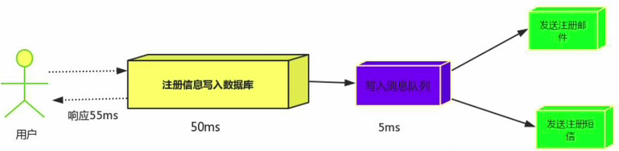

由此可以看出，引入消息队列后，用户的响应时间就等于写入数据库的时间+写入消息队列的时间(可以忽略不计)，引入消息队列后处理后，响应时间是串行的3倍,是并行的2倍。

## 应用解耦

场景：双11是购物狂节，用户下单后，订单系统需要通知库存系统，传统的做法就是订单系统调用库存系统的接口。

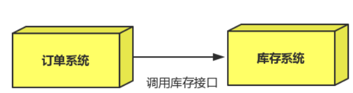

这种做法有一个缺点：当库存系统出现故障时，订单就会失败。 订单系统和库存系统高耦合，因此可以引入消息队列 。

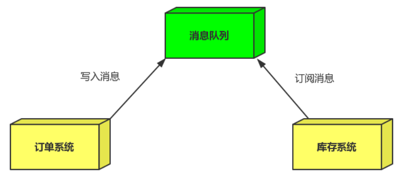

- 订单系统：用户下单后，订单系统完成持久化处理并将消息写入消息队列，返回用户订单下单成功。

- 库存系统：订阅下单的消息，获取下单消息，进行库操作。就算库存系统出现故障，消息队列也能保证消息的可靠投递，
  不会导致消息丢失。

## 流量削峰

场景: 秒杀活动，一般会因为流量过大，导致应用挂掉，为了解决这个问题，一般在应用前端加入消息队列。  

作用:

1. 可以控制活动人数，超过此一定阀值的订单直接丢弃 。
2. 可以缓解短时间的高流量而导致应用被压垮（应用程序将按自己的最大处理能力获取订单）。

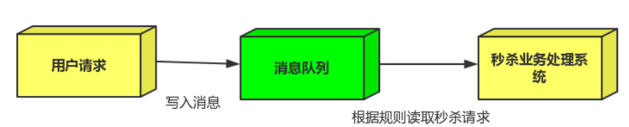

1. 服务器收到用户的请求之后，首先将请求写入消息队列，当加入消息队列的超过最大值时，则直接抛弃用户请求或跳转到错误页面。
2. 秒杀业务根据消息队列中的请求信息，再做后续处理。

# RabbitMQ的集群
