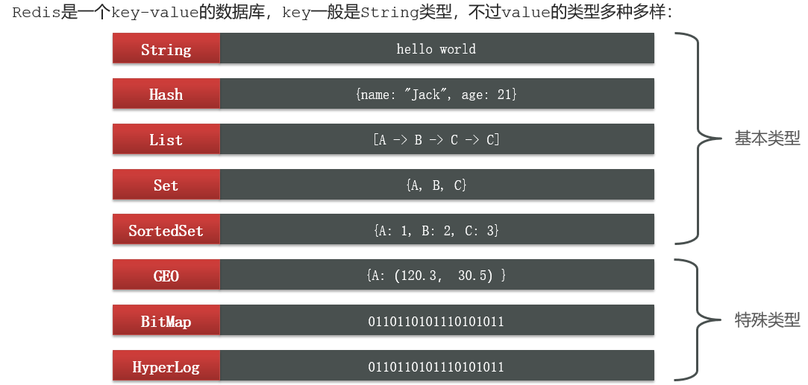
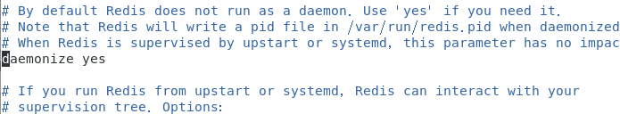
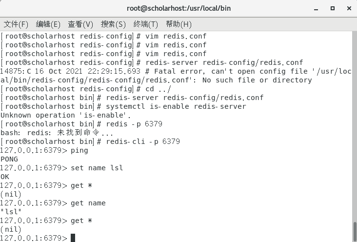
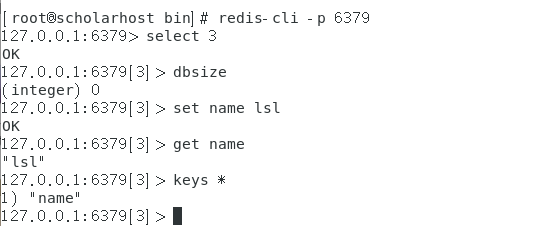
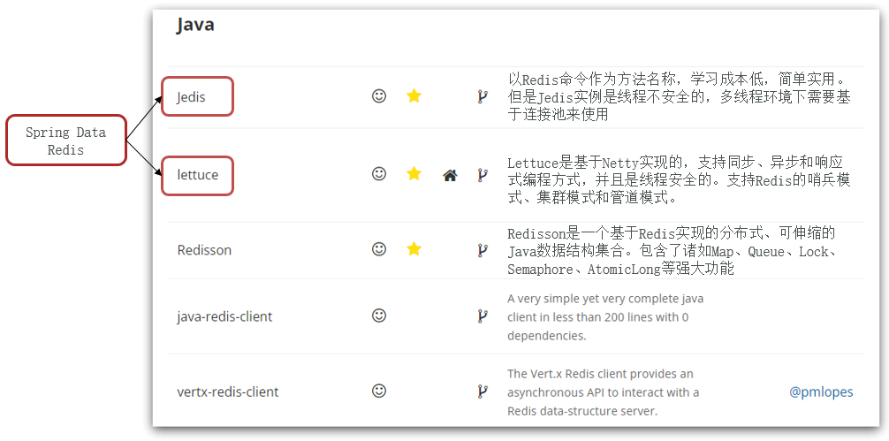
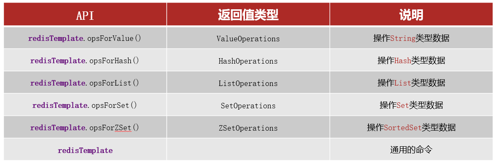

# Redis

Redis：REmote DIctionary Server（远程字典服务）

它是完全开源免费的，用C语言编写的，遵守BSD协议，是一个高性能的（key/value）**分布式内存数据库**，基于内存运行并支持持久化的NoSQL数据库，被称为数据结构数据库。

**Redis与其他key-value缓存产品有以下三个特点：**

1. Redis支持数据的持久化，可以将内存中的数据保持在磁盘中，重启的时候可以再次加载进行使用；
2. Redis不仅仅支持简单的key-value类型的数据，同时还提供list，set，zset，hash等数据结构的存储；
3. Redis支持数据的备份，即master-slave模式的数据备份。

**能做什么？**

1. 内存存储和持久化：redis支持异步将内存中的数据写到硬盘上，同时不影响继续服务；
2. 取最新N个数据的操作，如：可以将最新的10条评论的ID放在Redis的List集合里面；
3. 模拟类似于HttpSession这种需要设定过期时间的功能；
4. 发布、订阅消息系统；
5. 定时器、计数器等。

**Redis的特征：**

1. 键值（key-value）型，value支持多种不同数据结构，功能丰富。
2. 单线程，每个命令具备原子性。
3. 低延迟，速度快（基于内存、IO多路复用、良好的编码）。
4. 支持数据持久化。
5. 支持主从集群、分片集群。
6. 支持多语言客户端。

**Redis的数据类型：**

1. 五大基本数据类型：String、List、Set、Hash、Sorted set（也称为Zset，其底层有两种实现方式：一种是ziplist压缩表，一种是zset(dict、skiplist)）。
2. 三种特殊数据类型：geo、hyperloglog、bitmap。




# 下载安装

http://redis.io/、http://www.redis.cn/。

## Windows

1. 安装：下载（https://github.com/microsoftarchive/redis/releases/tag/win-3.2.100）并解压；
2. 开启：双击redis-server.exe；
3. redis客户端连接：双击打开redis-cli.exe连接，使用`ping`命令测试出现PONG则连接成功；（设置key-value：`set name xxx`、根据key获取值：`get name`）；
4. Windows下使用很简单，但Redis官方推荐使用Linux进行开发。

## Linux

### 安装步骤如下

1. 下载安装解压redis-6.2.5.tar.gz，`/opt`目录。

2. 需要升级GCC到5.3版本以上，查看gcc版本`gcc -v`，升级步骤如下，依次执行：

   - `yum -y install centos-release-scl`；
   - `yum -y install devtoolset-9-gcc devtoolset-9-gcc-c++ devtoolset-9-binutils`；
   - `scl enable devtoolset-9 bash`（临时安装）或`source /opt/rh/devtoolset-9/enable /etc/profile`（长期）。

3. 进入解压后的`redis-6.2.5`目录，执行`make`命令编译Redis，编译完成后进入src目录，执行`make install`进行安装（Linux的默认安装路径在`/usr/local/bin`目录下，不指定安装路径的都是安装到该目录）。

5. 复制`redis-6.2.5`目录中的`redis.conf`配置文件到默认安装路径下（新建一个redis-config目录，拷贝）。

6. Redis不是默认后台启动，`vim /usr/local/bin/redis-config/redis.conf `，修改daemonize为yes，如下：

   

7. 在安装目录（`/usr/local/bin`）下执行该命令：`redis-server redis-config/redis.conf`，使用相关配置开启redis服务，命令界面无信息显示则安装成功。

8. `redis-cli -p 6379`：执行该命令进入Redis命令行客户端，在里面执行`shutdown`命令是关闭Redis服务，`exit`是退出Redis命令行：

   

9. 可启动多个redis服务，配置好多个配置文件再依次按配置文件启动就好。

安装目录下的`redis-benchmark`是一个压力测试工具：`redis-benchmark -h 127.0.0.1 -p 6379 -c 100 -n 100000`。

### 关于命令行客户端

1. 进入命令行客户端的指令：`redis-cli [options] [commonds]`。（`redis-cli -p 6379`）
   1. 常见options：
      1. `-h 127.0.0.1`：指定要连接的redis节点的IP地址，默认是127.0.0.1。
      2. `-p 6379`：指定要连接的redis节点的端口，默认是6379。
      3. `-a 123321`：指定redis的访问密码 。
   2. commonds就是Redis的操作命令，例如`ping`：与redis服务端做心跳测试，服务端正常会返回`pong`。
2. 进入命令行客户端，可以使用`auth 密码`指令来指定密码。

### 关于启动的三种方式

1. 任意目录下执行`redis-server`，这种启动属于前台启动，会阻塞整个会话窗口，窗口关闭或者按下`CTRL + C`则Redis停止。不推荐使用。

2. 通过配置文件启动`redis-server 配置文件`；停止服务：`redis-cli shutdown`（如果设置了密码：`redis-cli -u 密码 shutdown`）。

3. 设置开机自启动：

   1. 新建一个系统服务文件：`vi /etc/systemd/system/redis.service`。

      ```conf
      [Unit]
      Description=redis-server
      After=network.target
      
      [Service]
      Type=forking
      ExecStart=/usr/local/bin/redis-server /usr/local/src/redis-6.2.6/redis.conf
      PrivateTmp=true
      
      [Install]
      WantedBy=multi-user.target
      ```

   2. 重新载入系统服务：`systemctl daemon-reload`。

   3. 然后就可以使用systemctl指令来控制redis服务了。
   
      ```sh
      # 启动
      systemctl start redis
      # 停止
      systemctl stop redis
      # 重启
      systemctl restart redis
      # 查看状态
      systemctl status redis
      # 开机自启
      systemctl enable redis
      ```

### 关于卸载redis

1. 首先查看redis-server是否启动：`ps aux | grep redis`。
2. 关闭这些进程：`kill -9 进程号`。
3. 删除redis相应的文件夹就可以了。

### 关于Redis的图形化界面：

（安装包：https://github.com/lework/RedisDesktopManager-Windows/releases）

解压缩再运行安装程序即可。（需要修改Redis的配置，把`bind 127.0.0.1`修改为`bind 0.0.0.0`，或者直接注释掉）

# 通用指令

切换数据库、查看数据库大小、存入键值对、查看键、查看值等，如下：



1. `flushdb`：清空当前数据库。
2. `flushall`：清空所有数据库内的数据。
3. `exists key`：判断当前key是否存在。
4. `keys *`：显示所有的key，keys操作不建议在生产环境使用。
5. `move key db`：移动到指定的数据库。
6. `expire key 10`：设置指定过期时间，单位s，到期自动清除key。
7. `ttl key`：查看当前key剩余时间。
8. `type key`：查看当前key的类型。
9. 可去官网查看命令。

Redis是单线程的，Redis的性能瓶颈在于机器的内存和网络带宽而不是CPU，可以使用单线程实现，所以就使用单线程了。

为什么Redis那么快？读写操作的速度是CPU>内存>硬盘，多线程时会切换上下文，这个比较耗时，当单个CPU实现读写操作时就节省了切换的时间。

# 数据类型和操作

## 五大数据类型

### String

String类型，也就是字符串类型，是Redis中最简单的存储类型，其value是字符串，不过根据字符串的格式不同，又可以分为3类：普通字符串、数值型字符串（整型数据的字符、浮点型数据的字符）。

**值的设置（创建）：**

1. 设置单个key-value：
   - `set key value`：设置key-value。
   - `getset key value`：先获取当前key的值再设置（如果不存在则返回空并设置，如果存在则返回原值并设置）。
   - `setnx key value`：set if not exist，如果key不存在就设置。（分布式锁中常用）。
2. 设置多个key-value：
   - `mset key1 value1 key2 value2 ...`：一次设置多个key-value。
   - `msetnx k1 v1 k2 v2 k3 v3 ...`：对多个进行设置，原子性操作，要么都设置成功，要么都失败。
3. 设置key-value值及过期时间：（单位s）
   - `setex key time value`：set with expire，设置key的值和它的过期时间，如果不存在会先创建key。
4. 替换值：（位置下标从01开始）
   - `setrange key 1 "替换值"`：从某位置开始替换字符串（包括指定位置），不存在的key-value将会当作空白字符。

**值的获取：**

- `get key`；
- `mget k1 k2 k3 ...`：一次获取多个值。
- `getrange key 0 3`：获取指定区间的字符串，是闭区间。
- `getrange key 0 -1`：查看当前key，和`get key`的作用一样。

**操作值：**

- `append key "xxx"`：在value值末尾追加字符，如果key不存在则相当于`set key xxx`。
- `strlen key`：查看String类型的key对应值的字符长度。

**对数值型字符的运算操作：**increment

1. 加：
   1. `incr key`：加一操作。
   2. `incrby key 10`：以指定步长增加。
2. 减：
   - `decr key`：自减。
   - `decrby key 10`：指定步长来自减。

**对于对象，可以这样来创建String的key-value，例如：**

1. `mset user:1:name lsl user:1:age 21 ...`：用多个key来设置，key命名体现对象的结构。
2. `set user:1 {name:lsl,age:21, ...}`：对象的结构设置成json格式字符串。

String类型的应用：计数、对象缓存等。


### List

列表，可以实现栈、队列、阻塞队列，基本所有的list命令都以l开头。

**增加：**

1. `lpush list value`：插入值到列表list头部。
2. `rpush list value`：插入值到列表list的尾部。
3. `linsert list [选项] value1 newvalue`：在列表list中某个值前面或后面插入一个值；
  - 选项为before或after；
  - 如果list中存在多个value1，则在下标最小的前面插入。

**获取：**

1. `lindex list index`：根据index下标取值。
2. `lrange list 0 -1`：获取当前list的所有的值；`lrange list 0 3`：闭区间，获取闭区间内的值。
3. `llen list`：获取列表list的长度。

**移除：**

1. `lpop list`、`rpop list`：移除list的第一个或最后一个值，可以在后面指定移除的数量来移除多个。
2. `rpoplpush newlist oldlist`：移除一个列表的最后一个元素到一个新的列表，
3. `lrem list count value`：从指定value开始移除（包括指定的value），count是移除的数量。
4. `ltrim mylist 1 2`：通过下标截断mylist，最后只剩下截取的元素，这里是是1、2下标的元素。

**更改：**

- `lset list 0 value`：更改list的指定下标的value，列表或value不存在会报错。


### Set

set中值不能重复，无序。

增加：

- `sadd myset value`：往myset中存入一个或多个值。

获取：

1. `smembers myset`：查看myset所有的值。
2. `srandmember myset [count]`：随机获取某个值，可在后面指定获取个数。
3. `sismember myset value`：某个值是不是myset的成员。
4. `scard myset`：获取set集合中值的个数。

移除：

- `srem myset value`：移除一个或多个值，不是原子性操作，只要指定的value中有一个存在myset就可以移除成功。
- `spop myset [count]`：随机移除值，可指定移除数量。
- `smove myset targetset value `：移动myset中的value到targetset，如果targetset不存在会自动创建。

集合性操作：

- `sdiff set1 set2`：获取差集，返回的是set1中的不同于set2值；
- `sunion set1 set2`：获取并集；
- `sinter set1 set2`：获取交集；

共同关注、共同爱好、二度好友、推荐好友，（六度分割理论）。

### Hash

Hash类型，也叫散列，其value是一个无序字典，类似于Java中的HashMap结构。Hash类型的key的value值类似map集合。这种类型的数据是：key-Map。

1. 创建：
   - `hset myhash field value  filed value ... `和`hmset myhash f1 v1 f2 v2 ...`。
2. 获取属性值：
   - `hget myhash field `：获取myhash 的值中的某个属性值。
   - `hmget myhash f1 f2 f3 ...`：获取myhash 的值中的属性f1、f2、f3的值。
   - `hgetall myhash `：获取该myhash的值中的所有属性和属性值。
3. 删除：
   - `hdel myhash field `：删除myhash 的值中的某个属性和属性值。
4. 获取：
   - `hlen myhash`：获取hash表的字段数量。
   - `hkeys myhash`：获取myhash的值中所有的键。
   - `hvals myhash`：获取hash表中value中所有的value。
5. 判断：
   - `hexists myhash filed`：myhash中指定字段是否存在。
6. 其它：
   - `hincrby myhash field 1`：自增。
   - `hdecr myhash field 1`：自减。
   - hsetex、hsetnx，和string使用类似。

可以用于存储用户信息等经常变动的数据。hash更适合对象数据的存储，string更适合的是字符串数据的存储。

### Zset

在set的基础上增加一个值用于排序，相对于有序的set。

- `zadd myzset 1 one ...`：添加一个或多个值，1就是score，用来排序；
- `zrangebyscore myzset -inf +inf [withscores]`：在负无穷到正无穷根据升序排序，后面的可选；
- `zrevrange myzset 0 -1`：降序排列；
- `zrem myzset value`：移除；
- `zrange myzset xx xx`：获取区间的子串，闭区间；
- `zcard myzset`：获取长度（集合内元素个数）；
- `zcount myzset min max`：统计区间内元素个数；

应用：set排序、班级成绩表、工资表、排行榜、重要消息提权等。

## 三种特殊数据类型

### geospatial地理位置

定位、距离计算、附件的人。

- `geoadd key 经度 维度 描述名称 经度 维度 描述名称...`：添加一个或多个地理位置信息，两极无法直接添加（有效经度是-180到180，维度是-85.05112878到85.05112878）；开发中一般通过java查询导入地理位置信息；
- `geopos key 名称 名称 ... `：获取地理位置经纬度信息；
- `geodist key 地点名称1 地点名称2 单位`：获取两地直线距离，单位有km、m、mi（英1里）、ft（英尺）；
- `georadius key 经度 维度 半径 单位 [withdist|withcoord|withhash] [count number]`：指定参考中心经纬度信息，找出半径内的地理位置信息，后面可以选择是否显示半径内地点距离中心的距离、经纬度、哈希值，还可以限定查询数量；
- `georadiusbymember key 地点名称 radius 单位`：以存入的元素为参考中心，找出位于指定范围内的元素；
- `geohash china:city beijing xian ...`：使用Geohash位置52点整数编码，使用Geohash位置52点整数编码，将二维经纬度转换为一维的字符串；
- 底层基于zset实现，可以使用`zrem`来进行删除操作，`zrem china:city beijing`。

### hyperloglog

基数：不重复的元素，可以接受误差。Redis Hyperloglog 基数统计的算法。

应用场景：例如传统的网页的UV（一个人访问一个网站多次，但还是算一个人），set来保存用户数据，然后统计set中元素数量来判断，此种方式会保存大量的用户id，不友好；使用Hyperloglog ，占用的内存是固定的，2^64不同的元素的技术，只需要12kb内存，有0.81的错误率。

- `pfadd key v1 v2 v3 v4 v5 ...`：添加基数；
- `pfcount key`：统计基数数量；
- `pfmerge key key1 key2`：合并技术到key，会去重；
- 允许容错就可以使用，如果不允许就使用set或自己的数据类型。

### bitmaps

位存储，应用场景例如统计用户活跃不活跃、是否在线、是否打卡，两个状态的都可以使用bitmaps。

- `setbit key 1 1`、`setbit key 2 1`、`setbit key 3 1`：设置；
- `getbit key 3 `：获取；
- `bitcount key [start, end]`：统计为真（1）的数据。

# Redis客户端



## Jedis

Jedis是redis官方推荐的Java连接开发工具，实现使用Java来操作redis中间件。

**Jedis的使用：**

1、导入依赖：

```xml
<!-- https://mvnrepository.com/artifact/redis.clients/jedis -->
<dependency>
    <groupId>redis.clients</groupId>
    <artifactId>jedis</artifactId>
    <version>3.7.0</version>
</dependency>
<!-- 获取json字符的工具 -->
<!-- https://mvnrepository.com/artifact/com.alibaba/fastjson -->
<dependency>
    <groupId>com.alibaba</groupId>
    <artifactId>fastjson</artifactId>
    <version>1.2.78</version>
</dependency>
```

2、连接并测试：（方法名与各个数据类型的操作指令名一样）

```java
public class JedisTest {
    public static void main(String[] args) {
        // 建立连接
        Jedis jedis = new Jedis("192.168.137.130",6379);
        // 验证密码
        jedis.auth("123456");
        System.out.println(jedis.ping("连接成功"));
        // 使用fastjson来获取json字符串
        JSONObject jb = new JSONObject();
        jb.put("hello", "word");
        jb.put("name", "lsl");
        String json = jb.toJSONString();
        // 开启事务
        Transaction multi = jedis.multi();
        try {
            multi.set("jstr", json);
            multi.set("name","测试");
            multi.exec();
        }catch (Exception e) {
            multi.discard();
            e.printStackTrace();
        }finally {
            String name = jedis.get("jstr");
            System.out.println(name);
            jedis.close();
        }
    }
}
```

**使用Jedis连接池：**

Jedis本身是线程不安全的，并且频繁的创建和销毁连接会有性能损耗，因此我们推荐大家使用Jedis连接池代替Jedis的直连方式。

```java
public class JedisPoolTest {
    private static final JedisPool JEDIS_POOL;
    static {
        JedisPoolConfig jedisPoolConfig = new JedisPoolConfig();
        // 最大连接
        jedisPoolConfig.setMaxTotal(8);
        // 最大空闲连接
        jedisPoolConfig.setMaxIdle(8);
        // 最小空闲连接
        jedisPoolConfig.setMinIdle(0);
        // 最长等待时间
        jedisPoolConfig.setMaxWaitMillis(200);
        // 创建线程池
        JEDIS_POOL = new JedisPool(jedisPoolConfig,"192.168.137.130",6379);
    }
    public static Jedis getJedis(){
        return JEDIS_POOL.getResource();
    }
    // 测试
    public static void main(String[] args) {
        Jedis jedis = JedisPoolTest.getJedis();
        // 验证密码
        jedis.auth("123456");
        System.out.println(jedis.ping("连接成功"));
    }
}
```

## RedisTemplate

### 概述

SpringData是Spring中数据操作的模块，包含对各种数据库的集成，其中对Redis的集成模块就叫做SpringDataRedis，官网地址：https://spring.io/projects/spring-data-redis。SpringDataRedis的内容如下：

1. 提供了对不同Redis开发工具的整合（Lettuce和Jedis）。
2. 提供了RedisTemplate统一API来操作Redis。
3. 支持Redis的发布订阅模型。
4. 支持Redis哨兵和Redis集群。
5. 支持基于Lettuce的响应式编程。
6. 支持基于JDK、JSON、字符串、Spring对象的数据序列化及反序列化。
7. 支持基于Redis的JDKCollection实现。

SpringDataRedis中提供了RedisTemplate工具类，其中封装了各种对Redis的操作。并且将不同数据类型的操作API封装到了不同的类型中，如下：



### 使用

**在springboot中使用的操作：**springboot中提供了对SpringDataRedis的支持，使用操作如下：（springboot2版本之后，Jedis改为Lettuce；二者有何区别？）

1、场景启用：

```xml
<!-- Redis-->
<dependency>
    <groupId>org.springframework.boot</groupId>
    <artifactId>spring-boot-starter-data-redis</artifactId>
</dependency>
<!-- 连接池依赖-->
<dependency>
    <groupId>org.apache.commons</groupId>
    <artifactId>commons-pool2</artifactId>
</dependency>
```

2、配置redis所在地址、端口：

```yaml
spring:
  redis:
    host: 192.168.137.129
    port: 6379
    password: 123456
    letture:
    	pool:
    		max-active: 8  # 最大连接
    		max-idle: 8    # 最大空闲连接    
    		min-idle: 0    # 最小空闲连接    
    		max-wait: 100  # 连接最长等待时间 ms
```

3、注入redisTemplate。测试如下：

```java
@SpringBootTest
class RedisSpringbootApplicationTests {
    @Autowired
    private RedisTemplate redisTemplate;
    @Test
    void contextLoads() {
        // 七种操作：redisTemplate.opsForXxx 操作Xxx数据类型
        // opsForValue(); String
        // opsForList(); List
        // opsForSet(); Set
        // opsForZSet(); ZSet
        // opsForGeo(); Geo
        // opsForHash(); Hash
        // opsForHyperLogLog(); HyperLogLog

        // 示例：操作字符串 
        ValueOperations ops = redisTemplate.opsForValue();

        // 默认的序列化方式是JDK序列化 key在Linux-redis里会转变为带转义字符的 "\xac\xed\x00\x05t\x00\x05mykey"
        ops.set("mykey","lsl");
        ops.set("user:33",new User("lsl",33));
        System.out.println(ops.get("mykey"));
        System.out.println(ops.get("hello"));
		
        RedisConnection connection = redisTemplate.getConnectionFactory().getConnection();
        connection.flushDb();
    }
}
```

数据不经序列化不能直接添加到Redis，序列化可以通过json依赖中的ObjectMapper或实现Serializable接口，不过添加进去的数据仍然是带转义字符的`"\xac\xed\x00\x05t\x00\x04user"`类型的，因为写入Redis前会把Object序列化为字节形式，默认是采用JDK序列化（可读性差、占内存）。

### 序列化

**序列化的两种方式：**

**1、自定义redisTemplate序列化方式：**固定的模板如下，几乎包括所有场景（记得在springboot主配置类开启注解扫描）

```java
@Configuration
public class RedisConfig {
    @Bean
    public RedisTemplate<String, Object> redisTemplate(RedisConnectionFactory factory) {
        // 创建template
        RedisTemplate<String,Object> template = new RedisTemplate<>();
        // 设置连接工厂
        template.setConnectionFactory(factory);
        // 设置序列化工具
        Jackson2JsonRedisSerializer jackson2JsonRedisSerializer = new Jackson2JsonRedisSerializer(Object.class);
        ObjectMapper om = new ObjectMapper();
        om.setVisibility(PropertyAccessor.ALL, JsonAutoDetect.Visibility.ANY);
        om.enableDefaultTyping(ObjectMapper.DefaultTyping.NON_FINAL);
        jackson2JsonRedisSerializer.setObjectMapper(om);
        // 设置 string的序列化
        StringRedisSerializer stringRedisSerializer = new StringRedisSerializer();
        // 设置 Key采用String的序列化方式
        template.setKeySerializer(stringRedisSerializer);
        // 设置 hashKey采用String的序列化方式
        template.setHashKeySerializer(stringRedisSerializer);
        // 设置 value的序列化方式使用Jackson来序列化
        template.setValueSerializer(jackson2JsonRedisSerializer);
        // 设置 HashValue的序列化方式使用Jackson来序列化
        template.setHashValueSerializer(jackson2JsonRedisSerializer);
        template.afterPropertiesSet();
        return template;
    }
}
```

```java
// 模板样例
@Configuration
public class RedisTemplateConifg {
    @Bean
    public RedisTemplate<String, Object> redisTemplate(RedisConnectionFactory redisConnectionFactory){
        // 创建Template
        RedisTemplate<String, Object> redisTemplate = new RedisTemplate<>();
        // 设置连接工厂
        redisTemplate.setConnectionFactory(redisConnectionFactory);
        // 设置序列化工具
        GenericJackson2JsonRedisSerializer jsonRedisSerializer =
        new GenericJackson2JsonRedisSerializer();
        // key和 hashKey采用 string序列化
        redisTemplate.setKeySerializer(RedisSerializer.string());
        redisTemplate.setHashKeySerializer(RedisSerializer.string());
        // value和 hashValue采用 JSON序列化
        redisTemplate.setValueSerializer(jsonRedisSerializer);
        redisTemplate.setHashValueSerializer(jsonRedisSerializer);
        return redisTemplate;
    }
}
```

为了在反序列化时知道对象的类型，JSON序列化器会将类的class类型写入json结果中，存入Redis，会带来额外的内存开销。

为了节省内存空间，我们并不会使用JSON序列化器来处理value，而是统一使用String序列化器，要求只能存储String类型的key和value。当需要存储Java对象时，手动完成对象的序列化和反序列化。

**2、使用StringRedisTemplate来进行手动序列化：**Spring默认提供了一个StringRedisTemplate类，它的key和value的序列化方式默认就是String方式。省去了我们自定义RedisTemplate的过程：

```java
@SpringBootTest
class Redis03RedistempApplicationTests {

    @Autowired
    RedisTemplate redisTemplate;
    @Autowired
    StringRedisTemplate stringRedisTemplate;
    // 序列化工具
    private static final ObjectMapper MAPPER = new ObjectMapper();

    @Test
    public void test() throws IOException {
        User user = new User("陆拾陆",22);
        // 手动序列化
        String json = MAPPER.writeValueAsString(user);
        ValueOperations ops = stringRedisTemplate.opsForValue();
        ops.set("user:22",json);
        String o = (String) ops.get("user:22");
        System.out.println(o);
        // 读取时需要反序列化
        MAPPER.readValue(o,User.class);
        System.out.println("user:"+o);
    }
}
```

redis工具类：RedisUtil，见RedisUtil.md。

# 事务

Redis单条命令保证原子性，但是Redis事务不保证原子性，Redis事务的本质是一组命令的集合，事务中所有命令都会被序列化，是顺序执行。

一次性、顺序性、排他性，执行一列的目录，Redis无隔离级别概念；所有事务中的命令在发起执行命令的时候才会被执行。

Redis事务：

- 开启事务（multi）；
- 命令入队（....）；
- 执行事务（`exec`）（取消事务`discard`）。

如果事务中某条错误的命令，整个事务都不会执行成功，如果只是某条命令有语法性的错误（比如incr key，对不是数值型字符自加，语法上没有错，但执行时会出错），则可以执行成功，只是或出现异常。（命令错误则编译不成功将会导致事务失效，运行时错误只会导致某些有运行时错误的命令失效）

# 乐观锁

悲观锁：很悲观，认为什么时候都会出现问题，无论做什么都加上锁。

乐观锁：

- 很乐观，认为什么时候都不会出现问题，不会上锁；更新的时候会判断在此期间是否有人修改过数据。

  ```xml
  <!-- 使用watch来实现乐观锁 -->
  set money 100
  watch money
  multi
  incrby monnnnney 200
  exec                  <!-- 在执行事务前检测到money发生了变化，事务操作就会失败 -->
  unwatch				  <!-- 如果执行失败，先解锁，获取新值再次监视，再事务 -->
  watch money
  xxx事务
  <!-- 线程2 -->
  decr money 60
  ```

-------------------------------------------------------------------------------------------------------------------------------------------------------------------------------------------------------------------

# redis配置文件

Redis是一个高性能的key-value数据库。 Redis支持数据的持久化，可以将内存中的数据保存在磁盘中，重启的时候可以再次加载进行使用。 Redis不仅仅支持简单的key-value类型的数据，同时还提供list，set，zset，hash等数据结构的存储。 Redis支持数据的备份，即master-slave模式的数据备份。


```
include /path/to/local.conf
```

 额外载入配置文件，如果有需要的话，可以开启此配置。

## network

###  ip

```
bind 127.0.0.1
bind 192.168.1.100
```

绑定redis服务器网卡IP，默认为127.0.0.1，即本地回环地址。这样的话，访问redis服务只能通过本机的客户端连接，而无法通过远程连接。如果bind选项为空的话，那会接受所有来自于可用网络接口的连接。如上配置，绑定一个127.0.0.1的本机地址和192.168.1.100的外网地址。

###  保护模式

```
protected-mode yes
```

保护模式，默认是开启状态，只允许本地客户端连接， 可以设置密码或添加bind来连接

###  端口

```
port 6379
```

监听端口号，默认为6379，如果设为0，redis将不在socket 上监听任何客户端连接

###  监听

```
tcp-backlog 511
```

TCP监听的最大容纳数量，在高并发的环境下，你需要把这个值调高以避免客户端连接缓慢的问题。Linux 内核会把这个值缩小成 /proc/sys/net/core/somaxconn对应的值，要提升并发量需要修改这两个值才能达到目的

 

```
unixsocket /tmp/redis.sock
unixsocketperm 700
```

指定redis监听的unix socket路径，默认不启用，unixsocketper指定文件的权限

###  redis过时关闭

```bash
timeout 0 # 指定在一个 client 空闲多少秒之后关闭连接（0表示永不关闭）
```


###  检测

```
tcp-keepalive 300
```

单位是秒，表示将周期性的使用SO_KEEPALIVE检测客户端是否还处于健康状态，避免服务器一直阻塞，官方给出的建议值是300s，如果设置为0，则不会周期性的检测。

## general

###  后台运行

```
daemonize yes
```

默认情况下 redis 不是作为守护进程运行的，如果你想让它在后台运行，你就把它改成 yes。当redis作为守护进程运行的时候，它会写一个 pid 到 /var/run/redis.pid 文件里面

###  守护进程管理

```
supervised no
```

可以通过upstart和systemd管理Redis守护进程
选项：
  `supervised no` - 没有监督互动
  `supervised upstart `- 通过将Redis置于SIGSTOP模式来启动信号
 ` supervised systemd` - signal systemd将READY = 1写入$ NOTIFY_SOCKET
  `supervised auto` - 检测upstart或systemd方法基于 UPSTART_JOB或NOTIFY_SOCKET环境变量

###  pid

```
pidfile /var/redis/run/redis_6379.pid
```

配置PID文件路径，当redis作为守护进程运行的时候，它会把 pid 默认写到 /var/redis/run/redis_6379.pid 文件里面

###  日志

```
loglevel notice
```

定义日志级别。
 可以是下面的这些值：
 debug（记录大量日志信息，适用于开发、测试阶段）
 verbose（较多日志信息）
 notice（适量日志信息，使用于生产环境）
 warning（仅有部分重要、关键信息才会被记录）

```
logfile /var/redis/log/redis_6379.log
```

日志文件的位置，当指定为空字符串时，为标准输出，如果redis已守护进程模式运行，那么日志将会输出到/dev/null

 

```
syslog-enabled no
```

要想把日志记录到系统日志，就把它改成 yes，也可以可选择性的更新其他的syslog 参数以达到你的要求

 

```
syslog-ident redis
```

设置系统日志的ID

 

```
syslog-facility local0
```

指定系统日志设置，必须是 USER 或者是 LOCAL0-LOCAL7 之间的值

## SNAPSHOTTING

###  数据库数量

```
databases 16
```

设置数据库的数目。默认的数据库是DB 0 ，可以在每个连接上使用select <dbid> 命令选择一个不同的数据库，dbid是一个介于0到databases - 1 之间的数值。

###  条件保存功能

```bash
save 900 1 #  900 秒内如果至少有 1 个 key 的值变化，则保存
save 300 10 # 300 秒内如果至少有 10 个 key 的值变化，则保存
save 60 10000 #  60 秒内如果至少有 10000 个 key 的值变化，则保存
```

存 DB 到磁盘：
   格式：save <间隔时间（秒）> <写入次数>
  根据给定的时间间隔和写入次数将数据保存到磁盘


  注意：你可以注释掉所有的 save 行来停用保存功能。 也可以直接一个空字符串来实现停用：`  save ""`

###  持久化数据失败时停止写入操作

```
stop-writes-on-bgsave-error yes
```

 如果用户开启了RDB快照功能，那么在redis持久化数据到磁盘时如果出现失败，默认情况下，redis会停止接受所有的写请求。
 这样做的好处在于可以让用户很明确的知道内存中的数据和磁盘上的数据已经存在不一致了。
 如果redis不顾这种不一致，一意孤行的继续接收写请求，就可能会引起一些灾难性的后果。
 如果下一次RDB持久化成功，redis会自动恢复接受写请求。
 如果不在乎这种数据不一致或者有其他的手段发现和控制这种不一致的话，可以关闭这个功能， 以便在快照写入失败时，也能确保redis继续接受新的写请求。

###  快照

**快照压缩**

```
rdbcompression yes
```

 对于存储到磁盘中的快照，可以设置是否进行压缩存储。如果是的话，redis会采用LZF算法进行压缩。如果你不想消耗CPU来进行压缩的话，可以设置为关闭此功能，但是存储在磁盘上的快照会比较大。

**数据校验**

```
rdbchecksum yes
```

 在存储快照后，我们还可以让redis使用CRC64算法来进行数据校验，但是这样做会增加大约10%的性能消耗，如果希望获取到最大的性能提升，可以关闭此功能。

**快照文件名**

```bash
dbfilename dump.rdb # 设置快照的文件名
```


**快照文件存放路径**

```bash
dir /var/redis/6379 # 设置快照文件的存放路径，这个配置项一定是个目录，而不能是文件名
dir ./ # 默认在启动redis目录下
```

 

##  REPLICATION-主从复制

```
slaveof <masterip> <masterport>
```

 主从复制，使用 slaveof 来让一个 redis 实例成为另一个reids 实例的副本，默认关闭；注意这个只需要在 slave （从机）上配置。

###  master密码认证

```
masterauth <master-password>
```

 如果 master 需要密码认证，就在这里设置，默认不设置

 

```
slave-serve-stale-data yes
```

 当一个 slave 与 master 失去联系，或者复制正在进行的时候，
 slave 可能会有两种表现：
 \1) 如果为 yes ，slave 仍然会应答客户端请求，但返回的数据可能是过时，
   或者数据可能是空的在第一次同步的时候
 \2) 如果为 no ，在你执行除了 info he salveof 之外的其他命令时，
   slave 都将返回一个 "SYNC with master in progress" 的错误

 

```
slave-read-only yes
```

 你可以配置一个 slave 实体是否接受写入操作。
 通过写入操作来存储一些短暂的数据对于一个 slave 实例来说可能是有用的，
 因为相对从 master 重新同步数而言，据数据写入到 slave 会更容易被删除。
 但是如果客户端因为一个错误的配置写入，也可能会导致一些问题。
 从 redis 2.6 版起，默认 slaves 都是只读的。

 

```
repl-diskless-sync no
```

 主从数据复制是否使用无硬盘复制功能。
 新的从站和重连后不能继续备份的从站，需要做所谓的“完全备份”，即将一个RDB文件从主站传送到从站。
 这个传送有以下两种方式：
 1）硬盘备份：redis主站创建一个新的进程，用于把RDB文件写到硬盘上。过一会儿，其父进程递增地将文件传送给从站。
 2）无硬盘备份：redis主站创建一个新的进程，子进程直接把RDB文件写到从站的套接字，不需要用到硬盘。
 在硬盘备份的情况下，主站的子进程生成RDB文件。一旦生成，多个从站可以立即排成队列使用主站的RDB文件。
 在无硬盘备份的情况下，一次RDB传送开始，新的从站到达后，需要等待现在的传送结束，才能开启新的传送。
 如果使用无硬盘备份，主站会在开始传送之间等待一段时间（可配置，以秒为单位），希望等待多个子站到达后并行传送。
 在硬盘低速而网络高速（高带宽）情况下，无硬盘备份更好。

 

```
repl-diskless-sync-delay 5
```

 当启用无硬盘备份，服务器等待一段时间后才会通过套接字向从站传送RDB文件，这个等待时间是可配置的。
 这一点很重要，因为一旦传送开始，就不可能再为一个新到达的从站服务。从站则要排队等待下一次RDB传送。因此服务器等待一段
 时间以期更多的从站到达。
 延迟时间以秒为单位，默认为5秒。要关掉这一功能，只需将它设置为0秒，传送会立即启动。

 

```
repl-ping-slave-period 10
```

 从redis会周期性的向主redis发出PING包，你可以通过repl_ping_slave_period指令来控制其周期，默认是10秒。

 

```
repl-timeout 60
```

 接下来的选项为以下内容设置备份的超时时间：
 1）从从站的角度，同步期间的批量传输的I/O
 2）从站角度认为的主站超时（数据，ping）
 3）主站角度认为的从站超时（REPLCONF ACK pings)
 确认这些值比定义的repl-ping-slave-period要大，否则每次主站和从站之间通信低速时都会被检测为超时。

 

```
repl-disable-tcp-nodelay no
```

 同步之后是否禁用从站上的TCP_NODELAY
 如果你选择yes，redis会使用较少量的TCP包和带宽向从站发送数据。但这会导致在从站增加一点数据的延时。
 Linux内核默认配置情况下最多40毫秒的延时。
 如果选择no，从站的数据延时不会那么多，但备份需要的带宽相对较多。
 默认情况下我们将潜在因素优化，但在高负载情况下或者在主从站都跳的情况下，把它切换为yes是个好主意。

 

```
repl-backlog-size 1mb
```

 设置备份的工作储备大小。工作储备是一个缓冲区，当从站断开一段时间的情况时，它替从站接收存储数据，
 因此当从站重连时，通常不需要完全备份，只需要一个部分同步就可以，即把从站断开时错过的一部分数据接收。
 工作储备越大，从站可以断开并稍后执行部分同步的断开时间就越长。
 只要有一个从站连接，就会立刻分配一个工作储备。

 

```
repl-backlog-ttl 3600
```

 主站有一段时间没有与从站连接，对应的工作储备就会自动释放。
 这个选项用于配置释放前等待的秒数，秒数从断开的那一刻开始计算，值为0表示不释放。

 

```
slave-priority 100
```

 从站优先级是可以从redis的INFO命令输出中查到的一个整数。当主站不能正常工作时
 redis sentinel使用它来选择一个从站并将它提升为主站。
 低优先级的从站被认为更适合于提升，因此如果有三个从站优先级分别是10，
 100，25，sentinel会选择优先级为10的从站，因为它的优先级最低。
 然而优先级值为0的从站不能执行主站的角色，因此优先级为0的从站永远不会被redis sentinel提升。
 默认优先级是100

 

```
  min-slaves-to-write 3
  min-slaves-max-lag 10
```

 主站可以停止接受写请求，当与它连接的从站少于N个，滞后少于M秒，N个从站必须是在线状态。
 延迟的秒数必须<=所定义的值，延迟秒数是从最后一次收到的来自从站的ping开始计算。ping通常是每秒一次。
 这一选项并不保证N个备份都会接受写请求，但是会限制在指定秒数内由于从站数量不够导致的写操作丢失的情况。
 如果想要至少3个从站且延迟少于10秒，如上配置即可

 

```
slave-announce-ip 5.5.5.5
slave-announce-port 1234
```

 Redis master能够以不同的方式列出所连接slave的地址和端口。
 例如，“INFO replication”部分提供此信息，除了其他工具之外，Redis Sentinel还使用该信息来发现slave实例。
 此信息可用的另一个地方在masterser的“ROLE”命令的输出中。
 通常由slave报告的列出的IP和地址,通过以下方式获得：
 IP：通过检查slave与master连接使用的套接字的对等体地址自动检测地址。
 端口：端口在复制握手期间由slavet通信，并且通常是slave正在使用列出连接的端口。
 然而，当使用端口转发或网络地址转换（NAT）时，slave实际上可以通过(不同的IP和端口对)来到达。 slave可以使用以下两个选项，以便向master报告一组特定的IP和端口，
 以便INFO和ROLE将报告这些值。
 如果你需要仅覆盖端口或IP地址，则没必要使用这两个选项。

## SECURITY-安全设置

###  设置redis密码

```bash
# requirepass foobared
requirepass 123456
```

 设置redis连接密码，默认没有设置该值，就是空的，没有密码。常用127.0.0.1:6379内执行的命令：`config set requirepass "123456"`；使用密码登录：`auth 123456`；获取密码：`config get requierpass`；

###  命令重命名

```
rename-command CONFIG ""
```

 将命令重命名，为了安全考虑，可以将某些重要的、危险的命令重命名。你把某个命令重命名成空字符串的时候就等于取消了这个命令。

## CLIENTS-客户端设置

###  客户端最大并发连接数

```
maxclients 10000
```

 设置客户端最大并发连接数，默认无限制，Redis可以同时打开的客户端连接数为Redis进程可以打开的最大文件
 描述符数-32（redis server自身会使用一些），如果设置 maxclients为0
 表示不作限制。当客户端连接数到达限制时，Redis会关闭新的连接并向客户端返回max number of clients reached错误信息

###  Redis最大内存限制

```
maxmemory <bytes>
```

 指定Redis最大内存限制，Redis在启动时会把数据加载到内存中，达到最大内存后，Redis会先尝试清除已到期或即将到期的Key，当此方法处理 后，仍然到达最大内存设置，将无法再进行写入操作，但仍然可以进行读取操作。Redis新的vm机制，把Key存放内存，Value会存放在swap区，格式：`maxmemory <bytes>`

###  内存清除策略

```
maxmemory-policy noeviction
```

 当内存使用达到最大值时，redis使用的清除策略。有以下几种可以选择：
 1）volatile-lru  利用LRU算法移除设置过过期时间的key (LRU:最近使用 Least Recently Used )
 2）allkeys-lru  利用LRU算法移除任何key
 3）volatile-random 移除设置过过期时间的随机key
 4）allkeys-random 移除随机ke
 5）volatile-ttl  移除即将过期的key(minor TTL)
 6）noeviction noeviction  不移除任何key，只是返回一个写错误 ，默认选项

 

```
maxmemory-samples 5
```

 LRU 和 minimal TTL 算法都不是精准的算法，但是相对精确的算法(为了节省内存)
 随意你可以选择样本大小进行检，redis默认选择3个样本进行检测，你可以通过maxmemory-samples进行设置样本数

## APPEND ONLY MODE

###  默认持久化方式

```
appendonly no
```

 默认redis使用的是rdb方式持久化，这种方式在许多应用中已经足够用了。但是redis如果中途宕机，会导致可能有几分钟的数据丢失，根据save来策略进行持久化，Append Only File是另一种持久化方式，可以提供更好的持久化特性。Redis会把每次写入的数据在接收后都写入appendonly.aof文件，每次启动时Redis都会先把这个文件的数据读入内存里，先忽略RDB文件。

###  aof持久化文件

```bash
appendfilename "appendonly.aof" #  aof文件名
```


###   aof持久化策略的配置

```
appendfsync always
appendfsync everysec
appendfsync no
```


 no表示不执行fsync，由操作系统保证数据同步到磁盘，速度最快。
 always表示每次写入都执行fsync，以保证数据同步到磁盘。
 everysec表示每秒执行一次fsync，可能会导致丢失这1s数据

 

```
no-appendfsync-on-rewrite no
```

  在aof重写或者写入rdb文件的时候，会执行大量IO，此时对于everysec和always的aof模式来说，
  执行fsync会造成阻塞过长时间，no-appendfsync-on-rewrite字段设置为默认设置为no。
  如果对延迟要求很高的应用，这个字段可以设置为yes，否则还是设置为no，这样对持久化特性来说这是更安全的选择。
  设置为yes表示rewrite期间对新写操作不fsync,暂时存在内存中,等rewrite完成后再写入，默认为no，建议yes。
  Linux的默认fsync策略是30秒。可能丢失30秒数据。

 

```
auto-aof-rewrite-percentage 100
```

 aof自动重写配置，当目前aof文件大小超过上一次重写的aof文件大小的百分之多少进行重写，
 即当aof文件增长到一定大小的时候，Redis能够调用bgrewriteaof对日志文件进行重写。
 当前AOF文件大小是上次日志重写得到AOF文件大小的二倍（设置为100）时，自动启动新的日志重写过程。

 

```
auto-aof-rewrite-min-size 64mb
```

 设置允许重写的最小aof文件大小，避免了达到约定百分比但尺寸仍然很小的情况还要重写

 

```
aof-load-truncated yes
```

 aof文件可能在尾部是不完整的，当redis启动的时候，aof文件的数据被载入内存。
 重启可能发生在redis所在的主机操作系统宕机后，尤其在ext4文件系统没有加上data=ordered选项，出现这种现象
 redis宕机或者异常终止不会造成尾部不完整现象，可以选择让redis退出，或者导入尽可能多的数据。
 如果选择的是yes，当截断的aof文件被导入的时候，会自动发布一个log给客户端然后load。
 如果是no，用户必须手动redis-check-aof修复AOF文件才可以。

 

```
lua-time-limit 5000
```

 如果达到最大时间限制（毫秒），redis会记个log，然后返回error。当一个脚本超过了最大时限。
 只有SCRIPT KILL和SHUTDOWN NOSAVE可以用。第一个可以杀没有调write命令的东西。
 要是已经调用了write，只能用第二个命令杀

##  REDIS CLUSTER-集群

```
cluster-enabled yes
```

 集群开关，默认是不开启集群模式

```
cluster-config-file nodes-6379.conf
```

 集群配置文件的名称，每个节点都有一个集群相关的配置文件，持久化保存集群的信息。
 这个文件并不需要手动配置，这个配置文件有Redis生成并更新，每个Redis集群节点需要一个单独的配置文件
 请确保与实例运行的系统中配置文件名称不冲突

```
cluster-node-timeout 15000
```

 节点互连超时的阀值，集群节点超时毫秒数

```
cluster-slave-validity-factor 10
```

 在进行故障转移的时候，全部slave都会请求申请为master，但是有些slave可能与master断开连接一段时间了，
 导致数据过于陈旧，这样的slave不应该被提升为master。该参数就是用来判断slave节点与master断线的时间是否过长。
 判断方法是：
   比较slave断开连接的时间和(node-timeout * slave-validity-factor) + repl-ping-slave-period
   如果节点超时时间为三十秒, 并且slave-validity-factor为10,
   假设默认的repl-ping-slave-period是10秒，即如果超过310秒slave将不会尝试进行故障转移

```
cluster-migration-barrier 1
```

 master的slave数量大于该值，slave才能迁移到其他孤立master上，如这个参数若被设为2，
 那么只有当一个主节点拥有2 个可工作的从节点时，它的一个从节点会尝试迁移。

```
cluster-require-full-coverage yes
```

 默认情况下，集群全部的slot有节点负责，集群状态才为ok，才能提供服务。
 设置为no，可以在slot没有全部分配的时候提供服务。
 不建议打开该配置，这样会造成分区的时候，小分区的master一直在接受写请求，而造成很长时间数据不一致

```
slowlog-log-slower-than 10000
```

 slog log是用来记录redis运行中执行比较慢的命令耗时。
 当命令的执行超过了指定时间，就记录在slow log中，slog log保存在内存中，所以没有IO操作。
 执行时间比slowlog-log-slower-than大的请求记录到slowlog里面，单位是微秒，所以1000000就是1秒。
 注意，负数时间会禁用慢查询日志，而0则会强制记录所有命令。

```
slowlog-max-len 128
```

 慢查询日志长度。当一个新的命令被写进日志的时候，最老的那个记录会被删掉，这个长度没有限制。
 只要有足够的内存就行，你可以通过 SLOWLOG RESET 来释放内存

```
latency-monitor-threshold 0
```

 延迟监控功能是用来监控redis中执行比较缓慢的一些操作，用LATENCY打印redis实例在跑命令时的耗时图表。
 只记录大于等于下边设置的值的操作，0的话，就是关闭监视。
 默认延迟监控功能是关闭的，如果你需要打开，也可以通过CONFIG SET命令动态设置。

```
notify-keyspace-events ""
```

键空间通知使得客户端可以通过订阅频道或模式，来接收那些以某种方式改动了 Redis 数据集的事件。因为开启键空间通知功能需要消耗一些 CPU ，所以在默认配置下，该功能处于关闭状态。
 notify-keyspace-events 的参数可以是以下字符的任意组合，它指定了服务器该发送哪些类型的通知：
 K 键空间通知，所有通知以 __keyspace@__ 为前缀
 E 键事件通知，所有通知以 __keyevent@__ 为前缀
 g DEL 、 EXPIRE 、 RENAME 等类型无关的通用命令的通知
 $ 字符串命令的通知
 l 列表命令的通知
 s 集合命令的通知
 h 哈希命令的通知
 z 有序集合命令的通知
 x 过期事件：每当有过期键被删除时发送
 e 驱逐(evict)事件：每当有键因为 maxmemory 政策而被删除时发送
 A 参数 g$lshzxe 的别名
 输入的参数中至少要有一个 K 或者 E，否则的话，不管其余的参数是什么，都不会有任何 通知被分发。

 

```
hash-max-ziplist-entries 512
```

 hash类型的数据结构在编码上可以使用ziplist和hashtable。
 ziplist的特点就是文件存储(以及内存存储)所需的空间较小,在内容较小时,性能和hashtable几乎一样。
 因此redis对hash类型默认采取ziplist。如果hash中条目的条目个数或者value长度达到阀值,将会被重构为hashtable。
 这个参数指的是ziplist中允许存储的最大条目个数，，默认为512，建议为128

 

```
hash-max-ziplist-value 64
```

 ziplist中允许条目value值最大字节数，默认为64，建议为1024

 

```
list-max-ziplist-size -2
```

当取正值的时候，表示按照数据项个数来限定每个quicklist节点上的ziplist长度。比如，当这个参数配置成5的时候，表示每个quicklist节点的ziplist最多包含5个数据项。
当取负值的时候，表示按照占用字节数来限定每个quicklist节点上的ziplist长度。这时，它只能取-1到-5这五个值，每个值含义如下：
  -5: 每个quicklist节点上的ziplist大小不能超过64 Kb。（注：1kb => 1024 bytes）
  -4: 每个quicklist节点上的ziplist大小不能超过32 Kb。
  -3: 每个quicklist节点上的ziplist大小不能超过16 Kb。
  -2: 每个quicklist节点上的ziplist大小不能超过8 Kb。（-2是Redis给出的默认值）
  -1: 每个quicklist节点上的ziplist大小不能超过4 Kb。

 

```
list-compress-depth 0
```

这个参数表示一个quicklist两端不被压缩的节点个数。
注：这里的节点个数是指quicklist双向链表的节点个数，而不是指ziplist里面的数据项个数。
实际上，一个quicklist节点上的ziplist，如果被压缩，就是整体被压缩的。
参数list-compress-depth的取值含义如下：
  0: 是个特殊值，表示都不压缩。这是Redis的默认值。
  1: 表示quicklist两端各有1个节点不压缩，中间的节点压缩。
  2: 表示quicklist两端各有2个节点不压缩，中间的节点压缩。
  3: 表示quicklist两端各有3个节点不压缩，中间的节点压缩。
  依此类推…
由于0是个特殊值，很容易看出quicklist的头节点和尾节点总是不被压缩的，以便于在表的两端进行快速存取。

 

```
set-max-intset-entries 512
```

 数据量小于等于set-max-intset-entries用intset，大于set-max-intset-entries用set

 

```
zset-max-ziplist-entries 128
zset-max-ziplist-value 64
```

 数据量小于等于zset-max-ziplist-entries用ziplist，大于zset-max-ziplist-entries用zset

 

```
hll-sparse-max-bytes 3000
```

 value大小小于等于hll-sparse-max-bytes使用稀疏数据结构（sparse）
 大于hll-sparse-max-bytes使用稠密的数据结构（dense），一个比16000大的value是几乎没用的，
 建议的value大概为3000。如果对CPU要求不高，对空间要求较高的，建议设置到10000左右

 

```
activerehashing yes
```

 Redis将在每100毫秒时使用1毫秒的CPU时间来对redis的hash表进行重新hash，可以降低内存的使用。
 当你的使用场景中，有非常严格的实时性需要，不能够接受Redis时不时的对请求有2毫秒的延迟的话，把这项配置为no。
 如果没有这么严格的实时性要求，可以设置为yes，以便能够尽可能快的释放内存

 

```
client-output-buffer-limit normal 0 0 0
```

 对客户端输出缓冲进行限制可以强迫那些不从服务器读取数据的客户端断开连接，用来强制关闭传输缓慢的客户端。
 对于normal client，第一个0表示取消hard limit，第二个0和第三个0表示取消soft limit，normal client默认取消限制，因为如果没有寻问，他们是不会接收数据的

 

```
client-output-buffer-limit slave 256mb 64mb 60
```

 对于slave client和MONITER client，如果client-output-buffer一旦超过256mb，又或者超过64mb持续60秒，那么服务器就会立即断开客户端连接。

 

```
client-output-buffer-limit pubsub 32mb 8mb 60
```

 对于pubsub client，如果client-output-buffer一旦超过32mb，又或者超过8mb持续60秒，那么服务器就会立即断开客户端连接。


```
hz 10
```

 redis执行任务的频率为1s除以hz

 

```
aof-rewrite-incremental-fsync yes
```

 在aof重写的时候，如果打开了aof-rewrite-incremental-fsync开关，系统会每32MB执行一次fsync。
 这对于把文件写入磁盘是有帮助的，可以避免过大的延迟峰值

# redis持久化

## RDB

RDB，redis database：在指定的时间间隔内将内存中的数据集快照写入磁盘，也就是行话讲的Snapshot快照，它恢复时是将快照文件直接读到内存里。

rdb触发机制，自动生成备份文件dump.rdb：

1. save满足的情况下会触发；
2. flushall会触发；
3. redis关闭（shutdown）的时候会触发。

恢复rdb文件：将rdb文件放入redis启动目录即可（查看redis启动目录：`config get dir`）。

优点：

- 适合大规模的数据恢复；
- 对数据完整性和一致性要求不高更适合使用；
- 节省磁盘空间；
- 恢复速度快。

缺点：

1. Fork的时候，内存中的数据被克隆了一份，大致2倍的膨胀性需要考虑；
2. 虽然Redis在fork时使用了写时拷贝技术,但是如果数据庞大时还是比较消耗性能；
3. 在备份周期在一定间隔时间做一次备份，所以如果Redis意外down掉的话，就会丢失最后一次快照后的所有修改。

## AOF

Append Only File，以日志的形式来记录每个写操作（增量保存），将Redis执行过的所有写指令记录下来(读操作不记录)， 只许追加文件但不可以改写文件，redis启动之初会读取该文件重新构建数据，换言之，redis 重启的话就**根据日志文件的内容将写指令从前到后执行一次**以完成数据的恢复工作。

可以在redis.conf中配置文件名称，默认为 appendonly.aof，AOF文件的保存路径，同RDB的路径一致。AOF和RDB同时开启，系统默认取AOF的数据（数据不会存在丢失）。

拓展：

1、RDB持久化方式能够在指定的时间间隔内对你的数据进行快照存储。
2、AOF 持久化方式记录每次对服务器写的操作，当服务器重启的时候会重新执行这些命令来恢复原始的数据,，AOF命令以Redis协议追加保存每次写的操作到文件末尾，Redis还能对AOF文件进行后台重写，使得AOF文件的体积不至于过大。
3、只做缓存，如果你只希望你的数据在服务器运行的时候存在，你也可以不使用任何持久化
4、同时开启两种持久化方式
在这种情况下，当redis重启的时候会优先载入AOF文件来恢复原始的数据，因为在通常情况下AOF文件保存的数据集要比RDB文件保存的数据集要完整。
RDB的数据不实时，同时使用两者时服务器重启也只会找AOF文件，那要不要只使用AOF呢？作者建议不要，因为RDB更适合用于备份数据库( AOF在不断变化不好备份)，快速重启，而且不会有AOF可能潜在的Bug，留着作为一个万一的手段。
5、性能建议
因为RDB文件只用作后备用途，建议只在Slave上持久化RDB文件，而且只要15分钟备份一 次就够了，只保留 save 900 1 这条规则。
如果Enable AOF，好处是在最恶劣情况下也只会丢失不超过两秒数据，启动脚本较简单只load自己的AOF文件就可以了，代价一是带来了持续的IO，二是AOF rewrite的最后将rewrite过程中产生的新数据写到新文件造成的阻塞几乎是不可避免的。只要硬盘许可，应该尽量减少AOF rewrite的频率，AOF重写的基础大小默认值64M太小了，可以设到5G以上，默认超过原大小100%大小重写可以改到适当的数值。
如果不Enable AOF，仅靠Master-Slave Repllcation实现高可用性也可以，能省掉一大笔IO，也减少了rewrite时带来的系统波动。代价是如果Master/Slave 同时挂掉，会丢失 十几分钟的数据，启动脚本也要比较两个Master/Slave中的RDB文件，载入较新的那个，微博就是这种架构。

# redis订阅和发布

见官方文档：[psubscribe 命令 -- Redis中国用户组（CRUG）](http://www.redis.cn/commands/psubscribe.html)。

1. `subscribe lsl`：订阅一个或多个频道的信息；
2. `publish lsl "hello,this is a message"`：发送信息给指定频道；


Redis订阅发布原理：

Redis是使用C实现的，通过分析Redis源码里面的pubsub.c文件，了解发布和订阅机制的底层实现，由此加深对Redis的理解。

Redis通过 PUBLISH、SUBSCRIBE 和 PSUBSCRIBE 等命令实现发布和订阅功能。

通过 SUBSCRIBE 命令订阅某频道后，redis-server 里维护一个字典，字典的键就是一个个channel，而字典的值则是一个链表，链表中保存了所有订阅这个channel的客户端。SUBSCRIBE命令的关键，就是将客户端添加到给定 channel 的订阅链表中。

通过 PUBLISH 命令向订阅者发送消息，redis-server 会使用给定的频道作为键，在它所维护的 channel 字典中查找记录了订阅这个频道的所有客户端的链表，遍历这个链表，将消息发布给所有订阅者。

Pub/Sub 从字面上理解就是发布（Publish）与订阅（Subscribe），在Redis中，你可以设定对某一个key值进行消息发布及消息订阅，当一个key值上进行了消息发布后，所有订阅它的客户端都会收到相应的消息。这一功能最明显的用法就是用作实时消息系统，比如普通的即时聊天，群聊等功能。

# 主从复制

> 参考：[深入学习Redis（3）：主从复制 - 编程迷思 - 博客园 (cnblogs.com)](https://www.cnblogs.com/kismetv/p/9236731.html)

主从复制，是指将一台Redis服务器的数据，复制到其他的Redis服务器。前者称为主节点(master)，后者称为从节点(slave)；数据的复制是单向的，只能由主节点到从节点。master以写为主，slave以读为主。

默认情况下，每台Redis服务器都是主节点；且一个主节点可以有多个从节点(或没有从节点)，但一个从节点只能有一个主节点。

主从复制的作用主要包括：

1. 数据冗余：主从复制实现了数据的热备份，是持久化之外的一种数据冗余方式。
2. 故障恢复：当主节点出现问题时，可以由从节点提供服务，实现快速的故障恢复；实际上是一种服务的冗余。
3. 负载均衡：在主从复制的基础上，配合读写分离，可以由主节点提供写服务，由从节点提供读服务（即写Redis数据时应用连接主节点，读Redis数据时应用连接从节点），分担服务器负载；尤其是在写少读多的场景下，通过多个从节点分担读负载，可以大大提高Redis服务器的并发量。
4. 高可用基石：除了上述作用以外，主从复制还是哨兵和集群能够实施的基础，因此说主从复制是Redis高可用的基础。

## 环境

`info replication`，查看当前redis库信息，每一台redis没配置时都是主节点：

```bash
# Replication
role:master # 角色 master
connected_slaves:0 # 从机
master_failover_state:no-failover
master_replid:e310018fde4103440241970920c7fb634ec4df38
master_replid2:0000000000000000000000000000000000000000
master_repl_offset:0
second_repl_offset:-1
repl_backlog_active:0
repl_backlog_size:1048576
repl_backlog_first_byte_offset:0
repl_backlog_histlen:0
```

通过一台主机来配置三台从机，使用三个端口（6379、6380、6381）：

1. 三个配置文件：redis_79.conf、redis_80.conf、redis_81.conf，修改配置文件的port、logfile、pidfile、dbfilename；
2. 配置从机（重启失效）：`slaveof host 6379`，在从机指定主机；（实际开发中，是在从机的redis配置文件中设置主从复制相关的配置）；

细节：主机只进行写操作，从机只进行读操作，主机中所有信息和数据会自动被从机所保存；主机断开不再有写入，从机断开不再有读出。


## 哨兵

哨兵模式出来之前，如果主机dang宕机了，那么可以通过手动的方式来使从机变主机，`salveof no one`（从机可以以从机为主机）；如果宕机的主机恢复了，还得手动指定主机。

Redis Sentinel，即Redis哨兵，哨兵模式：主从切换的自动模式，**哨兵的核心功能是主节点的自动故障转移**；哨兵通过发送命令，等待redis服务器响应，从而实现监控运行的多个redis。多哨兵模式：为防止单个哨兵出现问题，会设计多个哨兵，哨兵不仅监督redis，也会监督其他的哨兵，当主机出现故障时哨兵间会进行投票来进行“故障转移”，决定主机。

1、哨兵配置文件：`sentinel.conf`，文件名不能错

```bash
# sentinel monitor 被监控名称 主机 端口 1代表主机宕机了从机会投票来决定新的主机（票数多者为）
sentinel monitor myredis 127.0.0.1 6379 1
```

2、启动哨兵：`redis-sentinel redis-config/sentinel.conf`；如果主机宕机后再恢复，会沦为新主机的从机。

哨兵模式的优点：

- 哨兵集群，基于主从复制模式，所有的主从配置的优点，它都有。
- 主从可以切换，故障可以转移，系统的可用性就会更好。
- 哨兵模式就是主从模式的升级版，从收到到自动，更加健壮。

缺点：

- Redis不好在线扩容，集群容量一旦达到上限，在线扩容就会十分麻烦。
- 实现哨兵模式的配置比较麻烦，并且其中有很多选项。

哨兵的全部配置说明：（sentinel.conf，多少个哨兵就开启多少个配置文件）

```bash
port 26379  # 设置哨兵sentinel实例运行的端口   默认是26379，如果有哨兵集群，我们还需要配置每个哨兵端口
dir /tmp # 设置哨兵的工作目录 如果不设置则默认是 /usr/local/bin 即redis运行的目录
```

```bash
sentinel monitor mymaster   127.0.0.1   6379   2
# 格式：sentinel monitor <master-name> <ip> <redis-port> <quorum>
# 对应说明：sentinel代表哨兵 monitor代表监控的redis主节点 主节点名 主节点ip 主节点端口port   
# master-name：可以自己命名的主节点名字 只能由字母A-Z、数字0-9、或这三字符`  .   -  _ `组成。
# quorum：配置多少个sentinel哨兵统一认为master主节点失联，才客观上认为主节点失联了
```

```bash
sentinel auth-pass mymaster 123456
# 格式：sentinel auth-pass <master-name> <password>
# 对应说明：sentinel 设置密码 主节点名 密码
# 设置哨兵sentinel连接主从的密码，要注意：必须为主从设置一样的验证密码（主机、从机配置中密码一致）


sentinel down-after-milliseconds mymaster 30000
# 格式：sentinel down-after-milliseconds <master-name> <milliseconds>
# 对应说明：sentinel down-after-milliseconds 主节点名 毫秒数
# 作用：当主节点响应时间超过该毫秒数时，就认为主节点宕(dang 第四声)机了


sentinel parallel-syncs mymaster 1
# 格式：sentinel parallel-syncs <master-name> <numslaves>
# 作用：指定在发生failover主备切换（切换备用主机）时最多可以有多少个slave同时对新的master进行同步
## 数字<numslaves>越小，完成failover所需的时间就越长；越大，就意味着越多的slave因为replication而不可用
# 将这个值设为1来保证每次只有一个slave处于不能处理命令请求的状态


sentinel failover-timeout mymaster 180000
# sentinel failover-timeout <master-name> <milliseconds>
# 作用：
# （failover-timeout）故障转移的超时时间，可以用在以下这些方面:
# 1.同一个sentinel对同一个master两次failover之间的间隔时间。
# 2.当一个slave从一个错误的master那里同步数据开始计算时间。直到slave被纠正为向正确的master那里同步数据时。
# 3.当想要取消一个正在进行的failover所需要的时间。
# 4.当进行failover时，配置所有s1aves指向新的master所需的最大时间。不过，即使过了这个超时，slaves 依然会被正确配置为指向master,但是就不按  parallel-syncs所配置的规则来了
# 默认三分钟


sentinel notificati on-script mymaster /var/redis/notify.sh
# sentinel notification-script <master-name> <script-path>

# 通知型脚本：当sentinel有任何警告级别的事件发生时(比如说redis实例的主观失效和客观失效等等)，将会去调用这个脚本，这时这个脚本应该通过邮件，SMS等方式去通知系统管理员关于系统不正常运行的信息。调用该脚本时，将传给脚本两个参数，一个是事件的类型，一个是事件的描述。如果sentinel.conf配置文件中配置了这个脚本路径，那么必须保证这个脚本存在于这个路径，并且是可执行的，否则sentinel无法正常启动成功。

# 对于脚本的运行结果有以下规则:
# 1、若脚本执行后返回1，那么该脚本稍后将会被再次执行，重复次数目前默认为10。
# 2、若脚本执行后返回2，或者比2更高的一个返回值，脚本将不会重复执行。
# 3、如果脚本在执行过程中由于收到系统中断信号被终止了，则同返回值为1时的行为相同。
# 4、一个脚本的最大执行时间为60s，如果超过这个时间，脚本将会被一个SIGKILL信号终止，之后重新执行。


sentinel client-reconfig-script mymaster /var/redis/reconfig.sh #一般都是由运维来配置!
# sentinel client-reconfig-script <master-name> <script-path>
# 客户端重新配置主节点参数脚本：当一个master由于failover而发生改变时，这个脚本将会被调用，通知相关的客户端关于master地址已经发生改变的信息。
# 以下参数将会在调用脚本时传给脚本: <master-name> <role> <state> <from-ip> <from-port> <to-ip> <to-port>
#    <state>总是“failover",<role>是“Teader"或者"observer"中的一个；
#    参数from-ip， from-port， to-ip，to-port是用来和旧的master和新的master(即旧的slave)通信的
# 这个脚本应该是通用的，能被多次调用，不是针对性的。
```

# 缓存穿透和雪崩


