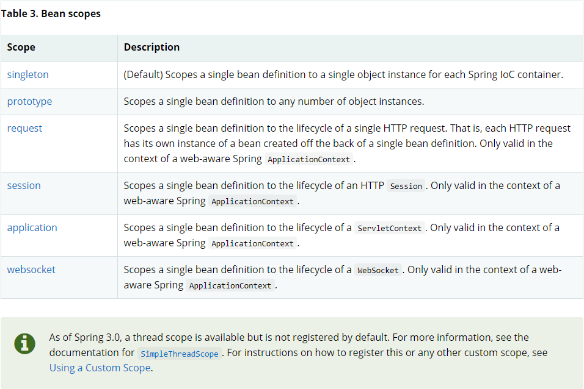

# Spring概述

Spring

IOC（Inversion of Control，即“控制反转”，不是什么技术，而是一种设计思想）、AOP(aspect-oriented programming,面向切面编程)、SpringMVC--->衍生项目。

1.《Spring源码深度解析》前几章

2.《Spring实战》

为简化JavaEE应用程序的开发为目的而创建了Spring框架。

|                  |                                    |
| :--------------: | :--------------------------------: |
|  企业级JavaBean  |    Enterprise Java Bean （EJB）    |
|   Java数据对象   |      Java Data Object（JDO）       |
| 简单老式Java对象 |   Plain Old Java object（POJO）    |
|     依赖注入     |     Dependency Injection（DI）     |
|   面向切面编程   | Aspect-Oriented Programming（AOP） |
|     控制反转     |        Inversion of Control        |

Spring是什么？

2002年，Spring雏形interface21发布，在interface21的基础上经过重新设计，并不断丰富内涵，于2004年3月24号Spring发布1.0版本，其创始人是Rod  Johnson。Spring是一个为了全方位地简化Java开发而创建的开源框架，是一个轻量级的控制反转和面向切面编程的框架；其为了简化Java开发采取了以下四种策略：

- 基于POJO的轻量级和最小侵入式编程；
- 通过依赖注入和面向接口实现松耦合；
- 基于切面和惯例进行声明式编程；
- 通过切面和模板减少样板代码。

Spring优缺点？

Spring优点：开源免费的框架(容器)、轻量级非入侵式的框架、控制反转IOC、面向切面编程aop，支持事务的处理和对框架的整合的支持;

缺点：发展太久之后违背了原来的理念，其整合了许多框架，就像一个大杂烩一样；配置十分繁琐，人称“配置地狱”。

Spring相关

官方文档：[Core Technologies (spring.io)](https://docs.spring.io/spring-framework/docs/current/reference/html/core.html)；

GitHub：[Releases · spring-projects/spring-framework (github.com)](https://github.com/spring-projects/spring-framework/releases)。

SSH框架：Struct2 + Spring + Hibernate(全自动)；SSM框架：SpringMVC + Spring + Mybatic(半自动)。

 Spring框架的组成：


关于Spring的拓展：

- Spring Boot：一个快速开发的脚手架，基于Spring Boot可以快速的开发单个微服务，原则是约定大于配置。
- Spring Cloud：基于Spring Boot实现的。

【大多数公司使用SpringBoot进行快速开发，学习SpringBoot前要完全掌握Spring及SpringMVC！】

# spring的配置

使用spring需要导包，导入spring-webmvc的包，由于maven的特性会帮忙把spring-webmvc的所有依赖到的包都导入，其中就包括了spring-core，也就是spring所需要的包：

```xml
<!-- https://mvnrepository.com/artifact/org.springframework/spring-webmvc -->
<dependency>
    <groupId>org.springframework</groupId>
    <artifactId>spring-webmvc</artifactId>
    <version>5.3.7</version>
</dependency>
<!-- 使用AOP时需要导入的包 -->
<dependency>
    <groupId>org.aspectj</groupId>
	<artifactId>aspectjweaver</artifactId>
	<version>1.9.6</version>
</dependency>
```

maven仓库：[Maven Repository: spring (mvnrepository.com)](https://mvnrepository.com/tags/spring)。

resources文件夹需要beans.xml等文件，xml约束如下：

```xml
<!-- spring用于创建对象的配置文件，基本约束 -->
<?xml version="1.0" encoding="UTF-8"?>
<beans xmlns="http://www.springframework.org/schema/beans"
       xmlns:xsi="http://www.w3.org/2001/XMLSchema-instance"
       xsi:schemaLocation="http://www.springframework.org/schema/beans
        https://www.springframework.org/schema/beans/spring-beans.xsd">

</beans>
```

```xml
<!-- 使用p、c命名空间时 -->
<?xml version="1.0" encoding="UTF-8"?>
<beans xmlns="http://www.springframework.org/schema/beans"
       xmlns:xsi="http://www.w3.org/2001/XMLSchema-instance"
       xmlns:p="http://www.springframework.org/schema/p"
       xmlns:c="http://www.springframework.org/schema/c"
       xsi:schemaLocation="http://www.springframework.org/schema/beans
        https://www.springframework.org/schema/beans/spring-beans.xsd">
    
    <!--p命名空间注入：可直接注入属性；p：property-->
    <bean id="user" class="com.lsl.pojo.User" p:name="梁胜林" p:id="10010"/>
    <!--c命名空间注入：通过有参构造器注入；c：constructor-arg-->
    <bean id="user2" class="com.lsl.pojo.User" c:id="12" c:name="lsl" scope="prototype"/>
</beans>
```


其他情况下文件头需要添加的内容：

```xml
<!-- 使用注解时 -->
<?xml version="1.0" encoding="UTF-8"?>
<beans xmlns="http://www.springframework.org/schema/beans"
       xmlns:xsi="http://www.w3.org/2001/XMLSchema-instance"
       xmlns:context="http://www.springframework.org/schema/context"
       xsi:schemaLocation="http://www.springframework.org/schema/beans
        https://www.springframework.org/schema/beans/spring-beans.xsd
        http://www.springframework.org/schema/context
        https://www.springframework.org/schema/context/spring-context.xsd">

     <!-- 扫描包使注解生效，注解生效时默认bean的id为注册进Spring的类的类名小写(多个单词组合时是驼峰形式)，
	如果要标识bean的id为其他，可在@Component("")设置 -->
    <context:component-scan base-package="com.lsl.pojo"/>
    <!-- 开启注解支持 -->
    <context:annotation-config/> 

</beans>
```

```xml
<!-- 面向切面 -->
<?xml version="1.0" encoding="UTF-8"?>
<beans xmlns="http://www.springframework.org/schema/beans"
       xmlns:xsi="http://www.w3.org/2001/XMLSchema-instance"
       xmlns:aop="http://www.springframework.org/schema/aop"
       xsi:schemaLocation="http://www.springframework.org/schema/beans
        https://www.springframework.org/schema/beans/spring-beans.xsd
        http://www.springframework.org/schema/aop
        https://www.springframework.org/schema/aop/spring-aop.xsd">
</beans>
```

引入全部约束：

```xml
<?xml version="1.0" encoding="UTF-8"?>
<beans xmlns="http://www.springframework.org/schema/beans"
    xmlns:xsi="http://www.w3.org/2001/XMLSchema-instance"
    xmlns:context="http://www.springframework.org/schema/context"
    xmlns:aop="http://www.springframework.org/schema/aop"
    xmlns:tx="http://www.springframework.org/schema/tx"
    xsi:schemaLocation="http://www.springframework.org/schema/beans 
    http://www.springframework.org/schema/beans/spring-beans.xsd
    http://www.springframework.org/schema/context
    http://www.springframework.org/schema/context/spring-context.xsd
    http://www.springframework.org/schema/aop
    http://www.springframework.org/schema/aop/spring-aop.xsd
    http://www.springframework.org/schema/tx
    http://www.springframework.org/schema/tx/spring-tx.xsd">
</beans>

```

约束简要说明：

```xml
<?xml version="1.0" encoding="UTF-8"?>
<beans xmlns="http://www.springframework.org/schema/beans"
    xmlns:xsi="http://www.w3.org/2001/XMLSchema-instance"
    //上面两个是基础IOC的约束，必备
    xmlns:context="http://www.springframework.org/schema/context"
    //上面一个是开启注解管理Bean对象的约束
    xmlns:aop="http://www.springframework.org/schema/aop"
    //aop的注解约束
    xmlns:tx="http://www.springframework.org/schema/tx"
    //事务的约束
    xsi:schemaLocation="http://www.springframework.org/schema/beans 
    http://www.springframework.org/schema/beans/spring-beans.xsd
    //上面两个是基础IOC的约束，必备
    http://www.springframework.org/schema/context
    http://www.springframework.org/schema/context/spring-context.xsd
    //上面一个是开启注解管理Bean对象的约束
    http://www.springframework.org/schema/aop
    http://www.springframework.org/schema/aop/spring-aop.xsd
    //aop的注解约束
    http://www.springframework.org/schema/tx
    http://www.springframework.org/schema/tx/spring-tx.xsd">
    //事务的约束
</beans>

```

# ---------------IOC------------------

# Spring的IOC理论

## IOC理论推导

【dao层(Data Access Object)，专门用来封装我们对于实体类的数据库的访问，就是增删改查，不加业务逻辑】

## 理解IoC：

dao层：

```java
public interface UserDao {
    void getUser();
}
```

```java
public class UserDaoImpl implements UserDao{
    public void getUser() {
        System.out.println("获取用户信息！");
    }
}
```

```java
public class UserDaoMysql implements UserDao{
    public void getUser() {
        System.out.println("MySql获取用户数据！");
    }
}
```

```java
public class UserDaoOracleImpl implements UserDao{
    public void getUser() {
        System.out.println("Oracle获取用户数据！");
    }
}
```

service层：

```java
public interface UserService {
    void getUser();
}
```

```java
public class UserServiceImpl implements UserService{
    private UserDao userDao;
    public void setUserDao(UserDao userDao){
        this.userDao = userDao;
    }
    public void getUser() {
        userDao.getUser();
    }

//    private UserDao userDao= new UserDaoImpl();
//    public void getUser(){
//        userDao.getUser();
//    }
}
调用dao层的数据，调用的方法就是创建所要调用的实现类的对象，通过对象调用实现类的方法来达到目的
```

简单的控制反转模型：

如上，按原始的方式是在service的实现类（UserServiceImpl）里创建dao层实现类的对象，再通过调用该对象的方法来实现对数据的访问，此时如果想要再次调用其他的实现类该怎么办呢？那就得在UserServiceImpl里修改代码来创建dao层中其他实现类的对象来实现调用（这时就体现了一个问题，想要调用dao层，就必须要我们程序员去修改代码）；

如果在UserServiceImpl中设置了set的方法来通过外部注入一个dao层接口的实现类的对象，此时访问dao层中的其他的实现类，不需要我们修改service层中的代码，我们也可以实现访问目的了。

在test层中测试：

- 原始的方式中：在UserServiceImpl中创建dao层实现类的对象并调用方法，如果要访问其他的则需要回到service层修改实现类内容；
- set方法方式中：通过调用set方法注入dao层中实现类的对象，再调用get方法，如果要访问dao层中其他的实现类则只需要修改注入的对象即可（此时不需要修改service层中的实现类内容）；

从上面可以看出：

- 原始方式中，交由程序主动创建对象(即service层中主动创建的dao层实现类的对象)，控制权在程序员手上；
- 使用set注入之后，service层程序不主动创建dao层中实现类的对象，而是被动接收对象，该程序变成了被动的接收对象。

由此可以看出，使用set注入之后，我们就能自行地控制对象的创建，主动权到了调用者的手上，service层程序呢不用管对象是怎么创建的，它只负责提供一个接口。

上述就是一个IOC的原型；控制反转的思想，从本质上解决了问题，我们程序员不用再去管理对象的创建(程序中不需要实现类的对象创建)，系统的耦合性也大大降低了，可以更加的专注在业务的实现上！

IoC本质：一种设计思想，DI是实现IoC的一种方式。没有IoC的程序，我们使用面向对象编程，对象的创建与对象的依赖关系完全硬编码在程序中，对象的创建由程序自己控制，控制反转后将对象的创建转移给第三方。（狂神说：控制反转就是获得依赖对象的方式反转了）（我感觉也是，依赖对象的获取由程序创建的方式反转到了由第三方创建的方式）。

## Spring与IoC：

IoC是Spring框架的核心内容，Spring使用了多种方式完美的实现了IoC，可以使用XML配置，也可以使用注解，新版本的Spring也可以零配置实现IoC。

实现过程：Spring容器在初始化时先读取配置文件，根据配置文件或元数据创建组织对象存入容器中，程序使用时再从IoC容器中取出需要的对象。

原理：采用XML方式配置Bean的时候，Bean的定义信息是和实现分离的，而采用注解的方式可以把两者合为一体，Bean的定义信息直接以注解的形式定义在实现类中，从而达到了零配置的目的。

IoC定义：控制反转是一种通过描述(XML或注解)并通过第三方去生产或获取特定对象的方式。在Spring中实现控制反转的是IoC容器，其实现方法是依赖注入(Depengency Injection,DI)

## HelloSpring

再通过一个简单老式的Java程序理解spring中的控制反转，使用spring需要先配置好相关的配置。

```java
public class HelloSpring {
    private String str;
    public String getStr() {
        return str;
    }
    public void setStr(String str) {
        this.str = str;
    }
    @Override
    public String toString() {
        return "Hello{" + "str='" + str + '\'' + '}';
    }
}
```

该过程中IoC的体现：

- 对象由Spring创建，对象的属性也由Spring设置；
- 控制：谁来控制对象的创建：POJO中是程序本身控制创建，使用Spring后对象由Spring创建；
- 反转：程序本身不创建对象，而变成被动的接收对象；
- 依赖注入：通过set方法建注入。

IoC是一种编程思想，将主动的程序变成被动的接收。（通过`new ClassPathXmlApplicationContext`阅读源码）。

要实现不同的操作，就不用再到程序去修改，而是通过修改xml配置文件；简而言之，就是对象由Spring来创建、管理、装配。

spring提供的容器也称为ioc容器。

（是否可以这样理解：Spring是一个大容器，Spring创建的beans都存在大容器里，需要的时候就拿出这些bean）。

# IoC的实现

依赖注入（DI）是实现IoC的一种方式，而装配是依赖注入的本质；装配就是向bean中注入依赖的过程，而自动注入依赖的过程就是自动装配。

装配机制：（建议显示配置越少越好，尽可能地使用自动配置，当必须要显式配置时尽可能使用JavaConfig）

1. XML中进行显示配置；
2. Java中的显示配置，（JavaConfig）；
3. bean发现机制与自动装配。

## 对象

对象都存在于spring容器里，构成的应用的组件被spring容器使用DI管理，spring容器归为两种类型：bean工厂、应用上下文；较常使用的是应用上下文。对象是由spring容器创建的，我们可以使用xml配置文件、JavaConfig、注解来使spring容器创建特定的对象-bean。

### 对象创建

beans.xml文件，一般放于resources目录下，头文件在一定条件下或追加其他内容：

```xml
<?xml version="1.0" encoding="UTF-8"?>
<beans xmlns="http://www.springframework.org/schema/beans"
       xmlns:xsi="http://www.w3.org/2001/XMLSchema-instance"
       xsi:schemaLocation="http://www.springframework.org/schema/beans
        https://www.springframework.org/schema/beans/spring-beans.xsd">
    
</beans>
```

Bean对应Spring容器里的一个Java实例，可以通过在beans.xml文件中创建bean并给其注入属性，还可以给bean创建别名等，创建对象的方法如下：

```xml
<bean id = "" class = "" name = "" scope="">
</bean>  
<alias name = "user" alias = "xxx"/>     <!--alias就是别名的意思，为指定的bean对象取一个别名-->
<!--
	id: 定义对象名
	class: 创建对象的类型所在的全限路径（包名+类名）
	name: 别名，可以命名多个，逗号隔开
	scope：作用域，默认为单例模式
--> 
```

关于import：用来导入其他的xml文件并进行整合，多用于团队合作

- applicationContext.xml，总的文件；

- ```xml
  <import resource = "xxx1.xml"/>
  <import resource = "xxx2.xml"/>
  ......<!--导入其他的bean.xml文件，整合进一个xml文件-->
  ```

### 对象获取与上下文

对象生存于spring容器中，创建好了bean之后就可以通过应用上下文获取bean，相当于获取创建好的对象，一般的获取方式如下：

```java
ApplicationContext user = new ClassPathXmlApplicationContext("beans.xml"); //拿到bean容器
User userTest = (User)user.getBean("user3"); //通过get方法和bean的id获取bean
System.out.println(userTest.show());
// 这样不用再进行强转
ApplicationContext context = new ClassPathXmlApplicationContext("applicationContext.xml");
User user = context.getBean("user",User.class);
```

关于五种常用的应用上下文：

> org.springframework.context.ApplicationContext;  应用上下文由该接口定义

- AnnotationConfigApplicationContext：从一个或多个Java配置类中加载spring应用上下文；
- AnnotationConfigWebApplicationContext：从一个或多个Java配置类中加载spring web应用上下文；
- ClassPathXmlConfigApplicationContext：从类路径下一个或多个xml配置文件加载上下文定义，把应用上下文定义文件作为类资源；
- FileSystemXmlApplicationContext：从文件系统下的一个或多个xml配置文件加载上下文定义；
- XmlWebApplicationContext：从web应用下的一个或多个xml配置文件加载上下文定义。

## XML显式装配

### 依赖注入（属性注入）

依赖就是指bean对象的创建依赖于Spring容器；而注入就是指bean对象的所有属性值，都通过容器来注入。依赖注入的本质就是装配。

依赖注入有三种方式，分别是构造器注入、set方式注入、其他（拓展方式注入）；构造器注入就是通过构造器参数注入的方式。

#### 通过构造器注入：

为实例注入属性，还可以通过有参构造器来进行属性注入：【在配置文件加载的时候，容器内管理的对象就已经开始创建并初始化。】

```xml
	通过有参构造器来注入属性：
	<!--方式一：通过构造器参数名字-->
    <bean id = "user1" class="com.lsl.pojo.User">
        <constructor-arg name="name" value="梁"/> <!--属性注入-->
        ......
    </bean>
    <!--方式二：下标赋值，构造器参数从0开始-->
    <bean id = "user2" class="com.lsl.pojo.User">
        <constructor-arg index="0" value="胜"/>
    </bean>
    <!--方式三：通过参数类型注入属性，不建议使用！，如果有多个同一类型会出错-->
    <bean id = "user3" class="com.lsl.pojo.User">
        <constructor-arg type="java.lang.String" value="林"/> <!--引用类型得全限命名-->
    </bean>
```

#### set方式注入：【重点】

set方式注入就是利用set方法来进行注入，在bean里通过property元素来进行注入，不过区分于不同的数据类型，不同的数据类型使用到的元素和属性值有些不一样，此时是通过无参构造器来构建bean所对应的对象？。

1.基本数据类型和String类型的普通值的引入：

```xml
<bean id = "xxx" class = "xxx.xxx.Xxx">
    <property name="name" value="梁"/>
    ......
</bean>
<!--
	property: 用来设置属性值（此时是通过无参构造器构建对象？，通过有参构造器的是constructor-arg）
    property的name是对象的属性名（全局变量名）
-->
```

2.自定义类的注入，自定义类都使用bean来创建对象至容器里，该类注入也叫bean注入

```xml
<bean id="address" class="com.lsl.pojo.Address"/>
<bean id = "xxx" class = "xxx.xxx.Xxx">
    <property name="address" ref="address"/> <!--ref指定bean，name指定的是属性-->
    ......
</bean>
```

3.数组的注入

```xml
<bean id = "xxx" class = "xxx.xxx.Xxx">
    <property name="books">
        <array>
            <value>红楼梦</value>
            <value>西游记</value>
            <value>水浒传</value>
        </array>
    </property>
</bean>
```

5.声明为List集合的注入（实现类如何注入？）

```xml
<property name="hobby">
     <list>
         <value>跑步</value>
         <value>游泳</value>
         <value>喝水</value>
     </list>
</property>
```

6.声明为Map集合的注入

```xml
<property name="card">
    <map>
        <entry key="身份证" value="111111222222222222"/>
        <entry key="银行卡" value="111111222222222222"/>
    </map>
</property>
```

7.声明为Set集合的注入

```xml
<property name="xx">
    <set>
        <value>xx</value>
        <value>xx</value>
    </set>
</property>
```

8.注入null值或空字符串

```xml
<property name="xx">
    <null/>
</property>
<property name="xx" value=""></property> <!--空字符串-->
```

9.Properties配置类类型

```xml
<property name="info">
	<props>
        <prop key="driver">com.mysql.ci.jdbc.Driver</prop>
        <prop key="url">男</prop>
        <prop key="username">root</prop>
        <prop key="password">123456</prop>
	</props>
</property>
```

#### 拓展方式注入：

命名空间：

- p命名空间：`xmlns:p="http://www.springframework.org/schema/p"`
- c命名空间：`xmlns:c="http://www.springframework.org/schema/c"`

```xml
<?xml version="1.0" encoding="UTF-8"?>
<beans xmlns="http://www.springframework.org/schema/beans"
       xmlns:xsi="http://www.w3.org/2001/XMLSchema-instance"
       xmlns:p="http://www.springframework.org/schema/p"
       xmlns:c="http://www.springframework.org/schema/c"
       xsi:schemaLocation="http://www.springframework.org/schema/beans
        https://www.springframework.org/schema/beans/spring-beans.xsd">
    
    <!-- p命名空间注入：可直接注入属性；p：property -->
    <bean id="user" class="com.lsl.pojo.User" p:name="梁胜林" p:id="10010"/>
    <!-- c命名空间注入：通过有参构造器注入；c：constructor-arg -->
    <bean id="user2" class="com.lsl.pojo.User" c:id="12" c:name="lsl" scope="prototype"/>
</beans>
```

## JavaConfig显式装配

JavaConfig是Spring的一个子项目，Spring4之后成为一个核心功能，在SpringBoot中常见。

通过JavaConfig显式配置Spring，相当于是Java类里通过注解把bean注册到容器中，不用在xml中开启注解扫描机制，配置类基本配置流程如下：

1.创建配置类

```java
@Configuration  //代表配置类，相当于beans.xml，把当前类注册到容器中，作用和@Component一样
@ComponentScan("com.lsl.pojo")  //扫描包，可选项，如果不指定扫描包路径，会默认扫描与配置类相同的包及子包
@Import(LslConfig2.class)       //合并配置类，可选项
public class LSLConfig {......}
```

2.声明bean：默认情况下，bean的ID与带有@Bean的方法的方法名一致，但可以通过name属性指定

```java
public class LSLConfig {
    @Bean(name="xxx")
    public xxx setXxx() {......}
    @Bean  // 创建的bean的id为test
    public Cat setCat() {
    	return new Cat();
    }
}
// @Bean注解将会告诉spring-该方法会返回一个对象，该对象要注册为spring应用上下文的bean
// 默认的bean的id为方法名，例如上面的setCat就是bean的id
// name属性可以设置新的beanID，设置了name后默认的不再生效，bean的生产是单例
```

3.配置好后使用其中的bean

```java
//完全使用了配置类，就只能通过ApplicationContext上下文来获取容器，通过配置类的class对象加载
ApplicationContext context1 = new AnnotationConfigApplicationContext(LslConfigTest.class);
User user1 = (User) context1.getBean("getUser");  // 相当于content1.getbean("xxx",Xxx.class);
```

4.关于配置类中的属性注入，在对象类中使用@Componet和@Value(" ")：

- @Componet：用来生成当前类的bean；
- @Value(" ")：用来注入值；


## 自动装配

自动装配是Spring满足bean依赖的一种方式，通过上下文自动寻找，**自动给bean装配引用类型属性的值**；自动装配有三种装配方式，分别是在xml中显式设置自动装配、在java中显式配置自动装配、隐式的自动装配bean【重要】。

### xml中配置自动装配

自动装配：（三个过程：1.spring容器中有相应的bean，2.找到要注入的bean，3.spring自动寻找并为指定bean注入bean）

- 使用bean的自动装配属性：autowire，用来指定spring寻找bean的方式；
- autowire：byName；在容器上下文中寻找和**setXxx方法**后面的值(xxx)对应的beanID（为声明了autowire的bean装配）；
- autowire：byType；在容器上下文中寻找和自己对象**属性类型**相同的bean（为声明了autowire的bean装配）。

```xml
<bean id="person" class="com.lsl.pojo.People" autowire="byType">-->
	<property name="name" ref=""/>
	......
</bean>
```

总结：

- 使用byName时，要保证beanID唯一，并且这个bean需要和自动注入的属性的set方法的方法名一致；
- 使用byType时，要保证所有声明了的bean的class唯一，并且这个bean需要和被注入的bean的属性的类型一致；
- 注入的是对象。

### 使用注解配置自动装配

spring从两个角度实现自动化装配：

- 组件扫描（component scanning）：spring自动发现应用上下文中所创建的bean；
- 自动装配（autowiring）：spring会自动满足bean之间的依赖。

创建好bean之后，通过spring的自动装配机制，开启注解支持和注解扫描，spring就能自动为注解处注入bean。使用步骤如下：

1. 导入约束，并开启注解支持：`<context:annotation-config/>`用来开启注解支持

   - ```xml
      <?xml version="1.0" encoding="UTF-8"?>
      <beans xmlns="http://www.springframework.org/schema/beans"
             xmlns:xsi="http://www.w3.org/2001/XMLSchema-instance"
             xmlns:context="http://www.springframework.org/schema/context"
             xmlns:aop="http://www.springframework.org/schema/aop"
             xsi:schemaLocation="http://www.springframework.org/schema/beans
              https://www.springframework.org/schema/beans/spring-beans.xsd
              http://www.springframework.org/schema/context
              https://www.springframework.org/schema/context/spring-context.xsd
              http://www.springframework.org/schema/aop
              https://www.springframework.org/schema/aop/spring-aop.xsd
          ">
          <!-- 扫描包使注解生效，注解生效时默认bean的id为注册进Spring的类的类名小写(多个单词组合时是驼峰形式)，
      	如果要标识bean的id为其他，可在@Component("")设置 -->
          <context:component-scan base-packae="com.lsl.pojo"/>
          <!-- 开启注解支持 -->
          <context:annotation-config/> 
      </beans>
      ```

3. 使用@Component创建bean：组件，放于类上，说明这个类被spring管理了；相当于 `<bean id = "类名小写，驼峰" class = "com.lsl.pojo.类">`；

3. 使用注解进行属性注入：

   - @Autowired：

     - 使用@Autowired(required = false)，则该对象可以为null（？不理解）；
     - 在属性上或set方法上使用，前提是自动装配的属性在spring容器中存在，且符合xml中byName时的名字要求；
     - **注意**：通过注解注入到IOC容器的id值默认是其类名（首字母小写）；

   - @Nullable：

     - 标记了这个注解的字段可以为null，任何类型的属性都可以加上；

   - @Autowired和@Qualifier配合

     - ```java
        	@Autowired
        	@Qualifier(value = "cat2")
        	private Cat cat;
       //使用@Qualifier(value = "cat2")从多个对象中指定一个对象配合@Autowired来注入
       ```

   - @Resource：java的注解，如果有指定name值则先通过name匹配，然后再是默认通过byName方式查找，如果找不到则通过byType查找(这时查找对象必须唯一，如果有同一类的多个对象则也会报错)，即两种方式都找不到时，才会报错；@Resource(name = "")可通过指定beanID匹配相应对象。

4. 使用应用上下文获取bean进行测试：

   - ```java
     ApplicationContext context = new ClassPathXmlApplicationContext("applicationContext.xml");
     ```

@Autowired和@Resource的区别：

- 都是用来自动装配，都可以放在属性字段上或写在setter方法上；
- @Autowired默认通过byType的方式实现，如果找不到再通过byName，如果两个都找不到则会报错；
- @Resource默认通过byName方式实现，找不到则通过byType；如果两个都找不到则会报错；
- 执行顺序不同：@Autowired先通过byType的方式实现，@Resource先过byName方式实现。

## xml与注解整合

sppring4.0之后，必须导入spring的aop的包；加入如下约束：

```xml
<?xml version="1.0" encoding="UTF-8"?>
<beans xmlns="http://www.springframework.org/schema/beans"
       xmlns:xsi="http://www.w3.org/2001/XMLSchema-instance"
       xmlns:context="http://www.springframework.org/schema/context"
       xmlns:aop="http://www.springframework.org/schema/aop"
       xsi:schemaLocation="http://www.springframework.org/schema/beans
        https://www.springframework.org/schema/beans/spring-beans.xsd
        http://www.springframework.org/schema/context
        https://www.springframework.org/schema/context/spring-context.xsd
        http://www.springframework.org/schema/aop
        https://www.springframework.org/schema/aop/spring-aop.xsd
    ">
    <!-- 扫描包使注解生效，注解生效时默认bean的id为注册进Spring的类的类名小写(多个单词组合时是驼峰形式)，
	如果要标识bean的id为其他，可在@Component("")设置 -->
    <context:component-scan base-packae="com.lsl.pojo"/>
    <!-- 开启注解支持 -->
    <context:annotation-config/> 
</beans>
```

- @Component：组件，放于类上，说明这个类被spring管理了；相当于 `<bean id = "类名小写。。。" class = "com.lsl.pojo.类">`；
- @Value("")：相当于`<property name = "" value = ""/>`，放在属性字段上或写在setter方法上；

- @Component有几个衍生注解，我们在Web开发中会按照mvc三层架构；

   - dao：@Repository；
   - service：@Service；
   - controller：@Controller。
   - @Component及其衍生的注解功能一样，都代表某个类注册到Spring中，装配Bean。

- 自动装配属性，依赖注入：

   - @Autowired：使用@Autowired(required = false)，则该对象可以为空；
   - @Nullable：标记了这个注解的字段可以为null；
   - @Autowired和@Qualifier配合。

- 作用域：@Scope("")，指定单例或其他；

小结，xml与注解：

- xml：应用场景更加广泛，维护更加简单方便；
- 注解：与源代码绑定，改动时要修改源代码。

最佳实践：

- xml用于管理bean：只负责对象的创建；

- 注解用于注入：只负责属性的注入；

- 【注意】开启注解支持

  ```xml
  <context:component-scan base-package="com.lsl.pojo"/><!--扫描当前包，使当下包的注解生效-->
  <context:annotation-config/>
  ```


# ---------------AOP------------------

# 代理模式

代理模式，AOP的底层，面试常见【SpringAOP和SpringMVC】；代理模式：将复杂事务转移到一处专门处理这类复杂事务的功能模块。

分为静态代理和动态代理。

## 静态代理

角色分析：

- 抽象角色：一般使用接口或抽象类来解决；
- 真实角色：被代理的角色；
- 代理角色：代理真实角色，代理真实角色后我们一般会做一些附属操作；
- 客户：访问代理对象的人。

代理好处：

- 真实角色不用关注其他公共的事务，只需要关注自己的需求目标；
- 公共的事务交给了代理（事务的分工更明确）；
- 方便公共事务发生改变时的拓展（（不改变被代理类的情况下）对被代理类的功能进行了拓展）。

缺点：

- 有多少个被代理角色就会有多少个代理类，这样代码量会翻倍，也就导致开发效率降低。

### 示例1：

```java
public interface Rent {
    void rent();
}
```

```java
// 房子
public class Host implements Rent{
    public void rent() {
        System.out.println("招租！");
    }
}
```

```java
// 租客
public class Client {
    public static void main(String[] args) {
        // 客户自己找符合自己需求的房源，然后租
        Host host = new Host(); 
        host.rent(); 
        // 客户把自己的需求提交给代理商，代理商负责匹配自己已有房源
        Proxy proxy = new Proxy(new Host());
        proxy.rent();
    }
}
```

```java
// 代理商
public class Proxy {
    private Host host;

    public Proxy() {
    }

    public Proxy(Host host) {
        this.host = host;
    }
    public void rent(){
        lookHost();
        contract();
        fare();
    }
    //看房
    public void lookHost(){
        System.out.println("中介带你看房");
    }
    public void fare(){
        System.out.println("交中介费用");
    }
    public void contract(){
        System.out.println("签订合同");
    }

    public Host getHost() {
        return host;
    }

    public void setHost(Host host) {
        this.host = host;
    }
}
```


### 示例2：


## 动态代理

动态代理解决了静态代理多个代理类对象的问题，其实你可以理解为它把这些多个代理类都归为一个抽象的对象了（这里的抽象不是指抽象类，而是动态创建的一个代理类，不需要像静态代理那样显示的写出来）。

动态代理分为两大类类：

- 基于接口的：JDK动态代理
- 基于类的：cglib
- java字节码实现：javasist

要了解的类：

- Proxy：代理
- InvocationHandler：调用处理程序

好处：

- 静态的所以好处
- 一个动态代理类代理的是一个接口，一般就是对应的一类业务
- 一个代理类可以代理多个类，只要实现了接口即可

### **示例见example2：**

关于其中的一些解释：

- ProxySubject类：该类为代理类
- 其持有一个被代理类的父类引用object，在getNewInstance这个函数中，我们传入需要被代理的类对象，将ProxySubject中的Object实例化，同时根据这个传入的object对象，获取其**类加载器**，**接口**，以及其**代理类对象**；通过Proxy类本身的静态方法*newProxyInstance*得到一个代理类对象，并将其返回，后续我们就会操作这个返回的代理类对象。
- 其中还有一个invoke方法，这里大概的意思就是当我们上述方法创建的代理类对象进行方法调用的时候，都会转化为对invoke方法的调用，例如我们调用通过getNewInstance方法产生的代理类的sell方法，这个sell方法就会传入invoke中，然后转化成对invoke的调用（这里的invoke方法其实就相当于代理类的sell方法，但是它没有写死，而是你传入什么方法，我就调用这个方法，实现了动态调用，与被代理类完全分割开来，完成解耦）。

关于公共的功能在动态代理创建时不能很好的创建，而是直接在被代理类里声明好？那这样的话也就实现不了静态的业务分离啊？？？

**动态代理的优劣**

**优：**

- **代码重用性强**。同样的，如果我们代理类的增强功能都一样，使用动态代理可以大大减少代码的编写量。
- **代理类与被代理类完全解耦**。可以观察到代理类的代码中没有任何与被代理类相关的片段，这就实现了两者的解耦，使得代理类只需要去实现的逻辑，其他的并不关心。

**劣：**

- **不易理解**。确实不好理解，因为代理类被抽象了。
- **不够灵活**。这怎么说起呢？因为在所有的代理类在访问函数的时候，会转化为对invoke函数的调用，也就是说在invoke函数里面新增的功能（如例子中的前后增强功能），都会去执行，可是有些时候我们并不想去执行这些功能，这就不得不再去实现一个代理类了。

追加：

## 代理模式和装饰者模式的区别

如果你去研究一下这两个模式，可能你会发现这两个模式的代码可能是完全一样的，同样是持有被代理对象/被装饰者的一个引用，对这个对象进行进一步的操作；

在Java自带类中，关于装饰者模式非IO流的各种类莫属了（一层层装饰，使得功能多样化）。但是为什么它们使用装饰者模式而不是代理模式呢？

这两个模式的最基本的区别在于，**代理模式对其被代理对象有控制权，而装饰者模式对其装饰者没有控制权**。

对于代理模式对其被代理对象有控制权的意思是，在代理类中，可以完全不使用被代理对象的方法，而是用自己的方法，也就是尽管持有一个被代理类对象的引用，这个引用也可以不使用。

对于装饰者模式没有对其装饰者的控制权的意思是，装饰者永远是对其被装饰者的功能进行提升的，就是被装饰着原有的东西在装饰者中不可以舍弃。例如你有一个刚刚买了的房子，在装修之后，人把厨房的门砌死了，装修完后少了个厨房，那就亏了，装饰者模式就是这个意思，它只是对被装饰者进行一层修饰，原有的东西不会改变。

# AOP的实现

## 概述

参考：

[什么是面向切面编程AOP？ - 欲眼熊猫的回答 - 知乎 https://www.zhihu.com/question/24863332/answer/48376158](https://www.jianshu.com/p/f1770b9dce27)

[JavaWeb过滤器.监听器.拦截器-原理&区别-个人总结 - Curiosity - ITeye博客](https://www.iteye.com/blog/hejiajunsh-1776569)

[Comparing Spring AOP and AspectJ | Baeldung](https://www.baeldung.com/spring-aop-vs-aspectj)

***什么是面向切面编程AOP？** - 柳树的回答 - 知乎 https://www.zhihu.com/question/24863332/answer/350410712

AOP全称Aspect Oriented Programming意为面向切面编程，也叫做面向方法编程，是通过预编译方式和运行期动态代理的方式实现不修改源代码的情况下给程序动态统一添加功能的技术。**这种在运行时，动态地将代码切入到类的指定方法、指定位置上的编程思想就是面向切面的编程。**

面向切面编程（AOP是Aspect Oriented Program的首字母缩写） ，我们知道，面向对象的特点是继承、多态和封装。而封装就要求将功能分散到不同的对象中去，这在软件设计中往往称为职责分配。实际上也就是说，让不同的类设计不同的方法。这样代码就分散到一个个的类中去了。这样做的好处是降低了代码的复杂程度，使类可重用。
      但是人们也发现，在分散代码的同时，也增加了代码的重复性。什么意思呢？比如说，我们在两个类中，可能都需要在每个方法中做日志。按面向对象的设计方法，我们就必须在两个类的方法中都加入日志的内容。也许他们是完全相同的，但就是因为面向对象的设计让类与类之间无法联系，而不能将这些重复的代码统一起来。
    也许有人会说，那好办啊，我们可以将这段代码写在一个独立的类独立的方法里，然后再在这两个类中调用。但是，这样一来，这两个类跟我们上面提到的独立的类就有耦合了，它的改变会影响这两个类。那么，有没有什么办法，能让我们在需要的时候，随意地加入代码呢？**这种在运行时，动态地将代码切入到类的指定方法、指定位置上的编程思想就是面向切面的编程。** 
      一般而言，我们管切入到指定类指定方法的代码片段称为切面，而切入到哪些类、哪些方法则叫切入点。有了AOP，我们就可以把几个类共有的代码，抽取到一个切片中，等到需要时再切入对象中去，从而改变其原有的行为。
这样看来，AOP其实只是OOP的补充而已。OOP从横向上区分出一个个的类来，而AOP则从纵向上向对象中加入特定的代码。有了AOP，OOP变得立体了。如果加上时间维度，AOP使OOP由原来的二维变为三维了，由平面变成立体了。从技术上来说，AOP基本上是通过代理机制实现的。 
     AOP在编程历史上可以说是里程碑式的，对OOP编程是一种十分有益的补充。

**AOP支持：**

spring实战作者建立过的原则：基于注解的配置优于基于Java的配置，基于Java的配置优于基于xml的配置，当需要声明切面但又不能为通知类添加注解的时候，那么就必须转向XML配置。

Spring提供了四种类型的AOP支持，而且在很多方面都借鉴了AspectJ项目：

- 基于代理的经典SpringAOP；
- 纯POJO切面（需要XML配置）；
- @AspectJ注解驱动的切面（依然时基于代理的AOP，借鉴了AspectJ，提供注解驱动的AOP，编程模型和AspectJ几乎完全一致）；
- 注入式AspectJ切面（适用于spring各版本）。

（前三种都是Spring AOP的变体，Spring AOP构建在动态代理基础上，spring对AOP的支持局限于方法拦截，如果是构造器或属性拦截，则需要使用AspectJ来实现切面）。

切面的实现-由包裹了目标对象的代理类实现，当调用目标对象的方法（被通知方法）时，代理类就会拦截被通知方法，然后执行切面逻辑；将通知类转换为切面也是通过代理来转换。

使用AOP织入，先要导入一个依赖包：

```xml
<dependencies>
        <dependency>
            <groupId>org.aspectj</groupId>
            <artifactId>aspectjweaver</artifactId>
            <version>1.9.6</version>
        </dependency>
</dependencies>
```

## 使用注解实现

注解的使用：

|      注解       |                             通知                             |
| :-------------: | :----------------------------------------------------------: |
|     @Aspect     |                         标注类为切面                         |
|    @Pointcut    | 定义命名的切点，有此标记的方法可代替<br>以下五个注解的切点表达式 |
|     @Before     |                通知方法在目标方法调用之前执行                |
|     @After      |            通知方法在目标方法返回或抛出异常时调用            |
| @AfterReturning |           通知方法在目标方法返回后调用，比@After早           |
| @AfterThrowing  |               通知方法在目标方法抛出异常后调用               |
|     @Around     |               环绕通知方法会将目标方法封装起来               |

使用注解实现AOP，要先定义好类（作为切面的类）及其成员方法（通知方法），使用@Aspect将该类定义为一个切面，使用其他五个注解来声明通知方法，五个注解对应的调用时间不同（相对目标方法调用时间）。以一个例子说明：

```java
public interface Performance {  // 接口
    public void perform();
}
```

```java
public class PerformanceImpl implements Performance{ // 接口实现类
    @Override
    public void perform() {
        System.out.println("演出啦！！！演出完毕啦！！！");
    }
}
```

```java
/* 使用@Around外的注解 */
@Aspect // 定义切面
public class Audience {
	// 这样就不用为那些都指定这么长的切点表达式 "execution(* com.lsl.pojo.Performance.perform(..))"
    @Pointcut("execution(* com.lsl.pojo.Performance.perform(..))")
    public void performance() {}
	// 目标方法执行前
    @Before("performance()")
    public void beforePro() {
        System.out.println("演出前：手机静音");
    }
    @Before("performance()")
    public void takeSeats() {
        System.out.println("演出前：找座位坐下");
    }
    // 目标方法执行后的通知
    @AfterReturning("performance()")
    public void applause() {
        System.out.println("观看演出：鼓掌，鼓掌");
    }
    @AfterThrowing("execution(* com.lsl.pojo.Performance.perform(..))")
    public void demandRefund() {
        System.out.println("演出不符预期：要求退款");
    }
}
/* 使用@Around 环绕通知 */
@Aspect // 定义切面
public class Audience {
    @Pointcut("execution(* com.lsl.pojo.Performance.perform(..))")
    public void performance() {}
    @Around("performance()")
    // ProceedingJoinPoint joinPoint 必须要，因为要在通知中通过它来调用被通知的方法
    public void watchPro(ProceedingJoinPoint joinPoint) {
        try{
            System.out.println("演出前：手机静音");
            System.out.println("演出前：找座位坐下");
            // 将控制权交给被通知的方法，如果不调用，就是阻塞被通知方法的访问
            //Signature signature = joinPoint.getSignature();//只是用来获取签名
            //System.out.println("signature:" + signature);
            joinPoint.proceed();
            System.out.println("观看演出：鼓掌，鼓掌");
        }catch (Throwable e) {
            System.out.println("演出不符预期：要求退款");
        }
    }
}
```

关于切点表达式的简单使用：

```java
@Before("execution(* com.lsl.pojo.Performance.perform(..))")
//切点表达式格式：  execution(返回类型 方法所属的类.方法(参数))  
// * 表示任意的意思 .. 表示任意参数  返回类型后面的就是用来声明切点的
@Before("execution(* com.lsl.pojo.Performance.perform(..))") 
//上面 表示该包下所有的类的所有的方法，在执行前都会调用该注解标明的通知方法
```

切面定义好后就可以使用JavaConfig或XML来使切面生效（否则切面类就是一个简单的类、bean）：

**JavaConfig方式：** 

```java
@Configuration // 该注解扫描方式是怎样的？？
// 下面的注解启用AspectJ自动代理，注解生效后将会创建将Audience转换为切面的代理, 代理把Audience转换为切面
@EnableAspectJAutoProxy 
public class JavaConfig {
    @Bean
    public Audience audience(){
        return new Audience();
    }
    @Bean
    public Performance performance(){
        return new PerformanceImpl();
    }
}
// 检测
public class Test {
    public static void main(String[] args) {
        ApplicationContext app = new AnnotationConfigApplicationContext(JavaConfig.class);
        Performance p = (Performance) app.getBean("performance");
        p.perform();
    }
}
```

**XML方式：要在约束处声明好spring的aop命名空间** 

```java
// 启用AspectJ自动代理，会为使用@Aspect注解的bean创建一个代理 
// 这个代理会围绕所有该切面的`切点所匹配的bean`
<aop:aspectj-autoproxy /> 
<bean id="p" class="com.lsl.pojo.PerformanceImpl"/>
<bean class="com.lsl.annotation.Audience"/> // 声明bean
/* 检测 */
public class Test {
    public static void main(String[] args) {
        ApplicationContext apps = new ClassPathXmlApplicationContext("beans.xml");
        Performance p1 = (Performance) apps.getBean("p");
        p1.perform(); // 切面的通知方法在该方法执行前后执行
    }
}
/* 结果 */ 
演出前：手机静音
演出前：找座位坐下
演出啦！！！演出结束啦！！！
观看演出：鼓掌，鼓掌
```

如果切面所通知的方法有参数，如何访问和使用传递给被通知方法的参数？利用切面表达式：

```java
/* 以@Before为例 */
@Before("execution(* com.lsl.pojo.Performance.perform(int)) && args(指定参数)")
如何使用：
```

## 使用XML配置实现

XML的aop命名空间：

|        aop配置元素        |                           用途                            |
| :-----------------------: | :-------------------------------------------------------: |
|      `<aop:config>`       | 顶层配置元素，大多数的`<aop:*>`必须包括在`<aop:config>`内 |
|      `<aop:aspect>`       |                       定义一个切面                        |
| `<aop:aspectj-autoproxy>` |                启用@AspectJ注解驱动的切面                 |
|     `<aop:pointcut>`      |                       定义一个切点                        |
|      `<aop:advisor>`      |                       定义AOP通知器                       |
|      `<aop:before>`       |                      定义AOP前置通知                      |
|       `<aop:after>`       |                      定义AOP后置通知                      |
|  `<aop:after-returning>`  |                      定义AOP返回通知                      |
|  `<aop:after-throwing>`   |                      定义AOP异常通知                      |
|      `<aop:around>`       |                      定义AOP环绕通知                      |
|  `<aop:declare-parents>`  |         以透明的方式为被通知的对象引入额外的接口          |

以使用注解实现的例子为例，去掉Audience类的注解，然后在XML文件里配置：

使用Around外的通知：

```xml
<bean id="p" class="com.lsl.pojo.PerformanceImpl"/>
<bean id="as" class="com.lsl.annotation.Audience"/>
<!-- 将没有注解的Audience对象转为切面，并配置通知方法 -->
<aop:config>
	<aop:aspect ref="as">
        <!-- method为切面as内的方法  pointcut为切点 -->
		<aop:before method="beforePro" pointcut="execution(* com.lsl.pojo.Performance.perform(..))"/>
		<aop:before method="takeSeats" pointcut="execution(* com.lsl.pojo.Performance.perform(..))"/>
		<aop:after method="applause" pointcut="execution(* com.lsl.pojo.Performance.perform(..))"/>
		<aop:after-throwing method="demandRefund" pointcut="execution(* com.lsl.pojo.Performance.perform(..))"/>
	</aop:aspect>
</aop:config>

<!-- 使用切点引用，不用在每处都指定pointcut -->
<bean id="p" class="com.lsl.pojo.PerformanceImpl"/>
<bean id="as" class="com.lsl.annotation.Audience"/>
<aop:config>
	<aop:aspect ref="as">
        <aop:pointcut id="performance" expression="execution(* com.lsl.pojo.Performance.perform(..))"/>
		<aop:before method="beforePro" pointcut-ref="performance"/>
	</aop:aspect>
</aop:config>
```

使用环绕通知 ：

```xml
<bean id="p" class="com.lsl.pojo.PerformanceImpl"/>
<bean id="as" class="com.lsl.annotation.Audience"/>
<aop:config>
	<aop:aspect ref="as">
        <aop:pointcut id="performance" expression="execution(* com.lsl.pojo.Performance.perform(..))"/>
		<!-- 环绕通知的方法声明不变 -->		
        <aop:around method="watchPro" pointcut-ref="performance"/>
	</aop:aspect>
</aop:config>
```

## 使用Spring的API接口和XML

- 定义切面类实现spring的MethodBeforeAdvice或AfterReturningAdvice接口，并重写方法；

  ```java
  public class BeforeLog implements MethodBeforeAdvice {
      @Override
      public void before(Method method, Object[] objects, Object o) throws Throwable {
          System.out.println(o.getClass().getName()+ "的" + method.getName() + "方法被执行了");
      }
  }
  // before()方法参数说明：method-被通知方法  objects-被通知方法的传入形参  o-被通知方法的对象
  public class AfterLog implements AfterReturningAdvice {
      @Override
      public void afterReturning(Object o, Method method, Object[] objects, Object o1) throws Throwable {
          System.out.println("执行了" + method.getName() + "方法，返回结果为" + o);
      }
  }
  // afterReturning()方法参数说明：第一个Object类型的是被通知方法的返回值，其他的和before()的一致
  ```

  

- XML配置

  ```xml
  <bean id="afterLog" class="com.lsl.pojo.AfterLog"/>
  <bean id="beforeLog" class="com.lsl.pojo.BeforeLog"/>
  <aop:config>
  	<aop:pointcut id="pcut" expression="execution(* com.lsl.pojo.Performance.perform(..))"/>
  	<aop:advisor advice-ref="beforeLog" pointcut-ref="pcut"/>
  	<aop:advisor advice-ref="afterLog" pointcut-ref="pcut"/>
  </aop:config>
  ```

## 总结

- AOP的实现无非两个过程：一是创建好能被代理的切面和通知方法、二是使切面生效发挥作用。

# ---------------------------------------

# 上下文


# Bean Scopes作用域



1. 单例模式singleton：（Spring默认机制）；
2. 原型模式prototype：（每次从容器中get都会产生一个新对象）；
3. 其余的只能在web开发中使用。

# bean的生命周期


# 事务隔离级别


