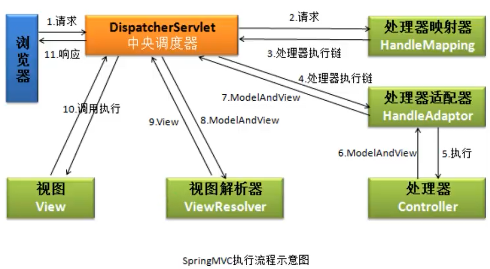
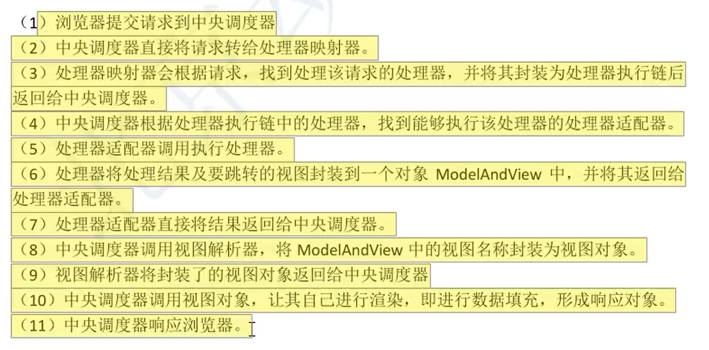

# SpringMVC配置

spring web mvc是spring框架的一部分，导入springmvc的依赖也就导入了spring的核心依赖：

```xml
<!-- https://mvnrepository.com/artifact/org.springframework/spring-webmvc -->
        <dependency>
            <groupId>org.springframework</groupId>
            <artifactId>spring-webmvc</artifactId>
            <version>5.3.8</version>
        </dependency>
```

web.xml里配置中央调度器（也就是相当配置了一个servlet）：

```xml
<?xml version="1.0" encoding="UTF-8"?>
<web-app  xmlns = "http://xmlns.jcp.org/xml/ns/javaee"
          xmlns:xsi="http://www.w3.org/2001/XMLSchema-instance"
          xsi:schemaLocation="http://xmlns.jcp.org/xml/ns/javaee http://xmlns.jsp.org/xml/ns/javaee/web-app_4_0.xsd"
          version="4.0"
          metadata-complete="true"
>
  <display-name>Archetype Created Web Application</display-name>
  
    <servlet>
        <servlet-name>myspringmvc</servlet-name>
        <servlet-class>org.springframework.web.servlet.DispatcherServlet</servlet-class>
        <init-param>
            <param-name>contextConfigLocation</param-name>
            <param-value>classpath:springmvc.xml</param-value> 
        </init-param>
        <load-on-startup>1</load-on-startup>
    </servlet>
    <servlet-mapping>
        <servlet-name>myspringmvc</servlet-name>
        <url-pattern>*.do</url-pattern>
    </servlet-mapping>
    
</web-app> 
```

resources目录里的springmvc.xml配置，用来配置视图解析器和注解扫描：

```xml
<?xml version="1.0" encoding="UTF-8"?>
<beans xmlns="http://www.springframework.org/schema/beans"
       xmlns:xsi="http://www.w3.org/2001/XMLSchema-instance"
       xmlns:context="http://www.springframework.org/schema/context"
       xsi:schemaLocation="http://www.springframework.org/schema/beans
        https://www.springframework.org/schema/beans/spring-beans.xsd http://www.springframework.org/schema/context https://www.springframework.org/schema/context/spring-context.xsd">
    <!-- 组件扫描器，使注解生效 -->
    <context:component-scan base-package="com.lsl.controller"/>
    <!-- 视图器的配置，为了简化控制器的视图路径 -->
    <bean class="org.springframework.web.servlet.view.InternalResourceViewResolver">
        <!-- 前缀：视图文件路径，也是相对于自己webapp根目录-->
        <property name="prefix" value="/WEB-INF/view/"/>
        <!--后缀：视图文件的拓展名-->
        <property name="suffix" value=".jsp"/>
    </bean>
</beans>
```

# SpringMVC

## 概述

SpringMVC，也叫Spring web MVC，是spring框架的一部分，是轻量级的框架。基于模型-视图-控制器（model、view、controller）模式实现，用于构建灵活、松耦合的web应用程序。学习使用SpringMVC主要在于学习Controller的制作部分，另外还要理解SpringMVC的整个运行逻辑。简单来说，**模型包括了你的数据模型(pojo或bean之类的东西)和业务模型（比如登陆，注册操作等），用来从后台封装数据到页面的，Controller则是将model层可以在view层显示出来。**

对于springMVC的学习，需要掌握中央调度器、前端控制器、视图解析器，理解各自的作用，知道它们的一个工作流程，要熟练使用前端控制器的处理方法（请求处理和请求参数的接收，以及返回值），而方法的使用的关键就是各种注解了。

springMVC在servlet的基础上，改进了哪些操作？

springmvc的使用步骤：

1. 创建web项目，配置好所需要的依赖；
2. 创建好中央调度器（其实就是一个servlet）；
3. 创建控制器（新建Java类使用注解完成控制器的注册，并写好相应的程序逻辑）；
4. 如果需要的话，可以配置视图解析器，可以简化控制器里的资源路径，也可以引入thymeleaf，使用模板引擎。

## 中央调度器

中央调度器DispatcherServlet，负责接收用户的对资源的请求，接收到请求后会调用控制器对象并返回请求处理结果（返回的是视图或其它）给前端来进行展示，是一个Servlet，其父类继承了HttpServlet，DispatcherServlet也叫做前端控制器（front controller）。

配置中央调度器如下：

```xml
<!-- web.xml -->
<servlet>
        <servlet-name>myspringmvc</servlet-name>
        <servlet-class>org.springframework.web.servlet.DispatcherServlet</servlet-class>
		<!-- 上下文的配置（resource里的资源在导出后会加载进classpath） -->
        <init-param>
            <param-name>contextConfigLocation</param-name>
            <param-value>classpath:springmvc.xml</param-value> 
        </init-param>
        <!-- 服务器启动便创建好调度器，越小创建（执行）越早 -->
        <load-on-startup>1</load-on-startup> 
    </servlet>
    <servlet-mapping>
        <servlet-name>myspringmvc</servlet-name>
        <url-pattern>*.do</url-pattern>
    </servlet-mapping>
```

```xml
<!--springmvc.xml-->
<?xml version="1.0" encoding="UTF-8"?>
<beans xmlns="http://www.springframework.org/schema/beans"
       xmlns:xsi="http://www.w3.org/2001/XMLSchema-instance"
       xmlns:context="http://www.springframework.org/schema/context"
       xsi:schemaLocation="http://www.springframework.org/schema/beans
        https://www.springframework.org/schema/beans/spring-beans.xsd http://www.springframework.org/schema/context https://www.springframework.org/schema/context/spring-context.xsd">
	<!--开启注解扫描-->
    <context:component-scan base-package="com.lsl.controller"/> 
</beans>
```

在tomcat服务器启动后创建DispatcherServlet对象实例，为什么要这样？创建该实例的过程中会同时创建springmvc容器对象，并读取springmvc的配置文件，把这个配置文件中对象都创建好，当用户发起请求就可直接使用controller对象。DispatcherServlet对象就是一个servlet，当其创建时执行init()方法，会进行初始化

```java
init(){
	WebApplicationContext ctx = new  ClassPathApplicationContext("springmvc.xml");
	getServletContext().setAttribute(key, ctx);
}
```

## 前端控制器

前端控制器Controller，里面的方法可以对应多个请求路径。

```java
@Controller
public class FirstController {
    @RequestMapping(value = "/some.do")
    public ModelAndView doSome() {
        ModelAndView mv = new ModelAndView();
        //相当于request的setAttribute("msg", "xxx");
        mv.addObject("msg","欢迎使用springMVC来开发");
        mv.addObject("fun","执行的是doSome方法");
        //指定视图路径
        //相当于request.getRequestDispather("/show.jsp").forward(...)
        mv.setViewName("/show.jsp");
        //mv.setViewName("/WEB-INF/view/show.jsp"); 将视图放进WEB-INF/view里，杜绝用户直接访问
        //执行此方法后才由框架执行相当于request.setAttribute
        // 或request.getRequestDispather("/show.jsp").forward(...)操作
        return mv;
    }
    @RequestMapping(value = {"/se.do", "/otherdo"})
    public ModelAndView doSomes() {
        ModelAndView mv = new ModelAndView();

        mv.addObject("msg","欢迎使用springMVC来开发");
        mv.addObject("fun","执行的是doSomes方法");
        mv.setViewName("/se.jsp");   
  		//mv.setViewName("se"); 已配置好视图解析器的时候
        return mv;
    }
}
```

请求-响应过程：

1. 发送请求给tomcat服务器，tomcat服务器截取路径去到web.xml的匹配`/show.jsp`；
2. 然后根据虚拟路径，请求转到中央调度器DispatcherServlet；
3. DispatcherServlet根据springmvc.xml文件匹配请求路径对应的方法；
4. 框架执行匹配到的方法，把得到的ModelAndView进行处理，转发到shou.jsp。

可看出：中央调度器DispatcherServlet负责创建springmvc容器对象，读取xml配置文件后利用spring注解创建好对应目录里的Controller对象，还负责接收用户请求，匹配到相应的处理方法。

springmvc执行过程源代码分析：

1. tomcat服务器启动，通过`<load-on-startup>1</load-on-startup>`指定的优先级，创建了DispatcherServlet对象；

2. DispatcherServlet对象就是一个servlet，当其创建时执行init()方法，根据配置文件创建了对象并放进了ServletContext()
           init(){
               WebApplicationContext ctx = new  ClassPathApplicationContext("springmvc.xml");
               getServletContext().setAttribute(key, ctx);
           }

3. 请求的处理过程
     1）执行servlet的service()


   ```java
     protected void service(HttpServletRequest request, HttpServletResponse response)
     protected void doService(HttpServletRequest request, HttpServletResponse response)
     DispatcherServlet.doDispatch(request, response){
         调用MyController的.doSome()方法
     }
   ```

```txt
  doDispatch：springmvc中DispatcherServlet的核心方法， 所有的请求都在这个方法中完成的。
```

## 视图解析器

springmvc.xml里配置好后：mv.setViewName("show")  ===>  return mv后相当于转发到 /WEB-INF/view/show.jsp页面

```xml
<bean class="org.springframework.web.servlet.view.InternalResourceViewResolver">
    <!--前缀：视图文件路径-->
    <property name="prefix" value="/WEB-INF/view/"/>
    <!--后缀：视图文件的拓展名-->
    <property name="suffix" value=".jsp"/>
</bean>
```

也可以使用thymeleaf的解析器，使用thymeleaf来渲染页面。

# 处理器方法内容

以下是一个处理器方法，声明了请求映射路径，处理方法有其主要的常用的几个返回值，可以接收一定的请求参数。

```java
@RequestMapping(value = "/other.do")
public ModelAndView doOther() {
    ModelAndView mv = new ModelAndView();
    mv.addObject("msg","欢迎使用springMVC来开发");
    mv.addObject("fun","执行的是doOther方法");
    mv.setViewName("other");
    return mv;
}
```

## 请求映射

### @RequestMapping

`@RequestMapping(value = "/some.do")`修饰的方法称为处理器方法或控制器方法，将映射路径与方法绑定达到处理对应请求并响应的目的。

- `@Controller`：声明这个类为一个控制器；
- `@RequestMapping(value = "/some.do")`：请求映射，把请求资源地址与处理方法绑定，请求时会匹配到该地址然后进行相应的操作；
  - value值唯一，推荐以 / 开始；
  - 该注解可用于方法或类上面；
  - 声明了相对于webapp下的一个虚拟路径。

RequestMapping放于类上的作用：所有请求地址的公共部分，叫做模块名称。如下：

```java
@RequestMapping("/test") 
http://localhost:8081/springmvc_02_war/test/some.do
http://localhost:8081/springmvc_02_war/test/other.do
```

RequestMapping的method属性，决定映射什么样的请求方法：

```java
@RequestMapping(value = {"/some.do", "/first.do"}, method = RequestMethod.GET)
//如果不指定method则没有限制
```

### RESTFul风格

**RESTFul是什么**

以下都摘录自：[理解RESTful架构 - 阮一峰的网络日志 (ruanyifeng.com)](https://www.ruanyifeng.com/blog/2011/09/restful.html)

REST：Representational State Transfer，表现层资源状态转移。Fielding将他对互联网软件的**架构原则**，定名为REST，即Representational State Transfer的缩写。如果一个架构符合REST原则，就称它为RESTful架构。RESTful架构，就是目前最流行的一种互联网软件架构。它结构清晰、符合标准、易于理解、扩展方便，所以正得到越来越多网站的采用。

**资源（Resources）**：网络上的具体信息，可通过URI来进行标识和访问，URI代表了一个资源的实体；

**表现层（Representation）**："资源"（Resources）的"表现层"，**我们把"资源"具体呈现出来的形式，叫做它的"表现层"（Representation）**，比如文本的各种格式、图片使用的的各种格式的表现等；

**状态转化（State Transfer）**：访问一个网站，就代表了客户端和服务器的一个互动过程。在这个过程中，势必涉及到数据和状态的变化。

互联网通信协议HTTP协议，是一个无状态协议。这意味着，所有的状态都保存在服务器端。因此，**如果客户端想要操作服务器，必须通过某种手段，让服务器端发生"状态转化"（State Transfer）。而这种转化是建立在表现层之上的，所以就是"表现层状态转化"。**

客户端用到的手段，只能是HTTP协议。具体来说，就是HTTP协议里面，四个表示操作方式的动词：GET、POST、PUT、DELETE。它们分别对应四种基本操作：**GET用来获取资源，POST用来新建资源（也可以用于更新资源），PUT用来更新资源，DELETE用来删除资源。**

RESTful架构：

　　（1）每一个URI代表一种资源；

　　（2）客户端和服务器之间，传递这种资源的某种表现层；

　　（3）客户端通过四个HTTP动词，对服务器端资源进行操作，实现"表现层状态转化"。

**SpringMVC中对RESTful架构的实现：**

RESTful风格的URI：

四个表示操作方式的动词的使用：

- put请求和delete请求只有部分浏览器支持，所以springmvc提过了一个过滤器：HiddenHttpMethodFilter

  ```xml
  <!-- 该过滤器会获取请求参数，所以要在编码设置的过滤器后再加载该过滤器-->
  <filter>
    <filter-name>HiddenHttpMethodFilter</filter-name>
    <filter-class>org.springframework.web.filter.HiddenHttpMethodFilter</filter-class>
  </filter>
  <filter-mapping>
    <filter-name>HiddenHttpMethodFilter</filter-name>
    <url-pattern>/*</url-pattern>
  </filter-mapping>
  ```

  ```html
  <!--  -->
  <form action="/user" method="post">
      <input type="hidden" name="_method" value="PUT"/>
  </form>
  ```

  


## 表单参数接收

处理器方法的参数用来对**用户表单请求提交的数据**进行接收，参数类型可以是`HttpServletRequest request`、`HttpServletResponse response`、`HttpSession session`这几个类型，也可以是string、int类型的，等等。

### 自动全局接收

（HttpServletRequest request、HttpServletResponse response、HttpSession session）这三个由框架自动完成赋值，如下声明后就可以直接调用它们的方法来获取数据了。

```java
@RequestMapping(value = "/first.do", method = RequestMethod.POST)
public ModelAndView doFirst(HttpServletRequest request, HttpServletResponse response, HttpSession session) {
    ModelAndView mv = new ModelAndView();

    mv.addObject("msg","欢迎使用springMVC来开发");
    mv.addObject("fun","执行的是doOther方法");

    mv.setViewName("first");

    return mv;
}
```

### 自动逐个接收

框架接受请求参数：

1. 通过形参逐个接收：框架调用处理器方法时，会按名称（表单提交的数据的name，与顺序无关）把接收到的参数赋给形参，框架还提供把String类型的参数转为int、long、Integer等类型的参数，如`doSecond(String name, int age)`，age也能接收string数据，只要名称对应（前提是字符是纯数字，否则会出现400错误）。

```java
@RequestMapping(value = "/second.do", method = RequestMethod.POST)
public ModelAndView doSecond(String name, String age) {
    ModelAndView mv = new ModelAndView();

    mv.addObject("msg",name);
    mv.addObject("fun",age);

    mv.setViewName("other");

    return mv;
}
```

【注意】表单提交请求参数时使用get方式不出现乱码，使用post方式会出现乱码，使用过滤器可解决这个问题（过滤器可以自定义，也可以使用框架的）。使用框架的过滤器：

```xml
<!--web.xml中-->
<filter>
    <filter-name>characterEncodingFilter</filter-name>
    <filter-class>org.springframework.web.filter.CharacterEncodingFilter</filter-class>
    <!--设置项目中使用的字符编码-->
    <init-param>
        <param-name>encoding</param-name>
        <param-value>utf-8</param-value>
    </init-param>
    <!--强制请求对象（HttpServletRequest）使用-->
    <init-param>
        <param-name>forceRequestEncoding</param-name>
        <param-value>true</param-value>
    </init-param>
    <!--强制应答对象(HttpServletResponse)使用-->
    <init-param>
        <param-name>forceResponseEncoding</param-name>
        <param-value>true</param-value>
    </init-param>
</filter>
<filter-mapping>
    <filter-name>characterEncodingFilter</filter-name>
    <!--强制所以请求先经过过滤器-->
    <url-pattern>/*</url-pattern>
</filter-mapping>
```

### 通过自定义类接收

可以通过自定义类对象来接收表单提交的数据，前提是方法的形参对象所对应的类的属性名和表单的请求中的参数名（name）必须一致，框架则会自动创建对应形参的java对象（调用空参构造方法），然后通过调用对象的set方法进行赋值，例如：

```java
@RequestMapping(value = "/ob.do", method = RequestMethod.POST)
// 表单提交的学生的信息数据会自动注入到形参对象中
public ModelAndView doOb(Student student) {
    ModelAndView mv = new ModelAndView();
    mv.addObject("msg",student.getName());
    mv.addObject("fun",student.getAge());
    mv.setViewName("other");
    return mv;
}
```

** `@RequestParam`：** 请求参数，用来处理**逐个接收数据时**请求参数名（name）和方法参数名不一致的情况。

```java
@RequestMapping(value = "/re.do", method = RequestMethod.POST)
public ModelAndView doRe(@RequestParam(value = "rname", required = false) String name, @RequestParam("rage") String age) {
    ModelAndView mv = new ModelAndView();
    mv.addObject("msg",name);
    mv.addObject("fun",age);
    mv.setViewName("other");
    return mv;
}
```

- 如果方法参数名和请求参数名（name）不一致，则会报空指针异常；
- 处理这种不一致的情况使用@RequestParam注解，如上，
  - value：指定请求参数名（name）；
  - required：如果required为false，表单请求参数名（name）可以不是value的值，但得是和后面的参数名一致；如果是默认的true，name与value必须对应）。

springmvc处理器方法的形参还可以以Map、List、数组等方式接收，不过前端显示过程比较复杂，不常用。

## 路径等参数接收


## 返回值类型

### ModelAndView

有数据和视图，对视图执行forward（转发）；处理器处理请求后，需要跳转到其他页面资源并完成在跳转资源之间的数据传递，此时使用该返回值类型。

- `addObject()`：往容器里放数据，（springmvc容器？）；
- `setViewName()`：指定视图路径，相当于转发；
- `return mv`：将用`setViewName()`指定的资源返回，也就相当于转发了，显示的是指定路径下的资源，可结合视图解析器简化路径。

```java
@Controller
public class FirstController {
    @RequestMapping(value = "/some.do")
    public ModelAndView doSome() {
        ModelAndView mv = new ModelAndView();
        //相当于request的setAttribute("msg", "xxx");
        mv.addObject("msg","欢迎使用springMVC来开发");
        mv.addObject("fun","执行的是doSome方法");
        //指定视图路径
        //相当于request.getRequestDispather("/show.jsp").forward(...)
        mv.setViewName("/show.jsp");
        return mv;
    }
}
```


### String

表示视图，可以是逻辑名称（例如show.html），也可以是完整的视图路径（例如`/WEB-INF/view/index.html`）。

```java
@RequestMapping(value = "/returnString-view.do", method = RequestMethod.POST)
public String returnStringView(HttpServletRequest request, String name, String age) {

    request.setAttribute("msg",name);
    request.setAttribute("fun",age);
    /*由框架进行转发*/
    /*配置了视图解析器时直接返回逻辑名称*/
    return "show";
    /*如果返回完整的路径，这时不能使用视图解析器，因为是在返回的值加前缀、后缀的*/
}
```

### void

不能表示数据，也不能表示视图，在处理ajax时，可以使用其作为返回值，通过HttpServletResponse输出数据，来响应ajax请求，ajax请求服务器返回数据，和视图无关。

```xml
<!-- jackson依赖包 -->
<!-- https://mvnrepository.com/artifact/com.fasterxml.jackson.core/jackson-core -->
<dependency>
    <groupId>com.fasterxml.jackson.core</groupId>
    <artifactId>jackson-core</artifactId>
    <version>2.12.1</version>
</dependency>
<!-- https://mvnrepository.com/artifact/com.fasterxml.jackson.core/jackson-databind -->
<dependency>
    <groupId>com.fasterxml.jackson.core</groupId>
    <artifactId>jackson-databind</artifactId>
    <version>2.12.1</version>
</dependency>
```

先会基本的对象-json的转换处理，再去使用框架返回Object对象自动完成json转换，（至于底层原理，看心情吧）。

### Object


# 注解总结


# 静态资源处理

Tomcat有一个默认的servlet（conf的web.xml中），服务器启动时创建，用于处理HTML、css、js、图片等静态资源，也可以处理未映射到其他servlet的请求。该默认的servlet的映射路径使用的是斜杠 `/`，如果我们也使用了这个斜杠，那么所有的请求将被中央调度器来处理，而此时中央调度器就没有了servlet对象来处理静态资源，这时会导致HTML、css、js、图片等静态资源无法加载，如果使用的是路径`/xxx`则静态资源可以访问到（当控制器对象只能处理请求，但是静态资源仍然无法访问，这时就需要配置静态资源处理。）

处理静态资源的方法一：

- springmvc.xml中加入`<mvc:default-servlet-handler/>`：原理是加入这个标签，由框架创建控制器对象DefaultHttpServletRequestHangler，通过这个对象实现把接收的请求转发给Tomcat中默认的servlet，从而实现对静态资源的访问。
  - `<mvc:default-servlet-handler/>`和@RequestMapping注解存在冲突，需要加上`<mvc:annotation-driven/>`来解决冲突。

**处理静态资源的方法二：（常用）**

- springmvc.xml中加入`<mvc:resources mapping="" location=""/>`： 
  - mapping：访问静态资源的uri地址，使用通配符`**`， `mapping="images/**"`；
  - location：静态资源在你的项目中的位置，`location="/images/"`。

加入此配置后框架会自动创建一个处理器对象（ResourceHttpServletRequestHangler），这个处理器对象用来处理静态资源的访问，这样就不用再依赖tomcat服务器的默认的servlet。该方法的`<mvc:resources mapping="" location=""/>`和@RequestMapping注解存在冲突，需要加上`<mvc:annotation-driven/>`来开启mvc注解驱动、解决冲突。

```xml
<mvc:resources mapping="/html/**" location="/html/"/>
<mvc:resources mapping="/css/**" location="/css/"/>
<mvc:resources mapping="/js/**" location="/js/"/>
......
```

统一指定访问资源，创建static目录，把静态资源都放里面：

```xml
<mvc:resources mapping="/static/**" location="/static/"/>
```

# 解决POST请求乱码

```xml
<!-- 过滤器 -->
<filter>
  <filter-name>characterEncodingFilter</filter-name>
  <filter-class>org.springframework.web.filter.CharacterEncodingFilter</filter-class>
  <init-param>
    <param-name>encoding</param-name>
    <param-value>utf-8</param-value>
  </init-param>
  <init-param>
    <param-name>forceRequestEncoding</param-name>
    <param-value>true</param-value>
  </init-param>
  <init-param>
    <param-name>forceResponseEncoding</param-name>
    <param-value>true</param-value>
  </init-param>
</filter>
<filter-mapping>
  <filter-name>characterEncodingFilter</filter-name>
  <url-pattern>/*</url-pattern>
</filter-mapping>
```

# SpringMVC核心技术

## HttpMessageConverter

HttpMessageConverter，报文信息转换器，将请求报文转换为java对象或将java对象转换为响应报文。

两个注解：

- `@RequestBody`：用来标识形参，获取**请求体信息**；
- `@ResponseBody`：用于控制器方法，将控制器方法的返回值直接作为响应报文的响应体响应到浏览器（处理json数据需要导入相关依赖）。
- （派生注解`@RestController`：相对于为该类添加了@Controller注解并为其中的每个方法都添加了@ResponseBody注解）

两个类型：

- `RequestEntity`：用来**封装请求报文**的类，在控制器方法中设置该形参就会自动完成请求报文的封装，然后通过`getHeaders()`方法获取请求头信息、通过`getBody()`方法获取请求体信息；
- `ResponseEntity`：响应实体类，用于作为控制器方法的返回值，作为响应到浏览器的响应报文。

## 文件上传和下载


## 转发和重定向

SpringMVC简化了servlet中的转发和重定向。实现转发操作需要在视图路径前加上forward，重定向则加上redirect。

显式转发：**不经过视图解析器**，要写上相对于webapp这个目录的转发到的页面的完整相对路径；可以实现访问webapp下的资源

```java
@RequestMapping(value="/forward.do")
public ModelAndView forwardTest(String name, String rage){
    ModelAndView mv = new ModelAndView();
    mv.addObject("name", name);
    mv.addObject("age", rage);
    mv.setViewName("forward:/WEB-INF/show.jsp");
    //mv.setViewName("show");   隐式的转发，会经过视图解析器
    return mv;
}
```

重定向：**不经过视图解析器**；第一次请求的参数会被转为string，作为第二次请求的get参数使用；（重定向是两次请求）

```java
@RequestMapping(value="/redirect.do")
public ModelAndView redirectTest(String name, String age){
    ModelAndView mv = new ModelAndView();
    //放入到request作用域的数据
    mv.addObject("myname", name);
    mv.addObject("myage", age);
    mv.setViewName("redirect:/hello.jsp");
    // http://localhost:8081/springmvc_06_reviewtest_war/hello.jsp?name=%E4%B8%89%E4%B8%89%E4%B8%B6%E4%B8%B6%E7%A7%8B%E6%9A%AE&age=21
    return mv;
}
```

如上，在`mv.setViewName("redirect:/hello.jsp");`时重定向，放入到request作用域的数据将作为第二次get请求的参数。

此时如果要在重定向到的页面拿到get的请求参数，可以使用如下两种形式（jsp页面）：

```jsp
<h3>myname：${param.myname}</h3>
<h3>myage数据：${param.myage}</h3>
<h3>取参：<%=request.getParameter("myname")%></h3>
```

【注意】：重定向不能定向到WEB-INF目录下的资源。

## 异常处理

springmvc采用全局统一的异常处理，通过面向切面编程思想把异常集中到一个地方，实现逻辑代码和业务代码的分离，完成解耦合。

异常处理的两个注解：

- `@ControllerAdvice`：控制器增强，给控制器类加上了异常处理功能（异常处理功能由该注解下的类决定），使用该注解要让springmvc该注解所在包名-在springmvc配置文件声明扫描器使注解生效；

- `@ExceptionHandler`：声明异常处理功能（就是异常处理方法），基本使用如下，声明于方法上：

  ```java
  @ExceptionHandler(value = NameException.class)
  ```

  

如何实现统一的异常处理：

1. 根据实际情况创建好自定义的异常类，在合适的地方抛出异常；

2. 创建全局异常处理类，用来处理全部的异常（需要在类上加上`@ControllerAdvice`注解）；

3. 编写自定义抛出异常的异常处理方法：

   - （返回值类型可以是处理器方法的任何返回值类型，参数可以是Exception）

   - 使用`@ExceptionHandler(value = XxxException.class)`注解将该异常处理方法与异常绑定；
   - 处理异常的逻辑-编写方法内容：
     1. 记录异常到数据库或日志文件（记录异常发生的时间、那个方法产生的、异常的内容是什么）；
     2. 发送通知，把异常的信息通过邮件、短信或微信发送给相关人员；
     3. 给用户友好的提示。

4. 用来处理不知道什么类型的异常的方法：匹配不到方法的异常都由其处理：

   ```java
   @ExceptionHandler
   public ModelAndView doOtherException(Exception exception){
       ModelAndView mv = new ModelAndView();
       mv.addObject("ms", "（）！");
       mv.addObject("ex", exception);
       mv.setViewName("defaultError");
       return mv;
   }
   ```

5. error视图创建；

6. springmvc配置：

   - 注解扫描：`<context:component-scan base-package="com.lsl.handler"/>`；
   - 注解驱动：`<mvc:annotation-driven />`，springmvc下的驱动；

实例：


## 拦截器

- 拦截器：实现HandlerInterceptor接口的实现类；拦截器也体现aop思想；
- 过滤器用来过滤请求参数、设置编码字符集等工作，**拦截器则用来拦截请求、对请求做判断处理的**；

- 拦截器是全局的，可以对多个Controller做拦截，可以有多个拦截器；
- 常用于：用户登录处理、权限检查、记录日志；
- 拦截器执行时间（三个时间点都会执行，对应有着三个方法）：
  - 在controller方法执行前执行拦截；
  - controller方法执行后执行拦截；
  - 请求处理完成后执行拦截。

拦截器的使用：

1. 实现HandlerInterceptor接口，在springmvc中声明；springmvc中声明拦截器，先声明的先执行，实际上在框架中保存多个是用ArrayList集合

   ```xml
   <mvc:interceptors>
       <!--可以声明多个-->
       <mvc:interceptor>
           <!--path为拦截请求的uri地址，`/`表示根，通配符`**`表示任意字符-->
           <mvc:mapping path="/**"/>
           <bean class="com.lsl.handler.MyInterceptor"/>
       </mvc:interceptor>
       ......
   </mvc:interceptors>
   ```

3. 关于HandlerInterceptor接口的三个方法：

```java
@Override
public boolean preHandle(HttpServletRequest request, HttpServletResponse response, Object handler) throws Exception {
    return HandlerInterceptor.super.preHandle(request, response, handler);
}

@Override
public void postHandle(HttpServletRequest request, HttpServletResponse response, Object handler, ModelAndView modelAndView) throws Exception {
    HandlerInterceptor.super.postHandle(request, response, handler, modelAndView);
}

@Override
public void afterCompletion(HttpServletRequest request, HttpServletResponse response, Object handler, Exception ex) throws Exception {
    HandlerInterceptor.super.afterCompletion(request, response, handler, ex);
}
```

1. 第一个：预处理方法，在controller方法执行前（发起请求后）执行，项目的入口、门户，返回false将截止； Object handler是被拦截的controller对象该方法常用来获取用户请求信息、验证请求是否符合要求、验证用户是否登录、验证用户是否有权限访问某个链接地址等；如果验证失败就截断请求，请求不能被处理；
2. 第二个：后处理方法，在controller方法执行后执行，ModelAndView是controller方法返回值，修改ModelAndView中的视图和参数能影响到最后的执行结果；该方法主要用来对原来的结果进行二次修改；
3. 第三个：最后执行的方法，请求处理完成后执行（框架规定，视图处理完成后并对视图执行了forward后，就认为请求处理完成），Exception是程序中出现的异常；该方法一般做资源回收工作，程序请求过程中创建的对象在这里可以删除，回收占用内存。

```
//一个拦截器执行顺序
拦截器的preHandle方法
===controller的一个方法===
拦截器的postHandle方法
拦截器的afterCompletion方法
```


```
//多个拦截时的执行顺序，1、2的preHandle都返回true时
111拦截器的preHandle方法
222拦截器的preHandle方法
===controller的一个方法===
222拦截器的postHandle方法
111拦截器的postHandle方法
222拦截器的afterCompletion方法
111拦截器的afterCompletion方法
```

```
//多个拦截时的执行顺序，1的preHandle返回true，、2的返回false
111拦截器的preHandle方法
222拦截器的preHandle方法
111拦截器的afterCompletion方法
```

```
//多个拦截时的执行顺序，1preHandle返回false，
111拦截器的preHandle方法
```

结论：多个拦截器就像一个链条串在一起，只要有一个的preHandle返回false，controller方法就不能执行。

拦截器、过滤器的区别：

- 过滤器是servlet中实现Filter接口的对象，拦截器是框架中实现HandlerInterceptor接口的对象；
- 过滤器是tomcat服务器创建的对象，拦截器是springmvc容器中创建的对象；
- 过滤器侧重对数据进行过滤，用来设置request和response的参数、属性的；拦截器则用来验证请求、截断请求；
- 过滤器在浏览器之前执行；
- 过滤器是一个执行时间点，拦截器有三个执行时间点；
- 过滤器可以处理jsp、js、html等，拦截器侧重拦截对Controller的对象的请求，如果请求不被中央调度器接收，这个请求就不会执行拦截器内容；
- 拦截器拦截普通方法请求，过滤器过滤servlet请求响应。

## SpringMVC执行流程



内部执行流程：（处理器对象=controller对象）

1. 用户发起请求，由tomcat将请求发送给中央调度器；

2. 中央调度器接收请求后，请求转交给处理器-映射器（框架把实现了HandleMapping接口的类都称为映射器，其作用是根据请求从springmvc中获取处理器对象（MyController controller = ctx.getBean("xxx.do");））；

3. 框架把处理器-映射器找到的处理器对象放到一个叫处理器执行链的类（HandlerExecutionChain）保存后返回给中央调度器（这个类中保存着处理器对象、项目中所有的拦截器（用List集合存放））；

4. 中央调度器再把处理器对象交给处理器-适配器对象（多个）；（处理器-适配器：springmvc框架中的对象，需要实现HandlerAdapter接口，其作用是执行处理器方法）；

5. 处理器-适配器执行完处理器方法后把视图等数据返回给中央调度器；

6. 中央调度器再把ModelAndView交给视图解析器对象；（视图解析器是springmvc中实现ViewResolver接口的对象，其作用是组成视图完整路径（使用前缀、后缀），并创建View对象（View是一个接口，表示视图，在框架中jsp、html不是string表示，而是使用View和它的实现类表示视图））；

   InternalResourceView：视图类，表示jsp文件，由视图解析器创建。

7. 中央调度器再获取返回的view对象，调用view类自己的方法，把Model数据放入request作用域；

8. 最后执行对象视图的forward，请求结束。




# 返回Object对象关于自动转json的底层原理

返回Object对象，该对象可以是String、Integer、自定义对象、Map、List等，返回的结果表示数据，和视图无关。应用：**可以使用对象来表示数据，响应ajax请求**。由于返回的对象基本都是以json格式返回的，所以需要jackson工具协助转换。

```xml
<!-- jackson依赖包 -->
<!-- https://mvnrepository.com/artifact/com.fasterxml.jackson.core/jackson-core -->
<dependency>
    <groupId>com.fasterxml.jackson.core</groupId>
    <artifactId>jackson-core</artifactId>
    <version>2.12.1</version>
</dependency>
<!-- https://mvnrepository.com/artifact/com.fasterxml.jackson.core/jackson-databind -->
<dependency>
    <groupId>com.fasterxml.jackson.core</groupId>
    <artifactId>jackson-databind</artifactId>
    <version>2.12.1</version>
</dependency>
```

使用json格式的数据来响应ajax请求，实现步骤：

1. 加入处理json的工具库的依赖，springmvc默认使用的是jackson；
2. 在springmvc配置文件中加入`<mvc:annotation-driven >`注解驱动；
3. **在处理器方法上加@ResponseBody注解**（加上注解后，框架会自动把Object对象转换为json数据格式）。

实现原理说明：

1. `<mvc:annotation-driven >`注解驱动：

   - 作用：完成java对象到json、xml、text、二进制等数据的转换；

   - 原理：依靠HttpMessageConveter接口：消息转换器；定义了六个关于数据转换的方法，可以使用其实现类完成数据的转换；

     ```java
     /*HttpMessageConverter接口的方法 */
     // 判断能否转：检查处理器方法的返回值是否可以转换为var2表示的数据格式；MediaType 表示数据格式，例如json、xml
     // 已经定义好了许多数据格式，检测能转为某种数据则停止检查并返回真
     boolean canWrite(Class<?> var1, @Nullable MediaType var2);
     
     void write(T var1, @Nullable MediaType var2, HttpOutputMessage var3) throws IOException, HttpMessageNotWritableException;
     //实现转换：把处理器方法的返回值对象，调用jackson中的ObjectMapper来实现数据转换为json；如下
     ObjectMapper mapper = new ObjectMapper();
     User user = new User("1s", 3, "男");
     String str = mapper.writeValueAsString(user);
     ```

   - 驱动加入到配置文件后，会自动创建HttpMessageConveter接口的7个实现类（包括MappingJackson2HttpMessageConverter（使用jackson工具库中的ObjectMapper完成数据格式转换））。

2. |  HttpMessageConveter接口主要实现类  |                             作用                             |
   | :---------------------------------: | :----------------------------------------------------------: |
   |       StringMessageConverter        |                负责读取和写出字符串格式的数据                |
   | MappingJackson2HttpMessageConverter | 负责读取和写入json格式的数据（利用jackson工具库中的ObjectMapper读写json数据，操作Object类型数据） |

返回Object对象时框架的处理流程：

1. 检查是否能转换：调用框架中ArrayList<HttpMessageConverter>中的每个canWrite()方法来检查哪个接口实现类可以完成返回值转换为json（MappingJackson2HttpMessageConverter）；
2. 检查完成再调用实现类的write()方法，完成转换；（调用jackson中的ObjectMapper来实现数据转换为json，返回的content-Type：application/json;charset=utf-8;）
3. 框架通过@ResponseBody注解把转换后结果输出到浏览器，ajax请求处理完成。

返回Object对象是List集合时得到的是json array。

处理器方法返回值是String，那么有@ResponseBody注解时，表示的是文本数据，content-Type：text/plain;charset=ISO-8859-1，解决这个乱码问题在@RequestMapping加入produces属性，值为"text/plain;charset=utf-8"；处理流程和上面类型，使用StringHttpMessageConverter，默认字符编码ISO-8859-1。
