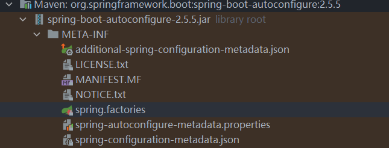
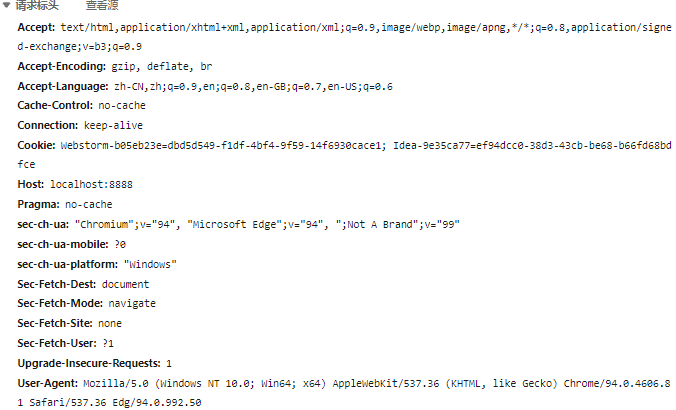

# SpringBoot概述

Spring Boot是由Pivotal团队提供的全新框架，其设计目的是用来简化新Spring应用的初始搭建以及开发过程。该框架使用了特定的方式来进行配置，从而使开发人员不再需要定义样板化的配置。

简而言之，SpringBoot项目也就是一个Maven项目，只不过其是spring-boot-starter-parent的依赖和其他的场景启动器、依赖组成，由spring-boot-starter-parent来进行依赖的管理，spring-boot-starter来提供自动配置等。Spring Boot框架的核心就在于依赖管理和自动配置。

# 依赖管理

**关于spring-boot-starter-parent：**

```xml
<!-- spring-boot-starter-parent的父项目几乎声明了所有开发中常用的依赖的版本号 -->
<parent>
    <groupId>org.springframework.boot</groupId>
    <artifactId>spring-boot-starter-parent</artifactId>
    <version>2.5.5</version>
    <relativePath/> <!-- lookup parent from repository -->
</parent>
```

**关于spring-boot-starter：**

spring-boot-starter是所有场景启动器最底层的依赖、最基本的， 包含了对自动配置的支持、日志、yaml，是不可缺少的，其他的所有starter都会引入有该starter，例如spring-boot-starter-web里第一个导入的依赖就是spring-boot-starter。

```xml
<!-- https://mvnrepository.com/artifact/org.springframework.boot/spring-boot-starter -->
<dependency>
    <groupId>org.springframework.boot</groupId>
    <artifactId>spring-boot-starter</artifactId>
    <version>2.5.5</version>
</dependency>
```

**关于自动仲裁机制：**

由于spring-boot-starter-parent的父项目几乎声明了所有开发中常用的依赖的版本号，所以引入的依赖默认都可以不写版本号（Maven的继承特性），引入非版本仲裁（spring-boot-starter-parent的父项目没有声明的）的jar依赖则要写版本号。

**关于修改依赖的默认版本号：**

```xml
<!-- 1、查看spring-boot-starter-parent 里的 spring-boot-dependencies，里面规定了依赖版本对应的key-->
<!-- 2、在当前项目里面重写版本号配置 -->
    <properties>
        <mysql.version>5.1.43</mysql.version>
    </properties>
```

**starter场景启动器：**

1、见到很多 spring-boot-starter-* ： *就是指某种场景。
2、只要引入starter，这个场景的所有常规需要的依赖都会自动引入。
3、SpringBoot所有支持的场景有：https://docs.spring.io/spring-boot/docs/current/reference/html/using-spring-boot.html#using-boot-starter。
4、见到的  *-spring-boot-starter： 第三方为我们提供的简化开发的场景启动器。

# 自动配置

## 自动配置特性

根据引入的场景启动器，会自动配置引入场景下的所需要配置。

1. 引入starter-tomcat场景后，自动配置好Tomcat： （引入Tomcat依赖并配置好Tomcat）

   ```xml
   <dependency>
         <groupId>org.springframework.boot</groupId>
         <artifactId>spring-boot-starter-tomcat</artifactId>
         <version>2.3.4.RELEASE</version>
         <scope>compile</scope>
   </dependency>
   ```

2. 引入starter-web场景：

   - 自动配置好SpringMVC：引入SpringMVC全套组件、自动配好SpringMVC常用组件（功能）；
   - 自动配置好Web常见功能，如：字符编码问题，所有web开发的常见场景配置；

3. 配置了默认的包结构：

   - 主程序所在包及其下面的所有子包里面的组件都会被默认扫描进来，无需以前spring的包扫描配置；

   - 可以使用`@SpringBootApplication(scanBasePackages="com.lsl")`或者`@ComponentScan `改变包扫描路径；

     ```java
     @SpringBootApplication 等同于下面三个注解的功能集合体
     @SpringBootConfiguration // 配置类
     @EnableAutoConfiguration // 自动配置
     @ComponentScan // 包扫描，默认扫描当前包和子包，使spring注解生效
     ```

4. 自动配置好的各种配置拥有默认值：

   - 比如配置好Tomcat，Tomcat的默认端口也就有了一个默认值；

   - 默认配置最终都是映射到某个类上，如：MultipartProperties；配置文件的值最终会绑定在某个类上，这个类会在容器中创建对象；
   - 以后要对默认配置进行修改，就使用yaml文件或properties文件。

5. 按需加载所有自动配置项：

   - SpringBoot所有的自动配置功能都在 spring-boot-autoconfigure jar包里面；

   - 自动配置项所在的spring-boot-autoconfigure包会加载进来，但不引入场景是不会生效的；

   - 通过非常多的starter来开启自动配置，引入了哪些starter场景，哪些场景的自动配置才会开启。

查看自动配置了哪些东西和数量：

```java
@SpringBootApplication
public class SpringBootMainConfigClass {
    public static void main(String[] args) {
//        SpringApplication.run(SpringBootMainConfigClass.class, args);
        ConfigurableApplicationContext run = SpringApplication.run(SpringBootMainConfigClass.class, args);
        int count = run.getBeanDefinitionCount();
        String[] names = run.getBeanDefinitionNames();
        for (String name : names) {
            System.out.println(name);
        }
        System.out.println(count);
    }
}
```

## 源码解析自动配置原理

### 1.引导加载自动配置类

主配置类的注解`@SpringBootApplication`，其相当于三个注解的集合体：

```java
@SpringBootConfiguration // 代表是一个配置类
@EnableAutoConfiguration // 自动配置
@ComponentScan(         // 包扫描，默认扫描当前包和子包，使spring注解生效
    excludeFilters = {@Filter(
    type = FilterType.CUSTOM,
    classes = {TypeExcludeFilter.class}
), @Filter(
    type = FilterType.CUSTOM,
    classes = {AutoConfigurationExcludeFilter.class}
)}
)
public @interface SpringBootApplication {}
```

**最重要的角色`@EnableAutoConfiguration`注解：**

```java
// @EnableAutoConfiguration
@AutoConfigurationPackage
@Import({AutoConfigurationImportSelector.class})
public @interface EnableAutoConfiguration {}
// AutoConfigurationPackage 自动配置包，利用Registrar导入主配置类的包及自包下所有的组件
@Import({Registrar.class})
public @interface AutoConfigurationPackage {}
// Registrar
static class Registrar implements ImportBeanDefinitionRegistrar, DeterminableImports {
        Registrar() {
        }
		// (new AutoConfigurationPackages.PackageImports(metadata)).getPackageNames() 返回主类所在包名
        public void registerBeanDefinitions(AnnotationMetadata metadata, BeanDefinitionRegistry registry) {
            AutoConfigurationPackages.register(registry, (String[])(new AutoConfigurationPackages.PackageImports(metadata)).getPackageNames().toArray(new String[0])); 
            // 得到主类包名然后封装进数组，进行注册
        }
```

 @AutoConfigurationPackage ：自动配置包注解，利用Registrar导入主配置类的包及自包下所有的组件；

@Import({AutoConfigurationImportSelector.class})：

1. 利用`getAutoConfigurationEntry(annotationMetadata)`给容器导入一些组件；
2. 通过 `List<String> configurations = this.getCandidateConfigurations(annotationMetadata, attributes); `获取要导入到 容器中的配置类；
3. 利用工厂加载`Map<String,List<String>> loadSpringFactories(@Nullable ClassLoader classLoader)`得到所有组件；
4. 加载文件：`META-INF/spring.factories`。

```java
// 给容器批量导入组件
public String[] selectImports(AnnotationMetadata annotationMetadata) {
    if (!this.isEnabled(annotationMetadata)) {
        return NO_IMPORTS;
    } else {
        AutoConfigurationImportSelector.AutoConfigurationEntry autoConfigurationEntry = this.getAutoConfigurationEntry(annotationMetadata);
        return StringUtils.toStringArray(autoConfigurationEntry.getConfigurations());
    }
}

// 通过 List<String> configurations = this.getCandidateConfigurations(annotationMetadata, attributes); 获取要导入到 容器中的配置类
```



spring.factories文件，写死了springboot启动就默认加载的所有配置类，但最终是按需配置（按照条件装配规则（按需加载的注解），导入了相关场景才会生效）。

### 2.自动配置流程：

1. 先加载所有的自动配置类（xxxAutoConfigConfiguration.class）；
2. 每个自动配置类按照条件进行生效，其属性值默认都会绑定配置文件中指定的值（xxxxProperties.class里面拿，xxxProperties.class和配置文件进行了绑定）；
3. 生效的配置类就会给容器中装配很多组件，只要容器中有这些组件，相当于这些功能就有了；
4. 定制化配置操作
  - 用户通过配置类直接自己@Bean往容器注册组件来替换底层的组件；
  - 用户去看这个组件是获取配置文件中的什么值就去修改，通过application文件（yaml文件或properties文件）修改。

流程：xxxxxAutoConfiguration ---> 组件  ---> xxxxProperties.class里面拿值  ----> 从application.properties配置文件拿值

# 底层注解

## 组件注解

spring的注解：@Configuration、@Bean、@Component、@Controller、@Service、@Repository、@ComponentScan、@Import、@Conditional

### @Configuration

使用这个注解的类称为配置类（配置了也是组件），相当于bean.xml文件，用于注册bean，其内返回的对象的方法使用@Bean来将返回的对象注册进容器。

`@Configuration(proxyBeanMethods = true)`：注册组件，

- proxyBeanMethods是代理bean的方法，是true表示是会被代理，用于决定是否保持组件的单实例。
- 最佳实践：如果是不被依赖bean，就使用false，用到就创建新对象，不存于容器。

### @Import

导入组件，用于给容器自动创建出某些类的对象并放入容器。用于注册进容器的类上。

`@Import(xxx.class, xxx.class, ...)`：注册组件，使用该注解注册进容器的组件的默认名为其全类名。

### @Conditional

用于类上，表示条件装配，用于满足指定条件时进行组件的注册。其有许多拓展注解，例如：

- `@ConditionalOnBean`：当容器中有某个bean的时候才能执行某些操作。
- `@ConditionalOnMissingBean`：当容器中没有某个bean的时候才能执行某些操作。
- `@ConditionalOnClass`：当容器中有某个类的时候才能执行某些操作。
- `@ConditionalOnClass`：当容器中有没某个类的时候才能执行某些操作。
- `@ConditionalOnResource`：当类路径存在某些资源的时候才能干什么。
- `@ConditionalOnProperty`：当配置文件里配置了某些属性的时候才能干什么。
- ......

### @ImporeResource

用于配置类上，当配置类生效，此注解也就生效，生效时就会通过指定的配置文件来往容器注册配置文件中定义好的组件。

`@ImporeResource("classpath:beans.xml")`：通过传统的bean.xml文件来注册组件并将其注册到容器中。

## 配置绑定注解

使用Java读取到properties文件中的某部分内容并封装到JavaBean中，JavaBean要注册在容器中。

1.@ConfigurationProperties + @Component

@ConfigurationProperties(prefix="xxx")将注册进容器的组件的属性和配置文件中的属性值绑定（和配置文件**application.properties**的带有某个前缀的进行绑定，properties文件中的key是`xxx.属性名`的形式，属性名是类的属性名）。

```java
@Data
@NoArgsConstructor
@AllArgsConstructor
@Component // 注册进容器
@ConfigurationProperties(prefix="cat")
public class Cat {
    private String name;
    private String age;
}
```

2.@EnableConfigurationProperties(xxx.class) + @ConfigurationProperties 

用于在1的方式中不能使用@Conponet的情况下，配置类上加入@EnableConfigurationProperties(xxx.class)，实现配置绑定功能和组件自动注册进容器。如下（前面几个注解是小辣椒的）：

```java
@Data
@NoArgsConstructor
@AllArgsConstructor
@ConfigurationProperties(prefix="cat")
public class Cat {
    private String name;
    private String age;
}
```

```java
@Configuration(proxyBeanMethods = false) // 配置类
// 开启Cat.class的配置绑定功能
// 并把Car这个组件自动注册到容器 注册进去的组件名格式为：cat-com.lsl.pojo.Cat （`类名小写-全类名`）
@EnableConfigurationProperties(Cat.class)
public class Config {

}
```

# SpringBoot

## 开发步骤

1. 创建SpringBoot项目，引入需要的场景；
2. application.yml，根据需要进行一定的配置；
3. 各种整合操作。


## 配置文件-yml

YAML 是 "YAML Ain't Markup Language"（意为 YAML 不是一种标记语言）的递归缩写。在开发的这种语言时，YAML 的意思其实是："Yet Another Markup Language"（仍是一种标记语言）。 非常适合用来做以数据为中心的配置文件。

基本语法
● `key: value`：kv之间有空格；
● 大小写敏感；
● 使用缩进表示层级关系；
● 缩进不允许使用tab，只允许空格；
● 缩进的空格数不重要，只要相同层级的元素左对齐即可；
● `#`表示注释；
● 字符串无需加引号，如果要加，' '与" "表示字符串内容会被 转义/不转义(例如转义字符"\n"原本就是表示换行的转义字符，单引号时会被再次转义，双引号时不被转义（此时就是原来的换行）)

数据类型：

```yaml
# 字面量写法：单个的、不可再分的值。date、boolean、string、number、null
key: value
keys: num 
url: "jdbc:mysql://localhost:3306/mysqldb"
# 对象写法：键值对的集合。map、hash、object 
object: {k1:v1,k2:v2,k3:v3,...}
object: 
    k1: v1
    k2: v2
    ...
# 数组：一组按次序排列的值。array、list、queue、set
k: [v1,v2,v3]
k:
 - v1
 - v2
 - v3
```

```yaml
# yaml表示对象
person:
  userName: zhangsan
  boss: false
  birth: 2019/12/12 20:12:33
  age: 18
  pet: 
    name: tomcat
    weight: 23.4
  interests: [篮球,游泳]
  animal: 
    - jerry
    - mario
  score:
    english: 
      first: 30
      second: 40
      third: 50
    math: [131,140,148]
    chinese: {first: 128,second: 136}
  salarys: [3999,4999.98,5999.99]
  allPets:
    sick:
      - {name: tom}
      - {name: jerry,weight: 47}
    health: [{name: mario,weight: 47}]
```

配置处理器：

```xml
<!-- 配置处理器的依赖，使用yml配置时提示功能 -->       
<dependency>
	<groupId>org.springframework.boot</groupId>
	<artifactId>spring-boot-configuration-processor</artifactId>
	<optional>true</optional>
</dependency>
<!-- 打包时不加入配置处理器的jar文件 -->    
 <build>
	<plugins>
		<plugin>
			<groupId>org.springframework.boot</groupId>
            <artifactId>spring-boot-maven-plugin</artifactId>
            <configuration>
                <excludes>
                    <exclude>
                        <groupId>org.springframework.boot</groupId>
                        <artifactId>spring-boot-configuration-processor</artifactId>
                    </exclude>
                </excludes>
            </configuration>
        </plugin>
    </plugins>
</build>
```

## 最佳实践

1. 根据所需引入starter场景和其他依赖；
   - 引入starter场景的artifactId见【https://docs.spring.io/spring-boot/docs/current/reference/html/using-spring-boot.html#using-boot-starter】。
2. 【选做】可以查看自动配置（XxxAutoConfigure）做了哪些功能：
   - 方法一：自己分析自动配置类（引入场景对应的自动配置一般都生效了）；
   - 方法二：配置文件中debug=true开启自动配置报告（Negative（不生效）\ Positive（生效））。
3. 是否需要定制或修改一些功能：
   - 参照文档修改配置文件 [Common Application Properties (spring.io)](https://docs.spring.io/spring-boot/docs/current/reference/html/application-properties.html#application-properties)；
   - 自己分析xxxxProperties绑定了哪些可以在配置文件中配置的。
   - `spring.banner.image.location: classpath:banner.gif`，设置spring boot启动的banner图。
4. 自定义加入或者替换组件：
   - @Bean、@Component等；
   - 自定义器  **XXXXXCustomizer**。

## 开发技巧

idea中搜索安装lombok插件，并在springboot项目中引入Lombok插件来简化JavaBean：

- @Data：生成getset方法；
- @ToString：tostring方法；
- @NoArgsConstructor、@AllArgsConstructor：生成无参或有参构造器；
- @EqualsAndHashCode：重写equals和hashcode方法；
- @Slf4j：日志记录器。

```xml
<dependency>
    <groupId>org.projectlombok</groupId>
    <artifactId>lombok</artifactId>
</dependency>
```

```xml
<!-- 项目打包时排除lombok的jar包 -->
<plugin>
    <groupId>org.springframework.boot</groupId>
    <artifactId>spring-boot-maven-plugin</artifactId>
    <configuration>
        <excludes>
            <exclude>
                <groupId>org.projectlombok</groupId>
                <artifactId>lombok</artifactId>
            </exclude>
        </excludes>
    </configuration>
</plugin>
```

dev-tools：ctrl + f9 重启

```xml
 <dependency>
        <groupId>org.springframework.boot</groupId>
        <artifactId>spring-boot-devtools</artifactId>
        <optional>true</optional>
    </dependency>
```

为了使配置文件中有提示，添加spring-boot-configuration-processor：

```xml
<dependency>
    <groupId>org.springframework.boot</groupId>
    <artifactId>spring-boot-configuration-processor</artifactId>
    <optional>true</optional>
</dependency>
```

```xml
<!-- 项目打包时排除processor的jar包 -->
<plugin>
    <groupId>org.springframework.boot</groupId>
    <artifactId>spring-boot-maven-plugin</artifactId>
    <configuration>
        <excludes>
            <exclude>
                <groupId>org.springframework.boot</groupId>
                <artifactId>spring-boot-configuration-processor</artifactId>
            </exclude>
        </excludes>
    </configuration>
</plugin>
```

使用SpringInitializr：项目初始化向导，选择场景并快速创建spring boot项目。

# web开发场景操作

```xml
<dependency>
    <groupId>org.springframework.boot</groupId>
    <artifactId>spring-boot-starter-web</artifactId>
</dependency>
```

## 静态资源

SpringBoot项目默认情况下在classpath路径下有几个目录为**默认的静态资源存放目录** ：` /static `、`/public `、`/resources `、` /META-INF/resources`，当访问某些资源时，映射路径不经controller处理就默认来静态资源目录下寻找。

原理：静态映射的是`/**`。请求进来先寻找controller是否能进行处理，不能处理的所有请求就交给了静态资源处理器来处理，如果找不到资源就报404错误。 

对静态资源的设置：     

- static-path-pattern：设置静态资源的映射前缀（默认是`static-path-pattern: /**`）
  - 例1：`localhost:8888/a.png`就是在几个静态资源目录下寻找，找到就能显示a.png了；
  - 例2：`localhost:8888/r/a.png`就是在几个静态资源目录下的`r`目录下寻找，找到就能显示a.png了；
  - 例3：设置static-path-pattern: /res/**，那么就得加上res，`localhost:8888/res/r/a.png`。
- static-locations：默认的为[classpath:/static/,classpath:/public/,classpath:/resources/,classpath:/META-INF/resources/]

```yaml
spring:
  mvc:
    static-path-pattern: /res/**
  web:
    # 修改默认静态资源路径，修改后原默认静态资源目录失效
    resources:
      static-locations: [classpath:/newstatic/,classpath:/newtemplates/]
      #static-locations: classpath:/newstatic/
```

还支持webjar，会自动映射 /webjars/**，见https://www.webjars.org/

```xml
    <dependency>
        <groupId>org.webjars</groupId>
        <artifactId>jquery</artifactId>
        <version>3.5.1</version>
    </dependency>
```
访问地址：http://localhost:8080/webjars/jquery/3.5.1/jquery.js   后面地址要按照依赖里面的包路径。

静态资源路径（这里说路径即目录）下的index.html可以作为欢迎页面，访问`localhost:port/`会自动跳转至这个页面，但是是在没有配置静态资源前缀的前提下。

静态资源路径下的favicon.ico图标可以作为页面标签图，当没有配置静态资源路径前缀的时候才有效。

## 请求处理

前端控制器的请求映射路径最前面的`/`不再是代表`localhost:port/webappName/`，而是代表`localhost:port/`。

也可以加上一个前置路径，以后所有的访问都要加上该前置路径，在application.yml中设置：

```yml
server:
	servlet:
		content-path: /webapp
```

设置好`/`也就代表了`localhost:port/webapp/`

### 普通参数接收

- @PathVariable：获取路径变量，可以指定key来获取某一个，也可以直接获取全部变量值；
- @RequestParam：获取请求参数；
- @CookieValue：获取cookie；
- @RequestBody：获取请求体，post请求才有；
- @RequestHeader：获取请求头：




```html
<body>
<a href="/act/3/lsl?age=18&inters=coding&inters=read">/act/3/lsl</a>
<form action="/save" method="POST">
    <input type="text" name="text">
    <input type="submit" value="提交">
</form>
</body>
```

```java
@Controller
public class RestController {
    @GetMapping(value = "/act/{id}/{name}")
    @ResponseBody
    public Map<String, Object> test(@PathVariable("name") String name,
                                    @PathVariable("id") Integer id,
                                    @PathVariable Map<String,String> kv,
                                    @RequestHeader("user-agent") String useragent,
                                    @RequestHeader Map<String,String> rh,
                                    @RequestParam("age", required = false) String age,
                                    @RequestParam("inters") List<String> inters,
                                    @RequestParam Map<String,String> params,
                                    @CookieValue("Webstorm-b05eb23e") String ck,
                                    @CookieValue("Webstorm-b05eb23e") Cookie cookie) {
        Map<String, Object> map = new HashMap<>();
        // @PathVariable 获取路径变量
        map.put("id",id); 
        map.put("name",name);
        map.put("kv",kv); 
        // @RequestHeader 获取请求头
        map.put("useragent", useragent);
        map.put("rh",rh);
        // @@RequestParam 获取请求参数，, required = false表示不是必须的
        map.put("age",age);
        map.put("inters",inters);
        map.put("params",params);
        // @CookieValue 获取cookie
        map.put("ck", ck);
        map.put("cookie",cookie);
        return map;
    }
    @PostMapping(value = "/save")
    @ResponseBody
    public Map<String, Object> test(@RequestBody String body) {
        Map<String, Object> map = new HashMap<>();
        // @RequestBody 获取请求体
        map.put("requestBody",body);
        return map;
    }
}
```

@RequestAttribute：获取统一请求中请求欲的值

```java
@Controller
public class Common {
    @GetMapping(value = "/goto")
    public String forward(HttpServletRequest request){
        request.setAttribute("args","转发成功了...");
        request.setAttribute("info","这是在同一请求域中");
        return "forward:/page";
    }
    @GetMapping(value = "/page")
    @ResponseBody
    public Map<String, Object> page(@RequestAttribute("args") String args, HttpServletRequest request) {
        Map<String, Object> map = new HashMap<>();
        String info = (String) request.getAttribute("info");
        map.put("args",args);
        map.put("info",info);
        return map;
    }
}
```

@MatrixVariable：获取矩阵变量（springboot默认不开启矩阵变量功能）

- 在请求路径后面携带信息，queryString：`/act/3/lsl?age=18&inters=coding&inters=read`；
- 通过矩阵变量携带信息：`/index/{id;name;age;inters}`。

开启矩阵变量功能两个方法：一是继承WebMvcConfigurer并重写configurePathMatch方法；二是向容器中注册重写了configurePathMatch方法的组件WebMvcConfigurer。

```java
@Configuration(proxyBeanMethods = false)
public class WebConfig implements WebMvcConfigurer{
    // 组件
    @Bean
    public WebMvcConfigurer webMvcConfigurer(){
        return new WebMvcConfigurer(){
            public void configurePathMatch(PathMatchConfigurer configurer) {
                UrlPathHelper urlPathHelper = new UrlPathHelper();
				// 不移除分号后面内容
                urlPathHelper.setRemoveSemicolonContent(false);
                configurer.setUrlPathHelper(urlPathHelper);
            }
        };
    }
    // 实现WebMvcConfigurer并重写
    @Override
    public void configurePathMatch(PathMatchConfigurer configurer) {
        UrlPathHelper urlPathHelper = new UrlPathHelper();
        urlPathHelper.setRemoveSemicolonContent(false);
        configurer.setUrlPathHelper(urlPathHelper);
    }
}
```

@MatrixVariable的使用方式如下：

```html
<!-- 第一个分号前表示路径 -->
<a href="/index/path;name=lsl;age=21;inters=read">@MatrixVariable：获取矩阵变量</a>
<a href="/index/path;name=lsl;age=21;inters=code,read,learn">@MatrixVariable：获取矩阵变量</a>
<a href="/index/path1;age=18/path2;age=21">@MatrixVariable：获取矩阵变量</a>
```

```java
// 映射路径要使用路径变量的方式
@ResponseBody
@GetMapping(value = "/index/{path}")
public Map<String, Object> test(@MatrixVariable("age") Integer age,
                                 @MatrixVariable("inters") List<String> inters) {
    Map<String, Object> map = new HashMap<>();
    map.put("age",age);
    map.put("inters", inters);
    return map;
}
@ResponseBody
@GetMapping(value = "/index/{path1}/{path2}")
public Map<String, Object> test(@MatrixVariable(value = "age", pathVar = "path1") Integer age1,
                                @MatrixVariable(value = "age", pathVar = "path2") Integer age2) {
    Map<String, Object> map = new HashMap<>();
    map.put("age1",age1);
    map.put("age2",age2);
    return map;
}
```

@ModelAttribute：获取

### 复杂参数接收

**Map**、**Model（map、model里面的数据会被放在request的请求域（跳转前放入）  相当于request.setAttribute）**、**RedirectAttributes（ 重定向携带数据）**、**ServletResponse（response）**、Errors/BindingResult、SessionStatus、UriComponentsBuilder、ServletUriComponentsBuilder。

### 自定义对象参数

数据绑定：请求处理方法形参是对象时，表单提交的数据会自动和对象属性进行绑定。

- WebDataBinder binder = binderFactory.createBinder(webRequest, attribute, name)；WebDataBinder ：web数据绑定器，将请求参数的值绑定到指定的JavaBean里面；
- WebDataBinder 利用它里面的 Converters 将请求数据转成指定的数据类型。再次封装到JavaBean中；
- GenericConversionService：在设置每一个值的时候，找它里面的所有converter那个可以将这个数据类型（request带来参数的字符串）转换到指定的类型（JavaBean -- Integer）
  byte -- > file

```java
// 自定义数据绑定：这里自定义绑定value值`name,age`封装成cat对象
@Bean
public WebMvcConfigurer webMvcConfigurer(){
    return new WebMvcConfigurer(){
        @Override
        public void addFormatters(FormatterRegistry registry) {
            registry.addConverter(new Converter<String, Cat>() {
                @Override
                public Cat convert(String source) {
                    if (!StringUtils.isEmpty(source)) {
                        Cat cat = new Cat();
                        String[] split = source.split(",");
                        cat.setName(split[0]);
                        cat.setAge(Integer.parseInt(split[1]));
                        return cat;
                    }
                    return null;
                }
            });
        }
    };
}
```

### Rest风格请求

以前使用（/getUser   获取用户     /deleteUser 删除用户    /editUser  修改用户       /saveUser 保存用户）为映射名称来表示对资源的操作。

现在使用Rest风格：Rest风格是使用HTTP请求方式动词来表示对资源的操作（/user    GET-获取用户    DELETE-删除用户     PUT-修改用户  POST-保存用户），表单需要提交隐藏参数。使用Rest风格的表单和RequestMapping映射如下设置：

```java
public class RestController {
    @GetMapping(value = "/user")
//    @RequestMapping(value = "/user", method = RequestMethod.GET)
    public String get() {
        return "get获取用户";
    }
    @DeleteMapping("/user")
//    @RequestMapping(value = "/user", method = RequestMethod.DELETE)
    public String delete() {
        return "delete删除用户";
    }
    @PutMapping(value = "/user")
//    @RequestMapping(value = "/user", method = RequestMethod.PUT)
    public String modify() {
        return "put修改用户";
    }
    @PostMapping("/user")
//    @RequestMapping(value = "/user", method = RequestMethod.POST)
    public String save() {
        return "post保存用户";
    }
}
```

```html
<form action="/user" method="get">
    <input name="_method" type="hidden" value="GET"/>
    <input type="submit" value="获取">
</form>
<form action="/user" method="post">
    <input name="_method" type="hidden" value="PUT"/>
    <input type="submit" value="修改">
</form>
<form action="/user" method="post">
    <input name="_method" type="hidden" value="DELETE"/>
    <input type="submit" value="删除">
</form>
<form action="/user" method="post">
    <input name="_method" type="hidden" value="POST"/>
    <input type="submit" value="保存">
</form>
```

【注意】默认不开启Rest风格，需要手动开启，兼容的PUT、DELETE、PATCH的在表单必须是post请求，不影响表单原生get、post请求：

```yaml
spring:
  mvc:
    hiddenmethod:
      filter:
        enabled: true # 选择性开启表单rest风格
```

定制`_method`：创建配置类往容器注册HiddenHttpMethodFilter组件

```java
@Configuration(proxyBeanMethods = false)
public class WebConfig {
    @Bean
    public HiddenHttpMethodFilter hiddenHttpMethodFilter(){
        HiddenHttpMethodFilter methodFilter = new HiddenHttpMethodFilter();
        methodFilter.setMethodParam("_m");
        return methodFilter;
    }
}
```

关于rest风格的原理，见该类：

```java
  @Bean
  @ConditionalOnMissingBean(HiddenHttpMethodFilter.class)
  @ConditionalOnProperty(prefix = "spring.mvc.hiddenmethod.filter", name = "enabled", matchIfMissing = false)
  public OrderedHiddenHttpMethodFilter hiddenHttpMethodFilter() {
    return new OrderedHiddenHttpMethodFilter();
  }
```

请求映射原理：

所有的请求映射都在HanderMapping中...

## 响应处理

响应分为响应页面和响应数据。

响应数据 ===》内容协商功能：根据客户端接收能力不同，返回不同媒体类型的数据。

springboot内容协商的实现——springboot底层已经实现好了，当支持：

json支持xml的模块依赖（springboot底层利用MessageConverters会实现内容协商，根据请求头来决定发送json数据或者xml等数据，前提是springboot项目里支持各种数据）：

```xml
<dependency>
    <groupId>com.fasterxml.jackson.dataformat</groupId>
    <artifactId>jackson-dataformat-xml</artifactId>
</dependency>
```


为了方便内容协商，开启基于请求参数的内容协商功能：

```yaml
spring:
    contentnegotiation:
      favor-parameter: true # 开启请求参数的内容协商模式
```

开启后在请求路径中携带format=json来指定响应返回的数据类型：

- `http://localhost:8888/test?format=json`；
- `localhost:8888/test?format=xml&xxxx`。

如果想要返回其他的类型，比如pdf等，就可以通过自定义协商管理器来实现，实现多协议数据兼容，步骤：

1. 添加自定义的MessageConverters进系统底层，系统底层会统计出所有的MessageConverters可以操作哪些数据类型；
2. 客户端内容协商。

自定义MessageConverters：

```java
public class MyMessageConverter implements HttpMessageConverter<Cat> {
    @Override
    //
    public boolean canRead(Class clazz, MediaType mediaType) {
        return false;
    }

    @Override
    public boolean canWrite(Class clazz, MediaType mediaType) {
        return clazz.isAssignableFrom(Cat.class);
    }
    // 获取所有的内容协商的类型
    @Override
    public List<MediaType> getSupportedMediaTypes() {
        // 设置请求头媒体类型
        return MediaType.parseMediaTypes("application/x-lsl");
    }

    @Override
    public Cat read(Class clazz, HttpInputMessage inputMessage) throws IOException, HttpMessageNotReadableException {
        return null;
    }

    @Override
    public void write(Cat cat, MediaType contentType, HttpOutputMessage outputMessage) throws IOException, HttpMessageNotWritableException {
        // 自定义协议数据写出格式
        String data = cat.getName() + "//" + cat.getAge();
        // 写出
        OutputStream body = outputMessage.getBody();
        body.write(data.getBytes());
    }
}
```

注册进容器：

```java
@Configuration(proxyBeanMethods = false)
public class WebConfig implements WebMvcConfigurer{
    @Bean
    public WebMvcConfigurer webMvcConfigurer(){
        return new WebMvcConfigurer(){
            @Override
            public void extendMessageConverters(List<HttpMessageConverter<?>> converters) {
                converters.add(new MyMessageConverter());
            }
        };
    }
}
```

如何通过路径参数的方式来进行自定义类型的内容协商？

```java
@Configuration(proxyBeanMethods = false)
public class WebConfig implements WebMvcConfigurer{
    @Bean
    public WebMvcConfigurer webMvcConfigurer(){
        return new WebMvcConfigurer(){

            @Override
            // 自定义参数模式内容协商策略
            public void configureContentNegotiation(ContentNegotiationConfigurer configurer) {
                // Map<String, MediaType> mediaTypes
                Map<String, MediaType> mediaTypes = new HashMap<>();
                // 指定支持哪些参数对应的哪些类型
                mediaTypes.put("json",MediaType.APPLICATION_JSON);
                mediaTypes.put("xml",MediaType.APPLICATION_XML);
                mediaTypes.put("ll",MediaType.parseMediaType("application/x-lsl"));
                ParameterContentNegotiationStrategy parameterStrategy = new ParameterContentNegotiationStrategy(mediaTypes);
                // 可以指定参数的key 默认format
                parameterStrategy.setParameterName("for");
                configurer.strategies(Arrays.asList(parameterStrategy));
            }

            @Override
            public void extendMessageConverters(List<HttpMessageConverter<?>> converters) {
                converters.add(new MyMessageConverter());
            }
        };
    }
}
```


通过：[localhost:8888/test?format=ll](http://localhost:8888/test?format=ll)   访问返回自定义类型成功。

## thymeleaf引入

**1.引入场景启动器：**

```xml
<dependency>
    <groupId>org.springframework.boot</groupId>
    <artifactId>spring-boot-starter-thymeleaf</artifactId>
</dependency>
```

已经自动配置好了thymeleaf，其中的两个配置如下：

```java
public static final String DEFAULT_PREFIX = "classpath:/templates/";
public static final String DEFAULT_SUFFIX = ".html";
```

**2.使用：**

页面资源要放在templates路径下，返回的页面路径经视图解析器添加上前缀和后缀，然后渲染后再经浏览器显示。

HTML页面要引入thymeleaf的名称空间：

```html
<html lang="en" xmlns:th="http://www.thymeleaf.org">
```

自定义配置：

```yaml
spring:
  thymeleaf:
    prefix: classpath:/templates/
    suffix: .html
    ca
```


## 拦截器

自定义拦截器：访问路径拦截

```java
@Slf4j
public class LoginInterceptor implements HandlerInterceptor {
    // 目标执行前（controller前）
    @Override
    public boolean preHandle(HttpServletRequest request, HttpServletResponse response, Object handler) throws Exception {
        // 拦截逻辑：什么情况下拦截（拦截哪些在拦截器注册时的配置决定），什么情况下放行
        String uri = request.getRequestURI();
        log.info("拦截的请求" + uri);
        HttpSession session = request.getSession();
        Object loginUser = session.getAttribute("loginUser");
        if (loginUser != null) {
            return true; // 返回true，放行
        }
        session.setAttribute("msg","请登录~");
        response.sendRedirect("/");
        return false;
    }
    // 目标方法执行完成后（但页面没有渲染的时候）
    @Override
    public void postHandle(HttpServletRequest request, HttpServletResponse response, Object handler, ModelAndView modelAndView) throws Exception {
        HandlerInterceptor.super.postHandle(request, response, handler, modelAndView);
    }
    // 页面渲染完之后
    @Override
    public void afterCompletion(HttpServletRequest request, HttpServletResponse response, Object handler, Exception ex) throws Exception {
        HandlerInterceptor.super.afterCompletion(request, response, handler, ex);
    }
}
```

自定义拦截器的注册和配置：

```java
@Configuration
public class InterceptorConfig implements WebMvcConfigurer {
    @Override
    public void addInterceptors(InterceptorRegistry registry) {
        // 添加拦截器并配置拦截路径 
        // 拦截器可以拦截一部分放行一部分：addPathPatterns-拦截路径 excludePathPatterns-放行路径
        // 如下：拦截/下所有资源的同时放行 "/","/login","/css/**","/js/**","/fonts/**","/images/**","/lib/**"
        registry.addInterceptor(new LoginInterceptor()).addPathPatterns("/**").
                excludePathPatterns("/","/login","/css/**","/js/**","/fonts/**","/images/**","/lib/**");
    }
}
```

## 跨域


## 文件上传

```java
@Controller
@Slf4j
public class FileController {
    @PostMapping(value = "/download")
    // MultipartFile会自动封装上传的文件
    public String download(@RequestPart("headImg") MultipartFile headerImg,
                           @RequestPart("photos") MultipartFile[] photos){
        log.info("上传信息:headerImg={},photos={}",headerImg.getSize(), photos.length);
        if(!headerImg.isEmpty()) {
            // 保存到文件服务器
            String originalFilename = headerImg.getOriginalFilename();
            try {
                headerImg.transferTo(new File("D:\\cache\\" + originalFilename));
            } catch (IOException e) {
                e.printStackTrace();
            }
        }
        if (photos.length > 0) {
            for (MultipartFile file:
                 photos) {
                if (!file.isEmpty()) {
                    String originalFilename = file.getOriginalFilename();
                    try {
                        file.transferTo(new File("D:\\cache\\" + originalFilename));
                    } catch (IOException e) {
                        e.printStackTrace();
                    }
                }
            }
        }
        return "success";
    }
}
```

```html
<!-- form表单 -->
<form role="form" action="/download" method="post" enctype="multipart/form-data">
   <!-- 单文件 -->
  <label for="img">头像</label>
  <input id="img" type="file" name="headImg" ><br>
    <!-- 多文件 -->
  <label for="mimg">生活照</label>
  <input id="mimg" type="file" name="photos" multiple><br>
  <input type="submit" value="提交">
</form>
```

```yaml
spring:
  servlet:
    multipart:
      # 默认限制上传单个文件不超过1MB，总请求不超过10MB
      max-file-size: 10MB
      max-request-size: 100MB
```

## 错误页面

默认情况下，Spring Boot提供`/error`处理所有错误的映射，对于机器客户端，它将生成JSON响应，其中包含错误，HTTP状态和异常消息的详细信息。对于浏览器客户端，响应一个“ whitelabel”错误视图，以HTML格式呈现相同的数据。

静态资源路径下的`error/`路径下的4xx.html、5xx.html会自动被解析。

定制错误处理逻辑：

1. 静态资源路径下自定义错误页`error/404.html` 、`error/5xx.html`（有精确的错误状态码页面就匹配精确，没有就找 4xx.html；如果都没有就触发白页）；
2. @ControllerAdvice+@ExceptionHandler处理全局异常（底层是 ExceptionHandlerExceptionResolver 支持的；常用的方式）；
3. @ResponseStatus+自定义异常 ：
   - 底层是 ResponseStatusExceptionResolver ，把responsestatus注解的信息底层调用 response.sendError(statusCode, resolvedReason)；tomcat发送的/error。

自定义异常解析器：

```java
@Order(value = Ordered.HIGHEST_PRECEDENCE) // 越小优先级越高
@Component
public class MyExceptionHandler implements HandlerExceptionResolver {

    @Override
    public ModelAndView resolveException(HttpServletRequest request, HttpServletResponse response, Object handler, Exception ex) {
        try {
            response.sendError(511,"511错误");
        } catch (IOException e) {
            e.printStackTrace();
        }

        return new ModelAndView();
    }
}
```

## 原生组件注入

Servlet、Filter、Listener


# 数据操作

## 使用jdbc场景

### 操作步骤

**1.jdbc场景导入和数据库驱动导入：**

```xml
<!-- 导入场景和驱动包 -->
<dependency>
    <groupId>org.springframework.boot</groupId>
    <artifactId>spring-boot-starter-jdbc</artifactId>
    <scope>test</scope>
</dependency>
<dependency>
    <groupId>mysql</groupId>
    <artifactId>mysql-connector-java</artifactId>
    <version>5.1.46</version> <!-- 利用maven的就近依赖修改版本 -->
</dependency>
<!-- 修改版本号的方法2：依赖不指定版本号，在properties指定 -->
<properties>
    <java.version>1.8</java.version>
    <mysql.version>5.1.46</mysql.version>
</properties>
```

jdbc场景导入内容有：HikariCP（数据库连接池）、spring-jdbc、spring-tx。但没有导入数据库驱动（因此需要另外声明依赖导入），为什么呢？因为官方不知道要使用哪些数据库，所以数据库驱动没有安装进去，但数据库驱动的版本仲裁还是存在的。

jdbc场景的自动配置有：

1. DataSourceAutoConfiguration ： 数据源的自动配置：
   - 修改数据源相关的配置：**spring.datasource**；
   - 数据库连接池的配置，是当自己容器中没有DataSource才自动配置的；
   - **底层配置好的连接池是：HikariDataSource**。
2. DataSourceTransactionManagerAutoConfiguration： 事务管理器的自动配置；

3. JdbcTemplateAutoConfiguration： springboot自带的**JdbcTemplate**，其自动配置，可以来对数据库进行crud：
   - 可以修改这个配置项@ConfigurationProperties(prefix = "spring.jdbc") 来修改JdbcTemplate；
   -  @Bean @Primary    JdbcTemplate；容器中有这个组件。
4. JndiDataSourceAutoConfiguration： jndi的自动配置；

5. XADataSourceAutoConfiguration： 分布式事务相关的。

**2.修改配置项：**

```yaml
spring:
  mvc:
    static-path-pattern: /resource/**
  datasource:
    driver-class-name: com.mysql.jdbc.Driver
    type: com.alibaba.druid.pool.DruidDataSource
    url: jdbc:mysql://localhost:3306/mysqltest?useUnicode=true&characterEncoding=utf8&useSSL=false
    username: root
    password: 123456
# 开启日志功能
logging:
  level:
    com.lsl.mappper: debug
```

**测试：**直接在项目的test目录里测试。

```java
@Slf4j
@SpringBootTest
class SpringbootFileApplicationTests {

    @Autowired
    // 使用JdbcTemplate来进行SQL操作
    JdbcTemplate template;
    
    @Test
    void contextLoads() {
        List<Map<String, Object>> maps = template.queryForList("select  * from info");
        for (int i = 0; i < maps.size(); i++) {
            System.out.println(maps.get(i));
        }
    }
}
```

### 使用其他连接池

如果不使用默认的数据源，配置其他的数据库连接池，以druid（[alibaba/druid: 阿里云计算平台DataWorks(https://help.aliyun.com/document_detail/137663.html) 团队出品，为监控而生的数据库连接池 (github.com)](https://github.com/alibaba/druid)）为例，两种配置方式：

**自定义引入：**

1.导入依赖：

```xml
<dependency>
    <groupId>com.alibaba</groupId>
    <artifactId>druid</artifactId>
    <version>1.1.8</version>
</dependency>
```

2.往容器注册组件，容器中存在数据源时，就不会使用默认的数据源。

```java
@Component
public class MyDataSources {
    // 将数据源装配进容器 自动配置会默认先判断容器中有没有数据源，如果没有就使用默认的数据源
    // 数据绑定配置项(与返回对象绑定)，绑定后就可以在yml文件配置url、driver等 spring： database: url:
    @ConfigurationProperties(prefix = "spring.datasource")
    @Bean
    public DataSource dataSource() {
        DruidDataSource duridDataSource = new DruidDataSource();
        return duridDataSource;
    }
}
```

3.yml中配置：

```yaml
spring:
  mvc:
    static-path-pattern: /resource/**
  datasource:
    url: jdbc:mysql://localhost:3306/mysqltest?useUnicode=true&characterEncoding=utf8&useSSL=false
    username: root
    password: 123456
    type: com.alibaba.druid.pool.DruidDataSource
    driver-class-name: com.mysql.jdbc.Driver
```

**starter方式引入：**

1.声明导入场景：

```xml
<dependency>
    <groupId>com.alibaba</groupId>
    <artifactId>druid-spring-boot-starter</artifactId>
    <version>1.1.17</version>
</dependency>
```

2.配置：

引入数据源场景后，就可以直接在yml配置文件配置了；如果要使用 druid数据库连接池的功能，可以在yaml中对druid进行配置，如何配置见：[github.com](https://github.com/alibaba/druid/tree/master/druid-spring-boot-starter)。

```yaml
spring:
  mvc:
    static-path-pattern: /resource/**
  datasource:
    url: jdbc:mysql://localhost:3306/mysqltest?useUnicode=true&characterEncoding=utf8&useSSL=false
    username: root
    password: 123456
    type: com.alibaba.druid.pool.DruidDataSource
    driver-class-name: com.mysql.jdbc.Driver
```

----------------------------------------------------------------------------------------------------

**测试：**直接在项目的test目录里测试。

使用JdbcTemplate对数据库数据进行操作：

 JdbcTemplate是Spring对JDBC的封装，目的是使JDBC更加易于使用。JdbcTemplate是Spring的一部分。JdbcTemplate处理了资源的建立和释放。他帮助我们避免一些常见的错误，比如忘了总要关闭连接。他运行核心的JDBC工作流，如Statement的建立和执行，而我们只需要提供SQL语句和提取结果。在JdbcTemplate中执行SQL语句的方法大致分为3类：

1. execute：可以执行所有SQL语句，一般用于执行DDL语句；
2. update：用于执行insert、update、delete等DML语句；
3. queryXxx：用于DQL数据查询语句。

```java
@Slf4j
@SpringBootTest
class SpringbootFileApplicationTests {

    @Autowired
    // 使用JdbcTemplate来进行SQL操作
    JdbcTemplate template;

    @Autowired
    DataSource dataSource;
    @Test
    void contextLoads() {
        log.info("数据源类型：{}",dataSource.getClass());
        List<Map<String, Object>> maps = template.queryForList("select  * from info");
        for (int i = 0; i < maps.size(); i++) {
            System.out.println(maps.get(i));
        }
    }
}
```

## 整合mybatis

### **1.整合步骤：**

参考官方：[GitHub - mybatis/spring-boot-starter: MyBatis integration with Spring Boot](https://github.com/mybatis/spring-boot-starter)

1、场景引入：（还需添加数据库连接池的场景或依赖、添加数据库驱动的依赖）

```xml
<!-- https://mvnrepository.com/artifact/org.mybatis.spring.boot/mybatis-spring-boot-starter -->
<dependency>
    <groupId>org.mybatis.spring.boot</groupId>
    <artifactId>mybatis-spring-boot-starter</artifactId>
    <version>2.2.0</version>
</dependency>
```

引入场景做了的自动配置如下：

- 导入了jdbc、mybatis-spring、spring-tx、HikariCP等。
- SqlSessionFactory、SqlSessionFactoryBean：自动配置好；
- DataSource：数据源，由jdbc和连接池操作可以配置要使用的数据源决定；
- MybatisProperties：mybatis配置绑定类；
- SqlSessionTemplate：自动配置有，组合了SqlSession。

2、数据源配置

具体见jdbc场景和连接池操作，然后配置：

```yaml
spring:
  mvc:
    static-path-pattern: /resource/**
  datasource:
    driver-class-name: com.mysql.jdbc.Driver
    type: com.alibaba.druid.pool.DruidDataSource
    url: jdbc:mysql://localhost:3306/mysqltest?useUnicode=true&characterEncoding=utf8&useSSL=false
    username: root
    password: 123456
# 开启日志功能
logging:
  level:
    com.lsl.mappper: debug
```

**测试是否配置成功：**直接在项目的test目录里测试。

```java
@Slf4j
@SpringBootTest
class SpringbootFileApplicationTests {

    @Autowired
    // 使用JdbcTemplate来进行SQL操作
    JdbcTemplate template;

    @Autowired
    DataSource dataSource;
    @Test
    void contextLoads() {
        log.info("数据源类型：{}",dataSource.getClass());
        List<Map<String, Object>> maps = template.queryForList("select  * from info");
        for (int i = 0; i < maps.size(); i++) {
            System.out.println(maps.get(i));
        }
    }
}
```

### 2.1使用-配置文件版

1.准备好SQL映射文件和接口：

XxxMapper.xml：SQL映射文件，namespace绑定xxxMapper接口，SQL语句id要和对应接口方法的名字一致：

```xml
<?xml version="1.0" encoding="UTF-8" ?>
<!DOCTYPE mapper
        PUBLIC "-//mybatis.org//DTD Mapper 3.0//EN"
        "http://mybatis.org/dtd/mybatis-3-mapper.dtd">
<mapper namespace="com.lsl.dao.InfoMapper">
    <select id="getStudent" resultType="com.lsl.pojo.Student">
        select name, age, school, nowadays from info where id=#{id}
    </select>
</mapper>
```

2.准备mybatis-config全局配置文件和在yaml配置文件中的配置设置：

mybatis-config.xml：

```xml
<?xml version="1.0" encoding="UTF-8" ?>
<!DOCTYPE configuration
        PUBLIC "-//mybatis.org//DTD Config 3.0//EN"
        "http://mybatis.org/dtd/mybatis-3-config.dtd">
<configuration>
    <!-- 开启驼峰命名 表中字段 t_user -》 tUser -->
    <settings>
        <setting name="mapUnderscoreToCamelCase" value="true"/>
    </settings>
</configuration>
```

application.yml：

```yaml
mybatis:
  # 引入mybatis全局配置文件
  # config-location: classpath:mybatis/mybatis-config.xml
  mapper-locations: classpath:mybatis/mapper/*.xml
  configuration:
    map-underscore-to-camel-case: true # 开启驼峰命名
```

【注意】：这个`config-location: classpath:mybatis/mybatis-config.xml`和`configuration`不能共存，要么使用mybatis-config.xml来配置，要么使用configuration（建议：使用configuration来进行mybatis全局配置，如上）。

3.测试

---------------------------------------------------------------------------------------------------------------------------------------------------------------------------------------------------------------------

### **2.2使用-注解版：**

`@Mapper`：用于接口映射器；语句相关：`@Insert`、`@Select`、 @Options、...

批量设置：`@MapperScan("com.lsl.xxx")`，用于主配置类上，用来扫描Mapper接口所在包，然后才能对Mapper接口进行装配。

```java
@Mapper
public interface AnnoInfoMapper {
    @Select(value = "select name,age,school,nowadays from info where id=#{id}")
    public Student getByIds(Long id);
}
// 然后可以在service直接注入AnnoInfoMapper来调用方法了
```

```xml
<!-- useGeneratedKeys="true" keyProperty="id" 的作用在于插入完成后返回数据库中自增的id值，只对insert有效 -->
<!-- 返回的值放入传参对象的id属性，如下insert语句（keyProperty控制返回给哪个属性） -->
<insert id="addStudent" useGeneratedKeys="true" keyProperty="id">
    insert into info(name,age,school) values (#{name},#{age},#{school})
</insert>

<!-- 上面SQL语句的注解方式 -->
@Insert(value = "insert into info(name,age,school) values (#{name},#{age},#{school})")
    @Options(useGeneratedKeys = true, keyProperty = "id")
    public boolean addStudent(Student student);
<!-- 最后返回的student的id属性值不再是null，如下可测试 -->
@PostMapping(value = "/add")
    @ResponseBody
    public Student addStudent(Student student) {
        studentService.addStudent(student);
        return student;
    }
```

关于混合模式的使用：注解与映射文件相结合（简单的方法就使用注解，复杂的SQL方法就使用映射文件）。

### 总结：最佳实战：

步骤：

1. 引入mybatis-starter；
2. 在application.yaml中配置，指定mapper-location位置、数据源配置即可；
3. 编写Mapper接口并标注@Mapper注解；
4. 简单方法直接使用注解方式；
5. 复杂方法编写mapper.xml进行绑定映射；
6. 在主配置类使用@MapperScan("com.atguigu.admin.mapper") 简化，其他的接口就可以不用标注@Mapper注解。

## 整合MybatisPlus

MyBatis-Plus（简称 MP）是一个 MyBatis 的增强工具，在 MyBatis 的基础上只做增强不做改变，为简化开发、提高效率而生。
[简介 | MyBatis-Plus (baomidou.com)](https://baomidou.com/guide/)，建议idea中安装 MybatisX 插件 。

**整合步骤：**

1.引入场景、驱动依赖：

```xml
<!-- https://mvnrepository.com/artifact/com.baomidou/mybatis-plus-boot-starter -->
<dependency>
    <groupId>com.baomidou</groupId>
    <artifactId>mybatis-plus-boot-starter</artifactId>
    <version>3.4.3.4</version>
</dependency>
<dependency>
    <groupId>mysql</groupId>
    <artifactId>mysql-connector-java</artifactId>
    <version>5.1.46</version>
</dependency>
```

mybatis-plus-boot-starter的自动配置：

- MybatisPlusProperties：配置项绑定，在yaml配置文件中`mybatis-plus: xxx`就是对mybatis-plus的定制。
- 自动配置好了SqlSessionFactory、SqlSessionTemplate。
- mapperLocations自动配置好了，默认值是`classpath*:/mapper/**/*.xml`。表示：任意**包的类路径**下的mapper文件夹下的任意路径下的xml文件，都是SQL映射文件。
- `@Mapper`接口标注的接口会被自动扫描生效。（建议使用`@MapperScan()`）
- 数据源是从容器中获取，给容器放啥就是啥。

2.数据源的配置：和jdbc、数据库连接池的配置一样

**开发使用：**

1. 创建对应表的实体类，实体类和表的名称映射默认开启驼峰命名方式；

2. 映射接口继承BaseMapper接口：

   ```java
   // 泛型指定的类型，也决定了SQL语句调用哪个表，如下的接口就是操作`test`表
   // 继承后就可使用接口中的方法进行操作了，也可以再使用映射文件拓展其他的复杂的SQL语句
   @Mapper
   public interface TestMapper extends BaseMapper<Test> {
   
   }
   ```

3. 测试：

   ```java
   @Slf4j
   @SpringBootTest
   class SpringbootFileApplicationTests {
       @Autowired
       TestMapper testMapper;
       @Test
       void plus(){
           Test test = testMapper.selectById(1);
           System.out.println(test.getAcct());
       }
   }
   ```

4. 如果需要其他的SQL语句，可以在`resources`目录下新建`mapper`文件夹，该文件夹下的SQL映射文件会被自动扫描生效。

## 整合Redis

**1.场景开启：**

```xml
<dependency>
    <groupId>org.springframework.boot</groupId>
    <artifactId>spring-boot-starter-data-redis</artifactId>
</dependency>
```

**2.配置redis地址和端口：**

```yaml
spring:
  redis:
    host: 192.168.137.129
    port: 6379
```

**3.往容器添加该组件：**用于自定义序列化方式，几乎包含了所有场景。

```java
@Configuration
public class RedisConfig {
    @Bean
    public RedisTemplate<String, Object> redisTemplate(RedisConnectionFactory factory) {
        RedisTemplate<String,Object> template = new RedisTemplate<>();
        template.setConnectionFactory(factory);
        // 序列化配置
        Jackson2JsonRedisSerializer jackson2JsonRedisSerializer = new Jackson2JsonRedisSerializer(Object.class);
        ObjectMapper om = new ObjectMapper();
        om.setVisibility(PropertyAccessor.ALL, JsonAutoDetect.Visibility.ANY);
        om.enableDefaultTyping(ObjectMapper.DefaultTyping.NON_FINAL);
        jackson2JsonRedisSerializer.setObjectMapper(om);
        // string的序列化
        StringRedisSerializer stringRedisSerializer = new StringRedisSerializer();
        // key hash采用String的序列化方式
        template.setKeySerializer(stringRedisSerializer);
        template.setHashKeySerializer(stringRedisSerializer);
        // value、Hash的Value序列化方式使用Jackson
        template.setValueSerializer(jackson2JsonRedisSerializer);
        template.setHashValueSerializer(jackson2JsonRedisSerializer);
        template.afterPropertiesSet();
        return template;
    }
}
```

**4.测试：**

```java
@Slf4j
@SpringBootTest
class SpringbootFileApplicationTests {
    @Autowired
    @Qualifier("redisTemplate")
    RedisTemplate redisTemplate;
    @Test
    void testRedis() {
        // 对String类型数据的操作的对象
        ValueOperations<String, String> operations = redisTemplate.opsForValue();
        operations.set("hello","hello world");
    }
}
```

**切换使用jedis：**（jedis就是基于java语言的redis客户端，集成了redis的命令操作，提供了连接池管理。）

1.添加依赖

```xml
<dependency>
    <groupId>redis.clients</groupId>
    <artifactId>jedis</artifactId>
</dependency>
```

2.配置：

```yaml
spring:
    redis:
      host: 192.168.137.129
      port: 6379
      client-type: jedis
```

3.测试

```java
@Slf4j
@SpringBootTest
class SpringbootFileApplicationTests {
    @Test
	void jedisTest(){
    	Jedis j = new Jedis("192.168.137.129",6379);
    	System.out.println(j.ping("连接成功"));
	}
}
```

# JUnit5

## 概述

官方文档：[JUnit 5 User Guide](https://junit.org/junit5/docs/current/user-guide/)

Spring Boot 2.2.0 版本开始引入 JUnit 5 作为单元测试默认库，作为最新版本的JUnit框架，JUnit5与之前版本的Junit框架有很大的不同。由三个不同子项目的几个不同模块组成：JUnit 5 = JUnit Platform + JUnit Jupiter + JUnit Vintage。

- JUnit Platform: Junit Platform是在JVM上启动测试框架的基础，不仅支持Junit自制的测试引擎，其他测试引擎也都可以接入。
- JUnit Jupiter: JUnit Jupiter提供了JUnit5的新的编程模型，是JUnit5新特性的核心。内部 包含了一个**测试引擎**，用于在Junit Platform上运行。
- JUnit Vintage: 由于JUint已经发展多年，为了照顾老的项目，JUnit Vintage提供了兼容JUnit4.x,Junit3.x的测试引擎。


【注意】：SpringBoot 2.4 以上版本移除了默认对 Vintage 的依赖。如果需要兼容junit4则需要自行引入（也就是不能使用junit4的@Test，只能使用Junit5的），如果需要继续兼容junit4需要自行引入vintage：

```xml
<!-- 兼容Junit4 -->
<dependency>
    <groupId>org.junit.vintage</groupId>
    <artifactId>junit-vintage-engine</artifactId>
    <scope>test</scope>
    <exclusions>
        <exclusion>
            <groupId>org.hamcrest</groupId>
            <artifactId>hamcrest-core</artifactId>
        </exclusion>
    </exclusions>
</dependency>
```

区分是Junit4的还是Junit5的：`import org.junit.jupiter.api.Test;`——Junit5；`import org.junit.api.Test;`——Junit4。

## 使用

### 环境

以前SpringBoot中单元测试：`@SpringBootTest + @RunWith(SpringTest.class)`；

SpringBoot整合Junit以后：

- 编写测试方法：`@Test`标注（注意需要使用junit5版本的注解，`import org.junit.jupiter.api.Test;`）
- Junit类具有Spring的功能：`@Autowired`、比如 `@Transactional` 标注测试方法，测试完成后自动回滚。

1.场景

```xml
<dependency>
    <groupId>org.springframework.boot</groupId>
    <artifactId>spring-boot-starter-test</artifactId>
    <scope>test</scope>
</dependency>
```

2.test目录下。

### 常用注解

JUnit5的注解与JUnit4的注解有所变化：`https://junit.org/junit5/docs/current/user-guide/#writing-tests-annotations`。

- @Test ：表示方法是测试方法。但是与JUnit4的@Test不同，他的职责非常单一不能声明任何属性，拓展的测试将会由Jupiter提供额外测试。
- @DisplayName :为测试类或者测试方法设置展示名称。
- @BeforeEach :表示在每个单元测试之前执行。
- @AfterEach :表示在每个单元测试之后执行。
- @BeforeAll :表示在所有单元测试之前执行。
- @AfterAll :表示在所有单元测试之后执行。
- @Tag :表示单元测试类别，类似于JUnit4中的@Categories。
- @Disabled :表示测试类或测试方法不执行，类似于JUnit4中的@Ignore。
- @Timeout :表示测试方法运行如果超过了指定时间将会返回错误。
- @ExtendWith :为测试类或测试方法提供扩展类引用。
- @ParameterizedTest ：表示方法是参数化测试。
- @RepeatedTest：表示方法可重复执行。

`@SpringBootTest`注解包含的Junit5注解：（使用`@SpringBootTest`就可以使用容器功能了）

```java
@BootstrapWith(SpringBootTestContextBootstrapper.class)
@ExtendWith({SpringExtension.class})
```

```java
@DisplayName("Junit5功能测试类")
// @SpringBootTest 以SpringBoot启动的方式测试
public class Junit5Test {

    @DisplayName("为该方法设置的展示名称：单元测试1")
    @Test
    void testDisplayName(){
        System.out.println("单元测试1");
    }
    @Disabled // 禁用单元测试方法或单元测试类
    @DisplayName("为该方法设置的展示名称：单元测试2")
    @Test
    void test2(){
        System.out.println("单元测试2");
    }
    // 超过多少时间就认为超时，并抛出TimeoutException
    @Timeout(value = 500, unit = TimeUnit.MILLISECONDS)
    @Test
    void testTimeOut() throws InterruptedException {
        Thread.sleep(500);
    }
    // @RepeatedTest(2)：重复测试2次

    // @Test
    @RepeatedTest(2)
    void testRepeatedTest(){
        System.out.println("重复...");
    }
    // @BeforeEach：在每个单元测试执行前执行
    @BeforeEach
    void testBeforeEach(){
        System.out.println("测试方法开始执行：");
    }
    // @BeforeEach：在每个单元测试执行后执行
    @AfterEach
    void testAfterEach(){
        System.out.println("测试方法执行结束！");
    }

    // @BeforeEach：在所有单元测试执行前执行
    @BeforeAll
    static void testBeforeAll(){
        System.out.println("所有测试方法开始执行：");
    }
    // @BeforeEach：在所有单元测试执行后执行
    @AfterAll
    static void testAfterAll(){
        System.out.println("所有测试方法结束！");
    }
}
```

## 断言

断言（assertions）是测试方法中的核心部分，用来对测试需要满足的条件进行验证。这些断言方法都是 org.junit.jupiter.api.Assertions 的静态方法。

断言就是用来检查业务逻辑返回的数据是否合理。使用断言的好处是——所有的测试运行结束以后，会有一个详细的测试报告。

JUnit 5 内置的断言可以分成六大类：简单断言、数组断言、组合断言、异常断言、超时断言、快速失败。

### 简单断言

用来对单个值进行简单的验证。如：

| 方法            | 说明                                     |
| --------------- | ---------------------------------------- |
| assertEquals    | 判断两个对象或两个原始**类型**是否相等   |
| assertNotEquals | 判断两个对象或两个原始**类型**是否不相等 |
| assertSame      | 判断两个对象**引用**是否指向同一个对象   |
| assertNotSame   | 判断两个对象**引用**是否指向不同的对象   |
| assertTrue      | 判断给定的**布尔值**是否为 true          |
| assertFalse     | 判断给定的**布尔值**是否为 false         |
| assertNull      | 判断给定的**对象引用**是否为 null        |
| assertNotNull   | 判断给定的**对象引用**是否不为 null      |


# 指标监控


# 高级特性


