# 概述

微服务架构是一种架构模式，它提倡将单一的应用程序划分为一组小的服务-也就是微服务，服务之间互相协调、互相配合，为用户提供最终价值。每个微服务运行在其独立的进程中，服务与服务间采用轻量级的通信机制互相协作（通常是基于HTTP协议的RESTfulAPI）。每个服务都围绕着具体的业务进行构建，并且能够被独立地部署到生产环境、类生产环境等。另外，为了避免统一的、集中式的服务管理机制，对具体一个服务而言，应该根据业务上下文，选择合适的语言、工具对其进行构建。

（提出者：Martin Fowler）

分布式的微服务架构体系：

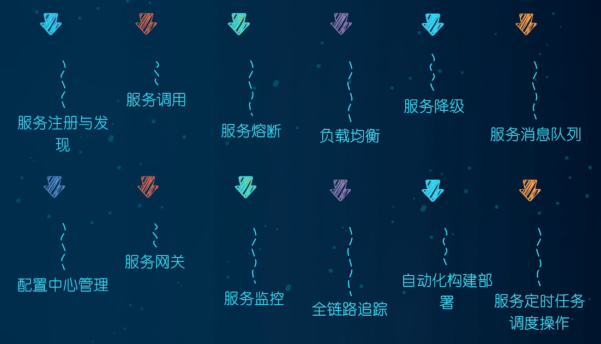

SpringCloud：分布式微服务架构的一站式解决方案，是多种微服务架构落地技术的集合体，俗称微服务全家桶。

SpringCloud与SpringBoot版本问题：官网查看对应版本：[Spring Cloud](https://spring.io/projects/spring-cloud#overview)。

本次学习需要的各开发环境版本选型：

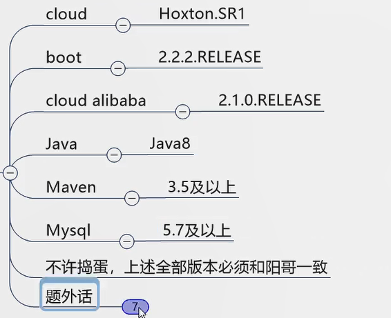

组件停更替换：

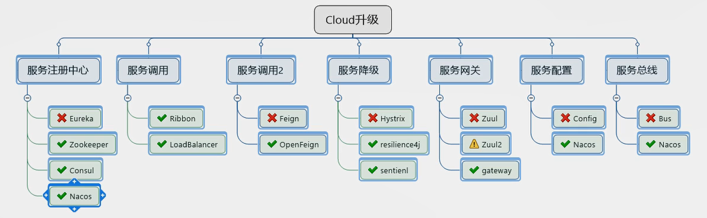

# 父工程构建

## 1.创建父工程

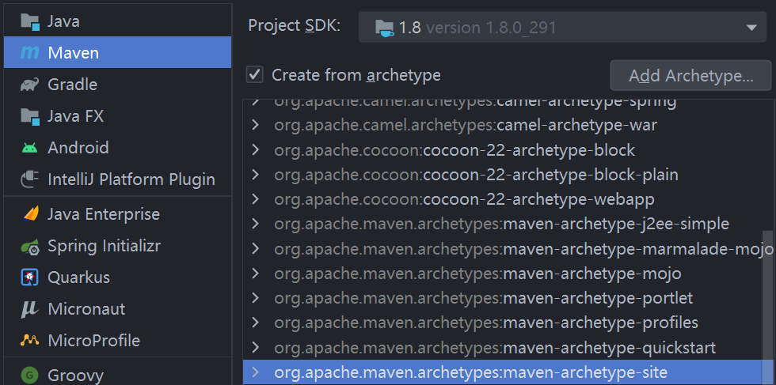

- （maven版本3.5以上）使用该maven骨架创建maven项目。
- 父工程名字：learning_springcloud；创建好后删除src目录。
- 项目字符编码：UTF-8。
- Java版本：Java8。

注解生效激活，如下：

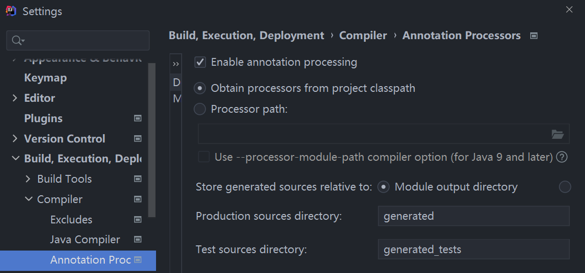

## 2.父工程pom.xml文件

```xml
<?xml version="1.0" encoding="UTF-8"?>

<project xmlns="http://maven.apache.org/POM/4.0.0" xmlns:xsi="http://www.w3.org/2001/XMLSchema-instance"
  xsi:schemaLocation="http://maven.apache.org/POM/4.0.0 http://maven.apache.org/xsd/maven-4.0.0.xsd">
  <modelVersion>4.0.0</modelVersion>

  <groupId>com.lsl.springcloud</groupId>
  <artifactId>learning_springcloud</artifactId>
  <version>1.0-SNAPSHOT</version>
  <packaging>pom</packaging>
  <!-- 统一管理jar包版本 -->
  <properties>
    <project.build.sourceEncoding>UTF-8</project.build.sourceEncoding>
    <maven.compiler.source>1.8</maven.compiler.source>
    <maven.compiler.target>1.8</maven.compiler.target>
    <junit.version>4.12</junit.version>
    <log4j.version>1.2.17</log4j.version>
    <lombok.version>1.16.18</lombok.version>
    <mysql.version>5.1.47</mysql.version>
    <druid.version>1.2.8</druid.version>
    <mybatis.spring.boot.version>2.2.0</mybatis.spring.boot.version>
  </properties>
  <dependencyManagement>
    <dependencies>
      <!-- springboot 2.2.2 -->
      <dependency>
        <groupId>org.springframework.boot</groupId>
        <artifactId>spring-boot-dependencies</artifactId>
        <version>2.2.2.RELEASE</version>
        <type>pom</type>
        <scope>import</scope>
      </dependency>
      <!-- spring-cloud Hoxton.SR1 -->
      <dependency>
        <groupId>org.springframework.cloud</groupId>
        <artifactId>spring-cloud-dependencies</artifactId>
        <version>Hoxton.SR1</version>
        <type>pom</type>
        <scope>import</scope>
      </dependency>
      <!--      -->
      <!--spring cloud 阿里巴巴-->
      <dependency>
        <groupId>com.alibaba.cloud</groupId>
        <artifactId>spring-cloud-alibaba-dependencies</artifactId>
        <version>2.1.0.RELEASE</version>
        <type>pom</type>
        <scope>import</scope>
      </dependency>
      <!-- mysql -->
      <dependency>
        <groupId>mysql</groupId>
        <artifactId>mysql-connector-java</artifactId>
        <version>${mysql.version}</version>
        <scope>runtime</scope>
      </dependency>
      <!-- druid -->
      <dependency>
        <groupId>com.alibaba</groupId>
        <artifactId>druid</artifactId>
        <version>${druid.version}</version>
      </dependency>
      <!--mybatis-->
      <dependency>
        <groupId>org.mybatis.spring.boot</groupId>
        <artifactId>mybatis-spring-boot-starter</artifactId>
        <version>${mybatis.spring.boot.version}</version>
      </dependency>
      <!--junit-->
      <dependency>
        <groupId>junit</groupId>
        <artifactId>junit</artifactId>
        <version>${junit.version}</version>
      </dependency>
      <!--log4j-->
      <dependency>
        <groupId>log4j</groupId>
        <artifactId>log4j</artifactId>
        <version>${log4j.version}</version>
      </dependency>
    </dependencies>
  </dependencyManagement>
  <build>
    <plugins>
      <plugin>
        <groupId>org.springframework.boot</groupId>
        <artifactId>spring-boot-maven-plugin</artifactId>
        <configuration>
          <fork>true</fork>
          <addResources>true</addResources>
        </configuration>
      </plugin>
    </plugins>
  </build>
</project>
```

# 支付模块

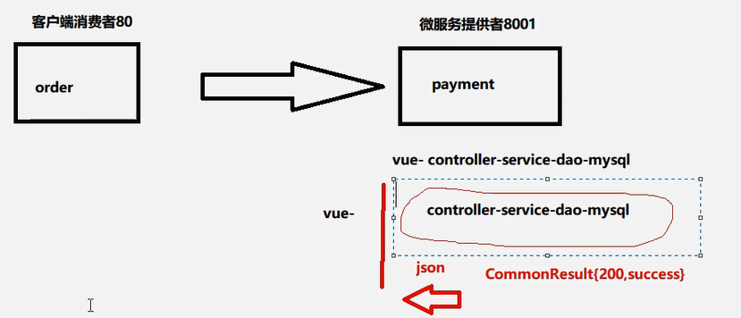

## 1.环境构建

1. 创建maven项目：cloud-provider-payment8001。
2. 依赖导入，创建com.lsl.springcloud包和主配置类。
3. 配置文件：application.yml。

application.yml：

```yml
server:
  port: 8001

spring:
  application:
    name: cloud-payment-service
  datasource:
    type: com.alibaba.druid.pool.DruidDataSource
    driver-class-name: org.gjt.mm.mysql.Driver
    url: jdbc:mysql://localhost:3306/myspringcloud?useUnicode=true&characterEncoding=utf-8&useSSL=false
    username: root
    password: 1234

mybatis:
  mapperLocations: classpath:mapper/*.xml
  type-aliases-package: com.lsl.springcloud.entities
```

pom.xml：

```xml
<dependencies>
    <!--包含了sleuth+zipkin-->
    <dependency>
        <groupId>org.springframework.cloud</groupId>
        <artifactId>spring-cloud-starter-zipkin</artifactId>
    </dependency>
    <!--eureka-client-->
    <dependency>
        <groupId>org.springframework.cloud</groupId>
        <artifactId>spring-cloud-starter-netflix-eureka-client</artifactId>
    </dependency>
    <!-- 引入自己定义的api通用包，可以使用Payment支付Entity -->
    <!--
    <dependency>
        <groupId>com.atguigu.springcloud</groupId>
        <artifactId>cloud-api-commons</artifactId>
        <version>${project.version}</version>
    </dependency>
    -->
    <dependency>
        <groupId>org.springframework.boot</groupId>
        <artifactId>spring-boot-starter-web</artifactId>
    </dependency>
    <dependency>
        <groupId>org.springframework.boot</groupId>
        <artifactId>spring-boot-starter-actuator</artifactId>
    </dependency>
    <dependency>
        <groupId>org.mybatis.spring.boot</groupId>
        <artifactId>mybatis-spring-boot-starter</artifactId>
    </dependency>
    <dependency>
        <groupId>com.alibaba</groupId>
        <artifactId>druid-spring-boot-starter</artifactId>
        <version>1.2.8</version>
    </dependency>
    <!--mysql-connector-java-->
    <dependency>
        <groupId>mysql</groupId>
        <artifactId>mysql-connector-java</artifactId>
    </dependency>
    <!--jdbc-->
    <dependency>
        <groupId>org.springframework.boot</groupId>
        <artifactId>spring-boot-starter-jdbc</artifactId>
    </dependency>
    <dependency>
        <groupId>org.springframework.boot</groupId>
        <artifactId>spring-boot-devtools</artifactId>
        <scope>runtime</scope>
        <optional>true</optional>
    </dependency>
    <dependency>
        <groupId>org.projectlombok</groupId>
        <artifactId>lombok</artifactId>
        <optional>true</optional>
    </dependency>
    <dependency>
        <groupId>org.springframework.boot</groupId>
        <artifactId>spring-boot-starter-test</artifactId>
        <scope>test</scope>
    </dependency>
</dependencies>
```

主配置类：

```java
@SpringBootApplication
public class PaymentMain8001 {
    public static void main(String[] args) {
        SpringApplication.run(PaymentMain8001.class,args);
    }
}
```

## 2.业务开发

### 1.建表

```sql
CREATE DATABASE `myspringcloud` CHARACTER SET utf8 COLLATE utf8_general_ci;
CREATE TABLE `payment`(
	`id` bigint(20) NOT NULL AUTO_INCREMENT COMMENT 'ID',
    `serial` varchar(200) DEFAULT '',
	PRIMARY KEY (id)
)ENGINE=InnoDB AUTO_INCREMENT=1 DEFAULT CHARSET=utf8;
```

### 2.构建实体类

com.lsl.springcloud.entities.Payment：

```java
@Data
@AllArgsConstructor
@NoArgsConstructor
public class Payment implements Serializable {
    private Long id;
    private String serial;
}
```

JSON封装体CommonResult：

```java
@Data
@AllArgsConstructor
@NoArgsConstructor
public class CommonResult<T> {
    private Integer code;
    private String message;
    private T data;

    public CommonResult(Integer code, String message){
        this(code, message, null);
    }
}
```

### 3.DAO接口

```java
@Mapper
public interface PaymentDao {
    int create(Payment payment);
    Payment getPaymentById(@Param("id") Long id);
}
```

### 4.整合MyBatis

application.yml：（上面的环境构建已经配置了，这里仅作记录）

```yml
spring:  
  datasource:
    type: com.alibaba.druid.pool.DruidDataSource
    driver-class-name: org.gjt.mm.mysql.Driver
    url: jdbc:mysql://localhost:3306/myspringcloud?useUnicode=true&characterEncoding=utf-8&useSSL=false
    username: root
    password: 123456

mybatis:
  mapperLocations: classpath:mapper/*.xml
  type-aliases-package: com.lsl.springcloud.entities
```

resources/mapper/PaymentMapper.xml：

```xml
<?xml version="1.0" encoding="UTF-8" ?>
<!DOCTYPE mapper PUBLIC "-//mybatis.org//DTD Mapper 3.0//EN" "http://mybatis.org/dtd/mybatis-3-mapper.dtd" >
<mapper namespace="com.lsl.springcloud.dao.PaymentDao">
    <insert id="create" parameterType="Payment" useGeneratedKeys="true" keyProperty="id">
        insert into payment(serial)  values(#{serial});
    </insert>

    <resultMap id="BaseResultMap" type="com.lsl.springcloud.entities.Payment">
        <id column="id" property="id" jdbcType="BIGINT"/>
        <id column="serial" property="serial" jdbcType="VARCHAR"/>
    </resultMap>

    <select id="getPaymentById" parameterType="Long" resultMap="BaseResultMap">
        select * from payment where id=#{id};
    </select>
</mapper>
```

com.lsl.springcloud.service：

```java
public interface PaymentService {
    int create(Payment payment);

    Payment getPaymentById(@Param("id") Long id);
}
```

```java
@Service
public class PayServiceImpl implements PaymentService{

    @Resource
    private PaymentDao paymentDao;
    @Override
    public int create(Payment payment) {
        return paymentDao.create(payment);
    }

    @Override
    public Payment getPaymentById(Long id) {
        return paymentDao.getPaymentById(id);
    }
}
```

com.lsl.springcloud.controller：

```java
@RestController
@Slf4j
public class PaymentController {
    @Resource
    private PaymentService paymentService;
    @PostMapping(value = "/payment/create")
    public CommonResult create(@RequestBody Payment payment)
    {
        int result = paymentService.create(payment);
        log.info("*****插入结果："+result);

        if(result > 0)
        {
            return new CommonResult(200,"插入数据库成功,serverPort: ",result);
        }else{
            return new CommonResult(444,"插入数据库失败",null);
        }
    }

    @GetMapping(value = "/payment/get/{id}")
    public CommonResult<Payment> getPaymentById(@PathVariable("id") Long id)
    {
        Payment payment = paymentService.getPaymentById(id);

        if(payment != null)
        {
            return new CommonResult(200,"查询成功,serverPort:  ",payment);
        }else{
            return new CommonResult(444,"没有对应记录,查询ID: "+id,null);
        }
    }
}
```

### 5.测试

1.先往数据库表中插入一条数据，如何启动服务，访问[localhost:8001/payment/get/1](http://localhost:8001/payment/get/1)，能显示json数据则成功。

2.因为浏览器对post请求不友好，所以使用postman来发送post请求。

# 热部署

热部署在**开发时使用，生产环境则要关闭**。

## 1.Adding devtools to your project

支付模块添加以下依赖：

```xml
<dependency>
    <groupId>org.springframework.boot</groupId>
    <artifactId>spring-boot-devtools</artifactId>
    <scope>runtime</scope>
    <optional>true</optional>
</dependency>
```

## 2.Adding plugin to your pom.xml

下段配置复制到聚合父类总工程的pom.xml：

```xml
<build>
  <plugins>
    <plugin>
      <groupId>org.springframework.boot</groupId>
      <artifactId>spring-boot-maven-plugin</artifactId>
      <configuration>
        <fork>true</fork>
        <addResources>true</addResources>
      </configuration>
    </plugin>
  </plugins>
</build>
```

## 3.Enabling automatic build

File -> Settings -> Build -> Complier 下面项勾选以下四个选项：

- Automatically show first error in editor。
- Display notification on build completion。
- Build project automatically。
- Compile independent modules in parallel。

## 4.Update the value of

键入`Ctrl + Shift + Alt + / `，打开Registry，找到并勾选以下两个选项：

- actionSystem.assertFocusAccessFromEdt。
- compiler.automake.allow.when.app.running。

## 5.重启idea

重启后启动支付项目，会发现一个error，如下：（不影响使用，忽略这个错误）

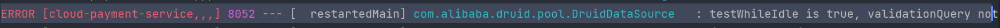

重启后，修改程序，会发现修改后间隔一定时间项目会自动重新启动。

# 消费者订单模块

1. 建Module
2. 加依赖
3. 写YML：配置一个80端口
4. 主启动
5. 写业务
6. 做测试

## 2.加依赖

```xml
<dependencies>
    <dependency>
        <groupId>org.springframework.boot</groupId>
        <artifactId>spring-boot-starter-web</artifactId>
    </dependency>
    <dependency>
        <groupId>org.springframework.boot</groupId>
        <artifactId>spring-boot-starter-actuator</artifactId>
    </dependency>

    <dependency>
        <groupId>org.springframework.boot</groupId>
        <artifactId>spring-boot-devtools</artifactId>
        <scope>runtime</scope>
        <optional>true</optional>
    </dependency>
    <dependency>
        <groupId>org.projectlombok</groupId>
        <artifactId>lombok</artifactId>
        <optional>true</optional>
    </dependency>
    <dependency>
        <groupId>org.springframework.boot</groupId>
        <artifactId>spring-boot-starter-test</artifactId>
        <scope>test</scope>
    </dependency>
</dependencies>
```

## 3.写yml

```yml
server:
	port: 80
```


## 5.写业务

实体类和支付模块的两个一致。

使用RestTemplate，需要先将其注册到容器中，所以先建立配置类，com/lsl/springcloud/config：

```java
@Configuration
public class ApplicationContextConfig {
    @Bean
    public RestTemplate getRestTemplate(){
        return new RestTemplate();
    }
}
```

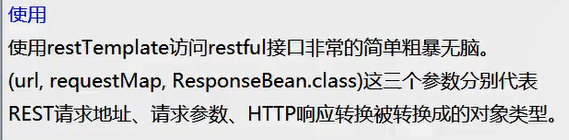

创建controller：

```java
@RestController
@Slf4j
public class OrderController {
    public static final String PAYMENT_URL = "http://localhost:8001";

    @Resource
    private RestTemplate restTemplate;

    @GetMapping("/consumer/payment/create")
    public CommonResult<Payment> create(Payment payment){

        return restTemplate.postForObject(PAYMENT_URL+"/payment/create", payment, CommonResult.class);
    }

    @GetMapping("/consumer/payment/get/{id}")
    public CommonResult<Payment> getPayment(@PathVariable("id") Long id){
        return restTemplate.getForObject(PAYMENT_URL+"/payment/get/"+id, CommonResult.class);
    }

}
```

## 6.测试

打开支付模块和消费者模块，然后：

- 访问：`http://localhost/consumer/payment/get/1`。返回json数据则成功。

访问：`http://localhost/consumer/payment/create?serial=222222`发现存储进数据库的值为null，这是因为支付模块的controller的create方法中参数接收处忘了加@RequestBody注解。

## Run Dashboard窗口

我使用的当前版本出现的是service窗口，不用再配置，如果没出现，重启就出现了。

通过修改idea的workspace.xml的方式来**快速打开Run Dashboard窗口**（这个用来显示哪些Spring Boot工程运行，停止等信息。）如果运行了多个微服务没有出现该窗口，那么就进行如下设置：

1. 选中父项目然后右键---> open in ---> Explorer，进入项目找到.idea目录。

2. 进入.idea目录找到workspace.xml文件进行设置：

   ```xml
     <component name="RunDashboard">
       <option name="configurationTypes">
         <set>
           <option value="SpringBootApplicationConfigurationType" />
         </set>
       </option>
       <option name="ruleStates">
         <list>
           <RuleState>
             <option name="name" value="ConfigurationTypeDashboardGroupingRule" />
           </RuleState>
           <RuleState>
             <option name="name" value="StatusDashboardGroupingRule" />
           </RuleState>
         </list>
       </option>
     </component>
   ```

3. 重启就好。

## RestTemplate

RestTemplate提供了多种便捷访问远程Http服务的方法，是一种简单便捷的访问restful服务模板类，是Spring提供的用于访问Rest服务的客户端模板工具集

官网地址

使用：使用restTemplate访问restful接口非常的简单粗暴无脑。

- (url, requestMap, ResponseBean.class)这三个参数分别代表REST请求地址、请求参数、HTTP响应转换被转换成的对象类型。

# 工程重构

支付模块、消费者订单模块有重复的实体类代码，把他们抽取出来打包发布，再引入：

1. 新建maven模块：cloud-api-commons。

2. 加入依赖。

3. 实体类引入，新建包一致。

4. 使用maven：先clean再install。

5. 支付模块、消费者订单模块引入jar并删除原先的实体包。

   ```xml
   <dependency>
       <groupId>com.lsl.springcloud</groupId>
       <artifactId>cloud-api-commons</artifactId>
       <version>${project.version}</version>
   </dependency>
   ```

pom.xml：

```xml
<dependencies>
    <dependency>
        <groupId>org.springframework.boot</groupId>
        <artifactId>spring-boot-devtools</artifactId>
        <scope>runtime</scope>
        <optional>true</optional>
    </dependency>
    <dependency>
        <groupId>org.projectlombok</groupId>
        <artifactId>lombok</artifactId>
        <optional>true</optional>
    </dependency>
    <dependency>
        <groupId>cn.hutool</groupId>
        <artifactId>hutool-all</artifactId>
        <version>5.1.0</version>
    </dependency>
</dependencies>
```

# 服务注册中心

## Eureka

### 基础知识

什么是服务治理？

Spring Cloud封装了Netflix 公司开发的Eureka模块来实现服务治理。

在传统的RPC远程调用框架中，管理每个服务与服务之间依赖关系比较复杂，管理比较复杂，所以需要使用服务治理，**管理服务与服务之间依赖关系**，可以实现服务调用、负载均衡、容错等，实现服务发现与注册。

什么是服务注册与发现？

Eureka采用了C/S的设计架构，Eureka Sever作为服务注册功能的服务器，它是服务注册中心。而系统中的其他微服务，使用Eureka的客户端连接到 Eureka Server并维持心跳连接。这样系统的维护人员就可以通过Eureka Server来监控系统中各个微服务是否正常运行。

在服务注册与发现中，有一个注册中心。当服务器启动的时候，会把当前自己服务器的信息（比如服务地址、通讯地址等）以别名的方式注册到注册中心上。另一方(消费者服务提供者)，以该别名的方式去注册中心上获取到实际的服务通讯地址，然后再实现本地RPC调用，RPC远程调用框架核心设计思想在于注册中心，因为使用注册中心管理每个服务与服务之间的一个依赖关系（服务治理概念）。在任何RPC远程框架中，都会有一个注册中心存放服务地址相关信息（接口地址）。

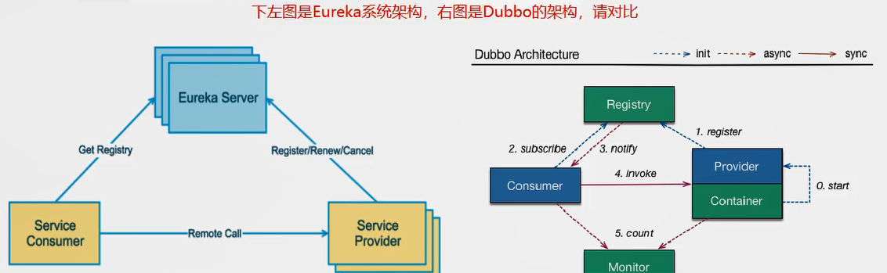

Eureka包含两个组件：Eureka Server和Eureka Client

1. Eureka Server：提供服务注册服务
   - 各个微服务节点通过配置启动后，会在EurekaServer中进行注册，这样EurekaServer中的服务注册表中将会存储所有可用服务节点的信息，服务节点的信息可以在界面中直观看到。
2. EurekaClient：通过注册中心进行访问
   - 它是一个Java客户端，用于简化Eureka Server的交互，客户端同时也具备一个内置的、使用轮询（round-robin）负载算法的负载均衡器。在应用启动后，将会向Eureka Server发送心跳（默认周期为30秒）。如果Eureka Server在多个心跳周期内没有接收到某个节点的心跳，EurekaServer将会从服务注册表中把这个服务节点移除（默认90秒)。

### 1.Eureka Server安装

1. 建module：cloud-eureka-server7001。
2. 改pom。
3. 写YML。
4. 主启动。
5. 测试运行`EurekaMain7001`，浏览器输入`http://localhost:7001/`并回车，会查看到Spring Eureka服务主页。
6. 业务类。

pom.xml：

```xml
<dependencies>
    <!--eureka-server 2020.2-->
    <dependency>
        <groupId>org.springframework.cloud</groupId>
        <artifactId>spring-cloud-starter-netflix-eureka-server</artifactId>
    </dependency>
    <!-- 引入自己定义的api通用包，可以使用Payment支付Entity -->
    <dependency>
        <groupId>com.lsl.springcloud</groupId>
        <artifactId>cloud-api-commons</artifactId>
        <version>${project.version}</version>
    </dependency>
    <!--boot web actuator-->
    <dependency>
        <groupId>org.springframework.boot</groupId>
        <artifactId>spring-boot-starter-web</artifactId>
    </dependency>
    <dependency>
        <groupId>org.springframework.boot</groupId>
        <artifactId>spring-boot-starter-actuator</artifactId>
    </dependency>
    <!--一般通用配置-->
    <dependency>
        <groupId>org.springframework.boot</groupId>
        <artifactId>spring-boot-devtools</artifactId>
        <scope>runtime</scope>
        <optional>true</optional>
    </dependency>
    <dependency>
        <groupId>org.projectlombok</groupId>
        <artifactId>lombok</artifactId>
    </dependency>
    <dependency>
        <groupId>org.springframework.boot</groupId>
        <artifactId>spring-boot-starter-test</artifactId>
        <scope>test</scope>
    </dependency>
    <dependency>
        <groupId>junit</groupId>
        <artifactId>junit</artifactId>
    </dependency>
</dependencies>
```

application.xml：

```yaml
server:
  port: 7001

eureka:
  instance:
    hostname: localhost #eureka服务端的实例名称
  client:
    #false表示不向注册中心注册自己。
    register-with-eureka: false
    #false表示自己端就是注册中心，我的职责就是维护服务实例，并不需要去检索服务
    fetch-registry: false
    service-url:
      #设置与Eureka server交互的地址查询服务和注册服务都需要依赖这个地址。
      defaultZone: http://${eureka.instance.hostname}:${server.port}/eureka/
```

主启动：

```java
@SpringBootApplication
@EnableEurekaServer
public class EurekaMain7001 {
    public static void main(String[] args) {
        SpringApplication.run(EurekaMain7001.class,args);
    }
}
```

浏览器输入`http://localhost:7001/`并回车，会查看到Spring Eureka服务主页：

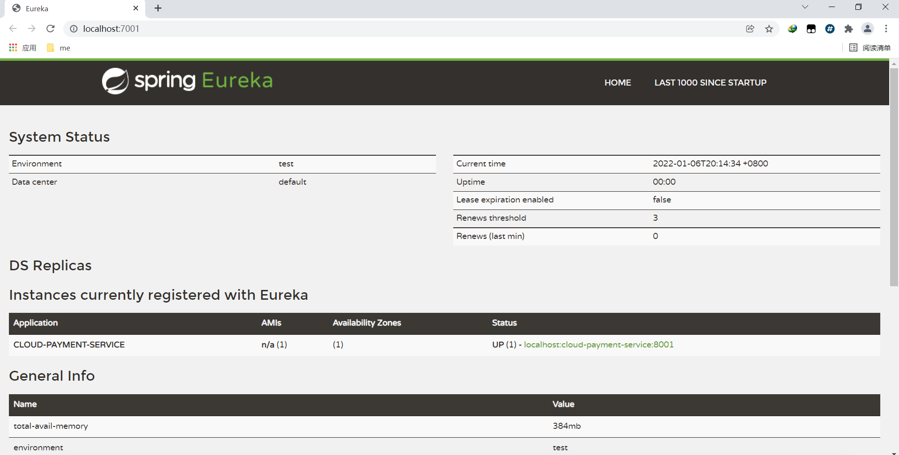


### 2.EurekaClient-支付服务入驻

EurekaClient端`cloud-provider-payment8001`将注册进EurekaServer成为服务提供者provider（就像老师入驻学校提供教学服务）。

在`cloud-provider-payment8001`进行入驻操作：

1. 加入依赖。
2. 写YML。
3. 主启动类加注解：`@EnableEurekaClient`。
4. 测试。

依赖：

```xml
<!--eureka-client-->
<dependency>
    <groupId>org.springframework.cloud</groupId>
    <artifactId>spring-cloud-starter-netflix-eureka-client</artifactId>
</dependency>
```

application.yml新加：

```yaml
eureka:
  client:
    #表示是否将自己注册进Eurekaserver默认为true。
    register-with-eureka: true
    #是否从EurekaServer抓取已有的注册信息，默认为true。单节点无所谓，集群必须设置为true才能配合ribbon使用负载均衡
    fetchRegistry: true
    service-url:
      defaultZone: http://localhost:7001/eureka
```

测试：

1. 启动`cloud-provider-payment8001`和`cloud-eureka-server7001`工程。

2. 进入Spring Eureka服务主页：http://localhost:7001/ 。

3. 查看主页的`Instances currently registered with Eureka`：会显示`cloud-provider-payment8001`应用名（`cloud-provider-payment8001`的application.yml文件设置的spring.application.name：

   ```yaml
   spring:
     application:
       name: cloud-payment-service
   ```

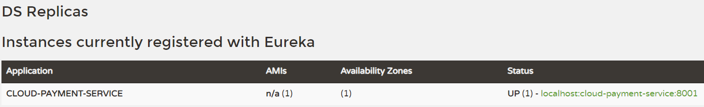

**自我保护机制：**（后面会详细说）

测试时eureka首页可能会出现如下的情况：

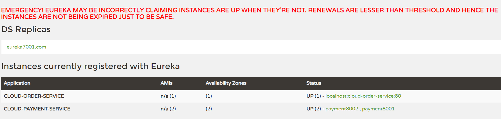

紧急情况！EUREKA可能错误地声称实例在没有启动的情况下启动了。续订小于阈值，因此实例不会为了安全而过期。

### 3.EurekaClient-订单服务入驻

在`cloud-provider-order80`进行入驻操作：

1. 加入依赖，与上个服务入驻的一致。
2. 修改YML。
3. 主启动添加注解：`@EnableEurekaClient`。
4. 测试，与上个服务入驻的一致。

application.yml：

```yaml
server:
  port: 80

spring:
  application:
    name: cloud-order-service

eureka:
  client:
    # 表示是否将自己注册进Eurekaserver 默认为true。
    register-with-eureka: true
    # 是否从EurekaServer抓取已有的注册信息，默认为true。单节点无所谓，集群必须设置为true才能配合ribbon使用负载均衡
    fetchRegistry: true
    service-url:
      defaultZone: http://localhost:7001/eureka
```

### Eureka集群原理说明

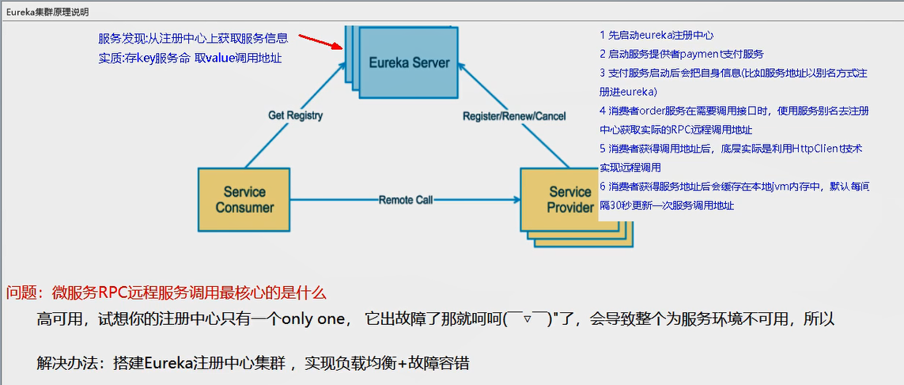

eureka集群：安装多个eureka，彼此之间相互注册、相互守望

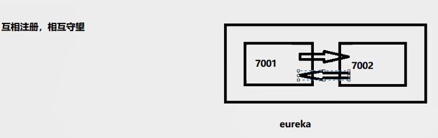

### 4.Eureka集群

**一：集群环境构建：**

1.创建cloud-eureka-server7002工程，过程参考EurekaServer服务端安装。

2.找到`C:\Windows\System32\drivers\etc`路径下的hosts文件，把下面的配置添加进hosts文件：

```txt
127.0.0.1 eureka7001.com
127.0.0.1 eureka7002.com
```

3.修改cloud-eureka-server7001的主配置文件：

```yaml
server:
  port: 7001

eureka:
  instance:
    hostname: eureka7001.com #eureka服务端的实例名称
  client:
    register-with-eureka: false     #false表示不向注册中心注册自己。
    fetch-registry: false     #false表示自己端就是注册中心，我的职责就是维护服务实例，并不需要去检索服务
    service-url:
      #集群指向其它eureka
      defaultZone: http://eureka7002.com:7002/eureka/
      #单机时就是7001自己
      #defaultZone: http://eureka7001.com:7001/eureka/
```

4.修改cloud-eureka-server7002主配置文件：

```yaml
server:
  port: 7002

eureka:
  instance:
    hostname: eureka7002.com #eureka服务端的实例名称
  client:
    register-with-eureka: false     #false表示不向注册中心注册自己。
    fetch-registry: false     #false表示自己端就是注册中心，我的职责就是维护服务实例，并不需要去检索服务
    service-url:
      #集群指向其它eureka
      defaultZone: http://eureka7001.com:7001/eureka/
      #单机时就是7002自己
      #defaultZone: http://eureka7002.com:7002/eureka/
```

5.启动7001、7002，如下：

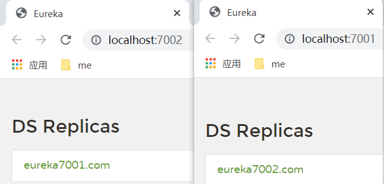

**二：订单、支付两个微服务注册进Eureka集群：**

在application.xml更改defaultZone：

```yaml
defaultZone: http://eureka7001.com:7001/eureka/,http://eureka7002.com:7002/eureka/ # 集群版
```

测试。

**三：新建微服务集群**

支付服务提供者8001集群环境构建：（1、2、3、4、5和8001构建基本一致，再在yml修改一下端口）

1. 新建module：cloud-provider-payment8002。
2. 改POM。
3. 写YML：端口8082。
4. 主启动类。
5. 业务类。
6. 要修改一下8001和8002的Controller，添加serverPort，如下：

```java
@RestController
@Slf4j
public class PaymentController {

    @Value("${server.port}")
    private String serverPort;//添加serverPort
    @Resource
    private PaymentService paymentService;
    @PostMapping(value = "/payment/create")
    public CommonResult create(@RequestBody Payment payment){
        int result = paymentService.create(payment);
        log.info("*****插入结果：" + result);
        if(result > 0) {
            return new CommonResult(200,"插入数据库成功,serverPort: " + serverPort, result);
        }else{
            return new CommonResult(444,"插入数据库失败serverPort: " + serverPort,null);
        }
    }
	@GetMapping(value = "/payment/get/{id}")
    public CommonResult<Payment> getPaymentById(@PathVariable("id") Long id) {
        Payment payment = paymentService.getPaymentById(id);
        if(payment != null)
        {
            return new CommonResult(200,"查询成功: 哈哈O(∩_∩)O哈哈~，serverPort: " + serverPort,payment);
        }else{
            return new CommonResult(444,"没有对应记录,查询ID: "+id + "serverPort: " + serverPort,null);
        }
    }
}
```

打开全部服务，测试。

**四：负载均衡**

1.修改`cloud-provider-order80`的controller中的PAYMENT_URL为：

```java
public static final String PAYMENT_URL = "http://CLOUD-PAYMENT-SERVICE";
```

2.使用`@LoadBalanced`注解赋予`cloud-provider-order80`中的RestTemplate负载均衡的能力：

```java
@Configuration
public class ApplicationContextConfig {
    @Bean
    @LoadBalanced
    public RestTemplate getRestTemplate(){
        return new RestTemplate();
    }
}
```

开启服务，访问http://localhost/consumer/payment/get/1，刷新就能看的端口的变化。

### 5.actuator-微服务信息完善

修改主机名称：服务名称修改（也就是将IP地址，换成可读性高的名字）。

在cloud-provider-payment8001，cloud-provider-payment8002中修改YML，需要在eureka下添加：（要注意instance从属eureka的下一级，注意缩进）

```yaml
eureka:
	instance:
      instance-id: payment8001 # cloud-provider-payment8001
```

```yaml
eureka:
    instance:
      instance-id: payment8002  #cloud-provider-payment8002
```

修改之后，Eureka的主页将显示使用payment8001、payment8002为主机IP地址，如下图，点击payment8002或payment8001会调转到http://localhost:8002/actuator/info，再访问http://localhost:8002/actuator/health或显示status。

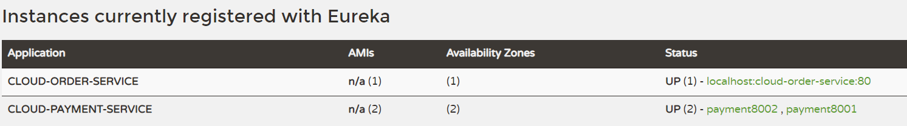

再设置，使得访问信息有IP信息提示，（就是将鼠标指针移至payment8001、payment8002名下，会有IP地址提示），需要修改application.yml，在上面的基础上添加prefer-ip-address: true 就好：

```yaml
instance:
  instance-id: payment8001 
  prefer-ip-address: true 
```

添加上重启后，鼠标移动到payment8002就会在左下角显示：192.168.137.1:8002/acuator/info。

### 6.服务发现Discovery

对于注册进eureka里面的微服务，可以通过服务发现来获得该服务的相关信息，操作如下：

1. 修改cloud-provider-payment8001的Controller，添加以下内容：

   ```java
   @Resource
   private DiscoveryClient discoveryClient;
   // 服务发现
   @GetMapping(value = "/payment/discovery")
   public Object discovery()
   {
       List<String> services = discoveryClient.getServices();
       for (String element : services) {
           log.info("*****element: "+element);
       }
   
       List<ServiceInstance> instances = discoveryClient.getInstances("CLOUD-PAYMENT-SERVICE");
       for (ServiceInstance instance : instances) {
           log.info(instance.getServiceId()+"\t"+instance.getHost()+"\t"+instance.getPort()+"\t"+instance.getUri());
       }
   
       return this.discoveryClient;
   }
   ```

2. 8001的主启动类添加一个注解：`@EnableDiscoveryClient`。

3. 测试：

   1. 先要启动EurekaSeryer，再启动8001主启动类，浏览器输入http://localhost:8001/payment/discovery。
   2. 访问到的页面输出：`{"services":["cloud-payment-service","cloud-order-service"],"order":0}`。
   3. 后台输出如下图：

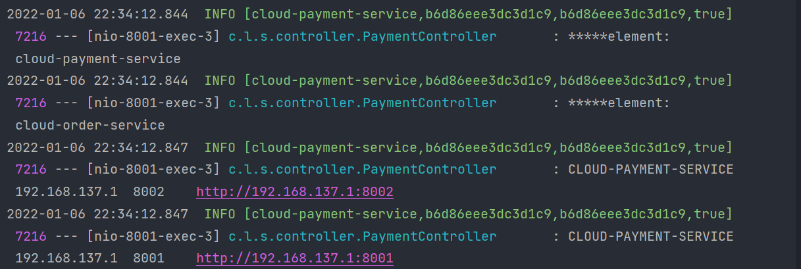

### Eureka自我保护机制

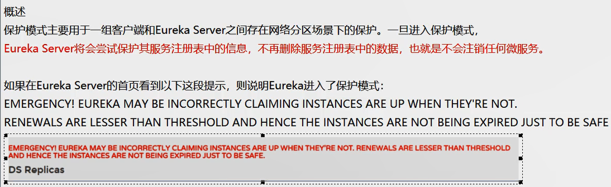

**导致原因：**

一句话：某时刻某一个微服务不可用了，Eureka不会立刻清理，依旧会对该微服务的信息进行保存。属于CAP里面的AP分支（Consual中的三个注册中心易常点会介绍）。

**为什么会产生Eureka自我保护机制?**

为了EurekaClient可以正常地运行，防止其与EurekaServer网络连接不上的情况下EurekaServer会立刻将EurekaClient服务剔除的情况。

（防止因网络导致微服务与EurekaServer连接失败，而造成EurekaServer将该注册了的服务剔除）

**什么是自我保护模式?**

默认情况下，如果EurekaServer在一定时间内没有接收到某个微服务实例的心跳，EurekaServer将会注销该实例(默认90秒)。但是当网络分区故障发生(延时、卡顿、拥挤)时，微服务与EurekaServer之间无法正常通信，以上行为可能变得非常危险了——因为微服务本身其实是健康的，此时本不应该注销这个微服务。Eureka通过“自我保护模式”来解决这个问题——当EurekaServer节点在短时间内丢失过多客户端时(可能发生了网络分区故障)，那么这个节点就会进入自我保护模式。

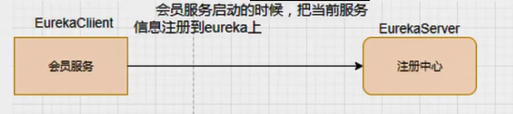

自我保护机制：默认情况下EurekaClient定时向EurekaServer端发送心跳包，如果Eureka在server端在一定时间内（默认90秒）没有收到EurekaClient发送心跳包，便会直接从服务注册列表中剔除该服务，但是在短时间（90秒中）内丢失了大量的服务实例心跳，这时候Eurekaserver会开启自我保护机制，不会剔除该服务（该现象可能出现在如果网络不通但是EurekaClient为出现宕机，此时如果换做别的注册中心如果一定时间内没有收到心跳会将剔除该服务，这样就出现了严重失误，因为客户端还能正常发送心跳，只是网络延迟问题，而保护机制是为了解决此问题而产生的）。

在自我保护模式中，Eureka Server会保护服务注册表中的信息，不再注销任何服务实例。

它的设计哲学就是宁可保留错误的服务注册信息，也不盲目注销任何可能健康的服务实例。一句话讲解：好死不如赖活着。

综上，自我保护模式是一种应对网络异常的安全保护措施。它的架构哲学是宁可同时保留所有微服务（健康的微服务和不健康的微服务都会保留）也不盲目注销任何健康的微服务。使用自我保护模式，可以让Eureka集群更加的健壮、稳定。

**禁止自我保护机制：**

1.在eurekaServer端7001处设置关闭自我保护机制。

自我保护机制是开启的，使用`eureka.server.enable-self-preservation = false`可以禁用自我保护模式：

```yaml
eureka:
  server:
    # 关闭自我保护机制，保证不可用服务被及时踢除
    enable-self-preservation: false
    eviction-interval-timer-in-ms: 2000
```

关闭效果，spring-eureka主页会显示出一句：

THE SELF PRESERVATION MODE IS TURNED OFF. THIS MAY NOT PROTECT INSTANCE EXPIRY IN CASE OF NETWORK/OTHER PROBLEMS.

2.在生产者客户端eureakeClient端8001做一些配置

默认的Eureka客户端向服务端发送心跳的时间间隔，单位秒：

```yaml
eureka.instance.lease-renewal-interval-in-seconds=30
eureka.instance.lease-expiration-duration-in-seconds=90
```

修改为：

```yaml
eureka:
  instance:
    instance-id: payment8001
    prefer-ip-address: true
    # 心跳检测与续约时间
    # 开发时没置小些，保证服务关闭后注册中心能即使剔除服务
    # Eureka客户端向服务端发送心跳的时间间隔，单位为秒(默认是30秒)
    lease-renewal-interval-in-seconds: 1
    # Eureka服务端在收到最后一次心跳后等待时间上限，单位为秒(默认是90秒)，超时将剔除服务
    lease-expiration-duration-in-seconds: 2
```

启动7001，再启动8001，启动完成后关闭8001，会发现8001被eureka剔除。

### Eureka停更说明

Eureka停更已经停更了，如果还有一些老项目使用的话，上面的知识已经够用了。

https://github.com/Netflix/eureka/wiki，官方说明，2.0版本不再更新。

```txt
Eureka 2.0 (Discontinued)

The existing open source work on eureka 2.0 is discontinued. The code base and artifacts that were released as part of the existing repository of work on the 2.x branch is considered use at your own risk.

Eureka 1.x is a core part of Netflix’s service discovery system and is still an active project.
```


