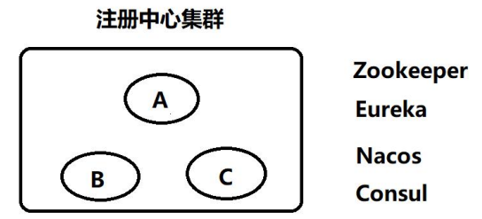
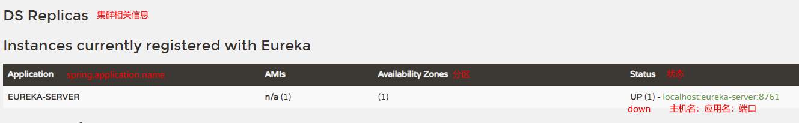

# SpringCloud

Martin Fowler：**简而言之，微服务架构的风格，就是将单一程序开发成一个微服务， 每个微服务运行在自己的进程中，并使用轻量级通信机制，通常是 HTTP RESTFUL API 。这些服务围绕业务能力来划分构建的，并通 过完全自动化部署机制来独立部署这些服务可以使用不同的编程语 言，以及不同数据存储技术，以保证最低限度的集中式管理。**

SpringCloud、SpringBoot、SpringCloud Alibaba版本对应关系，看官方文档。

SpringCloud 常用组件：

1. 服务的注册和发现。（eureka（netflix）、nacos（Alibaba）、consul（Spring官方）） 
2. 服务的负载均衡。(ribbon（netflix）、dubbo（Alibaba）) 
3. 服务的相互调用。（openFeign、dubbo） 
4. 服务的容错。（hystrix（netflix），sentinel（Alibaba）） 
5. 服务网关。（gateway（官方的），zuul（netflix）） 
6. 服务配置的统一管理。（config-server、nacos、apollo） 
7. 服务消息总线。(bus) 
8. 服务安全组件。(security、Oauth2.0) 
9. 服务监控。（admin）（jvm） 
10. 链路追踪。（sleuth+zipkin）

SpringCloud 就是微服务理念的一种具体落地实现方式，帮助微服务架构提供了必备的功能，目前开发中常用的落地实现有三种： 

1. Dubbo+Zookeeper——半自动化的微服务实现架构 (别的管理没有) 。
2. SpringCloud Netflix——一站式微服务架构 。
3. SpringCloud Alibaba——新的一站式微服务架构。

三大公司——Spring、Netflix、Alibaba。

# Eureka

**Eureka ——注册发现中心：**Eureka 来源于古希腊词汇，意为“发现了”。在软件领域， Eureka 是 Netflix 在线影片 公司开源的一个服务注册与发现的组件，和其他 Netflix 公司的服务组件（例如负载均衡、 熔断器、网关等） 一起，被 Spring Cloud 社区整合为 Spring Cloud Netflix 模。

Spring Cloud Eureka 和 Zookeeper 的区别？问：为什么 zookeeper 不适合做注册中心？



在分布式微服务集群里面 CAP 定理 （CAP 原则又称 CAP 定理）， CAP 原则指的是，这三个要素最多只能同时实现两点（CP或AP），不可能三者兼顾：

1.  一致性（Consistency）：同一功能的各个微服务的数据一致。
2. 可用性（Availability）：某一个节点宕机了，但整个集群仍可以对外提供服务。
3. 分区容错性（Partition tolerance）：这个特性是不可避免的，原因是由网络或分区等原因造成的数据同步不能同时完成，从而出现的同一功能的各个服务间数据会出现一定时刻内数据不完全一致。

zookeeper 遵循CP原则：注重数据的一致性，但某个节点挂了，整个服务在几分钟的时间内不能提供服务。（注册中心，配置文件中心，协调中心）

Eureka注重AP原则：数据可能不一致、注重服务的可用性。（注册中心）

## 注册中心Eureka-Server

Eureka-Server：服务注册中心，可以将微服务注册登记到一个服务列表，也可以将自己注册进去。

1. 创建SpringBoot项目。

2. 添加依赖（使用SpringBoot 2.3.12.RELEASE版本、SpringCloud Hoxton.SR12版本）。

   ```xml
   <?xml version="1.0" encoding="UTF-8"?>
   <project xmlns="http://maven.apache.org/POM/4.0.0" xmlns:xsi="http://www.w3.org/2001/XMLSchema-instance"
            xsi:schemaLocation="http://maven.apache.org/POM/4.0.0 https://maven.apache.org/xsd/maven-4.0.0.xsd">
       <modelVersion>4.0.0</modelVersion>
       <parent>
           <groupId>org.springframework.boot</groupId>
           <artifactId>spring-boot-starter-parent</artifactId>
           <version>2.3.12.RELEASE</version>
           <relativePath/> <!-- lookup parent from repository -->
       </parent>
       <groupId>com.lsl</groupId>
       <artifactId>eureka_server_01</artifactId>
       <version>0.0.1-SNAPSHOT</version>
       <name>eureka_server_01</name>
       <description>Demo project for Spring Boot</description>
       <properties>
           <java.version>1.8</java.version>
           <spring-cloud.version>Hoxton.SR12</spring-cloud.version>
       </properties>
       <dependencies>
           <dependency>
               <groupId>org.springframework.cloud</groupId>
               <artifactId>spring-cloud-starter-netflix-eureka-server</artifactId>
           </dependency>
       </dependencies>
       <dependencyManagement>
           <dependencies>
               <dependency>
                   <groupId>org.springframework.cloud</groupId>
                   <artifactId>spring-cloud-dependencies</artifactId>
                   <version>${spring-cloud.version}</version>
                   <type>pom</type>
                   <scope>import</scope>
               </dependency>
           </dependencies>
       </dependencyManagement>
   </project>
   ```

3. 项目配置。

   ```yaml
   server:
     port: 8761 # eureka的默认端口就是8761
   spring:
     application:
       name: eureka-server  # 通常设置为项目应用名称
   ```

4. 开启Eureka-Server功能——主配置类上加上 `@EnableEurekaServer` 注解。

   ```java
   @SpringBootApplication
   @EnableEurekaServer // 开启eureka注册中心的功能
   public class EurekaServerApplication {
       public static void main(String[] args) {
           SpringApplication.run(EurekaServerApplication.class, args);
       }
   
   }
   ```

5. 访问信息页面：`[Eureka](http://localhost:8761/)`，如下



## Eureka-Server配置说明

Eureka-Server既是服务端，也可以是客户端。

```yaml
server:
	port: 8761
spring:
	application:
		name: eureka-server
eureka:
	client:
		service-url: # eureka 服务端和客户端的交互地址,集群用`,`隔开
			defaultZone: http://localhost:8761/eureka
		fetch-registry: true # 是否拉取服务列表到本地
		register-with-eureka: true # 是否注册自己（单机 eureka 一般关闭注册自己,集群注意打开，默认打开）
	server:
		eviction-interval-timer-in-ms: 30000 # 清除无效节点的频率(毫秒)--定期删除
		enable-self-preservation: true # server 的自我保护机制，避免因为网络原因造成误剔除,生产环境建议打开
		renewal-percent-threshold: 0.85 # 85%，如果在一个机房的 client 端，15 分钟内有 85%的 client 没有续约，那么则可能是网络原因，认为服务实例没有问题，不会剔除他们，宁可放过一万，不可错杀一个，确保高可用
	instance:
		hostname: localhost # 服务主机名称
		instance-id: ${eureka.instance.hostname}:${spring.application.name}:${server.port} # 实例 id
		prefer-ip-address: true # 服务列表以 ip 的形式展示
		lease-renewal-interval-in-seconds: 10 # 表示 eureka client 发送心跳给 server 端的频率
		lease-expiration-duration-in-seconds: 20 # 表示 eureka server 至上一次收到 client 的心跳之后，等待下一次心跳的超时时间，在这个时间内若没收到下一次心跳，则将移除该实例
```


## 服务Eureka-Client

1. 创建SpringBoot项目。

2. 添加依赖。

   ```xml
   <parent>
       <groupId>org.springframework.boot</groupId>
       <artifactId>spring-boot-starter-parent</artifactId>
       <version>2.3.12.RELEASE</version>
       <relativePath/> <!-- lookup parent from repository -->
   </parent>
   <properties>
       <java.version>1.8</java.version>
       <spring-cloud.version>Hoxton.SR12</spring-cloud.version>
   </properties>
   <dependencies>
       <dependency>
           <groupId>org.springframework.boot</groupId>
           <artifactId>spring-boot-starter-web</artifactId>
       </dependency>
       <dependency>
           <groupId>org.springframework.cloud</groupId>
           <artifactId>spring-cloud-starter-netflix-eureka-client</artifactId>
       </dependency>
   </dependencies>
   <dependencyManagement>
       <dependencies>
           <dependency>
               <groupId>org.springframework.cloud</groupId>
               <artifactId>spring-cloud-dependencies</artifactId>
               <version>${spring-cloud.version}</version>
               <type>pom</type>
               <scope>import</scope>
           </dependency>
       </dependencies>
   </dependencyManagement>
   ```

3. 项目配置。

   ```yaml
   server:
     port: 8010
   spring:
     application:
       name: eureka-cient-a
   
   # 注册：将自己的信息（ip、name、port等）发送给注册中心
   eureka:
     client:
       service-url: # 指定注册地址
         defaultZone: http://localhost:8761/eureka
   ```

4. 功能开启——主启动类加上 @EnableEurekaClien t注解：

   ```java
   @SpringBootApplication
   @EnableEurekaClient
   public class EurekaClientAApplication {
       public static void main(String[] args) {
           SpringApplication.run(EurekaClientAApplication.class, args);
       }
   }
   ```

## Eureka-Client配置说明

```yaml
server:
	port: 8080
spring:
	application:
		name: eureka-client
eureka:
	client:
		service-url:
			defaultZone: http://localhost:8761/eureka # 指定注册地址
		register-with-eureka: true # 注册自己
		fetch-registry: true # 拉取服务列表到本地
		registry-fetch-interval-seconds: 5 # 表示 eureka-client 间隔多少秒去拉取服务注册信息
	instance:
		hostname: localhost # 服务主机名称，最好写IP
		instance-id: ${eureka.instance.hostname}:${spring.application.name}:${server.port} # 实例 id
		prefer-ip-address: true # 服务列表以 ip 的形式展示
		lease-renewal-interval-in-seconds: 10 # 表示 eureka client 发送心跳给 server 端的频率，多少秒每次，为了缓解服务列表脏读问题
		lease-expiration-duration-in-seconds: 20 #表示 eureka server 至上一次收到 client 的心跳之后，等待下一次心跳的超时时间，在这个时间内若没收到下一次心跳，则该实例将从服务中心移除

```


## 服务注册中心集群

建立好各个 Eureka-Server，它们的`spring.application.name`得要一致，然后再在配置中将各自都注册到所有的服务中心即可，配置示范如下：

```yaml
server:
  port: 8761
spring:
  application:
    name: eureka-server # 集群时都要一致
eureka:
  server:
    eviction-interval-timer-in-ms: 30000
    enable-self-preservation: true
    renewal-percent-threshold: 0.85
  client:
    service-url:
      defaultZone: http://localhost:8762/eureka,http://localhost:8763/eureka
    fetch-registry: true
    register-with-eureka: true
  instance:
    hostname: localhost
    instance-id: ${eureka.instance.hostname}:${spring.application.name}:${server.port}
    prefer-ip-address: true
    lease-renewal-interval-in-seconds: 10
    lease-expiration-duration-in-seconds: 20
```

如果在同一台集群开启了这些服务，只是同一个服务 server 启动了多台，没有数据交互，不是真正意义上的集群原因是因为`http://localhost:8761/eureka/,http://localhost:8762/eureka/ `这样写，eureka 认为只有一个机器，就是 localhost 所以这里面不能写成一样。

管理员模式修改 `hosts` 文件（`C:\Windows\System32\drivers\etc`目录下），然后再在cmd执行`ipconfig /flushdns`刷新：

```host
# 添加以下
127.0.0.1 peer1
127.0.0.1 peer2
127.0.0.1 peer3
```

然后再将localhost改为peer1、peer2、peer3即可，重启服务：

```
defaultZone: http://peer2:8762/eureka,http://peer3:8763/eureka
```

**最终优化配置文件：**（写好模板，修改一下端口即可，不再需要每个配置都指定不同的defaultZone）

```yaml
server:
	port: 8761
spring:
	application:
		name: eureka-server #服务名称
eureka:
	client:
		fetch-registry: true #是否拉取服务列表
		register-with-eureka: true #是否注册自己（集群需要注册自己和拉取服务）
		service-url:
			defaultZone: http://peer1:8761/eureka/,http://peer2:8762/eureka/,http://peer3:8763/eureka/
	server:
		eviction-interval-timer-in-ms: 90000 #清除无效节点的评率(毫秒)
	instance:
		instance-id: ${spring.application.name}:${server.port}
		prefer-ip-address: true
		lease-expiration-duration-in-seconds: 5 #server 在等待下一个客户端发送的心跳时间，若在指定时间不能收到客户端心跳，则剔除此实例并且禁止流量
```

改造 eureka-client-a 的配置文件：

```yaml
server:
	port: 8761
spring:
	application:
		name: eureka-server #服务名称
eureka:
	client:
		fetch-registry: true #是否拉取服务列表
		register-with-eureka: true #是否注册自己（集群需要注册自己和拉取服务）
		service-url:
			defaultZone: http://peer1:8761/eureka/,http://peer2:8762/eureka/,http://peer3:8763/eureka/
	instance:
		instance-id: ${spring.application.name}:${server.port}
		prefer-ip-address: true
		lease-renewal-interval-in-seconds: 30 # 发送心跳间隔
```


