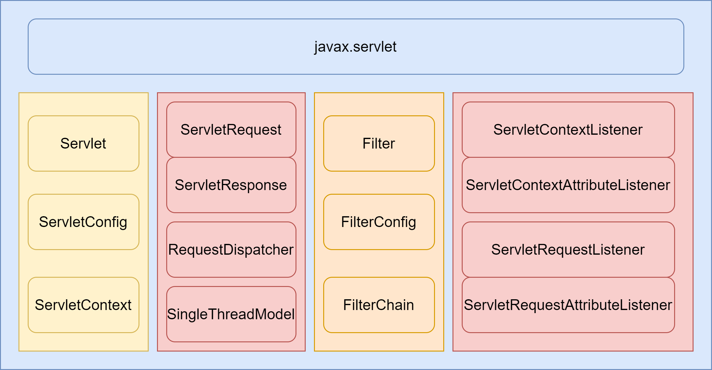
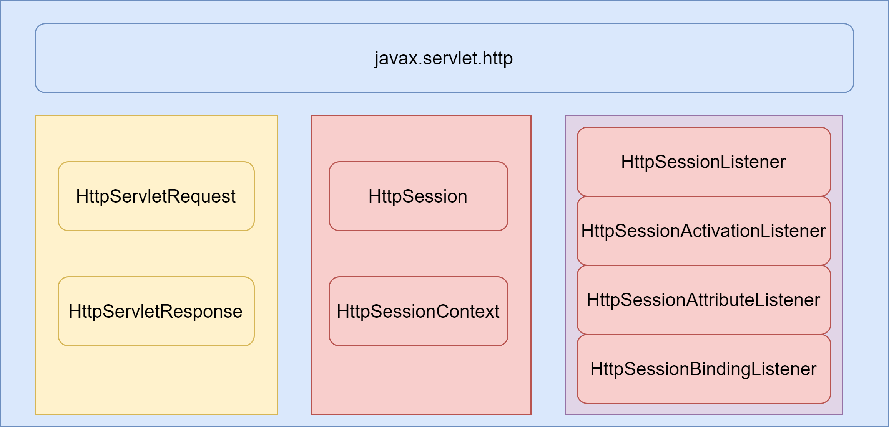
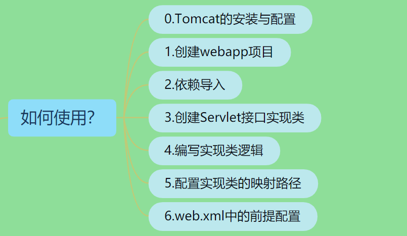

# Servlet概述

JavaEE：Java企业版，sun公司为Java程序员准备的一套完成企业级Java开发的庞大的类库；JavaEE5规范包含13个子规范，子规范下还包含其他的规范。

```
JavaEE5规范下的子规范---
					---servlet2.5
					---JDBC
JavaEE5规范下的子规范---
					---servlet3.0
					---JDBC
					---......
Tomcat服务器：Tomcat6实现了sevrlet2.5规范，Tomcat7实现了3.0规范，Tomcat9实现了4.0规范。
```

架构分类：（S是软件服务器）

1. C/S架构：client / server
  - 娱乐型的，要求用户体验，页面、访问速度好；
  - 缺点：需要安装特定的客户端软件，客户端升级麻烦；
  - 优点：大部分数据集成到客户端软件，只需要从服务器上传少量数据，速度快；客户端页面可以炫酷。
2. B/S架构：browser / server（本质上还是C/S架构，还是客户端访问服务器，只不过客户端是浏览器）
  - 企业内部使用的办公系统，界面要求不高、访问速度不是很慢，要求升级方便；
  - 优点：不需要特定客户端软件，只需要一个浏览器，升级只需要升级服务器端；
  - 缺点：数据都集成在服务器，发生意外时数据丢失严重，访问速度慢；页面粗糙。

以后要走的是方向（企业级开发）：B/S架构；web前端、web后端开发。

B/S架构的角色与协议规范：


Servlet = Serv + let，相当于服务器＋小程序，**servlet——是服务器与Java程序之间要遵守的规范**，而JDBC是程序与数据库之间要遵守的规范。

我们只需要实现Servlet接口，并把实现好的Java程序类和路径写到配置文件(web.xml)中；web.xml文件：将请求路径和Java小程序绑定。

1. javaweb程序员在编程的时候一直是面向Servlet接口去完成调用，不需要关心Servlet中具体的实现类。
2. Tomcat服务器是一个实现了Servlet规范和JSP规范的容器，所以也称为servlet容器或jsp容器。
3. servlet的运行环境叫做web容器或servlet容器，Tomcat就是一个servlet容器；servlet上下文是由Web服务器为每个webapp程序创建的一块共享区域。

Servlet的主要接口（javax.servlet包下和javax.servlet.http包下的）：





# Servlet容器

参考文章：[不知道这些Servlet规范、容器，还敢说自己是Java程序员? - 掘金 (juejin.cn)](https://juejin.cn/post/7024417658695057439)。

1997年SUN公司推出Servlet技术。（容器技术的起源是？？？）

**Servlet接口的出现：**

浏览器发给服务端的是一个HTTP请求，HTTP服务器收到请求后，需调用服务端程序处理请求。那么HTTP服务器怎么知道需要调用哪个处理方法呢？最简单的就是在HTTP服务器代码写一堆if/else：若是A请求就调x类m1方法，若是B请求就调o类的m2方法。 这种设计的致命点在于HTTP服务器代码跟业务逻辑耦合，若你新增了业务方法，竟然还得改HTTP服务器代码。 **面向接口编程**算得上是解决耦合问题的银弹，我们可定义一个接口，各业务类都实现该接口，没错，它就是Servlet接口，实现了Servlet接口的业务类也叫作Servlet。


**Servlet容器的诞生：**

解决了业务逻辑和HTTP服务器的耦合问题，那又有问题了：对特定请求，HTTP服务器又如何知道：哪个Servlet负责处理请求？谁负责实例化Servlet？

显然HTTP服务器不适合负责这些，否则又要和业务逻辑耦合。于是，就诞生了Servlet容器。

其他参考文章：[Servlet、Servlet容器、Tomcat、Nginx - 简书 (jianshu.com)](https://www.jianshu.com/p/eacf1a03dd2a)。

**关于webapp：**Tomcat服务器的webapps目录里，可以放多个webapp小程序，webapp小程序目录的规范如下：

```
webapps
	|---ROOT
	|---xxx：网站目录（webapp目录）
		|---WEB-INF （里面的文件不能直接被访问，需要通过请求才能访问）
			|---classes：放java程序的字节码文件等
			|---lib：放web应用所依赖的jar包
			|---web.xml：网站配置文件，用来对java小程序进行配置
		|---index.html：默认首页
		|---static
			|---css
				|---style.css
			|---js
			|---img
		|---。。。。。。
```

# 第一个servlet程序



1、创建web项目（也可直接在tomcat的webapps目录下安装约定来直接创建相关的文件）。

2、导入servlet的依赖。

```xml
<!-- https://mvnrepository.com/artifact/javax.servlet/javax.servlet-api -->
<dependency>
    <groupId>javax.servlet</groupId>
    <artifactId>javax.servlet-api</artifactId>
    <version>4.0.1</version>
    <scope>provided</scope>
</dependency>
```

2、创建HelloServlet类，如下：

```java
import javax.servlet.Servlet;
import javax.servlet.ServletConfig;
import javax.servlet.ServletException;
import javax.servlet.ServletRequest;
import javax.servlet.ServletResponse;
import java.io.IOException;

public class HelloServlet implements Servlet
{
	public void init(ServletConfig config) throws ServletException{
	}

	public void service(ServletRequest request,ServletResponse response) 
		throws IOException,ServletException{
		//输出到Tomcat服务器控制台
		System.out.println("Hello World!");
	}
	
	public void destroy(){
	}

	public String getServletInfo(){
		return null;
	}

	public ServletConfig getServletConfig(){
		return null;
	}

}
```

3、Servlet4.0下的web.xml配置文件，用来将访问路径与servlet程序绑定：

```xml
<?xml version="1.0" encoding="UTF-8"?>
<web-app  xmlns = "http://xmlns.jcp.org/xml/ns/javaee"
          xmlns:xsi="http://www.w3.org/2001/XMLSchema-instance"
          xsi:schemaLocation="http://xmlns.jcp.org/xml/ns/javaee http://xmlns.jsp.org/xml/ns/javaee/web-app_4_0.xsd"
          version="4.0"
          metadata-complete="true"
          >
		  <!--这是一个合法的xml文件-->
		  <!--一个webapp只有一个web.xml文件-->
		  <!--web.xml文件主要用来配置请求路径和Servlet类名之间的绑定关系-->
		  <!--web.xml文件在tomcat服务器启动的阶段被解析-->
		  <!--web.xml文件解析失败会导致webapp启动失败-->
		  <!--web.xml文件中的标签不能随便乱写，因为tomcat服务器早就知道了该文件中编写哪些标签-->
		  <!--web.xml文件中的标签也是sun公司制定的servlet规范-->
  <display-name>Archetype Created Web Application</display-name>
  
  <servlet>
     <!-- servlet的名称，自行命名 -->
    <servlet-name>thisIsServletName</servlet-name>
     <!-- 如果没有在包里就直接写类名 -->
    <servlet-class>HelloServlet</servlet-class>
  </servlet>
  <servlet-mapping>
    <servlet-name>thisIsServletName</servlet-name>
	<!-- url-pattern：请求路径，可随意编写，但是得以/开始 -->
	<!-- 该路径只是一个虚拟路径，代表一个资源的名称 -->
    <url-pattern>/hello</url-pattern>
	<!-- 可以编写多个url-pattern，以/开始 -->
	<!-- 注意该路径中不能添加项目名称 -->
	<url-pattern>/helloworld</url-pattern>
  </servlet-mapping>

</web-app>
```

4、可自行编辑要输出到浏览器的内容：

```Java
import javax.servlet.Servlet;
import javax.servlet.ServletConfig;
import javax.servlet.ServletException;
import javax.servlet.ServletRequest;
import javax.servlet.ServletResponse;
import java.io.IOException;
import java.io.PrintWriter;

public class HelloServlet implements Servlet
{
	public void init(ServletConfig config) throws ServletException{
	}

	public void service(ServletRequest request,ServletResponse response) 
		throws IOException,ServletException{
        //解决中文字符乱码问题，在获取响应流之前设置，且Java源程序的编码格式为ANSI才能成功
        response.setContentType("text/html;charset=UTF-8");
        response.setCharacterEncoding("utf8");
		//将HTML字符串输出到浏览器上，浏览器解释执行
        //获取输出流对象，流直接指向特定的浏览器客户端
		PrintWriter out = response.getWriter();
       	out.print("<html>");
		out.print("<head><title>HelloServlet</title></head>");
		out.print("<body><h1 align='center'>Welcome study Servlet</h1><br><h2 align='center'>你好！<h2></body>");
		out.print("</html>");
	}
	public void destroy(){
	}
	public String getServletInfo(){
		return null;
	}
	public ServletConfig getServletConfig(){
		return null;
	}
}
```

servlet程序编写步骤总结：

1. 编写实现了Servlet接口的类，在重写的service()方法里编写响应请求的操作。
2. 在web.xml文件配置servlet及其虚拟路径。
3. Servlet实现类的字节码文件要放在WEB-INF的classes目录里。
4. 启动Tomcat服务器，访问虚拟路径。

# servlet的基本知识

## Servlet依赖

servlet的依赖：

```xml
<!-- https://mvnrepository.com/artifact/javax.servlet/javax.servlet-api -->
<dependency>
    <groupId>javax.servlet</groupId>
    <artifactId>javax.servlet-api</artifactId>
    <version>4.0.1</version>
    <scope>provided</scope>
</dependency>
```

数据库驱动的依赖：

```xml
<!-- https://mvnrepository.com/artifact/org.springframework/spring-jdbc -->
<dependency>
    <groupId>org.springframework</groupId>
    <artifactId>spring-jdbc</artifactId>
    <version>5.3.8</version>
</dependency>
```

## web.xml

web.xml的头部：

```xml
<?xml version="1.0" encoding="UTF-8"?>
<web-app  xmlns = "http://xmlns.jcp.org/xml/ns/javaee"
          xmlns:xsi="http://www.w3.org/2001/XMLSchema-instance"
          xsi:schemaLocation="http://xmlns.jcp.org/xml/ns/javaee http://xmlns.jsp.org/xml/ns/javaee/web-app_4_0.xsd"
          version="4.0"
          metadata-complete="true"
          >
    
    
</web-app>
```

## web.xml内标签总结

1. 一个webapp只有一个web.xml文件。

2. web.xml文件主要用来配置请求路径和Servlet类名之间的绑定关系。

3. web.xml文件在tomcat服务器启动的阶段被解析。

4. web.xml文件解析失败会导致webapp启动失败。

5. web.xml文件中的标签不能随便乱写，因为tomcat服务器早就知道了该文件中编写哪些标签。

6. web.xml文件中的标签也是sun公司制定的servlet规范。

7. web.xml文件中各标签要遵循一定的顺序：

   ```ABAP
   The content of element type "web-app" must match "(icon?,display-name?,description?,distributable?,context-param*,filter*,filter-mapping*,listener*,servlet*,servlet-mapping*,session-config?,mime-mapping*,welcome-file-list?,error-page*,taglib*,resource-env-ref*,resource-ref*,security-constraint*,login-config?,security-role*,env-entry*,ejb-ref*,ejb-local-ref*)".
   ```

   

### servlet标签

servlet标签用来定义servlet对象，类似于spring中的bean标签，用来定义servlet对象，servlet-mapping则为servlet对象定义映射路径，映射路径是虚拟路径，从浏览器访问该虚拟路径会被抵达servlet对象，从而执行相应的响应：

```xml
<servlet>
    <servlet-name>随便起一个名字</servlet-name>
    <servlet-class>Servlet接口实现类的全路径</servlet-class>
</servlet>
<servlet-mapping>
    <servlet-name>和上面名字一样</servlet-name>
	<!--请求路径随意编写，但是得以/开始；该路径只是一个虚拟路径，代表一个资源的名称-->
    <url-pattern>/hello</url-pattern>
	<!--可以编写多个url-pattern，以/开始；注意该路径中不能添加项目名称-->
	<url-pattern>/helloworld</url-pattern>
</servlet-mapping>	
```

### welcome-file-list

欢迎页面是webapp根目录下的HTML、JSP、htm页面资源，也可以是servlet对象、其他页面资源、.action文件等。设置欢迎页面在web-app标签里使用如下标签：（欢迎页面资源在该webapp的根目录）

```xml
<!-- 开头不需要“/”，可以设置多个欢迎页面，越靠上越优先，当前面的欢迎页面找不到时才使用后面的欢迎页面 -->
<welcome-file-list>
    <welcome-file>login.html</welcome-file>
    <welcome-file>404.html</welcome-file>
    ......
</welcome-file-list>
```

欢迎页面设置分为全局设置和局部设置，全局设置在Tomcat服务器的conf目录的web.xml文件里，局部设置为webapp的web.xml，优先使用的是局部配置。当访问`http://localhost:8081/s1/`时，如果没有配置映射路径为`/`或`/*`的servlet，那么就能跳转到welcome-file-list所指定的欢迎页（因为该页面资源也是webapp根目录下的资源，由Tomcat配置的servlet——default来处理）。

### error-page

404和500是HTTP协议状态码，是W3C制定的，正常响应的HTTP协议状态码是200。

* 404 Not Found ：资源未找到。
* 500 Server Inner Error： 服务器内部错误，一般都是服务器中Java程序出现异常。

当在web.xml中配置错误页面后，服务器会根据响应状态调用对应的错误页面，配置如下：

```xml
<error-page>
    <error-code>404</error-code>
    <!--相对于webapp根目录-->
    <location>/errorPage/404.html</location>
</error-page>
<error-page>
    <error-code>505</error-code>
    <!--相对于webapp根目录-->
    <location>/errorPage/505.html</location>
</error-page>
```

需要注意的是，当配置了以`/`或`/*`为映射路径的servlet时，error-page配置会失效（因为配置了这两个其中的一个，Tomcat底层的名为default的servlet就失效了，这个servlet是用来访问webapp根目录下的资源的，该配置没了也就不能直接访问webapp根目录下的资源了，只能通过servlet去访问）。

### init-param

`<init-param>`标签，用来定义某个servlet初始化参数：

1. `<init-param>`标签是初始化参数，定义在`<servlet>`标签中。
2. `<init-param>`标签内还有`<param-name>`、`<param-value>`标签，`<param-name>`表示key，`<param-value>`表示value。
3. `<init-param>`定义的参数属于某一个 Servlet，且定义的参数是以键值对的形式声明。
4. `String value = servletConfig.getInitParameter(name)`获取的就是`<init-param>`中的参数。
5. 这些初始化参数信息封装在ServletConfig对象中。

````xml
<servlet>
    <servlet-name>a</servlet-name>
    <servlet-class>cn.mango.servletConfig.a</servlet-class>

    <!--初始化参数init-param-->
    <init-param>
        <param-name>driver</param-name>
        <param-value>com.mysql.jdbc.driver</param-value>
    </init-param>
    <init-param>
        <param-name>url</param-name>
        <param-value>jdbc:mysql://localhost:3306/database</param-value>
    </init-param>
    <init-param>
        <param-name>user</param-name>
        <param-value>root</param-value>
    </init-param>
    <init-param>
        <param-name>password</param-name>
        <param-value>123456</param-value>
    </init-param>
</servlet>
````

### context-param

1. `<context-param>`标签是上下文参数（全局参数），定义在`<web-app>`标签中。
2. `<context-param>`标签内还有`<param-name>`、`<param-value>`
  - ``<param-name>`表示参数的name（key）。
  - `<param-value>`表示name所对应的value。

3. `<context-param>`定义的参数属于全局，该webapp下所有Servlet共享。
4. 这些参数信息封装在ServletContext对象中。

````xml
<!DOCTYPE web-app PUBLIC
 "-//Sun Microsystems, Inc.//DTD Web Application 2.3//EN"
 "http://java.sun.com/dtd/web-app_2_3.dtd" >
<webapp>
    <context-param>
        <param-name>username</param-name>
        <param-value>admin</param-value>
    </context-param>
    <context-param>
        <param-name>password</param-name>
        <param-value>123456</param-value>
    </context-param>
</web-app>
````

## 关于Servlet的路径总结

servlet中需要用到路径的有四处地方：

1. servlet对象的虚拟路径。
2. 前端页面资源里的a标签的href属性。
3. 欢迎页面设置里的`<welcome-file>`标签。
4. 错误页面设置里的`<location></location>`标签。

当在客户端访问服务器资源时，是相对于web服务器的webapps目录，例如访问某个应用，就是`/webappname/xxx`，而在服务器内部的webapp的服务器端处理程序则是相对于该webapp根目录进行寻址定位。

1. `<url-pattern>`标签：以`/`开头，`/`前省略了hostName和webappName；   ---Servlet对象的虚拟路径。
2. `<a href="#">`标签：要以`/webappName`开头，此时`/`前代表的是主机名，如`http://localhost:8080`。  ---浏览器处理的路径
3. `<welcome-file>`标签：是相对webapp根目录的路径。
4. `<location></location>`标签：以`/`开头时是相对webapp根目录的路径；不以`/`时开头时是相对于WEB-INF，此时需要通过映射路径才能访问。

总结：按照以下去进行相对路径定位

1. 前端页面的请求路径是相对于webapps目录；

2. 后端web小程序映射路径相对于项目根目录（webapp）；

3. 相对路径：`/`代表根目录、`../`代表上一级目录、`./`代表当前目录，一般都是从`/`写起，表示作为参考的相对目录。

4. 欢迎页面 

   ```xml
   <welcome-file-list>
       <welcome-file>index.html</welcome-file>
       <welcome-file>WelcomeServlet</welcome-file>
   </welcome-file-list>
   ```

## url-pattern的设置方式

一个Servlet可以编写多个url-pattern，服务器截断路径与servlet映射路径匹配的路径规则：


- 精确匹配

  ```xml
  <url-pattern>/system/hello</url-pattern>
  <url-pattern>/user</url-pattern>
  ```

- 扩展匹配

  ```xml
  <url-pattern>/user/*</url-pattern>
  ```

- 后缀匹配

  ```xml
  <url-pattern>*.action</url-pattern>
  <url-pattern>*.do</url-pattern>
  ```

- 全部匹配（此时访问该webapp下的资源全部都会映射到该servlet）

  ```xml
  <url-pattern>/*</url-pattern>
  <url-pattern>/</url-pattern>
  ```

# Servlet规范的三个重要接口

## Servlet接口

### Servlet与生命周期

Servlet接口的实现类的方法，和servlet的生命周期有一定联系；Servlet接口的方法如下：

````java
// 初始化方法：被创建时执行，执行只执行一次
public void init(ServletConfig config)
// 处理响应与请求：提供服务的方法
public void service(ServletRequest req, ServletResponse res) 
// 销毁Servlet对象前的准备，运行完此方法表示Servlet生命快结束了-销毁
public void destroy() 
// get方法
public void ServletConfig getServletConfig() // 返回一个ServletConfig对象，其中包含此Servlet的初始化和启动参数
public void String getServletInfo() // 返回有关servlet的信息，例如作者，版本和版权
````

servlet对象的生命周期：生命周期表示一个Java对象从最初被创建到最终被销毁，经历的所有过程。注意：

1. Servlet对象的生命周期，javaweb程序员是无权干涉的，包括Servlet对象的相关方法调用，程序员也是无权干涉的。
2. Servlet对象从最初的创建、方法的调用，以及最后被销毁，都是由web容器（比如Tomcat）来管理的。
3. Web Container管理Servlet对象的生命周期。
4. 默认情况 下，Servlet对象在Web容器启动阶段不会被实例化。【若希望在web服务器启动阶段实例化Servlet对象，可以进行特殊设置】。

**对Servlet对象的生命周期的描述：servlet的创建到死亡**

1. 浏览器访问URL：http://localhost:8080/prj-servlet-02/life；
2. web容器截取请求路径：`prj-servlet-02/life`；
3. web容器在容器上下文中寻找请求路径`prj-servlet-02/life`对应的Servlet对象；
   1. 若没有找到对应的Servlet对象：
      1. 会通过`web.xml`文件中的相关信息，得到请求路径`prj-servlet-02/life`对应的Servlet完整类名；
      2. 通过反射机制，调用Servlet类的无参构造方法完成Servlet对象的实例化；
      3. web容器调用Servlet对象的`init()`方法完成初始化；
      4. web容器调用Servlet对象的`service()`方法提供服务。
   2. 若找到对应的Servlet对象：web容器直接调用Servlet对象的`service()`方法提供服务。
4. Servlet对象销毁：
   - web容器关闭的时候、webApp重新部署的时候、该Servlet对象长时间没有用户访问的时候，web容器就会将Servlet对象销毁，在销毁Servlet对象前，会调用对象的`destroy()`方法进行销毁前的准备。


1. 初始化阶段：

   - 当用户第一次向 Servlet 容器发出 HTTP 请求要求访问某个 Servlet 时，Servlet 容器会在整个容器中搜索该 Servlet 对象，发现这个 Servlet 对象没有被实例化，于是创建这个 Servlet 对象，然后调用该对象的 init() 方法完成初始化。

     当用户第二次访问这个 Servlet 时，Servlet 容器仍然在容器中搜索该 Servlet 对象，结果找到了该对象的实例，则不去创建而直接使用该对象。

     找到了对应的 Servlet 对象，随后 Servlet 进入到运行阶段。

     需要注意的是，在 Servlet 的整个生命周期内，它的 init() 方法只被调用一次。

2. 运行阶段：

   - 这是 Servlet 生命周期中最核心的阶段。在该阶段中，Servlet 容器会为当前的请求创建一个 ServletRequest 对象和一个 ServletResponse 对象（它们分别代表 HTTP 请求和 HTTP 响应），并将这两个对象作为参数传递给 Servlet 的 service() 方法。

     service() 方法从 ServletRequest 对象中获得用户的详细请求信息并处理该请求，通过 ServletResponse 对象生成响应结果。

     需要强调的是，在 Servlet 的整个生命周期内，用户每次请求访问 Servlet 时，Servlet 容器都会调用一次 Servlet 的 service() 方法，并且创建新的 ServletRequest 和 ServletResponse 对象。

3. 销毁阶段：

   - 当服务器停止时，Servlet 容器需要回收 Servlet 对象所占用的内存，在回收之前，会自动调用该对象的 destroy() 方法做好回收内存前的准备，辟如关闭后台线程。

     和 init() 方法类似，destroy() 方法也只会被调用一次。

     注意：Servlet 对象一旦创建就会驻留在内存中一直等待客户端的访问，直到服务器关闭或项目被移除出容器时，Servlet 对象才会被销毁。

**总结：**对 Servlet 声明周期的几点汇总：

1. Servlet 对象被创建之后执行 init() 方法，并且 init() 方法只执行一次，其主要目的是完成 Servlet 对象的初始化工作。
2. 对于 Servlet 对象的 service() 方法，只要用户请求一次，那么 service() 方法就执行一次（其它方法都只执行一次）。
3. Servlet 对象被回收之前，destroy() 方法会被调用，该方法只执行一次，执行的时候 Servlet 对象还在。
4. Servlet对象是单例，但不符合单例，只能称为伪单例（真单例构造方法私有），只会实例化一个Servlet对象，多用户多线程访问时，使用的也是同一个Servlet对象。
   Tomcat是支持多线程的，所以Servlet对象是在单实例多线程的环境下运行的；那么Servlet对象中若有实例变量，并且实例变量涉及到修改操作，那么这个Servlet对象一定会存在线程安全问题，不建议在Servlet对象中使用实例变量（类的属性），尽量使用局部变量。
5. 第一次启动web容器后，servlet对象被创建后，其长期存在，直到web容器关闭。

Servlet 对象的创建、对象的服务提供、对象的销毁等操作皆由 Servlet 容器来管理，Java 程序员的任务只是负责编写 Servlet 类，无法干涉 Servlet 对象的生命周期。

**Servlet对象随容器启动而实例化：**

如希望在**web服务器启动阶段实例化Servlet对象**，需要在`web.xml`文件中进行相关的配置，例如：在`servlet`标签中使用`load-on-startup`标签。(注意：使用`load-on-startup`标签，数字越小，优先级越高)

```xml
<servlet>
    <servlet-name>hello</servlet-name>
    <servlet-class>Hello</servlet-class>
    <!--此处设置Servlet对象在服务器启动阶段实例化的优先级-->
    <load-on-startup>1</load-on-startup>
</servlet>
<servlet>
    <servlet-name>welcome</servlet-name>
    <servlet-class>Welcome</servlet-class>
    <!--此处设置Servlet对象在服务器启动阶段实例化的优先级-->
    <load-on-startup>0</load-on-startup>
</servlet>

<servlet-mapping>
    <servlet-name>hello</servlet-name>
    <url-pattern>/hello</url-pattern>
</servlet-mapping>
<servlet-mapping>
    <servlet-name>welcome</servlet-name>
    <url-pattern>/welcome</url-pattern>
</servlet-mapping>
```

实现方法的使用：

Servlet接口中的这些方法中写什么代码？什么时候使用这些方法？

1. `无参构造方法`【以后就不需要考虑构造方法了，尽量别动构造方法】；
2. `init()`
   无参构造方法和`init()`，两个方法执行时间几乎是相同的，都只执行一次，**若系统要求对象在创建时刻执行一段特殊的程序，这段程序尽量写到`init()`方法中**。
   为什么不建议将代码写到构造方法中呢？
   存在风险！当程序员编写构造方法的时候，可能会导致无参构造方法不存在。
   Servlet中的`init()`方法是SUN公司为程序员专门提供的一个初始化时刻，若希望初始化时刻执行一段程序，这个程序可以编写在`inti()`方法中，将来会被自动调用。

3. `service()`
   这个方法是必然重写的，因为这个方法需要完成业务逻辑的处理，请求的处理，以及完成响应。（最有价值但最难编写，业务代码是最难编写的啦）。
4. `destroy()`
   这个方法是为程序员提供的一个特殊时刻，这个特殊时刻被称为对象销毁时刻；若希望在销毁时刻执行一段特殊代码，需要将这段代码写到`destroy()`方法中，会被容器自动调用。

类加载时刻的执行代码编写到静态代码块中。

**了解：关于Servlet对象实例化**：Servlet对象实例化之后存储到哪里了：

大多数的Web容器都是将该Servlet对象以及对应的`url-pattern`存储到了`Map集合`中，在web容器中有这样一个Map集合，
**Map<String, Servlet>**集合，键值对例子如下：

```
  key                   value
--------------------------------------
/login          LoginServlet对象的引用
/delete         DeleteServlet对象的引用
/insert         InsertServlet对象的引用
```

**了解：关于解析web.xml文件**

服务器启动阶段会解析各个webapp中的web.xml文件，做了什么？在web容器中有这样一个集合**Map<String, String>**：

````
  key                            value
---------------------------------------------------------
/login          cn.qkmango.javaweb.servlet.LoginServlet
/delete         cn.qkmango.javaweb.servlet.DeleteServlet
/insert         cn.qkmango.javaweb.servlet.InsertServlet
````

实际上，服务器启动时会解析web.xml文件，并且将解析的数据存放在Map集合中，当在浏览器中输入请求的路径时，web容器会先在**Map<String, Servlet>**集合找请求路径所对应的Servlet对象，如果没有找到，再去web.xml文件中寻找（**实际上不是去web.xml文件中找此路径对应的完整类名，而是去此Map集合中查找**）。


### Servlet适配器

为了更好地构建Servlet的对象，GenericServlet通过继承和抽象，减少了对方法的重写，也可以提供其它的方法供子类使用，使代码更加优雅。适配器模式。创建servlet对象时继承该抽象类，就可以仅对自己需要的方法进行重写，service()方法是必须要存在的，所以GenericServlet在实现Servlet接口时抽象了service()方法。

**自定义适配器：**

```java
public abstract class GenericServlet implements Servlet {
    private ServletConfig config;
    @Override
    public final void init(ServletConfig servletConfig) throws ServletException {
        this.config = servletConfig;
        this.init();
    }
    // 若在初始化时刻需要执行一段特殊的代码，建议重写此无参数的init()方法
    public void init() {}
    @Override
    public ServletConfig getServletConfig() {
        return config;
    }
    @Override
    public abstract void service(ServletRequest servletRequest, ServletResponse servletResponse) throws ServletException, IOException;
    @Override
    public String getServletInfo() {
        return null;
    }
    @Override
    public void destroy() {
    }
    //-------------------自定义扩展方法，方便子类使用-----------------
    /**
 	* 获取ServletContext Servlet上下文对象
 	* @return javax.servlet.ServletContext 返回Servlet上下文对象
 	*/
    public ServletContext getServletContext() {
        return getServletConfig().getServletContext();
    }
}
```

自定义适配器解析：

1. 实现Servlet接口并把service方法抽象。
2. 提供config属性和其get方法，还有上下文的get方法。
3. 为了让适配器类中`init(ServletConfig)`中的代码生效，用final修饰限制不被重写，但是为了在初始化时刻可以执行一段初始化代码，就需要写一个无参数的init()方法，并在`init(ServletConfig)`方法里完成调用（这个方法就是专门用来存放初始化逻辑代码的方法，通过在`init(ServletConfig servletConfig)`里调用完成执行初始化代码的功能）。

SUN提供了GenericServlet类（适配器类）：`javax.servlet.GenericServlet`，直接继承该类就好。

### HttpServlet实现类

**为什么会出现该实现类？**

该实现类的出现的原因是因为解决“前后端请求方式一致”的需求。

1. 需求：前端页面发送的请求方式要与服务器端需要的请求方式一致，也就是：

   - 服务器需要前端发送POST，那么前端就应该发送POST请求，否则服务器应当提示错误信息；

   - 服务器需要前端发送GET，那么前端就应该发送GET请求，否则服务器应当提示错误信息。

2. 怎么完成以上的需求？

   2-1：在Javaweb程序中想办法获取该请求是什么类型的请求：

   如何获取请求方式？**HTTP的请求协议全部信息会被自动封装到`javax.servlet.http.HttpServletRequset`对象中**，可以根据这个接口的String getMethod()方法来获取请求方式。

   ```java
   //HtppServletRequest extends ServletRequest
   //将ServletRequest强制转换为带有Http的接口类型
   HttpServletRequest httpServletRequest = (HttpServletRequest) servletRequest;
   
   //获取浏览器发送的请求方式
   String method = httpServletRequest.getMethod();
   System.out.println(method);
   ```

   - 疑问：HttpServletRequest 继承自 ServletRequest，为什么可以直接向下转型，将父类转换为子类？

     其实`service()`方法的两个参数servletRequest、servletResponse，实际上并不是`new ServletRequest()`，Tomcat内部实际上是`new HttpServletRequest()`，所以本质上servletRequest是HttpServletRequest，所以我们进行强转并不会报错；同理，`service()`的另一个参数servletResponse本质上也是HttpservletResponse对象。

     ````java
     //Tomcat内部创建service()的两个参数对象，实际上是使用了多态
     ServletRequest request = new HttpServletRequest();
     ServletResponse response = new HttpServletResponse();
     ````

   2-2：当我们获取到请求方式以后，在Javaweb程序中可以使用Java语言进行判断：

   ```java
   if("POST".equals(method)) {
       //.......
   } else if("GET".equals(method)) {
       //.......
   }
   ```

上述总结：为了达到需求，需要在每一个Servlet实现类中都编写了以下程序，来保证前端请求方式和后台需要的请求方式一致：

````java
// 将ServletRequest、ServletResponse强制转换为带有Http的接口类型
HttpServletRequest httpServletRequest = (HttpServletRequest) servletRequest;
HttpServletResponse httpServletResponse = (HttpServletResponse) servletResponse;

httpServletResponse.setContentType("text/html;charset=UTF-8");
PrintWriter writer = httpServletResponse.getWriter();

// 获取浏览器发送的请求方式
String method = httpServletRequest.getMethod();
System.out.println(method);


// login是处理登陆的，要求前端必须发送POST请求
if("GET".equals(method)) {
    //后台报出错误
    writer.print("405-您应当发送POST请求");
    //前端报出错误
    throw new RuntimeException("405-您应当发送POST请求");
}

// 如果程序可以执行到这一步，说明用户发送的是POST请求，程序正常执行
writer.print("正在登陆......");
````

以上代码在每一个Servlet实现类中都需要编写，能不能封装一下，使得在每一个具体的Servlet类中不用再编写这样的代码，但是还是能够达到同样的效果？SUN公司提供了一个类`HttpServlet`，通过实现该接口即可。

**如何自定义HttpServlet？**

自定义HttpServlet，封装：【prj-servlet-08】

```java
public class HttpServlet extends GenericServlet {
    /**
     *  此方法为原始的service()方法，最先被调用的方法
     *  方法里调用重载的service(HttpServletRequest, HttpServletResponse)方法
     */
    @Override
    public void service(ServletRequest req, ServletResponse res) throws ServletException, IOException {
        HttpServletRequest request = (HttpServletRequest) req;
        HttpServletResponse response = (HttpServletResponse) res;
        service(request,response);
    }

    /**
     * 此方法获取请求方式后进行判断，
     * 如果是GET请求就执行doGet()
     * 如果是POST请求就执行doPost()
     * 此方法没有理由重写，只需要将业务代码写在doGet()或doPost()方法中即可
     */
    public void service(HttpServletRequest request, HttpServletResponse response) throws IOException {
        String method = request.getMethod();
        if("POST".equals(method)) {
            doPost(request, response);
        } else if("GET".equals(method)) {
            doGet(request, response);
        }
    }

    /**
     * 浏览器端是什么请求时，子类继承此父类就应当重写对应的doGet()或者doPost()方法
     * 在doGet()或者doPost()方法内写业务代码，即将原来的service()内的业务代码写到doXXX()中
     * 如果HttpServlet子类重写的方法不对应，则会调用没有被覆盖的方法发出警告
     */
    public void doPost(HttpServletRequest request, HttpServletResponse response) 
        throws IOException {
        response.setContentType("text/html;charset=UTF-8");
        response.getWriter().print("应当发送GET请求");
        throw new RuntimeException("应当发送GET请求");
    }

    public void doGet(HttpServletRequest request, HttpServletResponse response) 
        throws IOException {
        response.setContentType("text/html;charset=UTF-8");
        response.getWriter().print("应当发送POST请求");
        throw new RuntimeException("应当发送POST请求");
    }
}
```

**总结：**前端页面表单form的method是GET或POST，当程序运行时，先进入service()原始方法运行，再运行到重载的service()方法来判断是doGet()还是doPost()方法，再执行相应的方法。如果继承HttpServlet的类重写的方法不对，那么就覆盖不了父类的，就会执行父类的doGet()或doPost()方法，在父类的方法里设置好警示的代码，就达到了判断前后端请求是否一致并发出警告的目的。

所以，我们的Servlet对象继承HttpServlet后，后端需要的是什么请求，那么我们就重写对应的doPost()或doGet()方法，方法内是我们的业务代码，并不需要重写service()方法。（当浏览器发送的请求和后台处理方式不同的话，就会出现405错误）


## ServletConfig接口

简单了解一下：`javax.servlet.ServletConfig`是一个接口，Apache Tomcat服务器实现了Servlet规范，Tomcat服务器写了一个ServletConfig接口的实现类，实现类的完整类名是`org.apache.catalina.core.StandardWrapperFacade`，webapp放到Tomcat服务器中，ServletConfig的实现类是：`org.apache.catalina.core.StandardWrapperFacade`，webapp放到JBOSS服务器中，ServletConfig的实现类可能是另外一个类名了。

1. **ServletConfig到底是什么？**

   - ServletConfig是一个Servlet对象的配置信息对象，ServletConfig对象中封装了一个Servlet对象的配置信息；
   - （Servlet对象的配置信息在web.xml文件中，使用init-param来初始化配置信息）；
   - 一个Servlet对象对应一个ServletConfig对象，100个Servlet对象对应100个ServletConfig对象。

2. 在service()方法中使用servletConfig对象

   - 在`init()`方法中完成：局部变量servletConfig赋值给实例变量servletConfig；

   - 在`getServletConfig()`，提供公开的get方法，目的是供子类使用，只需要修改return返回值即可；

   - ServletConfig对象的装配如下：

     ```Java
     public class AServlet implements Servlet {
         //定义实例变量
         private ServletConfig config;
     
         @Override
         public void init(ServletConfig servletConfig) throws ServletException {
             //将局部变量中的servletConfig赋值给实例变量servletConfig
             this.config = config;
         }
     
         //这个方法是供子类使用的，在子类中若想获取ServletConfig，可以调用这个方法
         @Override
         public ServletConfig getServletConfig() {
             //返回实例变量servletConfig
             return config;
         }
     }
     ```

5. ServletConfig接口的方法

   1. `String getInitParameter(String name)`：通过初始化参数的名字获取对应参数值；

   2. `Enumeration getInitParameterNames()` ：获取初始化参数的名字的集合；

      ```java
      Enumeration<String> names = config.getInitParameterNames();
      while (names.hasMoreElements()){
      	String name = names.nextElement();
      	String value = config.getInitParameter(name);
      	out.println(name + "=" + value);
      }
      ```

   3. `String getServletName()`：获取当前实现类对象的servletName：；

   4. `ServletContext  getServletContext()`：获取ServletContext【Servlet上下文】对象。

## ServletContext接口

```JAVA
org.apache.catalina.core.ApplicationContextFacade // 其实现类
```

### 概述

**ServletContext到底是什么？什么时候被创建？什么时候被销毁？创建几个？**

1. ServletContext被译为：Servlet上下文。

2. 配置加载：一个webapp只有一个web.xml文件，web.xml文件在服务器启动阶段被解析。

3. ServletContext实例化：一个webapp只有一个ServletContext对象，ServletContext对象在服务器启动阶段被实例化。

4. ServletContext的销毁：ServletContext在服务器关闭的时候被销毁。

5. ServletContext的本质：

   1. ServletContext对应的是web.xml文件，是web.xml文件的代表。

   2. ServletContext是所有Servlet对象四周环境的代表，被所有Servlet对象共享【在同一个webapp中，所有Servlet对象共享一个四周环境对象，该对象就是ServletContext】。

      ```mermaid
      classDiagram
          Servlet01--|> ServletContext对象
          Servlet02 --|>ServletContext对象
          Servlet03--|> ServletContext对象
          ServletContext对象:目的是让Servlet之间传递和共享数据
      ```

6. 所有用户若想共享同一个数据，可以将数据放到ServletContext对象中（写到web.xml文件中，或后期通过方法添加）。

7. 一般放到ServletContext对象中的数据不建议是涉及到修改操作的数据，因为ServletContext是多线程共享的一个对象，修改的时候会存在线程安全问题。

### 常用方法

可使用ServletConfig config对象的getServletContext()方法获取上下文对象，再使用其相关方法。

```java
// ServletConfig对象的获取见上面的ServletConfig接口
ServletContext servletContext = servletConfig.getServletContext();
```

**ServletContext接口中常用方法：**

1. `void setAttribute(String name, Object object)` ：将添加数据到Servlet上下文。
2. `Object getAttribute(String name)`：从Servlet上下文中获取数据 。
3. `void removeAttribute(String name)` ：从Servlet上下文中移除数据。
4. `String getInitParameter(String name)`：根据初始化参数名字获取\<context-param>标签中的初始化参数值。
5. `Enumeration getInitParameterNames()`：获取\<context-param>标签的param-name的集合。
6. `String getRealPath(String path)`：获取文件的绝对路径。


### 特点和总结

**特点：**

1. Servlet、ServletConfig、ServletContext之间的关系：

   - 一个Servlet对应一个ServletConfig对象。
   - 所有的Servlet共享一个ServletContext对象。
2. **在ServletContext范围可以完成跨用户传递数据：**A用户在ServletContext中存储了一个数据，B用户可以利用ServletContext对象通过name获取对应的数据。

**总结：**

ServletConfig与ServletContext中的`getInitParameter()`、`getInitParameterNames()`的差异：

1. ServletConfig是每个Servlet对象的配置信息对象，ServletConfig中的`getInitParameter()`与`getInitParameterNames()`获取到的初始化参数是在`<init-param>`标签中的，`<init-param>`标签定义在`<servlet>`标签里面。

2. ServletContext是所有Servlet对象的共用的四周环境，ServletContext中的`getInitParameter()`与`getInitParameterNames()`获取到的参数是在`<context-param>`标签中的，`<context-param>`标签定义在`<web-app>`标签里面。

ServletContext中的`getInitParameter(String name)`与`getAttribute(String name)`不同：

1. `getInitParameter(String name)`：获取到的参数是写在web.xml文件`<context-param>`标签中的，获取到的都是字符串参数。
2. `getAttribute(String name)`：获取到的数据是程序运行时通过setAttribute(String name, Object object)方法添加到ServletContext中的数据，数据可以是任何类型，不同servlet对象都可以利用该方法通过name获取到数据。

# HTTP协议

什么是http协议？超文本传输协议，浏览器和服务器之间的一种通讯协议，该协议是W3C负责制定的，其本质上就是提前指定好了的数据传送格式。浏览器和服务器都必须按照这种格式接收与发送数据。目前使用的HTTP协议版本号是HTTP1.1。

HTTP协议包括两部分：

- 请求协议：从Browser发送到Server的时候采用的数据传送格式；
- 响应协议：从Server发送到Browser时时候采用的数据传送格式。

## 请求协议

请求协议(请求报文)包括：请求行（请求行包括(请求方式 URI 协议版本号)，例如： `POST /webapp10/login HTTP/1.1`）、消息报头、空白行（专门用来分离消息报头和请求体的）、请求体。

**GET请求**：如下是一个GET请求的登陆页面的请求，由于请求方式为GET，所以发送的数据在请求行上发送！故请求体为空：

````http
GET /webapp10/login?username=admin&password=123 HTTP/1.1    //请求行
Accept: text/html, application/xhtml+xml, image/jxr, */* 消息报头
X-HttpWatch-RID: 50301-10022
Referer: http://localhost:8080/webapp10/
Accept-Language: zh-CN
User-Agent: Mozilla/5.0 (Windows NT 10.0; WOW64; Trident/7.0; rv:11.0) like Gecko
Accept-Encoding: gzip, deflate
Host: localhost:8080
Connection: Keep-Alive
														 空白行
														 请求体
````

**POST请求**：如下是一个POST请求的登陆页面的请求，请求体展示了请求的内容`username=admin&password=***`：

````http
POST /webapp10/login HTTP/1.1                             请求行						
Accept: text/html, application/xhtml+xml, image/jxr, */*  消息报头
X-HttpWatch-RID: 50301-10054
Referer: http://localhost:8080/webapp10/
Accept-Language: zh-CN
User-Agent: Mozilla/5.0 (Windows NT 10.0; WOW64; Trident/7.0; rv:11.0) like Gecko
Content-Type: application/x-www-form-urlencoded
Accept-Encoding: gzip, deflate
Host: localhost:8080
Content-Length: 27
Connection: Keep-Alive
Cache-Control: no-cache
						               空白行
username=admin&password=123            请求体
````

## 响应协议

响应协议包括四部分：状态行（协议版本号 状态码，例如：`HTTP/1.1 200 OK`）、响应报头、空白行（是用来分离响应报头和响应体的）、响应体。

响应协议中要重点掌握的状态码：

- 200：响应成功正常结束。

- 404：资源未找到。

- 500：服务器内部错误。

如下是服务器的响应：

````http
HTTP/1.1 200 OK             状态行
Server: Apache-Coyote/1.1   响应报头
Content-Type: text/html;charset=UTF-8
Content-Length: 21
Date: Thu, 13 Aug 2020 10:15:13 GMT
	                        空白行
<h1>登陆成功</h1>            响应体
````

## GET与POST的区别

### GET与POST的若干问题

**什么情况下浏览器发送的请求是GET请求，什么情况下浏览器发送的请求是POST请求？**

只有当使用表单form，并且form的标签的method属性设置为method="post"，才是POST请求方式，其余剩下的所有请求方式都是基于GET请求。

**GET请求和POST请求有什么区别？**

1. GET请求在请求行上提交数据，格式`uri?name=value&name=value`，这种提交方式：最终提交的数据会显示在浏览器地址栏上。

2. POST请求在请求体中提交数据，相对安全，提交格式`name=value&name=value`，这种提交方式最终不会显示在浏览器地址栏上。
3. POST请求在请求体中提交数据，所以POST请求提交的数据没有长度限制【POST可以提交大数据】。
4. GET请求在请求行上提交数据，所以GET请求提交的数据长度有限制。
5. GET请求只能提交字符串数据，POST请求可以提交任何类型的数据，包括视频...，所以**文件上传必须使用POST请求**。
6. GET请求最终的结果，会被浏览器缓存收纳，而POST不会被缓存收纳（为什么GET会被缓存？）。

**GET请求和POST请求应该如何选择？**

1. 有敏感数据  ===> POST。
2. 传送的数据不是普通字符串  ===>  POST。
3. 传送的数据非常多  ===>  POST。
4. 这个请求是为了修改服务器端资源  ===>  POST。
5. GET请求多数情况下是**从服务器中读取资源**，这个读取的资源在短时间内不会发生变化，所以GET请求的结果最终会被浏览器缓存起来。
6. POST请求是为了修改服务器端的资源，而每一次修改结果都是不同的，最终结果没有必要被浏览器缓存。

### 缓存解决方案

浏览器将资源缓存后，缓存的资源是和某个特定的路径绑定在一起的，只要浏览器再发送这个相同的请求路径，这个时候浏览器就会去缓存中获取资源，不再访问服务器，这种方式可以降低服务器的压力，提高用户体验。

但是有的时候我们并不希望走缓存，而是希望每一次后台访问都走服务器，那么可以在请求路径后面添加时间戳，例如：`http://ip:port/oa/system/logout?timetamp=1234564635423`

# 模版方法-设计模式

模板方法举例：

- Person类

  templateMethod()是一个模版方法，定义核心算法骨架，具体的实现步骤延迟到子类中完成，算法为了受到保护，所以模版方法一般都使用final修饰，不被重写，核心算法骨架不需要每一次在具体的类中编写了，这个核心算法只在模版方法中编写一次，改变算法步骤，只要更改模版就可以，同时也避免了算法在每一个具体的类中都编写而造成的冗余。

- Student类、 Worker类

  Student和Worker只需要关心算法的具体实现细节即可，不需要关心算法的步骤，也不需要在每一个类中都写上算法，这样避免了代码冗余，增加了模板方法的代码通用性，修改代码的算法步骤也只需要修改模板类即可。


```java
public abstract class Person {
    /**
     * templateMethod是一个模版方法，定义核心算法骨架，具体的实现步骤延迟到子类中完成
     * 算法为了受到保护，所以模版方法一般都使用final修饰，不被重写
     * 核心算法骨架不需要每一次在具体的类中编写了，这个核心算法只在模版方法中编写一次
     * 算法步骤改变，只要更改模版就可以，同时也避免了算法在每一个具体的类中编写而冗余
     */
    public final void templateMethod() {
        //核心算法骨架
        do1();
        do2();
        do3();
    }
    /**
     * 这就是具体的实现，这个具体的步骤可以延迟到子类中完成
     * 这个方法通常是抽象方法
     */
    protected abstract void do1();
    protected abstract void do2();
    protected abstract void do3();
}

public class Student extends Person {
    @Override
    protected void do1() {
        System.out.println("学生起床");
    }

    @Override
    protected void do2() {
        System.out.println("学生上课");
    }

    @Override
    protected void do3() {
        System.out.println("学生放学");
    }
}

public class Worker extends Person{
    @Override
    protected void do1() {
        System.out.println("工人起床");
    }

    @Override
    protected void do2() {
        System.out.println("工人上班");
    }

    @Override
    protected void do3() {
        System.out.println("工人下班");
    }
}

public class Test {
    public static void main(String[] args) {
        Student student = new Student();
        student.templateMethod();

        Worker worker = new Worker();
        worker.templateMethod();
    }
}
```

总结：

模版方法设计模式属于行为行设计模式，模版方法有一个特点：`doXXX()`；模板方法设计模式的主要作用：

1. 核心算法得到保护；
2. 核心算法得到复用；
3. 在不改变算法的前提下，却可以重新定义算法步骤的具体实现。

模板方法设计模式的例子：

- Servlet规范中的HttpServlet就是一个模板类，典型的模板方法设计模式；其中的service(HttpServletRequest, HttpServletResponse)方法是典型的模板方法，该方法中定义了核心算法骨架，doGet()、doPost()......具体的实现细节延迟到子类中完成。

# HttpServletRequest接口

**HttpServletRequest接口介绍：**

HttpServletRequest是Servlet规范中重要的接口之一。HttpServletRequest接口的实现类是Web容器负责的，Tomcat服务器有自己的实现。但是程序员还是只需要面向HttpServletRequest接口调用方法即可，不需要关心具体的实现类。

```java
public interface HttpServletRequest extends ServletRequest
```

HttpServletRequest内容举例：（HttpServletRequest封装了HTTP请求协议的全部内容）

1. 请求方式

2. URI

3. 协议版本号

4. 表单提交的数据

  ......等等

request：HttpServletRequest一般对象的名字叫做：request；HttpServletRequest对象代表一次请求，一次请求执行一次service()方法，对应一个request对象，100个请求对应100个request对象，所以request对象的生命周期是短暂的；【什么是一次请求？到目前为止，我们可以这样理解一次请求：在网页上点击超链接，到最终网页停下来，这就是一次完整的请求；（后面学习重定向，浏览器会自动跳转到其他地址，会重新发送新的请求，这句话就不正确了）】。表单提交的数据被自动封装在request对象中。

表单数据是以一定的数据格式格式通过POST请求，在请求体中提交，数据格式如下：

``` url
username=admin&password=123&sex=boy&interest=sport&interest=music&grade=gz&introduce=student
```

**表单数据的封装：**

表单提交的数据会自动封装到request对象中，request对象中有一个Map集合，存储这些数据

```
Map<String, String>
key          value（value是数组）
-------------------------------
username     {"admin"}
password     {"123"}
sex          {"boy"}
interest     {"sport",music}
grade        {"gz"}
introduce    {"IAmAStudent"}
```

**HttpServletRequest中常用的方法：**【prj-servlet-09、prj-servlet-10】

表单提交的数据会封装在request对象的Map集合中，Map集合的key是name，value是一个字符串类型的一维数组。（表单中数据的name对应map集合的key）

```java
/* 获取浏览器提交的数据 */
String getParameter(String name)    通过key获取对应的一维数组的首元素（通常该数组只有一个元素，该方法使用最多）
Map getParameterMap()               获取整个Map集合
Enumeration getParameterNames()     获取Map集合中全部的key
String[] getParameterValues(String name)  通过map集合的key获取value

/* 获取路径、URL、URI、IP */
String getContextPath()        获取上下文路径（web项目根路径）
String getMethod()             获取浏览器请求方式
String getRequestURI()         获取请求的URI
StringBuffer getRequestURL()   获取请求的URL
String getServletPath()        获取请求的ServletPath，即servlet对应的虚拟路径
String getRemoteAddr()         获取客户端IP地址

/* 从一次请求对应的HttpServletRequest对象范围中增删查数据 */
Object getAttribute(String name)          从此次请求所对应的request对象范围中获取数据
void setAttribute(String name, Object o)  从此次请求所对应的request对象范围中存储数据
void removeAttribute(String name)         从此次请求所对应的request对象范围中删除数据

// 将两个servlet对象执行放到同一个请求中，使用转发技术，在一个对象里转发到另一个对象
/* 获取请求转发器，再调用forward()方法，把请求响应传给下一个servlet对象 */
RequestDispatcher getRequestDispatcher(String path)   获取请求转发器
request.getRequestDispatcher("servlet的虚拟路径").forward(request,response);   //使用

/* 编码 */
void setCharacterEncoding(String env)    覆盖此请求正文中使用的字符编码的名称

/* cookie 和 会话*/
HttpSession getSession()    返回与此请求关联的当前会话，或者如果该请求没有会话，则创建一个。
Cookie[] getCookies()       返回一个数组，其中包含Cookie 客户端与此请求一起发送的所有对象。
```

# 数据乱码问题

## 乱码的三种情况

**数据保存过程中的乱码：**

数据保存到数据库表中的时候，数据出现乱码；导致数据保存过程中的乱码包括以下两种情况：

1. 前一种情况：在保存之前，数据本身就是乱码（使用的字符集不支持中文），保存到数据库表中的时候一定是乱码；
2. 第二种情况：保存之前，数据不是乱码，但是由于数据库本身数据库不支持简体中文，保存之后出现乱码。

 **数据展示过程中的乱码：**

1. 最终显示到网页上的数据出现中文乱码。

   - 经过执行Java程序之后的，Java程序负责向浏览器响应的时候的中文乱码，解决方法就是在Java程序中设置响应的内容的类型，以及对应的字符集：


   ````java
   response.setContentType("text/html;charset=UTF-8");
   ````

2. 没有经过Java程序的，直接访问的是静态页面的：资源文件编码时的字符集要与浏览器解析时使用的字符集一致，例如文件编码时使用的字符集是UTF-8，那么可以在HTML页面资源文件中使用`<meta charset="UTF-8">`标签来指定网页编码时使用的字符集。

**数据传递过程中的乱码：**

- 将数据从浏览器发送给服务器的时候，服务器接收到的数据是乱码的。
- 原因：ISO-8859-1（国际标准码，不支持中文，兼容ASCII码，也称为Latin1编码），是浏览器发送的数据的默认编码方式，也是Tomcat默认的解码方式。

## 数据传送流程

### GET请求

GET请求的数据会放到请求体，所以会对部分URL进行编码，表单中的数据（键值对）经过URLencode编码后追加到url中（URLencode编码过程使用的字符集由浏览器决定）。


服务器接收到数据进行解码：以Tomcat7.0为例，Tomcat会使用默认的ISO-8859-1进行解码，此时字符集可能与浏览器端编码的字符集不同而出现乱码。

### POST请求

POST请求方式的数据会放在请求体中，编码时：将表单中的数据（键值对）经过URLencode编码后放到请求体中（URLencode编码过程使用的字符集默认由网页标签属性设置决定）。


以Tomcat7.0为例，Tomcat服务器会使用默认的ISO-8859-1（国际标准码，不支持中文，兼容ASCII码，也称为Latin1编码）进行解码，此时字符集可能与浏览器端编码的字符集不同而出现乱码（可通过Java程序进行字符集的设置）。

## 解决数据传送过程的乱码

万能方式：适用于POST和GET：

````java
// 拿到从浏览器接收到的数据
String value = request.getParameter("name");
// 将服务器的数据通过ISO-8859-1解码来回归原始状态
byte[] bytes = dname.getBytes("ISO-8859-1");
// 再重新编码组装
value = new String(bytes, "UTF-8");
````

仅适用于POST请求：只对请求体编码，得在取数据之前设置

```java
// 告诉服务器请求体使用哪种编码方式
request.setCharacterEncoding("UTF-8");
// 获取请求提交的数据
String value = request.getParameter("name");
```

仅适用于GET请求：通过修改Tomcat默认的编码字符集

```xml
<!--> 修改CATALINA_HOME/conf/server.xml文件，
加上URIEncoding="UTF-8"属性，设置请求行上的编码方式，解决GET请求乱码 </!-->

<Connector port="8080" 
	protocol="HTTP/1.1"
	connectionTimeout="20000"
	redirectPort="8443" 
	URIEncoding="UTF-8"/>
```

Connector标签可编写属性？port（端口）、maxThreads（最大线程）、URIEncoding。

URIEncoding：是将字符通过某种字符集进行编码后，再使用百分号编码的编码方式。

如字符通过UTF-8字符集进行编码后得到的二进制文件，然后将二进制转化为16进制，在每一个字符前面加上%作为分隔：

```ABAP
		  UTF-8							    百分号编码
"销售部"  -------> E9 94 80 E5 94 AE E9 83 A8 ---------> %E9%94%80%E5%94%AE%E9%83%A8
```

# Servlet线程安全

Servlet是单实例多线程环境下运行的，Servlet对象只有一个，被多个线程共享；new出来的对象在堆空间，所有线程共享一个堆空间。

**什么时候程序会存在线程安全问题？**

1. 多线程并发。
2. 有共享数据。
3. 共享数据有修改操作。

**JVM中哪些数据存在线程安全问题：**

1. 局部变量内存空间不共享，一个线程一个栈，局部变量在栈中存储，局部变量不会存在线程安全问题。
2. 常量不会被修改，所以不存在线程安全问题。
3. 所有线程共享一个堆：
     - 堆内存中new出来的对象在堆内存中存储，对象内部有“实例变量”，所以“实例变量”的内存多线程共享的；实例变量多线程访问，并涉及到修改操作时就会发生线程安全问题。
4. 所有线程共享一个方法区：
     - 方法区中有静态变量，静态变量的内存也是共享的，若涉及到修改操作，静态变量也存在线程安全问题。

**数据库线程安全问题：**

线程安全问题不止体现在JVM中，还有可能发生在数据库中，例如：多个线程共享一张表，并且同时去修改一些记录，那么这些记录就存在线程安全问题。

**怎么解决数据库中的线程安全问题？至少有两种解决方案：**

1. 第一种方案：在Java程序中使用`synchronized`关键字，线程排队，自然不会在数据库中并发。
2. 第二种方案：行级锁（悲观锁）。
3. 第三种方案：事务隔离级别，例如：串行化。
4. 第四种方案：乐观锁。

**怎么解决线程安全问题：**

1. 不使用实例变量（类变量、属性），尽量使用局部变量。
2. 若必须使用实例变量，可以考虑将该对象变量多例对象，一个线程一个Java对象，实例变量的内存也不会共享。
3. 若必须使用单例，那就只能使用`synchronized`线程同步机制，线程一旦排队执行，则吞吐量降低，降低用户体验。

**Servlet怎么解决线程安全问题：**

1. 不使用实例变量，尽量使用局部变量。
2. Servlet是单例的，所以剩下的方式只能考虑使用`synchronized`，线程同步机制。

线程安全举例：【prj-servlet-11】

注册页面，前端填入用户名后，后台Servlet获取用户名，并打印刚刚填写的用户名：

1. 当获取的用户名赋值给全局变量（实例变量）username时，会存在线程安全问题。
2. synchronized线程同步机制，将修改操作虽然解决了线程安全问题，但是降低了用户体验，线程需要排队进入synchronized代码块。
3. 使用局部变量，局部变量存储在栈中，一个线程一个栈，解决了线程安全问题。

````java
public class Register extends HttpServlet {

    //全局变量
    private String username;

    @Override
    protected void doPost(HttpServletRequest request, HttpServletResponse response) 
        throws IOException {

        response.setContentType("text/html;charset=UTF-8");
        PrintWriter writer = response.getWriter();

        /**
         * 1. 使用实例变量，存在线程安全问题
         */
        // username = request.getParameter("username");
        // writer.print(username);

        /**
         * 2. 使用synchronized，虽然解决了线程安全问题，
         * 但是降低了用户体验，线程需呀排队进入synchronized代码块
         */
        // synchronized (this) {
        //     username = request.getParameter("username");
        //     writer.print(username);
        // }

        /**
         * 3. 使用局部变量（推荐）
         */
        String username = request.getParameter("username");
        writer.print(username);
    }
}
````

# 转发与重定向

跳转包括转发和重定向，跳转到的资源可以是web服务器中任何一种资源：Servlet、HTML、JSP ......等。

```java
// 转发：一次请求中，相对的是webapp，只能是用来访问服务器内部资源，不能跨webapp
request.getRequestDispatcher("/b").forward(request,response);

// 重定向：两次请求，相对的是webapps，也可以使用绝对路径访问其他服务器的webapp
// 其作用是：将要重定向到的路径响应给浏览器，再由浏览器向服务器发送请求
response.sendRedirect(request.getContextPath() + "/b");
// request.getContextPath()：获取当前的上下文的根目录，也就是webapp根目录（返回的是一个相对路径，相对于webapps）
```

异同：

1. 相同点：都可以完成资源的跳转。
2. 不同点：

     - 转发是request对象触发的，服务器内部进行转发。

     - 重定向是response对象触发的，要将重定向的路径响应给浏览器。

     - 转发是一次请求，浏览器地址栏上地址不变。

     - 重定向是两次请求，浏览器地址栏上的地址发生变化。

     - 重定向路径需要加项目名（webapp跟路径web目录）。

     - 转发是在本项目内部完成资源的跳转。

     - 重定向可以完成跨webapp跳转，例如可以跳转到`https://www.baidu.com`。


什么时候采用转发，什么时候采用重定向？（大部分情况下都使用重定向）

- 若想完成跨app跳转，必须采用重定向。
- 若在上一个资源中向request范围中存储了数据，希望在下一个资源中从request范围中取出，必须使用转发。
- 重定向可以解决浏览器的刷新问题。

重定向原理：程序执行到以下代码，会将请求路径`/blog/login`反馈给浏览器，浏览器就又向web服务器发送了一次全新的请求：`/blog/login`，浏览器地址栏上最终显示的地址是：`/blog/login`。

```java
// 重定向
response.sendRedirect("/blog/login");
```


**解决浏览器的刷新问题：**

```java
public class Save extends HttpServlet {
    @Override
    protected void doPost(HttpServletRequest request, HttpServletResponse response) 
        throws ServletException, IOException {
        // 解决中文乱码
        request.setCharacterEncoding("UTF-8");
        // 获取表单数据
        String usercode = request.getParameter("usercode");
        String username = request.getParameter("username");

        Connection conn = null;
        PreparedStatement ps = null;
        int row = 0;

        try {
            Class.forName("com.mysql.jdbc.Driver");
            conn = DriverManager.getConnection("jdbc:mysql://localhost:3306/jdbctest", "root", "123456");
            conn.setAutoCommit(false);
            ps = conn.prepareStatement("insert into t_user(usercode,username) value(?,?)");
            ps.setString(1,usercode);
            ps.setString(2,username);
            row = ps.executeUpdate();
            conn.commit();
        } catch (ClassNotFoundException e) {
            e.printStackTrace();
        } catch (SQLException throwables) {
            //如果发生异常，如果conn!=null，回滚数据
            if(conn != null) {
                try {
                    conn.rollback();
                } catch (SQLException e) {
                    e.printStackTrace();
                }
            }
            throwables.printStackTrace();
        } finally {
            //省略关闭
        }

        if(row ==1) {
            //执行成功，跳转到成功页面

            //1. 转发
            //浏览器只进行一次请求，如果此时浏览器进行刷新，浏览器刷新的是最后一次请求，即提交表单的请求，
            //此时多次刷新浏览器，那么就会请求多次，就会执行多次Servlet，
            //就会多次连接数据库插入数据，导致数据重复插入
            //request.getRequestDispatcher("/success.html").forward(request,response);

            //2. 重定向
            //服务器返回重定向的地址（success.html），浏览器就会请求新的地址，
            //一共有两次请求：提交表单的请求和重定向的请求
            //此时如果浏览器多次刷新，那么请求的也是重定向的success.html静态页面，
            //不会因为刷新而导致多次提交表单
            response.sendRedirect(request.getContextPath() + "/success.html");
        }
    }
}
```

浏览器刷新时，刷新的是浏览器的最后一次请求（即又向浏览器发起该请求），使用重定向可以解决浏览器刷新问题。

# Cookie类

## 概述

 Cookie是什么？

- Cookies是一些存储在用户电脑上的小文件。它被设计用来保存一些站点的用户数据，这样能够让服务器为这样的用户定制内容。页面代码能够获取到Cookie值然后发送给服务器。
- Cookie可以保存会话状态，但是这个会话状态是保留在客户端上的，只要Cookie清除，或者Cookie失效，这个会话状态就没有了。
- Cookie可以保存在浏览器客户端、保存在浏览器的缓存中（浏览器关闭Cookie消失）、保存在客户端硬盘文件中（浏览器关闭Cookie还在）。
- 只要是web开发，只要是B/S架构的系统，只要是基于HTTP协议（cookie机制是HTTP协议规定的），就有cookie的存在。
- 常见用于：保留购物车商品状态、免登录操作等。

Java中的cookie当做类来处理，cookie对象由name和value两部分组成，都是字符串类型。

## 创建与发送Cookie

```java
// 创建cookie，可创建多个
Cookie cookie = new Cookie(String name, String value);
// 设置Cookie有效期，以秒为单位
cookie.setMaxAge(60*60*60);
// 设置Cookie绑定的路径
cookie.setPath("/webapp19/user");
// 将cookie发送给浏览器，可以发送多个，默认保存在浏览器缓存
response.addCookie(cookie);
```

1. 服务器端创建cookie，当访问此cookie绑定路径下的页面时就会往客户端发送该cookie。
2. cookie保存在浏览器客户端的缓存或硬盘文件中，cookie与请求路径是紧密联系的，浏览器提交发送cookie和请求路径有关，然后服务器通过`request`的`getCookies()`方法可以获取绑定了当前路径的所有的cookie。

## Cookie的绑定路径

在默认情况下，未设置绑定路径的Cookie会绑定当前访问路径的上一层路径，如：

- 访问`/webapp/test/a`路径时，服务器发送的Cookie（设此Cookie未人为设置绑定路径），那么此Cookie默认绑定的路径为`/webapp/test`，所以访问`/webapp/test`、`/webapp/test/a/c/d`时浏览器都会将此Cookie发送给服务器。


如何自定义绑定路径？为什么要绑定？

- 为了保证cookie和某个特定的路径绑定在一起，可以通过java程序来设置Cookie的绑定路径。

- `cookie.setPath(" ")`就是用来设置与此Cookie绑定的访问路径的。

  ```java
  cookie.setPath("/webapp19/user");
  // cookie.setPath(request.getContextPath() + "/user");
  ```

当设置好与此Cookie绑定的路径时，浏览器将在访问此路径或访问此路径下的其他资源的时，才会将此Cookie发送到服务器。（也就是说，上面的代码设置绑定路径为`/webapp19/user`，那么当在浏览器访问`/webapp19/user`路径，或者访问`/webapp19/user`路径下的其他资源时，浏览器才会将此Cookie发送到服务器。）

## Cookie有效时长

默认情况下，没有设置cookie的有效时长，此时cookie是保存在浏览器缓存中的，那么当关闭浏览器的时候cookie也就失效了。我们可以通过设置cookie的有效时长来保证cookie保存在硬盘里，使cookie不那么快失效。

- `cookie.setMaxAge(int expiry)`：用来设置cookie的有效时长，expiry为秒数。
  - expiry > 0：以秒为单位指定Cookie的最长期限，Cookie将存储在硬盘文件当中。
  - expiry < 0：则此Cookie在关闭此窗口页面后即失效。
  - expiry = 0：则直接删除此Cookie。

````java
//以下设置Cookie有效期为24小时
cookie.setMaxAge(60*60*24);
````

可在浏览器设置里找到相关选项来查看保存在本地的cookie的信息。

## Cookie的获取

```java
// 获取到一个含cookie对象的数组
request.getCookies(); 
```

# HttpSession类

> **javax.servlet.http.HttpSession**

## Session概述

**Session：**

1. Session表示会话，不只是在javaweb中存在，只要是web开发都有这种会话机制。
2. Cookie可以将会话状态保存在客户端，而HttpSession可以将会话状态保存在服务器端。
3. HttpSession对象是一个会话级别的对象，一次会话对应一个HttpSession对象。
4. 在会话进程中，web服务器一直为当前这个用户维护着一个会话对象HttpSession。
5. 在web容器中，维护了大量的HttpSession对象，换句话说，在web容器中应该有一个“Session”列表。

**什么是一次会话？**

- 一般可以这样理解：用户打开浏览器，在浏览器上发送多次请求，直到最终浏览器关闭，表示一次完整的会话完成。

- 本质上理解：从Session对象创建到最终session对象超时被web服务器销毁，才是真正意义的一次会话。

**思考：为什么当前会话中的每一次请求都可以获取到属于自己的Session会话对象？Session原理是什么？**

1. 请求：打开浏览器，在浏览器上发送首次请求，访问web服务器。
2. 创建：然后服务器会创建一个HttpSession对象，该对象代表一个会话，同时生成对应的cookie对象，该Cookie对象的name是JSESSIONID，value是32位长度的字符串。
3. 绑定：服务器将Cookie的value和HttpSession对象绑定到session列表中(Map集合)。
4. 发送：服务器将Cookie发送到客户端浏览器，浏览器将Cookie保存到缓存中。
5. 再次请求时：自动提交缓存中的cookie给服务器。
6. 接收：服务器接收到cookie，验证name是JSESSIONID后，获取value。
7. 检索：通过cookie的value去session列表中检索，得到对应的HttpSession对象。

**思考：浏览器禁用cookie会出现什么问题？如何解决？**

1. 禁用了cookie，会导致浏览器不会缓存cookie，在同一个会话中就无法获得对应的session对象，每一次获取的会话就都会是新的。
2. 如果还想拿到对应的session对象，就得使用URL重写机制；如何重写：（简单了解一下，使用不多）

     - `http://localhost/prj-servlet-13/user/accessMySelfSession;jsessionid=xxxxxx`。

     - 重写URL会提高编程复杂度，一般的web站点是不建议禁用cookie的。


**思考：浏览器关闭之后，服务器端对应的session对象会被销毁吗？为什么？**

1. 不会被销毁。
2. 浏览器关闭后，也可以通过重写URL的方式从其他电脑或其他浏览器使用这个Session对象；因为B/S架构的系统基于HTTP协议，而该协议是一种无连接/无状态的协议。（无连接/无状态：请求瞬间服务器和浏览器的通道打开，响应结束后通道关闭，这样做是为了降低服务器压力。）

session对象的销毁：

- web系统引入session超时的概念。
- 当很长一段时间（可自己配置）内没有用户再访问该session对象，session对象超时，web服务器自动回收。

## 获取对象

获取Session对象：

```java
HttpSession session = request.getSession(); // 默认和加了true参数值的一样
// 注意：`request.getSession(boolean)`需要一个boolean类型的参数
HttpSession session = request.getSession(boolean);
```

- `getSession(true)`：返回存在的session；如果session不存在，则创建一个新的session对象并返回（无参数默认为true）。
- `getSession(false)`：返回存在的session；如果session不存在，则不会创建session对象，返回null。

##  session超时设置

设置Session对象失效时间（两次请求之间的最大时间间隔），用下列三种方式设置超时时的优先级为 1 > 2 > 3。

1. 方式一：通过Java代码实现，单位秒：

   ```java
   HttpSession session = request.getSession();
   session.setMaxInactiveInterval(60*60);
   ```

2. 方式二：修改项目的web.xml文件，单位分钟：

   ```xml
   <!-- web-app标签内添加 -->
   <session-config>
       <session-timeout>60</session-timeout>
   </session-config>
   ```

3. 方式三：修改Tomcat默认配置，单位分钟，默认30分钟：

   ```xml
   <!-- Tomcat-X/conf/web.xml -->
   <session-config>
       <session-timeout>30</session-timeout>
   </session-config>
   ```

## 常用方法

```java
void setAttribute(String name, Object value) //向会话范围中存储数据

Object getAttribute(String name) //从会话范围中获取数据

void removeAttribute(String name) //从会话范围中移除某个数据

void invalidate() //销毁session对象

void setMaxInactiveInterval(int interval) //设置session对象失效时间（浏览器向服务器两次请求之间最大时间间隔，超过最大设置时间间隔则销毁此session）
```


## 对比

ServletContext、HttpSession、HttpServletRequest：

1. 三者都是范围对象：

   - `ServletContext application` 是应用范围。

   - `HttpSession session` 是会话范围。

   - `HttpServletRequest request` 是请求范围。

   - 三个范围的大小 application > session > request 。

2. application可以完成跨用户来共享数据。

   session可以完成跨请求来共享数据，但是这些请求必须在同一个会话当中。

   request可以完成跨Servlet来共享数据，但是这些servlet必须在同一个请求当中（请求转发）。

3. 使用原则：由小到大尝试，优先使用小范围：

   例如：登陆成功之后，已经登陆的状态需要保存起来，可以将这个状态保存到session对象中；

   登陆成功状态不能保存在request范围中，因为一次请求对应一个request对象；

   登陆成功的状态也不能保存在application范围中，因为登陆成功的状态属于会话级别，不应该所有用户共享。

## 其他的一些问题：

1. HttpSession对象关联的这个Cookie的name是比较特殊的，在Java中就叫做：`JSESSIONID`。（jse ssion id）

2. 浏览器禁用Cookie会出现什么问题？

   - 浏览器禁用Cookie，则浏览器缓存中不再保存Cookie，就会导致在同一个会话中，无法获取到对应的会话对象。
   - 那么禁用Cookie之后，每一次获取到的会话对象将都会是新的。

3. 浏览器禁用Cookie后怎么解决？

   - 浏览器禁用Cookie之后，若还想拿到对应的Session对象，必须使用URL重写机制，重写URL如下：

     ```
     http://localhost:8080/webapp23/testSession;jsessionid=384A8D1CE7821C76EDC445F7D029C46A
     ```

     重写URL会给编程带来难度和复杂度，所以web站点是不建议禁用Cookie的。

     使用重写URL，即使换浏览器换电脑，只要访问的是同一个jsessionid，就可以得到同一个Session对象。

4. 浏览器关闭后，服务器端对应的session对象会被销毁吗？

   - 浏览器关闭后，服务器不会销毁session对象；因为B/S架构的系统基于HTTP协议，而HTTP协议是一种无连接/无状态的协议。

   - 什么是无连接/无状态？

     请求的瞬间浏览器和服务器之间的通道是打开的，请求响应结束后，通道关闭；这样做的目的是降低服务器的压力。

# Filter：过滤器

> **javax.servlet.Filter**

## 概述

**什么是过滤器?**

过滤器可以对web服务器管理的所有web资源（例如Jsp、Servlet、静态图片文件或静态html文件等）进行拦截，从而实现一些特殊的功能。例如实现URL级别的权限访问控制、过滤敏感词汇、压缩响应信息等一些高级功能。

Servlet API中提供了一个Filter接口，开发web应用时，如果编写的Java类实现了这个接口，则把这个java类称之为过滤器Filter。通过Filter技术，开发人员可以实现用户在访问某个目标资源之前，对访问的请求和响应进行拦截。注意Filter不是一个Servlet，它不能产生一个response，它能够在一个request到达Servlet之前预处理request，也可以在离开Servlet时处理response。

**Filter是如何实现拦截的？**

Filter接口中有一个doFilter方法，当开发人员编写好Filter，并配置好对哪个web资源进行拦截后，WEB服务器每次在调用web资源的service方法之前，都会先调用一下过滤器的doFilter方法，因此，在该方法内编写代码可达到如下目的：调用目标资源之前，让一段代码执行，是否调用目标资源（即是否让用户访问web资源），等等。

关于filterChain：web服务器在调用doFilter()方法时，会传递一个filterChain对象进来，filterChain对象是Filter接口中最重要的一个对象，它也提供了一个doFilter()方法，开发人员可以根据需求决定是否调用此方法，调用该对象的doFilter()方法，web服务器就会调用web资源的service方法，即web资源就会被访问，否则web资源不会被访问。调用目标资源之后，让一段代码执行。

## 使用

过滤器实现的三个步骤：

1. 创建一个Java类实现Filter接口。

2. 重写doFilter()方法。

   ```java
   public class FilterTest implements Filter {
       @Override
       public void doFilter(ServletRequest request, ServletResponse response, FilterChain chain) throws IOException, ServletException {
           response.setCharacterEncoding("utf8");
           response.setContentType("text/html;charset=utf8");
           PrintWriter writer = response.getWriter();
           writer.print("<html>");
           writer.print("<body>");
           writer.print("<h1 align='center'>" + "已经被拦截" +"</h1>");
           writer.print("</body>");
           writer.print("</html>");
       }
   }
   ```

3. web.xml中将过滤器实现类注册到服务器。

   ```xml
   <!-- spring框架的过滤器 -->
   <filter>
       <filter-name>filter</filter-name>
       <filter-class>com.lsl.login.FilterTest</filter-class>
   </filter>
   <filter-mapping>
       <filter-name>filter</filter-name>
       <!-- 根据servletname和url拦截 -->
       <servlet-name>success</servlet-name>
       <!-- 可使用通配符 -->
       <url-pattern>/login.html</url-pattern>
   </filter-mapping>
   ```
   
   ```xml
   <!-- spring框架的过滤器 -->
   <filter>
     <filter-name>characterEncodingFilter</filter-name>
     <filter-class>org.springframework.web.filter.CharacterEncodingFilter</filter-class>
     <init-param>
       <param-name>encoding</param-name>
       <param-value>utf-8</param-value>
     </init-param>
     <init-param>
       <param-name>forceRequestEncoding</param-name>
       <param-value>true</param-value>
     </init-param>
     <init-param>
       <param-name>forceResponseEncoding</param-name>
       <param-value>true</param-value>
     </init-param>
   </filter>
   <filter-mapping>
     <filter-name>characterEncodingFilter</filter-name>
     <url-pattern>/*</url-pattern>
   </filter-mapping>
   ```

## 应用

**增强操作**：拦截页面对request更改编码方式。

**登录拦截：**拦截某一些页面资源，例如后台页面等，设置验证通过后才能运行。

**Filter链：**在一个web应用中，可以开发编写多个Filter，这些Filter组合起来称之为一个Filter链。

web服务器根据Filter在web.xml文件中的注册顺序，决定优先调用哪个Filter，当第一个Filter的doFilter方法被调用时，web服务器会创建一个代表Filter链的FilterChain对象传递给该方法。在doFilter方法中，开发人员如果调用了FilterChain对象的doFilter方法，则web服务器会检查FilterChain对象中是否还有filter，如果有，则调用第2个filter，如果没有，则调用目标资源。

访问有过滤器的资源的流程：

将多个过滤器组成过滤器链，每个过滤器在应用程序中执行一个任务，这样有助于确保它们的模块性和复用性。

当Web容器收到一个请求时，将发生多个操作：

- 预处理：Web容器对请求执行自己的预处理，在这一步中发生的事情由容器供应商负责；
- 检查匹配并执行：Web容器检查有没有与所请求的URL匹配的URL模式的过滤器；
  - Web容器使用一个匹配的URL模式定位第一个过滤器，并执行该过滤器的代码；如果还有其他具有匹配URL模式的过滤器，则继续匹配执行相应代码，持续该过程，直到不再有其他具有匹配URL模式的过滤器。
- 如果没有发生错误，则将请求传递到目标Servlet，该Servlet将应答传回其调用者。应用到请求上的最后一个过滤器将成功为应用到应答上的第一个过滤器。
- 最初应用到请求上的第一个过滤器将应答传递给Web容器。

`public void doFilter(ServletRequest req,ServletResponse res,FilterChain chain)`是Filter中最核心的方法。参数FilterChain类型的对象是保存多个过滤器执行顺序的对象。

为什么叫过滤器链呢？一个Web容器中可以有多个过滤器，这些过滤器就像珠子被线串在了一起，调用它们的时候一个接一个进行调用。

过滤器的调用顺序怎么确定呢？调用过滤器的先后顺序是在web.xml文件中声明的先后顺序。通过调用FilterChain对象的doFilter()方法，可以调用下一个过滤器的doFilter()方法，如果下一个过滤器是最后一个，则调用客户端请求的Servlet、JSP或其他文件。

## Filter的生命周期

init(FilterConfig filterConfig)throws ServletException：

和我们编写的Servlet程序一样，Filter的创建和销毁由WEB服务器负责。 web 应用程序启动时，web 服务器将创建Filter 的实例对象，并调用其init方法，完成对象的初始化功能，从而为后续的用户请求作好拦截的准备工作（注：filter对象只会创建一次，init方法也只会执行一次。）开发人员通过init方法的参数，可获得代表当前filter配置信息的FilterConfig对象。

destroy()：

在Web容器卸载 Filter 对象之前被调用。该方法在Filter的生命周期中仅执行一次。在这个方法中，可以释放过滤器使用的资源。

##  FilterConfig接口

用户在配置filter时，可以使用`<init-param>`为filter配置一些初始化参数，当web容器实例化Filter对象，调用其init()方法时，会把封装了filter初始化参数的filterConfig对象传递进来。因此开发人员在编写filter时，通过filterConfig对象的方法，就可获得一些数据：

- String getFilterName()：得到filter的名称。
- String getInitParameter(String name)： 返回在部署描述中指定名称的初始化参数的值，如果不存在返回null。
- Enumeration getInitParameterNames()：返回过滤器的所有初始化参数的名字的枚举集合。
- public ServletContext getServletContext()：返回Servlet上下文对象的引用。

# Listener：监听器

## 使用

作用：用于监控**【作用域对象生命周期变化时刻】**和**【作用域对象共享数据变化时刻】**，发生变化时执行相关操作；通过ServletContextListener接口合法地检测全局作用域对象被初始化时刻以及被销毁时刻。

作用域对象：servlet规范中认为在**服务端内存中**可以在某些条件下**为两个servlet之间提供数据共享方案的对象**，称为作用域对象；servletservlet规范下的作用域对象：（jsp规范里则有四个）

- ServletContext：全局作用域对象；
- HttpSession：会话作用域对象；
- HttpServletRequest：请求作用域对象。

监听器实现类开发规范：三步

1. 根据监听器实际状况选择对应监听器接口进行实现。

2. 重写监听器接口声明（监听事件处理方法）。

   - ```java
     public class ListenerTest implements ServletContextListener {
         @Override
         public void contextInitialized(ServletContextEvent sce) {
             System.out.println("servlet上下文初始化完成");
         }
     
         @Override
         public void contextDestroyed(ServletContextEvent sce) {
             System.out.println("servlet上下文销毁完成");
         }
     }
     ```

     

3. 在web.xml文件注册监听器实现类到Http服务器（注册到Tomcat等）。

   - ```xml
       <listener>
         <listener-class>com.lsl.ListenerTest</listener-class>
       </listener>
     ```

## 八个监听器接口

通过实现Listener接口的类可以在特定事件(Event)发生时，呼叫特定的方法来对事件进行响应。Servlet中的Listener和Event：共有八个Listener接口，六个Event类别。（servlet上下文的两个、request请求的两个、session会话的四个）

1. **ServletContextListener接口**

   - 作用：可以监听ServletContext对象被创建的时刻和被销毁的时刻；

   - 接口方法 ： contextInitialized()（初始化时触发调用）、contextDestroyed()（销毁时触发调用）；

   - 接收事件 ：ServletContextEvent；

   - 触发场景 ：在Container加载Web应用程序时（例如启动 Container之后），会呼叫contextInitialized()，而当容器移除Web应用程序时，会呼叫contextDestroyed ()方法。

     

2. **ServletContextAttributeListener接口**

   - 作用：监听往上下文添加数据的三个过程：添加、修改、移除；

   - 接口方法 ：attributeAdded()、 attributeReplaced()、attributeRemoved()；

   - 接收事件 ：ServletContextAttributeEvent；

   - 触发场景 ：若有servlet对象为ServletContext对象（application）加入属性，则会呼叫attributeAdded()，同理在置换ServletContext对象属性值与移除属性时，会分别呼叫attributeReplaced()、attributeRemoved()。

     

3. **ServletRequestListener接口**

   - 接口方法 ：requestInitialized()与 requestDestroyed()；

   - 接收事件 ：ServletRequestEvent；

   - 触发场景 ：在request（HttpServletRequest）对象建立或被消灭时，会分别呼叫这两个方法。

     

4. **ServletRequestAttributeListener接口**

   - 接口方法 ：attributeAdded()、 attributeReplaced()、attributeRemoved()；

   - 接收事件 ：ServletRequestAttributeEvent；

   - 触发场景 ：如果有servlet对象为request（HttpServletRequest）对象加入属性，则会呼叫attributeAdded()，同理在置换属性值与移除属性时，会分别呼叫attributeReplaced()、 attributeRemoved()。

     

5. **HttpSessionListener接口**

   - 接口方法 ：sessionCreated()、sessionDestroyed ()；

   - 接收事件 ：HttpSessionEvent；

   - 触发场景 ：在session （HttpSession）对象建立或被消灭时，会分别呼叫这两个方法。

     

6. **HttpSessionActivationListener接口**

   - 接口方法 ：sessionDidActivate()、sessionWillPassivate()；

   - 接收事件 ：HttpSessionEvent；

   - 触发场景 ：Activate与Passivate是用于置换对象的动作，当session对象为了资源利用或负载平衡等原因而必须暂时储存至硬盘或其它储存器时（透过对象序列化），所做的动作称之为Passivate，而硬盘或储存器上的session对象重新加载JVM时所采的动作称之为Activate，所以容易理解的，sessionDidActivate()与 sessionWillPassivate()分别于Activeate后与将Passivate前呼叫。

     

7. **HttpSessionAttributeListener接口**

   - 接口方法 ：attributeAdded()、 attributeReplaced()、attributeRemoved()；

   - 接收事件 ：HttpSessionBindingEvent；

   - 触发场景 ：若有对象为session（HttpSession）对象加入属性，则会呼叫attributeAdded()，同理在置换属性与移除属性时，会分别呼叫attributeReplaced()、 attributeRemoved()。

     

8. **HttpSessionBindingListener接口**

   - 接口方法 ：valueBound()、valueUnbound()；

   - 接收事件 ：HttpSessionBindingEvent；

   - 触发场景 ：实现HttpSessionBindingListener接口的类，其实例如果被加入至session（HttpSession）对象的属性中，则会呼叫 valueBound()，如果被从session（HttpSession）对象的属性中移除，则会呼叫valueUnbound()，实现 HttpSessionBindingListener接口的类不需在web.xml中设定。

## 应用

应用：提高程序运行速度。比如连接数据库，可通过监听在servlet容器创建的时候创建好供使用的Connection，就不用等到使用的时候再创建接口，这样就能减少connection创建的时间，提供程序运行速度。


