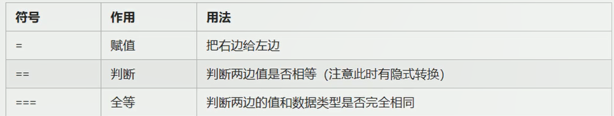

# 概述

浏览器分为两部分：渲染引擎和JS引擎

- 渲染引擎：解析HTML和CSS。
- JS引擎：读取网页中的JavaScript代码，对其进行处理，比如谷歌浏览器的 V8引擎。


# ECMAScript-基础语法

JavaScript（网景公司）、Jscript（微软），JavaScript最流行。ECMAScript规定了JS编程的基本语法和基础核心知识，是所有厂商共同遵守的一套JS语法工业标准。使用VS code。

## base

### 引入位置

三种引入JavaScript的方式，内嵌式、外部JS引入、行内JS。


 


### 注释

1. 单行注释：`//`。（快捷键：`ctrl + /`）
2. 多行注释：`/*  */`。（快捷键：shift + alt + a）

### 输入输出


```js
<script type="text/javascript">
        prompt('输入信息');
        alert('弹窗显示信息');
        console.log('控制台打印输出'); 
</script>
```

### 变量

**变量声明和使用：**

变量，是用来存放数据的容器，本质是程序在内存中申请的一块用来存储数据的空间。

```js
var name; // 声明一个变量
name = '陆拾陆';
var age = 21; // 声明变量并赋值
var a = b = c = 9 //相当于 var a = 9; b=9;c=9;
```

拓展：

1. 更新变量：变量被重新赋值后，原来的值被覆盖，以最后一次赋值为准。
2. 可以同时声明多个变量并赋值，使用`,`分割各个变量。
3. 只声明变量但不赋值，默认是 `undefined`（未定义）。
4. 不声明、不赋值，会报错。
5. 不声明、直接赋值，可以正常使用，不过不建议使用。

**变量命名规范：**


- 尽量不使用`name`作为变量名，其有特殊意义（直接`console.log(name)`不会报错）。

## 数据类型

不同的数据所需要占用的存储空间不同，为了充分利用存储空间，把数据分成所需内存大小不同的数据，于是就定义了不同的数据类型。

- JavaScript的变量的数据类型是在程序运行过程中，根据等号右边的值来确定的，当为变量赋值后，该变量的数据类型才能确定。

- js是动态语言，变量的数据类型可变的。

  ```js
  var age = 21;
  age = '21'; 
  ```


### 数字型

- `0x`开头表示十六进制数，`0`开头表示八进制数。

一些特殊值（了解）：

- `Number.MAX_VALUE`：1.7976931348623157e+308。（10的308次方）
- `Number.MIN_VALUE`：5e-324。（10的-324次方）
- `Infinity`：无穷大。（`alert(Number.MAX_VALUE * 2);`）
- `-Infinity`：无穷小。（` alert(-Number.MAX_VALUE * 2);`）
- `NaN`：表示非数字。（`alert('hello' - 100);`）

一个判断方法：

- `isNaN(x)`：判断x是否是非数字，返回布尔值。

### 字符串

字符串用双引号或单引号括起来，在JS里更推荐使用单引号，因为HTML标签里面的属性使用的是双引号。

如果字符中有双引号来表示特殊意义，外双内单、或外单内双。（`var title = "我是'人'是我"；`）

字符串转义符：


- 字符串长度：`.length`属性。
- 字符串拼接：使用`+`拼接字符串，都会是字符串。

### 布尔类型

```js
var falg = true; // true是1，false是0，可以使用这两个充当0、1进行运算
```

- undefined、NaN和数组相加为NaN，null和数字相加为数字本身。

### 检测数据类型

```js
var name = '陆拾陆';
alert(typeof name);
```

### 数据类型转换

**转换为字符串型：**


**转换为数字型：**


- 字符转换为数字型，会根据前面的进行转换，知道遇到不能转换的就终止转换。如`var num = parseInt('123aaa123px');`最终结果是数字型的123，如果`var num = parseInt(a123);`则是NaN。

- 如果转换`'12.94'`之类的字符，会去掉小数位。

- 隐式转换：

  ```js
  alert(typeof ('1' - 0));
  alert(typeof ('12' - '10'));
  var num = ('12' - '10'); // 尽量不要使用name为变量名，此时使用name变量名就会转换不成Number
  alert(typeof num);
  ```

**转换为布尔类型：**


JavaScript是一种解释型语言。


## 运算符

和Java基本一样的运算符。

**【注意】浮点数的计算会有些精度问题，不要直接判断两个浮点数是否相等！**

```js
console.log(0.1 + 0.2); // 0.30000000000000004
console.log(0.07 * 00); // 7.000000000000001
```



在JavaScript中，比较运行符会自动换行类型进行比较：`==、>=、<=、>、<`、`!==`。

## 循环

和Java基本一致。

- `continue`：跳出本次循环，执行下一次。
- `break`：跳出整个循环。

## 标识符命名规范

1. 变量、函数的命名尽量“见名知义”。
2. 变量的名称一般用名词。
3. 函数的名称一般用动词。

## 数组

数组创建方式：（数组内可以放任意的数据类型数据，下标从0开始）

```js
var array = new Array(); // 创建了一个空数组
var array = new Array(2); // 创建了一个长度为2的数组
var array = []; // 创建了一个空数组，长度为0
var array = ['值1','值2','值3','值4','值5']; // 创建并初始化

alert(array[9]); // 可访问任意下标的值，如果不含数据的下标则返回undefined
array.length; // 数组长度
```

数组扩容是通过修改数组的长度，修改长度后，扩出来的没有数据的默认是undefined。不像Java中那么严格。

## 函数

### 函数的使用

函数声名和调用：

```js
// 声明函数方式1：
function show(){
	alert("这是一个函数");
}
// 都是这样调用函数
show();
```

参数：函数的形参个数无限制，传入的实参也不要求全部都和形参对应上，形参默认值为undefined。

```js
function show(v1,v2,v3){
    alert("这是一个函数");
    console.log(v1 + v2 + v3);
}
// 声明函数方式2：函数表达式（变量里存函数），此时函数为匿名函数，show是变量名
var show = function(arg){
    alert("传入的参数为" + arg);
}
show("arg");
// 调用函数
show(1,2);
```

返回值：直接return就好。

```js
function show(v1,v2){
    return v1 + v2; 
}
// 函数没有return时返回的是undefined
```

**使用`arguments`获取参数：**

当不确定传入多少个参数时，使用arguments来获取参数。JavaScript中，arguments实际上是当前函数的一个内置对象，所有的函数都有的，其存储了要传递的所有实参。

```js
function testArg(){
    console.log(arguments);
    console.log(arguments.length);
    console.log(arguments[0])
}
testArg(1,2,3);
```

arguments是一个伪数组，只有函数才有：

- 具有数据的.length属性。
- 按照索引的方式进行值的存储。
- 没有一些真正数组的方法，例如pop()、push()方法等。
- 可以通过数组的方式对里面存储的实参进行遍历。

### 域

**作用域：**

- 全局作用域：整个script标签、或者一个单独的js文件。
- 局部作用域（函数作用域）：在函数内部就是局部作用域，这个代码名字只在函数内部起作用。
- es6新增块级作用域，就是`{ }`括起来的部分。

**全局、局部变量：**

1. 全局变量：
   - 全局作用域下的变量，局部作用域（函数内部）外声明的变量。
   - 【特殊】：在函数内部没有声明，但直接赋值的变量也是全局变量。
   - 浏览器关闭时销毁，比较销毁资源。
2. 局部变量：
   - 局部作用域（函数内部）的变量，只能在其声明处的函数内部使用。
   - 程序执行完毕就销毁，更加节约资源。

**作用域链：**

- 如果函数内部还有函数，就在这个作用域中又产生一个作用域。
- 内部函数可以访问外部函数变量，是根据链式查找来决定哪些数据能被内部函数访问，这种结构称作作用域链。

```js
function f1(){
    var num = 11;
    function f2(){
        alert(num);
    }
    f2();
}
var num = 33;
f1(); // 11
```

## 预解析

```html
<script type="text/javascript"> 
    // 如果不声明就使用，就会报错
    console.log(num);
    // 当声明了，上述结果为undefined  坑1
    var num = 10;
    // 此种声明函数方式，可以在函数声明前或后面进行调用
    f();
    function f(){}
    // 此种声明函数方式，是把函数放进变量里，此时只能在其声明后调用，否则报错 坑2
    fun();
    var fun = function(){};
</script>
```

```html
<script>
	// 坑1的两行代码相当于
    var num;
    console.log(num);
    // 坑2的两行代码相当于
    var fun;
    fun();
    fun = function(){};
</script>
```

JavaScript代码由浏览器中JavaScript解析器来执行，JavaScript解析器在运行js代码的时候分为：预解析和代码执行。

1. 预解析：js引擎会把js代码里面所有的var还有function提升到**其当前所在作用域的最前面**。
2. 代码执行：从上往下执行代码。

**预解析：**

1. 变量提升：把所有的**用var声明的**变量都提升到当前作用域最前面，但不提升赋值操作。
2. 函数提升：把所有的函数声明提升到当前作用域最前面，但不提升调用操作。（首句使用function开始才算函数，其他只能算函数表达式。）

```html
<script type="text/javascript"> 
    var num = 10;
    fun();
    function fun(){
        console.log(num);
        var num = 20;
    }
   	// 上面的相当于：（最后输出：undefined）
    var num;
    function fun(){
        var num;
        console.log(num); 
        num = 20;
    }
    num = 10;
    fun();
</script>
```

**关于预解析的优先级：**“函数会首先被提升，然后才是变量” -《你不知道的JavaScript》。

```html
<script>
    console.log(foo);
    function foo(){
        console.log('函数声明');
    }
    var foo = '与函数同名的变量';
    console.log(foo);
</script>
```

上述代码最后的运行结果表明，**函数提升优先级高于变量提升，且不会被同名变量声明覆盖，但是当同名变量赋值后会被覆盖**。

```js
// 实际执行：
function foo(){console.log('函数声明')}
var foo;
// foo = '此时会覆盖它-那个与我同名的函数';
console.log(foo); // 输出函数声明体
foo = '此时会覆盖它-那个与我同名的函数';
console.log(foo); // 输出 '此时会覆盖它-那个与我同名的函数'
```

要注意的是，从一开始便用function开始的才能算作函数，其它只能算作函数表达式，而函数表达式不会被提升。

同时声明多个函数名相同的函数，先声明的会被后声明的覆盖。

## 对象

### 创建对象

**创建对象方式一：通过**字面量创建对象

```html
<script type="text/javascript"> 
    var obj = {
        username: '陆拾陆',
        password: '123456',
        address: 'Beijing',
        saiHi: function(){
            alert('对象中的方法');
        }
    };
    // 使用对象属性 对象名.属性 对象名['属性名']
    alert(obj.username);
    alert(obj['username']);
    // 调用方法
    obj.saiHi();
</script>   
```

**创建对象方式二：通过**new Object创建对象

```html
<script type="text/javascript"> 
    var obj = new Object(); // 创建了一个空对象
    obj.username = '陆拾陆';
    obj.password = '123456';
    obj.address = 'Beijing';
    obj.sayHi = function(){
        alert('这是对象的方法');
    }
</script>
```

**创建对象方式三：**

使用构造函数来创建对象：前面的方式一次只能创建一个对象，将创建对象的过程封装进函数，即构造函数，当需要对象的时候就调用方法并传参就能构造不同属性值的对象。

```html
<script type="text/javascript"> 
    // 声明构造函数 首字母要大写 不需要return 属性、方法前面必须要this
    function CreateObj(username,age){
        this.username = username;
        this.age = age;
        this.sayHi = function(message){
            alert(message);
        }
    }
    // 使用构造函数创建对象
    var obj = new CreateObj('陆拾陆',21);
    obj.sayHi('这是由构造函数创建的对象中的方法');
    alert(obj['username']);
</script>
```

`new`关键字的执行过程：

1. new 构造函数 ===> 就会在内存中创建了一个空的对象；
2. this 就会指向创建的空对象；
3. 执行构造函数里面的代码，给空对象添加属性和方法；
4. 返回对象。（new执行完就会自己返回对象，所以不需要return）

**for in 循环遍历对象：**

```html
<script type="text/javascript"> 
    // 声明构造函数 首字母要大写 不需要return 属性、方法前面必须要this
    function CreateObj(username,age){
        this.username = username;
        this.age = age;
        this.sayHi = function(message){
            alert(message);
        }
    }
    var obj = new CreateObj('陆拾陆','21');
    // 使用构造函数创建对象
    for (var key in obj) {
        alert(key); // 得到属性名
        alert(obj[key]); // 得到属性值
    }
</script>
```

### 内置对象

JavaScript的三种对象：自定义对象、内置对象、浏览器对象。

内置对象：JavaScript自带的对象，对象含有常用的或基本而必要功能（属性和方法），例如Math、Date、Array、String。

MDN文档查看：[JavaScript 标准内置对象 - JavaScript | MDN (mozilla.org)](https://developer.mozilla.org/zh-CN/docs/Web/JavaScript/Reference/Global_Objects)。

#### **Math对象：**


#### **Date：**

是一个构造函数。


获取时间戳：从1970年1月1日（世界标准世界）起的毫秒数。

```html
<script type="text/javascript"> 
    var date = new Date();
    alert(date.valueOf());
    alert(date.getTime());
    // 最常用的方法
    var date1 = +new Date();
    alert(date1);
    // H5 新增
    alert(Date.now());
</script>
```

```html
<script type="text/javascript">
    function countDown(time){
        var nowTime = +new Date();
        var inputTime = +new Date(time);
        var times = (inputTime - nowTime) / 1000;
        var d = parseInt(times / 60 / 60 / 24);
        d = d < 10 ? '0' + d : d;
        var h = parseInt(times / 60 / 60 % 24); 
        h = h < 10 ? '0' + h : h;
        var m = parseInt(times / 60 % 60);
        m = m < 10 ? '0' + m : m;
        var s = parseInt(times % 60);
        s = s < 10 ? '0' + s : s;
        return d + '天' + h + '时' + m + '分' + s + '秒';
    }
    var t = countDown('2022-1-1 00:00:00');
    console.log(t); 
</script>   
```

#### **数组对象：**

```html
<script>
    // 通过内置的Array()构造函数创建数组
	var array = new Array(); // 创建了一个空数组
    var array = new Array(3); // 创建了一个长度为3的数组 
	var array = new Array(2,3); // 创建并初始化 
</script>
```

检测是否为数组对象的两种方式：

instanceof，`xx instanceof Array`判断是否为数组。

H5新增方法：`Array.isArray(arr)`，传入arr并判断是否是数组，返回boolean值。

创建的数组对象的方法：（都会改变原数组）

```html
<script type="text/javascript">
    // 往数组末尾追加元素
    var arr = [1,2,3];
    var length = arr.push(4,'lsl'); // 返回的是新数组的长度
    alert(arr); 
    // 往数组头部追加元素 返回的也是新数组长度
    arr.unshift('头部');
    alert(arr);
    // 删除数组最后一个元素并返回这个元素
    arr.pop();
    // 删除数组第一个元素并返回这个元素
    arr.shift();
</script>
```

```html
<script type="text/javascript">
    var arr = [1,12,3,9,5,7,10,2];
    // 反转数组的元素
    alert(arr.reverse());
    // 冒泡排序
    arr.sort(function(a,b){
        return a - b; // 升序来进行排序，+则是降序排序
    });
    alert(arr);        
</script>
```

数组索引方法：


```html
<script type="text/javascript">
    var arr = [1,12,2];
    // 从前往后查找
    // 返回该数组元素索引，只返回第一个满足条件的索引，找不到返回-1
    var index1 = arr.indexOf(12); // 1 
    // 从后往前查找
    // 返回该数组元素索引，只返回第一个满足条件的索引，找不到返回-1        
    var index2 = arr.indexOf(2);  // 2   
</script>  
```

数组去重：

```js
function unique(arr){
    var newArr = [];
    for(var i = 0; i < arr.length; i++){
        if(newArr.indexOf(arr[i]) === -1){
            newArr.push(arr[i]);
        }
    }
    return newArr;
}
```

数组转换为字符串：

- `toString()`方法：转换成的字符使用逗号分隔每个元素。
- `join()`方法：默认是使用逗号分隔，可以设置其他符号来分隔（`join('-')`使用-来分隔）。


#### 字符串对象：

**基本包装类型：**

JavaScript提供了三个特殊的引用类型：String、Boolean、Number。基本包装类型就是把简单数据类型包装为复杂数据类型，这样基本数据类型就有了属性和方法。包装的执行过程如下：

```html
<script type="text/javascript">
    // 该基本数据类型会包装成复杂数据类型
    var str = 'string';
    alert(str.length);
    // 实际内部执行如下
    var temp = new String('string'); // 1.创建临时变量
    str = temp; // 2.赋给str
    temp = null; // 3.销毁
</script>
```

**字符串的不可变：**字符串改变时并不是原来的值发生了改变，而是一个新字符串的引用赋予了该字符串，只是字符串的引用地址发生了改变。


开始的位置是可选的，lastIndexOf也一样。

```html
<script type="text/javascript">
    function indexs(arr,str){
        var indexArray = [];
        var flag = arr.indexOf(str);
        while( flag !== -1){
            indexArray.push(flag);
            flag = arr.indexOf(str,flag + 1);
        }
        return indexArray;
    }
    var a  = indexs([1,1,1,3,4,6,1,3],1);
    alert(a);
</script>
```

**根据位置返回字符：**


获得重复次数最多的字符：

```html
<script type="text/javascript">
    // 出现次数最多的字符
    function maxShow(str){
        var obj = {};
        for(var i = 0; i < str.length; i++){
            var chars = str.charAt(i);
            if(obj[chars]){
                obj[chars]++;
            }else{
                obj[chars] = 1;
            }
        }
        var max = 0;
        var ch = '';
        for (var key in obj) {
            if(obj[key] > max){
                max = obj[key];
                ch = key;
            }
        }
        return ch;
    }
    alert(maxShow('asdffff'));
</script>
```

**字符串拼接及截取：**


**替换字符：**

```html
<script>
    var str = 'string';
    // 只会替换首次出现的那个
    alert(str.replace('s','a'));
    // 字符转换为数组
    var s = '1,2,3,4,5,6';
    console.log(s.split(',')); // [1,2,3,4,5,6]
    // 字符大小写转换
    alert(str.toUpperCase()); // 转换为大写
    alert('AaA'.toLowerCase()); // 转换为小写
</script>
```


## 类型

简单数据类型（也叫基本数据类型）：

- string、number、boolean、undefined、null。
- 基本数据类型在存储时变量中存储的是值本身，因此叫做值类型。
- 基本数据类型中特殊的是，null是返回一个空对象（object类型）。

复杂数据类型（也叫引用类型）：

- 通过new关键字创建的对象（系统对象、自定义对象），如Object、Array、Date等。
- 存储变量时存储的仅仅是地址（引用）。


# DOM

Web API，由浏览器通过的一套操作浏览器功能和页面元素的API（DOM、BOM）。


## 获取元素对象

**1.根据ID获取：** `document.getElementById('id值');`。

```html
<body>
    <div id="time">2021-12-31</div>
    <script>
      // 返回一个元素对象，不存在有该id的元素则返回null
      var time = document.getElementById('time');
      // 使用dir可以打印对象的全部内容
      console.dir(time);
    </script>
</body>
```

**2.根据HTML标签获取：** `document.getElementsByTagName('标签名');`。

```html
<body>
    <div>
        <ul>
          <li>1</li>
          <li>2</li>
          <li>3</li>
        </ul>
        <ul>
          <li>4</li>
        </ul>
    </div>
    <script>
      // 返回获取到的元素对象的集合 以伪数组的形式存储  得到的元素对象是动态的
      // 如果页面中没有，则返回空的伪数组
      var li = document.getElementsByTagName('li');
      // 
      console.dir(li);
      // 获取某个标签下的某些对象
      var ul = document.getElementsByTagName('ul');
      console.dir(ul[1].getElementsByTagName('li')); // 获取到第二个ul里的li元素对象
    </script>
</body>
```

**3.HTML5新增-通过类名获取元素对象：**

```html
<body>
    <div class="content">通过类名获取元素对象</div>
    <div class="content2">通过类名获取元素对象</div>
    <script>
      // 根据类名返回元素对象的集合
      var content = document.getElementsByClassName('content');
      console.dir(content);
      // 根据指定选择器返回第一个元素对象
      var s = document.querySelector('.content');
      var all = document.querySelectorAll('div');
      console.dir(s);
    </script>
</body>
```

**4.获取特殊元素：**

```html
<script>
    // 获取body元素对象
    var body = document.body;
    console.log(body);
    // 获取html元素对象
    var htmlEle = document.documentElement;
    console.log(htmlEle);
</script>
```

## 事件

**事件三要素：**1.事件源（被触发对象） 2.事件类型（如何触发） 3.事件处理程序（触发后的行为）。


```html
<body>
    <button id="btn">点一下</button>
    <script>
      var btn = document.getElementById('btn');
      btn.onclick = function(){
        alert('点击按钮触发的弹窗');
      }
    </script>
</body>
```

## 操作元素

### **改变元素内容：**

```html
<body>
    <button id="btn">显示当前系统时间</button>
    <div>某个时间1</div>
    <div>某个时间2</div>
    <script>
      // 使用元素对象的属性来更改元素内容
      var btn = document.getElementById('btn');
      var div = document.querySelectorAll('div');
      // div.innerText = '2021.12.31'; 不添加事件，会随着页面的加载而执行更改
      btn.onclick = function(){
        // innerText 不会识别HTML标签，内存中存在的标签也充当字符显示  非标准
        // 会去除内容中的空格和换行
        div[0].innerText = '<strong>2021</strong>.12.31';  
      }
      // 会识别HTML标签，解析内容中存在的标签 W3C标准
      // 不会去除内容中的空格和换行
      div[1].innerHTML = '<strong>2021</strong>.12.31';
      // innerText、innerHtml属性，可以读，即获取到标签内内容
      console.log(div[1].innerHtml);
    </script>
</body>
```

### **改变常见元素的属性内容：**

 `alt、src、href、id、title`等，都和innerHtml类似，都是元素对象的属性（如果该元素有的话），就可以通过获取到对象后，直接调用属性来直接赋值。

### **修改表单元素的属性内容：**

可以利用DOM操作的有`type、value、checked、selected、disabled（true or false）`，操作步骤和上面差不多。

### **修改元素的样式属性内容：**


行内样式操作：样式较少或功能简单的情况下使用

```html
<style>
    div {
        width: 100px;
        height: 100px;
        background-color: aqua;
    }
</style>
<body>
    <div></div>
    <script>
      var div = document.querySelector('div');
      div.onclick = function(){
        // 行内样式操作
        // div.style.backgroundColor = 'pink';
        this.style.backgroundColor = 'pink';
      }
    </script>
</body>
```

类名操作方式：

```html
<style>
    div {
        width: 100px;
        height: 100px;
        background-color: salmon;
    }
    .change {
        background-color: pink;
    }
</style>
</head>
<body>
    <div class=""></div>
    <script>
        var div = document.querySelector('div');
        div.onclick = function(){
            // 赋值后会覆盖原先的类名
            div.className = 'change';
        }
    </script>
</body>
```


### 排他思想：

```html
<body>
    <button>按钮1</button>
    <button>按钮2</button>
    <button>按钮3</button>
    <button>按钮4</button>
    <button>按钮5</button>
    <script>
      var btns = document.getElementsByTagName('button');
      for(var i = 0; i < btns.length; i++){
        btns[i].onclick = function(){
          for(var i = 0; i < btns.length; i++){
            btns[i].style.backgroundColor = '';
          }
          this.style.backgroundColor = 'pink';
        }
      }
    </script>
</body>
```


