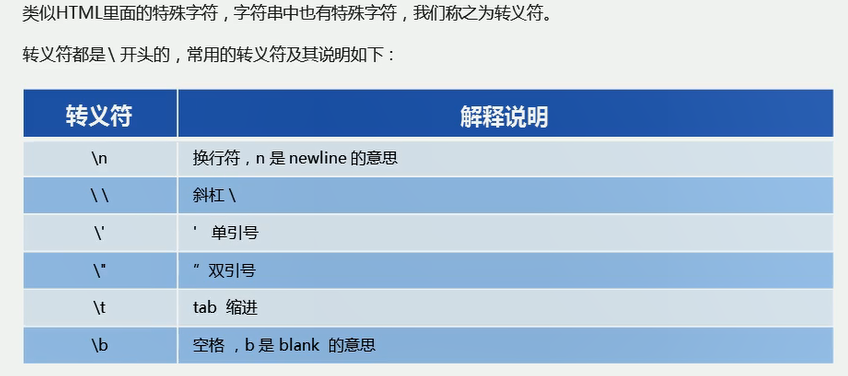

# 概述

浏览器分为两部分：渲染引擎和JS引擎

- 渲染引擎：解析HTML和CSS。
- JS引擎：读取网页中的JavaScript代码，对其进行处理，比如谷歌浏览器的 V8引擎。


# ECMAScript-最基础

JavaScript（网景公司）、Jscript（微软），JavaScript最流行。ECMAScript规定了JS编程的基本语法和基础核心知识，是所有厂商共同遵守的一套JS语法工业标准。使用VS code。

## base

### 引入位置

三种引入JavaScript的方式，内嵌式、外部JS引入、行内JS。


 


### 注释

1. 单行注释：`//`。（快捷键：`ctrl + /`）
2. 多行注释：`/*  */`。（快捷键：shift + alt + a）

### 输入输出


```js
<script type="text/javascript">
        prompt('输入信息');
        alert('弹窗显示信息');
        console.log('控制台打印输出'); 
</script>
```

## 变量

**变量声明和使用：**

变量，是用来存放数据的容器，本质是程序在内存中申请的一块用来存储数据的空间。

```js
var name; // 声明一个变量
name = '陆拾陆';
var age = 21; // 声明变量并赋值
var a = b = c = 9 //相当于 var a = 9; b=9;c=9;
```

拓展：

1. 更新变量：变量被重新赋值后，原来的值被覆盖，以最后一次赋值为准。
2. 可以同时声明多个变量并赋值，使用`,`分割各个变量。
3. 只声明变量但不赋值，默认是 `undefined`（未定义）。
4. 不声明、不赋值，会报错。
5. 不声明、直接赋值，可以正常使用，不过不建议使用。

**变量命名规范：**


- 尽量不使用`name`作为变量名，其有特殊意义（直接`console.log(name)`不会报错）。

## 数据类型

不同的数据所需要占用的存储空间不同，为了充分利用存储空间，把数据分成所需内存大小不同的数据，于是就定义了不同的数据类型。

- JavaScript的变量的数据类型是在程序运行过程中，根据等号右边的值来确定的，当为变量赋值后，该变量的数据类型才能确定。

- js是动态语言，变量的数据类型可变的。

  ```js
  var age = 21;
  age = '21'; 
  ```


### 数字型

- `0x`开头表示十六进制数，`0`开头表示八进制数。

一些特殊值（了解）：

- `Number.MAX_VALUE`：1.7976931348623157e+308。（10的308次方）
- `Number.MIN_VALUE`：5e-324。（10的-324次方）
- `Infinity`：无穷大。（`alert(Number.MAX_VALUE * 2);`）
- `-Infinity`：无穷小。（` alert(-Number.MAX_VALUE * 2);`）
- `NaN`：表示非数字。（`alert('hello' - 100);`）

一个判断方法：

- `isNaN(x)`：判断x是否是非数字，返回布尔值。

### 字符串

字符串用双引号或单引号括起来，在JS里更推荐使用单引号，因为HTML标签里面的属性使用的是双引号。

如果字符中有双引号来表示特殊意义，外双内单、或外单内双。（`var title = "我是'人'是我"；`）

字符串转义符：



- 字符串长度：`.length`属性。
- 字符串拼接：使用`+`拼接字符串，都会是字符串。

### 布尔类型

```js
var falg = true; // true是1，false是0，可以使用这两个充当0、1进行运算
```

- undefined、NaN和数组相加为NaN，null和数字相加为数字本身。

### 检测数据类型

```js
var name = '陆拾陆';
alert(typeof name);
```

### 数据类型转换

**转换为字符串型：**


**转换为数字型：**


- ​	字符转换为数字型，会根据前面的进行转换，知道遇到不能转换的就终止转换。如`var num = parseInt('123aaa123px');`最终结果是数字型的123，如果`var num = parseInt(a123);`则是NaN。

- 如果转换`'12.94'`之类的字符，会去掉小数位。

- 隐式转换：

  ```js
  alert(typeof ('1' - 0));
  alert(typeof ('12' - '10'));
  var num = ('12' - '10'); // 尽量不要使用name为变量名，此时使用name变量名就会转换不成Number
  alert(typeof num);
  ```

**转换为布尔类型：**


JavaScript是一种解释型语言。


## 运算符

和Java基本一样的运算符。

**【注意】浮点数的计算会有些精度问题，不要直接判断两个浮点数是否相等！**

```js
console.log(0.1 + 0.2); // 0.30000000000000004
console.log(0.07 * 00); // 7.000000000000001
```


在JavaScript中，比较运行符会自动换行类型进行比较：`==、>=、<=、>、<`。

## 循环

和Java基本一致。

- `continue`：跳出本次循环，执行下一次。
- `break`：跳出整个循环。

## 标识符命名规范

1. 变量、函数的命名尽量“见名知义”。
2. 变量的名称一般用名词。
3. 函数的名称一般用动词。

## 数组

数组创建方式：（数组内可以放任意的数据类型数据，下标从0开始）

```js
var array = new Array(); // 创建了一个空数组
var array = []; // 创建了一个空数组，长度为0
var array = ['值1','值2','值3','值4','值5']; // 创建并初始化
alert(array[9]); // 可访问任意下标的值，如果不含数据的下标则返回undefined
array.length; // 数组长度
```

数组扩容是通过修改数组的长度，修改长度后，扩出来的没有数据的默认是undefined。不像Java中那么严格。

## 函数

### 函数的使用

函数声名和调用：

```js
// 声明函数方式1：
function show(){
	alert("这是一个函数");
}
// 都是这样调用函数
show();
```

参数：函数的形参个数无限制，传入的实参也不要求全部都和形参对应上，形参默认值为undefined。

```js
function show(v1,v2,v3){
    alert("这是一个函数");
    console.log(v1 + v2 + v3);
}
// 声明函数方式2：函数表达式（变量里存函数），此时函数为匿名函数，show是变量名
var show = function(arg){
    alert("传入的参数为" + arg);
}
show("arg");
// 调用函数
show(1,2);
```

返回值：直接return就好。

```js
function show(v1,v2){
    return v1 + v2; 
}
// 函数没有return时返回的是undefined
```

**使用`arguments`获取参数：**

当不确定传入多少个参数时，使用arguments来获取参数。JavaScript中，arguments实际上是当前函数的一个内置对象，所有的函数都有的，其存储了要传递的所有实参。

```js
function testArg(){
    console.log(arguments);
    console.log(arguments.length);
    console.log(arguments[0])
}
testArg(1,2,3);
```

arguments是一个伪数组，只有函数才有：

- 具有数据的.length属性。
- 按照索引的方式进行值的存储。
- 没有一些真正数组的方法，例如pop()、push()方法等。
- 可以通过数组的方式对里面存储的实参进行遍历。

### 域

**作用域：**

- 全局作用域：整个script标签、或者一个单独的js文件。
- 局部作用域（函数作用域）：在函数内部就是局部作用域，这个代码名字只在函数内部起作用。
- es6新增块级作用域，就是`{ }`括起来的部分。

**全局、局部变量：**

1. 全局变量：
   - 全局作用域下的变量，局部作用域（函数内部）外声明的变量。
   - 【特殊】：在函数内部没有声明，但直接赋值的变量也是全局变量。
   - 浏览器关闭时销毁，比较销毁资源。
2. 局部变量：
   - 局部作用域（函数内部）的变量，只能在其声明处的函数内部使用。
   - 程序执行完毕就销毁，更加节约资源。

**作用域链：**

- 如果函数内部还有函数，就在这个作用域中又产生一个作用域。
- 内部函数可以访问外部函数变量，是根据链式查找来决定哪些数据能被内部函数访问，这种结构称作作用域链。

```js
function f1(){
    var num = 11;
    function f2(){
        alert(num);
    }
    f2();
}
var num = 33;
f1(); // 11
```

## 预解析

```html
<script type="text/javascript"> 
    // 如果不声明就使用，就会报错
    console.log(num);
    // 当声明了，上述结果为undefined  坑1
    var num = 10;
    // 此种声明函数方式，可以在函数声明前或后面进行调用
    f();
    function f(){}
    // 此种声明函数方式，是把函数放进变量里，此时只能在其声明后调用，否则报错 坑2
    fun();
    var fun = function(){};
</script>
```

```html
<script>
	// 坑1的两行代码相当于
    var num;
    console.log(num);
    // 坑2的两行代码相当于
    var fun;
    fun();
    fun = function(){};
</script>
```


JavaScript代码由浏览器中JavaScript解析器来执行，JavaScript解析器在运行js代码的时候分为：预解析和代码执行。

1. 预解析：js引擎会把js代码里面所有的var还有function提升到当前作用域最前面。
2. 代码执行：从上往下执行代码。

预解析：

- 变量提升：把所有的变量声明都提升到当前作用域最前面，但提升赋值操作。
- 函数提升：把所有的函数声明提升到当前作用域最前面，但提升调用操作。

```html
<script type="text/javascript"> 
    var num = 10;
    fun();
    function fun(){
        console.log(num);
        var num = 20;
    }
   	// 上面的相当于：（最后输出：undefined）
    var num;
    function fun(){
        var num;
        console.log(num); 
        num = 20;
    }
    num = 10;
    fun();
</script>
```

## 对象


