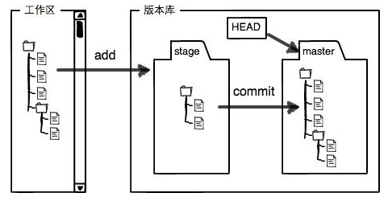
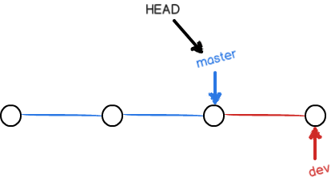
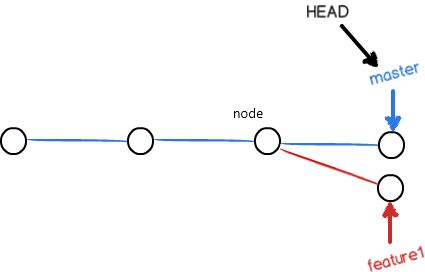

# 简介

Git，分布式版本控制系统，由Linux用C语言创建的。

集中式版本控制与分布式版本控制：

- 集中式版本控制有一个中央服务器，提交代码或下载代码需要联网。
- 分布式版本控制，可以有中央服务器，只是用来方便交换，每一台电脑都相当于一个版本库。

# 安装与配置

下载：[Git - Downloads (git-scm.com)](https://git-scm.com/downloads)，默认形式安装

安装完成后运行Git Bash，出现类似命令行的窗口则安装完成，然后在显示的窗口进行设置：

- `$ git config --global user.name "Your Name"`：设置全局用户名。
- `$ git config --global user.email "email@example.com"`：设置全局email地址。
- 注意`git config`命令的`--global`，表示你这台机器上所有的Git仓库都会使用这个配置，也可以对某个仓库指定不同的用户名和Email地址，指定的方法——进入要单独设置的仓库的.git文件夹后运行下面的命令：
  - $ git config user.name "Your Name"
  - $ git config user.email "email@example.com"

查看用户名和email地址：

- `$ git config user.name`
- `$ git config user.email`

查看配置：

- `$ git config --system --list`：查看系统配置
- `$ git config --global --list`：查看当前用户(global)全局配置
- `$ git config --local --list`：查看仓库配置信息

# 仓库的创建

版本库（repository）：可理解成一个目录，该目录里所有的文件都被Git管理，git跟踪每个文件的修改、删除，以便任何时刻都可以追踪历史，或者在将来某个时刻“还原”某个特定时间点的文件。

仓库创建步骤：（都是在运行GitBash出现的命令行窗口中执行指令）

1. 创建仓库目录：找到合适的位置创建一个空目录，创建空目录命令：`$ mkdir 目录名称`。
2. 初始化仓库：进入仓库目录，然后执行`git init`命令把这个目录变成Git可以管理的仓库，仓库就创建完毕了。
3. 说明：仓库创建完毕会在仓库目录下出现一个.git目录，这个目录是Git用来跟踪管理版本库的，没事千万不要手动修改这个目录里面的文件，不然改乱了，就把Git仓库给破坏了，该目录默认情况下是隐藏的。

# 文件管理

所有的版本控制系统，只能跟踪**文本文件的改动**，比如TXT文件，网页，所有的程序代码等等，Git也不例外。

版本控制系统：可以告诉你每次的改动，比如在第5行加了一个单词“Linux”，在第8行删了一个单词“Windows”。而图片、视频这些二进制文件，虽然也能由版本控制系统管理，但没法跟踪文件的变化，只能把二进制文件每次改动串起来，也就是只知道图片从100KB改成了120KB，但到底改了啥，版本控制系统不知道，也没法知道。Microsoft的Word格式是二进制格式，因此，版本控制系统是没法跟踪Word文件的改动的，如果要真正使用版本控制系统，就要以纯文本方式编写文件。

编码：因为文本是有编码的，比如中文有常用的GBK编码，日文有Shift_JIS编码，如果没有历史遗留问题，强烈建议使用标准的UTF-8编码，所有语言使用同一种编码，既没有冲突，又被所有平台所支持。不要用Windows下的记事本，容易出问题。

**把文件放进Git仓库：**

1. 文件放在仓库的目录下(得先创建仓库)。
2. `$ git add 文件(带格式后缀)`：Git会在仓库目录中寻找文件，找到后添加到仓库中（此时是待提交状态），文件可使用通配符`*`代替，表示添加仓库里所有的改动了的文件。
3. `$ git commit -m "本次提交说明"`：把文件提交到仓库，建议都添加本次提交说明（提交完毕）。
4. 提交后显示信息说明：
   - `1 file changed`：1个文件被改动（我们新添加的文件）；`2 insertions`：插入了两行内容（文件中所含内容被改动）。

**情况查看：**

1. `$ git ststus`：查看仓库状况，有没有待提交的、有没有修改了的、修改了但还未添加待提交的、仓库是否干净...等等相关信息。
2. `$ git diff 可指定文件`：查看不同，看看修改了哪些内容。
3. `$ cat 文件 `：显示文件的全部内容。

# 版本控制

## 版本回退

查看修改日志：

- `$ git log`：从近到远显示所有的提交记录的信息（就像提交的历史时间线一样），如果最后出现`:`时可按Q退出。
- `$ git log --pretty=oneline`：将每次的提交记录在一行上显示出来。
  - 该命令显示出来的信息是：`commit-id  提交说明`(commit id 是一个SHA1计算出来的一个非常大的数字，用十六进制表示)。

版本回退：

- `$ git reset --hard HEAD~`：`HEAD`：当前版本，`HEAD^`：当前版本前一个，`HEAD~1`：当前版本前一个。
- `$ git reset --hard commit-id`：用commit id指定要回退到哪个版本，日志查看中会显示commit-id。
- `$ git reflog`：用于记录版本提交和回退的操作命令，这样可以找到版本的commit-id，以便确定要回到哪个版本。

## 工作区和暂存区

工作区（Working Directory）：创建为仓库的目录就是一个工作区。

版本库（Repository）：工作区中的隐藏目录`.git`，就是Git的版本库。

版本库中存了很多东西，其中最重要的就是称为stage（或者叫index）的暂存区，还有Git为我们自动创建的第一个分支`master`，以及指向`master`的一个叫`HEAD`的指针。



把文件往Git版本库里添加的时候，是分两步执行的：

1. `git add`：把文件添加进去，实际上就是把文件修改添加到暂存区。
2. `git commit`：提交更改，实际上就是把暂存区的所有内容提交到当前分支。

因为在我们创建Git版本库时，Git会自动为我们创建了唯一一个`master`分支，所以，`git commit`就是往`master`分支上提交更改。

可以简单理解为，需要提交的文件修改通通放到暂存区，然后，一次性提交暂存区的所有修改到版本库里。

## 管理修改

为什么Git比其他版本控制系统设计得优秀，因为Git跟踪并管理的是修改，而非文件。

- `$ git add xx.xxx`后，会把文件添加到暂存区，再次修改文件不会改变已经提交到暂存区的文件，此时提交（`git commit`），提交的是暂存区的文件而非已经再次修改但没有`git add`的文件。使用暂存区对修改进行了跟踪，依赖于文件添加操作。

- `$ git diff HEAD -- readme.txt`：用于查看**工作区**和**版本库里面**最新版本的区别。

## 撤销修改

撤销（unstage）还在工作区的文件的修改：

- 手动方式：自己动手进文件里修改。
- `$ git checkout -- file`：丢弃工作区的修改，file为带后缀的文件全名。

把暂存区的修改回退到工作区：

- `$ git reset HEAD file`：撤销提交到暂存区的文件。

## 删除文件

删除工作区文件：

- 手动或使用`rm file`，删除后因为版本库和工作区产生差异，Git会提醒删除了哪个文件，使用`git status`可以查看提醒。

删除版本库文件：

- `git rm file`：把文件从版本库和工作区中删除，然后再commit一次，版本仓库的文件删除完毕。
- 手动从工作区删除文件后，使用`git add file`也可以实现删除版本库的文件。
- 提交到版本库的可以再次恢复。

查看提交到了版本仓库中的文件：`git ls-files `。

# 关联远程仓库

通过远程仓库，实现版本库的分布式存储。

先有本地库，后有远程库的时候，如何关联远程库？如下：

## 仓库配置

**GitHub配置远程仓库：**

1. 创建SSH key：GitBash中执行`$ ssh-keygen -t rsa -C "youremail@example.com"`命令。
   - 在C盘用户主目录下，看看有没有.ssh目录，如果有，再看看这个目录下有没有`id_rsa`和`id_rsa.pub`这两个文件，如果已经有了，可直接跳到第2步。如果没有，打开Shell（Windows下打开Git Bash），创建SSH Key，创建时需要先进入到.ssh目录。

2. 登陆GitHub，打开“Account settings”，“SSH Keys”页面，然后，点“Add SSH Key”，填上任意Title，在Key文本框里粘贴`id_rsa.pub`文件的内容；最后点击“Add Key”，就添加好Key了。
3. 添加远程仓库：登陆GitHub后，在settings ===> Repositories，创建仓库。

**远程仓库配置好后，本地仓库的设置：**

1. 关联远程仓库：进入到本地仓库目录，执行`$ git remote add origin git@github.com:你的GitHub账户名/本地仓库名.git`。
   - origin可以看做是后面仓库链接的一个替代词，push时可通过该代名词来push。
2. 将本地库的所有内容推送到远程仓库：执行`$ git push -u origin master`，把当前仓库的master分支推送到远程仓库。
   - （由于远程库是空的，我们第一次推送`master`分支时，加上了`-u`参数，Git不但会把本地的`master`分支内容推送到远程新的`master`分支，还会把本地的`master`分支和远程的`master`分支关联起来，在以后的推送或者拉取时就可以简化命令。）
3. 执行上述操作后，从现在起，只要本地作了`git commit -m "xxx"`，就可以通过命令`$ git push origin master`来把本地`master`分支的最新修改推送至在GitHub的仓库；现在，就拥有了真正的分布式版本库！

## SSH警告

当你第一次使用Git的`clone`或者`push`命令连接GitHub时，会得到一个警告：

```
The authenticity of host 'github.com (xx.xx.xx.xx)' can't be established.
RSA key fingerprint is xx.xx.xx.xx.xx.
Are you sure you want to continue connecting (yes/no)?
```

这是因为Git使用SSH连接，而SSH连接在第一次验证GitHub服务器的Key时，需要你确认GitHub的Key的指纹信息是否真的来自GitHub的服务器，输入`yes`回车即可。

Git会输出一个警告，告诉你已经把GitHub的Key添加到本机的一个信任列表里了：

```
Warning: Permanently added 'github.com' (RSA) to the list of known hosts.
```

这个警告只会出现一次，后面的操作就不会有任何警告了。

如果你实在担心有人冒充GitHub服务器，输入`yes`前可以对照[GitHub的RSA Key的指纹信息](https://help.github.com/articles/what-are-github-s-ssh-key-fingerprints/)是否与SSH连接给出的一致。

## 删除远程库

如果添加的时候地址写错了，或者就是想删除远程库，可以用`git remote rm <name>`命令。

使用前，建议先用`git remote -v`查看远程库信息：

```xml
$ git remote -v
origin  git@github.com:michaelliao/learn-git.git (fetch)
origin  git@github.com:michaelliao/learn-git.git (push)
<!--显示了可以抓取和推送的origin的地址;如果没有推送权限，就看不到push的地址.-->
```

然后，根据名字删除，比如删除`origin`：

```xml
$ git remote rm origin
<!--$ git remote rm 仓库别名-->
```

此处的“删除”其实是解除了本地和远程的绑定关系，并不是物理上删除了远程库。远程库本身并没有任何改动。要真正删除远程库，需要登录到GitHub，在后台页面通过删除按钮来删除。

## 小结

- 要关联一个远程库，使用命令`git remote add origin git@server-name:path/repo-name.git`。
- 关联一个远程库时必须给远程库指定一个名字，`origin`是默认的习惯命名。
- 关联后，使用命令`git push -u origin master`第一次推送master分支的所有内容。
- 此后，每次本地提交后，只要有提交的必要，就可以使用命令`git push origin master`推送最新修改。

# 克隆远程仓库

从零开发，那么最好的方式是先创建远程库，然后，从远程库克隆。

克隆步骤：

1. 登陆GitHub，创建一个新仓库；
2. 进入合适位置执行`$ git clone git@github.com:用户账户名/仓库名.git`，克隆完成。

克隆项目的方法：

- `$ git clone git/@github.com:用户名/仓库名.git`。（使用 SSH 地址克隆）
- `$ git clone https://github.com/用户名/项目仓库名`。（直接通过仓库地址来克隆）

网络状况良好却出现下载失误，下载到一半就停止或访问不了的时候，可以尝试的解决方法：

- 将项目的GitHub网址中的 `https://` 改成 `git://`：`git clone git://github.com/用户名/项目仓库名--depth 1`。

如果想重新克隆：

- 先将现有项目目录删除：`rm -rf dirname`；
- 重新克隆。

# 分支管理

## 创建与合并

创建分支：

- `& git check -b dev `：创建并切换到分支，相当于下面两条指令。

  ```
  $ git branch dev
  $ git checkout dev
  ```

查看分支：

- `git branch`：列出所有分支，当前分支前用*标记；

然后，就可以在`dev`分支上正常提交。

合并分支：

- 先切换到master分支：`$ git checkout master`；
- dev分支合并到master分支：`git merge dev`命令用于合并指定分支到当前分支；
- 合并完，删除dev分支：`$ git branch -d dev`

因为创建、合并和删除分支非常快，所以Git鼓励你使用分支完成某个任务，合并后再删掉分支，这和直接在`master`分支上工作效果是一样的，但过程更安全。

切换分支：（最新版本的Git提供了新的`git switch`命令来切换分支）

- `$ git switch -c dev`：创建并I切换到新的分支
- `$ git switch master`：切换到指定分支

**小结：**

Git鼓励大量使用分支：

查看分支：`git branch`

创建分支：`git branch <name>`

切换分支：`git checkout <name>`或者`git switch <name>`

创建+切换分支：`git checkout -b <name>`或者`git switch -c <name>`

合并某分支到当前分支：`git merge <name>`

删除分支：`git branch -d <name>`

## 解决冲突

是不是这样就可以避免冲突？：

使用新分支的时候，只在新分支上修改和提交，不去主分支修改和提交，当新分支上的修改完毕并提交后再切回主分支进行合并。（也就是主分支的状态还是在新建分支并切换到新分支时的状态，如下图，当切回master分支时，再执行分支合并，就相当于master分支指到下一个的dev分支，这时两个分支实现了合并成一个master主分支）



如果出现这样的情况：

如下图，当master在node时创建并切换到分支feature1，此时在该分支上进行了修改和提交，然后切换回主分支，在主分支上进行修改和提交，master就到了如图所在的位置，此时合并分支feature，合并分支时master会指进到下一个时间节点，而这时没有下一个时间节点，就算有也不是feature，这时就引发了冲突，master没有指向到要合并的节点。



- 此时合并会报错，git会整合master、feature中该文件信息，此时目标文件会有<<<<<<<<、====、>>>>>>>>来分割开文件内容；（使用`$ git status`可知道冲突的文件；使用`$ cat file`可查看文件内容；）

解决上述冲突：就是把Git合并失败的文件**手动编辑**为我们希望的内容，再提交，然后就合并成功了（最后删除分支）。

- `$ git log --graph --pretty=oneline --abbrev-commit`：查看分支合并情况

- 用`$ git log --graph`命令可以看到分支合并图。

## 分支管理策略

通常，合并分支时，如果可能，Git会用`Fast forward`模式，但这种模式下，删除分支后，会丢掉分支信息。

如果要强制禁用`Fast forward`模式，Git就会在merge时生成一个新的commit，这样，从分支历史上就可以看出分支信息。

`--no-ff`方式的合并：

- `$ git merge --no-ff -m "merge with no-ff" dev`：合并dev分支并创建新的commit，(--no-ff)禁用Fast forward模式。

分支策略-在实际开发中，我们应该按照几个基本原则进行分支管理：

首先，`master`分支应该是非常稳定的，也就是仅用来发布新版本，平时不能在上面干活；

那在哪干活呢？干活都在`dev`分支上，也就是说，`dev`分支是不稳定的，到某个时候，比如1.0版本发布时，再把`dev`分支合并到`master`上，在`master`分支发布1.0版本；

你和你的小伙伴们每个人都在`dev`分支上干活，每个人都有自己的分支，时不时地往`dev`分支上合并就可以了。


## Bug分支

当你的分支任务还没完成提交时，接到一个修改bug的任务，此时可以使用`$ git stash `保存工作现场，然后开分支修改bug；

- 确定在哪个分支进行修改bug，切换到该分支并创建切换到新分支，修复好后提交，然后进行分支合并；
- 查看刚刚保存的工作现场：`$ git stash list`
- 恢复现场：
  - `$ git stash apply`：恢复后，stash内容并不删除，你需要用`$ git stash drop`来删除；
  - `$ git stash pop`：恢复的同时把stash内容也删了
  - 可以多次stash，恢复的时候，先用`git stash list`查看，然后恢复指定的stash，用命令：`$ git stash apply stash@{0}`

小结：

修复bug时，我们会通过创建新的bug分支进行修复，然后合并，最后删除；

当手头工作没有完成时，先把工作现场`git stash`一下，然后去修复bug，修复后，再`git stash pop`，回到工作现场；

在master分支上修复的bug，想要合并到当前dev分支，可以用`git cherry-pick <commit>`命令，把bug提交的修改“复制”到当前分支，避免重复劳动。

## Feature分支

开发一个新feature，最好新建一个分支；

如果要丢弃一个没有被合并过的分支，可以通过`$ git branch -D <name>`强行删除。

## 多人协作

### 具体操作

**推送分支：**

当你从远程仓库克隆时，实际上Git自动把本地的`master`分支和远程的`master`分支对应起来了，并且，远程仓库的默认名称是`origin`。

要查看远程库的信息，用`$ git remote`或者，用`git remote -v`显示更详细的信息；

推送分支：就是把该分支上的所有本地提交推送到远程库。推送时，要指定本地分支，这样，Git就会把该分支推送到远程库对应的远程分支上：`$ git push origin master`

如果要推送其他分支，比如`dev`，就改成：`$ git push origin dev`

但是，并不是一定要把本地分支往远程推送，那么，哪些分支需要推送，哪些不需要呢？

- `master`分支是主分支，因此要时刻与远程同步；
- `dev`分支是开发分支，团队所有成员都需要在上面工作，所以也需要与远程同步；
- bug分支只用于在本地修复bug，就没必要推到远程了，除非老板要看看你每周到底修复了几个bug；
- feature分支是否推到远程，取决于你是否和你的小伙伴合作在上面开发。

总之，就是在Git中，分支完全可以在本地自己藏着玩，是否推送，视你的心情而定！

**多人协作的工作模式通常是这样：**

1. 首先，可以试图用`git push origin <branch-name>`推送自己的修改；
2. 如果推送失败，则因为远程分支比你的本地更新，需要先用`git pull`(抓包)试图合并；
3. 如果合并有冲突，则解决冲突，并在本地提交；
4. 没有冲突或者解决掉冲突后，再用`git push origin <branch-name>`推送就能成功！

如果`git pull`提示`no tracking information`，则说明本地分支和远程分支的链接关系没有创建，用命令`git branch --set-upstream-to <branch-name> origin/<branch-name>`。

这就是多人协作的工作模式，一旦熟悉了，就非常简单。

### 小结

- 查看远程库信息，使用`git remote -v`；
- 本地新建的分支如果不推送到远程，对其他人就是不可见的；
- 从本地推送分支，使用`git push origin branch-name`，如果推送失败，先用`git pull`抓取远程的新提交；
- 在本地创建和远程分支对应的分支，使用`git checkout -b branch-name origin/branch-name`，本地和远程分支的名称最好一致；
- 建立本地分支和远程分支的关联，使用`git branch --set-upstream branch-name origin/branch-name`；
- 从远程抓取分支，使用`git pull`，如果有冲突，要先处理冲突。

## Rebase

Git有一种称为rebase的操作，有人把它翻译成“变基”。

# 标签管理

**创建标签的几种操作：**

1. 切换到要打标签的分支，`$ git tag <name>`（默认是的HEAD）
2. 使用commit id来打上标签：`$ git tag <name> commid-id`
3. 创建带说明的标签：`$ git tag -a <name> -m "..." commit-id`

**【注意】：**

- 标签不是按时间顺序列出，而是按字母排序的。
- 可以用`git show <tagname(标签名)>`查看标签信息；`git tag` 查看所有标签
- 标签总是和某个commit挂钩。如果这个commit既出现在master分支，又出现在dev分支，那么在这两个分支上都可以看到这个标签。

**操作标签：**

- 本地标签删除：`$ git tag -d <tagname>`
- 推送标签到远程：`git push origin <tagname>`
- 删除远程标签：先删除本地的，然后从远程删除`$ git push origin :refs/tags/<tagname>`

**小结:**

- 命令`git push origin <tagname>`可以推送一个本地标签；
- 命令`git push origin --tags`可以推送全部未推送过的本地标签；
- 命令`git tag -d <tagname>`可以删除一个本地标签；
- 命令`git push origin :refs/tags/<tagname>`可以删除一个远程标签。

# GitHub

- 在GitHub上，可以任意Fork开源仓库(在自己账户下克隆)；
- 自己拥有Fork后的仓库的读写权限；
- 可以推送pull request给官方仓库来贡献代码。

# Gitee

国内的Git托管服务——[Gitee](https://gitee.com/?utm_source=blog_lxf)（[gitee.com](https://gitee.com/?utm_source=blog_lxf)），和GitHub相比，Gitee也提供免费的Git仓库。此外，还集成了代码质量检测、项目演示等功能。对于团队协作开发，Gitee还提供了项目管理、代码托管、文档管理的服务，5人以下小团队免费。

## 关联远程库

上传自己的SSH公钥：

- 用户头像 -> 菜单“修改资料”，然后选择“SSH公钥”，填写一个便于识别的标题，然后把用户主目录下的`.ssh/id_rsa.pub`文件的内容粘贴进去，确定；

本地仓库关联Gitee远程库：

1. 创建一个新的项目：选择右上角用户头像 -> 菜单“控制面板”，然后点击“创建项目”（项目名称最好和本地一致）；

2. 在本地库上使用命令`git remote add`把它和Gitee的远程库关联；

   - ```
     $ git remote add origin git@gitee.com:liaoxuefeng/repo-name.git
     ```

3. 之后，就可以正常地用`git push`和`git pull`推送了！

第一次创建仓库与提交：

1. `$ ssh-keygen -t rsa -C "youremail@example.com"`创建SSL（如果C盘用户主目录没有.ssh和里面的文件的时候）；
2. 码云上创建SSL，复制本地的.ssh目录里的.pub文件内容；
3. 码云上创建仓库，邮箱开放，克隆空项目到本地；
4. 本地链接远程仓库：`git remote add blog git@gitee.com:liang-shenglin/blog.git`，使用SSL连接；
5. `git push -u blog master`，上传。

## 关于报错

如果在使用命令`git remote add`时报错：

```
git remote add origin git@gitee.com:liaoxuefeng/learngit.git
fatal: remote origin already exists.
```

这说明本地库已经关联了一个名叫`origin`的远程库，此时，可以先用`git remote -v`查看远程库信息：

```
git remote -v
origin	git@github.com:michaelliao/learngit.git (fetch)
origin	git@github.com:michaelliao/learngit.git (push)
```

可以看到，本地库已经关联了`origin`的远程库，并且，该远程库指向GitHub。

我们可以删除已有的GitHub远程库：

```
git remote rm origin
```

再关联Gitee的远程库（注意路径中需要填写正确的用户名）：

```
git remote add origin git@gitee.com:liaoxuefeng/learngit.git
```

此时，我们再查看远程库信息：

```
git remote -v
origin	git@gitee.com:liaoxuefeng/learngit.git (fetch)
origin	git@gitee.com:liaoxuefeng/learngit.git (push)
```

现在可以看到，origin已经被关联到Gitee的远程库了。通过`git push`命令就可以把本地库推送到Gitee上。

## 双向同步

git本身是分布式版本控制系统，可以同步到另外一个远程库，当然也可以同步到另外两个远程库。使用多个远程库时，我们要注意，git给远程库起的默认名称是`origin`，如果有多个远程库，我们需要用不同的名称来标识不同的远程库。

**操作：**

1. 仍然以`learngit`本地库为例，我们先删除已关联的名为`origin`的远程库：`git remote rm origin`
2. 然后，先关联GitHub的远程库：`git remote add github git@github.com:michaelliao/learngit.git`
   - 注意，远程库的名称叫`github`，不叫`origin`了。
3. 接着，再关联Gitee的远程库：`git remote add gitee git@gitee.com:账户名/learngit.git`
   - 同样注意，远程库的名称叫`gitee`，不叫`origin`。

现在，我们用`git remote -v`查看远程库信息，可以看到两个远程库：

```
git remote -v
gitee	git@gitee.com:liaoxuefeng/learngit.git (fetch)
gitee	git@gitee.com:liaoxuefeng/learngit.git (push)
github	git@github.com:michaelliao/learngit.git (fetch)
github	git@github.com:michaelliao/learngit.git (push)
```

如果要推送到GitHub，使用命令：`git push github master`

如果要推送到Gitee，使用命令：`git push gitee master`

这样一来，我们的本地库就可以同时与多个远程库互相同步：

```ascii
┌─────────┐ ┌─────────┐
│ GitHub  │ │  Gitee  │
└─────────┘ └─────────┘
     ▲           ▲
     └─────┬─────┘
           │
    ┌─────────────┐
    │ Local Repo  │
    └─────────────┘
```

Gitee也同样提供了Pull request功能，可以让其他小伙伴参与到开源项目中来。

# 自定义Git

在安装Git一节中，我们已经配置了`user.name`和`user.email`，实际上，Git还有很多可配置项。

比如，让Git显示颜色，会让命令输出看起来更醒目：

```
$ git config --global color.ui true
```

## 忽略特殊文件

有些时候，你必须把某些文件放到Git工作目录中，但又不能提交它们，比如保存了数据库密码的配置文件啦，等等，每次`git status`都会显示`Untracked files ...`，有强迫症的童鞋心里肯定不爽。

好在Git考虑到了大家的感受，这个问题解决起来也很简单，在Git工作区的根目录下创建一个特殊的`.gitignore`文件，然后把要忽略的文件名填进去，Git就会自动忽略这些文件。

不需要从头写`.gitignore`文件，GitHub已经为我们准备了各种配置文件，只需要组合一下就可以使用了。所有配置文件可以直接在线浏览：https://github.com/github/gitignore

忽略文件的原则是：

1. 忽略操作系统自动生成的文件，比如缩略图等；
2. 忽略编译生成的中间文件、可执行文件等，也就是如果一个文件是通过另一个文件自动生成的，那自动生成的文件就没必要放进版本库，比如Java编译产生的`.class`文件；
3. 忽略你自己的带有敏感信息的配置文件，比如存放口令的配置文件。

【注意事项】：

1.有些时候，你想添加一个文件到Git，但发现添加不了，原因是这个文件被`.gitignore`忽略了：

```
$ git add App.class
The following paths are ignored by one of your .gitignore files:
App.class
Use -f if you really want to add them.
```

可以用`-f`强制添加到Git：`$ git add -f App.class`

或者你发现，可能是`.gitignore`写得有问题，需要找出来到底哪个规则写错了，可以用`git check-ignore`命令检查：

```
$ git check-ignore -v App.class
.gitignore:3:*.class	App.class
```

Git会告诉我们，`.gitignore`的第3行规则忽略了该文件，于是我们就可以知道应该修订哪个规则。

还有些时候，当我们编写了规则排除了部分文件时：

```
# 排除所有.开头的隐藏文件:
.*
# 排除所有.class文件:
*.class
```

但是我们发现`.*`这个规则把`.gitignore`也排除了，并且`App.class`需要被添加到版本库，但是被`*.class`规则排除了。

虽然可以用`git add -f`强制添加进去，但有强迫症的童鞋还是希望不要破坏`.gitignore`规则，这个时候，可以添加两条例外规则：

```
# 排除所有.开头的隐藏文件:
.*
# 排除所有.class文件:
*.class

# 不排除.gitignore和App.class:
!.gitignore
!App.class
```

把指定文件排除在`.gitignore`规则外的写法就是`!`+文件名，所以，只需把例外文件添加进去即可。

2.使用Windows，如果你在资源管理器里新建一个`.gitignore`文件，它会提示你必须输入文件名，但是在文本编辑器里“保存”或者“另存为”就可以把文件保存为`.gitignore`了。

**小结：**

- 忽略某些文件时，需要编写`.gitignore`；
- `.gitignore`文件本身要放到版本库里，并且可以对`.gitignore`做版本管理！

## 配置别名

为命令配置别名：

- `$ git config --global alias.别名 命令`：如果没有--global则表示只能在当前仓库使用
- 命令的选择操作空间很大，可自行探索


配置文件：

- 在.git/config文件中，别名就在`[alias]`后面，要删除别名，直接把对应的行删掉即可；
- 而当前用户的Git配置文件放在用户主目录下的一个隐藏文件`.gitconfig`中；配置别名也可以直接修改这个文件，如果改错了，可以删掉文件重新通过命令配置。

## 搭建Git服务器

在[远程仓库](https://www.liaoxuefeng.com/wiki/896043488029600/896954117292416)一节中，我们讲了远程仓库实际上和本地仓库没啥不同，纯粹为了7x24小时开机并交换大家的修改。

GitHub就是一个免费托管开源代码的远程仓库。但是对于某些视源代码如生命的商业公司来说，既不想公开源代码，又舍不得给GitHub交保护费，那就只能自己搭建一台Git服务器作为私有仓库使用。

搭建Git服务器需要准备一台运行Linux的机器，强烈推荐用Ubuntu或Debian，这样，通过几条简单的`apt`命令就可以完成安装。

假设你已经有`sudo`权限的用户账号，下面，正式开始安装。

第一步，安装`git`：

```
$ sudo apt-get install git
```

第二步，创建一个`git`用户，用来运行`git`服务：

```
$ sudo adduser git
```

第三步，创建证书登录：

收集所有需要登录的用户的公钥，就是他们自己的`id_rsa.pub`文件，把所有公钥导入到`/home/git/.ssh/authorized_keys`文件里，一行一个。

第四步，初始化Git仓库：

先选定一个目录作为Git仓库，假定是`/srv/sample.git`，在`/srv`目录下输入命令：

```
$ sudo git init --bare sample.git
```

Git就会创建一个裸仓库，裸仓库没有工作区，因为服务器上的Git仓库纯粹是为了共享，所以不让用户直接登录到服务器上去改工作区，并且服务器上的Git仓库通常都以`.git`结尾。然后，把owner改为`git`：

```
$ sudo chown -R git:git sample.git
```

第五步，禁用shell登录：

出于安全考虑，第二步创建的git用户不允许登录shell，这可以通过编辑`/etc/passwd`文件完成。找到类似下面的一行：

```
git:x:1001:1001:,,,:/home/git:/bin/bash
```

改为：

```
git:x:1001:1001:,,,:/home/git:/usr/bin/git-shell
```

这样，`git`用户可以正常通过ssh使用git，但无法登录shell，因为我们为`git`用户指定的`git-shell`每次一登录就自动退出。

第六步，克隆远程仓库：

现在，可以通过`git clone`命令克隆远程仓库了，在各自的电脑上运行：

```
$ git clone git@server:/srv/sample.git
Cloning into 'sample'...
warning: You appear to have cloned an empty repository.
```

剩下的推送就简单了。

## 管理公钥

如果团队很小，把每个人的公钥收集起来放到服务器的`/home/git/.ssh/authorized_keys`文件里就是可行的。如果团队有几百号人，就没法这么玩了，这时，可以用[Gitosis](https://github.com/res0nat0r/gitosis)来管理公钥。

这里我们不介绍怎么玩[Gitosis](https://github.com/res0nat0r/gitosis)了，几百号人的团队基本都在500强了，相信找个高水平的Linux管理员问题不大。

## 管理权限

有很多不但视源代码如生命，而且视员工为窃贼的公司，会在版本控制系统里设置一套完善的权限控制，每个人是否有读写权限会精确到每个分支甚至每个目录下。因为Git是为Linux源代码托管而开发的，所以Git也继承了开源社区的精神，不支持权限控制。不过，因为Git支持钩子（hook），所以，可以在服务器端编写一系列脚本来控制提交等操作，达到权限控制的目的。[Gitolite](https://github.com/sitaramc/gitolite)就是这个工具。

这里我们也不介绍[Gitolite](https://github.com/sitaramc/gitolite)了，不要把有限的生命浪费到权限斗争中。

## 小结

- 搭建Git服务器非常简单，通常10分钟即可完成；
- 要方便管理公钥，用[Gitosis](https://github.com/res0nat0r/gitosis)；
- 要像SVN那样变态地控制权限，用[Gitolite](https://github.com/sitaramc/gitolite)。

# SourceTree

当我们对Git的提交、分支已经非常熟悉，可以熟练使用命令操作Git后，再使用GUI工具，就可以更高效。

Git有很多图形界面工具，这里我们推荐[SourceTree](https://www.sourcetreeapp.com/)，它是由[Atlassian](https://www.atlassian.com/)开发的免费Git图形界面工具，可以操作任何Git库。

首先从[官网](https://www.sourcetreeapp.com/)下载SourceTree并安装，然后直接运行SourceTree。

1. 第一次运行SourceTree时，SourceTree并不知道我们的Git库在哪。如果本地已经有了Git库，直接从资源管理器把文件夹拖拽到SourceTree上，就添加了一个本地Git库；也可以选择“New”-“Clone from URL”直接从远程克隆到本地。

提交：

我们双击添加了的仓库，会打开另一个窗口，展示这个Git库的当前所有分支以及文件状态。选择左侧面板的“WORKSPACE”-“File status”，右侧会列出当前已修改的文件（Unstaged files）；

[使用SourceTree - 廖雪峰的官方网站 (liaoxuefeng.com)](https://www.liaoxuefeng.com/wiki/896043488029600/1317161920364578)

Git的官方网站：[http://git-scm.com](http://git-scm.com/)，英文自我感觉不错的童鞋，可以经常去官网看看。


