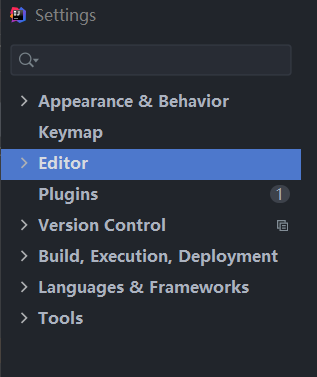

# 官网

官方下载地址：[Download IntelliJ IDEA: The Capable & Ergonomic Java IDE by JetBrains](https://www.jetbrains.com/idea/download/#section=windows)

社区版和收费版：[Ultimate vs. Community - Compare Editions | IntelliJ IDEA (jetbrains.com)](https://www.jetbrains.com/idea/features/editions_comparison_matrix.html)

官方使用文档：[Getting started | IntelliJ IDEA (jetbrains.com)](https://www.jetbrains.com/help/idea/getting-started.html)

# 安装

建议使用压缩包（绿色版，解压后即可使用）。

使用.exe文件：选好64位后都默认选项，可以指定安装路径。

# 卸载

使用压缩包时，直接删除解压文件。

使用.exe文件时：直接使用电脑的卸载功能就好，卸载后做好重启。	

# idea安装目录结构

- bin：容器，执行文件和启动参数等；
- help：快捷键文档和其他帮助文档；
- jre64：64 位java 运行环境；
- lib：idea 依赖的类库；
- license：各个插件许可；
- plugin：插件。

bin目录下的虚拟机配置文件idea64.exe.vmoptions：

```
-Xms128m    //初始内存数：500
-Xmx750m    //最大内存数：1500
-XX:ReservedCodeCacheSize=240m   //保留的代码的缓存大小:500
```

# idea配置结构目录

C:\Users\13409\AppData\Roaming\JetBrains\IntelliJIdea2020.2

# 使用

idea的project≈eclipse的wordspace。idea工程下的.idea 和 project01.iml 文件都是 IDEA 工程特有的。类似于 Eclipse 工程下的.settings、.classpath、.project 等。

在 Eclipse 中我们有 Workspace（工作空间）和 Project（工程）的概念，在 IDEA中只有 Project（工程）和 Module（模块）的概念。这里的对应关系为：**IDEA 官网说明： An Eclipse workspace is similar to a  project in IntelliJ IDEA；An Eclipse project maps to a module in IntelliJ IDEA。**

## 配置操作：

查看与修改**项目配置**：File--->ProjectsStructure；

删除module：右键弹出选项栏里Remove Moudle，然后再delete；

编辑区显示方式：指定显示文件右键（看到有tabs的选项），选择垂直显示或水平显示。

## 常用配置设置：

File--->Settings进入设置界面或工具栏的扳手图标进入。



分别是：外观&行为、快捷键、编辑窗口、插件、版本控制、构建执行和部署、语言&框架、工具。

### 主题、窗体、菜单

1. Appearance & Behavior

- 主题设置：在Appearance中的theme，theme下面一行就是用来设置全局字体和字体大小；
- 下载主题：主题插件One Dark theme；
- 设置窗体及菜单的主题和字体大小？。

### 编辑区

2.Editor - General

- 设置鼠标滚轮修改字体大小：Editor - General--->Mouse Control-change font size with Ctrl+Mouse Wheel；
- 鼠标悬浮提示设置：
- 自动导包：Editor - General - Auto Import--->Java中Insert imports on paste选always，其下面的两个框也√上；
- 显示行号和方法间分隔符：Editor - General - Appearance中的show line numbers与show method separators；
- 不区分大小写提示：Editor - General - Code Completion中的Match case的√去掉；
- 取消单行显示tabs的操作：Editor - General - Editor Tabs中的show tabs in one single的√去掉。

3. Editor – Font

- 设置字体、字体大小、字体行间距；

4. Editor – Color Scheme

- 单独修改当前主题的字体相关设置：Editor – Color Scheme - Color Scheme Font；
- 单独修改当前主题的控制台输出的字体及字体大小：Editor – Color Scheme -Console Font；
- 修改代码中注释相关设置：Editor – Color Scheme - Language Defaults--->Comments。

5. Editor – Code Style

- 设置超过指定 import 个数，改为* ：Editor – Code Style - Java--->Imports。

6.Editor – File and Code Templates

- 修改类头的文档注释信息：Editor – File and Code Templates--->File Header。

7.Editor – File Encodings

- 设置项目文件编码：代码都设置为UTF-8编码，把前面三个选项都选为UTF-8，最后的可以√上；
- 说明：Transparent native-to-ascii conversion 主要用于转换 ascii，一般都要勾选， 不然 Properties 文件中的注释显示的都不会是中文；
- 如果要对导入的文件转换为其他编码，可以右下角选择后convert。

### 自动编译

8.Build,Execution,Deployment

- 设置自动编译：Compiler中的Build project automatically(项目文件自动编译)和Compile indenpendent modules in parallel(modules并行编译)√上。

### 省电模式

省电模式：File--->Power Save Mode

IntelliJ IDEA 有一种叫做 省电模式 的状态，开启这种模式之后IntelliJ IDEA 会关掉代码检查和代码提示等功能。所以一般也可认为这是一种阅读模式，如果你在开发过程中遇到突然代码文件不能进行检查和提示，可以来看看这里是否有开启该功能。

# 快捷键Keymap

快捷键修改、File--->Manage IDE Settings--->Import Settings导入快捷键（导入和eclipse一样的快捷键）。

导入的是宋红康设置版的快捷键。

常用快捷键：

| **尚硅谷·宋红康 设置版** |                                                              |                                                        |
| ------------------------ | ------------------------------------------------------------ | ------------------------------------------------------ |
| **1**                    | **执行****(run)**                                            | **alt+r**                                              |
| **2**                    | **提示补全**  **(Class Name Completion)**                    | **alt+/**                                              |
| **3**                    | **单行注释**                                                 | **ctrl + /**                                           |
| **4**                    | **多行注释**                                                 | **ctrl  + shift + /**                                  |
| **5**                    | **向下复制一行** **(Duplicate  Lines)**                      | **ctrl+alt+down**                                      |
| **6**                    | **删除一行或选中行** **(delete  line)**                      | **ctrl+d**                                             |
| **7**                    | **向下移动行****(move statement down)**                      | **alt+down**                                           |
| **8**                    | **向上移动行****(move  statement up)**                       | **alt+up**                                             |
| **9**                    | **向下开始新的一行****(start  new line)**                    | **shift+enter**                                        |
| **10**                   | **向上开始新的一行**  **(Start New Line before  current)**   | **ctrl+shift+enter**                                   |
| **11**                   | **如何查看源码**  **(class)**                                | **ctrl +** **选中指定的结构 或**  **ctrl + shift + t** |
| **12**                   | **万能解错****/****生成返回值变量**                          | **alt  + enter**                                       |
| **13**                   | **退回到前一个编辑的页面** **(back)**                        | **alt + left**                                         |
| **14**                   | **进入到下一个编辑的页面****(****针对于上条****) (forward)** | **alt + right**                                        |
| **15**                   | **查看继承关系****(type hierarchy)**                         | **F4**                                                 |
| **16**                   | **格式化代码****(reformat code)**                            | **ctrl+alt+L**                                         |
| **17**                   | **提示方法参数类型****(Parameter Info)**                     | **ctrl+alt+/**                                         |
| **18**                   | **复制代码**                                                 | **ctrl  + c**                                          |
| **19**                   | **撤销**                                                     | **ctrl  + z**                                          |
| **20**                   | **反撤销**                                                   | **ctrl  + y**                                          |
| **21**                   | **剪切**                                                     | **ctrl  + x**                                          |
| **22**                   | **粘贴**                                                     | **ctrl  + v**                                          |
| **23**                   | **保存**                                                     | **ctrl  + s**                                          |
| **24**                   | **全选**                                                     | **ctrl  + a**                                          |
| **25**                   | **选中数行，整体往后移动**                                   | **tab**                                                |
| **26**                   | **选中数行，整体往前移动**                                   | **shift  + tab**                                       |
| **27**                   | **查看类的结构：类似于**  **eclipse** **的** **outline**     | **ctrl+o**                                             |
| **28**                   | **重构：修改变量名与方法名****(rename)**                     | **alt+shift+r**                                        |
| **29**                   | **大写转小写****/****小写转大写****(toggle case)**           | **ctrl+shift+y**                                       |

| **30** | **生成构造器****/get/set/toString**                | **alt  +shift + s**   |
| ------ | -------------------------------------------------- | --------------------- |
| **31** | **查看文档说明****(quick documentation)**          | **F2**                |
| **32** | **收起所有的方法****(collapse  all)**              | **alt  + shift + c**  |
| **33** | **打开所有方法****(expand all)**                   | **alt+shift+x**       |
| **34** | **打开代码所在硬盘文件夹****(show in explorer)**   | **ctrl+shift+x**      |
| **35** | **生成** **try-catch** **等****(surround with)**   | **alt+shift+z**       |
| **36** | **局部变量抽取为成员变量****(introduce field)**    | **alt+shift+f**       |
| **37** | **查找****/****替换****(****当前****)**            | **ctrl+f**            |
| **38** | **查找****(****全局****)**                         | **ctrl+h**            |
| **39** | **查找文件**                                       | **double  Shift**     |
| **40** | **查看类的继承结构图****(Show UML Diagram)**       | **ctrl  + shift + u** |
| **41** | **查看方法的多层重写结构****(method hierarchy)**   | **ctrl+alt+h**        |
| **42** | **添加到收藏****(add to favorites)**               | **ctrl+alt+f**        |
| **43** | **抽取方法****(Extract Method)**                   | **alt+shift+m**       |
| **44** | **打开最近修改的文件****(Recently Files)**         | **ctrl+E**            |
| **45** | **关闭当前打开的代码栏****(close)**                | **ctrl  + w**         |
| **46** | **关闭打开的所有代码栏****(close all)**            | **ctrl  + shift + w** |
| **47** | **快速搜索类中的错误****(next highlighted error)** | **ctrl  + shift + q** |
| **48** | **选择要粘贴的内容****(Show in Explorer)**         | **ctrl+shift+v**      |
| **49** | **查找方法在哪里被调用****(Call Hierarchy)**       | **ctrl+shift+h**      |

# 我的idea配置

1. Appearance & Behavior：设置主题：使用主题插件One Dark theme，编译区外全局大小16；

2. Editor：

   - 上面的Editor - General下的配置全都设置；

   - Editor – File and Code Templates的File Header设置如下 

     ```java
     /**
     @author shkstart
     @create ${YEAR}-${MONTH}-${DAY} ${TIME}
     */
     ```

   - Editor – File Encodings：UTF-8。

3. 安装的其他插件：IDE Eval Reset（idea试用日期刷新)）

 安装宋红康设置版的jar包。

#  模板Templates

Live Templates(实时代码模板)功能介绍：它的原理就是配置一些常用代码字母缩写，在输入简写时可以出现你预定义的固定模式的代码，使得开发效率大大提高，同时也可以增加个性化。最简单的例子就是在 Java 中输入 sout 会出现 System.out.println();
官方介绍 Live Templates：https://www.jetbrains.com/help/idea/using-live-templates.html

Editor - Live Templates - Java - +

修改和自定义模板

# 版本控制

idea中集成Git

# 断点调试


# maven配置与使用


# 其他

生成javadoc


# Tomcat镜像


# 关联数据库

