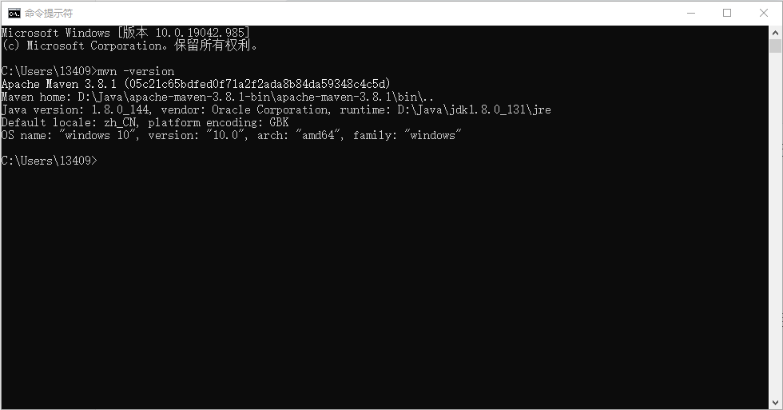
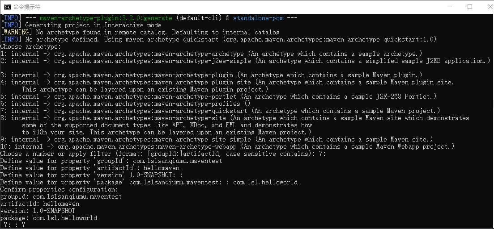
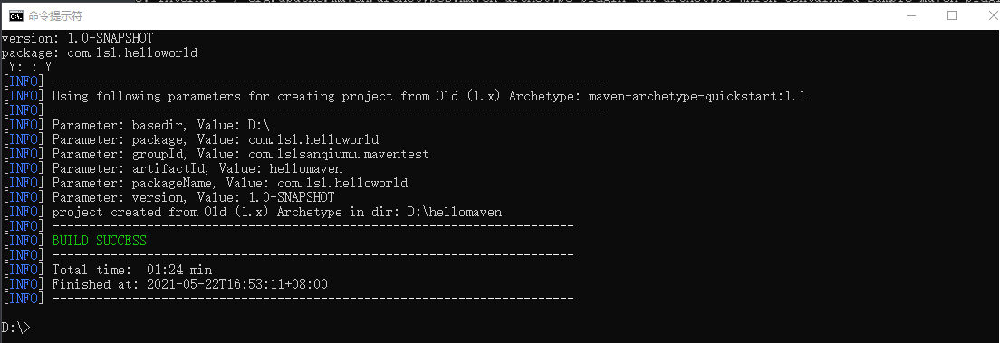
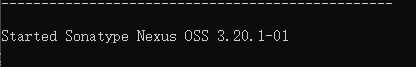
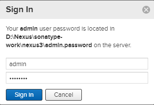

# Maven-自动化构建工具

官网：http://maven.apache.org

大致了解一下关于Maven的一些知识

构件：Maven中，任何一个依赖、插件、项目构建的输出，都可以称为构件

## 了解Maven

### maven：

一个项目所需要的东西？

1. 引入依赖包--->依赖包管理
2. 确定项目目录结构--->目录结构管理
3. 环境配置：JDK版本、编译打包流程、当前代码版本号等--->配置管理
4. 能在集成开发环境中编译和能通过命令行工具编译--->编译管理

为了协助开发，优化这些琐碎的任务，就有了一个标准化的项目管理和构建工具---Maven

Maven功能：

- 提供了一套依赖管理机制--->1

- 提供了一套标准化的项目结构--->2
- 提供了一套标准化的构建流程（编译，测试，打包，发布……）--->3、4

Maven标准目录结构：

```ascii
a-maven-project
├── pom.xml
├── src
│   ├── main
│   │   ├── java
│   │   └── resources
│   └── test
│       ├── java
│       └── resources
└── target
```

- a-maven-project：项目名
- pom.xml：项目描述文件
- src：资源目录
  - main.java：存放源码
  - main.resources：存放资源文件
  - test.java：存放测试源码
  - test.resources：存放测试资源
- target：存放编译、打包生成的文件

【注意】所有的目录结构都是约定好的标准结构，我们千万不要随意修改目录结构。使用标准结构不需要做任何配置，Maven就可以正常使用

关于项目描述文件pom.xml：

```xml
//例如
<project ...>
	<modelVersion>4.0.0</modelVersion>
	<groupId>com.itranswarp.learnjava</groupId>
	<artifactId>hello</artifactId>
	<version>1.0</version>
	<packaging>jar</packaging>
	<properties>
        ...
	</properties>
	<dependencies>
        <dependency>
            <groupId>commons-logging</groupId>
            <artifactId>commons-logging</artifactId>
            <version>1.2</version>
        </dependency>
	</dependencies>
</project>
```

Maven工程由以下作为唯一标识：

- `groupId`：类似Java的包名（通常是公司或组织名称）
- `artifactId`：类似Java的类名（通常是项目名称）
- `version`：版本号

我们在引用其他第三方库的时候，也是通过这3个变量确定。例如，依赖`commons-logging`：

```
<dependency>
    <groupId>commons-logging</groupId>
    <artifactId>commons-logging</artifactId>
    <version>1.2</version>
</dependency>
```

使用`<dependency>`声明一个依赖后，Maven就会自动下载这个依赖包并把它放到classpath中。(classpath：指定搜索目录，工具这些目录找到所要执行的Java程序所需要的类和包)


## 依赖管理

如果我们的项目要依赖第三方包，我们可以通过搜索引擎找到该包的官网然后下载该jar包的压缩包，之后再解压放进classpath里；

那如果这个包要依赖于另一个包，另一个包还要依赖另外的一个包......，这个时候从网上查找到想要的包再放进classpath里就会变得繁琐起来了。

Maven解决了这个依赖管理问题。


### 依赖管理问题：

关于Maven的依赖管理：

- 当我们声明了项目所需要的包，maven会自动导入这个包的jar包，再判断是否依赖其他的包再自动导入
- 如果我们声明的依赖解析判断出另外还需要二三十个包，那这时候去手动管理这些包就会费力并且容易出错，所以maven定义了几种依赖关系来协助我们管理这些jar包

### 依赖关系：

Maven定义了几种依赖关系，分别是`compile`、`test`、`runtime`和`provided`：

| scope    | 说明                                          | 示例            |
| :------- | :-------------------------------------------- | :-------------- |
| compile  | 编译时需要用到该jar包（默认）                 | commons-logging |
| test     | 编译Test时需要用到该jar包                     | junit           |
| runtime  | 编译时不需要，但运行时需要用到                | mysql           |
| provided | 编译时需要用到，但运行时由JDK或某个服务器提供 | servlet-api     |

- `compile`（默认的）是最常用的，Maven会把这种类型的依赖直接放入classpath。

- `test`依赖表示仅在测试时使用，正常运行时并不需要。最常用的`test`依赖就是JUnit：

```xml
<dependency>
    <groupId>org.junit.jupiter</groupId>
    <artifactId>junit-jupiter-api</artifactId>
    <version>5.3.2</version>
    <scope>test</scope>
</dependency>
```

- `runtime`依赖表示编译时不需要，但运行时需要。最典型的`runtime`依赖是JDBC驱动，例如MySQL驱动：

```xml
<dependency>
    <groupId>mysql</groupId>
    <artifactId>mysql-connector-java</artifactId>
    <version>5.1.48</version>
    <scope>runtime</scope>
</dependency>
```

- `provided`依赖表示编译时需要，但运行时不需要。最典型的`provided`依赖是Servlet API，编译的时候需要，但是运行时，Servlet服务器内置了相关的jar，所以运行期不需要：

```xml
<dependency>
    <groupId>javax.servlet</groupId>
    <artifactId>javax.servlet-api</artifactId>
    <version>4.0.0</version>
    <scope>provided</scope>
</dependency>
```

Maven如何知道从何处下载所需的依赖？也就是相关的jar包？

答案是Maven维护了一个中央仓库（[repo1.maven.org](https://repo1.maven.org/)），所有第三方库将自身的jar以及相关信息上传至中央仓库，Maven就可以从中央仓库把所需依赖下载到本地。Maven并不会每次都从中央仓库下载jar包。一个jar包一旦被下载过，就会被Maven自动缓存在本地目录（用户主目录的`.m2`目录），所以，除了第一次编译时因为下载需要时间会比较慢，后续过程因为有本地缓存，并不会重复下载相同的jar包。


## jar包

JAR文件的全称是Java Archive File，意思就是Java档案文件。通常JAR文件是一种压缩文件，与常见的ZIP压缩文件兼容，也被称为JAR包。JAR文件与zip文件的去区别就是在JAR文件中默认包含了一个名为META-INF/MANIFEST.MF的清单文件，这个清单文件是在生成JAR文件时系统自动创建的。

当开发了一个应用程序后，这个应用程序包含了很多类，如果需要把这个应用程序提供给别人使用，通常会将这些类文件打包成一个JAR文件，把这个JAR文件提供给别人使用。只要别人在系统的CLASSPATH环境变量中添加这个JAR文件，则Java虚拟机就可以自动在内存中解压这个JAR包，把这个JAR文件当成一个路径，在这个路径中查找所有的类或包层次对应的路径结构。


# Maven的使用  

### 安装Maven:

Windows系统下安装：

到[Maven官网](https://maven.apache.org/)下载压缩包到本地解压，[ apache-maven-3.8.1-bin.zip](https://downloads.apache.org/maven/maven-3/3.8.1/binaries/apache-maven-3.8.1-bin.zip)就是windows版本的压缩包

后缀为“tar.gz”的是Linux系统、OSX系统版本的，后缀为“zip”的是Windows系统版本的的；后缀名为bin表示编译后的二进制文件，一般比较小，适合直接在项目中使用， 后缀名为src表示可以查看源代码的，比二进制文件大一些，如果想看Maven的源码可以下载这一类

环境变量配置：

- 新建环境变量：`MAVEN_HOME`，变量值为解压后的`maven文件夹目录地址`（使用绝对路径）
- 在Path环境变量里新建一个变量值：`%MAVEN_HOME%\bin`

配置完成后检测：

- 打开命令行输入`mvn -version`，如下显示则完成，若没有完成则检测上面变量路径



Linux系统下安装：先忽略

IOS系统下安装：先忽略

关于Maven的目录：（了解一下）

1. bin：包含mvn运行的脚本（这些脚本用来配置Java命令，准备好classpath和相关的Java系统属性，然后执行Java命令）
   - mvn：基于UNIX平台的shell脚本
   - mvn.cmd：Windows命令脚本
   - mvnDebug：比mvn多一条MAVEN_DEBUG_OPTS配置，作用是在运行Maven时开启debug，以便调试maven本身
   - mvnDebug.cmd
   - mvnyjp
   - m2.conf：classwords的配置文件
2. boot：
   - plexus-classworlds-x.x.x.jar：plexus-classworlds是一个类加载器框架
3. conf：包含settings.xml文件，该文件用来定制Maven行为（一般情况下我们更倾向于复制该文件夹到用户目录下的.m2目录下，然后修改，在用户范围定制Maven行为）
4. lib：包含所有Maven运行时需要的Java类库，Maven本身分模块开发；可以说该目录就是真正的Maven

### Maven配置：

仓库配置：

由于默认的中央仓库下载较慢，因此，也可以将远程仓库地址改为阿里巴巴的仓库地址：在settings.xml中编辑

- ```xml
  <mirror>
          <id>nexus-aliyun</id>
          <mirrorOf>central</mirrorOf>
          <name>Nexus aliyun</name>
          <url>http://maven.aliyun.com/nexus/content/groups/public</url>
  </mirror>
  ```


### 不通过IDE使用：

#### Maven的使用：（从创建到发布）

按以下流程操作来体验一下Maven的POM、Maven项目结构、以及如何编译、测试、打包等

1. 创建一个文件夹，并在里面创建src文件夹和一个pom.xml文件（我建hello-world为项目根目录，再在里面建src文件夹和pom.xml文件）

2. 编辑pom.xml文件

   - ```xml
     <?xml version = "1.0" encoding = "UTF-8"?>
     <project xmlns="http://maven.apache.org/POM/4.0.0" 
     		 xmlns:xsi="http://www.w3.org/2001/XMLSchema-instance" 
     		 xsi:schemaLocation="http://maven.apache.org/POM/4.0.0 
     		 https://maven.apache.org/xsd/maven-4.0.0.xsd">
     		 
       <modelVersion>4.0.0</modelVersion>
       <groupId>com.juv-enxu.mvnbook</groupId>
       <artifactId>hello-world</artifactId>
       <version>0.0.1-SNAPSHOT</version>
       <name>Maven Hello World Project</name>
       
       </project>
     ```

3. src文件夹里建立main文件夹和main的子文件夹java

4. 编辑主代码：编辑主代码文件java文件夹里创建如下文件夹结构com.juv-enxu.mvnbook.helloworld，在helloworld里创建HelloWorld.java。包名com.juv-enxu.mvnbook.helloworld和POM中定义的groupId、artifactId相吻合（这样会更加符合逻辑，方便搜索结构和类）

   - ```java
     //主类代码如下
     package com.juvenxu.mvnbook.helloworld;
     
     public class HelloWorld{
     	public String sayHello(){
     		return "HelloWorld";
     	}
     	
     	public static void main(String[] args){
     		System.out.println(new HelloWorld().sayHello());
     	}
     }
     ```

5. cmd命令行里进入项目根目录hello-world（先输入`D:`进入D盘，再通过`cd 路径` 进入指定路径），执行`mvn clean compile`

   - clean告诉Maven清理输出目录`target\`(默认情况Maven所有输出的在`target\`目录下)，compile告诉Maven编译项目主代码
   - 此处执行路径：clean(clean任务，删除`target\`目录)--->resources(后面再了解)--->compiler(compile，项目主代码编译至target\classes，会根据上面包创建包)

6. src文件夹里建立test文件夹和其子文件夹java，在pom.xml文件里为项目添加JUnit依赖

   - ```xml
     <dependencies><!--此元素可以包含多个dependency元素以声明项目的依赖-->
     	<dependency>
     		<groupId>junit</groupId><!--groupId、artifactId、version，坐标-->
     		<artifactId>junit</artifactId>
     		<version>4.7</version>
     		<scope>test</scope><!--依赖范围，如果不声明，那么就是默认的compile，表示对主代码和测试代码都有效-->
     	</dependency>
       </dependencies>
     ```

7. 测试代码的编写：在src.test.java下创建文件HelloWorldTest.java，内容如下：

   - ```java
     package com.juvenxu.mvnbook.helloworld;
     import static org.junit.Assert.assertEquals;
     import org.junit.Test;
     public class HelloWorldTest{
     	@Test
     	public void testSayHello(){
     		HelloWorld helloworld = new HelloWorld();
     		String result = helloworld.sayHello();
     		assertEquals("Hello Maven", result);//JUnit框架的Assert类，检查结果是不是“Hello Maven”
     	}
     }
     ```

   - 典型的单元测试包含“准备测试类和数据、执行要测试的行为、检查结果”这三个步骤

8. 调用Maven执行编译\测试：`mvn clean test`，执行后出现错误，解决方法是在pom.xml加入如下后再次执行：

   - ```xml
     <build>
       <!--<finalName>{file_name}</finalName> 设置导出jar的名字? -->
         <plugins>
           <plugin>  
             <groupId>org.apache.maven.plugins</groupId>  
              <!-- maven里执行测试用例的插件，不显示配置就会用默认配置。这个插件的surefire:test命令会默认绑定maven执行的test阶段-->
             <artifactId>maven-surefire-plugin</artifactId>  
             <version>2.4.2</version>  
             <configuration>  
               <skipTests>true</skipTests><!--跳过测试-->  
             </configuration>  
           </plugin>
         </plugins>
       </build>
     ```

   - 输入`mvn clean test`会执行以下任务：clean、resources、compile、testResources；而在执行测试前会先自动执行项目主资源处理、主代码编译、测试资源处理、测试代码编译等工作，这是Maven生命周期的一个特性

9. 打包：执行`mvn clean package`，在打包之前也会执行编译、测试等操作；jar插件的jar目标将项目主代码打包成为hellomaven-0.0.1-SNAPSHOT.jar文件，根据artifact-version.jar规则进行命名(可以用finalName来定义该文件的名称)

10. 安装：为了使其他的Maven项目直接引用这个jar，执行`mvn clean install`，该任务将项目输出的jar包安装到Maven本地仓库(默认情况下本地仓库在`用户目录`里的`.m2`文件夹)

11. 为运行HelloWorld项目配置好插件`maven-shade-plugin`：（加在pom.xml里的build原素下的plugins里）

    - ```xml
      <plugin>
              <groupId>org.apache.maven.plugins</groupId>
              <artifactId>maven-shade-plugin</artifactId>
              <version>3.1.1</version>
              <executions>
                <execution>
                  <phase>package</phase>
                  <goals>
                    <goal>shade</goal>
                  </goals>
                  <configuration><!--put your configurations here-->
                    <transformers>
                    	<transformer implementation="org.apache.maven.plugins.shade.resource.ManifestResourceTransformer">
                        <mainClass>com.juvenxu.mvnbook.helloworld.HelloWorld</mainClass>
                        <!-- 指定主类的位置，主类配置应为：包结构.主类名 -->
                      </transformer>
                    </transformers>
                  </configuration>
                </execution>
              </executions>
            </plugin>
      ```

    - 默认打包生成的jar包是不能直接运行的，因为带main方法的类信息不会添加到manifest中(打开jar文件中的META-INF/MANIFESE.MF文件，将无法看到Main-Class一行)。为了生成可执行的jar文件需要借助上述插件

12. 执行`mvn clean install`，然后得到`target/`目录下的两个jar包，original开头的jar包是原始的jar，另一个是带有Main-Class信息的可运行的jar包；最后执行`java -jar target\hellomaven-0.0.1-SNAPSHOT.jar `，得到命令行中的Hello Maven。

【注】可用以下插件指定JDK版本和编码：

```xml
<plugin>  
   <groupId>org.apache.maven.plugins</groupId>  
   <artifactId>maven-compiler-plugin</artifactId>  
   <version>2.1</version>  
   <configuration>  
       <source>1.7</source><!--开启Java7的支持-->  
       <target>1.7</target>  
   </configuration>  
</plugin> 
```

到这里，已经体验了一下构建一个maven项目(模块)，可以带着一个问题去学习，如果是需要一次性构建一个项目下的多个模块该如何实现？

#### 使用Archetype生成项目骨架

以上基本的目录结构和pom.xml文件的内容我们称为项目的骨架，一次次的按上述来进行创建会很繁琐令人恼火，所以Maven为此提供了Archetype，用来快速勾勒出项目的骨架。

执行`mvn archetype:generate`，会先下载所需要的东西，然后会出现如下：



1.选择archetype时会默认一个数字，如上图的`7:`，直接按回车，分别指定：

- groupID：类似包名的格式
- artifactID：类似项目名，创建后根目录名称就是这个
- version：直接回车
- package：创存放源代码的包，例如上面存放HelloWorld.java文件之前的那一串以com开始的文件结构

2.最后的Y：：是用来确认是否创建项目骨架的，输入Y回车则就会创建好(如下)；如果不想创建或重新创建，则输入N并回车再按上述流程操作就好



总结：

### IDE中的Maven


#### Eclipse


#### IDEA


# Maven的核心知识

## POM文件

POM（Project Object Model，项目对象模型），定义项目的基本信息，用于描述项目如何构建、声明项目依赖等

pom.xml文件：

```xml
<?xml version = "1.0" encoding = "UTF-8"?>
<project xmlns="http://maven.apache.org/POM/4.0.0" xmlns:xsi="http://www.w3.org/2001/XMLSchema-instance" xsi:schemaLocation="http://maven.apache.org/POM/4.0.0 https://maven.apache.org/xsd/maven-4.0.0.xsd">
    
  <modelVersion>4.0.0</modelVersion>
  <groupId>lsl_sanqiumu</groupId>
  <artifactId>hellomaven</artifactId>
  <version>0.0.1-SNAPSHOT</version>
  <name>Maven Hello World Project</name>
    
   <!--编码-->
  <properties>
    <project.build.sourceEncoding>UTF-8</project.build.sourceEncoding>
  </properties>
    
  <!--依赖-->
  <dependencies><!--此元素可以包含多个dependency元素以声明项目的依赖-->
	<dependency>
		<groupId>junit</groupId><!--groupId、artifactId、version，坐标-->
		<artifactId>junit</artifactId>
		<version>4.7</version>
		<scope>test</scope><!--依赖范围，如果不声明，那么就是默认的compile，表示对主代码和测试代码都有效-->
	</dependency>
      ......
  </dependencies>
    
  <!--插件-->
  <build>
  <finalName>{file_name}</finalName> <!--设置导出jar的名字，看你需要，可不设置-->
    <plugins><!--此元素可以包含多个plugin元素以声明插件-->
      <plugin>  
        <groupId>org.apache.maven.plugins</groupId>  
        <artifactId>maven-surefire-plugin</artifactId>  
        <version>2.4.2</version>  
        <configuration>  
          <skipTests>true</skipTests>
        </configuration>  
      </plugin>
        ......
    </plugins>
  </build>
    
</project>
```

1. 第一行：XML头，指定该XML文档的版本和编码方式
2. project元素是所以pom.xml文件的根元素，其内声明了一些不是必须的POM相关的命名空间及xsd元素，这些属性使第三方工具帮助我们快速编辑POM
3. 根元素下的：
   - modelVersion元素：当前POM模型版本号（对于Maven2、Maven3只能是4.0.0）
   - 项目基本坐标定义
     - groupId：项目属于哪个组（类似Java的包名）
     - artifactId：定义当前项目在组中唯一的ID（类似项目名）
     - version：指定项目当前版本号
   - name元素：不是必须的，用来声明更为友好的项目名称（为方便信息交流，推荐添加）

Maven一大优点：项目对象模型最大程度的与Java代码独立（所以在很大程度上避免了Java代码与POM代码的相互影响，比如项目升级版本时，只需要修改POM）


## Maven内置命令

mvn clean compile

mvn clean test

mvn clean package

mvn clean install

## 坐标和依赖

坐标：可用三维坐标系来协助理解，三维坐标中通过三个坐标可以确定空间中的唯一点；同理，Maven中的坐标就是用来对各种构件进行唯一的标识，从而使Maven准确的从中央仓库找到这些构件来进行下载。Maven坐标的元素包括groupId、artifactId、version、packaging、classifier。通常情况下通过groupId、artifactId、version来标识坐标，这三个是必须的，packaging是可选的(默认为jar)，classifier是不能直接定义的。

Nexus项目的坐标定义：

```xml
    <groupId>org.sonatype.nexus</groupId>
    <artifactId>nexus-indexer</artifactId>
    <version>2.0.0</version>
    <packaging>jar</packaging>
```

### 坐标元素说明：

- groupId：定义当前Maven项目隶属的实际项目(注意是实际项目)
  - Maven项目与实际项目不一定是一对一的关系，还有可能是一对多的关系：一个实际项目对应多个Maven项目，这是因为Maven中有模块的概念，一个实际项目往往被划分为多个模块
  - groupId不应该对应项目隶属的组织或公司，而是对应组织或公司下的项目，如上就对应了非营利性组织org.sonatype的nexus项目
  - groupId表示方式：类似Java包名的表达方式，通常与域名反向一一对应，如上就是域名的反向
- artifactId：定义实际项目的一个Maven项目（模块）
  - 为了方便寻找构件，推荐使用实际项目名作为前缀，如上nexus-indexer的nexus就是实际项目名
  - 默认情况下，Maven生成的构件的文件名会以artifactId作为开头，如上面Maven的使用中的生成的`hellomaven-0.0.1-SNAPSHOT.jar`，这样就容易知道是哪个项目的一组构件
- version：定义Maven项目当前所处的版本（Maven定义了一套版本规范以及快照(SNAPSHOT)概念）
- packaging：定义Maven项目打包的方式，不定义时默认为jar
  - 打包方式确定拓展名，但不是绝对的（例如packaging为maven-plugin的构件拓展名为jar）
  - 打包方式影响生命周期，比如jar打包和war打包会使用不同的命令
- classifier：定义构建输出的一些附属构件，由附加插件帮助生成的

【构件拓展名的一般规则】artifactId-version.packaging或artifactId-version-classifier.packaging


### 依赖

依赖声明可以包含的元素：

```xml
  <dependencies>
	<dependency>
		<groupId>...</groupId></groupId>
		<artifactId>...</artifactId>
		<version>...</version>
         <type>...</type>
		<scope>...</scope>
         <optional>...</optional>
         <exclusions>
         	<exclusion>
             ...
             </exclusion>
             ......
         </exclusions>
	</dependency>
      ......
  </dependencies>
```

- 依赖的基本坐标：groupId、artifactId、version
- 依赖的类型：type，对应于项目坐标定义的packaging，大部分情况下该元素不用声明，默认为jar
- 依赖的范围：scope
- 标记依赖是否可选：optional
- 排除传递性依赖：exclusions

#### 依赖范围

依赖范围：控制依赖于三种classpath的关系（编译classpath、测试classpath、运行classpath）

Maven中的依赖范围：

- compile：编译依赖范围；默认的，对于三种classpath都有效，例如spring-core

- test：测试依赖范围；只对测试classpath有效，但在编译主代码和运行项目时无效，例如JUnit

- provide：已提供依赖范围；对于编译、测试classpath有效，但在运行时无效，例如servlet-api

- runtime：运行时依赖范围；对测试、运行classpath有效，但在编译主代码时无效，例如JDBC驱动实现

- system：系统依赖范围；与classpath的关系和provide的完全一致，使用system依赖时必须通过systemPath元素显示指定依赖文件的路径（此类依赖不是通过Maven仓库解析的，往往与本机系统绑定，可能构成构件额不可移植性，需谨慎使用）

  - ```xml
    <dependency>
    	<groupId>javax.aql</groupId>
    	<artifactId>jdbc-stdext</artifactId>
    	<version>2.0</version>
    	<scope>system</scope>
        <systemPath>${java.home}/lib/rt.jar</systemPath>
    </dependency>
    ```

    

- import(Maven2.0.9及以上)：导入依赖范围；不会对三种classpath产生实际影响

#### 传递性依赖

传递性依赖：

Maven的传递性依赖机制：使我们大部分的情况下只需要关心直接依赖，是为依赖管理问题而设置的

依赖调解、可选依赖，先不详细记录，遇到时再查阅

最佳实践(前人的经验总结)：

排除依赖：排除某个不稳定版本的传递性依赖，用稳定版本的依赖替换

- ```xml
  <exclusions>
      <exclusion>
          <groupId></groupId><!--排除只需这两个即可-->
          <artifactId></artifactId>
      </exclusion>
  </exclusions>
  ```

归类依赖：某些依赖来自同一项目的不同模块，这些依赖的版本相同222，我们使用如下命令定义版本号（例子如下）

- ```xml
  <!--与build元素等并列-->
  <properties>
      <springframework.version>2.5.6</springframework.version>
  </properties>
  在springframe的模块依赖里:
  <version>${springframework.version}</version>
  ```

优化依赖：

已解析依赖：Maven会自动解析所以项目的直接依赖和传递性依赖，并且根据规则正确判断每个依赖的范围，对于一些依赖冲突，也能进行调节，以确保如何一个构件只有唯一的版本在依赖中存在，最后得到的依赖就是已解析依赖，可使用`mvn dependency:list`查看已解析依赖，使用`mvn dependency:tree`查看当前项目依赖树


## 仓库

Maven仓库：存储Maven的共享构件

此处忽略：通过install clean install安装构件进本地仓库，对应的路径生成逻辑（需要再查阅）

### 仓库分类：

- 本地仓库：（安装好Maven后第一次输入Maven命令后才存在，最原始的空的）
  - Windows下仓库地址：C:\Users\ [用户名]\ .m2\repository
  - Linux下：/home/用户名/ .m2/repository/（.开头的文件默认隐藏，使用Is-a命令显示或隐藏）
  - 复制全局目录的settings.xml到本地仓库进行修改，全局目录下的推荐不要直接去修改
- 远程仓库
  - 中央仓库：默认的远程仓库
  - 私服：架设在局域网的仓库服务，私服代理广域网上的远程仓库，供局域网内的Maven用户使用
  - 其他公共库

关于私服的机制和优点：

- 当Maven需要下载构件，会从私服请求下载，如果私服上不存在则从外部远程仓库下载缓存在私服上后再为Maven用户下载请求提供服务
- 节省自己的外网宽带、加速Maven构建、部署第三方构件、提高稳定性、增强控制、降低中央仓库的负荷


### 配置远程仓库

#### 仓库-构件下载

pom中配置远程仓库：配置仓库用来下载构件

- ```xml
  <project>
      ...
  <repositories>
      <repository><!--配置JBoss Maven仓库-->
          <id>jboss</id>
          <name>JBoss Repository</name>
          <url>http://repository.jboss.com/maven2</url>
          <releases>
              <enabled>true</enabled><!--发布版本构件下载控制-->
          </releases>
          <snapshots>
          	<enabled>false</enabled><!--快照版本构件下载控制-->
          </snapshots>
          <layout>default</layout><!--仓库的布局是Maven2及Maven3的默认布局-->
      </repository>
      ...
  </repositories>
      ...
      </project>
  ```

- ```xml
  <!--releases、snapshots元素的子元素-->
  <enabled></enabled>
  <updatePolicy></updatePolicy><!--从远程仓库更新的频率，daily(默认，每天更新)、never、always（每次构建都检查）、interval: X（每隔X分钟检查一次）-->
  <checksumPolicy></checksumPolicy><!--检查检验和文件的策略，声明遇到校验和验证失败时的操作，默认值是warn（警告），其他值为fail（构建失败）、ignore（忽略校验和错误）-->
  ```

#### 仓库认证

远程仓库认证：在settings.xml中配置认证信息

```xml
<settings>
...
    <servers>
        <server>
        <id></id>
        <username></username>
        <password></password>
        </server>
    </servers>
    ...
</settings>
```

#### 仓库-上传构件

部署第三方构件到远程仓库：编辑项目pom.xml文件指定存放发布版本和快照版本的仓库，运行mvn clean deploy，就会将项目构建输出的构件部署到配置对应的远程仓库

```xml
<project>
    ...
<distributionManagement>
    <repository><!--发布版本构件仓库-->
        <id></id>
        <name></name>
        <url></url>
    </repository>
    <snapshotRepository><!--快照版本构件仓库-->
        <id></id>
        <name></name>
        <url></url>
    </snapshotRepository>
</distributionManagement>
    ...
    </project>
```


### 快照版本

开发过程中，开发的一个模块需要依赖另一个也在再次开发的模块，为了方便更新这个也在同时开发的模块构件以便开发和集成调试。

快照版本发布到私服中，Maven会自动为构件打上时间戳，检测更新时发现最新的便会下载（默认情况下每天检查一次更新）

快照版本有不稳定性，项目不应该依赖任何外部快照版本构件


### 仓库与依赖机制


### 镜像

如果仓库X可以提供仓库Y存储的所有的内容，那么就可以认为X是Y的一个镜像

配置镜像在settings.xml中

#### 配置中央仓库镜像：

- ```xml
  <mirror><!--阿里巴巴的仓库-->
          <id>nexus-aliyun</id>
          <mirrorOf>central</mirrorOf>
          <name>Nexus aliyun</name>
          <url>http://maven.aliyun.com/nexus/content/groups/public</url>
  </mirror>
  ```

#### 使用私服作为镜像：

- ```xml
  <mirrors>
  	<mirror>
          <id>nexus-aliyun</id>
          <name>Nexus aliyun</name>
          <url>http://maven.aliyun.com/nexus/content/groups/public</url>
          <mirrorOf>*</mirrorOf>
  	</mirror>
  </mirrors>
  ```

  关于mirrorOf元素的说明：

  - <mirrorOf>*</mirrorOf>：匹配所有远程仓库
  - <mirrorOf>external:*</mirrorOf>：匹配所有远程仓库，使用localhost、或file://协议的除外（匹配所有不在本机的上的远程仓库）
  - <mirrorOf>reop1,repo2</mirrorOf>：匹配仓库reop1和repo2，使用逗号隔开
  - <mirrorOf>*,!repo1</mirrorOf>：匹配所有远程仓库，repo1除外

  【注意】镜像仓库完全屏蔽了被镜像仓库，当镜像仓库不稳定或停止服务的时候，Maven将无法访问被镜像仓库，因而将无法下载构件

#### 仓库搜索服务

公共仓库搜索服务：（可以来寻址依赖，根据关键字找到Maven坐标）

- Sonatype Nexus：http://repository.sonatype.org/
- Jarvana：http://www.jarvana.com/jarvana/（这个我打不开）
- MVNbrowser：http://www.mvnbrowser.com
- MVNrepository：http://mvnrespository.com/


## 生命周期

Maven的生命周期是为了对所有的构建过程进行抽象和统一；生命周期本身不做任何工作，实际的任务都交由插件来完成。

生命周期抽象了构建的各个步骤，定义了它们的次序但没有提供具体实现，每个构建步骤都可以绑定一个或多个插件行为，而且Maven为大多数构建步骤编写并绑定了默认插件。（可以配置插件定制构建行为，也可以自己编写插件）

#### 生命周期详解：

三套独立的生命周期：clean、default、site；（互相独立，可以调用某个生命周期的某个阶段但不会对其他的生命周期有影响）

##### clean生命周期：

- 目的：清理项目
- 三个阶段：
  - pre-clean：执行清理前需要完成的工作
  - clean：清理上一次构建生成的文件
  - post-clean：执行一些清理后需要完成的工作

##### default生命周期：

- 目的：构建项目（定义了真正构建时所需要执行的所以步骤）
- 阶段：
  - validate
  - initialize
  - generate-sources
  - process-sources：处理项目主资源文件（一般是对src/main/resources目录内的内容进行变量替换工作后复制到项目输出的主classpath目录中）
  - process-resources
  - generate-resources
  - compile：编译项目主源码（一般是编译src/main/java目录下的java文件至项目输出的主classpath目录中）
  - process-classes
  - generate-test-sources
  - process-test-sources：处理项目测试资源文件（一般是对src/test/resources目录内的内容进行变量替换工作后复制到项目输出的测试classpath目录中）
  - generate-test-resources
  - process-test-resources
  - test-compile：编译项目的测试代码（一般是编译src/test/java目录下的java文件至项目输出的测试classpath目录中）
  - process-test-classes
  - test：使用单元测试框架进行运行测试，测试代码不会被打包或部署
  - prepare-package
  - package：接受编译好的代码，打包成可发布的格式，如jar
  - pre-integration-test
  - integration-test
  - post-integration-test
  - verify
  - install：将包安装到Maven本地仓库，供本地其他Maven项目使用
  - deploy：将最终的包复制到远程仓库
- （http://maven.apache.org/guides/introduction/introduction-to-the-lifecycle.html）

site生命周期：

- 目的：建立和发布项目站点（Maven可以根据POM所包含的信息自动生成一个友好的站点）
- 四个阶段：
  - pre-site：执行一些在生成项目站点之前需要完成的工作
  - site：生成项目站点文档
  - post-site：执行一些在生成项目站点之后需要完成的工作
  - site-deploy：将生成的项目站点发布到服务器上

##### 命令行命令：

进入项目文件夹后执行的一些命令说明：

- mvn clean：调用clean生命周期的clean阶段，执行了pre-clean和clean
- mvn test：调用default生命周期的test阶段，执行了从validate开始到test（包括validate和test）的所有阶段
- mvn clean test：调用了clean周期的clean阶段和default周期的test阶段，执行了pre-clean、clean和validate到test
- mvn clean deploy site-deploy：调用了clean周期的clean阶段、default周期的deploy阶段、site周期的site-deploy阶段，执行了pre-clean、clean和validate到deploy、pre-site到site-deploy的所有阶段

【】Maven命令：基于这些阶段简单组合而成（以上只是例子）

在实际开发过程中，经常使用的命令有：

`mvn clean`：清理所有生成的class和jar；

`mvn clean compile`：先清理，再执行到`compile`；

`mvn clean test`：先清理，再执行到`test`，因为执行`test`前必须执行`compile`，所以这里不必指定`compile`；

`mvn clean package`：先清理，再执行到`package`。

大多数phase在执行过程中，因为我们通常没有在`pom.xml`中配置相关的设置，所以这些phase(阶段)什么事情都不做。

经常用到的phase其实只有几个：

- clean：清理
- compile：编译
- test：运行测试
- package：打包

#### 生命周期与插件的绑定:

插件目标（Plugin Goal）：插件的每个功能就是一个插件目标，一个插件里有很多的功能

例如：maven-dependency-plugin：有十多个目标，每个目标对应一个功能，插件目标例子如下（冒号前是插件前缀，冒号后是该插件的目标），可以使用mvn命令执行下面；以此类推其他插件

- dependency:analize：
- dependency:tree：
- dependency:list：

插件绑定：

- clean生命周期的clean阶段与maven-clean-plugin:clean绑定

- site生命周期的site和site-deploy分别与maven-site-plugin:site、maven-site-plugin:deploy绑定

- default生命周期的复杂绑定关系：下面为拥有绑定关系的阶段，其他阶段默认没有绑定，即没有任何实际行为

  - |      生命周期阶段      |               插件目标                |            执行任务            |
    | :--------------------: | :-----------------------------------: | :----------------------------: |
    |    process-sources     |   maven-resources-plugin:resources    |   复制主资源文件至主输出目录   |
    |        compile         |     maven-compiler-plugin:compile     |      编译主代码至输出目录      |
    | process-test-resources | maven-resources-plugin:testRescources | 复制测试资源文件至测试输出目录 |
    |      test-compile      |   maven-compiler-plugin:testCompile   |   编译测试代码至测试输出目录   |
    |          test          |      maven-surefire-plugin:test       |          执行测试用例          |
    |        package         |         maven-jar-plugin:jar          |         创建项目jar包          |
    |        install         |     maven-install-plugin:install      |  将项目输出构件安装到本地仓库  |
    |         deploy         |      maven-deploy-plugin:deploy       |  将项目输出构件部署到远程仓库  |

常见的打包类型：jar、war、pom、maven-plugin、ear等

官方文档：http://maven.apache.org/guides/introduction/introduction-to-the-lifecycle.html#Built-in_Lifevyvle_Bind-ings


#### 自定义绑定：

掉过此内容，需用时再查阅资料


## 插件

### 插件配置：

命令行插件配置：

- 例如maven-surefire-plugin提供了一个maven.test.skip参数，命令行中使用maven install -Dmaven.test.skip=true，就能跳过测试
- 关于-D：Java自带的，功能是通过命令行设置一个Java系统属性

POM中插件全局配置：maven-compiler-plugin的配置就是全局配置，见上面的不通过IDE使用

POM中插件任务配置：忽略，用到时查询资料


### 插件信息获取

基本上所有的Maven插件都来自于Apache和Codehaus

Apache

官方插件列表：http://maven.apache.org/plugins/index.html

官方插件下载：http://repo1.maven.org/maven2/org/apache/maven/plugins/

Codehaus（关停了。。）

插件列表：http://mojo.codehaus.org/plugins.html

插件下载：http://repository.codehaus.org/org/codehaus/mojo/


### 描述插件

maven-help-plugin

### 调命令行用插件

。。

### 插件解析机制

先不了解Maven内部吧


## 聚合和继承

#### 聚合：

聚合：把项目的各个模块聚合在一起构建

聚合实现：

- 创建一个含pom.xml的目录，该pom.xml的设置如下

  - ```xml
    <?xml version = "1.0" encoding = "UTF-8"?>
    <project xmlns="http://maven.apache.org/POM/4.0.0" 
    		 xmlns:xsi="http://www.w3.org/2001/XMLSchema-instance" 
    		 xsi:schemaLocation="http://maven.apache.org/POM/4.0.0 
    		 https://maven.apache.org/xsd/maven-4.0.0.xsd">
    		 
      	<modelVersion>4.0.0</modelVersion>
      	<groupId>com.juv-enxu.mvnbook</groupId><!--一般都使与模块的一样-->
      	<artifactId>hello-world</artifactId><!--一般使与聚合项目目录名一样-->
      	<version>0.0.1-SNAPSHOT</version><!--版本和模块一样-->
        <packaging>pom</packaging><!--聚合项目的只能为pom，否则无法构建-->
      	<name></name><!--给项目提供一个更容易阅读的名字-->
      	<modules>
            <module>模块目录1</module><!--模块所在目录，是相对于当前聚合项目的相对路径目录-->
            <module>模块目录2</module>
            ...
      	</modules>
      </project>
    ```

- 聚合项目与模块目录可以存在的关系：

  - 父子目录结构
  - 平行目录结构：此时module元素的值应该是`../模块目录名字`

从聚合模块运行`mvn clean install`：Maven会先解析聚合模块的POM、分析要构建的模块，并计算出一个反应堆构建顺序(Reactor Build Order)，然后根据这个顺序依次构建各个模块。（反应堆：所有模块组成的一个构建结构，包括聚合模块）在运行该命令后也能看到命令行中显示各模块的名称，只不过是是name里面的名称

#### 继承：

构建多模块的项目，POM中会有很多重复的东西，重复就意味着更多的劳动和更多的潜在的问题。所以就有了POM的继承机制来解决中这个问题。

继承：抽取各模块相同的依赖和插件等配置（简化POM，同时还能促进各模块的一致性）。

继承的实现：

- 父模块的设置：在聚合目录下设立一个父模块并加进聚合模块里，即和上面一样用module配置进聚合模块配置里

  - ```xml
    <!--父模块的POM配置-->
    <?xml version = "1.0" encoding = "UTF-8"?>
    <project xmlns="http://maven.apache.org/POM/4.0.0" 
    		 xmlns:xsi="http://www.w3.org/2001/XMLSchema-instance" 
    		 xsi:schemaLocation="http://maven.apache.org/POM/4.0.0 
    		 https://maven.apache.org/xsd/maven-4.0.0.xsd">
    		 
      	<modelVersion>4.0.0</modelVersion>
      	<groupId>com.juv-enxu.mvnbook</groupId><!--一般都使与模块的一样-->
      	<artifactId>xx-parent</artifactId><!--一般使与父目录一样-->
      	<version>0.0.1-SNAPSHOT</version><!--版本和模块一样-->
        <packaging>pom</packaging><!--父模块也只能为pom，否则无法构建-->
      	<name></name><!--给项目提供一个更容易阅读的名字-->
      </project>
    ```

- 实现继承：在模块中加入parent元素匹配父模块

  - ```xml
    <parent>
        <groupId></groupId>
        <artifactId>xx-parent</artifactId>
        <version>1.0.0-SNAPSHOT</version>
        <relativePath>../xx-parent/pom.xml</relativePath><!--平行目录结构中，Maven默认的父POM在上一层目录-->
    </parent>
    ```

可继承的POM元素：

|          元素          |                     说明                     |
| :--------------------: | :------------------------------------------: |
|        groupId         |                    项目ID                    |
|        version         |                   项目版本                   |
|      description       |                项目的描述信息                |
|      organization      |                项目的组织信息                |
|     inceptionYear      |                项目的创始年份                |
|          url           |                项目的URL地址                 |
|        develops        |               项目的开发者信息               |
|     contributions      |               项目的贡献者信息               |
| distributionManagement |                项目的部署配置                |
|    issueManagement     |            项目的缺陷跟踪系统信息            |
|      ciManagement      |              项目的持续集成信息              |
|          scm           |              项目的版本控制信息              |
|      mailingLists      |              项目的邮件列表信息              |
|       properties       |              自定义的Maven属性               |
|      dependencies      |                项目的依赖配置                |
|  dependencyManagement  |              项目的依赖管理配置              |
|      repositories      |                项目的仓库配置                |
|         build          | 源码目录、输出目录配置，插件、插件管理配置等 |
|       reporting        |    项目的报告输出目录配置，报告插件配置等    |

依赖管理：

使用dependencyManagement元素管理模块中的所有的依赖配置，模块具体用到哪个时再简单引入：

- 父元素中dependencyManagement元素下管理dependencies，此时的声明不会引入依赖
- 模块的具体引入的依赖设置只需groupId和artifactId定位，如果没有声明就不会引入

关于import的依赖范围：

- import依赖范围只有在dependencyManagement元素下才有效果

- 如果要在另一个模块使用相同配置的dependencyManagement，就用import

  - ```xml
    <dependencyManagement>
        <dependencies>
            <dependency>
            	 <groupId>com.juv-enxu.mvnbook</groupId>
      			<artifactId>xx-parent</artifactId>
      			<version>1.0.0-SNAPSHOT</version>
                 <tytpe>pom</tytpe>
                 <scope>import</scope>
            </dependency>
        </dependencies>
    </dependencyManagement>
    ```

插件管理：

使用pluginManagement元素管理模块中的所有的插件配置，和dependencyManagement元素差不多的使用方法


### 聚合和继承的关系：

对于聚合模块来说，它知道要聚合哪些项目；对于继承模块来说，它不知道哪些子类继续了它

可以融合使用聚合和继承


约定忧于配置：

Maven最核心的设计理念之一，“约定优于配置”（Convention Over Configuration）

约定了源码目录、编译输出目录、打包方式jar、包输出目录

如果需要自定义源码目录：

- ```xml
  <build>
      <sourceDirectory>src/java</sourceDirectory><!--这样就使源码目录为src/java-->
  </build>
  ```


## 关于超级POM

对于Maven3，超级POM在文件$ MAVEN_HOME/lib/maven-model-builder-x.x.x.jar中的org/apache/maven/model/pom-4.0.0xml路径下

任何一个项目都隐式继承超级POM


## 反应堆

反应堆（Reactor），指所有模块组成的一个构建结构。

对于单模块项目，反应堆就是其本身；对于多模块项目，反应堆就包含了各模块之间继承与依赖的关系，从而能够自动计算出合理的模块构建顺序。

模块间的依赖关系将反应堆构成一个有向非循环图(Directed Acyclie Graph，DAG)，这个图不允许出现循环，也就是说不能出现类似模块A依赖B，模块B又依赖A的情况

裁剪反应堆：使用`mvn -h`，可以查看裁剪反应堆的有关的命令

先忽略，参考《Maven实战》P145

## Eclipse集成


## 使用Nexus创建私服

专门的Maven仓库管理软件有：Apache基金会的Archiva（开源的）、JFrog的Artifactory、Sonatype的Nexus（核心开源的）

### 安装Nexus：

#### 下载：

官网：[Download (sonatype.com)](https://help.sonatype.com/repomanager3/download)（很难下载）

别人下载好的安装包：[nexus3下载地址_u010741112的博客-CSDN博客_nexus3下载地址](https://blog.csdn.net/u010741112/article/details/103886347)

有两种安装包，一种是包含Jetty容器的Bundle包，压缩包名有bundle，另一种是不包含web容器的war包

#### 解压：

解压后有以下目录：

- `nexus-3.20.1-01`：包含Nexus运行所需的文件，如启动脚本、依赖jar包等，运行Nexus必须的目录
- `sonatype-work`：包含Nexus生成的配置文件、日志文件、仓库文件等

解压后就已经安装了，接下来是运行

#### 启动服务：

目录中不能有中文，命令行用管理员身份运行

- 命令行中进入到`nexus-3.20.1-01\bin`，输入`nexus.exe / run`或者 `D:\nexus\nexus-3.20.1-01\bin>nexus.exe /run`

等待命令行最终显示如下图内容，就表示安装成功



使用`nexus.exe / install`，显示Installed services 'nexus'，表示安装服务成功

进入服务管理界面启动nexus服务

#### 登陆访问：

服务启动后可能还需两三分钟才能访问

登录地址http://localhost:8081/，第一次登录会提示初始密码的文件地址，默认用户名：admin，默认密码：3.17以下的版本默认密码为 admin123，而3.17以上版本的密码则是存放在目录**sonatype-work\nexus3**下的**admin.password**文件里（该文件没有加密，里面的就是密码）**Nexus的默认端口为8081，想修改默认端口可打开nexus-3.20.1-01\etc目录下的nexus-default.properties文件，修改为想要的端口号即可**



首次登录会提示你修改密码以及是否允许匿名访问，根据自身情况去设置即可。当你修改完密码后**admin.password**文件就会自动删除；允许匿名访问建议大家先勾上，因为下一章我要说明的创建nuget私库就需要匿名访问。后期如果需要修改密码，也可在设置->Users->选择账号->changepassword

#### 卸载：

打开命令行，切换到安装目录nexus-3.20.1-01\bin，输入命令 nexus.exe/uninstall 即可。


# 单元测试


## 概念


## Junit


