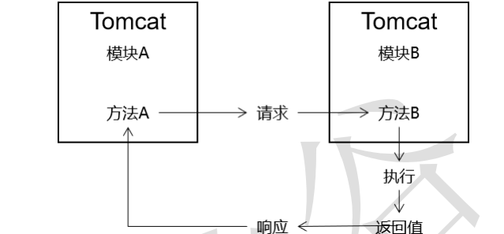
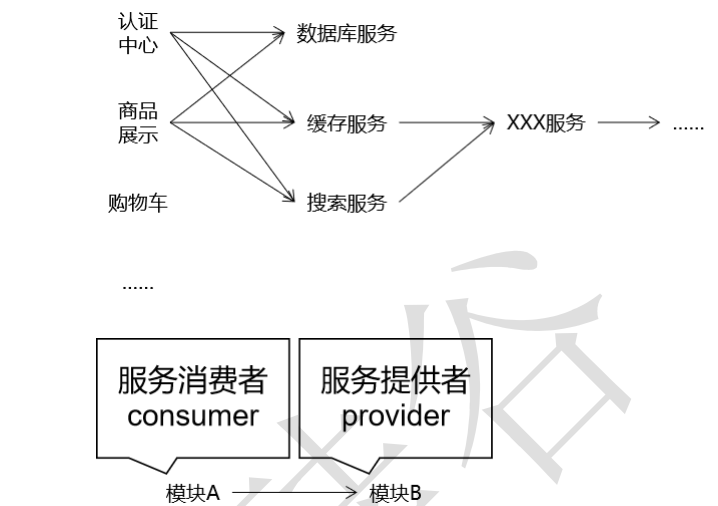
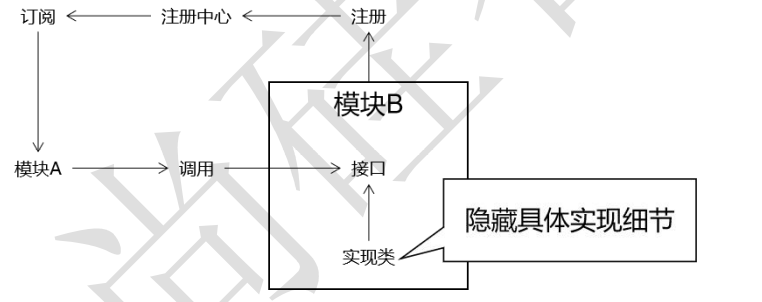

# 理论

## 架构

架构：架设项目的主体结构

- 实现业务功能的工程模块 。
- 为了应对业务功能之外的需求、压力给项目中增加的中间件等其他系统 。
- 为了让整个项目能够顺畅、高效的运行，需要把业务功能和中间件以及其他系统有机地整合起来。

单一架构（all in one、单机版）：一个工程 → 一个 war 包 → **运行在一个 Tomcat 上**

水平拆分单一架构：把原来的一个工程拆分成多个模块分别进行开发，一定程度上提高了模块化程 度。

垂直拆分单一架构：按照业务功能把项目拆分成多个模块工程，但是由于彼此之间不存在模块之间的调用，所以还不能算作一个真正的分布式架构。相当于把一个项目拆分成多个小 项目分别开发。

## 分布式理论

互联网时代：

- 高可扩：项目设计架构的时候要考虑到功能的持续更新。
- 高性能：提高响应速度，系统处理一个请求的时间尽可能短，减少用户等待的时间，优化用 户体验。
- 高并发：用户访问量非常大时，会增加系统的并发压力。

### **分布式概念：**

分布式架构：一个项目拆分成多个模块工程，每个模块工程都是一个 war 包，运行在各自的 Tomcat 上，模块之间可以通过网络互相调用。

### **方法远程调用：**

本地调用：在同一个项目内部，不经过网络直接调用方法。不管是我们自己声明的方法还 是第三方 jar 包中的方法都算本地调用。

远程调用：



- 对内：让我们能够实现分布式架构 
- 对外：让我们能够调用第三方接口 
  - 发送短信 
  - 查询物流 
  - 执行支付 
  - 天气预报 
  - 股票行情...

### **分布式思想：**

SOA（Service Oriented Architecture）： 面向服务的架构在整个系统中，把相同的功能抽取出来作为一个服务，供系统中的其他模块调 用，提高代码的复用性。



微服务：[Microservices (martinfowler.com)](https://martinfowler.com/articles/microservices.html)

```txt
Microservices
a definition of this new architectural term

The term "Microservice Architecture" has sprung up over the last few years to describe a particular way of designing software applications as suites of independently deployable services. While there is no precise definition of this architectural style, there are certain common characteristics around organization around business capability, automated deployment, intelligence in the endpoints, and decentralized control of languages and data.
```

微服务强调的特征：独立、可部署。


### **分布式技术演进：**

1.WebService

解决应用程序之间的跨平台访问问题。基于 SOAP/WSDL 协议，让应用程序之间可以进行远程通信。

（缺点：笨重，jar包很多，互相之间调用需要的代码复杂、调试困难）

2.Dubbo+Zookeeper

Dubbo：基于 RPC 的远程过程调用框架。Apache Dubbo是一款高性能的Java RPC框架。

Zookeeper：基于树形目录结构、异步通知机制的注册中心。


3.SpringBoot+SpringCloud

SpringBoot：开发具体微服务，使用“场景启动器（starter）”快速整合第三 方中间件。

SpringCloud，提供的微服务架构整体管理的一站式解决方案 ：

- Eureka：注册中心 
- Ribbon：客户端负载均衡 
- Feign：远程接口的声明式调用 
- Hystrix：服务的熔断、降级、监控 
- Zuul：网关

### 相关概念

**接口（实际上加上Java中的interface）：**

一个以“接口”为功能代表的分布式环境下的服务模块。

**远程接口的声明式调用：**

```java
@Controller
public class EmpController {
    // 远程接口
	@Autowired
	private EmpRemoteService empRemoteService;
	@RequestMapping("/xxx/xxx")
	public String xxx(){
		// 像调用本地方法一样调用远程方法。所有远程方法调用时产生的请求、响应等细节全部被框架屏蔽了
		empRemoteService.xxx();
		return "xxx";
	}
}
```

**注册中心：**

远程接口的声明式调用之所以能够实现，就是因为 Dubbo 或 Feign 这样的框架 把服务的具体信息存入了注册中心，对程序员在上层进行的具体代码编写全部屏蔽 细节。



### 优缺点

**优点：**

- 模块化程度更高，有利于分工 。
- 有利于提升项目性能 
  - 整体提升：整个项目中每个模块都可以独占一台服务器，整个项目分配到的服务 器资源更多。 
  - 局部提升：由于对项目进行了拆分，所以可以有针对性的对项目中局部的模块进 行专门的优化。
    - 纵向优化：给当前模块所在的服务器增加硬件资源；
    - 横向优化：给当前模块配置集群。

**缺点 ：**

- 结构复杂 ：
  - 调用关系复杂。
  - 部署复杂。
- 数据不一致问题：
  - Session 不一致问题。
  - 分布式事务问题。

### 分布式和集群

相同点：都需要用到多台服务器。

不同点：

- 分布式：每台服务器运行的模块不同---异构；
- 集群：每台服务器运行的模块相同。


