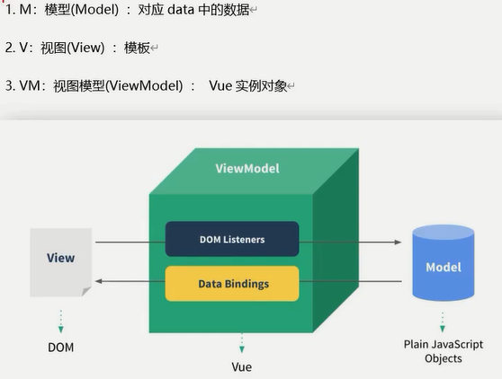
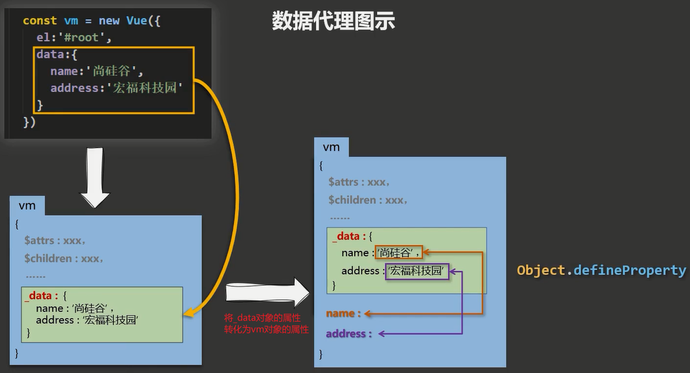
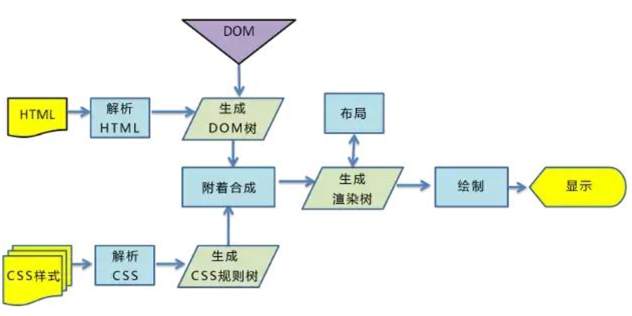
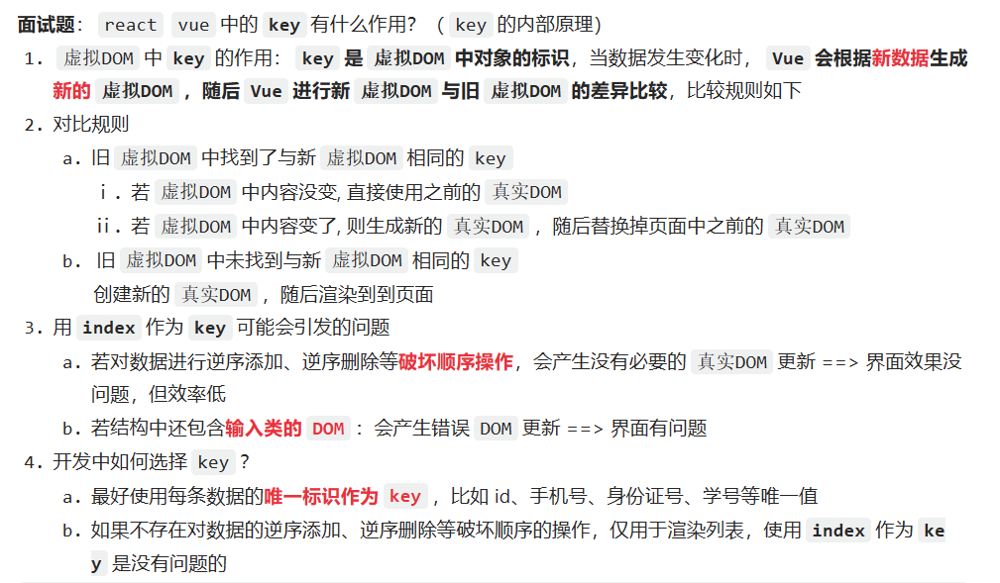

# Vue概述

Vue：构建用户界面的渐进式JavaScript框架。 （作用：将数据放于界面中展示，只关注如何进行数据展示；渐进式：逐渐、递进式地构建起应用，从轻量级简单应用到使用Vue插件构建起的复杂应用，自底向上逐层地实现引用）

特点：

1. 组件化。（结构、样式、交互都封装进一个.vue文件——组件——代码复用与便于维护）
2. 声明式编码。（只需声明，无需我们来直接操作DOM，开发效率提高）（what to do，声明好某处做什么，具体实现过程的逻辑已经进行封装，待运行时解析执行，表达与运行是分离的；命令式，how to do，表达了实现所需要的每一步，表达的也就是需要运行的）
3. 虚拟DOM + Diff算法。（数据转换为虚拟DOM后再转换为真实DOM，如果数据变化会使用 Diff算法 比较出变化的，再只将变化的转为真实DOM）

学习Vue前需要掌握的基础：ES6语法规范、ES6模块化、包管理器、原型和原型链、数组常用方法、axios、promise。

# Vue基础

## Vue开发环境与简单案例

Vue开发环境搭建：

1. 下载开发版的 vue.js。
2. 下载Vue的开发者工具 Vue Devtools，允许其访问文件URL。
3. 关闭提示：`Vue.config.productionTip = false;`。

简单案例：

```html
<html lang="en">
<head>
    <meta charset="UTF-8">
    <meta http-equiv="X-UA-Compatible" content="IE=edge">
    <meta name="viewport" content="width=device-width, initial-scale=1.0">
    <title>Document</title>
    <script src="../js/vue.js"></script>
</head>
<body>
    <!-- 容器 -->
    <div id="root">
        <h1>Hello {{name}}!</h1>
    </div>
    <script>
        Vue.config.productionTip = false;
        // vue示例  容器与vue实例是一一对应的关系
        const x = new Vue({
            el:'#root',
            data:{
                name:'vue',
                age:22
            }
        })
    </script>
</body>
</html>
```

实现分析：

1. 使用Vue实现功能，需要创建Vue实例，且Vue实例与容器是一对一的关系。
2. `{{xxx}}`是Vue的语法，里面所填是js表达式，`{{}}`里可以读取到Vue实例的data属性里的值，实际上，Vue实例的属性都可以读取到。
   - js表达式就是特殊的js代码（语句），其是能产生值的js代码，比如变量、算术表达式、三元表达式等。
   - data里面的最终成为Vue实例的属性。

3. 容器引用Vue实例内数据，容器数据也就随着容器内数据变化而变化。

## 模板语法

插值语法：`{{插值}}`——用于标签体内容，可以直接读取到vue实例的data属性中的所有值。

指令语法：用于标签（标签属性、标签体内容、绑定事件......），指令形式多以`v-????`的形式

```html
<body>
    <div id="root">
        <!-- :是v-bind:的简写形式 -->
        <a v-bind:href="url" :val="hello">我的首页</a>
        <a :href="inner.url" v-bind:val="inner.hello">我的首页</a>
    </div>
    <script>
        Vue.config.productionTip = false;
        new Vue({
            el:'#root',
            data:{
                url:'https://www.ilyd.top',
                hello:'oh',
                inner:{
                    url:'https://www.baidu.com',
                    hello:'HI'
                }
            }
        })
    </script>
</body>
```

## 数据绑定

两种数据绑定方式：（和vue实例的data绑定）

1. 单向绑定：`v-bind:`。
2. 双向绑定：`v-model:`，只能用于表单元素（可输入类元素）上。

```html
<div class="root">
	<input type="text" v-model:value="data1">
    <!-- 简写形式 -->
	<input type="text" v-model="data2">
</div>
```

## 容器绑定与data

除了在Vue实例里通过`el:`来绑定容器，还可以通过`v.$mount(' ')`来进行绑定：

```html
<div class="root">
    <input type="text" v-model:value="data1">
</div>
<script>
	const v = new Vue({
        data:{data1:'数据1'}
    });
    v.$mount('.root'); // mount——挂载
</script>
```

Vue实例中data的两种写法：

```html
<script>
    Vue.config.productionTip = false;
    new Vue({
        el:'#root',
        // 对象式
        data:{
            url:'https://www.ilyd.top',
            hello:'oh',
            inner:{
                url:'https://www.baidu.com',
                hello:'HI'
            }
        }
    })
</script>
```

```html
<script>
    Vue.config.productionTip = false;
    new Vue({
        el:'#root',  
        // 函数式，组件时必须使用函数式，此函数由vue实例调用，不要写成箭头函数，箭头函数没有this
        data:function(){
            return{
                url:'https://www.ilyd.top',
            	hello:'oh',
            	inner:{
                	url:'https://www.baidu.com',
                	hello:'HI'
            	}
            }
        }
        /* 简写
        data(){
        
        }
        */
    })
</script>
```

## MVVM模型

**什么是MVVM?**

MVVM是**Model-View-ViewModel**的缩写。MVVM是一种设计思想。Model代表的是模型，也可以在Model中定义数据修改和操作业务逻辑，View代表的是视图，他负责将数据模型转成UI显示出来，ViewModel是一个同步View和Model的对象。

在MVVM架构下，View和Model之间是没有直接的联系，而是通过ViewModel来进行交互，Model和ViewModel之间的交互是双向的，因此View数据变化会同步到Model中，而Model的数据也会同步到View上。

ViewModel通过双向数据绑定，把View层和Model层连接起来，而View和Model之间的同步工作是完全自动的，不需要人为干涉，因此开发者只需要关注业务逻辑，不需要动手操作Dom，不需要关注数据状态的同步问题。复杂的数据状态维护完全由MVVM来统一管理。

**MVVM和MVC的区别？**

MVVM个MVC的区别其实不大。都是一种设计思想。主要是MVC中的controller演变成MVVM中的ViewModel。

MVVM主要解决了MVC大量的DOM操作使得页面渲染性能降低，加载的速度变慢，影响用户的体验，当Model频繁变化的时候，开发者需要主动更新View。

**Vue的优点：**

1. 低耦合。视图的View可以独立于Model变化和修改，一个ViewModel可以绑定到不同的View上，当View需要被修改的时候，不用动到Model的内容，当Model需要修改的时候，不用动到View的内容。
2. 可重用性。可以把一些视图逻辑放在一个ViewModel里面，让更多的View重用这段视图逻辑。
3. 独立开发。开发人员可以专注于业务逻辑和数据的开发，设计人员可以专注于页面的设计。
4. 可测试。界面素来比较难测试，但是现在测试可以针对ViewModel来进行编写。

Vue借鉴了MVVM思想：



## 数据代理

Object.defineProperty()方法：为对象添加属性。

```html
<script>
    let person = {
        name:'陆拾陆',
        sex:'男'
    };
    Object.defineProperty(person,'age',{
        value:19,        // 值
        enumerable:true, // 属性是否可被枚举 默认false
        writable:true,   // 属性是否能修改 默认false
        configurable:true // 是否能删除  默认false
    });
</script>
```

```html
<script>
    let num = 22;
    let person = {
        name:'陆拾陆',
        sex:'男'
    };
    Object.defineProperty(person,'age',{
        // 当读取person对象的age属性时就会调用get函数(我们称为getter)，并且返回值就是age的值
        // person.age时会被调用
        get:function(){
            return num;
        },
        // 当修改了person对象的age属性时就会调用set函数(我们称为setter)，且收到修改的具体值
        // person.age = 12 时会被调用
        set(value){
            console.log(value)
            num = value
        }
    });
</script>
```

数据代理：通过一个对象代理对另一个对象的读写操作。

```html
<script>
    // 数据代理，通过一个对象可以对另一个对象进行读写操作
    let obj1 = {x:100};
    let obj2 = {y:200};
    // 对obj2的x属性修改、读取都是对obj1的x的修改与读取
    Object.defineProperty(obj2,'x',{
        get(){
            return obj1.x;
        },
        set(value){
            obj1.x = value;
        }
    });

</script>
```

Vue中的数据代理——方便操作data中数据：

- 原理：通过 Object.defineProperty() 把data对象中的所有属性添加到Vue实例对象中，并为每一个添加上去的属性都指定getter、setter。



## 事件处理

### Vue中事件的使用与注意事项：

1. 使用`v-on:xxx`或`@xxx`（简写形式）绑定事件，其中 xxx 是事件名称。
2. 事件的回调需要配置在methods对象中，最终会在vm上。
3. methods中配置的函数，不要用箭头函数，否则 this 就不是vm了。
4. methods中配置的函数，都是被 Vue所管理的函数，this 的指向是vm或组件实例对象。
5. `@click="demo"`和`@click="demo($event)"`效果一致，但后者可以传参。

```html
<body>
    <div class="root">
        <button v-on:click="showInfo1">事件一，无传参</button>
        <button @click="showInfo2(6,$event)">事件二，有传参</button>
    </div>
    <script>
        Vue.config.productionTip = false;
        new Vue({
            el:'.root',
            data:{
                title:'事件的简单使用'
            },
            // 事件触发后的回调函数
            methods:{
                showInfo1(){
                    console.log('事件一被触发')
                },
                showInfo2(num,event){
                    console.log('事件二被触发');
                    console.log('num：' + num + "event：" + event.target);
                }
            }
        });
    </script>
</body>
```

### Vue中事件的修饰符：

1. prevent：阻止默认事件（常用）。
2. stop：阻止事件冒泡（常用）。
3. once：使事件只触发一次（常用）。
4. capture：使用事件的捕获模式。
5. self：只有event.target是当前操作的元素时才触发事件。
6. passive：事件的默认行为立即执行，无需等待事件回调执行完毕。
7. 修饰符可以连续写，比如可以这么用：`@click.prevent.stop="showInfo"`。

```html
<!-- 使用示例 -->
<div class="root">
    <a href="https://www.ilyd.top" @click.prevent>取消默认的点击链接时的跳转行为</a>
</div>
<script>
	new Vue({
        el:'.root'
    });
</script>
```

```html
<!-- self：只有event.target是当前操作的元素时才触发事件 -->
<div class="demo1" @click.self="showInfo">
    <button @click="showInfo">点我提示信息</button>
</div>
```

```html
<!-- 事件的默认行为立即执行，无需等待事件回调执行完毕 -->
<!-- scroll是滚动条滚动事件，passsive对其没有影响 -->
<!-- wheel是鼠标滚轮滚动事件，passive对其有影响 -->
<ul @wheel.passive="demo" class="list">
    <li>1</li>
    <li>2</li>
    <li>3</li>
    <li>4</li>
</ul>
<!-- 设置了 @wheel.passive后优先响应滚轮滚动，再执行demo -->
demo() {
	for (let i = 0; i < 100000; i++) {
		console.log('#')
	}
	console.log('累坏了')
}
```

### 键盘事件：

1、键盘上的每个按键都有自己的名称和编码，例如：Enter（13）。而Vue还对一些常用按键起了别名方便使用：

| 别名     | 说明                          |
| -------- | ----------------------------- |
| `enter`  | 回车键                        |
| `delete` | 删除，捕获“删除”和“退格”键    |
| `esc`    | 退出键                        |
| `space`  | 空格键                        |
| `tab`    | 换行键，必须配合keydown去使用 |
| `up`     | 上箭头键                      |
| `down`   | 下箭头键                      |
| `left`   | 左箭头键                      |
| `right`  | 右箭头键                      |

```html
<!-- 回车键释放时触发test回调函数 -->
<input type="text" @keyup.enter="test"> 
```

2、Vue未提供别名的按键，可以使用按键原始的key值去绑定，但注意要转为kebab-case（多单词小写短横线写法 ，例如NumLock键就是`num-lock`、 CapsLock键就是`caps-lock`。

3、系统修饰键（它们的用法特殊）：ctrl、alt、shift、meta（meta就是win键）

- 配合`keyup`使用：按下修饰键的同时，再按下其他键，随后释放其他键，事件才被触发。（示例：实现`ctrl+ y `触发——`@keyup.ctrl.y`）
- 配合`keydown`使用，则是正常触发事件。

4、也可以使用keyCode去指定具体的按键**（不推荐）**：例如`@keyup.13="xxx"`就是`@keyup.enter="xxx"`。（keyCode已被废弃，虽然有些浏览器仍然支持）

5、定制按键别名：`Vue.config.keyCodes.自定义键名 = 键码`。

```js
Vue.config.keyCodes.huiche = 13		// 定义回车按键的别名为 huiche
```

## 计算与侦听属性

### 计算属性

1. 定义：要用的属性不存在，要通过**Vue对象已有属性**计算得来。
2. 原理：底层借助了Objcet.defineProperty方法提供的getter和setter。
3. get函数什么时候执行？
   1. 初次读取时会执行一次
   2. 当依赖的数据发生改变时会被再次调用
4. 优势：与methods实现相比，内部有缓存机制（复用），效率更高，调试方便。
5. 备注：
   1. 计算属性最终会出现在vm上，直接读取使用即可。
   2. 如果计算属性要被修改，那必须写set函数去响应修改，且set中要引起计算时依赖的数据发生改变。
   3. 如果计算属性确定不考虑修改，可以使用计算属性的简写形式。

```html
<body>
    <div class="root">
        姓：<input type="text" v-model="firstName">
        名：<input type="text" v-model="lastName">
        <br>
        姓名：<span>{{fullname}}</span>
    </div>
    <script>
        Vue.config.productionTip = false;
        let vm = new Vue({
            el:'.root',
            data:{
                firstName:'张',
                lastName:'三'
            },
            // 计算属性
            computed:{
                fullname:{
                    // 计算属性的属性值会被缓存
                    // 当初次读取fullname时，或者fullname所依赖的数据发生改变时，该方法就会被调用
                    get(){
                        return this.firstName + '-' + this.lastName;
                    },
                    // set不是必须的，当fullname被修改时就会被调用
                    set(value){
                        const arr = value.split('-');
                        this.firstName = arr[0];
                        this.lastName = arr[1];
                    }
                }
            }
        });
    </script>
</body>
```

不考虑修改，使用计算属性的简写形式：

```html
<script>
    Vue.config.productionTip = false;
    let vm = new Vue({
        el:'.root',
        data:{
            firstName:'张',
            lastName:'三'
        },
        // 计算属性
        computed:{
            fullname(){
                return this.firstName + '-' + this.lastName;
            }
        }
    });
</script>
```


### 监视（侦听）属性

**监视属性watch：**

1. 当被监视的属性变化时，回调函数自动调用相关函数来进行相关操作。
2. 监视的属性在Vue实例中必须存在才能进行监视，既可以监视data的，也可以监视计算属性。
3. 配置项属性`immediate:false`，改为 true，则初始化时会调用一次`handler(newValue,oldValue)`，否则初始化时不会调用，当监视的属性变化时才会调用。
4. 监视的两种写法：
   1. new Vue时传入watch配置。
   2. 通过`vm.$watch`监视。

监视属性的使用示例——使用watch配置项：

```html
<body>
    <div id="root">
        <h2>今天天气很{{info}}</h2>
        <button @click="changeWeather">切换天气</button>
    </div>
    <script>
        const vm = new Vue({
            el: '#root',
            data: {
                isHot: true,
            },
            computed: {
                // 计算属性 info
                info() {
                    return this.isHot ? '炎热' : '凉爽'
                }
            },
            methods: {
                // 点击事件的回调方法
                changeWeather() {
                    this.isHot = !this.isHot
                }
            },
            watch: {
                // 监视属性 isHot
                isHot: {
                    // 改为true表示初始化时就让handler调用一下，否则就是当监视属性变化时才调用
                    immediate: true,
                    // handler什么时候调用？当isHot发生改变时。
                    handler(newValue, oldValue) {
                        console.log('isHot被修改了', newValue, oldValue)
                    }
                }
            }
        })
    </script>
</body>
```

监视属性的使用示例——通过`vm.$watch`：

```html
<body>
    <div id="root">
        <h2>今天天气很{{info}}</h2>
        <button @click="changeWeather">切换天气</button>
    </div>
    <script>
        const vm = new Vue({
            el: '#root',
            data: {
                isHot: true,
            },
            computed: {
                // 计算属性 info
                info() {
                    return this.isHot ? '炎热' : '凉爽'
                }
            },
            methods: {
                // 点击事件的回调方法
                changeWeather() {
                    this.isHot = !this.isHot
                }
            },
        })
        vm.$watch('isHot', {
            // 改为true表示初始化时就让handler调用一下，否则就是当监视属性变化时才调用
            immediate: true,
            // handler什么时候调用？当isHot发生改变时。
            handler(newValue, oldValue) {
                console.log('isHot被修改了', newValue, oldValue)
            }
        })
    </script>
</body>
```

### 深度监视

Vue中的watch默认不监测对象内部值的改变，只会监视整个对象，当整个对象发生改变时才触发监视。

如果要监视对象内部某个属性，可以这样做：

```html
<body>
    <div id="root">
        <h2>今天天气很{{info}}</h2>
        <button @click="changeWeather">切换天气</button>
        <button @click="change">监听obj</button>
    </div>
    <script>
        const vm = new Vue({
            el: '#root',
            data: {
                obj:{a:1,b:2}
            },
            methods: {
                change(){
                    this.obj.a=3;
                }
            },
        })
        // 监视obj对象的a属性
        vm.$watch('obj.a',{
            handler(newValue, oldValue) {
                console.log('obj对象内的属性a被修改了', newValue, oldValue)
            }
        })
    </script>
</body>
```

如果要监视对象内部所有属性，可以这样做：（添加deep）

```js
// 监视obj对象的所有属性
vm.$watch('obj.a',{
    // 添加depp
    deep:true,
	handler(newValue, oldValue) {
		console.log('obj对象内的属性a被修改了', newValue, oldValue)
	}
})
```

### computed与watch的区别

watch能完成的功能 >= computed能完成的功能，能使用computed的就使用computed，有异步任务只能使用watch（定时器等，watch是对已有属性操作）。


Vue实例中函数的两个重要的小原则：

1. 所被Vue管理的函数，最好写成普通函数，这样this的指向才是vm 或 组件实例对象。

2. 所有不被Vue所管理的函数（定时器的回调函数、ajax的回调函数等、Promise的回调函数），最好写成箭头函数，这样this的指向才是vm 或 组件实例对象。

## 样式绑定

### class样式绑定

利用数据绑定，`:class=“xxx”`，xxx可以是字符串、对象、数组。

**字符串写法：**（样式的类名不确定，需要动态指定类名的情况）

```html
<div id="root">
    <div class="basic" :class="mood" @click="changeMood">{{name}}</div>
</div>
<script>
	const vm = new Vue({
        el:'#root',
        data:{
            name:'xxx',
            mood:'normal'
        },
        methods:{
            changeMood(){
                this.mood=xxx;
            }
        }
    })
</script>
```

**数组写法：**（要绑定多个样式，个数不确定，名字也不确定）

```html
<div id="root">
	<div class="basic" :class="classArr">{{name}}</div>
</div>

<script>
	const vm = new Vue({
        el:'#root',
        data:{
            name:'xxx',
            // 操作数组来实现class里的个数、名称
            classArr: ['style1','style2','style3']
       }
    })
</script>
```

**对象写法：**（要绑定多个样式，个数确定，名字也确定，但不确定用不用）

```html
<div id="root">
	<div class="basic" :class="classObj">{{name}}</div>
</div>

<script>
	const vm = new Vue({
        el:'#root',
        data:{
            name:'xxx',
            classObj:{
                style1:false,
                style2:true
			}
        }
    })
</script>
```

### 行内style样式绑定

对象写法：

```html
<div id="root">
    <div class="basic" :style="styleObj">{{name}}</div>
</div>
<script>
    const vm = new Vue({
        el:'#root',
        data:{
            styleObj:{
                fontSize: '40px',
                color:'red',
            }
        }
    })
</script>
```

数组写法：

```html
<div id="root">
    <div class="basic" :style="styleArr">{{name}}</div>
</div>
<script>
    const vm = new Vue({
        el:'#root',
        data:{
            styleArr:[
                {
                    fontSize: '40px',
                    color:'blue',
                },
                {
                    backgroundColor:'gray'
                }
            ]
        }
    })
</script>
```

## 条件渲染

1. `v-if="表达式"`：如果表达式成立就显示当前元素，不成立就不显示，DOM的元素会移除或添加。
2. `v-else="表达式"`：可以与`v-if="表达式"`结合使用，相当于if-else。
3. `v-else-if`：可以与`v-if="表达式"`结合使用，相当于if-else if；可以与`v-else="表达式"`使用，相当于else if-else。
4. 使用场景：会对DOM进行操作，使用频率低的场景使用。

```html
<div id="root">
    <!-- 使用v-if做条件渲染 -->
    <h2 v-if="false">欢迎来到{{name}}</h2>
    <h2 v-if="1 === 1">欢迎来到{{name}}</h2>
    
    <!-- v-else和v-else-if -->
    <div v-if="n === 1">Angular</div>
    <div v-else-if="n === 2">React</div>
    <div v-else-if="n === 3">Vue</div>
    <div v-else>哈哈</div>
    
    <!-- v-if与template的配合使用 -->
    <!-- 就不需要写好多个判断，写一个就行 这里的思想就像事件代理的使用 -->
    <!-- template标签不影响结构，页面html中不会有此标签，但其只能配合v-if使用 -->
    <template v-if="n === 1">
        <h2>你好</h2>
        <h2>尚硅谷</h2>
        <h2>北京</h2>
    </template>
</div>

<script>
	const vm = new Vue({
        el:'#root',
        data:{
            styleArr:[
                {
                    fontSize: '40px',
                    color:'blue',
                },
                {
                    backgroundColor:'gray'
                }
            ]
        }
    })
</script>
```

`v-show="表达式"`：不展示的DOM元素未被移除，仅仅是使用样式隐藏掉（display:none），因此适用于切换频率较高的场景

```html
<div id="root">
    <!-- 使用v-show做条件渲染 -->
    <!-- 隐藏 -->
    <h2 v-show="false">欢迎来到{{name}}</h2>
    <!-- 显示 -->
    <h2 v-show="1 === 1">欢迎来到{{name}}</h2>
</div>
```

## 列表渲染

### v-for

**（类似for-in遍历，用于展示列表数据）**

1. 语法一：`v-for="obj of objs" :key="xxx"`，遍历objs将里面的值取出到obj，并且为当前节点添加一个身份标识key。
2. 语法二：`v-for="(obj,index) of objs" :key="index"`，括号第二个就是遍历的对象的唯一标识，是自增的自然数，此时可以不指定`:key`，或者前面括号不指定index。
3. 可用于：数组、对象、字符串（用的很少）、指定次数（用的很少）。

```html
<title>基本列表</title>
<script type="text/javascript" src="../js/vue.js"></script>
<div id="root">
    <!-- 遍历数组 -->
    <h3>人员列表（遍历数组）</h3>
    <ul>
        <li v-for="(p,index) of persons" :key="index">{{ p.name }}-{{ p.age }}</li>
    </ul>
    <!-- 遍历对象 -->
    <h3>汽车信息（遍历对象）</h3>
    <ul>
        <!-- 括号内第一个是属性值，第二个是属性名称  可以使用属性名称当做key -->
        <li v-for="(value,k) of car" :key="k">{{ value }}--{{ k }}</li>
    </ul>

    <!-- 遍历字符串 -->
    <h3>测试遍历字符串（用得少）</h3>
    <ul>
        <li v-for="(char,index) of str" :key="index">{{ char }}-{{ index }}</li>
    </ul>

    <!-- 遍历指定次数 -->
    <h3>测试遍历指定次数（用得少）</h3>
    <ul>
        <li v-for="(number,index) of 5" :key="index">{{ number }}--{{ index }}</li>
    </ul>
</div>

<script type="text/javascript">
    Vue.config.productionTip = false
    new Vue({
        el: '#root',
        data: {
            persons: [
                { id: '001', name: '张三', age: 18 },
                { id: '002', name: '李四', age: 19 },
                { id: '003', name: '王五', age: 20 }
            ],
            car: {
                name: '奥迪A8',
                price: '70万',
                color: '黑色'
            },
            str: 'hello'
        }
    })
</script>
```

**react、vue中key的作用：**

1. 虚拟DOM中的key有什么作用？（key的内部原理）
   key是虚拟DOM对象的标识，当状态中数据发生变化，vue会根据新数据生成新的虚拟DOM，随后Vue进行新虚拟DOM和旧虚拟DOM的差异比较：

   1. 旧虚拟DOM找到和新虚拟DOM相同的key，再进行内容比较：

      ①.虚拟DOM中内容不变部分则直接使用之前的真实DOM。

      ②.若虚拟DOM中某部分内容改变了，则为该部分生成新的真实DOM，随后替换页面中之前的该部分的真实DOM。

   2. 若没有找到相同的key，则直接创建真实DOM。随后渲染到页面。

2. 使用index作为key可能引发的问题：

   1. 若对数据进行逆序添加、逆序删除等破坏顺序的操作，会产生没有必要的真实DOM更新，虽然不响应页面效果但效率低。
   2. 如果结构中还包括输入类的DOM，那就会导致产生错误的DOM更新，导致页面效果出现偏差。

3. 如何选择key？

   1. 每条数据的唯一标识（例如id、手机号、学号等）。
   2. 不存在对数据的逆序添加、逆序删除等操作，仅用于展示数据，那可以使用index。

### 真实DOM与虚拟DOM

[深入剖析：Vue核心之虚拟DOM - 掘金 (juejin.cn)](https://juejin.cn/post/6844903895467032589)

啥是真实 DOM？真实 DOM 和 虚拟 DOM 有啥区别？如何用代码展现真实 DOM 和 虚拟 DOM



所有的浏览器渲染引擎工作流程大致分为5步：`1、创建 DOM树 ==> 2、创建 Style Rules ==> 3、构建Render树 ==> 4、布局Layout ==> 5、绘制Painting`。

1. 第一步，构建 DOM 树：当浏览器接收到来自服务器响应的HTML文档后，会遍历文档节点，生成DOM树。需要注意的是在DOM树生成的过程中有可能会被CSS和JS的加载执行阻塞，渲染阻塞：
   - 渲染阻塞：当浏览器遇到一个script标签时，DOM构建将暂停，直到脚本加载执行，然后继续构建DOM树。每次去执行Javascript脚本都会严重阻塞DOM树构建，如果JavaScript脚本还操作了CSSOM，而正好这个CSSOM没有下载和构建，那么浏览器甚至会延迟脚本执行和构建DOM，直到这个CSSOM的下载和构建。所以，script标签引入很重要，实际使用时可以遵循下面两个原则：
     - css优先：引入顺序上，css资源先于js资源
     - js后置：js代码放在底部，且js应尽量少影响DOM构建
     - 补充——当解析html时，会把新来的元素插入dom树里，同时去查找css，然后把对应的样式规则应用到元素上，查找样式表是按照从右到左的顺序匹配的例如：`div p { … }`，会先寻找所有p标签并判断它的父标签是否为div之后才决定要不要采用这个样式渲染。所以平时写css尽量用`class`或者`id`，不要过度层叠。
2. 第二步，生成样式表：用 CSS 分析器，分析 CSS 文件和元素上的 inline 样式，生成页面的样式表；

3. 第三步，构建渲染树：通过DOM树和CSS规则我们可以构建渲染树。浏览器会从DOM树根节点开始遍历每个可见节点(注意是可见节点)对每个可见节点，找到其适配的CSS规则并应用。渲染树构建完后，每个节点都是可见节点并且都含有其内容和对应的规则的样式。这也是渲染树和DOM树最大的区别所在。渲染是用于显示，那些不可见的元素就不会在这棵树出现了。除此以外，display none的元素也不会被显示在这棵树里。visibility hidden的元素会出现在这棵树里。

4. 第四步，渲染布局：布局阶段会从渲染树的根节点开始遍历，然后确定每个节点对象在页面上的确切大小与位置，布局阶段的输出是一个盒子模型，它会精确地捕获每个元素在屏幕内的确切位置与大小。

5. 第五步，渲染树绘制：在绘制阶段，遍历渲染树，调用渲染器的paint()方法在屏幕上显示其内容。渲染树的绘制工作是由浏览器的UI后端组件完成的。


**注意点：**

1、DOM 树的构建是文档加载完成才开始的？ 并不是，构建 DOM 树是一个渐进过程，为达到更好的用户体验，渲染引擎会尽快将内容显示在屏幕上，它不必等到整个 HTML 文档解析完成之后才开始构建 render 树和布局。

2、Render 树是 DOM 树和 CSS 样式表构建完毕后才开始构建的？ 这三个过程在实际进行的时候并不是完全独立的，而是会有交叉，会一边加载，一边解析，以及一边渲染。

3、CSS 的解析注意点？ CSS 的解析是从右往左逆向解析的，嵌套标签越多，解析越慢。

**4、JS 操作真实 DOM 的代价？**传统DOM结构操作方式对性能的影响很大，原因是频繁操作DOM结构 会引起页面的重排(reflow)和重绘(repaint)，浏览器不得不频繁地计算布局，重新排列和绘制页面元素，导致浏览器产生巨大的性能开销。直接操作真实DOM的性能特别差，我们可以来演示一遍。

```html
<div id="app"></div>
<script>
    // 获取 DIV 元素
    let box = document.querySelector('#app');
    console.log(box);

    // 真实 DOM 操作
    console.time('a');
    for (let i = 0; i <= 10000; i++) {
        box.innerHTML = i;
    }
    console.timeEnd('a');

    // 虚拟 DOM 操作
    let num = 0;
    console.time('b');
    for (let i = 0; i <= 10000; i++) {
        num = i;
    }
    box.innerHTML = num;
    console.timeEnd('b');
</script>
```

虚拟 DOM 的好处:

虚拟 DOM 就是为了解决浏览器性能问题而被设计出来的。如前，若一次操作中有 10 次更新 DOM 的动作，虚拟 DOM 不会立即操作 DOM，而是将这 10 次更新的 diff 内容保存到本地一个 JS 对象中，最终将这个 JS 对象一次性 attch 到 DOM 树上，再进行后续操作，避免大量无谓的计算量。所以，用 JS 对象模拟 DOM 节点的好处是，页面的更新可以先全部反映在 JS 对象(虚拟 DOM )上，操作内存中的 JS 对象的速度显然要更快，等更新完成后，再将最终的 JS 对象映射成真实的 DOM，交由浏览器去绘制。

虽然这一个虚拟 DOM 带来的一个优势，但并不是全部。虚拟 DOM 最大的优势在于抽象了原本的渲染过程，实现了跨平台的能力，而不仅仅局限于浏览器的 DOM，可以是安卓和 IOS 的原生组件，可以是近期很火热的小程序，也可以是各种GUI。

 回到最开始的问题，虚拟 DOM 到底是什么，说简单点，就是一个普通的 JavaScript 对象，包含了 tag、props、children 三个属性。




### 列表过滤

使用watch实现：

```html
<div id="root">
  <h2>人员列表</h2>
  <input type="text" placeholder="请输入名字" v-model="keyWord">
  <ul>
    <li v-for="(p,index) of filPersons" :key="p.id">
      {{ p.name }}-{{ p.age }}-{{ p.sex }}
    </li>
  </ul>
</div>

<script type="text/javascript">
  Vue.config.productionTip = false
  // 用 watch 实现 
   new Vue({
			el: '#root',
			data: {
				keyWord: '',
				persons: [
					{ id: '001', name: '马冬梅', age: 19, sex: '女' },
					{ id: '002', name: '周冬雨', age: 20, sex: '女' },
					{ id: '003', name: '周杰伦', age: 21, sex: '男' },
					{ id: '004', name: '温兆伦', age: 22, sex: '男' }
				],
				filPersons: []
			},
			watch: {
				keyWord: {
					immediate: true,
					handler(val) {
                        // 注意:indexOf对于空串的结果是0，这样上面代码初始过滤就是全部数据
						this.filPersons = this.persons.filter((p) => {
							return p.name.indexOf(val) !== -1
						})
					}
				}
			}
		}) 
</script>
```

使用computed实现：

```html
<div id="root">
    <h2>人员列表</h2>
    <input type="text" placeholder="请输入名字" v-model="keyWord">
    <ul>
        <li v-for="(p,index) of filPersons" :key="p.id">
            {{ p.name }}-{{ p.age }}-{{ p.sex }}
        </li>
    </ul>
</div>

<script type="text/javascript">
    Vue.config.productionTip = false
    // 用 computed 实现
    new Vue({
        el: '#root',
        data: {
            keyWord: '',
            persons: [
                { id: '001', name: '马冬梅', age: 19, sex: '女' },
                { id: '002', name: '周冬雨', age: 20, sex: '女' },
                { id: '003', name: '周杰伦', age: 21, sex: '男' },
                { id: '004', name: '温兆伦', age: 22, sex: '男' }
            ]
        },
        computed: {
            filPersons() {
                return this.persons.filter((p) => {
                    return p.name.indexOf(this.keyWord) !== -1
                })
            }
        }
    }) 
</script>
```


### 列表排序

有时为了减少服务器压力，能在前端做的尽量在前端做。

```html
<div id="root">
  <h2>人员列表</h2>
  <input type="text" placeholder="请输入名字" v-model="keyWord">
  <button @click="sortType = 2">年龄升序</button>
  <button @click="sortType = 1">年龄降序</button>
  <button @click="sortType = 0">原顺序</button>
  <ul>
    <li v-for="(p,index) of filPersons" :key="p.id">
      {{p.name}}-{{p.age}}-{{p.sex}}
      <input type="text">
    </li>
  </ul>
</div>

<script type="text/javascript">
  Vue.config.productionTip = false
  new Vue({
    el: '#root',
    data: {
      keyWord: '',
      sortType: 0, // 0原顺序 1降序 2升序
      persons: [
        { id: '001', name: '马冬梅', age: 30, sex: '女' },
        { id: '002', name: '周冬雨', age: 31, sex: '女' },
        { id: '003', name: '周杰伦', age: 18, sex: '男' },
        { id: '004', name: '温兆伦', age: 19, sex: '男' }
      ]
    },
    computed: {
      filPersons() {
        const arr = this.persons.filter((p) => {
          return p.name.indexOf(this.keyWord) !== -1
        })
        //判断一下是否需要排序
        if (this.sortType) {
          arr.sort((p1, p2) => {
            return this.sortType === 1 ? p2.age - p1.age : p1.age - p2.age
          })
        }
        return arr
      }
    }
  })
</script>
```

## Vue数据监视原理

数据改变了但Vue并没有监测到数据已经发生改变的案例：

```html
<!-- 准备好一个容器-->
<div id="root">
    <h2>人员列表</h2>
    <button @click="updateMei">更新马冬梅的信息</button>
    <ul>
        <li v-for="(p,index) of persons" :key="p.id">
            {{p.name}}-{{p.age}}-{{p.sex}}
        </li>
    </ul> 
</div>
<script type="text/javascript">
    Vue.config.productionTip = false
    const vm = new Vue({
        el:'#root',
        data:{
            persons:[
                {id:'001',name:'马冬梅',age:30,sex:'女'},
                {id:'002',name:'周冬雨',age:31,sex:'女'},
                {id:'003',name:'周杰伦',age:18,sex:'男'},
                {id:'004',name:'温兆伦',age:19,sex:'男'}
            ]
        },
        methods: {
            updateMei(){
                // this.persons[0].name = '马老师';  //奏效
                // this.persons[0].age = 50;        //奏效
                // this.persons[0].sex = '男';      //奏效
                // persons的数据被改变了，但Vue没有监测到，导致页面数据更新不奏效
                this.persons[0] = {id:'001',name:'马老师',age:50,sex:'男'};
                // this.persons.splice(0,1,{id:'001',name:'马老师',age:50,sex:'男'}); // 奏效
            }
        }
    }) 
</script>
```

**Vue监测对象的原理：**

Vue实例里的data，进行加工后再转为_data，对数据的监测依赖于getter、setter，只要数据更改就会触发更新。简单模拟对象监测：

```html
<script>
    let data = {
        name: '尚硅谷',
        address: '北京',
    };
    // vue也有一个Observer
    function Observer(obj) {
        // 汇总对象中所有的属性形成一个数组
        const keys = Object.keys(obj)
        // 遍历
        keys.forEach((k) => {
            Object.defineProperty(this, k, {
                get() {
                    return obj[k]
                },
                set(val) {
                    console.log(`${k}被改了，我要去解析模板，生成虚拟DOM.....我要开始忙了`)
                    obj[k] = val
                }
            })
        })
    }
    // 创建一个监视的实例对象，用于监视data中属性的变化
    const obs = new Observer(data);
    console.log(obs);
    // 准备一个vm实例对象
    let vm = {};
    vm._data = data = obs;
</script>
```


# vue-cli


# vue-router


# vuex


# element-ui


# vue3
