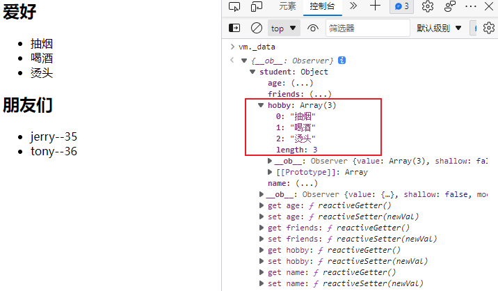
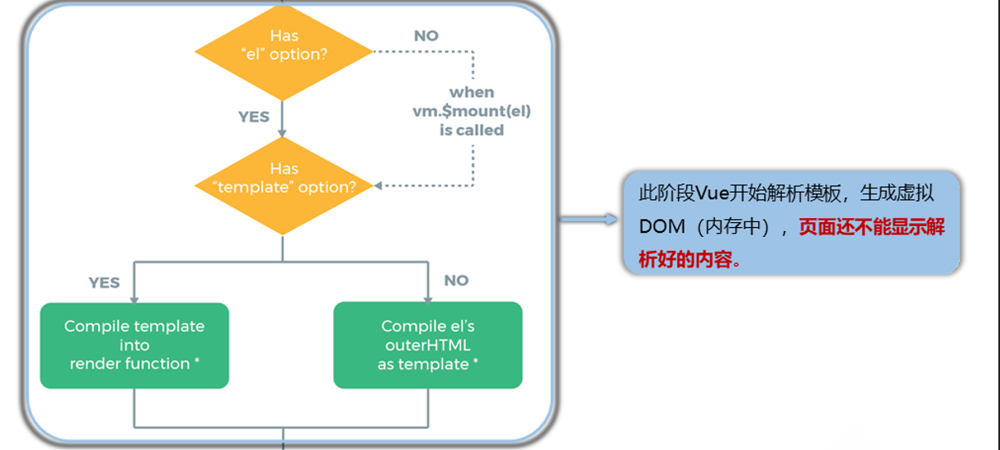

# Vue概述

Vue：构建用户界面的渐进式JavaScript框架。 （作用：将数据放于界面中展示，只关注如何进行数据展示；渐进式：逐渐、递进式地构建起应用，从轻量级简单应用到使用Vue插件构建起的复杂应用，自底向上逐层地实现引用）

特点：

1. 组件化。（结构、样式、交互都封装进一个.vue文件——组件——代码复用与便于维护）
2. 声明式编码。（只需声明，无需我们来直接操作DOM，开发效率提高）（what to do，声明好某处做什么，具体实现过程的逻辑已经进行封装，待运行时解析执行，表达与运行是分离的；命令式，how to do，表达了实现所需要的每一步，表达的也就是需要运行的）
3. 虚拟DOM + Diff算法。（数据转换为虚拟DOM后再转换为真实DOM，如果数据变化会使用 Diff算法 比较出变化的，再只将变化的转为真实DOM）

学习Vue前需要掌握的基础：ES6语法规范、ES6模块化、包管理器、原型和原型链、数组常用方法、axios、promise。

# Vue核心基础

## Vue开发环境与简单案例

Vue开发环境搭建：

1. 下载开发版的 vue.js。
2. 下载Vue的开发者工具 Vue Devtools，允许其访问文件URL。
3. 关闭提示：`Vue.config.productionTip = false;`。

简单案例：

```html
<body>
    <!-- 容器 -->
    <div id="root">
        <h1>Hello {{name}}!</h1>
    </div>
    <script src="../js/vue.js"></script>
    <script>
        Vue.config.productionTip = false;
        // vue示例  容器与vue实例是一一对应的关系
        const x = new Vue({
            el:'#root',
            data:{
                name:'vue',
                age:22
            }
        })
    </script>
</body>
</html>
```

实现分析：

1. 使用Vue实现功能，需要创建Vue实例，且Vue实例与容器是一对一的关系。
2. `{{xxx}}`是Vue的语法，里面所填是js表达式，`{{}}`里可以读取到Vue实例的data属性里的值，实际上，Vue实例的属性都可以读取到。
   - js表达式就是特殊的js代码（语句），其是能产生值的js代码，比如变量、算术表达式、三元表达式等。
   - data里面的最终成为Vue实例的属性。

3. 容器引用Vue实例内数据，容器内数据也就随着Vue实例内数据变化而变化，Vue内数据变化会导致容器重新更新解析。

## 数据与容器

### 模板语法

插值语法：`{{插值}}`——用于标签体内容，可以直接读取到vue实例的data属性中的所有值。

指令语法：用于标签（标签属性、标签体内容、绑定事件......），指令形式多以`v-????`的形式

```html
<body>
    <div id="root">
        <!-- :是v-bind:的简写形式 -->
        <a v-bind:href="url" :val="hello">我的首页</a>
        <a :href="inner.url" v-bind:val="inner.hello">我的首页</a>
    </div>
    <script>
        Vue.config.productionTip = false;
        new Vue({
            el:'#root',
            data:{
                url:'https://www.ilyd.top',
                hello:'oh',
                inner:{
                    url:'https://www.baidu.com',
                    hello:'HI'
                }
            }
        })
    </script>
</body>
```

### 数据绑定

两种数据绑定方式：（和vue实例的data绑定）

1. 单向绑定：`v-bind:`。
2. 双向绑定：`v-model:`，只能用于表单元素（可输入类元素）上。

```html
<div class="root">
	<input type="text" v-model:value="data1">
    <!-- 简写形式 -->
	<input type="text" v-model="data2">
</div>
```

### 容器绑定与data

除了在Vue实例里通过`el:`来绑定容器，还可以通过`v.$mount(' ')`来进行绑定：

```html
<div class="root">
    <input type="text" v-model:value="data1">
</div>
<script>
	const v = new Vue({
        data:{data1:'数据1'}
    });
    v.$mount('.root'); // mount——挂载
</script>
```

Vue实例中data的两种写法：

```html
<script>
    Vue.config.productionTip = false;
    new Vue({
        el:'#root',
        // 对象式
        data:{
            url:'https://www.ilyd.top',
            hello:'oh',
            inner:{
                url:'https://www.baidu.com',
                hello:'HI'
            }
        }
    })
</script>
```

```html
<script>
    Vue.config.productionTip = false;
    new Vue({
        el:'#root',  
        // 函数式，组件时必须使用函数式，此函数由vue实例调用，不要写成箭头函数，箭头函数没有this
        data:function(){
            return{
                url:'https://www.ilyd.top',
            	hello:'oh',
            	inner:{
                	url:'https://www.baidu.com',
                	hello:'HI'
            	}
            }
        }
        /* 简写
        data(){
        
        }
        */
    })
</script>
```

### 数据代理

Object.defineProperty()方法：为对象添加属性。Object.defineProperty()使用及其配置项如下：

```html
<!-- 属性添加 -->
<script>
    let person = {
        name:'陆拾陆',
        sex:'男'
    };
    Object.defineProperty(person,'age',{
        value:19,        // 值
        enumerable:true, // 属性是否可被枚举 默认false
        writable:true,   // 属性是否能修改 默认false
        configurable:true // 是否能删除  默认false
    });
</script>
```

```html
<!-- getter与setter -->
<script>
    let num = 22;
    let person = {
        name:'陆拾陆',
        sex:'男'
    };
    Object.defineProperty(person,'age',{
        // 当读取person对象的age属性时就会调用get函数(我们称为getter)，并且返回值就是age的值
        // person.age时会被调用
        get:function(){
            return num;
        },
        // 当修改了person对象的age属性时就会调用set函数(我们称为setter)，且收到修改的具体值
        // person.age = 12 时会被调用
        set(value){
            console.log(value)
            num = value
        }
    });
</script>
```

数据代理：通过一个对象代理对另一个对象的读写操作。（利用了Object.defineProperty()的getter与setter实现）

```html
<script>
    // 数据代理，通过一个对象可以对另一个对象进行读写操作
    let obj1 = {x:100};
    let obj2 = {y:200};
    // 对obj2的x属性修改、读取都是对obj1的x的修改与读取
    Object.defineProperty(obj2,'x',{
        get(){
            return obj1.x;
        },
        set(value){
            obj1.x = value;
        }
    });

</script>
```

Vue中的数据代理——方便操作data中数据：

- 原理：通过 Object.defineProperty() 把data对象中的所有属性添加到Vue实例对象中，并为每一个添加上去的属性都指定getter、setter。


## MVVM模型

**什么是MVVM?**

MVVM是**Model-View-ViewModel**的缩写。MVVM是一种设计思想。Model代表的是模型，也可以在Model中定义数据修改和操作业务逻辑，View代表的是视图，他负责将数据模型转成UI显示出来，ViewModel是一个同步View和Model的对象。

在MVVM架构下，View和Model之间是没有直接的联系，而是通过ViewModel来进行交互，Model和ViewModel之间的交互是双向的，因此View数据变化会同步到Model中，而Model的数据也会同步到View上。

ViewModel通过双向数据绑定，把View层和Model层连接起来，而View和Model之间的同步工作是完全自动的，不需要人为干涉，因此开发者只需要关注业务逻辑，不需要动手操作Dom，不需要关注数据状态的同步问题。复杂的数据状态维护完全由MVVM来统一管理。

**MVVM和MVC的区别？**

MVVM个MVC的区别其实不大。都是一种设计思想。主要是MVC中的controller演变成MVVM中的ViewModel。

MVVM主要解决了MVC大量的DOM操作使得页面渲染性能降低，加载的速度变慢，影响用户的体验，当Model频繁变化的时候，开发者需要主动更新View。

**Vue的优点：**

1. 低耦合。视图的View可以独立于Model变化和修改，一个ViewModel可以绑定到不同的View上，当View需要被修改的时候，不用动到Model的内容，当Model需要修改的时候，不用动到View的内容。
2. 可重用性。可以把一些视图逻辑放在一个ViewModel里面，让更多的View重用这段视图逻辑。
3. 独立开发。开发人员可以专注于业务逻辑和数据的开发，设计人员可以专注于页面的设计。
4. 可测试。界面素来比较难测试，但是现在测试可以针对ViewModel来进行编写。

Vue借鉴了MVVM思想：


## 事件

### Vue中事件的使用与注意事项：

1. 使用`v-on:xxx`或`@xxx`（简写形式）绑定事件，其中 xxx 是事件名称。
2. 事件的回调需要配置在methods对象中，最终会在vm上。
3. methods中配置的函数，不要用箭头函数，否则 this 就不是vm了。
4. methods中配置的函数，都是被 Vue所管理的函数，this 的指向是vm或组件实例对象。
5. `@click="demo"`和`@click="demo($event)"`效果一致，但后者可以传参。

```html
<body>
    <div class="root">
        <button v-on:click="showInfo1">事件一，无传参</button>
        <button @click="showInfo2(6,$event)">事件二，有传参</button>
    </div>
    <script>
        Vue.config.productionTip = false;
        new Vue({
            el:'.root',
            data:{
                title:'事件的简单使用'
            },
            // 事件触发后的回调函数
            methods:{
                showInfo1(){
                    console.log('事件一被触发')
                },
                showInfo2(num,event){
                    console.log('事件二被触发');
                    console.log('num：' + num + "event：" + event.target);
                }
            }
        });
    </script>
</body>
```

### Vue中事件的修饰符：

1. prevent：阻止默认事件（常用）。
2. stop：阻止事件冒泡（常用）。
3. once：使事件只触发一次（常用）。
4. capture：使用事件的捕获模式。
5. self：只有event.target是当前操作的元素时才触发事件。
6. passive：事件的默认行为立即执行，无需等待事件回调执行完毕。
7. 修饰符可以连续写，比如可以这么用：`@click.prevent.stop="showInfo"`。

```html
<!-- 使用示例 -->
<div class="root">
    <a href="https://www.ilyd.top" @click.prevent>取消默认的点击链接时的跳转行为</a>
</div>
<script>
	new Vue({
        el:'.root'
    });
</script>
```

```html
<!-- self：只有event.target是当前操作的元素时才触发事件 -->
<div class="demo1" @click.self="showInfo">
    <button @click="showInfo">点我提示信息</button>
</div>
```

```html
<!-- 事件的默认行为立即执行，无需等待事件回调执行完毕 -->
<!-- scroll是滚动条滚动事件，passsive对其没有影响 -->
<!-- wheel是鼠标滚轮滚动事件，passive对其有影响 -->
<ul @wheel.passive="demo" class="list">
    <li>1</li>
    <li>2</li>
    <li>3</li>
    <li>4</li>
</ul>
<!-- 设置了 @wheel.passive后优先响应滚轮滚动，再执行demo -->
demo() {
	for (let i = 0; i < 100000; i++) {
		console.log('#')
	}
	console.log('累坏了')
}
```

### 键盘事件：

1、键盘上的每个按键都有自己的名称和编码，例如：Enter（13）。而Vue还对一些常用按键起了别名方便使用：

| 别名     | 说明                          |
| -------- | ----------------------------- |
| `enter`  | 回车键                        |
| `delete` | 删除，捕获“删除”和“退格”键    |
| `esc`    | 退出键                        |
| `space`  | 空格键                        |
| `tab`    | 换行键，必须配合keydown去使用 |
| `up`     | 上箭头键                      |
| `down`   | 下箭头键                      |
| `left`   | 左箭头键                      |
| `right`  | 右箭头键                      |

```html
<!-- 回车键释放时触发test回调函数 -->
<input type="text" @keyup.enter="test"> 
```

2、Vue未提供别名的按键，可以使用按键原始的key值去绑定，但注意要转为kebab-case（多单词小写短横线写法 ，例如NumLock键就是`num-lock`、 CapsLock键就是`caps-lock`。

3、系统修饰键（它们的用法特殊）：ctrl、alt、shift、meta（meta就是win键）

- 配合`keyup`使用：按下修饰键的同时，再按下其他键，随后释放其他键，事件才被触发。（示例：实现`ctrl+ y `触发——`@keyup.ctrl.y`）
- 配合`keydown`使用，则是正常触发事件。

4、也可以使用keyCode去指定具体的按键**（不推荐）**：例如`@keyup.13="xxx"`就是`@keyup.enter="xxx"`。（keyCode已被废弃，虽然有些浏览器仍然支持）

5、定制按键别名：`Vue.config.keyCodes.自定义键名 = 键码`。

```js
Vue.config.keyCodes.huiche = 13		// 定义回车按键的别名为 huiche
```

## 属性

### 计算属性

1. 定义：要用的属性不存在，要通过**Vue对象已有属性**计算得来。
2. 原理：底层借助了Objcet.defineProperty方法提供的getter和setter。
3. get函数什么时候执行？
   1. 初次读取时会执行一次
   2. 当依赖的数据发生改变时会被再次调用
4. 优势：与methods实现相比，内部有缓存机制（复用），效率更高，调试方便。
5. 备注：
   1. 计算属性最终会出现在vm上，直接读取使用即可。
   2. 如果计算属性要被修改，那必须写set函数去响应修改，且set中要引起计算时依赖的数据发生改变。
   3. 如果计算属性确定不考虑修改，可以使用计算属性的简写形式。

```html
<body>
    <div class="root">
        姓：<input type="text" v-model="firstName">
        名：<input type="text" v-model="lastName">
        <br>
        姓名：<span>{{fullname}}</span>
    </div>
    <script>
        Vue.config.productionTip = false;
        let vm = new Vue({
            el:'.root',
            data:{
                firstName:'张',
                lastName:'三'
            },
            // 计算属性
            computed:{
                fullname:{
                    // 计算属性的属性值会被缓存
                    // 当初次读取fullname时，或者fullname所依赖的数据发生改变时，该方法就会被调用
                    get(){
                        return this.firstName + '-' + this.lastName;
                    },
                    // set不是必须的，当fullname被修改时就会被调用
                    set(value){
                        const arr = value.split('-');
                        this.firstName = arr[0];
                        this.lastName = arr[1];
                    }
                }
            }
        });
    </script>
</body>
```

不考虑修改，使用计算属性的简写形式：

```html
<script>
    Vue.config.productionTip = false;
    let vm = new Vue({
        el:'.root',
        data:{
            firstName:'张',
            lastName:'三'
        },
        // 计算属性
        computed:{
            fullname(){
                return this.firstName + '-' + this.lastName;
            }
        }
    });
</script>
```


### 监视（侦听）属性

**监视属性watch：**

1. 当被监视的属性变化时，回调函数自动调用相关函数来进行相关操作。
2. 监视的属性在Vue实例中必须存在才能进行监视，既可以监视data的，也可以监视计算属性。
3. 配置项属性`immediate:false`，改为 true，则初始化时会调用一次`handler(newValue,oldValue)`，否则初始化时不会调用，当监视的属性变化时才会调用。
4. 监视的两种写法：
   1. new Vue时传入watch配置。
   2. 通过`vm.$watch`监视。

监视属性的使用示例——使用watch配置项：

```html
<body>
    <div id="root">
        <h2>今天天气很{{info}}</h2>
        <button @click="changeWeather">切换天气</button>
    </div>
    <script>
        const vm = new Vue({
            el: '#root',
            data: {
                isHot: true,
            },
            computed: {
                // 计算属性 info
                info() {
                    return this.isHot ? '炎热' : '凉爽'
                }
            },
            methods: {
                // 点击事件的回调方法
                changeWeather() {
                    this.isHot = !this.isHot
                }
            },
            watch: {
                // 监视属性 isHot
                isHot: {
                    // 改为true表示初始化时就让handler调用一下，否则就是当监视属性变化时才调用
                    immediate: true,
                    // handler什么时候调用？当isHot发生改变时。
                    handler(newValue, oldValue) {
                        console.log('isHot被修改了', newValue, oldValue)
                    }
                }
            }
        })
    </script>
</body>
```

监视属性的使用示例——通过`vm.$watch`：

```html
<body>
    <div id="root">
        <h2>今天天气很{{info}}</h2>
        <button @click="changeWeather">切换天气</button>
    </div>
    <script>
        const vm = new Vue({
            el: '#root',
            data: {
                isHot: true,
            },
            computed: {
                // 计算属性 info
                info() {
                    return this.isHot ? '炎热' : '凉爽'
                }
            },
            methods: {
                // 点击事件的回调方法
                changeWeather() {
                    this.isHot = !this.isHot
                }
            },
        })
        vm.$watch('isHot', {
            // 改为true表示初始化时就让handler调用一下，否则就是当监视属性变化时才调用
            immediate: true,
            // handler什么时候调用？当isHot发生改变时。
            handler(newValue, oldValue) {
                console.log('isHot被修改了', newValue, oldValue)
            }
        })
    </script>
</body>
```

### 深度监视

Vue中的watch默认不监测对象内部值的改变，只会监视整个对象，当整个对象发生改变时才触发监视。

如果要监视对象内部某个属性，可以这样做：

```html
<body>
    <div id="root">
        <h2>今天天气很{{info}}</h2>
        <button @click="changeWeather">切换天气</button>
        <button @click="change">监听obj</button>
    </div>
    <script>
        const vm = new Vue({
            el: '#root',
            data: {
                obj:{a:1,b:2}
            },
            methods: {
                change(){
                    this.obj.a=3;
                }
            },
        })
        // 监视obj对象的a属性
        vm.$watch('obj.a',{
            handler(newValue, oldValue) {
                console.log('obj对象内的属性a被修改了', newValue, oldValue)
            }
        })
    </script>
</body>
```

如果要监视对象内部所有属性，可以这样做：（添加deep）

```js
// 监视obj对象的所有属性
vm.$watch('obj.a',{
    // 添加depp
    deep:true,
	handler(newValue, oldValue) {
		console.log('obj对象内的属性a被修改了', newValue, oldValue)
	}
})
```

### computed与watch的区别

watch能完成的功能 >= computed能完成的功能，能使用computed的就使用computed，有异步任务只能使用watch（定时器等，watch是对已有属性操作）。


Vue实例中函数的两个重要的小原则：

1. 所被Vue管理的函数，最好写成普通函数，这样this的指向才是vm 或 组件实例对象。

2. 所有不被Vue所管理的函数（定时器的回调函数、ajax的回调函数等、Promise的回调函数），最好写成箭头函数，这样this的指向才是vm 或 组件实例对象。

## 样式绑定

### class样式绑定

利用数据绑定，`:class=“xxx”`，xxx可以是字符串、对象、数组。

**字符串写法：**（样式的类名不确定，需要动态指定类名的情况）

```html
<div id="root">
    <div class="basic" :class="mood" @click="changeMood">{{name}}</div>
</div>
<script>
	const vm = new Vue({
        el:'#root',
        data:{
            name:'xxx',
            mood:'normal'
        },
        methods:{
            changeMood(){
                this.mood=xxx;
            }
        }
    })
</script>
```

**数组写法：**（要绑定多个样式，个数不确定，名字也不确定）

```html
<div id="root">
	<div class="basic" :class="classArr">{{name}}</div>
</div>

<script>
	const vm = new Vue({
        el:'#root',
        data:{
            name:'xxx',
            // 操作数组来实现class里的个数、名称
            classArr: ['style1','style2','style3']
       }
    })
</script>
```

**对象写法：**（要绑定多个样式，个数确定，名字也确定，但不确定用不用）

```html
<div id="root">
	<div class="basic" :class="classObj">{{name}}</div>
</div>

<script>
	const vm = new Vue({
        el:'#root',
        data:{
            name:'xxx',
            classObj:{
                style1:false,
                style2:true
			}
        }
    })
</script>
```

### 行内style样式绑定

对象写法：

```html
<div id="root">
    <div class="basic" :style="styleObj">{{name}}</div>
</div>
<script>
    const vm = new Vue({
        el:'#root',
        data:{
            styleObj:{
                fontSize: '40px',
                color:'red',
            }
        }
    })
</script>
```

数组写法：

```html
<div id="root">
    <div class="basic" :style="styleArr">{{name}}</div>
</div>
<script>
    const vm = new Vue({
        el:'#root',
        data:{
            styleArr:[
                {
                    fontSize: '40px',
                    color:'blue',
                },
                {
                    backgroundColor:'gray'
                }
            ]
        }
    })
</script>
```

## 条件渲染

1. `v-if="表达式"`：如果表达式成立就显示当前元素，不成立就不显示，DOM的元素会移除或添加。
2. `v-else="表达式"`：可以与`v-if="表达式"`结合使用，相当于if-else。
3. `v-else-if`：可以与`v-if="表达式"`结合使用，相当于if-else if；可以与`v-else="表达式"`使用，相当于else if-else。
4. 使用场景：会对DOM进行操作，使用频率低的场景使用。

```html
<div id="root">
    <!-- 使用v-if做条件渲染 -->
    <h2 v-if="false">欢迎来到{{name}}</h2>
    <h2 v-if="1 === 1">欢迎来到{{name}}</h2>
    
    <!-- v-else和v-else-if -->
    <div v-if="n === 1">Angular</div>
    <div v-else-if="n === 2">React</div>
    <div v-else-if="n === 3">Vue</div>
    <div v-else>哈哈</div>
    
    <!-- v-if与template的配合使用 -->
    <!-- 就不需要写好多个判断，写一个就行 这里的思想就像事件代理的使用 -->
    <!-- template标签不影响结构，页面html中不会有此标签，但其只能配合v-if使用 -->
    <template v-if="n === 1">
        <h2>你好</h2>
        <h2>尚硅谷</h2>
        <h2>北京</h2>
    </template>
</div>

<script>
	const vm = new Vue({
        el:'#root',
        data:{
            styleArr:[
                {
                    fontSize: '40px',
                    color:'blue',
                },
                {
                    backgroundColor:'gray'
                }
            ]
        }
    })
</script>
```

`v-show="表达式"`：不展示的DOM元素未被移除，仅仅是使用样式隐藏掉（display:none），因此适用于切换频率较高的场景

```html
<div id="root">
    <!-- 使用v-show做条件渲染 -->
    <!-- 隐藏 -->
    <h2 v-show="false">欢迎来到{{name}}</h2>
    <!-- 显示 -->
    <h2 v-show="1 === 1">欢迎来到{{name}}</h2>
</div>
```

## 列表渲染

### v-for

**（类似for-in遍历，用于展示列表数据）**

1. 语法一：`v-for="obj of objs" :key="xxx"`，遍历objs将里面的值取出到obj，并且为当前节点添加一个身份标识key。
2. 语法二：`v-for="(obj,index) of objs" :key="index"`，括号第二个就是遍历的对象的唯一标识，是自增的自然数，此时可以不指定`:key`，或者前面括号不指定index。
3. 可用于：数组、对象、字符串（用的很少）、指定次数（用的很少）。

```html
<title>基本列表</title>
<script type="text/javascript" src="../js/vue.js"></script>
<div id="root">
    <!-- 遍历数组 -->
    <h3>人员列表（遍历数组）</h3>
    <ul>
        <li v-for="(p,index) of persons" :key="index">{{ p.name }}-{{ p.age }}</li>
    </ul>
    <!-- 遍历对象 -->
    <h3>汽车信息（遍历对象）</h3>
    <ul>
        <!-- 括号内第一个是属性值，第二个是属性名称  可以使用属性名称当做key -->
        <li v-for="(value,k) of car" :key="k">{{ value }}--{{ k }}</li>
    </ul>

    <!-- 遍历字符串 -->
    <h3>测试遍历字符串（用得少）</h3>
    <ul>
        <li v-for="(char,index) of str" :key="index">{{ char }}-{{ index }}</li>
    </ul>

    <!-- 遍历指定次数 -->
    <h3>测试遍历指定次数（用得少）</h3>
    <ul>
        <li v-for="(number,index) of 5" :key="index">{{ number }}--{{ index }}</li>
    </ul>
</div>

<script type="text/javascript">
    Vue.config.productionTip = false
    new Vue({
        el: '#root',
        data: {
            persons: [
                { id: '001', name: '张三', age: 18 },
                { id: '002', name: '李四', age: 19 },
                { id: '003', name: '王五', age: 20 }
            ],
            car: {
                name: '奥迪A8',
                price: '70万',
                color: '黑色'
            },
            str: 'hello'
        }
    })
</script>
```

**react、vue中key的作用：**

1. 虚拟DOM中的key有什么作用？（key的内部原理）
   key是虚拟DOM对象的标识，当状态中数据发生变化，vue会根据新数据生成新的虚拟DOM，随后Vue进行新虚拟DOM和旧虚拟DOM的差异比较：

   1. 旧虚拟DOM找到和新虚拟DOM相同的key，再进行内容比较：

      ①.虚拟DOM中内容不变部分则直接使用之前的真实DOM。

      ②.若虚拟DOM中某部分内容改变了，则为该部分生成新的真实DOM，随后替换页面中之前的该部分的真实DOM。

   2. 若没有找到相同的key，则直接创建真实DOM。随后渲染到页面。

2. 使用index作为key可能引发的问题：

   1. 若对数据进行逆序添加、逆序删除等破坏顺序的操作，会产生没有必要的真实DOM更新，虽然不响应页面效果但效率低。
   2. 如果结构中还包括输入类的DOM，那就会导致产生错误的DOM更新，导致页面效果出现偏差。

3. 如何选择key？

   1. 每条数据的唯一标识（例如id、手机号、学号等）。
   2. 不存在对数据的逆序添加、逆序删除等操作，仅用于展示数据，那可以使用index。

### 真实DOM与虚拟DOM

[深入剖析：Vue核心之虚拟DOM - 掘金 (juejin.cn)](https://juejin.cn/post/6844903895467032589)

啥是真实 DOM？真实 DOM 和 虚拟 DOM 有啥区别？如何用代码展现真实 DOM 和 虚拟 DOM


所有的浏览器渲染引擎工作流程大致分为5步：`1、创建 DOM树 ==> 2、创建 Style Rules ==> 3、构建Render树 ==> 4、布局Layout ==> 5、绘制Painting`。

1. 第一步，构建 DOM 树：当浏览器接收到来自服务器响应的HTML文档后，会遍历文档节点，生成DOM树。需要注意的是在DOM树生成的过程中有可能会被CSS和JS的加载执行阻塞，渲染阻塞：
   - 渲染阻塞：当浏览器遇到一个script标签时，DOM构建将暂停，直到脚本加载执行，然后继续构建DOM树。每次去执行Javascript脚本都会严重阻塞DOM树构建，如果JavaScript脚本还操作了CSSOM，而正好这个CSSOM没有下载和构建，那么浏览器甚至会延迟脚本执行和构建DOM，直到这个CSSOM的下载和构建。所以，script标签引入很重要，实际使用时可以遵循下面两个原则：
     - css优先：引入顺序上，css资源先于js资源
     - js后置：js代码放在底部，且js应尽量少影响DOM构建
     - 补充——当解析html时，会把新来的元素插入dom树里，同时去查找css，然后把对应的样式规则应用到元素上，查找样式表是按照从右到左的顺序匹配的例如：`div p { … }`，会先寻找所有p标签并判断它的父标签是否为div之后才决定要不要采用这个样式渲染。所以平时写css尽量用`class`或者`id`，不要过度层叠。
2. 第二步，生成样式表：用 CSS 分析器，分析 CSS 文件和元素上的 inline 样式，生成页面的样式表；

3. 第三步，构建渲染树：通过DOM树和CSS规则我们可以构建渲染树。浏览器会从DOM树根节点开始遍历每个可见节点(注意是可见节点)对每个可见节点，找到其适配的CSS规则并应用。渲染树构建完后，每个节点都是可见节点并且都含有其内容和对应的规则的样式。这也是渲染树和DOM树最大的区别所在。渲染是用于显示，那些不可见的元素就不会在这棵树出现了。除此以外，display none的元素也不会被显示在这棵树里。visibility hidden的元素会出现在这棵树里。

4. 第四步，渲染布局：布局阶段会从渲染树的根节点开始遍历，然后确定每个节点对象在页面上的确切大小与位置，布局阶段的输出是一个盒子模型，它会精确地捕获每个元素在屏幕内的确切位置与大小。

5. 第五步，渲染树绘制：在绘制阶段，遍历渲染树，调用渲染器的paint()方法在屏幕上显示其内容。渲染树的绘制工作是由浏览器的UI后端组件完成的。


**注意点：**

1、DOM 树的构建是文档加载完成才开始的？ 并不是，构建 DOM 树是一个渐进过程，为达到更好的用户体验，渲染引擎会尽快将内容显示在屏幕上，它不必等到整个 HTML 文档解析完成之后才开始构建 render 树和布局。

2、Render 树是 DOM 树和 CSS 样式表构建完毕后才开始构建的？ 这三个过程在实际进行的时候并不是完全独立的，而是会有交叉，会一边加载，一边解析，以及一边渲染。

3、CSS 的解析注意点？ CSS 的解析是从右往左逆向解析的，嵌套标签越多，解析越慢。

**4、JS 操作真实 DOM 的代价？**传统DOM结构操作方式对性能的影响很大，原因是频繁操作DOM结构 会引起页面的重排(reflow)和重绘(repaint)，浏览器不得不频繁地计算布局，重新排列和绘制页面元素，导致浏览器产生巨大的性能开销。直接操作真实DOM的性能特别差，我们可以来演示一遍。

```html
<div id="app"></div>
<script>
    // 获取 DIV 元素
    let box = document.querySelector('#app');
    console.log(box);

    // 真实 DOM 操作
    console.time('a');
    for (let i = 0; i <= 10000; i++) {
        box.innerHTML = i;
    }
    console.timeEnd('a');

    // 虚拟 DOM 操作
    let num = 0;
    console.time('b');
    for (let i = 0; i <= 10000; i++) {
        num = i;
    }
    box.innerHTML = num;
    console.timeEnd('b');
</script>
```

虚拟 DOM 的好处:

虚拟 DOM 就是为了解决浏览器性能问题而被设计出来的。如前，若一次操作中有 10 次更新 DOM 的动作，虚拟 DOM 不会立即操作 DOM，而是将这 10 次更新的 diff 内容保存到本地一个 JS 对象中，最终将这个 JS 对象一次性 attch 到 DOM 树上，再进行后续操作，避免大量无谓的计算量。所以，用 JS 对象模拟 DOM 节点的好处是，页面的更新可以先全部反映在 JS 对象(虚拟 DOM )上，操作内存中的 JS 对象的速度显然要更快，等更新完成后，再将最终的 JS 对象映射成真实的 DOM，交由浏览器去绘制。

虽然这一个虚拟 DOM 带来的一个优势，但并不是全部。虚拟 DOM 最大的优势在于抽象了原本的渲染过程，实现了跨平台的能力，而不仅仅局限于浏览器的 DOM，可以是安卓和 IOS 的原生组件，可以是近期很火热的小程序，也可以是各种GUI。

 回到最开始的问题，虚拟 DOM 到底是什么，说简单点，就是一个普通的 JavaScript 对象，包含了 tag、props、children 三个属性。


### 列表过滤

使用watch实现：

```html
<div id="root">
  <h2>人员列表</h2>
  <input type="text" placeholder="请输入名字" v-model="keyWord">
  <ul>
    <li v-for="(p,index) of filPersons" :key="p.id">
      {{ p.name }}-{{ p.age }}-{{ p.sex }}
    </li>
  </ul>
</div>

<script type="text/javascript">
  Vue.config.productionTip = false
  // 用 watch 实现 
   new Vue({
			el: '#root',
			data: {
				keyWord: '',
				persons: [
					{ id: '001', name: '马冬梅', age: 19, sex: '女' },
					{ id: '002', name: '周冬雨', age: 20, sex: '女' },
					{ id: '003', name: '周杰伦', age: 21, sex: '男' },
					{ id: '004', name: '温兆伦', age: 22, sex: '男' }
				],
				filPersons: []
			},
			watch: {
				keyWord: {
					immediate: true,
					handler(val) {
                        // 注意:indexOf对于空串的结果是0，这样上面代码初始过滤就是全部数据
						this.filPersons = this.persons.filter((p) => {
							return p.name.indexOf(val) !== -1
						})
					}
				}
			}
		}) 
</script>
```

使用computed实现：

```html
<div id="root">
    <h2>人员列表</h2>
    <input type="text" placeholder="请输入名字" v-model="keyWord">
    <ul>
        <li v-for="(p,index) of filPersons" :key="p.id">
            {{ p.name }}-{{ p.age }}-{{ p.sex }}
        </li>
    </ul>
</div>

<script type="text/javascript">
    Vue.config.productionTip = false
    // 用 computed 实现
    new Vue({
        el: '#root',
        data: {
            keyWord: '',
            persons: [
                { id: '001', name: '马冬梅', age: 19, sex: '女' },
                { id: '002', name: '周冬雨', age: 20, sex: '女' },
                { id: '003', name: '周杰伦', age: 21, sex: '男' },
                { id: '004', name: '温兆伦', age: 22, sex: '男' }
            ]
        },
        computed: {
            filPersons() {
                return this.persons.filter((p) => {
                    return p.name.indexOf(this.keyWord) !== -1
                })
            }
        }
    }) 
</script>
```


### 列表排序

有时为了减少服务器压力，能在前端做的尽量在前端做。

```html
<div id="root">
  <h2>人员列表</h2>
  <input type="text" placeholder="请输入名字" v-model="keyWord">
  <button @click="sortType = 2">年龄升序</button>
  <button @click="sortType = 1">年龄降序</button>
  <button @click="sortType = 0">原顺序</button>
  <ul>
    <li v-for="(p,index) of filPersons" :key="p.id">
      {{p.name}}-{{p.age}}-{{p.sex}}
      <input type="text">
    </li>
  </ul>
</div>

<script type="text/javascript">
  Vue.config.productionTip = false
  new Vue({
    el: '#root',
    data: {
      keyWord: '',
      sortType: 0, // 0原顺序 1降序 2升序
      persons: [
        { id: '001', name: '马冬梅', age: 30, sex: '女' },
        { id: '002', name: '周冬雨', age: 31, sex: '女' },
        { id: '003', name: '周杰伦', age: 18, sex: '男' },
        { id: '004', name: '温兆伦', age: 19, sex: '男' }
      ]
    },
    computed: {
      filPersons() {
        const arr = this.persons.filter((p) => {
          return p.name.indexOf(this.keyWord) !== -1
        })
        //判断一下是否需要排序
        if (this.sortType) {
          arr.sort((p1, p2) => {
            return this.sortType === 1 ? p2.age - p1.age : p1.age - p2.age
          })
        }
        return arr
      }
    }
  })
</script>
```

## Vue数据监视原理

数据改变了但Vue并没有监测到数据已经发生改变，案例如下：

```html
<!-- 准备好一个容器-->
<div id="root">
    <h2>人员列表</h2>
    <button @click="updateMei">更新马冬梅的信息</button>
    <ul>
        <li v-for="(p,index) of persons" :key="p.id">
            {{p.name}}-{{p.age}}-{{p.sex}}
        </li>
    </ul> 
</div>
<script type="text/javascript">
    Vue.config.productionTip = false
    const vm = new Vue({
        el:'#root',
        data:{
            persons:[
                {id:'001',name:'马冬梅',age:30,sex:'女'},
                {id:'002',name:'周冬雨',age:31,sex:'女'},
                {id:'003',name:'周杰伦',age:18,sex:'男'},
                {id:'004',name:'温兆伦',age:19,sex:'男'}
            ]
        },
        methods: {
            updateMei(){
                // this.persons[0].name = '马老师';  //奏效
                // this.persons[0].age = 50;        //奏效
                // this.persons[0].sex = '男';      //奏效
                // persons的数据被改变了，但Vue没有监测到，导致页面数据更新不奏效
                this.persons[0] = {id:'001',name:'马老师',age:50,sex:'男'};
                // this.persons.splice(0,1,{id:'001',name:'马老师',age:50,sex:'男'}); // 奏效
            }
        }
    }) 
</script>
```

### Vue监测对象的原理

Vue实例里的data，进行加工后再转为_data，对数据的监测依赖于getter、setter，只要数据更改就会触发更新。简单模拟对象监测：

```html
<script>
    let data = {
        name: '尚硅谷',
        address: '北京',
    };
    // vue也有一个Observer
    function Observer(obj) {
        // 汇总对象中所有的属性形成一个数组
        const keys = Object.keys(obj)
        // 遍历
        keys.forEach((k) => {
            Object.defineProperty(this, k, {
                get() {
                    return obj[k]
                },
                set(val) {
                    console.log(`${k}被改了，我要去解析模板，生成虚拟DOM.....我要开始忙了`)
                    obj[k] = val
                }
            })
        })
    }
    // 创建一个监视的实例对象，用于监视data中属性的变化
    const obs = new Observer(data);
    console.log(obs);
    // 准备一个vm实例对象
    let vm = {};
    vm._data = data = obs;
</script>
```

### Vue.set()

1. `Vue.set(targetObj, 属性名或index, value) `。
2. `vm.$set(targetObj,  属性名或index, value)`。

Vue.set()方法用于向响应式对象中添加一个属性，并确保这个新对象同样是响应式的，且触发视图更新。它必须用于向响应式对象上添加新属性，因为 Vue 无法探测普通的新增属性（比如 `vm.myObject.newProperty = 'hi'`）。

```html
<!-- 准备好一个容器-->
<div id="root">
    <h1>学生信息</h1>
    <button @click="addSex">添加性别属性，默认值：男</button> <br/>
</div>
<script type="text/javascript">
    Vue.config.productionTip = false // 阻止 vue 在启动时生成生产提示。
    const vm = new Vue({
        el:'#root',
        data:{
            student:{
                name:'tom',
                age:18,
                hobby:['抽烟','喝酒','烫头'],
                friends:[
                    {name:'jerry',age:35},
                    {name:'tony',age:36}
                ]
            }
        },
        methods: {
            addSex(){
                // Vue.set(this.student,'sex','男')
                // 为响应式对象student添加属性——sex
                this.$set(this.student,'sex','男')
            }
        }
    })
</script>
```

需要注意的是`Vue.set() `或 `vm.$set `不能对Vue实例或者Vue实例的根数据对象（data对象或_data对象）进行属性添加。

### Vue监测数组

```html
<!-- 准备好一个容器-->
<div id="root">
    <h2>爱好</h2>
    <ul>
        <li v-for="(h,index) in student.hobby" :key="index">
            {{h}}
        </li>
    </ul>
    <h2>朋友们</h2>
    <ul>
        <li v-for="(f,index) in student.friends" :key="index">
            {{f.name}}--{{f.age}}
        </li>
    </ul>
</div>

<script type="text/javascript">
    Vue.config.productionTip = false //阻止 vue 在启动时生成生产提示。
    const vm = new Vue({
        el:'#root',
        data:{
            student:{
                name:'tom',
                age:{
                    rAge:40,
                    sAge:29,
                },
                hobby:['抽烟','喝酒','烫头'],
                friends:[
                    {name:'jerry',age:35},
                    {name:'tony',age:36}
                ]
            }
        },
        methods: {
            
        }
    })
</script>
```

没有发现为数组服务的getter、setter，如下：



所以我们通过 `vm._data.student.hobby[0] = 'play' ` 不奏效，Vue 没有为数组通过 getter 和 setter，所以监测不到数组数据的更改，也不会引起页面的更新。

既然 vue 对数组无法通过 getter 和 setter 进行数据监视，那 vue 到底如何监视数组数据的变化呢？

vue对数组的监测是通过包装数组上常用的用于修改的方法来实现的，执行这些方法将会触发视图更新：


通过`Vue.set(targetObj, 数组index, value) `也可以对数组进行操作并触发视图更新。

### 练习

```html
<style>button {margin-top: 10px;}</style>

<div id="root">
    <h1>学生信息</h1>
    <button >年龄+1岁</button> <br />
    <button >添加性别属性，默认值：男</button> <br />
    <button >修改性别</button> <br />
    <button >在列表首位添加一个朋友</button> <br />
    <button >修改第一个朋友的名字为：张三</button> <br />
    <button >添加一个爱好</button> <br />
    <button >修改第一个爱好为：开车</button> <br />
    <button >过滤掉爱好中的抽烟</button> <br />
    <h3>姓名：</h3>
    <h3>年龄：</h3>
    <h3 >性别：</h3>
    <h3>爱好：</h3>
    <ul>
        <li ></li>
    </ul>
    <h3>朋友们：展示朋友的名字和年龄</h3>
    <ul>
        <li >{{  }}--{{  }}</li>
    </ul>
</div>

<script type="text/javascript">
    Vue.config.productionTip = false

    const vm = new Vue({
        el: '#root',
        data: {
            student: {
                name: 'tom',
                age: 18,
                hobby: ['抽烟', '喝酒', '烫头'],
                friends: [
                    { name: 'jerry', age: 35 },
                    { name: 'tony', age: 36 }
                ]
            }
        },
        methods: {
            
        }
    })
</script>
```


### 总结

Vue监视数据的原理：

1. Vue会监视data中所有层次的数据。

2. Vue如何监测对象中的数据？

   通过setter实现监视，且要在new Vue时就传入要监测的数据。

   1. 对象中后追加的属性，Vue默认不做响应式处理
   2. 如需给后添加的属性做响应式，请使用如下API：`Vue.set(target，propertyName/index，value)` 或`vm.$set(target，propertyName/index，value)`。

3. 如何监测数组中的数据？

   通过包裹数组更新元素的方法实现，本质就是做了两件事：调用原生对应的方法对数组进行更新；重新解析模板，进而更新页面。

4. 在Vue修改数组中的某个元素一定要用如下方法：使用这些API：`push()、pop()、shift()、unshift()、splice()、sort()、reverse()、
   Vue.set() 或 vm.$set()`。

5. 特别注意：`Vue.set()` 和 `vm.$set() `不能给vm 或 vm的根数据对象 添加属性！！！例：`Vue.set(this,...,...)`或`this.$set(this, ..., ...)`。

## 使用v-model收集表单数据

**对于不同表单元素v-model所绑定的数据收取到的值：**

1. 若：`<input type="text"/>`，则`v-model`收集的是`value`值，用户输入的就是`value`值。
2. 若：`<input type="radio"/>`，则`v-model`收集的是`value`值，且要给标签配置`value`值。
3. 若：`<input type="checkbox"/>`
   1. 如果没有配置value属性，那么收集的就是checked（勾选 or 未勾选，是布尔值，true 或false）。
   2. 如果配置有value属性：
      ① v-model绑定的数据的初始值是非数组，那么收集的就是checked（勾选 or 未勾选，是布尔值）。
      ② v-model绑定的数据的初始值是数组，那么收集的的就是value组成的数组。

【备注】v-model的三个修饰符：

1. lazy：失去焦点再收集数据。（（例：`<textarea type="number" v-model.number="phone">`）
2. number：输入字符串转为有效的数字。（例：`<input type="number" v-model.number="phone">`）
3. trim：输入首尾空格过滤。（例：`<input type="number" v-model.number="phone">`）

**具体实例如下：**

```html
<body>
    <div id="root">
        <form @submit.prevent="demo">
            账号：<input type="text" v-model.trim="userInfo.account"> <br/><br/>
            密码：<input type="password" v-model="userInfo.password"> <br/><br/>
            年龄：<input type="number" v-model.number="userInfo.age"> <br/><br/>
            性别：
            男<input type="radio" name="sex" v-model="userInfo.sex" value="male">
            女<input type="radio" name="sex" v-model="userInfo.sex" value="female"><br/><br/>
            爱好：
            学习<input type="checkbox" v-model="userInfo.hobby" value="study">
            打游戏<input type="checkbox" v-model="userInfo.hobby" value="game">
            吃饭<input type="checkbox" v-model="userInfo.hobby" value="eat">
            <br/><br/>
            所属校区
            <select v-model="userInfo.city">
                <option value="">请选择校区</option>
                <option value="beijing">北京</option>
                <option value="shanghai">上海</option>
                <option value="shenzhen">深圳</option>
                <option value="wuhan">武汉</option>
            </select>
            <br/><br/>
            其他信息：
            <textarea v-model.lazy="userInfo.other"></textarea> <br/><br/>
            <input type="checkbox" v-model="userInfo.agree">阅读并接受<a href="http://www.atguigu.com">《用户协议》</a>
            <button>提交</button>
        </form>
    </div>
    <script type="text/javascript">
        Vue.config.productionTip = false

        new Vue({
            el:'#root',
            data:{
                userInfo:{
                    account:'',
                    password:'',
                    age:18,
                    sex:'female',
                    hobby:[],
                    city:'beijing',
                    other:'',
                    agree:''
                }
            },
            methods: {
                demo(){
                    console.log(JSON.stringify(this.userInfo))
                }
            }
        })
    </script>
</body>
```

v-model实现模拟：

```html
<h2>v-model实现原理(vue2)</h2>
<!-- 
原生DOM当中是有oninput事件,它经常结合表单元素一起使用,当表单元素文本内容发生变化的时候就会发出一次回调
Vue2:可以通过value与input事件实现v-model功能
原生DOM标签身上的 :value是v-bind单项数据绑定
-->
<input type="text" :value="msg" 
       @input="msg = $event.target.value">
<span>{{msg}}</span>
```


## 过滤器

过滤器，对传入参数进行一个处理，并不会改变原来数据。

```html
<body>
    <div id="root">
        <!-- 通过管道符使用过滤器 -->
        <div>{{time | timeFromater}}</div>
        <div>{{time | timeFromaters("YYYY-MM-DD")}}</div>
        <div>{{time | timeFromaters("YYYY-MM-DD") | mySlice}}</div>
    </div>
    <script type="text/javascript">
        Vue.config.productionTip = false
		// 全局过滤器
        Vue.filter('',function(){
            
            retuen xxx;
        });
        new Vue({
            el:'#root',
            data:{
                time:Date.now()
            },
            // 局部过滤器
            filters:{
                // 设置过滤器，默认的第一个参数是管道符前的数据
                timeFromater(val){
                    return Math.floor(val / 1000) + 's';
                },
                timeFromater(val,str){
                    
                },
                mySlice(){
                    
                }
            }
        })
    </script>
</body>
```

## Vue内置指令

之前学过的指令：

v-bind 单向绑定解析表达式，可简写为**:**
v-model 双向数据绑定
v-for 遍历数组 / 对象 / 字符串
v-on 绑定事件监听，可简写为@
v-show 条件渲染 (动态控制节点是否展示)
v-if 条件渲染（动态控制节点是否存存在）
v-else-if 条件渲染（动态控制节点是否存存在）
v-else 条件渲染（动态控制节点是否存存在）

### v-text 、v-html

v-text指令和v-html指令（使用的比较少）。

1. 作用：
   - v-text指令：向其所在的节点中渲染文本内容。（类似于innerText的效果）
   - v-html指令：向指定节点中渲染包含html结构的内容。（类似于innerHtml的效果）
2. 与插值语法的区别：v-text、v-html会替换掉节点中的内容，`{{xxx}}`则不会，v-html可以识别html结构。
3. 严重注意：v-html有安全性问题！！！！
   - 在网站上动态渲染任意HTML是非常危险的，容易导致XSS攻击。一定要在可信的内容上使用v-html，永不要用在用户提交的内容上！

```html
<div id="root">
    <div>你好，{{author}}</div>
    <div v-text="author"></div>
    <div v-html="str"></div>
</div>
<script type="text/javascript">
    Vue.config.productionTip = false 
    new Vue({
        el:'#root',
        data:{
            author:'尤雨溪',
            str:'<h3>你好啊，Vue的作者</h3>'
        }
    })
</script>
```

### v-cloak

- 本质是一个特殊属性，`Vue`实例创建完毕并接管容器后，会删掉`v-cloak`属性。
- 使用`css`配合`v-cloak`可以解决网速慢时数据无法及时加载导致页面展示出`{{xxx}}`的问题。

```html
<html lang="en">

<head>
    <meta charset="UTF-8">
    <meta http-equiv="X-UA-Compatible" content="IE=edge">
    <meta name="viewport" content="width=device-width, initial-scale=1.0">
    <title>Document</title>
    <style>
        [v-cloak]{
            display:none;
        }
    </style>
</head>
<body>
    <div id="root">
        <h2 v-cloak>{{content}}</h2>
    </div>
    <!-- 模拟加载vue.js超时 -->
    <script type="text/javascript" src="http://localhost:8080/resource/5s/vue.js"></script>
    <script src="../js/vue.js"></script>
    <script type="text/javascript">
        console.log(1)
        Vue.config.productionTip = false;
        new Vue({
            el:'#root',
            data:{
                content:'加载完成，我出来了！'
            }
        })
    </script>
</body>
</html>
```

### v-once

使用较少。v-once所在节点在初次动态渲染后，就视为静态内容了，以后数据的改变不会引起v-once所在结构的更新，可以用于优化性能。

```html
<body>
    <div id="root">
        <!-- 加载完成后变为静态内容 -->>
        <h2 v-once>初始化的n值是:{{ n }}</h2>
        <h2>当前的n值是:{{ n }}</h2>
        <button @click="n++">点我n+1</button>
    </div>
    <script src="../js/vue.js"></script>
    <script type="text/javascript">
        Vue.config.productionTip = false;
        new Vue({
            el: '#root',
            data: {
                n: 1
            }
        })
    </script>
</body>
```

### v-pre

跳过其所在节点的编译过程，可利用它跳过没有使用指令语法、没有使用插值语法的节点，使得编译加快。（备注：Django中模板语法也是`{{}}`，使用这个是防止冲突）

```html
<body>
    <div id="root">
        <h2 v-pre>Vue其实很简单</h2>
        <h2>当前的n值是:{{n}}</h2>
        <button @click="n++">点我n+1</button>
    </div>
    <script src="../js/vue.js"></script>
    <script type="text/javascript">
        Vue.config.productionTip = false
        new Vue({ el: '#root', data: { n: 1 } })
    </script>
</body>
```

## 自定义指令

自定义指令都是通过**directives**配置项来配置。

 **自定义指令——函数式：**

```html
<body>
    <div id="root">
        <h2>当前n=<span v-text="n"></span></h2>
        <h2>使用自定义指令：n=<span v-big="n"></span></h2>
    </div>
    <script src="../js/vue.js"></script>
    <script type="text/javascript">
        Vue.config.productionTip = false
        new Vue({ 
            el: '#root', 
            data: { n: 1 },
            directives:{
                // 将值放大20倍
                // big函数何时被调用？1.指令与元素绑定成功时就会调用 2.指令所在模板被重新解析时会调用
                big:function(element,binding){
                    console.dir(element)
                    console.dir(binding)
                    element.innerText = binding.value * 20;
                }
            }
        })
    </script>
</body>
```

自定义函数中参数：

1. element就是当前DOM元素。
2. binding就是指令对象（?），它包含以下属性：`name`、`rawName`、`value`、`oldValue`、`expression`、`arg`、`modifiers`等。

**自定义指令——对象式：**

```html
<body>
    <div id="root">
        <h2>当前n=<span v-text="n"></span></h2>
        <!-- 此时当绑定完成就会调用，但因为绑定时input还没加载进页面，
            因此自定义函数fbind的element.focus()在页面首次加载时并不会有效 -->
        <input v-fbind="n">
        <!-- 通过objfbind，设置元素成功插入页面时需要执行的代码 -->
        <input v-obj-fbind="n">
        <button @click="n++">n+1</button>
    </div>
    <script src="../js/vue.js"></script>
    <script type="text/javascript">
        Vue.config.productionTip = false
        const vm = new Vue({ 
            el: '#root', 
            data: { n: 1 },
            directives:{
                fbind(element,binding){
                    element.value = binding.value;
                    element.focus()
                },
                'obj-fbind':{
                    // 指令与元素成功绑定时会调用
                    bind(element,binding){
                        element.value = binding.value;
                    },
                    // 指令所在元素被插入页面时会调用
                    inserted(element,binding){
                        element.focus();
                    },
                    // 指令所在模板被重新解析时会调用
                    update(element,binding){
                        element.value = binding.value;
                    }
                }
            }
        })
    </script>
</body>
```

配置对象中常用的3个回调：（element,binding和函数式时的一样）

- **bind：指令与元素成功绑定时调用。**
- **inserted：指令所在元素被插入页面时调用。**
- **update：指令所在模板结构被重新解析时调用。**

定义全局的自定义指令：（局部自定义指令在Vue实例里配置）

```js
// 定义全局指令——其他容器也能使用，不再局限于单一vue实例单一容器
Vue.directive('obj-fbind', {
    // 指令与元素成功绑定时（一上来）
    bind(element, binding){
        element.value = binding.value
    },
    // 指令所在元素被插入页面时
    inserted(element, binding){
        element.focus()
    },
    // 指令所在的模板被重新解析时
    update(element, binding){
        element.value = binding.value
    }
});
// 函数式
Vue.directive('big',function(element,binding){
    element.value = binding.value;
    element.focus()
});
```

**注意：**

1. 指令定义时不用加`v-`，在使用时则有加`v-`。
2. 指令名如果是多个单词，要使用`kebab-case`命名方式（以`-`来间隔开单词，小写），不要用`camelCase`（驼峰式）命名。


## 生命周期

**生命周期**

1. 又名**生命周期回调函数**、生命周期函数、生命周期钩子。
2. 是什么：Vue在关键时刻帮我们调用的一些特殊名称的函数。
3. **生命周期函数的名字不可更改**，但函数的具体内容是程序员根据需求编写的。
4. 生命周期函数中的`this `指向是`vm`或`组件实例对象`。

```html
<body>
    <div id="root">
        <h2 :style="{opacity}">欢迎学习Vue</h2>
    </div>
    <script src="../js/vue.js"></script>
    <script>
        Vue.config.productionTip = false;
        const vm = new Vue({
            el:'#root',
            data:{
                opacity:1
            },
            // Vue 完成模板的解析并把初始的真实 DOM 元素放入页面后（挂载完毕）就会调用 mounted
            mounted(){
                setInterval(() => {
                    this.opacity -= 0.01; 
                    if(this.opacity <= 0) this.opacity = 1;
                },16);
            }
        });
    </script>
</body>
```

生命周期：


```html
<body>
    <script type="text/javascript" src="../js/vue.js"></script>

    <div id="root" :x="n">
        <h2 v-text="n"></h2>
        <h2>当前的n值是：{{ n }}</h2>
        <button @click="add">点我n+1</button>
        <button @click="bye">点我销毁vm</button>
    </div>
    <script src="../js/vue.js"></script>
    <script type="text/javascript">
        Vue.config.productionTip = false
        new Vue({
            el: '#root',
            // template:`
            // 	<div>
            // 		<h2>当前的n值是：{{n}}</h2>
            // 		<button @click="add">点我n+1</button>
            // 	</div>
            // `,
            data: {
                n: 1
            },
            methods: {
                add() {
                    console.log('add')
                    this.n++
                },
                bye() {
                    console.log('bye')
                    this.$destroy()
                }
            },
            watch: {
                n() {
                    console.log('n变了')
                }
            },
            beforeCreate() { console.log('beforeCreate') },
            created() { console.log('created') },
            beforeMount() { console.log('beforeMount') },
            mounted() { console.log('mounted') },
            beforeUpdate() { console.log('beforeUpdate') },
            updated() { console.log('updated') },
            beforeDestroy() { console.log('beforeDestroy') },
            destroyed() { console.log('destroyed') },
        })
    </script>
</body>
```



先判断有没有` el` 这个配置项，没有就调用 `vm.$mount(el)`，如果两个都没有就一直卡着，显示的界面就是最原始的容器的界面。有`el`这个配置项，就再判断有没有`template`这个配置项，没有` template` 那就将`el`绑定的容器编译为 `vue `模板。（没编译前vue指令及数据不会应用到页面上，也就是不发挥作用）

template 的作用

1. 第一种情况，有 template：如果 el 绑定的容器没有任何内容，就一个空壳子，但在 Vue 实例中写了 template，就会编译解析这个 template 里的内容，生成虚拟 DOM，最后将 虚拟 DOM 转为 真实 DOM 插入页面（其实就可以理解为 template 替代了 el 绑定的容器的内容）。

   ```js
   new Vue({
       el:'#root',
       template:`
       	<div>
       		<h2>n={{n}}</h2>
       		<button @click="add">n+1</button>
       	</div>
       `,
       data:{n:3}
   });
   ```

   

2. **第二种情况，没有 template：**没有 template，就编译解析 el 绑定的容器，生成虚拟 DOM，后面就顺着生命周期执行下去。

**总结生命周期：**（创建   挂载   更新   销毁）

1. beforeCreate（创建前）：数据监测(getter和setter)和初始化事件还未开始，此时 data 的响应式追踪、event/watcher 都还没有被设置，也就是说不能访问到data、computed、watch、methods上的方法和数据。
2. created（创建后）：实例创建完成，实例上配置的 options 包括 data、computed、watch、methods 等都配置完成，但是此时渲染得节点还未挂载到 DOM，所以不能访问到 $el属性。
3. beforeMount（挂载前）：在挂载开始之前被调用，相关的render函数首次被调用。此阶段Vue开始解析模板，生成虚拟DOM存在内存中，还没有把虚拟DOM转换成真实DOM，插入页面中。所以网页不能显示解析好的内容。
4. mounted（挂载后）：在el被新创建的 vm.$el（就是真实DOM的拷贝）替换，并挂载到实例上去之后调用（将内存中的虚拟DOM转为真实DOM，真实DOM插入页面）。此时页面中呈现的是经过Vue编译的DOM，这时在这个钩子函数中对DOM的操作可以有效，但要尽量避免。一般在这个阶段进行：开启定时器，发送网络请求，订阅消息，绑定自定义事件等等
5. beforeUpdate（更新前）：响应式数据更新时调用，此时虽然响应式数据更新了，但是对应的真实 DOM 还没有被渲染（数据是新的，但页面是旧的，页面和数据没保持同步）。
6. updated（更新后） ：在由于数据更改导致的虚拟DOM重新渲染和打补丁之后调用。此时 DOM 已经根据响应式数据的变化更新了。调用时，组件 DOM已经更新，所以可以执行依赖于DOM的操作。然而在大多数情况下，应该避免在此期间更改状态，因为这可能会导致更新无限循环。该钩子在服务器端渲染期间不被调用。
7. beforeDestroy（销毁前）：实例销毁之前调用。这一步，实例仍然完全可用，this 仍能获取到实例。在这个阶段一般进行关闭定时器，取消订阅消息，解绑自定义事件。
8. destroyed（销毁后）：实例销毁后调用，调用后，Vue 实例指示的所有东西都会解绑定，所有的事件监听器会被移除，所有的子实例也会被销毁。该钩子在服务端渲染期间不被调用。

常用的生命周期钩子应用场景：

- **mounted**：发送ajax请求、启动定时器、绑定自定义事件、订阅消息等初始化操作。
- **beforeDestroy**：清除定时器、解绑自定义事件、取消订阅消息等收尾工作。

关于销毁Vue实例：

- 销毁后借助Vue开发者工具看不到任何信息。
- 销毁后自定义事件会失效，但原生DOM事件依然有效。
- 一般不会在`beforeDestroy`操作数据，因为即便操作数据，也不会再触发更新流程了。

```html
<body>
    <script type="text/javascript" src="../js/vue.js"></script>
    <div id="root">
        <h2 :style="{opacity}">欢迎学习Vue</h2>
        <button @click="opacity = 1">透明度设置为1</button>
        <button @click="stop">点我停止变换</button>
    </div>
    <script type="text/javascript">
        Vue.config.productionTip = false
        new Vue({
            el: '#root',
            data: {
                opacity: 1
            },
            methods: {
                stop() {
                    //摧毁整个Vue实例，直接停掉还能通过别人方法修改，使用这个就是完全摧毁
                    this.$destroy()
                }
            },
            // Vue完成模板的解析并把初始的真实DOM元素放入页面后（挂载完毕）调用mounted
            mounted() {
                console.log('mounted', this)
                this.timer = setInterval(() => {
                    console.log('setInterval')
                    this.opacity -= 0.01
                    if (this.opacity <= 0) this.opacity = 1
                }, 16)
            },
            beforeDestroy() {
                clearInterval(this.timer)
                console.log('vm即将驾鹤西游了')
            },
        })
    </script>
</body>
```

# Vue组件化编程

传统方式编写前端应用：

1. 依赖关系混乱，不好维护。（HTML页面依赖各个CSS、JS文件，关系混乱）
2. 代码复用率不高（例如HTML结构代码就没有复用）。

组件化编程方式：

- 将页面的各个整体性结构进行样式、结构、交换的封装，按需引入，提高了对代码的复用率。（例如将头部header、尾部footer的样式、结构、交换进行封装成一个整体，需要时直接用指令引入）
- 组件的定义：实现应用的局部功能代码和资源的集合。

概念：

1. 模块：向外提供特定功能的 js 程序，一般就是一个 js 文件。（一个功能 对应 一个js文件）
2. 组件：用来实现应用局部功能的**代码和资源的集合**（样式、交换、结构、图片等）。Vue中的两种组件：
   1. **非单文件组件**：一个文件中包含有 n 个组件。
   2. **单文件组件**：一个文件中只包含有 1 个组件。
3. 模块化：当应用中的 js 都以模块来编写的，那这个应用就是一个模块化的应用。
4. 组件化：当应用中的功能都是多组件的方式来编写的，那这个应用就是一个组件化的应用。

## 非单文件组件

### 使用

Vue中使用组件的三大步骤：

1. 定义组件（创建组件）。
2. 注册组件。
3. 使用组件（写组件标签）。

定义组件：使用**Vue.extend(options)**创建，其中options和new Vue(options)时传入的那个options几乎一样，但也有点区别，区别如下：

1. el不要写，为什么？ ——— 最终所有的组件都要经过一个vm的管理，由vm中的el决定服务哪个容器。
2. data必须写成函数，为什么？ ———— 避免组件被复用时，数据存在引用关系。

面试小问题：为什么data必须写成函数？

```js
/** 对象 **/
let data = {a: 99,b: 100};
let x = data;
let y = data;
// x 和 y 引用的都是同一个对象，修改 x 的data， y 的data也会改变
x.a = 66;
console.loh(x); // a:66 b:100
console.log(y); // a:66 b:100
/** 函数 **/
function data() {
    return {a: 99,b: 100}
}
// 调用函数返回的是不同的对象
let x = data();
let y = data();
console.log(x === y); // false
```

非单文件组件的使用示例：

1. 组件创建：通过Vue.extend(options)。
2. 组件注册：通过new Vue实例对象的components选项或`Vue.component();`。
3. 组成使用：容器内引用。

```html
<body>
    <div id="root">
        <!-- 3.使用组件 -->
        <xuexiao></xuexiao>
        <xuesheng></xuesheng>
        <hello></hello>
    </div>
    <div id="root2">
        <hello></hello>
    </div>
    <script src="../js/vue.js"></script>
    <script>
        Vue.config.productionTip = false;
        // 1.组件的创建 组件定义时不能使用el配置项
        const school = Vue.extend({
            template:`
                <div>
                    <h2>学校名称：{{shchoolName}}</h2>
                    <h2>学校地址：{{schoolAdress}}</h2>    
                </div>
            `,
            data() {
                return {
                    shchoolName: '秋水大学',
                    schoolAdress: '番斗大街番斗花园256号'
                }
            }
        });
        // 1.组件的创建 组件定义时不能使用el配置项
        const student = Vue.extend({
            template:`
                <div>
                    <h2>学生名称：{{studentName}}</h2>
                    <h2>家庭地址：{{studentAdress}}</h2>    
                </div>
            `,
            data() {
                return {
                    studentName: '零零',
                    studentAdress: '番斗大街番斗花园111号'
                }
            }
        });
        // 1.组件创建
        const hello = Vue.extend({
            template:
                `<h2>你好啊</h2>`,
        });
        // 2.全局注册组件
        Vue.component('hello',hello);
        // 2.注册组件(局部注册)
        new Vue({
            el:'#root',
            components:{
                xuexiao:school,
                xuesheng:student
            }
        });
        new Vue({el:'#root2'});
    </script>
</body>
```

### 组件使用注意事项

**关于组件名：**

1. 一个单词组成：

   - 第一种写法（首字母小写）：school
   - 第二种写法（首字母大写）：School（推荐）

2. 多个单词组成：

   - 第一种写法（kebab-case命名）：my-school
   - 第二种写法（CamelCase命名）：MySchool （需要Vue脚手架支持)(推荐）

3. (1).组件名尽可能回避HTML中已有的元素名称，例如：h2、H2。

   (2).可以使用`name`配置项指定组件在开发者工具中呈现的名字。

**关于组件标签：**

1. 第一种写法：`<school></school>`。
2. 第二种写法：`<school/>`。（不用使用脚手架时，`<school/>`会导致后续组件不能渲染）

简写形式的组件创建——`const school = Vue.extend(options) `可简写为：`const school = options`，如下示例：

```html
<body>
    <div id="root">
        <!-- 使用组件 -->
        <school></school>
    </div>
    <script src="../js/vue.js"></script>
    <script>
        Vue.config.productionTip = false;
        // 简写形式的组件创建方式
        const school = {
            name:'aname',
            template:`
                <div>
                    <h2>学校名称：{{shchoolName}}</h2>
                    <h2>学校地址：{{schoolAdress}}</h2>    
                </div>
            `,
            data() {
                return {
                    shchoolName: '秋水大学',
                    schoolAdress: '番斗大街番斗花园256号'
                }
            }
        };
        // 创建vm，注册组件(局部注册)
        new Vue({
            el:'#root',
            components:{
                // 可直接声明组件注册，此时组件名就是组件标签名
                school,
            }
        });
    </script>
</body>
```

### 组件嵌套

在组件内通过components选项来注册嵌套进去的组件，再在该组件里引用注册的组件，示例如下：

```html
<body>
    <div id="root">
        <!-- 3.使用组件 -->
        <app></app>
    </div>
    <script src="../js/vue.js"></script>
    <script>
        Vue.config.productionTip = false;
        // 1.组件的创建 组件定义时不能使用el配置项
        const student = Vue.extend({
            template:`
                <div>
                    <h2>学生名称：{{studentName}}</h2>
                    <h2>家庭地址：{{studentAdress}}</h2>    
                </div>
            `,
            data() {
                return {
                    studentName: '零零',
                    studentAdress: '番斗大街番斗花园111号'
                }
            }
        });
        // 1.组件的创建 组件定义时不能使用el配置项
        const school = Vue.extend({
            template:`
                <div>
                    <h2>学校名称：{{shchoolName}}</h2>
                    <h2>学校地址：{{schoolAdress}}</h2>
                    <!-- 使用子组件 -->
                    <xuesheng></xuesheng>
                </div>
            `,
            data() {
                return {
                    shchoolName: '秋水大学',
                    schoolAdress: '番斗大街番斗花园256号'
                }
            },
            // components 为该组件注册子组件
            components:{
                xuesheng:student,
            }
        });
        const app = Vue.extend({
            template:`<div><xuexiao></xuexiao></div>`,
            // components 为该组件注册子组件
            components:{
                xuexiao:school,
            }
        });
        // 2.注册组件(局部注册)
        new Vue({
            el:'#root',
            components:{
                app
            }
        });
    </script>
</body>
```

### 构造函数VueComponent

1. school组件本质是一个名为VueComponent的构造函数，且不是程序员定义的，是Vue.extend生成的。

2. 我们只需要写`<school/>`或`<school></school>`，Vue解析时会帮我们创建school组件的实例对象，即Vue帮我们执行的：new VueComponent(options)。

3. 特别注意：每次调用Vue.extend，返回的都是一个全新的VueComponent,即不同组件是不同的对象

4. 关于this指向：

   ①组件配置中：data函数、methods中的函数、watch中的函数、computed中的函数，它们的this均是VueComponent实例对象。

   ②new Vue(options)配置中：data函数、methods中的函数、watch中的函数、computed中的函数，它们的this均是Vue实例对象。

5. VueComponent的实例对象，以后简称vc（也可称之为：组件实例对象）。Vue的实例对象，以后简称vm。

### 内置关系

**组件实例对象是可复用的Vue实例，但组件实例对象没有el配置项，且组件实例内data必须是函数式。**

JavaScript中，`构造函数.prototype`（显式原型属性）和使用该构造函数所创建的对象的`__proto__`对象都指向同一个对象，我们称这个对象为原型对象：

```html
<script>
    function Demo(){
        this.a = 1;
        this.b = 2;
    }
    // 构造函数指向的原型对象
    console.log(Demo.prototype);
    let demo = new Demo();
    // 构造实例指向的原型对象
    console.log(demo.__proto__);
    // 为构造函数指向的原型对象设置属性，如果通过构造实例指向的原型对象能获取到，说明两个对象是一致的
    Demo.prototype.x = 33;
    console.log(demo.__proto__.x);
    // 再判断   结果为true
    console.log(Demo.prototype === demo.__proto__);
</script>
```

Vue中也有这个关系：

- 一个重要的内置关系：`VueComponent.prototype.proto === Vue.prototype`。
- **为什么要有这个关系：让组件实例对象（vc）可以访问到 Vue原型上的属性、方法。**

验证`VueComponent.prototype.proto === Vue.prototype`：

```html
<script src="../js/vue.js"></script>
<script>
    const vc = Vue.extend({

    });
    new Vue({
        el:'',
        components:{
            vc
        }
    });
    // 判断  结果为true
    console.log(vc.prototype.__proto__ === Vue.prototype);
</script>
```


## 单文件组件

单文件组件就是将一个组件的代码写在 `.vue` 这种格式的文件中，webpack 会将 `.vue` 文件解析成 html、css、js等这些形式的文件。单文件组件命令建议都命令为首字母大写的，无论单个单词或多个单词，每个单词都首字母大写。

**创建两个组件——Student.vue和School.vue：**

Student.vue：

```html
<template>
	<div class="demo">
		<h2>学校名称：{{name}}</h2>
		<h2>学校地址：{{address}}</h2>
		<button @click="showName">点我提示学校名</button>	
	</div>
</template>

<script>
	 export default {
		name:'School',
		data(){
			return {
				name:'尚硅谷',
				address:'北京昌平'
			}
		},
		methods: {
			showName(){
				alert(this.name)
			}
		},
	}
    //上面是下面的精简版
    // const school = Vue.extend({
	// 	name:'School',
	// 	data(){
	// 		return {
	// 			name:'尚硅谷',
	// 			address:'北京昌平'
	// 		}
	// 	},
	// 	methods: {
	// 		showName(){
	// 			alert(this.name)
	// 		}
	// 	},
	// })
    // export default school; // ES6模块化  暴露方式，常用默认暴露；分别暴露、统一暴露不常用
</script>

<style>
	.demo{
		background-color: orange;
	}
</style>
```

Student.vue：

```html
<template>
	<div>
		<h2>学生姓名：{{name}}</h2>
		<h2>学生年龄：{{age}}</h2>
	</div>
</template>

<script>
	 export default {
		name:'Student',
		data(){
			return {
				name:'张三',
				age:18
			}
		}
	}
</script>
```

**创建App.vue，整合所有的组件：**

```html
<template>
	<div>
		<School></School>
		<Student></Student>
	</div>
</template>

<script>
	//引入组件
	import School from './School.vue'
	import Student from './Student.vue'

	export default {
		name:'App',
		components:{
			School,
			Student
		}
	}
</script>
```

**创建main.js，在这个文件里面创建 vue 实例：**

```javascript
import App from './App.vue'

new Vue({
	el:'#root',
	template:`<App></App>`,//因为这里没有多个标签，App就是根标签
	components:{App},
})
```

**创建index.html，在这写 vue 要绑定的容器：**

```html

<!DOCTYPE html>
<html>
	<head>
		<meta charset="UTF-8" />
		<title>练习一下单文件组件的语法</title>
	</head>
	<body>
		<!-- 准备一个容器 -->
		<div id="root"></div>
        <script type="text/javascript" src="../js/vue.js"></script>
		<script type="text/javascript" src="./main.js"></script>
	</body>
</html>
```

使用脚手架配合解析。

# vue-cli


# vue-router


# vuex


# element-ui


# vue3
