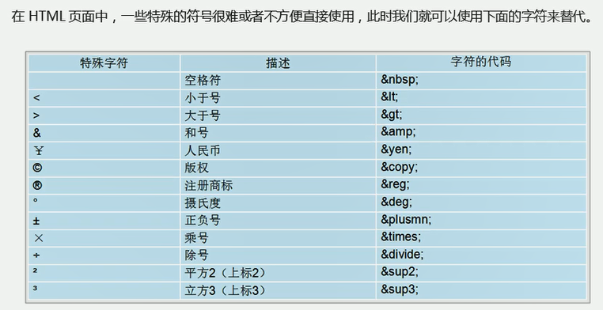

# HTML元素

学习标签要记住标签的语义。HTML标签的属性分为样式属性和标签属性，样式属性是标签属性中的一种，用来给标签添加内联CSS的。

HTML阶段先主要掌握的标签：div、span、b、p、三种列表、i、em、标题标签、表单标签、img、a、button。（后面再学HTML5）

## 元素

HTML 元素指的是从开始标签（start tag）到结束标签（end tag）的所有代码。元素有其属性，内联样式只是属性中的一种而已。

标签的语义——标签的含义。

## DOCTYPE

```html
<!DOCTYPE html> <!-- 文档类型声明，告诉浏览器使用哪种HTML版本来显示网页 -->
<html lang="en"> <!-- 页面显示的语言，en英文网页，zh-CN中文网页，对搜索引擎有作用 -->
    <head>
        <meta charset="UTF-8"> <!-- 设置HTML页面编码字符集 -->
        <!-- 以下两个，移动端开发时使用 -->
        <meta http-equiv="X-UA-Compatible" content="IE=edge">
        <meta name="viewport" content="width=device-width, initial-scale=1.0">
        <!-- 设置网页标签名 -->
        <title>Document</title>
    </head>
    <body>
        <!-- 网页主体内容 -->
    </body>
</html>
```


## div、span

div、span标签是没有语义的，可以将它们当作一个存放东西的盒子。

div，division的缩写，意为分割、分区；div是一个块级元素，单独占一块（一行），不设置高度时高度由里面的内容决定。

span意为跨度、跨距，是一个行内元素，一行内可以存在多个该标签。

```html
<div></div>
<span></span>
```


## 文字基础标签

```html
<p></p>					段落，自动换行
<h1></h1>到<h6></h6>    1-6级标题，独占一行，默认样式：加粗、字号大小	
<del></del>			删除线			
<em></em> <i></i>	斜体，em有语义表示被强调的内容
<strong></strong>	粗体
<b></b>				加粗
<ins></ins> 		下划线
```

## 实体符号

常用的——（空格：`&nbsq;`；大于号：`&gt;`；小于号：`&lt;`）。

```html
<a href="https://baidu.com" disabled="true">百度&copy;</a>
```



## img

```html

<!-- 属性之间无顺序要求，以空格分开-->
<!-- alt：当图片无法显示时的替代文字；title：鼠标放于图片上时的提示文字，图片加不加载出来都起作用；-->
<!-- 宽度、高度修改一个就可以，另一个会自动等比例缩放-->
<!-- border：设置边框宽度等，后面用css操作-->
```

| 属性   | 属性值 | 说明 |
| ------ | ------ | ---- |
| src    |        |      |
| alt    |        |      |
| title  |        |      |
| width  |        |      |
| height |        |      |
| border |        |      |

根目录：目录第一层称为该目录的根目录。

相对路径：相当于当前文件为参考的路径去寻找目标资源。

绝对路径：目录的绝对路径，通常是从盘符开始。


## a

a是anchor的缩写，意为锚。

1. href：链接地址，内部链接或外部链接。（**空链接：**#来代替；**下载链接：**链接地址是文件，文件是.exe或.zip格式）
2. target：_black-重新开一个窗口加载；_self：当前页跳转。
3. 锚点链接：锚点链接的href属性值为`#idName`的形式idName为目标标签的id属性名，用于快速定位页面中某个位置。

```html
<a href="" target=""></a>
<!-- 各种网页元素都可以加超链接-->
```


## 列表

有序列表——ordered list：

```html
<ol type="">
    <li></li>
    <li></li>		有序列表，数字(1)、罗马数字(I、i)、字母(A、a)等
    .........
</ol>
<!--可在li里再嵌套-->
<!--type：1、A、I、a、i-->
```

无序列表——unordered list：

```html
<ul type="">
    <li></li>
    <li></li>		无序列表，实心圆点、方形等
    .........
</ul>
<!--type：circle、square-->
```

描述列表——description list：

```html
<dl>
    <dt>项目</dt>
    	<dd>相关描述</dd>
    <dt></dt>
    	<dd></dd>
    ...
</dl>
<!--dl只能出现dt、dd；经常是一个dt对应多个dd
definition title，定义标题
definition description，定义描述——定义列表具体内容
-->
```

## 表格

```html
<table>
    <caption><h2>表格大标题</h2></caption>
    <thead>
    <tr>			<!--table row-->
    	<th></th>   <!--table head，加粗并居中显示-->
        ...
    </tr>
    </thead>
    <tbody>
    	<tr>
    	<td></td>   <!--table data-->
        ...
    </tr>
    ...
    </tbody>
    <tfoot>
    
    </tfoot>
</table>
<!-- table默认边框宽度为0，table的边框分为外框（行的框）和行里面的单元格的框-->
<!-- table的属性：实际开发很少使用属性 -->
<!-- table、th、td可设置border -->
```

| <table>的属性 | 属性值              | 描述                                              |
| :-----------: | :------------------ | :------------------------------------------------ |
|     align     | left、right、center | 表格相对周围元素的对齐方式                        |
|    border     | 像素值              | 默认没有边框宽度                                  |
|  cellpadding  | 像素值              | 单元格边缘与内容的空白距，默认1px                 |
|  cellspacing  | 像素值              | 单元格之间、外框与内框之间的空白，<br>默认的是2px |
|     width     | 像素值或百分比      | 整个表格的宽度                                    |

合并单元格：用于td标签

- `rowspan = "合并个数" `：跨行合并，不同tr中td的合并（如果使用tbody之类的，那么则是在这些标签内的tr才生效）。
- `colspan = "合并个数"`：跨列合并，同一tr中的td的合并。
- 先确定目标单元格，再指定合并个数，合并从目标单元格开始计数，合并完需要删除多余的单元格。

## 表单

```html
<!-- 发送请求并携带数据，用来收集用户信息-->
<!-- 通常由表单域（表单区域）、表单控件（表单元素）、提示信息（文字提示）组成-->
<form action="URL" name="" method="">
    用户名：<input type="text" name="username" value="">
    密码：<input type="password" name="password" >
    <!--单选按钮通过相同的name实现多选一-->
    性别：男<input type="radio" name="sex"/>女<input type="radio" name="sex"/>
    爱好：打游戏<input type="checkbox" name="hobby"/>
    	 听音乐<input type="checkbox" name="hobby"/>
    	 运动<input type="checkbox" name="hobby"/>
    
    <select />
    <textarea />
</form>
```

### input：

| 常用的type属性值 | 描述                                     |
| :--------------: | :--------------------------------------- |
|       text       | 单行的输入字段，默认可输入20个字符       |
|     password     | 密码                                     |
|      submit      | 提交按钮，把表单数据发送给服务器         |
|      reset       | 重置按钮，清除表单数据                   |
|      button      | 可点击按钮（多数用于启动JavaScript脚本） |
|      radio       | 单选按钮                                 |
|     checkbox     | 复选框                                   |
|      hidden      | 定义隐藏的输入字段                       |
|       file       | 文件上传                                 |
|      image       | 图像提交按钮                             |

- name和value属性是每个表单元素都应该有的值，主要给后台人员使用。
- 单选按钮或复选框按钮要有相同的name值。
- 单选按钮和复选框可以有checked属性，用于指定默认选中的选项。
- type为text的input表单控件可以使用maxlength属性设置可输入字符数。

| 属性      | 属性值             | 描述                                                         |
| --------- | ------------------ | ------------------------------------------------------------ |
| name      | 自定义，类似变量名 | 定义input元素的名称                                          |
| value     | 自定义，类似变量值 | 定义input元素的值<br>如果是按钮则表示按钮上的文字<br>其它的则表示元素内容值 |
| checked   | check              | 规定此input首次加载时被选中                                  |
| maxlength | 正整数             | 规定输入字符的最大长度                                       |


### label:

label是input元素标记标签，用于绑定一个表单元素，当点击`<label>`标签内的文本时，浏览器就会自动将焦点（光标）转到或选择对应的表单元素，用来增加用户体验。

```html
<!-- label元素的for属性值应该和input元素的id值一致 -->
<label for="sex">男</label>
<input type="radio" name="sex" id="sex"/>
<input type="radio" name="sex"/>
```

### select：

```html
<select name="" id="">
    <!-- value中的值为提交到服务器的值，如果没有value则默认提交该标签内容 -->
	<option value="">xxx</option> 
    <!-- 默认选中 -->
    <option slected="selected">xxx</option> 
    <option></option>
    ...
</select>
```

### textarea：

```html
<textarea cols="" rows="">
	默认显示文字......
</textarea>
<!--cols：一行的字数-->
<!--rows：文本域默认展示的行数-->
<!--实际开发都不会用-->
```

## Document

百度

[w3school 在线教程](https://www.w3school.com.cn/)

[MDN Web Docs (mozilla.org)](https://developer.mozilla.org/zh-CN/)
