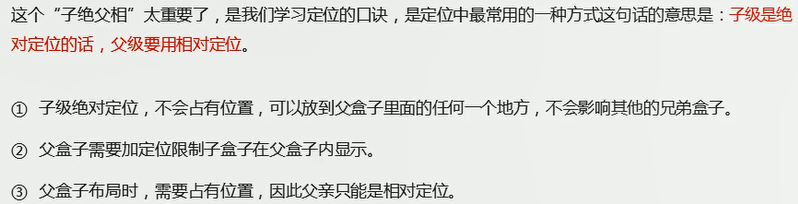
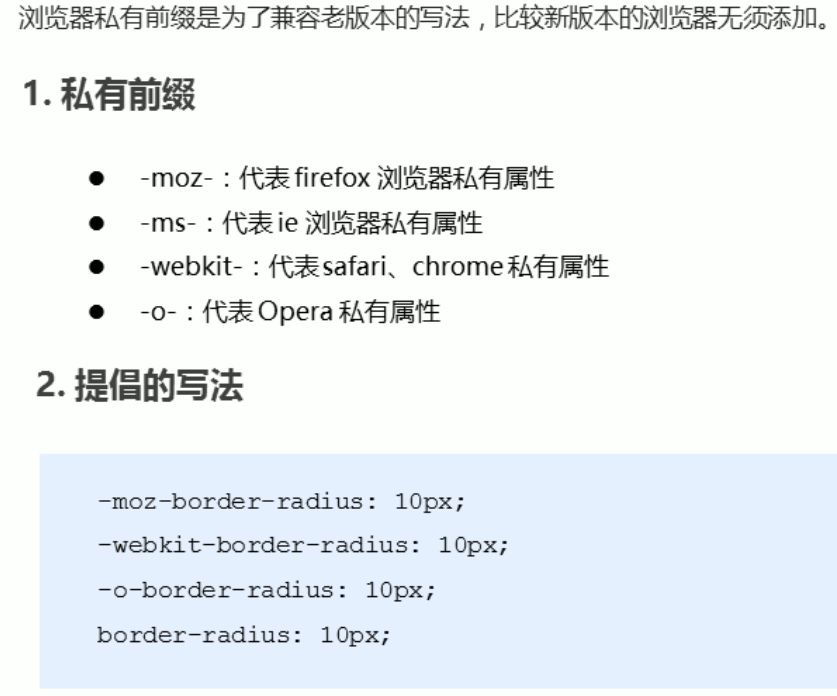
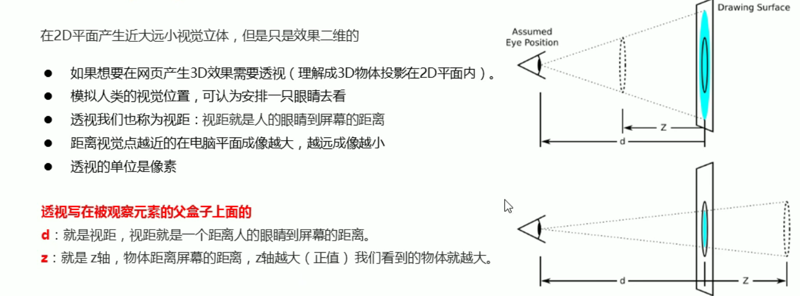
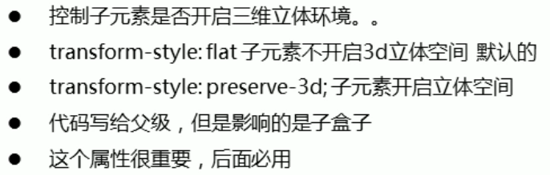
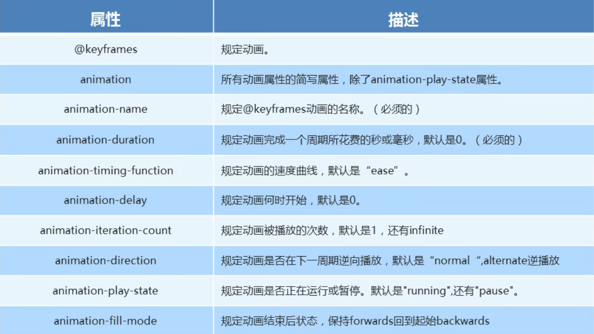
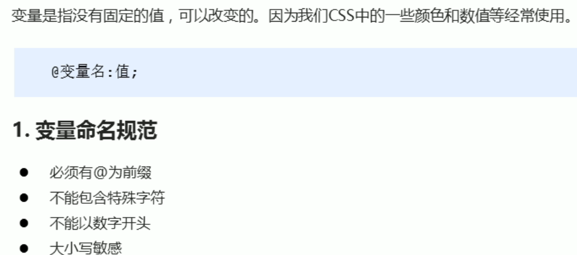
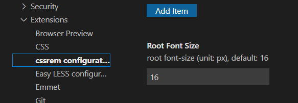
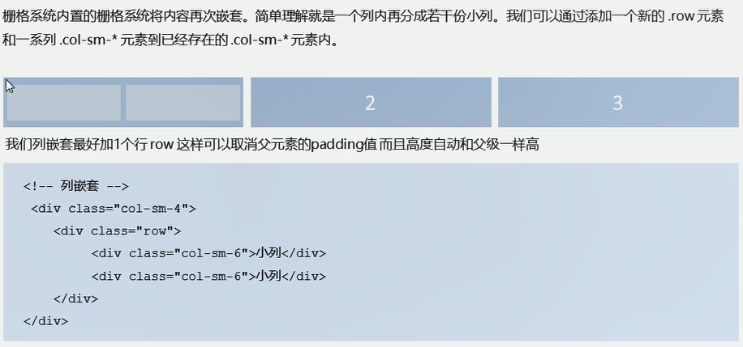

# CSS

## css的引入

外部样式：

```html
<link rel="stylesheet" type="text/css" href="" media="all" />
```

内部样式：head标签内的style标签里的css样式。

内联样式（行内样式）：标签内通过style属性来设置元素的样式。

```html
<!-- 标签图片引入 -->
<link rel="shortcut icon" href="https://www.bilibili.com/favicon.ico?v=1">
```

## 选择器

### 标签选择器

以HTML标签作为选择器——元素选择器。

### 类选择器

> 语法格式：`.classname` （.加上类名）

使用时要为元素赋予**class属性和值**，如果要为元素的class属性设置多个属性值时则要**用空格隔开**。

```html
<h1 class="classA classB">good luck</h1>
.classA.classB {
	color: red;
}
```

句法：

- **`.类名{属性：值；......}`**                             选择含有该classname的元素
- **`.类名.类名{属性：值；......}`**                    选择同时有该两个class属性值的元素，不区分先后顺序
- **`元素选择符.类名{属性：值；......}`**            选择含有该class属性值的元素
- **`元素选择符.类名.类名{属性：值；......}`**   选择同时含有这两个class值的元素

### ID选择器

> 语法格式：**#+ID值**（#是一个散列字元，也叫井号、哈希字符、哈希记号、三连棋棋盘）

使用时要为元素设置ID属性和值。

```html
<h1 id="c">hello</h1>
#c {
	color: red;
}
```

句法：

- **`#ID {属性：值；......}`**    
- **`元素选择符#ID{属性：值；......}`**        选择含有该ID属性值的该元素

注意：ID选择符不能串在一起使用，因为ID属性值不能是以空格分隔的列表，其他和类选择符基本一致。

### 属性选择器

**简单属性选择器：**只确认到某个或多个属性本身

```html
<h1 class="h_col">continue</h1>

<!-- 基于一个属性的选择器：选择h1元素中含有class属性的元素 -->
h1[class] {
	color: red;
}
<!-- 基于多个属性的选择器：选择同时含有class和title的img元素 -->
img[class][title] {
	color: red;
}
<!-- 结合通配符，选择所有含有title属性的元素 -->
*[title] {
	font-weight: bold;
}
```

**精确属性值选择器：**精确到一个或多个属性值的具体值

```html
<h1 class="h_col1 h_col2">continue</h1>

h1[class="h_col1 h_col2"] {
	color: red;
}
img[class="my_img"][title="一张图片"] {
	font-weight: bold;
}
```

**部分匹配属性值选择器：**模糊匹配，选择到属性值本身包含某一部分特定值的

| 形式                      | 说明                                                         |
| ------------------------- | ------------------------------------------------------------ |
| **[attribute\|="val"]**   | 选择的元素本身有attribute属性且属性值<br>以`val`或`val-`开头 |
| **[attribute~="val"]**    | 选择的元素有attribute属性，且属性值是**包含val的一组词**     |
| **[attribute*="val"]**    | 某个属性值包含子串val                                        |
| **[attribute^="val"]**    | 属性值以val开头                                              |
| **[attribute$="val"]**    | 属性值以val结尾                                              |
| **[attribute$=".pdf" i]** | 加上i之后，将会不区分大小写                                  |


### 复合选择器

群组选择器（并集选择器、分组选择器）：选中多个元素多多个元素进行统一设置，不同元素间以`,`隔开。

```css
h1,h2,h3,h4,h5,h6 {
    color: red;
}
.one, p, #test {
    color:red;
}
```

后代选择器：针对存在父子关系或祖辈关系的元素，选择某个元素的后代。

```html
<h1><em>后代选择器：</em>针对存在父子关系或祖辈关系的元素，<span>选择某个元素的后代。</span></h1>
<!-- h1的后代em -->
h1 em {
	color: red;
}
<!-- h1的后代em和span -->
h1 em, h1 span {
	color: red;
}
```

子（子元素）选择器：只针对父子关系的元素，选择到某个元素的子代元素。

```html
<h1><em>子（子元素）选择器：</em>只针对父子关系的元素，选择到某个元素的子代元素。</h1>
h1 > em {
	color: red;
}
```

紧邻同胞元素选择器：选择同属一个父元素的子代元素，并且这两个子代元素必须紧邻。

```html
<div>
    <h1>紧邻同胞</h1>
    <p>紧邻同胞元素选择器：选择同属一个父元素的子代元素，并且这两个子代元素必须紧邻。</p>
    <p>是h1同胞但不紧邻</p>
</div>
<!-- 选择到h1后的紧跟着的第一个p -->
h1 + p {
	color: red;
}
```

后代选择器、子（子元素）选择器、紧邻同胞元素选择器可以一起结合使用，例如：

```css
html > body table + ul { 
    margin-top: 1.5em;
}
```

选择后续同胞选择器：选择某个元素后同属一个父元素的元素。

```html
<div>
	<h2>后续同胞</h2>
	<h1>后续同胞</h1>
	<p>紧邻同胞元素选择器：选择同属一个父元素的子代元素，并且这两个子代元素必须紧邻。</p>
	<p>是h1同胞但不紧邻</p>
</div>
<!-- 两个p都在h2后面并且都同属一个父元素，所以h2后面所有的p都会被选中 -->
h2 ~ p {
    color: red;
}
```


### 伪类选择器

伪类的效果是把某种幽灵类应用到伪类依附的元素上，**它为所依附的元素设定某种幽灵类**。

```html
p:first-child {......} <!-- 为依附的p设定幽灵类 -->
<!-- 以上类似于以下 -->
<div>
	<p class="first-child">它为所依附的元素设定某种幽灵类</p>
</div>
```

**拼接伪类：**CSS允许把不互相排斥的伪类拼接在一起。

```html
<a href="#">链接</a>
<!-- 鼠标悬停链接上时的样式设置 -->
a:visited:hover {
	color: aquamarine;
}
```

**结构伪类：**指代文本中的标记结构。

| 伪类                     | 选择结构                                                     |
| ------------------------ | ------------------------------------------------------------ |
| **:root**                | 页面根元素——html                                             |
| **:empty**               | 选择没有任何子代、没有文本节点或空白的元素<br>p:empty {display: none;}  禁止显示空段落 |
| **:only-child**          | 选择完全没有同胞的元素<br>img:only-child {......}     img在其父类中是唯一一个元素，“独生子女” |
| **:only-of-type**        | 选择同胞中唯一一种元素类型的元素<br>img:only-of-type {......}    img这种类型在其父类中是只有一个的，可以有其他同胞元素 |
| **:first-child**         | 第一个子元素<br>li:first-child {......}   选择第一个li元素   |
| **:last-child**          | 最后一个子元素                                               |
| **:first-of-type**       | 选择某种元素类型的第一个子代元素                             |
| **:last-of-type**        | 选择某种元素类型的最后一个子代元素                           |
| **:nth-child(n)**        | 选择某种元素的第n个子元素（n是从0~无穷的整数）<br>:nth-child(1) 和 :first-child 等效<br>括号内可以填入表达式，an+b或an-b，a、b是具体数，n代表0~无穷 |
| **:nth-last-child(n)**   | 以倒序的方式来选择                                           |
| **:nth-of-type(n)**      | 选择某种类型元素的第n个元素                                  |
| **:nth-last-of-type(n)** | 以倒序的方式来选择                                           |


**动态伪类：**多用于超链接。

| 超链接伪类   | 说明     |
| ------------ | -------- |
| **:link**    | 未访问   |
| **:visited** | 已经访问 |

| 用户操作伪类 | 说明                                                         |
| ------------ | ------------------------------------------------------------ |
| **:focus**   | 当前获得输入焦点的元素<br>例如键盘输入                       |
| **:hover**   | 鼠标指针放置其上的元素<br>例如鼠标悬停于超链接上             |
| **:active**  | 由用户输入而激活的元素<br>例如用户单击超链接时按下鼠标的那段时间 |

**UI状态伪类：**P90-P96


### 伪元素选择器

在文档中插入虚构的元素，这个元素在文档树中是找不到的，因此是伪元素。需要注意的是，伪元素选择器只能出现在所有选择器的最后，创建的元素属于行内元素，权重为1。

| 伪元素             | 说明                                               |
| ------------------ | -------------------------------------------------- |
| **::first-letter** | 装饰任何非行内元素的首字母或开头的标点符号和首字母 |
| **::first-line**   | 选择文档元素的首行文本                             |
| **::before**       | 前置元素                                           |
| **::after**        | 后置元素                                           |

```css
h2::before {
    content: "";
    ......
}
h2:after {
    content: "The End";
}
```

应用场景：通过伪元素来实现字体图标、在图像链接上添加半透明黑幕、用于清除浮动。

## 字体

font-style：italic是斜体，normal是不倾斜。

复合属性：`font: font-style font-weight  font-size/line-height font-family;`

1. 按上面顺序书写，属性间以空格隔开。
2. 复合写法中不需要设置的属性值可以省略（会使用默认值），但font-size、font-family必须存在。
3. `font：正斜 粗细 大小/行高 字体`。

`@font-face {}`：用于引入自定义字体。

```css
@font-face {
    font-family: "xxx"; /* 引入的字体族的描述，以便引用 */
    src: url(),url(),...; /* 源和备用源 */
    /*src: url() format(),url() format(),...; format()告诉代理所用字体的格式，还能为不带常规拓展名的字体文件制定格式*/ 
}
```

format的值有：

1. embedded-opentype：eot格式。
2. opentype：otf格式。
3. svg：svg格式。
4. truetype：ttf格式。
5. woff：woff格式。


## 文本属性

文本的外观，比如文本的颜色、对齐文本、装饰文本、文本缩进、行间距等。

- color：文本颜色，规范建议使用十六进制的RGB颜色值，字母小写，颜色可以缩写时使用缩写。
- text-align：横向对齐文本对齐，left（默认）、right、center，影响的是行内、行内块元素。
- vertical-align：纵向对齐，只能用于行内元素和置换元素。（baseline（默认）、bottom、middle、top、text-top等）
- text-decoration：装饰文本，给文本添加下划线、删除线、上划线等，none（默认）、underline（下划线）、overline（上划线）、line-through（删除线）。
- text-indent：文本缩进，通常是将段落的首行缩进，数值，单位px或em等，em是相对单位，相对当前元素（font-size）的1个文字的大小，如果当前元素没有设置font-size，则相对父元素。
- text-transform：文本大小写转换。
- line-height：行高（行间距），行间距由上间距、文本高度、下间距组成，值、像素，行高不加单位时指当前元素的多少倍。
- text-shadow：文字阴影，只有四个值（和盒子阴影的前四个值是一样的，`text-shadow: rag(x,x,x) 横向偏移量 纵向偏移量 模糊半径;`）。

## 元素显示模式

元素显示模式：元素以什么方式进行显示；掌握元素的显示方式阔以有助于对元素的使用。

分类：块元素、行内元素、行内块元素。

block——块元素特点：

1. 独占一行；
2. 高度、宽度、内边距、外边距可以控制；
3. 宽度默认是父级宽度的100%；
4. 是一个容器及盒子，里面可以放行内元素、块元素（文字类的除外，比如p）。

inline——行内元素特点：

1. 一行可显示多个行内元素。
2. 宽度、高度直接设置无效；默认宽度为其本身内容宽度。
4. 内容只能是容纳文本或其他行内元素。
5. a标签内不能再放a标签，a标签内可以放块级元素，但给a转换为块元素更安全。

inline-block——行内块元素：img、input、td，同时具有块元素和行内元素的一些特点：

1. 一行可显示多个，两个行内块元素间存在间隙，很难控制这个间隙。
2. 默认宽度为其本身内容的宽度。
3. 高度、宽度、内边距、外边距可以控制。

不同模式间的转换：display。

## 背景

背景颜色：background-color：transparent（透明的）或颜色值。

背景图片：background-image：url()。

背景平铺：background-repeat：repeat（默认）、no-repeat、repeat-x、repeat-y。

背景位置：background-position：x y。

- x坐标、y坐标，x和y可以使用精确单位或方位名词（top、bottom、right、left、center），如果只指定一个方位名词，另一个忽略，此时忽略的是默认居中。
- 如果是精确单位，第一个一定是x坐标，第二个一定是y坐标。
- 如果只指定一个数值，那么这个数值一定是x坐标，另一个默认center。
- 如果精确单位和方位名词混合使用，第一个一定是x坐标，第二个一定是y坐标。

背景固定：background-attachment：scroll（随内容滚动，默认）、fixed（背景固定）。

```css
/* 复合写法，位置没有限制 */
background：背景颜色 背景图片地址 背景平铺 背景图像滚动 背景图片位置；
```

css3，ie9+才支持：背景色半透明：`background-color：rgba(0, 0, 0, .8);`，a是alpha。

## CSS三大特性

### 优先级/特指度

解决使用不同选择符选择了相同的元素下的样式冲突问题。

如果选择器相同（特指度相同），那就是层叠；选择器不同时则根据权重判断，各选择器权重如下：

- 通配符*：`0,0,0,0`；继承或者连结符（>、+等）是没有特指度的，连0都没有。
- 元素选择器：`0,0,0,1`。
- 类、属性选择、伪类选择器：`0,0,1,0`。
- ID选择器：`0,1,0,0`。
- 行内样式style=""：`1,0,0,0`。
- `!important`，表示最重要， 权重是无穷大但对特指度没有任何影响，用于样式属性值最后并以空格隔开。

复合选择器的权重叠加：权重会叠加但不会有进位，权重比较是从左往右一个个数对应比较。

`0,0,1,1`大于`0,0,0,1`，`0,0,1,0`大于`0,0,0,13`，以此类推。

### 继承性

继承：某些样式不仅能应用到所指元素上，还应用到元素的后代上。（特例：body元素定义了背景样式但html没有定义，此时背景样式会向上传递给html元素）

border、大多数盒模型属性不会被继承；text-、font-、line-这些开头的可以继承，以及color属性。（line-height：可以不加单位，不加单位时表倍数，当前元素的倍数。）

常用的css可继承的属性：

- font：组合字体

- font-family：规定元素的字体系列

- font-weight：设置字体的粗细

- font-size：设置字体的尺寸

- font-style：定义字体的风格

- text-indent：文本缩进

- text-align：文本水平对齐

- line-height：行高

- color：文本颜色

- visibility：元素可见性

- 光标属性：cursor


### 层叠性

层叠性主要解决样式冲突问题，相同选择器设置相同的样式（值不同），此时一个样式就会覆盖另一个冲突的样式。

重叠性原则：就近原则，哪个离body结构近哪个就执行，注意**只是覆盖冲突的样式，并不是全部覆盖**。（如果是不同css文件中的样式起冲突呢？一般都不会出现不同文件下的样式冲突，因为样式文件都对应一个结构）。

---

**css样式优先级是：**浏览器缺省 < 外部样式表（引入的css文件） < 内部样式表（`<style>`标签内的样式） < 内联样式（标签中style属性声明的样式）。

完整的优先级：浏览器缺省 < 外部样式表(css文件) < 外部样式表类选择器 < 外部样式表类派生选择器 < 外部样式表ID选择器 < 外部样式表ID派生选择器 < 内部样式表(`<style>`标签内的样式) < 内部样式表类选择器 < 内部样式表类派生选择器 < 内部样式表ID选择器 < 内部样式表ID派生选择器 < 内联样式(style=”)；共12个优先级。


## 盒模型


### width height：宽高

width、height无法应用到行内非置换元素。

盒子模型有两个，标准盒模型和替代盒模型：

- 标准盒模型（box-sizing：content-box）（默认的）：width和height是指content的大小（整个盒子的大小为border+padding+content）。
- 替代盒模型（box-sizing：border-box）：width和height则是指整个盒子的大小（整个盒子的大小为border+padding+content）。
- 指定了width和height时，它俩一个是content不变（标准盒模型），一个是盒子大小不会变（替代盒模型）。

### **border：**边框

border：border-width border-style border-color；简写没有顺序要求，规范这样写。

border-style：solid(实线) dashed(虚线) dotted(点线)。

border-top：宽 样式 颜色。

border-collapse: collapse；把相邻边框合并在一起。

圆角边框：`border-radius：半径;`；(椭)圆与边框的交集形成圆角效果，值为半径或百分比。


### **padding：**内边距

padding-x：值；x：left、top、bottom、right；

padding：5px；上下左右都是5px；

padding：5px 10px；上下是5px，左右是10px；

padding：5px 10px 15px；上、右、下，左的复值使用右的；

padding：top right bottom left；四个值，上右下左的顺序；

总结：如果没有指定值某个方位的值，则按照上-下、左-右的关系来确定，padding的值的顺序按照顺时针排放（上右下左）。

注意：如果盒子本身没有指定width/height，则padding不会影响盒子的width/height，（继承的width、height不算指定，width、height不是不能继承吗）。

### **margin：**外边距

margin-x：值；x：left、top、bottom、right；和padding基本一致。

margin：0 auto；块级元素必须设置了宽度才能实现水平居中。行内块、行内元素居中对齐则是给父元素使用text-align：center；

关于外边距的问题：

1. 解决**相邻元素垂直外边距的合并：**尽量只给一个盒子加margin值；
2. 浮动的元素没有内外边距合并问题；
3. **嵌套块元素垂直外边距的塌陷：**
   - 
4. 总结就是：上下相邻或嵌套的块级盒子会垂直方向上发生外边距合并（浮动的元素不会）。

清除网页元素的内外边距：

```css
* {
    padding: 0;
    margin: 0;
}
```

注意：行内元素为了照顾兼容性，尽量只设置左右内外边距，不要设置上下内外边距。

### box-shadow：盒子阴影

CSS3新增盒子阴影：`box-shadow：h-shadow v-shadow blur spread color inset;`


盒子阴影不占用空间，不会影响其他的盒子。

## 浮动

**浮动元素特性：**脱离文档流、浮动的盒子不再保留原来的位置、浮动元素一行中显示且顶端对齐、具有行内块特性。

**使用：**浮动初衷就是为了解决文字环绕的；浮动元素经常与标准流父级元素搭配使用；浮动元素不会压住它下面标准流的文字或图片。

**清除浮动：**（清除浮动对父元素的影响）

- 清除浮动的本质就是清除浮动元素造成的影响，为了解决**父元素因为子级元素浮动引起的内部高度为0的问题**；因此如果父元素有高度就不需要清除。
- 清除浮动后，父元素就会根据浮动的子盒子自动检测高度。（清除元素的左浮动，那就会根据左浮动盒子来检测高度，其他同理）
- 清除浮动的策略是闭合浮动，就是让父盒子闭合出口和入口，不让子盒子出来。

清除浮动的方法：

1. 额外标签法（隔墙法），W3C推荐的做法：在最后一个浮动的元素的后面添加一个清除了浮动的块级元素。（不常用）

   ```html
   style {
   	.float1 { float: left; }
   	.clear { clear: both; }
   }
   <div>
       <div class="float1"></div>
       <div class="float1"></div>
       <div class="float1"></div>
       <div class="clear"></div>
   </div>
   ```

   

2. 父级添加overflow属性，将其属性值设为hidden、auto或scroll。（代码简单但无法显示溢出的部分）（较常用）

3. 父级添加after伪元素（额外标签法的升级版）。（没有增加标签，结构更简单，但需要考虑版本兼容）（推荐使用）

   ```css
   .clearfix:after {	
   	content: "";
   	display: block;
   	height: 0;
   	clear: both;
   	visibility: hidden;
   }
   .clearfix {   /* IE6、7 专用 */
   	*zoom: 1;
   }
   ```

   

4. 父级添加双伪元素。（推荐使用）

   ```css
   .clearfix:before, 
   .clearfix:after {	
   	content: "";
   	display: table;
   }
   .clearfix:after {	
   	clear: both;
   }
   .clearfix {   /* IE6、7 专用 */
   	*zoom: 1;
   }
   ```


## 四种定位

定位，常用于盒子自由地在某个**盒子内**移动或将其固定在**屏幕中**某个位置（可在覆盖在盒子上层）。

四种定位：

1. `position：static`：静态定位，默认的定位方式，相当于没有偏移量的定位。
2. `position：relative`：相对定位，相对于本身原来的位置来设置偏移量进行定位（原有位置继续占有，不会脱离标准流）。
3. `position：absolute`：
   - 绝对定位，相对于祖先元素进行定位（如果没有祖先元素或祖先元素没有定位，则相对于浏览器进行定位）。
   - 如果祖先元素有定位（相对、绝对、固定定位），则以最近的有定位的祖先元素为参考点来偏移。
   - 绝对定位会脱离标准流，原有位置不再保留占有。
4. `position：fixed`：固定定位，**将元素固定于浏览器可视区域**。
   - 以浏览器可视窗口为参照点，跟父元素没有关系，不会随滚动条滚动。
   - **脱离标准流，可以看作是特殊的绝对定位。**
5. `position：stickey`：粘滞定位，以可视窗口为参考，与相对定位类似，粘滞元素到达指定位置会粘滞在指定位置而不再随内容滚动而滚动，既不脱离文档流也不会改变盒子性质，占有位置，会随滚动条固定。粘滞定位其作用的要求：（可以看作是相对与固定定位的结合）
   - 父元素不能overflow:hidden或者overflow:auto属性。
   - 必须添加top、bottom、right、left其中一个才有效。
   - 父元素的高度不能低于sticky元素的高度。
   - sticky元素仅在其父元素内生效。


结合top、bottom、left、right四个属性使用，这四个属性表示偏移量，是相对于元素边线的偏移量。

子绝父相：子级使用绝对定位，父级要用相对定位。（子级绝对定位，脱离标准流，不会影响其他盒子的位置）



叠放顺序：`z-index`：正、负、0、auto（默认），数值越大在越位于前面。

定位的特殊性：

- 行内元素添加了绝对定位或固定定位，可直接设置宽高。（这两个都脱离了标准流，相当于行内块）
- 块级元素添加了绝对定位或固定定位，如果不设置宽高，则默认是内容大小。
- 绝对定位或固定定位都脱离标准流，不会触发外边距合并问题。
- 绝对定位或固定定位会压住它下面的标准流的所有内容，浮动则不会压住文字或图片。

## 显示与隐藏

让一个元素在页面中显示或隐藏。

1. display：是显式隐藏，使用none属性值，block属性值还有显示元素的意思。
2. visibility：是显式隐藏，visible（元素可视）、hidden（元素隐藏），隐藏后继续占有原来的位置。
3. overflow：是隐式隐藏，溢出隐藏，visible、hidden、scroll（总是有滚动条）、auto（在溢出的时候出现滚动条）。

## CSS高级技巧

### 精灵图

精灵图（sprites）：为了有效地减少请求的次数，提高访问速度

- 把多张小背景图整合到一张大背景图中，主要针对背景图使用。
- 移动大背景图，得到小的背景图。
- 一般背景图都是往左往上移动，是负值。

### 字体图标

字体图标iconfont的使用：展示的是图标，本质是文字，常用于结构样式简单的小图标

1. 下载后得到一个字体文件的压缩包，解压后把fonts文件夹放到页面的根目录；
2. 用CSS引入字体文件，用`@font-face`字体声明；
3. 打开解压后得到的index.html，找到需要的字体图标，复制右下角的小方框；
4. 粘贴复制的小方框到指定的位置，再修改引入位置的字体族，字体图标引入成功。

字体图标下载网站：

1. icomoon字体库：[Icon Font & SVG Icon Sets ❍ IcoMoon](https://icomoon.io/)；
2. 阿里巴巴的：[iconfont-阿里巴巴矢量图标库](https://www.iconfont.cn/)。

追加字体图标：

- 如果需要重新追加图标，可使用解压包文件里的selection.json上传到图标下载网站；
- 然后添加新的图标再生成字体文件，下载字体压缩包，解压后用新的fonts替换原来的fonts文件夹。

### css 画三角

```css
.box {
    width: 0;
    height: 0;
    line-height: 0;
    font-size: 0;
    border: 50px solid transparent;
    border-left-color: pink;
}
```

### CSS用户界面样式

1. 鼠标样式-光标形状——`cursor: `
   - default，默认属性值，小白箭头。
   - pointer，小手。
   - move，移动。
   - text，文本。
   - not-allow，禁止。
2. 轮廓线：表单有默认的蓝色轮廓线，如果要去掉默认的，给表单添加`outline：0;` 或 `outline：none;` 样式即可。

3. 文本域：默认的文本域是可以拖拽的，使用 `resize：none;` 样式可以防止拖拽。


### vertical-align属性应用

vertical-align属性经常用于设置图片或者表单（行内块元素）和文字垂直对齐；vertical-align属性**只适用于行内元素和行内块元素**。

- baseline：基线对齐，默认的对齐方式，元素放置在父元素的基线上。
- top：元素顶端与行中最高元素的顶端对齐。
- middle：元素放置于父元素的中部。
- bottom：元素顶端与行中最低元素的顶端对齐。

图片底部会有一个空白缝隙，原因是**行内块元素会和文字的基线对齐**，解决办法：

1. 给图片添加vertical-align：middle或top或bottom。（提倡使用）
2. 把图片转为块元素。

### 省略号显示溢出文本

单行文本溢出的省略号代替：

```html
<div>单行文本溢出部分使用省略号代替</div>
div {
	width: 180px;
	height: 90px;
	background-color: aqua;
	margin: 0 auto;
	/* 强制在一行内显示文本 */
	white-space: nowrap;
	/* 溢出隐藏 */
	overflow: hidden;
	/* 超出部分使用省略号代替 */
	text-overflow: ellipsis;
}
```

多行文本溢出的省略号代替：（有较大兼容性问题，适用于webkit浏览器和移动端（移动端大部分是webkit内核））（了解）

```css
/* 溢出隐藏 */
overflow: hidden;
/* 超出部分使用省略号代替 */
text-overflow: ellipsis;
display: -webkit-box;
/* 限制一个块内的文本行数 */
-webkit-line-clamp: 2; 
/* 设置或检索伸缩盒对象的子元素的排列方式 */
-webkit-box-orient: vertical;
```

多行文本的更推荐由后台人员来实现。

### 常见布局技巧

**1、margin负值：**

- margin负值会向左移动，可用于实现盒子的边框的重叠。（重叠的边框，当使用`a:hover	`来设置边框颜色时，这时会出现某一边被其他的盒子边框覆盖的情况，这时如果当前元素都没有加定位那就可以加相对定位，如果都已经有定位了那就使用`z-index`来提层）


**2、文字围绕浮动元素：**浮动元素不会压住文字


```html
<div class="box">
    <div class="pic">
        
    </div>
    <p>大家好大家好大家好大家好大家好大家好大家好大家好(๑╹◡╹)ﾉ”</p>
</div>
```

```css
* {margin: 0;padding: 0;}
.box {width: 300px;height: 100px;background-color: #00a4ff;margin: 30px auto 0;}
.pic img{float: left;width: 100px;height: 100px;margin-right: 20px;}
```

**3、行内块元素运用：**行内块元素间有间隔，使用`text-align`可以将行内元素、行内块元素进行居中对齐。


```html
<div class="nav-page">
    <a href="#" class="before">&lt;&lt;上一页</a>
    <a href="#">2</a>
    <a href="#">3</a>
    <a href="#">4</a>
    <a href="#">5</a>
    <a href="#">...</a>
    <a href="#" class="after">&gt;&gt;下一页</a>
    到第
    <input type="text" class="">
    页
    <button>确定</button>
</div>
```

```css
* {margin: 0;padding: 0;}
.nav-page {text-align: centmargin-top: 30px;}
.nav-page a {display: inline-block;width: 36px;height: 36px;line-height: 36px;text-decoration: none;text-align: center;font-size: 14px;color: whitesmoke;background-color: tomato;}
.nav-page .before, 
.nav-page .after {width: 85px;}
.nav-page input {width: 45px;height: 36px;text-align: center;border: 1px solid #ccc;outline: none;
}
.nav-page button {width: 60px;height: 36px;border: 1px solid #ccc;background-color: #ccc;}
```

**4、CSS三角的运用：**


```html
<div class="box">
    <span class="miaosha">$1650
        <i></i>
    </span>
    <span class="price">$5650</span>
</div>
```

```css
.box {width: 160px;height: 24px;border: 1px solid red;margin: auto;}
.box .miaosha {display: inline-block;position: relative;width: 90px;height: 100%;color: #fff;text-align: center;font-weight: 600;background-color: red;}
.box .miaosha i {position: absolute;top: 0;right: 0;border-color: transparent #fff transparent transparent;border-style: solid;border-width: 24px 10px 0 0;}
.box .price {color: gray;text-decoration: line-through;}
```


## 布局与规范

### 网页布局

页面布局的三大核心：盒子模型、浮动、定位；网页布局的本质就是用CSS摆放盒子（把盒子摆放到相应位置）。CSS提供了三种传统的布局方式（简单地说就是盒子的排列顺序是咋样的），实际开发中一个页面都包含这三种布局（移动端中还有新的布局方式）：

1. 普通流（标准流/文档流）：标签按照默认的方式进行排列。
  - 块元素独占一行（div、hr、p、h、ul、ol、dl、from、table）。
  - 行内元素从左到右自动排列，一行满了会自动换行（span、i、a、em）。
2. 浮动。
3. 定位。

**网页布局原则：**

1. 网页布局第一准则：多个块级元素纵向排列找标准流，多个块级元素横向排列找浮动。

2. 网页布局第二准则：先设置盒子大小，之后设置盒子的位置。 
3. 为了约束浮动元素位置，我们网页布局一般采取的策略时：**先用标准流排列上下位置，内部子元素采用浮动排列左右位置**。浮动布局注意事项如下：
   - 要遵守网页布局第一准则。
   - 如果一个元素浮动了，其余的兄弟元素也要浮动。

**页面布局整体思路：**

1. 先确定页面版心（可视区、主体区域）。
2. 再分析页面的上下布局，多个块级元素纵向排列找标准流，多个块级元素横向排列找浮动。
3. 然后分析左右结构——列模块经常使用浮动布局，先确定列大小，再确定列位置（网页布局第二准则）。
4. 遵循的逻辑：
   - 制作HTML结构（遵循先有结构，后有样式）。
   - 理清楚布局结构再写代码。
   - （**理清布局，自上向下、自左向右、由外而内，先结构后样式，一步步进行操作**）


**网页布局过程：**（网页布局的核心就是用CSS摆放盒子）

1. 准备好相关的网页标签，网页标签元素基本都是盒子Box。
2. 然后利用CSS设置好盒子样式，摆放到合适位置。
3. 再往盒子里面加内容进行调整。

**导航栏：实际开发使用li+a的做法。**


### CSS编写规范

[CSS 代码的书写规范、顺序 | DeveWork](https://devework.com/css-written-specifications.html)（[CSS 代码的书写规范、顺序 - 云+社区 - 腾讯云 (tencent.com)](https://cloud.tencent.com/developer/article/1025155)）。

1. 位置-显示相关：display、position、top、right、z-index、float、clear、visibility、overflow等。
2. 大小-盒子相关：width、height、padding、margin等。
3. 文字-文本相关：font、line-height、letter-spacing、color、text-align等。
4. 背景-背景边框：background、border等。
5. 其他-其他操作：animation、transition等（动画、变换、背景渐变、阴影等）。

## 其他

### 浏览器前缀



### 图片格式


### SEO优化标签

```html
<title>Title</title>
<meta name="description" content="">
<meta name="keywords" content="">
```

## 表格

table标签的一个属性——**border-collapse**，其属性值作用如下：

1. `seperate`：边框之间分离。
2. `collapse`：两两相临边框合并。

```html
<div class="box">
    <table>
        <caption><h4>这是一个表格</h4></caption>
        <thead>
        <tr>
            <th>序号</th>
            <th>姓名</th>
            <th>年龄</th>
            <th>性别</th>
            <th>家乡</th>
        </tr>
        </thead>
        <tbody>
        <tr>
            <td>1</td>
            <td>王曼</td>
            <td>22</td>
            <td>女</td>
            <td>台湾省</td>
        </tr>
        </tbody>
    </table>
</div>
```

```css
.box {
        width: 600px;
        margin: 100px auto;
    }
    table {
        border-collapse: collapse;
        text-align: center;
    }
    th,td {
        width: 90px;
        border: 1px solid #000;
    }
```

# Emmet语法


5. `div.xxx`，`div#xxx`
6. `div.xxx$*5`
7. `div{$*5}`

# HTML5和CSS3

## 初始化css

```css
* {
    margin: 0;
    padding: 0;
}
em,i {
    font-style: normal;
}
li {
    list-style: none;
}
img {
    border: 0;
    vertical-align: middle;
}
button {
    cursor: pointer;
}
a {
    color: #666;
    text-decoration: none;
}
a:hover {
    color: #c81623;
}
button,input {
    font-family:Microsoft YaHei,Heiti SC,tahoma,arial,Hiragino Sans GB,"\5B8B\4F53",sans-serif;
    border: 0;
    outline: none;
}
body{
    -webkit-font-smoothing:antialiased;
    background-color:#fff;
    font:12px/1.5 Microsoft YaHei,Heiti SC,tahoma,arial,Hiragino Sans GB,"\5B8B\4F53",sans-serif;
	color:#666;
}
.hide,.none{
    display:none;
}
.clearfix:after{
    visibility:hidden;clear:both;display:block;content:".";height:0
}
.clearfix{
    *zoom:1
}
```

## HTML5新增

新增特性都有兼容性问题，IE9+才支持。HTML5新增语义化标签：

- header：头部标签
- nav：导航标签
- article：内容标签
- section：定义文档某个区域
- aside：侧边栏标签
- footer：尾部标签

新增的多媒体标签：

- 音频：audio
- 视频：video


## CSS3新增

1. 新增选择器：属性选择器、结构伪类选择器、伪元素选择器。
2. 盒子模型样式设置——`box-sizing`。
3. filter属性：将模糊或颜色偏移等图形效果应用于元素上。（语法格式`filter: 函数();`，例如`filter: blur(5px);`blur是模糊处理函数）
4. calc函数：在声明css属性时可通过该函数执行一些计算。（`width: clac(100% - 80px);`，可进行加减乘除运算）
5. 过渡：从一个状态慢慢过渡到另外一个状态。（经常和`:hover`一起搭配使用）


# 转换、过渡、动画

## transform-转换

transform，CSS3，元素的位移（translate）、旋转（rotate）、缩放（scale）等。

### 2D转换

平移：`transform: translate(X,Y);`或`transform: translateX(n);`、`transform: translateY(n);`。


旋转：`transform: rotate(度数);`，度数单位为deg；

设置旋转中心点：`transform-origin: x y;`（默认旋转中心为集合中心，x、y可以是像素或方位名词（top bottom left right center））；

缩放：`transform: scale(x,y);`，注意点如下：（设置中心点也是通过transform-origin）


综合性写法：`transform: translate() rotate() scale(); `


### 3D转换


3D位移：

- `transform: translate3d(x, y, z)`：里面的xyz不能省略；可以单独设置，和2D转换的一致，translateZ()一般都是像素px；

透视：perspective



- `perspective: 像素`。

3D旋转：


- 左手准则适用于绕x、y、z轴正方向的旋转；
- `transform: rotate3d(1, 0, 0, 45deg)`：绕x轴旋转45°；xyz指定矢量。

3D呈现：transform-style




## 过渡

过渡写到本身上，谁做动画给谁加。（在元素的属性上生效）

```css
transition: 要过渡的属性 花费时间 运动曲线 何时开始;
```


## animation动画

通过设置多个节点来精确控制一个或一组动画，常用来实现复杂的动画效果。（比过渡多一些功能：更多变化、更多控制、连续播放等）。

制作动画：

1. 先定义动画（关键帧）：定义动画的语法
   - ```css
     @keyframes 动画名称 {
         /* 开始状态 */ /* 百分比值必须是整数，是用来划分时间的，实现某个时间段是某个状态，可设多个百分比 */
         0% {
         	动画效果    
         }
         /* 结束状态 */
         100% {
         	动画效果
         }
     }
     ```
   
     
2. 再调用动画：使用动画的语法
   - ```css
     /* 调用动画 */
     animation-name: 动画名称；
     /* 持续时间 */
     animation-duration: 秒或毫秒;
     ```

动画常见属性：



动画调用的简写：


- name（关键帧名）、duration（动画完成时间）必须写。

animation-timing-function（动画的速度曲线细节）：


- 关于steps(n)：n为整数，该函数指定动画过程中的的加载步数（相当于把动画加载分为几个阶段，可以呈现阶段停顿效果，一步一步实现动画效果）；

- step时序函数有四种书写方式：见《CSS权威指南第四版   P880》；

- 可以实现一个字一个字显示出来：

  

  

# 单移动端

## 概述

移动端开发有单独制作移动端页面和响应式页面两种，目前市场**主流还是单独制作移动端页面**。

视口：分为视觉视口（屏幕可视区）、布局视口（移动端浏览器默认设置的布局视口）、理想视口（设备多宽，布局视口就多宽）。

meta视口标签：(标准的viewport设置)

```html
<meta name="viewport" content="width=dece-widthhhhh, user-scalable=no, initial-scale=1.0, maximum-scale=1.0, minimum-scale=1.0">
```


2倍图：准备好的图片是实际需要的的两倍（再通过缩放引入图片），解决在手机端的图片变模糊的情况，这就是2倍图。（3倍图、四倍图看实际需要）

背景图片宽高——背景缩放：

- background-size：宽度  高度；（单位：长度、百分比、cover（宽高等比拉伸到能覆盖背景区域）、contain（右下角开始等比拉伸到某一边碰到背景区域某一边，类似图片在背景区域所能等比放大完全显示的最大尺寸）；只设置宽高其中一个就是等比设置）


## 移动端技术解决方案

移动端初始化CSS推荐使用normalize.css；

下载地址：[normalize.css (csstools.github.io)](https://csstools.github.io/normalize.css/)；


## 单移动端页面

### 流式(百分比)布局


总结：

- 设定好主体盒子的width，后面的子元素设置为百分值时默认以父盒子为参考，应该设定最大最小宽度，防止尺寸过小或过大引起的布局失效。

### flex弹性布局

弹性盒：设置为display：flex/inline-flex的元素，弹性盒可以是任意元素。


- flex-direction：row（左到右）、column（上到下）、row-reverse、column-reverse（reverse，反转）；（方向按照语言书写方向会有一个默认值，不同的语言下的网页主轴方向不同，例如中文网页左到右，阿拉伯语言网站右到左）；
- justify-content：
  - flex-start、flex-end：紧靠主轴起边或终边；
  - center：把子元素当做整体居于主轴中点；
  - space-between：把第一个和最后一个都紧靠主轴起边或终边，剩余的等空白间隔排序占满剩余行空间；
  - space-around：减去子元素所占宽度，然后剩余的空间等分给各个元素两侧；（相当于等分为左右margin值）；
  - space-evenly：等分空间，分布子元素两侧，使得元素与元素、元素与起边或终边的间隔都是相同的；
- flex-wrap：wrap（换行）、nowrap（不换行，默认值）；
- aligin-items：影响的是垂轴上的对齐，flex-end（下上）、flex-start（上下）、center（垂直居中）、baseline（基线对齐）、stretch（默认，垂直拉伸）；
- aligin-content：影响的是垂直方向上的，值比justify-content多一个stretch（垂直拉伸）；
- flex-flow：row  wrap；

弹性盒元素：设置为display：flex/inline-flex的元素的子元素。

- flex：定义当前弹性子元素分配剩余空白空间，值为数值或百分比，意为多少份；
- aligin-self：定义**某个**弹性子元素对齐方式，侧轴（垂直）上的对齐方式，与aligin-items的值一致；
- order：定义弹性元素排列顺序，数值越小越往前，数值越大离起边越远；

### rem适配布局1

1. 如何使文字随着屏幕大小变化而变化？
2. 流式布局和flex布局主要针对宽度布局，那高度如何设置？
3. 如何使屏幕发生变化时元素和高度等比例缩放？

相对单位：

- em：相对于父元素字体大小（font-size）的单位；
- rem（root em）：相对于HTML元素的字体大小的单位，设置html标签的font-size即可控制其余使用了rem单位的大小；

媒体查询media query：

```css
@media mediatype and|not|only (media feature) { /* not、only */
    css样式
} 
/* 媒体类型：screen（屏幕，手机、平板、电脑等）、print（打印机）、all（所有） */
/* 媒体特性： max-width、min-width、width等，这几个指定宽度*/
```

```css
@media screen and (max-width: 760px) {
    当屏幕宽度不大于760px时执行的css样式代码
}
/* screen 和 and 不能省略 数值单位不能省略 */
```

通过媒体查询引入资源：link标签的media属性

```css
<link rel="stylesheet" media="媒体类型 关键字 (媒体特性)" href=""/>

<link rel="stylesheet" media="screen and (max-width: 320px)" href=""/>
```


less的使用：（Leaner Style Sheets，一种CSS拓展语言，CSS预处理器，在现有CSS的基础上加了程序式语言的特性，其他的有Sass、Stylus）。

创建.less文件，less文件里的操作：

1. 创建变量和变量值；

2. ```less
   @color: pink;
   body {
       color: @color;
   }
   div {
       color: @color;
   }
   ```

3. 需要编译成CSS文件，借助vscode的easy插件，安装插件后保存less文件会自动生成相对应的css文件，以后通过less文件就可以控制css文件的值；

4. less嵌套-对应css中的后代选择器

   - ```less
     div {
         a {
             color: red;
         }
     }
     /* 对应 div a {} */
     ```

   -  

5. less的运算：

   1. 数值都可以使用+、-、/、*这些单位，除法运算要加括号()；

   2. 运算符两侧要有空格，任何数字、颜色、变量都可以参与运算；

   3. 两运算的值的单位以第一个为首选，如果第一个没有则用第二个的单位；

   4. ```less
      @fontsize: 12px;
      div {
          width: @fontsize * 2;
          height: 123rem + 446px;
      }
      ```
   
6. `@import "common"`：导入common.less文件。

rem适配方案：（思考：适配的目标是？任何去实现？如何在实际开发中使用？）


实际上：

技术选择：方案1：less、media、rem；方案2：flexible.js、rem（推荐的方案）。

方案一：

1. 选择屏幕的标准值（例如移动端一般750px），然后划分这个标准值为多少份（具体看设计，15份、20份等等）；
2. 每一份的大小就作为html元素的font-size值；
3. 然后根据rem单位就可以实现值的不同，但是实现了等比缩放的效果。

### rem适配布局2

使用flexible.js：


vscode的cssrem插件，可以自动将px值转为rem值（需要进入设置里的拓展，找到cssrem的拓展的配置，然后找到RootFontSize，修改值）。




### 混合布局

# 响应式页面

## 媒体查询


```css
.container {
    width: 1100px;
    margin: 0 auto;
}
@media screen and (max-width: 767px) {
    .container {
        width: 100%;
    }
}
@media screen and (min-width: 767px) {
    .container {
        width: 750px;
    }
}
@media screen and (min-width: 992px) {
    .container {
        width: 970px;
    }
}
@media screen and (min-width: 1200px) {
    .container {
        width: 1170px;
    }
}
```


## bootstrap

来自推特，目前最受欢迎的前端框架，基于HTML、CSS、JavaScript，简洁灵活，使得web开发更加快捷。

[Bootstrap中文网 (bootcss.com)](https://www.bootcss.com/)

### 使用

[Bootstrap中文网 (bootcss.com)](https://www.bootcss.com/)，下载。

引入。

```html
<!DOCTYPE html>
<html lang="zh-CN">
<head>
    <meta charset="utf-8">
    <meta http-equiv="X-UA-Compatible" content="IE=edge">
    <meta name="viewport" content="width=device-width, initial-scale=1">
    <title>陆拾陆的blog</title>
    <!-- Bootstrap -->
    <link rel="stylesheet" href="../static/bootstrap-3.4.1-dist/css/bootstrap.min.css">
</head>
	<body>
	</body>
</html>
```

### 布局容器


### 栅格系统

bootstrap将页面划分为12列。


注意：

- 如果划分份数不够12，默认向左靠齐。
- 如果划分份数超过12，默认换行。




### 响应式工具


