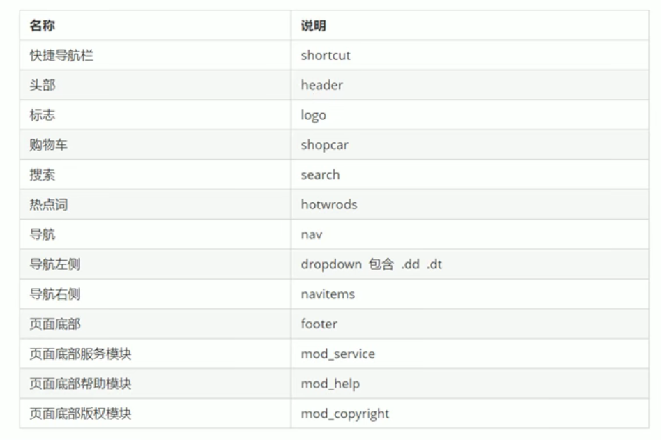
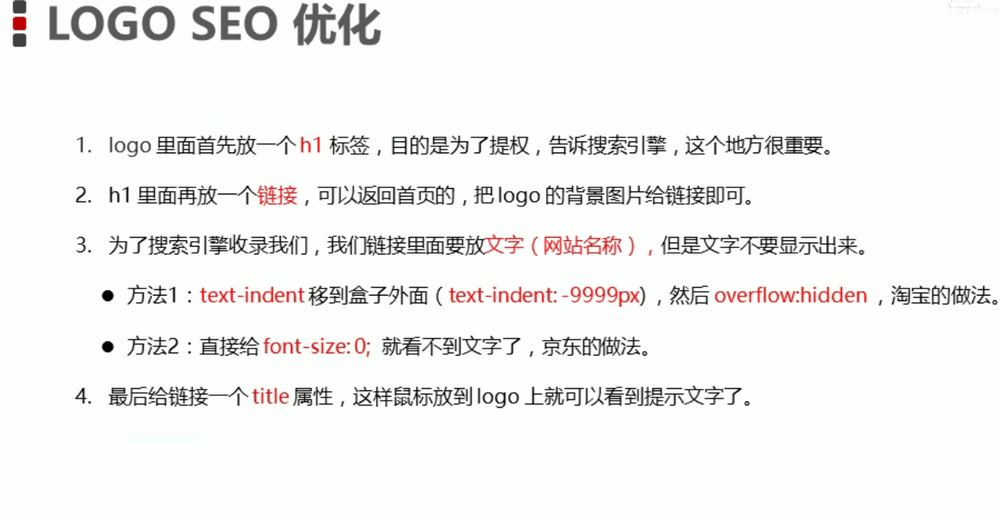

#  Web-Page-Program

## 品优购

favicon标签图标引入：放到网站根目录

```html
<link rel="shortcut icon" href="favicon.ico" type="image/x-icon">
```



logo seo 优化：



总结：

- 样式要合理的放置，各个部分的样式做好分离，比如初始化样式、头尾样式、各个页面的样式，各单独使用一个css文件；
- 有结构才有样式，编写网页页面时先思考好结构，再编写样式；
- 布局就是为了把一个个盒子放在合适的地方来完成我们想要的效果，由外而内地布置好盒子与内容；
- SEO优化、dropdown列表项；
- 对于左图片右文字的，三个盒子完成；对于图标和文字中间对齐的可以利用行内块的vertical-align，也可以利用图标和块元素大小，再调整文字大小使文字居中对齐；
- 表单的构建，一般都用无序列表实现；
