# 概述

浏览器分为两部分：渲染引擎和JS引擎

- 渲染引擎（内核）：解析HTML和CSS。
- JS引擎：读取网页中的JavaScript代码，对其进行处理，比如谷歌浏览器的 V8引擎。（执行代码时逐行解析每一句源码（转换为机器码），然后再由计算机执行——逐行解析执行）


# ECMAScript-语法标准

JavaScript（网景公司）、Jscript（微软），JavaScript最流行。ECMAScript规定了JS编程的基本语法和基础核心知识，是所有厂商共同遵守的一套JS语法工业标准。

## base

### 引入位置

三种引入JavaScript的方式，内嵌式、外部JS引入、行内JS。（执行顺序：外部 > 内嵌 > 行内）。

关于js资源：

1. 解释外部或内部js文件，页面会阻塞（阻塞时间包含下载js文件的时间）。
2. js文件的拓展名不是必须的。
3. 引入外部js文件时script标签内不要写js代码，写进去的不会生效。
4. 外部js文件引入不受浏览器同源策略的影响，但会受页面协议（http、https）的影响。
5. 没有使用defer和async属性时，浏览器会按`<script>`标签出现的顺序来依次解释，前一个解释完才轮到下一个。
6. 还有其他功能：比如推迟脚本执行、异步执行脚本、动态加载脚本等。


 


### 注释

1. 单行注释：`//`。（快捷键：`ctrl + /`）
2. 多行注释：`/*  */`。（快捷键：shift + alt + a）

### 输入输出


```html
<script type="text/javascript">
        prompt('输入信息'); // 输入框
        alert('弹窗显示信息'); // 警示框
        console.log('控制台打印输出日志'); // 控制台日志打印函数
</script>
```

### 变量

**变量声明和使用：**变量，是用来存放数据的容器，本质是程序在内存中申请的一块用来存储数据的空间。

```js
var name; // 声明一个变量
name = '陆拾陆';
var age = 21; // 声明变量并赋值
var a = b = c = 9 //相当于 var a = 9; b=9;c=9;
```

拓展：

1. 更新变量：变量被重新赋值后，原来的值被覆盖，以最后一次赋值为准。
2. 没赋值但声明了的变量有默认值 `undefined`（未定义），变量声明或变量赋值至少得符合一个，否则就会报错。
3. 可以同时声明多个变量并赋值，使用`,`分割各个变量（`var v1=1, v2=2, v3=3;`）。

**变量命名规范：**（尽量不使用`name`作为变量名，其有特殊意义（直接`console.log(name)`不会报错））


标识符命名规范：

1. 变量、函数的命名尽量“见名知义”。
2. 变量的名称一般用名词。
3. 函数的名称一般用动词。

## 数据类型

不同的数据所需要占用的存储空间不同，为了充分利用存储空间，把数据分成所需内存大小不同的数据，于是就定义了不同的数据类型。

- JavaScript的变量的数据类型是在程序运行过程中，根据等号右边的值来确定的，当为变量赋值后，该变量的数据类型才能确定。

- js是动态语言，变量的数据类型是可变的。

  ```js
  var age = 21;
  age = '21';
  ```

JavaScript的七种数据类型：

| 数据类型  | 说明                                | 默认值                                                       |
| --------- | ----------------------------------- | ------------------------------------------------------------ |
| Undefined | 未初始化的变量的默认值就是undefined | 只有一个值：undefined                                        |
| Null      | 空值                                | 只有一个值：null；null值表示一个空指针对象，类型为object<br>null值表面上与undefined等价 |
| Boolean   | 布尔类型，可以进行运算              | 只有两个值：true、false（默认）                              |
| Number    | 数值，包含浮点型和整型              | 默认值是0                                                    |
| String    | 不可变字符，Unicode字符             |                                                              |
| Symbol    | ES6新增                             |                                                              |
| Object    | 对象                                |                                                              |

### 数值型

浮点数时，如果小数点后没有数字或者是0，将会转换为整型数来处理；浮动数的精度最高可达17位小数。（要注意的是，浮点数的计算并不精确）

科学计数法：3e3=3000；3e-3=0.003。（默认情况，小数点后至少包含6个0时，浮动值就会转换为科学计数法）

进制：`0x`开头表示十六进制数，`0`开头表示八进制数（严格模式下是`0o`）。

一些特殊值（了解）：

1. `Number.MAX_VALUE`：1.7976931348623157e+308。（10的308次方）
2. `Number.MIN_VALUE`：5e-324。（10的-324次方）
3. `Infinity`：无穷大。（`alert(Number.MAX_VALUE * 2);`）
4. `-Infinity`：无穷小。（` alert(-Number.MAX_VALUE * 2);`）
5. `NaN`：
   - not a number，表示非数字；任何与NaN的运算都是NaN，NaN不等于NaN。（`alert('hello' - 100);`）
   - 0、-0、+0之间相互做除法运算都会返回NaN。
   - 分母是有符号0或无符号0，而分子是非0值，则返回`Infinity`或`-Infinity`。


一个判断方法：

- `isNaN(x)`：判断x是否是非数字，对于任何不能转换为数字的值都将返回true。

三个转换方法：

1. `Number(..)`：转换为数值型。
2. `parseInt(..)、parseInt(xxx, 进制)`：转换为数值型的整型。
3. `parseFloat(..)`：转换为数值型的浮点型，只解析十进制值。

### 字符串

字符串用双引号或单引号括起来，**在JS里更推荐使用单引号**，因为HTML标签里面的属性使用的是双引号。

如果字符中有双引号来表示特殊意义，外双内单、或外单内双。（`var title = "我是'人'是我";`）

字符串转义符：


- 字符串长度：`.length`属性。
- 字符串拼接：使用`+`拼接字符串，都会是字符串。
- 几乎所有值都有的`toString()`方法（null和undefined没有），该方法唯一用途就是返回当前值的字符串等价物。
- String()函数：如果值有toString()函数就调用该函数并返回结果，如果没有就返回null、或者undefined。

### 布尔类型

```js
var falg = true; 
// true 或 false可以进行运算（true代表1，false代表0）
var flag = true + 1;
console.log(typeof flag);
// 将值转换为Boolean类型  空字符、0、NaN、null、undefined都将转换为false
console.log(typeof Boolean(flag));
```

- NaN和数组相加为NaN，null和数字相加为数字本身。

### 检测数据类型

```js
var name = '陆拾陆';
alert(typeof name);   // 未声明的变量的类型为undefined
```

### 数据类型转换

**转换为字符串型：**


**转换为数字型：**


- 字符转换为数字型，会根据前面的进行转换，知道遇到不能转换的就终止转换。如`var num = parseInt('123aaa123px');`最终结果是数字型的123，如果`var num = parseInt(a123);`则是NaN；如果使用`parseInt()`转换`'12.94'`之类的字符，会去掉小数位。

- 隐式转换：

  ```js
  alert(typeof ('1' - 0));
  alert(typeof ('12' - '10'));
  var num = ('12' - '10'); // 尽量不要使用name为变量名，此时使用name变量名就会转换不成Number
  alert(typeof num);
  ```

**转换为布尔类型：**

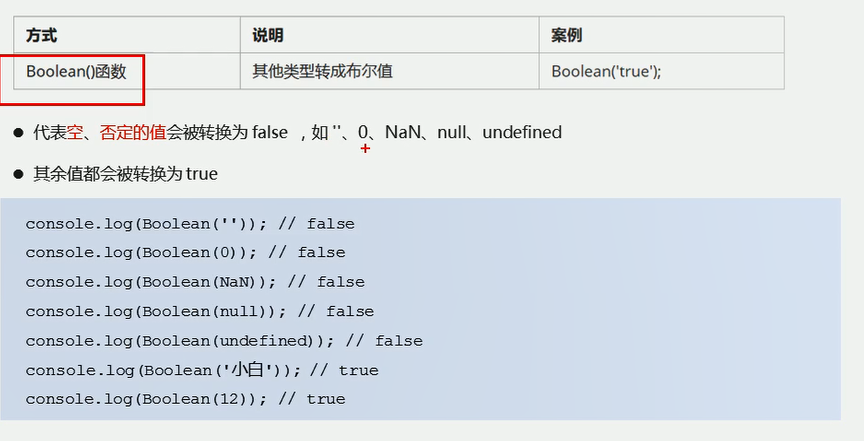

JavaScript是一种解	释型语言。


## 运算符

和Java基本一样的运算符。

**【注意】浮点数的计算会有些精度问题，不要直接判断两个浮点数是否相等！**

```js
console.log(0.1 + 0.2); // 0.30000000000000004
console.log(0.07 * 00); // 7.000000000000001
```


在JavaScript中，比较运算符会自动转换类型进行比较：`==、>=、<=、>、<`、`!==`（不相等）。

注意事项：

1. 一元加和减可以用来进行数据类型转换，用于变量前，相当于使用Number()函数。（`var num = "01"; var n = -num;`）
2. JavaScript中所有的数值都以64位格式存储；位操作符则是先把值转换为32位整数，再进行位操作，之后再把结果转换为64位。对于我们开发者而言，只需考虑32位即可。位操作符运用到非数值，会先使用Number()函数，然后再进行位操作。操作符书写和Java中的一致。
3. 布尔操作符：
   1. 逻辑非：`!`先将值转为布尔值再取反；js中可以使用`!!`，表示先将值转换为布尔值再取反。
   2. 逻辑与：`&&`，短路与，与Java中使用一致，不过在js中特殊的地方在于——如果有操作数不是布尔值，那么就不一定返回布尔值了：
      1. 第一个操作数是对象，返回第二个操作数。
      2. 第二个操作数是对象，当第一个操作数能转为true时才会返回该对象。
      3. 两个操作数都是对象，直接返回第二个操作数。
      4. 有其中一个是null、NaN、undefined，则直接返回对应的null、NaN或undefined。
   3. 逻辑或：与逻辑与类似：
      1. 第一个操作数是对象，则返回第一个操作数。
      2. 第一个操作数能求值为false，则返回等操作数。
      3. 两个操作数都是对象，就返回第一个。
      4. 两个操作数都是null、NaN、或undefined，则返回它们自身。
4. 乘除法：可能出现的值——正负无穷、NaN、数值。
   1. 有NaN参与的都是NaN；无穷乘以0也是NaN。0除以0，也是NaN。非0除以0则返回正无穷或负无穷。
   2. 对于取模运算`%`：无限%有限=NaN；有限%0=NaN；无穷%无穷=NaN。

## 循环

和Java基本一致。

- `continue`：跳出本次循环，执行下一次。
- `break`：跳出整个循环。

## 数组

数组创建方式：（数组内可以放任意的数据类型数据，下标从0开始）

```js
var array = new Array(); // 创建了一个空数组
var array = new Array(2); // 创建了一个长度为2的数组
var array = []; // 创建了一个空数组，长度为0
var array = ['值1','值2','值3','值4','值5']; // 创建并初始化

alert(array[9]); // 可访问任意下标的值，如果不含数据的下标则返回undefined
array.length; // 数组长度
```

数组扩容是通过修改数组的长度，修改长度后，数组中扩出来的没有数据的位置默认是undefined。不像Java中那么严格。

```js
array.length = 10; // 更改数组长度来扩容，扩出来的位置默认是 undefined
```


## 函数

### 函数的使用

函数声名和调用：

```js
// 声明函数方式1：
function show(){
	alert("这是一个函数");
}
// 都是这样调用函数
show();
```

参数：函数的形参个数无限制，传入的实参也不要求全部都和形参对应上，形参默认值为undefined。

```js
function show(v1,v2,v3){
    alert("这是一个函数");
    console.log(v1 + v2 + v3);
}
// 声明函数方式2：函数表达式（变量里存函数），此时函数为匿名函数，show是变量名
var show = function(arg){
    alert("传入的参数为" + arg);
}
show("arg");
// 调用函数
show(1,2);
```

返回值：直接return就好。

```js
function show(v1,v2){
    return v1 + v2; 
}
// 函数没有return时返回的是undefined
```

**使用`arguments`获取参数：**

当不确定传入多少个参数时，使用arguments来获取参数。JavaScript中，arguments实际上是当前函数的一个内置对象，所有的函数都有的，其存储了要传递的所有实参。

```js
function testArg(){
    console.log(arguments);
    console.log(arguments.length);
    console.log(arguments[0])
}
testArg(1,2,3);
```

arguments是一个伪数组，只有函数才有arguments：

- 具有数据的.length属性。
- 按照索引的方式进行值的存储。
- 没有一些真正数组的方法，例如pop()、push()方法等。
- 可以通过数组的方式对里面存储的实参进行遍历。

### 域

**作用域：**

1. 全局作用域：整个script标签、或者一个单独的js文件。
2. 局部作用域（函数作用域）：在函数内部就是局部作用域，这个代码名字只在函数内部起作用。
3. es6新增块级作用域，就是`{ }`括起来的部分。

**全局、局部变量：**

1. 全局变量：
   - 全局作用域下的变量，局部作用域（函数内部）外声明的变量。
   - 【特殊】：在函数内部没有声明，但直接赋值的变量也是全局变量（函数需要执行才会初始化）。
   - 浏览器关闭时销毁，比较消耗资源。
2. 局部变量：
   - 局部作用域（函数内部）的变量，只能在其声明处的函数内部使用。
   - 程序执行时创建，执行完毕就销毁，更加节约资源。

**作用域链：**

- 如果函数内部还有函数，就在这个作用域中又产生一个作用域。
- 内部函数可以访问外部函数变量，是根据链式查找来决定哪些数据能被内部函数访问，这种结构称作作用域链。

```js
function f1(){
    var num = 11;
    function f2(){
        alert(num);
    }
    f2();
}
var num = 33;
f1(); // 11
```

## 预解析

```html
<script type="text/javascript"> 
    // 如果不声明就使用，就会报错
    console.log(num);
    // 当如下声明了，上述console结果为undefined  ---坑1
    var num = 10;
    // 此种声明函数方式，可以在函数声明前或后面进行调用
    f();
    function f(){}
    // 此种声明函数方式，是把函数放进变量里，此时只能在其声明后调用，否则报错 ---坑2
    fun();
    var fun = function(){};
</script>
```

```html
<script>
	// 坑1的两行代码相当于
    var num;
    console.log(num);
    // 坑2的两行代码相当于
    var fun;
    fun();
    fun = function(){};
</script>
```

JavaScript代码由浏览器中JavaScript解析器来执行，JavaScript解析器在运行js代码的时候分为——**预解析和代码执行：**

1. 预解析：浏览器在执行页面代码之前，会先把页面代码都扫描一遍，并把 **声明式的函数和变量** 都提升到所在作用域的最前端，但不会提升变量赋值和函数调用操作。
2. 代码执行：从上往下执行代码。

**预解析：**

1. 变量提升：把所有的**用var声明的**变量都提升到**当前作用域最前面**，但**不提升赋值操作**。
2. 函数提升：把所有的函数声明提升到当前作用域最前面，但不提升函数调用操作。（首句使用function开始才算函数，其他只能算函数表达式。）

```html
<script type="text/javascript"> 
    var num = 10;
    fun();
    function fun(){
        console.log(num); // （最后输出：undefined）
        var num = 20;
    }
    // 上面的相当于：
    function fun(){
        var num;
        console.log(num); 
        num = 20;
    }
    var num;
    num = 10;
    fun();
</script>
```

**关于预解析的优先级：**“函数会首先被提升，然后才是变量” -《你不知道的JavaScript》。

```html
<script>
    console.log(foo);
    // 函数声明提升优先级最高，如果后续有命名冲突，后来的会被忽略
    function foo(){ 
        console.log('函数声明');
    }
    var foo = '与函数同名的变量';
    console.log(foo);
</script>
```

上述代码最后的运行结果表明，**函数提升优先级高于变量提升，且不会被同名变量声明覆盖，但是当同名变量赋值后同名函数会被覆盖**。

```js
// 实际执行：
function foo(){console.log('函数声明')} // 可以看做是 var foo; foo = function(){};
var foo; // 变量名与函数名冲突，变量声明被忽略
console.log(foo); // 输出函数声明体
foo = '此时会覆盖它-那个与我同名的函数'; // 会覆盖掉函数，之后不能再执行调用foo()函数
console.log(foo); // 输出 '此时会覆盖它-那个与我同名的函数'
```

要注意的是，从一开始便用function开始的才能算作函数，其它只能算作函数表达式，而函数表达式不会被提升。

同时声明多个函数名相同的函数，先声明的会被后声明的覆盖。

## 对象

### 创建对象

**创建对象方式一：通过**字面量创建对象

```html
<script type="text/javascript">
    var o = {}; // 创建空对象
    o.age = 23; // 设置对象属性及值
    var obj = {
        username: '陆拾陆',
        password: '123456',
        address: 'Beijing',
        saiHi: function(){
            alert('对象中的方法');
        }
    };
    // 使用对象属性 对象名.属性 对象名['属性名']
    alert(obj.username);
    alert(obj['username']);
    // 调用方法
    obj.saiHi();
</script>   
```

**创建对象方式二：通过**new Object创建对象

```html
<script type="text/javascript"> 
    var obj = new Object(); // 创建了一个空对象
    obj.username = '陆拾陆';
    obj.password = '123456';
    obj.address = 'Beijing';
    obj.sayHi = function(){
        alert('这是对象的方法');
    }
</script>
```

**创建对象方式三：**

使用构造函数来创建对象：前面的方式一次只能创建一个对象，将创建对象的过程封装进函数，即构造函数，当需要对象的时候就调用方法并传参就能构造不同属性值的对象。

```html
<script type="text/javascript"> 
    // 声明构造函数 首字母要大写 不需要return 属性、方法前面必须要this
    function CreateObj(username,age){
        this.username = username;
        this.age = age;
        this.sayHi = function(message){
            alert(message);
        }
    }
    // 使用构造函数创建对象
    var obj = new CreateObj('陆拾陆',21);
    obj.sayHi('这是由构造函数创建的对象中的方法');
    alert(obj['username']);
</script>
```

`new`关键字的执行过程：

1. new 构造函数 ===> 就会在内存中创建了一个空的对象；
2. this 就会指向创建的空对象；
3. 执行构造函数里面的代码，给空对象添加属性和方法；
4. 返回对象。（new执行完就会自己返回对象，所以不需要return）

**for in 循环遍历对象属性：**

```html
<script type="text/javascript"> 
    // 声明构造函数 首字母要大写 不需要return 属性、方法前面必须要this
    function CreateObj(username,age){
        this.username = username;
        this.age = age;
        this.sayHi = function(message){
            alert(message);
        }
    }
    var obj = new CreateObj('陆拾陆','21');
    // 使用构造函数创建对象
    for (var key in obj) {
        alert(key); // 得到属性名
        alert(obj[key]); // 得到属性值
    }
</script>
```

### 内置对象

JavaScript的三种对象：自定义对象、内置对象、浏览器对象。

内置对象：JavaScript自带的对象，对象含有常用的或基本而必要功能（属性和方法），例如Math、Date、Array、String。

MDN文档查看：[JavaScript 标准内置对象 - JavaScript | MDN (mozilla.org)](https://developer.mozilla.org/zh-CN/docs/Web/JavaScript/Reference/Global_Objects)。

#### **Math对象：**

[Math - JavaScript | MDN (mozilla.org)](https://developer.mozilla.org/zh-CN/docs/Web/JavaScript/Reference/Global_Objects/Math)


- 传入参数，并返回值。
- 最大、最小值传入数组。

#### **Date：**

[Date - JavaScript | MDN (mozilla.org)](https://developer.mozilla.org/zh-CN/docs/Web/JavaScript/Reference/Global_Objects/Date)

内置的Date()构造函数，创建其对象来调用对象的方法，可以获取时间值。


获取时间戳：从1970年1月1日（世界标准世界）起的毫秒数。

```html
<script type="text/javascript"> 
    var date = new Date();
    // 方法1
    alert(date.valueOf());
    // 方法2
    alert(date.getTime());
    // 方法3 最常用的方法
    var date1 = +new Date();
    alert(date1);
    // 方法4 H5 新增
    alert(Date.now());
</script>
```

```html
<script type="text/javascript">
    function countDown(time){
        var nowTime = +new Date();
        var inputTime = +new Date(time);
        var times = (inputTime - nowTime) / 1000;
        var d = parseInt(times / 60 / 60 / 24);
        d = d < 10 ? '0' + d : d;
        var h = parseInt(times / 60 / 60 % 24); 
        h = h < 10 ? '0' + h : h;
        var m = parseInt(times / 60 % 60);
        m = m < 10 ? '0' + m : m;
        var s = parseInt(times % 60);
        s = s < 10 ? '0' + s : s;
        return d + '天' + h + '时' + m + '分' + s + '秒';
    }
    var t = countDown('2022-1-1 00:00:00');
    console.log(t); 
</script>   
```

#### **数组对象：**

```html
<script>
    // 通过内置的Array()构造函数创建数组
	var array = new Array(); // 创建了一个空数组
    var array = new Array(3); // 创建了一个长度为3的数组 
	var array = new Array(2,3); // 创建并初始化 
</script>
```

检测是否为数组对象的两种方式：

instanceof，`xx instanceof Array`判断是否为数组。

H5新增方法：`Array.isArray(arr)`，传入arr并判断是否是数组，返回boolean值。

创建的数组对象的方法：（都会改变原数组）

```html
<script type="text/javascript">
    // 往数组末尾追加元素
    var arr = [1,2,3];
    var length = arr.push(4,'lsl'); // 返回的是新数组的长度
    alert(arr); 
    // 往数组头部追加元素 返回的也是新数组长度
    arr.unshift('头部');
    alert(arr);
    // 删除数组最后一个元素并返回这个元素
    arr.pop();
    // 删除数组第一个元素并返回这个元素
    arr.shift();
</script>
```

```html
<script type="text/javascript">
    var arr = [1,12,3,9,5,7,10,2];
    // 反转数组的元素
    alert(arr.reverse());
    // 冒泡排序
    arr.sort(function(a,b){
        return a - b; // 升序来进行排序，+则是降序排序
    });
    alert(arr);        
</script>
```

数组索引方法：


```html
<script type="text/javascript">
    var arr = [1,12,2];
    // 从前往后查找
    // 返回该数组元素索引，只返回第一个满足条件的索引，找不到返回-1
    var index1 = arr.indexOf(12); // 1 
    // 从后往前查找
    // 返回该数组元素索引，只返回第一个满足条件的索引，找不到返回-1        
    var index2 = arr.indexOf(2);  // 2   
</script>  
```

数组去重：

```js
function unique(arr){
    var newArr = [];
    for(var i = 0; i < arr.length; i++){
        if(newArr.indexOf(arr[i]) === -1){
            newArr.push(arr[i]);
        }
    }
    return newArr;
}
```

数组转换为字符串：

- `toString()`方法：转换成的字符使用逗号分隔每个元素。
- `join()`方法：默认是使用逗号分隔，可以设置其他符号来分隔（`join('-')`使用-来分隔）。


#### 字符串对象：

**基本包装类型：**

JavaScript提供了三个特殊的引用类型：String、Boolean、Number。基本包装类型就是把简单数据类型包装为复杂数据类型，这样基本数据类型就有了属性和方法。包装的执行过程如下：

```html
<script type="text/javascript">
    // 该基本数据类型会包装成复杂数据类型
    var str = 'string';
    alert(str.length);
    // 实际内部执行如下
    var temp = new String('string'); // 1.创建临时变量
    str = temp; // 2.赋给str
    temp = null; // 3.销毁
</script>
```

**字符串的不可变：**字符串改变时并不是原来的值发生了改变，而是一个新字符串的引用赋予了该字符串，只是字符串的引用地址发生了改变。


开始的位置是可选的，lastIndexOf也一样。

```html
<script type="text/javascript">
    function indexs(arr,str){
        var indexArray = [];
        var flag = arr.indexOf(str);
        while( flag !== -1){
            indexArray.push(flag);
            flag = arr.indexOf(str,flag + 1);
        }
        return indexArray;
    }
    var a  = indexs([1,1,1,3,4,6,1,3],1);
    alert(a);
</script>
```

**根据位置返回字符：**


获得重复次数最多的字符：

```html
<script type="text/javascript">
    // 出现次数最多的字符
    function maxShow(str){
        var obj = {};
        for(var i = 0; i < str.length; i++){
            var chars = str.charAt(i);
            if(obj[chars]){
                obj[chars]++;
            }else{
                obj[chars] = 1;
            }
        }
        var max = 0;
        var ch = '';
        for (var key in obj) {
            if(obj[key] > max){
                max = obj[key];
                ch = key;
            }
        }
        return ch;
    }
    alert(maxShow('asdffff'));
</script>
```

**字符串拼接及截取：**


**替换字符：**

```html
<script>
    var str = 'string';
    // 只会替换首次出现的那个
    alert(str.replace('s','a'));
    // 字符转换为数组
    var s = '1,2,3,4,5,6';
    console.log(s.split(',')); // [1,2,3,4,5,6]
    // 字符大小写转换
    alert(str.toUpperCase()); // 转换为大写
    alert('AaA'.toLowerCase()); // 转换为小写
</script>
```

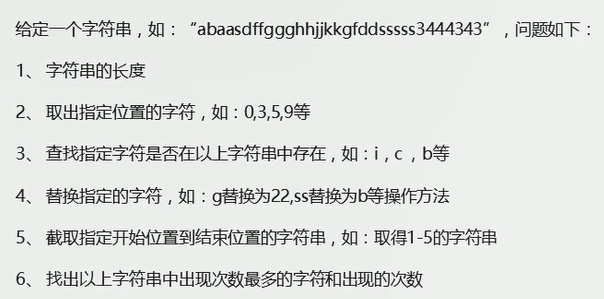

## 类型总结

简单数据类型（也叫基本数据类型）：

- string、number、boolean、undefined、null。
- 基本数据类型在存储时变量中存储的是值本身，因此叫做值类型。
- 基本数据类型中特殊的是，null是返回一个空对象（object类型）。

复杂数据类型（也叫引用类型）：

- 通过new关键字创建的对象（系统对象、自定义对象），如Object、Array、Date等。
- 存储变量时存储的仅仅是地址（引用）。

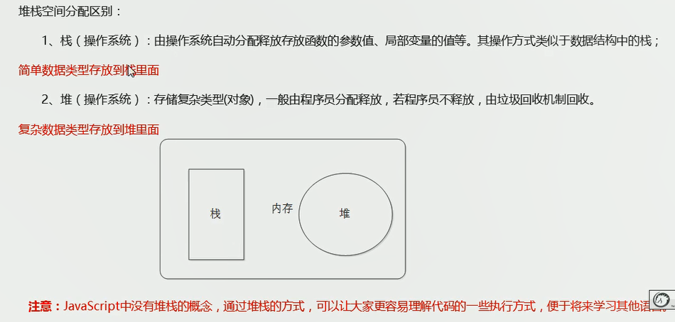

# DOM

Web API，由浏览器通过的一套操作浏览器功能和页面元素的API（DOM、BOM）。


## 获取元素对象

**1.根据ID获取：** `document.getElementById('id值');`。

```html
<body>
    <div id="time">2021-12-31</div>
    <script>
      // 返回一个元素对象，不存在有该id的元素则返回null
      var time = document.getElementById('time');
      // 使用dir可以打印对象的全部内容
      console.dir(time);
    </script>
</body>
```

**2.根据HTML标签获取：** `document.getElementsByTagName('标签名');`。

```html
<body>
    <div>
        <ul>
          <li>1</li>
          <li>2</li>
          <li>3</li>
        </ul>
        <ul>
          <li>4</li>
        </ul>
    </div>
    <script>
      // 返回获取到的元素对象的集合 以伪数组的形式存储  得到的元素对象是动态的
      // 如果页面中没有，则返回空的伪数组
      var li = document.getElementsByTagName('li');
      // 
      console.dir(li);
      // 获取某个标签下的某些对象
      var ul = document.getElementsByTagName('ul');
      console.dir(ul[1].getElementsByTagName('li')); // 获取到第二个ul里的li元素对象
    </script>
</body>
```

**3.HTML5新增-通过类名获取元素对象：**

```html
<body>
    <div class="content">通过类名获取元素对象</div>
    <div class="content2">通过类名获取元素对象</div>
    <script>
      // 根据类名返回元素对象的集合
      var content = document.getElementsByClassName('content');
      console.dir(content);
      // 根据指定选择器返回第一个元素对象
      var s = document.querySelector('.content');
      var all = document.querySelectorAll('div');
      console.dir(s);
    </script>
</body>
```

**4.获取特殊元素：**

```html
<script>
    // 获取body元素对象
    var body = document.body;
    console.log(body);
    // 获取html元素对象
    var htmlEle = document.documentElement;
    console.log(htmlEle);
</script>
```

## 事件

**事件三要素：**1.事件源（被触发对象） 2.事件类型（如何触发） 3.事件处理程序（触发后的行为）。

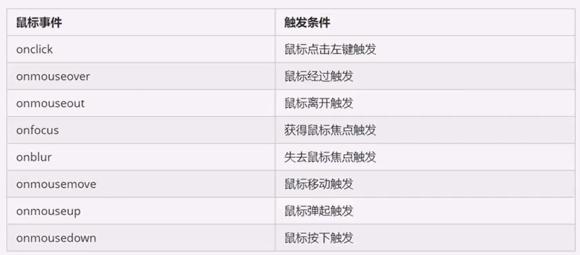

```html
<body>
    <button id="btn">点一下</button>
    <script>
      var btn = document.getElementById('btn');
      btn.onclick = function(){
        alert('点击按钮触发的弹窗');
      }
    </script>
</body>
```

## 操作元素

### **改变元素内容：**

```html
<body>
    <button id="btn">显示当前系统时间</button>
    <div>某个时间1</div>
    <div>某个时间2</div>
    <script>
      // 使用元素对象的属性来更改元素内容
      var btn = document.getElementById('btn');
      var div = document.querySelectorAll('div');
      // div.innerText = '2021.12.31'; 不添加事件，会随着页面的加载而执行更改
      btn.onclick = function(){
        // innerText 不会识别HTML标签，内存中存在的标签也充当字符显示  非标准
        // 会去除内容中的空格和换行
        div[0].innerText = '<strong>2021</strong>.12.31';  
      }
      // 会识别HTML标签，解析内容中存在的标签 W3C标准
      // 不会去除内容中的空格和换行
      div[1].innerHTML = '<strong>2021</strong>.12.31';
      // innerText、innerHtml属性，可以读，即获取到标签内内容
      console.log(div[1].innerHtml);
    </script>
</body>
```

### **改变常见元素的属性内容：**

 `alt、src、href、id、title`等，都和innerHtml类似，都是元素对象的属性（如果该元素有的话），就可以通过获取到对象后，直接调用属性来直接赋值。

### **修改表单元素的属性内容：**

可以利用DOM操作的有`type、value、checked、selected、disabled（true or false）`，操作步骤和上面差不多。

### **修改元素的样式属性内容：**


行内样式操作：样式较少或功能简单的情况下使用

```html
<style>
    div {
        width: 100px;
        height: 100px;
        background-color: aqua;
    }
</style>
<body>
    <div></div>
    <script>
      var div = document.querySelector('div');
      div.onclick = function(){
        // 行内样式操作
        // div.style.backgroundColor = 'pink';
        this.style.backgroundColor = 'pink';
      }
    </script>
</body>
```

类名操作方式：

```html
<style>
    div {
        width: 100px;
        height: 100px;
        background-color: salmon;
    }
    .change {
        background-color: pink;
    }
</style>
</head>
<body>
    <div class=""></div>
    <script>
        var div = document.querySelector('div');
        div.onclick = function(){
            // 赋值后会覆盖原先的类名
            div.className = 'change';
        }
    </script>
</body>
```


### 排他思想：

```html
<body>
    <button>按钮1</button>
    <button>按钮2</button>
    <button>按钮3</button>
    <button>按钮4</button>
    <button>按钮5</button>
    <script>
      var btns = document.getElementsByTagName('button');
      for(var i = 0; i < btns.length; i++){
        btns[i].onclick = function(){
          for(var i = 0; i < btns.length; i++){
            btns[i].style.backgroundColor = '';
          }
          this.style.backgroundColor = 'pink';
        }
      }
    </script>
</body>
```

### 属性操作：

**获取属性值：**


```html
<body>
    <button id="value">按钮1</button>
    <script>
      var btns = document.getElementsByTagName('button');
      var v1 = btns[0].id;
      var v2 = btns[0].getAttribute('id');
      console.log(v1);
      console.log(v2);
    </script>
</body>
```

**设置属性值：**

```html
<body>
    <button id="value">按钮1</button>
    <button id="value">按钮1</button>
    <script>
      var btns = document.getElementsByTagName('button');
      btns[0].id = 'hello1';
      btns[1].setAttribute('id','hello2');
      console.log(btns[0].id);
      console.log(btns[1].id);
    </script>
</body>
```

**移除属性值：**

```html
<body>
    <button id="value">按钮1</button>
    <script>
      var btns = document.getElementsByTagName('button');
      btns[0].removeAttribute('id');
      console.log(btns[0].id);
    </script>
</body>
```

### 自定义属性：


```html
<body>
    <div getTime="2" data-time-now="2022"></div>
    <script>
      var div = document.querySelector('div');
      var getTime = div.getAttribute('getTime');
      div.setAttribute('getTime','2022-1-1');
      // H5新增自定义获取属性的方法  ie-ie11才开始支持
      // dataset是一个集合 里面存放了所有自定义的以data开头的属性
      div.dataset.timeNow = '2022-01-01';
      console.log('getTime:' + getTime);
      // data集合存储自定义属性 是以驼峰命名法存储key 如下：
      console.log('data-time-now:' + div.dataset.timeNow);
    </script>
</body>
```

## 节点操作

### 概述

利用节点层级关系获取元素，逻辑性强，但兼容性差。


### 父子节点

**父子节点的获取：**（找不到就返回null）

```html
<body>
    <div id="demo">
      <div class="box">
        <span class="e"></span>
      </div>
    </div>
    <ul>
      <li></li>
    </ul>
    <script>
      var e = document.querySelector('.e');
      // 获取父节点
      console.log(e.parentNode);
      // 获取子节点 childNodes：包含所有的子节点，文本节点、元素节点等
      var ul = document.querySelector('ul');
      console.log(ul.childNodes);
    </script>
</body>
```

因为 childNodes包含所有的子节点，如果只想获取到里面的元素节点，就需要专门处理。（因此我们一般不提倡使用childNodes）。

```html
<script>
    var ul = document.querySelector('ul');
    for(var i = 0; i < ul.childNodes.length; i++){
        if(ul.childNodes[i].nodeType == 1){
            // 是元素节点
            console.log(ul.childNodes[i]);
        }
    }
</script>
```

**获取子节点：**（找不到就返回null）


```html
<script>
    var ul = document.querySelector('ul');
    console.log(ul.children);
</script>
```

获取第一个节点或最后一个节点：（找不到就返回null）

```html
<script>
    var ul = document.querySelector('ul');
    console.log(ul.firstChild); // 返回第一个节点 不管是元素节点、文本节点或其它
    console.log(ul.lastChild); // 返回最后一个节点 不管是元素节点、文本节点或其它
    // ie9 以上兼容的
    console.log(ul.firstElementChild); // 返回第一个子元素节点
    console.log(ul.lastElementChild); // 返回最后一个子元素节点
    // 实际开发使用 没有兼容性问题
    console.log(ul.childern[0]);
    console.log(ul.childern[ul.childern.length - 1]);
</script>
```

### 兄弟节点

```html
<body>
    <div>我是div</div>
    <span>我是span</span>
    <ul>
      <li></li>
    </ul>
    <script>
      var div = document.querySelector('div');
      // 
      console.log(div.nextSibling); // 下一个兄弟节点  包含元素节点、文本节点等等
      console.log(div.previousSibling); // 前一个兄弟节点
      // 得到兄弟节点 -  元素节点 ie9支持
      console.log(div.nextElementSibling);
      console.log(div.previousElementSibling);
    </script>
</body>
```

获取兄弟元素节点，解决兼容性问题：

```html
<script>
    function getNextElementSibling(element){
        var el = elment;
        while(el = el.nextSibling){
            if(el.nodeType === 1){
                return el;
            }
        }
        return null;
    }
</script>
```

### 添加节点

```html
<body>
    <ul><li>123</li></ul>
    <script>
      // 1.创建元素节点 
      var li = document.createElement('li');
      // 2.添加子级节点 在后面追加
      var ul = document.querySelector('ul');
      ul.appendChild(li); 
      // 3.在指定位置添加子节点
      var lili = document.createElement('li');
      ul.insertBefore(lili,ul.children[0]);
    </script>
</body>
```

### 删除节点

```html
<script>
    // 删除子节点
	var ul = document.querySelector('ul');
    ul.removeChild(ul.childern[0]);
</script>
```

```html
<!-- 阻止链接跳转 -->
<a href="javascript:void(0)"></a>
<a href="javascript:;"></a>
```

### 复制节点


```html
<script>
    // 删除子节点
	var ul = document.querySelector('ul');
    // cloneNode(true) 深拷贝，复制标签和里面的内容
    // cloneNode(true) 浅拷贝，只复制标签
    var cNode = ul.childern[0].cloneNode();
    ul.appendChild(cNode);
</script>
```


### 创建元素-了解

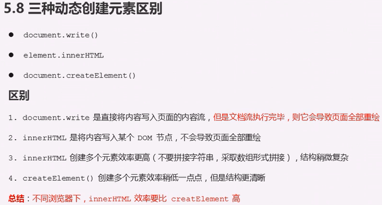

- 使用document.write()重绘后，页面显示内容就只剩写入的了。
- innerHTML使用字符串拼接时效率慢。

```html
<body>
    <button>点我</button>
    <ul><li>123</li></ul>
    <script>
      var btn = document.querySelector('button');
      btn.onclick = function(){
        document.write('<div>重绘啦！</div>');
      }
    </script>
</body>
```

重绘后的HTML页面会变为：

```html
<html>
<head></head>
<body>
	<div>重绘啦！</div
</body>
</html>
```

## DOM重点核心

针对元素的操作，增、删、改、查、属性操作、事件操作。

# 高级DOM

## 注册事件


事件监听方式1：


```html
<body>
    <button>点我</button>
    <script>
      var btn = document.querySelector('button');
      // 事件监听-注册事件 事件类型是字符型，必须加引号，不能带on
      btn.addEventListener('click',function(){
        alert(22);
      })
      // 同一元素同一事件可以添加多个侦听器（事件处理程序）
      btn.addEventListener('click',function(){
        alert(33);
      })
    </script>
</body>
```

事件监听方式2：（非标准，ie9以前支持，该方式不能在生产环境中使用，了解一下）


## 删除事件

传统的方式来删除事件：

```js
xxx.onclick = null;
```

```html
<body>
    <button>点我</button>
    <script>
      var btns = document.querySelectorAll('button');
      btns[0].addEventListener('click',fun); // 调用时不需要小括号和调用声明
      function fun(){
        alert(333);
        // 点击触发事件并执行后 重新加载页面前不会再触发
        btns[0].removeEventListener('click',fun);
      }
    </script>
</body>
```

## DOM事件流

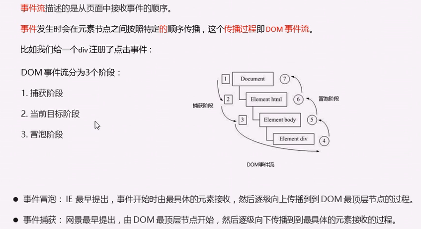


验证事件流：

```html
<body>
    <div class="father">
      <div class="son">son盒子</div>
    </div>
    <script>
      // dom事件流 三个阶段
      // 1.js代码中只能执行捕获或者冒泡其中一个阶段
      // 2.onclick 和 attachEvent（ie）只能得到冒泡阶段
      // 3.捕获阶段 如果addEventListener的第三个参数是true，则处于捕获阶段
      var son = document.querySelector('.son');
      son.addEventListener('click',function(){
        alert('son');
      },true);
      var father = document.querySelector('.father');
      father.addEventListener('click',function(){
        alert('father');
      },true);
      // 4.冒泡阶段 addEventListener的第三个参数缺省或false 则是冒泡阶段
      var sonB = document.querySelector('.son');
      sonB.addEventListener('click',function(){
        alert('son bubble');
      },false);
      var fatherB = document.querySelector('.father');
      fatherB.addEventListener('click',function(){
        alert('father bubble');
      },false);
    </script>
</body>
```

- 捕获阶段：document ===> html ===> body ===> father ===> son，依次触发。
- 冒泡阶段：son ===> father ===> body ===> html ===> document，依次触发。

## 事件对象

### 事件对象的获取：

```html
<body>
    <div>123</div>
    <script>
      var div = document.querySelector('div');
      // 1.有了事件后系统自动创建事件对象，在事件侦听函数写入标识就可获取
      // 2.如下的event1、event2就是事件对象，事件对象名称可自己确定 常用event、evn、e
      // 3.事件对象是事件的一系列数据的集合 比如鼠标点击事件 ===> 包含鼠标坐标 
      
      div.onclick = function(event){
        console.log(event);
      }
      div.addEventListener('click',function(event2){
        console.log(event2);
      });
      // 4.兼容性问题：ie的6 7 8版本用window.event来获取 兼容性写法如下
      div.addEventListener('click',function(e){
        e = e || window.event;
        console.log(e);
      });
    </script>
</body>
```

### 事件对象的常用方法：

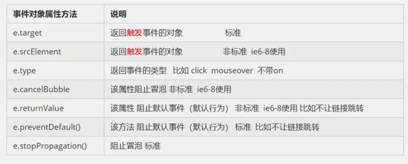

target、srcElement、this：

```html
<body>
    <div>123</div>
    <ul><li>1</li><li>2</li><li>3</li></ul>
    <script>
      // 1. e.target 哪个元素触发事件就返回哪个元素 this 哪个绑定了事件就返回哪个
      // 2. currentTarget和this非常相似 但ie6、7、8不认识该属性
      var div = document.querySelector('div');
      div.addEventListener('click',function(e){
        console.log(e.target);
        console.log(this);
      });
      // this返回的是绑定了事件的元素 target返回的是触发了事件的元素
      var ul = document.querySelector('ul');
      ul.addEventListener('click',function(e){
        console.log(this);
        console.log(e.target);
      });
      // 兼容性写法
      ul.addEventListener('click',function(e){
        e = e || window.event;
        var target = e.target || e.srcElement;
        console.log(target);
      });
    </script>
</body>
```

type、preventDefault()、retuenValue：

```html
<body>
    <div>123</div>
    <a href="https://www.baidu.com">baidu</a>
    <form action="https://www.baidu.com">
      <input type="submit" value="提交" name="sub">
    </form>
    <script>
      // 1.返回事件类型
      var div = document.querySelector('div');
      div.addEventListener('click',fun);
      div.addEventListener('mouseover',fun);
      div.addEventListener('mouseout',fun);
      function fun(e){
        console.log(e.type);
      }
      // 2.阻止默认行为或默认事件 例如：让链接不跳转或提交按钮不提交
      var a = document.querySelector('a');
      a.addEventListener('click',function(){
        e.preventDefault(); // dom标准写法
      });
      // 传统事件注册方式才能用的 addEventListener方式不能用：
      a.onclick = function(e){
        // 兼容低版本ie写法
        e.preventDefault();
        e.retuenValue;
        // 直接return false; 也可以阻止默认行为，没有兼容性问题
      }
    </script>
</body>
```

### 阻止冒泡的两种方式：

```html
body>
  <div class="father">
    <div class="son">son盒子</div>
  </div>
  <script>
    // 4.冒泡阶段 addEventListener的第三个参数缺省或false 则是冒泡阶段
    var sonB = document.querySelector('.son');
    sonB.addEventListener('click',function(e){
      alert('son bubble');
      // 方法1，存在兼容性问题
      e.stopPropagation();
      // 方法2：非标准，设置为true时禁止冒泡
      e.cancelBubble = true;
      // 兼容性写法
      if(e && e.stopPropagation){
        e.stopPropagation;
      }else{
        window.event.cancelBubble = true;
      }
    },false);
    var fatherB = document.querySelector('.father');
    fatherB.addEventListener('click',function(){
      alert('father bubble');
    },false);
  </script>
</body>
```

### 事件委托：

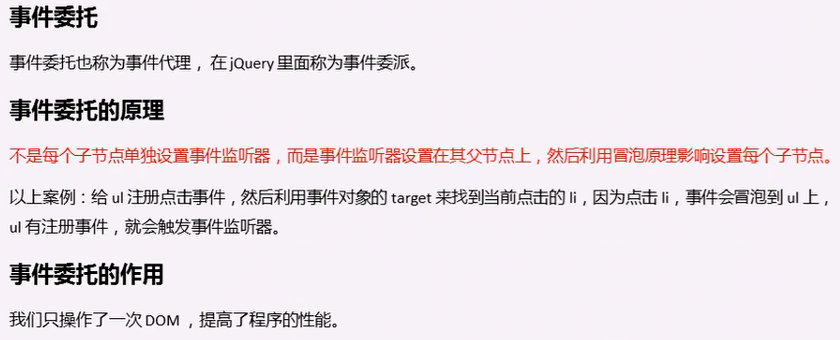

```html
<body>
  <ul>
    <li>点我，弹窗！</li>
    <li>点我，弹窗！</li>
    <li>点我，弹窗！</li>
  </ul>
  <script>
    // 事件委托原理：给父节点添加侦听器，利用事件冒泡影响每一个子节点 
    // 实现需求：点击每个li都会弹窗
    var ul = document.querySelector('ul');
    ul.addEventListener('click',function(e){
      //alert('弹弹弹！');
      e.target.style.backgroundColor = 'pink';
    });
  </script>
</body>
```

### 了解-禁止鼠标右键：

```html
<body>
  我是一段不愿意分享的文字...
  <script>
    // contextmenu 禁用鼠标右键
    document.addEventListener('contextmenu',function(e){
      e.preventDefault();
    });
    // selectstart 禁止选中文字
    document.addEventListener('selectstart',function(e){
      e.preventDefault();
    });
  </script>
</body>
```

### 鼠标事件对象：


```html
<body>
  <script>
    document.addEventListener('click',function(e){
      console.log(e.clientX);
      console.log(e.pageX);
      console.log(e.screenX);
    });
  </script>
</body>
```

### 跟随鼠标的图片：


```html
<head>
    <style>
        img{
            position: absolute;
            width: 90px;
            height: 90px;
        }
    </style>
</head>
<body>
  
  <script>
    var pic = document.querySelector('img');
    // mousemove：鼠标移动1px就会触发
    document.addEventListener('mousemove',function(e){
      // 每次获取鼠标坐标值 把其赋予图片的top、left
      var x = e.pageX;
      var y = e.pageY;
      pic.style.top = y - 45 + 'px';
      pic.style.left = x - 45 + 'px';
    });
  </script>
</body>
```

### 常用键盘事件：

**键盘触发事件：**


```html
<body>
  <script>
    // 执行顺序 keydown => keypress => keyup
    document.onkeyup = function(){
      console.log('键盘键弹起了 up');
    }
    document.onkeydown = function(){
      console.log('你按下键盘键了 down');
    }
    // 不能识别功能键 比如ctrl、左右箭头、shift
    document.onkeypress = function(){
      con.log('你按下键盘键了 press');
    }
  </script>
</body>
```

**键盘事件对象：**


```html
<body>
  <script>
    // 1.keyup、keydown事件不区分字母大小写 按a、A得到的都是65
    document.addEventListener('keyup',function(e){
      // 返回按下的键对应的ASCII码值
      console.log('keyup:' + e.keyCode);
      if(e.keyCode === 65){
        alert("您按下的是a键");
      }else{
        alert('您没有按下a键');
      }
    });
    // 2.keypress事件区分字母大小写 a-97 A-65
    document.addEventListener('keypress',function(e){
      console.log('press:' + e.keyCode);
    });
  </script>
</body>
```

### 案例：


# BOM

## 概述


## window对象常见事件

### 页面加载事件


```html
    <script>
      window.onload = function(){
        var btn = document.querySelector('button');
        btn.addEventListener('click',function(){
          alert('OK');
        });
        alert('页面加载完毕就触发');
      }
      window.addEventListener('load',function(){
        alert('window1');
      });
      window.addEventListener('load',function(){
        alert('window2');
      });
      document.addEventListener('DOMContentLoaded',function(){
        alert(33);
      });
      // load 是等页面全部加载完毕才触发 包括页面dom元素、图片、flash、css等
      // DOMContentLoaded 是DOM加载完毕，不包含图片、flash、css等 加载速度会比load更快
    </script>
```


### 调整窗口大小事件


## 定时器

### setTime()定时器

```html
 <script>
    // 1.window.setTimeout(调用函数,延迟ms数); 延迟毫秒数可以省略，省略时是0
    // 2.调用函数可以直接使用匿名函数，也可以外面声明函数后直接写函数名（不用带括号）
    // 3.调用函数可以是字符形式：'函数名()'，此时要加括号 ---不提倡
    // 4.页面中可能有多个定时器，可以为定时器加标识符（命名）
    // 5.只调用一次 
    setTimeout(function(){
      alert('2000ms过去了');
    },2000);
    var timer2 = setTimeout(function(){
      alert('3000ms过去了：bongbong');
    },3000);
</script>
```

setTimeout()所调用的函数也被称为回调函数callback（需要等待时间的函数，时间到了再调用函数，因此称为回调函数），触发后调用的函数也可称为回调函数。

**停止setTime()定时器：**


### setInterval()定时器


可以实现倒计时效果。

### 清除定时器


## this指向

this的指向只有在函数执行的时候才能确定this到底指向谁，一般情况下this最终指向的是那个调用它的对象。

```html
<body>
    <button>点我</button>
    
    <script>
        // 1.全局作用域或普通函数中指向全局对象window
        console.log(this);
        function fun(){
            console.log(this);
        }
        // 定时器内也指向window
        window.setTimeout(function(){
            console.log(this);
        },1000);
        fun(); // window.fun();
        // 2.方法调用中谁调用就指向谁
        var obj = {
            sayHi : function(){
                console.log(this); // this指向obj这个对象
            } 
        }
        obj.sayHi();
        var btn = document.querySelector('button');
        btn.onclick = function(){console.log(this)} // 指向btn
        // 3.构造函数中this指向构造函数的实例
        function Person(){
            console.log(this);
        }
        var p = new Person();
    </script>
</body>
```


## JavaScript执行机制


js执行机制：


## location对象

### 概述


URL：统一资源定位符

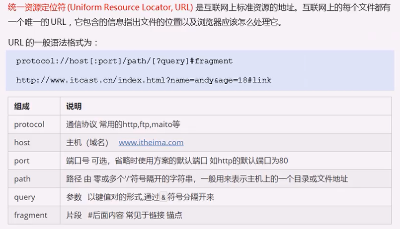

### 属性


- 可以通过herf属性和定时器实现页面跳转。
- search属性，可以获取到表单使用get方法提交的参数，`?v1=v&....`，通过一定处理就可跨页面获取到前一个页面提交的参数。

### 方法


- location.assign()：会记录浏览历史，所以可以实现后退功能。

## navigator对象


## history对象


# PC端网页特效

## 元素偏移量-offset系列

### offset

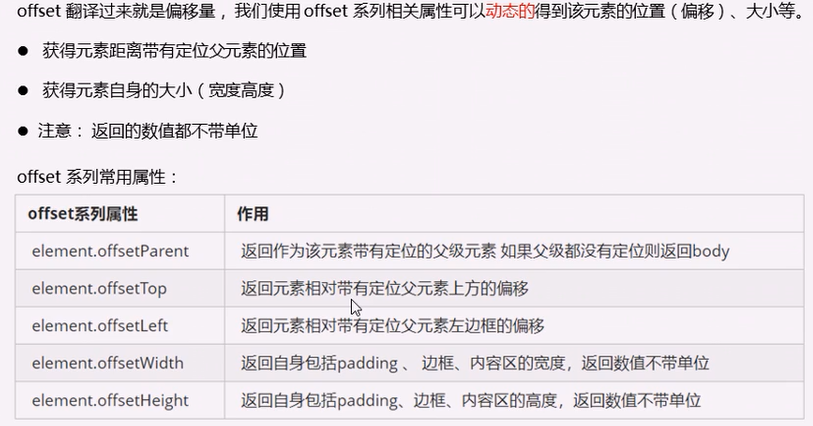


### 获取鼠标在盒子内坐标

```html
<head>
    <style>
        .box {
            width: 200px;
            height: 200px;
            margin: 200px 0 0 200px;
            background-color: aqua;
        }
    </style>
</head>
<body>
    <div class="box"></div>
    <script>
        var box = document.querySelector('.box');
        box.addEventListener('click',function(e){
            var l = e.pageX - this.offsetLeft;
            var r = e.pageY - this.offsetTop;
            console.log('(' + l + ',' + r + ')');
        });
    </script>
</body>
```

### 模态框拖拽


### 放大镜效果


## 元素可视区-client系列

### client属性


### 立即执行函数

立即执行函数：不需要调用就执行的函数；主要作用就是，创建了一个独立的作用域。

立即执行函数的写法：（第二个括号可以看作是调用该函数，可以传入参数，可以为函数命名）

1. 写法一：`(function(){})();`。
2. 写法二：`(function(){}());`

### 淘宝flexible源码分析


## 元素滚动-scroll系列

### scroll属性

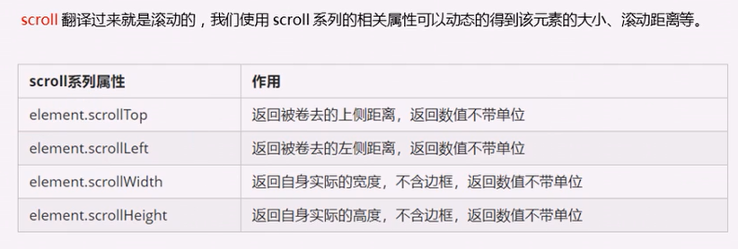


### scroll事件

当拖动滚动条时就会触发的事件。

### 仿淘宝固定侧边栏


## 三大系列总结


## mouseenter和mouseover的区别


## 动画函数封装

### 动画实现原理

通过定时器使元素产生运动，停止时就移除定时器。

缓慢动画原理：


### 封装

函数封装、对象封装。

动画函数封装到单独的js文件。

## 常见网页特效

### 网页轮播图


# 移动端网页特效

移动端对js支持较好，不需要怎么考虑兼容性。

## 触屏事件

### 常见触摸事件


### 触摸事件对象

系统自动封装好触屏时的所有参数进事件对象，几个常用对象的属性如下：（第以伪数组存储）

- `touches`：正在触摸屏幕的所有手指的列表。
- `targetTouches`：正在触摸的当前的dom元素的手指列表。（经常使用）
- `changedTouches`：手指状态发生改变的列表（从无到有，从有到无的状态）。


## 常见特效


## 常用开发插件


## 常用开发框架


# ES6

## 变量声明

ES6新增了let用来声明变量，const用来声明常量。

```js
let a,b,c;
```

let的特性：

1. 同一作用域内使用let声明的变量的变量名不能重复。
2. let在块内声明，就只在块级作用域有效。
3. 不存在变量提升。
4. 不会影响到作用域链，作用域仍然正常。

```js
const ex = "必须赋值";
```

const的特性：

1. 声明的是常量（因此标识符一般大写），必须赋初始值。（类似Java中的final）
2. 同一作用域内不允许重复声明同一变量。
3. 值不允许修改。
4. 在块内声明，就只在块级作用域有效。

应用场景： 声明对象类型使用 const，非对象类型声明选择 let。（const声明对象，是不是对象地址不会变？？？）

## 解构赋值

ES6 允许按照一定模式，**从数组和对象中提取值，对变量进行赋值**，这被称为解构赋值。

从数组中提取值，对变量赋值：

```js
const array = ["一号","二号","三号","四号"];
let [a,b,c,d] = array; // 解析数组array，并把值依次赋予，要使用[]将变量括起来
let [e] = array;
alert(a); // 输出：一号
alert(e); // 输出：一号
```

从对象中取值，对变量赋值：

```js
const obj = {
    name : "陆拾陆",
    age : 22,
    sex : "男",
    ican : function(){ 
        console.log("我可以的！");
    }
}
let {name,age,sex,ican} = obj;  // 要使用{}将变量、函数括起来
console.log(name);
ican();
```

应用场景： 频繁使用对象方法、数组元素，就可以使用解构赋值形式。

## 模板字符串

模板字符串（template string）是增强版的字符串，用反引号（`）标识，特点：

- 字符串中可以出现换行符，反引号括起来的字符串是咋样输出就是咋样。
- 可以使用 `${xxx}` 形式引用变量。

```js
let str = `这是用反引号括起来的增强版的字符串`;
let str2 = `
<ul>
<li>哈哈哈</li>
</ul>`;
console.log(str);
console.log(str2);
let str3 = `引用变量str：${str}`; // 引用变量
console.log(str3);
```

应用场景： 当遇到字符串与变量拼接的情况使用模板字符串。

## 对象、函数的声明简化

ES6 允许在大括号里面，直接写入变量和函数，作为对象的属性和方法，使得书写更加简洁。

```js
// 原始写法
const isme = {
    myName : "陆拾陆",
    myAge : 22,
    reflect : function(){
    	alert("吾日三省吾身，一心向学~");
	}
}
console.log(isme.myName + isme.myAge);
isme.reflect();
```

```js
// 简化写法
let myName = "陆拾陆";
let myAge = 22;
let reflect1 = function(){
    alert("吾日三省吾身");
}
const isme = {
    myName,
    myAge,
    reflect1,
    reflect2(){
    	alert("一心向学~");
	}
}
console.log(isme.myName + isme.myAge);
isme.reflect1();
isme.reflect2();
```

## 函数

### 箭头函数

ES6允许使用箭头（`=>`）来定义函数，箭头函数提供了一种更加简洁的函数书写方式，箭头函数多用于匿名函数的定义。


### 函数参数默认值

ES6，允许给函数的参数赋初始值。

```java
function sum(x,y=3){
    console.log(x+y);
}
sum(2);
```

```js
// 解析赋值的对象参数
function connect({host="127.0.0.1", username,password, port}){
console.log(host + ":"+ port +"/" + username + "/" + password);
}
connect({
host: 'lsl.com',
username: 'root',
password: '123456',
port: 8080
});
```

### rest参数

ES6 引入 rest 参数，用于获取函数的实参，用来代替 arguments。rest参数的作用是：**接收多余的传入函数的参数，并存放在一个数组中**。

- 函数的length属性，不包含rest参数。
- rest参数只能放在形参声明处的最后。

```js
// 使用rest参数的形式如下，theArgs是自定义的，但不能和前面形参名相同
function data(a,...theArgs){   
    console.log(theArgs);   // theArgs 数组接收到了二号、三号、四号
}
data("一号","二号","三号","四号");
```

Rest参数和arguments对象的区别：

1. rest参数只包括那些没有给出名称的参数，arguments包含所有参数。
2. arguments 对象不是真正的数组，而rest 参数是数组实例，可以直接应用sort, map, forEach, pop等方法。
3. arguments 对象拥有一些自己额外的功能。 

rest参数可以被解构：

```java
function data(...[a,b,c]){
    return a + b + c;
}
alert(data("一"));   // 一undefinedundefined
alert(data("一","二")); // 一二undefined
alert(data("一","二","三")); // 一二三
```

## 拓展运算符

 扩展运算符（spread）也就是这三个点`...`，其能将数组转换为以逗号分隔的参数序列；它就像是 rest 参数的逆运算，对数组进行解包，将一个数组转为用逗号分隔的一个参数序列。

```js
let str = [1,2,3];
console.log(str);
console.log(...str);
```

上述输出：

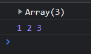

应用：（数组合并、数组克隆、伪数组转换）

```js
<div id = "d1"></div>
<div id = "d2"></div>

//1. 数组的合并 
const arr1 = ['v1','v2'];
const arr2 = ['v2','v4'];
// 传统的合并方式：const arr = arr1.concat(arr2);
const arr = [...arr1, ...arr2];
console.log(arr);
//2. 数组的克隆
const source = ['E','G','M'];
const copy = [...source]; // ['E','G','M']
console.log(copy);
//3. 将伪数组转为真正的数组
const divs = document.querySelectorAll('div');
const divArr = [...d];
console.log(divArr); // arguments
```


