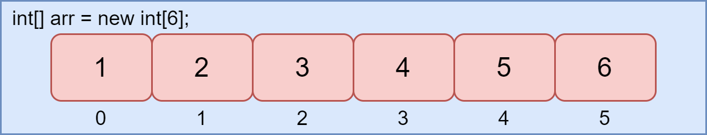
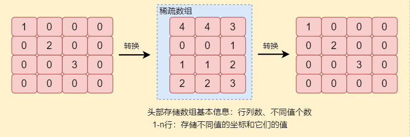
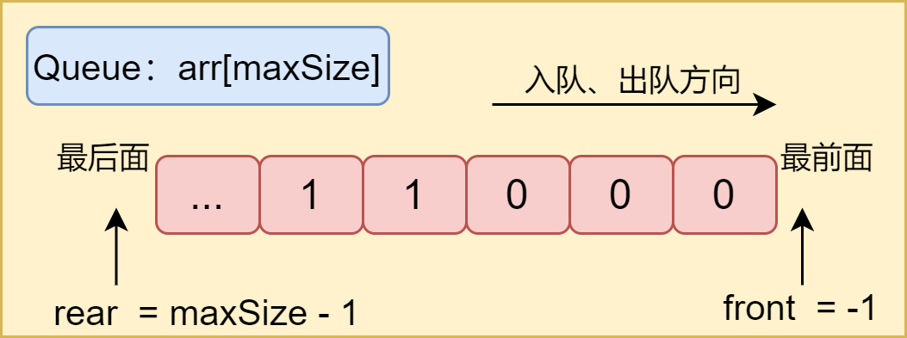

# 数据结构


## 简单说说数据结构和算法-概述

什么是算法？

以排序问题为例，对N个数进行大小排序，对数进行排序实现的操作逻辑就是算法，也可以说算法就是操作数据的逻辑。算，是计算机来运算；法，是我们程序员为交由计算机解决的问题而思考出来的解决问题的方法——只不过问题的最终解决是交由计算机这一工具来进行具体操作实现的，这个方法是以计算机为出发点的；写算法，也就是帮助计算机想个方法来让计算机能更好地解决问题，当然，更好的方法就是占用更少的资源、能更高效地解决某个问题的方法。

什么是数据结构？为什么数据结构和算法常常相随？

数据结构是数据的组织形式，数据之间以什么样的联系关联起来，或者说以什么样的方式组织起来，那我们就说这是什么什么结构。当然，数据结构的总结分类，已经由计算机前辈们总结出来了。算法的操作对象就是数据，万物皆可为数据，而不同的数据结构有着不同的优点，不同问题下数据规律也不一致，为了使得解决问题的方法更好——计算机运行起来更高效、更节约资源，就兼顾数据结构和不同问题下数据的规律，将这两者结合来来想出更好的方法，这也是学习数据结构和算法的方向——利用数据结构和数据规律，得到更优的运算过程和结果。

数据结构分类？

数据结构分为逻辑结构和存储结构。数据在物理上的存储形式，它在物理内存里以什么样的结构存储的——这就是数据的存储结构；而逻辑结构，是抽象上的，是人抽象出来的数据的组织形式，是要通过特定的方法来实现的，如果你没有实现，你也可以认为逻辑结构只存在大脑中，还没有在你的数据里存在。逻辑结构的实现依赖于存储。


如何学习数据结构和算法？

先学数据结构，要知道那几种数据结构是什么，说出其优缺点和应用场景，如何实现，要懂得用自己的话把某个数据结构描述清楚，可以针对性地找资料学，要得先会实现那些数据结构、知道它们各自的优缺点，算法就是利用数据结构这一工具来展开的。算法的学习需要大量的积累，需要去做算法题，并不是一朝一夕就能成的，网上找找别人的经验，多去做算法题目，多总结、多记录，当然少不了思考，好好地体验算法实现的过程。

注：以上仅个人简解，接受任何批评指教。

## 数据结构-数组

### 数组

数组是一种数据结构，其可以在内存中连续存储多个数据元素，在内存中的分配也是连续的。



如上图，是一个长度为6的int型数组。数组在创建的时候会在内存中开辟一段连续的内存，数组中的元素都是同一类型的（也就意味着数组中每一元素所占用的内存是一样的），数组长度确定后不能再修改，数组是引用类型，可存在多态行为：

```java
class Person{}
class Student extends Person{
    public static void main(String[] args){
        Person[] p = new Stunent[6];
    }
}
```

使用数组来存储数据的优点：数组成功创建后，每一个数据都有索引，可以通过其索引来对数据进行查询，按照索引来遍历数据也方便。

缺点：

1. 数组的大小固定后就无法扩容了（如果要扩容得新建另一个数组）。
2. 数组只能存储一种类型的数据。
3. 添加、删除的操作慢，因为每次添加或删除都要移动其他的元素。

因此，适用场景：频繁查询，对存储空间要求不大，很少增加和删除的情况。

### 稀疏数组

稀疏数组处理方法：把一个数组中不同值的信息（行、列和对应值）以及数组的信息（行数、列数、有多少个不同的值）都记录进另一个小规模的数组（稀疏数组）。如下：



使用的场景：当一个数组中大部分元素是同一个值时，此时可通过稀疏数组来降低需要存储的数据。

稀疏数组的实现模拟：

```java
/* 原始数组............................ */
int[][] originalArray = new int[4][4];
originalArray[0][0] = 1;
originalArray[1][1] = 2;
originalArray[2][2] = 3;
/* 稀疏数组............................ */
/* 将原始数组存为稀疏数组 */
/* 1.遍历得到原始数组中不同的值的个数*/
int sum = 0;
for (int i = 0; i < originalArray.length; i++) {
    for (int j = 0; j < originalArray.length; j++) {
        if (originalArray[i][j] != 0) {
            sum++;
        }
    }
}
/* 2.创建稀疏数组
* 思路：要存储原始数组的行数、列数、不同值 ===> 列数为3，存储不同值 ===> 根据不同的值的个数创建列数
* */
int[][] sparseArray = new int[sum + 1][3];
sparseArray[0] = new int[]{4,4,sum};
/* 3.将原始数组中不同的值放入稀疏数组
* 思路：1、明确要存放的东西：不同值的信息（坐标和值）
*      2、存放在稀疏数组中哪个位置：以遍历到的不同值的次序依次存放
* */
int count = 0; // 记录是第几个非0数
for (int i = 0; i < originalArray.length; i++) {
    for (int j = 0; j < originalArray.length; j++) {
        if (originalArray[i][j] != 0) {
            count++;
            sparseArray[count][0] = i;
            sparseArray[count][1] = j;
            sparseArray[count][2] = originalArray[i][j];
        }
    }
}
```

## 数据结构-队列和循环队列

### 队列

队列是只允许在一端进行插入操作、另一端进行删除操作的线性表，其特点就是遵循FIFO原则（先入先出原则，先进入队列的数据先出队列），队列可以通过数组或链表来实现。

使用数组来实现队列，队列是线性表，并且要达到先入先出的效果，分析：

- 线性表的容量是有限的——所以队列的具体容量应该是明确的。
- 分析先入先出：
  - 要为进入了队列的数据标记头部和尾部，规定进队、出队的方向。
  - 头部指向队列最前面的数据，那样出队时根据头部标志就能拿到最前面的数据。
  - 尾部指向队列最后面的数据，那样根据尾部标志就能知道有多少个数据入队了。
- 因为初始化队列时是还没有数据入队的，所以头部、尾部使用-1来标记，也方便入队、出队时标志位的改变。



由此，队列的基本信息应该如下（以组织整型数据的队列为例）：

```java
public class ArrayQueue {
    private int rear; // 后面
    private int front; // 前面
    private int maxSize; // 队列容量
    private int[] arr; // 队列实体数组
    // 用于实例化队列
    public ArrayQueue(int arrayMaxSize){
        maxSize = arrayMaxSize;
        arr = new int[maxSize];
        front = -1;
        rear = -1;
    }
}
/* 初始化时，队列中无入队的数据，此时头部、尾部没有能指向的具体数据，所以设为-1 */
```

头部是数据出队列的地方，尾部是数据入队列的地方：

- 刚开始初始化队列时，尾部、头部指向的地方一致。

- 当数据入队列时，尾部位置后移（+1），直到队列满（rear == maxSize - 1）；出队列时头部没有数据出队列，则头部仍然是原位置。
- 当数据出队列时，头部位置后移（+1），直到队列数据出队完毕；出队列时尾部没有数据入队，则尾部位置不变。

```java
// 根据尾部标志判断队列是否已满
public boolean isFull(){
    return rear == maxSize - 1;
}
// 判断队列是否为空
public boolean isEmpty(){
    return front == rear;
}
```

```java
// 添加数据进队列
public void addQueue(int n){
    if (isFull()){
        throw new RuntimeException("队列已满！");
    }
    rear++;
    arr[rear] = n;
}
// 取出队列中数据
public int getQueue(){
    if (isEmpty()){
        throw new RuntimeException("队列为空！");
    }
    front++;
    return arr[front];
}
```

队列的基本实现已经完成，再添加一些查看队列情况的工具方法：

```java
// 显示队列中所有数据
public void showQueue(){
    if (isEmpty()){
        throw new RuntimeException("队列为空！");
    }
    for (int i = 0; i < arr.length;i++){
        System.out.printf("arr[%d]=%d\n",i,arr[i]);
    }
}
// 获取队列的头数据
public int showHead(){
    if (isEmpty()){
        throw new RuntimeException("队列为空！");
    }
    return arr[front+1];
}
```

### 循环队列

单队列存在一个问题，那就是数据出队后空余出来的空间不能再提供给入队的，每次只能存放


