# 一.环境搭建

## 1.项目骨架搭建

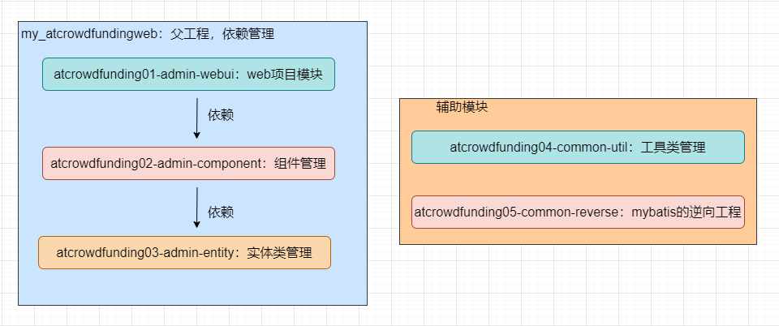

在父项目`my_atcrowdfundingweb`下创建三个子模块：

1. `atcrowdfunding01-admin-webui`：webapp项目，主模块，打包设为war。（引入依赖：`atcrowdfunding02-admin-component`）
2. `atcrowdfunding02-admin-component`：用于主要依赖的放置，减少主模块中pom文件的依赖配置。（引入依赖：`atcrowdfunding03-admin-entity`）
3. `atcrowdfunding03-admin-entity`：存放实体类。

辅助模块：

1. atcrowdfunding04-common-util：工具类管理，工具类也可直接放在主模块中，这样就不用再创建这个项目。
2. atcrowdfunding05-common-reverse：mybatis的逆向工程，用于生成数据库表的实体类、mapper接口、mapper.xml等，因为项目中我们只用到生成的这些文件，所以抽出来单独使用。

## 2.依赖选择与管理

父项目使用dependencyManagement来管理依赖，具体项目模块需要哪些就引入哪些。

### 使用spring涉及的相关依赖：

```xml
<lsl.spring.version>5.3.11</lsl.spring.version>
```

```xml
<!-- 使用spring涉及的相关依赖 start -->
<!-- Spring-ORM 提供了通过 ROM 技术访问数据库的简化样板，比如 Hibernate，My(i)Bati -->
<!-- https://mvnrepository.com/artifact/org.springframework/spring-orm -->
<dependency>
    <groupId>org.springframework</groupId>
    <artifactId>spring-orm</artifactId>
    <version>5.3.11</version>
</dependency>
<!-- https://mvnrepository.com/artifact/org.springframework/spring-webmvc -->
<dependency>
    <groupId>org.springframework</groupId>
    <artifactId>spring-webmvc</artifactId>
    <version>5.3.11</version>
</dependency>
<!-- https://mvnrepository.com/artifact/org.springframework/spring-test -->
<dependency>
    <groupId>org.springframework</groupId>
    <artifactId>spring-test</artifactId>
    <version>5.3.11</version>
    <scope>test</scope>
</dependency>
<!-- AOP织入 -->
<!-- https://mvnrepository.com/artifact/org.aspectj/aspectjweaver -->
<dependency>
    <groupId>org.aspectj</groupId>
    <artifactId>aspectjweaver</artifactId>
    <version>1.9.7</version>
    <scope>runtime</scope>
</dependency>
<!-- Cglib是一个强大的、高性能的代码生成包，它广泛被许多AOP框架使用，为他们提供方法的拦截 拦截器时用到 -->
<!-- https://mvnrepository.com/artifact/cglib/cglib -->
<dependency>
    <groupId>cglib</groupId>
    <artifactId>cglib</artifactId>
    <version>3.3.0</version>
</dependency>
<!-- 使用spring涉及的相关依赖 end -->
```

### 数据库、操作数据库的相关依赖：

```xml
<!-- 数据库、操作数据库的相关依赖 start -->
<!-- 数据库驱动 -->
<!-- https://mvnrepository.com/artifact/mysql/mysql-connector-java -->
<dependency>
    <groupId>mysql</groupId>
    <artifactId>mysql-connector-java</artifactId>
    <version>8.0.21</version>
</dependency>
<!-- 数据库连接池的依赖 druid -->
<!-- https://mvnrepository.com/artifact/com.alibaba/druid -->
<dependency>
    <groupId>com.alibaba</groupId>
    <artifactId>druid</artifactId>
    <version>1.2.8</version>
</dependency>
<!-- MyBatis的依赖 -->
<!-- https://mvnrepository.com/artifact/org.mybatis/mybatis -->
<dependency>
    <groupId>org.mybatis</groupId>
    <artifactId>mybatis</artifactId>
    <version>3.5.6</version>
</dependency>
<!-- spring与mybatis整合需要的依赖 -->
<!-- https://mvnrepository.com/artifact/org.mybatis/mybatis-spring -->
<dependency>
    <groupId>org.mybatis</groupId>
    <artifactId>mybatis-spring</artifactId>
    <version>2.0.6</version>
</dependency>
<!-- mybatis分页插件 pagehelper -->
<!-- https://mvnrepository.com/artifact/com.github.pagehelper/pagehelper -->
<dependency>
    <groupId>com.github.pagehelper</groupId>
    <artifactId>pagehelper</artifactId>
    <version>4.0.0</version>
</dependency>
<!-- 数据库、操作数据库的相关依赖 end -->
```

### 日志系统搭建需要的依赖：

```xml
<!-- 日志系统搭建需要的依赖 start -->
<!-- 日志：log4j，实际项目工程里引入前两个 -->
<!-- https://mvnrepository.com/artifact/org.slf4j/slf4j-api -->
<dependency>
    <groupId>org.slf4j</groupId>
    <artifactId>slf4j-api</artifactId>
    <version>1.7.32</version>
</dependency>
<!-- https://mvnrepository.com/artifact/ch.qos.logback/logback-classic -->
<dependency>
    <groupId>ch.qos.logback</groupId>
    <artifactId>logback-classic</artifactId>
    <version>1.2.7</version>
</dependency>
<!-- 其他日志框架的中间转换包 -->
<!-- https://mvnrepository.com/artifact/org.slf4j/jcl-over-slf4j -->
<dependency>
    <groupId>org.slf4j</groupId>
    <artifactId>jcl-over-slf4j</artifactId>
    <version>1.7.32</version>
</dependency>
<!-- https://mvnrepository.com/artifact/org.slf4j/jul-to-slf4j -->
<dependency>
    <groupId>org.slf4j</groupId>
    <artifactId>jul-to-slf4j</artifactId>
    <version>1.7.32</version>
</dependency>
<!-- 日志系统搭建需要的依赖 end -->
```

### json：

```xml
<!-- spring进行json数据转换的依赖 start -->
<!-- https://mvnrepository.com/artifact/com.fasterxml.jackson.core/jackson-core -->
<dependency>
    <groupId>com.fasterxml.jackson.core</groupId>
    <artifactId>jackson-core</artifactId>
    <version>2.13.0</version>
</dependency>
<!-- https://mvnrepository.com/artifact/com.fasterxml.jackson.core/jackson-databind -->
<dependency>
    <groupId>com.fasterxml.jackson.core</groupId>
    <artifactId>jackson-databind</artifactId>
    <version>2.13.0</version>
</dependency>
<!--  可以将一个Json字符转成一个Java对象，或者将一个Java转化为Json字符串 -->
<!-- https://mvnrepository.com/artifact/com.google.code.gson/gson -->
<dependency>
    <groupId>com.google.code.gson</groupId>
    <artifactId>gson</artifactId>
    <version>2.8.5</version>
</dependency>
<!-- spring进行json数据转换的依赖 end -->
```

### junit测试：

```xml
<!-- junit测试 start -->
<!-- https://mvnrepository.com/artifact/junit/junit -->
<dependency>
    <groupId>junit</groupId>
    <artifactId>junit</artifactId>
    <version>4.13.2</version>
    <scope>test</scope>
</dependency>
<!-- junit测试 end -->
```

### servlet的依赖：

（与前端进行数据展示等需要用到servlet的相关接口实现）

```xml
<!-- servlet容器相关依赖 start -->
<!-- https://mvnrepository.com/artifact/javax.servlet/javax.servlet-api -->
<dependency>
    <groupId>javax.servlet</groupId>
    <artifactId>javax.servlet-api</artifactId>
    <version>4.0.1</version>
    <scope>provided</scope>
</dependency>
<!-- servlet容器相关依赖 end -->
```

### thyme leaf的依赖：

```xml
<!--  thyme leaf的依赖 start -->
<!-- https://mvnrepository.com/artifact/org.thymeleaf/thymeleaf -->
<dependency>
    <groupId>org.thymeleaf</groupId>
    <artifactId>thymeleaf</artifactId>
    <version>3.0.11.RELEASE</version>
</dependency>
<!-- https://mvnrepository.com/artifact/org.thymeleaf/thymeleaf-spring5 -->
<dependency>
    <groupId>org.thymeleaf</groupId>
    <artifactId>thymeleaf-spring5</artifactId>
    <version>3.0.11.RELEASE</version>
</dependency>
<!--  thyme leaf的依赖 end -->
```

### 权限管理-SpringSecurity：

```xml
<lsl.spring.security.version>5.5.3</lsl.spring.security.version>
```

```xml
<!-- SpringSecurity start  -->
<!-- https://mvnrepository.com/artifact/org.springframework.security/spring-security-web -->
<dependency>
    <groupId>org.springframework.security</groupId>
    <artifactId>spring-security-web</artifactId>
    <version>${lsl.spring.security.version}</version>
</dependency>
<!-- SpringSecurity 配置 -->
<dependency>
    <groupId>org.springframework.security</groupId>
    <artifactId>spring-security-config</artifactId>
    <version>${lsl.spring.security.version}</version>
</dependency>

<!-- SpringSecurity 标签库 -->
<!-- https://mvnrepository.com/artifact/javax.servlet/jstl -->
<dependency>
    <groupId>org.springframework.security</groupId>
    <artifactId>spring-security-taglibs</artifactId>
    <version>${lsl.spring.security.version}</version>
</dependency>
<!-- SpringSecurity e -->
```

## 3.数据库的创建

创建数据库：

```sql
create database IF NOT EXISTS `project_crowd1` CHARACTER SET utf8 COLLATE utf8_general_ci;
```

创建用户表：

```sql
create table if not exists `t_admin`(
id int not null auto_increment comment '主键', 
login_acct varchar(255) not null comment '登录账号',
user_pswd char(32) not null comment '登录密码',
user_name varchar(255) not null comment '昵称',
email varchar(255) not null comment '邮件地址',
create_time char(19) comment '创建时间', 
primary key (id)
)engine=innodb default charset=utf8;
```

## 4.mybatis逆向工程

另开一个项目（不是在`my_atcrowdfundingweb`项目下），命名为atcrowdfunding05-common-reverse，用于根据数据库表来生成对应数据库表的实体类、mapper接口、mapper.xml文件，待后面直接复制进`my_atcrowdfundingweb`项目。该maven项目结构如下：

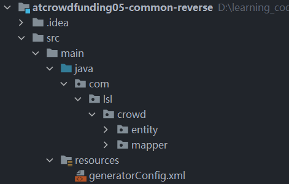

pom.xml：

```xml
<dependencies>
  <!-- mybatis的依赖 -->
  <!-- https://mvnrepository.com/artifact/org.mybatis/mybatis -->
  <dependency>
    <groupId>org.mybatis</groupId>
    <artifactId>mybatis</artifactId>
    <version>3.5.6</version>
  </dependency>
  <!-- mybatis逆向工程需要用到的依赖 -->
  <!-- https://mvnrepository.com/artifact/org.mybatis.generator/mybatis-generator-maven-plugin -->
  <dependency>
    <groupId>org.mybatis.generator</groupId>
    <artifactId>mybatis-generator-maven-plugin</artifactId>
    <version>1.4.0</version>
  </dependency>
</dependencies>

<!-- 控制 Maven 在构建项目过程中的相关配置 -->
<build>
  <finalName>atcrowdfunding05-common-reverse</finalName>
  <!-- 构建过程中用到的插件 -->
  <plugins>
  <!-- 具体插件，逆向工程的操作是以构建过程中插件形式出现的 -->
    <plugin>
        <groupId>org.mybatis.generator</groupId>
        <artifactId>mybatis-generator-maven-plugin</artifactId>
        <version>1.4.0</version>
        <!-- 插件的依赖 -->
        <dependencies>
        <!-- 逆向工程的核心依赖 -->
          <!-- https://mvnrepository.com/artifact/org.mybatis.generator/mybatis-generator-core -->
          <dependency>
            <groupId>org.mybatis.generator</groupId>
            <artifactId>mybatis-generator-core</artifactId>
            <version>1.4.0</version>
          </dependency>
          <!-- 数据库连接池 -->
          <!-- https://mvnrepository.com/artifact/com.mchange/c3p0 -->
          <dependency>
            <groupId>com.mchange</groupId>
            <artifactId>c3p0</artifactId>
            <version>0.9.5.5</version>
          </dependency>
          <!-- MySQL 驱动 -->
          <!-- https://mvnrepository.com/artifact/mysql/mysql-connector-java -->
          <dependency>
            <groupId>mysql</groupId>
            <artifactId>mysql-connector-java</artifactId>
            <version>8.0.25</version>
          </dependency>
        </dependencies>
    </plugin>
  </plugins>
</build>
```

generatorConfig.xml：

```xml
<?xml version="1.0" encoding="UTF-8"?>
<!DOCTYPE generatorConfiguration
        PUBLIC "-//mybatis.org//DTD MyBatis Generator Configuration 1.0//EN"
        "http://mybatis.org/dtd/mybatis-generator-config_1_0.dtd">
<generatorConfiguration>
    <!-- mybatis-generator:generate -->
    <context id="lslTables" targetRuntime="MyBatis3">
        <commentGenerator>
            <!-- 是否去除自动生成的注释 true:是;false:否 -->
            <property name="suppressAllComments" value="true" />
        </commentGenerator>
        <!--数据库连接的信息：驱动类、连接地址、用户名、密码 -->
        <jdbcConnection
                driverClass="com.mysql.cj.jdbc.Driver" connectionURL="jdbc:mysql://localhost:3306/project_crowd" userId="root" password="123456">
        </jdbcConnection>
        <!-- 默认 false，把 JDBC DECIMAL 和 NUMERIC 类型解析为 Integer，为 true 时把
        JDBC DECIMAL
        和 NUMERIC 类型解析为 java.math.BigDecimal -->
        <javaTypeResolver>
            <property name="forceBigDecimals" value="false" />
        </javaTypeResolver>
        <!-- targetProject:生成 Entity 类的路径 -->
        <javaModelGenerator targetProject=".\src\main\java"
                            targetPackage="com.lsl.crowd.entity">
            <!-- enableSubPackages:是否让 schema 作为包的后缀 -->
            <property name="enableSubPackages" value="false" />
            <!-- 从数据库返回的值被清理前后的空格 -->
            <property name="trimStrings" value="true" />
        </javaModelGenerator>
        <!-- targetProject:XxxMapper.xml 映射文件生成的路径 -->
        <sqlMapGenerator targetProject=".\src\main\java"
                         targetPackage="com.lsl.crowd.mapper">
            <!-- enableSubPackages:是否让 schema 作为包的后缀 -->
            <property name="enableSubPackages" value="false" />
        </sqlMapGenerator>
        <!-- targetPackage：Mapper 接口生成的位置 -->
        <javaClientGenerator type="XMLMAPPER"
                             targetProject=".\src\main\java"
                             targetPackage="com.lsl.crowd.mapper">
            <!-- enableSubPackages:是否让 schema 作为包的后缀 -->
            <property name="enableSubPackages" value="false" />
        </javaClientGenerator>
        <!-- 数据库表名字和我们的 entity 类对应的映射指定  如果要创建其他表的，下次修改这个即可创建 -->
        <table tableName="t_admin" domainObjectName="Admin" />
    </context>
</generatorConfiguration>
```

配置好后：执行maven插件命令，如下

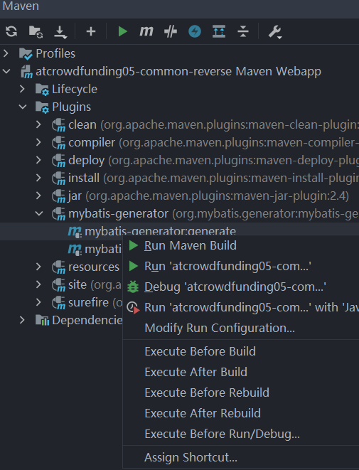

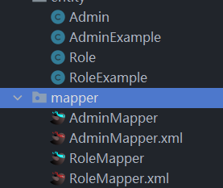


最后生成如上图的类、接口和含SQL命令的xml文件，把文件移到主项目的entity、dao包下。

## 5.子项目依赖配置

`atcrowdfunding02-admin-component`的常用依赖：

```xml
<dependencies>
    <!-- spring的相关依赖 start -->
    <!-- Spring-ORM 提供了通过 ROM 技术访问数据库的简化样板，比如 Hibernate，My(i)Batis -->
    <!-- https://mvnrepository.com/artifact/org.springframework/spring-orm -->
    <dependency>
        <groupId>org.springframework</groupId>
        <artifactId>spring-orm</artifactId>
    </dependency>
    <!-- https://mvnrepository.com/artifact/org.springframework/spring-webmvc -->
    <dependency>
        <groupId>org.springframework</groupId>
        <artifactId>spring-webmvc</artifactId>
    </dependency>
    <!-- https://mvnrepository.com/artifact/org.springframework/spring-test -->
    <dependency>
        <groupId>org.springframework</groupId>
        <artifactId>spring-test</artifactId>
        <scope>test</scope>
    </dependency>
    <!-- https://mvnrepository.com/artifact/org.aspectj/aspectjweaver -->
    <dependency>
        <groupId>org.aspectj</groupId>
        <artifactId>aspectjweaver</artifactId>
        <scope>runtime</scope>
    </dependency>
    <!-- Cglib是一个强大的、高性能的代码生成包，它广泛被许多AOP框架使用，为他们提供方法的拦截 -->
    <!-- https://mvnrepository.com/artifact/cglib/cglib -->
    <dependency>
        <groupId>cglib</groupId>
        <artifactId>cglib</artifactId>
    </dependency>
    <!-- spring的相关依赖 start -->

    <!-- 数据库 start -->
    <!-- 数据库驱动 -->
    <!-- https://mvnrepository.com/artifact/mysql/mysql-connector-java -->
    <dependency>
        <groupId>mysql</groupId>
        <artifactId>mysql-connector-java</artifactId>
    </dependency>
    <!-- 数据库连接池的依赖 -->
    <!-- https://mvnrepository.com/artifact/com.alibaba/druid -->
    <dependency>
        <groupId>com.alibaba</groupId>
        <artifactId>druid</artifactId>
    </dependency>
    <!-- 数据库 end -->

    <!-- mybatis  start -->
    <!-- MyBatis的依赖 -->
    <!-- https://mvnrepository.com/artifact/org.mybatis/mybatis -->
    <dependency>
        <groupId>org.mybatis</groupId>
        <artifactId>mybatis</artifactId>
    </dependency>
    <!-- spring与mybatis整合 -->
    <!-- https://mvnrepository.com/artifact/org.mybatis/mybatis-spring -->
    <dependency>
        <groupId>org.mybatis</groupId>
        <artifactId>mybatis-spring</artifactId>
    </dependency>
    <!-- mybatis分页插件 -->
    <!-- https://mvnrepository.com/artifact/com.github.pagehelper/pagehelper -->
    <dependency>
        <groupId>com.github.pagehelper</groupId>
        <artifactId>pagehelper</artifactId>
    </dependency>
    <!-- mybatis  end -->

    <!-- 日志系统搭建需要的依赖 start -->
    <!-- 日志：log4j -->
    <!-- https://mvnrepository.com/artifact/org.slf4j/slf4j-api -->
    <dependency>
        <groupId>org.slf4j</groupId>
        <artifactId>slf4j-api</artifactId>
    </dependency>
    <!-- https://mvnrepository.com/artifact/ch.qos.logback/logback-classic -->
    <dependency>
        <groupId>ch.qos.logback</groupId>
        <artifactId>logback-classic</artifactId>
    </dependency>
    <!-- 日志系统搭建需要的依赖 end -->

    <!-- spring进行json数据转换的依赖 start -->
    <!-- https://mvnrepository.com/artifact/com.fasterxml.jackson.core/jackson-core -->
    <dependency>
        <groupId>com.fasterxml.jackson.core</groupId>
        <artifactId>jackson-core</artifactId>
    </dependency>
    <!-- https://mvnrepository.com/artifact/com.fasterxml.jackson.core/jackson-databind -->
    <dependency>
        <groupId>com.fasterxml.jackson.core</groupId>
        <artifactId>jackson-databind</artifactId>
    </dependency>
    <!--  可以将一个Json字符转成一个Java对象，或者将一个Java转化为Json字符串 -->
    <!-- https://mvnrepository.com/artifact/com.google.code.gson/gson -->
    <dependency>
        <groupId>com.google.code.gson</groupId>
        <artifactId>gson</artifactId>
    </dependency>
    <!-- spring进行json数据转换的依赖 end -->
</dependencies>
```

atcrowdfunding01-admin-webui的依赖：

```xml
<dependencies>
  <dependency>
    <groupId>org.example</groupId>
    <artifactId>atcrowdfunding02-admin-component</artifactId>
    <version>1.0-SNAPSHOT</version>
  </dependency>

  <!--  thyme leaf的依赖 start -->
  <!-- https://mvnrepository.com/artifact/org.thymeleaf/thymeleaf -->
  <dependency>
    <groupId>org.thymeleaf</groupId>
    <artifactId>thymeleaf</artifactId>
  </dependency>
  <!-- https://mvnrepository.com/artifact/org.thymeleaf/thymeleaf-spring5 -->
  <dependency>
    <groupId>org.thymeleaf</groupId>
    <artifactId>thymeleaf-spring5</artifactId>
  </dependency>
  <!--  thyme leaf的依赖 end -->

  <!-- servlet容器相关依赖 start -->
  <!-- https://mvnrepository.com/artifact/javax.servlet/javax.servlet-api -->
  <dependency>
    <groupId>javax.servlet</groupId>
    <artifactId>javax.servlet-api</artifactId>
    <scope>provided</scope>
  </dependency>
  <!-- servlet容器相关依赖 end -->
  
  <!-- junit测试 start -->
  <!-- https://mvnrepository.com/artifact/junit/junit -->
  <dependency>
    <groupId>junit</groupId>
    <artifactId>junit</artifactId>
    <scope>test</scope>
  </dependency>
  <dependency>
    <groupId>org.springframework</groupId>
    <artifactId>spring-test</artifactId>
    <scope>test</scope>
  </dependency>
  <!-- junit测试 end -->
</dependencies>
```

## 6.spring整合mybatis

**目标：**进行数据库的增删改查操作。

**思路：**传统的jdbc编程太过繁琐、耦合高，使用spring、mybatis框架来连接、操作数据库更加方便、快捷；数据库连接池、SqlSessionFactory等交由spring的IOC容器管理。整合具体步骤：

1. 确定mybatis和spring的依赖都导入完毕；
2. 确定好映射文件、映射接口所在目录并创建；
3. 编写初始化spring容器的配置文件（这里先配置好数据源、SqlSessionFactory、自动映射配置MapperScannerConfigurer，要使用到spring的注解，所以也开启注解扫描）；
4. 编写mybatis的全局配置文件，数据源已经交由spring管理了，所以这里不需要配数据源，其它的按需配置；
5. 单元测试。

**代码：**

1.只用来管理mybatis的spring配置文件：spring-init-mybatis.xml

```xml
<beans xmlns="http://www.springframework.org/schema/beans"
       xmlns:xsi="http://www.w3.org/2001/XMLSchema-instance"
       xmlns:context="http://www.springframework.org/schema/context"
       xsi:schemaLocation="http://www.springframework.org/schema/beans
        https://www.springframework.org/schema/beans/spring-beans.xsd http://www.springframework.org/schema/context https://www.springframework.org/schema/context/spring-context.xsd">
    <!-- 导入外部properties文件 -->
    <context:property-placeholder location="classpath:jdbc.properties"/>
    <!-- 开启spring注解扫描 -->
    <context:component-scan base-package="com.lsl.crowd.service"/>

    <!-- 数据源 -->
    <bean id="dataSource" class="com.alibaba.druid.pool.DruidDataSource" destroy-method="close">
        <property name="driverClassName" value="${jdbc.driver}"/>
        <property name="url" value="${jdbc.url}"/>
        <property name="username" value="${jdbc.name}"/>
        <property name="password" value="${jdbc.password}"/>
    </bean>
    <bean id="sqlSessionFactory" class="org.mybatis.spring.SqlSessionFactoryBean">
        <property name="dataSource" ref="dataSource"/>
        <property name="configLocation" value="classpath:mybatis/mybatis-config.xml"/>
        <!-- mapper.xml文件 -->
        <property name="mapperLocations" value="classpath:mybatis/mapper/*Mapper.xml"/>
        <!-- 分页插件的使用 -->

    </bean>
    <!-- 自动扫描 为Mapper接口生成代理注入到Spring -->
    <bean class="org.mybatis.spring.mapper.MapperScannerConfigurer">
        <property name="sqlSessionFactoryBeanName" value="sqlSessionFactory"/>
        <!-- 扫描该包下的接口 然后创建各自接口的动态代理类 -->
        <property name="basePackage" value="com.lsl.crowd.dao"/>
    </bean>
</beans>
```

```properties
# 连接数据库的配置文件
jdbc.driver=com.mysql.cj.jdbc.Driver
jdbc.url=jdbc:mysql://localhost:3306/project_crowd?characterEncoding=utf8&amp;useUnicode=true&amp;useSSL=false&amp;serverTimezone=Asia/Shanghai
jdbc.name=root
jdbc.password=123456
```

## 单元测试

项目的test目录和其他test目录下带test的类都是用来进行单元测试的。

```java
@RunWith(SpringJUnit4ClassRunner.class)
/* 初始化容器 */
@ContextConfiguration(locations = {"classpath:spring-mybatis.xml"})
public class CrowdTest {

    /* 测试数据源 */
    @Autowired
    DataSource dataSource;
    @Test
    public void testDataSource() throws SQLException {
        Connection connection = dataSource.getConnection();
        System.out.println(connection);
    }

    /* 测试mybatis */
    @Autowired
    AdminService adminService;
    @Test
    public void testMyBatis(){
        Admin admin = adminService.getAdmin(1);
        System.out.println(admin);
    }
}
```

## 7.搭建日志系统

### 日志概述

系统在运行过程中出了问题就需要通过日志来进行排查，所以我们在上手任何新技术的时候，都要习惯性的关注一下它是如何打印日志的。

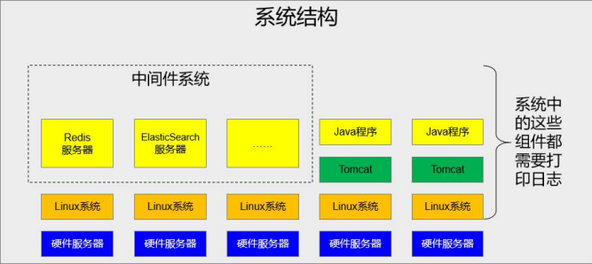


### 简单搭建

上面的步骤已经引入了日志需要的相关依赖：

```xml
<!-- 日志系统搭建需要的依赖 start -->
<!-- 日志：log4j -->
<!-- https://mvnrepository.com/artifact/org.slf4j/slf4j-api -->
<dependency>
    <groupId>org.slf4j</groupId>
    <artifactId>slf4j-api</artifactId>
</dependency>
<!-- https://mvnrepository.com/artifact/ch.qos.logback/logback-classic -->
<dependency>
    <groupId>ch.qos.logback</groupId>
    <artifactId>logback-classic</artifactId>
</dependency>
<!-- 日志系统搭建需要的依赖 end -->
```

后面在resource目录下加上一个日志的配置文件就好了，这里不涉及过多的关于日志的知识；配置文件名为logback.xml，具体内容如下：

```xml
<?xml version="1.0" encoding="UTF-8"?>
<configuration debug="true">
    <!-- 指定日志输出的位置 这里是输出到控制台 -->
    <appender name="STDOUT" class="ch.qos.logback.core.ConsoleAppender">
        <encoder>
            <!-- 日志输出的格式 -->
            <!-- 按照顺序分别是：时间、日志级别、线程名称、打印日志的类、日志主体
            内容、换行 -->
            <pattern>[%d{HH:mm:ss.SSS}] [%-5level] [%thread] [%logger]
                [%msg]%n</pattern>
        </encoder>
    </appender>
    <!-- 设置全局日志级别。日志级别按顺序分别是：DEBUG、INFO、WARN、ERROR -->
    <!-- 指定任何一个日志级别都只打印当前级别和后面级别的日志。 -->
    <root level="INFO">
        <!-- 指定打印日志的 appender，这里通过“STDOUT”引用了前面配置的 appender -->
        <appender-ref ref="STDOUT" />
    </root>
    <!-- 根据特殊需求指定局部日志级别 -->
    <logger name="com.lsl.crowd.mapper" level="DEBUG"/>
</configuration>
```

## 8.spring声明式事务搭建

**目标：**由 Spring 来全面接管数据库事务。用声明式代替编程式。

**思路：**spring的事务使用了AOP思想，面向切面来为数据库操作添加事务处理。（复习spring的AOP思想与实现）

具体实现步骤：

1. 确定所需依赖都已导入；（spring-orm中就已经包括了spring-tx的包）
2. spring的事务，创建spring容器初始化配置spring-tx.xml，配置事务管理器和切面、切点、通知等；
3. 测试。（可以插入 1/0 之类的或抛出异常，查看日志是否会回滚）

**代码：**

需要的依赖spring、spring-tx、aop的：

```xml
<dependency>
            <groupId>org.springframework</groupId>
            <artifactId>spring-orm</artifactId>
        </dependency>
<dependency>
    <groupId>org.aspectj</groupId>
    <artifactId>aspectjweaver</artifactId>
    <scope>runtime</scope>
</dependency>
<!-- Cglib是一个强大的、高性能的代码生成包，它广泛被许多AOP框架使用，为他们提供方法的拦截 -->
<!-- https://mvnrepository.com/artifact/cglib/cglib -->
<dependency>
    <groupId>cglib</groupId>
    <artifactId>cglib</artifactId>
</dependency>
```

spring-init-tx.xml：

```xml
<?xml version="1.0" encoding="UTF-8"?>
<beans xmlns="http://www.springframework.org/schema/beans"
       xmlns:xsi="http://www.w3.org/2001/XMLSchema-instance"
       xmlns:context="http://www.springframework.org/schema/context"
       xmlns:aop="http://www.springframework.org/schema/aop"
       xmlns:tx="http://www.springframework.org/schema/tx"
       xsi:schemaLocation="http://www.springframework.org/schema/beans
    http://www.springframework.org/schema/beans/spring-beans.xsd
    http://www.springframework.org/schema/context
    http://www.springframework.org/schema/context/spring-context.xsd
    http://www.springframework.org/schema/aop
    http://www.springframework.org/schema/aop/spring-aop.xsd
    http://www.springframework.org/schema/tx
    http://www.springframework.org/schema/tx/spring-tx.xsd">
    <!-- spring事务管理器的配置 -->
    <!-- 扫描软件包，使注解生效 -->
    <context:component-scan base-package="com.lsl.crowd.service"/>
    <!-- 配置事务管理器 -->
    <bean id="txManager" class="org.springframework.jdbc.datasource.DataSourceTransactionManager">
        <!-- 数据源已经在另一个spring容器配置文件声明创建了，运行时就能从ioc容器拿到了 -->
        <property name="dataSource" ref="dataSource"/>
    </bean>
    <!-- 配置事务切面 -->
    <aop:config>
        <aop:pointcut id="txPointcut" expression="execution(* *..*ServiceImpl.*(..))"/>
        <!-- 将切点表达式和事务通知关联 -->
        <aop:advisor advice-ref="txAdvice" pointcut-ref="txPointcut"/>
    </aop:config>
    <!-- 配置事务通知 -->
    <tx:advice id="txAdvice" transaction-manager="txManager">
        <!-- 配置事务属性 -->
        <tx:attributes>
            <!-- 查询方法：配置只读属性，让数据库知道这是一个查询操作，能够进行一定优化 -->
            <tx:method name="get*" read-only="true"/>
            <tx:method name="find*" read-only="true"/>
            <tx:method name="query*" read-only="true"/>
            <tx:method name="count*" read-only="true"/>
            <!-- 增删改方法：配置事务传播行为、回滚异常 -->
            <!--propagation="REQUIRED" ：
            REQUIRED，默认值，表示当前方法必须工作在事务中，如果当前线程没有已经开启的事务则自己开启；如果有则使用已有的
            REQUIRES_NEW：建议使用的值，不管当前线程是否有事务，都要自己开事务并在自己的事务中执行，不会受到其他事务的影响
            -->
            <!--rollback-for：配置事务方法针对什么样的异常就回滚
            默认：运行时异常回滚
            建议：运行时异常、编译时异常都回滚
            -->
            <!-- tx:method是必须要配置的，如果某个方法没有配置对应的tx:method，则事务对这个方法不生效 -->
            <tx:method name="save*" propagation="REQUIRES_NEW" rollback-for="java.lang.Exception"/>
            <tx:method name="update*" propagation="REQUIRES_NEW" rollback-for="java.lang.Exception"/>
            <tx:method name="remove*" propagation="REQUIRES_NEW" rollback-for="java.lang.Exception"/>
            <tx:method name="batch*" propagation="REQUIRES_NEW" rollback-for="java.lang.Exception"/>
        </tx:attributes>
    </tx:advice>
</beans>
```

## 9.整合SpringMVC

SpringMVC是基于模型-视图-控制器（model、view、controller）模式实现，用于构建灵活、松耦合的web应用程序。（前端请求处理、页面展示渲染、参数接收处理、表单参数接收处理等。）

**SpringMVC与Servlet：**

Servlet：性能最好，处理Http请求的标准。SpringMVC：开发效率高（好多共性的东西都封装好了，是对Servlet的封装，核心的DispatcherServlet最终继承自HttpServlet）这两者的关系，就如同MyBatis和JDBC，一个性能好，一个开发效率高，是对另一个的封装。（复习servlet、springmvc的核心技术）


整合步骤：

1. 依赖导入（这里页面使用thymeleaf模板引擎来渲染，需要导入thymeleaf的依赖）；
2. SpringMVC的全局配置文件spring-init-mvc.xml，用来配置视图解析器、开启注解支持、配置拦截器（后面再配）等；
3. Tomcat的web.xml配置（配置servlet（中央调度器）、处理字符编码问题的过滤器、以及初始化IOC容器）；
4. 测试。（要学习thymeleaf的语法，测试各个功能）

spring-init-mvc.xml：

```xml
<?xml version="1.0" encoding="UTF-8"?>
<beans xmlns="http://www.springframework.org/schema/beans"
       xmlns:xsi="http://www.w3.org/2001/XMLSchema-instance"
       xmlns:context="http://www.springframework.org/schema/context"
       xsi:schemaLocation="http://www.springframework.org/schema/beans
        https://www.springframework.org/schema/beans/spring-beans.xsd http://www.springframework.org/schema/context https://www.springframework.org/schema/context/spring-context.xsd">
    <!-- 组件扫描器，使注解生效 -->
    <context:component-scan base-package="com.lsl.crowd.test"/>
    <context:component-scan base-package="com.lsl.crowd.mvc"/>

    <!-- thymeleaf的视图解析器 会与冲突：ContentNegotiatingViewResolver-->
    <bean id="viewResolver" class="org.thymeleaf.spring5.view.ThymeleafViewResolver">
        <property name="characterEncoding" value="UTF-8"/>
        <property name="templateEngine" ref="templateEngine"/>
    </bean>
    <!-- 模板引擎 -->
    <bean id="templateEngine" class="org.thymeleaf.spring5.SpringTemplateEngine">
        <property name="templateResolver" ref="templateResolver"/>
    </bean>
    <!-- 模板解析器 -->
    <bean id="templateResolver" class="org.thymeleaf.templateresolver.ServletContextTemplateResolver">
        <constructor-arg ref="servletContext"/>
        <property name="prefix" value="/WEB-INF/view/"/>
        <property name="suffix" value=".html"/>
        <property name="templateMode" value="HTML5"/>
        <property name="cacheable" value="false"/>
        <property name="characterEncoding" value="UTF-8"/>
    </bean>
</beans>
```

web.xml：

```xml
<?xml version="1.0" encoding="UTF-8"?>
<web-app  xmlns = "http://xmlns.jcp.org/xml/ns/javaee"
          xmlns:xsi="http://www.w3.org/2001/XMLSchema-instance"
          xsi:schemaLocation="http://xmlns.jcp.org/xml/ns/javaee http://xmlns.jsp.org/xml/ns/javaee/web-app_4_0.xsd"
          version="4.0"
          metadata-complete="true"
>

  <display-name>Archetype Created Web Application</display-name>

 <!-- IOC容器配置定位 -->
  <context-param>
    <param-name>contextConfigLocation</param-name>
    <param-value>classpath:spring-init-*.xml</param-value>
  </context-param>
  <!-- 注册spring的监听器 作用是加载Spring的配置文件，根据Spring的配置文件初始化IOC容器-->
  <listener>
    <listener-class>org.springframework.web.context.ContextLoaderListener</listener-class>
  </listener>

  <!-- 注册字符集过滤器，解决编码问题 start -->
  <filter>
    <filter-name>characterEncodingFilter</filter-name>
    <filter-class>org.springframework.web.filter.CharacterEncodingFilter</filter-class>
    <!-- 设置项目中使用的字符编码 -->
    <init-param>
      <param-name>encoding</param-name>
      <param-value>UTF-8</param-value>
    </init-param>
    <!-- 强制请求对象（HttpServletRequest）使用 -->
    <init-param>
      <param-name>forceRequestEncoding</param-name>
      <param-value>true</param-value>
    </init-param>
    <!-- 强制应答对象(HttpServletResponse)使用 -->
    <init-param>
      <param-name>forceResponseEncoding</param-name>
      <param-value>true</param-value>
    </init-param>
  </filter>
  <filter-mapping>
    <filter-name>characterEncodingFilter</filter-name>
    <!-- 强制所有请求先经过过滤器 -->
    <url-pattern>/*</url-pattern>
  </filter-mapping>
  <!-- 注册字符集过滤器，解决编码问题 end -->

  <!--注册中央调度器-->
  <servlet>
    <servlet-name>springDispatcherServlet</servlet-name>
    <servlet-class>org.springframework.web.servlet.DispatcherServlet</servlet-class>
    <!-- 根据配置初始化 springmvc容器 -->
    <init-param>
      <param-name>contextConfigLocation</param-name>
      <param-value>classpath:spring-web-mvc.xml</param-value>
    </init-param>
    <!-- 随服务启动而加载 -->
    <load-on-startup>1</load-on-startup>
  </servlet>
  <servlet-mapping>
    <servlet-name>springDispatcherServlet</servlet-name>
    <url-pattern>/</url-pattern>
    <url-pattern>/*.json</url-pattern>
  </servlet-mapping>
</web-app>
```

## ~~10.RESTFul风格使用~~

**（后面实现的时候，发现传入多参数时还遵循restful规范并不好使，而且也把握不住，所以就没有去遵循restful规范了，这一步也就没有意义了，不过在静态资源的处理的时候出现的问题还是有意义的，这里最主要的就是对静态资源的处理，过滤器可以不用设置）**

RESTFul风格提倡的URI风格：从前到后使用斜杠分开，不使用问号键值对方式携带请求参数，而是将发送给服务器的数据作为URI的一部分。

使用操作动词表示操作方式：GET（获取）、POST（新建）、PUT（修改）、DELETE（删除）。

具体操作：

1.中央调度器的url-pattern不能再使用`*.do`的方式，而是使用`/`，因为Tomcat的servlet处理静态资源的servlet也是/，所以会导致被覆盖从而没有servlet来处理静态资源了，因此需要在SpringMVC全局配置文件加入以下内容：（静态资源统一放入一个static目录）

```xml
<!-- 开启mvc注解驱动 解决mvc:resources和@RequestMapping注解的冲突 -->
<mvc:annotation-driven/>
<!-- 加入此配置后框架会自动创建一个处理器对象（ResourceHttpServletRequestHangler），这个处理器对象用来处理静态资源的访问 -->
<mvc:resources mapping="/static/**" location="/static/"/>
```

【注意】：Tomcat有一个名为default的servlet的url-pattern也是/，当设置中央调度器的url-pattern也为/时，tomcat将会失效，此时也将不能使用welcome-file-list标签（因为中央调度器没有处理静态资源的能力），不过处理静态资源有另一种方式就是是使用`<mvc:annotation-driven/>`和`<mvc:default-servlet-handler/>`可以解决这时的welcome-file-list标签失效的问题，这时是由框架生成了一个handler来转发给tomcat的默认servlet。

2.因为要使用到HTTP的一些动词（PUT、DELETE），而一些浏览器不支持，所以使用springmvc框架的一个过滤器：

```xml
<!-- 该过滤器会获取请求参数，所以要在编码设置的过滤器后再加载该过滤器 -->
<filter>
  <filter-name>HiddenHttpMethodFilter</filter-name>
  <filter-class>org.springframework.web.filter.HiddenHttpMethodFilter</filter-class>
</filter>
<filter-mapping>
  <filter-name>HiddenHttpMethodFilter</filter-name>
  <url-pattern>/*</url-pattern>
</filter-mapping>
```

3.配置好后controller配置method属性，URI不应有动词。

后面再补充

## 11.Ajax与JSON

前端发送过来，后端要处理的请求有两种： 

1. 普通请求：后端处理完成后返回页面，浏览器使用使用页面替换整个窗口中的内容 。
2. Ajax 请求：后端处理完成后通常返回 JSON 数据，jQuery 代码使用JSON 数据对页面局部更新。

**目标：**Ajax请求与服务端处理请求返回json格式的数据，实现页面的局部数据更新。

**思路：**Ajax请求可以使用jQuery，json格式支持需要依赖，使用注解@ResponseBody或@RestController。ajax请求发送数据有多种方式，根据需求选择最合适的。整个过程分为：ajax请求发起-服务器端响应回json数据-ajax接收并处理响应数据-页面渲染数据-更新完成）。

**代码：**

1.依赖：atcrowdfunding02-admin-component中已经引入了json支持的相关依赖。

2.ajax复习（不用管ajax最原始的实现方式，直接使用框架，复习ajax请求相关知识、能做哪些数据实现）。

对ajax请求返回结果进行统一（封装），请求封装包括请求结果（成功或失败）、返回数据、异常信息。

```java
public class ResultEntity<T> {

    public static final String SUCCESS = "SUCCESS";
    public static final String FAILED = "FAILED";
    private String result;
    private String message;
    private T data;
    /**
     * 请求处理成功而且不需要返回数据时使用的方法
     * @return
     * */
    public static <Type> ResultEntity<Type> successWithoutData() {
        return new ResultEntity<Type>(SUCCESS,null,null);
    }
    /**
     * 请求处理成功且需要返回数据时使用的方法
     *  @param data
     * @return
     * */
    public static <Type> ResultEntity<Type> successWithData(Type data) {
        return new ResultEntity<Type>(SUCCESS,null,data);
    }
    /**
     * 请求处理失败后使用的方法
     * @param message
     * @return
     * */
    public static <Type> ResultEntity<Type> failed(String message) {
        return new ResultEntity<Type>(FAILED,message,null);
    }


    public ResultEntity() {
    }

    public ResultEntity(String result, String message, T data) {
        this.result = result;
        this.message = message;
        this.data = data;
    }
}
```

## 12.静态资源引入

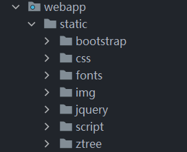

## 13.请求异常处理

**目标：**请求的异常处理，请求分为普通的请求和ajax请求，普通请求的异常返回错误页面，ajax请求的异常返回json数据。

**思路：**springmvc采用全局统一的异常处理，通过面向切面编程思想把异常集中到一个地方，实现逻辑代码和业务代码的分离，完成解耦合，其提供了基于XML和基于注解的两种异常处理方式。

1. 基于XML的和基于注解的，基于注解的用于处理一些自定义的异常。
2. 异常处理要分请求，所以异常处理前先要判断是普通请求还是ajax请求。

**代码：**

1.基于XML的：

```xml
<!-- 基于XML的异常映射 -->
<bean id="simpleMappingExceptionResolver" class="org.springframework.web.servlet.handler.SimpleMappingExceptionResolver">
    <!-- 配置异常类型和具体视图之间的关系 -->
    <property name="exceptionMappings">
        <props>
            <!-- key属性指定异常全类名 -->
            <!-- 标签体写对应的视图（该视图会经视图解析器） -->
            <prop key="java.lang.Exception">system-error</prop>
        </props>
    </property>
</bean>
```

2.基于注解的：

1. 判断请求的工具类（没必要自己写，直接找个来用就行了）

   ```java
   public class CrowdUtil {
       /**
        * 判断当前请求是否为Ajax请求
        * @param request 请求对象
        * @return
        *      true：是Ajax请求
        *      false：不是Ajax请求
        * */
       public static boolean judgeRequestType(HttpServletRequest request) {
           // 获取请求消息头
           String acceptHeader = request.getHeader("Accept");
           String xRequestHeader = request.getHeader("X-Request-With");
           // 判断
           return  ((acceptHeader !=null && acceptHeader.contains("application/json"))
                   ||
                   (xRequestHeader != null && xRequestHeader.equals("XMLHttpRequest")));
       }
   
       /**
        * 对明文字符串进行md5加密
        * @param source 传入的明文字符串
        * @return 加密结果
        * */
   
       public static String md5(String source) {
           if (source == null && source.length() == 0) {
               throw new RuntimeException(CrowdConstant.MESSAGE_STRING_INVALIDATE);
           }
   
           try {
               String algorithm = "md5";
               MessageDigest messageDigest = MessageDigest.getInstance(algorithm);
               // 获取字符串对应字节
               byte[] input = source.getBytes();
               // 执行加密
               byte[] output = messageDigest.digest(input);
   
               int signum = 1;
               BigInteger bigInteger = new BigInteger(signum, output);
               // 按16进制将值转换为字符串
               int radix = 16;
               String encoded = bigInteger.toString(radix).toUpperCase();
               return encoded;
           } catch (NoSuchAlgorithmException e) {
               e.printStackTrace();
           }
           return null;
       }
   }
   ```

2. 异常处理器类（@ControllerAdvice、@ExceptionHandler的使用，应用思路：异常自动捕获、绑定视图跳转、视图层展示异常信息）

   ```java
   @ControllerAdvice
   public class CrowdExceptionResolver {
       @ExceptionHandler(value = ArithmeticException.class)
       public ModelAndView resolveMathException(ArithmeticException exception, HttpServletRequest request, HttpServletResponse response) throws IOException {
           String viewName = "system-error";
           return commonResolve(viewName,exception,request,response);
       }
   
       @ExceptionHandler(value = NullPointerException.class)
       // 实际捕获对象与当前请求对象
       public ModelAndView resolveNullPointerException(NullPointerException exception, HttpServletRequest request, HttpServletResponse response) throws IOException {
           /*// 1.判断
           boolean judgeRequest = CrowdUtil.judgeRequestType(request);
           // 2.如果是Ajax请求
           if (judgeRequest) {
               // 创建对象
               ResultEntity<Object> resultEntity = ResultEntity.failed(exception.getMessage());
               // 4.创建Gson
               Gson gson = new Gson();
               // 5.将resultEntity转换为json字符串
               String json = gson.toJson(resultEntity);
               response.getWriter().write(json);
               return null;
           }
           ModelAndView modelAndView = new ModelAndView();
           modelAndView.addObject("exception",exception);
           modelAndView.setViewName("system-error");
           return modelAndView;*/
           String viewName = "system-error";
           return commonResolve(viewName,exception,request,response);
       }
       /* 优化：上面注释的部分封装 */
       private ModelAndView commonResolve(String viewName,Exception exception,HttpServletRequest request,HttpServletResponse response) throws IOException {
           // 1.判断
           boolean judgeRequest = CrowdUtil.judgeRequestType(request);
           // 2.如果是Ajax请求
           if (judgeRequest) {
               // 创建对象
               ResultEntity<Object> resultEntity = ResultEntity.failed(exception.getMessage());
               // 4.创建Gson
               Gson gson = new Gson();
               // 5.将resultEntity转换为json字符串
               String json = gson.toJson(resultEntity);
               response.getWriter().write(json);
               return null;
           }
           ModelAndView modelAndView = new ModelAndView();
           modelAndView.addObject(CrowdConstant.ATTR_NAME_EXCEPTION,exception.getMessage());
           modelAndView.setViewName(viewName);
           return modelAndView;
       }
   }
   ```

## 14.常量类

```java
public class CrowdConstant {

    public static final String MESSAGE_LOGIN_FAILED = "登录失败！请确认账号密码是否正确！";
    public static final String MESSAGE_ACCESS_FORBIDDEN = "请登陆后再访问！";
    public static final String MESSAGE_LOGIN_ACCT_IN_USE = "抱歉，这个账号已经被使用！";
    public static final String MESSAGE_STRING_INVALIDATE = "你输入了非法的字符串，请不要输入空字符串！";
    public static final String MESSAGE_SYSTEM_ERROR_LOGIN_NOT_UNIQUE = "系统错误：登录账号不唯一";

    public static final String ATTR_NAME_LOGIN_ADMIN = "loginAdmin";
    public static final String ATTR_NAME_EXCEPTION = "exception";
    public static final String ATTR_NAME_PAGE_INFO = "pageInfo";
}
```

## 15.引入admin-login.html页面

## 16.引入system-error.html页面

# 二.需求

## 需求一：登录实现与退出

**目标：**用户通过账号密码登录后台管理系统，并在登出前保持登录状态。

**思路：**用户输入账号和密码提交到后端，后端接收到数据并根据查询到对应用户，如果对应用户存在则将提交的密码进行MD5加密后与查询到的用户的加密密码对比，如果一致则将查询到的用户信息存入session域（用于保持登录状态），并跳转到后台页面；如果用户不存在或者比对密码时不一致则抛出一个自定义异常，在异常处理处设置对自定义异常的处理-一抛出该异常就返回首页并抛出密码错误的提示信息。

【注意】：使用SpringMVC的异常处理机制有XML和注解两种方式，使用注解方式时记得开启注解扫描。

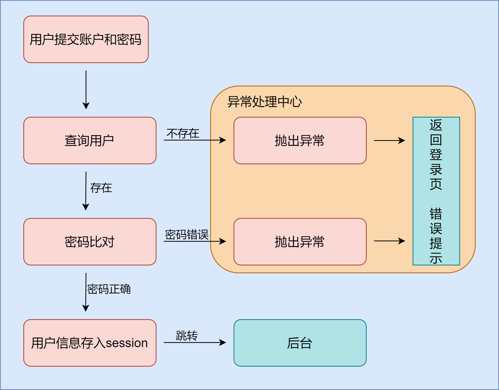

**代码：**

1.创建MD5加密工具类，存储的密码为MD5加密后的，所以密码比对时也用到该工具类；

2.创建自定义异常与异常处理中心配置异常处理——跳转回登录页，并在登录页加入`<p th:text="${exception}"></p>`来显示异常提示；

3.功能实现：根据账号获取数据并校验密码

AdminMapper.xml：

```xml
<!-- 根据账号查询用户 -->
<select id="selectAdminByAcct" resultType="com.lsl.crowd.entity.Admin" parameterType="java.lang.String">
  select *
  from t_admin where login_acct = #{loginAcct}
</select>
```

Admin、AdminService、AdminServiceImpl：

```java
// 根据账户查询用户
List<Admin> selectByLoginAcct(String loginAcct);
```

```java
// 根据账户查询用户
Admin selectByLoginAcct(String loginAcct,String userPswd);
```

```java
public Admin selectByLoginAcct(String loginAcct,String userPswd) {
    List<Admin> list = adminMapper.selectByLoginAcct(loginAcct);
    // 用户不存在
    if (list == null || list.size() == 0) {
        throw new LoginFailedException(CrowdConstant.MESSAGE_LOGIN_FAILED);
    }
    // 查到多个用户
    if (list.size() > 1 ){
        throw new RuntimeException(CrowdConstant.MESSAGE_SYSTEM_ERROR_LOGIN_NOT_UNIQUE);
    }
    // 用户唯一存在
    Admin admin = list.get(0);
    if (admin == null) {
        throw new RuntimeException(CrowdConstant.MESSAGE_LOGIN_FAILED);
    }
    String userPswdDB = admin.getUserPswd();
    String userPswdForm = CrowdUtil.md5(userPswd);
    System.out.println(userPswdForm);
    // 密码校验
    if (!Objects.equals(userPswdDB,userPswdForm)){
        throw new LoginFailedException(CrowdConstant.MESSAGE_LOGIN_FAILED);
    }
    return admin;
}
```

5.前端控制器方法处理：接收参数并调用校验方法

```java
@Controller
public class AdminLoginController {

    @Autowired
    AdminService adminService;

    @RequestMapping(value = "/admin/login", method = RequestMethod.POST)
    public String login(@RequestParam(value = "userPswd") String userPswd,
                        @RequestParam(value = "loginAcct" ) String loginAcct,
                        HttpServletRequest session
                        ){
        // 校验
        Admin loginAdmin = adminService.selectByLoginAcct(loginAcct, userPswd);
        session.setAttribute(CrowdConstant.ATTR_NAME_LOGIN_ADMIN,loginAdmin);
        return "redirect:/admin/page/main";
    }
    @RequestMapping(value = "/admin/page/main", method = RequestMethod.GET)
    public String mainPage(){
        return "admin-main";
    }
}
```

引入admin-main.html页面，thymeleaf的模板页面设置不成功，不去折腾简化页面了。

为什么登录成功后要重定向到后台页面？登录成功后转到后台页面，如果此时刷新会重新提交表单。

登录退出：

```java
@RequestMapping(value = "/admin/loginout")
public String loginout(HttpSession session){
    session.invalidate();
    // 重定向回登录页
    return "redirect:/";
}
/* 登录退出处理 end */
```


## 需求二：登录检测，控制资源访问

目标：后台管理系统的资源是需要登录后才能访问并进行操作的，所以需要登录检查来决定是否开放访问后台。

思路：SpringMVC的拦截器可以控制资源的放行，当访问公共资源时就放行，访问受保护的资源时就经过拦截器，检测到登录后再放行资源。

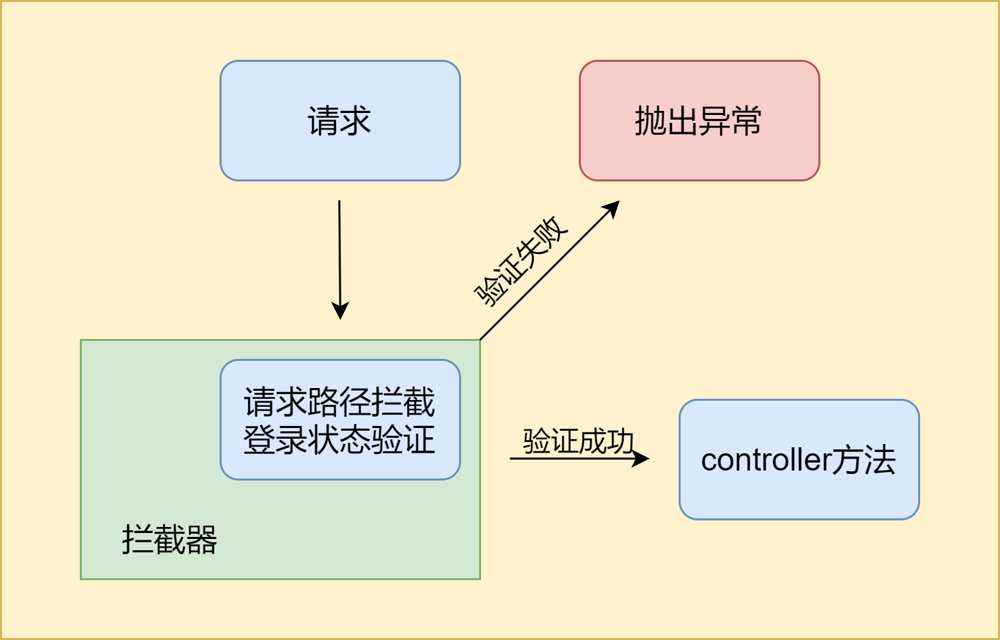

代码：

1.创建实现拦截器接口`HandlerInterceptor`的类，重写方法并设置登录验证规则。

```java
public class LoginInterceptor implements HandlerInterceptor {

    @Override
    // 在controller方法执行前（发起请求后）执行,返回false将拦截该请求，停止后续程序的执行
    public boolean preHandle(HttpServletRequest request, HttpServletResponse response, Object handler) throws Exception {
        // 获取session
        HttpSession session = request.getSession();
        // 从session域获取资源
        Admin admin = (Admin) session.getAttribute(CrowdConstant.ATTR_NAME_LOGIN_ADMIN);
        if (admin == null){
            throw new AccessForbiddenException(CrowdConstant.MESSAGE_ACCESS_FORBIDDEN);
        }
        // Admin不为空则已经登录，可以执行后续操作
        return true;
    }
}
```

2.注册拦截器进springmvc容器。

```xml
<!-- 注册拦截器，拦截并决定是否要对该路径进行处理，如果不处理则无法执行相关处理程序 -->
<mvc:interceptors>
    <mvc:interceptor>
        <!-- 拦截的路径 -->
        <mvc:mapping path="/**"/>
        <!-- 拦截的同时允许程序对这些路径进行处理 -->
        <mvc:exclude-mapping path="/admin/login"/>
        <mvc:exclude-mapping path="/"/>
        <mvc:exclude-mapping path="/admin/loginout"/>
        <!-- 声明拦截器 -->
        <bean class="com.lsl.crowd.mvc.interceptor.LoginInterceptor"/>
    </mvc:interceptor>
</mvc:interceptors>
```

## thymeleaf-使用模板简化页面

使用thymeleaf的都需要在页面的html标签处加上`xmlns:th="http://www.thymeleaf.org"`。

```html
<!-- 简单定义模板引用片段，模板文件_fragments.html -->
<head th:fragment="head">
    引用片段内容
</head>
<nav th:fragment="nav">
</nav>
<div th:fragment="sidebar">
</div>
```

```html
<!-- 引用替换方式一：把该标签替换为引用片段全部 -->
<head th:replace="_fragments :: head"></head>
<!-- 引用替换方式二：在该标签中插入引用片段的内容 -->    
<head th:insert="_fragments :: head"></head>
<!-- 引用替换方式三：和insert一样 --> 
<head th:include="_fragments :: head"></head>
```


## 需求三：用户维护功能

### 分页显示数据

目标：访问用户维护页面时将数据库中的用户数据取出在页面上显示。

思路：当点击链接时转到前端控制器方法来执行用户数据获取的方法并放入Model，再使用模板引擎将数据渲染出来。考虑到数据分页，所以访问数据时需要传入参数来对查询到的数据进行分页，确定页数和每页数据量；再者考虑到关键字查询，所以还需要有保存关键字的请求参数。

代码：数据分页需要使用到limit，这里使用pagehelper来实现数据分页，利用jQuery来生成分页导航栏。步骤如下：

1.分页插件pagehelper的注册：

```xml
<bean id="sqlSessionFactory" class="org.mybatis.spring.SqlSessionFactoryBean">
    <property name="dataSource" ref="dataSource"/>
    <property name="configLocation" value="classpath:mybatis/mybatis-config.xml"/>
    <!-- mapper.xml文件 -->
    <property name="mapperLocations" value="classpath:mybatis/mapper/*Mapper.xml"/>
    <!-- 分页插件的使用 -->
    <property name="plugins">
        <array>
            <bean class="com.github.pagehelper.PageHelper">
                <property name="properties">
                    <props>
                        <!-- 配置页码的合理化修正 在1~总页数之间修正页码 -->
                        <prop key="reasonable">true</prop>
                    </props>
                </property>
            </bean>
        </array>
    </property>
</bean>
```

2.dao-service，功能方法的实现：

```xml
<!-- 关键字查询操作 -->
<select id="selectAdminByKeyword" resultMap="BaseResultMap">
  select id,login_acct,user_pswd,user_name,email,create_time
  from t_admin
  <if test="keyword != null || keyword != ''">
    where
    login_acct like concat('%',#{keyword},'%') or
    user_name like concat('%',#{keyword},'%') or
    email like concat('%',#{keyword},'%')
  </if>
</select>
```

```java
// dao接口 SQL映射方法声明
List<Admin> selectAdminByKeyword(String keyword);
```

```java
// service接口 分页功能声明 
PageInfo<Admin> getPageInfo(String keyword, Integer pageNum, Integer pageSize);
```

```java
// service实现类 具体功能实现
public PageInfo<Admin> getPageInfo(String keyword, Integer pageNum, Integer pageSize) {
    /* 1.调用pagehelper的静态方法开启分页功能 */
    PageHelper.startPage(pageNum,pageSize);
    /* 2.执行查询 */
    List<Admin> adminList = adminMapper.selectAdminByKeyword(keyword);
    /* 3.封装到pageinfo对象 */
    return new PageInfo<>(adminList);
}
```

3.前端控制器处理请求，调用并返回数据至页面

```java
/* 分页显示全部用户数据 */
@RequestMapping(value = "/admin/users")
public String getPageInfo(@RequestParam(value = "keyword",defaultValue = "") String keyword,
                          @RequestParam(value = "pageNum",defaultValue = "1") Integer pageNum,
                          @RequestParam(value = "pageSize",defaultValue = "10") Integer pageSize,
                          ModelMap modelMap
){
    // 调用service方法获取
    PageInfo<Admin> pageInfo = adminService.getPageInfo(keyword, pageNum, pageSize);
    modelMap.addAttribute(CrowdConstant.ATTR_NAME_PAGE_INFO,pageInfo);
    // 是否没有查询到数据
    if (pageInfo.getList() == null || pageInfo.getList().size() == 0){
        modelMap.addAttribute("flag","true");
    }else {
        modelMap.addAttribute("flag","false");
    }
    modelMap.addAttribute("keyword",keyword);
    return "admin-page";
}
```

4.页面编写，使用thymeleaf渲染

```html
<tbody>
<!-- 没有查到数据时flag为true -->
<tr th:if="${flag}">
    <td colspan="6">抱歉！没有查询到任何数据！</td>
</tr>
<tr th:each="user : ${pageInfo.list}">
    <td th:text="${userStat.count}">1</td>
    <td><input type="checkbox"></td>
    <td th:text="${user.loginAcct}">Lorem</td>
    <td th:text="${user.userName}">ipsum</td>
    <td th:text="${user.email}">dolor</td>
    <td>
        <button type="button" class="btn btn-success btn-xs"><i class=" glyphicon glyphicon-check"></i></button>
        <a href="admin/to/edit/page.html?adminId=${admin.id}&pageNum=${requestScope.pageInfo.pageNum}&keyword=${param.keyword}" class="btn btn-primary btn-xs"><i class=" glyphicon glyphicon-pencil"></i></a>
        <a class="btn btn-danger btn-xs" href="admin/remove/${admin.id}/${requestScope.pageInfo.pageNum}/${param.keyword}.html"><i class=" glyphicon glyphicon-remove"></i></a>
    </td>
</tr>
</tbody>
```

5.分页导航条的设置-使用jquery.pagination.js和pagination.css，jquery.pagination.js需要jquery-2.1.1.min.js支持

先在页面导入css和js文件：

```jsp
<link rel="stylesheet" href="css/pagination.css" th:href="">
<script type="text/javascript" src="jquery/jquery.pagination.js" th:scr=""></script>
```

导航条所在位置加上这个，会由js生成：

```jsp
<div id="Pagination" class="pagination">

</div>
```

使用jquery.pagination.js的功能来生成导航条：

```javascript
<script type="text/javascript" th:inline="javascript">
    $(function(){
        // 调用专门的函数初始化分页导航条
        initPagination();
    })
    // 声明一个函数用于初始化 Pagination
    function initPagination() {
        // 获取分页数据中的总记录数
        var totalRecords = [[${pageInfo.total}]];
        // 声明 Pagination 设置属性的 JSON 对象
        var properties = {
            num_edge_entries: 3, // 边缘页数
            num_display_entries: 5, // 主体页数
            callback: pageSelectCallback, // 用户点击“翻页”按钮之后执行翻页操作的回调函数
            current_page: [[${pageInfo.pageNum-1}]], // 当前页，pageNum 从 1 开始，必须-1 后才可以赋值
            prev_text: "上一页",
            next_text: "下一页",
            items_per_page:[[${pageInfo.pageSize}]] // 每页显示多少
        };
        // 调用分页导航条对应的 jQuery 对象的 pagination()方法生成导航条pagination(totalRecord, properties);
        $("#Pagination").pagination(totalRecords,properties);
    }
    // 翻页过程中执行的回调函数
    // 点击“上一页”、“下一页”或“数字页码”都会触发翻页动作，从而导致当前函数被调用
    // pageIndex 是用户在页面上点击的页码数值
    function pageSelectCallback(pageIndex, jQuery) {
        // pageIndex 是当前页页码的索引，相对于 pageNum 来说，pageIndex 比 pageNum 小 1
        var pageNum = pageIndex + 1;
        // 执行页面跳转也就是实现“翻页” http://localhost:8083/crowd/admin/get/page.html
        window.location.href = "admin/users?pageNum="+pageNum+"&keyword="+[[${keyword}]];
        // 取消当前超链接的默认行为
        return false;
    }
</script>
```

最后还需要修改jquery.pagination.js文件，在文件末尾处注释掉回调函数：

```js
// 所有初始化完成，绘制链接
drawLinks();
// 回调函数
// opts.callback(current_page, this);
```

如果不注释则会发生死循环：

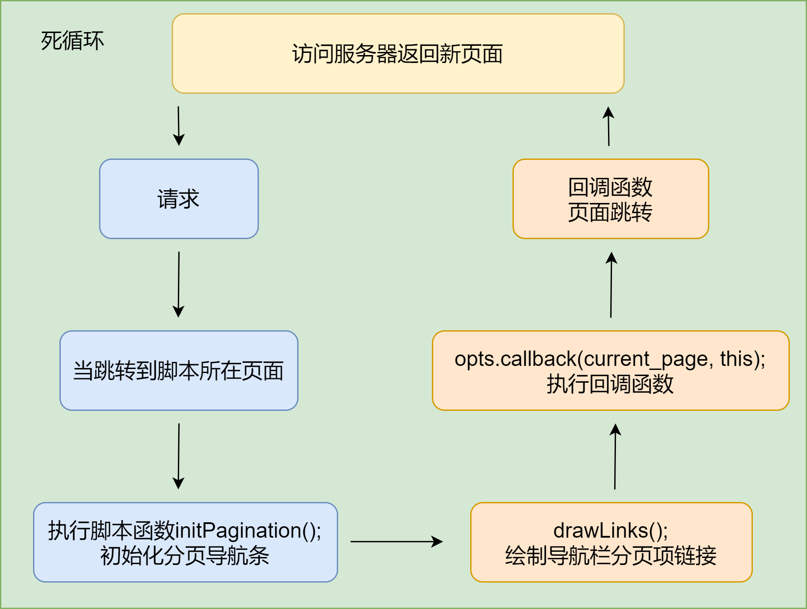

### 关键字查询

目标：输入关键字来查询包含关键字的用户数据。

思路：分页显示数据中已经考虑好关键字查询所需要传入的请求参数的接收，所以只需要在关键字查询处的表单设置一下表单项就可以了。

代码：input的name设置为keyword，提交按钮设置为submit。


### 单条删除

目标：单击删除按钮实现目标用户数据的删除。

思路：按钮替换成超链接，当点击超链接时把当前分页数据和关键字以及目标用户的id带上，然后交由到控制器方法进行处理，目标用户id用于删除操作，使用重定向来带上关键字、分页数据，重新回到原来的删除前的页面（此时删除的数据已经不会显示了，被删除了）。还要确认删除的是否是当前登陆的用户，不能把登陆的账户给删了。

（删除还有一种假删除，只在逻辑层面上删除，而不是物理删除，也就是为数据增加一个表示状态的数据，删除时候只改变这个状态量就可以了。）

代码：

```java
/* 单条数据的删除 */
@RequestMapping(value = "/admin/remove")
public String removeAdmin(@RequestParam(value = "id") Integer id,
                          @RequestParam(value = "keyword") String keyword,
                          @RequestParam(value = "pageNum") Integer pageNum,
                          HttpSession session
                          ){
    Admin loginAdmin = (Admin) session.getAttribute(CrowdConstant.ATTR_NAME_LOGIN_ADMIN);
    if (!loginAdmin.getId().equals(id)){
        adminService.removeAdmin(id);
    }else {
        throw new RuntimeException("不能删除当前登陆的用户");
    }
    return "redirect:/admin/users?pageNum="+pageNum+"&keyword="+keyword;
}
```

```html
<a class="btn btn-danger btn-xs" href="" th:href="@{admin/remove(pageNum=${pageNum},keyword=${keyword},id=${user.id})}"><i class=" glyphicon glyphicon-remove"></i></a>
```

### 新增用户

目标：新增用户数据并保存到数据库，要求账号不能重复，用户的密码要加密存储。

思路：

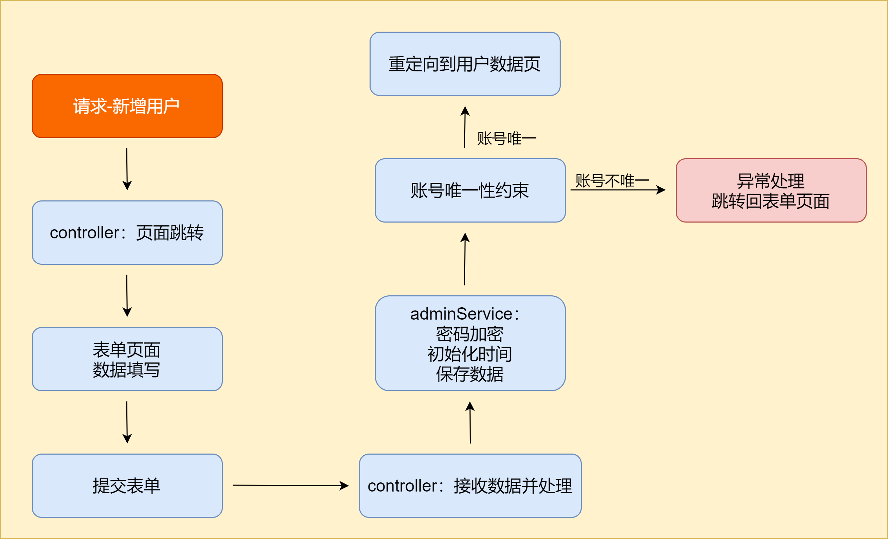

代码：

1.添加唯一性约束，就不用通过程序处理账号是否重复的问题了。

```mysql
-- 为表的账户字段添加唯一性约束
alter table `xxx` add unique (``);
```

2.前端页面的处理：超链接和表单。

3.前端控制器：

```java
/* 新增用户 start */
@RequestMapping(value = "/admin/add-page")
public String addPage(){
    return "admin-add";
}
@RequestMapping(value = "/admin/save")
public String saveAdmin(Admin admin){
    adminService.saveAdmin(admin);
    return "redirect:/admin/users?pageNum="+Integer.MAX_VALUE;
}
/* 新增用户 end */
```

4.唯一性异常的处理：自定义异常LoginAcctInUseException，SpringMVC注解方式处理异常：

```java
@ExceptionHandler(value = LoginAcctInUseException.class)
public ModelAndView resolveLoginFailedException(LoginAcctInUseException exception, HttpServletRequest request, HttpServletResponse response) throws IOException {
    String viewName = "admin-add";
    return commonResolve(viewName,exception,request,response);
}
```

### 更新用户信息

目标：修改用户信息，但不修改用户的密码和用户创建的时间。

思路：提交更新指定用户的请求时，请求路径带上用户的id、页面数据、关键字等参数，前端控制器处理完请求再跳转到用于更改信息的页面，跳转前已经把用户数据、页面数据、关键字等数据送入模型层，并在更改信息的页面显示用户的数据，当修改提交请求发起后保存数据，再根据面数据、关键字参数重定向回原页面。

代码：

1.处理链接

```html
<!-- admin-info.html -->
<a href="" th:href="@{admin/update(pageNum=${pageNum},keyword=${keyword},id=${user.id})}"  class="btn btn-primary btn-xs"><i class=" glyphicon glyphicon-pencil"></i></a>
```

```html
<!-- admin-update.html 表单处理-->
<form action="admin/commit" method="post" role="form">
    ...
</form>
```

2.SQL

```mysql
<update id="updateByPrimaryKeySelective" parameterType="com.lsl.crowd.entity.Admin">
  update t_admin
  <set>
    <if test="loginAcct != null">
      login_acct = #{loginAcct,jdbcType=VARCHAR},
    </if>
    <if test="userPswd != null">
      user_pswd = #{userPswd,jdbcType=CHAR},
    </if>
    <if test="userName != null">
      user_name = #{userName,jdbcType=VARCHAR},
    </if>
    <if test="email != null">
      email = #{email,jdbcType=VARCHAR},
    </if>
    <if test="createTime != null">
      create_time = #{createTime,jdbcType=CHAR},
    </if>
  </set>
  where id = #{id,jdbcType=INTEGER}
</update>
```

```java
public void update(Admin admin) {
    try {
        adminMapper.updateByPrimaryKeySelective(admin);
    }catch (Exception e){
        e.printStackTrace();
        if (e instanceof DuplicateKeyException){
            throw new LoginAcctInUseForUpdateException(CrowdConstant.MESSAGE_LOGIN_ACCT_IN_USE);
        }
    }
}
```

3.异常处理

```java
@ExceptionHandler(value = LoginAcctInUseForUpdateException.class)
public ModelAndView resolveLoginFailedException(LoginAcctInUseForUpdateException exception, HttpServletRequest request, HttpServletResponse response) throws IOException {
    String viewName = "system-error";
    return commonResolve(viewName,exception,request,response);
}
```

4.前端控制器

```java
/* 用户更新 start */
@RequestMapping(value = "/admin/update")
public String updatePage(@RequestParam(value = "id") Integer id,
                         @RequestParam(value = "keyword",defaultValue = "") String keyword,
                         @RequestParam(value = "pageNum",defaultValue = "1") Integer pageNum,
                         Model model){
    Admin admin = adminService.getAdmin(id);
    model.addAttribute("admin",admin);
    model.addAttribute("keyword",keyword);
    model.addAttribute("pageNum",pageNum);
    return "admin-update";
}
@RequestMapping(value = "/admin/commit")
public String updateAdmin(Admin admin,
                          @RequestParam(value = "keyword",defaultValue = "") String keyword,
                          @RequestParam(value = "pageNum",defaultValue = "1") Integer pageNum){
    System.out.println(admin);
    adminService.update(admin);
    return "redirect:/admin/users?pageNum="+pageNum+"&keyword="+keyword;
}
/* 用户更新 end */
```


## RBAC模型

权限控制：“权力”+“限制”，目标就是管理用户行为，保护系统功能。如何进行权力控制？创建资源、权限、角色、用户之间的关联来控制用户对资源的行为。

RBAC（Role-Based Access Control），即基于角色的权限控制。通过角色关联用户，角色关联权限的方式间接赋予用户权限。

RBAC模型可以分为：RBAC0、RBAC1、RBAC2、RBAC3 四种，RBAC0是最简单的，相当于底层逻辑，RBAC1、RBAC2、RBAC3都是以RBAC0为基础的升级。

- RBAC0模型又分为两种：
  1. 用户和角色是多对一关系，即：一个用户只充当一种角色，一种角色可以有多个用户担当。
  2. 用户和角色是多对多关系，即：一个用户可同时充当多种角色，一种角色可以有多个用户担当。
- RBAC1：相对于RBAC0模型，增加了子角色，引入了继承概念，即子角色可以继承父角色的所有权限。
- RBAC2：基于RBAC0模型，增加了对角色的一些限制：角色互斥、基数约束、先决条件角色等。
  1. **角色互斥：**同一用户不能分配到一组互斥角色集合中的多个角色，互斥角色是指权限互相制约的两个角色。案例：财务系统中一个用户不能同时被指派给会计角色和审计员角色。
  2. **基数约束：**一个角色被分配的用户数量受限，它指的是有多少用户能拥有这个角色。例如：一个角色专门为公司CEO创建的，那这个角色的数量是有限的。
  3. **先决条件角色：**指要想获得较高的权限，要首先拥有低一级的权限。例如：先有副总经理权限，才能有总经理权限。
  4. **运行时互斥：**例如，允许一个用户具有两个角色的成员资格，但在运行中不可同时激活这两个角色。
- RBAC3 ：称为统一模型，它包含了RBAC1和RBAC2，利用传递性，也把RBAC0包括在内，综合了RBAC0、RBAC1和RBAC2的所有特点。

## AJAX


## 需求四：角色维护功能（大量使用JavaScript）

```mysql
-- t_role 建表
CREATE TABLE `t_role` (
  `id` int(11) NOT NULL AUTO_INCREMENT,
  `name` char(255) DEFAULT NULL,
  PRIMARY KEY (`id`)
) ENGINE=InnoDB DEFAULT CHARSET=utf8
```

使用mybatis逆向工程生成实体类、接口、mysql映射文件等。

### 分页显示

目标：使用ajax请求实现角色信息页的数据显示。

思路：

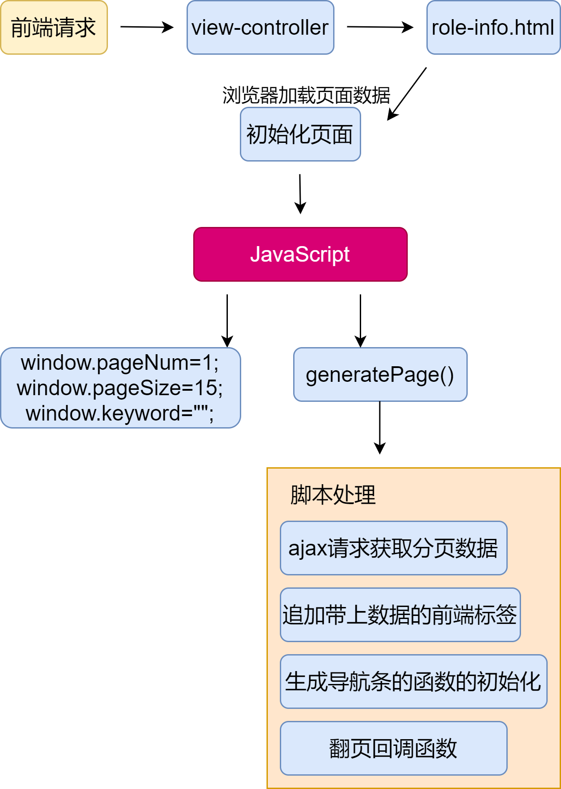

当跳转到指定页面时触发脚本的执行，初始化脚本数据后，通过ajax请求从后端获取到响应的json数据，当响应成功时再取出数据拼接上标签，最后嵌入到HTML页面中完成数据的显示。分页导航条生成函数参考pagination的初始化和回调函数。

代码：

1.后端ajax响应返回json数据

```mysql
<!-- 关键字查询操作 -->
<select id="selectRoleByKeyword" resultMap="BaseResultMap" parameterType="java.lang.String">
  select `id`,`name`
  from t_role
  where `name` like concat('%',#{keyword},'%')
</select>
```

```java
// serviceImpl
@Override
public PageInfo<Role> getPageInfo(String keyword, Integer pageNum, Integer pageSize) {
    /* 1.调用pagehelper的静态方法开启分页功能 */
    PageHelper.startPage(pageNum,pageSize);
    /* 2.执行查询 */
    List<Role> roleList = roleMapper.selectRoleByKeyword(keyword);
    /* 3.封装到pageinfo对象 */
    return new PageInfo<>(roleList);
}
```

```java
@ResponseBody
@RequestMapping(value = "/admin/roles")
public ResultEntity<PageInfo<Role>> getRolesInfo(@RequestParam(value = "keyword",defaultValue = "") String keyword,
                                       @RequestParam(value = "pageNum",defaultValue = "1") Integer pageNum,
                                       @RequestParam(value = "pageSize",defaultValue = "15") Integer pageSize,
                                       ModelMap modelMap){
    PageInfo<Role> pageInfo = roleService.getPageInfo(keyword, pageNum, pageSize);
    return ResultEntity.successWithData(pageInfo);
}
```

2.id设置

```html
<!-- 显示数据处 -->
<tbody id="rolePageBody"></tbody>
```

```html
<!-- 分页导航栏处 -->
<div id="Pagination" class="pagination"></div>
```

3.脚本

```JavaScript
<script type="text/javascript" th:inline="javascript">
   $(function (){
      window.pageNum=1;
      window.pageSize=15;
      window.keyword="";
   });
   // 执行my-roles.js中的生成函数
   generatePage();
   // 给查询按钮绑定单击函数
   $("#searchBtn").click(function (){
      // 更改关键词
      window.keyword = $("#keywordInput").val();
      // 再执行分页函数来刷新页面
      generatePage();
   });
</script>
```

my-roles.js：

```javascript
// 执行分页，生成分页效果，只要调用该函数就重新加载页面
function generatePage(){
    // 1.获取分页数据
    var pageInfo = getPageInfoRemote();
    // 2.填充表格
    fillTableBody(pageInfo);
}
// 访问服务器获取pageInfo数据
function getPageInfoRemote(){
    // ajax请求返回的json数据-特殊格式的字符串
    var  ajaxResult = $.ajax({
        "url":"admin/roles", // 请求目标资源地址
        "type":"post", // 请求方法
        "data":{"pageNum":window.pageNum,
        "pageSize":window.pageSize,
        "keyword":window.keyword
        },
        "async":false,
        "dataType":"json" // 如何对待服务器返回数据
    });
    console.log(ajaxResult);
    // 判断当前响应状态码是否为 200
    var statusCode = ajaxResult.status;
    // 如果当前响应状态码不是 200，说明发生了错误或其他意外情况，显示提示消息，让当前函数停止执行
    if(statusCode != 200) {
        layer.msg("失败！响应状态码="+statusCode+" 说明信息="+ajaxResult.statusText);
        return null;
    }
    // 如果响应状态码是 200，说明请求处理成功，获取 pageInfo
    var resultEntity = ajaxResult.responseJSON;
    // 从 resultEntity 中获取 result 属性
    var result = resultEntity.result;
    // 判断 result 是否成功
    if(result == "FAILED") {
        layer.msg(resultEntity.message);
        return null;
    }
    // 确认 result 为成功后获取 pageInfo
    var pageInfo = resultEntity.data;
    // 返回 pageInfo
    return pageInfo;
}
// 填充数据
function fillTableBody(pageInfo){

    // 清楚旧数据
    $("#rolePageBody").empty();
    $("#Pagination").empty();

    // 判断数据有效性
    if(pageInfo == null || pageInfo ==undefined || pageInfo.list == null || pageInfo.list.length == 0){
        $("#rolePageBody").append("<tr><td colspan='4'>抱歉，没有查询到您要搜索的数据！</td></tr>");
        return;
    }
    // 遍历填充pageInfo的数据进标签
    for (var i = 0; i < pageInfo.list.length; i++){
        var role = pageInfo.list[i];
        var roleId = role.id;
        var roleName = role.name;
        var numberTd = "<td>"+(i+1)+"</td>";
        var checkboxTd = "<td><input type='checkbox'></td>";
        var roleNameTd = "<td>"+ roleName +"</td>";

        var checkBtn = "<button type='button' class='btn btn-success btn-xs'><i class=' glyphicon glyphicon-check'></i></button>";
        var pencilBtn = "<button type='button' class='btn btn-primary btn-xs'><i class=' glyphicon glyphicon-pencil'></i></button>";
        var removeBtn = "<button type='button' class='btn btn-danger btn-xs'><i class=' glyphicon glyphicon-remove'></i></button>";

        var buttonTd = "<td>"+ checkBtn + " " + pencilBtn + " " + removeBtn +"</td>";

        var tr = "<tr>"+ numberTd + checkboxTd + roleNameTd+buttonTd + "</tr>";
        // 在id为rolePageBody的标签处追加tr的内容
        $("#rolePageBody").append(tr);
    }
    // 调用生成页码导航条的函数
    generateNavigator(pageInfo);
}
// 生成页码导航条，使用到jQuery、pagination
function generateNavigator(pageInfo){
    // 获取总记录数
    var totalRecord = pageInfo.total;
    // 获取相关属性声明
    var properties = {
        "num_edge_entries": 3, // 边缘页数
        "num_display_entries": 5, // 主体页数
        "callback": paginationCallBack, // 用户点击“翻页”按钮之后执行翻页操作的回调函数
        "items_per_page":pageInfo.pageSize, // 每页显示多少
        current_page: pageInfo.pageNum - 1, // 当前页，pageNum 从 1 开始，必须-1 后才可以赋值
        prev_text: "上一页",
        next_text: "下一页",
    };
    $("#Pagination").pagination(totalRecord,properties);
}
// 生成分页时的回调函数
function paginationCallBack(pageIndex,JQuery){
    // 修改window对象的pageNum属性
    window.pageNum = pageIndex + 1;
    // 调用分页函数，生成指定页的数据
    generatePage();
    // 取消超链接默认行为
    return false;
}
```


### 关键字搜索

目标：输入关键字来获取数据。

思路：

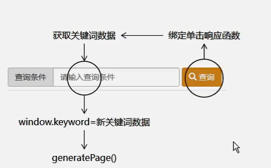

代码：

```javascript
$("#searchBtn").click(function (){
   // 更改关键词
   window.keyword = $("#keywordInput").val();
   // 再执行分页函数来刷新页面
   generatePage();
});
```

### 角色保存

目标：通过在打开的模态框中输入角色名称，执行对新角色的保存。

思路：

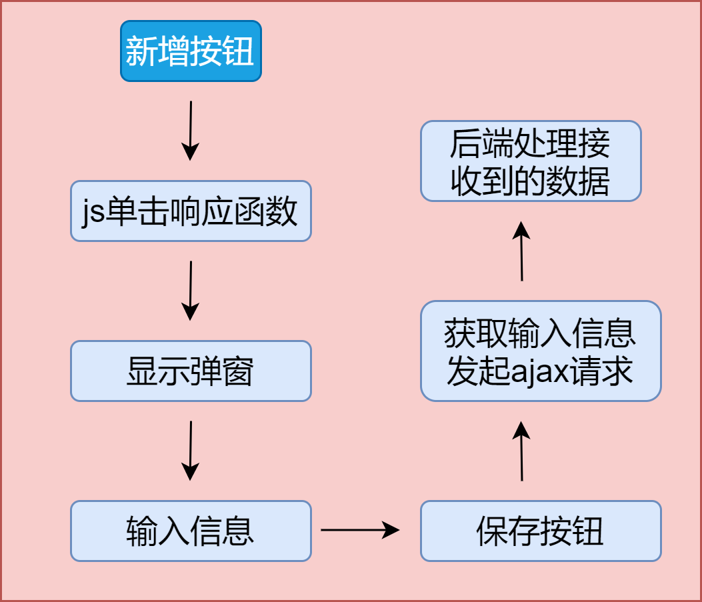

代码：

1.引入bootstrap的弹窗，弹窗默认被隐藏。

```html
<!-- 弹窗 -->
<div id="addModal" class="modal fade" tabindex="-1" role="dialog" th:fragment="addModel">
    <div class="modal-dialog" role="document">
        <div class="modal-content">
            <div class="modal-header">
                <button type="button" class="close" data-dismiss="modal" aria-label="Close">
                    <span aria-hidden="true">&times;</span>
                </button>
                <h4 class="modal-title">尚筹网系统弹窗：添加角色</h4>
            </div>
            <div class="modal-body">
                <form class="form-signin" role="form">
                    <div class="form-group has-success has-feedback">
                        <input type="text" name="roleName" class="form-control" id="inputSuccess4" placeholder="请输入角色名称" autofocus>
                    </div>
                </form>
            </div>
            <div class="modal-footer">
                <button id="saveRoleBtn" type="button" class="btn btn-primary"> 保 存
                </button>
            </div>
        </div>
    </div>
</div>
```

2.新增按钮绑定单击事件，弹出弹窗

```JavaScript
// 4.点击新增按钮打开模态框
$("#showAddModalBtn").click(function(){
   $("#addModal").modal("show");
});
```

3.弹窗的保存按钮绑定单击事件，用于向后端发送Ajax请求

```JavaScript
// 5.弹窗的单击响应
$("#saveRoleBtn").click(function(){
   // ①获取弹窗中输入的值
   var roleName = $("#addModal [name=roleName]").val();
   // ②发送Ajax请求
   $.ajax({
      "url": "role/save",
      "type":"post",
      "data": { "name": roleName},
      "dataType": "json",
      "success":function(response){
         var result = response.result;
         if(result == "SUCCESS") {
            layer.msg("success!");
            // 将页码定位到最后一页
            window.pageNum = 99999999;
            // 重新加载分页数据
            generatePage();
         }
         if(result == "FAILED") {
            layer.msg("操作失败！"+response.message);
         }
      },
      "error":function(response){
         layer.msg(response.status+" "+response.statusText);
      }
      });
   // 关闭模态框
   $("#addModal").modal("hide");
   // 清理模态框
   $("#addModal [name=roleName]").val("");
});
```

3.后端处理Ajax请求。

```java
// RoleServiceImpl
public void addRole(Role role) {
    roleMapper.insert(role);
}
```

```java
/* 新增角色保存 start */
@ResponseBody
@RequestMapping("/role/save")
public ResultEntity<String> saveRole(Role role) {
    roleService.addRole(role);
    return ResultEntity.successWithoutData();
}
/* 新增角色保存 edn */
```

### 更改角色名称

目标：更改角色的名称。

思路：

1.按钮单击事件：弹出更改窗口；

2.实现更改窗口的数据回显；

3.Ajax请求发送角色id和角色名称；

4.后端处理请求。

代码：

```JavaScript
// 6.单击响应函数：更新角色的
// $(".pencilBtn").click(function (){
//     alert("aaa");
// });
// 上面直接绑定class会在数据翻页后失效，使用jQuery的on()函数解决
// on(事件,要绑定,事件响应函数)
$("#rolePageBody").on("click",".pencilBtn",function (){
   // 打开弹窗
   $("#updateModal").modal("show");
   // 获取显示数据中当前行的角色名称
   var roleName = $(this).parent().prev().text();
   // 获取当前角色的id
   window.roleId = this.id;
   // 回显
   $("#updateModal [name=roleName]").val(roleName);
});
// 7.更新请求
$("#updateRoleBtn").click(function (){
   var roleName = $("#updateModal [name=roleName]").val();
   $.ajax({
      "url":"role/update",
      "type":"post",
      "data":{
         "id":window.roleId,
         "name":roleName
      },
      "dataType":"json",
      "success":function (response){
         var result = response.result;
         if(result == "SUCCESS") {
            layer.msg("操作成功!");
            // 重新加载分页数据
            generatePage();
         }
      },
      "error":function (response){
         layer.msg(response.status+" "+response.statusText);
      }
   });
   $("#updateModal").modal("hide");
});
```

```java
/* 角色更新 start */
@ResponseBody
@RequestMapping("/role/update")
public ResultEntity<String> updateRole(Role role) {
    roleService.updateRole(role);
    return ResultEntity.successWithoutData();
}
/* 角色更新 edn */
```

### 删除角色

目标：前端的“单条删除”和“批量删除”在后端合并为同一套操作。合并的依据是：单 条删除时 id 也放在数组中，后端完全根据 id 的数组进行删除。

思路：

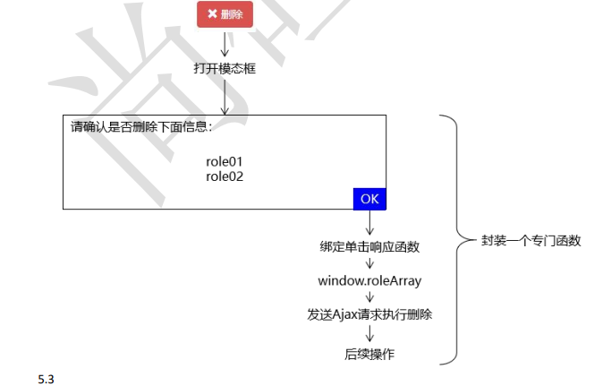

代码：


