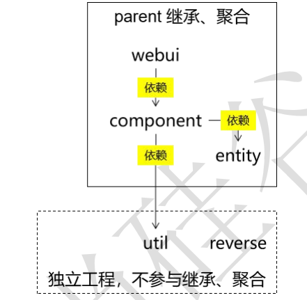

# 记一次项目完成过程

**学习目标：**

1. 从学习具体的技术到使用技术去解决业务功能需求的学习：分析需求，完成需求；
2. 体会从零到一的项目构造的完成流程；
3. 目标、代码、思路。（任务分解与分而治之，分析各个功能实现的完整流程、如何实现等）

# 11月13日：



## **1.构建项目骨架：**

项目架构如上，父工程为`atcrowdfundingweb`，再创建如上关系的三个子项目：

1. `atcrowdfunding01-admin-webui`：
2. `atcrowdfunding02-admin-component`：
3. `atcrowdfunding03-admin-entity`：

再创建以下两个独立的非继承、聚合关系的工程项目：

1. `atcrowdfunding04-common-util`：工具类的项目（用来单独设置成一个独立的jar文件，方便复用）；
2. `atcrowdfunding05-common-reverse`：mybatis的逆向工程；
3. 创建好后按架构图的依赖关系为各子项目加入依赖。

复习关于Maven的继承和聚合：

- 聚合：把项目工程的各个子模块聚合在一起来进行项目构建，使用到的是pom.xml里的module标签（构建过程为：从聚合模块运行`mvn clean install`：Maven会先解析聚合模块的POM、分析要构建的模块，并计算出一个反应堆构建顺序(Reactor Build Order)，然后根据这个顺序依次构建各个模块）；
- 继承：为了简化各个项目的依赖配置，把项目共同的依赖或插件抽取出来放于一个单独的Maven项目，再通过parent标签实现引用。

## 2.建表：

**创建数据库、表：**（复习SQL语句建表、三大范式）

```mysql
create database if not exists `project_crowd` character set utf8 collate utf8_general_ci;
```

```mysql
# 管理员数据库表
create table if not exists `t_admin`(
id int not null auto_increment,
login_acct varchar(255) not null comment '登录账号',
user_pswd char(32) not null comment '登录密码',
user_name varchar(255) not null comment '昵称',
email varchar(255) not null comment '邮件地址',
create_time char(19) comment '创建时间', 
primary key(id)
)engine=innodb default charset=utf8;
```

## 3.mybatis的逆向工程：

配置好以下后在idea左侧的Maven框的该项目插件中**执行mybatis-generator**，就会得到javaben和mapper接口、mapper映射文件。

`atcrowdfunding05-common-reverse`子项目的依赖和插件：

```xml
<dependencies>
  <!-- https://mvnrepository.com/artifact/org.mybatis/mybatis -->
  <dependency>
    <groupId>org.mybatis</groupId>
    <artifactId>mybatis</artifactId>
    <version>3.5.6</version>
  </dependency>
	<!-- 插件 -->
  <!-- https://mvnrepository.com/artifact/org.mybatis.generator/mybatis-generator-maven-plugin -->
  <dependency>
    <groupId>org.mybatis.generator</groupId>
    <artifactId>mybatis-generator-maven-plugin</artifactId>
    <version>1.4.0</version>
  </dependency>
</dependencies>
<!-- 控制 Maven 在构建过程中相关配置 -->
<build>
  <finalName>atcrowdfunding05-common-reverse</finalName>
  <!-- 构建过程中用到的插件 -->
  <plugins>
  <!-- 具体插件，逆向工程的操作是以构建过程中插件形式出现的 -->
    <plugin>
        <groupId>org.mybatis.generator</groupId>
        <artifactId>mybatis-generator-maven-plugin</artifactId>
        <version>1.4.0</version>
        <!-- 插件的依赖 -->
        <dependencies>
        <!-- 逆向工程的核心依赖 -->
          <!-- https://mvnrepository.com/artifact/org.mybatis.generator/mybatis-generator-core -->
          <dependency>
            <groupId>org.mybatis.generator</groupId>
            <artifactId>mybatis-generator-core</artifactId>
            <version>1.4.0</version>
          </dependency>
          <!-- 数据库连接池 -->
          <!-- https://mvnrepository.com/artifact/com.mchange/c3p0 -->
          <dependency>
            <groupId>com.mchange</groupId>
            <artifactId>c3p0</artifactId>
            <version>0.9.5.5</version>
          </dependency>
          <!-- MySQL 驱动 -->
          <!-- https://mvnrepository.com/artifact/mysql/mysql-connector-java -->
          <dependency>
            <groupId>mysql</groupId>
            <artifactId>mysql-connector-java</artifactId>
            <version>8.0.25</version>
          </dependency>
        </dependencies>
    </plugin>
  </plugins>
</build>
```

`atcrowdfunding05-common-reverse`子项目resources路径下的的mybatis-generator-maven-plugin的配置 **generatorConfig.xml：**

```xml
<?xml version="1.0" encoding="UTF-8"?>
<!DOCTYPE generatorConfiguration
        PUBLIC "-//mybatis.org//DTD MyBatis Generator Configuration 1.0//EN"
        "http://mybatis.org/dtd/mybatis-generator-config_1_0.dtd">
<generatorConfiguration>
    <!-- mybatis-generator:generate -->
    <context id="lslTables" targetRuntime="MyBatis3">
        <commentGenerator>
            <!-- 是否去除自动生成的注释 true:是;false:否 -->
            <property name="suppressAllComments" value="true" />
        </commentGenerator>
        <!--数据库连接的信息：驱动类、连接地址、用户名、密码 -->
        <jdbcConnection
                driverClass="com.mysql.cj.jdbc.Driver" connectionURL="jdbc:mysql://localhost:3306/project_crowd" userId="root" password="123456">
        </jdbcConnection>
        <!-- 默认 false，把 JDBC DECIMAL 和 NUMERIC 类型解析为 Integer，为 true 时把
        JDBC DECIMAL
        和 NUMERIC 类型解析为 java.math.BigDecimal -->
        <javaTypeResolver>
            <property name="forceBigDecimals" value="false" />
        </javaTypeResolver>
        <!-- targetProject:生成 Entity 类的路径 -->
        <javaModelGenerator targetProject=".\src\main\java"
                            targetPackage="com.lsl.crowd.entity">
            <!-- enableSubPackages:是否让 schema 作为包的后缀 -->
            <property name="enableSubPackages" value="false" />
            <!-- 从数据库返回的值被清理前后的空格 -->
            <property name="trimStrings" value="true" />
        </javaModelGenerator>
        <!-- targetProject:XxxMapper.xml 映射文件生成的路径 -->
        <sqlMapGenerator targetProject=".\src\main\java"
                         targetPackage="com.lsl.crowd.mapper">
            <!-- enableSubPackages:是否让 schema 作为包的后缀 -->
            <property name="enableSubPackages" value="false" />
        </sqlMapGenerator>
        <!-- targetPackage：Mapper 接口生成的位置 -->
        <javaClientGenerator type="XMLMAPPER"
                             targetProject=".\src\main\java"
                             targetPackage="com.lsl.crowd.mapper">
            <!-- enableSubPackages:是否让 schema 作为包的后缀 -->
            <property name="enableSubPackages" value="false" />
        </javaClientGenerator>
        <!-- 数据库表名字和我们的 entity 类对应的映射指定 -->
        <table tableName="t_admin" domainObjectName="Admin" />
    </context>
</generatorConfiguration>
```

## 4.父工程依赖管理

目前全都尽量向最新版本靠齐，不保证有没有兼容性问题，后续出现问题再排查。

```xml
<properties>
    <lsl.spring.version>5.3.11</lsl.spring.version>
    <lsl.spring.security.version>5.5.3</lsl.spring.security.version>
    <maven.compiler.source>8</maven.compiler.source>
    <maven.compiler.target>8</maven.compiler.target>
</properties>
<dependencies>
    <!-- spring的相关依赖 -->
    <!-- https://mvnrepository.com/artifact/org.springframework/spring-orm -->
    <dependency>
        <groupId>org.springframework</groupId>
        <artifactId>spring-orm</artifactId>
        <version>${lsl.spring.version}</version>
    </dependency>
    <!-- https://mvnrepository.com/artifact/org.springframework/spring-webmvc -->
    <dependency>
        <groupId>org.springframework</groupId>
        <artifactId>spring-webmvc</artifactId>
        <version>${lsl.spring.version}</version>
    </dependency>
    <!-- https://mvnrepository.com/artifact/org.springframework/spring-test -->
    <dependency>
        <groupId>org.springframework</groupId>
        <artifactId>spring-test</artifactId>
        <version>${lsl.spring.version}</version>
        <scope>test</scope>
    </dependency>
    <!-- https://mvnrepository.com/artifact/org.aspectj/aspectjweaver -->
    <dependency>
        <groupId>org.aspectj</groupId>
        <artifactId>aspectjweaver</artifactId>
        <version>1.9.7</version>
        <scope>runtime</scope>
    </dependency>
    <!-- 自动生成动态代理的依赖包 -->
    <!-- https://mvnrepository.com/artifact/cglib/cglib -->
    <dependency>
        <groupId>cglib</groupId>
        <artifactId>cglib</artifactId>
        <version>3.3.0</version>
    </dependency>
    <!-- 数据库驱动 -->
    <!-- https://mvnrepository.com/artifact/mysql/mysql-connector-java -->
    <dependency>
        <groupId>mysql</groupId>
        <artifactId>mysql-connector-java</artifactId>
        <version>8.0.21</version>
    </dependency>
    <!-- 数据库连接池的依赖 -->
    <!-- https://mvnrepository.com/artifact/com.alibaba/druid -->
    <dependency>
        <groupId>com.alibaba</groupId>
        <artifactId>druid</artifactId>
        <version>1.2.8</version>
    </dependency>
    <!-- MyBatis的依赖 -->
    <!-- https://mvnrepository.com/artifact/org.mybatis/mybatis -->
    <dependency>
        <groupId>org.mybatis</groupId>
        <artifactId>mybatis</artifactId>
        <version>3.5.6</version>
    </dependency>
    <!-- spring与mybatis整合 -->
    <!-- https://mvnrepository.com/artifact/org.mybatis/mybatis-spring -->
    <dependency>
        <groupId>org.mybatis</groupId>
        <artifactId>mybatis-spring</artifactId>
        <version>2.0.6</version>
    </dependency>
    <!-- mybatis分页插件 -->
    <!-- https://mvnrepository.com/artifact/com.github.pagehelper/pagehelper -->
    <dependency>
        <groupId>com.github.pagehelper</groupId>
        <artifactId>pagehelper</artifactId>
        <version>5.3.0</version>
    </dependency>
    <!-- 日志：log4j -->
    <!-- https://mvnrepository.com/artifact/org.slf4j/slf4j-api -->
    <dependency>
        <groupId>org.slf4j</groupId>
        <artifactId>slf4j-api</artifactId>
        <version>1.7.32</version>
    </dependency>
    <!-- https://mvnrepository.com/artifact/ch.qos.logback/logback-classic -->
    <dependency>
        <groupId>ch.qos.logback</groupId>
        <artifactId>logback-classic</artifactId>
        <version>1.2.7</version>
        <scope>test</scope>
    </dependency>
    <!-- 其他日志框架的中间转换包 -->
    <!-- https://mvnrepository.com/artifact/org.slf4j/jcl-over-slf4j -->
    <dependency>
        <groupId>org.slf4j</groupId>
        <artifactId>jcl-over-slf4j</artifactId>
        <version>1.7.32</version>
    </dependency>
    <!-- https://mvnrepository.com/artifact/org.slf4j/jul-to-slf4j -->
    <dependency>
        <groupId>org.slf4j</groupId>
        <artifactId>jul-to-slf4j</artifactId>
        <version>1.7.32</version>
    </dependency>
    <!-- spring进行json数据转换的依赖 -->
    <!-- https://mvnrepository.com/artifact/com.fasterxml.jackson.core/jackson-core -->
    <dependency>
        <groupId>com.fasterxml.jackson.core</groupId>
        <artifactId>jackson-core</artifactId>
        <version>2.13.0</version>
    </dependency>
    <!-- https://mvnrepository.com/artifact/com.fasterxml.jackson.core/jackson-databind -->
    <dependency>
        <groupId>com.fasterxml.jackson.core</groupId>
        <artifactId>jackson-databind</artifactId>
        <version>2.13.0</version>
    </dependency>
    <!-- JSTL标签库 -->
    <!-- https://mvnrepository.com/artifact/javax.servlet.jsp.jstl/jstl -->
    <dependency>
        <groupId>javax.servlet.jsp.jstl</groupId>
        <artifactId>jstl</artifactId>
        <version>1.2</version>
    </dependency>
    <!-- junit测试 -->
    <!-- https://mvnrepository.com/artifact/junit/junit -->
    <dependency>
        <groupId>junit</groupId>
        <artifactId>junit</artifactId>
        <version>4.13.2</version>
        <scope>test</scope>
    </dependency>
    <!-- servlet容器相关依赖 -->
    <!-- https://mvnrepository.com/artifact/javax.servlet/javax.servlet-api -->
    <dependency>
        <groupId>javax.servlet</groupId>
        <artifactId>javax.servlet-api</artifactId>
        <version>4.0.1</version>
        <scope>provided</scope>
    </dependency>
    <!-- jsp依赖 -->
    <!-- https://mvnrepository.com/artifact/javax.servlet.jsp/javax.servlet.jsp-api -->
    <dependency>
        <groupId>javax.servlet.jsp</groupId>
        <artifactId>javax.servlet.jsp-api</artifactId>
        <version>2.3.3</version>
        <scope>provided</scope>
    </dependency>
    <!-- https://mvnrepository.com/artifact/com.google.code.gson/gson -->
    <dependency>
        <groupId>com.google.code.gson</groupId>
        <artifactId>gson</artifactId>
        <version>2.8.9</version>
    </dependency>
	<!--  -->
    <!-- https://mvnrepository.com/artifact/org.springframework.security/spring-security-web -->
    <dependency>
        <groupId>org.springframework.security</groupId>
        <artifactId>spring-security-web</artifactId>
        <version>${lsl.spring.security.version}</version>
    </dependency>
    <!-- SpringSecurity 配置 -->
    <dependency>
    <groupId>org.springframework.security</groupId>
        <artifactId>spring-security-config</artifactId>
        <version>${lsl.spring.security.version}</version>
    </dependency>

    <!-- SpringSecurity 标签库 -->
    <dependency>
        <groupId>org.springframework.security</groupId>
        <artifactId>spring-security-taglibs</artifactId>
        <version>${lsl.spring.security.version}</version>
    </dependency>
</dependencies>
```

## 5.spring整合mybatis

目标：在使用mybatis的时候，直接通过工具类获取sqlSession明显会提高了耦合度，而且也不方便管理；所以通过mybatis与spring整合，把mybatis的所需要的数据源、sqlSession等都注册进IOC容器，等到要使用的时候就从IOC容器取出，从而使代码耦合度降低、维护起来更方便。（MyBatis-Spring 会帮助你将 MyBatis 代码无缝地整合到 Spring 中，整合spring时需要导入mybatis-spring的依赖包）

思路：理解配置项的含义，知道各个部分的作用后才能更好的进行整合和使用。

操作：

1. 依赖：因为父项目已经做好了依赖管理，所以需要在atcrowdfunding01-admin-webui只需引入相关的依赖（避免全部引入，版本号已经不用再设置），而atcrowdfunding01-admin-webui又依赖于atcrowdfunding02-admin-component，所以只需要将依赖设置放于atcrowdfunding02-admin-component就好，因为要进行单元测试，所以还需要在需要单独测试的地方引入junit、spring-test的依赖；

2. 引入通过mybatis逆向工程生成的Javabean、mapper文件和mapper接口；

3. mybatis-config.xml全局设置：配置要连接的数据库；

4. spring-persist-config.xml：使用spring，配置SqlSessionFactory、MapperScannerConfigurer；

   ```xml
   <!-- 配置SqlSessionFactory 整合mybatis -->
   <bean id="sqlSessionFactory" class="org.mybatis.spring.SqlSessionFactoryBean">
       <!-- 装配数据源 -->
       <property name="dataSource" ref="dataSource"/>
       <!-- 指定mybatis的全局配置文件 -->
       <property name="configLocation" value="classpath:mybatis-config.xml"/>
       <!-- 指定Mapper.xml配置文件的位置 -->
       <property name="mapperLocations" value="classpath:mybatis/mapper/*Mapper.xml"/>
   </bean>
   <!-- 配置MapperScannerConfigurer，扫描mapper接口所在包 -->
   <bean class="org.mybatis.spring.mapper.MapperScannerConfigurer">
       <property name="sqlSessionFactoryBeanName" value="sqlSessionFactory"/>
       <property name="basePackage" value="com.lsl.crowd.mapper"/>
   </bean>
   ```

5. 进行单元测试：

   ```java
   @RunWith(SpringJUnit4ClassRunner.class)
   @ContextConfiguration(locations = {"classpath:spring-persist-mybatis.xml"})
   public class CrowdTest {
   
       @Autowired
       private DataSource dataSource;
       @Autowired
       private AdminMapper adminMapper;
   
       @Test
       public void testInsert() {
           Admin admin = new Admin(null,"333","123456","lsl","1340952319@qq.co",null);
           int count = adminMapper.insert(admin);
           System.out.println("受到影响的参数：" + count);
       }
   
       @Test
       public void testConnection() throws SQLException {
           Connection connection = dataSource.getConnection();
           System.out.println(connection);
       }
   
   }
   ```

# 11月14日：

## 1.构建日志系统：

spring5版本，使用slf4j和logback不再需要排除spring默认的日志系统，直接导入包并在类路径设置好配置文件logback.xml即可。

```xml
<?xml version="1.0" encoding="UTF-8"?>
<configuration debug="true">
    <!-- 指定日志输出的位置 这里是输出到控制台 -->
    <appender name="STDOUT" class="ch.qos.logback.core.ConsoleAppender">
        <encoder>
            <!-- 日志输出的格式 -->
            <!-- 按照顺序分别是：时间、日志级别、线程名称、打印日志的类、日志主体
            内容、换行 -->
            <pattern>[%d{HH:mm:ss.SSS}] [%-5level] [%thread] [%logger]
                [%msg]%n</pattern>
        </encoder>
    </appender>
    <!-- 设置全局日志级别。日志级别按顺序分别是：DEBUG、INFO、WARN、ERROR -->
    <!-- 指定任何一个日志级别都只打印当前级别和后面级别的日志。 -->
    <root level="INFO">
        <!-- 指定打印日志的 appender，这里通过“STDOUT”引用了前面配置的 appender -->
        <appender-ref ref="STDOUT" />
    </root>
    <!-- 根据特殊需求指定局部日志级别 -->
    <logger name="com.lsl.crowd.mapper" level="DEBUG"/>
</configuration>
```

## 2.事务设置

目标：（从事务角度）一个事务方法中包含的多个数据库操作，要么一起提交、要么一起回滚。也就是说事务方法中的多个数据库操作，有任何一个失败，整个事务全部回滚。 从声明式角度：由 Spring 来全面接管数据库事务，用声明式代替编程式。

思路：使用spring的aop，前置通知（事务开启）、返回通知（事务提交）、异常通知（事务回滚）、后置通知（事务关闭）。

代码实现：spring-persist-tx.xml

```xml
<?xml version="1.0" encoding="UTF-8"?>
<beans xmlns="http://www.springframework.org/schema/beans"
       xmlns:xsi="http://www.w3.org/2001/XMLSchema-instance"
       xmlns:context="http://www.springframework.org/schema/context"
       xmlns:aop="http://www.springframework.org/schema/aop"
       xmlns:tx="http://www.springframework.org/schema/tx"
       xsi:schemaLocation="http://www.springframework.org/schema/beans
    http://www.springframework.org/schema/beans/spring-beans.xsd
    http://www.springframework.org/schema/context
    http://www.springframework.org/schema/context/spring-context.xsd
    http://www.springframework.org/schema/aop
    http://www.springframework.org/schema/aop/spring-aop.xsd
    http://www.springframework.org/schema/tx
    http://www.springframework.org/schema/tx/spring-tx.xsd">
    <!-- spring事务管理器的配置 -->
    <!-- 扫描软件包，使注解生效 -->
    <context:component-scan base-package="com.lsl.crowd.service"/>
    <!-- 配置事务管理器 -->
    <bean id="txManager" class="org.springframework.jdbc.datasource.DataSourceTransactionManager">
        <!-- 装配数据源，运行时就能从ioc容器拿到了 -->
        <property name="dataSource" ref="dataSource"/>
    </bean>
    <!-- 配置事务切面 -->
    <aop:config>
        <aop:pointcut id="txPointcut" expression="execution(* *..*ServiceImpl.*(..))"/>
        <!-- 将切点表达式和事务通知关联 -->
        <aop:advisor advice-ref="txAdvice" pointcut-ref="txPointcut"/>
    </aop:config>
    <!-- 配置事务通知 -->
    <tx:advice id="txAdvice" transaction-manager="txManager">
        <!-- 配置事务属性 -->
        <tx:attributes>
            <!-- 查询方法：配置只读属性，让数据库知道这是一个查询操作，能够进行一定优化 -->
            <tx:method name="get*" read-only="true"/>
            <tx:method name="find*" read-only="true"/>
            <tx:method name="query*" read-only="true"/>
            <tx:method name="count*" read-only="true"/>
            <!-- 增删改方法：配置事务传播行为、回滚异常 -->
            <!--propagation="REQUIRED" ：
            REQUIRED，默认值，表示当前方法必须工作在事务中，如果当前线程没有已经开启的事务则自己开启；如果有则使用已有的
            REQUIRES_NEW：建议使用的值，不管当前线程是否有事务，都要自己开事务并在自己的事务中执行，不会受到其他事务的影响
            -->
            <!--rollback-for：配置事务方法针对什么样的异常就回滚
            默认：运行时异常回滚
            建议：运行时异常、编译时异常都回滚
            -->
            <!-- tx:method是必须要配置的，如果某个方法没有配置对应的tx:method，则事务对这个方法不生效 -->
            <tx:method name="save*" propagation="REQUIRES_NEW" rollback-for="java.lang.Exception"/>
            <tx:method name="update*" propagation="REQUIRES_NEW" rollback-for="java.lang.Exception"/>
            <tx:method name="remove*" propagation="REQUIRES_NEW" rollback-for="java.lang.Exception"/>
            <tx:method name="batch*" propagation="REQUIRES_NEW" rollback-for="java.lang.Exception"/>
        </tx:attributes>
    </tx:advice>
</beans>
```

测试：

复习：spring事务、spring AOP


## 3.整合springmvc

Tomcat中加载spring容器、springmvc容器、监听器、过滤器、中央调度器；springmvc全局配置文件配置视图解析器、开启json驱动、解决驱动冲突问题。

复习内容：复习springmvc整合流程和各个整合操作的目的，复习springmvc的整个执行流程，复习springmvc各个组件的作用。


