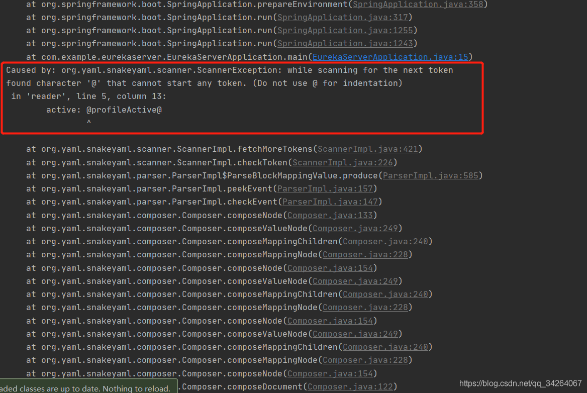

# 官方

GitHub：https://github.com/langhsu/mblog

使用的技术栈：

JDK8
MySQL
Spring-boot
Spring-data-jpa
Shiro
Lombok
Freemarker
Bootstrap
SeaJs


# 快速搭建流程

克隆仓库，然后用IDEA打开（maven、jdk8已经安装好）

1. application-dev.yml文件里配置数据库数据（url、用户名和密码）

   - 创建的数据库的编码设置为`utf8`/`utf8mb4`

2. 运行BootApplication遇到以下问题并解决完毕

3. 再次运行，搭建完成

   - 打开页面：http://localhost:8088

   - 后台地址：http://localhost:8088/admin/options

网站配置：

开关控制：`src/main/resources/application.yml`

```yml
site:
    controls:
        # 注册开关
        register: true
        # 注册开启邮箱验证
        register_email_validate: false
        # 发布文章开关
        post: true
        # 评论开关
        comment: true
```

# 遇到的问题

## 关于.yml文件



解决上图问题：

- 方法一：添加依赖（用这个成功）

```xml
<dependency>
            <groupId>org.yaml</groupId>
            <artifactId>snakeyaml</artifactId>
</dependency>
```

- 方法二：在构建项目的时候，build一下resource文件，也是在pom文件，**在build节点添加内容**，这个是项目里基本都需要加的

```xml
 <!--build节点增加内容-->
<resources>
	<resource>
	<directory>src/main/resources</directory>
	<!--开启过滤，用指定的参数替换directory下的文件中的参数-->
	<filtering>true</filtering>
	</resource>
</resources>
```

## 端口占用

端口占用：8080端口被ApplicationWebServer.exe占用（因为我装了Multisim），解决方法如下

使用cmd查看端口：（查看到占用的程序，就去任务管理器找到对应进程打开服务，然后停止服务即可）

- `netstat -ano`：查看端口
- `netstat -ano|findstr "8080"`：查看指定端口占用情况
- `tasklist|findstr "8388"`：根据进程ID查看进程

## 数据库编码错误

直接使用`create database mblog`创建mblog数据库出现问题，可能是因为没有指定数据库编码。解决方法：使用数据库可视化软件创建db_mblog数据库，数据库编码设置为`utf8`/`utf8mb4`。
